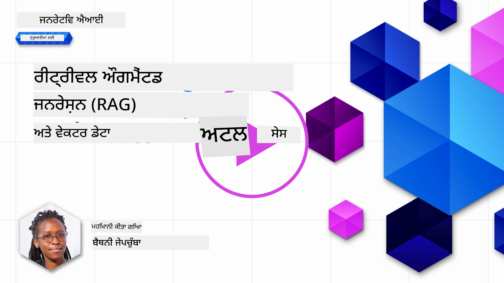
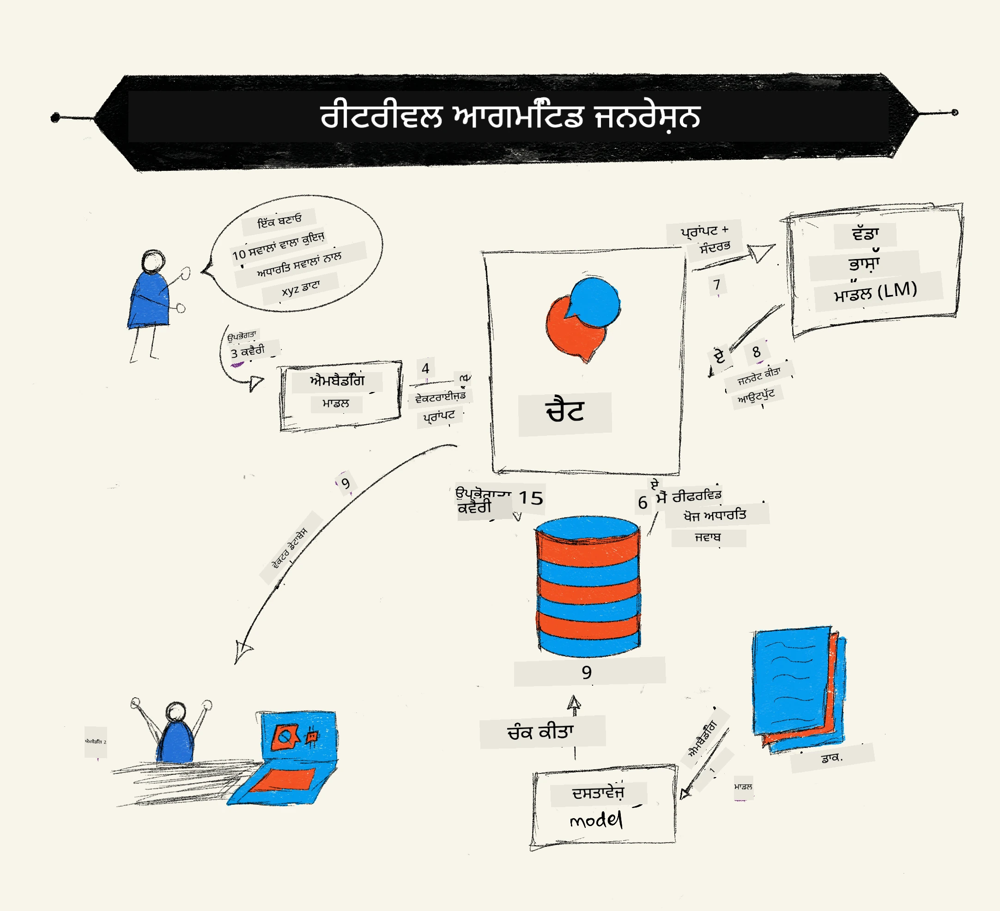
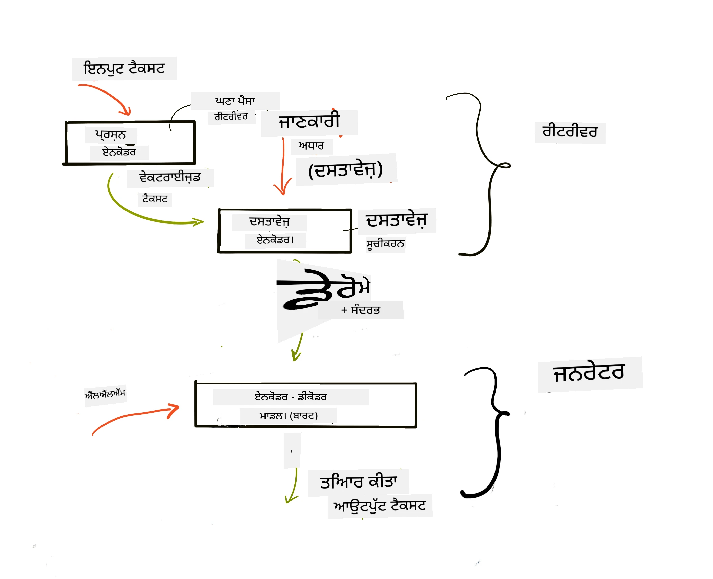
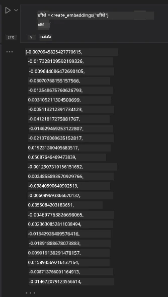

# ਰਿਟਰੀਵਲ ਆਗਮੇਂਟਡ ਜੈਨਰੇਸ਼ਨ (RAG) ਅਤੇ ਵੇਕਟਰ ਡੇਟਾਬੇਸ

[](https://youtu.be/4l8zhHUBeyI?si=BmvDmL1fnHtgQYkL)

ਸਰਚ ਐਪਲੀਕੇਸ਼ਨਜ਼ ਦੀ ਪਾਠ ਵਿੱਚ, ਅਸੀਂ ਥੋੜ੍ਹ੍ਹੀ ਜਿਹੀ ਜਾਣਕਾਰੀ ਲਈਖੀ ਕਿ ਕਿਵੇਂ ਆਪਣੇ ਡੇਟਾ ਨੂੰ ਵੱਡੇ ਭਾਸ਼ਾ ਮਾਡਲਾਂ (LLMs) ਵਿੱਚ ਸ਼ਾਮਿਲ ਕੀਤਾ ਜਾ ਸਕਦਾ ਹੈ। ਇਸ ਪਾਠ ਵਿੱਚ, ਅਸੀਂ ਆਪਣੇ ਡੇਟਾ ਨੂੰ ਆਪਣੇ LLM ਐਪਲੀਕੇਸ਼ਨ ਵਿੱਚ ਗ੍ਰਾਊਂਡ ਕਰਨ ਦੇ ਸੰਕਲਪ, ਇਸ ਪ੍ਰਕਿਰਿਆ ਦੀ ਕਾਰਜਵਿਧੀ ਅਤੇ ਡੇਟਾ ਸਟੋਰ ਕਰਨ ਦੇ ਤਰੀਕਿਆਂ ਬਾਰੇ ਵਧੇਰੇ ਜਾਣਕਾਰੀ ਲਵਾਂਗੇ, ਜਿਸ ਵਿੱਚ ਇੰਬੈਡਿੰਗਜ਼ ਅਤੇ ਟੈਕਸਟ ਦੋਹਾਂ ਸ਼ਾਮਿਲ ਹਨ।

> **ਵੀਡੀਓ ਜਲਦੀ ਆ ਰਿਹਾ ਹੈ**

## ਪਰਿਚਯ

ਇਸ ਪਾਠ ਵਿੱਚ ਅਸੀਂ ਹੇਠ ਲਿਖਿਆਂ ਗਿਆਨਵਿੰਦੂਆਂ ਕਵਰ ਕਰਾਂਗੇ:

- RAG ਦਾ ਪਰਿਚਯ, ਇਹ ਕੀ ਹੈ ਅਤੇ ਕਿਉਂ ਇਹ AI (ਕਲਾਤਮਕ ਬੁੱਧੀ) ਵਿੱਚ ਵਰਤਿਆ ਜਾਂਦਾ ਹੈ।

- ਵੇਕਟਰ ਡੇਟਾਬੇਸ ਕੀ ਹੁੰਦੇ ਹਨ ਇਸ ਨੂੰ ਸਮਝਣਾ ਅਤੇ ਆਪਣੇ ਐਪਲੀਕੇਸ਼ਨ ਲਈ ਇੱਕ ਬਣਾਉਣਾ।

- ਇੱਕ ਪ੍ਰਯੋਗਿਕ ਉਦਾਹਰਨ ਕਿ RAG ਨੂੰ ਕਿਵੇਂ ਇੱਕ ਐਪਲੀਕੇਸ਼ਨ ਵਿੱਚ ਸ਼ਾਮਿਲ ਕੀਤਾ ਜਾ ਸਕਦਾ ਹੈ।

## ਸਿੱਖਣ ਦੇ ਲਕੜ

ਇਸ ਪਾਠ ਨੂੰ ਪੂਰਾ ਕਰਨ ਤੋਂ ਬਾਅਦ, ਤੁਸੀਂ ਸਮਰੱਥ ਹੋਵੋਗੇ:

- ਡੇਟਾ ਰਿਟਰੀਵਲ ਅਤੇ ਪ੍ਰੋਸੈਸਿੰਗ ਵਿੱਚ RAG ਦੇ ਮਤਲਬ ਨੂੰ ਸਮਝਾਉਣਾ।

- RAG ਐਪਲੀਕੇਸ਼ਨ ਸੈਟਅੱਪ ਕਰਨਾ ਅਤੇ ਆਪਣੇ ਡੇਟਾ ਨੂੰ LLM ਨਾਲ ਗ੍ਰਾਊਂਡ ਕਰਨਾ

- LLM ਐਪਲੀਕੇਸ਼ਨਾਂ ਵਿੱਚ RAG ਅਤੇ ਵੇਕਟਰ ਡੇਟਾਬੇਸ ਦਾ ਪ੍ਰਭਾਵਸ਼ਾਲੀ ਇੰਟੀਗ੍ਰੇਸ਼ਨ।

## ਸਾਡਾ ਪਰਿਸਥਿਤੀ: ਆਪਣੇ LLMs ਨੂੰ ਆਪਣੇ ਡੇਟਾ ਨਾਲ ਬੇਹਤਰ ਕਰਨਾ

ਇਸ ਪਾਠ ਲਈ, ਅਸੀਂ ਸ਼ਿੱਖਣ ਸਟਾਰਟਅੱਪ ਵਿੱਚ ਆਪਣੇ ਨੋਟ ਸ਼ਾਮਿਲ ਕਰਨਾ ਚਾਹੁੰਦੇ ਹਾਂ, ਜੋ ਚੈਟਬੌਟ ਨੂੰ ਵੱਖ-ਵੱਖ ਵਿਸ਼ਿਆਂ ਬਾਰੇ ਵਧੇਰੇ ਜਾਣਕਾਰੀ ਪ੍ਰਦਾਨ ਕਰਨ ਦੀ ਆਗਿਆ ਦਿੰਦਾ ਹੈ। ਜਿਸ ਨਾਲ ਸਿੱਖਣ ਵਾਲੇ ਵਧੀਆ ਪੜ੍ਹ ਸਕਣਗੇ ਅਤੇ ਵੱਖ-ਵੱਖ ਵਿਸ਼ਿਆਂ ਨੂੰ ਸਮਝਣਗੇ, ਜਿਸ ਨਾਲ ਉਹਨਾਂ ਦੇ ਇਮਤਿਹਾਨਾਂ ਦੀ ਤਿਆਰੀ ਆਸਾਨ ਹੋਵੇਗੀ। ਆਪਣੇ ਦ੍ਰਿਸ਼ਟਾਂਤ ਬਣਾਉਣ ਲਈ, ਅਸੀਂ ਇਹ ਵਰਤਾਂਗੇ:

- `Azure OpenAI:` LLM ਜੋ ਅਸੀਂ ਆਪਣੇ ਚੈਟਬੌਟ ਬਣਾਉਣ ਲਈ ਵਰਤਾਂਗੇ

- `AI for beginners' ਲੈਸਨ 'ਨਿਊਰਲ ਨੈੱਟਵਰਕ': ਇਹ ਉਹ ਡੇਟਾ ਹੈ ਜਿਸ 'ਤੇ ਅਸੀਂ ਆਪਣੇ LLM ਨੂੰ ਗ੍ਰਾਊਂਡ ਕਰਾਂਗੇ

- `Azure AI Search` ਅਤੇ `Azure Cosmos DB:` ਵੇਕਟਰ ਡੇਟਾਬੇਸ ਜੋ ਸਾਡਾ ਡੇਟਾ ਸਟੋਰ ਕਰੇਗਾ ਅਤੇ ਸਰਚ ਇੰਡੈਕਸ ਬਣਾਏਗਾ

ਉਪਭੋਗਤਾ ਆਪਣੇ ਨੋਟਾਂ ਤੋਂ ਪ੍ਰੈਕਟਿਸ ਕਵਿਜ਼, ਰਿਵਿਜ਼ਨ ਫਲੈਸ਼ ਕਾਰਡ ਬਣਾ ਸਕਣਗੇ ਅਤੇ ਉਹਨੂੰ ਸੰਖੇਪ ਵਿੱਚ ਝਲਕਾਂ ਵਿੱਚ ਸਾਰ ਕਰ ਸਕਣਗੇ। ਸ਼ੁਰੂ ਕਰਨ ਲਈ, ਆਓ ਦੇਖੀਏ ਕਿ RAG ਕੀ ਹੈ ਅਤੇ ਇਹ ਕਿਵੇਂ ਕੰਮ ਕਰਦਾ ਹੈ:

## ਰਿਟਰੀਵਲ ਆਗਮੇਂਟਡ ਜੈਨਰੇਸ਼ਨ (RAG)

ਇੱਕ LLM ਸਸ਼ਕਤ ਚੈਟਬੌਟ ਉਪਭੋਗਤਾ ਦੇ ਪ੍ਰੌਂਪਟ ਨੂੰ ਪ੍ਰਕਿਰਿਆ ਕਰਕੇ ਜਵਾਬ ਤਿਆਰ ਕਰਦਾ ਹੈ। ਇਹ ਇੰਟਰਐਕਟਿਵ ਬਣਾਇਆ ਗਿਆ ਹੈ ਅਤੇ ਉਪਭੋਗਤਿਆਂ ਨਾਲ ਵੱਖ-ਵੱਖ ਵਿਸ਼ਿਆਂ 'ਤੇ ਸਮਵਾਦ ਕਰਦਾ ਹੈ। ਪਰ, ਇਸ ਦੇ ਜਵਾਬ ਉਹਨਾਂ ਸੰਦਰਭਾਂ ਤੱਕ ਸੀਮਿਤ ਹੁੰਦੇ ਹਨ ਜੋ ਪ੍ਰਦਾਨ ਕੀਤੇ ਜਾਂਦੇ ਹਨ ਅਤੇ ਇਸ ਦੇ ਬੁਨਿਆਦੀ ਟ੍ਰੇਨਿੰਗ ਡੇਟਾ ਤੱਕ। ਉਦਾਹਰਣ ਲਈ, GPT-4 ਦੀ ਗਿਆਨ ਸਮਾਪਤੀ ਸਿਤੰਬਰ 2021 ਹੈ, ਇਸਦਾ ਅਰਥ ਇਹ ਹੈ ਕਿ ਇਸਨੂੰ ਉਸ ਸਮੇਂ ਤੋਂ ਬਾਅਦ ਹੋਈਆਂ ਘਟਨਾਵਾਂ ਦਾ ਗਿਆਨ ਨਹੀਂ ਹੈ। ਇਸਦੇ ਨਾਲ-ਨਾਲ, LLMs ਨੂੰ ਟ੍ਰੇਨ ਕਰਨ ਲਈ ਵਰਤੇ ਡੇਟਾ ਵਿੱਚ ਨਿੱਜੀ ਨੋਟਾਂ ਜਾਂ ਕੰਪਨੀ ਦੇ ਉਤਪਾਦ ਮੈਨੂਅਲ ਵਰਗੀ ਗੁਪਤ ਜਾਣਕਾਰੀ ਸ਼ਾਮਿਲ ਨਹੀਂ ਹੁੰਦੀ।

### RAG (ਰਿਟਰੀਵਲ ਆਗਮੇਂਟਡ ਜੈਨਰੇਸ਼ਨ) ਕਿਵੇਂ ਕੰਮ ਕਰਦਾ ਹੈ



ਮੰਨੋ ਤੁਸੀਂ ਇੱਕ ਚੈਟਬੌਟ ਤਿਆਰ ਕਰਨਾ ਚਾਹੁੰਦੇ ਹੋ ਜੋ ਤੁਹਾਡੇ ਨੋਟਾਂ ਤੋਂ ਕਵਿਜ਼ ਬਣਾਏ, ਤਾਂ ਤੁਹਾਨੂੰ ਗਿਆਨ ਅਧਾਰ ਨਾਲ ਕਨੈਕਸ਼ਨ ਦੀ ਲੋੜ ਹੋਵੇਗੀ। ਇੱਥੇ RAG ਸਹਾਇਤਾ ਲਈ ਆਉਂਦਾ ਹੈ। RAG ਹੇਠਾਂ ਦਿੱਤੇ ਤਰੀਕੇ ਨਾਲ ਕੰਮ ਕਰਦਾ ਹੈ:

- **ਗਿਆਨ ਅਧਾਰ:** ਰਿਟਰੀਵਲ ਤੋਂ ਪਹਿਲਾਂ, ਇਹ ਦਸਤਾਵੇਜ਼ ਸੰਗ੍ਰਹਿਤ ਅਤੇ ਪਹਿਲਾਂ ਪ੍ਰੋਸੈਸ ਕੀਤੇ ਜਾਣੇ ਚਾਹੀਦੇ ਹਨ, ਆਮ ਤੌਰ 'ਤੇ ਵੱਡੇ ਦਸਤਾਵੇਜ਼ਾਂ ਨੂੰ ਛੋਟੇ-ਛੋਟੇ ਭਾਗਾਂ ਵਿੱਚ ਤੋੜ ਕੇ, ਉਹਨਾਂ ਨੂੰ ਟੈਕਸਟ ਇੰਬੈਡਿੰਗ ਵਿੱਚ ਬਦਲ ਕੇ ਡੇਟਾਬੇਸ ਵਿੱਚ ਸਟੋਰ ਕੀਤਾ ਜਾਂਦਾ ਹੈ।

- **ਉਪਭੋਗਤਾ ਦਾ ਪ੍ਰਸ਼ਨ:** ਉਪਭੋਗਤਾ ਇੱਕ ਸਵਾਲ ਪੁੱਛਦਾ ਹੈ

- **ਰਿਟਰੀਵਲ:** ਜਦੋਂ ਉਪਭੋਗਤਾ ਸਵਾਲ ਪੁੱਛਦਾ ਹੈ, ਇੰਬੈਡਿੰਗ ਮਾਡਲ ਸਾਡੇ ਗਿਆਨ ਅਧਾਰ ਵਿੱਚੋਂ ਸਬੰਧਤ ਜਾਣਕਾਰੀ ਤਲਾਸ਼ ਕਰਦਾ ਹੈ ਤਾਂ ਜੋ ਹੋਰ ਸੰਦਰਭ ਪ੍ਰਦਾਨ ਕੀਤਾ ਜਾ ਸਕੇ ਜੋ ਪ੍ਰੌਂਪਟ ਵਿੱਚ ਸ਼ਾਮਿਲ ਕੀਤਾ ਜਾਵੇ।

- **ਆਗਮੇਂਟਡ ਜੈਨਰੇਸ਼ਨ:** LLM ਆਪਣਾ ਜਵਾਬ ਉਸ ਡੇਟਾ ਦੇ ਆਧਾਰ 'ਤੇ ਵਧਾਉਂਦਾ ਹੈ ਜੋ ਸਿਰੀਆਬਧ ਕੀਤਾ ਗਿਆ ਹੈ। ਇਸ ਨਾਲ ਜਵਾਬ ਸਿਰਫ ਪ੍ਰੀ-ਟ੍ਰੇਨਡ ਡੇਟਾ ਉੱਤੇ ਹੀ ਨਹੀਂ, ਬਲਕਿ ਸ਼ਾਮਿਲ ਕੀਤੇ ਗਏ ਸੰਦਰਭ ਤੋਂ ਮਿਲੀ ਜਾਣਕਾਰੀ ਤੋਂ ਵੀ ਹੁੰਦਾ ਹੈ। ਪ੍ਰਾਪਤ ਡੇਟਾ ਨੂੰ LLM ਦੇ ਜਵਾਬਾਂ ਨੂੰ ਵਧਾਉਣ ਲਈ ਵਰਤਿਆ ਜਾਂਦਾ ਹੈ। ਫਿਰ LLM ਉਪਭੋਗਤਾ ਦੇ ਸਵਾਲ ਦਾ ਜਵਾਬ ਦਿੰਦਾ ਹੈ।



RAG ਲਈ ਆਰਕੀਟੈਕਚਰ ਟ੍ਰਾਂਸਫਾਰਮਰ ਰੂਪ ਵਿੱਚ ਲਾਗੂ ਕੀਤੀ ਜਾਂਦੀ ਹੈ ਜਿਸ ਵਿੱਚ ਦੋ ਹਿੱਸੇ ਹੁੰਦੇ ਹਨ: ਏਨਕੋਡਰ ਅਤੇ ਡੀਕੋਡਰ। ਉਦਾਹਰਣ ਵਜੋਂ, ਜਦੋਂ ਉਪਭੋਗਤਾ ਸਵਾਲ ਪੁੱਛਦਾ ਹੈ, ਤਾਂ ਇਨਪੁਟ ਟੈਕਸਟ ਨੂੰ ਉਹ ਅਰਥ ਪਰਿਭਾਸ਼ਿਤ ਕਰਨ ਵਾਲੇ ਵੇਕਟਰਾਂ ਵਿੱਚ 'ਏਨਕੋਡ' ਕੀਤਾ ਜਾਂਦਾ ਹੈ ਅਤੇ ਫਿਰ ਵੇਕਟਰ 'ਡੀਕੋਡ' ਕਰਕੇ ਸਾਡੇ ਦਸਤਾਵੇਜ਼ ਇੰਡੈਕਸ ਵਿੱਚ ਜਾਂਦਾ ਹੈ ਅਤੇ ਉਪਭੋਗਤਾ ਦੇ ਪ੍ਰਸ਼ਨ ਆਧਾਰਿਤ ਨਵਾਂ ਟੈਕਸਟ ਪੈਦਾ ਕਰਦਾ ਹੈ। LLM ਦੋਹਾਂ ਏਨਕੋਡਰ-ਡੀਕੋਡਰ ਮਾਡਲ ਨੂੰ ਵਰਤਦਾ ਹੈ ਤਾਂ ਜੋ ਨਤੀਜਾ ਤਿਆਰ ਕੀਤਾ ਜਾ ਸਕੇ।

RAG ਲਾਗੂ ਕਰਨ ਸਮੇਂ ਦੋ ਤਰੀਕੇ ਹਨ ਜਿਵੇਂ ਕਿ ਪ੍ਰਸਤਾਵਿਤ ਪੇਪਰ: [ਕਿਸ਼ਤੀ ਸਮਰਥਤ ਉਤਪਾਦਨ ਗਿਆਨ ਸੰਬੰਧੀ NLP ਟਾਸਕਾਂ ਲਈ](https://arxiv.org/pdf/2005.11401.pdf?WT.mc_id=academic-105485-koreyst) ਵਿੱਚ ਦੱਸਿਆ ਗਿਆ ਹੈ:

- **_RAG-Sequence_** ਪ੍ਰਾਪਤ ਦਸਤਾਵੇਜ਼ਾਂ ਦੀ ਵਰਤੋਂ ਕਰਕੇ ਉਪਭੋਗਤਾ ਦੇ ਪ੍ਰਸ਼ਨ ਲਈ ਸਭ ਤੋਂ ਵਧੀਆ ਸਮਭਾਵਿਤ ਜਵਾਬ ਦੀ ਭਵਿੱਖਵਾਨੀ ਕਰਨਾ

- **RAG-Token** ਦਸਤਾਵੇਜ਼ਾਂ ਦੀ ਵਰਤੋਂ ਕਰਕੇ ਅਗਲਾ ਟੋਕਨ ਬਣਾਉਣਾ, ਫਿਰ ਉਨ੍ਹਾਂ ਨੂੰ ਰਿਟਰੀਵ ਕਰਕੇ ਉਪਭੋਗਤਾ ਦੇ ਸਵਾਲ ਦਾ ਜਵਾਬ ਦੇਣਾ

### ਤੁਸੀਂ ਕਿਉਂ RAG ਵਰਤੋਂਗੇ?

- **ਜਾਣਕਾਰੀ ਦੀ ਭਰਪੂਰੀ:** ਯਕੀਨੀ ਬਣਾਉਂਦਾ ਹੈ ਕਿ ਟੈਕਸਟ ਜਵਾਬ ਅਪ-ਟੂ-ਡੇਟ ਅਤੇ ਸਮਕਾਲੀ ਹਨ। ਇਸ ਲਈ, ਇਹ ਖੇਤਰ-ਨਿਰਧਾਰਿਤ ਟਾਸਕਾਂ 'ਤੇ ਪ੍ਰਦਰਸ਼ਨ ਨੂੰ ਸੁਧਾਰਦਾ ਹੈ ਕਿਉਂਕਿ ਇਹ ਅੰਦਰੂਨੀ ਗਿਆਨ ਅਧਾਰ ਤੱਕ ਪਹੁੰਚ ਸਧਾਰਦਾ ਹੈ।

- **ਜਾਲਸਾਜ਼ੀ ਘਟਾਉਂਦਾ ਹੈ**, ਕਿਉਂਕਿ ਇਹ ਗਿਆਨ ਅਧਾਰ ਵਿੱਚ ਮੌਜੂਦ **ਪੱਕੇ ਡੇਟਾ** ਦੀ ਵਰਤੋਂ ਕਰਕੇ ਉਪਭੋਗਤਾ ਦੇ ਸਵਾਲਾਂ ਨੂੰ ਸੰਦਰਭ ਦਿੰਦਾ ਹੈ।

- ਇਹ **ਲਾਗਤ ਵਿੱਚ ਕਿਫਾਇਤੀ ਹੈ** ਕਿਉਂਕਿ ਇਹ LLM ਨੂੰ ਫਾਈਨ-ਟਿਊਨ ਕਰਨ ਨਾਲੋਂ ਸਸਤੇ ਪੈਂਦੇ ਹਨ

## ਗਿਆਨ ਅਧਾਰ ਬਣਾਉਣਾ

ਸਾਡਾ ਐਪਲੀਕੇਸ਼ਨ ਸਾਡੇ ਨਿੱਜੀ ਡੇਟਾ 'ਤੇ ਆਧਾਰਿਤ ਹੈ, ਯਾ ਐਆਈ ਫਾਰ ਬਿਗਿਨਰਜ਼ ਕਰਿਕੁਲਮ ਦੇ ਨਿਊਰਲ ਨੈੱਟਵਰਕ ਪਾਠ।

### ਵੇਕਟਰ ਡੇਟਾਬੇਸ

ਇੱਕ ਵੇਕਟਰ ਡੇਟਾਬੇਸ, ਪਰੰਪਰਾਗਤ ਡੇਟਾਬੇਸਾਂ ਦੇ ਉਲਟ, ਇੱਕ ਵਿਸ਼ੇਸ਼ਤ ਡੇਟਾਬੇਸ ਹੁੰਦਾ ਹੈ ਜੋ ਇੰਬੈਡ ਕੀਤੇ ਵੇਕਟਰਾਂ ਨੂੰ ਸਟੋਰ, ਪ੍ਰਬੰਧਿਤ ਅਤੇ ਖੋਜਣ ਲਈ ਬਣਾਇਆ ਜਾਂਦਾ ਹੈ। ਇਹ ਦਸਤਾਵੇਜ਼ਾਂ ਦੀ ਅੰਕੜਾਤਮਕ ਪ੍ਰਤੀਨਿਧੀ ਰੱਖਦਾ ਹੈ। ਡੇਟਾ ਨੂੰ ਅੰਕੜਾਤਮਕ ਇੰਬੈਡਿੰਗਜ਼ ਵਿੱਚ ਤੋੜਨਾ ਸਾਡੇ AI ਸਿਸਟਮ ਲਈ ਡੇਟਾ ਨੂੰ ਸਮਝਣਾ ਅਤੇ ਪ੍ਰਕਿਰਿਆ ਕਰਨਾ ਆਸਾਨ ਬਣਾਉਂਦਾ ਹੈ।

ਅਸੀਂ ਆਪਣੇ ਇੰਬੈਡਿੰਗਜ਼ ਨੂੰ ਵੇਕਟਰ ਡੇਟਾਬੇਸਾਂ ਵਿੱਚ ਸਟੋਰ ਕਰਦੇ ਹਾਂ ਕਿਉਂਕਿ LLMs ਕੋਲ ਇਨਪੁਟ ਵਜੋਂ ਕਬੂਲ ਕੀਤੇ ਟੋکنਾਂ ਦੀ ਇੱਕ ਸੀਮਾ ਹੁੰਦੀ ਹੈ। ਤੁਸੀਂ ਸਾਰੇ ਇੰਬੈਡਿੰਗਜ਼ ਨੂੰ ਵਧੇਰੇ LLM ਵਿਚ ਨਹੀਂ ਦੇ ਸਕਦੇ, ਇਸ ਲਈ ਅਸੀਂ ਉਹਨਾਂ ਨੂੰ ਚੰਕਾਂ ਵਿੱਚ ਤੋੜਨਾ ਪਵੇਗਾ ਤੇ ਜਦੋਂ ਉਪਭੋਗਤਾ ਪ੍ਰਸ਼ਨ ਪੁੱਛਦਾ ਹੈ, ਤਾਂ ਸਭ ਤੋਂ ਜ਼ਿਆਦਾ ਸਬੰਧਤ ਚੰਕ ਰਿਟਰੀਵ ਕੀਤੇ ਜਾਂਦੇ ਹਨ। ਚੰਕਿੰਗ ਨਾਲ ਟੋਕੇਨਾਂ ਦੀ ਗਿਣਤੀ ਵਿੱਚ ਘਟਾਅ ਕਿਫਾਇਤੀ ਬਣਾਉਂਦਾ ਹੈ।

ਕੁਝ ਪ੍ਰਸਿੱਧ ਵੇਕਟਰ ਡੇਟਾਬੇਸਾਂ ਵਿੱਚ Azure Cosmos DB, Clarifyai, Pinecone, Chromadb, ScaNN, Qdrant ਅਤੇ DeepLake ਸ਼ਾਮਿਲ ਹਨ। ਤੁਸੀਂ ਨਿਮਨਲਿਖਤ ਕਮਾਂਡ ਨਾਲ Azure CLI ਦੀ ਵਰਤੋਂ ਕਰ ਕੇ ਇੱਕ Azure Cosmos DB ਮਾਡਲ ਬਣਾ ਸਕਦੇ ਹੋ:

```bash
az login
az group create -n <resource-group-name> -l <location>
az cosmosdb create -n <cosmos-db-name> -r <resource-group-name>
az cosmosdb list-keys -n <cosmos-db-name> -g <resource-group-name>
```

### ਟੈਕਸਟ ਤੋਂ ਇੰਬੈਡਿੰਗ ਤੱਕ

ਆਪਣਾ ਡੇਟਾ ਸਟੋਰ ਕਰਨ ਤੋਂ ਪਹਿਲਾਂ, ਸਾਨੂੰ ਇਸਨੂੰ ਵੇਕਟਰ ਇੰਬੈਡਿੰਗਜ਼ ਵਿੱਚ ਬਦਲਣਾ ਪਵੇਗਾ। ਜੇ ਤੁਸੀਂ ਵੱਡੇ ਦਸਤਾਵੇਜ਼ ਜਾਂ ਲੰਮਾ ਟੈਕਸਟ ਵਰਤ ਰਹੇ ਹੋ, ਤਾਂ ਤੁਸੀਂ ਉਮੀਦ ਕੀਤੇ ਗਏ ਪ੍ਰਸ਼ਨਾਂ ਦੇ ਆਧਾਰ 'ਤੇ ਉਹਨਾਂ ਨੂੰ ਚੰਕ ਕਰ ਸਕਦੇ ਹੋ। ਚੰਕਿੰਗ ਵਾਕਾਂਸ਼ (sentence) ਜਾਂ ਪੈਰਾਗ੍ਰਾਫ ਪੱਧਰ 'ਤੇ ਹੋ ਸਕਦੀ ਹੈ। ਕਿਉਂਕਿ ਚੰਕਿੰਗ ਦੇਸ਼ ਅਤੇ ਸੰਦਰਭ ਨੂੰ ਸ਼ਬਦਾਂ ਦੇ ਆਲੇ-ਦੁਆਲੇ ਦਾਖਲ ਕਰਦੀ ਹੈ, ਤੁਸੀਂ ਚੰਕ ਵਿੱਚ ਕੁਝ ਹੋਰ ਸੰਦਰਭ ਸ਼ਾਮਿਲ ਕਰ ਸਕਦੇ ਹੋ, ਉਦਾਹਰਨ ਲਈ, ਦਸਤਾਵੇਜ਼ ਦਾ ਸਿਰਲੇਖ ਜੁੜਨਾ ਜਾਂ ਚੰਕ ਤੋਂ ਪਹਿਲਾਂ ਜਾਂ ਬਾਅਦ ਕੁਝ ਟੈਕਸਟ ਸ਼ਾਮਿਲ ਕਰਨਾ। ਡੇਟੇ ਨੂੰ ਇਸ ਤਰ੍ਹਾਂ ਚੰਕ ਕੀਤਾ ਜਾ ਸਕਦਾ ਹੈ:

```python
def split_text(text, max_length, min_length):
    words = text.split()
    chunks = []
    current_chunk = []

    for word in words:
        current_chunk.append(word)
        if len(' '.join(current_chunk)) < max_length and len(' '.join(current_chunk)) > min_length:
            chunks.append(' '.join(current_chunk))
            current_chunk = []

    # ਜੇ ਆਖਰੀ ਟੁਕੜਾ ਘੱਟੋ-ਘੱਟ ਲੰਬਾਈ ਤੱਕ ਨਹੀਂ ਪੁੱਜਿਆ, ਤਾਂ ਵੀ ਇਸ ਨੂੰ ਸ਼ਾਮਲ ਕਰੋ
    if current_chunk:
        chunks.append(' '.join(current_chunk))

    return chunks
```

ਇੱਕ ਵਾਰੀ ਚੰਕ ਕਰਨ ਤੋਂ ਬਾਅਦ, ਅਸੀਂ ਵੱਖ-ਵੱਖ ਇੰਬੈਡਿੰਗ ਮਾਡਲਾਂ ਦੀ ਵਰਤੋਂ ਕਰ ਤਕਡੀ ਟੈਕਸਟ ਨੂੰ ਇੰਬੈਡ ਕਰ ਸਕਦੇ ਹਾਂ। ਕੁਝ ਮਾਡਲ ਜਿਵੇਂ: word2vec, OpenAI ਦਾ ada-002, Azure ਕੰਪਿਊਟਰ ਵੀਜ਼ਨ ਅਤੇ ਹੋਰ ਬਹੁਤ ਸਾਰੇ ਹਨ। ਮਾਡਲ ਚੁਣਨਾ ਇਸ ਗੱਲ 'ਤੇ ਨਿਰਭਰ ਕਰਦਾ ਹੈ ਕਿ ਤੁਸੀਂ ਕਿਹੜੀਆਂ ਭਾਸ਼ਾਵਾਂ ਵਰਤ ਰਹੇ ਹੋ, ਸੰਕੋਚਿਤ ਸਮੱਗਰੀ (ਟੈਕਸਟ/ਚਿੱਤਰ/ਆਡੀਓ) ਕਿਸ ਕਿਸਮ ਦੀ ਹੈ, ਇਨਪੁੱਟ ਦਾ ਆਕਾਰ ਅਤੇ ਇੰਬੈਡਿੰਗ ਆਉਟਪੁੱਟ ਦੀ ਲੰਬਾਈ।

OpenAI ਦੇ `text-embedding-ada-002` ਮਾਡਲ ਨੂੰ ਵਰਤ ਕੇ ਇੰਬੈਡ ਕੀਤਾ ਗਿਆ ਟੈਕਸਟ ਦਾ ਇੱਕ ਉਦਾਹਰਨ ਹੈ:


## ਰਿਟਰੀਵਲ ਅਤੇ ਵੇਕਟਰ ਖੋਜ

ਜਦੋਂ ਉਪਭੋਗਤਾ ਸਵਾਲ ਪੁੱਛਦਾ ਹੈ, ਤਦ ਰਿਟਰੀਵਰ ਉਸਨੂੰ ਕ੍ਵੈਰੀ ਏਨਕੋਡਰ ਦੀ ਵਰਤੋਂ ਕਰ ਕੇ ਇੱਕ ਵੇਕਟਰ ਵਿੱਚ ਬਦਲ ਦਿੰਦਾ ਹੈ, ਫਿਰ ਇਹ ਸਾਡੇ ਦਸਤਾਵੇਜ਼ ਖੋਜ ਇੰਡੈਕਸ ਵਿੱਚੋਂ ਸਬੰਧਤ ਵੇਕਟਰ ਖੋਜਦਾ ਹੈ ਜੋ ਦਸਤਾਵੇਜ਼ ਵਿੱਚ ਇਨਪੁਟ ਨਾਲ ਸਬੰਧਤ ਹਨ। ਇਹ ਹੋਣ ਤੋਂ ਬਾਅਦ ਦੋਹਾਂ ਇਨਪੁਟ ਵੇਕਟਰ ਅਤੇ ਦਸਤਾਵੇਜ਼ ਵੇਕਟਰ ਨੂੰ ਟੈਕਸਟ ਵਿੱਚ ਬਦਲ ਕੇ LLM ਵਿਚੋਂ ਲੈਂਦਾ ਹੈ।

### ਰਿਟਰੀਵਲ

ਰਿਟਰੀਵਲ ਉਸ ਵੇਲੇ ਹੁੰਦਾ ਹੈ ਜਦੋਂ ਸਿਸਟਮ ਜਲਦੀ ਨਾਲ ਸSearcher document information indexes ਨੂੰ ਖੋਜੇ ਜੋ ਖੋਜ ਮਾਪਦੰੜਾਂ ਨੂੰ ਪੂਰਾ ਕਰਦੇ ਹਨ। ਰਿਟਰੀਵਰ ਦਾ ਉਦਦੇਸ਼ ਉਹ ਦਸਤਾਵੇਜ਼ ਲੱਭਣਾ ਹੈ ਜੋ ਸੰਦਰਭ ਮੁਹੱਈਆ ਕਰਨ ਅਤੇ LLM ਨੂੰ ਤੁਹਾਡੇ ਡੇਟਾ ਇਸਤੇਮਾਲ ਕਰਨ ਲਈ ਗਰਾਊਂਡ ਕਰਨ ਵਿੱਚ ਵਰਤੇ ਜਾਣਗੇ।

ਸਾਡੇ ਡੇਟਾਬੇਸ ਵਿੱਚ ਖੋਜ ਕਰਨ ਲਈ ਕਈ ਤਰੀਕੇ ਹਨ ਜਿਵੇਂ:

- **ਕੀਵਰਡ ਖੋਜ** - ਟੈਕਸਟ ਖੋਜ ਲਈ ਵਰਤੀ ਜਾਂਦੀ ਹੈ

- **ਵੇਕਟਰ ਖੋਜ** - ਦਸਤਾਵੇਜ਼ਾਂ ਨੂੰ ਇੰਬੈਡਿੰਗ ਮਾਡਲਾਂ ਵਰਤ ਕੇ ਟੈਕਸਟ ਤੋਂ ਵੇਕਟਰ ਪ੍ਰਤੀਨਿਧੀਆਂ ਵਿੱਚ ਬਦਲਦਾ ਹੈ, ਜੋ ਸ਼ਬਦਾਂ ਦੇ ਅਰਥ ਦੀ ਵਰਤੋਂ ਕਰਦੇ ਹੋਏ **ਸੇਮੈਂਟਿਕ ਖੋਜ** ਦੀ ਆਗਿਆ ਦਿੰਦਾ ਹੈ। ਰਿਟਰੀਵਲ ਦਸਤਾਵੇਜ਼ਾਂ ਨੂੰ ਕੁਆਂਟੇ ਕਰਕੇ ਕੀਤਾ ਜਾਂਦਾ ਹੈ ਜਿਨ੍ਹਾਂ ਦੀ ਪ੍ਰਤੀਨਿਧੀ ਉਪਭੋਗਤਾ ਦੇ ਸਵਾਲ ਨਾਲ ਸਭ ਤੋਂ ਨੇੜੇ ਹੁੰਦੀ ਹੈ।

- **ਹਾਈਬ੍ਰਿਡ** - ਕੀਵਰਡ ਅਤੇ ਵੇਕਟਰ ਖੋਜ ਦਾ ਸੰਯੋਜਨ।

ਰਿਟਰੀਵਲ ਦੇ ਸਮੇਂ ਇਕ ਚੁਣੌਤੀ ਇਹ ਆਉਂਦੀ ਹੈ ਕਿ ਜੇ ਡੇਟਾਬੇਸ ਵਿੱਚ ਪ੍ਰਸ਼ਨ ਨਾਲ ਮਿਲਦੀ ਜੁਲਦੀ ਜਵਾਬੀ ਜਾਣਕਾਰੀ ਮੌਜੂਦ ਨਹੀਂ, ਤਾਂ ਸਿਸਟਮ ਮੌਜੂਦ ਸੰਭਵ ਨਤੀਜਾ ਦਿੰਦਾ ਹੈ। ਪਰ ਤੁਸੀਂ ਰਿਟਰੀਵਲ ਦੀ ਮੈਕਸਿਮਮ ਦੂਰੀ ਸੈੱਟ ਕਰ ਸਕਦੇ ਹੋ ਜਾਂ ਹਾਈਬ੍ਰਿਡ ਖੋਜ ਵਰਤ ਸਕਦੇ ਹੋ ਜੋ ਕੀਵਰਡ ਅਤੇ ਵੇਕਟਰ ਦੋਹਾਂ ਨੂੰ ਮਿਲਾਕੇ ਖੋਜ ਕਰਦੀ ਹੈ। ਇਸ ਪਾਠ ਵਿੱਚ ਅਸੀਂ ਹਾਈਬ੍ਰਿਡ ਖੋਜ ਵਰਤਾਂਗੇ। ਅਸੀਂ ਆਪਣੇ ਡੇਟਾ ਨੂੰ ਡਾਟਾ ਫਰੇਮ ਵਿੱਚ ਸਟੋਰ ਕਰਾਂਗੇ, ਜਿਸ ਵਿੱਚ ਚੰਕ ਅਤੇ ਇੰਬੈਡਿੰਗ ਦੋਵੇਂ ਕਾਲਮ ਸਮੇਤ ਹੋਣਗੇ।

### ਵੇਕਟਰ ਸਮਾਨਤਾ

ਰਿਟਰੀਵਰ ਗਿਆਨ ਡੇਟਾਬੇਸ ਵਿੱਚ ਉਹਨਾਂ ਇੰਬੈਡਿੰਗਜ਼ ਨੂੰ ਖੋਜਦਾ ਹੈ ਜੋ ਆਪਸੀ ਤੌਰ 'ਤੇ ਨੇੜੇ ਹਨ, ਜਿਵੇਂ ਸਭ ਤੋਂ ਨੇੜਲਾ ਪੜੋਸੀ, ਕਿਉਂਕਿ ਉਹ ਟੈਕਸਟ ਮਿਲਦੇ-ਜੁਲਦੇ ਹੋਂਦੇ ਹਨ। ਜਦੋਂ ਉਪਭੋਗਤਾ ਸਵਾਲ ਪੁੱਛਦਾ ਹੈ, ਇਹ ਪਹਿਲਾਂ ਇੰਬੈਡ ਕੀਤਾ ਜਾਂਦਾ ਹੈ ਅਤੇ ਫਿਰ ਮਿਲਦੇ ਜੁਲਦੇ ਇੰਬੈਡਿੰਗਜ਼ ਨਾਲ ਮੇਲ ਖਾਂਦਾ ਹੈ। ਆਮ ਤੌਰ 'ਤੇ ਵਰਤਿਆ ਜਾਣ ਵਾਲਾ ਮਾਪ ਉਪਭੋਗਤਾ ਦੇ ਸਵਾਲ ਨਾਲ ਵੱਖ-ਵੱਖ ਵੇਕਟਰਾਂ ਦੀ ਸਮਾਨਤਾ ਨੂੰ ਜਾਣਚਣ ਲਈ ਕੋਸਾਈਨ ਸਮਾਨਤਾ ਹੈ ਜੋ ਦੋਵੇਂ ਵੇਕਟਰਾਂ ਦੇ ਵਿਚਕਾਰ ਦੇ ਕੋਣ 'ਤੇ ਆਧਾਰਤ ਹੈ।

ਅਸੀਂ ਹੋਰ ਵਿਕਲਪਾਂ ਨਾਲ ਵੀ ਸਮਾਨਤਾ ਮਾਪ ਸਕਦੇ ਹਾਂ ਜਿਵੇਂ ਯੂਕਲੀਡੀਅਨ ਦੂਰੀ ਜੋ ਵੇਕਟਰ ਅੰਤਬਿੰਦੂਆਂ ਵਿਚਕਾਰ ਦੀ ਸਿੱਧੀ ਲਕੀਰ ਹੈ ਅਤੇ ਡਾਟ ਪ੍ਰੋਡਕਟ ਜੋ ਦੋਵੇਂ ਵੇਕਟਰਾਂ ਦੇ ਸਮਕਾਲੀ ਤੱਤਾਂ ਦੇ ਗੁਣਾ ਦਾ ਜੋੜ ਮਾਪਦਾ ਹੈ।

### ਸਰਚ ਇੰਡੈਕਸ

ਰਿਟਰੀਵਲ ਕਰਨ ਵੇਲੇ, ਸਾਨੂੰ ਆਪਣੇ ਗਿਆਨ ਅਧਾਰ ਲਈ ਖੋਜ ਇੰਡੈਕਸ ਬਣਾਉਣਾ ਪਵੇਗਾ। ਇੰਡੈਕਸ ਸਾਡੇ ਇੰਬੈਡਿੰਗਜ਼ ਨੂੰ ਸਟੋਰ ਕਰਦਾ ਹੈ ਅਤੇ ਵੱਡੇ ਡੇਟਾਬੇਸ ਵਿੱਚੋਂ ਸਬ ਤੋਂ ਮਿਲਦੇ ਜੁਲਦੇ ਚੰਕਜ਼ ਨੂੰ ਛੇਤੀ ਰਿਟਰੀਵ ਕਰਦਾ ਹੈ। ਅਸੀਂ ਆਪਣਾ ਇਂਡੈਕਸ ਸਥਾਨਕ ਤੌਰ 'ਤੇ ਇਸ ਤਰ੍ਹਾਂ ਬਣਾ ਸਕਦੇ ਹਾਂ:

```python
from sklearn.neighbors import NearestNeighbors

embeddings = flattened_df['embeddings'].to_list()

# ਖੋਜ ਸੂਚਕ ਬਣਾਓ
nbrs = NearestNeighbors(n_neighbors=5, algorithm='ball_tree').fit(embeddings)

# ਇੰਡੈਕਸ 'ਤੇ ਪ੍ਰਸ਼ਨ ਕਰਨ ਲਈ, ਤੁਸੀਂ kneighbors ਮੈਥਡ ਵਰਤ ਸਕਦੇ ਹੋ
distances, indices = nbrs.kneighbors(embeddings)
```

### ਰੀ-ਰੈਂਕਿੰਗ

ਜਦੋਂ ਤੁਸੀਂ ਡੇਟਾਬੇਸ ਨੂੰ ਪੁੱਛਤाछ ਕਰ ਲੈਂਦੇ ਹੋ, ਤਾਂ ਤੁਹਾਨੂੰ ਨਤੀਜਿਆਂ ਨੂੰ ਸਭ ਤੋਂ ਪ੍ਰਮੁੱਖ ਤੋਂ ਕ੍ਰਮਬੱਧ ਕਰਨ ਦੀ ਲੋੜ ਹੋ ਸਕਦੀ ਹੈ। ਇੱਕ ਰੀ-ਰੈਂਕਿੰਗ LLM ਮਸ਼ੀਨ ਲਰਨਿੰਗ ਦੀ ਵਰਤੋਂ ਕਰਕੇ ਖੋਜ ਨਤੀਜਿਆਂ ਦੀ ਪ੍ਰਸੰਗਿਕਤਾ ਸੁਧਾਰਦਾ ਹੈ ਅਤੇ ਸਭ ਤੋਂ ਪ੍ਰਮੁੱਖ ਸਬ ਤੋਂ ਵਧੀਆ ਨਤੀਜਿਆਂ ਨੂੰ ਪਹਿਲਾਂ ਰੱਖਦਾ ਹੈ। Azure AI Search ਨਾਲ, ਰੀ-ਰੈਂਕਿੰਗ ਤੁਹਾਡੇ ਲਈ ਆਟੋਮੈਟਿਕ ਤੌਰ 'ਤੇ ਇੱਕ ਸੇਮਾਂਟਿਕ ਰੀਅੰਕਰ ਦੀ ਵਰਤੋਂ ਕਰਕੇ ਹੁੰਦੀ ਹੈ। ਨੇਅਰੇਸਟ ਨੇਬਰਜ਼ ਦੇ ਰੀ-ਰੈਂਕਿੰਗ ਦੀ ਕਾਰਜਪ੍ਰਣਾਲੀ ਦਾ ਉਦਾਹਰਨ:

```python
# ਸਭ ਤੋਂ ਮਿਲਦੇ ਜੁਲਦੇ ਦਸਤਾਵੇਜ਼ ਲੱਭੋ
distances, indices = nbrs.kneighbors([query_vector])

index = []
# ਸਭ ਤੋਂ ਮਿਲਦੇ ਜੁਲਦੇ ਦਸਤਾਵੇਜ਼ ਪ੍ਰਿੰਟ ਕਰੋ
for i in range(3):
    index = indices[0][i]
    for index in indices[0]:
        print(flattened_df['chunks'].iloc[index])
        print(flattened_df['path'].iloc[index])
        print(flattened_df['distances'].iloc[index])
    else:
        print(f"Index {index} not found in DataFrame")
```

## ਸਾਰਿਆਂ ਨੂੰ ਇਕੱਠਾ ਕਰਨਾ

ਅਖੀਰਲਾ ਕਦਮ ਸਾਡਾ LLM ਇਸ ਮਿਸ਼ਰਣ ਵਿੱਚ ਸ਼ਾਮਿਲ ਕਰਨਾ ਹੈ ਤਾਂ ਜੋ ਉਹਨਾਂ ਜਵਾਬਾਂ ਨੂੰ ਪ੍ਰਾਪਤ ਕੀਤਾ ਜਾ ਸਕੇ ਜੋ ਸਾਡੇ ਡੇਟਾ 'ਤੇ ਗ੍ਰਾਊਂਡਡ ਹਨ। ਅਸੀਂ ਇਸਨੂੰ ਹੇਠਾਂ ਦਿੱਤੇ ਤਰੀਕੇ ਨਾਲ ਲਾਗੂ ਕਰ ਸਕਦੇ ਹਾਂ:

```python
user_input = "what is a perceptron?"

def chatbot(user_input):
    # ਸਵਾਲ ਨੂੰ ਇੱਕ ਜ਼ਾਂਚ ਵੈਕਟਰ ਵਿੱਚ ਬਦਲੋ
    query_vector = create_embeddings(user_input)

    # ਸਭ ਤੋਂ ਮਿਲਦੇ ਜੁਲਦੇ ਦਸਤਾਵੇਜ਼ ਲੱਭੋ
    distances, indices = nbrs.kneighbors([query_vector])

    # ਸੰਦਰਭ ਪ੍ਰਦਾਨ ਕਰਨ ਲਈ ਦਸਤਾਵੇਜ਼ਾਂ ਨੂੰ ਜ਼ਾਂਚ ਵਿੱਚ ਸ਼ਾਮਲ ਕਰੋ
    history = []
    for index in indices[0]:
        history.append(flattened_df['chunks'].iloc[index])

    # ਇਤਿਹਾਸ ਅਤੇ ਉਪਭੋਗਤਾ ਇਨਪੁੱਟ ਨੂੰ ਜੋੜੋ
    history.append(user_input)

    # ਇੱਕ ਸੁਨੇਹਾ ਆਬਜੈਕਟ ਬਣਾਓ
    messages=[
        {"role": "system", "content": "You are an AI assistant that helps with AI questions."},
        {"role": "user", "content": "\n\n".join(history) }
    ]

    # ਪ੍ਰਤਿਕ੍ਰਿਆ تولید ਕਰਨ ਲਈ Responses API ਦਾ ਇਸਤੇਮਾਲ ਕਰੋ
    response = client.responses.create(
        model="gpt-5-mini",
        max_output_tokens=800,
        input=messages,
        store=False,
    )

    return response.output_text

chatbot(user_input)
```

## ਸਾਡੇ ਐਪਲੀਕੇਸ਼ਨ ਦੀ ਮੂਲਿਆਂਕਣ

### ਮੂਲਿਆਂਕਣ ਮੈਟ੍ਰਿਕਸ

- ਜਵਾਬਾਂ ਦੀ ਕੁਆਲਿਟੀ ਯਕੀਨੀ ਬਣਾਉਣਾ ਕਿ ਇਹ ਕੁਦਰਤੀ, ਧਾਰਾਵਾਹਿਕ ਅਤੇ ਮਨੁੱਖੀ ਵਰਗੇ ਸੁਣਾਈ ਦਿੰਦੇ ਹਨ

- ਡੇਟਾ ਦੀ ਗਰਾਊਂਡਡਨੈੱਸ: ਮੁਲਾਂਕਣ ਕਿ ਜਵਾਬ ਸਪਲਾਈ ਕੀਤੇ ਦਸਤਾਵੇਜ਼ਾਂ ਤੋਂ ਆਇਆ ਹੈ ਜਾਂ ਨਹੀਂ

- ਪ੍ਰਸੰਗਿਕਤਾ: ਮੁਲਾਂਕਣ ਕਿ ਜਵਾਬ ਸਵਾਲ ਨਾਲ ਮਿਲਦਾ ਜੁਲਦਾ ਅਤੇ ਸਬੰਧਤ ਹੈ

- ਧਾਰਾਵਾਹਿਕਤਾ - ਜਵਾਬ ਵਿਆਕਰਨਿਕ ਤੌਰ 'ਤੇ ਸਹੀ ਹੈ ਜਾਂ ਨਹੀਂ

## RAG (ਰਿਟਰੀਵਲ ਆਗਮੇਂਟਡ ਜੈਨਰੇਸ਼ਨ) ਅਤੇ ਵੇਕਟਰ ਡੇਟਾਬੇਸ ਦੀ ਵਰਤੋਂ ਦੇ ਕੇਸ

ਐਪਲੀਕੇਸ਼ਨ ਵਿਕਾਸ ਵਿੱਚ ਅਜਿਹੇ ਬਹੁਤ ਸਾਰੇ ਕੇਸ ਹਨ ਜਿੱਥੇ ਫੰਕਸ਼ਨ ਕਾਲ ਤੁਹਾਡੀ ਐਪ ਨੂੰ ਬਿਹਤਰ ਕਰ ਸਕਦਾ ਹੈ, ਜਿਵੇਂ:

- ਸਵਾਲ ਅਤੇ ਜਵਾਬ: ਆਪਣੀ ਕੰਪਨੀ ਦਾ ਡੇਟਾ ਚੈਟ ਵਿੱਚ ਗਰਾਊਂਡ ਕਰਨਾ ਜੋ ਕਰਮਚਾਰੀਆਂ ਦੁਆਰਾ ਸਵਾਲ ਪੁੱਛਣ ਲਈ ਵਰਤਿਆ ਜਾ ਸਕਦਾ ਹੈ।

- ਸਿਫਾਰਸ਼ੀ ਪ੍ਰਣਾਲੀਆਂ: ਜਿੱਥੇ ਤੁਸੀਂ ਇੱਕ ਪ੍ਰਣਾਲੀ ਬਣਾ ਸਕਦੇ ਹੋ ਜੋ ਸਭ ਤੋਂ ਮਿਲਦੇ ਜੁਲਦੇ ਮੁੱਲਾਂ ਨੂੰ ਮਿਲਾਂਦੀ ਹੈ ਜਿਵੇਂ ਫਿਲਮਾਂ, ਰੇਸਟੋਰੈਂਟ ਅਤੇ ਹੋਰ ਬਹੁਤ ਕੁਝ।

- ਚੈਟਬੌਟ ਸੇਵਾਵਾਂ: ਤੁਸੀਂ ਚੈਟ ਇਤਿਹਾਸ ਸਟੋਰ ਕਰ ਸਕਦੇ ਹੋ ਅਤੇ ਉਪਭੋਗਤਾ ਡੇਟਾ ਦੇ ਆਧਾਰ 'ਤੇ ਗੱਲਬਾਤ ਨੂੰ ਨਿੱਜੀਕਰਨ ਕਰ ਸਕਦੇ ਹੋ।

- ਵੇਕਟਰ ਇੰਬੈਡਿੰਗਸ ਆਧਾਰਿਤ ਚਿੱਤਰ ਖੋਜ, ਜਿਸਦਾ ਪ੍ਰਯੋਗ ਚਿੱਤਰ ਪਛਾਣ ਅਤੇ ਵਿਅਤਿਕ੍ਰਮ ਖੋਜ ਵਿੱਚ ਕੀਤਾ ਜਾਂਦਾ ਹੈ।

## ਸਾਰਾਂਸ਼

ਅਸੀਂ RAG ਦੇ ਮੂਲ ਭਾਗ ਲਪੇਟੇ ਹਨ, ਆਪਣੇ ਡੇਟਾ ਨੂੰ ਐਪਲੀਕੇਸ਼ਨ ਵਿੱਚ ਸ਼ਾਮਿਲ ਕਰਨਾ, ਉਪਭੋਗਤਾ ਦਾ ਪ੍ਰਸ਼ਨ ਅਤੇ ਨਤੀਜਾ। RAG ਬਣਾਉਣ ਨੂੰ ਸੌਖਾ ਕਰਨ ਲਈ, ਤੁਸੀਂ Semanti Kernel, Langchain ਜਾਂ Autogen ਵਰਗੇ ਫਰੇਮਵਰਕ ਵੀ ਵਰਤ ਸਕਦੇ ਹੋ।

## ਅਸਾਈਨਮੈਂਟ

ਰਿਟਰੀਵਲ ਆਗਮੇਂਟਡ ਜੈਨਰੇਸ਼ਨ (RAG) ਦੇ ਆਪਣੇ ਸਿੱਖਣ ਨੂੰ ਜਾਰੀ ਰੱਖਣ ਲਈ ਤੁਸੀਂ ਤਿਆਰ ਕਰ ਸਕਦੇ ਹੋ:

- ਆਪਣੀ ਪਸੰਦ ਦੇ ਫਰੇਮਵਰਕ ਦੀ ਵਰਤੋਂ ਕਰਕੇ ਐਪਲੀਕੇਸ਼ਨ ਲਈ ਫਰੰਟ-ਐਂਡ ਤਿਆਰ ਕਰੋ

- ਕਿਸੇ ਫਰੇਮਵਰਕ ਦੀ ਵਰਤੋਂ ਕਰੋ, ਚਾਹੇ LangChain ਜਾਂ Semantic Kernel, ਅਤੇ ਆਪਣੀ ਐਪਲੀਕੇਸ਼ਨ ਨੂੰ ਦੁਬਾਰਾ ਬਣਾਓ।

ਇਸ ਪਾਠ ਨੂੰ ਪੂਰਾ ਕਰਨ 'ਤੇ ਤੁਹਾਨੂੰ ਵਧਾਈ 👏।

## ਸਿੱਖਿਆ ਇੱਥੇ ਨਹੀਂ ਰੁਕਦੀ, ਯਾਤਰਾ ਜਾਰੀ ਰੱਖੋ

ਇਸ ਪਾਠ ਨੂੰ ਪੂਰਾ ਕਰਨ ਤੋਂ ਬਾਅਦ, ਸਾਡੇ [ਜੈਨਰੇਟਿਵ ਐਆਈ ਸਿੱਖਣ ਕਲੇਕਸ਼ਨ](https://aka.ms/genai-collection?WT.mc_id=academic-105485-koreyst) ਨੂੰ ਵੇਖੋ ਤਾਂ ਜੋ ਆਪਣੀ ਜੈਨਰੇਟਿਵ ਐਆਈ ਦੀ ਸਿੱਖਿਆ ਹੋਰ ਵਧਾਈ ਜਾ ਸਕੇ!

---

<!-- CO-OP TRANSLATOR DISCLAIMER START -->
**ਅਸਵੀਕਾਰੋਪਣ**:
ਇਸ ਦਸਤਾਵੇਜ਼ ਦਾ ਅਨੁਵਾਦ ਏਆਈ ਅਨੁਵਾਦ ਸੇਵਾ [Co-op Translator](https://github.com/Azure/co-op-translator) ਦੀ ਵਰਤੋਂ ਕਰਕੇ ਕੀਤਾ ਗਿਆ ਹੈ। ਜਦੋਂ ਕਿ ਅਸੀਂ ਸਹੀਤਾਵਾਂ ਲਈ ਯਤਨਸ਼ੀਲ ਹਾਂ, ਕਿਰਪਾ ਕਰਕੇ ਧਿਆਨ ਰੱਖੋ ਕਿ ਸਵੈਚਾਲਿਤ ਅਨੁਵਾਦਾਂ ਵਿੱਚ ਗਲਤੀਆਂ ਜਾਂ ਅਸਮੱਤਿਆਵਾਂ ਹੋ ਸਕਦੀਆਂ ਹਨ। ਮੂਲ ਦਸਤਾਵੇਜ਼ ਆਪਣੀ ਮੂਲ ਭਾਸ਼ਾ ਵਿੱਚ ਅਧਿਕਾਰਕ ਸਰੋਤ ਮੰਨਿਆ ਜਾਣਾ ਚਾਹੀਦਾ ਹੈ। ਜਰੂਰੀ ਜਾਣਕਾਰੀ ਲਈ, ਪੇਸ਼ੇਵਰ ਮਨੁੱਖੀ ਅਨੁਵਾਦ ਦੀ ਸਿਫ਼ਾਰਸ਼ ਕੀਤੀ ਜਾਂਦੀ ਹੈ। ਅਸੀਂ ਇਸ ਅਨੁਵਾਦ ਦੇ ਉਪਯੋਗ ਤੋਂ ਪੈਦਾ ਹੋਣ ਵਾਲੀਆਂ ਕਿਸੇ ਵੀ ਗਲਤਫਹਿਮੀਆਂ ਜਾਂ ਗਲਤ ਵਿਆਖਿਆਵਾਂ ਲਈ ਜਵਾਬਦੇਹ ਨਹੀਂ ਹਾਂ।
<!-- CO-OP TRANSLATOR DISCLAIMER END -->