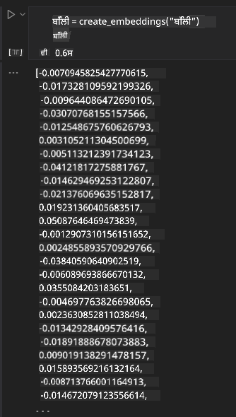

<!--
CO_OP_TRANSLATOR_METADATA:
{
  "original_hash": "e2861bbca91c0567ef32bc77fe054f9e",
  "translation_date": "2025-06-25T22:27:47+00:00",
  "source_file": "15-rag-and-vector-databases/README.md",
  "language_code": "pa"
}
-->
# ਰੀਟ੍ਰੀਵਲ ਅਗਮੈਂਟੇਡ ਜਨਰੇਸ਼ਨ (RAG) ਅਤੇ ਵੈਕਟਰ ਡੇਟਾਬੇਸ

ਸਰਚ ਐਪਲੀਕੇਸ਼ਨਸ ਪਾਠ ਵਿੱਚ, ਅਸੀਂ ਸੰਖੇਪ ਵਿੱਚ ਸਿਖਿਆ ਸੀ ਕਿ ਆਪਣੇ ਡਾਟਾ ਨੂੰ ਵੱਡੇ ਭਾਸ਼ਾ ਮਾਡਲਾਂ (LLMs) ਵਿੱਚ ਕਿਵੇਂ ਜੋੜਨਾ ਹੈ। ਇਸ ਪਾਠ ਵਿੱਚ, ਅਸੀਂ ਤੁਹਾਡੇ LLM ਐਪਲੀਕੇਸ਼ਨ ਵਿੱਚ ਤੁਹਾਡੇ ਡਾਟਾ ਨੂੰ ਜ਼ਮੀਨ 'ਤੇ ਲਾਉਣ ਦੇ ਸਿਧਾਂਤਾਂ, ਪ੍ਰਕਿਰਿਆ ਦੀ ਮਕੈਨਿਕਸ ਅਤੇ ਡਾਟਾ ਨੂੰ ਸਟੋਰ ਕਰਨ ਦੇ ਤਰੀਕਿਆਂ ਵਿੱਚ ਵਧੇਰੇ ਡੂੰਘਾਈ ਵਿੱਚ ਜਾਣਾਂਗੇ, ਜਿਸ ਵਿੱਚ ਇੰਬੈਡਿੰਗ ਅਤੇ ਪਾਠ ਦੋਵੇਂ ਸ਼ਾਮਲ ਹਨ।

> **ਵੀਡੀਓ ਜਲਦੀ ਆ ਰਹੀ ਹੈ**

## ਪਰਿਚਯ

ਇਸ ਪਾਠ ਵਿੱਚ ਅਸੀਂ ਹੇਠ ਲਿਖੇ ਵਿਸ਼ਿਆਂ ਨੂੰ ਕਵਰ ਕਰਾਂਗੇ:

- RAG ਦਾ ਪਰਿਚਯ, ਇਹ ਕੀ ਹੈ ਅਤੇ AI (ਕ੍ਰਿਤ੍ਰਿਮ ਬੁੱਧੀ) ਵਿੱਚ ਇਸਦਾ ਕਿਉਂ ਇਸਤੇਮਾਲ ਹੁੰਦਾ ਹੈ।

- ਵੈਕਟਰ ਡੇਟਾਬੇਸ ਕੀ ਹਨ ਅਤੇ ਸਾਡੇ ਐਪਲੀਕੇਸ਼ਨ ਲਈ ਇੱਕ ਬਣਾਉਣਾ।

- ਕਿਸੇ ਐਪਲੀਕੇਸ਼ਨ ਵਿੱਚ RAG ਨੂੰ ਜੋੜਨ ਦਾ ਇੱਕ ਪ੍ਰਯੋਗਿਕ ਉਦਾਹਰਨ।

## ਸਿਖਣ ਦੇ ਲੱਖ

ਇਸ ਪਾਠ ਨੂੰ ਪੂਰਾ ਕਰਨ ਤੋਂ ਬਾਅਦ, ਤੁਸੀਂ ਸਮਝਣ ਯੋਗ ਹੋਵੋਗੇ:

- ਡਾਟਾ ਰੀਟ੍ਰੀਵਲ ਅਤੇ ਪ੍ਰਕਿਰਿਆ ਵਿੱਚ RAG ਦੀ ਮਹੱਤਤਾ ਨੂੰ ਸਮਝਾਉਣਾ।

- RAG ਐਪਲੀਕੇਸ਼ਨ ਸੈਟਅੱਪ ਕਰਨਾ ਅਤੇ ਆਪਣੇ ਡਾਟਾ ਨੂੰ LLM ਨਾਲ ਜ਼ਮੀਨ 'ਤੇ ਲਾਉਣਾ।

- LLM ਐਪਲੀਕੇਸ਼ਨਜ਼ ਵਿੱਚ RAG ਅਤੇ ਵੈਕਟਰ ਡੇਟਾਬੇਸ ਦੀ ਪ੍ਰਭਾਵਸ਼ਾਲੀ ਇਕਾਈਕਰਨ।

## ਸਾਡਾ ਦ੍ਰਿਸ਼: ਸਾਡੇ LLMs ਨੂੰ ਸਾਡੇ ਆਪਣੇ ਡਾਟਾ ਨਾਲ ਸੁਧਾਰਨਾ

ਇਸ ਪਾਠ ਲਈ, ਅਸੀਂ ਸਿੱਖਿਆ ਸਟਾਰਟਅਪ ਵਿੱਚ ਆਪਣੇ ਨੋਟਸ ਸ਼ਾਮਲ ਕਰਨਾ ਚਾਹੁੰਦੇ ਹਾਂ, ਜੋ ਚੈਟਬੋਟ ਨੂੰ ਵੱਖ-ਵੱਖ ਵਿਸ਼ਿਆਂ ਬਾਰੇ ਹੋਰ ਜਾਣਕਾਰੀ ਪ੍ਰਾਪਤ ਕਰਨ ਦੀ ਆਗਿਆ ਦਿੰਦਾ ਹੈ। ਸਾਡੇ ਕੋਲ ਮੌਜੂਦ ਨੋਟਸ ਦੀ ਵਰਤੋਂ ਕਰਕੇ, ਸਿੱਖਿਆਰਥੀ ਵੱਖ-ਵੱਖ ਵਿਸ਼ਿਆਂ ਨੂੰ ਬਿਹਤਰ ਢੰਗ ਨਾਲ ਪੜ੍ਹ ਸਕਣਗੇ ਅਤੇ ਸਮਝ ਸਕਣਗੇ, ਜਿਸ ਨਾਲ ਉਨ੍ਹਾਂ ਦੇ ਇਮਤਿਹਾਨਾਂ ਦੀ ਤਿਆਰੀ ਕਰਨਾ ਆਸਾਨ ਹੋਵੇਗਾ। ਸਾਡੇ ਦ੍ਰਿਸ਼ ਨੂੰ ਬਣਾਉਣ ਲਈ, ਅਸੀਂ ਵਰਤਾਂਗੇ:

- `Azure OpenAI:` LLM ਜੋ ਅਸੀਂ ਆਪਣੇ ਚੈਟਬੋਟ ਨੂੰ ਬਣਾਉਣ ਲਈ ਵਰਤਾਂਗੇ

- `AI for beginners' lesson on Neural Networks`: ਇਹ ਉਹ ਡਾਟਾ ਹੋਵੇਗਾ ਜਿਸ 'ਤੇ ਅਸੀਂ ਆਪਣੇ LLM ਨੂੰ ਜ਼ਮੀਨ 'ਤੇ ਲਾਉਣਗੇ

- `Azure AI Search` ਅਤੇ `Azure Cosmos DB:` ਵੈਕਟਰ ਡੇਟਾਬੇਸ ਆਪਣੇ ਡਾਟਾ ਨੂੰ ਸਟੋਰ ਕਰਨ ਅਤੇ ਖੋਜ ਇੰਡੈਕਸ ਬਣਾਉਣ ਲਈ

ਉਪਭੋਗਤਾਵਾਂ ਆਪਣੇ ਨੋਟਸ ਤੋਂ ਪ੍ਰੈਕਟਿਸ ਕਿਊਜ਼ ਬਣਾਉਣ, ਰੀਵਿਜ਼ਨ ਫਲੈਸ਼ ਕਾਰਡ ਬਣਾਉਣ ਅਤੇ ਇਸਨੂੰ ਸੰਖੇਪ ਵਿੱਚ ਸਾਰਾਂਸ਼ਿਤ ਕਰਨ ਦੇ ਯੋਗ ਹੋਣਗੇ। ਸ਼ੁਰੂ ਕਰਨ ਲਈ, ਆਓ ਵੇਖੀਏ ਕਿ RAG ਕੀ ਹੈ ਅਤੇ ਇਹ ਕਿਵੇਂ ਕੰਮ ਕਰਦਾ ਹੈ:

## ਰੀਟ੍ਰੀਵਲ ਅਗਮੈਂਟੇਡ ਜਨਰੇਸ਼ਨ (RAG)

ਇੱਕ LLM ਸੰਚਾਲਿਤ ਚੈਟਬੋਟ ਉਪਭੋਗਤਾ ਪ੍ਰੇਰਣਾਂ ਨੂੰ ਸੰਸਾਰ ਕਰਦਾ ਹੈ। ਇਹ ਅੰਤਰਕਿਰਿਆਸ਼ੀਲ ਹੋਣ ਲਈ ਡਿਜ਼ਾਇਨ ਕੀਤਾ ਗਿਆ ਹੈ ਅਤੇ ਵੱਖ-ਵੱਖ ਵਿਸ਼ਿਆਂ 'ਤੇ ਉਪਭੋਗਤਾਵਾਂ ਨਾਲ ਸੰਵਾਦ ਕਰਦਾ ਹੈ। ਹਾਲਾਂਕਿ, ਇਸ ਦੀਆਂ ਪ੍ਰਤੀਕ੍ਰਿਆਵਾਂ ਪ੍ਰਦਾਨ ਕੀਤੇ ਸੰਦਰਭ ਅਤੇ ਇਸ ਦੇ ਮੂਲਭੂਤ ਸਿਖਲਾਈ ਡਾਟਾ ਤੱਕ ਸੀਮਤ ਹਨ। ਉਦਾਹਰਣ ਲਈ, GPT-4 ਦਾ ਗਿਆਨ ਕੱਟਆਫ ਸਤੰਬਰ 2021 ਹੈ, ਜਿਸਦਾ ਅਰਥ ਹੈ ਕਿ ਇਸਨੂੰ ਇਸ ਮਿਆਦ ਤੋਂ ਬਾਅਦ ਹੋਈਆਂ ਘਟਨਾਵਾਂ ਦਾ ਗਿਆਨ ਨਹੀਂ ਹੈ। ਇਸਦੇ ਨਾਲ-ਨਾਲ, LLMs ਨੂੰ ਸਿਖਾਉਣ ਲਈ ਵਰਤੇ ਜਾਣ ਵਾਲੇ ਡਾਟਾ ਵਿੱਚ ਵਿਸ਼ਵਾਸ਼ੀਲ ਜਾਣਕਾਰੀ ਜਿਵੇਂ ਕਿ ਨਿੱਜੀ ਨੋਟਸ ਜਾਂ ਕਿਸੇ ਕੰਪਨੀ ਦਾ ਉਤਪਾਦ ਮੈਨੂਅਲ ਸ਼ਾਮਲ ਨਹੀਂ ਹੁੰਦਾ।

### RAGs (ਰੀਟ੍ਰੀਵਲ ਅਗਮੈਂਟੇਡ ਜਨਰੇਸ਼ਨ) ਕਿਵੇਂ ਕੰਮ ਕਰਦੇ ਹਨ

ਮੰਨ ਲਵੋ ਕਿ ਤੁਸੀਂ ਇੱਕ ਚੈਟਬੋਟ ਤੈਅਨਾਤ ਕਰਨਾ ਚਾਹੁੰਦੇ ਹੋ ਜੋ ਤੁਹਾਡੇ ਨੋਟਸ ਤੋਂ ਕਿਊਜ਼ ਬਣਾਉਂਦਾ ਹੈ, ਤੁਹਾਨੂੰ ਗਿਆਨ ਅਧਾਰ ਨਾਲ ਇੱਕ ਕਨੈਕਸ਼ਨ ਦੀ ਲੋੜ ਹੋਵੇਗੀ। ਇਹ ਉਹ ਹੈ ਜਿੱਥੇ RAG ਮਦਦ ਲਈ ਆਉਂਦਾ ਹੈ। RAGs ਹੇਠ ਲਿਖੇ ਤਰੀਕੇ ਨਾਲ ਕੰਮ ਕਰਦੇ ਹਨ:

- **ਗਿਆਨ ਅਧਾਰ:** ਰੀਟ੍ਰੀਵਲ ਤੋਂ ਪਹਿਲਾਂ, ਇਹ ਦਸਤਾਵੇਜ਼ਾਂ ਨੂੰ ਖਾਣਾ ਅਤੇ ਪ੍ਰੀ-ਪ੍ਰੋਸੈਸ ਕਰਨ ਦੀ ਲੋੜ ਹੁੰਦੀ ਹੈ, ਆਮ ਤੌਰ 'ਤੇ ਵੱਡੇ ਦਸਤਾਵੇਜ਼ਾਂ ਨੂੰ ਛੋਟੇ ਟੁਕੜਿਆਂ ਵਿੱਚ ਤੋੜਨਾ, ਉਨ੍ਹਾਂ ਨੂੰ ਪਾਠ ਇੰਬੈਡਿੰਗ ਵਿੱਚ ਤਬਦੀਲ ਕਰਨਾ ਅਤੇ ਉਨ੍ਹਾਂ ਨੂੰ ਡੇਟਾਬੇਸ ਵਿੱਚ ਸਟੋਰ ਕਰਨਾ।

- **ਉਪਭੋਗਤਾ ਪ੍ਰਸ਼ਨ:** ਉਪਭੋਗਤਾ ਇੱਕ ਸਵਾਲ ਪੁੱਛਦਾ ਹੈ

- **ਰੀਟ੍ਰੀਵਲ:** ਜਦੋਂ ਇੱਕ ਉਪਭੋਗਤਾ ਇੱਕ ਸਵਾਲ ਪੁੱਛਦਾ ਹੈ, ਇੰਬੈਡਿੰਗ ਮਾਡਲ ਸਾਡੇ ਗਿਆਨ ਅਧਾਰ ਤੋਂ ਸੰਦਰਭਿਤ ਜਾਣਕਾਰੀ ਨੂੰ ਰੀਟ੍ਰੀਵ ਕਰਦਾ ਹੈ ਤਾਂ ਜੋ ਹੋਰ ਸੰਦਰਭ ਪ੍ਰਦਾਨ ਕੀਤਾ ਜਾ ਸਕੇ ਜੋ ਪ੍ਰੇਰਣਾ ਵਿੱਚ ਸ਼ਾਮਲ ਕੀਤਾ ਜਾਵੇਗਾ।

- **ਅਗਮੈਂਟੇਡ ਜਨਰੇਸ਼ਨ:** LLM ਆਪਣੇ ਜਵਾਬ ਨੂੰ ਰੀਟ੍ਰੀਵ ਕੀਤੇ ਡਾਟਾ ਦੇ ਆਧਾਰ 'ਤੇ ਵਧਾਉਂਦਾ ਹੈ। ਇਹ ਪ੍ਰਤੀਕ੍ਰਿਆ ਨੂੰ ਨਾ ਸਿਰਫ ਪ੍ਰੀ-ਟ੍ਰੇਨਡ ਡਾਟਾ ਦੇ ਆਧਾਰ 'ਤੇ ਬਣਾਉਣ ਦੀ ਆਗਿਆ ਦਿੰਦਾ ਹੈ, ਸਗੋਂ ਸ਼ਾਮਲ ਸੰਦਰਭ ਤੋਂ ਸਬੰਧਤ ਜਾਣਕਾਰੀ ਵੀ। ਰੀਟ੍ਰੀਵ ਕੀਤਾ ਗਿਆ ਡਾਟਾ LLM ਦੀਆਂ ਪ੍ਰਤੀਕ੍ਰਿਆਵਾਂ ਨੂੰ ਵਧਾਉਣ ਲਈ ਵਰਤਿਆ ਜਾਂਦਾ ਹੈ। ਫਿਰ LLM ਉਪਭੋਗਤਾ ਦੇ ਸਵਾਲ ਦਾ ਜਵਾਬ ਦਿੰਦਾ ਹੈ।

RAGs ਲਈ ਆਰਕੀਟੈਕਚਰ ਨੂੰ ਦੋ ਭਾਗਾਂ ਵਿੱਚ ਸ਼ਾਮਲ ਟ੍ਰਾਂਸਫਾਰਮਰਾਂ ਦੀ ਵਰਤੋਂ ਕਰਕੇ ਲਾਗੂ ਕੀਤਾ ਗਿਆ ਹੈ: ਇੱਕ ਕੋਡਰ ਅਤੇ ਇੱਕ ਡੀਕੋਡਰ। ਉਦਾਹਰਣ ਲਈ, ਜਦੋਂ ਇੱਕ ਉਪਭੋਗਤਾ ਸਵਾਲ ਪੁੱਛਦਾ ਹੈ, ਇਨਪੁੱਟ ਟੈਕਸਟ 'ਕੋਡ' ਵਿੱਚ ਵੈਕਟਰਾਂ ਵਿੱਚ ਪਕੜਿਆ ਜਾਂਦਾ ਹੈ ਜੋ ਸ਼ਬਦਾਂ ਦਾ ਅਰਥ ਪਕੜਦੇ ਹਨ ਅਤੇ ਵੈਕਟਰਾਂ ਨੂੰ ਸਾਡੇ ਦਸਤਾਵੇਜ਼ ਇੰਡੈਕਸ ਵਿੱਚ 'ਡੀਕੋਡ' ਕੀਤਾ ਜਾਂਦਾ ਹੈ ਅਤੇ ਉਪਭੋਗਤਾ ਪ੍ਰਸ਼ਨ ਦੇ ਆਧਾਰ 'ਤੇ ਨਵਾਂ ਪਾਠ ਬਣਾਉਂਦਾ ਹੈ। LLM ਆਉਟਪੁੱਟ ਜਨਰੇਟ ਕਰਨ ਲਈ ਦੋਨੋਂ ਕੋਡਰ-ਡੀਕੋਡਰ ਮਾਡਲ ਦੀ ਵਰਤੋਂ ਕਰਦਾ ਹੈ।

ਪੇਸ਼ ਕੀਤੇ ਪੇਪਰ ਦੇ ਅਨੁਸਾਰ RAG ਲਾਗੂ ਕਰਨ ਵੇਲੇ ਦੋ ਪਹੁੰਚਾਂ ਹਨ: [ਗਿਆਨ-ਗੰਭੀਰ NLP (ਕੁਦਰਤੀ ਭਾਸ਼ਾ ਪ੍ਰਕਿਰਿਆ ਸੌਫਟਵੇਅਰ) ਕਾਰਜਾਂ ਲਈ ਰੀਟ੍ਰੀਵਲ-ਅਗਮੈਂਟੇਡ ਜਨਰੇਸ਼ਨ](https://arxiv.org/pdf/2005.11401.pdf?WT.mc_id=academic-105485-koreyst) ਹਨ:

- **_RAG-ਸੀਕੁਇੰਸ_** ਪ੍ਰਯੋਗਕਰਤਾ ਪ੍ਰਸ਼ਨ ਲਈ ਸਭ ਤੋਂ ਵਧੀਆ ਸੰਭਾਵਿਤ ਜਵਾਬ ਦੀ ਭਵਿੱਖਬਾਣੀ ਕਰਨ ਲਈ ਰੀਟ੍ਰੀਵ ਕੀਤੇ ਦਸਤਾਵੇਜ਼ਾਂ ਦੀ ਵਰਤੋਂ ਕਰਨਾ

- **RAG-ਟੋਕਨ** ਦਸਤਾਵੇਜ਼ਾਂ ਦੀ ਵਰਤੋਂ ਕਰਦੇ ਹੋਏ ਅਗਲਾ ਟੋਕਨ ਜਨਰੇਟ ਕਰਨ ਲਈ, ਫਿਰ ਉਨ੍ਹਾਂ ਨੂੰ ਉਪਭੋਗਤਾ ਦੇ ਪ੍ਰਸ਼ਨ ਦਾ ਜਵਾਬ ਦੇਣ ਲਈ ਰੀਟ੍ਰੀਵ ਕਰਨਾ

### ਤੁਸੀਂ RAGs ਕਿਉਂ ਵਰਤੋਂਗੇ?

- **ਜਾਣਕਾਰੀ ਦੀ ਧਨਾਢਤਾ:** ਇਹ ਯਕੀਨੀ ਬਣਾਉਂਦਾ ਹੈ ਕਿ ਪਾਠ ਪ੍ਰਤੀਕ੍ਰਿਆਵਾਂ ਅੱਪ-ਟੂ-ਡੇਟ ਅਤੇ ਮੌਜੂਦਾ ਹਨ। ਇਸ ਲਈ, ਇਹ ਡੋਮੇਨ ਵਿਸ਼ੇਸ਼ ਕਾਰਜਾਂ 'ਤੇ ਪ੍ਰਦਰਸ਼ਨ ਨੂੰ ਬਿਹਤਰ ਬਣਾਉਂਦਾ ਹੈ ਜਦੋਂ ਅੰਦਰੂਨੀ ਗਿਆਨ ਅਧਾਰ ਤੱਕ ਪਹੁੰਚ ਹੁੰਦੀ ਹੈ।

- **ਪੁਸ਼ਟੀਯੋਗ ਡਾਟਾ** ਦੀ ਵਰਤੋਂ ਕਰਕੇ ਨਕਲੀਪਣ ਨੂੰ ਘਟਾਉਂਦਾ ਹੈ ਗਿਆਨ ਅਧਾਰ ਵਿੱਚ ਉਪਭੋਗਤਾ ਪ੍ਰਸ਼ਨਾਂ ਨੂੰ ਸੰਦਰਭ ਪ੍ਰਦਾਨ ਕਰਨ ਲਈ।

- ਇਹ **ਲਾਗਤ-ਪ੍ਰਭਾਵਸ਼ਾਲੀ** ਹੈ ਕਿਉਂਕਿ ਇਹ ਇੱਕ LLM ਨੂੰ ਬਾਰੀਕੀ ਨਾਲ ਟਿਊਨ ਕਰਨ ਦੇ ਮੁਕਾਬਲੇ ਵਧੇਰੇ ਆਰਥਿਕ ਹਨ

## ਇੱਕ ਗਿਆਨ ਅਧਾਰ ਬਣਾਉਣਾ

ਸਾਡੀ ਐਪਲੀਕੇਸ਼ਨ ਸਾਡੇ ਨਿੱਜੀ ਡਾਟਾ ਉੱਤੇ ਆਧਾਰਿਤ ਹੈ ਜਿਵੇਂ ਕਿ AI ਫਾਰ ਬਿਗਿਨਰਜ਼ ਕਰਿਕੁਲਮ 'ਤੇ ਨਿਊਰਲ ਨੈਟਵਰਕ ਪਾਠ।

### ਵੈਕਟਰ ਡੇਟਾਬੇਸ

ਇੱਕ ਵੈਕਟਰ ਡੇਟਾਬੇਸ, ਪਰੰਪਰਾਗਤ ਡੇਟਾਬੇਸਾਂ ਤੋਂ ਵੱਖਰਾ, ਇੱਕ ਵਿਸ਼ੇਸ਼ ਡੇਟਾਬੇਸ ਹੈ ਜੋ ਇੰਬੈਡਡ ਵੈਕਟਰਾਂ ਨੂੰ ਸਟੋਰ, ਪ੍ਰਬੰਧਨ ਅਤੇ ਖੋਜ ਕਰਨ ਲਈ ਡਿਜ਼ਾਇਨ ਕੀਤਾ ਗਿਆ ਹੈ। ਇਹ ਦਸਤਾਵੇਜ਼ਾਂ ਦੀ ਸੰਖਿਆਤਮਕ ਨੁਮਾਇੰਦਗੀ ਨੂੰ ਸਟੋਰ ਕਰਦਾ ਹੈ। ਡਾਟਾ ਨੂੰ ਸੰਖਿਆਤਮਕ ਇੰਬੈਡਿੰਗ ਵਿੱਚ ਤੋੜਨਾ ਸਾਡੇ AI ਸਿਸਟਮ ਲਈ ਡਾਟਾ ਨੂੰ ਸਮਝਣਾ ਅਤੇ ਪ੍ਰਕਿਰਿਆ ਕਰਨਾ ਆਸਾਨ ਬਣਾ ਦਿੰਦਾ ਹੈ।

ਅਸੀਂ ਆਪਣੇ ਇੰਬੈਡਿੰਗਜ਼ ਨੂੰ ਵੈਕਟਰ ਡੇਟਾਬੇਸਾਂ ਵਿੱਚ ਸਟੋਰ ਕਰਦੇ ਹਾਂ ਕਿਉਂਕਿ LLMs ਵਿੱਚ ਟੋਕਨਾਂ ਦੀ ਗਿਣਤੀ ਦੀ ਹੱਦ ਹੁੰਦੀ ਹੈ ਜੋ ਉਹ ਇਨਪੁੱਟ ਵਜੋਂ ਸਵੀਕਾਰ ਕਰਦੇ ਹਨ। ਜਿਵੇਂ ਕਿ ਤੁਸੀਂ ਸਾਰੇ ਇੰਬੈਡਿੰਗਜ਼ ਨੂੰ LLM ਵਿੱਚ ਪਾਸ ਨਹੀਂ ਕਰ ਸਕਦੇ, ਸਾਨੂੰ ਉਨ੍ਹਾਂ ਨੂੰ ਟੁਕੜਿਆਂ ਵਿੱਚ ਤੋੜਨ ਦੀ ਲੋੜ ਹੋਵੇਗੀ ਅਤੇ ਜਦੋਂ ਇੱਕ ਉਪਭੋਗਤਾ ਸਵਾਲ ਪੁੱਛਦਾ ਹੈ, ਤਾਂ ਸਵਾਲ ਨਾਲ ਸਭ ਤੋਂ ਵੱਧ ਮਿਲਦੇ-ਜੁਲਦੇ ਇੰਬੈਡਿੰਗ ਪ੍ਰੇਰਣਾ ਦੇ ਨਾਲ ਵਾਪਸ ਕੀਤੇ ਜਾਣਗੇ। ਚੰਕਿੰਗ ਇੱਕ LLM ਰਾਹੀਂ ਪਾਸ ਕੀਤੇ ਟੋਕਨਾਂ ਦੀ ਗਿਣਤੀ 'ਤੇ ਲਾਗਤ ਨੂੰ ਵੀ ਘਟਾਉਂਦਾ ਹੈ।

ਕੁਝ ਲੋਕਪ੍ਰਿਯ ਵੈਕਟਰ ਡੇਟਾਬੇਸਾਂ ਵਿੱਚ ਅਜ਼ੂਰ ਕੌਸਮੋਸ ਡੀਬੀ, ਕਲੈਰਿਫਾਈ, ਪਾਈਨਕੋਨ, ਕ੍ਰੋਮਾਡੀਬੀ, ਸਕੈਨਨ, ਕਿਊਡਰੈਂਟ ਅਤੇ ਡੀਪਲੇਕ ਸ਼ਾਮਲ ਹਨ। ਤੁਸੀਂ ਹੇਠਾਂ ਦਿੱਤੇ ਕਮਾਂਡ ਨਾਲ ਅਜ਼ੂਰ ਕੌਸਮੋਸ ਡੀਬੀ ਮਾਡਲ ਬਣਾਉਣ ਲਈ ਅਜ਼ੂਰ CLI ਦੀ ਵਰਤੋਂ ਕਰ ਸਕਦੇ ਹੋ:

```bash
az login
az group create -n <resource-group-name> -l <location>
az cosmosdb create -n <cosmos-db-name> -r <resource-group-name>
az cosmosdb list-keys -n <cosmos-db-name> -g <resource-group-name>
```

### ਪਾਠ ਤੋਂ ਇੰਬੈਡਿੰਗ ਤੱਕ

ਅਸੀਂ ਆਪਣਾ ਡਾਟਾ ਸਟੋਰ ਕਰਨ ਤੋਂ ਪਹਿਲਾਂ, ਸਾਨੂੰ ਇਸਨੂੰ ਡੇਟਾਬੇਸ ਵਿੱਚ ਸਟੋਰ ਕਰਨ ਤੋਂ ਪਹਿਲਾਂ ਇਸਨੂੰ ਵੈਕਟਰ ਇੰਬੈਡਿੰਗ ਵਿੱਚ ਤਬਦੀਲ ਕਰਨ ਦੀ ਲੋੜ ਹੋਵੇਗੀ। ਜੇਕਰ ਤੁਸੀਂ ਵੱਡੇ ਦਸਤਾਵੇਜ਼ਾਂ ਜਾਂ ਲੰਬੇ ਪਾਠਾਂ ਨਾਲ ਕੰਮ ਕਰ ਰਹੇ ਹੋ, ਤਾਂ ਤੁਸੀਂ ਉਮੀਦ ਕੀਤੇ ਪੁੱਛਗਿੱਛ ਦੇ ਆਧਾਰ 'ਤੇ ਉਨ੍ਹਾਂ ਨੂੰ ਚੰਕ ਕਰ ਸਕਦੇ ਹੋ। ਚੰਕਿੰਗ ਸਜਾਵਟ ਪੱਧਰ 'ਤੇ ਜਾਂ ਪੈਰਾ ਪੱਧਰ 'ਤੇ ਕੀਤੀ ਜਾ ਸਕਦੀ ਹੈ। ਜਿਵੇਂ ਕਿ ਚੰਕਿੰਗ ਆਪਣੇ ਆਲੇ ਦੁਆਲੇ ਦੇ ਸ਼ਬਦਾਂ ਤੋਂ ਅਰਥ ਪ੍ਰਾਪਤ ਕਰਦੀ ਹੈ, ਤੁਸੀਂ ਕਿਸੇ ਚੰਕ ਵਿੱਚ ਕੁਝ ਹੋਰ ਸੰਦਰਭ ਸ਼ਾਮਲ ਕਰ ਸਕਦੇ ਹੋ, ਉਦਾਹਰਣ ਲਈ, ਦਸਤਾਵੇਜ਼ ਸਿਰਲੇਖ ਸ਼ਾਮਲ ਕਰਕੇ ਜਾਂ ਚੰਕ ਤੋਂ ਪਹਿਲਾਂ ਜਾਂ ਬਾਅਦ ਵਿੱਚ ਕੁਝ ਪਾਠ ਸ਼ਾਮਲ ਕਰਕੇ। ਤੁਸੀਂ ਡਾਟਾ ਨੂੰ ਹੇਠ ਲਿਖੇ ਤਰੀਕੇ ਨਾਲ ਚੰਕ ਕਰ ਸਕਦੇ ਹੋ:

```python
def split_text(text, max_length, min_length):
    words = text.split()
    chunks = []
    current_chunk = []

    for word in words:
        current_chunk.append(word)
        if len(' '.join(current_chunk)) < max_length and len(' '.join(current_chunk)) > min_length:
            chunks.append(' '.join(current_chunk))
            current_chunk = []

    # If the last chunk didn't reach the minimum length, add it anyway
    if current_chunk:
        chunks.append(' '.join(current_chunk))

    return chunks
```

ਇੱਕ ਵਾਰ ਚੰਕ ਹੋਣ ਦੇ ਬਾਅਦ, ਅਸੀਂ ਫਿਰ ਵੱਖ-ਵੱਖ ਇੰਬੈਡਿੰਗ ਮਾਡਲਾਂ ਦੀ ਵਰਤੋਂ ਕਰਕੇ ਆਪਣੇ ਪਾਠ ਨੂੰ ਇੰਬੈਡ ਕਰ ਸਕਦੇ ਹਾਂ। ਕੁਝ ਮਾਡਲ ਜੋ ਤੁਸੀਂ ਵਰਤ ਸਕਦੇ ਹੋ ਸ਼ਾਮਲ ਹਨ: ਵਰਡ2ਵੇਕ, ਓਪਨਏਆਈ ਦੁਆਰਾ ਅਡਾ-002, ਅਜ਼ੂਰ ਕੰਪਿਊਟਰ ਵਿਜ਼ਨ ਅਤੇ ਹੋਰ ਬਹੁਤ ਕੁਝ। ਕਿਸੇ ਮਾਡਲ ਦੀ ਚੋਣ ਕਰਨ ਦਾ ਨਿਰਣੇ ਤੁਸੀਂ ਵਰਤ ਰਹੇ ਭਾਸ਼ਾਵਾਂ, ਕੌਣਸਾ ਸਮੱਗਰੀ (ਪਾਠ/ਚਿੱਤਰ/ਆਡੀਓ) ਨੂੰ ਕੋਡ ਕੀਤਾ ਜਾ ਰਿਹਾ ਹੈ, ਇਹ ਕਿੰਨਾ ਵੱਡਾ ਇਨਪੁੱਟ ਕੋਡ ਕਰ ਸਕਦਾ ਹੈ ਅਤੇ ਇੰਬੈਡਿੰਗ ਆਉਟਪੁੱਟ ਦੀ ਲੰਬਾਈ 'ਤੇ ਨਿਰਭਰ ਕਰੇਗਾ।

ਓਪਨਏਆਈ ਦੇ `ਟੈਕਸਟ-ਇੰਬੈਡਿੰਗ-ਅਡਾ-002` ਮਾਡਲ ਦੀ ਵਰਤੋਂ ਕਰਕੇ ਇੰਬੈਡ ਕੀਤੇ ਪਾਠ ਦਾ ਇੱਕ ਉਦਾਹਰਣ ਹੈ:


## ਰੀਟ੍ਰੀਵਲ ਅਤੇ ਵੈਕਟਰ ਖੋਜ

ਜਦੋਂ ਇੱਕ ਉਪਭੋਗਤਾ ਸਵਾਲ ਪੁੱਛਦਾ ਹੈ, ਰੀਟ੍ਰੀਵਰ ਇਸਨੂੰ ਪ੍ਰਸ਼ਨ ਕੋਡਰ ਦੀ ਵਰਤੋਂ ਕਰਕੇ ਇੱਕ ਵੈਕਟਰ ਵਿੱਚ ਤਬਦੀਲ ਕਰਦਾ ਹੈ, ਫਿਰ ਇਹ ਸਾਡੇ ਦਸਤਾਵੇਜ਼ ਖੋਜ ਇੰਡੈਕਸ ਵਿੱਚ ਦਸਤਾਵੇਜ਼ ਵਿੱਚ ਸਬੰਧਤ ਵੈਕਟਰਾਂ ਲਈ ਖੋਜ ਕਰਦਾ ਹੈ ਜੋ ਇਨਪੁੱਟ ਨਾਲ ਸਬੰਧਤ ਹਨ। ਇੱਕ ਵਾਰ ਕੀਤਾ ਗਿਆ, ਇਹ ਦੋਨੋਂ ਇਨਪੁੱਟ ਵੈਕਟਰ ਅਤੇ ਦਸਤਾਵੇਜ਼ ਵੈਕਟਰਾਂ ਨੂੰ ਪਾਠ ਵਿੱਚ ਤਬਦੀਲ ਕਰਦਾ ਹੈ ਅਤੇ ਇਸਨੂੰ LLM ਰਾਹੀਂ ਪਾਸ ਕਰਦਾ ਹੈ।

### ਰੀਟ੍ਰੀਵਲ

ਰੀਟ੍ਰੀਵਲ ਉਸ ਵੇਲੇ ਹੁੰਦਾ ਹੈ ਜਦੋਂ ਸਿਸਟਮ ਇੰਡੈਕਸ ਤੋਂ ਦਸਤਾਵੇਜ਼ਾਂ ਨੂੰ ਤੇਜ਼ੀ ਨਾਲ ਲੱਭਣ ਦੀ ਕੋਸ਼ਿਸ਼ ਕਰਦਾ ਹੈ ਜੋ ਖੋਜ ਮਾਪਦੰਡਾਂ ਦੀ ਪੂਰਾ ਕਰਨ ਦੀ ਕੋਸ਼ਿਸ਼ ਕਰਦਾ ਹੈ। ਰੀਟ੍ਰੀਵਰ ਦਾ ਉਦੇਸ਼ ਉਹ ਦਸਤਾਵੇਜ਼ ਪ੍ਰਾਪਤ ਕਰਨਾ ਹੈ ਜੋ ਸੰਦਰਭ ਪ੍ਰਦਾਨ ਕਰਨ ਲਈ ਵਰਤੇ ਜਾਣਗੇ ਅਤੇ ਤੁਹਾਡੇ ਡਾਟਾ 'ਤੇ LLM ਨੂੰ ਜ਼ਮੀਨ 'ਤੇ ਲਾਉਣਗੇ।

ਸਾਡੇ ਡੇਟਾਬੇਸ ਵਿੱਚ ਖੋਜ ਕਰਨ ਦੇ ਕਈ ਤਰੀਕੇ ਹਨ ਜਿਵੇਂ ਕਿ:

- **ਕੀਵਰਡ ਖੋਜ** - ਪਾਠ ਖੋਜਾਂ ਲਈ ਵਰਤੀ ਜਾਂਦੀ ਹੈ

- **ਸੈਮਾਂਟਿਕ ਖੋਜ** - ਸ਼ਬਦਾਂ ਦੇ ਸੈਮਾਂਟਿਕ ਅਰਥ ਦੀ ਵਰਤੋਂ ਕਰਦਾ ਹੈ

- **ਵੈਕਟਰ ਖੋਜ** - ਇੰਬੈਡਿੰਗ ਮਾਡਲਾਂ ਦੀ ਵਰਤੋਂ ਕਰਕੇ ਦਸਤਾਵੇਜ਼ਾਂ ਨੂੰ ਪਾਠ ਤੋਂ ਵੈਕਟਰ ਨੁਮਾਇੰਦਗੀ ਵਿੱਚ ਤਬਦੀਲ ਕਰਦਾ ਹੈ। ਰੀਟ੍ਰੀਵਲ ਉਹਨਾਂ ਦਸਤਾਵੇਜ਼ਾਂ ਦੀ ਪੁੱਛਗਿੱਛ ਕਰਕੇ ਕੀਤਾ ਜਾਵੇਗਾ ਜਿਨ੍ਹਾਂ

**ਅਸਵੀਕਰਤੀ**:  
ਇਹ ਦਸਤਾਵੇਜ਼ AI ਅਨੁਵਾਦ ਸੇਵਾ [Co-op Translator](https://github.com/Azure/co-op-translator) ਦੀ ਵਰਤੋਂ ਕਰਕੇ ਅਨੁਵਾਦ ਕੀਤਾ ਗਿਆ ਹੈ। ਜਦੋਂ ਕਿ ਅਸੀਂ ਸਹੀ ਹੋਣ ਲਈ ਯਤਨਸ਼ੀਲ ਹਾਂ, ਕਿਰਪਾ ਕਰਕੇ ਧਿਆਨ ਦਿਓ ਕਿ ਸਵੈਚਾਲਿਤ ਅਨੁਵਾਦਾਂ ਵਿੱਚ ਗਲਤੀਆਂ ਜਾਂ ਗਲਤੀਆਂ ਹੋ ਸਕਦੀਆਂ ਹਨ। ਉਸਦੀ ਮੂਲ ਭਾਸ਼ਾ ਵਿੱਚ ਮੂਲ ਦਸਤਾਵੇਜ਼ ਨੂੰ ਅਧਿਕਾਰਕ ਸਰੋਤ ਮੰਨਿਆ ਜਾਣਾ ਚਾਹੀਦਾ ਹੈ। ਮਹੱਤਵਪੂਰਨ ਜਾਣਕਾਰੀ ਲਈ, ਪੇਸ਼ੇਵਰ ਮਨੁੱਖੀ ਅਨੁਵਾਦ ਦੀ ਸਿਫਾਰਿਸ਼ ਕੀਤੀ ਜਾਂਦੀ ਹੈ। ਅਸੀਂ ਇਸ ਅਨੁਵਾਦ ਦੀ ਵਰਤੋਂ ਕਰਕੇ ਪੈਦਾ ਹੋਈ ਕਿਸੇ ਵੀ ਗਲਤਫਹਿਮੀ ਜਾਂ ਗਲਤ ਵਿਆਖਿਆ ਲਈ ਜ਼ਿੰਮੇਵਾਰ ਨਹੀਂ ਹਾਂ।