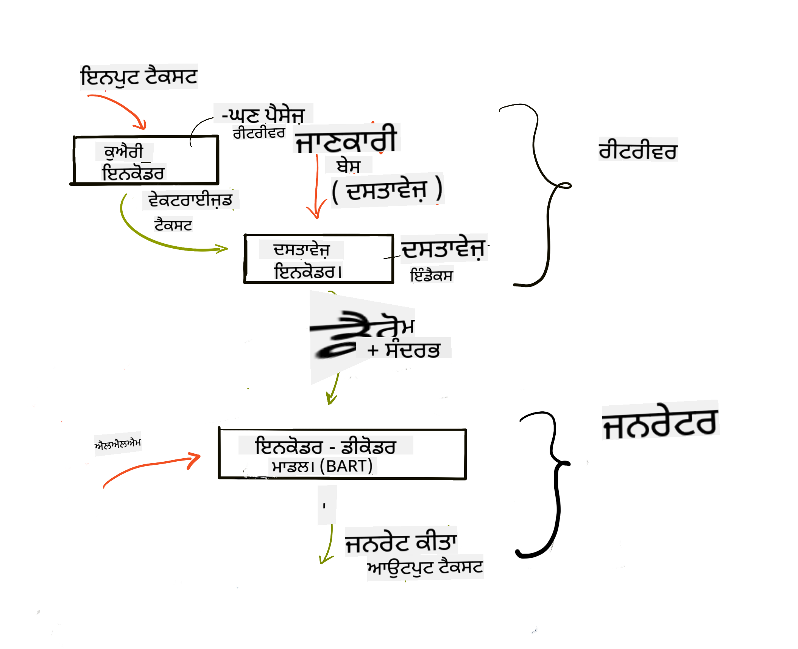

<!--
CO_OP_TRANSLATOR_METADATA:
{
  "original_hash": "e2861bbca91c0567ef32bc77fe054f9e",
  "translation_date": "2025-07-09T16:09:58+00:00",
  "source_file": "15-rag-and-vector-databases/README.md",
  "language_code": "pa"
}
-->
# Retrieval Augmented Generation (RAG) ਅਤੇ ਵੈਕਟਰ ਡੇਟਾਬੇਸ

[](https://aka.ms/gen-ai-lesson15-gh?WT.mc_id=academic-105485-koreyst)

ਸਰਚ ਐਪਲੀਕੇਸ਼ਨਾਂ ਦੇ ਪਾਠ ਵਿੱਚ, ਅਸੀਂ ਸੰਖੇਪ ਵਿੱਚ ਸਿੱਖਿਆ ਕਿ ਆਪਣੇ ਡੇਟਾ ਨੂੰ Large Language Models (LLMs) ਵਿੱਚ ਕਿਵੇਂ ਜੋੜਿਆ ਜਾ ਸਕਦਾ ਹੈ। ਇਸ ਪਾਠ ਵਿੱਚ, ਅਸੀਂ ਆਪਣੇ ਡੇਟਾ ਨੂੰ ਆਪਣੇ LLM ਐਪਲੀਕੇਸ਼ਨ ਵਿੱਚ ਗਰਾਊਂਡ ਕਰਨ ਦੇ ਵਿਚਾਰਾਂ, ਇਸ ਪ੍ਰਕਿਰਿਆ ਦੇ ਮਕੈਨਿਕਸ ਅਤੇ ਡੇਟਾ ਸਟੋਰ ਕਰਨ ਦੇ ਤਰੀਕਿਆਂ ਬਾਰੇ ਹੋਰ ਵਿਸਥਾਰ ਨਾਲ ਜਾਣੂ ਹੋਵਾਂਗੇ, ਜਿਸ ਵਿੱਚ embeddings ਅਤੇ ਟੈਕਸਟ ਦੋਹਾਂ ਸ਼ਾਮਲ ਹਨ।

> **ਵੀਡੀਓ ਜਲਦੀ ਆ ਰਿਹਾ ਹੈ**

## ਪਰਿਚਯ

ਇਸ ਪਾਠ ਵਿੱਚ ਅਸੀਂ ਹੇਠ ਲਿਖੀਆਂ ਗੱਲਾਂ ਕਵਰ ਕਰਾਂਗੇ:

- RAG ਦਾ ਪਰਿਚਯ, ਇਹ ਕੀ ਹੈ ਅਤੇ AI (ਕ੍ਰਿਤ੍ਰਿਮ ਬੁੱਧੀ) ਵਿੱਚ ਇਸਦਾ ਕਿਉਂ ਇਸਤੇਮਾਲ ਹੁੰਦਾ ਹੈ।

- ਵੈਕਟਰ ਡੇਟਾਬੇਸ ਕੀ ਹੁੰਦੇ ਹਨ ਅਤੇ ਸਾਡੇ ਐਪਲੀਕੇਸ਼ਨ ਲਈ ਇੱਕ ਬਣਾਉਣਾ।

- RAG ਨੂੰ ਐਪਲੀਕੇਸ਼ਨ ਵਿੱਚ ਜੋੜਨ ਦਾ ਇੱਕ ਪ੍ਰਯੋਗਿਕ ਉਦਾਹਰਨ।

## ਸਿੱਖਣ ਦੇ ਲਕੜ

ਇਸ ਪਾਠ ਨੂੰ ਪੂਰਾ ਕਰਨ ਤੋਂ ਬਾਅਦ, ਤੁਸੀਂ ਸਮਰੱਥ ਹੋਵੋਗੇ:

- ਡੇਟਾ ਰੀਟਰੀਵਲ ਅਤੇ ਪ੍ਰੋਸੈਸਿੰਗ ਵਿੱਚ RAG ਦੀ ਮਹੱਤਤਾ ਨੂੰ ਸਮਝਾਉਣਾ।

- RAG ਐਪਲੀਕੇਸ਼ਨ ਸੈਟਅਪ ਕਰਨਾ ਅਤੇ ਆਪਣੇ ਡੇਟਾ ਨੂੰ LLM ਨਾਲ ਗਰਾਊਂਡ ਕਰਨਾ।

- LLM ਐਪਲੀਕੇਸ਼ਨਾਂ ਵਿੱਚ RAG ਅਤੇ ਵੈਕਟਰ ਡੇਟਾਬੇਸ ਦੀ ਪ੍ਰਭਾਵਸ਼ਾਲੀ ਇੰਟੀਗ੍ਰੇਸ਼ਨ।

## ਸਾਡਾ ਸਿਨਾਰੀਓ: ਆਪਣੇ LLMs ਨੂੰ ਆਪਣੇ ਡੇਟਾ ਨਾਲ ਬਿਹਤਰ ਬਣਾਉਣਾ

ਇਸ ਪਾਠ ਲਈ, ਅਸੀਂ ਆਪਣੀਆਂ ਨੋਟਸ ਨੂੰ ਇੱਕ ਐਜੂਕੇਸ਼ਨ ਸਟਾਰਟਅਪ ਵਿੱਚ ਸ਼ਾਮਲ ਕਰਨਾ ਚਾਹੁੰਦੇ ਹਾਂ, ਜਿਸ ਨਾਲ ਚੈਟਬੋਟ ਵੱਖ-ਵੱਖ ਵਿਸ਼ਿਆਂ ਬਾਰੇ ਵਧੇਰੇ ਜਾਣਕਾਰੀ ਪ੍ਰਾਪਤ ਕਰ ਸਕੇ। ਸਾਡੇ ਕੋਲ ਮੌਜੂਦ ਨੋਟਸ ਦੀ ਵਰਤੋਂ ਕਰਕੇ, ਸਿੱਖਣ ਵਾਲੇ ਬਿਹਤਰ ਅਧਿਐਨ ਕਰ ਸਕਣਗੇ ਅਤੇ ਵੱਖ-ਵੱਖ ਵਿਸ਼ਿਆਂ ਨੂੰ ਸਮਝਣਗੇ, ਜਿਸ ਨਾਲ ਉਹਨਾਂ ਲਈ ਇਮਤਿਹਾਨਾਂ ਦੀ ਤਿਆਰੀ ਆਸਾਨ ਹੋ ਜਾਵੇਗੀ। ਸਾਡਾ ਸਿਨਾਰੀਓ ਬਣਾਉਣ ਲਈ ਅਸੀਂ ਵਰਤਾਂਗੇ:

- `Azure OpenAI:` ਉਹ LLM ਜਿਸ ਨਾਲ ਅਸੀਂ ਆਪਣਾ ਚੈਟਬੋਟ ਬਣਾਵਾਂਗੇ

- `AI for beginners' lesson on Neural Networks:` ਇਹ ਉਹ ਡੇਟਾ ਹੈ ਜਿਸ 'ਤੇ ਅਸੀਂ ਆਪਣਾ LLM ਗਰਾਊਂਡ ਕਰਾਂਗੇ

- `Azure AI Search` ਅਤੇ `Azure Cosmos DB:` ਵੈਕਟਰ ਡੇਟਾਬੇਸ ਜੋ ਸਾਡੇ ਡੇਟਾ ਨੂੰ ਸਟੋਰ ਕਰਨ ਅਤੇ ਸਰਚ ਇੰਡੈਕਸ ਬਣਾਉਣ ਲਈ

ਉਪਭੋਗਤਾ ਆਪਣੇ ਨੋਟਸ ਤੋਂ ਪ੍ਰੈਕਟਿਸ ਕਵਿਜ਼, ਰਿਵਿਜ਼ਨ ਫਲੈਸ਼ ਕਾਰਡ ਅਤੇ ਸੰਖੇਪ ਸਾਰਾਂਸ਼ ਤਿਆਰ ਕਰ ਸਕਣਗੇ। ਸ਼ੁਰੂ ਕਰਨ ਲਈ, ਆਓ ਵੇਖੀਏ RAG ਕੀ ਹੈ ਅਤੇ ਇਹ ਕਿਵੇਂ ਕੰਮ ਕਰਦਾ ਹੈ:

## Retrieval Augmented Generation (RAG)

ਇੱਕ LLM-ਚਲਿਤ ਚੈਟਬੋਟ ਯੂਜ਼ਰ ਦੇ ਪ੍ਰਾਂਪਟਾਂ ਨੂੰ ਪ੍ਰੋਸੈਸ ਕਰਕੇ ਜਵਾਬ ਤਿਆਰ ਕਰਦਾ ਹੈ। ਇਹ ਇੰਟਰਐਕਟਿਵ ਬਣਾਇਆ ਗਿਆ ਹੈ ਅਤੇ ਵੱਖ-ਵੱਖ ਵਿਸ਼ਿਆਂ 'ਤੇ ਯੂਜ਼ਰਾਂ ਨਾਲ ਗੱਲਬਾਤ ਕਰਦਾ ਹੈ। ਪਰ, ਇਸਦੇ ਜਵਾਬ ਸਿਰਫ਼ ਦਿੱਤੇ ਗਏ ਸੰਦਰਭ ਅਤੇ ਇਸਦੇ ਮੂਲ ਟ੍ਰੇਨਿੰਗ ਡੇਟਾ ਤੱਕ ਸੀਮਿਤ ਹੁੰਦੇ ਹਨ। ਉਦਾਹਰਨ ਵਜੋਂ, GPT-4 ਦੀ ਨੋਲੇਜ ਕਟਆਫ ਸਤੰਬਰ 2021 ਹੈ, ਜਿਸਦਾ ਮਤਲਬ ਹੈ ਕਿ ਇਸਨੂੰ ਇਸ ਮਿਆਦ ਤੋਂ ਬਾਅਦ ਵਾਪਰੇ ਘਟਨਾਵਾਂ ਦੀ ਜਾਣਕਾਰੀ ਨਹੀਂ ਹੈ। ਇਸਦੇ ਨਾਲ-ਨਾਲ, LLMs ਨੂੰ ਟ੍ਰੇਨ ਕਰਨ ਲਈ ਵਰਤੇ ਗਏ ਡੇਟਾ ਵਿੱਚ ਗੁਪਤ ਜਾਣਕਾਰੀ ਜਿਵੇਂ ਕਿ ਨਿੱਜੀ ਨੋਟਸ ਜਾਂ ਕੰਪਨੀ ਦੇ ਉਤਪਾਦ ਮੈਨੂਅਲ ਸ਼ਾਮਲ ਨਹੀਂ ਹੁੰਦੇ।

### RAGs (Retrieval Augmented Generation) ਕਿਵੇਂ ਕੰਮ ਕਰਦੇ ਹਨ


ਮੰਨ ਲਓ ਤੁਸੀਂ ਇੱਕ ਚੈਟਬੋਟ ਤਿਆਰ ਕਰਨਾ ਚਾਹੁੰਦੇ ਹੋ ਜੋ ਤੁਹਾਡੇ ਨੋਟਸ ਤੋਂ ਕਵਿਜ਼ ਬਣਾਉਂਦਾ ਹੈ, ਤਾਂ ਤੁਹਾਨੂੰ ਨੋਲੇਜ ਬੇਸ ਨਾਲ ਕਨੈਕਸ਼ਨ ਦੀ ਲੋੜ ਹੋਵੇਗੀ। ਇੱਥੇ RAG ਮਦਦ ਲਈ ਆਉਂਦਾ ਹੈ। RAGs ਇਸ ਤਰ੍ਹਾਂ ਕੰਮ ਕਰਦੇ ਹਨ:

- **ਨੋਲੇਜ ਬੇਸ:** ਰੀਟਰੀਵਲ ਤੋਂ ਪਹਿਲਾਂ, ਇਹ ਦਸਤਾਵੇਜ਼ ਇੰਜੈਸਟ ਅਤੇ ਪ੍ਰੀ-ਪ੍ਰੋਸੈਸ ਕੀਤੇ ਜਾਂਦੇ ਹਨ, ਆਮ ਤੌਰ 'ਤੇ ਵੱਡੇ ਦਸਤਾਵੇਜ਼ਾਂ ਨੂੰ ਛੋਟੇ ਹਿੱਸਿਆਂ ਵਿੱਚ ਵੰਡ ਕੇ, ਉਨ੍ਹਾਂ ਨੂੰ ਟੈਕਸਟ ਐਮਬੈਡਿੰਗ ਵਿੱਚ ਬਦਲ ਕੇ ਡੇਟਾਬੇਸ ਵਿੱਚ ਸਟੋਰ ਕੀਤਾ ਜਾਂਦਾ ਹੈ।

- **ਯੂਜ਼ਰ ਕਵੈਰੀ:** ਯੂਜ਼ਰ ਸਵਾਲ ਪੁੱਛਦਾ ਹੈ

- **ਰੀਟਰੀਵਲ:** ਜਦੋਂ ਯੂਜ਼ਰ ਸਵਾਲ ਪੁੱਛਦਾ ਹੈ, ਐਮਬੈਡਿੰਗ ਮਾਡਲ ਸਾਡੇ ਨੋਲੇਜ ਬੇਸ ਤੋਂ ਸਬੰਧਤ ਜਾਣਕਾਰੀ ਲੱਭਦਾ ਹੈ ਤਾਂ ਜੋ ਹੋਰ ਸੰਦਰਭ ਪ੍ਰਦਾਨ ਕੀਤਾ ਜਾ ਸਕੇ ਜੋ ਪ੍ਰਾਂਪਟ ਵਿੱਚ ਸ਼ਾਮਲ ਕੀਤਾ ਜਾਵੇ।

- **Augmented Generation:** LLM ਆਪਣੇ ਜਵਾਬ ਨੂੰ ਪ੍ਰਾਪਤ ਡੇਟਾ ਦੇ ਆਧਾਰ 'ਤੇ ਬਿਹਤਰ ਬਣਾਉਂਦਾ ਹੈ। ਇਹ ਜਵਾਬ ਨੂੰ ਸਿਰਫ਼ ਪ੍ਰੀ-ਟ੍ਰੇਨਡ ਡੇਟਾ 'ਤੇ ਹੀ ਨਹੀਂ, ਸਗੋਂ ਸ਼ਾਮਲ ਕੀਤੇ ਗਏ ਸੰਦਰਭ ਤੋਂ ਵੀ ਸਬੰਧਤ ਜਾਣਕਾਰੀ 'ਤੇ ਆਧਾਰਿਤ ਬਣਾਉਂਦਾ ਹੈ। ਪ੍ਰਾਪਤ ਡੇਟਾ LLM ਦੇ ਜਵਾਬਾਂ ਨੂੰ ਵਧਾਉਣ ਲਈ ਵਰਤਿਆ ਜਾਂਦਾ ਹੈ। ਫਿਰ LLM ਯੂਜ਼ਰ ਦੇ ਸਵਾਲ ਦਾ ਜਵਾਬ ਦਿੰਦਾ ਹੈ।



RAGs ਦੀ ਆਰਕੀਟੈਕਚਰ ਟ੍ਰਾਂਸਫਾਰਮਰਾਂ ਦੀ ਵਰਤੋਂ ਕਰਕੇ ਲਾਗੂ ਕੀਤੀ ਜਾਂਦੀ ਹੈ ਜੋ ਦੋ ਹਿੱਸਿਆਂ ਤੋਂ ਬਣੀ ਹੁੰਦੀ ਹੈ: ਇੱਕ encoder ਅਤੇ ਇੱਕ decoder। ਉਦਾਹਰਨ ਵਜੋਂ, ਜਦੋਂ ਯੂਜ਼ਰ ਸਵਾਲ ਪੁੱਛਦਾ ਹੈ, ਤਾਂ ਇਨਪੁਟ ਟੈਕਸਟ ਨੂੰ ਸ਼ਬਦਾਂ ਦੇ ਅਰਥ ਨੂੰ ਕੈਪਚਰ ਕਰਨ ਵਾਲੇ ਵੈਕਟਰਾਂ ਵਿੱਚ 'ਐਨਕੋਡ' ਕੀਤਾ ਜਾਂਦਾ ਹੈ ਅਤੇ ਫਿਰ ਇਹ ਵੈਕਟਰ ਸਾਡੇ ਦਸਤਾਵੇਜ਼ ਇੰਡੈਕਸ ਵਿੱਚ 'ਡਿਕੋਡ' ਹੋ ਕੇ ਯੂਜ਼ਰ ਕਵੈਰੀ ਦੇ ਆਧਾਰ 'ਤੇ ਨਵਾਂ ਟੈਕਸਟ ਤਿਆਰ ਕਰਦਾ ਹੈ। LLM ਆਉਟਪੁੱਟ ਤਿਆਰ ਕਰਨ ਲਈ ਦੋਹਾਂ encoder-decoder ਮਾਡਲ ਦੀ ਵਰਤੋਂ ਕਰਦਾ ਹੈ।

ਪੇਪਰ [Retrieval-Augmented Generation for Knowledge intensive NLP Tasks](https://arxiv.org/pdf/2005.11401.pdf?WT.mc_id=academic-105485-koreyst) ਅਨੁਸਾਰ RAG ਲਾਗੂ ਕਰਨ ਦੇ ਦੋ ਤਰੀਕੇ ਹਨ:

- **_RAG-Sequence_**: ਪ੍ਰਾਪਤ ਦਸਤਾਵੇਜ਼ਾਂ ਦੀ ਵਰਤੋਂ ਕਰਕੇ ਯੂਜ਼ਰ ਕਵੈਰੀ ਦਾ ਸਭ ਤੋਂ ਵਧੀਆ ਜਵਾਬ ਭਵਿੱਖਬਾਣੀ ਕਰਨਾ

- **RAG-Token**: ਦਸਤਾਵੇਜ਼ਾਂ ਦੀ ਵਰਤੋਂ ਕਰਕੇ ਅਗਲਾ ਟੋਕਨ ਤਿਆਰ ਕਰਨਾ, ਫਿਰ ਉਨ੍ਹਾਂ ਨੂੰ ਯੂਜ਼ਰ ਦੇ ਸਵਾਲ ਦਾ ਜਵਾਬ ਦੇਣ ਲਈ ਰੀਟਰੀਵ ਕਰਨਾ

### ਤੁਸੀਂ RAGs ਕਿਉਂ ਵਰਤੋਂਗੇ?

- **ਜਾਣਕਾਰੀ ਦੀ ਭਰਪਾਈ:** ਇਹ ਯਕੀਨੀ ਬਣਾਉਂਦਾ ਹੈ ਕਿ ਟੈਕਸਟ ਜਵਾਬ ਅਪ-ਟੂ-ਡੇਟ ਅਤੇ ਮੌਜੂਦਾ ਹਨ। ਇਸ ਨਾਲ ਖਾਸ ਖੇਤਰਾਂ ਦੇ ਕੰਮਾਂ ਵਿੱਚ ਪ੍ਰਦਰਸ਼ਨ ਵਿੱਚ ਸੁਧਾਰ ਹੁੰਦਾ ਹੈ ਕਿਉਂਕਿ ਇਹ ਅੰਦਰੂਨੀ ਨੋਲੇਜ ਬੇਸ ਤੱਕ ਪਹੁੰਚਦਾ ਹੈ।

- **ਫਰਜ਼ੀ ਜਾਣਕਾਰੀ ਘਟਾਉਂਦਾ ਹੈ** ਕਿਉਂਕਿ ਇਹ ਯੂਜ਼ਰ ਕਵੈਰੀਆਂ ਨੂੰ ਸੰਦਰਭ ਦੇਣ ਲਈ ਨੋਲੇਜ ਬੇਸ ਵਿੱਚ ਮੌਜੂਦ **ਪ੍ਰਮਾਣਿਤ ਡੇਟਾ** ਦੀ ਵਰਤੋਂ ਕਰਦਾ ਹੈ।

- ਇਹ **ਲਾਗਤ-ਪ੍ਰਭਾਵਸ਼ਾਲੀ** ਹੈ ਕਿਉਂਕਿ ਇਹ LLM ਨੂੰ ਫਾਈਨ-ਟਿਊਨ ਕਰਨ ਨਾਲੋਂ ਜ਼ਿਆਦਾ ਸਸਤਾ ਹੈ।

## ਨੋਲੇਜ ਬੇਸ ਬਣਾਉਣਾ

ਸਾਡਾ ਐਪਲੀਕੇਸ਼ਨ ਸਾਡੇ ਨਿੱਜੀ ਡੇਟਾ 'ਤੇ ਆਧਾਰਿਤ ਹੈ, ਜਿਵੇਂ ਕਿ AI For Beginners ਕਰਿਕੁਲਮ ਵਿੱਚ Neural Network ਪਾਠ।

### ਵੈਕਟਰ ਡੇਟਾਬੇਸ

ਵੈਕਟਰ ਡੇਟਾਬੇਸ, ਪਰੰਪਰਾਗਤ ਡੇਟਾਬੇਸਾਂ ਤੋਂ ਵੱਖਰਾ, ਇੱਕ ਵਿਸ਼ੇਸ਼ ਡੇਟਾਬੇਸ ਹੁੰਦਾ ਹੈ ਜੋ ਐਮਬੈਡ ਕੀਤੇ ਵੈਕਟਰਾਂ ਨੂੰ ਸਟੋਰ, ਪ੍ਰਬੰਧ ਅਤੇ ਖੋਜਣ ਲਈ ਬਣਾਇਆ ਗਿਆ ਹੈ। ਇਹ ਦਸਤਾਵੇਜ਼ਾਂ ਦੇ ਗਿਣਤੀਕ ਪ੍ਰਤੀਨਿਧਿਤਵ ਸਟੋਰ ਕਰਦਾ ਹੈ। ਡੇਟਾ ਨੂੰ ਗਿਣਤੀਕ ਐਮਬੈਡਿੰਗ ਵਿੱਚ ਤੋੜਨਾ ਸਾਡੇ AI ਸਿਸਟਮ ਲਈ ਡੇਟਾ ਨੂੰ ਸਮਝਣਾ ਅਤੇ ਪ੍ਰੋਸੈਸ ਕਰਨਾ ਆਸਾਨ ਬਣਾਉਂਦਾ ਹੈ।

ਅਸੀਂ ਆਪਣੇ ਐਮਬੈਡਿੰਗਜ਼ ਨੂੰ ਵੈਕਟਰ ਡੇਟਾਬੇਸ ਵਿੱਚ ਸਟੋਰ ਕਰਦੇ ਹਾਂ ਕਿਉਂਕਿ LLMs ਨੂੰ ਇਨਪੁੱਟ ਵਜੋਂ ਲੈਣ ਵਾਲੇ ਟੋਕਨਾਂ ਦੀ ਗਿਣਤੀ ਦੀ ਸੀਮਾ ਹੁੰਦੀ ਹੈ। ਤੁਸੀਂ ਪੂਰੇ ਐਮਬੈਡਿੰਗਜ਼ ਨੂੰ LLM ਨੂੰ ਨਹੀਂ ਦੇ ਸਕਦੇ, ਇਸ ਲਈ ਅਸੀਂ ਉਨ੍ਹਾਂ ਨੂੰ ਛੋਟੇ ਹਿੱਸਿਆਂ ਵਿੱਚ ਵੰਡਣਾ ਪੈਂਦਾ ਹੈ ਅਤੇ ਜਦੋਂ ਯੂਜ਼ਰ ਸਵਾਲ ਪੁੱਛਦਾ ਹੈ, ਤਾਂ ਸਭ ਤੋਂ ਮਿਲਦੇ-ਜੁਲਦੇ ਐਮਬੈਡਿੰਗਜ਼ ਪ੍ਰਾਂਪਟ ਦੇ ਨਾਲ ਵਾਪਸ ਕੀਤੇ ਜਾਂਦੇ ਹਨ। ਛੋਟੇ ਹਿੱਸਿਆਂ ਵਿੱਚ ਵੰਡਣ ਨਾਲ LLM ਵਿੱਚ ਪਾਸ ਕੀਤੇ ਗਏ ਟੋਕਨਾਂ ਦੀ ਗਿਣਤੀ 'ਤੇ ਲਾਗਤ ਵੀ ਘਟਦੀ ਹੈ।

ਕੁਝ ਪ੍ਰਸਿੱਧ ਵੈਕਟਰ ਡੇਟਾਬੇਸ ਹਨ Azure Cosmos DB, Clarifyai, Pinecone, Chromadb, ScaNN, Qdrant ਅਤੇ DeepLake। ਤੁਸੀਂ Azure CLI ਦੀ ਵਰਤੋਂ ਕਰਕੇ Azure Cosmos DB ਮਾਡਲ ਬਣਾ ਸਕਦੇ ਹੋ:

```bash
az login
az group create -n <resource-group-name> -l <location>
az cosmosdb create -n <cosmos-db-name> -r <resource-group-name>
az cosmosdb list-keys -n <cosmos-db-name> -g <resource-group-name>
```

### ਟੈਕਸਟ ਤੋਂ ਐਮਬੈਡਿੰਗ ਤੱਕ

ਸਾਡੇ ਡੇਟਾ ਨੂੰ ਸਟੋਰ ਕਰਨ ਤੋਂ ਪਹਿਲਾਂ, ਸਾਨੂੰ ਇਸਨੂੰ ਵੈਕਟਰ ਐਮਬੈਡਿੰਗ ਵਿੱਚ ਬਦਲਣਾ ਪਵੇਗਾ। ਜੇ ਤੁਸੀਂ ਵੱਡੇ ਦਸਤਾਵੇਜ਼ ਜਾਂ ਲੰਬੇ ਟੈਕਸਟ ਨਾਲ ਕੰਮ ਕਰ ਰਹੇ ਹੋ, ਤਾਂ ਤੁਸੀਂ ਉਨ੍ਹਾਂ ਨੂੰ ਉਮੀਦ ਕੀਤੀਆਂ ਕਵੈਰੀਆਂ ਦੇ ਅਧਾਰ 'ਤੇ ਛੋਟੇ ਹਿੱਸਿਆਂ ਵਿੱਚ ਵੰਡ ਸਕਦੇ ਹੋ। ਛੋਟੇ ਹਿੱਸਿਆਂ ਵਿੱਚ ਵੰਡਣਾ ਵਾਕਾਂ ਦੇ ਅਰਥ ਤੋਂ ਮਤਲਬ ਲੈਂਦਾ ਹੈ, ਇਸ ਲਈ ਤੁਸੀਂ ਕਿਸੇ ਹਿੱਸੇ ਵਿੱਚ ਹੋਰ ਸੰਦਰਭ ਵੀ ਸ਼ਾਮਲ ਕਰ ਸਕਦੇ ਹੋ, ਜਿਵੇਂ ਕਿ ਦਸਤਾਵੇਜ਼ ਦਾ ਸਿਰਲੇਖ ਜਾਂ ਹਿੱਸੇ ਤੋਂ ਪਹਿਲਾਂ ਜਾਂ ਬਾਅਦ ਕੁਝ ਟੈਕਸਟ। ਤੁਸੀਂ ਡੇਟਾ ਨੂੰ ਇਸ ਤਰ੍ਹਾਂ ਵੰਡ ਸਕਦੇ ਹੋ:

```python
def split_text(text, max_length, min_length):
    words = text.split()
    chunks = []
    current_chunk = []

    for word in words:
        current_chunk.append(word)
        if len(' '.join(current_chunk)) < max_length and len(' '.join(current_chunk)) > min_length:
            chunks.append(' '.join(current_chunk))
            current_chunk = []

    # If the last chunk didn't reach the minimum length, add it anyway
    if current_chunk:
        chunks.append(' '.join(current_chunk))

    return chunks
```

ਇੱਕ ਵਾਰੀ ਛੋਟੇ ਹਿੱਸਿਆਂ ਵਿੱਚ ਵੰਡਣ ਤੋਂ ਬਾਅਦ, ਅਸੀਂ ਵੱਖ-ਵੱਖ ਐਮਬੈਡਿੰਗ ਮਾਡਲਾਂ ਦੀ ਵਰਤੋਂ ਕਰਕੇ ਟੈਕਸਟ ਨੂੰ ਐਮਬੈਡ ਕਰ ਸਕਦੇ ਹਾਂ। ਕੁਝ ਮਾਡਲ ਹਨ: word2vec, OpenAI ਦਾ ada-002, Azure Computer Vision ਅਤੇ ਹੋਰ। ਮਾਡਲ ਦੀ ਚੋਣ ਤੁਹਾਡੇ ਵਰਤੇ ਜਾ ਰਹੇ ਭਾਸ਼ਾਵਾਂ, ਕੋਡ ਕੀਤੇ ਜਾਣ ਵਾਲੇ ਸਮੱਗਰੀ ਦੇ ਕਿਸਮ (ਟੈਕਸਟ/ਚਿੱਤਰ/ਆਡੀਓ), ਇਨਪੁੱਟ ਦਾ ਆਕਾਰ ਅਤੇ ਐਮਬੈਡਿੰਗ ਆਉਟਪੁੱਟ ਦੀ ਲੰਬਾਈ 'ਤੇ ਨਿਰਭਰ ਕਰੇਗੀ।

OpenAI ਦੇ `text-embedding-ada-002` ਮਾਡਲ ਨਾਲ ਐਮਬੈਡ ਕੀਤਾ ਟੈਕਸਟ ਦਾ ਉਦਾਹਰਨ:


## ਰੀਟਰੀਵਲ ਅਤੇ ਵੈਕਟਰ ਸਰਚ

ਜਦੋਂ ਯੂਜ਼ਰ ਸਵਾਲ ਪੁੱਛਦਾ ਹੈ, ਰੀਟਰੀਵਰ ਇਸਨੂੰ ਕਵੈਰੀ ਐਨਕੋਡਰ ਦੀ ਵਰਤੋਂ ਕਰਕੇ ਵੈਕਟਰ ਵਿੱਚ ਬਦਲਦਾ ਹੈ, ਫਿਰ ਸਾਡੇ ਦਸਤਾਵੇਜ਼ ਸਰਚ ਇੰਡੈਕਸ ਵਿੱਚ ਸਬੰਧਤ ਵੈਕਟਰਾਂ ਦੀ ਖੋਜ ਕਰਦਾ ਹੈ ਜੋ ਇਨਪੁੱਟ ਨਾਲ ਸਬੰਧਤ ਹੁੰਦੇ ਹਨ। ਇਸ ਤੋਂ ਬਾਅਦ, ਇਹ ਦੋਹਾਂ ਇਨਪੁੱਟ ਵੈਕਟਰ ਅਤੇ ਦਸਤਾਵੇਜ਼ ਵੈਕਟਰਾਂ ਨੂੰ ਟੈਕਸਟ ਵਿੱਚ ਬਦਲਦਾ ਹੈ ਅਤੇ LLM ਨੂੰ ਭੇਜਦਾ ਹੈ।

### ਰੀਟਰੀਵਲ

ਰੀਟਰੀਵਲ ਉਸ ਸਮੇਂ ਹੁੰਦੀ ਹੈ ਜਦੋਂ ਸਿਸਟਮ ਤੇਜ਼ੀ ਨਾਲ ਉਹ ਦਸਤਾਵੇਜ਼ ਲੱਭਦਾ ਹੈ ਜੋ ਖੋਜ ਮਾਪਦੰਡਾਂ ਨੂੰ ਪੂਰਾ ਕਰਦੇ ਹਨ। ਰੀਟਰੀਵਰ ਦਾ ਮਕਸਦ ਉਹ ਦਸਤਾਵੇਜ਼ ਲੱਭਣਾ ਹੈ ਜੋ ਸੰਦਰਭ ਪ੍ਰਦਾਨ ਕਰਨ ਅਤੇ LLM ਨੂੰ ਤੁਹਾਡੇ ਡੇਟਾ 'ਤੇ ਗਰਾਊਂਡ ਕਰਨ ਲਈ ਵਰਤੇ ਜਾਣਗੇ।

ਸਾਡੇ ਡੇਟਾਬੇਸ ਵਿੱਚ ਖੋਜ ਕਰਨ ਦੇ ਕਈ ਤਰੀਕੇ ਹਨ:

- **ਕੀਵਰਡ ਸਰਚ** - ਟੈਕਸਟ ਖੋਜ ਲਈ ਵਰਤੀ ਜਾਂਦੀ ਹੈ

- **ਸੈਮਾਂਟਿਕ ਸਰਚ** - ਸ਼ਬਦਾਂ ਦੇ ਅਰਥ ਦੀ ਵਰਤੋਂ ਕਰਦੀ ਹੈ

- **ਵੈਕਟਰ ਸਰਚ** - ਦਸਤਾਵੇਜ਼ਾਂ ਨੂੰ ਐਮਬੈਡਿੰਗ ਮਾਡਲਾਂ ਦੀ ਵਰਤੋਂ ਕਰਕੇ ਟੈਕਸਟ ਤੋਂ ਵੈਕਟਰ ਪ੍ਰਤੀਨਿਧਿਤਵ ਵਿੱਚ ਬਦਲਦਾ ਹੈ। ਰੀਟਰੀਵਲ ਉਹਨਾਂ ਦਸਤਾਵੇਜ਼ਾਂ ਨੂੰ ਕਵੈਰੀ ਕਰਕੇ ਕੀਤਾ ਜਾਂਦਾ ਹੈ ਜਿਨ੍ਹਾਂ ਦੇ ਵੈਕਟਰ ਪ੍ਰਤੀਨਿਧਿਤਵ ਯੂਜ਼ਰ ਦੇ ਸਵਾਲ ਦੇ ਸਭ ਤੋਂ ਨੇੜੇ ਹੁੰਦੇ ਹਨ।

- **ਹਾਈਬ੍ਰਿਡ** - ਕੀਵਰਡ ਅਤੇ ਵੈਕਟਰ ਦੋਹਾਂ ਦੀ ਮਿਲੀ-ਜੁਲੀ ਖੋਜ।

ਰੀਟਰੀਵਲ ਵਿੱਚ ਇੱਕ ਚੁਣੌਤੀ ਇਹ ਹੈ ਕਿ ਜੇ ਡੇਟਾਬੇਸ ਵਿੱਚ ਕਵੈਰੀ ਦੇ ਸਮਾਨ ਕੋਈ ਜਵਾਬ ਨਾ ਹੋਵੇ, ਤਾਂ ਸਿਸਟਮ ਸਭ ਤੋਂ ਵਧੀਆ ਜਾਣਕਾਰੀ ਵਾਪਸ ਕਰੇਗਾ, ਪਰ ਤੁਸੀਂ ਪ੍ਰਸੰਗਿਕਤਾ ਲਈ ਵੱਧ ਤੋਂ ਵੱਧ ਦੂਰੀ ਸੈੱਟ ਕਰ ਸਕਦੇ ਹੋ ਜਾਂ ਕੀਵਰਡ ਅਤੇ ਵੈਕਟਰ ਖੋਜ ਨੂੰ ਮਿਲਾ ਕੇ ਹਾਈਬ੍ਰਿਡ ਸਰਚ ਵਰਤ ਸਕਦੇ ਹੋ। ਇਸ ਪਾਠ ਵਿੱਚ ਅਸੀਂ ਹਾਈਬ੍ਰਿਡ ਸਰਚ ਵਰਤਾਂਗੇ, ਜੋ ਵੈਕਟਰ ਅਤੇ ਕੀਵਰਡ ਦੋਹਾਂ ਦੀ ਮਿਲੀ-ਜੁਲੀ ਖੋਜ ਹੈ। ਅਸੀਂ ਆਪਣੇ ਡੇਟਾ ਨੂੰ ਇੱਕ ਡੇਟਾਫਰੇਮ ਵਿੱਚ ਸਟੋਰ ਕਰਾਂਗੇ ਜਿਸ ਵਿੱਚ ਛੋਟੇ ਹਿੱਸੇ ਅਤੇ ਐਮਬੈਡਿੰਗਜ਼ ਵਾਲੇ ਕਾਲਮ ਹੋਣਗੇ।

### ਵੈਕਟਰ ਸਮਾਨਤਾ

ਰੀਟਰੀਵਰ ਨੋਲੇਜ ਡੇਟਾਬੇਸ ਵਿੱਚ ਉਹ ਐਮਬੈਡਿੰਗਜ਼ ਲੱਭਦਾ ਹੈ ਜੋ ਇਕ ਦੂਜੇ ਦੇ ਨੇੜੇ ਹੁੰਦੇ ਹਨ, ਸਭ ਤੋਂ ਨੇੜਲਾ ਪੜੋਸੀ, ਕਿਉਂਕਿ ਉਹ ਟੈਕਸਟ ਸਮਾਨ ਹੁੰਦੇ ਹਨ। ਜਦੋਂ ਯੂਜ਼ਰ ਸਵਾਲ ਪੁੱਛਦਾ ਹੈ, ਪਹਿਲਾਂ ਇਹ ਐਮਬੈਡ ਕੀਤਾ ਜਾਂਦਾ ਹੈ ਅਤੇ ਫਿਰ ਸਮਾਨ ਐਮਬ

**ਅਸਵੀਕਾਰੋਪੱਤਰ**:  
ਇਹ ਦਸਤਾਵੇਜ਼ AI ਅਨੁਵਾਦ ਸੇਵਾ [Co-op Translator](https://github.com/Azure/co-op-translator) ਦੀ ਵਰਤੋਂ ਕਰਕੇ ਅਨੁਵਾਦਿਤ ਕੀਤਾ ਗਿਆ ਹੈ। ਜਦੋਂ ਕਿ ਅਸੀਂ ਸਹੀਤਾ ਲਈ ਕੋਸ਼ਿਸ਼ ਕਰਦੇ ਹਾਂ, ਕਿਰਪਾ ਕਰਕੇ ਧਿਆਨ ਰੱਖੋ ਕਿ ਸਵੈਚਾਲਿਤ ਅਨੁਵਾਦਾਂ ਵਿੱਚ ਗਲਤੀਆਂ ਜਾਂ ਅਸਮਰਥਤਾਵਾਂ ਹੋ ਸਕਦੀਆਂ ਹਨ। ਮੂਲ ਦਸਤਾਵੇਜ਼ ਆਪਣੀ ਮੂਲ ਭਾਸ਼ਾ ਵਿੱਚ ਪ੍ਰਮਾਣਿਕ ਸਰੋਤ ਮੰਨਿਆ ਜਾਣਾ ਚਾਹੀਦਾ ਹੈ। ਮਹੱਤਵਪੂਰਨ ਜਾਣਕਾਰੀ ਲਈ, ਪੇਸ਼ੇਵਰ ਮਨੁੱਖੀ ਅਨੁਵਾਦ ਦੀ ਸਿਫਾਰਸ਼ ਕੀਤੀ ਜਾਂਦੀ ਹੈ। ਇਸ ਅਨੁਵਾਦ ਦੀ ਵਰਤੋਂ ਤੋਂ ਉਤਪੰਨ ਕਿਸੇ ਵੀ ਗਲਤਫਹਿਮੀ ਜਾਂ ਗਲਤ ਵਿਆਖਿਆ ਲਈ ਅਸੀਂ ਜ਼ਿੰਮੇਵਾਰ ਨਹੀਂ ਹਾਂ।