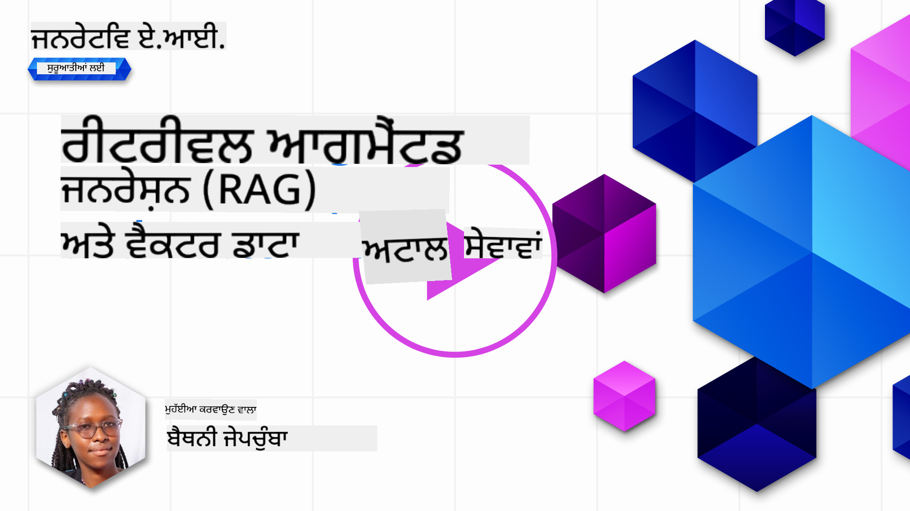
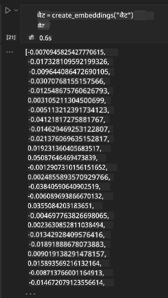

<!--
CO_OP_TRANSLATOR_METADATA:
{
  "original_hash": "b4b0266fbadbba7ded891b6485adc66d",
  "translation_date": "2025-10-17T14:08:25+00:00",
  "source_file": "15-rag-and-vector-databases/README.md",
  "language_code": "pa"
}
-->
# ਰੀਟਰੀਵਲ ਆਗਮੈਂਟਡ ਜਨਰੇਸ਼ਨ (RAG) ਅਤੇ ਵੈਕਟਰ ਡੇਟਾਬੇਸ

[](https://youtu.be/4l8zhHUBeyI?si=BmvDmL1fnHtgQYkL)

ਖੋਜ ਐਪਲੀਕੇਸ਼ਨ ਪਾਠ ਵਿੱਚ, ਅਸੀਂ ਛੋਟੇ ਪੱਧਰ 'ਤੇ ਸਿੱਖਿਆ ਸੀ ਕਿ ਆਪਣੇ ਡਾਟਾ ਨੂੰ ਵੱਡੇ ਭਾਸ਼ਾ ਮਾਡਲ (LLMs) ਵਿੱਚ ਕਿਵੇਂ ਸ਼ਾਮਲ ਕਰਨਾ ਹੈ। ਇਸ ਪਾਠ ਵਿੱਚ, ਅਸੀਂ ਆਪਣੇ ਡਾਟਾ ਨੂੰ LLM ਐਪਲੀਕੇਸ਼ਨ ਵਿੱਚ ਜਮਾਉਣ ਦੇ ਸਿਧਾਂਤਾਂ, ਪ੍ਰਕਿਰਿਆ ਦੇ ਤਰੀਕੇ ਅਤੇ ਡਾਟਾ ਸਟੋਰ ਕਰਨ ਦੇ ਤਰੀਕਿਆਂ, ਜਿਵੇਂ ਕਿ ਐਮਬੈਡਿੰਗ ਅਤੇ ਟੈਕਸਟ, ਨੂੰ ਵਧੇਰੇ ਗਹਿਰਾਈ ਨਾਲ ਸਮਝਾਂਗੇ।

> **ਵੀਡੀਓ ਜਲਦੀ ਆ ਰਹੀ ਹੈ**

## ਪਰਿਚਯ

ਇਸ ਪਾਠ ਵਿੱਚ ਅਸੀਂ ਹੇਠਾਂ ਦਿੱਤੇ ਵਿਸ਼ਿਆਂ ਨੂੰ ਕਵਰ ਕਰਾਂਗੇ:

- RAG ਦਾ ਪਰਿਚਯ, ਇਹ ਕੀ ਹੈ ਅਤੇ AI (ਕ੍ਰਿਤ੍ਰਿਮ ਬੁੱਧੀ) ਵਿੱਚ ਇਸਦਾ ਕਿਉਂ ਇਸਤੇਮਾਲ ਹੁੰਦਾ ਹੈ।

- ਵੈਕਟਰ ਡੇਟਾਬੇਸ ਕੀ ਹਨ ਅਤੇ ਆਪਣੇ ਐਪਲੀਕੇਸ਼ਨ ਲਈ ਇੱਕ ਬਣਾਉਣ ਦੀ ਸਮਝ।

- RAG ਨੂੰ ਇੱਕ ਐਪਲੀਕੇਸ਼ਨ ਵਿੱਚ ਸ਼ਾਮਲ ਕਰਨ ਦਾ ਇੱਕ ਵਿਹੰਗਮ ਉਦਾਹਰਨ।

## ਸਿੱਖਣ ਦੇ ਲਕਸ਼

ਇਸ ਪਾਠ ਨੂੰ ਪੂਰਾ ਕਰਨ ਤੋਂ ਬਾਅਦ, ਤੁਸੀਂ ਇਹ ਕਰਨ ਦੇ ਯੋਗ ਹੋਵੋਗੇ:

- ਡਾਟਾ ਰੀਟਰੀਵਲ ਅਤੇ ਪ੍ਰੋਸੈਸਿੰਗ ਵਿੱਚ RAG ਦੀ ਮਹੱਤਤਾ ਨੂੰ ਸਮਝਾਉਣਾ।

- RAG ਐਪਲੀਕੇਸ਼ਨ ਸੈਟਅਪ ਕਰਨਾ ਅਤੇ ਆਪਣੇ ਡਾਟਾ ਨੂੰ LLM ਵਿੱਚ ਜਮਾਉਣਾ।

- LLM ਐਪਲੀਕੇਸ਼ਨ ਵਿੱਚ RAG ਅਤੇ ਵੈਕਟਰ ਡੇਟਾਬੇਸ ਦੀ ਪ੍ਰਭਾਵਸ਼ਾਲੀ ਸ਼ਾਮਲਗੀ।

## ਸਾਡਾ ਦ੍ਰਿਸ਼: ਆਪਣੇ ਡਾਟਾ ਨਾਲ LLM ਨੂੰ ਵਧੀਆ ਬਣਾਉਣਾ

ਇਸ ਪਾਠ ਲਈ, ਅਸੀਂ ਸਿੱਖਿਆ ਸਟਾਰਟਅਪ ਵਿੱਚ ਆਪਣੇ ਨੋਟਸ ਸ਼ਾਮਲ ਕਰਨਾ ਚਾਹੁੰਦੇ ਹਾਂ, ਜੋ ਚੈਟਬੋਟ ਨੂੰ ਵੱਖ-ਵੱਖ ਵਿਸ਼ਿਆਂ ਬਾਰੇ ਹੋਰ ਜਾਣਕਾਰੀ ਪ੍ਰਾਪਤ ਕਰਨ ਦੀ ਆਗਿਆ ਦਿੰਦਾ ਹੈ। ਆਪਣੇ ਨੋਟਸ ਦੀ ਵਰਤੋਂ ਕਰਕੇ, ਸਿੱਖਣ ਵਾਲੇ ਵਿਦਿਆਰਥੀ ਵੱਖ-ਵੱਖ ਵਿਸ਼ਿਆਂ ਨੂੰ ਬਿਹਤਰ ਢੰਗ ਨਾਲ ਸਮਝ ਸਕਣਗੇ ਅਤੇ ਆਪਣੇ ਇਮਤਿਹਾਨਾਂ ਦੀ ਤਿਆਰੀ ਆਸਾਨੀ ਨਾਲ ਕਰ ਸਕਣਗੇ। ਇਸ ਦ੍ਰਿਸ਼ ਨੂੰ ਬਣਾਉਣ ਲਈ, ਅਸੀਂ ਹੇਠਾਂ ਦਿੱਤੇ ਤੱਤਾਂ ਦੀ ਵਰਤੋਂ ਕਰਾਂਗੇ:

- `Azure OpenAI:` LLM ਜੋ ਅਸੀਂ ਆਪਣੇ ਚੈਟਬੋਟ ਬਣਾਉਣ ਲਈ ਵਰਤਾਂਗੇ।

- `AI for beginners' lesson on Neural Networks`: ਇਹ ਡਾਟਾ ਹੈ ਜਿਸ 'ਤੇ ਅਸੀਂ ਆਪਣੇ LLM ਨੂੰ ਜਮਾਉਂਦੇ ਹਾਂ।

- `Azure AI Search` ਅਤੇ `Azure Cosmos DB:` ਵੈਕਟਰ ਡੇਟਾਬੇਸ ਜੋ ਸਾਡੇ ਡਾਟਾ ਨੂੰ ਸਟੋਰ ਕਰਨ ਅਤੇ ਖੋਜ ਇੰਡੈਕਸ ਬਣਾਉਣ ਲਈ ਵਰਤਾਂਗੇ।

ਉਪਭੋਗਤਾ ਆਪਣੇ ਨੋਟਸ ਤੋਂ ਪ੍ਰੈਕਟਿਸ ਕਵਿਜ਼ ਬਣਾਉਣ, ਰਿਵੀਜ਼ਨ ਫਲੈਸ਼ ਕਾਰਡ ਅਤੇ ਸੰਖੇਪ ਝਲਕੀਆਂ ਬਣਾਉਣ ਦੇ ਯੋਗ ਹੋਣਗੇ। ਸ਼ੁਰੂ ਕਰਨ ਲਈ, ਆਓ RAG ਅਤੇ ਇਸਦੇ ਕੰਮ ਕਰਨ ਦੇ ਤਰੀਕੇ ਨੂੰ ਵੇਖੀਏ:

## ਰੀਟਰੀਵਲ ਆਗਮੈਂਟਡ ਜਨਰੇਸ਼ਨ (RAG)

ਇੱਕ LLM ਚਲਾਇਆ ਚੈਟਬੋਟ ਉਪਭੋਗਤਾ ਦੇ ਪ੍ਰਸ਼ਨਾਂ ਨੂੰ ਪ੍ਰੋਸੈਸ ਕਰਕੇ ਜਵਾਬ ਪੈਦਾ ਕਰਦਾ ਹੈ। ਇਹ ਇੰਟਰੈਕਟਿਵ ਬਣਾਇਆ ਗਿਆ ਹੈ ਅਤੇ ਵੱਖ-ਵੱਖ ਵਿਸ਼ਿਆਂ 'ਤੇ ਉਪਭੋਗਤਾ ਨਾਲ ਗੱਲਬਾਤ ਕਰਦਾ ਹੈ। ਹਾਲਾਂਕਿ, ਇਸਦੇ ਜਵਾਬ ਉਸ ਸੰਦਰਭ ਤੱਕ ਸੀਮਿਤ ਹੁੰਦੇ ਹਨ ਜੋ ਇਸਨੂੰ ਦਿੱਤਾ ਜਾਂਦਾ ਹੈ ਅਤੇ ਇਸਦੇ ਮੂਲ ਤਰਬੀਅਤ ਡਾਟਾ। ਉਦਾਹਰਣ ਲਈ, GPT-4 ਦਾ ਗਿਆਨ ਸਤੰਬਰ 2021 ਤੱਕ ਸੀਮਿਤ ਹੈ, ਜਿਸਦਾ ਮਤਲਬ ਹੈ ਕਿ ਇਸਨੂੰ ਇਸ ਸਮੇਂ ਤੋਂ ਬਾਅਦ ਹੋਈਆਂ ਘਟਨਾਵਾਂ ਬਾਰੇ ਗਿਆਨ ਨਹੀਂ ਹੈ। ਇਸਦੇ ਨਾਲ, LLMs ਨੂੰ ਤਰਬੀਅਤ ਦੇਣ ਲਈ ਵਰਤੇ ਗਏ ਡਾਟਾ ਵਿੱਚ ਵਿਸ਼ੇਸ਼ ਜਾਣਕਾਰੀ ਜਿਵੇਂ ਕਿ ਨਿੱਜੀ ਨੋਟਸ ਜਾਂ ਕੰਪਨੀ ਦੇ ਉਤਪਾਦ ਮੈਨੂਅਲ ਸ਼ਾਮਲ ਨਹੀਂ ਹੁੰਦੇ।

### RAGs (ਰੀਟਰੀਵਲ ਆਗਮੈਂਟਡ ਜਨਰੇਸ਼ਨ) ਕਿਵੇਂ ਕੰਮ ਕਰਦੇ ਹਨ


ਮੰਨ ਲਓ ਕਿ ਤੁਸੀਂ ਇੱਕ ਚੈਟਬੋਟ ਤੈਨਾਤ ਕਰਨਾ ਚਾਹੁੰਦੇ ਹੋ ਜੋ ਤੁਹਾਡੇ ਨੋਟਸ ਤੋਂ ਕਵਿਜ਼ ਬਣਾਉਂਦਾ ਹੈ, ਤੁਹਾਨੂੰ ਗਿਆਨ ਅਧਾਰ ਨਾਲ ਕਨੈਕਸ਼ਨ ਦੀ ਲੋੜ ਹੋਵੇਗੀ। ਇਹ ਜਿੱਥੇ RAG ਮਦਦ ਲਈ ਆਉਂਦਾ ਹੈ। RAGs ਹੇਠਾਂ ਦਿੱਤੇ ਤਰੀਕੇ ਨਾਲ ਕੰਮ ਕਰਦੇ ਹਨ:

- **ਗਿਆਨ ਅਧਾਰ:** ਰੀਟਰੀਵਲ ਤੋਂ ਪਹਿਲਾਂ, ਇਹ ਦਸਤਾਵੇਜ਼ਾਂ ਨੂੰ ਸੰਗ੍ਰਹਿ ਅਤੇ ਪ੍ਰੀ-ਪ੍ਰੋਸੈਸ ਕਰਨ ਦੀ ਲੋੜ ਹੁੰਦੀ ਹੈ, ਆਮ ਤੌਰ 'ਤੇ ਵੱਡੇ ਦਸਤਾਵੇਜ਼ਾਂ ਨੂੰ ਛੋਟੇ ਟੁਕੜਿਆਂ ਵਿੱਚ ਤੋੜਨਾ, ਉਨ੍ਹਾਂ ਨੂੰ ਟੈਕਸਟ ਐਮਬੈਡਿੰਗ ਵਿੱਚ ਬਦਲਣਾ ਅਤੇ ਉਨ੍ਹਾਂ ਨੂੰ ਡੇਟਾਬੇਸ ਵਿੱਚ ਸਟੋਰ ਕਰਨਾ।

- **ਉਪਭੋਗਤਾ ਪ੍ਰਸ਼ਨ:** ਉਪਭੋਗਤਾ ਇੱਕ ਸਵਾਲ ਪੁੱਛਦਾ ਹੈ।

- **ਰੀਟਰੀਵਲ:** ਜਦੋਂ ਉਪਭੋਗਤਾ ਇੱਕ ਸਵਾਲ ਪੁੱਛਦਾ ਹੈ, ਐਮਬੈਡਿੰਗ ਮਾਡਲ ਸਾਡੇ ਗਿਆਨ ਅਧਾਰ ਤੋਂ ਸੰਦਰਭ ਪ੍ਰਦਾਨ ਕਰਨ ਲਈ ਸਬੰਧਤ ਜਾਣਕਾਰੀ ਰੀਟਰੀਵ ਕਰਦਾ ਹੈ ਜੋ ਪ੍ਰਸ਼ਨ ਵਿੱਚ ਸ਼ਾਮਲ ਕੀਤੀ ਜਾਵੇਗੀ।

- **ਆਗਮੈਂਟਡ ਜਨਰੇਸ਼ਨ:** LLM ਆਪਣੇ ਜਵਾਬ ਨੂੰ ਰੀਟਰੀਵ ਕੀਤੇ ਡਾਟਾ ਦੇ ਆਧਾਰ 'ਤੇ ਵਧਾਉਂਦਾ ਹੈ। ਇਹ ਜਵਾਬ ਨੂੰ ਸਿਰਫ਼ ਪ੍ਰੀ-ਟ੍ਰੇਨਡ ਡਾਟਾ ਦੇ ਆਧਾਰ 'ਤੇ ਹੀ ਨਹੀਂ, ਸਗੋਂ ਸ਼ਾਮਲ ਸੰਦਰਭ ਤੋਂ ਸਬੰਧਤ ਜਾਣਕਾਰੀ ਦੇ ਆਧਾਰ 'ਤੇ ਬਣਾਉਣ ਦੀ ਆਗਿਆ ਦਿੰਦਾ ਹੈ। ਰੀਟਰੀਵ ਕੀਤਾ ਡਾਟਾ LLM ਦੇ ਜਵਾਬਾਂ ਨੂੰ ਵਧਾਉਣ ਲਈ ਵਰਤਿਆ ਜਾਂਦਾ ਹੈ। LLM ਫਿਰ ਉਪਭੋਗਤਾ ਦੇ ਸਵਾਲ ਦਾ ਜਵਾਬ ਵਾਪਸ ਕਰਦਾ ਹੈ।


RAGs ਦਾ ਆਰਕੀਟੈਕਚਰ ਟ੍ਰਾਂਸਫਾਰਮਰਜ਼ ਦੀ ਵਰਤੋਂ ਕਰਕੇ ਲਾਗੂ ਕੀਤਾ ਜਾਂਦਾ ਹੈ ਜਿਸ ਵਿੱਚ ਦੋ ਹਿੱਸੇ ਹੁੰਦੇ ਹਨ: ਇੱਕ ਐਨਕੋਡਰ ਅਤੇ ਇੱਕ ਡੀਕੋਡਰ। ਉਦਾਹਰਣ ਲਈ, ਜਦੋਂ ਉਪਭੋਗਤਾ ਇੱਕ ਸਵਾਲ ਪੁੱਛਦਾ ਹੈ, ਇਨਪੁਟ ਟੈਕਸਟ 'ਐਨਕੋਡ' ਕੀਤਾ ਜਾਂਦਾ ਹੈ ਵੈਕਟਰਜ਼ ਵਿੱਚ ਜੋ ਸ਼ਬਦਾਂ ਦੇ ਅਰਥ ਨੂੰ ਕੈਪਚਰ ਕਰਦੇ ਹਨ ਅਤੇ ਵੈਕਟਰਜ਼ ਨੂੰ 'ਡੀਕੋਡ' ਕਰਕੇ ਸਾਡੇ ਦਸਤਾਵੇਜ਼ ਇੰਡੈਕਸ ਵਿੱਚ ਬਦਲਿਆ ਜਾਂਦਾ ਹੈ ਅਤੇ ਉਪਭੋਗਤਾ ਪ੍ਰਸ਼ਨ ਦੇ ਆਧਾਰ 'ਤੇ ਨਵਾਂ ਟੈਕਸਟ ਪੈਦਾ ਕਰਦਾ ਹੈ। LLM ਦੋਵੇਂ ਐਨਕੋਡਰ-ਡੀਕੋਡਰ ਮਾਡਲ ਦੀ ਵਰਤੋਂ ਕਰਦਾ ਹੈ।

ਦੋ ਤਰੀਕੇ ਜਦੋਂ RAG ਨੂੰ ਲਾਗੂ ਕੀਤਾ ਜਾਂਦਾ ਹੈ ਜਿਵੇਂ ਕਿ ਪ੍ਰਸਤਾਵਿਤ ਪੇਪਰ: [ਰੀਟਰੀਵਲ-ਆਗਮੈਂਟਡ ਜਨਰੇਸ਼ਨ ਫਾਰ ਨੋਲੇਜ ਇੰਟੈਂਸਿਵ NLP (ਕੁਦਰਤੀ ਭਾਸ਼ਾ ਪ੍ਰੋਸੈਸਿੰਗ ਸੌਫਟਵੇਅਰ) ਟਾਸਕ](https://arxiv.org/pdf/2005.11401.pdf?WT.mc_id=academic-105485-koreyst) ਵਿੱਚ ਹਨ:

- **_RAG-ਸੀਕਵੈਂਸ_** ਰੀਟਰੀਵ ਕੀਤੇ ਦਸਤਾਵੇਜ਼ਾਂ ਦੀ ਵਰਤੋਂ ਕਰਕੇ ਉਪਭੋਗਤਾ ਪ੍ਰਸ਼ਨ ਦਾ ਸਭ ਤੋਂ ਵਧੀਆ ਸੰਭਵ ਜਵਾਬ ਪੇਸ਼ ਕਰਨ ਲਈ।

- **RAG-ਟੋਕਨ** ਦਸਤਾਵੇਜ਼ਾਂ ਦੀ ਵਰਤੋਂ ਕਰਕੇ ਅਗਲਾ ਟੋਕਨ ਪੈਦਾ ਕਰਨਾ, ਫਿਰ ਉਨ੍ਹਾਂ ਨੂੰ ਉਪਭੋਗਤਾ ਦੇ ਪ੍ਰਸ਼ਨ ਦਾ ਜਵਾਬ ਦੇਣ ਲਈ ਰੀਟਰੀਵ ਕਰਨਾ।

### RAGs ਕਿਉਂ ਵਰਤਦੇ ਹੋ?

- **ਜਾਣਕਾਰੀ ਦੀ ਧਨਵਾਨੀ:** ਇਹ ਯਕੀਨੀ ਬਣਾਉਂਦਾ ਹੈ ਕਿ ਟੈਕਸਟ ਜਵਾਬ ਅਪ-ਟੂ-ਡੇਟ ਅਤੇ ਮੌਜੂਦਾ ਹਨ। ਇਸ ਲਈ, ਇਹ ਡੋਮੇਨ ਵਿਸ਼ੇਸ਼ ਕੰਮਾਂ 'ਤੇ ਪ੍ਰਦਰਸ਼ਨ ਨੂੰ ਵਧਾਉਂਦਾ ਹੈ ਅੰਦਰੂਨੀ ਗਿਆਨ ਅਧਾਰ ਤੱਕ ਪਹੁੰਚ ਕਰਕੇ।

- **ਗਲਤ ਜਾਣਕਾਰੀ ਘਟਾਉਣ:** **ਪ੍ਰਮਾਣਿਕ ਡਾਟਾ** ਦੀ ਵਰਤੋਂ ਕਰਕੇ ਉਪਭੋਗਤਾ ਦੇ ਪ੍ਰਸ਼ਨਾਂ ਨੂੰ ਸੰਦਰਭ ਪ੍ਰਦਾਨ ਕਰਦਾ ਹੈ।

- **ਲਾਗਤ ਪ੍ਰਭਾਵਸ਼ਾਲੀ:** ਇਹ LLM ਨੂੰ ਫਾਈਨ-ਟਿਊਨ ਕਰਨ ਦੇ ਮੁਕਾਬਲੇ ਵਧੇਰੇ ਆਰਥਿਕ ਹਨ।

## ਗਿਆਨ ਅਧਾਰ ਬਣਾਉਣਾ

ਸਾਡਾ ਐਪਲੀਕੇਸ਼ਨ ਸਾਡੇ ਨਿੱਜੀ ਡਾਟਾ ਜਿਵੇਂ ਕਿ Neural Network ਪਾਠ 'AI For Beginners' ਕਰਿਕੁਲਮ 'ਤੇ ਆਧਾਰਿਤ ਹੈ।

### ਵੈਕਟਰ ਡੇਟਾਬੇਸ

ਇੱਕ ਵੈਕਟਰ ਡੇਟਾਬੇਸ, ਰਵਾਇਤੀ ਡੇਟਾਬੇਸਾਂ ਦੇ ਵਿਰੁੱਧ, ਇੱਕ ਵਿਸ਼ੇਸ਼ ਡੇਟਾਬੇਸ ਹੈ ਜੋ ਐਮਬੈਡਿੰਗ ਵੈਕਟਰਜ਼ ਨੂੰ ਸਟੋਰ, ਪ੍ਰਬੰਧ ਅਤੇ ਖੋਜ ਕਰਨ ਲਈ ਬਣਾਇਆ ਗਿਆ ਹੈ। ਇਹ ਦਸਤਾਵੇਜ਼ਾਂ ਦੇ ਗਿਣਤੀਮਾਨ ਪ੍ਰਤੀਨਿਧੀਆਂ ਨੂੰ ਸਟੋਰ ਕਰਦਾ ਹੈ। ਡਾਟਾ ਨੂੰ ਗਿਣਤੀਮਾਨ ਐਮਬੈਡਿੰਗ ਵਿੱਚ ਤੋੜਨਾ ਸਾਡੇ AI ਸਿਸਟਮ ਲਈ ਡਾਟਾ ਨੂੰ ਸਮਝਣਾ ਅਤੇ ਪ੍ਰੋਸੈਸ ਕਰਨਾ ਆਸਾਨ ਬਣਾਉਂਦਾ ਹੈ।

ਅਸੀਂ ਆਪਣੇ ਐਮਬੈਡਿੰਗ ਨੂੰ ਵੈਕਟਰ ਡੇਟਾਬੇਸ ਵਿੱਚ ਸਟੋਰ ਕਰਦੇ ਹਾਂ ਕਿਉਂਕਿ LLMs ਵਿੱਚ ਟੋਕਨ ਦੀ ਗਿਣਤੀ ਦੀ ਸੀਮਾ ਹੁੰਦੀ ਹੈ ਜੋ ਉਹ ਇਨਪੁਟ ਵਜੋਂ ਸਵੀਕਾਰ ਕਰਦੇ ਹਨ। ਜਿਵੇਂ ਕਿ ਤੁਸੀਂ ਸਾਰੇ ਐਮਬੈਡਿੰਗ ਨੂੰ LLM ਵਿੱਚ ਪਾਸ ਨਹੀਂ ਕਰ ਸਕਦੇ, ਅਸੀਂ ਉਨ੍ਹਾਂ ਨੂੰ ਟੁਕੜਿਆਂ ਵਿੱਚ ਤੋੜਨ ਦੀ ਲੋੜ ਹੋਵੇਗੀ ਅਤੇ ਜਦੋਂ ਉਪਭੋਗਤਾ ਇੱਕ ਸਵਾਲ ਪੁੱਛਦਾ ਹੈ, ਸਵਾਲ ਦੇ ਸਭ ਤੋਂ ਵਧੀਆ ਮਿਲਦੇ ਐਮਬੈਡਿੰਗ ਪ੍ਰੰਪਟ ਦੇ ਨਾਲ ਵਾਪਸ ਕੀਤੇ ਜਾਣਗੇ। ਟੁਕੜੇ ਕਰਨ ਨਾਲ LLM ਵਿੱਚ ਪਾਸ ਕੀਤੇ ਟੋਕਨ ਦੀ ਗਿਣਤੀ ਦੀ ਲਾਗਤ ਵੀ ਘਟਦੀ ਹੈ।

ਕੁਝ ਪ੍ਰਸਿੱਧ ਵੈਕਟਰ ਡੇਟਾਬੇਸ ਵਿੱਚ Azure Cosmos DB, Clarifyai, Pinecone, Chromadb, ScaNN, Qdrant ਅਤੇ DeepLake ਸ਼ਾਮਲ ਹਨ। ਤੁਸੀਂ ਹੇਠਾਂ ਦਿੱਤੇ ਕਮਾਂਡ ਦੀ ਵਰਤੋਂ ਕਰਕੇ Azure CLI ਨਾਲ ਇੱਕ Azure Cosmos DB ਮਾਡਲ ਬਣਾਉਣ ਲਈ ਕਰ ਸਕਦੇ ਹੋ:

```bash
az login
az group create -n <resource-group-name> -l <location>
az cosmosdb create -n <cosmos-db-name> -r <resource-group-name>
az cosmosdb list-keys -n <cosmos-db-name> -g <resource-group-name>
```

### ਟੈਕਸਟ ਤੋਂ ਐਮਬੈਡਿੰਗ ਤੱਕ

ਡਾਟਾ ਸਟੋਰ ਕਰਨ ਤੋਂ ਪਹਿਲਾਂ, ਅਸੀਂ ਇਸਨੂੰ ਵੈਕਟਰ ਐਮਬੈਡਿੰਗ ਵਿੱਚ ਬਦਲਣ ਦੀ ਲੋੜ ਹੋਵੇਗੀ ਇਸਨੂੰ ਡੇਟਾਬੇਸ ਵਿੱਚ ਸਟੋਰ ਕਰਨ ਤੋਂ ਪਹਿਲਾਂ। ਜੇ ਤੁਸੀਂ ਵੱਡੇ ਦਸਤਾਵੇਜ਼ਾਂ ਜਾਂ ਲੰਬੇ ਟੈਕਸਟਾਂ ਨਾਲ ਕੰਮ ਕਰ ਰਹੇ ਹੋ, ਤੁਸੀਂ ਉਨ੍ਹਾਂ ਨੂੰ ਉਮੀਦ ਕੀਤੇ ਪ੍ਰਸ਼ਨਾਂ ਦੇ ਆਧਾਰ 'ਤੇ ਟੁਕੜਿਆਂ ਵਿੱਚ ਤੋੜ ਸਕਦੇ ਹੋ। ਟੁਕੜੇ ਕਰਨ ਨੂੰ ਵਾਕ ਪੱਧਰ 'ਤੇ ਜਾਂ ਪੈਰਾ ਪੱਧਰ 'ਤੇ ਕੀਤਾ ਜਾ ਸਕਦਾ ਹੈ। ਜਿਵੇਂ ਕਿ ਟੁਕੜੇ ਕਰਨ ਨਾਲ ਸ਼ਬਦਾਂ ਦੇ ਆਲੇ-ਦੁਆਲੇ ਦੇ ਅਰਥ ਨਿਕਲਦੇ ਹਨ, ਤੁਸੀਂ ਟੁਕੜੇ ਵਿੱਚ ਕੁਝ ਹੋਰ ਸੰਦਰਭ ਸ਼ਾਮਲ ਕਰ ਸਕਦੇ ਹੋ, ਉਦਾਹਰਣ ਲਈ, ਦਸਤਾਵੇਜ਼ ਦਾ ਸਿਰਲੇਖ ਸ਼ਾਮਲ ਕਰਨਾ ਜਾਂ ਟੁਕੜੇ ਤੋਂ ਪਹਿਲਾਂ ਜਾਂ ਬਾਅਦ ਕੁਝ ਟੈਕਸਟ ਸ਼ਾਮਲ ਕਰਨਾ। ਤੁਸੀਂ ਡਾਟਾ ਨੂੰ ਹੇਠਾਂ ਦਿੱਤੇ ਤਰੀਕੇ ਨਾਲ ਟੁਕੜਿਆਂ ਵਿੱਚ ਤੋੜ ਸਕਦੇ ਹੋ:

```python
def split_text(text, max_length, min_length):
    words = text.split()
    chunks = []
    current_chunk = []

    for word in words:
        current_chunk.append(word)
        if len(' '.join(current_chunk)) < max_length and len(' '.join(current_chunk)) > min_length:
            chunks.append(' '.join(current_chunk))
            current_chunk = []

    # If the last chunk didn't reach the minimum length, add it anyway
    if current_chunk:
        chunks.append(' '.join(current_chunk))

    return chunks
```

ਟੁਕੜਿਆਂ ਵਿੱਚ ਤੋੜਨ ਤੋਂ ਬਾਅਦ, ਅਸੀਂ ਆਪਣੇ ਟੈਕਸਟ ਨੂੰ ਵੱਖ-ਵੱਖ ਐਮਬੈਡਿੰਗ ਮਾਡਲਾਂ ਦੀ ਵਰਤੋਂ ਕਰਕੇ ਐਮਬੈਡ ਕਰ ਸਕਦੇ ਹਾਂ। ਕੁਝ ਮਾਡਲ ਜੋ ਤੁਸੀਂ ਵਰਤ ਸਕਦੇ ਹੋ ਵਿੱਚ ਸ਼ਾਮਲ ਹਨ: word2vec, ada-002 OpenAI ਦੁਆਰਾ, Azure Computer Vision ਅਤੇ ਹੋਰ ਬਹੁਤ ਕੁਝ। ਕਿਸੇ ਮਾਡਲ ਦੀ ਚੋਣ ਇਸ ਗੱਲ 'ਤੇ ਨਿਰਭਰ ਕਰੇਗੀ ਕਿ ਤੁਸੀਂ ਕਿਹੜੀਆਂ ਭਾਸ਼ਾਵਾਂ ਦੀ ਵਰਤੋਂ ਕਰ ਰਹੇ ਹੋ, ਕੋਡ ਕੀਤੇ ਸਮੱਗਰੀ ਦਾ ਕਿਸਮ (ਟੈਕਸਟ/ਚਿੱਤਰ/ਆਡੀਓ), ਇਨਪੁਟ ਦਾ ਆਕਾਰ ਜੋ ਇਹ ਕੋਡ ਕਰ ਸਕਦਾ ਹੈ ਅਤੇ ਐਮਬੈਡਿੰਗ ਆਉਟਪੁੱਟ ਦੀ ਲੰਬਾਈ।

OpenAI ਦੇ `text-embedding-ada-002` ਮਾਡਲ ਦੀ ਵਰਤੋਂ ਕਰਕੇ ਐਮਬੈਡ ਕੀਤੇ ਟੈਕਸਟ ਦਾ ਇੱਕ ਉਦਾਹਰਣ:


## ਰੀਟਰੀਵਲ ਅਤੇ ਵੈਕਟਰ ਖੋਜ

ਜਦੋਂ ਉਪਭੋਗਤਾ ਇੱਕ ਸਵਾਲ ਪੁੱਛਦਾ ਹੈ, ਰੀਟਰੀਵਰ ਇਸਨੂੰ ਕਵੈਰੀ ਐਨਕੋਡਰ ਦੀ ਵਰਤੋਂ ਕਰਕੇ ਵੈਕਟਰ ਵਿੱਚ ਬਦਲਦਾ ਹੈ, ਫਿਰ ਇਹ ਸਾਡੇ ਦਸਤਾਵੇਜ਼ ਖੋਜ ਇੰਡੈਕਸ ਵਿੱਚ ਇਨਪੁਟ ਨਾਲ ਸਬੰਧਤ ਦਸਤਾਵੇਜ਼ਾਂ ਵਿੱਚ ਸਬੰਧਤ ਵੈਕਟਰਜ਼ ਦੀ ਖੋਜ ਕਰਦਾ ਹੈ। ਇੱਕ ਵਾਰ ਹੋਣ ਤੋਂ ਬਾਅਦ, ਇਹ ਇਨਪੁਟ ਵੈਕਟਰ ਅਤੇ ਦਸਤਾਵੇਜ਼ ਵੈਕਟਰਜ਼ ਨੂੰ ਟੈਕਸਟ ਵਿੱਚ ਬਦਲਦਾ ਹੈ ਅਤੇ ਇਸਨੂੰ LLM ਵਿੱਚ ਪਾਸ ਕਰਦਾ ਹੈ।

### ਰੀਟਰੀਵਲ

ਰੀਟਰੀਵਲ ਉਸ ਸਮੇਂ ਹੁੰਦਾ ਹੈ ਜਦੋਂ ਸਿਸਟਮ ਇੰਡੈਕਸ ਤੋਂ ਉਹ ਦਸਤਾਵੇਜ਼ਾਂ ਨੂੰ ਤੇਜ਼ੀ ਨਾਲ ਲੱਭਣ ਦੀ ਕੋਸ਼ਿਸ਼ ਕਰਦਾ ਹੈ ਜੋ ਖੋਜ ਮਾਪਦੰਡਾਂ ਨੂੰ ਪੂਰਾ ਕਰਦੇ ਹਨ। ਰੀਟਰੀਵਰ ਦਾ ਉਦੇਸ਼ ਉਹ ਦਸਤਾਵੇਜ਼ ਪ੍ਰਾਪਤ ਕਰਨਾ ਹੈ ਜੋ ਸੰਦਰਭ ਪ੍ਰਦਾਨ ਕਰਨ ਲਈ ਵਰਤੇ ਜਾਣਗੇ ਅਤੇ LLM ਨੂੰ ਤੁਹਾਡੇ ਡਾਟਾ 'ਤੇ ਜਮਾਉਣਗੇ।

ਸਾਡੇ ਡੇਟਾਬੇਸ ਵਿੱਚ ਖੋਜ ਕਰਨ ਦੇ ਕਈ ਤਰੀਕੇ ਹਨ ਜਿਵੇਂ ਕਿ:

- **ਕੀਵਰਡ ਖੋਜ** - ਟੈਕਸਟ ਖੋਜਾਂ ਲਈ ਵਰਤਿਆ ਜਾਂਦਾ ਹੈ।

- **ਸੈਮੈਂਟਿਕ ਖੋਜ** - ਸ਼ਬਦਾਂ ਦੇ ਸੈਮੈਂਟਿਕ ਅਰਥ ਦੀ ਵਰਤੋਂ ਕਰਦਾ ਹੈ।

- **ਵੈਕਟਰ ਖੋਜ** - ਦਸਤਾਵੇਜ਼ਾਂ ਨੂੰ ਟੈਕਸਟ ਤੋਂ ਐਮਬੈਡਿੰਗ ਮਾਡਲਾਂ ਦੀ ਵਰਤੋਂ ਕਰਕੇ ਵੈਕਟਰ ਪ੍ਰਤੀਨਿਧੀਆਂ ਵਿੱਚ ਬਦਲਦਾ ਹੈ। ਰੀਟਰੀਵਲ ਉਨ੍ਹਾਂ ਦਸਤਾਵੇਜ਼ਾਂ ਨੂੰ ਕਵੈਰੀ ਕਰਕੇ ਕੀਤਾ ਜਾਵੇਗਾ ਜਿਨ੍ਹਾਂ ਦੇ ਵੈਕਟਰ ਪ੍ਰਤੀਨਿਧੀਆਂ ਉਪਭੋਗਤਾ ਦੇ ਸਵਾਲ ਦੇ ਸਭ ਤੋਂ ਨੇੜੇ ਹਨ।

- **ਹਾਈਬ੍ਰਿਡ** - ਕੀਵਰਡ ਅਤੇ ਵੈਕਟਰ ਖੋਜ ਦੋਵਾਂ ਦੇ ਮਿਲਾਪ ਦਾ ਇੱਕ ਸੰਯੋਗ।

ਰੀਟਰੀਵਲ ਨਾਲ ਇੱਕ ਚੁਣੌਤੀ ਉਸ ਸਮੇਂ ਆਉਂਦੀ ਹੈ ਜ

---

**ਅਸਵੀਕਰਤਾ**:  
ਇਹ ਦਸਤਾਵੇਜ਼ AI ਅਨੁਵਾਦ ਸੇਵਾ [Co-op Translator](https://github.com/Azure/co-op-translator) ਦੀ ਵਰਤੋਂ ਕਰਕੇ ਅਨੁਵਾਦ ਕੀਤਾ ਗਿਆ ਹੈ। ਜਦੋਂ ਕਿ ਅਸੀਂ ਸਹੀ ਹੋਣ ਦਾ ਯਤਨ ਕਰਦੇ ਹਾਂ, ਕਿਰਪਾ ਕਰਕੇ ਧਿਆਨ ਦਿਓ ਕਿ ਸਵੈਚਾਲਿਤ ਅਨੁਵਾਦਾਂ ਵਿੱਚ ਗਲਤੀਆਂ ਜਾਂ ਅਸੁੱਤੀਆਂ ਹੋ ਸਕਦੀਆਂ ਹਨ। ਇਸ ਦੀ ਮੂਲ ਭਾਸ਼ਾ ਵਿੱਚ ਮੂਲ ਦਸਤਾਵੇਜ਼ ਨੂੰ ਅਧਿਕਾਰਤ ਸਰੋਤ ਮੰਨਿਆ ਜਾਣਾ ਚਾਹੀਦਾ ਹੈ। ਮਹੱਤਵਪੂਰਨ ਜਾਣਕਾਰੀ ਲਈ, ਪੇਸ਼ੇਵਰ ਮਨੁੱਖੀ ਅਨੁਵਾਦ ਦੀ ਸਿਫਾਰਸ਼ ਕੀਤੀ ਜਾਂਦੀ ਹੈ। ਇਸ ਅਨੁਵਾਦ ਦੀ ਵਰਤੋਂ ਤੋਂ ਪੈਦਾ ਹੋਣ ਵਾਲੇ ਕਿਸੇ ਵੀ ਗਲਤਫਹਿਮੀ ਜਾਂ ਗਲਤ ਵਿਆਖਿਆ ਲਈ ਅਸੀਂ ਜ਼ਿੰਮੇਵਾਰ ਨਹੀਂ ਹਾਂ।