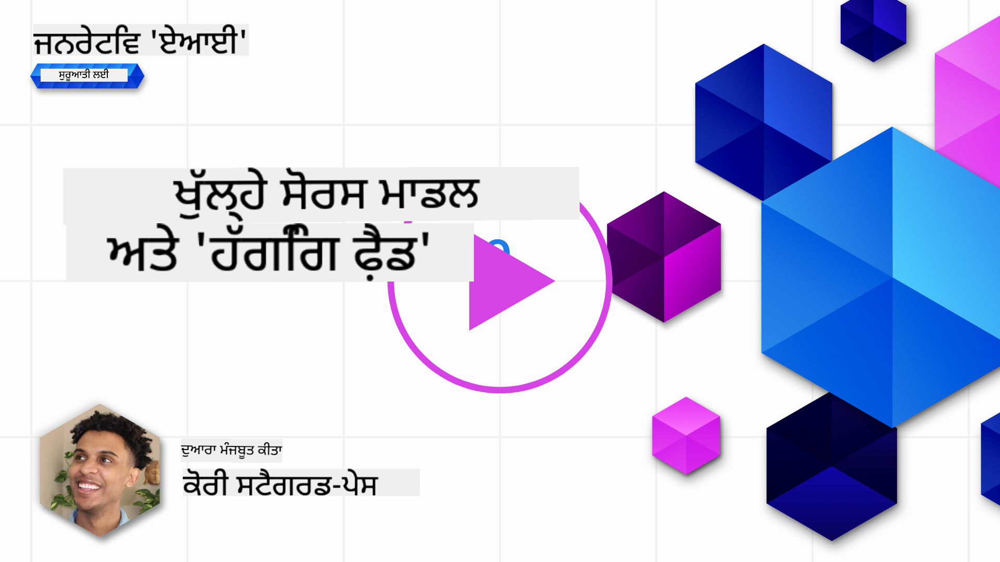
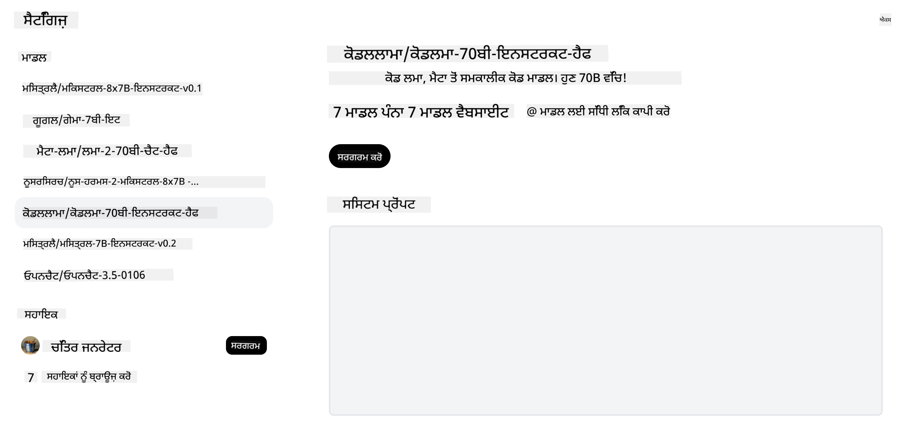

<!--
CO_OP_TRANSLATOR_METADATA:
{
  "original_hash": "0bba96e53ab841d99db731892a51fab8",
  "translation_date": "2025-05-20T06:52:45+00:00",
  "source_file": "16-open-source-models/README.md",
  "language_code": "pa"
}
-->

## ਜਾਣ ਪਛਾਣ

ਖੁੱਲ੍ਹੇ-ਸਰੋਤ LLMs ਦੀ ਦੁਨੀਆ ਰੋਮਾਂਚਕ ਅਤੇ ਲਗਾਤਾਰ ਵਿਕਸਿਤ ਹੋ ਰਹੀ ਹੈ। ਇਹ ਪਾਠ ਖੁੱਲ੍ਹੇ ਸਰੋਤ ਮਾਡਲਾਂ ਦੀ ਵਿਸਤ੍ਰਿਤ ਜਾਣਕਾਰੀ ਪ੍ਰਦਾਨ ਕਰਨ ਦਾ ਉਦੇਸ਼ ਰੱਖਦਾ ਹੈ। ਜੇਕਰ ਤੁਸੀਂ ਜਾਣਕਾਰੀ ਲੱਭ ਰਹੇ ਹੋ ਕਿ ਖੁੱਲ੍ਹੇ ਸਰੋਤ ਮਾਡਲਾਂ ਨਾਲ ਮਲਕੀਅਤ ਮਾਡਲ ਕਿਵੇਂ ਤੁਲਨਾ ਕਰਦੇ ਹਨ, ਤਾਂ ["ਵੱਖ-ਵੱਖ LLMs ਦੀ ਖੋਜ ਅਤੇ ਤੁਲਨਾ" ਪਾਠ](../02-exploring-and-comparing-different-llms/README.md?WT.mc_id=academic-105485-koreyst) 'ਤੇ ਜਾਓ। ਇਹ ਪਾਠ ਸੁਮੇਲ ਕਰਨ ਦੇ ਵਿਸ਼ੇ ਨੂੰ ਵੀ ਕਵਰ ਕਰੇਗਾ ਪਰ ਇੱਕ ਹੋਰ ਵਿਸਤ੍ਰਿਤ ਵਿਆਖਿਆ ["ਸੁਮੇਲ LLMs" ਪਾਠ](../18-fine-tuning/README.md?WT.mc_id=academic-105485-koreyst) ਵਿੱਚ ਮਿਲ ਸਕਦੀ ਹੈ।

## ਸਿੱਖਣ ਦੇ ਲਕਸ਼

- ਖੁੱਲ੍ਹੇ ਸਰੋਤ ਮਾਡਲਾਂ ਦੀ ਸਮਝ ਪ੍ਰਾਪਤ ਕਰੋ
- ਖੁੱਲ੍ਹੇ ਸਰੋਤ ਮਾਡਲਾਂ ਨਾਲ ਕੰਮ ਕਰਨ ਦੇ ਫਾਇਦੇ ਸਮਝਣਾ
- ਹੱਗਿੰਗ ਫੇਸ ਅਤੇ ਐਜ਼ਰ AI ਸਟੂਡੀਓ 'ਤੇ ਉਪਲਬਧ ਖੁੱਲ੍ਹੇ ਮਾਡਲਾਂ ਦੀ ਖੋਜ

## ਖੁੱਲ੍ਹੇ ਸਰੋਤ ਮਾਡਲ ਕੀ ਹਨ?

ਖੁੱਲ੍ਹੇ ਸਰੋਤ ਵਾਲੇ ਸੌਫਟਵੇਅਰ ਨੇ ਵੱਖ-ਵੱਖ ਖੇਤਰਾਂ ਵਿੱਚ ਤਕਨਾਲੋਜੀ ਦੀ ਵਿਕਾਸ ਵਿੱਚ ਅਹਿਮ ਭੂਮਿਕਾ ਨਿਭਾਈ ਹੈ। ਖੁੱਲ੍ਹੇ ਸਰੋਤ ਪਹਿਲ (OSI) ਨੇ ਸੌਫਟਵੇਅਰ ਨੂੰ ਖੁੱਲ੍ਹੇ ਸਰੋਤ ਵਜੋਂ ਵਰਗੀਕ੍ਰਿਤ ਕਰਨ ਲਈ [10 ਮਾਪਦੰਡ](https://web.archive.org/web/20241126001143/https://opensource.org/osd?WT.mc_id=academic-105485-koreyst) ਪਰਿਭਾਸ਼ਿਤ ਕੀਤੇ ਹਨ। ਸਰੋਤ ਕੋਡ ਨੂੰ OSI ਦੁਆਰਾ ਮਨਜ਼ੂਰ ਕੀਤੇ ਗਏ ਲਾਇਸੈਂਸ ਦੇ ਅਧੀਨ ਖੁੱਲ੍ਹੇ ਤੌਰ 'ਤੇ ਸਾਂਝਾ ਕੀਤਾ ਜਾਣਾ ਚਾਹੀਦਾ ਹੈ।

ਜਦਕਿ LLMs ਦਾ ਵਿਕਾਸ ਸੌਫਟਵੇਅਰ ਵਿਕਾਸ ਦੇ ਸਮਾਨ ਤੱਤਾਂ ਨੂੰ ਸ਼ਾਮਲ ਕਰਦਾ ਹੈ, ਪ੍ਰਕਿਰਿਆ ਬਿਲਕੁਲ ਇੱਕੋ ਜਿਹੀ ਨਹੀਂ ਹੈ। ਇਸ ਨੇ LLMs ਦੇ ਸੰਦਰਭ ਵਿੱਚ ਖੁੱਲ੍ਹੇ ਸਰੋਤ ਦੀ ਪਰਿਭਾਸ਼ਾ 'ਤੇ ਸਮੂਹ ਵਿੱਚ ਕਾਫ਼ੀ ਚਰਚਾ ਕੀਤੀ ਹੈ। ਇੱਕ ਮਾਡਲ ਨੂੰ ਖੁੱਲ੍ਹੇ ਸਰੋਤ ਦੀ ਰਵਾਇਤੀ ਪਰਿਭਾਸ਼ਾ ਨਾਲ ਮਿਲਾਉਣ ਲਈ ਹੇਠਾਂ ਦਿੱਤੀ ਜਾਣਕਾਰੀ ਜਨਤਕ ਤੌਰ 'ਤੇ ਉਪਲਬਧ ਹੋਣੀ ਚਾਹੀਦੀ ਹੈ:

- ਮਾਡਲ ਨੂੰ ਸਿਖਲਾਈ ਦੇਣ ਲਈ ਵਰਤੇ ਗਏ ਡਾਟਾਸੈਟ।
- ਸਿਖਲਾਈ ਦੇ ਹਿੱਸੇ ਵਜੋਂ ਪੂਰੇ ਮਾਡਲ ਦੇ ਭਾਰ।
- ਮੁਲਾਂਕਣ ਕੋਡ।
- ਸੁਮੇਲ ਕੋਡ।
- ਪੂਰੇ ਮਾਡਲ ਦੇ ਭਾਰ ਅਤੇ ਸਿਖਲਾਈ ਮਾਪਦੰਡ।

ਵਰਤਮਾਨ ਸਮੇਂ ਵਿੱਚ ਸਿਰਫ ਕੁਝ ਮਾਡਲ ਹਨ ਜੋ ਇਸ ਮਾਪਦੰਡ ਨੂੰ ਮਿਲਦੇ ਹਨ। [ਐਲਨ ਇੰਸਟੀਚਿਊਟ ਫਾਰ ਆਰਟੀਫਿਸ਼ੀਅਲ ਇੰਟੈਲੀਜੈਂਸ (ਐਲਨਏਆਈ) ਦੁਆਰਾ ਬਣਾਇਆ ਗਿਆ OLMo ਮਾਡਲ](https://huggingface.co/allenai/OLMo-7B?WT.mc_id=academic-105485-koreyst) ਇਸ ਸ਼੍ਰੇਣੀ ਵਿੱਚ ਫਿੱਟ ਹੈ।

ਇਸ ਪਾਠ ਲਈ, ਅਸੀਂ ਅੱਗੇ ਵਧਦੇ ਹੋਏ ਮਾਡਲਾਂ ਨੂੰ "ਖੁੱਲ੍ਹੇ ਮਾਡਲਾਂ" ਵਜੋਂ ਸੰਬੋਧਨ ਕਰਾਂਗੇ ਕਿਉਂਕਿ ਉਹ ਇਸ ਲੇਖਨ ਦੇ ਸਮੇਂ ਉੱਪਰ ਦਿੱਤੇ ਮਾਪਦੰਡਾਂ ਨਾਲ ਨਹੀਂ ਮਿਲ ਸਕਦੇ।

## ਖੁੱਲ੍ਹੇ ਮਾਡਲਾਂ ਦੇ ਫਾਇਦੇ

**ਬਹੁਤ ਹੀ ਕਸਟਮਾਈਜ਼ੇਬਲ** - ਕਿਉਂਕਿ ਖੁੱਲ੍ਹੇ ਮਾਡਲਾਂ ਨੂੰ ਵਿਸਤ੍ਰਿਤ ਸਿਖਲਾਈ ਜਾਣਕਾਰੀ ਨਾਲ ਜਾਰੀ ਕੀਤਾ ਜਾਂਦਾ ਹੈ, ਖੋਜਕਰਤਾ ਅਤੇ ਡਿਵੈਲਪਰ ਮਾਡਲ ਦੇ ਅੰਦਰੂਨੀ ਹਿੱਸਿਆਂ ਨੂੰ ਸੰਸ਼ੋਧਿਤ ਕਰ ਸਕਦੇ ਹਨ। ਇਹ ਖਾਸ ਕੰਮ ਜਾਂ ਅਧਿਐਨ ਦੇ ਖੇਤਰ ਲਈ ਬਹੁਤ ਹੀ ਵਿਸ਼ੇਸ਼ ਮਾਡਲਾਂ ਬਣਾਉਣ ਦੇ ਯੋਗ ਬਣਾਉਂਦਾ ਹੈ। ਇਸ ਦੇ ਕੁਝ ਉਦਾਹਰਨਾਂ ਕੋਡ ਜਨਰੇਸ਼ਨ, ਗਣਿਤੀਕ ਕਾਰਵਾਈਆਂ ਅਤੇ ਜੀਵ ਵਿਗਿਆਨ ਹਨ।

**ਲਾਗਤ** - ਇਹਨਾਂ ਮਾਡਲਾਂ ਨੂੰ ਵਰਤਣ ਅਤੇ ਤੈਅ ਕਰਨ ਲਈ ਪ੍ਰਤੀ ਟੋਕਨ ਲਾਗਤ ਮਲਕੀਅਤ ਮਾਡਲਾਂ ਦੀ ਤੁਲਨਾ ਵਿੱਚ ਘੱਟ ਹੈ। ਜਨਰੇਟਿਵ AI ਐਪਲੀਕੇਸ਼ਨ ਬਣਾਉਣ ਸਮੇਂ, ਆਪਣੇ ਵਰਤੋਂ ਦੇ ਕੇਸ 'ਤੇ ਇਹਨਾਂ ਮਾਡਲਾਂ ਨਾਲ ਕੰਮ ਕਰਦੇ ਸਮੇਂ ਪ੍ਰਦਰਸ਼ਨ ਬਨਾਮ ਕੀਮਤ ਨੂੰ ਦੇਖਣਾ ਚਾਹੀਦਾ ਹੈ।

  
ਸਰੋਤ: ਆਰਟੀਫਿਸ਼ੀਅਲ ਐਨਾਲਿਸਿਸ

**ਲਚੀਲਾ** - ਖੁੱਲ੍ਹੇ ਮਾਡਲਾਂ ਨਾਲ ਕੰਮ ਕਰਨ ਨਾਲ ਤੁਹਾਨੂੰ ਵੱਖ-ਵੱਖ ਮਾਡਲਾਂ ਦੀ ਵਰਤੋਂ ਕਰਨ ਜਾਂ ਉਹਨਾਂ ਨੂੰ ਜੋੜਨ ਦੇ ਮਾਮਲੇ ਵਿੱਚ ਲਚਕਦਾਰ ਬਣਨ ਦੀ ਯੋਗਤਾ ਮਿਲਦੀ ਹੈ। ਇਸ ਦਾ ਇੱਕ ਉਦਾਹਰਨ [HuggingChat ਸਹਾਇਕ](https://huggingface.co/chat?WT.mc_id=academic-105485-koreyst) ਹੈ ਜਿੱਥੇ ਉਪਭੋਗਤਾ ਸਿੱਧੇ ਉਪਭੋਗਤਾ ਇੰਟਰਫੇਸ ਵਿੱਚ ਵਰਤੇ ਜਾ ਰਹੇ ਮਾਡਲ ਨੂੰ ਚੁਣ ਸਕਦਾ ਹੈ:

## ਵੱਖ-ਵੱਖ ਖੁੱਲ੍ਹੇ ਮਾਡਲਾਂ ਦੀ ਖੋਜ

### Llama 2

[LLama2](https://huggingface.co/meta-llama?WT.mc_id=academic-105485-koreyst), ਮੈਟਾ ਦੁਆਰਾ ਵਿਕਸਿਤ, ਇੱਕ ਖੁੱਲ੍ਹਾ ਮਾਡਲ ਹੈ ਜੋ ਚੈਟ ਅਧਾਰਿਤ ਐਪਲੀਕੇਸ਼ਨਾਂ ਲਈ ਆਪਟੀਮਾਈਜ਼ਡ ਹੈ। ਇਹ ਇਸ ਦੇ ਸੁਮੇਲ ਵਿਧੀ ਦੇ ਕਾਰਨ ਹੈ, ਜਿਸ ਵਿੱਚ ਬਹੁਤ ਸਾਰੀ ਗੱਲਬਾਤ ਅਤੇ ਮਨੁੱਖੀ ਫੀਡਬੈਕ ਸ਼ਾਮਲ ਸੀ। ਇਸ ਵਿਧੀ ਨਾਲ, ਮਾਡਲ ਮਨੁੱਖੀ ਉਮੀਦਾਂ ਨਾਲ ਮੇਲ ਖਾਣ ਵਾਲੇ ਹੋਰ ਨਤੀਜੇ ਪੈਦਾ ਕਰਦਾ ਹੈ ਜੋ ਇੱਕ ਬਿਹਤਰ ਉਪਭੋਗਤਾ ਅਨੁਭਵ ਪ੍ਰਦਾਨ ਕਰਦਾ ਹੈ।

Llama ਦੇ ਕੁਝ ਸੁਮੇਲ ਸੰਸਕਰਣਾਂ ਦੇ ਉਦਾਹਰਨਾਂ ਵਿੱਚ [ਜਪਾਨੀ Llama](https://huggingface.co/elyza/ELYZA-japanese-Llama-2-7b?WT.mc_id=academic-105485-koreyst), ਜੋ ਜਪਾਨੀ ਵਿੱਚ ਵਿਸ਼ੇਸ਼ਤਾ ਰੱਖਦਾ ਹੈ ਅਤੇ [Llama Pro](https://huggingface.co/TencentARC/LLaMA-Pro-8B?WT.mc_id=academic-105485-koreyst) ਸ਼ਾਮਲ ਹੈ, ਜੋ ਬੇਸ ਮਾਡਲ ਦਾ ਇੱਕ ਵਧੀਆ ਸੰਸਕਰਣ ਹੈ।

### Mistral

[Mistral](https://huggingface.co/mistralai?WT.mc_id=academic-105485-koreyst) ਇੱਕ ਖੁੱਲ੍ਹਾ ਮਾਡਲ ਹੈ ਜੋ ਉੱਚ ਪ੍ਰਦਰਸ਼ਨ ਅਤੇ ਕੁਸ਼ਲਤਾ 'ਤੇ ਮਜ਼ਬੂਤ ਧਿਆਨ ਦਿੰਦਾ ਹੈ। ਇਹ ਮਿਸ਼ਰਣ-ਆਫ-ਮਾਹਿਰ ਵਿਧੀ ਦੀ ਵਰਤੋਂ ਕਰਦਾ ਹੈ ਜੋ ਇੱਕ ਸਿਸਟਮ ਵਿੱਚ ਵਿਸ਼ੇਸ਼ ਮਾਹਿਰ ਮਾਡਲਾਂ ਦੇ ਇੱਕ ਸਮੂਹ ਨੂੰ ਜੋੜਦਾ ਹੈ ਜਿੱਥੇ ਇਨਪੁਟ ਦੇ ਅਨੁਸਾਰ, ਕੁਝ ਮਾਡਲਾਂ ਦੀ ਵਰਤੋਂ ਲਈ ਚੁਣਿਆ ਜਾਂਦਾ ਹੈ। ਇਹ ਗਣਨਾ ਨੂੰ ਹੋਰ ਪ੍ਰਭਾਵਸ਼ਾਲੀ ਬਣਾਉਂਦਾ ਹੈ ਕਿਉਂਕਿ ਮਾਡਲ ਸਿਰਫ ਉਹਨਾਂ ਇਨਪੁਟਾਂ ਦਾ ਸਮਾਧਾਨ ਕਰ ਰਹੇ ਹਨ ਜਿਨ੍ਹਾਂ ਵਿੱਚ ਉਹ ਵਿਸ਼ੇਸ਼ਤਾ ਰੱਖਦੇ ਹਨ।

Mistral ਦੇ ਕੁਝ ਸੁਮੇਲ ਸੰਸਕਰਣਾਂ ਦੇ ਉਦਾਹਰਨਾਂ ਵਿੱਚ [BioMistral](https://huggingface.co/BioMistral/BioMistral-7B?text=Mon+nom+est+Thomas+et+mon+principal?WT.mc_id=academic-105485-koreyst), ਜੋ ਚਿਕਿਤਸਾ ਖੇਤਰ 'ਤੇ ਧਿਆਨ ਕੇਂਦਰਿਤ ਕਰਦਾ ਹੈ ਅਤੇ [OpenMath Mistral](https://huggingface.co/nvidia/OpenMath-Mistral-7B-v0.1-hf?WT.mc_id=academic-105485-koreyst), ਜੋ ਗਣਿਤੀਕ ਗਣਨਾ ਕਰਦਾ ਹੈ, ਸ਼ਾਮਲ ਹਨ।

### Falcon

[Falcon](https://huggingface.co/tiiuae?WT.mc_id=academic-105485-koreyst) ਇੱਕ LLM ਹੈ ਜੋ ਤਕਨਾਲੋਜੀ ਇਨੋਵੇਸ਼ਨ ਇੰਸਟੀਚਿਊਟ (**TII**) ਦੁਆਰਾ ਬਣਾਇਆ ਗਿਆ ਹੈ। ਫਾਲਕਨ-40B ਨੂੰ 40 ਅਰਬ ਪੈਰਾਮੀਟਰਾਂ 'ਤੇ ਸਿਖਲਾਈ ਦਿੱਤੀ ਗਈ ਸੀ ਜਿਸ ਨੂੰ ਘੱਟ ਗਣਨਾ ਬਜਟ ਨਾਲ GPT-3 ਨਾਲੋਂ ਵਧੀਆ ਪ੍ਰਦਰਸ਼ਨ ਕਰਨ ਵਾਲਾ ਦਿਖਾਇਆ ਗਿਆ ਹੈ। ਇਹ ਇਸ ਦੇ ਫਲੈਸ਼ਐਟੇਨਸ਼ਨ ਐਲਗੋਰਿਦਮ ਅਤੇ ਮਲਟੀਕੁਵੇਰੀ ਧਿਆਨ ਦੇ ਉਪਯੋਗ ਦੇ ਕਾਰਨ ਹੈ ਜੋ ਇਸ ਨੂੰ ਅਨੁਮਾਨ ਸਮੇਂ 'ਤੇ ਮੈਮੋਰੀ ਦੀ ਲੋੜ ਨੂੰ ਘਟਾਉਣ ਯੋਗ ਬਣਾਉਂਦਾ ਹੈ। ਇਸ ਘਟਾਈ ਅਨੁਮਾਨ ਸਮੇਂ ਦੇ ਨਾਲ, ਫਾਲਕਨ-40B ਚੈਟ ਐਪਲੀਕੇਸ਼ਨਾਂ ਲਈ ਉਚਿਤ ਹੈ।

ਫਾਲਕਨ ਦੇ ਕੁਝ ਸੁਮੇਲ ਸੰਸਕਰਣਾਂ ਦੇ ਉਦਾਹਰਨਾਂ ਵਿੱਚ [OpenAssistant](https://huggingface.co/OpenAssistant/falcon-40b-sft-top1-560?WT.mc_id=academic-105485-koreyst), ਇੱਕ ਸਹਾਇਕ ਜੋ ਖੁੱਲ੍ਹੇ ਮਾਡਲਾਂ 'ਤੇ ਬਣਾਇਆ ਗਿਆ ਹੈ ਅਤੇ [GPT4ALL](https://huggingface.co/nomic-ai/gpt4all-falcon?WT.mc_id=academic-105485-koreyst), ਜੋ ਬੇਸ ਮਾਡਲ ਨਾਲੋਂ ਉੱਚ ਪ੍ਰਦਰਸ਼ਨ ਕਰਦਾ ਹੈ, ਸ਼ਾਮਲ ਹਨ।

## ਕਿਵੇਂ ਚੁਣਨਾ ਹੈ

ਖੁੱਲ੍ਹੇ ਮਾਡਲ ਦੀ ਚੋਣ ਲਈ ਕੋਈ ਇੱਕ ਜਵਾਬ ਨਹੀਂ ਹੈ। ਇੱਕ ਵਧੀਆ ਸਥਾਨ ਐਜ਼ਰ AI ਸਟੂਡੀਓ ਦੇ ਟਾਸਕ ਫੀਚਰ ਦੁਆਰਾ ਫਿਲਟਰ ਦੀ ਵਰਤੋਂ ਕਰਕੇ ਸ਼ੁਰੂ ਕਰਨਾ ਹੈ। ਇਹ ਤੁਹਾਨੂੰ ਇਹ ਸਮਝਣ ਵਿੱਚ ਮਦਦ ਕਰੇਗਾ ਕਿ ਮਾਡਲ ਕਿਸ ਕਿਸਮ ਦੇ ਕੰਮਾਂ ਲਈ ਸਿਖਲਾਈ ਗਏ ਹਨ। ਹੱਗਿੰਗ ਫੇਸ ਵੀ ਇੱਕ LLM ਲੀਡਰਬੋਰਡ ਬਣਾਈ ਰੱਖਦਾ ਹੈ ਜੋ ਤੁਹਾਨੂੰ ਕੁਝ ਮਾਪਦੰਡਾਂ ਦੇ ਆਧਾਰ 'ਤੇ ਸਭ ਤੋਂ ਵਧੀਆ ਪ੍ਰਦਰਸ਼ਨ ਕਰਨ ਵਾਲੇ ਮਾਡਲ ਦਿਖਾਉਂਦਾ ਹੈ।

ਵੱਖ-ਵੱਖ ਕਿਸਮਾਂ ਦੇ LLMs ਦੀ ਤੁਲਨਾ ਕਰਨ ਲਈ ਵੇਖਦੇ ਸਮੇਂ, [ਆਰਟੀਫਿਸ਼ੀਅਲ ਐਨਾਲਿਸਿਸ](https://artificialanalysis.ai/?WT.mc_id=academic-105485-koreyst) ਇੱਕ ਹੋਰ ਵਧੀਆ ਸਰੋਤ ਹੈ:

  
ਸਰੋਤ: ਆਰਟੀਫਿਸ਼ੀਅਲ ਐਨਾਲਿਸਿਸ

ਜੇਕਰ ਕਿਸੇ ਖਾਸ ਵਰਤੋਂ ਦੇ ਕੇਸ 'ਤੇ ਕੰਮ ਕਰ ਰਹੇ ਹੋ, ਤਾਂ ਉਸੇ ਖੇਤਰ 'ਤੇ ਧਿਆਨ ਕੇਂਦਰਿਤ ਸੁਮੇਲ ਸੰਸਕਰਣਾਂ ਦੀ ਭਾਲ ਕਰਨਾ ਪ੍ਰਭਾਵਸ਼ਾਲੀ ਹੋ ਸਕਦਾ ਹੈ। ਆਪਣੇ ਅਤੇ ਆਪਣੇ ਉਪਭੋਗਤਾਵਾਂ ਦੀਆਂ ਉਮੀਦਾਂ ਦੇ ਅਨੁਸਾਰ ਉਹ ਕਿਵੇਂ ਪ੍ਰਦਰਸ਼ਨ ਕਰਦੇ ਹਨ, ਇਹ ਦੇਖਣ ਲਈ ਕਈ ਖੁੱਲ੍ਹੇ ਮਾਡਲਾਂ ਨਾਲ ਪ੍ਰਯੋਗ ਕਰਨਾ ਇੱਕ ਹੋਰ ਚੰਗੀ ਅਭਿਆਸ ਹੈ।

## ਅਗਲੇ ਕਦਮ

ਖੁੱਲ੍ਹੇ ਮਾਡਲਾਂ ਬਾਰੇ ਸਭ ਤੋਂ ਵਧੀਆ ਗੱਲ ਇਹ ਹੈ ਕਿ ਤੁਸੀਂ ਉਨ੍ਹਾਂ ਨਾਲ ਕਾਫ਼ੀ ਜਲਦੀ ਕੰਮ ਕਰਨਾ ਸ਼ੁਰੂ ਕਰ ਸਕਦੇ ਹੋ। [ਐਜ਼ਰ AI ਸਟੂਡੀਓ ਮਾਡਲ ਕੈਟਾਲਾਗ](https://ai.azure.com?WT.mc_id=academic-105485-koreyst) ਨੂੰ ਵੇਖੋ, ਜੋ ਹੱਗਿੰਗ ਫੇਸ ਕਲੇਕਸ਼ਨ ਨੂੰ ਵਿਸ਼ੇਸ਼ ਤੌਰ 'ਤੇ ਵਿਸ਼ੇਸ਼ਤਾਵਾਂ ਦਿੰਦਾ ਹੈ ਜਿਨ੍ਹਾਂ ਮਾਡਲਾਂ ਦੀ ਅਸੀਂ ਇੱਥੇ ਚਰਚਾ ਕੀਤੀ।

## ਸਿੱਖਣਾ ਇੱਥੇ ਨਹੀਂ ਰੁਕਦਾ, ਯਾਤਰਾ ਜਾਰੀ ਰੱਖੋ

ਇਹ ਪਾਠ ਪੂਰਾ ਕਰਨ ਤੋਂ ਬਾਅਦ, ਆਪਣੇ ਜਨਰੇਟਿਵ AI ਗਿਆਨ ਨੂੰ ਵਧਾਉਣ ਲਈ ਸਾਡੀ [ਜਨਰੇਟਿਵ AI ਸਿੱਖਣ ਕਲੇਕਸ਼ਨ](https://aka.ms/genai-collection?WT.mc_id=academic-105485-koreyst) ਨੂੰ ਵੇਖੋ!

**ਅਸਵੀਕਤੀ**:  
ਇਹ ਦਸਤਾਵੇਜ਼ AI ਅਨੁਵਾਦ ਸੇਵਾ [Co-op Translator](https://github.com/Azure/co-op-translator) ਦੀ ਵਰਤੋਂ ਕਰਕੇ ਅਨੁਵਾਦ ਕੀਤਾ ਗਿਆ ਹੈ। ਅਸੀਂ ਸਹੀ ਹੋਣ ਦੀ ਕੋਸ਼ਿਸ਼ ਕਰਦੇ ਹਾਂ, ਪਰ ਕਿਰਪਾ ਕਰਕੇ ਧਿਆਨ ਦਿਓ ਕਿ ਸਵੈਚਾਲਿਤ ਅਨੁਵਾਦਾਂ ਵਿੱਚ ਗਲਤੀਆਂ ਜਾਂ ਅਸੁੱਤੀਆਂ ਹੋ ਸਕਦੀਆਂ ਹਨ। ਇਸਦੀ ਮੂਲ ਭਾਸ਼ਾ ਵਿੱਚ ਮੂਲ ਦਸਤਾਵੇਜ਼ ਨੂੰ ਅਧਿਕਾਰਤ ਸਰੋਤ ਮੰਨਿਆ ਜਾਣਾ ਚਾਹੀਦਾ ਹੈ। ਮਹੱਤਵਪੂਰਨ ਜਾਣਕਾਰੀ ਲਈ, ਪੇਸ਼ੇਵਰ ਮਨੁੱਖੀ ਅਨੁਵਾਦ ਦੀ ਸਿਫਾਰਿਸ਼ ਕੀਤੀ ਜਾਂਦੀ ਹੈ। ਅਸੀਂ ਇਸ ਅਨੁਵਾਦ ਦੀ ਵਰਤੋਂ ਤੋਂ ਉਪਜਣ ਵਾਲੀਆਂ ਕਿਸੇ ਵੀ ਗਲਤਫਹਿਮੀਆਂ ਜਾਂ ਗਲਤ ਵਿਆਖਿਆਵਾਂ ਲਈ ਜ਼ਿੰਮੇਵਾਰ ਨਹੀਂ ਹਾਂ।