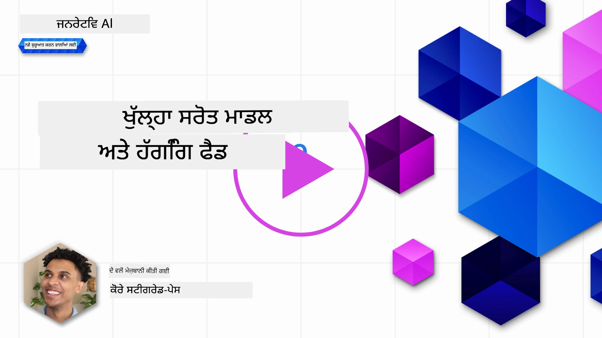
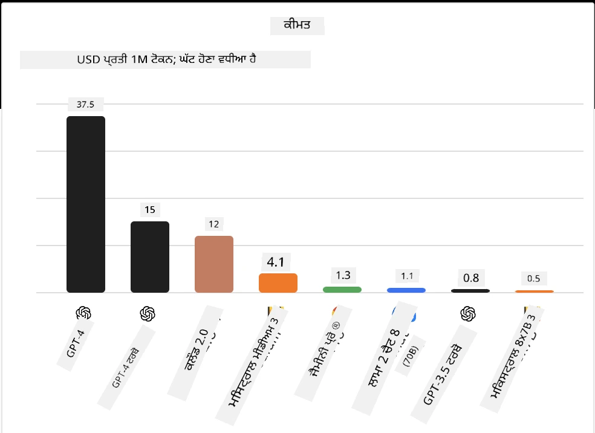
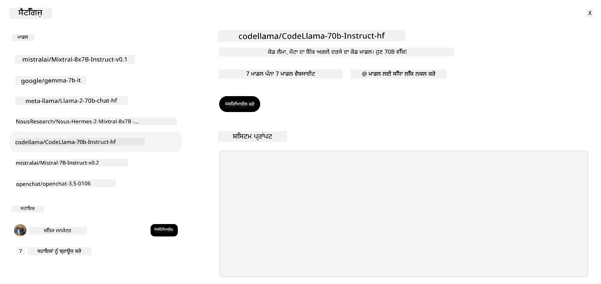
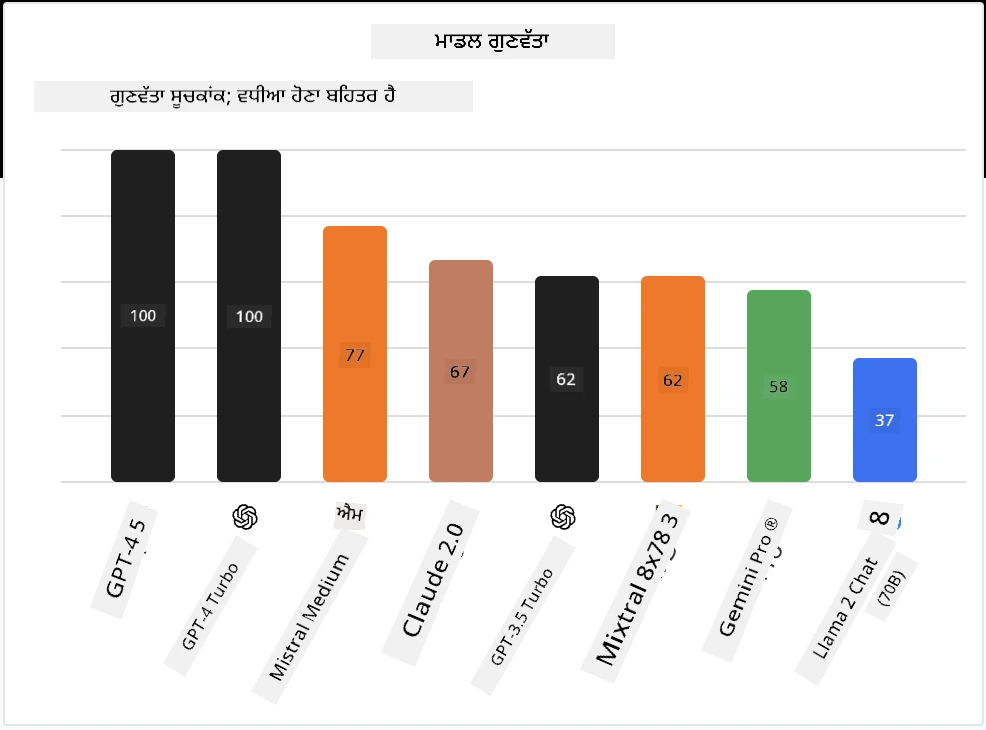

## ਪਰਿਚਯ

ਓਪਨ-ਸੋਰਸ LLMs ਦੀ ਦੁਨੀਆ ਰੋਮਾਂਚਕ ਅਤੇ ਲਗਾਤਾਰ ਵਿਕਾਸਸ਼ੀਲ ਹੈ। ਇਹ ਪਾਠ ਓਪਨ ਸੋਰਸ ਮਾਡਲਾਂ ਦੀ ਵਿਸਥਾਰਪੂਰਵਕ ਜਾਣਕਾਰੀ ਦੇਣ ਦਾ ਉਦੇਸ਼ ਰੱਖਦਾ ਹੈ। ਜੇ ਤੁਸੀਂ ਜਾਣਨਾ ਚਾਹੁੰਦੇ ਹੋ ਕਿ ਪ੍ਰੋਪ੍ਰਾਇਟਰੀ ਮਾਡਲਾਂ ਦੀ ਤੁਲਨਾ ਓਪਨ ਸੋਰਸ ਮਾਡਲਾਂ ਨਾਲ ਕਿਵੇਂ ਹੁੰਦੀ ਹੈ, ਤਾਂ ["ਵੱਖ-ਵੱਖ LLMs ਦੀ ਖੋਜ ਅਤੇ ਤੁਲਨਾ" ਪਾਠ](../02-exploring-and-comparing-different-llms/README.md?WT.mc_id=academic-105485-koreyst) 'ਤੇ ਜਾਓ। ਇਹ ਪਾਠ ਫਾਈਨ-ਟਿਊਨਿੰਗ ਦੇ ਵਿਸ਼ੇ ਨੂੰ ਵੀ ਕਵਰ ਕਰੇਗਾ ਪਰ ਇਸਦਾ ਵਧੇਰੇ ਵਿਸਥਾਰਪੂਰਵਕ ਵਿਆਖਿਆਨ ["Fine-Tuning LLMs" ਪਾਠ](../18-fine-tuning/README.md?WT.mc_id=academic-105485-koreyst) ਵਿੱਚ ਮਿਲ ਸਕਦਾ ਹੈ।

## ਸਿੱਖਣ ਦੇ ਲਕੜ

- ਓਪਨ ਸੋਰਸ ਮਾਡਲਾਂ ਦੀ ਸਮਝ ਪ੍ਰਾਪਤ ਕਰੋ
- ਓਪਨ ਸੋਰਸ ਮਾਡਲਾਂ ਨਾਲ ਕੰਮ ਕਰਨ ਦੇ ਫਾਇਦੇ ਸਮਝੋ
- Hugging Face ਅਤੇ Azure AI Studio 'ਤੇ ਉਪਲਬਧ ਓਪਨ ਮਾਡਲਾਂ ਦੀ ਖੋਜ ਕਰੋ

## ਓਪਨ ਸੋਰਸ ਮਾਡਲ ਕੀ ਹਨ?

ਓਪਨ ਸੋਰਸ ਸਾਫਟਵੇਅਰ ਨੇ ਵੱਖ-ਵੱਖ ਖੇਤਰਾਂ ਵਿੱਚ ਤਕਨਾਲੋਜੀ ਦੇ ਵਿਕਾਸ ਵਿੱਚ ਮਹੱਤਵਪੂਰਨ ਭੂਮਿਕਾ ਨਿਭਾਈ ਹੈ। ਓਪਨ ਸੋਰਸ ਇਨੀਸ਼ੀਏਟਿਵ (OSI) ਨੇ [ਸਾਫਟਵੇਅਰ ਲਈ 10 ਮਾਪਦੰਡ](https://web.archive.org/web/20241126001143/https://opensource.org/osd?WT.mc_id=academic-105485-koreyst) ਤੈਅ ਕੀਤੇ ਹਨ ਜੋ ਓਪਨ ਸੋਰਸ ਵਜੋਂ ਵਰਗੀਕ੍ਰਿਤ ਹੋ ਸਕਦਾ ਹੈ। ਸੋਰਸ ਕੋਡ ਨੂੰ OSI ਦੁਆਰਾ ਮਨਜ਼ੂਰਸ਼ੁਦਾ ਲਾਇਸੈਂਸ ਹੇਠ ਖੁੱਲ੍ਹਾ ਸਾਂਝਾ ਕੀਤਾ ਜਾਣਾ ਚਾਹੀਦਾ ਹੈ।

ਜਦੋਂ ਕਿ LLMs ਦਾ ਵਿਕਾਸ ਸਾਫਟਵੇਅਰ ਵਿਕਾਸ ਨਾਲ ਕੁਝ ਮਿਲਦੇ ਜੁਲਦੇ ਤੱਤ ਰੱਖਦਾ ਹੈ, ਪਰ ਇਹ ਪ੍ਰਕਿਰਿਆ ਬਿਲਕੁਲ ਇੱਕੋ ਜਿਹੀ ਨਹੀਂ ਹੈ। ਇਸ ਕਾਰਨ ਕਮਿਊਨਿਟੀ ਵਿੱਚ LLMs ਦੇ ਸੰਦਰਭ ਵਿੱਚ ਓਪਨ ਸੋਰਸ ਦੀ ਪਰਿਭਾਸ਼ਾ 'ਤੇ ਕਾਫੀ ਚਰਚਾ ਹੋਈ ਹੈ। ਇੱਕ ਮਾਡਲ ਨੂੰ ਪਰੰਪਰਾਗਤ ਓਪਨ ਸੋਰਸ ਦੀ ਪਰਿਭਾਸ਼ਾ ਨਾਲ ਮੇਲ ਖਾਣ ਲਈ ਹੇਠਾਂ ਦਿੱਤੀ ਜਾਣਕਾਰੀ ਜਨਤਕ ਤੌਰ 'ਤੇ ਉਪਲਬਧ ਹੋਣੀ ਚਾਹੀਦੀ ਹੈ:

- ਮਾਡਲ ਨੂੰ ਟ੍ਰੇਨ ਕਰਨ ਲਈ ਵਰਤੇ ਗਏ ਡੇਟਾਸੈੱਟ
- ਟ੍ਰੇਨਿੰਗ ਦੇ ਹਿੱਸੇ ਵਜੋਂ ਪੂਰੇ ਮਾਡਲ ਦੇ ਵਜ਼ਨ
- ਮੁਲਾਂਕਣ ਕੋਡ
- ਫਾਈਨ-ਟਿਊਨਿੰਗ ਕੋਡ
- ਪੂਰੇ ਮਾਡਲ ਦੇ ਵਜ਼ਨ ਅਤੇ ਟ੍ਰੇਨਿੰਗ ਮੈਟ੍ਰਿਕਸ

ਇਸ ਮਾਪਦੰਡ ਨੂੰ ਮਿਲਾਉਂਦੇ ਕੁਝ ਹੀ ਮਾਡਲ ਇਸ ਸਮੇਂ ਉਪਲਬਧ ਹਨ। [Allen Institute for Artificial Intelligence (AllenAI) ਵੱਲੋਂ ਬਣਾਇਆ ਗਿਆ OLMo ਮਾਡਲ](https://huggingface.co/allenai/OLMo-7B?WT.mc_id=academic-105485-koreyst) ਇਸ ਸ਼੍ਰੇਣੀ ਵਿੱਚ ਆਉਂਦਾ ਹੈ।

ਇਸ ਪਾਠ ਲਈ, ਅਸੀਂ ਮਾਡਲਾਂ ਨੂੰ "ਓਪਨ ਮਾਡਲ" ਕਹਾਂਗੇ ਕਿਉਂਕਿ ਲਿਖਤ ਸਮੇਂ ਉਪਰੋਕਤ ਮਾਪਦੰਡ ਨਾਲ ਇਹ ਮੇਲ ਨਹੀਂ ਖਾਂਦੇ ਹੋ ਸਕਦੇ।

## ਓਪਨ ਮਾਡਲਾਂ ਦੇ ਫਾਇਦੇ

**ਬਹੁਤ ਜ਼ਿਆਦਾ ਕਸਟਮਾਈਜ਼ੇਬਲ** - ਕਿਉਂਕਿ ਓਪਨ ਮਾਡਲ ਵਿਸਥਾਰਪੂਰਵਕ ਟ੍ਰੇਨਿੰਗ ਜਾਣਕਾਰੀ ਨਾਲ ਜਾਰੀ ਕੀਤੇ ਜਾਂਦੇ ਹਨ, ਖੋਜਕਾਰ ਅਤੇ ਵਿਕਾਸਕਾਰ ਮਾਡਲ ਦੇ ਅੰਦਰੂਨੀ ਹਿੱਸਿਆਂ ਨੂੰ ਬਦਲ ਸਕਦੇ ਹਨ। ਇਸ ਨਾਲ ਖਾਸ ਕੰਮ ਜਾਂ ਅਧਿਐਨ ਖੇਤਰ ਲਈ ਬਹੁਤ ਵਿਸ਼ੇਸ਼ ਮਾਡਲ ਬਣਾਉਣਾ ਸੰਭਵ ਹੁੰਦਾ ਹੈ। ਉਦਾਹਰਨਾਂ ਵਿੱਚ ਕੋਡ ਜਨਰੇਸ਼ਨ, ਗਣਿਤੀ ਕਾਰਜ ਅਤੇ ਜੀਵ ਵਿਗਿਆਨ ਸ਼ਾਮਲ ਹਨ।

**ਲਾਗਤ** - ਇਹ ਮਾਡਲ ਵਰਤਣ ਅਤੇ ਤਾਇਨਾਤ ਕਰਨ ਦੀ ਲਾਗਤ ਪ੍ਰੋਪ੍ਰਾਇਟਰੀ ਮਾਡਲਾਂ ਨਾਲੋਂ ਘੱਟ ਹੁੰਦੀ ਹੈ। ਜਦੋਂ ਜਨਰੇਟਿਵ AI ਐਪਲੀਕੇਸ਼ਨਾਂ ਦਾ ਨਿਰਮਾਣ ਕੀਤਾ ਜਾ ਰਿਹਾ ਹੋਵੇ, ਤਾਂ ਆਪਣੇ ਵਰਤੋਂ ਕੇਸ ਲਈ ਪ੍ਰਦਰਸ਼ਨ ਅਤੇ ਕੀਮਤ ਦੀ ਤੁਲਨਾ ਕਰਨੀ ਚਾਹੀਦੀ ਹੈ।

ਸਰੋਤ: Artificial Analysis

**ਲਚਕੀਲਾਪਣ** - ਓਪਨ ਮਾਡਲਾਂ ਨਾਲ ਕੰਮ ਕਰਨ ਨਾਲ ਤੁਸੀਂ ਵੱਖ-ਵੱਖ ਮਾਡਲਾਂ ਨੂੰ ਵਰਤਣ ਜਾਂ ਜੋੜਨ ਵਿੱਚ ਲਚਕੀਲੇ ਹੋ ਸਕਦੇ ਹੋ। ਉਦਾਹਰਨ ਵਜੋਂ [HuggingChat ਸਹਾਇਕ](https://huggingface.co/chat?WT.mc_id=academic-105485-koreyst) ਜਿੱਥੇ ਉਪਭੋਗਤਾ ਸਿੱਧਾ ਯੂਜ਼ਰ ਇੰਟਰਫੇਸ ਵਿੱਚ ਮਾਡਲ ਚੁਣ ਸਕਦਾ ਹੈ:

## ਵੱਖ-ਵੱਖ ਓਪਨ ਮਾਡਲਾਂ ਦੀ ਖੋਜ

### Llama 2

[LLama2](https://huggingface.co/meta-llama?WT.mc_id=academic-105485-koreyst), ਜੋ ਮੈਟਾ ਵੱਲੋਂ ਵਿਕਸਿਤ ਕੀਤਾ ਗਿਆ ਹੈ, ਇੱਕ ਓਪਨ ਮਾਡਲ ਹੈ ਜੋ ਚੈਟ ਅਧਾਰਿਤ ਐਪਲੀਕੇਸ਼ਨਾਂ ਲਈ ਅਨੁਕੂਲਿਤ ਹੈ। ਇਹ ਇਸਦੇ ਫਾਈਨ-ਟਿਊਨਿੰਗ ਤਰੀਕੇ ਕਰਕੇ ਹੈ, ਜਿਸ ਵਿੱਚ ਵੱਡੀ ਮਾਤਰਾ ਵਿੱਚ ਸੰਵਾਦ ਅਤੇ ਮਨੁੱਖੀ ਪ੍ਰਤੀਕਿਰਿਆ ਸ਼ਾਮਲ ਹੈ। ਇਸ ਤਰੀਕੇ ਨਾਲ, ਮਾਡਲ ਮਨੁੱਖੀ ਉਮੀਦਾਂ ਨਾਲ ਮੇਲ ਖਾਂਦੇ ਹੋਏ ਵਧੀਆ ਨਤੀਜੇ ਦਿੰਦਾ ਹੈ ਜੋ ਬਿਹਤਰ ਉਪਭੋਗਤਾ ਅਨੁਭਵ ਪ੍ਰਦਾਨ ਕਰਦਾ ਹੈ।

Llama ਦੇ ਕੁਝ ਫਾਈਨ-ਟਿਊਨ ਕੀਤੇ ਸੰਸਕਰਣਾਂ ਵਿੱਚ [Japanese Llama](https://huggingface.co/elyza/ELYZA-japanese-Llama-2-7b?WT.mc_id=academic-105485-koreyst) ਸ਼ਾਮਲ ਹੈ ਜੋ ਜਪਾਨੀ ਵਿੱਚ ਵਿਸ਼ੇਸ਼ਗਿਆ ਹੈ ਅਤੇ [Llama Pro](https://huggingface.co/TencentARC/LLaMA-Pro-8B?WT.mc_id=academic-105485-koreyst) ਜੋ ਬੇਸ ਮਾਡਲ ਦਾ ਸੁਧਾਰਿਤ ਸੰਸਕਰਣ ਹੈ।

### Mistral

[Mistral](https://huggingface.co/mistralai?WT.mc_id=academic-105485-koreyst) ਇੱਕ ਓਪਨ ਮਾਡਲ ਹੈ ਜੋ ਉੱਚ ਪ੍ਰਦਰਸ਼ਨ ਅਤੇ ਕੁਸ਼ਲਤਾ 'ਤੇ ਧਿਆਨ ਕੇਂਦਰਿਤ ਕਰਦਾ ਹੈ। ਇਹ Mixture-of-Experts ਪদ্ধਤੀ ਵਰਤਦਾ ਹੈ ਜੋ ਵਿਸ਼ੇਸ਼ਗਿਆ ਮਾਡਲਾਂ ਦੇ ਸਮੂਹ ਨੂੰ ਇੱਕ ਸਿਸਟਮ ਵਿੱਚ ਜੋੜਦਾ ਹੈ ਜਿੱਥੇ ਇਨਪੁੱਟ ਦੇ ਅਨੁਸਾਰ ਕੁਝ ਮਾਡਲ ਚੁਣੇ ਜਾਂਦੇ ਹਨ। ਇਸ ਨਾਲ ਗਣਨਾ ਜ਼ਿਆਦਾ ਪ੍ਰਭਾਵਸ਼ਾਲੀ ਬਣਦੀ ਹੈ ਕਿਉਂਕਿ ਮਾਡਲ ਸਿਰਫ ਉਹੀ ਇਨਪੁੱਟ ਸੰਭਾਲਦੇ ਹਨ ਜਿਨ੍ਹਾਂ ਵਿੱਚ ਉਹ ਵਿਸ਼ੇਸ਼ਗਿਆ ਹਨ।

Mistral ਦੇ ਕੁਝ ਫਾਈਨ-ਟਿਊਨ ਕੀਤੇ ਸੰਸਕਰਣਾਂ ਵਿੱਚ [BioMistral](https://huggingface.co/BioMistral/BioMistral-7B?text=Mon+nom+est+Thomas+et+mon+principal?WT.mc_id=academic-105485-koreyst) ਸ਼ਾਮਲ ਹੈ ਜੋ ਮੈਡੀਕਲ ਖੇਤਰ 'ਤੇ ਕੇਂਦਰਿਤ ਹੈ ਅਤੇ [OpenMath Mistral](https://huggingface.co/nvidia/OpenMath-Mistral-7B-v0.1-hf?WT.mc_id=academic-105485-koreyst) ਜੋ ਗਣਿਤੀ ਗਣਨਾ ਕਰਦਾ ਹੈ।

### Falcon

[Falcon](https://huggingface.co/tiiuae?WT.mc_id=academic-105485-koreyst) ਇੱਕ LLM ਹੈ ਜੋ Technology Innovation Institute (**TII**) ਵੱਲੋਂ ਬਣਾਇਆ ਗਿਆ ਹੈ। Falcon-40B ਨੂੰ 40 ਬਿਲੀਅਨ ਪੈਰਾਮੀਟਰਾਂ 'ਤੇ ਟ੍ਰੇਨ ਕੀਤਾ ਗਿਆ ਸੀ ਜੋ GPT-3 ਨਾਲੋਂ ਘੱਟ ਕਮਪਿਊਟ ਬਜਟ 'ਤੇ ਵਧੀਆ ਪ੍ਰਦਰਸ਼ਨ ਦਿਖਾਉਂਦਾ ਹੈ। ਇਹ FlashAttention ਅਲਗੋਰਿਦਮ ਅਤੇ ਮਲਟੀਕੁਐਰੀ ਅਟੈਂਸ਼ਨ ਦੀ ਵਰਤੋਂ ਕਰਦਾ ਹੈ ਜੋ ਇਨਫਰੈਂਸ ਸਮੇਂ ਮੈਮੋਰੀ ਦੀ ਲੋੜ ਘਟਾਉਂਦਾ ਹੈ। ਇਸ ਘਟੇ ਹੋਏ ਇਨਫਰੈਂਸ ਸਮੇਂ ਨਾਲ, Falcon-40B ਚੈਟ ਐਪਲੀਕੇਸ਼ਨਾਂ ਲਈ ਉਚਿਤ ਹੈ।

Falcon ਦੇ ਕੁਝ ਫਾਈਨ-ਟਿਊਨ ਕੀਤੇ ਸੰਸਕਰਣਾਂ ਵਿੱਚ [OpenAssistant](https://huggingface.co/OpenAssistant/falcon-40b-sft-top1-560?WT.mc_id=academic-105485-koreyst) ਸ਼ਾਮਲ ਹੈ ਜੋ ਓਪਨ ਮਾਡਲਾਂ 'ਤੇ ਬਣਾਇਆ ਗਿਆ ਸਹਾਇਕ ਹੈ ਅਤੇ [GPT4ALL](https://huggingface.co/nomic-ai/gpt4all-falcon?WT.mc_id=academic-105485-koreyst) ਜੋ ਬੇਸ ਮਾਡਲ ਨਾਲੋਂ ਵਧੀਆ ਪ੍ਰਦਰਸ਼ਨ ਦਿੰਦਾ ਹੈ।

## ਕਿਵੇਂ ਚੁਣੀਏ

ਓਪਨ ਮਾਡਲ ਚੁਣਨ ਲਈ ਕੋਈ ਇੱਕ ਜਵਾਬ ਨਹੀਂ ਹੈ। ਸ਼ੁਰੂਆਤ ਲਈ ਇੱਕ ਵਧੀਆ ਥਾਂ Azure AI Studio ਦੇ ਟਾਸਕ ਫਿਲਟਰ ਫੀਚਰ ਦੀ ਵਰਤੋਂ ਕਰਨਾ ਹੈ। ਇਹ ਤੁਹਾਨੂੰ ਸਮਝਣ ਵਿੱਚ ਮਦਦ ਕਰੇਗਾ ਕਿ ਮਾਡਲ ਕਿਸ ਕਿਸਮ ਦੇ ਟਾਸਕ ਲਈ ਟ੍ਰੇਨ ਕੀਤਾ ਗਿਆ ਹੈ। Hugging Face ਵੀ ਇੱਕ LLM ਲੀਡਰਬੋਰਡ ਰੱਖਦਾ ਹੈ ਜੋ ਕੁਝ ਮੈਟ੍ਰਿਕਸ ਦੇ ਆਧਾਰ 'ਤੇ ਸਭ ਤੋਂ ਵਧੀਆ ਪ੍ਰਦਰਸ਼ਨ ਕਰਨ ਵਾਲੇ ਮਾਡਲ ਦਿਖਾਉਂਦਾ ਹੈ।

ਵੱਖ-ਵੱਖ ਕਿਸਮਾਂ ਦੇ LLMs ਦੀ ਤੁਲਨਾ ਕਰਨ ਲਈ, [Artificial Analysis](https://artificialanalysis.ai/?WT.mc_id=academic-105485-koreyst) ਇੱਕ ਹੋਰ ਵਧੀਆ ਸਰੋਤ ਹੈ:

ਸਰੋਤ: Artificial Analysis

ਜੇ ਤੁਸੀਂ ਕਿਸੇ ਖਾਸ ਵਰਤੋਂ ਕੇਸ 'ਤੇ ਕੰਮ ਕਰ ਰਹੇ ਹੋ, ਤਾਂ ਉਸੇ ਖੇਤਰ 'ਤੇ ਕੇਂਦਰਿਤ ਫਾਈਨ-ਟਿਊਨ ਕੀਤੇ ਸੰਸਕਰਣਾਂ ਦੀ ਖੋਜ ਕਰਨਾ ਪ੍ਰਭਾਵਸ਼ਾਲੀ ਹੋ ਸਕਦਾ ਹੈ। ਕਈ ਓਪਨ ਮਾਡਲਾਂ ਨਾਲ ਪ੍ਰਯੋਗ ਕਰਕੇ ਦੇਖੋ ਕਿ ਉਹ ਤੁਹਾਡੇ ਅਤੇ ਤੁਹਾਡੇ ਉਪਭੋਗਤਿਆਂ ਦੀਆਂ ਉਮੀਦਾਂ ਅਨੁਸਾਰ ਕਿਵੇਂ ਪ੍ਰਦਰਸ਼ਨ ਕਰਦੇ ਹਨ, ਇਹ ਇੱਕ ਚੰਗੀ ਅਭਿਆਸ ਹੈ।

## ਅਗਲੇ ਕਦਮ

ਓਪਨ ਮਾਡਲਾਂ ਦਾ ਸਭ ਤੋਂ ਵਧੀਆ ਹਿੱਸਾ ਇਹ ਹੈ ਕਿ ਤੁਸੀਂ ਇਨ੍ਹਾਂ ਨਾਲ ਬਹੁਤ ਜਲਦੀ ਕੰਮ ਸ਼ੁਰੂ ਕਰ ਸਕਦੇ ਹੋ। [Azure AI Foundry Model Catalog](https://ai.azure.com?WT.mc_id=academic-105485-koreyst) ਨੂੰ ਵੇਖੋ, ਜਿਸ ਵਿੱਚ Hugging Face ਦਾ ਇੱਕ ਖਾਸ ਕਲੈਕਸ਼ਨ ਹੈ ਜਿਸ ਵਿੱਚ ਇਹ ਮਾਡਲ ਸ਼ਾਮਲ ਹਨ ਜਿਨ੍ਹਾਂ ਬਾਰੇ ਅਸੀਂ ਇੱਥੇ ਗੱਲ ਕੀਤੀ ਹੈ।

## ਸਿੱਖਣਾ ਇੱਥੇ ਨਹੀਂ ਰੁਕਦਾ, ਯਾਤਰਾ ਜਾਰੀ ਰੱਖੋ

ਇਸ ਪਾਠ ਨੂੰ ਪੂਰਾ ਕਰਨ ਤੋਂ ਬਾਅਦ, ਸਾਡੇ [Generative AI Learning collection](https://aka.ms/genai-collection?WT.mc_id=academic-105485-koreyst) ਨੂੰ ਵੇਖੋ ਤਾਂ ਜੋ ਤੁਸੀਂ ਆਪਣੀ ਜਨਰੇਟਿਵ AI ਜਾਣਕਾਰੀ ਨੂੰ ਹੋਰ ਉੱਚਾ ਕਰ ਸਕੋ!

---

<!-- CO-OP TRANSLATOR DISCLAIMER START -->
**ਅਸਵੀਕਾਰੋਪੱਤਰ**:  
ਇਹ ਦਸਤਾਵੇਜ਼ AI ਅਨੁਵਾਦ ਸੇਵਾ [Co-op Translator](https://github.com/Azure/co-op-translator) ਦੀ ਵਰਤੋਂ ਕਰਕੇ ਅਨੁਵਾਦ ਕੀਤਾ ਗਿਆ ਹੈ। ਜਦੋਂ ਕਿ ਅਸੀਂ ਸਹੀਤਾ ਲਈ ਕੋਸ਼ਿਸ਼ ਕਰਦੇ ਹਾਂ, ਕਿਰਪਾ ਕਰਕੇ ਧਿਆਨ ਵਿੱਚ ਰੱਖੋ ਕਿ ਸਵੈਚਾਲਿਤ ਅਨੁਵਾਦਾਂ ਵਿੱਚ ਗਲਤੀਆਂ ਜਾਂ ਅਸਮਰਥਤਾਵਾਂ ਹੋ ਸਕਦੀਆਂ ਹਨ। ਮੂਲ ਦਸਤਾਵੇਜ਼ ਆਪਣੀ ਮੂਲ ਭਾਸ਼ਾ ਵਿੱਚ ਪ੍ਰਮਾਣਿਕ ਸਰੋਤ ਮੰਨਿਆ ਜਾਣਾ ਚਾਹੀਦਾ ਹੈ। ਮਹੱਤਵਪੂਰਨ ਜਾਣਕਾਰੀ ਲਈ, ਪੇਸ਼ੇਵਰ ਮਨੁੱਖੀ ਅਨੁਵਾਦ ਦੀ ਸਿਫਾਰਸ਼ ਕੀਤੀ ਜਾਂਦੀ ਹੈ। ਅਸੀਂ ਇਸ ਅਨੁਵਾਦ ਦੀ ਵਰਤੋਂ ਤੋਂ ਉਤਪੰਨ ਕਿਸੇ ਵੀ ਗਲਤਫਹਿਮੀ ਜਾਂ ਗਲਤ ਵਿਆਖਿਆ ਲਈ ਜ਼ਿੰਮੇਵਾਰ ਨਹੀਂ ਹਾਂ।
<!-- CO-OP TRANSLATOR DISCLAIMER END -->