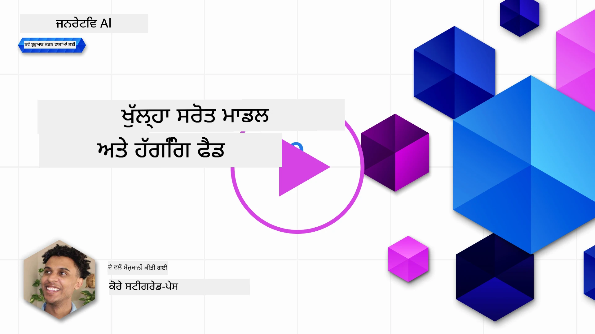
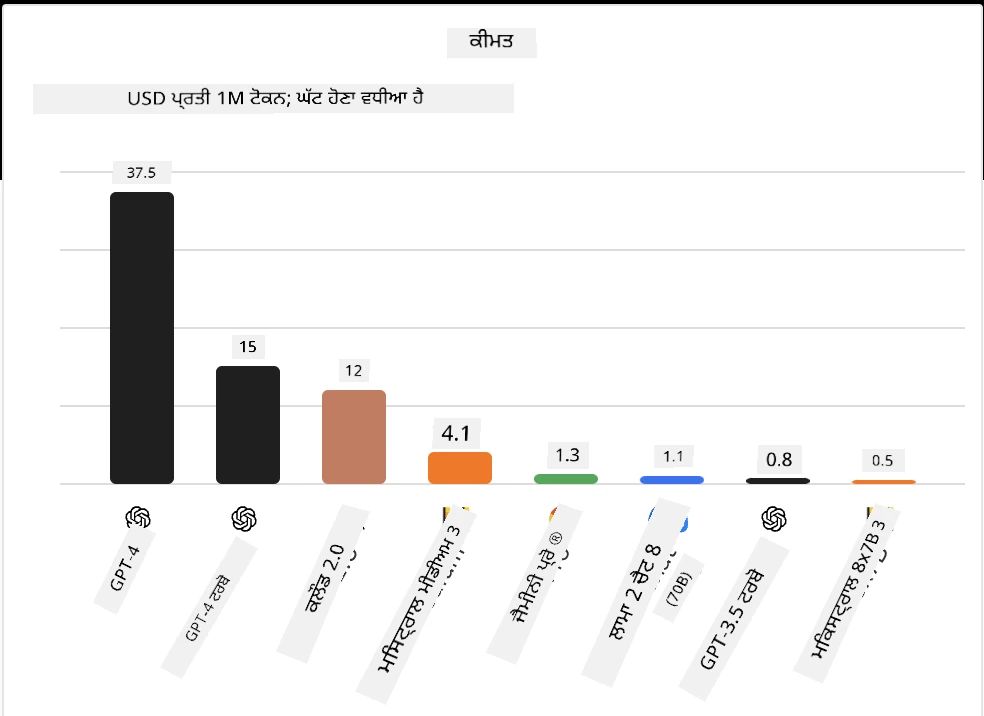
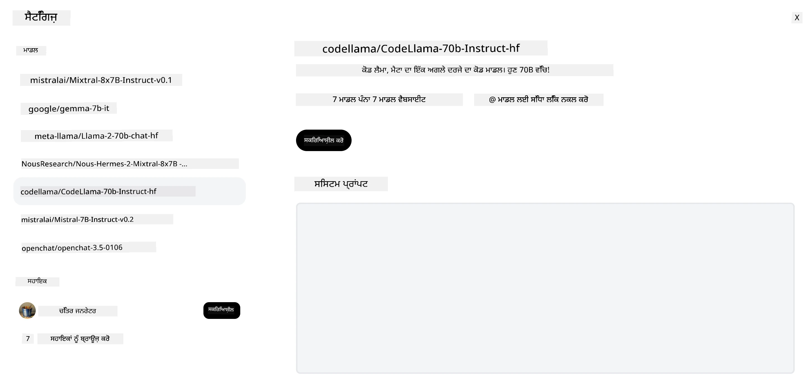
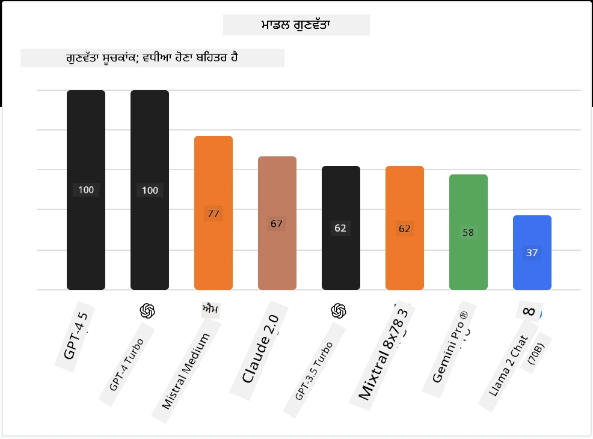

## ਜਾਣ ਪਹਚਾਣ

ਖੁੱਲ੍ਹੇ ਸਰੋਤ ਵਾਲੇ LLMs ਦੀ ਦੁਨੀਆ ਰੋਮাঞ্চਕ ਅਤੇ ਲਗਾਤਾਰ ਵਿਕਸਤ ਹੋ ਰਹੀ ਹੈ। ਇਸ ਪਾਠ ਦਾ ਉਦੇਸ਼ ਖੁੱਲ੍ਹੇ ਸਰੋਤ ਮਾਡਲਾਂ 'ਤੇ ਇੱਕ ਗਹਿਰੀ ਨਜ਼ਰ ਪੇਸ਼ ਕਰਨਾ ਹੈ। ਜੇ ਤੁਸੀਂ ਜਾਣਨਾ ਚਾਹੁੰਦੇ ਹੋ ਕਿ ਪ੍ਰੋਪਰਾਈਟਰੀ ਮਾਡਲਾਂ ਦੀ ਤੁਲਨਾ ਖੁੱਲ੍ਹੇ ਸਰੋਤ ਮਾਡਲਾਂ ਨਾਲ ਕਿਵੇਂ ਹੁੰਦੀ ਹੈ, ਤਾਂ ਜਾਓ ["ਵੱਖ-ਵੱਖ LLMs ਨੂੰ ਖੋਜਣ ਅਤੇ ਤੁਲਨਾ ਕਰਨ" ਪਾਠ](../02-exploring-and-comparing-different-llms/README.md?WT.mc_id=academic-105485-koreyst) ਵਿੱਚ। ਇਹ ਪਾਠ ਫਾਈਨ-ਟਿਊਨਿੰਗ ਦੇ ਵਿਸ਼ੇ ਨੂੰ ਵੀ ਛੁਹੇਗਾ, ਪਰ ਇਸ ਦਾ ਵਿਸ਼ਤ੍ਰਿਤ ਵੇਰਵਾ ਤੁਸੀਂ ["ਫਾਈਨ-ਟਿਊਨਿੰਗ LLMs" ਪਾਠ](../18-fine-tuning/README.md?WT.mc_id=academic-105485-koreyst) ਵਿੱਚ ਲੱਭ ਸਕਦੇ ਹੋ।

## ਸਿੱਖਣ ਦੇ ਮਨਜ਼ਿਲਾਂ

- ਖੁੱਲ੍ਹੇ ਸਰੋਤ ਮਾਡਲਾਂ ਦੀ ਸਮਝ ਪ੍ਰਾਪਤ ਕਰਨਾ
- ਖੁੱਲ੍ਹੇ ਸਰੋਤ ਮਾਡਲਾਂ ਨਾਲ ਕੰਮ ਕਰਨ ਦੇ ਫਾਇਦੇ ਸਮਝਣਾ
- Hugging Face ਅਤੇ Microsoft Foundry ਮਾਡਲ ਕੈਟਾਲੋਗ ’ਚ ਉਪਲਬਧ ਖੁੱਲ੍ਹੇ ਮਾਡਲਾਂ ਦੀ ਖੋਜ

## ਖੁੱਲ੍ਹੇ ਸਰੋਤ ਮਾਡਲ ਕੀ ਹਨ?

ਖੁੱਲ੍ਹਾ ਸਰੋਤ ਸਾਫਟਵੇਅਰ ਤਕਨਾਲੋਜੀ ਦੇ ਵਿਵਿਧ ਖੇਤਰਾਂ ਵਿੱਚ ਵਿਕਾਸ ਵਿੱਚ ਇਕ ਮਹੱਤਵਪੂਰਨ ਭੂਮਿਕਾ ਨਿਭਾਇਆ ਹੈ। ਖੁੱਲ੍ਹੇ ਸਰੋਤ ਇਨੀਸ਼ੀਏਟਿਵ (OSI) ਨੇ ਖੁੱਲ੍ਹੇ ਸਰੋਤ ਵਜੋਂ ਵਰਗੀਕ੍ਰਿਤ ਕਰਨ ਲਈ [10 ਮਾਪਦੰਡ](https://web.archive.org/web/20241126001143/https://opensource.org/osd?WT.mc_id=academic-105485-koreyst) ਨਿਰਧਾਰਿਤ ਕੀਤੇ ਹਨ। ਕੋਡ ਨੂੰ ਓਪਨ ਲਾਇਸੈਂਸ ਅਧੀਨ ਖੁੱਲ੍ਹਾ ਸਾਂਝਾ ਕੀਤਾ ਜਾਣਾ ਚਾਹੀਦਾ ਹੈ ਜੋ OSI ਵੱਲੋਂ ਮਨਜ਼ੂਰਸ਼ੁਦਾ ਹੋਵੇ।

ਜਦਕਿ LLMs ਦੇ ਵਿਕਾਸ ਵਿੱਚ ਸਾਫਟਵੇਅਰ ਵਿਕਾਸ ਨਾਲ ਕੁਝ ਸਮਾਨ ਤੱਤ ਹਨ, ਪ੍ਰਕਿਰਿਆ ਬਿਲਕੁਲ ਇਕੋ ਜਿਹੀ ਨਹੀਂ ਹੈ। ਇਸ ਕਰਕੇ ਲLMs ਦੇ ਸੰਦਰਭ ਵਿੱਚ ਖੁੱਲ੍ਹੇ ਸਰੋਤ ਦੀ ਪਰਿਭਾਸ਼ਾ ਬਾਰੇ ਕਮਿਊਨਿਟੀ ਵਿੱਚ ਕਾਫੀ ਚਰਚਾ ਹੋਈ ਹੈ। ਕਿਸੇ ਮਾਡਲ ਨੂੰ ਪਰੰਪਰਾਗਤ ਖੁੱਲ੍ਹੇ ਸਰੋਤ ਦੀ ਪਰਿਭਾਸ਼ਾ ਨਾਲ ਮੇਲ ਖਾਣ ਲਈ ਹੇਠਾਂ ਦਿੱਤੀ ਜਾਣਕਾਰੀ ਸਰਵਜਨਕ ਤੌਰ 'ਤੇ ਉਪਲਬਧ ਹੋਣੀ ਚਾਹੀਦੀ ਹੈ:

- ਮਾਡਲ ਨੂੰ ਟ੍ਰੇਨ ਕਰਨ ਲਈ ਵਰਤੇ ਗਏ ਡੇਟਾਸੈੱਟਸ
- ਟ੍ਰੇਨਿੰਗ ਦੇ ਹਿੱਸੇ ਵਜੋਂ ਪੂਰੇ ਮਾਡਲ ਹੀਵੇਟਸ
- ਜ਼ਾਂਚ ਕੋਡ
- ਫਾਈਨ-ਟਿਊਨਿੰਗ ਕੋਡ
- ਪੂਰੇ ਮਾਡਲ ਹੀਵੇਟਸ ਅਤੇ ਟ੍ਰੇਨਿੰਗ ਮੈਟਰਿਕਸ

ਇਸ ਮਾਪਦੰਡ ਨਾਲ ਮੇਲ ਖਾਣ ਵਾਲੇ ਹੁਣ ਤੱਕ ਕੁਝ ਹੀ ਮਾਡਲ ਮੌਜੂਦ ਹਨ। [Allen Institute for Artificial Intelligence (AllenAI) ਵੱਲੋਂ ਬਣਾਇਆ OLMo ਮਾਡਲ](https://huggingface.co/allenai/OLMo-7B?WT.mc_id=academic-105485-koreyst) ਇਕ ਅਜਿਹਾ ਮਾਡਲ ਹੈ।

ਇਸ ਪਾਠ ਲਈ ਅਸੀਂ ਮਾਡਲਾਂ ਨੂੰ ਅੱਗੇ "ਖੁੱਲ੍ਹੇ ਮਾਡਲ" ਕਹਾਂਗੇ ਕਿਉਂਕਿ ਇਹ ਲਿਖਣ ਦੇ ਸਮੇਂ ਉੱਪਰ ਦਿੱਤੇ ਮਾਪਦੰਡਾਂ ਨਾਲ ਠੀਕ ਢੰਗ ਨਾਲ ਮੇਲ ਨਹੀਂ ਖਾਂਦੇ ਹੋ ਸਕਦੇ।

## ਖੁੱਲ੍ਹੇ ਮਾਡਲਾਂ ਦੇ ਫਾਇਦੇ

**ਬਹੁਤ ਜ਼ਿਆਦਾ ਕਸਟਮਾਈਜੇਬਲ** - ਕਿਉਂਕਿ ਖੁੱਲ੍ਹੇ ਮਾਡਲ ਵਿਸਤ੍ਰਿਤ ਟ੍ਰੇਨਿੰਗ ਜਾਣਕਾਰੀ ਨਾਲ ਜਾਰੀ ਕੀਤੇ ਜਾਂਦੇ ਹਨ, ਖੋਜਕਾਰ ਅਤੇ ਵਿਕਾਸਕਾਰ ਮਾਡਲ ਦੇ ਅੰਦਰੂਨੀ ਹਿੱਸਿਆਂ ਨੂੰ ਬਦਲ ਸਕਦੇ ਹਨ। ਇਸ ਨਾਲ ਖਾਸ ਕਾਰਜ ਜਾਂ ਵਿਸ਼ੇਸ਼ ਅਧਿਐਨ ਖੇਤਰ ਲਈ ਫਾਈਨ-ਟਿਊਨਿੰਗ ਕੀਤੇ ਗਏ ਬਹੁਤ ਜ਼ਿਆਦਾ ਵਿਸ਼ੇਸ਼ ਮਾਡਲ ਬਣਾਏ ਜਾ ਸਕਦੇ ਹਨ। ਉਦਾਹਰਣ ਵਜੋਂ ਕੋਡ ਜਨਰੇਸ਼ਨ, ਗਣਿਤੀ ਸੰਚਾਲਨ ਅਤੇ ਜੀਵ ਵਿਗਿਆਨ ਹਨ।

**ਲਾਗਤ** - ਇਨ੍ਹਾਂ ਮਾਡਲਾਂ ਦਾ ਪ੍ਰਤੀ ਟੋਕਨ ਲਾਗਤ ਪਰੋਪਰਾਈਟਰੀ ਮਾਡਲਾਂ ਨਾਲੋਂ ਘੱਟ ਹੁੰਦੀ ਹੈ। ਜੈਨੇਰੇਟਿਵ AI ਐਪਲੀਕੇਸ਼ਨਾਂ ਬਣਾਉਂਦੇ ਸਮੇਂ, ਆਪਣੇ ਇਸਤੇਮਾਲ ਦੇ ਮਾਮਲੇ 'ਤੇ ਕੰਮ ਕਰਦਿਆਂ ਪ੍ਰਦਰਸ਼ਨ ਵੱਲੋਂ ਕੀਮਤ ਦੀ ਬਰਾਬਰੀ ਨੂੰ ਵੇਖਣਾ ਚਾਹੀਦਾ ਹੈ।

ਸਰੋਤ: Artificial Analysis

**ਲਚਕੀਲੇਪਣ** - ਖੁੱਲ੍ਹੇ ਮਾਡਲਾਂ ਨਾਲ ਕੰਮ ਕਰਨਾ ਤੁਹਾਨੂੰ ਵੱਖ-ਵੱਖ ਮਾਡਲਾਂ ਨੂੰ ਵਰਤਣ ਜਾਂ ਜੋੜਨ ਵਿੱਚ ਲਚਕੀਲਾ ਬਣਾਉਂਦਾ ਹੈ। ਉਦਾਹਰਣ ਵਜੋਂ [HuggingChat ਅਸਿਸਟੈਂਟਸ](https://huggingface.co/chat?WT.mc_id=academic-105485-koreyst) ਵਿੱਚ ਵਰਤੋਂਕਾਰ ਸਿੱਧੇ ਯੂਜ਼ਰ ਇੰਟਰਫੇਸ ਵਿੱਚ ਮਾਡਲ ਚੁਣ ਸਕਦਾ ਹੈ:

## ਵੱਖ-ਵੱਖ ਖੁੱਲ੍ਹੇ ਮਾਡਲਾਂ ਦੀ ਖੋਜ

### ਲਲਾ 2

[Meta ਦੁਆਰਾ ਵਿਕਸਿਤ Llama2](https://huggingface.co/meta-llama?WT.mc_id=academic-105485-koreyst) ਇਕ ਖੁੱਲ੍ਹਾ ਮਾਡਲ ਹੈ ਜੋ ਚੈਟ ਅਧਾਰਤ ਐਪਲੀਕੇਸ਼ਨਾਂ ਲਈ ਅਨੁਕੂਲਿਤ ਕੀਤਾ ਗਿਆ ਹੈ। ਇਹ ਇਸਦਾ ਫਾਈਨ-ਟਿਊਨਿੰਗ ਤਰੀਕਾ ਹੈ, ਜਿਸ ਵਿੱਚ ਵੱਡੀ ਮਾਤਰਾ ਵਿੱਚ ਡਾਇਲਾਗ ਅਤੇ ਮਨੁੱਖੀ ਫੀਡਬੈਕ ਸ਼ਾਮਲ ਹਨ। ਇਸ ਤਰੀਕੇ ਨਾਲ ਮਾਡਲ ਹੋਰ ਨਤੀਜੇ ਉਤਪੰਨ ਕਰਦਾ ਹੈ ਜੋ ਮਨੁੱਖੀ ਉਮੀਦਾਂ ਨਾਲ ਮੇਲ ਖਾਂਦੇ ਹਨ, ਜਿਸ ਨਾਲ ਚੰਗਾ ਯੂਜ਼ਰ ਅਨੁਭਵ ਮਿਲਦਾ ਹੈ।

Llama ਦੇ ਕੁਝ ਫਾਈਨ-ਟਿਊਨ ਕੀਤੇ ਸੰਸਕਰਣਾਂ ਵਿੱਚ [Japanese Llama](https://huggingface.co/elyza/ELYZA-japanese-Llama-2-7b?WT.mc_id=academic-105485-koreyst) ਹੈ, ਜੋ ਜਪਾਨੀ ਵਿੱਚ ਵਿਸ਼ੇਸ਼ਗਿਆ ਹੈ ਅਤੇ [Llama Pro](https://huggingface.co/TencentARC/LLaMA-Pro-8B?WT.mc_id=academic-105485-koreyst), ਜੋ ਬੇਸ ਮਾਡਲ ਦਾ ਸੁਧਾਰ ਕੀਤਾ ਹੋਇਆ ਸੰਸਕਰਣ ਹੈ।

### ਮਿਸਟ੍ਰਾਲ

[Mistral](https://huggingface.co/mistralai?WT.mc_id=academic-105485-koreyst) ਇਕ ਖੁੱਲ੍ਹਾ ਮਾਡਲ ਹੈ ਜੋ ਉੱਚ ਕਾਰਗੁਜ਼ਾਰੀ ਅਤੇ ਪ੍ਰਭਾਵਸ਼ੀਲਤਾ ’ਤੇ ਜ਼ੋਰ ਦਿੰਦਾ ਹੈ। ਇਹ Mixture-of-Experts ਪদ্ধਤੀ ਵਰਤਦਾ ਹੈ ਜੋ ਕਈ ਮੁਹਾਰਤਯਾ ਮਾਹਿਰ ਮਾਡਲਾਂ ਨੂੰ ਇੱਕ ਪ੍ਰਣਾਲੀ ਵਿੱਚ ਜੋੜਦਾ ਹੈ ਜਿੱਥੇ ਇਨਪੁਟ ਦੇ ਅਨੁਸਾਰ ਕੁਝ ਮਾਡਲ ਚੁਣੇ ਜਾਂਦੇ ਹਨ। ਇਸ ਨਾਲ ਗਣਨਾ ਹੋਰ ਪ੍ਰਭਾਵਸ਼ਾਲੀ ਬਣ ਜਾਂਦੀ ਹੈ ਕਿਉਂਕਿ ਮਾਡਲ ਸਿਰਫ ਉਹ ਇਨਪੁਟ ਸੰਭਾਲਦੇ ਹਨ ਜਿਨ੍ਹਾਂ 'ਚ ਉਹ ਖਾਸ ਹਨ।

Mistral ਦੇ ਕੁਝ ਫਾਈਨ-ਟਿਊਨ ਕੀਤੇ ਸੰਸਕਰਣਾਂ ਵਿੱਚ [BioMistral](https://huggingface.co/BioMistral/BioMistral-7B?text=Mon+nom+est+Thomas+et+mon+principal?WT.mc_id=academic-105485-koreyst) ਹੈ, ਜੋ ਚਿਕਿੱਤਸਾ ਖੇਤਰ 'ਤੇ ਧਿਆਨ ਕੇਂਦਰਿਤ ਕਰਦਾ ਹੈ, ਅਤੇ [OpenMath Mistral](https://huggingface.co/nvidia/OpenMath-Mistral-7B-v0.1-hf?WT.mc_id=academic-105485-koreyst), ਜੋ ਗਣਿਤੀ ਸੰਗਣਨਾ ਕਰਦਾ ਹੈ।

### ਫਾਲਕਣ

[Falcon](https://huggingface.co/tiiuae?WT.mc_id=academic-105485-koreyst) ਇਕ LLM ਹੈ ਜੋ ਟੈਕਨਾਲੋਜੀ ਇਨੋਵੇਸ਼ਨ ਇੰਸਟੀਟਿਊਟ (**TII**) ਵੱਲੋਂ ਬਣਾਇਆ ਗਿਆ ਹੈ। Falcon-40B ਨੂੰ 40 ਬਿਲੀਅਨ ਪੈਰਾਮੀਟਰਾਂ ’ਤੇ ਟ੍ਰੇਨ ਕੀਤਾ ਗਿਆ ਜੋ ਘੱਟ ਕਮਪਿਊਟ ਬਜਟ ਨਾਲ GPT-3 ਤੋਂ ਵਧੀਆ ਦਰਸਾਇਆ ਗਿਆ ਹੈ। ਇਹ ਇਸਦੇ ਫਲੈਸ਼ਅਟੈਂਸ਼ਨ ਅਲਗੋਰਿਦਮ ਅਤੇ ਮਲਟੀਕੁਐਰੀ ਅਟੈਂਸ਼ਨ ਦੀ ਵਰਤੋਂ ਕਰਕੇ ਸਮਭਵ ਹੋਇਆ ਜੋ ਇਨਫਰੈਂਸ ਸਮੇਂ ਮੈਮੋਰੀ ਦੀ ਲੋੜ ਘਟਾਉਂਦਾ ਹੈ। ਘੱਟ ਇਨਫਰੈਂਸ ਸਮੇਂ ਨਾਲ Falcon-40B ਚੈਟ ਐਪਲੀਕੇਸ਼ਨਾਂ ਲਈ ਉਚਿਤ ਹੈ।

ਫਾਲਕਣ ਦੇ ਕੁਝ ਫਾਈਨ-ਟਿਊਨ ਕੀਤੇ ਸੰਸਕਰਣਾਂ ਵਿੱਚ [OpenAssistant](https://huggingface.co/OpenAssistant/falcon-40b-sft-top1-560?WT.mc_id=academic-105485-koreyst) ਹੈ, ਜੋ ਖੁੱਲ੍ਹੇ ਮਾਡਲਾਂ 'ਤੇ ਆਧਾਰਿਤ ਇੱਕ ਸਹਾਇਕ ਹੈ, ਅਤੇ [GPT4ALL](https://huggingface.co/nomic-ai/gpt4all-falcon?WT.mc_id=academic-105485-koreyst), ਜੋ ਬੇਸ ਮਾਡਲ ਤੋਂ ਵਧੀਆ ਕਾਰਗੁਜ਼ਾਰੀ ਦੇਂਦਾ ਹੈ।

## ਚੁਣਨ ਲਈ ਕਿਵੇਂ

ਖੁੱਲ੍ਹਾ ਮਾਡਲ ਚੁਣਨ ਲਈ ਕੋਈ ਇਕੋ ਜਿਹਾ ਜਵਾਬ ਨਹੀਂ ਹੈ। ਇੱਕ ਵਧੀਆ ਸ਼ੁਰੂਆਤ Microsoft Foundry ਮਾਡਲ ਕੈਟਾਲੋਗ ਦੇ ਟਾਸਕ ਅਨੁਸਾਰ ਫਿਲਟਰ ਕਰਨ ਦੇ ਫੀਚਰ ਦੀ ਵਰਤੋਂ ਕਰਕੇ ਕਰ ਸਕਦੇ ਹੋ। ਇਸ ਨਾਲ ਤੁਹਾਨੂੰ ਸਮਝ ਆਵੇਗੀ ਕਿ ਮਾਡਲ ਕਿਸ ਕਿਸਮ ਦੇ ਟਾਸਕ ਲਈ ਟ੍ਰੇਨ ਕੀਤਾ ਗਿਆ ਹੈ। Hugging Face ਵੀ ਇੱਕ LLM ਲੀਡਰਬੋਰਡ ਸੰਭਾਲਦਾ ਹੈ ਜੋ ਕੁਝ ਮੈਟਰਿਕਸ ਦੇ ਅਧਾਰ 'ਤੇ ਸਭ ਤੋਂ ਵਧੀਆ ਪ੍ਰਦਰਸ਼ਨ ਵਾਲੇ ਮਾਡਲ ਦਿਖਾਉਂਦਾ ਹੈ।

ਜਦੋਂ ਵੱਖ-ਵੱਖ ਕਿਸਮਾਂ ਦੇ LLMs ਦੀ ਤੁਲਨਾ ਕਰਨੀ ਹੋਵੇ, [Artificial Analysis](https://artificialanalysis.ai/?WT.mc_id=academic-105485-koreyst) ਇੱਕ ਹੋਰ ਵਧੀਆ ਸਰੋਤ ਹੈ:

ਸਰੋਤ: Artificial Analysis

ਜੇ ਤੁਸੀਂ ਕਿਸੇ ਖਾਸ ਵਰਤੋਂ ਦੇ ਮਾਮਲੇ 'ਤੇ ਕੰਮ ਕਰ ਰਹੇ ਹੋ, ਤਾਂ ਫਾਈਨ-ਟਿਊਨ ਕੀਤੀਆਂ ਸੰਸਕਰਣਾਂ ਜੋ ਉਸੇ ਖੇਤਰ 'ਤੇ ਕੇਂਦਰਤ ਹਨ, ਦੀ ਖੋਜ ਕਰਨਾ ਪ੍ਰਭਾਵਸ਼ਾਲੀ ਹੋ ਸਕਦਾ ਹੈ। ਕਈ ਖੁੱਲ੍ਹੇ ਮਾਡਲਾਂ ਨਾਲ ਪ੍ਰਯੋਗ ਕਰਕੇ ਦੇਖਣਾ ਕਿ ਉਹ ਤੁਹਾਡੇ ਅਤੇ ਤੁਹਾਡੇ ਵਰਤੋਂਕਾਰਾਂ ਦੀਆਂ ਉਮੀਦਾਂ ਅਨੁਸਾਰ ਕਿਵੇਂ ਪ੍ਰਦਰਸ਼ਨ ਕਰਦੇ ਹਨ ਇਕ ਵਧੀਆ ਅਭਿਆਸ ਹੈ।

## ਅਗਲੇ ਕਦਮ

ਖੁੱਲ੍ਹੇ ਮਾਡਲਾਂ ਵਿੱਚ ਸਭ ਤੋਂ ਵਧੀਆ ਗੱਲ ਇਹ ਹੈ ਕਿ ਤੁਸੀਂ ਇਨ੍ਹਾਂ ਨਾਲ ਕੰਮ ਕਰਨਾ ਕਾਫੀ ਜਲਦੀ ਸ਼ੁਰੂ ਕਰ ਸਕਦੇ ਹੋ। [Microsoft Foundry ਮਾਡਲ ਕੈਟਾਲੋਗ](https://ai.azure.com?WT.mc_id=academic-105485-koreyst) ਨੂੰ ਵੇਖੋ, ਜਿਸ ਵਿੱਚ ਇੱਕ ਖਾਸ Hugging Face ਸੰਗ੍ਰਹਿ ਹੈ ਜਿਹੜਾ ਇਨ੍ਹਾਂ ਮਾਡਲਾਂ ਨੂੰ ਦਰਸਾਉਂਦਾ ਹੈ ਜਿਨ੍ਹਾਂ ਬਾਰੇ ਅਸੀਂ ਇੱਥੇ ਗੱਲ ਕੀਤੀ।

## ਸਿੱਖਣਾ ਇਥੇ ਰੁਕਦਾ ਨਹੀਂ, ਜਰਨੀ ਜਾਰੀ ਰੱਖੋ

ਇਸ ਪਾਠ ਨੂੰ ਪੂਰਾ ਕਰਨ ਤੋਂ ਬਾਅਦ, ਸਾਡਾ [Generative AI ਸਿੱਖਣ ਵਾਲਾ ਸੰਗ੍ਰਹਿ](https://aka.ms/genai-collection?WT.mc_id=academic-105485-koreyst) ਵੇਖੋ ਤਾਂ ਜੋ ਤੁਸੀਂ ਆਪਣੀ Generative AI ਜਾਣਕਾਰੀ ਨੂੰ ਹੋਰ ਅੱਗੇ ਵਧਾ ਸਕੋ!

---

<!-- CO-OP TRANSLATOR DISCLAIMER START -->
**ਅਸਵੀਕਾਰੋਪਣ**:
ਇਸ ਦਸਤਾਵੇਜ਼ ਦਾ ਅਨੁਵਾਦ ਏਆਈ ਅਨੁਵਾਦ ਸੇਵਾ [Co-op Translator](https://github.com/Azure/co-op-translator) ਦੀ ਵਰਤੋਂ ਕਰਕੇ ਕੀਤਾ ਗਿਆ ਹੈ। ਜਦੋਂ ਕਿ ਅਸੀਂ ਸਹੀਤਾਵਾਂ ਲਈ ਯਤਨਸ਼ੀਲ ਹਾਂ, ਕਿਰਪਾ ਕਰਕੇ ਧਿਆਨ ਰੱਖੋ ਕਿ ਸਵੈਚਾਲਿਤ ਅਨੁਵਾਦਾਂ ਵਿੱਚ ਗਲਤੀਆਂ ਜਾਂ ਅਸਮੱਤਿਆਵਾਂ ਹੋ ਸਕਦੀਆਂ ਹਨ। ਮੂਲ ਦਸਤਾਵੇਜ਼ ਆਪਣੀ ਮੂਲ ਭਾਸ਼ਾ ਵਿੱਚ ਅਧਿਕਾਰਕ ਸਰੋਤ ਮੰਨਿਆ ਜਾਣਾ ਚਾਹੀਦਾ ਹੈ। ਜਰੂਰੀ ਜਾਣਕਾਰੀ ਲਈ, ਪੇਸ਼ੇਵਰ ਮਨੁੱਖੀ ਅਨੁਵਾਦ ਦੀ ਸਿਫ਼ਾਰਸ਼ ਕੀਤੀ ਜਾਂਦੀ ਹੈ। ਅਸੀਂ ਇਸ ਅਨੁਵਾਦ ਦੇ ਉਪਯੋਗ ਤੋਂ ਪੈਦਾ ਹੋਣ ਵਾਲੀਆਂ ਕਿਸੇ ਵੀ ਗਲਤਫਹਿਮੀਆਂ ਜਾਂ ਗਲਤ ਵਿਆਖਿਆਵਾਂ ਲਈ ਜਵਾਬਦੇਹ ਨਹੀਂ ਹਾਂ।
<!-- CO-OP TRANSLATOR DISCLAIMER END -->