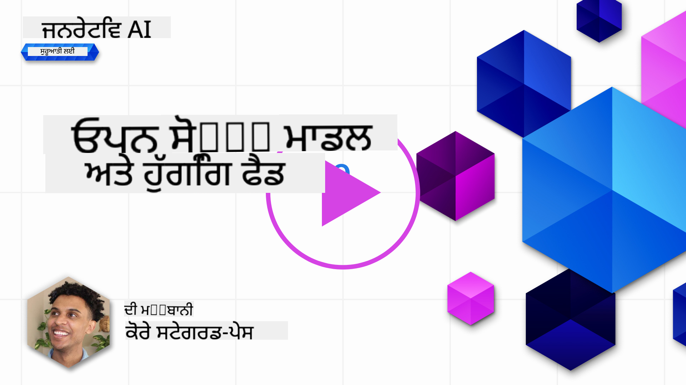
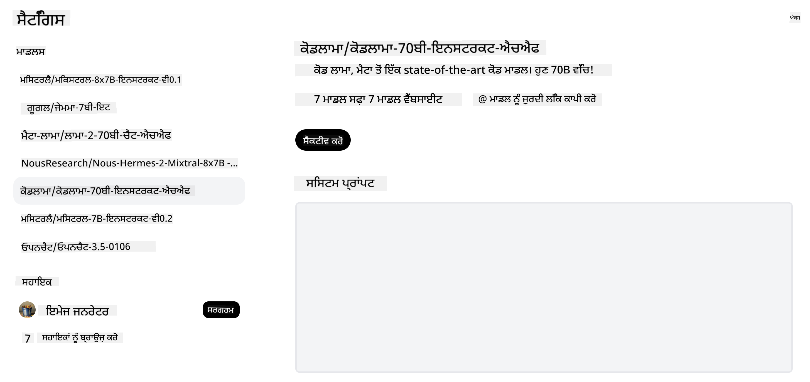
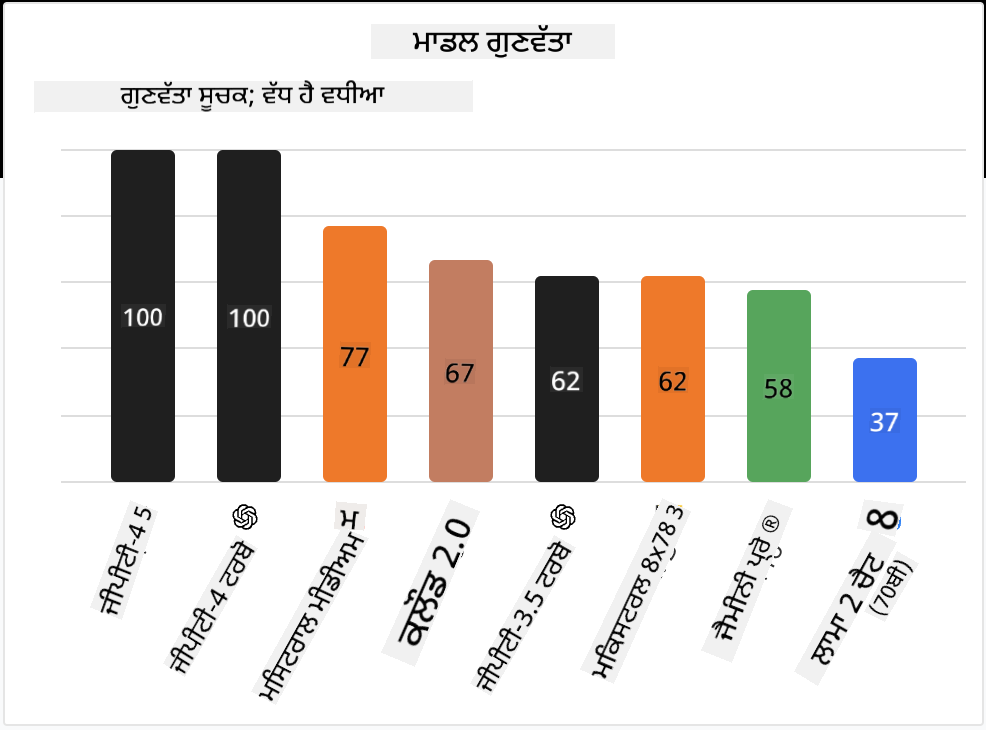

<!--
CO_OP_TRANSLATOR_METADATA:
{
  "original_hash": "0bba96e53ab841d99db731892a51fab8",
  "translation_date": "2025-06-25T23:54:02+00:00",
  "source_file": "16-open-source-models/README.md",
  "language_code": "pa"
}
-->

## ਜਾਣ ਪਛਾਣ

ਖੁੱਲ੍ਹੇ ਸਰੋਤ ਵਾਲੇ LLMs ਦੀ ਦੁਨੀਆ ਰੋਮਾਂਚਕ ਅਤੇ ਲਗਾਤਾਰ ਵਿਕਸਿਤ ਹੋ ਰਹੀ ਹੈ। ਇਹ ਪਾਠ ਖੁੱਲ੍ਹੇ ਸਰੋਤ ਮਾਡਲਾਂ 'ਤੇ ਵਿਸਥਾਰ ਨਾਲ ਨਜ਼ਰ ਪਾਉਣ ਦਾ ਉਦੇਸ਼ ਰੱਖਦਾ ਹੈ। ਜੇ ਤੁਸੀਂ ਜਾਣਕਾਰੀ ਦੀ ਭਾਲ ਕਰ ਰਹੇ ਹੋ ਕਿ ਖੁਫੀਆ ਮਾਡਲ ਖੁੱਲ੍ਹੇ ਸਰੋਤ ਮਾਡਲਾਂ ਨਾਲ ਕਿਵੇਂ ਤੁਲਨਾ ਕਰਦੇ ਹਨ, ਤਾਂ ["ਵੱਖ-ਵੱਖ LLMs ਦੀ ਖੋਜ ਅਤੇ ਤੁਲਨਾ" ਪਾਠ](../02-exploring-and-comparing-different-llms/README.md?WT.mc_id=academic-105485-koreyst) 'ਤੇ ਜਾਓ। ਇਸ ਪਾਠ ਵਿੱਚ ਫਾਈਨ-ਟਿਊਨਿੰਗ ਦਾ ਵਿਸ਼ਾ ਵੀ ਸ਼ਾਮਲ ਹੋਵੇਗਾ ਪਰ ਇਸਦੀ ਹੋਰ ਵਿਸਤ੍ਰਿਤ ਵਿਆਖਿਆ ["ਫਾਈਨ-ਟਿਊਨਿੰਗ LLMs" ਪਾਠ](../18-fine-tuning/README.md?WT.mc_id=academic-105485-koreyst) ਵਿੱਚ ਮਿਲ ਸਕਦੀ ਹੈ।

## ਸਿੱਖਣ ਦੇ ਲਕਸ਼

- ਖੁੱਲ੍ਹੇ ਸਰੋਤ ਮਾਡਲਾਂ ਦੀ ਸਮਝ ਪ੍ਰਾਪਤ ਕਰੋ
- ਖੁੱਲ੍ਹੇ ਸਰੋਤ ਮਾਡਲਾਂ ਨਾਲ ਕੰਮ ਕਰਨ ਦੇ ਫਾਇਦੇ ਸਮਝਣਾ
- ਹੱਗਿੰਗ ਫੇਸ ਅਤੇ ਐਜ਼ਰ ਏਆਈ ਸਟੂਡੀਓ 'ਤੇ ਉਪਲਬਧ ਖੁੱਲ੍ਹੇ ਮਾਡਲਾਂ ਦੀ ਖੋਜ

## ਖੁੱਲ੍ਹੇ ਸਰੋਤ ਮਾਡਲ ਕੀ ਹਨ?

ਖੁੱਲ੍ਹੇ ਸਰੋਤ ਸੌਫਟਵੇਅਰ ਨੇ ਵੱਖ-ਵੱਖ ਖੇਤਰਾਂ ਵਿੱਚ ਤਕਨਾਲੋਜੀ ਦੇ ਵਿਕਾਸ ਵਿੱਚ ਮਹੱਤਵਪੂਰਨ ਭੂਮਿਕਾ ਨਿਭਾਈ ਹੈ। ਖੁੱਲ੍ਹੇ ਸਰੋਤ ਉਪਰਾਲਾ (OSI) ਨੇ ਸੌਫਟਵੇਅਰ ਨੂੰ ਖੁੱਲ੍ਹਾ ਸਰੋਤ ਵਜੋਂ ਵਰਗੀਕ੍ਰਿਤ ਕਰਨ ਲਈ [10 ਮਾਪਦੰਡ](https://web.archive.org/web/20241126001143/https://opensource.org/osd?WT.mc_id=academic-105485-koreyst) ਨਿਰਧਾਰਿਤ ਕੀਤੇ ਹਨ। ਸੋਰਸ ਕੋਡ ਨੂੰ OSI ਦੁਆਰਾ ਮਨਜ਼ੂਰ ਕੀਤੇ ਲਾਇਸੈਂਸ ਦੇ ਤਹਿਤ ਖੁੱਲ੍ਹੇ ਤੌਰ 'ਤੇ ਸਾਂਝਾ ਕੀਤਾ ਜਾਣਾ ਚਾਹੀਦਾ ਹੈ।

ਜਦੋਂ ਕਿ LLMs ਦਾ ਵਿਕਾਸ ਸੌਫਟਵੇਅਰ ਨੂੰ ਵਿਕਸਿਤ ਕਰਨ ਦੇ ਸਮਾਨ ਤੱਤਾਂ ਨਾਲ ਹੈ, ਪਰ ਪ੍ਰਕਿਰਿਆ ਬਿਲਕੁਲ ਇੱਕੋ ਜਿਹੀ ਨਹੀਂ ਹੈ। ਇਸ ਨੇ LLMs ਦੇ ਸੰਦਰਭ ਵਿੱਚ ਖੁੱਲ੍ਹੇ ਸਰੋਤ ਦੀ ਪਰਿਭਾਸ਼ਾ 'ਤੇ ਕਮਿਊਨਿਟੀ ਵਿੱਚ ਬਹੁਤ ਚਰਚਾ ਕੀਤੀ ਹੈ। ਇੱਕ ਮਾਡਲ ਨੂੰ ਖੁੱਲ੍ਹੇ ਸਰੋਤ ਦੀ ਰਵਾਇਤੀ ਪਰਿਭਾਸ਼ਾ ਨਾਲ ਸੁਰਜੀਤ ਕਰਨ ਲਈ ਹੇਠਾਂ ਦਿੱਤੀ ਜਾਣਕਾਰੀ ਜਨਤਕ ਤੌਰ 'ਤੇ ਉਪਲਬਧ ਹੋਣੀ ਚਾਹੀਦੀ ਹੈ:

- ਮਾਡਲ ਨੂੰ ਸਿਖਾਉਣ ਲਈ ਵਰਤੇ ਗਏ ਡੇਟਾਸੈਟਸ।
- ਸਿਖਲਾਈ ਦੇ ਹਿੱਸੇ ਵਜੋਂ ਪੂਰੇ ਮਾਡਲ ਦੇ ਭਾਰ।
- ਮੁਲਾਂਕਣ ਕੋਡ।
- ਫਾਈਨ-ਟਿਊਨਿੰਗ ਕੋਡ।
- ਪੂਰੇ ਮਾਡਲ ਦੇ ਭਾਰ ਅਤੇ ਸਿਖਲਾਈ ਮਾਪਦੰਡ।

ਇਸ ਸਮੇਂ ਸਿਰਫ ਕੁਝ ਮਾਡਲ ਹੀ ਇਸ ਮਾਪਦੰਡਾਂ ਨਾਲ ਮੇਲ ਖਾਂਦੇ ਹਨ। [ਐਲਨ ਇੰਸਟੀਚਿਊਟ ਫਾਰ ਆਰਟੀਫੀਸ਼ੀਅਲ ਇੰਟੈਲੀਜੈਂਸ (ਐਲਨਏਆਈ) ਦੁਆਰਾ ਬਣਾਇਆ ਗਿਆ OLMo ਮਾਡਲ](https://huggingface.co/allenai/OLMo-7B?WT.mc_id=academic-105485-koreyst) ਇਸ ਸ਼੍ਰੇਣੀ ਵਿੱਚ ਆਉਂਦਾ ਹੈ।

ਇਸ ਪਾਠ ਲਈ, ਅਸੀਂ ਮਾਡਲਾਂ ਨੂੰ "ਖੁੱਲ੍ਹੇ ਮਾਡਲਾਂ" ਵਜੋਂ ਸੰਬੋਧਨ ਕਰਾਂਗੇ ਕਿਉਂਕਿ ਉਹ ਲਿਖਣ ਦੇ ਸਮੇਂ ਉਪਰੋਕਤ ਮਾਪਦੰਡਾਂ ਨਾਲ ਮੇਲ ਨਹੀਂ ਖਾਂਦੇ ਹੋ ਸਕਦੇ।

## ਖੁੱਲ੍ਹੇ ਮਾਡਲਾਂ ਦੇ ਫਾਇਦੇ

**ਬਹੁਤ ਜ਼ਿਆਦਾ ਕਸਟਮਾਈਜ਼ੇਬਲ** - ਕਿਉਂਕਿ ਖੁੱਲ੍ਹੇ ਮਾਡਲਾਂ ਨੂੰ ਵਿਸਥਾਰ ਨਾਲ ਸਿਖਲਾਈ ਜਾਣਕਾਰੀ ਨਾਲ ਜਾਰੀ ਕੀਤਾ ਜਾਂਦਾ ਹੈ, ਖੋਜਕਾਰ ਅਤੇ ਡਿਵੈਲਪਰ ਮਾਡਲ ਦੇ ਅੰਦਰੂਨੀ ਹਿੱਸਿਆਂ ਨੂੰ ਸੋਧ ਸਕਦੇ ਹਨ। ਇਹ ਵਿਸ਼ੇਸ਼ ਟਾਸਕ ਜਾਂ ਅਧਿਐਨ ਦੇ ਖੇਤਰ ਲਈ ਬਹੁਤ ਹੀ ਵਿਸ਼ੇਸ਼ ਮਾਡਲ ਬਣਾਉਣ ਨੂੰ ਯੋਗ ਬਣਾਉਂਦਾ ਹੈ। ਇਸ ਦੇ ਕੁਝ ਉਦਾਹਰਣ ਹਨ ਕੋਡ ਜਨਰੇਸ਼ਨ, ਗਣਿਤੀਕਲ ਕਾਰਜ ਅਤੇ ਜੀਵ ਵਿਗਿਆਨ।

**ਲਾਗਤ** - ਇਹਨਾਂ ਮਾਡਲਾਂ ਨੂੰ ਵਰਤਣ ਅਤੇ ਤੈਨਾਤ ਕਰਨ ਲਈ ਪ੍ਰਤੀ ਟੋਕਨ ਲਾਗਤ ਖੁਫੀਆ ਮਾਡਲਾਂ ਨਾਲੋਂ ਘੱਟ ਹੈ। ਜਨਰੇਟਿਵ ਏਆਈ ਐਪਲੀਕੇਸ਼ਨ ਬਣਾਉਂਦੇ ਸਮੇਂ, ਤੁਹਾਡੇ ਮਾਮਲੇ 'ਤੇ ਇਹਨਾਂ ਮਾਡਲਾਂ ਨਾਲ ਕੰਮ ਕਰਦੇ ਸਮੇਂ ਪ੍ਰਦਰਸ਼ਨ ਵਿਰੁੱਧ ਕੀਮਤ 'ਤੇ ਧਿਆਨ ਦੇਣਾ ਚਾਹੀਦਾ ਹੈ।

  
ਸਰੋਤ: ਆਰਟੀਫੀਸ਼ੀਅਲ ਐਨਾਲਿਸਿਸ

**ਲਚਕਦਾਰਤਾ** - ਖੁੱਲ੍ਹੇ ਮਾਡਲਾਂ ਨਾਲ ਕੰਮ ਕਰਨ ਨਾਲ ਤੁਹਾਨੂੰ ਵੱਖ-ਵੱਖ ਮਾਡਲਾਂ ਨੂੰ ਵਰਤਣ ਜਾਂ ਉਨ੍ਹਾਂ ਨੂੰ ਮਿਲਾਉਣ ਦੇ ਮਾਮਲੇ ਵਿੱਚ ਲਚਕਦਾਰ ਬਣਾਉਂਦਾ ਹੈ। ਇਸਦਾ ਇੱਕ ਉਦਾਹਰਣ ਹੈ [ਹੱਗਿੰਗਚੈਟ ਸਹਾਇਕ](https://huggingface.co/chat?WT.mc_id=academic-105485-koreyst) ਜਿੱਥੇ ਵਰਤੋਂਕਾਰ ਸਿੱਧੇ ਉਪਭੋਗਤਾ ਇੰਟਰਫੇਸ ਵਿੱਚ ਵਰਤੇ ਜਾ ਰਹੇ ਮਾਡਲ ਨੂੰ ਚੁਣ ਸਕਦੇ ਹਨ:

## ਵੱਖ-ਵੱਖ ਖੁੱਲ੍ਹੇ ਮਾਡਲਾਂ ਦੀ ਖੋਜ

### Llama 2

[LLama2](https://huggingface.co/meta-llama?WT.mc_id=academic-105485-koreyst), ਮੈਟਾ ਦੁਆਰਾ ਵਿਕਸਿਤ ਇੱਕ ਖੁੱਲ੍ਹਾ ਮਾਡਲ ਹੈ ਜੋ ਚੈਟ ਅਧਾਰਤ ਐਪਲੀਕੇਸ਼ਨਾਂ ਲਈ ਅਨੁਕੂਲਿਤ ਹੈ। ਇਹ ਇਸਦੀ ਫਾਈਨ-ਟਿਊਨਿੰਗ ਵਿਧੀ ਕਾਰਨ ਹੈ, ਜਿਸ ਵਿੱਚ ਵੱਡੀ ਮਾਤਰਾ ਵਿੱਚ ਵਾਰਤਾਲਾਪ ਅਤੇ ਮਨੁੱਖੀ ਪ੍ਰਤੀਕਿਰਿਆ ਸ਼ਾਮਲ ਸੀ। ਇਸ ਵਿਧੀ ਨਾਲ, ਮਾਡਲ ਮਨੁੱਖੀ ਉਮੀਦਾਂ ਦੇ ਅਨੁਕੂਲ ਹੋਰ ਨਤੀਜੇ ਪੈਦਾ ਕਰਦਾ ਹੈ ਜੋ ਬਿਹਤਰ ਉਪਭੋਗਤਾ ਅਨੁਭਵ ਪ੍ਰਦਾਨ ਕਰਦਾ ਹੈ।

Llama ਦੇ ਕੁਝ ਸੁਧਾਰੇ ਹੋਏ ਸੰਸਕਰਨਾਂ ਦੇ ਉਦਾਹਰਣਾਂ ਵਿੱਚ [ਜਪਾਨੀ Llama](https://huggingface.co/elyza/ELYZA-japanese-Llama-2-7b?WT.mc_id=academic-105485-koreyst), ਜੋ ਜਪਾਨੀ ਵਿੱਚ ਮਾਹਰ ਹੈ ਅਤੇ [Llama Pro](https://huggingface.co/TencentARC/LLaMA-Pro-8B?WT.mc_id=academic-105485-koreyst), ਜੋ ਆਧਾਰ ਮਾਡਲ ਦਾ ਸੁਧਾਰਿਤ ਸੰਸਕਰਨ ਹੈ, ਸ਼ਾਮਲ ਹਨ।

### Mistral

[Mistral](https://huggingface.co/mistralai?WT.mc_id=academic-105485-koreyst) ਇੱਕ ਖੁੱਲ੍ਹਾ ਮਾਡਲ ਹੈ ਜਿਸਦਾ ਮੁੱਖ ਧਿਆਨ ਉੱਚ ਪ੍ਰਦਰਸ਼ਨ ਅਤੇ ਕੁਸ਼ਲਤਾ 'ਤੇ ਹੈ। ਇਹ ਮਿਸਚਰ-ਆਫ-ਐਕਸਪਰਟਸ ਵਿਧੀ ਨੂੰ ਵਰਤਦਾ ਹੈ ਜੋ ਵਿਸ਼ੇਸ਼ਤਾਓਂ ਵਾਲੇ ਮਾਡਲਾਂ ਦੇ ਸਮੂਹ ਨੂੰ ਇੱਕ ਪ੍ਰਣਾਲੀ ਵਿੱਚ ਮਿਲਾਉਂਦਾ ਹੈ ਜਿੱਥੇ ਇਨਪੁਟ ਦੇ ਆਧਾਰ 'ਤੇ ਕੁਝ ਮਾਡਲਾਂ ਨੂੰ ਵਰਤਣ ਲਈ ਚੁਣਿਆ ਜਾਂਦਾ ਹੈ। ਇਹ ਗਣਨਾ ਨੂੰ ਹੋਰ ਪ੍ਰਭਾਵਸ਼ਾਲੀ ਬਣਾਉਂਦਾ ਹੈ ਕਿਉਂਕਿ ਮਾਡਲ ਸਿਰਫ ਉਹਨਾਂ ਇਨਪੁਟਾਂ ਨੂੰ ਹੀ ਪਤਾ ਕਰ ਰਹੇ ਹਨ ਜਿਨ੍ਹਾਂ ਵਿੱਚ ਉਹ ਮਾਹਰ ਹਨ।

Mistral ਦੇ ਕੁਝ ਸੁਧਾਰੇ ਹੋਏ ਸੰਸਕਰਨਾਂ ਦੇ ਉਦਾਹਰਣਾਂ ਵਿੱਚ [BioMistral](https://huggingface.co/BioMistral/BioMistral-7B?text=Mon+nom+est+Thomas+et+mon+principal?WT.mc_id=academic-105485-koreyst), ਜੋ ਚਿਕਿਤਸਾ ਖੇਤਰ 'ਤੇ ਕੇਂਦ੍ਰਿਤ ਹੈ ਅਤੇ [OpenMath Mistral](https://huggingface.co/nvidia/OpenMath-Mistral-7B-v0.1-hf?WT.mc_id=academic-105485-koreyst), ਜੋ ਗਣਿਤੀਕਲ ਗਣਨਾ ਕਰਦਾ ਹੈ, ਸ਼ਾਮਲ ਹਨ।

### Falcon

[Falcon](https://huggingface.co/tiiuae?WT.mc_id=academic-105485-koreyst) ਇੱਕ LLM ਹੈ ਜੋ ਤਕਨਾਲੋਜੀ ਇਨੋਵੇਸ਼ਨ ਇੰਸਟੀਚਿਊਟ (**TII**) ਦੁਆਰਾ ਬਣਾਇਆ ਗਿਆ ਹੈ। ਫਾਲਕਨ-40B ਨੂੰ 40 ਬਿਲੀਅਨ ਪੈਰਾਮੀਟਰਾਂ 'ਤੇ ਸਿਖਾਇਆ ਗਿਆ ਸੀ ਜਿਸ ਨੂੰ ਘੱਟ ਗਣਨਾ ਬਜਟ ਨਾਲ GPT-3 ਨਾਲੋਂ ਬਿਹਤਰ ਪ੍ਰਦਰਸ਼ਨ ਕਰਦੇ ਹੋਏ ਦਿਖਾਇਆ ਗਿਆ ਹੈ। ਇਹ ਇਸਦੇ ਫਲੈਸ਼ਐਟੈਂਸ਼ਨ ਐਲਗੋਰਿਦਮ ਅਤੇ ਮਲਟੀਕੁਵੈਰੀ ਐਟੈਂਸ਼ਨ ਦੀ ਵਰਤੋਂ ਦੇ ਕਾਰਨ ਹੈ ਜੋ ਇਸਨੂੰ ਅਨੁਮਾਨ ਸਮੇਂ 'ਤੇ ਮੈਮੋਰੀ ਦੀਆਂ ਲੋੜਾਂ ਨੂੰ ਘਟਾਉਣ ਯੋਗ ਬਣਾਉਂਦਾ ਹੈ। ਇਸ ਘੱਟ ਅਨੁਮਾਨ ਸਮੇਂ ਦੇ ਨਾਲ, ਫਾਲਕਨ-40B ਚੈਟ ਐਪਲੀਕੇਸ਼ਨਾਂ ਲਈ ਸੁਵਿਧਾਜਨਕ ਹੈ।

ਫਾਲਕਨ ਦੇ ਕੁਝ ਸੁਧਾਰੇ ਹੋਏ ਸੰਸਕਰਨਾਂ ਦੇ ਉਦਾਹਰਣਾਂ ਵਿੱਚ [OpenAssistant](https://huggingface.co/OpenAssistant/falcon-40b-sft-top1-560?WT.mc_id=academic-105485-koreyst), ਇੱਕ ਸਹਾਇਕ ਜੋ ਖੁੱਲ੍ਹੇ ਮਾਡਲਾਂ 'ਤੇ ਬਣਾਇਆ ਗਿਆ ਹੈ ਅਤੇ [GPT4ALL](https://huggingface.co/nomic-ai/gpt4all-falcon?WT.mc_id=academic-105485-koreyst), ਜੋ ਆਧਾਰ ਮਾਡਲ ਨਾਲੋਂ ਉੱਚ ਪ੍ਰਦਰਸ਼ਨ ਦਿੰਦਾ ਹੈ, ਸ਼ਾਮਲ ਹਨ।

## ਕਿਵੇਂ ਚੁਣਨਾ ਹੈ

ਖੁੱਲ੍ਹੇ ਮਾਡਲ ਨੂੰ ਚੁਣਨ ਲਈ ਕੋਈ ਇੱਕ ਜਵਾਬ ਨਹੀਂ ਹੈ। ਇੱਕ ਚੰਗੀ ਸ਼ੁਰੂਆਤ ਐਜ਼ਰ ਏਆਈ ਸਟੂਡੀਓ ਦੇ ਟਾਸਕ ਦੁਆਰਾ ਫਿਲਟਰ ਫੀਚਰ ਨੂੰ ਵਰਤਣਾ ਹੈ। ਇਹ ਤੁਹਾਨੂੰ ਸਮਝਣ ਵਿੱਚ ਮਦਦ ਕਰੇਗਾ ਕਿ ਮਾਡਲ ਕਿਸ ਕਿਸਮ ਦੇ ਟਾਸਕ ਲਈ ਸਿਖਾਇਆ ਗਿਆ ਹੈ। ਹੱਗਿੰਗ ਫੇਸ ਵੀ ਇੱਕ LLM ਲੀਡਰਬੋਰਡ ਰੱਖਦਾ ਹੈ ਜੋ ਤੁਹਾਨੂੰ ਕੁਝ ਮੈਟ੍ਰਿਕਸ ਦੇ ਆਧਾਰ 'ਤੇ ਸਭ ਤੋਂ ਵਧੀਆ ਪ੍ਰਦਰਸ਼ਨ ਕਰਨ ਵਾਲੇ ਮਾਡਲ ਦਿਖਾਉਂਦਾ ਹੈ।

ਵੱਖ-ਵੱਖ ਕਿਸਮਾਂ ਦੇ LLMs ਦੀ ਤੁਲਨਾ ਕਰਨ ਦੀ ਭਾਲ ਕਰਦੇ ਸਮੇਂ, [ਆਰਟੀਫੀਸ਼ੀਅਲ ਐਨਾਲਿਸਿਸ](https://artificialanalysis.ai/?WT.mc_id=academic-105485-koreyst) ਇੱਕ ਹੋਰ ਵਧੀਆ ਸਰੋਤ ਹੈ:

  
ਸਰੋਤ: ਆਰਟੀਫੀਸ਼ੀਅਲ ਐਨਾਲਿਸਿਸ

ਜੇ ਕਿਸੇ ਵਿਸ਼ੇਸ਼ ਮਾਮਲੇ 'ਤੇ ਕੰਮ ਕਰ ਰਹੇ ਹੋ, ਤਾਂ ਸੁਧਾਰੇ ਹੋਏ ਸੰਸਕਰਨਾਂ ਦੀ ਭਾਲ ਜੋ ਇੱਕੋ ਖੇਤਰ 'ਤੇ ਕੇਂਦ੍ਰਿਤ ਹਨ, ਪ੍ਰਭਾਵਸ਼ਾਲੀ ਹੋ ਸਕਦੇ ਹਨ। ਕਈ ਖੁੱਲ੍ਹੇ ਮਾਡਲਾਂ ਨਾਲ ਪ੍ਰਯੋਗ ਕਰਨਾ ਇਹ ਵੇਖਣ ਲਈ ਕਿ ਉਹ ਤੁਹਾਡੀਆਂ ਅਤੇ ਤੁਹਾਡੇ ਵਰਤੋਂਕਾਰਾਂ ਦੀਆਂ ਉਮੀਦਾਂ ਦੇ ਅਨੁਸਾਰ ਕਿਵੇਂ ਪ੍ਰਦਰਸ਼ਨ ਕਰਦੇ ਹਨ, ਇੱਕ ਹੋਰ ਚੰਗੀ ਅਭਿਆਸ ਹੈ।

## ਅਗਲੇ ਕਦਮ

ਖੁੱਲ੍ਹੇ ਮਾਡਲਾਂ ਬਾਰੇ ਸਭ ਤੋਂ ਵਧੀਆ ਗੱਲ ਇਹ ਹੈ ਕਿ ਤੁਸੀਂ ਉਨ੍ਹਾਂ ਨਾਲ ਬਹੁਤ ਜਲਦੀ ਕੰਮ ਕਰਨਾ ਸ਼ੁਰੂ ਕਰ ਸਕਦੇ ਹੋ। [ਐਜ਼ਰ ਏਆਈ ਸਟੂਡੀਓ ਮਾਡਲ ਕੈਟਾਲਾਗ](https://ai.azure.com?WT.mc_id=academic-105485-koreyst) ਦੇਖੋ, ਜਿਸ ਵਿੱਚ ਇਹਨਾਂ ਮਾਡਲਾਂ ਦੀ ਖ਼ਾਸ ਹੱਗਿੰਗ ਫੇਸ ਕਲੈਕਸ਼ਨ ਹੈ ਜਿਸਦਾ ਅਸੀਂ ਇੱਥੇ ਚਰਚਾ ਕੀਤੀ ਹੈ।

## ਸਿੱਖਣਾ ਇਥੇ ਨਹੀਂ ਰੁਕਦਾ, ਯਾਤਰਾ ਜਾਰੀ ਰੱਖੋ

ਇਹ ਪਾਠ ਪੂਰਾ ਕਰਨ ਤੋਂ ਬਾਅਦ, ਸਾਡੇ [ਜਨਰੇਟਿਵ ਏਆਈ ਸਿੱਖਣ ਕਲੈਕਸ਼ਨ](https://aka.ms/genai-collection?WT.mc_id=academic-105485-koreyst) ਦੀ ਜਾਂਚ ਕਰੋ ਤਾਂ ਜੋ ਆਪਣੀ ਜਨਰੇਟਿਵ ਏਆਈ ਗਿਆਨ ਨੂੰ ਵਧਾਉਣਾ ਜਾਰੀ ਰੱਖੋ!

**ਅਸਵੀਕਾਰ:**
ਇਹ ਦਸਤਾਵੇਜ਼ AI ਅਨੁਵਾਦ ਸੇਵਾ [Co-op Translator](https://github.com/Azure/co-op-translator) ਦੀ ਵਰਤੋਂ ਕਰਕੇ ਅਨੁਵਾਦ ਕੀਤਾ ਗਿਆ ਹੈ। ਜਦੋਂ ਕਿ ਅਸੀਂ ਸਹੀ ਹੋਣ ਲਈ ਯਤਨਸ਼ੀਲ ਹਾਂ, ਕਿਰਪਾ ਕਰਕੇ ਧਿਆਨ ਦਿਓ ਕਿ ਸਵੈਚਾਲਿਤ ਅਨੁਵਾਦਾਂ ਵਿੱਚ ਗਲਤੀਆਂ ਜਾਂ ਅਸੁਚੀਤਤਾਵਾਂ ਹੋ ਸਕਦੀਆਂ ਹਨ। ਮੂਲ ਦਸਤਾਵੇਜ਼ ਨੂੰ ਇਸ ਦੀ ਮੂਲ ਭਾਸ਼ਾ ਵਿੱਚ ਅਧਿਕਾਰਤ ਸਰੋਤ ਮੰਨਿਆ ਜਾਣਾ ਚਾਹੀਦਾ ਹੈ। ਮਹੱਤਵਪੂਰਨ ਜਾਣਕਾਰੀ ਲਈ, ਪੇਸ਼ੇਵਰ ਮਨੁੱਖੀ ਅਨੁਵਾਦ ਦੀ ਸਿਫਾਰਸ਼ ਕੀਤੀ ਜਾਂਦੀ ਹੈ। ਇਸ ਅਨੁਵਾਦ ਦੀ ਵਰਤੋਂ ਤੋਂ ਉਤਪੰਨ ਹੋਣ ਵਾਲੀਆਂ ਕਿਸੇ ਵੀ ਗਲਤ ਫਹਿਮੀਆਂ ਜਾਂ ਗਲਤ ਵਿਆਖਿਆਵਾਂ ਲਈ ਅਸੀਂ ਜ਼ਿੰਮੇਵਾਰ ਨਹੀਂ ਹਾਂ।