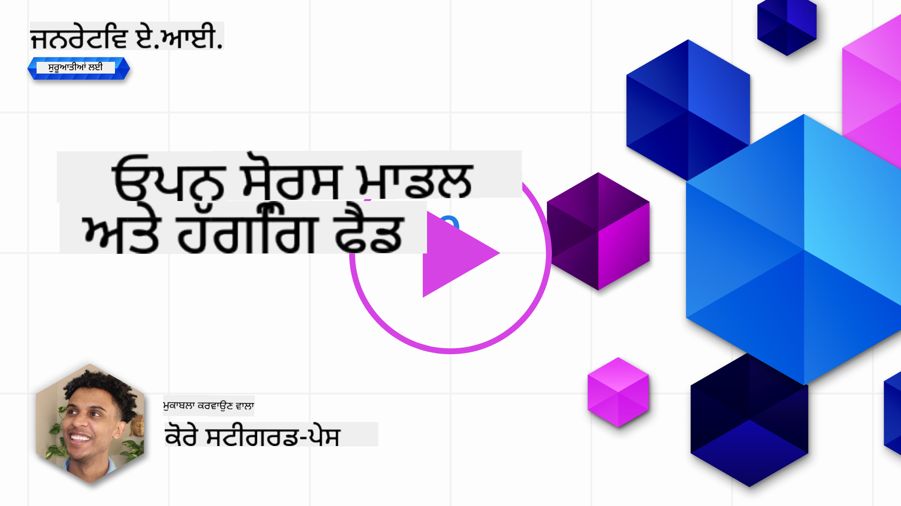
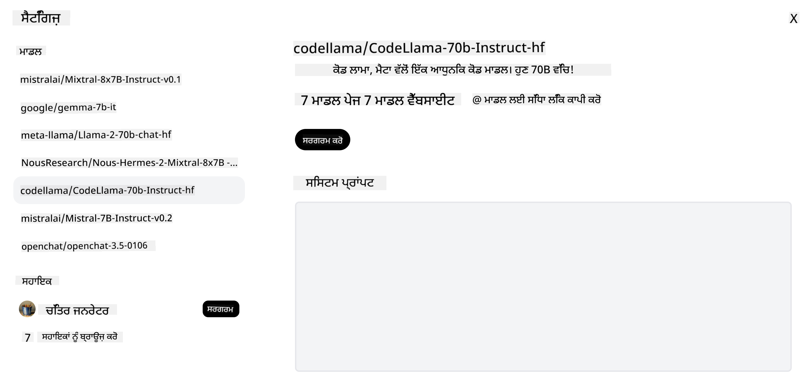

<!--
CO_OP_TRANSLATOR_METADATA:
{
  "original_hash": "a2a83aac52158c23161046cbd13faa2b",
  "translation_date": "2025-10-17T14:20:33+00:00",
  "source_file": "16-open-source-models/README.md",
  "language_code": "pa"
}
-->

## ਜਾਣ ਪਛਾਣ

ਖੁੱਲੇ ਸਰੋਤ LLMs ਦੀ ਦੁਨੀਆ ਰੋਮਾਂਚਕ ਅਤੇ ਲਗਾਤਾਰ ਵਿਕਸਤ ਹੋ ਰਹੀ ਹੈ। ਇਸ ਪਾਠ ਦਾ ਉਦੇਸ਼ ਖੁੱਲੇ ਸਰੋਤ ਮਾਡਲਾਂ ਬਾਰੇ ਗਹਿਰਾਈ ਨਾਲ ਜਾਣਕਾਰੀ ਪ੍ਰਦਾਨ ਕਰਨਾ ਹੈ। ਜੇ ਤੁਸੀਂ ਜਾਣਨਾ ਚਾਹੁੰਦੇ ਹੋ ਕਿ ਖੁੱਲੇ ਸਰੋਤ ਮਾਡਲਾਂ ਦੀ ਤੁਲਨਾ ਮਾਲਕਾਨਾ ਮਾਡਲਾਂ ਨਾਲ ਕਿਵੇਂ ਕੀਤੀ ਜਾਂਦੀ ਹੈ, ਤਾਂ ["ਵੱਖ-ਵੱਖ LLMs ਦੀ ਖੋਜ ਅਤੇ ਤੁਲਨਾ" ਪਾਠ](../02-exploring-and-comparing-different-llms/README.md?WT.mc_id=academic-105485-koreyst) 'ਤੇ ਜਾਓ। ਇਸ ਪਾਠ ਵਿੱਚ ਫਾਈਨ-ਟਿਊਨਿੰਗ ਦੇ ਵਿਸ਼ੇ ਨੂੰ ਵੀ ਕਵਰ ਕੀਤਾ ਜਾਵੇਗਾ, ਪਰ ਇਸਦਾ ਵਿਸਤ੍ਰਿਤ ਵਿਆਖਿਆ ["ਫਾਈਨ-ਟਿਊਨਿੰਗ LLMs" ਪਾਠ](../18-fine-tuning/README.md?WT.mc_id=academic-105485-koreyst) ਵਿੱਚ ਮਿਲੇਗੀ।

## ਸਿੱਖਣ ਦੇ ਲਕਸ਼

- ਖੁੱਲੇ ਸਰੋਤ ਮਾਡਲਾਂ ਦੀ ਸਮਝ ਪ੍ਰਾਪਤ ਕਰੋ
- ਖੁੱਲੇ ਸਰੋਤ ਮਾਡਲਾਂ ਨਾਲ ਕੰਮ ਕਰਨ ਦੇ ਫਾਇਦੇ ਸਮਝੋ
- Hugging Face ਅਤੇ Azure AI Studio 'ਤੇ ਉਪਲਬਧ ਖੁੱਲੇ ਮਾਡਲਾਂ ਦੀ ਖੋਜ

## ਖੁੱਲੇ ਸਰੋਤ ਮਾਡਲ ਕੀ ਹਨ?

ਖੁੱਲੇ ਸਰੋਤ ਸੌਫਟਵੇਅਰ ਨੇ ਵੱਖ-ਵੱਖ ਖੇਤਰਾਂ ਵਿੱਚ ਤਕਨਾਲੋਜੀ ਦੇ ਵਿਕਾਸ ਵਿੱਚ ਮਹੱਤਵਪੂਰਨ ਭੂਮਿਕਾ ਨਿਭਾਈ ਹੈ। Open Source Initiative (OSI) ਨੇ ਸੌਫਟਵੇਅਰ ਨੂੰ ਖੁੱਲੇ ਸਰੋਤ ਵਜੋਂ ਵਰਗਬੱਧ ਕਰਨ ਲਈ [10 ਮਾਪਦੰਡ](https://web.archive.org/web/20241126001143/https://opensource.org/osd?WT.mc_id=academic-105485-koreyst) ਪਰਿਭਾਸ਼ਿਤ ਕੀਤੇ ਹਨ। ਸੋਰਸ ਕੋਡ ਨੂੰ OSI ਦੁਆਰਾ ਮਨਜ਼ੂਰ ਕੀਤੇ ਗਏ ਲਾਇਸੰਸ ਦੇ ਤਹਿਤ ਖੁੱਲੇ ਤੌਰ 'ਤੇ ਸਾਂਝਾ ਕੀਤਾ ਜਾਣਾ ਚਾਹੀਦਾ ਹੈ।

ਜਦੋਂ ਕਿ LLMs ਦਾ ਵਿਕਾਸ ਸੌਫਟਵੇਅਰ ਵਿਕਾਸ ਨਾਲ ਕੁਝ ਹੱਦ ਤੱਕ ਮਿਲਦਾ ਜੁਲਦਾ ਹੈ, ਪਰ ਇਹ ਪ੍ਰਕਿਰਿਆ ਬਿਲਕੁਲ ਇੱਕੋ ਜਿਹੀ ਨਹੀਂ ਹੈ। ਇਸ ਨੇ LLMs ਦੇ ਸੰਦਰਭ ਵਿੱਚ ਖੁੱਲੇ ਸਰੋਤ ਦੀ ਪਰਿਭਾਸ਼ਾ 'ਤੇ ਕਮਿਊਨਿਟੀ ਵਿੱਚ ਕਾਫੀ ਚਰਚਾ ਕੀਤੀ ਹੈ। ਇੱਕ ਮਾਡਲ ਨੂੰ ਰਵਾਇਤੀ ਖੁੱਲੇ ਸਰੋਤ ਦੀ ਪਰਿਭਾਸ਼ਾ ਨਾਲ ਸੰਗਤ ਬਣਾਉਣ ਲਈ ਹੇਠਾਂ ਦਿੱਤੀ ਜਾਣਕਾਰੀ ਜਨਤਕ ਤੌਰ 'ਤੇ ਉਪਲਬਧ ਹੋਣੀ ਚਾਹੀਦੀ ਹੈ:

- ਮਾਡਲ ਨੂੰ ਟ੍ਰੇਨ ਕਰਨ ਲਈ ਵਰਤੇ ਗਏ ਡਾਟਾਸੈਟ।
- ਪੂਰੇ ਮਾਡਲ ਵਜ਼ਨ ਟ੍ਰੇਨਿੰਗ ਦੇ ਹਿੱਸੇ ਵਜੋਂ।
- ਮੁਲਾਂਕਣ ਕੋਡ।
- ਫਾਈਨ-ਟਿਊਨਿੰਗ ਕੋਡ।
- ਪੂਰੇ ਮਾਡਲ ਵਜ਼ਨ ਅਤੇ ਟ੍ਰੇਨਿੰਗ ਮੈਟ੍ਰਿਕਸ।

ਇਸ ਸਮੇਂ ਸਿਰਫ ਕੁਝ ਮਾਡਲ ਹੀ ਇਸ ਮਾਪਦੰਡ ਨੂੰ ਪੂਰਾ ਕਰਦੇ ਹਨ। [OLMo ਮਾਡਲ ਜੋ Allen Institute for Artificial Intelligence (AllenAI) ਦੁਆਰਾ ਬਣਾਇਆ ਗਿਆ ਹੈ](https://huggingface.co/allenai/OLMo-7B?WT.mc_id=academic-105485-koreyst) ਇਸ ਸ਼੍ਰੇਣੀ ਵਿੱਚ ਆਉਂਦਾ ਹੈ।

ਇਸ ਪਾਠ ਲਈ, ਅਸੀਂ ਮਾਡਲਾਂ ਨੂੰ "ਖੁੱਲੇ ਮਾਡਲ" ਕਹਿ ਕੇ ਸੰਬੋਧਨ ਕਰਾਂਗੇ ਕਿਉਂਕਿ ਇਹ ਲਿਖਣ ਦੇ ਸਮੇਂ ਉਪਰੋਕਤ ਮਾਪਦੰਡਾਂ ਨੂੰ ਪੂਰਾ ਨਹੀਂ ਕਰਦੇ।

## ਖੁੱਲੇ ਮਾਡਲਾਂ ਦੇ ਫਾਇਦੇ

**ਬਹੁਤ ਹੀ ਕਸਟਮਾਈਜ਼ੇਬਲ** - ਖੁੱਲੇ ਮਾਡਲਾਂ ਨੂੰ ਵਿਸਤ੍ਰਿਤ ਟ੍ਰੇਨਿੰਗ ਜਾਣਕਾਰੀ ਦੇ ਨਾਲ ਜਾਰੀ ਕੀਤਾ ਜਾਂਦਾ ਹੈ, ਜਿਸ ਨਾਲ ਖੋਜਕਰਤਾ ਅਤੇ ਡਿਵੈਲਪਰ ਮਾਡਲ ਦੇ ਅੰਦਰੂਨੀ ਹਿੱਸਿਆਂ ਨੂੰ ਸੋਧ ਸਕਦੇ ਹਨ। ਇਹ ਖਾਸ ਕੰਮ ਜਾਂ ਅਧਿਐਨ ਦੇ ਖੇਤਰ ਲਈ ਬਹੁਤ ਹੀ ਵਿਸ਼ੇਸ਼ ਮਾਡਲ ਬਣਾਉਣ ਦੀ ਸਹੂਲਤ ਦਿੰਦਾ ਹੈ। ਇਸਦੇ ਕੁਝ ਉਦਾਹਰਣਾਂ ਵਿੱਚ ਕੋਡ ਜਨਰੇਸ਼ਨ, ਗਣਿਤੀ ਕਾਰਵਾਈਆਂ ਅਤੇ ਜੀਵ ਵਿਗਿਆਨ ਸ਼ਾਮਲ ਹਨ।

**ਲਾਗਤ** - ਇਹ ਮਾਡਲ ਵਰਤਣ ਅਤੇ ਤੈਨਾਤ ਕਰਨ ਲਈ ਪ੍ਰਤੀ ਟੋਕਨ ਲਾਗਤ ਮਾਲਕਾਨਾ ਮਾਡਲਾਂ ਨਾਲੋਂ ਘੱਟ ਹੁੰਦੀ ਹੈ। ਜਨਰੇਟਿਵ AI ਐਪਲੀਕੇਸ਼ਨ ਬਣਾਉਂਦੇ ਸਮੇਂ, ਆਪਣੇ ਵਰਤੋਂ ਦੇ ਕੇਸ 'ਤੇ ਕੰਮ ਕਰਦੇ ਸਮੇਂ ਪ੍ਰਦਰਸ਼ਨ ਅਤੇ ਕੀਮਤ ਦੀ ਤੁਲਨਾ ਕਰਨੀ ਚਾਹੀਦੀ ਹੈ।

  
ਸਰੋਤ: Artificial Analysis

**ਲਚਕਦਾਰਤਾ** - ਖੁੱਲੇ ਮਾਡਲਾਂ ਨਾਲ ਕੰਮ ਕਰਨ ਨਾਲ ਵੱਖ-ਵੱਖ ਮਾਡਲਾਂ ਨੂੰ ਵਰਤਣ ਜਾਂ ਉਨ੍ਹਾਂ ਨੂੰ ਜੋੜਨ ਵਿੱਚ ਲਚਕਦਾਰਤਾ ਮਿਲਦੀ ਹੈ। ਇਸਦਾ ਇੱਕ ਉਦਾਹਰਣ [HuggingChat Assistants](https://huggingface.co/chat?WT.mc_id=academic-105485-koreyst) ਹੈ, ਜਿੱਥੇ ਵਰਤੋਂਕਾਰ ਸਿੱਧੇ ਉਪਭੋਗਤਾ ਇੰਟਰਫੇਸ ਵਿੱਚ ਵਰਤੇ ਜਾ ਰਹੇ ਮਾਡਲ ਨੂੰ ਚੁਣ ਸਕਦਾ ਹੈ:

## ਵੱਖ-ਵੱਖ ਖੁੱਲੇ ਮਾਡਲਾਂ ਦੀ ਖੋਜ

### Llama 2

[LLama2](https://huggingface.co/meta-llama?WT.mc_id=academic-105485-koreyst), ਜੋ Meta ਦੁਆਰਾ ਵਿਕਸਿਤ ਕੀਤਾ ਗਿਆ ਹੈ, ਇੱਕ ਖੁੱਲਾ ਮਾਡਲ ਹੈ ਜੋ ਚੈਟ ਅਧਾਰਿਤ ਐਪਲੀਕੇਸ਼ਨ ਲਈ ਅਨੁਕੂਲਿਤ ਹੈ। ਇਹ ਇਸਦੀ ਫਾਈਨ-ਟਿਊਨਿੰਗ ਵਿਧੀ ਦੇ ਕਾਰਨ ਹੈ, ਜਿਸ ਵਿੱਚ ਵੱਡੀ ਮਾਤਰਾ ਵਿੱਚ ਡਾਇਲਾਗ ਅਤੇ ਮਨੁੱਖੀ ਫੀਡਬੈਕ ਸ਼ਾਮਲ ਹੈ। ਇਸ ਵਿਧੀ ਨਾਲ, ਮਾਡਲ ਮਨੁੱਖੀ ਉਮੀਦਾਂ ਦੇ ਅਨੁਕੂਲ ਹੋਰ ਨਤੀਜੇ ਪੈਦਾ ਕਰਦਾ ਹੈ, ਜੋ ਇੱਕ ਬਿਹਤਰ ਉਪਭੋਗਤਾ ਅਨੁਭਵ ਪ੍ਰਦਾਨ ਕਰਦਾ ਹੈ।

Llama ਦੇ ਕੁਝ ਫਾਈਨ-ਟਿਊਨ ਵਰਜਨਾਂ ਵਿੱਚ [Japanese Llama](https://huggingface.co/elyza/ELYZA-japanese-Llama-2-7b?WT.mc_id=academic-105485-koreyst), ਜੋ ਜਪਾਨੀ ਵਿੱਚ ਮਾਹਰ ਹੈ ਅਤੇ [Llama Pro](https://huggingface.co/TencentARC/LLaMA-Pro-8B?WT.mc_id=academic-105485-koreyst), ਜੋ ਬੇਸ ਮਾਡਲ ਦਾ ਇੱਕ ਵਧੀਆ ਸੰਸਕਰਣ ਹੈ, ਸ਼ਾਮਲ ਹਨ।

### Mistral

[Mistral](https://huggingface.co/mistralai?WT.mc_id=academic-105485-koreyst) ਇੱਕ ਖੁੱਲਾ ਮਾਡਲ ਹੈ ਜੋ ਉੱਚ ਪ੍ਰਦਰਸ਼ਨ ਅਤੇ ਕੁਸ਼ਲਤਾ 'ਤੇ ਕੇਂਦ੍ਰਿਤ ਹੈ। ਇਹ Mixture-of-Experts ਵਿਧੀ ਵਰਤਦਾ ਹੈ, ਜੋ ਇੱਕ ਸਿਸਟਮ ਵਿੱਚ ਵਿਸ਼ੇਸ਼ ਮਾਹਰ ਮਾਡਲਾਂ ਦੇ ਸਮੂਹ ਨੂੰ ਜੋੜਦਾ ਹੈ, ਜਿੱਥੇ ਇਨਪੁਟ ਦੇ ਅਧਾਰ 'ਤੇ ਕੁਝ ਮਾਡਲ ਚੁਣੇ ਜਾਂਦੇ ਹਨ। ਇਹ ਗਣਨਾ ਨੂੰ ਹੋਰ ਪ੍ਰਭਾਵਸ਼ਾਲੀ ਬਣਾਉਂਦਾ ਹੈ ਕਿਉਂਕਿ ਮਾਡਲ ਸਿਰਫ ਉਹਨਾਂ ਇਨਪੁਟਾਂ ਨੂੰ ਸੰਬੋਧਨ ਕਰਦੇ ਹਨ ਜਿਨ੍ਹਾਂ ਵਿੱਚ ਉਹ ਮਾਹਰ ਹਨ।

Mistral ਦੇ ਕੁਝ ਫਾਈਨ-ਟਿਊਨ ਵਰਜਨਾਂ ਵਿੱਚ [BioMistral](https://huggingface.co/BioMistral/BioMistral-7B?text=Mon+nom+est+Thomas+et+mon+principal?WT.mc_id=academic-105485-koreyst), ਜੋ ਮੈਡੀਕਲ ਖੇਤਰ 'ਤੇ ਕੇਂਦ੍ਰਿਤ ਹੈ ਅਤੇ [OpenMath Mistral](https://huggingface.co/nvidia/OpenMath-Mistral-7B-v0.1-hf?WT.mc_id=academic-105485-koreyst), ਜੋ ਗਣਿਤੀ ਗਣਨਾ ਕਰਦਾ ਹੈ, ਸ਼ਾਮਲ ਹਨ।

### Falcon

[Falcon](https://huggingface.co/tiiuae?WT.mc_id=academic-105485-koreyst) ਇੱਕ LLM ਹੈ ਜੋ Technology Innovation Institute (**TII**) ਦੁਆਰਾ ਬਣਾਇਆ ਗਿਆ ਹੈ। Falcon-40B ਨੂੰ 40 ਬਿਲੀਅਨ ਪੈਰਾਮੀਟਰਾਂ 'ਤੇ ਟ੍ਰੇਨ ਕੀਤਾ ਗਿਆ ਸੀ, ਜਿਸਨੇ ਘੱਟ ਗਣਨਾ ਬਜਟ ਨਾਲ GPT-3 ਨਾਲੋਂ ਬਿਹਤਰ ਪ੍ਰਦਰਸ਼ਨ ਦਿਖਾਇਆ ਹੈ। ਇਹ ਇਸਦੇ FlashAttention algorithm ਅਤੇ multiquery attention ਦੇ ਵਰਤੋਂ ਦੇ ਕਾਰਨ ਹੈ, ਜੋ ਇਨਫਰੈਂਸ ਸਮੇਂ ਮੈਮਰੀ ਦੀਆਂ ਲੋੜਾਂ ਨੂੰ ਘਟਾਉਣ ਯੋਗ ਬਣਾਉਂਦਾ ਹੈ। ਇਸ ਘਟਾਈ ਇਨਫਰੈਂਸ ਸਮੇਂ ਨਾਲ, Falcon-40B ਚੈਟ ਐਪਲੀਕੇਸ਼ਨ ਲਈ ਉਚਿਤ ਹੈ।

Falcon ਦੇ ਕੁਝ ਫਾਈਨ-ਟਿਊਨ ਵਰਜਨਾਂ ਵਿੱਚ [OpenAssistant](https://huggingface.co/OpenAssistant/falcon-40b-sft-top1-560?WT.mc_id=academic-105485-koreyst), ਜੋ ਖੁੱਲੇ ਮਾਡਲਾਂ 'ਤੇ ਅਧਾਰਿਤ ਇੱਕ ਸਹਾਇਕ ਹੈ ਅਤੇ [GPT4ALL](https://huggingface.co/nomic-ai/gpt4all-falcon?WT.mc_id=academic-105485-koreyst), ਜੋ ਬੇਸ ਮਾਡਲ ਨਾਲੋਂ ਉੱਚ ਪ੍ਰਦਰਸ਼ਨ ਦਿੰਦਾ ਹੈ, ਸ਼ਾਮਲ ਹਨ।

## ਕਿਵੇਂ ਚੁਣਨਾ ਹੈ

ਖੁੱਲੇ ਮਾਡਲ ਚੁਣਨ ਲਈ ਕੋਈ ਇੱਕ ਜਵਾਬ ਨਹੀਂ ਹੈ। ਇੱਕ ਵਧੀਆ ਸ਼ੁਰੂਆਤ Azure AI Studio ਦੇ ਫਿਲਟਰ ਬਾਈ ਟਾਸਕ ਫੀਚਰ ਦੀ ਵਰਤੋਂ ਕਰਕੇ ਕੀਤੀ ਜਾ ਸਕਦੀ ਹੈ। ਇਹ ਤੁਹਾਨੂੰ ਸਮਝਣ ਵਿੱਚ ਮਦਦ ਕਰੇਗਾ ਕਿ ਮਾਡਲ ਕਿਸ ਕਿਸਮ ਦੇ ਕੰਮਾਂ ਲਈ ਟ੍ਰੇਨ ਕੀਤਾ ਗਿਆ ਹੈ। Hugging Face ਵੀ ਇੱਕ LLM Leaderboard ਰੱਖਦਾ ਹੈ ਜੋ ਤੁਹਾਨੂੰ ਕੁਝ ਮੈਟ੍ਰਿਕਸ ਦੇ ਅਧਾਰ 'ਤੇ ਸਭ ਤੋਂ ਵਧੀਆ ਪ੍ਰਦਰਸ਼ਨ ਕਰਨ ਵਾਲੇ ਮਾਡਲ ਦਿਖਾਉਂਦਾ ਹੈ।

ਵੱਖ-ਵੱਖ ਕਿਸਮਾਂ ਦੇ LLMs ਦੀ ਤੁਲਨਾ ਕਰਨ ਲਈ, [Artificial Analysis](https://artificialanalysis.ai/?WT.mc_id=academic-105485-koreyst) ਇੱਕ ਹੋਰ ਵਧੀਆ ਸਰੋਤ ਹੈ:

  
ਸਰੋਤ: Artificial Analysis

ਜੇਕਰ ਕਿਸੇ ਖਾਸ ਵਰਤੋਂ ਦੇ ਕੇਸ 'ਤੇ ਕੰਮ ਕਰ ਰਹੇ ਹੋ, ਤਾਂ ਉਸੇ ਖੇਤਰ 'ਤੇ ਕੇਂਦ੍ਰਿਤ ਫਾਈਨ-ਟਿਊਨ ਵਰਜਨਾਂ ਦੀ ਖੋਜ ਕਰਨਾ ਪ੍ਰਭਾਵਸ਼ਾਲੀ ਹੋ ਸਕਦਾ ਹੈ। ਆਪਣੇ ਅਤੇ ਆਪਣੇ ਵਰਤੋਂਕਾਰਾਂ ਦੀਆਂ ਉਮੀਦਾਂ ਦੇ ਅਨੁਸਾਰ ਇਹ ਮਾਡਲ ਕਿਵੇਂ ਪ੍ਰਦਰਸ਼ਨ ਕਰਦੇ ਹਨ, ਇਹ ਦੇਖਣ ਲਈ ਕਈ ਖੁੱਲੇ ਮਾਡਲਾਂ ਨਾਲ ਪ੍ਰਯੋਗ ਕਰਨਾ ਇੱਕ ਹੋਰ ਵਧੀਆ ਅਭਿਆਸ ਹੈ।

## ਅਗਲੇ ਕਦਮ

ਖੁੱਲੇ ਮਾਡਲਾਂ ਬਾਰੇ ਸਭ ਤੋਂ ਵਧੀਆ ਗੱਲ ਇਹ ਹੈ ਕਿ ਤੁਸੀਂ ਉਨ੍ਹਾਂ ਨਾਲ ਜਲਦੀ ਕੰਮ ਕਰਨਾ ਸ਼ੁਰੂ ਕਰ ਸਕਦੇ ਹੋ। [Azure AI Foundry Model Catalog](https://ai.azure.com?WT.mc_id=academic-105485-koreyst) ਨੂੰ ਵੇਖੋ, ਜਿਸ ਵਿੱਚ Hugging Face ਕਲੈਕਸ਼ਨ ਸ਼ਾਮਲ ਹੈ ਜਿਸ ਵਿੱਚ ਉਹ ਮਾਡਲ ਹਨ ਜਿਨ੍ਹਾਂ ਬਾਰੇ ਅਸੀਂ ਇੱਥੇ ਚਰਚਾ ਕੀਤੀ ਹੈ।

## ਸਿੱਖਣਾ ਇੱਥੇ ਨਹੀਂ ਰੁਕਦਾ, ਯਾਤਰਾ ਜਾਰੀ ਰੱਖੋ

ਇਹ ਪਾਠ ਪੂਰਾ ਕਰਨ ਤੋਂ ਬਾਅਦ, ਸਾਡੀ [Generative AI Learning collection](https://aka.ms/genai-collection?WT.mc_id=academic-105485-koreyst) ਨੂੰ ਵੇਖੋ ਤਾਂ ਜੋ ਆਪਣੀ Generative AI ਗਿਆਨ ਨੂੰ ਹੋਰ ਉੱਚਾ ਕੀਤਾ ਜਾ ਸਕੇ!

---

**ਅਸਵੀਕਰਤਾ**:  
ਇਹ ਦਸਤਾਵੇਜ਼ AI ਅਨੁਵਾਦ ਸੇਵਾ [Co-op Translator](https://github.com/Azure/co-op-translator) ਦੀ ਵਰਤੋਂ ਕਰਕੇ ਅਨੁਵਾਦ ਕੀਤਾ ਗਿਆ ਹੈ। ਜਦੋਂ ਕਿ ਅਸੀਂ ਸਹੀ ਹੋਣ ਦੀ ਕੋਸ਼ਿਸ਼ ਕਰਦੇ ਹਾਂ, ਕਿਰਪਾ ਕਰਕੇ ਧਿਆਨ ਦਿਓ ਕਿ ਸਵੈਚਾਲਿਤ ਅਨੁਵਾਦਾਂ ਵਿੱਚ ਗਲਤੀਆਂ ਜਾਂ ਅਸੁੱਤੀਆਂ ਹੋ ਸਕਦੀਆਂ ਹਨ। ਮੂਲ ਦਸਤਾਵੇਜ਼ ਨੂੰ ਇਸਦੀ ਮੂਲ ਭਾਸ਼ਾ ਵਿੱਚ ਅਧਿਕਾਰਤ ਸਰੋਤ ਮੰਨਿਆ ਜਾਣਾ ਚਾਹੀਦਾ ਹੈ। ਮਹੱਤਵਪੂਰਨ ਜਾਣਕਾਰੀ ਲਈ, ਪੇਸ਼ੇਵਰ ਮਨੁੱਖੀ ਅਨੁਵਾਦ ਦੀ ਸਿਫਾਰਸ਼ ਕੀਤੀ ਜਾਂਦੀ ਹੈ। ਅਸੀਂ ਇਸ ਅਨੁਵਾਦ ਦੀ ਵਰਤੋਂ ਤੋਂ ਪੈਦਾ ਹੋਣ ਵਾਲੇ ਕਿਸੇ ਵੀ ਗਲਤਫਹਿਮੀ ਜਾਂ ਗਲਤ ਵਿਆਖਿਆ ਲਈ ਜ਼ਿੰਮੇਵਾਰ ਨਹੀਂ ਹਾਂ।