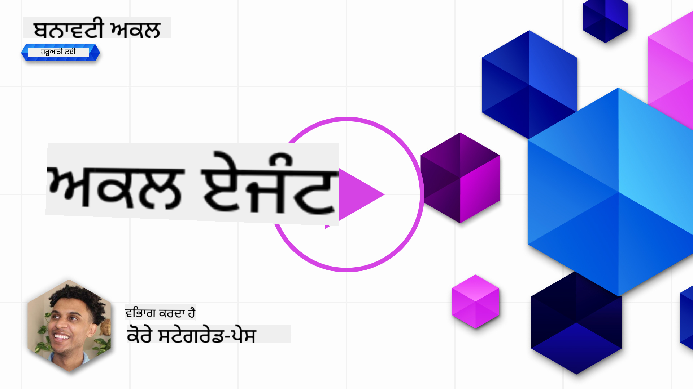
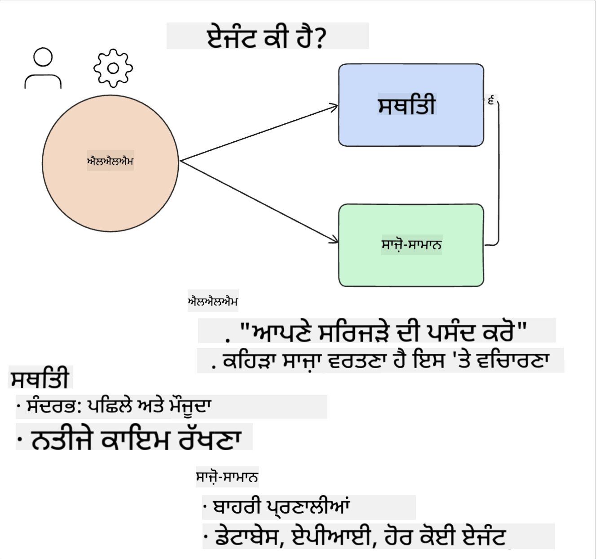
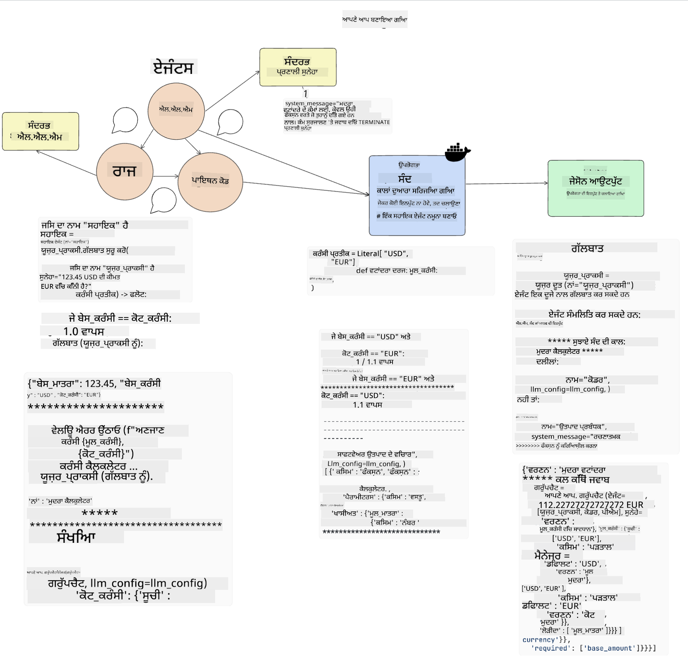
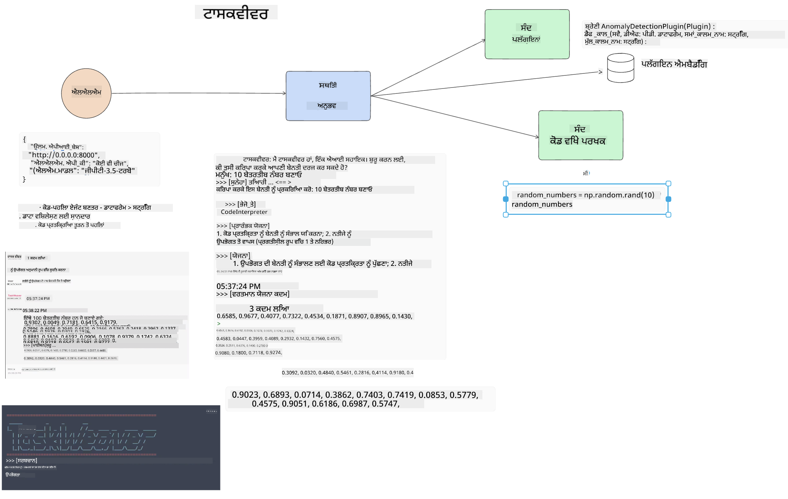
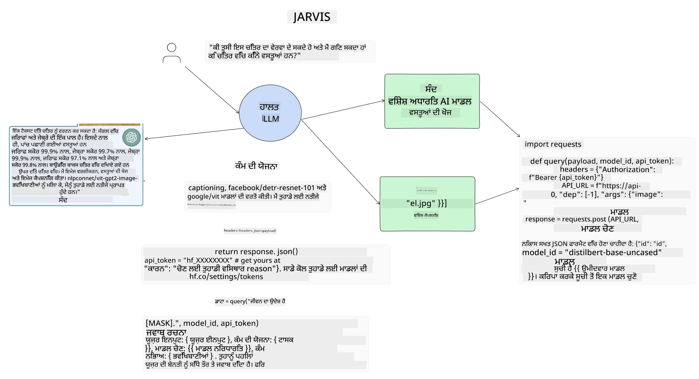

<!--
CO_OP_TRANSLATOR_METADATA:
{
  "original_hash": "11f03c81f190d9cbafd0f977dcbede6c",
  "translation_date": "2025-05-20T07:20:20+00:00",
  "source_file": "17-ai-agents/README.md",
  "language_code": "pa"
}
-->
[](https://aka.ms/gen-ai-lesson17-gh?WT.mc_id=academic-105485-koreyst)

## ਜਾਣ ਪਹਿਚਾਣ

AI ਏਜੰਟ ਜਨਰੇਟਿਵ AI ਵਿੱਚ ਇੱਕ ਰੋਮਾਂਚਕ ਵਿਕਾਸ ਨੂੰ ਦਰਸਾਉਂਦੇ ਹਨ, ਜੋ ਵੱਡੇ ਭਾਸ਼ਾ ਮਾਡਲ (LLMs) ਨੂੰ ਸਹਾਇਕ ਤੋਂ ਏਜੰਟ ਬਣਾਉਂਦੇ ਹਨ ਜੋ ਕਾਰਵਾਈ ਕਰਨ ਦੇ ਯੋਗ ਹਨ। AI ਏਜੰਟ ਫਰੇਮਵਰਕ ਡਿਵੈਲਪਰਾਂ ਨੂੰ ਐਪਲੀਕੇਸ਼ਨ ਬਣਾਉਣ ਦੀ ਸਮਰਥਾ ਦਿੰਦੇ ਹਨ ਜੋ LLMs ਨੂੰ ਟੂਲ ਅਤੇ ਸਟੇਟ ਮੈਨੇਜਮੈਂਟ ਦੀ ਪਹੁੰਚ ਦਿੰਦੇ ਹਨ। ਇਹ ਫਰੇਮਵਰਕ ਵਿਖਣਤਾ ਨੂੰ ਵੀ ਵਧਾਉਂਦੇ ਹਨ, ਉਪਭੋਗਤਾਵਾਂ ਅਤੇ ਡਿਵੈਲਪਰਾਂ ਨੂੰ LLMs ਦੁਆਰਾ ਯੋਜਨਾ ਬਣਾਈਆਂ ਗਈਆਂ ਕਾਰਵਾਈਆਂ ਦੀ ਨਿਗਰਾਨੀ ਕਰਨ ਦੀ ਸਮਰਥਾ ਦਿੰਦੇ ਹਨ, ਇਸ ਤਰ੍ਹਾਂ ਅਨੁਭਵ ਪ੍ਰਬੰਧਨ ਵਿੱਚ ਸੁਧਾਰ ਕਰਦੇ ਹਨ।

ਇਸ ਪਾਠ ਵਿੱਚ ਹੇਠ ਲਿਖੀਆਂ ਖੇਤਰਾਂ ਨੂੰ ਕਵਰ ਕੀਤਾ ਜਾਵੇਗਾ:

- ਸਮਝਣਾ ਕਿ AI ਏਜੰਟ ਕੀ ਹੈ - ਇੱਕ AI ਏਜੰਟ ਅਸਲ ਵਿੱਚ ਕੀ ਹੈ?
- ਚਾਰ ਵੱਖ-ਵੱਖ AI ਏਜੰਟ ਫਰੇਮਵਰਕ ਦੀ ਖੋਜ ਕਰਨਾ - ਉਹਨਾਂ ਨੂੰ ਕੀ ਵਿਲੱਖਣ ਬਣਾਉਂਦਾ ਹੈ?
- ਵੱਖ-ਵੱਖ ਉਪਯੋਗ ਕੇਸਾਂ ਲਈ ਇਹ AI ਏਜੰਟ ਲਾਗੂ ਕਰਨਾ - ਅਸੀਂ AI ਏਜੰਟ ਕਦੋਂ ਵਰਤਣੇ ਚਾਹੀਦੇ ਹਨ?

## ਸਿੱਖਣ ਦੇ ਲਕਸ਼

ਇਸ ਪਾਠ ਨੂੰ ਪੂਰਾ ਕਰਨ ਤੋਂ ਬਾਅਦ, ਤੁਸੀਂ ਇਹ ਕਰਨ ਦੇ ਯੋਗ ਹੋਵੋਗੇ:

- ਵਿਆਖਿਆ ਕਰ ਸਕਦੇ ਹੋ ਕਿ AI ਏਜੰਟ ਕੀ ਹਨ ਅਤੇ ਉਹਨਾਂ ਦਾ ਕਿਵੇਂ ਉਪਯੋਗ ਕੀਤਾ ਜਾ ਸਕਦਾ ਹੈ।
- ਕੁਝ ਪ੍ਰਸਿੱਧ AI ਏਜੰਟ ਫਰੇਮਵਰਕ ਦੇ ਅੰਤਰਾਂ ਦੀ ਸਮਝ ਹੋਵੇਗੀ, ਅਤੇ ਉਹ ਕਿਵੇਂ ਵੱਖਰੇ ਹਨ।
- ਸਮਝਣਾ ਕਿ AI ਏਜੰਟ ਕਿਵੇਂ ਕੰਮ ਕਰਦੇ ਹਨ ਤਾਂ ਜੋ ਉਹਨਾਂ ਨਾਲ ਐਪਲੀਕੇਸ਼ਨ ਬਣਾਈ ਜਾ ਸਕਣ।

## AI ਏਜੰਟ ਕੀ ਹਨ?

AI ਏਜੰਟ ਜਨਰੇਟਿਵ AI ਦੀ ਦੁਨੀਆ ਵਿੱਚ ਬਹੁਤ ਹੀ ਰੋਮਾਂਚਕ ਖੇਤਰ ਹਨ। ਇਸ ਰੋਮਾਂਚ ਨਾਲ ਕਈ ਵਾਰ ਸ਼ਬਦਾਂ ਅਤੇ ਉਹਨਾਂ ਦੇ ਲਾਗੂ ਕਰਨ ਦੀ ਉਲਝਣ ਵੀ ਆਉਂਦੀ ਹੈ। ਗੱਲਾਂ ਨੂੰ ਸਧਾਰਨ ਅਤੇ ਵੱਧ ਤੋਂ ਵੱਧ ਟੂਲਾਂ ਨੂੰ ਸ਼ਾਮਲ ਕਰਨ ਲਈ ਜੋ AI ਏਜੰਟ ਦਾ ਹਵਾਲਾ ਦਿੰਦੇ ਹਨ, ਅਸੀਂ ਇਸ ਪਰਿਭਾਸ਼ਾ ਦੀ ਵਰਤੋਂ ਕਰਨ ਜਾ ਰਹੇ ਹਾਂ:

AI ਏਜੰਟ ਵੱਡੇ ਭਾਸ਼ਾ ਮਾਡਲ (LLMs) ਨੂੰ **ਸਟੇਟ** ਅਤੇ **ਟੂਲ** ਦੀ ਪਹੁੰਚ ਦੇ ਕੇ ਕਾਰਜ ਕਰਨ ਦੀ ਆਗਿਆ ਦਿੰਦੇ ਹਨ।



ਆਓ ਇਹ ਸ਼ਬਦ ਵਿਆਖਿਆ ਕਰੀਏ:

**ਵੱਡੇ ਭਾਸ਼ਾ ਮਾਡਲ** - ਇਹ ਉਹ ਮਾਡਲ ਹਨ ਜਿਨ੍ਹਾਂ ਦਾ ਇਸ ਕੋਰਸ ਵਿੱਚ ਹਵਾਲਾ ਦਿੱਤਾ ਗਿਆ ਹੈ ਜਿਵੇਂ ਕਿ GPT-3.5, GPT-4, Llama-2, ਆਦਿ।

**ਸਟੇਟ** - ਇਹ ਉਸ ਸੰਦਰਭ ਨੂੰ ਦਰਸਾਉਂਦਾ ਹੈ ਜਿਸ ਵਿੱਚ LLM ਕੰਮ ਕਰ ਰਿਹਾ ਹੈ। LLM ਆਪਣੇ ਪਿਛਲੇ ਕਾਰਜਾਂ ਅਤੇ ਮੌਜੂਦਾ ਸੰਦਰਭ ਦੇ ਸੰਦਰਭ ਦੀ ਵਰਤੋਂ ਕਰਦਾ ਹੈ, ਜਿਸ ਨਾਲ ਅਗਲੇ ਕਾਰਜਾਂ ਲਈ ਉਸ ਦੇ ਫੈਸਲੇ ਕਰਨ ਦੀ ਪ੍ਰਕਿਰਿਆ ਦਾ ਮਾਰਗਦਰਸ਼ਨ ਹੁੰਦਾ ਹੈ। AI ਏਜੰਟ ਫਰੇਮਵਰਕ ਡਿਵੈਲਪਰਾਂ ਨੂੰ ਇਹ ਸੰਦਰਭ ਆਸਾਨੀ ਨਾਲ ਬਣਾਈ ਰੱਖਣ ਵਿੱਚ ਸਹਾਇਤਾ ਦਿੰਦੇ ਹਨ।

**ਟੂਲ** - ਉਪਭੋਗਤਾ ਦੁਆਰਾ ਕੀਤੀ ਗਈ ਬੇਨਤੀ ਨੂੰ ਪੂਰਾ ਕਰਨ ਅਤੇ LLM ਦੁਆਰਾ ਯੋਜਨਾ ਬਣਾਈ ਗਈ ਕਾਰਜ ਨੂੰ ਪੂਰਾ ਕਰਨ ਲਈ, LLM ਨੂੰ ਟੂਲਾਂ ਦੀ ਪਹੁੰਚ ਦੀ ਲੋੜ ਹੁੰਦੀ ਹੈ। ਟੂਲਾਂ ਦੇ ਕੁਝ ਉਦਾਹਰਣ ਇੱਕ ਡੇਟਾਬੇਸ, ਇੱਕ API, ਇੱਕ ਬਾਹਰੀ ਐਪਲੀਕੇਸ਼ਨ ਜਾਂ ਇਹਨੂੰ ਹੋਰ LLM ਵੀ ਹੋ ਸਕਦੇ ਹਨ!

ਇਹ ਪਰਿਭਾਸ਼ਾਵਾਂ ਤੁਹਾਨੂੰ ਅੱਗੇ ਵਧਣ ਲਈ ਇੱਕ ਵਧੀਆ ਅਧਾਰ ਦੇਣ ਦੀ ਉਮੀਦ ਹੈ ਜਦੋਂ ਅਸੀਂ ਦੇਖਾਂਗੇ ਕਿ ਉਹ ਕਿਵੇਂ ਲਾਗੂ ਕੀਤੇ ਜਾਂਦੇ ਹਨ। ਆਓ ਕੁਝ ਵੱਖ-ਵੱਖ AI ਏਜੰਟ ਫਰੇਮਵਰਕ ਦੀ ਖੋਜ ਕਰੀਏ:

## ਲੈਂਗਚੇਨ ਏਜੰਟ

[ਲੈਂਗਚੇਨ ਏਜੰਟ](https://python.langchain.com/docs/how_to/#agents?WT.mc_id=academic-105485-koreyst) ਉਹ ਪਰਿਭਾਸ਼ਾਵਾਂ ਦੀ ਇੱਕ ਲਾਗੂ ਕਰਨਾ ਹੈ ਜੋ ਅਸੀਂ ਉਪਰੋਕਤ ਦਿੱਤੀਆਂ ਹਨ।

**ਸਟੇਟ** ਦਾ ਪ੍ਰਬੰਧਨ ਕਰਨ ਲਈ, ਇਹ ਇੱਕ ਅੰਦਰੂਨੀ ਫੰਕਸ਼ਨ ਨੂੰ ਵਰਤਦਾ ਹੈ ਜਿਸ ਨੂੰ `AgentExecutor` ਕਿਹਾ ਜਾਂਦਾ ਹੈ। ਇਹ ਪਰਿਭਾਸ਼ਿਤ `agent` ਅਤੇ ਉਹ `tools` ਨੂੰ ਸਵੀਕਾਰ ਕਰਦਾ ਹੈ ਜੋ ਇਸਨੂੰ ਉਪਲਬਧ ਹਨ।

`Agent Executor` ਚੈਟ ਦਾ ਇਤਿਹਾਸ ਵੀ ਸਟੋਰ ਕਰਦਾ ਹੈ ਤਾਂ ਜੋ ਚੈਟ ਦਾ ਸੰਦਰਭ ਦਿੱਤਾ ਜਾ ਸਕੇ।


ਲੈਂਗਚੇਨ ਇੱਕ [ਟੂਲਾਂ ਦੀ ਕੈਟਾਲੌਗ](https://integrations.langchain.com/tools?WT.mc_id=academic-105485-koreyst) ਪੇਸ਼ ਕਰਦਾ ਹੈ ਜੋ ਤੁਹਾਡੇ ਐਪਲੀਕੇਸ਼ਨ ਵਿੱਚ ਆਯਾਤ ਕੀਤਾ ਜਾ ਸਕਦਾ ਹੈ ਜਿਸ ਵਿੱਚ LLM ਪਹੁੰਚ ਕਰ ਸਕਦਾ ਹੈ। ਇਹ ਕਮਿਊਨਿਟੀ ਅਤੇ ਲੈਂਗਚੇਨ ਟੀਮ ਦੁਆਰਾ ਬਣਾਏ ਗਏ ਹਨ।

ਤੁਸੀਂ ਫਿਰ ਇਹ ਟੂਲ ਪਰਿਭਾਸ਼ਿਤ ਕਰ ਸਕਦੇ ਹੋ ਅਤੇ ਉਹਨਾਂ ਨੂੰ `Agent Executor` ਨੂੰ ਪਾਸ ਕਰ ਸਕਦੇ ਹੋ।

ਵਿਖਣਤਾ ਇੱਕ ਹੋਰ ਮਹੱਤਵਪੂਰਨ ਪਹਲੂ ਹੈ ਜਦੋਂ AI ਏਜੰਟ ਦੀ ਗੱਲ ਕਰਦੇ ਹਾਂ। ਐਪਲੀਕੇਸ਼ਨ ਡਿਵੈਲਪਰਾਂ ਲਈ ਇਹ ਸਮਝਣਾ ਮਹੱਤਵਪੂਰਨ ਹੈ ਕਿ LLM ਕਿਹੜਾ ਟੂਲ ਵਰਤ ਰਿਹਾ ਹੈ ਅਤੇ ਕਿਉਂ.. ਇਸ ਲਈ, ਲੈਂਗਚੇਨ ਦੀ ਟੀਮ ਨੇ ਲੈਂਗਸਮਿਥ ਵਿਕਸਿਤ ਕੀਤਾ ਹੈ।

## ਆਟੋਜਨ

ਅਗਲਾ AI ਏਜੰਟ ਫਰੇਮਵਰਕ ਜਿਸ ਬਾਰੇ ਅਸੀਂ ਚਰਚਾ ਕਰਾਂਗੇ ਉਹ ਹੈ [ਆਟੋਜਨ](https://microsoft.github.io/autogen/?WT.mc_id=academic-105485-koreyst)। ਆਟੋਜਨ ਦਾ ਮੁੱਖ ਧਿਆਨ ਗੱਲਬਾਤਾਂ 'ਤੇ ਹੈ। ਏਜੰਟ ਦੋਵੇਂ **ਗੱਲਬਾਤ ਕਰਨ ਯੋਗ** ਅਤੇ **ਕਸਟਮਾਈਜ਼ ਕਰਨ ਯੋਗ** ਹਨ।

**ਗੱਲਬਾਤ ਕਰਨ ਯੋਗ -** LLMs ਇੱਕ ਕਾਰਜ ਪੂਰਾ ਕਰਨ ਲਈ ਇੱਕ ਹੋਰ LLM ਨਾਲ ਗੱਲਬਾਤ ਸ਼ੁਰੂ ਕਰ ਸਕਦੇ ਹਨ ਅਤੇ ਜਾਰੀ ਰੱਖ ਸਕਦੇ ਹਨ। ਇਹ `AssistantAgents` ਬਣਾਕੇ ਅਤੇ ਉਹਨਾਂ ਨੂੰ ਇੱਕ ਖਾਸ ਸਿਸਟਮ ਸੁਨੇਹਾ ਦੇ ਕੇ ਕੀਤਾ ਜਾਂਦਾ ਹੈ।

```python

autogen.AssistantAgent( name="Coder", llm_config=llm_config, ) pm = autogen.AssistantAgent( name="Product_manager", system_message="Creative in software product ideas.", llm_config=llm_config, )

```

**ਕਸਟਮਾਈਜ਼ ਕਰਨ ਯੋਗ** - ਏਜੰਟਾਂ ਨੂੰ ਸਿਰਫ LLMs ਹੀ ਨਹੀਂ ਬਲਕਿ ਉਪਭੋਗਤਾ ਜਾਂ ਟੂਲ ਵਜੋਂ ਵੀ ਪਰਿਭਾਸ਼ਿਤ ਕੀਤਾ ਜਾ ਸਕਦਾ ਹੈ। ਇੱਕ ਡਿਵੈਲਪਰ ਵਜੋਂ, ਤੁਸੀਂ ਇੱਕ `UserProxyAgent` ਪਰਿਭਾਸ਼ਿਤ ਕਰ ਸਕਦੇ ਹੋ ਜੋ ਕਾਰਜ ਪੂਰਾ ਕਰਨ ਲਈ ਉਪਭੋਗਤਾ ਨਾਲ ਫੀਡਬੈਕ ਲਈ ਸੰਚਾਰ ਕਰਨ ਦਾ ਜ਼ਿੰਮੇਵਾਰ ਹੁੰਦਾ ਹੈ। ਇਹ ਫੀਡਬੈਕ ਜਾਂ ਤਾਂ ਕਾਰਜ ਦੀ ਕਾਰਵਾਈ ਜਾਰੀ ਰੱਖ ਸਕਦਾ ਹੈ ਜਾਂ ਇਸਨੂੰ ਰੋਕ ਸਕਦਾ ਹੈ।

```python
user_proxy = UserProxyAgent(name="user_proxy")
```

### ਸਟੇਟ ਅਤੇ ਟੂਲ

ਸਟੇਟ ਨੂੰ ਬਦਲਣ ਅਤੇ ਪ੍ਰਬੰਧਨ ਕਰਨ ਲਈ, ਇੱਕ ਸਹਾਇਕ ਏਜੰਟ ਕਾਰਜ ਪੂਰਾ ਕਰਨ ਲਈ ਪਾਈਥਨ ਕੋਡ ਤਿਆਰ ਕਰਦਾ ਹੈ।

ਇਹ ਪ੍ਰਕਿਰਿਆ ਦਾ ਇੱਕ ਉਦਾਹਰਣ ਇੱਥੇ ਦਿੱਤਾ ਗਿਆ ਹੈ:



#### ਸਿਸਟਮ ਸੁਨੇਹੇ ਨਾਲ ਪਰਿਭਾਸ਼ਿਤ LLM

```python
system_message="For weather related tasks, only use the functions you have been provided with. Reply TERMINATE when the task is done."
```

ਇਹ ਸਿਸਟਮ ਸੁਨੇਹੇ ਇਸ ਖਾਸ LLM ਨੂੰ ਇਹ ਦਿਸ਼ਾ ਦਿੰਦੇ ਹਨ ਕਿ ਕਿਹੜੇ ਫੰਕਸ਼ਨ ਇਸਦੇ ਕਾਰਜ ਲਈ ਸਬੰਧਤ ਹਨ। ਯਾਦ ਰੱਖੋ, ਆਟੋਜਨ ਨਾਲ ਤੁਸੀਂ ਵੱਖ-ਵੱਖ ਸਿਸਟਮ ਸੁਨੇਹਿਆਂ ਦੇ ਨਾਲ ਕਈ ਸਹਾਇਕ ਏਜੰਟ ਪਰਿਭਾਸ਼ਿਤ ਕਰ ਸਕਦੇ ਹੋ।

#### ਉਪਭੋਗਤਾ ਦੁਆਰਾ ਗੱਲਬਾਤ ਸ਼ੁਰੂ ਕੀਤੀ ਜਾਂਦੀ ਹੈ

```python
user_proxy.initiate_chat( chatbot, message="I am planning a trip to NYC next week, can you help me pick out what to wear? ", )

```

ਉਪਭੋਗਤਾ_ਪ੍ਰਾਕਸੀ (ਮਨੁੱਖ) ਤੋਂ ਆਇਆ ਇਹ ਸੁਨੇਹਾ ਇਸ ਪ੍ਰਕਿਰਿਆ ਨੂੰ ਸ਼ੁਰੂ ਕਰੇਗਾ ਕਿ ਏਜੰਟ ਉਹ ਸੰਭਾਵਿਤ ਫੰਕਸ਼ਨ ਖੋਜੇ ਜੋ ਇਸਨੂੰ ਅਮਲ ਵਿੱਚ ਲਾਉਣੇ ਚਾਹੀਦੇ ਹਨ।

#### ਫੰਕਸ਼ਨ ਦਾ ਅਮਲ ਕੀਤਾ ਜਾਂਦਾ ਹੈ

```bash
chatbot (to user_proxy):

***** Suggested tool Call: get_weather ***** Arguments: {"location":"New York City, NY","time_periond:"7","temperature_unit":"Celsius"} ******************************************************** --------------------------------------------------------------------------------

>>>>>>>> EXECUTING FUNCTION get_weather... user_proxy (to chatbot): ***** Response from calling function "get_weather" ***** 112.22727272727272 EUR ****************************************************************

```

ਜਦੋਂ ਸ਼ੁਰੂਆਤੀ ਗੱਲਬਾਤ ਪ੍ਰਕਿਰਿਆ ਵਿੱਚ ਲਿਆਈ ਜਾਂਦੀ ਹੈ, ਤਾਂ ਏਜੰਟ ਸੁਝਾਏ ਟੂਲ ਨੂੰ ਕਾਲ ਕਰਨ ਲਈ ਭੇਜੇਗਾ। ਇਸ ਮਾਮਲੇ ਵਿੱਚ, ਇਹ `get_weather`. Depending on your configuration, this function can be automatically executed and read by the Agent or can be executed based on user input.

You can find a list of [AutoGen code samples](https://microsoft.github.io/autogen/docs/Examples/?WT.mc_id=academic-105485-koreyst) to further explore how to get started building.

## Taskweaver

The next agent framework we will explore is [Taskweaver](https://microsoft.github.io/TaskWeaver/?WT.mc_id=academic-105485-koreyst). It is known as a "code-first" agent because instead of working strictly with `strings` , it can work with DataFrames in Python. This becomes extremely useful for data analysis and generation tasks. This can be things like creating graphs and charts or generating random numbers.

### State and Tools

To manage the state of the conversation, TaskWeaver uses the concept of a `Planner`. The `Planner` is a LLM that takes the request from the users and maps out the tasks that need to be completed to fulfill this request.

To complete the tasks the `Planner` is exposed to the collection of tools called `Plugins` ਨਾਮਕ ਫੰਕਸ਼ਨ ਹੈ। ਇਹ ਪਾਈਥਨ ਕਲਾਸਾਂ ਜਾਂ ਇੱਕ ਜਨਰਲ ਕੋਡ ਇੰਟਰਪ੍ਰੀਟਰ ਹੋ ਸਕਦਾ ਹੈ। ਇਹ ਪਲੱਗਇਨ ਐਮਬੈਡਿੰਗ ਵਜੋਂ ਸਟੋਰ ਕੀਤੇ ਜਾਂਦੇ ਹਨ ਤਾਂ ਜੋ LLM ਸਹੀ ਪਲੱਗਇਨ ਦੀ ਖੋਜ ਬਿਹਤਰ ਕਰ ਸਕੇ।



ਇਹ anomaly detection ਨੂੰ ਸੰਭਾਲਣ ਲਈ ਇੱਕ ਪਲੱਗਇਨ ਦਾ ਉਦਾਹਰਣ ਹੈ:

```python
class AnomalyDetectionPlugin(Plugin): def __call__(self, df: pd.DataFrame, time_col_name: str, value_col_name: str):
```

ਕੋਡ ਨੂੰ ਅਮਲ ਵਿੱਚ ਲਿਆਂਦੇ ਜਾਣ ਤੋਂ ਪਹਿਲਾਂ ਪ੍ਰਮਾਣਿਤ ਕੀਤਾ ਜਾਂਦਾ ਹੈ। ਟਾਸਕਵੀਵਰ ਵਿੱਚ ਸੰਦਰਭ ਨੂੰ ਪ੍ਰਬੰਧਿਤ ਕਰਨ ਲਈ ਇੱਕ ਹੋਰ ਵਿਸ਼ੇਸ਼ਤਾ `experience`. Experience allows for the context of a conversation to be stored over to the long term in a YAML file. This can be configured so that the LLM improves over time on certain tasks given that it is exposed to prior conversations.

## JARVIS

The last agent framework we will explore is [JARVIS](https://github.com/microsoft/JARVIS?tab=readme-ov-file?WT.mc_id=academic-105485-koreyst). What makes JARVIS unique is that it uses an LLM to manage the `state` ਹੈ ਅਤੇ `tools` ਹੋਰ AI ਮਾਡਲ ਹਨ। ਹਰੇਕ AI ਮਾਡਲ ਵਿਸ਼ੇਸ਼ ਮਾਡਲ ਹਨ ਜੋ ਕੁਝ ਕਾਰਜਾਂ ਨੂੰ ਪੂਰਾ ਕਰਦੇ ਹਨ ਜਿਵੇਂ ਕਿ ਆਬਜੈਕਟ ਡਿਟੈਕਸ਼ਨ, ਟ੍ਰਾਂਸਕ੍ਰਿਪਸ਼ਨ ਜਾਂ ਚਿੱਤਰ ਕੈਪਸ਼ਨਿੰਗ।



LLM, ਇੱਕ ਜਨਰਲ ਪਰਪਜ਼ ਮਾਡਲ ਹੋਣ ਦੇ ਨਾਤੇ, ਉਪਭੋਗਤਾ ਤੋਂ ਬੇਨਤੀ ਪ੍ਰਾਪਤ ਕਰਦਾ ਹੈ ਅਤੇ ਖਾਸ ਕਾਰਜ ਅਤੇ ਕੋਈ ਵੀ ਤਰਕ/ਡਾਟਾ ਪਛਾਣਦਾ ਹੈ ਜੋ ਕਾਰਜ ਨੂੰ ਪੂਰਾ ਕਰਨ ਲਈ ਲੋੜੀਂਦਾ ਹੈ।

```python
[{"task": "object-detection", "id": 0, "dep": [-1], "args": {"image": "e1.jpg" }}]
```

ਫਿਰ LLM ਬੇਨਤੀ ਨੂੰ ਇਸ ਤਰੀਕੇ ਨਾਲ ਫਾਰਮੈਟ ਕਰਦਾ ਹੈ ਕਿ ਵਿਸ਼ੇਸ਼ AI ਮਾਡਲ ਇਸਦੀ ਵਿਆਖਿਆ ਕਰ ਸਕੇ, ਜਿਵੇਂ ਕਿ JSON। ਜਦੋਂ AI ਮਾਡਲ ਨੇ ਕਾਰਜ ਦੇ ਆਧਾਰ 'ਤੇ ਆਪਣੀ ਪੇਸ਼ਗੋਈ ਵਾਪਸ ਕੀਤੀ, ਤਾਂ LLM ਜਵਾਬ ਪ੍ਰਾਪਤ ਕਰਦਾ ਹੈ।

ਜੇਕਰ ਕਾਰਜ ਨੂੰ ਪੂਰਾ ਕਰਨ ਲਈ ਕਈ ਮਾਡਲਾਂ ਦੀ ਲੋੜ ਹੁੰਦੀ ਹੈ, ਤਾਂ ਇਹ ਉਹਨਾਂ ਮਾਡਲਾਂ ਤੋਂ ਪ੍ਰਾਪਤ ਜਵਾਬ ਦੀ ਵੀ ਵਿਆਖਿਆ ਕਰੇਗਾ ਜਿਸ ਤੋਂ ਪਹਿਲਾਂ ਇਹ ਉਹਨਾਂ ਨੂੰ ਇੱਕਠਾ ਕਰਕੇ ਉਪਭੋਗਤਾ ਨੂੰ ਜਵਾਬ ਦੇਣ ਲਈ ਲਿਆਉਂਦਾ ਹੈ।

ਹੇਠਾਂ ਦਿੱਤੇ ਉਦਾਹਰਣ ਵਿੱਚ ਦਿਖਾਇਆ ਗਿਆ ਹੈ ਕਿ ਇਹ ਕਿਵੇਂ ਕੰਮ ਕਰੇਗਾ ਜਦੋਂ ਕੋਈ ਉਪਭੋਗਤਾ ਇੱਕ ਤਸਵੀਰ ਵਿੱਚ ਆਬਜੈਕਟਾਂ ਦੀ ਵਰਣਨਾ ਅਤੇ ਗਿਣਤੀ ਦੀ ਬੇਨਤੀ ਕਰ ਰਿਹਾ ਹੈ:

## ਅਸਾਈਨਮੈਂਟ

ਆਪਣੀ AI ਏਜੰਟਾਂ ਦੀ ਸਿੱਖਣ ਜਾਰੀ ਰੱਖਣ ਲਈ ਤੁਸੀਂ ਆਟੋਜਨ ਨਾਲ ਬਣਾਉਣ ਕਰ ਸਕਦੇ ਹੋ:

- ਇੱਕ ਐਪਲੀਕੇਸ਼ਨ ਜੋ ਇੱਕ ਸਿੱਖਿਆ ਸਟਾਰਟਅਪ ਦੇ ਵੱਖ-ਵੱਖ ਵਿਭਾਗਾਂ ਨਾਲ ਬਿਜ਼ਨਸ ਮੀਟਿੰਗ ਦਾ ਅਨੁਕਰਣ ਕਰਦਾ ਹੈ।
- ਸਿਸਟਮ ਸੁਨੇਹੇ ਬਣਾਓ ਜੋ LLMs ਨੂੰ ਵੱਖ-ਵੱਖ ਪਾਤਰਾਂ ਅਤੇ ਤਰਜੀਹਾਂ ਨੂੰ ਸਮਝਣ ਵਿੱਚ ਮਦਦ ਕਰਦੇ ਹਨ, ਅਤੇ ਉਪਭੋਗਤਾ ਨੂੰ ਇੱਕ ਨਵੀਂ ਉਤਪਾਦਿਕਤਾ ਵਿਚਾਰ ਪੇਸ਼ ਕਰਨ ਦੀ ਸਮਰਥਾ ਦਿੰਦੇ ਹਨ।
- ਫਿਰ LLM ਹਰੇਕ ਵਿਭਾਗ ਤੋਂ ਫਾਲੋਅਪ ਪ੍ਰਸ਼ਨ ਤਿਆਰ ਕਰੇ ਤਾਂ ਜੋ ਪੇਸ਼ਕਸ਼ ਅਤੇ ਉਤਪਾਦਿਕਤਾ ਵਿਚਾਰ ਨੂੰ ਸੁਧਾਰਿਆ ਜਾ ਸਕੇ

## ਸਿੱਖਣ ਇਥੇ ਨਹੀਂ ਰੁਕਦਾ, ਯਾਤਰਾ ਜਾਰੀ ਰੱਖੋ

ਇਹ ਪਾਠ ਪੂਰਾ ਕਰਨ ਤੋਂ ਬਾਅਦ, ਸਾਡੇ [ਜਨਰੇਟਿਵ AI ਸਿੱਖਣ ਸੰਗ੍ਰਹਿ](https://aka.ms/genai-collection?WT.mc_id=academic-105485-koreyst) ਨੂੰ ਵੇਖੋ ਤਾਂ ਜੋ ਆਪਣੇ ਜਨਰੇਟਿਵ AI ਗਿਆਨ ਨੂੰ ਵਧਾਇਆ ਜਾ ਸਕੇ!

**ਅਸਵੀਕਰਤਾ**:  
ਇਹ ਦਸਤਾਵੇਜ਼ AI ਅਨੁਵਾਦ ਸੇਵਾ [Co-op Translator](https://github.com/Azure/co-op-translator) ਦੀ ਵਰਤੋਂ ਕਰਕੇ ਅਨੁਵਾਦ ਕੀਤਾ ਗਿਆ ਹੈ। ਜਦੋਂ ਕਿ ਅਸੀਂ ਸਹੀ ਹੋਣ ਦੀ ਕੋਸ਼ਿਸ਼ ਕਰਦੇ ਹਾਂ, ਕਿਰਪਾ ਕਰਕੇ ਧਿਆਨ ਦਿਓ ਕਿ ਸਵੈਚਾਲਿਤ ਅਨੁਵਾਦਾਂ ਵਿੱਚ ਗਲਤੀਆਂ ਜਾਂ ਅਸੁਧੀਆਂ ਹੋ ਸਕਦੀਆਂ ਹਨ। ਇਸਦੀ ਮੂਲ ਭਾਸ਼ਾ ਵਿੱਚ ਮੂਲ ਦਸਤਾਵੇਜ਼ ਨੂੰ ਅਧਿਕਾਰਤ ਸਰੋਤ ਮੰਨਿਆ ਜਾਣਾ ਚਾਹੀਦਾ ਹੈ। ਮਹੱਤਵਪੂਰਨ ਜਾਣਕਾਰੀ ਲਈ, ਪੇਸ਼ੇਵਰ ਮਨੁੱਖੀ ਅਨੁਵਾਦ ਦੀ ਸਿਫਾਰਸ਼ ਕੀਤੀ ਜਾਂਦੀ ਹੈ। ਇਸ ਅਨੁਵਾਦ ਦੀ ਵਰਤੋਂ ਤੋਂ ਪੈਦਾ ਹੋਣ ਵਾਲੀ ਕਿਸੇ ਵੀ ਗਲਤਫਹਿਮੀ ਜਾਂ ਗਲਤ ਵਿਆਖਿਆ ਦੇ ਲਈ ਅਸੀਂ ਜ਼ਿੰਮੇਵਾਰ ਨਹੀਂ ਹਾਂ।