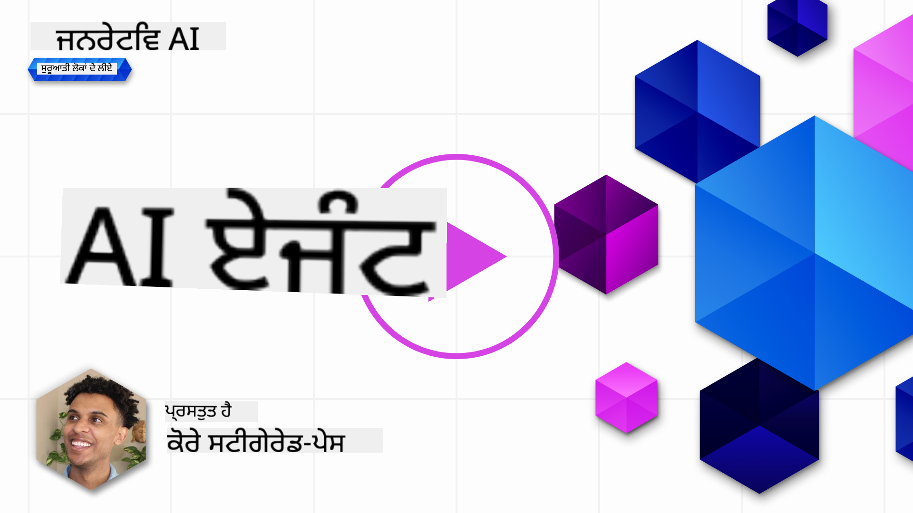
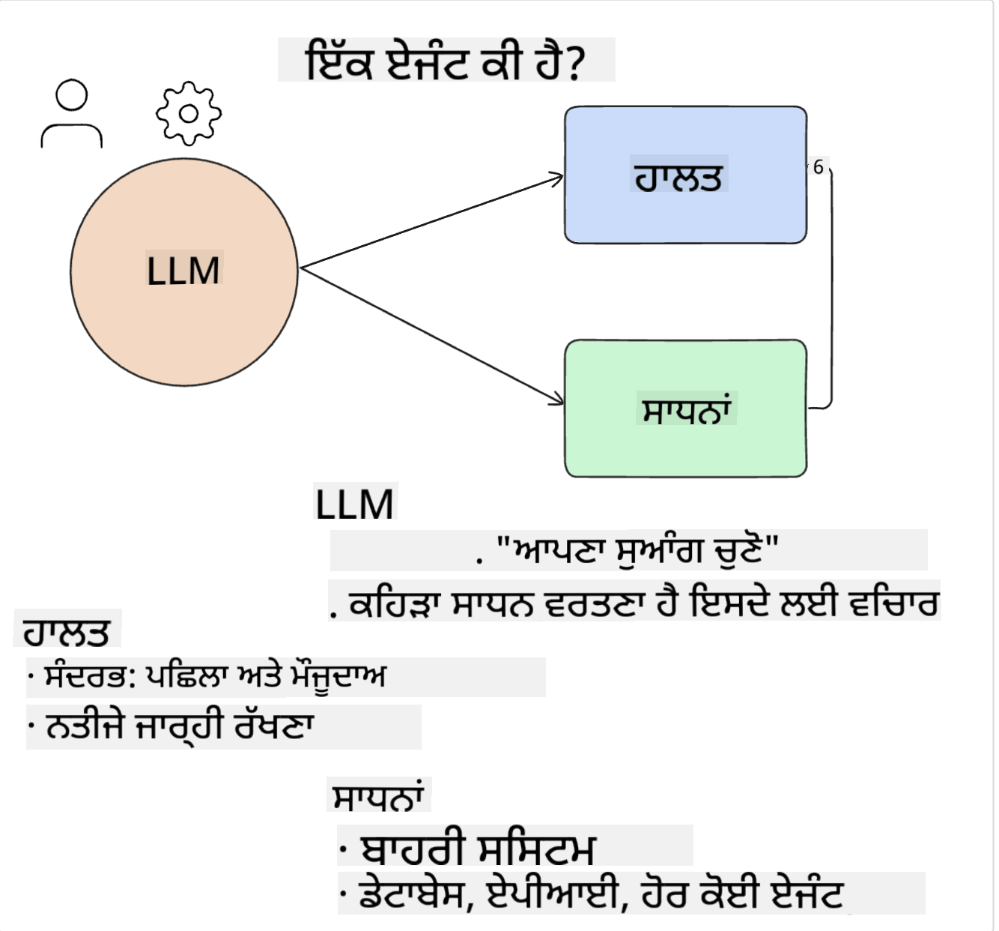
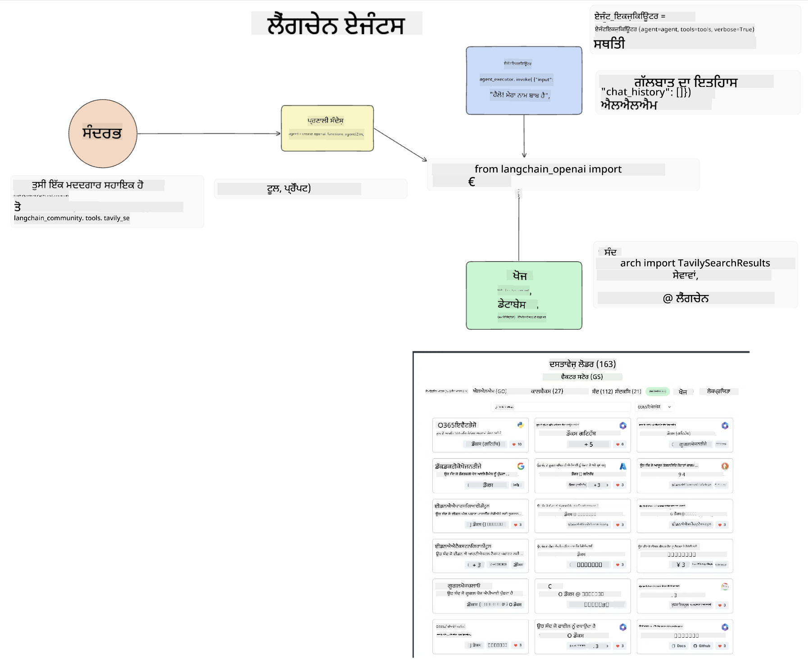
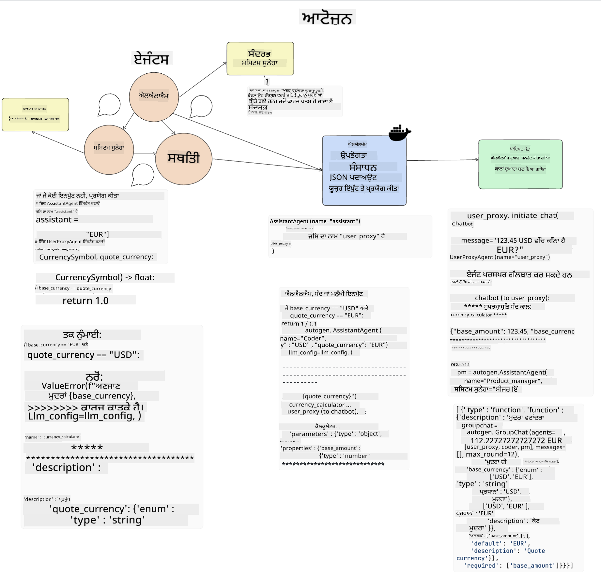
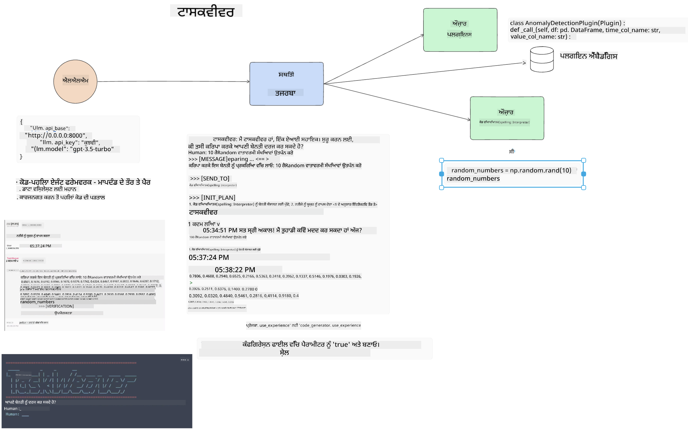
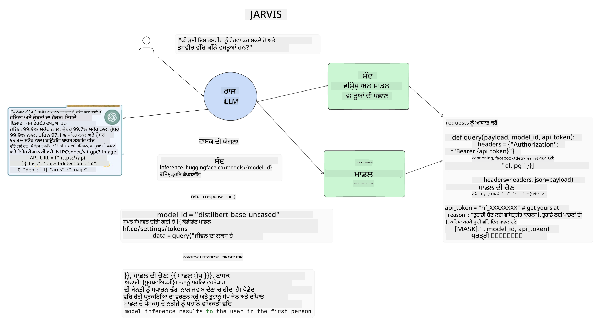

<!--
CO_OP_TRANSLATOR_METADATA:
{
  "original_hash": "11f03c81f190d9cbafd0f977dcbede6c",
  "translation_date": "2025-06-26T00:15:08+00:00",
  "source_file": "17-ai-agents/README.md",
  "language_code": "pa"
}
-->
[](https://aka.ms/gen-ai-lesson17-gh?WT.mc_id=academic-105485-koreyst)

## ਜਾਣ ਪਛਾਣ

AI ਏਜੰਟ ਜਨਰੇਟਿਵ AI ਵਿੱਚ ਇੱਕ ਰੋਮਾਂਚਕ ਵਿਕਾਸ ਨੂੰ ਦਰਸਾਉਂਦੇ ਹਨ, ਜੋ ਵੱਡੇ ਭਾਸ਼ਾ ਮਾਡਲਾਂ (LLMs) ਨੂੰ ਸਹਾਇਕ ਤੋਂ ਏਜੰਟਾਂ ਵਿੱਚ ਤਬਦੀਲ ਕਰਨ ਯੋਗ ਬਣਾਉਂਦੇ ਹਨ ਜੋ ਕਾਮ ਕਰ ਸਕਦੇ ਹਨ। AI ਏਜੰਟ ਫਰੇਮਵਰਕ ਡਿਵੈਲਪਰਾਂ ਨੂੰ ਐਪਲੀਕੇਸ਼ਨ ਬਣਾਉਣ ਯੋਗ ਬਣਾਉਂਦੇ ਹਨ ਜੋ LLMs ਨੂੰ ਸੰਦਾਂ ਅਤੇ ਸਟੇਟ ਪ੍ਰਬੰਧਨ ਤੱਕ ਪਹੁੰਚ ਦਿੰਦੇ ਹਨ। ਇਹ ਫਰੇਮਵਰਕ ਵਿਜੀਬਿਲਟੀ ਨੂੰ ਵੀ ਵਧਾਉਂਦੇ ਹਨ, ਉਪਭੋਗਤਾਵਾਂ ਅਤੇ ਡਿਵੈਲਪਰਾਂ ਨੂੰ LLMs ਦੁਆਰਾ ਯੋਜਨਾ ਬਣਾਈ ਗਈ ਕਾਰਵਾਈਆਂ ਦੀ ਨਿਗਰਾਨੀ ਕਰਨ ਦੀ ਇਜਾਜ਼ਤ ਦਿੰਦੇ ਹਨ, ਇਸ ਤਰ੍ਹਾਂ ਅਨੁਭਵ ਪ੍ਰਬੰਧਨ ਵਿੱਚ ਸੁਧਾਰ ਹੁੰਦਾ ਹੈ।

ਇਸ ਪਾਠ ਵਿੱਚ ਹੇਠ ਲਿਖੇ ਖੇਤਰ ਸ਼ਾਮਲ ਹੋਣਗੇ:

- ਸਮਝਣਾ ਕਿ AI ਏਜੰਟ ਕੀ ਹੈ - ਅਸਲ ਵਿੱਚ AI ਏਜੰਟ ਕੀ ਹੈ?
- ਚਾਰ ਵੱਖ-ਵੱਖ AI ਏਜੰਟ ਫਰੇਮਵਰਕ ਦੀ ਪੜਚੋਲ ਕਰਨਾ - ਇਹਨਾਂ ਨੂੰ ਕੀ ਵਿਲੱਖਣ ਬਣਾਉਂਦਾ ਹੈ?
- ਵੱਖ-ਵੱਖ ਵਰਤੋਂ ਦੇ ਕੇਸਾਂ ਵਿੱਚ ਇਹ AI ਏਜੰਟਾਂ ਨੂੰ ਲਾਗੂ ਕਰਨਾ - ਸਾਨੂੰ ਕਦੋਂ AI ਏਜੰਟਾਂ ਦੀ ਵਰਤੋਂ ਕਰਨੀ ਚਾਹੀਦੀ ਹੈ?

## ਸਿੱਖਣ ਦੇ ਲਕਸ਼

ਇਸ ਪਾਠ ਨੂੰ ਲੈਣ ਦੇ ਬਾਅਦ, ਤੁਸੀਂ ਯੋਗ ਹੋਵੋਗੇ:

- ਸਮਝਾ ਸਕਦੇ ਹੋ ਕਿ AI ਏਜੰਟ ਕੀ ਹਨ ਅਤੇ ਉਹਨਾਂ ਦੀ ਵਰਤੋਂ ਕਿਵੇਂ ਕੀਤੀ ਜਾ ਸਕਦੀ ਹੈ।
- ਕੁਝ ਲੋਕਪ੍ਰਿਯ AI ਏਜੰਟ ਫਰੇਮਵਰਕਾਂ ਵਿੱਚ ਅੰਤਰਾਂ ਦੀ ਸਮਝ ਹੋਵੇਗੀ, ਅਤੇ ਉਹ ਕਿਵੇਂ ਵੱਖਰੇ ਹਨ।
- ਸਮਝੋ ਕਿ AI ਏਜੰਟ ਕਿਵੇਂ ਕੰਮ ਕਰਦੇ ਹਨ ਤਾਂ ਜੋ ਉਹਨਾਂ ਨਾਲ ਐਪਲੀਕੇਸ਼ਨ ਬਣਾਈ ਜਾ ਸਕੇ।

## AI ਏਜੰਟ ਕੀ ਹਨ?

AI ਏਜੰਟ ਜਨਰੇਟਿਵ AI ਦੀ ਦੁਨੀਆ ਵਿੱਚ ਬਹੁਤ ਹੀ ਰੋਮਾਂਚਕ ਖੇਤਰ ਹਨ। ਇਸ ਰੋਮਾਂਚ ਨਾਲ ਕਈ ਵਾਰ ਸ਼ਬਦਾਂ ਅਤੇ ਉਹਨਾਂ ਦੇ ਅਰਥਾਂ ਦੀ ਗਲਤਫਹਮੀ ਹੁੰਦੀ ਹੈ। ਚੀਜ਼ਾਂ ਨੂੰ ਸਧਾਰਨ ਅਤੇ ਬਹੁਤ ਸਾਰੇ ਸੰਦਾਂ ਨੂੰ ਸ਼ਾਮਲ ਰੱਖਣ ਲਈ ਜੋ AI ਏਜੰਟਾਂ ਨੂੰ ਦਰਸਾਉਂਦੇ ਹਨ, ਅਸੀਂ ਇਹ ਪਰਿਭਾਸ਼ਾ ਵਰਤ ਰਹੇ ਹਾਂ:

AI ਏਜੰਟ ਵੱਡੇ ਭਾਸ਼ਾ ਮਾਡਲਾਂ (LLMs) ਨੂੰ **ਸਟੇਟ** ਅਤੇ **ਸੰਦਾਂ** ਤੱਕ ਪਹੁੰਚ ਦੇ ਕੇ ਕੰਮ ਕਰਨ ਦੀ ਆਗਿਆ ਦਿੰਦੇ ਹਨ।



ਆਓ ਇਹ ਸ਼ਬਦ ਸਮਝੀਏ:

**ਵੱਡੇ ਭਾਸ਼ਾ ਮਾਡਲ** - ਇਹ ਉਹ ਮਾਡਲ ਹਨ ਜਿਨ੍ਹਾਂ ਨੂੰ ਇਸ ਕੋਰਸ ਵਿੱਚ ਸਮਰਪਿਤ ਕੀਤਾ ਗਿਆ ਹੈ ਜਿਵੇਂ ਕਿ GPT-3.5, GPT-4, Llama-2, ਆਦਿ।

**ਸਟੇਟ** - ਇਹ ਉਸ ਸੰਦਰਭ ਨੂੰ ਦਰਸਾਉਂਦਾ ਹੈ ਜਿਸ ਵਿੱਚ LLM ਕੰਮ ਕਰ ਰਹੀ ਹੈ। LLM ਆਪਣੇ ਪਿਛਲੇ ਕਾਰਵਾਈਆਂ ਦੇ ਸੰਦਰਭ ਅਤੇ ਮੌਜੂਦਾ ਸੰਦਰਭ ਦੀ ਵਰਤੋਂ ਕਰਦੀ ਹੈ, ਜੋ ਇਸ ਦੀ ਅਗਲੀ ਕਾਰਵਾਈ ਲਈ ਫੈਸਲਾ ਕਰਨ ਲਈ ਮਾਰਗਦਰਸ਼ਨ ਕਰਦੀ ਹੈ। AI ਏਜੰਟ ਫਰੇਮਵਰਕ ਡਿਵੈਲਪਰਾਂ ਨੂੰ ਇਸ ਸੰਦਰਭ ਨੂੰ ਆਸਾਨੀ ਨਾਲ ਬਣਾਏ ਰੱਖਣ ਲਈ ਯੋਗ ਬਣਾਉਂਦੇ ਹਨ।

**ਸੰਦ** - ਉਸ ਕੰਮ ਨੂੰ ਪੂਰਾ ਕਰਨ ਲਈ ਜੋ ਉਪਭੋਗਤਾ ਨੇ ਮੰਗਿਆ ਹੈ ਅਤੇ ਜੋ LLM ਨੇ ਯੋਜਨਾ ਬਣਾਈ ਹੈ, LLM ਨੂੰ ਸੰਦਾਂ ਤੱਕ ਪਹੁੰਚ ਦੀ ਜ਼ਰੂਰਤ ਹੁੰਦੀ ਹੈ। ਕੁਝ ਸੰਦਾਂ ਦੇ ਉਦਾਹਰਨਾਂ ਵਿੱਚ ਡੇਟਾਬੇਸ, API, ਬਾਹਰੀ ਐਪਲੀਕੇਸ਼ਨ ਜਾਂ ਇੱਥੇ ਤੱਕ ਕਿ ਦੂਜਾ LLM ਵੀ ਸ਼ਾਮਲ ਹੋ ਸਕਦਾ ਹੈ!

ਇਹ ਪਰਿਭਾਸ਼ਾਵਾਂ ਤੁਹਾਨੂੰ ਅਗੇ ਜਾਣ ਲਈ ਚੰਗੀ ਸਮਝ ਪ੍ਰਦਾਨ ਕਰਨ ਦੀ ਉਮੀਦ ਹਨ ਜਦੋਂ ਅਸੀਂ ਇਹ ਦੇਖਦੇ ਹਾਂ ਕਿ ਉਹ ਕਿਵੇਂ ਲਾਗੂ ਕੀਤੇ ਜਾਂਦੇ ਹਨ। ਆਓ ਕੁਝ ਵੱਖਰੇ AI ਏਜੰਟ ਫਰੇਮਵਰਕ ਦੀ ਪੜਚੋਲ ਕਰੀਏ:

## ਲੈਂਗਚੇਨ ਏਜੰਟ

[ਲੈਂਗਚੇਨ ਏਜੰਟ](https://python.langchain.com/docs/how_to/#agents?WT.mc_id=academic-105485-koreyst) ਉਹਨਾਂ ਪਰਿਭਾਸ਼ਾਵਾਂ ਦੀ ਇੱਕ ਲਾਗੂ ਕਰਨ ਵਾਲੀ ਹੈ ਜੋ ਅਸੀਂ ਉਪਰ ਦਿੱਤੀ ਹੈ।

**ਸਟੇਟ** ਨੂੰ ਪ੍ਰਬੰਧਿਤ ਕਰਨ ਲਈ, ਇਹ ਇੱਕ ਅੰਦਰੂਨੀ ਫੰਕਸ਼ਨ `AgentExecutor` ਦੀ ਵਰਤੋਂ ਕਰਦਾ ਹੈ। ਇਹ ਪਰਿਭਾਸ਼ਿਤ `agent` ਅਤੇ `tools` ਨੂੰ ਸਵੀਕਾਰ ਕਰਦਾ ਹੈ ਜੋ ਇਸਨੂੰ ਉਪਲਬਧ ਹਨ।

`Agent Executor` ਗੱਲਬਾਤ ਦੇ ਇਤਿਹਾਸ ਨੂੰ ਵੀ ਸਟੋਰ ਕਰਦਾ ਹੈ ਤਾਂ ਜੋ ਗੱਲਬਾਤ ਦਾ ਸੰਦਰਭ ਪ੍ਰਦਾਨ ਕੀਤਾ ਜਾ ਸਕੇ।



ਲੈਂਗਚੇਨ ਇੱਕ [ਸੰਦਾਂ ਦੀ ਸੂਚੀ](https://integrations.langchain.com/tools?WT.mc_id=academic-105485-koreyst) ਪ੍ਰਦਾਨ ਕਰਦਾ ਹੈ ਜੋ ਤੁਹਾਡੇ ਐਪਲੀਕੇਸ਼ਨ ਵਿੱਚ ਆਯਾਤ ਕੀਤੇ ਜਾ ਸਕਦੇ ਹਨ ਜਿਸ ਵਿੱਚ LLM ਪਹੁੰਚ ਪ੍ਰਾਪਤ ਕਰ ਸਕਦਾ ਹੈ। ਇਹ ਸਮੁਦਾਇ ਅਤੇ ਲੈਂਗਚੇਨ ਟੀਮ ਦੁਆਰਾ ਬਣਾਏ ਗਏ ਹਨ।

ਤੁਸੀਂ ਫਿਰ ਇਹ ਸੰਦ ਪਰਿਭਾਸ਼ਿਤ ਕਰ ਸਕਦੇ ਹੋ ਅਤੇ ਉਹਨਾਂ ਨੂੰ `Agent Executor` ਵਿੱਚ ਪਾਸ ਕਰ ਸਕਦੇ ਹੋ।

ਦ੍ਰਿਸ਼ਟੀਕੋਣ ਹੋਰ ਇੱਕ ਮਹੱਤਵਪੂਰਨ ਪਹਲੂ ਹੈ ਜਦੋਂ AI ਏਜੰਟਾਂ ਦੀ ਗੱਲ ਕਰਦੇ ਹਾਂ। ਇਹ ਐਪਲੀਕੇਸ਼ਨ ਡਿਵੈਲਪਰਾਂ ਲਈ ਮਹੱਤਵਪੂਰਨ ਹੈ ਕਿ ਉਹ ਸਮਝਣ ਕਿ LLM ਕਿਹੜਾ ਸੰਦ ਵਰਤ ਰਿਹਾ ਹੈ ਅਤੇ ਕਿਉਂ। ਇਸ ਲਈ, ਲੈਂਗਚੇਨ ਦੀ ਟੀਮ ਨੇ ਲੈਂਗਸਮਿਥ ਵਿਕਸਿਤ ਕੀਤਾ ਹੈ।

## ਆਟੋਜਨ

ਅਗਲਾ AI ਏਜੰਟ ਫਰੇਮਵਰਕ ਜਿਸ ਬਾਰੇ ਅਸੀਂ ਗੱਲ ਕਰਾਂਗੇ ਉਹ ਹੈ [ਆਟੋਜਨ](https://microsoft.github.io/autogen/?WT.mc_id=academic-105485-koreyst)। ਆਟੋਜਨ ਦਾ ਮੁੱਖ ਧਿਆਨ ਗੱਲਬਾਤਾਂ 'ਤੇ ਹੈ। ਏਜੰਟ ਦੋਵੇਂ **ਗੱਲਬਾਤ ਕਰਨ ਯੋਗ** ਅਤੇ **ਕਸਟਮਾਈਜ਼ ਕਰਨ ਯੋਗ** ਹਨ।

**ਗੱਲਬਾਤ ਕਰਨ ਯੋਗ -** LLMs ਇੱਕ ਹੋਰ LLM ਨਾਲ ਗੱਲਬਾਤ ਸ਼ੁਰੂ ਕਰ ਸਕਦੇ ਹਨ ਅਤੇ ਜਾਰੀ ਰੱਖ ਸਕਦੇ ਹਨ ਤਾਂ ਜੋ ਇੱਕ ਕੰਮ ਪੂਰਾ ਕੀਤਾ ਜਾ ਸਕੇ। ਇਹ `AssistantAgents` ਬਣਾਕੇ ਅਤੇ ਉਹਨਾਂ ਨੂੰ ਇੱਕ ਵਿਸ਼ੇਸ਼ ਸਿਸਟਮ ਸੁਨੇਹਾ ਦੇ ਕੇ ਕੀਤਾ ਜਾਂਦਾ ਹੈ।

```python

autogen.AssistantAgent( name="Coder", llm_config=llm_config, ) pm = autogen.AssistantAgent( name="Product_manager", system_message="Creative in software product ideas.", llm_config=llm_config, )

```

**ਕਸਟਮਾਈਜ਼ ਕਰਨ ਯੋਗ** - ਏਜੰਟਾਂ ਨੂੰ ਸਿਰਫ LLMs ਹੀ ਨਹੀਂ ਸਗੋਂ ਉਪਭੋਗਤਾ ਜਾਂ ਸੰਦ ਵਜੋਂ ਵੀ ਪਰਿਭਾਸ਼ਿਤ ਕੀਤਾ ਜਾ ਸਕਦਾ ਹੈ। ਇੱਕ ਡਿਵੈਲਪਰ ਵਜੋਂ, ਤੁਸੀਂ ਇੱਕ `UserProxyAgent` ਪਰਿਭਾਸ਼ਿਤ ਕਰ ਸਕਦੇ ਹੋ ਜੋ ਉਪਭੋਗਤਾ ਨਾਲ ਸੰਚਾਰ ਕਰਨ ਲਈ ਜ਼ਿੰਮੇਵਾਰ ਹੁੰਦਾ ਹੈ ਤਾਂ ਜੋ ਇੱਕ ਕੰਮ ਪੂਰਾ ਕਰਨ ਵਿੱਚ ਪ੍ਰਤੀਕ੍ਰਿਆ ਪ੍ਰਦਾਨ ਕੀਤੀ ਜਾ ਸਕੇ। ਇਹ ਪ੍ਰਤੀਕ੍ਰਿਆ ਜਾਂ ਤਾਂ ਕੰਮ ਦੀ ਕਾਰਵਾਈ ਜਾਰੀ ਰੱਖ ਸਕਦੀ ਹੈ ਜਾਂ ਇਸਨੂੰ ਰੋਕ ਸਕਦੀ ਹੈ।

```python
user_proxy = UserProxyAgent(name="user_proxy")
```

### ਸਟੇਟ ਅਤੇ ਸੰਦ

ਸਟੇਟ ਨੂੰ ਬਦਲਣ ਅਤੇ ਪ੍ਰਬੰਧਿਤ ਕਰਨ ਲਈ, ਇੱਕ ਸਹਾਇਕ ਏਜੰਟ ਪਾਇਥਨ ਕੋਡ ਬਣਾਉਂਦਾ ਹੈ ਤਾਂ ਜੋ ਕੰਮ ਪੂਰਾ ਕੀਤਾ ਜਾ ਸਕੇ।

ਇੱਥੇ ਪ੍ਰਕਿਰਿਆ ਦਾ ਇੱਕ ਉਦਾਹਰਨ ਹੈ:



#### ਸਿਸਟਮ ਸੁਨੇਹਾ ਨਾਲ ਪਰਿਭਾਸ਼ਿਤ LLM

```python
system_message="For weather related tasks, only use the functions you have been provided with. Reply TERMINATE when the task is done."
```

ਇਹ ਸਿਸਟਮ ਸੁਨੇਹਾ ਇਸ ਵਿਸ਼ੇਸ਼ LLM ਨੂੰ ਦਿਸ਼ਾ ਦਿੰਦਾ ਹੈ ਕਿ ਕਿਹੜੇ ਫੰਕਸ਼ਨ ਇਸ ਦੇ ਕੰਮ ਲਈ ਸਬੰਧਿਤ ਹਨ। ਯਾਦ ਰੱਖੋ, ਆਟੋਜਨ ਨਾਲ ਤੁਸੀਂ ਵੱਖਰੇ ਸਿਸਟਮ ਸੁਨੇਹਿਆਂ ਦੇ ਨਾਲ ਕਈ ਪਰਿਭਾਸ਼ਿਤ ਸਹਾਇਕ ਏਜੰਟ ਹੋ ਸਕਦੇ ਹੋ।

#### ਉਪਭੋਗਤਾ ਦੁਆਰਾ ਗੱਲਬਾਤ ਸ਼ੁਰੂ ਕੀਤੀ ਗਈ

```python
user_proxy.initiate_chat( chatbot, message="I am planning a trip to NYC next week, can you help me pick out what to wear? ", )

```

ਇਹ ਸੁਨੇਹਾ user_proxy (ਮਨੁੱਖ) ਤੋਂ ਉਹ ਹੈ ਜੋ ਏਜੰਟ ਦੀ ਪ੍ਰਕਿਰਿਆ ਨੂੰ ਸ਼ੁਰੂ ਕਰੇਗਾ ਤਾਂ ਜੋ ਸੰਭਾਵੀ ਫੰਕਸ਼ਨਾਂ ਦੀ ਪੜਚੋਲ ਕੀਤੀ ਜਾ ਸਕੇ ਜੋ ਇਸਨੂੰ ਅਮਲ ਵਿੱਚ ਲਿਆਉਣੀ ਚਾਹੀਦੀ ਹੈ।

#### ਫੰਕਸ਼ਨ ਅਮਲ ਵਿੱਚ ਲਿਆਉਣਾ

```bash
chatbot (to user_proxy):

***** Suggested tool Call: get_weather ***** Arguments: {"location":"New York City, NY","time_periond:"7","temperature_unit":"Celsius"} ******************************************************** --------------------------------------------------------------------------------

>>>>>>>> EXECUTING FUNCTION get_weather... user_proxy (to chatbot): ***** Response from calling function "get_weather" ***** 112.22727272727272 EUR ****************************************************************

```

ਜਦੋਂ ਸ਼ੁਰੂਆਤੀ ਗੱਲਬਾਤ ਪ੍ਰਕਿਰਿਆ ਵਿੱਚ ਲਿਆਈ ਜਾਂਦੀ ਹੈ, ਏਜੰਟ ਸੁਝਾਅ ਸੰਦ ਨੂੰ ਕਾਲ ਕਰਨ ਲਈ ਭੇਜੇਗਾ। ਇਸ ਮਾਮਲੇ ਵਿੱਚ, ਇਹ `get_weather`. Depending on your configuration, this function can be automatically executed and read by the Agent or can be executed based on user input.

You can find a list of [AutoGen code samples](https://microsoft.github.io/autogen/docs/Examples/?WT.mc_id=academic-105485-koreyst) to further explore how to get started building.

## Taskweaver

The next agent framework we will explore is [Taskweaver](https://microsoft.github.io/TaskWeaver/?WT.mc_id=academic-105485-koreyst). It is known as a "code-first" agent because instead of working strictly with `strings` , it can work with DataFrames in Python. This becomes extremely useful for data analysis and generation tasks. This can be things like creating graphs and charts or generating random numbers.

### State and Tools

To manage the state of the conversation, TaskWeaver uses the concept of a `Planner`. The `Planner` is a LLM that takes the request from the users and maps out the tasks that need to be completed to fulfill this request.

To complete the tasks the `Planner` is exposed to the collection of tools called `Plugins` ਨਾਮਕ ਫੰਕਸ਼ਨ ਹੈ। ਇਹ ਪਾਇਥਨ ਕਲਾਸਾਂ ਜਾਂ ਇੱਕ ਜਨਰਲ ਕੋਡ ਵਿਆਖਿਆਕਾਰ ਹੋ ਸਕਦਾ ਹੈ। ਇਹ ਪਲੱਗਇਨ ਐਮਬੈਡਿੰਗ ਵਜੋਂ ਸਟੋਰ ਕੀਤੇ ਜਾਂਦੇ ਹਨ ਤਾਂ ਜੋ LLM ਸਹੀ ਪਲੱਗਇਨ ਦੀ ਖੋਜ ਬਿਹਤਰ ਕਰ ਸਕੇ।



ਇੱਥੇ ਇੱਕ ਪਲੱਗਇਨ ਦਾ ਉਦਾਹਰਨ ਹੈ ਜੋ ਵਿਸ਼ਮਤਾ ਪਤਾ ਲਗਾਉਣ ਨੂੰ ਸੰਭਾਲਦਾ ਹੈ:

```python
class AnomalyDetectionPlugin(Plugin): def __call__(self, df: pd.DataFrame, time_col_name: str, value_col_name: str):
```

ਕੋਡ ਨੂੰ ਅਮਲ ਵਿੱਚ ਲਿਆਉਣ ਤੋਂ ਪਹਿਲਾਂ ਵੈਰੀਫਾਈ ਕੀਤਾ ਜਾਂਦਾ ਹੈ। ਟਾਸਕਵੀਵਰ ਵਿੱਚ ਸੰਦਰਭ ਨੂੰ ਪ੍ਰਬੰਧਿਤ ਕਰਨ ਲਈ ਇੱਕ ਹੋਰ ਵਿਸ਼ੇਸ਼ਤਾ `experience`. Experience allows for the context of a conversation to be stored over to the long term in a YAML file. This can be configured so that the LLM improves over time on certain tasks given that it is exposed to prior conversations.

## JARVIS

The last agent framework we will explore is [JARVIS](https://github.com/microsoft/JARVIS?tab=readme-ov-file?WT.mc_id=academic-105485-koreyst). What makes JARVIS unique is that it uses an LLM to manage the `state` ਗੱਲਬਾਤ ਦੀ ਅਤੇ `tools` ਹੋਰ AI ਮਾਡਲ ਹਨ। ਹਰ ਇੱਕ AI ਮਾਡਲ ਵਿਸ਼ੇਸ਼ ਮਾਡਲ ਹਨ ਜੋ ਕੁਝ ਕੰਮ ਕਰਦੇ ਹਨ ਜਿਵੇਂ ਕਿ ਵਸਤੂ ਪਤਾ ਲਗਾਉਣਾ, ਟ੍ਰਾਂਸਕ੍ਰਿਪਸ਼ਨ ਜਾਂ ਚਿੱਤਰ ਕੈਪਸ਼ਨਿੰਗ।



LLM, ਇੱਕ ਜਨਰਲ ਪਰਪਜ਼ ਮਾਡਲ ਹੋਣ ਦੇ ਨਾਤੇ, ਉਪਭੋਗਤਾ ਤੋਂ ਬੇਨਤੀ ਪ੍ਰਾਪਤ ਕਰਦਾ ਹੈ ਅਤੇ ਵਿਸ਼ੇਸ਼ ਕੰਮ ਅਤੇ ਕੋਈ ਵੀ ਦਲੀਲ/ਡਾਟਾ ਜੋ ਕੰਮ ਪੂਰਾ ਕਰਨ ਲਈ ਲੋੜੀਂਦਾ ਹੈ ਨੂੰ ਪਛਾਣਦਾ ਹੈ।

```python
[{"task": "object-detection", "id": 0, "dep": [-1], "args": {"image": "e1.jpg" }}]
```

ਫਿਰ LLM ਬੇਨਤੀ ਨੂੰ ਇਸ ਤਰੀਕੇ ਨਾਲ ਫਾਰਮੈਟ ਕਰਦਾ ਹੈ ਕਿ ਵਿਸ਼ੇਸ਼ AI ਮਾਡਲ ਵਿਆਖਿਆ ਕਰ ਸਕਦਾ ਹੈ, ਜਿਵੇਂ ਕਿ JSON। ਜਦੋਂ AI ਮਾਡਲ ਨੇ ਕੰਮ ਦੇ ਆਧਾਰ 'ਤੇ ਆਪਣੀ ਪੇਸ਼ਕਸ਼ ਵਾਪਸ ਕੀਤੀ, LLM ਜਵਾਬ ਪ੍ਰਾਪਤ ਕਰਦਾ ਹੈ।

ਜੇਕਰ ਕੰਮ ਪੂਰਾ ਕਰਨ ਲਈ ਕਈ ਮਾਡਲਾਂ ਦੀ ਲੋੜ ਹੈ, ਤਾਂ ਇਹ ਉਹਨਾਂ ਮਾਡਲਾਂ ਤੋਂ ਜਵਾਬ ਦੀ ਵੀ ਵਿਆਖਿਆ ਕਰੇਗਾ ਪਹਿਲਾਂ ਉਹਨਾਂ ਨੂੰ ਇਕੱਠਾ ਕਰਨ ਤੋਂ ਪਹਿਲਾਂ ਉਪਭੋਗਤਾ ਨੂੰ ਜਵਾਬ ਦੇਣ ਲਈ।

ਹੇਠਾਂ ਦਿੱਤਾ ਉਦਾਹਰਨ ਦਿਖਾਉਂਦਾ ਹੈ ਕਿ ਇਹ ਕਿਵੇਂ ਕੰਮ ਕਰੇਗਾ ਜਦੋਂ ਇੱਕ ਉਪਭੋਗਤਾ ਇੱਕ ਚਿੱਤਰ ਵਿੱਚ ਵਸਤੂਆਂ ਦੀ ਵਰਣਨਾ ਅਤੇ ਗਿਣਤੀ ਦੀ ਬੇਨਤੀ ਕਰ ਰਿਹਾ ਹੈ:

## ਅਸਾਈਨਮੈਂਟ

ਆਪਣੀ AI ਏਜੰਟਾਂ ਦੀ ਸਿੱਖਿਆ ਨੂੰ ਜਾਰੀ ਰੱਖਣ ਲਈ ਤੁਸੀਂ AutoGen ਨਾਲ ਬਣਾ ਸਕਦੇ ਹੋ:

- ਇੱਕ ਐਪਲੀਕੇਸ਼ਨ ਜੋ ਇੱਕ ਸਿੱਖਿਆ ਸਟਾਰਟਅਪ ਦੇ ਵੱਖ-ਵੱਖ ਵਿਭਾਗਾਂ ਨਾਲ ਕਾਰੋਬਾਰੀ ਮੀਟਿੰਗ ਦੀ ਨਕਲ ਕਰਦਾ ਹੈ।
- ਸਿਸਟਮ ਸੁਨੇਹੇ ਬਣਾਓ ਜੋ LLMs ਨੂੰ ਵੱਖ-ਵੱਖ ਵਿਅਕਤਿਤਾ ਅਤੇ ਤਰਜੀਹਾਂ ਨੂੰ ਸਮਝਣ ਵਿੱਚ ਮਦਦ ਕਰਦੇ ਹਨ, ਅਤੇ ਉਪਭੋਗਤਾ ਨੂੰ ਨਵੀਂ ਉਤਪਾਦਿਕ ਵਿਚਾਰ ਪੇਸ਼ ਕਰਨ ਯੋਗ ਬਣਾਉਂਦੇ ਹਨ।
- ਫਿਰ LLM ਹਰ ਵਿਭਾਗ ਤੋਂ ਫਾਲੋਅਪ ਸਵਾਲਾਂ ਪੈਦਾ ਕਰੇ ਤਾਂ ਜੋ ਪੇਸ਼ਕਸ਼ ਅਤੇ ਉਤਪਾਦਿਕ ਵਿਚਾਰ ਨੂੰ ਸੁਧਾਰਿਆ ਜਾ ਸਕੇ

## ਸਿੱਖਿਆ ਇਥੇ ਨਹੀਂ ਰੁਕਦੀ, ਯਾਤਰਾ ਜਾਰੀ ਰੱਖੋ

ਇਹ ਪਾਠ ਪੂਰਾ ਕਰਨ ਤੋਂ ਬਾਅਦ, ਸਾਡੇ [ਜਨਰੇਟਿਵ AI ਸਿੱਖਣ ਸੰਗ੍ਰਹਿ](https://aka.ms/genai-collection?WT.mc_id=academic-105485-koreyst) ਦੀ ਜਾਂਚ ਕਰੋ ਤਾਂ ਜੋ ਆਪਣੀ ਜਨਰੇਟਿਵ AI ਗਿਆਨ ਨੂੰ ਵਧਾਇਆ ਜਾ ਸਕੇ!

**ਅਸਵੀਕਾਰਯੋਗ**:  
ਇਹ ਦਸਤਾਵੇਜ਼ AI ਅਨੁਵਾਦ ਸੇਵਾ [Co-op Translator](https://github.com/Azure/co-op-translator) ਦੀ ਵਰਤੋਂ ਕਰਕੇ ਅਨੁਵਾਦ ਕੀਤਾ ਗਿਆ ਹੈ। ਜਦੋਂ ਕਿ ਅਸੀਂ ਸਹੀ ਹੋਣ ਦੀ ਕੋਸ਼ਿਸ਼ ਕਰਦੇ ਹਾਂ, ਕਿਰਪਾ ਕਰਕੇ ਧਿਆਨ ਰੱਖੋ ਕਿ ਸਵੈਚਲਿਤ ਅਨੁਵਾਦਾਂ ਵਿੱਚ ਗਲਤੀਆਂ ਜਾਂ ਗਲਤੀਆਂ ਹੋ ਸਕਦੀਆਂ ਹਨ। ਇਸ ਦੀ ਮੂਲ ਭਾਸ਼ਾ ਵਿੱਚ ਮੂਲ ਦਸਤਾਵੇਜ਼ ਨੂੰ ਅਧਿਕਾਰਕ ਸਰੋਤ ਮੰਨਿਆ ਜਾਣਾ ਚਾਹੀਦਾ ਹੈ। ਮਹੱਤਵਪੂਰਨ ਜਾਣਕਾਰੀ ਲਈ, ਪੇਸ਼ੇਵਰ ਮਨੁੱਖੀ ਅਨੁਵਾਦ ਦੀ ਸਿਫਾਰਸ਼ ਕੀਤੀ ਜਾਂਦੀ ਹੈ। ਇਸ ਅਨੁਵਾਦ ਦੇ ਪ੍ਰਯੋਗ ਤੋਂ ਉਤਪੰਨ ਹੋਣ ਵਾਲੀਆਂ ਕਿਸੇ ਵੀ ਗਲਤਫਹਿਮੀਆਂ ਜਾਂ ਗਲਤ ਵਿਆਖਿਆਵਾਂ ਲਈ ਅਸੀਂ ਜ਼ਿੰਮੇਵਾਰ ਨਹੀਂ ਹਾਂ।