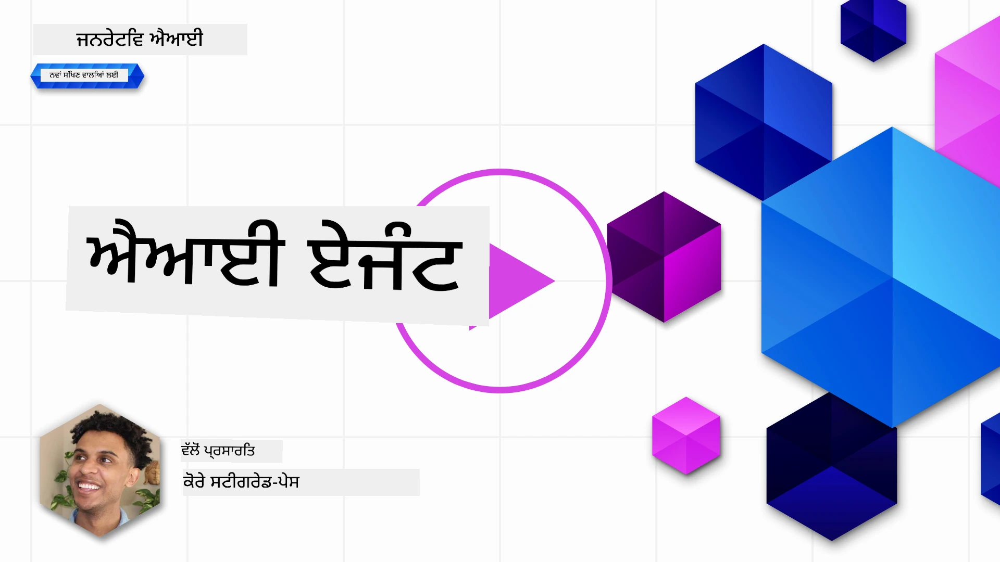
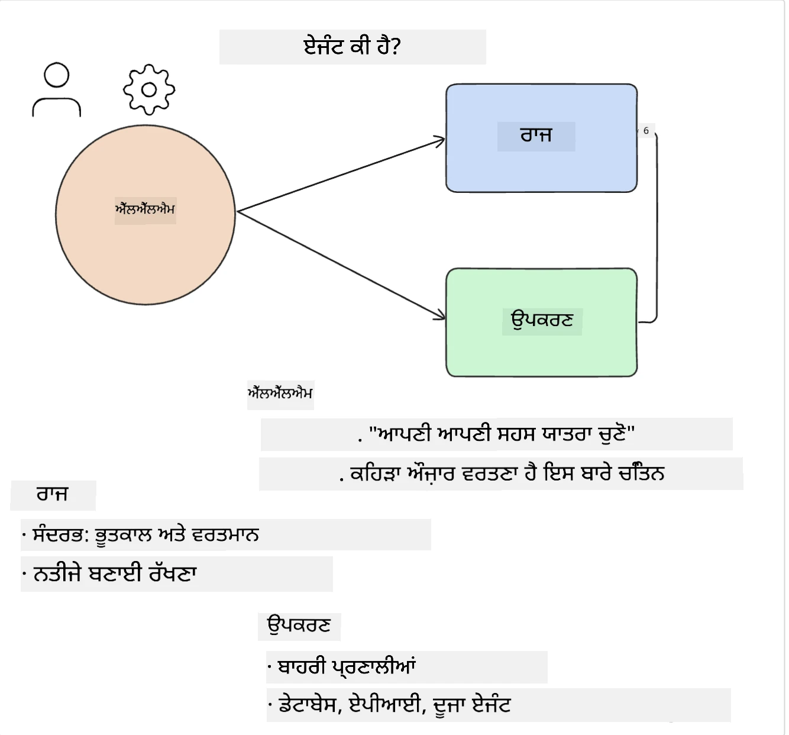
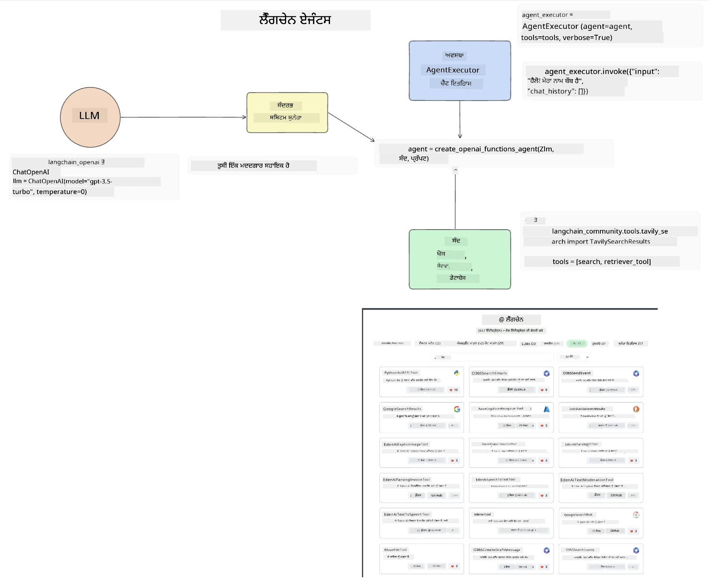
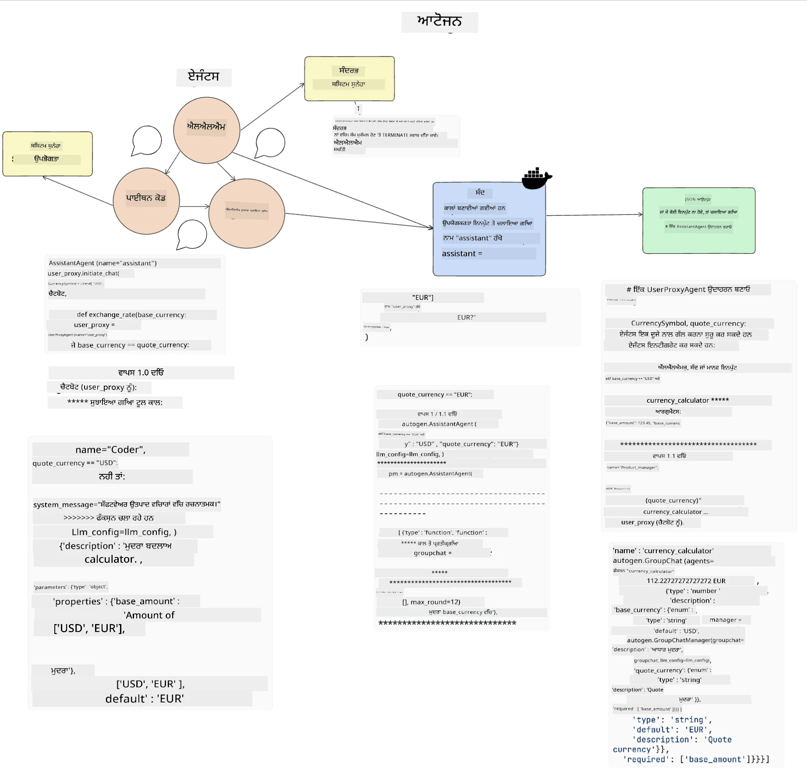
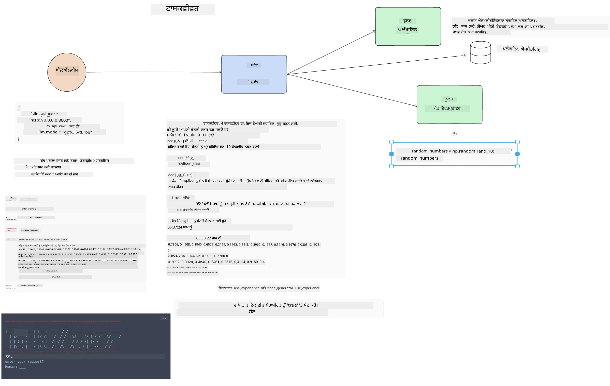
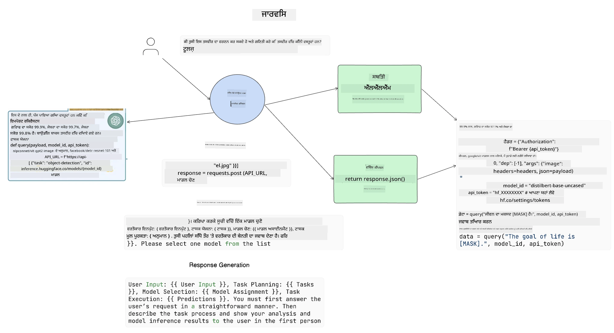

[](https://youtu.be/yAXVW-lUINc?si=bOtW9nL6jc3XJgOM)

## ਜਾਣ ਪਹਿਚਾਣ

ਏਆਈ ਏਜੰਟ ਜਨਰੇਟਿਵ ਏਆਈ ਵਿੱਚ ਇਕ ਰੁਚਿਕਰ ਵਿਕਾਸ ਨੂੰ ਦਰਸਾਉਂਦੇ ਹਨ, ਜਿਸ ਨਾਲ ਵੱਡੇ ਭਾਸ਼ਾਈ ਮਾਡਲ (LLMs) ਸਹਾਇਕਾਂ ਤੋਂ ਐਜੰਟਾਂ ਵੱਲ ਵਿਕਸਤ ਹੋ ਸਕਦੇ ਹਨ ਜੋ ਕਾਰਵਾਈਆਂ ਕਰਨ ਸੱਖਮ ਹੋਣ। ਏਆਈ ਏਜੰਟ ਫਰੇਮਵਰਕ ਡਿਵੈਲਪਰਾਂ ਨੂੰ ਐਪਲੀਕੇਸ਼ਨਾਂ ਬਣਾਉਣ ਦੀ ਸਹੂਲਤ ਦਿੰਦੇ ਹਨ ਜੋ LLMs ਨੂੰ ਟੂਲਾਂ ਅਤੇ ਸਥਿਤੀ ਪ੍ਰਬੰਧਨ ਤੱਕ ਪਹੁੰਚ ਦਿੰਦੇ ਹਨ। ਇਹ ਫਰੇਮਵਰਕ ਦ੍ਰਿਸ਼ਤਾ ਨੂੰ ਵੀ ਵਧਾਉਂਦੇ ਹਨ, ਜਿਸ ਨਾਲ ਯੂਜਰਾਂ ਅਤੇ ਡਿਵੈਲਪਰਾਂ ਨੂੰ LLM ਵੱਲੋਂ ਯੋਜਨਾ ਬਣਾਈਆਂ ਕਾਰਵਾਈਆਂ ਦੀ ਨਿਗਰਾਨੀ ਕਰਨ ਵਿੱਚ ਮਦਦ ਮਿਲਦੀ ਹੈ, ਇਸ ਤਰ੍ਹਾਂ ਅਨੁਭਵ ਪ੍ਰਬੰਧਨ ਵਿਚ ਸੁਧਾਰ ਹੁੰਦਾ ਹੈ।

ਇਹ ਪਾਠ ਹੇਠਾਂ ਦਿੱਤੇ ਖੇਤਰਾਂ ਨੂੰ ਕਵਰ ਕਰੇਗਾ:

- ਏਆਈ ਏਜੰਟ ਕਿਆ ਹੈ ਇਸ ਨੂੰ ਸਮਝਣਾ - ਏਆਈ ਏਜੰਟ ਅਸਲ ਵਿੱਚ ਕੀ ਹੈ?
- ਚਾਰ ਵੱਖ-ਵੱਖ ਏਆਈ ਏਜੰਟ ਫਰੇਮਵਰਕ ਦਾ ਪੜਚੋਲ - ਇਹਨਾਂ ਦੀ ਖਾਸੀਅਤ ਕੀ ਹੈ?
- ਇਹ ਏਆਈ ਏਜੰਟ ਵੱਖ-ਵੱਖ ਉਪਯੋਗਾਂ ਵਿੱਚ ਕਿਵੇਂ ਲਾਗੂ ਕੀਤੇ ਜਾ ਸਕਦੇ ਹਨ - ਕਦੋਂ ਸਾਨੂੰ ਏਆਈ ਏਜੰਟ ਵਰਤਣੇ ਚਾਹੀਦੇ ਹਨ?

## ਸਿੱਖਣ ਦੇ ਲਕੜ

ਇਸ ਪਾਠ ਨੂੰ ਲੈਣ ਮਗਰੋਂ, ਤੁਸੀਂ ਸਮਰੱਥ ਹੋ ਜਾਓਗੇ:

- ਸਮਝਾਉਣ ਲਈ ਕਿ ਏਆਈ ਏਜੰਟ ਕੀ ਹਨ ਅਤੇ ਉਹ ਕਿਵੇਂ ਵਰਤੇ ਜਾ ਸਕਦੇ ਹਨ।
- ਕੁਝ ਮਸ਼ਹੂਰ ਏਆਈ ਏਜੰਟ ਫਰੇਮਵਰਕਾਂ ਵਿੱਚ ਅੰਤਰਾਂ ਦੀ ਸਮਝ ਹੋਵੇਗੀ, ਅਤੇ ਉਹ ਕਿਵੇਂ ਵੱਖਰੇ ਹੁੰਦੇ ਹਨ।
- ਸਮਝਣਾ ਕਿ ਏਆਈ ਏਜੰਟ ਕਿਵੇਂ ਕੰਮ ਕਰਦੇ ਹਨ ਤਾਂ ਜੋ ਤੁਸੀਂ ਉਹਨਾਂ ਨਾਲ ਐਪ ਬਣਾਉ ਸਕੋ।

## ਏਆਈ ਏਜੰਟ ਕੀ ਹਨ?

ਏਆਈ ਏਜੰਟ ਜਨਰੇਟਿਵ ਏਆਈ ਦੀ ਦੁਨੀਆ ਵਿੱਚ ਇਕ ਬਹੁਤ ਰੁਚਿਕਰ ਖੇਤਰ ਹੈ। ਇਸ ਰੁਚੀ ਦੇ ਨਾਲ ਕਈ ਵਾਰੀ ਸ਼ਬਦਾਂ ਅਤੇ ਉਨ੍ਹਾਂ ਦੇ ਲਾਗੂ ਕਰਨ ਵਿੱਚ ਗੁੰਝਲਟ ਹੁੰਦੀ ਹੈ। ਸਾਦਗੀ ਅਤੇ ਜ਼ਿਆਦਾਤਰ ਉਹਨਾਂ ਟੂਲਾਂ ਨੂੰ ਧਿਆਨ ਵਿੱਚ ਰੱਖਦੇ ਹੋਏ ਜੋ ਏਆਈ ਏਜੰਟ ਕਹਿੰਦੇ ਹਨ, ਅਸੀਂ ਇਹ ਪਰਿਭਾਸ਼ਾ ਵਰਤਾਂਗੇ:

ਏਆਈ ਏਜੰਟ ਵੱਡੇ ਭਾਸ਼ਾਈ ਮਾਡਲਾਂ (LLMs) ਨੂੰ ਕੰਮ ਕਰਨ ਦੀ ਆਗਿਆ ਦੇਂਦੇ ਹਨ, ਉਹਨਾਂ ਨੂੰ **ਸਥਿਤੀ** ਅਤੇ **ਟੂਲਾਂ** ਤੱਕ ਪਹੁੰਚ ਦੇ ਕੇ।



ਆਓ ਇਹ ਸ਼ਬਦ ਪਰਿਭਾਸ਼ਿਤ ਕਰੀਏ:

**ਵੱਡੇ ਭਾਸ਼ਾਈ ਮਾਡਲ** - ਇਹ ਉਹ ਮਾਡਲ ਹਨ ਜੋ ਇਸ ਕੋਰਸ ਵਿੱਚ ਵਿਆਖਿਆ ਕੀਤੇ ਗਏ ਹਨ ਜਿਵੇਂ GPT-3.5, GPT-4, Llama-2 ਆਦਿ।

**ਸਥਿਤੀ** - ਇਹ ਉਸ ਸੰਦਰਭ ਨੂੰ ਦਰਸਾਉਂਦੀ ਹੈ ਜਿਸ ਵਿੱਚ LLM ਕੰਮ ਕਰ ਰਿਹਾ ਹੈ। LLM ਆਪਣੇ ਪਿਛਲੇ ਕਾਰਜਾਂ ਦੀ ਸੰਦਰਭ ਸਮਝ ਦਾ ਇਸਤੇਮਾਲ ਕਰਦਾ ਹੈ ਜੋ ਉਸ ਦੀਆਂ ਅਗਲੀ ਕਾਰਵਾਈਆਂ ਵਿੱਚ ਸਹਾਇਤਾ ਕਰਦਾ ਹੈ। ਏਆਈ ਏਜੰਟ ਫਰੇਮਵਰਕ ਡਿਵੈਲਪਰਾਂ ਨੂੰ ਇਹ ਸੰਦਰਭ ਅਸਾਨੀ ਨਾਲ ਸੰਭਾਲਣ ਵਿੱਚ ਮਦਦ ਕਰਦੇ ਹਨ।

**ਟੂਲਾਂ** - ਉਸ ਕੰਮ ਨੂੰ ਪੂਰਾ ਕਰਨ ਲਈ ਜੋ ਯੂਜਰ ਨੇ ਮੰਗਿਆ ਹੈ ਅਤੇ ਜੋ LLM ਨੇ ਯੋਜਨਾ ਬਣਾਈ ਹੈ, LLM ਨੂੰ ਟੂਲਾਂ ਦੀ ਲੋੜ ਪੈਂਦੀ ਹੈ। ਕੁਝ ਉਦਾਹਰਣਾਂ ਹਨ ਡੇਟਾਬੇਸ, API, ਬਾਹਰੀ ਐਪਲੀਕੇਸ਼ਨ ਜਾਂ ਕੋਈ ਹੋਰ LLM!

ਇਹ ਪਰਿਭਾਸ਼ਾਵਾਂ ਤੁਹਾਨੂੰ ਅੱਗੇ ਵਧਣ ਲਈ ਮਜ਼ਬੂਤ ਬੁਨਿਆਦ ਦੇਣਗੀਆਂ ਜਦੋਂ ਅਸੀਂ ਇਹ ਦੇਖਾਂਗੇ ਕਿ ਇਹ ਕਿਵੇਂ ਲਾਗੂ ਕੀਤੇ ਜਾਂਦੇ ਹਨ। ਆਓ ਕੁਝ ਵੱਖ ਵੱਖ ਏਆਈ ਏਜੰਟ ਫਰੇਮਵਰਕਾਂ ਦੀ ਪੜਚੋਲ ਕਰੀਏ:

## LangChain ਏਜੰਟ

[LangChain ਏਜੰਟ](https://python.langchain.com/docs/how_to/#agents?WT.mc_id=academic-105485-koreyst) ਉਪਰ ਦਿੱਤੀਆਂ ਪਰਿਭਾਸ਼ਾਵਾਂ ਦੀ ਇਕ ਲਾਗੂਅਤੀ ਅਦਾਇਗੀ ਹੈ।

**ਸਥਿਤੀ** ਨੂੰ ਸਾਂਭਣ ਲਈ, ਇਹ `AgentExecutor` ਨਾਮਕ ਇੰਬਿਲਟ ਫੰਕਸ਼ਨ ਵਰਤਦਾ ਹੈ। ਇਹ ਪਰਿਭਾਸ਼ਿਤ `agent` ਅਤੇ ਉਪਲਬਧ `tools` ਨੂੰ ਸਵੀਕਾਰਦਾ ਹੈ।

`Agent Executor` ਚੈਟ ਇਤਿਹਾਸ ਨੂੰ ਵੀ ਸੰਗ੍ਰਹਿਤ ਕਰਦਾ ਹੈ ਤਾਂ ਜੋ ਚੈਟ ਦੇ ਸੰਦਰਭ ਨੂੰ ਮੁਹੱਈਆ ਕਰ ਸਕੇ।



LangChain ਇੱਕ [ਟੂਲਸ ਦੇ ਕੈਟਲੌਗ](https://integrations.langchain.com/tools?WT.mc_id=academic-105485-koreyst) ਦਿੰਦਾ ਹੈ ਜੋ ਤੁਹਾਡੇ ਐਪ ਲਈ ਇੰਪੋਰਟ ਕੀਤੇ ਜਾ ਸਕਦੇ ਹਨ ਜਿਨ੍ਹਾਂ ਤੱਕ LLM ਨੂੰ ਪਹੁੰਚ ਮਿਲ ਸਕਦੀ ਹੈ। ਇਹ ਕੁਮਿਊਨਿਟੀ ਅਤੇ LangChain ਟੀਮ ਵੱਲੋਂ ਬਣਾਏ ਗਏ ਨੇ।

ਤੁਸੀਂ ਫਿਰ ਇਹਨਾਂ ਟੂਲਾਂ ਨੂੰ ਪਰਿਭਾਸ਼ਿਤ ਕਰਕੇ `Agent Executor` ਨੂੰ ਦੇ ਸਕਦੇ ਹੋ।

ਦ੍ਰਿਸ਼ਟੀ ਦੇ ਪੱਖ ਨੂੰ ਵੀ ਏਆਈ ਏਜੰਟ ਬਾਰੇ ਗੱਲ ਕਰਨ ਸਮੇਂ ਮਹੱਤਵ ਦਿੱਤਾ ਜਾਂਦਾ ਹੈ। ਡਿਵੈਲਪਰਾਂ ਲਈ ਇਹ ਸਮਝਣਾ ਜਰੂਰੀ ਹੈ ਕਿ LLM ਕਿਹੜਾ ਟੂਲ ਵਰਤ ਰਿਹਾ ਹੈ ਅਤੇ ਕਿਉਂ.. ਇਸ ਲਈ, LangChain ਟੀਮ ਨੇ LangSmith ਵਿਕਸਤ ਕੀਤਾ ਹੈ।

## AutoGen

ਅਗਲਾ ਏਆਈ ਏਜੰਟ ਫਰੇਮਵਰਕ ਜਿਸ ਤੇ ਅਸੀਂ ਗੱਲ ਕਰਾਂਗੇ ਉਹ ਹੈ [AutoGen](https://microsoft.github.io/autogen/?WT.mc_id=academic-105485-koreyst)। AutoGen ਦਾ ਮੁੱਖ ਧਿਆਨ ਗੱਲਬਾਤ ਤੇ ਹੈ। ਏਜੰਟ ਦੋਹਾਂ **ਗੱਲਬਾਤ ਕਰਨ ਯੋਗ** ਅਤੇ **ਕਸਟਮਾਈਜ਼ੇਬਲ** ਹਨ।

**ਗੱਲਬਾਤ ਕਰਨ ਯੋਗ -** LLM ਦੂਜੇ LLM ਨਾਲ ਗੱਲਬਾਤ ਸ਼ੁਰੂ ਅਤੇ ਜਾਰੀ ਰੱਖ ਸਕਦੇ ਹਨ ਕੰਮ ਪੂਰਾ ਕਰਨ ਲਈ। ਇਹ `AssistantAgents` ਬਣਾ ਕੇ ਹੈ ਜਿਨ੍ਹਾਂ ਨੂੰ ਨਿਰਧਾਰਿਤ ਸਿਸਟਮ ਮੈਸੇਜ ਦਿੱਤਾ ਜਾਂਦਾ ਹੈ।

```python

autogen.AssistantAgent( name="Coder", llm_config=llm_config, ) pm = autogen.AssistantAgent( name="Product_manager", system_message="Creative in software product ideas.", llm_config=llm_config, )

```

**ਕਸਟਮਾਈਜ਼ੇਬਲ** - ਏਜੰਟ ਸਿਰਫ LLM ਵਜੋਂ ਨਹੀਂ ਪਰ ਵਰਤੋਂਕਾਰ ਜਾਂ ਟੂਲ ਵਜੋਂ ਵੀ ਪਰਿਭਾਸ਼ਿਤ ਕੀਤੇ ਜਾ ਸਕਦੇ ਹਨ। ਇੱਕ ਡਿਵੈਲਪਰ ਵਜੋਂ, ਤੁਸੀਂ ਇੱਕ `UserProxyAgent` ਨੂੰ ਪਰਿਭਾਸ਼ਿਤ ਕਰ ਸਕਦੇ ਹੋ ਜੋ ਵਰਤੋਂਕਾਰ ਨਾਲ ਸਹਿਯੋਗ ਲਈ ਜ਼ਿੰਮੇਵਾਰ ਹੁੰਦਾ ਹੈ। ਇਹ ਫੀਡਬੈਕ ਕੰਮ ਦੀ ਪ੍ਰਗਟਿ ਜਾਰੀ ਰੱਖਣ ਜਾਂ ਬੰਦ ਕਰਨ ਲਈ ਹੋ ਸਕਦੀ ਹੈ।

```python
user_proxy = UserProxyAgent(name="user_proxy")
```

### ਸਥਿਤੀ ਅਤੇ ਟੂਲ

ਸਥਿਤੀ ਬਦਲਣ ਅਤੇ ਸੰਭਾਲਣ ਲਈ, ਸਹਾਇਕ ਏਜੰਟ ਪਾਇਥਨ ਕੋਡ ਤਿਆਰ ਕਰਦਾ ਹੈ ਕੰਮ ਪੂਰਾ ਕਰਨ ਲਈ।

ਇੱਥੇ ਇਸ ਪ੍ਰਕਿਰਿਆ ਦੀ ਇੱਕ ਉਦਾਹਰਣ ਹੈ:



#### ਸਿਸਟਮ ਮੈਸੇਜ ਨਾਲ LLM ਪਰਿਭਾਸ਼ਿਤ

```python
system_message="For weather related tasks, only use the functions you have been provided with. Reply TERMINATE when the task is done."
```

ਇਹ ਸਿਸਟਮ ਮੈਸੇਜ ਇਸ ਖ਼ਾਸ LLM ਨੂੰ ਉਹ ਫੰਕਸ਼ਨ ਦੱਸਦਾ ਹੈ ਜੋ ਉਸਦੇ ਕੰਮ ਲਈ ਮਾਹਿਰ ਹਨ। ਯਾਦ ਰੱਖੋ, AutoGen ਨਾਲ ਤੁਸੀਂ ਵੱਖ-ਵੱਖ ਸਿਸਟਮ ਮੈਸੇਜਾਂ ਵਾਲੇ ਕਈ AssistantAgents ਪਰਿਭਾਸ਼ਿਤ ਕਰ ਸਕਦੇ ਹੋ।

#### ਸਰਗਰਮੀ ਯੂਜ਼ਰ ਵੱਲੋਂ ਸ਼ੁਰੂ ਕੀਤੀ ਜਾਂਦੀ ਹੈ

```python
user_proxy.initiate_chat( chatbot, message="I am planning a trip to NYC next week, can you help me pick out what to wear? ", )

```

UserProxy (ਇਨਸਾਨ) ਤੋਂ ਇਹ ਸੁਨੇਹਾ ਏਜੰਟ ਦੀ ਪ੍ਰਕਿਰਿਆ ਸ਼ੁਰੂ ਕਰਨ ਲਈ ਹੈ ਜਿਸ ਵਿਚ ਉਹ ਸੰਭਾਵਿਤ ਫੰਕਸ਼ਨਾਂ ਨੂੰ ਖੋਜਦਾ ਹੈ ਜੋ ਉਸ ਨੂੰ ਚਲਾਉਣੇ ਚਾਹੀਦੇ ਹਨ।

#### ਫੰਕਸ਼ਨ ਚਲਾਇਆ ਜਾਂਦਾ ਹੈ

```bash
chatbot (to user_proxy):

***** Suggested tool Call: get_weather ***** Arguments: {"location":"New York City, NY","time_periond:"7","temperature_unit":"Celsius"} ******************************************************** --------------------------------------------------------------------------------

>>>>>>>> EXECUTING FUNCTION get_weather... user_proxy (to chatbot): ***** Response from calling function "get_weather" ***** 112.22727272727272 EUR ****************************************************************

```

ਜਦੋਂ ਮੁਲ ਬਾਤ ਚੀਤ ਸੰਭਾਲ ਲਈ ਜਾਂਦੀ ਹੈ, ਏਜੰਟ ਟੂਲ ਸਜੈਸਟ ਕਰਦਾ ਹੈ ਜਿਸ ਨੂੰ ਕਾਲ ਕਰਨਾ ਹੈ। ਇਸ ਹਾਲਤ ਵਿੱਚ, ਇਹ ਇੱਕ ਫੰਕਸ਼ਨ ਹੈ ਜਿਸਦਾ ਨਾਮ `get_weather` ਹੈ। ਤੁਹਾਡੇ ਕੰਫਿਗਰੇਸ਼ਨ ਮੁਤਾਬਕ, ਇਹ ਫੰਕਸ਼ਨ ਆਟੋਮੈਟਿਕ ਤੌਰ 'ਤੇ ਚਲ ਸਕਦਾ ਹੈ ਜਾਂ ਯੂਜ਼ਰ ਦੀ ਦਾਖ਼ਲਅੰਦਾਜ਼ੀ ਤੋਂ ਬਾਅਦ ਚਲਾਇਆ ਜਾ ਸਕਦਾ ਹੈ।

ਤੁਸੀਂ ਹੋਰ ਖੁਲ ਕੇ ਸਿੱਖਣ ਲਈ [AutoGen ਕੋਡ ਸੈਂਪਲ](https://microsoft.github.io/autogen/docs/Examples/?WT.mc_id=academic-105485-koreyst) ਵੀ ਦੇਖ ਸਕਦੇ ਹੋ।

## Taskweaver

ਅਗਲਾ ਏਜੰਟ ਫਰੇਮਵਰਕ ਜੋ ਅਸੀਂ ਪੜਤਾਲ ਕਰਾਂਗੇ ਉਹ ਹੈ [Taskweaver](https://microsoft.github.io/TaskWeaver/?WT.mc_id=academic-105485-koreyst)। ਇਸਨੂੰ "ਕੋਡ-ਪਹਿਲਾਂ" ਏਜੰਟ ਕਿਹਾ ਜਾਂਦਾ ਹੈ ਕਿਉਂਕਿ ਇਹ ਸਿਰਫ `strings` ਨਾਲ ਕੰਮ ਕਰਨ ਦੀ ਬਜਾਏ ਪਾਇਥਨ ਵਿੱਚ DataFrames ਨਾਲ ਵੀ ਕੰਮ ਕਰ ਸਕਦਾ ਹੈ। ਇਹ ਡੇਟਾ ਵਿਸ਼ਲੇਸ਼ਣ ਅਤੇ ਪੈਦਾ ਕਰਨ ਵਾਲੇ ਕੰਮਾਂ ਲਈ ਬਹੁਤ ਲਾਭਦਾਇਕ ਹੁੰਦਾ ਹੈ। ਜਿਵੇਂ ਗ੍ਰਾਫ ਅਤੇ ਚਾਰਟ ਬਣਾਉਣਾ ਜਾਂ ਬੇਇੰਤਜ਼ਾਮ ਨੰਬਰ ਜਨਰੇਟ ਕਰਨਾ।

### ਸਥਿਤੀ ਅਤੇ ਟੂਲ

ਗੱਲਬਾਤ ਦੀ ਸਥਿਤੀ ਸਾਂਭਣ ਲਈ, TaskWeaver `Planner` ਦਾ ਧਾਰਨਾ ਵਰਤਦਾ ਹੈ। `Planner` ਇੱਕ LLM ਹੈ ਜੋ ਯੂਜ਼ਰਾਂ ਤੋਂ ਬੇਨਤੀ ਲੈਂਦਾ ਹੈ ਅਤੇ ਕੰਮਾਂ ਦਾ ਨਕਸ਼ਾ ਬਣਾਉਂਦਾ ਹੈ ਜੋ ਇਸ ਬੇਨਤੀ ਨੂੰ ਪੂਰਾ ਕਰਨ ਲਈ ਕਰਨੇ ਪੈਂਦੇ ਹਨ।

ਕੰਮ ਪੂਰੇ ਕਰਨ ਲਈ `Planner` ਨੂੰ `Plugins` ਨਾਮਕ ਟੂਲਾਂ ਦੇ ਸੰਗ੍ਰਹਿ ਤੱਕ ਪਹੁੰਚ ਦਿੱਤੀ ਜਾਂਦੀ ਹੈ। ਇਹ ਪਾਇਥਨ ਕਲਾਸਾਂ ਜਾਂ ਆਮ ਕੋਡ ਇੰਟਰਪ੍ਰੇਟਰ ਹੋ ਸਕਦੇ ਹਨ। ਇਹ ਪਲੱਗਇਨ ਐਮਬੈੱਡਿੰਗਸ ਵਾਂਗ ਸਟੋਰ ਕੀਤੇ ਜਾਂਦੇ ਹਨ ਤਾਂ ਜੋ LLM ਬਿਹਤਰ ਤਰੀਕੇ ਨਾਲ ਸਹੀ ਪਲੱਗਇਨ ਖੋਜ ਸਕੇ।



ਇੱਥੇ ਗੜਬੜ ਪਤਾ ਕਰਨ ਲਈ ਇੱਕ ਪਲੱਗਇਨ ਦੀ ਉਦਾਹਰਣ ਹੈ:

```python
class AnomalyDetectionPlugin(Plugin): def __call__(self, df: pd.DataFrame, time_col_name: str, value_col_name: str):
```

ਕੋਡ ਨੂੰ ਚਲਾਉਣ ਤੋਂ ਪਹਿਲਾਂ ਪ੍ਰਮਾਣਤ ਕੀਤਾ ਜਾਂਦਾ ਹੈ। ਟਾਸਕਵੀਵਰ ਵਿੱਚ ਸੰਦਰਭ ਸਾਂਭਣ ਲਈ ਇੱਕ ਹੋਰ ਵਿਸ਼ੇਸ਼ਤ: `ਅਨੁਭਵ` ਹੈ। ਅਨੁਭਵ ਗੱਲਬਾਤ ਦੇ ਸੰਦਰਭ ਨੂੰ ਲੰਬੇ ਸਮੇਂ ਲਈ YAML ਫਾਇਲ ਵਿੱਚ ਸਟੋਰ ਕਰਨ ਦੀ ਆਗਿਆ ਦਿੰਦਾ ਹੈ। ਇਸ ਨੂੰ ਇਸ ਤਰ੍ਹਾਂ ਸੰਰਚਿਤ ਕੀਤਾ ਜਾ ਸਕਦਾ ਹੈ ਕਿ LLM ਪੁਰਾਣੀਆਂ ਗੱਲਬਾਤਾਂ ਨੂੰ ਵੇਖ ਕੇ ਸਮਿਆਂ ਦੇ ਨਾਲ ਸੁਧਰਦਾ ਰਹੇ।

## JARVIS

ਆਖਰੀ ਏਜੰਟ ਫਰੇਮਵਰਕ ਜੋ ਅਸੀਂ ਪੜتال ਕਰਾਂਗੇ ਉਹ ਹੈ [JARVIS](https://github.com/microsoft/JARVIS?tab=readme-ov-file&WT.mc_id=academic-105485-koreyst)। JARVIS ਨੂੰ ਖਾਸ ਇਸਲਈ ਜਾਣਿਆ ਜਾਂਦਾ ਹੈ ਕਿਉਂਕਿ ਇਹ ਗੱਲਬਾਤ ਦੀ `ਸਥਿਤੀ` ਸੰਭਾਲਣ ਲਈ ਇੱਕ LLM ਵਰਤਦਾ ਹੈ ਅਤੇ `ਟੂਲ` ਹੋਰ ਏਆਈ ਮਾਡਲ ਹੁੰਦੇ ਹਨ। ਹਰ ਏਆਈ ਮਾਡਲ ਖਾਸ ਕਿਸਮ ਦੇ ਕੰਮ ਕਰਦਾ ਹੈ ਜਿਵੇਂ ਆਬਜੈਕਟ ਡਿਟੈਕਸ਼ਨ, ਲਿਪੀਲੇਖਨ ਜਾਂ ਚਿੱਤਰ ਵਰਣਨ।



ਆਮ ਮਕਸਦ ਲਈ ਮਾਡਲ ਹੋਣ ਦੇ ਨਾਤੇ, LLM ਯੂਜ਼ਰ ਤੋਂ ਬੇਨਤੀ ਪ੍ਰਾਪਤ ਕਰਦਾ ਹੈ ਅਤੇ ਖ਼ਾਸ ਟਾਸਕ ਅਤੇ ਜ਼ਰੂਰੀ ਦਲੀਲਾਂ/ਡੇਟਾ ਨੂੰ ਪਹਚਾਨਦਾ ਹੈ।

```python
[{"task": "object-detection", "id": 0, "dep": [-1], "args": {"image": "e1.jpg" }}]
```

ਫਿਰ LLM ਬੇਨਤੀ ਨੂੰ ਐਸੇ ਫਾਰਮੈਟ ਵਿੱਚ ਬਦਲਦਾ ਹੈ ਜੋ ਖਾਸ ਏਆਈ ਮਾਡਲ ਸਮਝ ਸਕੇ, ਜਿਵੇਂ JSON। ਜਦੋਂ ਏਆਈ ਮਾਡਲ ਟਾਸਕ ਅਨੁਸਾਰ ਭਵਿੱਖਵਾਣੀ ਕਰ ਦਿੰਦਾ ਹੈ, LLM ਜਵਾਬ ਪ੍ਰਾਪਤ ਕਰਦਾ ਹੈ।

ਜੇ ਇੱਕ ਤੋਂ ਵੱਧ ਮਾਡਲਾਂ ਦੀ ਲੋੜ ਹੁੰਦੀ ਹੈ, ਤਾਂ ਇਹ ਮਾਡਲਾਂ ਦੀ ਵਾਪਸੀ ਹੋਏ ਜਵਾਬ ਨੂੰ ਵੀ ਸਮਝ ਕੇ ਉਹਨਾਂ ਨੂੰ ਇਕੱਠਾ ਕਰਦਾ ਹੈ ਅਤੇ ਯੂਜ਼ਰ ਨੂੰ ਜਵਾਬ ਦਿੰਦਾ ਹੈ।

ਹੇਠਾਂ ਇਕ ਉਦਾਹਰਣ ਹੈ ਜਿਸ ਵਿੱਚ ਯੂਜ਼ਰ ਇੱਕ ਤਸਵੀਰ ਵਿੱਚ ਆਬਜੈਕਟਾਂ ਦੀ ਵਰਣਨਾ ਅਤੇ ਗਿਣਤੀ ਮੰਗਦਾ ਹੈ:

## ਅਸਾਈਨਮੈਂਟ

ਆਪਣੀ ਏਆਈ ਏਜੰਟ ਸਿੱਖਿਆ ਨੂੰ ਆਗੇ ਵਧਾਉਣ ਲਈ ਤੁਸੀ AutoGen ਨਾਲ ਇਹ ਤਿਆਰ ਕਰ ਸਕਦੇ ਹੋ:

- ਇੱਕ ਐਪਲੀਕੇਸ਼ਨ ਜੋ ਇਕ ਸਿਖਿਆ ਸਟਾਰਟਅੱਪ ਦੇ ਵੱਖ-ਵੱਖ ਵਿਭਾਗਾਂ ਨਾਲ ਕਾਰੋਬਾਰੀ ਮੀਟਿੰਗ ਦਾ ਅਨੁਕਰਨ ਕਰਦੀ ਹੋਵੇ।
- ਸਿਸਟਮ ਮੈਸੇਜ ਬਣਾਓ ਜੋ LLM ਨੂੰ ਵੱਖ-ਵੱਖ ਪਾਤਰਾਂ ਅਤੇ ਤਰਜੀਹਾਂ ਦੀ ਸਮਝ ਵਿੱਚ ਮਦਦ ਕੀਤੀ ਜਾਵੇ, ਅਤੇ ਯੂਜ਼ਰ ਨੂੰ ਨਵੀਂ ਉਤਪਾਦ ਧਾਰਨਾ ਪੇਸ਼ ਕਰਨ ਦੀ ਆਗਿਆ ਦਿੰਦੇ ਹੋਣ।
- ਫਿਰ LLM ਹਰ ਵਿਭਾਗ ਵੱਲੋਂ ਫਾਲੋ-ਅਪ ਸਵਾਲ ਜਨਰੇਟ ਕਰੇ ਤਾਂ ਕਿ ਪਿੱਚ ਅਤੇ ਉਤਪਾਦ ਧਾਰਨਾ ਦੀ ਸੁਧਾਰ ਅਤੇ ਸੰਪਰਕਤਾ ਹੋ ਸਕੇ।

## ਸਿੱਖਣ ਇੱਥੇ ਨਹੀਂ ਰੁਕਦਾ, ਯਾਤਰਾ ਜਾਰੀ ਰੱਖੋ

ਇਸ ਪਾਠ ਨੂੰ ਪੂਰਾ ਕਰਨ ਦੇ ਬਾਅਦ, ਸਾਡੀ [ਜਨਰੇਟਿਵ ਏਆਈ ਸਿੱਖਣ ਸੰਗ੍ਰਹਿ](https://aka.ms/genai-collection?WT.mc_id=academic-105485-koreyst) ਵੇਖੋ ਤਾਂ ਜੋ ਤੁਸੀਂ ਆਪਣਾ ਜਨਰੇਟਿਵ ਏਆਈ ਗਿਆਨ ਹੋਰ ਵਧਾ ਸਕੋ!

---

<!-- CO-OP TRANSLATOR DISCLAIMER START -->
**ਜਾਣਕਾਰੀ ਸਪਸ਼ਟੀकरण**:  
ਇਹ ਦਸਤਾਵੇਜ਼ AI ਅਨੁਵਾਦ ਸੇਵਾ [Co-op Translator](https://github.com/Azure/co-op-translator) ਦੀ ਵਰਤੋਂ ਕਰਕੇ ਅਨੁਵਾਦ ਕੀਤਾ ਗਿਆ ਹੈ। ਜਦੋਂ ਕਿ ਅਸੀਂ ਸਹੀਤਾ ਲਈ ਪ੍ਰਯਾਸ ਕਰਦੇ ਹਾਂ, ਕਿਰਪਾ ਕਰਕੇ ਧਿਆਨ ਵਿੱਚ ਰੱਖੋ ਕਿ ਸੁਚਾਲਿਤ ਅਨੁਵਾਦਾਂ ਵਿੱਚ ਗਲਤੀਆਂ ਜਾਂ ਅਣਸਹੀਤੀਆਂ ਹੋ ਸਕਦੀਆਂ ਹਨ। ਅਸਲੀ ਦਸਤਾਵੇਜ਼ ਸੋਰਤ ਭਾਸ਼ਾ ਵਿੱਚ ਹੀ ਸੂਚਨਾਤਮਕ ਮੂਲ ਮੰਨੀ ਜਾਣੀ ਚਾਹੀਦੀ ਹੈ। ਮਹਤਵਪੂਰਨ ਜਾਣਕਾਰੀ ਲਈ, ਵਿਸ਼ੇਸ਼ਜ੍ਹ ਇਨਸਾਨੀ ਅਨੁਵਾਦ ਸਿਫਾਰਸ਼ੀ ਹੈ। ਇਸ ਅਨੁਵਾਦ ਦੀ ਵਰਤੋਂ ਕਰਕੇ ਹੋਣ ਵਾਲੀਆਂ ਕਿਸੇ ਵੀ ਗਲਤਫਹਿਮੀਆਂ ਜਾਂ ਵਿਵਾਦਾਂ ਲਈ ਅਸੀਂ ਜ਼ਿੰਮੇਵਾਰ ਨਹੀਂ ਹਾਂ।
<!-- CO-OP TRANSLATOR DISCLAIMER END -->