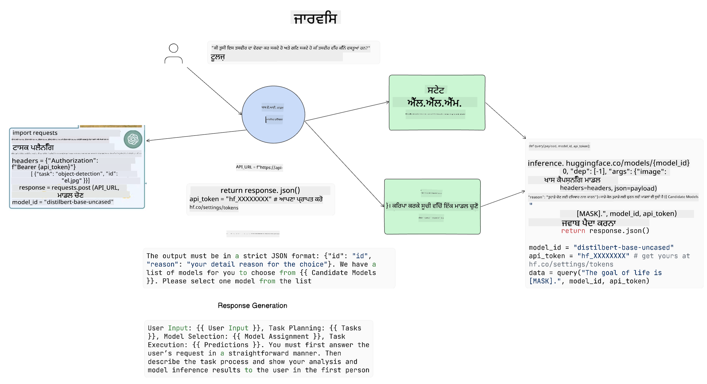

<!--
CO_OP_TRANSLATOR_METADATA:
{
  "original_hash": "11f03c81f190d9cbafd0f977dcbede6c",
  "translation_date": "2025-07-09T17:23:15+00:00",
  "source_file": "17-ai-agents/README.md",
  "language_code": "pa"
}
-->
[](https://aka.ms/gen-ai-lesson17-gh?WT.mc_id=academic-105485-koreyst)

## ਪਰਿਚਯ

AI ਏਜੰਟ ਜਨਰੇਟਿਵ AI ਵਿੱਚ ਇੱਕ ਰੋਮਾਂਚਕ ਵਿਕਾਸ ਦਾ ਪ੍ਰਤੀਕ ਹਨ, ਜੋ ਵੱਡੇ ਭਾਸ਼ਾ ਮਾਡਲਾਂ (LLMs) ਨੂੰ ਸਹਾਇਕਾਂ ਤੋਂ ਐਜੰਟਾਂ ਵਿੱਚ ਬਦਲਣ ਯੋਗ ਬਣਾਉਂਦੇ ਹਨ ਜੋ ਕਾਰਵਾਈਆਂ ਕਰ ਸਕਦੇ ਹਨ। AI ਏਜੰਟ ਫਰੇਮਵਰਕ ਵਿਕਾਸਕਾਰਾਂ ਨੂੰ ਐਪਲੀਕੇਸ਼ਨਾਂ ਬਣਾਉਣ ਦੀ ਆਗਿਆ ਦਿੰਦੇ ਹਨ ਜੋ LLMs ਨੂੰ ਟੂਲਾਂ ਅਤੇ ਸਥਿਤੀ ਪ੍ਰਬੰਧਨ ਤੱਕ ਪਹੁੰਚ ਦਿੰਦੇ ਹਨ। ਇਹ ਫਰੇਮਵਰਕ ਦਿੱਖ ਨੂੰ ਵੀ ਵਧਾਉਂਦੇ ਹਨ, ਜਿਸ ਨਾਲ ਉਪਭੋਗਤਾ ਅਤੇ ਵਿਕਾਸਕਾਰ LLMs ਵੱਲੋਂ ਯੋਜਿਤ ਕਾਰਵਾਈਆਂ ਦੀ ਨਿਗਰਾਨੀ ਕਰ ਸਕਦੇ ਹਨ, ਇਸ ਤਰ੍ਹਾਂ ਅਨੁਭਵ ਪ੍ਰਬੰਧਨ ਵਿੱਚ ਸੁਧਾਰ ਹੁੰਦਾ ਹੈ।

ਇਸ ਪਾਠ ਵਿੱਚ ਹੇਠ ਲਿਖੇ ਖੇਤਰਾਂ ਨੂੰ ਕਵਰ ਕੀਤਾ ਜਾਵੇਗਾ:

- AI ਏਜੰਟ ਕੀ ਹੁੰਦਾ ਹੈ - AI ਏਜੰਟ ਅਸਲ ਵਿੱਚ ਕੀ ਹੈ?
- ਚਾਰ ਵੱਖ-ਵੱਖ AI ਏਜੰਟ ਫਰੇਮਵਰਕਾਂ ਦੀ ਜਾਂਚ - ਇਹਨਾਂ ਨੂੰ ਵਿਲੱਖਣ ਕੀ ਬਣਾਉਂਦਾ ਹੈ?
- ਵੱਖ-ਵੱਖ ਵਰਤੋਂ ਦੇ ਕੇਸਾਂ ਵਿੱਚ ਇਹ AI ਏਜੰਟ ਕਿਵੇਂ ਲਾਗੂ ਕੀਤੇ ਜਾਂਦੇ ਹਨ - ਅਸੀਂ ਕਦੋਂ AI ਏਜੰਟ ਵਰਤਣੇ ਚਾਹੀਦੇ ਹਾਂ?

## ਸਿੱਖਣ ਦੇ ਲਕੜ

ਇਸ ਪਾਠ ਨੂੰ ਲੈਣ ਤੋਂ ਬਾਅਦ, ਤੁਸੀਂ ਸਮਰੱਥ ਹੋਵੋਗੇ:

- ਸਮਝਾਉਣਾ ਕਿ AI ਏਜੰਟ ਕੀ ਹਨ ਅਤੇ ਇਹ ਕਿਵੇਂ ਵਰਤੇ ਜਾ ਸਕਦੇ ਹਨ।
- ਕੁਝ ਪ੍ਰਸਿੱਧ AI ਏਜੰਟ ਫਰੇਮਵਰਕਾਂ ਵਿੱਚ ਅੰਤਰਾਂ ਦੀ ਸਮਝ ਰੱਖਣਾ ਅਤੇ ਇਹ ਕਿਵੇਂ ਵੱਖਰੇ ਹਨ।
- ਸਮਝਣਾ ਕਿ AI ਏਜੰਟ ਕਿਵੇਂ ਕੰਮ ਕਰਦੇ ਹਨ ਤਾਂ ਜੋ ਤੁਸੀਂ ਉਨ੍ਹਾਂ ਨਾਲ ਐਪਲੀਕੇਸ਼ਨ ਬਣਾ ਸਕੋ।

## AI ਏਜੰਟ ਕੀ ਹਨ?

AI ਏਜੰਟ ਜਨਰੇਟਿਵ AI ਦੀ ਦੁਨੀਆ ਵਿੱਚ ਬਹੁਤ ਹੀ ਰੋਮਾਂਚਕ ਖੇਤਰ ਹਨ। ਇਸ ਰੋਮਾਂਚ ਨਾਲ ਕਈ ਵਾਰੀ ਸ਼ਬਦਾਂ ਅਤੇ ਉਨ੍ਹਾਂ ਦੀ ਵਰਤੋਂ ਨੂੰ ਲੈ ਕੇ ਗੁੰਝਲ ਹੋ ਜਾਂਦੀ ਹੈ। ਸਧਾਰਨ ਅਤੇ ਜ਼ਿਆਦਾਤਰ ਟੂਲਾਂ ਨੂੰ ਸ਼ਾਮਲ ਕਰਨ ਲਈ ਜੋ AI ਏਜੰਟਾਂ ਨੂੰ ਦਰਸਾਉਂਦੇ ਹਨ, ਅਸੀਂ ਇਹ ਪਰਿਭਾਸ਼ਾ ਵਰਤਾਂਗੇ:

AI ਏਜੰਟ ਵੱਡੇ ਭਾਸ਼ਾ ਮਾਡਲਾਂ (LLMs) ਨੂੰ **ਸਥਿਤੀ** ਅਤੇ **ਟੂਲਾਂ** ਤੱਕ ਪਹੁੰਚ ਦੇ ਕੇ ਕੰਮ ਕਰਨ ਯੋਗ ਬਣਾਉਂਦੇ ਹਨ।


ਆਓ ਇਹ ਸ਼ਬਦ ਪਰਿਭਾਸ਼ਿਤ ਕਰੀਏ:

**ਵੱਡੇ ਭਾਸ਼ਾ ਮਾਡਲ** - ਇਹ ਉਹ ਮਾਡਲ ਹਨ ਜਿਨ੍ਹਾਂ ਦਾ ਇਸ ਕੋਰਸ ਵਿੱਚ ਜ਼ਿਕਰ ਕੀਤਾ ਗਿਆ ਹੈ ਜਿਵੇਂ GPT-3.5, GPT-4, Llama-2 ਆਦਿ।

**ਸਥਿਤੀ** - ਇਹ ਉਸ ਸੰਦਰਭ ਨੂੰ ਦਰਸਾਉਂਦਾ ਹੈ ਜਿਸ ਵਿੱਚ LLM ਕੰਮ ਕਰ ਰਿਹਾ ਹੈ। LLM ਆਪਣੇ ਪਿਛਲੇ ਕਾਰਜਾਂ ਅਤੇ ਮੌਜੂਦਾ ਸੰਦਰਭ ਨੂੰ ਵਰਤਦਾ ਹੈ, ਜੋ ਅਗਲੇ ਕਾਰਜਾਂ ਲਈ ਫੈਸਲੇ ਕਰਨ ਵਿੱਚ ਮਦਦ ਕਰਦਾ ਹੈ। AI ਏਜੰਟ ਫਰੇਮਵਰਕ ਵਿਕਾਸਕਾਰਾਂ ਨੂੰ ਇਸ ਸੰਦਰਭ ਨੂੰ ਆਸਾਨੀ ਨਾਲ ਸੰਭਾਲਣ ਦੀ ਆਗਿਆ ਦਿੰਦੇ ਹਨ।

**ਟੂਲਾਂ** - ਉਪਭੋਗਤਾ ਵੱਲੋਂ ਮੰਗੇ ਗਏ ਕੰਮ ਨੂੰ ਪੂਰਾ ਕਰਨ ਲਈ ਅਤੇ ਜੋ LLM ਨੇ ਯੋਜਨਾ ਬਣਾਈ ਹੈ, ਉਸ ਲਈ LLM ਨੂੰ ਟੂਲਾਂ ਦੀ ਲੋੜ ਹੁੰਦੀ ਹੈ। ਟੂਲਾਂ ਦੇ ਕੁਝ ਉਦਾਹਰਨ ਹਨ ਡੇਟਾਬੇਸ, API, ਬਾਹਰੀ ਐਪਲੀਕੇਸ਼ਨ ਜਾਂ ਹੋਰ ਕੋਈ LLM ਵੀ!

ਇਹ ਪਰਿਭਾਸ਼ਾਵਾਂ ਤੁਹਾਨੂੰ ਅੱਗੇ ਵਧਣ ਲਈ ਇੱਕ ਮਜ਼ਬੂਤ ਬੁਨਿਆਦ ਦੇਣਗੀਆਂ ਜਦੋਂ ਅਸੀਂ ਵੇਖਾਂਗੇ ਕਿ ਇਹ ਕਿਵੇਂ ਲਾਗੂ ਕੀਤੇ ਜਾਂਦੇ ਹਨ। ਆਓ ਕੁਝ ਵੱਖ-ਵੱਖ AI ਏਜੰਟ ਫਰੇਮਵਰਕਾਂ ਦੀ ਜਾਂਚ ਕਰੀਏ:

## LangChain Agents

[LangChain Agents](https://python.langchain.com/docs/how_to/#agents?WT.mc_id=academic-105485-koreyst) ਉਪਰ ਦਿੱਤੀਆਂ ਪਰਿਭਾਸ਼ਾਵਾਂ ਦੀ ਇੱਕ ਲਾਗੂਆਤ ਹੈ।

**ਸਥਿਤੀ** ਨੂੰ ਸੰਭਾਲਣ ਲਈ, ਇਹ ਇੱਕ ਬਿਲਟ-ਇਨ ਫੰਕਸ਼ਨ `AgentExecutor` ਵਰਤਦਾ ਹੈ। ਇਹ ਪਰਿਭਾਸ਼ਿਤ `agent` ਅਤੇ ਉਪਲਬਧ `tools` ਨੂੰ ਸਵੀਕਾਰ ਕਰਦਾ ਹੈ।

`Agent Executor` ਗੱਲਬਾਤ ਦਾ ਇਤਿਹਾਸ ਵੀ ਸਟੋਰ ਕਰਦਾ ਹੈ ਤਾਂ ਜੋ ਗੱਲਬਾਤ ਦਾ ਸੰਦਰਭ ਪ੍ਰਦਾਨ ਕੀਤਾ ਜਾ ਸਕੇ।


LangChain ਇੱਕ [ਟੂਲਾਂ ਦੀ ਕੈਟਾਲੌਗ](https://integrations.langchain.com/tools?WT.mc_id=academic-105485-koreyst) ਪ੍ਰਦਾਨ ਕਰਦਾ ਹੈ ਜੋ ਤੁਹਾਡੇ ਐਪਲੀਕੇਸ਼ਨ ਵਿੱਚ ਆਯਾਤ ਕੀਤੇ ਜਾ ਸਕਦੇ ਹਨ ਜਿੱਥੇ LLM ਨੂੰ ਪਹੁੰਚ ਮਿਲਦੀ ਹੈ। ਇਹ ਟੂਲ ਕਮਿਊਨਿਟੀ ਅਤੇ LangChain ਟੀਮ ਵੱਲੋਂ ਬਣਾਏ ਜਾਂਦੇ ਹਨ।

ਤੁਸੀਂ ਫਿਰ ਇਹ ਟੂਲ ਪਰਿਭਾਸ਼ਿਤ ਕਰਕੇ `Agent Executor` ਨੂੰ ਦੇ ਸਕਦੇ ਹੋ।

ਦਿੱਖ AI ਏਜੰਟਾਂ ਬਾਰੇ ਗੱਲ ਕਰਦਿਆਂ ਇੱਕ ਹੋਰ ਮਹੱਤਵਪੂਰਨ ਪੱਖ ਹੈ। ਇਹ ਜਰੂਰੀ ਹੈ ਕਿ ਐਪਲੀਕੇਸ਼ਨ ਵਿਕਾਸਕਾਰ ਸਮਝਣ ਕਿ LLM ਕਿਹੜਾ ਟੂਲ ਵਰਤ ਰਿਹਾ ਹੈ ਅਤੇ ਕਿਉਂ। ਇਸ ਲਈ LangChain ਦੀ ਟੀਮ ਨੇ LangSmith ਵਿਕਸਿਤ ਕੀਤਾ ਹੈ।

## AutoGen

ਅਗਲਾ AI ਏਜੰਟ ਫਰੇਮਵਰਕ ਜਿਸ ਬਾਰੇ ਅਸੀਂ ਗੱਲ ਕਰਾਂਗੇ ਉਹ ਹੈ [AutoGen](https://microsoft.github.io/autogen/?WT.mc_id=academic-105485-koreyst)। AutoGen ਦਾ ਮੁੱਖ ਧਿਆਨ ਗੱਲਬਾਤਾਂ 'ਤੇ ਹੈ। ਏਜੰਟ ਦੋਹਾਂ **ਗੱਲਬਾਤਯੋਗ** ਅਤੇ **ਕਸਟਮਾਈਜ਼ੇਬਲ** ਹੁੰਦੇ ਹਨ।

**ਗੱਲਬਾਤਯੋਗ -** LLMs ਕਿਸੇ ਹੋਰ LLM ਨਾਲ ਗੱਲਬਾਤ ਸ਼ੁਰੂ ਅਤੇ ਜਾਰੀ ਰੱਖ ਸਕਦੇ ਹਨ ਤਾਂ ਜੋ ਕੰਮ ਪੂਰਾ ਕੀਤਾ ਜਾ ਸਕੇ। ਇਹ `AssistantAgents` ਬਣਾਕੇ ਅਤੇ ਉਨ੍ਹਾਂ ਨੂੰ ਇੱਕ ਖਾਸ ਸਿਸਟਮ ਸੁਨੇਹਾ ਦੇ ਕੇ ਕੀਤਾ ਜਾਂਦਾ ਹੈ।

```python

autogen.AssistantAgent( name="Coder", llm_config=llm_config, ) pm = autogen.AssistantAgent( name="Product_manager", system_message="Creative in software product ideas.", llm_config=llm_config, )

```

**ਕਸਟਮਾਈਜ਼ੇਬਲ** - ਏਜੰਟ ਸਿਰਫ LLMs ਵਜੋਂ ਹੀ ਨਹੀਂ, ਬਲਕਿ ਉਪਭੋਗਤਾ ਜਾਂ ਟੂਲ ਵਜੋਂ ਵੀ ਪਰਿਭਾਸ਼ਿਤ ਕੀਤੇ ਜਾ ਸਕਦੇ ਹਨ। ਇੱਕ ਵਿਕਾਸਕਾਰ ਵਜੋਂ, ਤੁਸੀਂ `UserProxyAgent` ਪਰਿਭਾਸ਼ਿਤ ਕਰ ਸਕਦੇ ਹੋ ਜੋ ਉਪਭੋਗਤਾ ਨਾਲ ਫੀਡਬੈਕ ਲਈ ਸੰਪਰਕ ਕਰਦਾ ਹੈ ਤਾਂ ਜੋ ਕੰਮ ਪੂਰਾ ਕਰਨ ਵਿੱਚ ਮਦਦ ਮਿਲੇ। ਇਹ ਫੀਡਬੈਕ ਕੰਮ ਨੂੰ ਜਾਰੀ ਰੱਖਣ ਜਾਂ ਰੋਕਣ ਲਈ ਹੋ ਸਕਦਾ ਹੈ।

```python
user_proxy = UserProxyAgent(name="user_proxy")
```

### ਸਥਿਤੀ ਅਤੇ ਟੂਲ

ਸਥਿਤੀ ਨੂੰ ਬਦਲਣ ਅਤੇ ਸੰਭਾਲਣ ਲਈ, ਇੱਕ ਸਹਾਇਕ ਏਜੰਟ ਕੰਮ ਪੂਰਾ ਕਰਨ ਲਈ Python ਕੋਡ ਬਣਾਉਂਦਾ ਹੈ।

ਇਹ ਪ੍ਰਕਿਰਿਆ ਦਾ ਇੱਕ ਉਦਾਹਰਨ ਹੈ:


#### LLM ਨੂੰ ਸਿਸਟਮ ਸੁਨੇਹੇ ਨਾਲ ਪਰਿਭਾਸ਼ਿਤ ਕੀਤਾ ਗਿਆ

```python
system_message="For weather related tasks, only use the functions you have been provided with. Reply TERMINATE when the task is done."
```

ਇਹ ਸਿਸਟਮ ਸੁਨੇਹਾ ਇਸ ਖਾਸ LLM ਨੂੰ ਦਿਸ਼ਾ ਦਿੰਦਾ ਹੈ ਕਿ ਕਿਹੜੇ ਫੰਕਸ਼ਨ ਉਸਦੇ ਕੰਮ ਲਈ ਸਬੰਧਤ ਹਨ। ਯਾਦ ਰੱਖੋ, AutoGen ਨਾਲ ਤੁਸੀਂ ਵੱਖ-ਵੱਖ ਸਿਸਟਮ ਸੁਨੇਹਿਆਂ ਵਾਲੇ ਕਈ AssistantAgents ਪਰਿਭਾਸ਼ਿਤ ਕਰ ਸਕਦੇ ਹੋ।

#### ਗੱਲਬਾਤ ਉਪਭੋਗਤਾ ਵੱਲੋਂ ਸ਼ੁਰੂ ਕੀਤੀ ਜਾਂਦੀ ਹੈ

```python
user_proxy.initiate_chat( chatbot, message="I am planning a trip to NYC next week, can you help me pick out what to wear? ", )

```

ਉਪਭੋਗਤਾ_proxy (ਮਨੁੱਖ) ਵੱਲੋਂ ਇਹ ਸੁਨੇਹਾ ਏਜੰਟ ਨੂੰ ਸੰਭਾਵਿਤ ਫੰਕਸ਼ਨਾਂ ਦੀ ਜਾਂਚ ਸ਼ੁਰੂ ਕਰਨ ਲਈ ਪ੍ਰੇਰਿਤ ਕਰਦਾ ਹੈ ਜੋ ਉਸਨੂੰ ਚਲਾਉਣੇ ਚਾਹੀਦੇ ਹਨ।

#### ਫੰਕਸ਼ਨ ਚਲਾਇਆ ਜਾਂਦਾ ਹੈ

```bash
chatbot (to user_proxy):

***** Suggested tool Call: get_weather ***** Arguments: {"location":"New York City, NY","time_periond:"7","temperature_unit":"Celsius"} ******************************************************** --------------------------------------------------------------------------------

>>>>>>>> EXECUTING FUNCTION get_weather... user_proxy (to chatbot): ***** Response from calling function "get_weather" ***** 112.22727272727272 EUR ****************************************************************

```

ਜਦੋਂ ਸ਼ੁਰੂਆਤੀ ਗੱਲਬਾਤ ਪ੍ਰਕਿਰਿਆ ਵਿੱਚ ਆ ਜਾਂਦੀ ਹੈ, ਤਾਂ ਏਜੰਟ ਸਿਫਾਰਸ਼ੀ ਟੂਲ ਨੂੰ ਕਾਲ ਕਰਦਾ ਹੈ। ਇਸ ਮਾਮਲੇ ਵਿੱਚ, ਇਹ `get_weather` ਨਾਮਕ ਫੰਕਸ਼ਨ ਹੈ। ਤੁਹਾਡੇ ਸੰਰਚਨਾ ਅਨੁਸਾਰ, ਇਹ ਫੰਕਸ਼ਨ ਆਪਣੇ ਆਪ ਚਲਾਇਆ ਜਾ ਸਕਦਾ ਹੈ ਜਾਂ ਉਪਭੋਗਤਾ ਦੀ ਇਨਪੁੱਟ 'ਤੇ ਚਲਾਇਆ ਜਾ ਸਕਦਾ ਹੈ।

ਤੁਸੀਂ [AutoGen ਕੋਡ ਨਮੂਨੇ](https://microsoft.github.io/autogen/docs/Examples/?WT.mc_id=academic-105485-koreyst) ਦੀ ਸੂਚੀ ਵੇਖ ਸਕਦੇ ਹੋ ਤਾਂ ਜੋ ਬਿਲਡਿੰਗ ਸ਼ੁਰੂ ਕਰਨ ਬਾਰੇ ਹੋਰ ਜਾਣਕਾਰੀ ਮਿਲੇ।

## Taskweaver

ਅਗਲਾ ਏਜੰਟ ਫਰੇਮਵਰਕ ਜੋ ਅਸੀਂ ਵੇਖਾਂਗੇ ਉਹ ਹੈ [Taskweaver](https://microsoft.github.io/TaskWeaver/?WT.mc_id=academic-105485-koreyst)। ਇਸਨੂੰ "ਕੋਡ-ਪਹਿਲਾਂ" ਏਜੰਟ ਕਿਹਾ ਜਾਂਦਾ ਹੈ ਕਿਉਂਕਿ ਇਹ ਸਿਰਫ `strings` ਨਾਲ ਕੰਮ ਕਰਨ ਦੀ ਬਜਾਏ Python ਵਿੱਚ DataFrames ਨਾਲ ਕੰਮ ਕਰ ਸਕਦਾ ਹੈ। ਇਹ ਡੇਟਾ ਵਿਸ਼ਲੇਸ਼ਣ ਅਤੇ ਜਨਰੇਸ਼ਨ ਕੰਮਾਂ ਲਈ ਬਹੁਤ ਲਾਭਦਾਇਕ ਹੈ। ਇਹ ਗ੍ਰਾਫ ਅਤੇ ਚਾਰਟ ਬਣਾਉਣ ਜਾਂ ਯਾਦ੍ਰਚਛਿਕ ਨੰਬਰ ਬਣਾਉਣ ਵਰਗੇ ਕੰਮ ਹੋ ਸਕਦੇ ਹਨ।

### ਸਥਿਤੀ ਅਤੇ ਟੂਲ

ਗੱਲਬਾਤ ਦੀ ਸਥਿਤੀ ਨੂੰ ਸੰਭਾਲਣ ਲਈ, TaskWeaver `Planner` ਦੀ ਸੰਕਲਪਨਾ ਵਰਤਦਾ ਹੈ। `Planner` ਇੱਕ LLM ਹੈ ਜੋ ਉਪਭੋਗਤਾਵਾਂ ਤੋਂ ਬੇਨਤੀ ਲੈਂਦਾ ਹੈ ਅਤੇ ਉਹ ਕੰਮ ਨਕਸ਼ਾ ਬਣਾਉਂਦਾ ਹੈ ਜੋ ਇਸ ਬੇਨਤੀ ਨੂੰ ਪੂਰਾ ਕਰਨ ਲਈ ਕਰਨੇ ਲਾਜ਼ਮੀ ਹਨ।

ਕੰਮ ਪੂਰੇ ਕਰਨ ਲਈ `Planner` ਨੂੰ `Plugins` ਨਾਮਕ ਟੂਲਾਂ ਦੇ ਸੰਗ੍ਰਹਿ ਤੱਕ ਪਹੁੰਚ ਦਿੱਤੀ ਜਾਂਦੀ ਹੈ। ਇਹ Python ਕਲਾਸਾਂ ਜਾਂ ਆਮ ਕੋਡ ਇੰਟਰਪ੍ਰੀਟਰ ਹੋ ਸਕਦੇ ਹਨ। ਇਹ ਪਲੱਗਇਨ ਐਮਬੈਡਿੰਗਜ਼ ਵਜੋਂ ਸਟੋਰ ਕੀਤੇ ਜਾਂਦੇ ਹਨ ਤਾਂ ਜੋ LLM ਸਹੀ ਪਲੱਗਇਨ ਨੂੰ ਬਿਹਤਰ ਤਰੀਕੇ ਨਾਲ ਖੋਜ ਸਕੇ।


ਇੱਥੇ ਇੱਕ ਪਲੱਗਇਨ ਦਾ ਉਦਾਹਰਨ ਹੈ ਜੋ ਅਸਧਾਰਣਤਾ ਪਛਾਣ ਨੂੰ ਸੰਭਾਲਦਾ ਹੈ:

```python
class AnomalyDetectionPlugin(Plugin): def __call__(self, df: pd.DataFrame, time_col_name: str, value_col_name: str):
```

ਕੋਡ ਚਲਾਉਣ ਤੋਂ ਪਹਿਲਾਂ ਜਾਂਚਿਆ ਜਾਂਦਾ ਹੈ। Taskweaver ਵਿੱਚ ਸੰਦਰਭ ਪ੍ਰਬੰਧਨ ਲਈ ਇੱਕ ਹੋਰ ਵਿਸ਼ੇਸ਼ਤਾ `experience` ਹੈ। ਅਨੁਭਵ ਗੱਲਬਾਤ ਦੇ ਸੰਦਰਭ ਨੂੰ YAML ਫਾਇਲ ਵਿੱਚ ਲੰਬੇ ਸਮੇਂ ਲਈ ਸਟੋਰ ਕਰਨ ਦੀ ਆਗਿਆ ਦਿੰਦਾ ਹੈ। ਇਸਨੂੰ ਇਸ ਤਰ੍ਹਾਂ ਸੰਰਚਿਤ ਕੀਤਾ ਜਾ ਸਕਦਾ ਹੈ ਕਿ LLM ਸਮੇਂ ਦੇ ਨਾਲ ਕੁਝ ਕੰਮਾਂ 'ਤੇ ਸੁਧਾਰ ਕਰਦਾ ਰਹੇ ਜਦੋਂ ਕਿ ਉਹ ਪਿਛਲੇ ਗੱਲਬਾਤਾਂ ਨੂੰ ਵੇਖਦਾ ਰਹੇ।

## JARVIS

ਆਖਰੀ ਏਜੰਟ ਫਰੇਮਵਰਕ ਜੋ ਅਸੀਂ ਵੇਖਾਂਗੇ ਉਹ ਹੈ [JARVIS](https://github.com/microsoft/JARVIS?tab=readme-ov-file?WT.mc_id=academic-105485-koreyst)। JARVIS ਨੂੰ ਵਿਲੱਖਣ ਬਣਾਉਂਦਾ ਹੈ ਕਿ ਇਹ ਗੱਲਬਾਤ ਦੀ `ਸਥਿਤੀ` ਨੂੰ ਸੰਭਾਲਣ ਲਈ ਇੱਕ LLM ਵਰਤਦਾ ਹੈ ਅਤੇ `ਟੂਲ` ਹੋਰ AI ਮਾਡਲ ਹਨ। ਹਰ AI ਮਾਡਲ ਖਾਸ ਤੌਰ 'ਤੇ ਕੁਝ ਕੰਮ ਕਰਨ ਲਈ ਤਿਆਰ ਕੀਤਾ ਗਿਆ ਹੈ ਜਿਵੇਂ ਕਿ ਵਸਤੂ ਪਛਾਣ, ਟ੍ਰਾਂਸਕ੍ਰਿਪਸ਼ਨ ਜਾਂ ਚਿੱਤਰ ਸਿਰਲੇਖ ਬਣਾਉਣਾ।



LLM, ਜੋ ਇੱਕ ਜਨਰਲ ਪਰਪਜ਼ ਮਾਡਲ ਹੈ, ਉਪਭੋਗਤਾ ਤੋਂ ਬੇਨਤੀ ਪ੍ਰਾਪਤ ਕਰਦਾ ਹੈ ਅਤੇ ਖਾਸ ਕੰਮ ਅਤੇ ਜਰੂਰੀ ਦਲੀਲਾਂ/ਡੇਟਾ ਦੀ ਪਛਾਣ ਕਰਦਾ ਹੈ।

```python
[{"task": "object-detection", "id": 0, "dep": [-1], "args": {"image": "e1.jpg" }}]
```

ਫਿਰ LLM ਬੇਨਤੀ ਨੂੰ ਇਸ ਤਰੀਕੇ ਨਾਲ ਫਾਰਮੈਟ ਕਰਦਾ ਹੈ ਜੋ ਖਾਸ AI ਮਾਡਲ ਸਮਝ ਸਕੇ, ਜਿਵੇਂ JSON। ਜਦੋਂ AI ਮਾਡਲ ਆਪਣੇ ਅਨੁਮਾਨ ਵਾਪਸ ਕਰਦਾ ਹੈ, ਤਾਂ LLM ਜਵਾਬ ਪ੍ਰਾਪਤ ਕਰਦਾ ਹੈ।

ਜੇ ਕੰਮ ਪੂਰਾ ਕਰਨ ਲਈ ਕਈ ਮਾਡਲਾਂ ਦੀ ਲੋੜ ਹੋਵੇ, ਤਾਂ ਇਹ ਮਾਡਲਾਂ ਤੋਂ ਪ੍ਰਾਪਤ ਜਵਾਬਾਂ ਨੂੰ ਵੀ ਸਮਝਦਾ ਹੈ ਅਤੇ ਫਿਰ ਉਨ੍ਹਾਂ ਨੂੰ ਮਿਲਾ ਕੇ ਉਪਭੋਗਤਾ ਨੂੰ ਜਵਾਬ ਤਿਆਰ ਕਰਦਾ ਹੈ।

ਹੇਠਾਂ ਦਿੱਤਾ ਉਦਾਹਰਨ ਦਿਖਾਉਂਦਾ ਹੈ ਕਿ ਜਦੋਂ ਉਪਭੋਗਤਾ ਇੱਕ ਤਸਵੀਰ ਵਿੱਚ ਵਸਤੂਆਂ ਦਾ ਵਰਣਨ ਅਤੇ ਗਿਣਤੀ ਮੰਗਦਾ ਹੈ ਤਾਂ ਇਹ ਕਿਵੇਂ ਕੰਮ ਕਰੇਗਾ:

## ਅਸਾਈਨਮੈਂਟ

AI ਏਜੰਟਾਂ ਦੀ ਆਪਣੀ ਸਿੱਖਿਆ ਜਾਰੀ ਰੱਖਣ ਲਈ ਤੁਸੀਂ AutoGen ਨਾਲ ਇਹ ਬਣਾ ਸਕਦੇ ਹੋ:

- ਇੱਕ ਐਪਲੀਕੇਸ਼ਨ ਜੋ ਇੱਕ ਸਿੱਖਿਆ ਸਟਾਰਟਅਪ ਦੇ ਵੱਖ-ਵੱਖ ਵਿਭਾਗਾਂ ਨਾਲ ਕਾਰੋਬਾਰੀ ਮੀਟਿੰਗ ਦਾ ਸਿਮੂਲੇਸ਼ਨ ਕਰਦਾ ਹੈ।
- ਸਿਸਟਮ ਸੁਨੇਹੇ ਬਣਾਓ ਜੋ LLMs ਨੂੰ ਵੱਖ-ਵੱਖ ਪਾਤਰਾਂ ਅਤੇ ਤਰਜੀਹਾਂ ਨੂੰ ਸਮਝਣ ਵਿੱਚ ਮਦਦ ਕਰਦੇ ਹਨ, ਅਤੇ ਉਪਭੋਗਤਾ ਨੂੰ ਨਵੀਂ ਉਤਪਾਦ ਵਿਚਾਰ ਪੇਸ਼ ਕਰਨ ਯੋਗ ਬਣਾਉਂਦੇ ਹਨ।
- ਫਿਰ LLM ਹਰ ਵਿਭਾਗ ਵੱਲੋਂ ਫਾਲੋ-ਅਪ ਸਵਾਲ ਤਿਆਰ ਕਰੇ ਤਾਂ ਜੋ ਪਿਚ ਅਤੇ ਉਤਪਾਦ ਵਿਚਾਰ ਨੂੰ ਸੁਧਾਰਿਆ ਜਾ ਸਕੇ।

## ਸਿੱਖਿਆ ਇੱਥੇ ਨਹੀਂ ਰੁਕਦੀ, ਯਾਤਰਾ ਜਾਰੀ ਰੱਖੋ

ਇਸ ਪਾਠ ਨੂੰ ਪੂਰਾ ਕਰਨ ਤੋਂ ਬਾਅਦ, ਸਾਡੇ [Generative AI Learning collection](https://aka.ms/genai-collection?WT.mc_id=academic-105485-koreyst) ਨੂੰ ਵੇਖੋ ਤਾਂ ਜੋ ਆਪਣੀ Generative AI ਦੀ ਜਾਣਕਾਰੀ ਨੂੰ ਹੋਰ ਉੱਚਾ ਕੀਤਾ ਜਾ ਸਕੇ!

**ਅਸਵੀਕਾਰੋਪਣ**:  
ਇਹ ਦਸਤਾਵੇਜ਼ AI ਅਨੁਵਾਦ ਸੇਵਾ [Co-op Translator](https://github.com/Azure/co-op-translator) ਦੀ ਵਰਤੋਂ ਕਰਕੇ ਅਨੁਵਾਦਿਤ ਕੀਤਾ ਗਿਆ ਹੈ। ਜਦੋਂ ਕਿ ਅਸੀਂ ਸਹੀਤਾ ਲਈ ਕੋਸ਼ਿਸ਼ ਕਰਦੇ ਹਾਂ, ਕਿਰਪਾ ਕਰਕੇ ਧਿਆਨ ਰੱਖੋ ਕਿ ਸਵੈਚਾਲਿਤ ਅਨੁਵਾਦਾਂ ਵਿੱਚ ਗਲਤੀਆਂ ਜਾਂ ਅਸਮਰਥਤਾਵਾਂ ਹੋ ਸਕਦੀਆਂ ਹਨ। ਮੂਲ ਦਸਤਾਵੇਜ਼ ਆਪਣੀ ਮੂਲ ਭਾਸ਼ਾ ਵਿੱਚ ਪ੍ਰਮਾਣਿਕ ਸਰੋਤ ਮੰਨਿਆ ਜਾਣਾ ਚਾਹੀਦਾ ਹੈ। ਮਹੱਤਵਪੂਰਨ ਜਾਣਕਾਰੀ ਲਈ, ਪੇਸ਼ੇਵਰ ਮਨੁੱਖੀ ਅਨੁਵਾਦ ਦੀ ਸਿਫਾਰਸ਼ ਕੀਤੀ ਜਾਂਦੀ ਹੈ। ਅਸੀਂ ਇਸ ਅਨੁਵਾਦ ਦੀ ਵਰਤੋਂ ਤੋਂ ਉਤਪੰਨ ਕਿਸੇ ਵੀ ਗਲਤਫਹਮੀ ਜਾਂ ਗਲਤ ਵਿਆਖਿਆ ਲਈ ਜ਼ਿੰਮੇਵਾਰ ਨਹੀਂ ਹਾਂ।