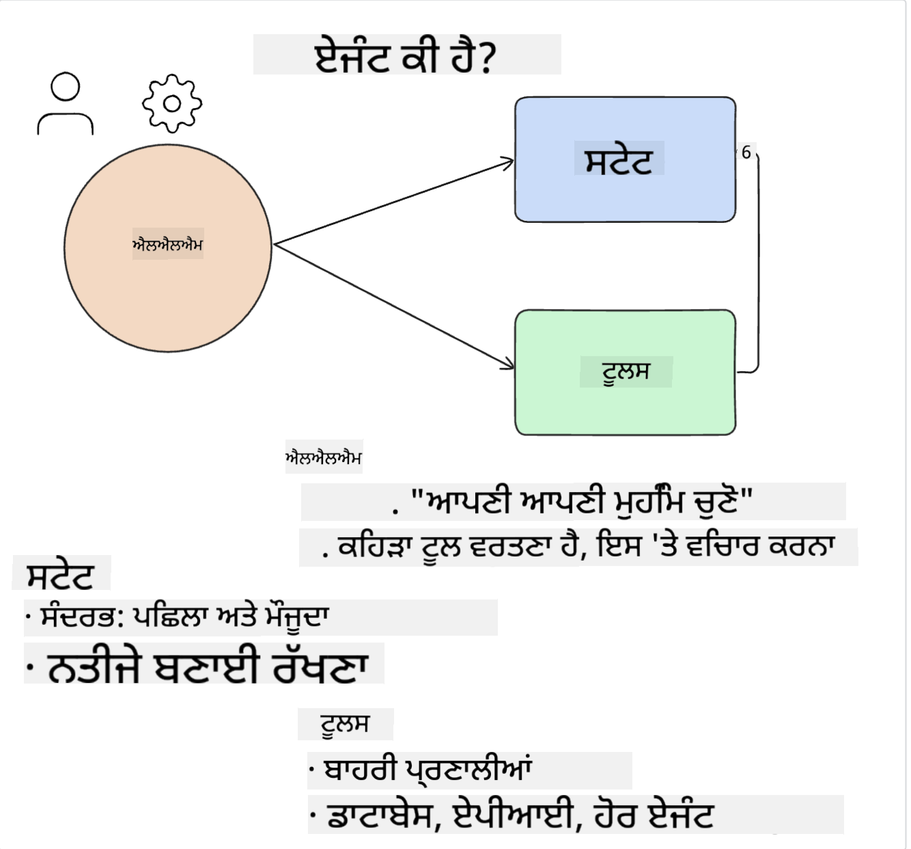
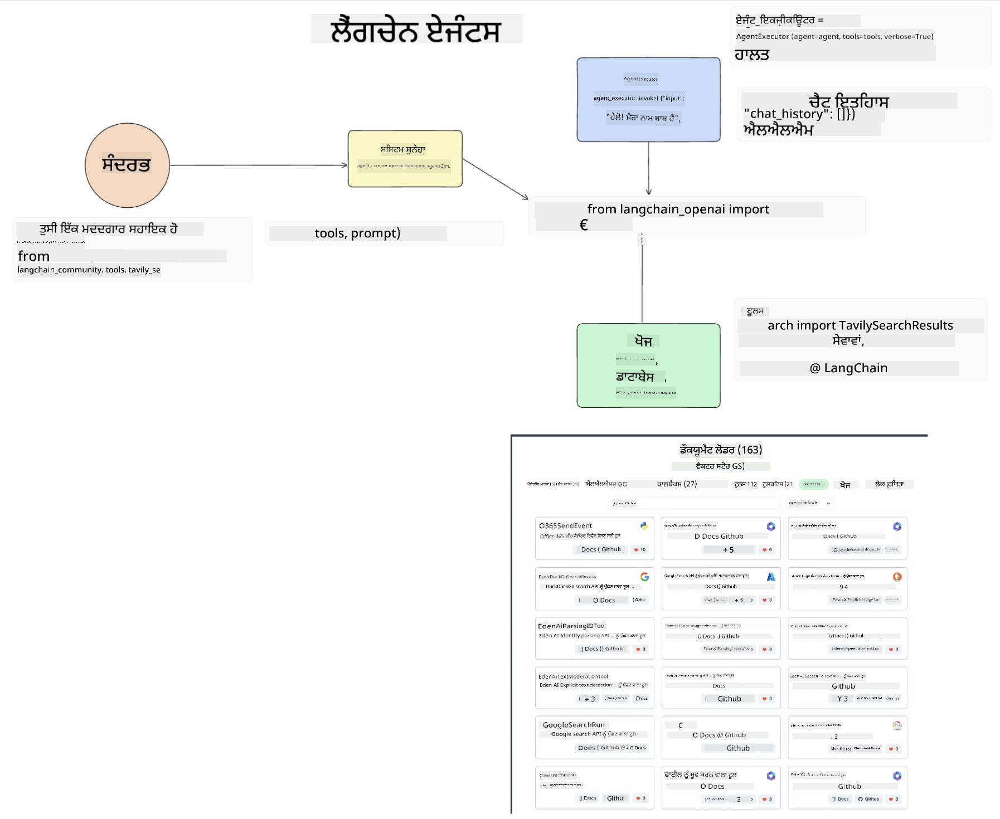
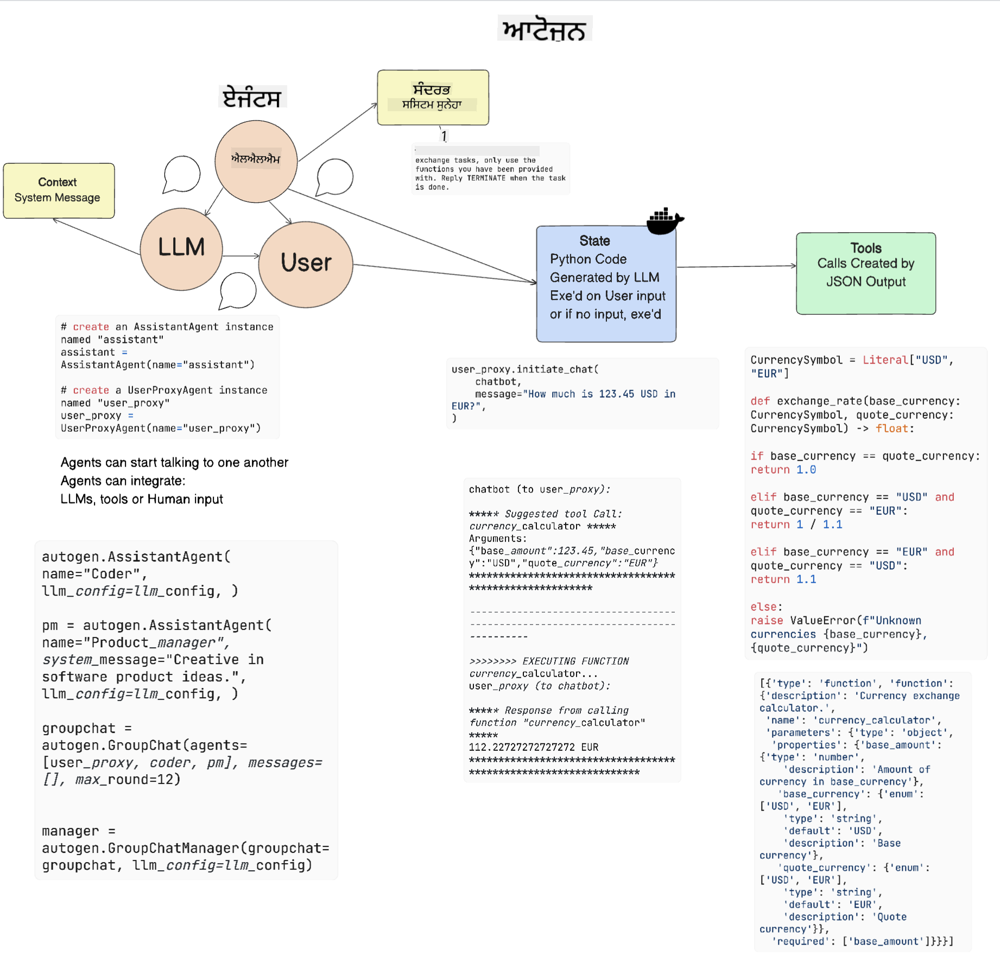

<!--
CO_OP_TRANSLATOR_METADATA:
{
  "original_hash": "8e8d1f6a63da606af7176a87ff8e92b6",
  "translation_date": "2025-10-17T14:21:04+00:00",
  "source_file": "17-ai-agents/README.md",
  "language_code": "pa"
}
-->
[](https://youtu.be/yAXVW-lUINc?si=bOtW9nL6jc3XJgOM)

## ਜਾਣ ਪਛਾਣ

AI Agents ਜਨਰੇਟਿਵ AI ਵਿੱਚ ਇੱਕ ਰੋਮਾਂਚਕ ਵਿਕਾਸ ਦਾ ਪ੍ਰਤੀਨਿਧਿਤਾ ਕਰਦੇ ਹਨ, ਜੋ ਵੱਡੇ ਭਾਸ਼ਾ ਮਾਡਲਾਂ (LLMs) ਨੂੰ ਸਹਾਇਕਾਂ ਤੋਂ ਕਾਰਵਾਈ ਕਰਨ ਦੇ ਯੋਗ ਏਜੰਟਾਂ ਵਿੱਚ ਵਿਕਸਿਤ ਕਰਨ ਦੀ ਯੋਗਤਾ ਦਿੰਦੇ ਹਨ। AI Agent ਫਰੇਮਵਰਕ ਡਿਵੈਲਪਰਾਂ ਨੂੰ ਐਪਲੀਕੇਸ਼ਨ ਬਣਾਉਣ ਦੀ ਯੋਗਤਾ ਦਿੰਦੇ ਹਨ ਜੋ LLMs ਨੂੰ ਟੂਲ ਅਤੇ ਸਟੇਟ ਮੈਨੇਜਮੈਂਟ ਤੱਕ ਪਹੁੰਚ ਦਿੰਦੇ ਹਨ। ਇਹ ਫਰੇਮਵਰਕ ਵਿਖੇ ਦ੍ਰਿਸ਼ਮਾਨਤਾ ਨੂੰ ਵੀ ਵਧਾਉਂਦੇ ਹਨ, ਜਿਸ ਨਾਲ ਉਪਭੋਗਤਿਆਂ ਅਤੇ ਡਿਵੈਲਪਰਾਂ ਨੂੰ LLMs ਦੁਆਰਾ ਯੋਜਿਤ ਕਾਰਵਾਈਆਂ ਦੀ ਨਿਗਰਾਨੀ ਕਰਨ ਦੀ ਯੋਗਤਾ ਮਿਲਦੀ ਹੈ, ਇਸ ਤਰ੍ਹਾਂ ਅਨੁਭਵ ਪ੍ਰਬੰਧਨ ਵਿੱਚ ਸੁਧਾਰ ਹੁੰਦਾ ਹੈ।

ਇਸ ਪਾਠ ਵਿੱਚ ਹੇਠਾਂ ਦਿੱਤੇ ਖੇਤਰ ਕਵਰ ਕੀਤੇ ਜਾਣਗੇ:

- ਸਮਝਣਾ ਕਿ AI Agent ਕੀ ਹੈ - AI Agent ਅਸਲ ਵਿੱਚ ਕੀ ਹੈ?
- ਚਾਰ ਵੱਖ-ਵੱਖ AI Agent ਫਰੇਮਵਰਕਾਂ ਦੀ ਖੋਜ - ਇਹਨਾਂ ਨੂੰ ਵਿਸ਼ੇਸ਼ ਕੀ ਬਣਾਉਂਦਾ ਹੈ?
- ਇਹ AI Agents ਨੂੰ ਵੱਖ-ਵੱਖ ਉਪਯੋਗ ਮਾਮਲਿਆਂ ਵਿੱਚ ਲਾਗੂ ਕਰਨਾ - ਸਾਨੂੰ AI Agents ਕਦੋਂ ਵਰਤਣੇ ਚਾਹੀਦੇ ਹਨ?

## ਸਿੱਖਣ ਦੇ ਲਕਸ਼

ਇਸ ਪਾਠ ਨੂੰ ਪੂਰਾ ਕਰਨ ਤੋਂ ਬਾਅਦ, ਤੁਸੀਂ ਇਹ ਕਰਨ ਦੇ ਯੋਗ ਹੋਵੋਗੇ:

- ਸਮਝਾਉਣਾ ਕਿ AI Agents ਕੀ ਹਨ ਅਤੇ ਇਹਨਾਂ ਨੂੰ ਕਿਵੇਂ ਵਰਤਿਆ ਜਾ ਸਕਦਾ ਹੈ।
- ਕੁਝ ਪ੍ਰਸਿੱਧ AI Agent ਫਰੇਮਵਰਕਾਂ ਦੇ ਅੰਤਰਾਂ ਦੀ ਸਮਝ ਹੋਵੇਗੀ ਅਤੇ ਇਹ ਕਿਵੇਂ ਵੱਖਰੇ ਹਨ।
- ਸਮਝਣਾ ਕਿ AI Agents ਕਿਵੇਂ ਕੰਮ ਕਰਦੇ ਹਨ ਤਾਂ ਜੋ ਇਹਨਾਂ ਨਾਲ ਐਪਲੀਕੇਸ਼ਨ ਬਣਾਈ ਜਾ ਸਕੇ।

## AI Agents ਕੀ ਹਨ?

AI Agents ਜਨਰੇਟਿਵ AI ਦੀ ਦੁਨੀਆ ਵਿੱਚ ਬਹੁਤ ਹੀ ਰੋਮਾਂਚਕ ਖੇਤਰ ਹਨ। ਇਸ ਰੋਮਾਂਚ ਨਾਲ ਕਈ ਵਾਰ ਸ਼ਬਦਾਂ ਅਤੇ ਇਹਨਾਂ ਦੇ ਅਰਥਾਂ ਦੀ ਉਲਝਣ ਵੀ ਹੁੰਦੀ ਹੈ। ਚੀਜ਼ਾਂ ਨੂੰ ਸਧਾਰਨ ਅਤੇ ਜ਼ਿਆਦਾਤਰ ਟੂਲਾਂ ਨੂੰ ਸ਼ਾਮਲ ਰੱਖਣ ਲਈ ਜੋ AI Agents ਦਾ ਹਵਾਲਾ ਦਿੰਦੇ ਹਨ, ਅਸੀਂ ਇਹ ਪਰਿਭਾਸ਼ਾ ਵਰਤਣ ਜਾ ਰਹੇ ਹਾਂ:

AI Agents ਵੱਡੇ ਭਾਸ਼ਾ ਮਾਡਲਾਂ (LLMs) ਨੂੰ **ਸਟੇਟ** ਅਤੇ **ਟੂਲ** ਤੱਕ ਪਹੁੰਚ ਦੇ ਕੇ ਕੰਮ ਕਰਨ ਦੀ ਯੋਗਤਾ ਦਿੰਦੇ ਹਨ।



ਆਓ ਇਹਨਾਂ ਸ਼ਬਦਾਂ ਨੂੰ ਪਰਿਭਾਸ਼ਿਤ ਕਰੀਏ:

**ਵੱਡੇ ਭਾਸ਼ਾ ਮਾਡਲ** - ਇਹ ਉਹ ਮਾਡਲ ਹਨ ਜਿਨ੍ਹਾਂ ਦਾ ਇਸ ਕੋਰਸ ਵਿੱਚ ਹਵਾਲਾ ਦਿੱਤਾ ਗਿਆ ਹੈ ਜਿਵੇਂ GPT-3.5, GPT-4, Llama-2 ਆਦਿ।

**ਸਟੇਟ** - ਇਹ ਸੰਦਰਭ ਨੂੰ ਦਰਸਾਉਂਦਾ ਹੈ ਜਿਸ ਵਿੱਚ LLM ਕੰਮ ਕਰ ਰਿਹਾ ਹੈ। LLM ਆਪਣੇ ਪਿਛਲੇ ਕਾਰਵਾਈਆਂ ਦੇ ਸੰਦਰਭ ਅਤੇ ਮੌਜੂਦਾ ਸੰਦਰਭ ਨੂੰ ਵਰਤਦਾ ਹੈ, ਜੋ ਇਸਦੇ ਅਗਲੇ ਕਾਰਵਾਈਆਂ ਲਈ ਫੈਸਲੇ ਲੈਣ ਵਿੱਚ ਮਦਦ ਕਰਦਾ ਹੈ। AI Agent ਫਰੇਮਵਰਕ ਡਿਵੈਲਪਰਾਂ ਨੂੰ ਇਹ ਸੰਦਰਭ ਆਸਾਨੀ ਨਾਲ ਬਣਾਈ ਰੱਖਣ ਦੀ ਯੋਗਤਾ ਦਿੰਦੇ ਹਨ।

**ਟੂਲ** - ਉਹ ਕੰਮ ਪੂਰਾ ਕਰਨ ਲਈ ਜੋ ਉਪਭੋਗਤਾ ਨੇ ਮੰਗਿਆ ਹੈ ਅਤੇ ਜੋ LLM ਨੇ ਯੋਜਿਤ ਕੀਤਾ ਹੈ, LLM ਨੂੰ ਟੂਲਾਂ ਤੱਕ ਪਹੁੰਚ ਦੀ ਜ਼ਰੂਰਤ ਹੁੰਦੀ ਹੈ। ਟੂਲਾਂ ਦੇ ਕੁਝ ਉਦਾਹਰਣ ਇੱਕ ਡਾਟਾਬੇਸ, ਇੱਕ API, ਇੱਕ ਬਾਹਰੀ ਐਪਲੀਕੇਸ਼ਨ ਜਾਂ ਇੱਥੇ ਤੱਕ ਕਿ ਇੱਕ ਹੋਰ LLM ਹੋ ਸਕਦੇ ਹਨ!

ਇਹ ਪਰਿਭਾਸ਼ਾਵਾਂ ਤੁਹਾਨੂੰ ਅੱਗੇ ਵਧਣ ਲਈ ਇੱਕ ਵਧੀਆ ਆਧਾਰ ਦੇਣਗੀਆਂ ਜਦੋਂ ਅਸੀਂ ਇਹ ਦੇਖਦੇ ਹਾਂ ਕਿ ਇਹਨਾਂ ਨੂੰ ਕਿਵੇਂ ਲਾਗੂ ਕੀਤਾ ਜਾਂਦਾ ਹੈ। ਆਓ ਕੁਝ ਵੱਖ-ਵੱਖ AI Agent ਫਰੇਮਵਰਕਾਂ ਦੀ ਖੋਜ ਕਰੀਏ:

## LangChain Agents

[LangChain Agents](https://python.langchain.com/docs/how_to/#agents?WT.mc_id=academic-105485-koreyst) ਉਹ ਪਰਿਭਾਸ਼ਾਵਾਂ ਦੀ ਇੱਕ ਲਾਗੂ ਕਰਨ ਦੀ ਪ੍ਰਕਿਰਿਆ ਹੈ ਜੋ ਅਸੀਂ ਉੱਪਰ ਦਿੱਤੀਆਂ ਹਨ।

**ਸਟੇਟ** ਨੂੰ ਪ੍ਰਬੰਧਿਤ ਕਰਨ ਲਈ, ਇਹ ਇੱਕ ਬਿਲਟ-ਇਨ ਫੰਕਸ਼ਨ ਵਰਤਦਾ ਹੈ ਜਿਸਨੂੰ `AgentExecutor` ਕਿਹਾ ਜਾਂਦਾ ਹੈ। ਇਹ ਪਰਿਭਾਸ਼ਿਤ `agent` ਅਤੇ ਉਪਲਬਧ `tools` ਨੂੰ ਸਵੀਕਾਰ ਕਰਦਾ ਹੈ।

`Agent Executor` ਚੈਟ ਇਤਿਹਾਸ ਨੂੰ ਸਟੋਰ ਕਰਦਾ ਹੈ ਤਾਂ ਜੋ ਚੈਟ ਦਾ ਸੰਦਰਭ ਪ੍ਰਦਾਨ ਕੀਤਾ ਜਾ ਸਕੇ।



LangChain ਇੱਕ [ਟੂਲਾਂ ਦੀ ਕੈਟਾਲੌਗ](https://integrations.langchain.com/tools?WT.mc_id=academic-105485-koreyst) ਪ੍ਰਦਾਨ ਕਰਦਾ ਹੈ ਜੋ ਤੁਹਾਡੇ ਐਪਲੀਕੇਸ਼ਨ ਵਿੱਚ ਇੰਪੋਰਟ ਕੀਤੇ ਜਾ ਸਕਦੇ ਹਨ ਜਿਸ ਵਿੱਚ LLM ਪਹੁੰਚ ਪ੍ਰਾਪਤ ਕਰ ਸਕਦਾ ਹੈ। ਇਹ ਟੂਲ ਕਮਿਊਨਿਟੀ ਅਤੇ LangChain ਟੀਮ ਦੁਆਰਾ ਬਣਾਏ ਗਏ ਹਨ।

ਤੁਸੀਂ ਇਹਨਾਂ ਟੂਲਾਂ ਨੂੰ ਪਰਿਭਾਸ਼ਿਤ ਕਰ ਸਕਦੇ ਹੋ ਅਤੇ ਇਹਨਾਂ ਨੂੰ `Agent Executor` ਨੂੰ ਪਾਸ ਕਰ ਸਕਦੇ ਹੋ।

ਦ੍ਰਿਸ਼ਮਾਨਤਾ AI Agents ਬਾਰੇ ਗੱਲ ਕਰਨ ਸਮੇਂ ਇੱਕ ਹੋਰ ਮਹੱਤਵਪੂਰਨ ਪਹਲੂ ਹੈ। ਇਹ ਐਪਲੀਕੇਸ਼ਨ ਡਿਵੈਲਪਰਾਂ ਲਈ ਮਹੱਤਵਪੂਰਨ ਹੈ ਕਿ ਉਹ ਸਮਝ ਸਕਣ ਕਿ LLM ਕਿਹੜਾ ਟੂਲ ਵਰਤ ਰਿਹਾ ਹੈ ਅਤੇ ਕਿਉਂ। ਇਸ ਲਈ, LangChain ਦੀ ਟੀਮ ਨੇ LangSmith ਵਿਕਸਿਤ ਕੀਤਾ ਹੈ।

## AutoGen

ਅਗਲਾ AI Agent ਫਰੇਮਵਰਕ ਜਿਸ ਬਾਰੇ ਅਸੀਂ ਚਰਚਾ ਕਰਾਂਗੇ ਉਹ ਹੈ [AutoGen](https://microsoft.github.io/autogen/?WT.mc_id=academic-105485-koreyst)। AutoGen ਦਾ ਮੁੱਖ ਧਿਆਨ ਗੱਲਬਾਤਾਂ 'ਤੇ ਹੈ। Agents ਦੋਵੇਂ **ਗੱਲਬਾਤ ਕਰਨ ਯੋਗ** ਅਤੇ **ਕਸਟਮਾਈਜ਼ ਕਰਨ ਯੋਗ** ਹਨ।

**ਗੱਲਬਾਤ ਕਰਨ ਯੋਗ -** LLMs ਇੱਕ ਹੋਰ LLM ਨਾਲ ਗੱਲਬਾਤ ਸ਼ੁਰੂ ਕਰ ਸਕਦੇ ਹਨ ਅਤੇ ਜਾਰੀ ਰੱਖ ਸਕਦੇ ਹਨ ਤਾਂ ਜੋ ਇੱਕ ਕੰਮ ਪੂਰਾ ਕੀਤਾ ਜਾ ਸਕੇ। ਇਹ `AssistantAgents` ਬਣਾਕੇ ਅਤੇ ਇਹਨਾਂ ਨੂੰ ਇੱਕ ਵਿਸ਼ੇਸ਼ ਸਿਸਟਮ ਸੁਨੇਹਾ ਦੇ ਕੇ ਕੀਤਾ ਜਾਂਦਾ ਹੈ।

```python

autogen.AssistantAgent( name="Coder", llm_config=llm_config, ) pm = autogen.AssistantAgent( name="Product_manager", system_message="Creative in software product ideas.", llm_config=llm_config, )

```

**ਕਸਟਮਾਈਜ਼ ਕਰਨ ਯੋਗ** - Agents ਨੂੰ ਸਿਰਫ LLMs ਵਜੋਂ ਹੀ ਨਹੀਂ ਸਗੋਂ ਇੱਕ ਉਪਭੋਗਤਾ ਜਾਂ ਟੂਲ ਵਜੋਂ ਵੀ ਪਰਿਭਾਸ਼ਿਤ ਕੀਤਾ ਜਾ ਸਕਦਾ ਹੈ। ਇੱਕ ਡਿਵੈਲਪਰ ਵਜੋਂ, ਤੁਸੀਂ ਇੱਕ `UserProxyAgent` ਪਰਿਭਾਸ਼ਿਤ ਕਰ ਸਕਦੇ ਹੋ ਜੋ ਉਪਭੋਗਤਾ ਨਾਲ ਫੀਡਬੈਕ ਲਈ ਸੰਚਾਰ ਕਰਨ ਦਾ ਜ਼ਿੰਮੇਵਾਰ ਹੈ ਤਾਂ ਜੋ ਕੰਮ ਪੂਰਾ ਕੀਤਾ ਜਾ ਸਕੇ। ਇਹ ਫੀਡਬੈਕ ਜਾਂ ਤਾਂ ਕੰਮ ਦੀ ਕਾਰਵਾਈ ਜਾਰੀ ਰੱਖ ਸਕਦਾ ਹੈ ਜਾਂ ਇਸਨੂੰ ਰੋਕ ਸਕਦਾ ਹੈ।

```python
user_proxy = UserProxyAgent(name="user_proxy")
```

### ਸਟੇਟ ਅਤੇ ਟੂਲ

ਸਟੇਟ ਨੂੰ ਬਦਲਣ ਅਤੇ ਪ੍ਰਬੰਧਿਤ ਕਰਨ ਲਈ, ਇੱਕ Assistant Agent ਕੰਮ ਪੂਰਾ ਕਰਨ ਲਈ Python ਕੋਡ ਜਨਰੇਟ ਕਰਦਾ ਹੈ।

ਇੱਥੇ ਪ੍ਰਕਿਰਿਆ ਦਾ ਇੱਕ ਉਦਾਹਰਣ ਹੈ:



#### ਸਿਸਟਮ ਸੁਨੇਹਾ ਨਾਲ ਪਰਿਭਾਸ਼ਿਤ LLM

```python
system_message="For weather related tasks, only use the functions you have been provided with. Reply TERMINATE when the task is done."
```

ਇਹ ਸਿਸਟਮ ਸੁਨੇਹਾ ਇਸ ਵਿਸ਼ੇਸ਼ LLM ਨੂੰ ਦਿਸ਼ਾ ਦਿੰਦਾ ਹੈ ਕਿ ਇਸਦੇ ਕੰਮ ਲਈ ਕਿਹੜੇ ਫੰਕਸ਼ਨ ਸਬੰਧਤ ਹਨ। ਯਾਦ ਰੱਖੋ, AutoGen ਨਾਲ ਤੁਸੀਂ ਵੱਖ-ਵੱਖ ਸਿਸਟਮ ਸੁਨੇਹਿਆਂ ਨਾਲ ਕਈ AssistantAgents ਪਰਿਭਾਸ਼ਿਤ ਕਰ ਸਕਦੇ ਹੋ।

#### ਉਪਭੋਗਤਾ ਦੁਆਰਾ ਗੱਲਬਾਤ ਸ਼ੁਰੂ ਕੀਤੀ ਜਾਂਦੀ ਹੈ

```python
user_proxy.initiate_chat( chatbot, message="I am planning a trip to NYC next week, can you help me pick out what to wear? ", )

```

ਇਹ ਸੁਨੇਹਾ user_proxy (Human) ਤੋਂ ਹੈ ਜੋ Agent ਨੂੰ ਇਹ ਪ੍ਰਕਿਰਿਆ ਸ਼ੁਰੂ ਕਰਨ ਲਈ ਪ੍ਰੇਰਿਤ ਕਰਦਾ ਹੈ ਕਿ ਇਹ ਕਿਹੜੇ ਸੰਭਾਵਿਤ ਫੰਕਸ਼ਨ ਨੂੰ ਅੰਪਲਿਮੈਂਟ ਕਰੇ।

#### ਫੰਕਸ਼ਨ ਲਾਗੂ ਕੀਤਾ ਜਾਂਦਾ ਹੈ

```bash
chatbot (to user_proxy):

***** Suggested tool Call: get_weather ***** Arguments: {"location":"New York City, NY","time_periond:"7","temperature_unit":"Celsius"} ******************************************************** --------------------------------------------------------------------------------

>>>>>>>> EXECUTING FUNCTION get_weather... user_proxy (to chatbot): ***** Response from calling function "get_weather" ***** 112.22727272727272 EUR ****************************************************************

```

ਜਦੋਂ ਸ਼ੁਰੂਆਤੀ ਗੱਲਬਾਤ ਪ੍ਰਕਿਰਿਆ ਕੀਤੀ ਜਾਂਦੀ ਹੈ, Agent ਸੁਝਾਅ ਦੇਣ ਵਾਲੇ ਟੂਲ ਨੂੰ ਕਾਲ ਕਰਨ ਲਈ ਭੇਜਦਾ ਹੈ। ਇਸ ਮਾਮਲੇ ਵਿੱਚ, ਇਹ ਇੱਕ ਫੰਕਸ਼ਨ ਹੈ ਜਿਸਨੂੰ `get_weather` ਕਿਹਾ ਜਾਂਦਾ ਹੈ। ਤੁਹਾਡੇ ਕਨਫਿਗਰੇਸ਼ਨ ਦੇ ਅਨੁਸਾਰ, ਇਹ ਫੰਕਸ਼ਨ Agent ਦੁਆਰਾ ਸਵੈਚਾਲਿਤ ਤੌਰ 'ਤੇ ਲਾਗੂ ਕੀਤਾ ਜਾ ਸਕਦਾ ਹੈ ਜਾਂ ਉਪਭੋਗਤਾ ਇਨਪੁਟ ਦੇ ਅਧਾਰ 'ਤੇ ਲਾਗੂ ਕੀਤਾ ਜਾ ਸਕਦਾ ਹੈ।

ਤੁਸੀਂ [AutoGen ਕੋਡ ਸੈਂਪਲ](https://microsoft.github.io/autogen/docs/Examples/?WT.mc_id=academic-105485-koreyst) ਦੀ ਸੂਚੀ ਨੂੰ ਖੋਜ ਸਕਦੇ ਹੋ ਤਾਂ ਜੋ ਸ਼ੁਰੂਆਤ ਕਰਨ ਲਈ ਹੋਰ ਜਾਣਕਾਰੀ ਪ੍ਰਾਪਤ ਕੀਤੀ ਜਾ ਸਕੇ।

## Taskweaver

ਅਗਲਾ Agent ਫਰੇਮਵਰਕ ਜਿਸ ਬਾਰੇ ਅਸੀਂ ਚਰਚਾ ਕਰਾਂਗੇ ਉਹ ਹੈ [Taskweaver](https://microsoft.github.io/TaskWeaver/?WT.mc_id=academic-105485-koreyst)। ਇਹ "ਕੋਡ-ਪਹਿਲਾਂ" Agent ਵਜੋਂ ਜਾਣਿਆ ਜਾਂਦਾ ਹੈ ਕਿਉਂਕਿ ਇਹ `strings` ਨਾਲ ਸਖ਼ਤੀ ਨਾਲ ਕੰਮ ਕਰਨ ਦੀ ਬਜਾਏ Python ਵਿੱਚ DataFrames ਨਾਲ ਕੰਮ ਕਰ ਸਕਦਾ ਹੈ। ਇਹ ਡਾਟਾ ਵਿਸ਼ਲੇਸ਼ਣ ਅਤੇ ਜਨਰੇਸ਼ਨ ਕੰਮਾਂ ਲਈ ਬਹੁਤ ਹੀ ਲਾਭਦਾਇਕ ਬਣ ਜਾਂਦਾ ਹੈ। ਇਹ ਗ੍ਰਾਫ ਅਤੇ ਚਾਰਟ ਬਣਾਉਣ ਜਾਂ ਰੈਂਡਮ ਨੰਬਰ ਜਨਰੇਟ ਕਰਨ ਵਰਗੀਆਂ ਚੀਜ਼ਾਂ ਹੋ ਸਕਦੀਆਂ ਹਨ।

### ਸਟੇਟ ਅਤੇ ਟੂਲ

ਗੱਲਬਾਤ ਦੇ ਸਟੇਟ ਨੂੰ ਪ੍ਰਬੰਧਿਤ ਕਰਨ ਲਈ, TaskWeaver `Planner` ਦੀ ਧਾਰਨਾ ਵਰਤਦਾ ਹੈ। `Planner` ਇੱਕ LLM ਹੈ ਜੋ ਉਪਭੋਗਤਾਵਾਂ ਤੋਂ ਬੇਨਤੀ ਲੈਂਦਾ ਹੈ ਅਤੇ ਇਸ ਬੇਨਤੀ ਨੂੰ ਪੂਰਾ ਕਰਨ ਲਈ ਕੀਤੇ ਜਾਣ ਵਾਲੇ ਕੰਮਾਂ ਨੂੰ ਨਕਸ਼ਾ ਬਣਾਉਂਦਾ ਹੈ।

ਕੰਮ ਪੂਰੇ ਕਰਨ ਲਈ `Planner` ਨੂੰ `Plugins` ਕਿਹਾ ਜਾਣ ਵਾਲੇ ਟੂਲਾਂ ਦੇ ਸੰਗ੍ਰਹਿ ਤੱਕ ਪਹੁੰਚ ਪ੍ਰਾਪਤ ਹੁੰਦੀ ਹੈ। ਇਹ Python ਕਲਾਸਾਂ ਜਾਂ ਇੱਕ ਜਨਰਲ ਕੋਡ ਇੰਟਰਪ੍ਰੀਟਰ ਹੋ ਸਕਦੇ ਹਨ। ਇਹ plugins embeddings ਵਜੋਂ ਸਟੋਰ ਕੀਤੇ ਜਾਂਦੇ ਹਨ ਤਾਂ ਜੋ LLM ਸਹੀ plugin ਦੀ ਭਾਲ ਕਰ ਸਕੇ।


ਇੱਥੇ anomaly detection ਨੂੰ ਸੰਭਾਲਣ ਲਈ ਇੱਕ plugin ਦਾ ਉਦਾਹਰਣ ਹੈ:

```python
class AnomalyDetectionPlugin(Plugin): def __call__(self, df: pd.DataFrame, time_col_name: str, value_col_name: str):
```

ਕੋਡ ਨੂੰ ਲਾਗੂ ਕਰਨ ਤੋਂ ਪਹਿਲਾਂ ਸਤਿਆਪਿਤ ਕੀਤਾ ਜਾਂਦਾ ਹੈ। Taskweaver ਵਿੱਚ ਸੰਦਰਭ ਨੂੰ ਪ੍ਰਬੰਧਿਤ ਕਰਨ ਲਈ ਇੱਕ ਹੋਰ ਵਿਸ਼ੇਸ਼ਤਾ `experience` ਹੈ। Experience ਗੱਲਬਾਤ ਦੇ ਸੰਦਰਭ ਨੂੰ YAML ਫਾਈਲ ਵਿੱਚ ਲੰਬੇ ਸਮੇਂ ਲਈ ਸਟੋਰ ਕਰਨ ਦੀ ਯੋਗਤਾ ਦਿੰਦਾ ਹੈ। ਇਹ ਇਸ ਤਰ੍ਹਾਂ ਕਨਫਿਗਰ ਕੀਤਾ ਜਾ ਸਕਦਾ ਹੈ ਕਿ LLM ਕੁਝ ਕੰਮਾਂ 'ਤੇ ਸਮੇਂ ਦੇ ਨਾਲ ਸੁਧਾਰ ਕਰਦਾ ਹੈ ਜਦੋਂ ਇਸਨੂੰ ਪਿਛਲੇ ਗੱਲਬਾਤਾਂ ਦੇ ਸੰਦਰਭ ਵਿੱਚ ਪੇਸ਼ ਕੀਤਾ ਜਾਂਦਾ ਹੈ।

## JARVIS

ਅੰਤਮ Agent ਫਰੇਮਵਰਕ ਜਿਸ ਬਾਰੇ ਅਸੀਂ ਚਰਚਾ ਕਰਾਂਗੇ ਉਹ ਹੈ [JARVIS](https://github.com/microsoft/JARVIS?tab=readme-ov-file?WT.mc_id=academic-105485-koreyst)। JARVIS ਨੂੰ ਵਿਸ਼ੇਸ਼ ਬਣਾਉਂਦਾ ਹੈ ਕਿ ਇਹ ਗੱਲਬਾਤ ਦੇ `state` ਨੂੰ ਪ੍ਰਬੰਧਿਤ ਕਰਨ ਲਈ ਇੱਕ LLM ਵਰਤਦਾ ਹੈ ਅਤੇ `tools` ਹੋਰ AI ਮਾਡਲ ਹਨ। ਹਰ AI ਮਾਡਲ ਵਿਸ਼ੇਸ਼ ਮਾਡਲ ਹੁੰਦੇ ਹਨ ਜੋ ਕੁਝ ਕੰਮਾਂ ਜਿਵੇਂ object detection, transcription ਜਾਂ image captioning ਕਰਨ ਲਈ ਬਣਾਏ ਜਾਂਦੇ ਹਨ।


LLM, ਇੱਕ ਜਨਰਲ ਪਰਪਜ਼ ਮਾਡਲ ਹੋਣ ਦੇ ਨਾਤੇ, ਉਪਭੋਗਤਾ ਤੋਂ ਬੇਨਤੀ ਪ੍ਰਾਪਤ ਕਰਦਾ ਹੈ ਅਤੇ ਵਿਸ਼ੇਸ਼ ਕੰਮ ਅਤੇ ਕੋਈ ਵੀ arguments/ਡਾਟਾ ਜੋ ਇਸ ਕੰਮ ਨੂੰ ਪੂਰਾ ਕਰਨ ਲਈ ਲੋੜੀਂਦਾ ਹੈ, ਦੀ ਪਛਾਣ ਕਰਦਾ ਹੈ।

```python
[{"task": "object-detection", "id": 0, "dep": [-1], "args": {"image": "e1.jpg" }}]
```

LLM ਫਿਰ ਬੇਨਤੀ ਨੂੰ ਇਸ ਤਰੀਕੇ ਨਾਲ ਫਾਰਮੈਟ ਕਰਦਾ ਹੈ ਕਿ ਵਿਸ਼ੇਸ਼ AI ਮਾਡਲ ਇਸਨੂੰ ਸਮਝ ਸਕੇ, ਜਿਵੇਂ JSON। ਜਦੋਂ AI ਮਾਡਲ ਨੇ ਕੰਮ ਦੇ ਅਧਾਰ 'ਤੇ ਆਪਣੀ ਪੇਸ਼ਕਸ਼ ਵਾਪਸ ਕੀਤੀ, LLM ਜਵਾਬ ਪ੍ਰਾਪਤ ਕਰਦਾ ਹੈ।

ਜੇਕਰ ਕੰਮ ਪੂਰਾ ਕਰਨ ਲਈ ਕਈ ਮਾਡਲਾਂ ਦੀ ਲੋੜ ਹੈ, ਤਾਂ ਇਹ ਉਹਨਾਂ ਮਾਡਲਾਂ ਤੋਂ ਜਵਾਬ ਦੀ ਵਿਆਖਿਆ ਕਰੇਗਾ ਅਤੇ ਇਸਨੂੰ ਉਪਭੋਗਤਾ ਨੂੰ ਜਵਾਬ ਜਨਰੇਟ ਕਰਨ ਲਈ ਇਕੱਠਾ ਕਰੇਗਾ।

ਹੇਠਾਂ ਦਿੱਤੇ ਉਦਾਹਰਣ ਵਿੱਚ ਦਿਖਾਇਆ ਗਿਆ ਹੈ ਕਿ ਇਹ ਕਿਵੇਂ ਕੰਮ ਕਰੇਗਾ ਜਦੋਂ ਇੱਕ ਉਪਭੋਗਤਾ ਇੱਕ ਤਸਵੀਰ ਵਿੱਚ ਵਸਤੂਆਂ ਦੀ ਵਰਣਨਾ ਅਤੇ ਗਿਣਤੀ ਦੀ ਬੇਨਤੀ ਕਰਦਾ ਹੈ:

## ਅਸਾਈਨਮੈਂਟ

AI Agents ਦੀ ਸਿੱਖਣ ਜਾਰੀ ਰੱਖਣ ਲਈ ਤੁਸੀਂ AutoGen ਨਾਲ ਬਣਾਉਣ ਕਰ ਸਕਦੇ ਹੋ:

- ਇੱਕ ਐਪਲੀਕੇਸ਼ਨ ਜੋ ਇੱਕ ਸਿੱਖਿਆ ਸਟਾਰਟਅਪ ਦੇ ਵੱਖ-ਵੱਖ ਵਿਭਾਗਾਂ ਨਾਲ ਇੱਕ ਕਾਰੋਬਾਰੀ ਮੀਟਿੰਗ ਦਾ ਨਕਲ ਕਰਦਾ ਹੈ।
- ਸਿਸਟਮ ਸੁਨੇਹੇ ਬਣਾਓ ਜੋ LLMs ਨੂੰ ਵੱਖ-ਵੱਖ ਪਾਤਰਾਂ ਅਤੇ ਤਰਜੀਹਾਂ ਨੂੰ ਸਮਝਣ ਵਿੱਚ ਦਿਸ਼ਾ ਦਿੰਦੇ ਹਨ, ਅਤੇ ਉਪਭੋਗਤਾ ਨੂੰ ਇੱਕ ਨਵੀਂ ਉਤਪਾਦ ਵਿਚਾਰ ਪੇਸ਼ ਕਰਨ ਦੇ ਯੋਗ ਬਣਾਉਂਦੇ ਹਨ।
- LLM ਫਿਰ ਪਿਛਲੇ ਸਵਾਲਾਂ ਜਨਰੇਟ ਕਰੇਗਾ ਜੋ ਹਰ ਵਿਭਾਗ ਤੋਂ ਪੇਸ਼ਕਸ਼ ਅਤੇ ਉਤਪਾਦ ਵਿਚਾਰ ਨੂੰ ਸੁਧਾਰਨ ਅਤੇ ਸੁਧਾਰਨ ਲਈ ਹੋਣਗੇ।

## ਸਿੱਖਣ ਇੱਥੇ ਨਹੀਂ ਰੁਕਦਾ, ਯਾਤਰਾ ਜਾਰੀ ਰੱਖੋ

ਇਸ ਪਾਠ ਨੂੰ ਪੂਰਾ ਕਰਨ ਤੋਂ ਬਾਅਦ, ਸਾਡੇ [Generative AI Learning collection](https://aka.ms/genai-collection?WT.mc_id=academic-105485-koreyst) ਨੂੰ ਚੈੱਕ ਕਰੋ ਤਾਂ ਜੋ ਜਨਰੇਟਿਵ AI ਦੇ ਗਿਆਨ ਨੂੰ ਹੋਰ ਵਧਾਇਆ ਜਾ ਸਕੇ!

---

**ਅਸਵੀਕਰਤਾ**:  
ਇਹ ਦਸਤਾਵੇਜ਼ AI ਅਨੁਵਾਦ ਸੇਵਾ [Co-op Translator](https://github.com/Azure/co-op-translator) ਦੀ ਵਰਤੋਂ ਕਰਕੇ ਅਨੁਵਾਦ ਕੀਤਾ ਗਿਆ ਹੈ। ਜਦੋਂ ਕਿ ਅਸੀਂ ਸਹੀ ਹੋਣ ਦੀ ਕੋਸ਼ਿਸ਼ ਕਰਦੇ ਹਾਂ, ਕਿਰਪਾ ਕਰਕੇ ਧਿਆਨ ਦਿਓ ਕਿ ਸਵੈਚਾਲਿਤ ਅਨੁਵਾਦਾਂ ਵਿੱਚ ਗਲਤੀਆਂ ਜਾਂ ਅਸੁੱਤੀਆਂ ਹੋ ਸਕਦੀਆਂ ਹਨ। ਮੂਲ ਦਸਤਾਵੇਜ਼ ਨੂੰ ਇਸਦੀ ਮੂਲ ਭਾਸ਼ਾ ਵਿੱਚ ਅਧਿਕਾਰਤ ਸਰੋਤ ਮੰਨਿਆ ਜਾਣਾ ਚਾਹੀਦਾ ਹੈ। ਮਹੱਤਵਪੂਰਨ ਜਾਣਕਾਰੀ ਲਈ, ਪੇਸ਼ੇਵਰ ਮਨੁੱਖੀ ਅਨੁਵਾਦ ਦੀ ਸਿਫਾਰਸ਼ ਕੀਤੀ ਜਾਂਦੀ ਹੈ। ਇਸ ਅਨੁਵਾਦ ਦੀ ਵਰਤੋਂ ਤੋਂ ਪੈਦਾ ਹੋਣ ਵਾਲੇ ਕਿਸੇ ਵੀ ਗਲਤਫਹਿਮੀ ਜਾਂ ਗਲਤ ਵਿਆਖਿਆ ਲਈ ਅਸੀਂ ਜ਼ਿੰਮੇਵਾਰ ਨਹੀਂ ਹਾਂ।