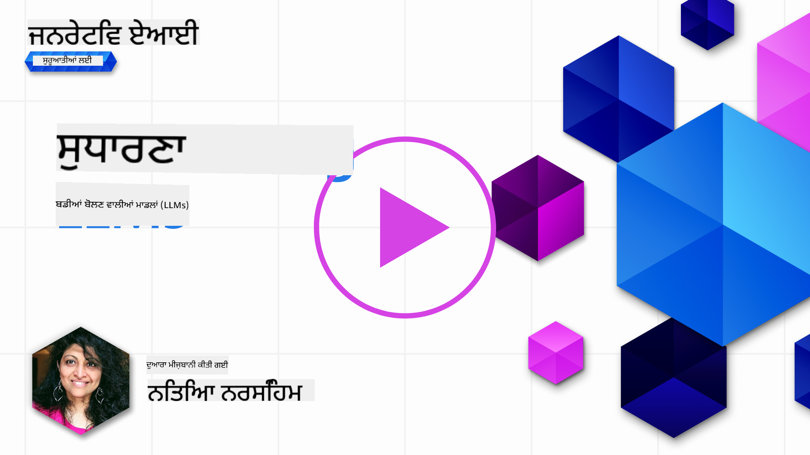
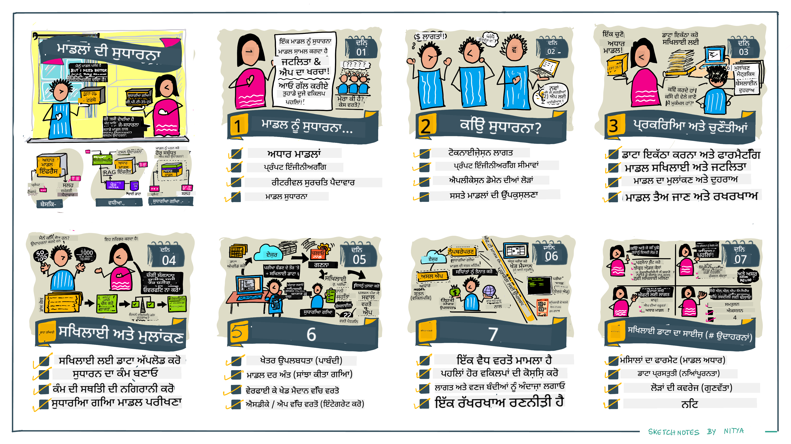

<!--
CO_OP_TRANSLATOR_METADATA:
{
  "original_hash": "68664f7e754a892ae1d8d5e2b7bd2081",
  "translation_date": "2025-05-20T07:44:11+00:00",
  "source_file": "18-fine-tuning/README.md",
  "language_code": "pa"
}
-->

# ਆਪਣੇ LLM ਨੂੰ ਵਧੀਆ ਬਣਾਉਣਾ

ਵੱਡੇ ਭਾਸ਼ਾ ਮਾਡਲਾਂ ਦੀ ਵਰਤੋਂ ਕਰਕੇ ਜਨਰੇਟਿਵ AI ਐਪਲੀਕੇਸ਼ਨ ਬਣਾਉਣਾ ਨਵੇਂ ਚੁਣੌਤੀਆਂ ਨਾਲ ਆਉਂਦਾ ਹੈ। ਇੱਕ ਮੁੱਖ ਮੁੱਦਾ ਮਾਡਲ ਦੁਆਰਾ ਦਿੱਤੇ ਗਏ ਕਿਸੇ ਨਿਰਧਾਰਤ ਉਪਭੋਗਤਾ ਦੀ ਬੇਨਤੀ ਲਈ ਉਤਪੰਨ ਸਮੱਗਰੀ ਵਿੱਚ ਪ੍ਰਤੀਕ੍ਰਿਆ ਦੀ ਗੁਣਵੱਤਾ (ਸਹੀਤਾ ਅਤੇ ਸਬੰਧਿਤਤਾ) ਨੂੰ ਯਕੀਨੀ ਬਣਾਉਣਾ ਹੈ। ਪਹਿਲੀਆਂ ਪਾਠਾਂ ਵਿੱਚ, ਅਸੀਂ ਤਕਨੀਕਾਂ ਜਿਵੇਂ ਕਿ ਪ੍ਰੰਪਟ ਇੰਜੀਨੀਅਰਿੰਗ ਅਤੇ ਰਿਟਰੀਵਲ-ਅਗਮੈਂਟਡ ਜਨਰੇਸ਼ਨ 'ਤੇ ਵਿਚਾਰ ਕੀਤਾ ਜੋ ਮੌਜੂਦਾ ਮਾਡਲ ਨੂੰ ਪ੍ਰੰਪਟ ਇਨਪੁਟ ਨੂੰ ਸੋਧ ਕੇ ਸਮੱਸਿਆ ਨੂੰ ਹੱਲ ਕਰਨ ਦੀ ਕੋਸ਼ਿਸ਼ ਕਰਦਾ ਹੈ।

ਅੱਜ ਦੇ ਪਾਠ ਵਿੱਚ, ਅਸੀਂ ਤੀਜੀ ਤਕਨੀਕ, **ਵਧੀਆ ਬਣਾਉਣਾ**, 'ਤੇ ਵਿਚਾਰ ਕਰਦੇ ਹਾਂ ਜੋ ਅਤਿਰਿਕਤ ਡਾਟਾ ਨਾਲ ਮਾਡਲ ਨੂੰ ਦੁਬਾਰਾ ਸਿਖਲਾਈ ਦੇ ਕੇ ਚੁਣੌਤੀ ਨੂੰ ਹੱਲ ਕਰਨ ਦੀ ਕੋਸ਼ਿਸ਼ ਕਰਦਾ ਹੈ। ਆਓ ਵਿਸਥਾਰ ਵਿੱਚ ਜਾਣਦੇ ਹਾਂ।

## ਸਿੱਖਣ ਦੇ ਉਦੇਸ਼

ਇਹ ਪਾਠ ਪ੍ਰੀ-ਟ੍ਰੇਨਡ ਭਾਸ਼ਾ ਮਾਡਲਾਂ ਲਈ ਵਧੀਆ ਬਣਾਉਣ ਦੇ ਸੰਕਲਪ ਨੂੰ ਪੇਸ਼ ਕਰਦਾ ਹੈ, ਇਸ ਪਹੁੰਚ ਦੇ ਲਾਭਾਂ ਅਤੇ ਚੁਣੌਤੀਆਂ ਦੀ ਪੜਚੋਲ ਕਰਦਾ ਹੈ, ਅਤੇ ਆਪਣੇ ਜਨਰੇਟਿਵ AI ਮਾਡਲਾਂ ਦੀ ਕਾਰਗੁਜ਼ਾਰੀ ਨੂੰ ਸੁਧਾਰਨ ਲਈ ਕਦੋਂ ਅਤੇ ਕਿਵੇਂ ਵਧੀਆ ਬਣਾਉਣਾ ਹੈ ਇਸ ਬਾਰੇ ਦਿਸ਼ਾ-ਨਿਰਦੇਸ਼ ਪ੍ਰਦਾਨ ਕਰਦਾ ਹੈ।

ਇਸ ਪਾਠ ਦੇ ਅੰਤ ਤੱਕ, ਤੁਹਾਨੂੰ ਹੇਠਾਂ ਦਿੱਤੇ ਪ੍ਰਸ਼ਨਾਂ ਦੇ ਜਵਾਬ ਦੇਣ ਦੇ ਯੋਗ ਹੋਣਾ ਚਾਹੀਦਾ ਹੈ:

- ਭਾਸ਼ਾ ਮਾਡਲਾਂ ਲਈ ਵਧੀਆ ਬਣਾਉਣਾ ਕੀ ਹੈ?
- ਵਧੀਆ ਬਣਾਉਣਾ ਕਦੋਂ, ਅਤੇ ਕਿਉਂ, ਲਾਭਦਾਇਕ ਹੈ?
- ਮੈਂ ਪ੍ਰੀ-ਟ੍ਰੇਨਡ ਮਾਡਲ ਨੂੰ ਕਿਵੇਂ ਵਧੀਆ ਕਰ ਸਕਦਾ ਹਾਂ?
- ਵਧੀਆ ਬਣਾਉਣ ਦੀਆਂ ਸੀਮਾਵਾਂ ਕੀ ਹਨ?

ਤਿਆਰ ਹੋ? ਆਓ ਸ਼ੁਰੂ ਕਰੀਏ।

## ਦਰਸ਼ਾਵਾਂ ਗਾਈਡ

ਕੀ ਤੁਸੀਂ ਡੂੰਘਾਈ ਵਿੱਚ ਜਾਣ ਤੋਂ ਪਹਿਲਾਂ ਕਵਰ ਕੀਤੇ ਜਾਣ ਵਾਲੇ ਵਿਸ਼ੇਸ਼ ਦ੍ਰਿਸ਼ਟੀਕੋਣ ਪ੍ਰਾਪਤ ਕਰਨਾ ਚਾਹੁੰਦੇ ਹੋ? ਇਸ ਦਰਸ਼ਾਵਾਂ ਗਾਈਡ ਨੂੰ ਵੇਖੋ ਜੋ ਇਸ ਪਾਠ ਲਈ ਸਿੱਖਣ ਯਾਤਰਾ ਦਾ ਵੇਰਵਾ ਦਿੰਦੀ ਹੈ - ਵਧੀਆ ਬਣਾਉਣ ਲਈ ਮੁੱਖ ਸੰਕਲਪਾਂ ਅਤੇ ਪ੍ਰੇਰਣਾ ਸਿੱਖਣ ਤੋਂ ਲੈ ਕੇ ਪ੍ਰਕਿਰਿਆ ਅਤੇ ਵਧੀਆ ਬਣਾਉਣ ਦੇ ਕਾਰਜ ਨੂੰ ਅੰਜ਼ਾਮ ਦੇਣ ਲਈ ਸਰਵੋਤਮ ਅਭਿਆਸਾਂ ਨੂੰ ਸਮਝਣ ਤੱਕ। ਇਹ ਪੜਚੋਲ ਲਈ ਇੱਕ ਰੋਮਾਂਚਕ ਵਿਸ਼ਾ ਹੈ, ਇਸ ਲਈ ਆਪਣੇ ਆਪ ਨੂੰ ਨਿਰਦੇਸ਼ਤ ਸਿੱਖਣ ਯਾਤਰਾ ਨੂੰ ਸਮਰਥਨ ਦੇਣ ਲਈ ਵਾਧੂ ਲਿੰਕਾਂ ਲਈ [ਸਰੋਤ](./RESOURCES.md?WT.mc_id=academic-105485-koreyst) ਪੇਜ ਨੂੰ ਵੇਖਣਾ ਨਾ ਭੁੱਲੋ!

## ਭਾਸ਼ਾ ਮਾਡਲਾਂ ਲਈ ਵਧੀਆ ਬਣਾਉਣਾ ਕੀ ਹੈ?

ਪਰਿਭਾਸ਼ਾ ਅਨੁਸਾਰ, ਵੱਡੇ ਭਾਸ਼ਾ ਮਾਡਲ ਵੱਡੀ ਮਾਤਰਾ ਵਿੱਚ ਟੈਕਸਟ 'ਤੇ ਪ੍ਰੀ-ਟ੍ਰੇਨਡ ਹੁੰਦੇ ਹਨ ਜੋ ਵੱਖ-ਵੱਖ ਸਰੋਤਾਂ ਤੋਂ ਪ੍ਰਾਪਤ ਹੁੰਦੇ ਹਨ ਜਿਵੇਂ ਕਿ ਇੰਟਰਨੈੱਟ। ਜਿਵੇਂ ਕਿ ਅਸੀਂ ਪਹਿਲਾਂ ਦੇ ਪਾਠਾਂ ਵਿੱਚ ਸਿੱਖਿਆ ਹੈ, ਸਾਨੂੰ ਉਪਭੋਗਤਾ ਦੇ ਪ੍ਰਸ਼ਨਾਂ ("ਪ੍ਰੰਪਟਸ") ਲਈ ਮਾਡਲ ਦੀਆਂ ਪ੍ਰਤੀਕ੍ਰਿਆਵਾਂ ਦੀ ਗੁਣਵੱਤਾ ਨੂੰ ਸੁਧਾਰਨ ਲਈ _ਪ੍ਰੰਪਟ ਇੰਜੀਨੀਅਰਿੰਗ_ ਅਤੇ _ਰਿਟਰੀਵਲ-ਅਗਮੈਂਟਡ ਜਨਰੇਸ਼ਨ_ ਵਰਗੀਆਂ ਤਕਨੀਕਾਂ ਦੀ ਲੋੜ ਹੈ।

ਇੱਕ ਲੋਕਪ੍ਰਿਯ ਪ੍ਰੰਪਟ-ਇੰਜੀਨੀਅਰਿੰਗ ਤਕਨੀਕ ਵਿੱਚ ਮਾਡਲ ਨੂੰ ਇਸ ਬਾਰੇ ਹੋਰ ਦਿਸ਼ਾ-ਨਿਰਦੇਸ਼ ਦੇਣਾ ਸ਼ਾਮਲ ਹੈ ਕਿ ਪ੍ਰਤੀਕ੍ਰਿਆ ਵਿੱਚ ਕੀ ਉਮੀਦ ਕੀਤੀ ਜਾਂਦੀ ਹੈ ਜਾਂ ਤਾਂ _ਹਦਾਇਤਾਂ_ (ਸਪਸ਼ਟ ਦਿਸ਼ਾ-ਨਿਰਦੇਸ਼) ਪ੍ਰਦਾਨ ਕਰਕੇ ਜਾਂ _ਇਸ ਨੂੰ ਕੁਝ ਉਦਾਹਰਨਾਂ ਦੇ ਕੇ_ (ਅਸਪਸ਼ਟ ਦਿਸ਼ਾ-ਨਿਰਦੇਸ਼) ਪ੍ਰਦਾਨ ਕਰਕੇ। ਇਸਨੂੰ _ਫਿਊ-ਸ਼ਾਟ ਸਿੱਖਣ_ ਕਿਹਾ ਜਾਂਦਾ ਹੈ ਪਰ ਇਸਦੇ ਦੋ ਸੀਮਾਵਾਂ ਹਨ:

- ਮਾਡਲ ਟੋਕਨ ਦੀਆਂ ਸੀਮਾਵਾਂ ਤੁਹਾਡੇ ਦੁਆਰਾ ਦਿੱਤੇ ਗਏ ਉਦਾਹਰਨਾਂ ਦੀ ਗਿਣਤੀ ਨੂੰ ਸੀਮਿਤ ਕਰ ਸਕਦੀਆਂ ਹਨ, ਅਤੇ ਪ੍ਰਭਾਵੀਤਾ ਨੂੰ ਸੀਮਿਤ ਕਰ ਸਕਦੀਆਂ ਹਨ।
- ਮਾਡਲ ਟੋਕਨ ਦੀਆਂ ਲਾਗਤਾਂ ਹਰ ਪ੍ਰੰਪਟ ਵਿੱਚ ਉਦਾਹਰਨਾਂ ਸ਼ਾਮਲ ਕਰਨ ਨੂੰ ਮਹਿੰਗਾ ਬਣਾ ਸਕਦੀਆਂ ਹਨ, ਅਤੇ ਲਚਕਤਾ ਨੂੰ ਸੀਮਿਤ ਕਰ ਸਕਦੀਆਂ ਹਨ।

ਵਧੀਆ ਬਣਾਉਣਾ ਮਸ਼ੀਨ ਲਰਨਿੰਗ ਪ੍ਰਣਾਲੀਆਂ ਵਿੱਚ ਇੱਕ ਆਮ ਅਭਿਆਸ ਹੈ ਜਿੱਥੇ ਅਸੀਂ ਇੱਕ ਪ੍ਰੀ-ਟ੍ਰੇਨਡ ਮਾਡਲ ਲੈਂਦੇ ਹਾਂ ਅਤੇ ਇਸਦੀ ਕਾਰਗੁਜ਼ਾਰੀ ਨੂੰ ਕਿਸੇ ਵਿਸ਼ੇਸ਼ ਕਾਰਜ 'ਤੇ ਸੁਧਾਰਨ ਲਈ ਇਸਨੂੰ ਨਵੇਂ ਡਾਟਾ ਨਾਲ ਦੁਬਾਰਾ ਸਿਖਲਾਈ ਦਿੰਦੇ ਹਾਂ। ਭਾਸ਼ਾ ਮਾਡਲਾਂ ਦੇ ਸੰਦਰਭ ਵਿੱਚ, ਅਸੀਂ ਪ੍ਰੀ-ਟ੍ਰੇਨਡ ਮਾਡਲ ਨੂੰ _ਕਿਸੇ ਦਿੱਤੇ ਗਏ ਕਾਰਜ ਜਾਂ ਐਪਲੀਕੇਸ਼ਨ ਡੋਮੇਨ ਲਈ ਚੁਣੇ ਹੋਏ ਉਦਾਹਰਨਾਂ ਦੇ ਸੈੱਟ ਨਾਲ_ ਵਧੀਆ ਕਰ ਸਕਦੇ ਹਾਂ ਤਾਂ ਜੋ ਇੱਕ **ਕਸਟਮ ਮਾਡਲ** ਬਣ ਸਕੇ ਜੋ ਉਸ ਵਿਸ਼ੇਸ਼ ਕਾਰਜ ਜਾਂ ਡੋਮੇਨ ਲਈ ਹੋਰ ਸਹੀ ਅਤੇ ਸਬੰਧਿਤ ਹੋ ਸਕਦਾ ਹੈ। ਵਧੀਆ ਬਣਾਉਣ ਦਾ ਇੱਕ ਸਾਈਡ-ਲਾਭ ਇਹ ਹੈ ਕਿ ਇਹ ਫਿਊ-ਸ਼ਾਟ ਸਿੱਖਣ ਲਈ ਲੋੜੀਂਦੇ ਉਦਾਹਰਨਾਂ ਦੀ ਗਿਣਤੀ ਨੂੰ ਵੀ ਘਟਾ ਸਕਦਾ ਹੈ - ਟੋਕਨ ਦੀ ਵਰਤੋਂ ਅਤੇ ਸੰਬੰਧਿਤ ਲਾਗਤਾਂ ਨੂੰ ਘਟਾਉਂਦਾ ਹੈ।

## ਮਾਡਲਾਂ ਨੂੰ ਕਦੋਂ ਅਤੇ ਕਿਉਂ ਵਧੀਆ ਕਰਨਾ ਚਾਹੀਦਾ ਹੈ?

_ਇਸ_ ਸੰਦਰਭ ਵਿੱਚ, ਜਦੋਂ ਅਸੀਂ ਵਧੀਆ ਬਣਾਉਣ ਬਾਰੇ ਗੱਲ ਕਰਦੇ ਹਾਂ, ਤਾਂ ਅਸੀਂ **ਸੁਪਰਵਾਈਜ਼ਡ** ਵਧੀਆ ਬਣਾਉਣ ਦਾ ਹਵਾਲਾ ਦਿੰਦੇ ਹਾਂ ਜਿੱਥੇ ਦੁਬਾਰਾ ਸਿਖਲਾਈ **ਨਵੇਂ ਡਾਟਾ ਸ਼ਾਮਲ ਕਰਕੇ** ਕੀਤੀ ਜਾਂਦੀ ਹੈ ਜੋ ਮੂਲ ਸਿਖਲਾਈ ਡਾਟਾਸੈੱਟ ਦਾ ਹਿੱਸਾ ਨਹੀਂ ਸੀ। ਇਹ ਇੱਕ ਅਨਸੁਪਰਵਾਈਜ਼ਡ ਵਧੀਆ ਬਣਾਉਣ ਦੇ ਪਹੁੰਚ ਤੋਂ ਵੱਖਰਾ ਹੈ ਜਿੱਥੇ ਮਾਡਲ ਨੂੰ ਮੂਲ ਡਾਟੇ 'ਤੇ ਦੁਬਾਰਾ ਸਿਖਲਾਈ ਦਿੱਤੀ ਜਾਂਦੀ ਹੈ, ਪਰ ਵੱਖਰੇ ਹਾਈਪਰਪੈਰਾਮੀਟਰਾਂ ਨਾਲ।

ਮੁੱਖ ਗੱਲ ਯਾਦ ਰੱਖਣੀ ਹੈ ਕਿ ਵਧੀਆ ਬਣਾਉਣਾ ਇੱਕ ਉੱਚ-ਪੱਧਰ ਦੀ ਤਕਨੀਕ ਹੈ ਜਿਸਨੂੰ ਇੱਛਿਤ ਨਤੀਜੇ ਪ੍ਰਾਪਤ ਕਰਨ ਲਈ ਇੱਕ ਨਿਰਧਾਰਿਤ ਪੱਧਰ ਦੀ ਕੁਸ਼ਲਤਾ ਦੀ ਲੋੜ ਹੁੰਦੀ ਹੈ। ਜੇ ਇਹ ਗਲਤ ਕੀਤਾ ਗਿਆ, ਤਾਂ ਇਹ ਉਮੀਦ ਕੀਤੇ ਗਏ ਸੁਧਾਰਾਂ ਨੂੰ ਪ੍ਰਦਾਨ ਨਹੀਂ ਕਰ ਸਕਦਾ, ਅਤੇ ਤੁਹਾਡੇ ਟਾਰਗੇਟ ਕੀਤੇ ਡੋਮੇਨ ਲਈ ਮਾਡਲ ਦੀ ਕਾਰਗੁਜ਼ਾਰੀ ਨੂੰ ਵੀ ਘਟਾ ਸਕਦਾ ਹੈ।

ਇਸ ਲਈ, "ਕਿਵੇਂ" ਭਾਸ਼ਾ ਮਾਡਲਾਂ ਨੂੰ ਵਧੀਆ ਬਣਾਉਣਾ ਸਿੱਖਣ ਤੋਂ ਪਹਿਲਾਂ, ਤੁਹਾਨੂੰ ਜਾਣਨਾ ਚਾਹੀਦਾ ਹੈ "ਕਿਉਂ" ਤੁਹਾਨੂੰ ਇਹ ਰਸਤਾ ਲੈਣਾ ਚਾਹੀਦਾ ਹੈ, ਅਤੇ "ਕਦੋਂ" ਵਧੀਆ ਬਣਾਉਣ ਦੀ ਪ੍ਰਕਿਰਿਆ ਸ਼ੁਰੂ ਕਰਨੀ ਚਾਹੀਦੀ ਹੈ। ਆਪਣੇ ਆਪ ਤੋਂ ਇਹ ਪ੍ਰਸ਼ਨ ਪੁੱਛਣ ਨਾਲ ਸ਼ੁਰੂ ਕਰੋ:

- **ਵਰਤੋਂ ਦਾ ਕੇਸ**: ਤੁਹਾਡਾ ਵਧੀਆ ਬਣਾਉਣ ਲਈ _ਵਰਤੋਂ ਦਾ ਕੇਸ_ ਕੀ ਹੈ? ਮੌਜੂਦਾ ਪ੍ਰੀ-ਟ੍ਰੇਨਡ ਮਾਡਲ ਦੇ ਕਿਹੜੇ ਪੱਖ ਨੂੰ ਤੁਸੀਂ ਸੁਧਾਰਨਾ ਚਾਹੁੰਦੇ ਹੋ?
- **ਵਿਕਲਪ**: ਕੀ ਤੁਸੀਂ ਇੱਛਿਤ ਨਤੀਜੇ ਪ੍ਰਾਪਤ ਕਰਨ ਲਈ _ਹੋਰ ਤਕਨੀਕਾਂ_ ਦੀ ਕੋਸ਼ਿਸ਼ ਕੀਤੀ ਹੈ? ਤੁਲਨਾ ਲਈ ਇੱਕ ਬੇਸਲਾਈਨ ਬਣਾਉਣ ਲਈ ਉਨ੍ਹਾਂ ਦੀ ਵਰਤੋਂ ਕਰੋ।
  - ਪ੍ਰੰਪਟ ਇੰਜੀਨੀਅਰਿੰਗ: ਉਚਿਤ ਪ੍ਰੰਪਟ ਪ੍ਰਤੀਕ੍ਰਿਆਵਾਂ ਦੇ ਉਦਾਹਰਨਾਂ ਨਾਲ ਕੁਝ-ਸ਼ਾਟ ਪ੍ਰੰਪਟਿੰਗ ਵਰਗੀਆਂ ਤਕਨੀਕਾਂ ਦੀ ਕੋਸ਼ਿਸ਼ ਕਰੋ। ਪ੍ਰਤੀਕ੍ਰਿਆਵਾਂ ਦੀ ਗੁਣਵੱਤਾ ਦਾ ਮੁਲਾਂਕਣ ਕਰੋ।
  - ਰਿਟਰੀਵਲ ਅਗਮੈਂਟਡ ਜਨਰੇਸ਼ਨ: ਆਪਣੇ ਡਾਟਾ ਨੂੰ ਖੋਜ ਕੇ ਪ੍ਰਾਪਤ ਕੀਤੇ ਪੁੱਛਗਿੱਛ ਦੇ ਨਤੀਜੇ ਨਾਲ ਪ੍ਰੰਪਟਸ ਨੂੰ ਵਧਾਉਣ ਦੀ ਕੋਸ਼ਿਸ਼ ਕਰੋ। ਪ੍ਰਤੀਕ੍ਰਿਆਵਾਂ ਦੀ ਗੁਣਵੱਤਾ ਦਾ ਮੁਲਾਂਕਣ ਕਰੋ।
- **ਲਾਗਤਾਂ**: ਕੀ ਤੁਸੀਂ ਵਧੀਆ ਬਣਾਉਣ ਲਈ ਲਾਗਤਾਂ ਦੀ ਪਛਾਣ ਕੀਤੀ ਹੈ?
  - ਟਿਊਨਬਿਲਟੀ - ਕੀ ਪ੍ਰੀ-ਟ੍ਰੇਨਡ ਮਾਡਲ ਵਧੀਆ ਬਣਾਉਣ ਲਈ ਉਪਲਬਧ ਹੈ?
  - ਯਤਨ - ਸਿਖਲਾਈ ਡਾਟਾ ਤਿਆਰ ਕਰਨ, ਮਾਡਲ ਦਾ ਮੁਲਾਂਕਣ ਅਤੇ ਸੁਧਾਰ ਕਰਨ ਲਈ।
  - ਕੰਪਿਊਟ - ਵਧੀਆ ਬਣਾਉਣ ਦੀਆਂ ਨੌਕਰੀਆਂ ਚਲਾਉਣ ਲਈ, ਅਤੇ ਵਧੀਆ ਬਣਾਏ ਮਾਡਲ ਨੂੰ ਤੈਨਾਤ ਕਰਨ ਲਈ
  - ਡਾਟਾ - ਵਧੀਆ ਬਣਾਉਣ ਦੇ ਪ੍ਰਭਾਵ ਲਈ ਪ੍ਰਚੁਰ ਮਾਤਰਾ ਵਿੱਚ ਗੁਣਵੱਤਾ ਦੇ ਉਦਾਹਰਨਾਂ ਤੱਕ ਪਹੁੰਚ
- **ਲਾਭ**: ਕੀ ਤੁਸੀਂ ਵਧੀਆ ਬਣਾਉਣ ਲਈ ਲਾਭਾਂ ਦੀ ਪੁਸ਼ਟੀ ਕੀਤੀ ਹੈ?
  - ਗੁਣਵੱਤਾ - ਕੀ ਵਧੀਆ ਬਣਾਏ ਮਾਡਲ ਨੇ ਬੇਸਲਾਈਨ ਨੂੰ ਪਿਛੇ ਛੱਡ ਦਿੱਤਾ?
  - ਲਾਗਤ - ਕੀ ਇਹ ਪ੍ਰੰਪਟਸ ਨੂੰ ਸਰਲ ਕਰਕੇ ਟੋਕਨ ਦੀ ਵਰਤੋਂ ਨੂੰ ਘਟਾਉਂਦਾ ਹੈ?
  - ਵਿਸਤਾਰਯੋਗਤਾ - ਕੀ ਤੁਸੀਂ ਨਵੇਂ ਡੋਮੇਨਾਂ ਲਈ ਬੇਸ ਮਾਡਲ ਨੂੰ ਦੁਬਾਰਾ ਵਰਤ ਸਕਦੇ ਹੋ?

ਇਹ ਪ੍ਰਸ਼ਨ ਦੇ ਕੇ, ਤੁਹਾਨੂੰ ਇਹ ਫੈਸਲਾ ਕਰਨ ਦੇ ਯੋਗ ਹੋਣਾ ਚਾਹੀਦਾ ਹੈ ਕਿ ਤੁਹਾਡੇ ਵਰਤੋਂ ਦੇ ਕੇਸ ਲਈ ਵਧੀਆ ਬਣਾਉਣਾ ਸਹੀ ਪਹੁੰਚ ਹੈ ਜਾਂ ਨਹੀਂ। ਆਦਰਸ਼ ਤੌਰ 'ਤੇ, ਪਹੁੰਚ ਸਿਰਫ ਤਦ ਹੀ ਵੈਧ ਹੈ ਜੇ ਲਾਭ ਲਾਗਤਾਂ ਨੂੰ ਪਿਛੇ ਛੱਡ ਦੇਣ। ਜਦੋਂ ਤੁਸੀਂ ਅੱਗੇ ਵੱਧਣ ਦਾ ਫੈਸਲਾ ਕਰਦੇ ਹੋ, ਤਾਂ ਇਹ ਸੋਚਣ ਦਾ ਸਮਾਂ ਆ ਜਾਂਦਾ ਹੈ ਕਿ ਤੁਸੀਂ ਪ੍ਰੀ-ਟ੍ਰੇਨਡ ਮਾਡਲ ਨੂੰ ਕਿਵੇਂ ਵਧੀਆ ਕਰ ਸਕਦੇ ਹੋ।

ਫੈਸਲਾ ਲੈਣ ਦੀ ਪ੍ਰਕਿਰਿਆ 'ਤੇ ਹੋਰ ਝਲਕੀਆਂ ਪ੍ਰਾਪਤ ਕਰਨਾ ਚਾਹੁੰਦੇ ਹੋ? ਦੇਖੋ [ਵਧੀਆ ਬਣਾਉਣਾ ਕਿ ਨਾ ਬਣਾਉਣਾ](https://www.youtube.com/watch?v=0Jo-z-MFxJs)

## ਅਸੀਂ ਪ੍ਰੀ-ਟ੍ਰੇਨਡ ਮਾਡਲ ਨੂੰ ਕਿਵੇਂ ਵਧੀਆ ਕਰ ਸਕਦੇ ਹਾਂ?

ਪ੍ਰੀ-ਟ੍ਰੇਨਡ ਮਾਡਲ ਨੂੰ ਵਧੀਆ ਬਣਾਉਣ ਲਈ, ਤੁਹਾਡੇ ਕੋਲ ਹੋਣਾ ਚਾਹੀਦਾ ਹੈ:

- ਵਧੀਆ ਬਣਾਉਣ ਲਈ ਇੱਕ ਪ੍ਰੀ-ਟ੍ਰੇਨਡ ਮਾਡਲ
- ਵਧੀਆ ਬਣਾਉਣ ਲਈ ਵਰਤਣ ਲਈ ਇੱਕ ਡਾਟਾਸੈੱਟ
- ਵਧੀਆ ਬਣਾਉਣ ਦੀ ਨੌਕਰੀ ਚਲਾਉਣ ਲਈ ਇੱਕ ਸਿਖਲਾਈ ਵਾਤਾਵਰਣ
- ਵਧੀਆ ਬਣਾਏ ਮਾਡਲ ਨੂੰ ਤੈਨਾਤ ਕਰਨ ਲਈ ਇੱਕ ਹੋਸਟਿੰਗ ਵਾਤਾਵਰਣ

## ਕਾਰਵਾਈ ਵਿੱਚ ਵਧੀਆ ਬਣਾਉਣਾ

ਹੇਠਾਂ ਦਿੱਤੇ ਸਰੋਤ ਤੁਹਾਨੂੰ ਚੁਣੇ ਹੋਏ ਮਾਡਲ ਨਾਲ ਇੱਕ ਚੁਣੇ ਹੋਏ ਡਾਟਾਸੈੱਟ ਦੀ ਵਰਤੋਂ ਕਰਕੇ ਇੱਕ ਅਸਲ ਉਦਾਹਰਨ ਦੇ ਰਾਹੀਂ ਲੈ ਕੇ ਜਾਣ ਲਈ ਕਦਮ-ਦਰ-ਕਦਮ ਟਿਊਟੋਰਿਅਲ ਪ੍ਰਦਾਨ ਕਰਦੇ ਹਨ। ਇਹਨਾਂ ਟਿਊਟੋਰਿਅਲਾਂ ਵਿੱਚ ਕੰਮ ਕਰਨ ਲਈ, ਤੁਹਾਨੂੰ ਨਿਰਧਾਰਿਤ ਪ੍ਰਦਾਤਾ 'ਤੇ ਇੱਕ ਖਾਤੇ ਦੀ ਲੋੜ ਹੈ, ਨਾਲ ਹੀ ਸਬੰਧਤ ਮਾਡਲ ਅਤੇ ਡਾਟਾਸੈੱਟ ਤੱਕ ਪਹੁੰਚ ਦੀ ਲੋੜ ਹੈ।

| ਪ੍ਰਦਾਤਾ     | ਟਿਊਟੋਰਿਅਲ                                                                                                                                                                       | ਵੇਰਵਾ                                                                                                                                                                                                                                                                                                                                                                                                                        |
| ------------ | ------------------------------------------------------------------------------------------------------------------------------------------------------------------------------ | ---------------------------------------------------------------------------------------------------------------------------------------------------------------------------------------------------------------------------------------------------------------------------------------------------------------------------------------------------------------------------------------------------------------------------------- |
| OpenAI       | [ਚੈਟ ਮਾਡਲਾਂ ਨੂੰ ਕਿਵੇਂ ਵਧੀਆ ਬਣਾਉਣਾ ਹੈ](https://github.com/openai/openai-cookbook/blob/main/examples/How_to_finetune_chat_models.ipynb?WT.mc_id=academic-105485-koreyst)                | ਸਿਖੋ ਕਿ ਸਿਖਲਾਈ ਡਾਟਾ ਤਿਆਰ ਕਰਕੇ, ਵਧੀਆ ਬਣਾਉਣ ਦੀ ਨੌਕਰੀ ਚਲਾਉਣ ਅਤੇ ਅਨੁਮਾਨ ਲਈ ਵਧੀਆ ਬਣਾਏ ਮਾਡਲ ਦੀ ਵਰਤੋਂ ਕਰਕੇ `gpt-35-turbo` ਨੂੰ ਕਿਸੇ ਵਿਸ਼ੇਸ਼ ਡੋਮੇਨ ("ਵਿਧੀ ਸਹਾਇਕ") ਲਈ ਕਿਵੇਂ ਵਧੀਆ ਬਣਾਉਣਾ ਹੈ।                                                                                                                                                                                                                                              |
| Azure OpenAI | [GPT 3.5 ਟਰਬੋ ਵਧੀਆ ਬਣਾਉਣ ਦਾ ਟਿਊਟੋਰਿਅਲ](https://learn.microsoft.com/azure/ai-services/openai/tutorials/fine-tune?tabs=python-new%2Ccommand-line?WT.mc_id=academic-105485-koreyst) | ਸਿਖੋ ਕਿ ਸਿਖਲਾਈ ਡਾਟਾ ਬਣਾਉਣ ਅਤੇ ਅਪਲੋਡ ਕਰਨ ਦੇ ਕਦਮ ਲੈ ਕੇ, ਵਧੀਆ ਬਣਾਉਣ ਦੀ ਨੌਕਰੀ ਚਲਾਉਣ ਦੁਆਰਾ **ਐਜ਼ਰ** 'ਤੇ `gpt-35-turbo-0613` ਮਾਡਲ ਨੂੰ ਕਿਵੇਂ ਵਧੀਆ ਬਣਾਉਣਾ ਹੈ। ਨਵੇਂ ਮਾਡਲ ਨੂੰ ਤੈਨਾਤ ਕਰੋ ਅਤੇ ਵਰਤੋ।                                                                                                                                                                                                                                                                 |
| Hugging Face | [Hugging Face ਨਾਲ LLMs ਨੂੰ ਵਧੀਆ ਬਣਾਉਣਾ](https://www.philschmid.de/fine-tune-llms-in-2024-with-trl?WT.mc_id=academic-105485-koreyst)                                               | ਇਹ ਬਲੌਗ ਪੋਸਟ ਤੁਹਾਨੂੰ _ਖੁੱਲ੍ਹੇ LLM_ (ਉਦਾਹਰਣ: `CodeLlama 7B`) ਨੂੰ [transformers](https://huggingface.co/docs/transformers/index?WT.mc_id=academic-105485-koreyst) ਲਾਇਬ੍ਰੇਰੀ & [Transformer Reinforcement Learning (TRL)](https://huggingface.co/docs/trl/index?WT.mc_id=academic-105485-koreyst]) ਨਾਲ ਖੁੱਲ੍ਹੇ [datasets](https://huggingface.co/docs/datasets/index?WT.mc_id=academic-105485-koreyst) 'ਤੇ Hugging Face 'ਤੇ ਵਧੀਆ ਬਣਾਉਣ ਦੀ ਸੈਰ ਕਰਵਾਉਂਦੀ ਹੈ। |
|              |                                                                                                                                                                                |                                                                                                                                                                                                                                                                                                                                                                                                                                    |
| 🤗 AutoTrain | [AutoTrain ਨਾਲ LLMs ਨੂੰ ਵਧੀਆ ਬਣਾਉਣਾ](https://github.com/huggingface/autotrain-advanced/?WT.mc_id=academic-105485-koreyst)                                                         | AutoTrain (ਜਾਂ AutoTrain Advanced) ਇੱਕ ਪਾਈਥਨ ਲਾਇਬ੍ਰੇਰੀ ਹੈ ਜੋ Hugging Face ਦੁਆਰਾ ਵਿਕਸਤ ਕੀਤੀ ਗਈ ਹੈ ਜੋ ਕਈ ਵੱਖਰੇ ਕਾਰਜਾਂ ਲਈ finetuning ਦੀ ਆਗਿਆ ਦਿੰਦੀ ਹੈ ਜਿਸ ਵਿੱਚ LLM finetuning ਸ਼ਾਮਲ ਹੈ। AutoTrain ਇੱਕ ਕੋਡ-ਰਹਿਤ ਹੱਲ ਹੈ ਅਤੇ finetuning ਤੁਹਾਡੇ ਆਪਣੇ ਕਲਾਉਡ, Hugging Face Spaces ਜਾਂ ਸਥਾਨਕ ਤੌਰ 'ਤੇ ਕੀਤਾ ਜਾ ਸਕਦਾ ਹੈ। ਇਹ ਇੱਕ ਵੈੱਬ-ਅਧਾਰਿਤ GUI, CLI ਅਤੇ yaml ਕਾਨਫਿਗ ਫ

**ਬੇਨਤੀ**:  
ਇਹ ਦਸਤਾਵੇਜ਼ ਨੂੰ AI ਅਨੁਵਾਦ ਸੇਵਾ [Co-op Translator](https://github.com/Azure/co-op-translator) ਦੀ ਵਰਤੋਂ ਕਰਕੇ ਅਨੁਵਾਦ ਕੀਤਾ ਗਿਆ ਹੈ। ਜਦੋਂ ਕਿ ਅਸੀਂ ਸਹੀਤਾ ਲਈ ਯਤਨਸ਼ੀਲ ਹਾਂ, ਕਿਰਪਾ ਕਰਕੇ ਜਾਨ ਲਵੋ ਕਿ ਸਵੈਚਾਲਿਤ ਅਨੁਵਾਦਾਂ ਵਿੱਚ ਗਲਤੀਆਂ ਜਾਂ ਅਸੁਚਿਤਤਾਵਾਂ ਹੋ ਸਕਦੀਆਂ ਹਨ। ਇਸ ਦੀ ਮੂਲ ਭਾਸ਼ਾ ਵਿੱਚ ਮੂਲ ਦਸਤਾਵੇਜ਼ ਨੂੰ ਅਧਿਕਾਰਕ ਸਰੋਤ ਮੰਨਿਆ ਜਾਣਾ ਚਾਹੀਦਾ ਹੈ। ਗੰਭੀਰ ਜਾਣਕਾਰੀ ਲਈ, ਪੇਸ਼ੇਵਰ ਮਨੁੱਖੀ ਅਨੁਵਾਦ ਦੀ ਸਿਫਾਰਸ਼ ਕੀਤੀ ਜਾਂਦੀ ਹੈ। ਅਸੀਂ ਇਸ ਅਨੁਵਾਦ ਦੀ ਵਰਤੋਂ ਤੋਂ ਉਪਜਣ ਵਾਲੇ ਕਿਸੇ ਵੀ ਗਲਤਫਹਿਮੀ ਜਾਂ ਗਲਤ ਵਿਆਖਿਆ ਲਈ ਜ਼ਿੰਮੇਵਾਰ ਨਹੀਂ ਹਾਂ।