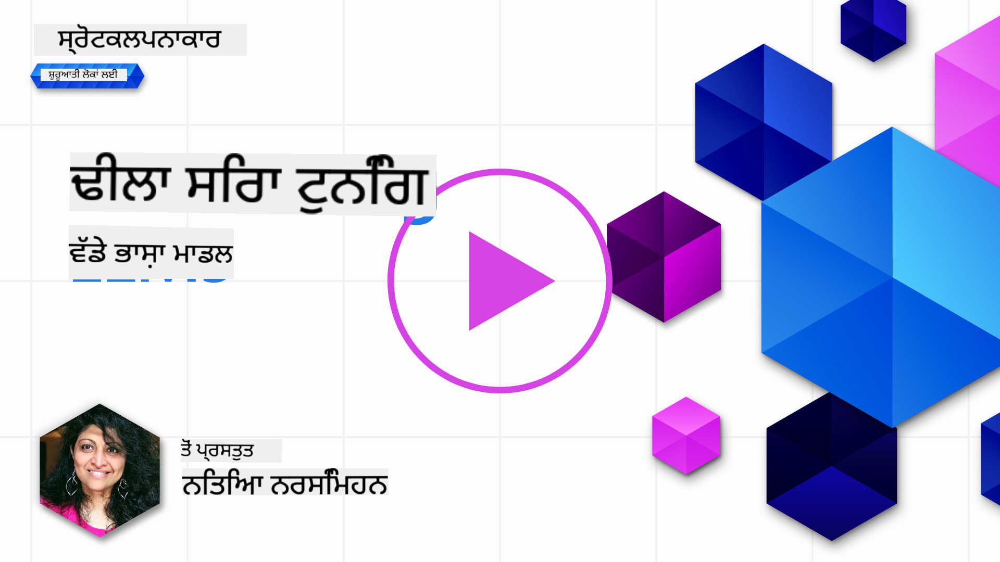
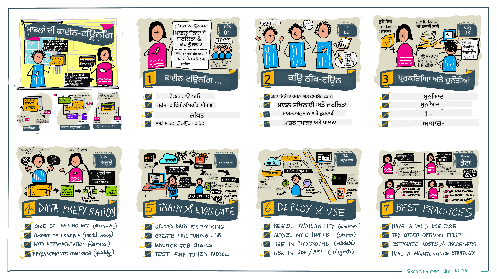

<!--
CO_OP_TRANSLATOR_METADATA:
{
  "original_hash": "807f0d9fc1747e796433534e1be6a98a",
  "translation_date": "2025-10-17T14:28:49+00:00",
  "source_file": "18-fine-tuning/README.md",
  "language_code": "pa"
}
-->

# ਆਪਣੇ LLM ਨੂੰ ਫਾਈਨ-ਟਿਊਨ ਕਰਨਾ

ਵੱਡੇ ਭਾਸ਼ਾ ਮਾਡਲਾਂ ਦੀ ਵਰਤੋਂ ਕਰਕੇ ਜਨਰੇਟਿਵ AI ਐਪਲੀਕੇਸ਼ਨ ਬਣਾਉਣਾ ਨਵੇਂ ਚੁਣੌਤੀਆਂ ਨਾਲ ਆਉਂਦਾ ਹੈ। ਇੱਕ ਮੁੱਖ ਮੁੱਦਾ ਇਹ ਯਕੀਨੀ ਬਣਾਉਣਾ ਹੈ ਕਿ ਮਾਡਲ ਦੁਆਰਾ ਜਨਰੇਟ ਕੀਤੇ ਸਮੱਗਰੀ ਵਿੱਚ ਉੱਤਰ ਦੀ ਗੁਣਵੱਤਾ (ਸਹੀਤਾ ਅਤੇ ਸਬੰਧਤਾ) ਨੂੰ ਯਕੀਨੀ ਬਣਾਇਆ ਜਾਵੇ। ਪਿਛਲੇ ਪਾਠਾਂ ਵਿੱਚ, ਅਸੀਂ ਤਕਨੀਕਾਂ ਬਾਰੇ ਚਰਚਾ ਕੀਤੀ ਜਿਵੇਂ ਕਿ ਪ੍ਰੌਂਪਟ ਇੰਜੀਨੀਅਰਿੰਗ ਅਤੇ ਰਿਟਰੀਵਲ-ਆਗਮੈਂਟਡ ਜਨਰੇਸ਼ਨ ਜੋ ਮੌਜੂਦਾ ਮਾਡਲ ਨੂੰ _ਪ੍ਰੌਂਪਟ ਇਨਪੁਟ_ ਨੂੰ ਬਦਲ ਕੇ ਸਮੱਸਿਆ ਦਾ ਹੱਲ ਕਰਨ ਦੀ ਕੋਸ਼ਿਸ਼ ਕਰਦੇ ਹਨ।

ਅੱਜ ਦੇ ਪਾਠ ਵਿੱਚ, ਅਸੀਂ ਤੀਜੀ ਤਕਨੀਕ, **ਫਾਈਨ-ਟਿਊਨਿੰਗ**, ਬਾਰੇ ਚਰਚਾ ਕਰਦੇ ਹਾਂ ਜੋ ਚੁਣੌਤੀ ਨੂੰ _ਮਾਡਲ ਨੂੰ ਖੁਦ ਹੀ ਦੁਬਾਰਾ ਸਿਖਾਉਣ_ ਦੁਆਰਾ ਹੱਲ ਕਰਨ ਦੀ ਕੋਸ਼ਿਸ਼ ਕਰਦੀ ਹੈ। ਆਓ ਵਿਸਥਾਰ ਵਿੱਚ ਜਾਣਕਾਰੀ ਲਵਾਂ।

## ਸਿੱਖਣ ਦੇ ਉਦੇਸ਼

ਇਹ ਪਾਠ ਪਹਿਲਾਂ ਤੋਂ ਸਿਖਾਏ ਗਏ ਭਾਸ਼ਾ ਮਾਡਲਾਂ ਲਈ ਫਾਈਨ-ਟਿਊਨਿੰਗ ਦੇ ਅਵਧਾਰਨਾ ਨੂੰ ਪੇਸ਼ ਕਰਦਾ ਹੈ, ਇਸ ਪਹੁੰਚ ਦੇ ਫਾਇਦੇ ਅਤੇ ਚੁਣੌਤੀਆਂ ਦੀ ਪੜਚੋਲ ਕਰਦਾ ਹੈ, ਅਤੇ ਤੁਹਾਡੇ ਜਨਰੇਟਿਵ AI ਮਾਡਲਾਂ ਦੀ ਕਾਰਗੁਜ਼ਾਰੀ ਨੂੰ ਸੁਧਾਰਨ ਲਈ ਫਾਈਨ-ਟਿਊਨਿੰਗ ਨੂੰ ਕਦੋਂ ਅਤੇ ਕਿਵੇਂ ਵਰਤਣਾ ਹੈ ਇਸ ਬਾਰੇ ਦਿਸ਼ਾ-ਨਿਰਦੇਸ਼ ਪ੍ਰਦਾਨ ਕਰਦਾ ਹੈ।

ਇਸ ਪਾਠ ਦੇ ਅੰਤ ਤੱਕ, ਤੁਸੀਂ ਹੇਠਾਂ ਦਿੱਤੇ ਸਵਾਲਾਂ ਦੇ ਜਵਾਬ ਦੇਣ ਦੇ ਯੋਗ ਹੋਣਾ ਚਾਹੀਦਾ ਹੈ:

- ਭਾਸ਼ਾ ਮਾਡਲਾਂ ਲਈ ਫਾਈਨ-ਟਿਊਨਿੰਗ ਕੀ ਹੈ?
- ਫਾਈਨ-ਟਿਊਨਿੰਗ ਕਦੋਂ ਅਤੇ ਕਿਉਂ ਲਾਭਦਾਇਕ ਹੈ?
- ਮੈਂ ਪਹਿਲਾਂ ਤੋਂ ਸਿਖਾਏ ਗਏ ਮਾਡਲ ਨੂੰ ਕਿਵੇਂ ਫਾਈਨ-ਟਿਊਨ ਕਰ ਸਕਦਾ ਹਾਂ?
- ਫਾਈਨ-ਟਿਊਨਿੰਗ ਦੀਆਂ ਸੀਮਾਵਾਂ ਕੀ ਹਨ?

ਤਿਆਰ ਹੋ? ਆਓ ਸ਼ੁਰੂ ਕਰੀਏ।

## ਚਿੱਤਰਮਈ ਗਾਈਡ

ਕੀ ਤੁਸੀਂ ਡੂੰਘਾਈ ਵਿੱਚ ਜਾਣ ਤੋਂ ਪਹਿਲਾਂ ਕਵਰ ਕੀਤੇ ਜਾਣ ਵਾਲੇ ਵੱਡੇ ਚਿੱਤਰ ਨੂੰ ਦੇਖਣਾ ਚਾਹੁੰਦੇ ਹੋ? ਇਹ ਚਿੱਤਰਮਈ ਗਾਈਡ ਦੇਖੋ ਜੋ ਇਸ ਪਾਠ ਲਈ ਸਿੱਖਣ ਦੀ ਯਾਤਰਾ ਦਾ ਵਰਣਨ ਕਰਦੀ ਹੈ - ਫਾਈਨ-ਟਿਊਨਿੰਗ ਦੇ ਮੁੱਖ ਅਵਧਾਰਨਾ ਅਤੇ ਪ੍ਰੇਰਣਾ ਨੂੰ ਸਿੱਖਣ ਤੋਂ ਲੈ ਕੇ ਪ੍ਰਕਿਰਿਆ ਅਤੇ ਫਾਈਨ-ਟਿਊਨਿੰਗ ਟਾਸਕ ਨੂੰ ਅੰਜਾਮ ਦੇਣ ਲਈ ਵਧੀਆ ਅਭਿਆਸਾਂ ਨੂੰ ਸਮਝਣ ਤੱਕ। ਇਹ ਖੋਜ ਲਈ ਇੱਕ ਦਿਲਚਸਪ ਵਿਸ਼ਾ ਹੈ, ਇਸ ਲਈ ਆਪਣੇ ਸਵੈ-ਨਿਰਦੇਸ਼ਿਤ ਸਿੱਖਣ ਯਾਤਰਾ ਨੂੰ ਸਮਰਥਨ ਦੇਣ ਲਈ ਵਾਧੂ ਲਿੰਕਾਂ ਲਈ [Resources](./RESOURCES.md?WT.mc_id=academic-105485-koreyst) ਪੇਜ ਨੂੰ ਦੇਖਣਾ ਨਾ ਭੁੱਲੋ!

## ਭਾਸ਼ਾ ਮਾਡਲਾਂ ਲਈ ਫਾਈਨ-ਟਿਊਨਿੰਗ ਕੀ ਹੈ?

ਪਰਿਭਾਸ਼ਾ ਅਨੁਸਾਰ, ਵੱਡੇ ਭਾਸ਼ਾ ਮਾਡਲ _ਪਹਿਲਾਂ ਤੋਂ ਸਿਖਾਏ_ ਜਾਂਦੇ ਹਨ ਵੱਡੀ ਮਾਤਰਾ ਵਿੱਚ ਟੈਕਸਟ 'ਤੇ ਜੋ ਵੱਖ-ਵੱਖ ਸਰੋਤਾਂ ਤੋਂ ਪ੍ਰਾਪਤ ਹੁੰਦੇ ਹਨ ਜਿਵੇਂ ਕਿ ਇੰਟਰਨੈਟ। ਜਿਵੇਂ ਕਿ ਅਸੀਂ ਪਿਛਲੇ ਪਾਠਾਂ ਵਿੱਚ ਸਿੱਖਿਆ ਹੈ, ਸਾਨੂੰ ਤਕਨੀਕਾਂ ਦੀ ਜ਼ਰੂਰਤ ਹੈ ਜਿਵੇਂ ਕਿ _ਪ੍ਰੌਂਪਟ ਇੰਜੀਨੀਅਰਿੰਗ_ ਅਤੇ _ਰਿਟਰੀਵਲ-ਆਗਮੈਂਟਡ ਜਨਰੇਸ਼ਨ_ ਮਾਡਲ ਦੇ ਉੱਤਰਾਂ ਦੀ ਗੁਣਵੱਤਾ ਨੂੰ ਸੁਧਾਰਨ ਲਈ ਜਦੋਂ ਉਪਭੋਗਤਾ ਸਵਾਲ ("ਪ੍ਰੌਂਪਟ") ਪੁੱਛਦਾ ਹੈ।

ਪ੍ਰੌਂਪਟ-ਇੰਜੀਨੀਅਰਿੰਗ ਦੀ ਇੱਕ ਲੋਕਪ੍ਰਿਯ ਤਕਨੀਕ ਵਿੱਚ ਮਾਡਲ ਨੂੰ ਇਸ ਬਾਰੇ ਵਧੇਰੇ ਮਾਰਗਦਰਸ਼ਨ ਦੇਣਾ ਸ਼ਾਮਲ ਹੈ ਕਿ ਉੱਤਰ ਵਿੱਚ ਕੀ ਉਮੀਦ ਕੀਤੀ ਜਾਂਦੀ ਹੈ ਜਾਂ ਤਾਂ _ਹਦਾਇਤਾਂ_ (ਸਪਸ਼ਟ ਮਾਰਗਦਰਸ਼ਨ) ਪ੍ਰਦਾਨ ਕਰਕੇ ਜਾਂ _ਇਸਨੂੰ ਕੁਝ ਉਦਾਹਰਨਾਂ ਦੇ ਕੇ_ (ਅਸਪਸ਼ਟ ਮਾਰਗਦਰਸ਼ਨ)। ਇਸਨੂੰ _ਫਿਊ-ਸ਼ਾਟ ਲਰਨਿੰਗ_ ਕਿਹਾ ਜਾਂਦਾ ਹੈ ਪਰ ਇਸਦੇ ਦੋ ਸੀਮਾਵਾਂ ਹਨ:

- ਮਾਡਲ ਟੋਕਨ ਦੀਆਂ ਸੀਮਾਵਾਂ ਤੁਹਾਡੇ ਦੁਆਰਾ ਦਿੱਤੇ ਗਏ ਉਦਾਹਰਨਾਂ ਦੀ ਗਿਣਤੀ ਨੂੰ ਸੀਮਿਤ ਕਰ ਸਕਦੀਆਂ ਹਨ ਅਤੇ ਪ੍ਰਭਾਵਸ਼ੀਲਤਾ ਨੂੰ ਸੀਮਿਤ ਕਰ ਸਕਦੀਆਂ ਹਨ।
- ਮਾਡਲ ਟੋਕਨ ਦੀਆਂ ਲਾਗਤਾਂ ਹਰ ਪ੍ਰੌਂਪਟ ਵਿੱਚ ਉਦਾਹਰਨਾਂ ਸ਼ਾਮਲ ਕਰਨ ਨੂੰ ਮਹਿੰਗਾ ਬਣਾ ਸਕਦੀਆਂ ਹਨ ਅਤੇ ਲਚੀਲਾਪਨ ਨੂੰ ਸੀਮਿਤ ਕਰ ਸਕਦੀਆਂ ਹਨ।

ਫਾਈਨ-ਟਿਊਨਿੰਗ ਮਸ਼ੀਨ ਲਰਨਿੰਗ ਸਿਸਟਮਾਂ ਵਿੱਚ ਇੱਕ ਆਮ ਅਭਿਆਸ ਹੈ ਜਿੱਥੇ ਅਸੀਂ ਪਹਿਲਾਂ ਤੋਂ ਸਿਖਾਏ ਗਏ ਮਾਡਲ ਨੂੰ ਲੈਂਦੇ ਹਾਂ ਅਤੇ ਇਸਦੇ ਕਾਰਗੁਜ਼ਾਰੀ ਨੂੰ ਕਿਸੇ ਖਾਸ ਟਾਸਕ 'ਤੇ ਸੁਧਾਰਨ ਲਈ ਇਸਨੂੰ ਨਵੇਂ ਡਾਟਾ ਨਾਲ ਦੁਬਾਰਾ ਸਿਖਾਉਂਦੇ ਹਾਂ। ਭਾਸ਼ਾ ਮਾਡਲਾਂ ਦੇ ਸੰਦਰਭ ਵਿੱਚ, ਅਸੀਂ ਪਹਿਲਾਂ ਤੋਂ ਸਿਖਾਏ ਗਏ ਮਾਡਲ ਨੂੰ _ਕਿਸੇ ਦਿੱਤੇ ਟਾਸਕ ਜਾਂ ਐਪਲੀਕੇਸ਼ਨ ਡੋਮੇਨ ਲਈ ਚੁਣੇ ਗਏ ਉਦਾਹਰਨਾਂ ਦੇ ਸੈਟ ਨਾਲ_ ਫਾਈਨ-ਟਿਊਨ ਕਰ ਸਕਦੇ ਹਾਂ ਤਾਂ ਜੋ ਇੱਕ **ਕਸਟਮ ਮਾਡਲ** ਬਣਾਇਆ ਜਾ ਸਕੇ ਜੋ ਉਸ ਖਾਸ ਟਾਸਕ ਜਾਂ ਡੋਮੇਨ ਲਈ ਵਧੇਰੇ ਸਹੀ ਅਤੇ ਸਬੰਧਤ ਹੋ ਸਕਦਾ ਹੈ। ਫਾਈਨ-ਟਿਊਨਿੰਗ ਦਾ ਇੱਕ ਪਾਸੇ-ਲਾਭ ਇਹ ਵੀ ਹੈ ਕਿ ਇਹ ਫਿਊ-ਸ਼ਾਟ ਲਰਨਿੰਗ ਲਈ ਲੋੜੀਂਦੇ ਉਦਾਹਰਨਾਂ ਦੀ ਗਿਣਤੀ ਨੂੰ ਘਟਾ ਸਕਦਾ ਹੈ - ਟੋਕਨ ਦੀ ਵਰਤੋਂ ਅਤੇ ਸੰਬੰਧਿਤ ਲਾਗਤਾਂ ਨੂੰ ਘਟਾਉਂਦਾ ਹੈ।

## ਮਾਡਲਾਂ ਨੂੰ ਕਦੋਂ ਅਤੇ ਕਿਉਂ ਫਾਈਨ-ਟਿਊਨ ਕਰਨਾ ਚਾਹੀਦਾ ਹੈ?

ਇਸ ਸੰਦਰਭ ਵਿੱਚ, ਜਦੋਂ ਅਸੀਂ ਫਾਈਨ-ਟਿਊਨਿੰਗ ਬਾਰੇ ਗੱਲ ਕਰਦੇ ਹਾਂ, ਅਸੀਂ **ਸੁਪਰਵਾਈਜ਼ਡ** ਫਾਈਨ-ਟਿਊਨਿੰਗ ਦਾ ਜ਼ਿਕਰ ਕਰ ਰਹੇ ਹਾਂ ਜਿੱਥੇ ਦੁਬਾਰਾ ਸਿਖਾਉਣਾ **ਨਵੇਂ ਡਾਟਾ ਸ਼ਾਮਲ ਕਰਕੇ** ਕੀਤਾ ਜਾਂਦਾ ਹੈ ਜੋ ਮੂਲ ਸਿਖਲਾਈ ਡਾਟਾਸੈਟ ਦਾ ਹਿੱਸਾ ਨਹੀਂ ਸੀ। ਇਹ ਇੱਕ ਅਨਸੁਪਰਵਾਈਜ਼ਡ ਫਾਈਨ-ਟਿਊਨਿੰਗ ਪਹੁੰਚ ਤੋਂ ਵੱਖਰਾ ਹੈ ਜਿੱਥੇ ਮਾਡਲ ਨੂੰ ਮੂਲ ਡਾਟਾ 'ਤੇ ਦੁਬਾਰਾ ਸਿਖਾਇਆ ਜਾਂਦਾ ਹੈ, ਪਰ ਵੱਖਰੇ ਹਾਈਪਰਪੈਰਾਮੀਟਰਾਂ ਨਾਲ।

ਮੁੱਖ ਗੱਲ ਯਾਦ ਰੱਖਣੀ ਹੈ ਕਿ ਫਾਈਨ-ਟਿਊਨਿੰਗ ਇੱਕ ਉੱਚ-ਪੱਧਰ ਦੀ ਤਕਨੀਕ ਹੈ ਜਿਸ ਲਈ ਚਾਹੇ ਨਤੀਜੇ ਪ੍ਰਾਪਤ ਕਰਨ ਲਈ ਇੱਕ ਨਿਰਧਾਰਿਤ ਪੱਧਰ ਦੀ ਮਾਹਰਤਾ ਦੀ ਲੋੜ ਹੁੰਦੀ ਹੈ। ਜੇਕਰ ਗਲਤ ਕੀਤਾ ਜਾਵੇ, ਇਹ ਉਮੀਦ ਕੀਤੇ ਸੁਧਾਰ ਪ੍ਰਦਾਨ ਨਹੀਂ ਕਰ ਸਕਦਾ, ਅਤੇ ਤੁਹਾਡੇ ਟਾਰਗਟ ਡੋਮੇਨ ਲਈ ਮਾਡਲ ਦੀ ਕਾਰਗੁਜ਼ਾਰੀ ਨੂੰ ਵੀ ਖਰਾਬ ਕਰ ਸਕਦਾ ਹੈ।

ਇਸ ਲਈ, "ਕਿਵੇਂ" ਭਾਸ਼ਾ ਮਾਡਲਾਂ ਨੂੰ ਫਾਈਨ-ਟਿਊਨ ਕਰਨਾ ਸਿੱਖਣ ਤੋਂ ਪਹਿਲਾਂ, ਤੁਹਾਨੂੰ ਜਾਣਨਾ ਚਾਹੀਦਾ ਹੈ "ਕਿਉਂ" ਤੁਸੀਂ ਇਹ ਰਾਹ ਲੈਣਾ ਚਾਹੁੰਦੇ ਹੋ, ਅਤੇ "ਕਦੋਂ" ਫਾਈਨ-ਟਿਊਨਿੰਗ ਦੀ ਪ੍ਰਕਿਰਿਆ ਸ਼ੁਰੂ ਕਰਨੀ ਹੈ। ਆਪਣੇ ਆਪ ਤੋਂ ਇਹ ਸਵਾਲ ਪੁੱਛ ਕੇ ਸ਼ੁਰੂ ਕਰੋ:

- **ਵਰਤੋਂ ਦਾ ਕੇਸ**: ਤੁਹਾਡਾ ਫਾਈਨ-ਟਿਊਨਿੰਗ ਲਈ _ਵਰਤੋਂ ਦਾ ਕੇਸ_ ਕੀ ਹੈ? ਮੌਜੂਦਾ ਪਹਿਲਾਂ ਤੋਂ ਸਿਖਾਏ ਗਏ ਮਾਡਲ ਦੇ ਕਿਹੜੇ ਪਹਲੂ ਨੂੰ ਤੁਸੀਂ ਸੁਧਾਰਨਾ ਚਾਹੁੰਦੇ ਹੋ?
- **ਵਿਕਲਪ**: ਕੀ ਤੁਸੀਂ _ਹੋਰ ਤਕਨੀਕਾਂ_ ਦੀ ਕੋਸ਼ਿਸ਼ ਕੀਤੀ ਹੈ ਤਾਂ ਜੋ ਚਾਹੇ ਨਤੀਜੇ ਪ੍ਰਾਪਤ ਕੀਤੇ ਜਾ ਸਕਣ? ਤੁਲਨਾ ਲਈ ਇੱਕ ਬੇਸਲਾਈਨ ਬਣਾਉਣ ਲਈ ਉਨ੍ਹਾਂ ਦੀ ਵਰਤੋਂ ਕਰੋ।
  - ਪ੍ਰੌਂਪਟ ਇੰਜੀਨੀਅਰਿੰਗ: ਸਬੰਧਤ ਪ੍ਰੌਂਪਟ ਜਵਾਬਾਂ ਦੇ ਉਦਾਹਰਨਾਂ ਨਾਲ ਫਿਊ-ਸ਼ਾਟ ਪ੍ਰੌਂਪਟਿੰਗ ਵਰਗੀਆਂ ਤਕਨੀਕਾਂ ਦੀ ਕੋਸ਼ਿਸ਼ ਕਰੋ। ਜਵਾਬਾਂ ਦੀ ਗੁਣਵੱਤਾ ਦਾ ਮੁਲਾਂਕਣ ਕਰੋ।
  - ਰਿਟਰੀਵਲ ਆਗਮੈਂਟਡ ਜਨਰੇਸ਼ਨ: ਆਪਣੇ ਡਾਟਾ ਨੂੰ ਖੋਜ ਕੇ ਪ੍ਰਾਪਤ ਕੀਤੇ ਪੁੱਛਗਿੱਛ ਦੇ ਨਤੀਜਿਆਂ ਨਾਲ ਪ੍ਰੌਂਪਟ ਨੂੰ ਵਧਾਉਣ ਦੀ ਕੋਸ਼ਿਸ਼ ਕਰੋ। ਜਵਾਬਾਂ ਦੀ ਗੁਣਵੱਤਾ ਦਾ ਮੁਲਾਂਕਣ ਕਰੋ।
- **ਲਾਗਤਾਂ**: ਕੀ ਤੁਸੀਂ ਫਾਈਨ-ਟਿਊਨਿੰਗ ਲਈ ਲਾਗਤਾਂ ਦੀ ਪਛਾਣ ਕੀਤੀ ਹੈ?
  - ਟਿਊਨਬਿਲਿਟੀ - ਕੀ ਪਹਿਲਾਂ ਤੋਂ ਸਿਖਾਏ ਗਏ ਮਾਡਲ ਨੂੰ ਫਾਈਨ-ਟਿਊਨ ਕਰਨ ਲਈ ਉਪਲਬਧ ਹੈ?
  - ਯਤਨ - ਸਿਖਲਾਈ ਡਾਟਾ ਤਿਆਰ ਕਰਨ, ਮਾਡਲ ਦਾ ਮੁਲਾਂਕਣ ਅਤੇ ਸੁਧਾਰ ਕਰਨ ਲਈ।
  - ਕੰਪਿਊਟ - ਫਾਈਨ-ਟਿਊਨਿੰਗ ਜੌਬ ਚਲਾਉਣ ਅਤੇ ਫਾਈਨ-ਟਿਊਨ ਮਾਡਲ ਨੂੰ ਡਿਪਲੌਇ ਕਰਨ ਲਈ।
  - ਡਾਟਾ - ਫਾਈਨ-ਟਿਊਨਿੰਗ ਪ੍ਰਭਾਵ ਲਈ ਕਾਫ਼ੀ ਗੁਣਵੱਤਾ ਵਾਲੇ ਉਦਾਹਰਨਾਂ ਤੱਕ ਪਹੁੰਚ।
- **ਫਾਇਦੇ**: ਕੀ ਤੁਸੀਂ ਫਾਈਨ-ਟਿਊਨਿੰਗ ਲਈ ਫਾਇਦੇ ਦੀ ਪੁਸ਼ਟੀ ਕੀਤੀ ਹੈ?
  - ਗੁਣਵੱਤਾ - ਕੀ ਫਾਈਨ-ਟਿਊਨ ਮਾਡਲ ਨੇ ਬੇਸਲਾਈਨ ਤੋਂ ਵਧੀਆ ਪ੍ਰਦਰਸ਼ਨ ਕੀਤਾ?
  - ਲਾਗਤ - ਕੀ ਇਹ ਪ੍ਰੌਂਪਟਸ ਨੂੰ ਸਧਾਰਨ ਕਰਕੇ ਟੋਕਨ ਦੀ ਵਰਤੋਂ ਨੂੰ ਘਟਾਉਂਦਾ ਹੈ?
  - ਵਧਾਉਣਯੋਗਤਾ - ਕੀ ਤੁਸੀਂ ਬੇਸ ਮਾਡਲ ਨੂੰ ਨਵੇਂ ਡੋਮੇਨ ਲਈ ਦੁਬਾਰਾ ਵਰਤ ਸਕਦੇ ਹੋ?

ਇਹ ਸਵਾਲਾਂ ਦੇ ਜਵਾਬ ਦੇ ਕੇ, ਤੁਸੀਂ ਫੈਸਲਾ ਕਰ ਸਕਦੇ ਹੋ ਕਿ ਤੁਹਾਡੇ ਵਰਤੋਂ ਦੇ ਕੇਸ ਲਈ ਫਾਈਨ-ਟਿਊਨਿੰਗ ਸਹੀ ਪਹੁੰਚ ਹੈ ਜਾਂ ਨਹੀਂ। ਆਦਰਸ਼ ਤੌਰ 'ਤੇ, ਪਹੁੰਚ ਸਿਰਫ਼ ਤਦ ਹੀ ਵੈਧ ਹੈ ਜੇ ਫਾਇਦੇ ਲਾਗਤਾਂ ਤੋਂ ਵੱਧ ਹਨ। ਜਦੋਂ ਤੁਸੀਂ ਅੱਗੇ ਵਧਣ ਦਾ ਫੈਸਲਾ ਕਰਦੇ ਹੋ, ਤਾਂ ਇਹ ਸੋਚਣ ਦਾ ਸਮਾਂ ਹੈ ਕਿ _ਕਿਵੇਂ_ ਤੁਸੀਂ ਪਹਿਲਾਂ ਤੋਂ ਸਿਖਾਏ ਗਏ ਮਾਡਲ ਨੂੰ ਫਾਈਨ-ਟਿਊਨ ਕਰ ਸਕਦੇ ਹੋ।

ਫੈਸਲਾ ਕਰਨ ਦੀ ਪ੍ਰਕਿਰਿਆ 'ਤੇ ਹੋਰ ਅੰਦਰੂਨੀ ਜਾਣਕਾਰੀ ਪ੍ਰਾਪਤ ਕਰਨਾ ਚਾਹੁੰਦੇ ਹੋ? [To fine-tune or not to fine-tune](https://www.youtube.com/watch?v=0Jo-z-MFxJs) ਦੇਖੋ।

## ਅਸੀਂ ਪਹਿਲਾਂ ਤੋਂ ਸਿਖਾਏ ਗਏ ਮਾਡਲ ਨੂੰ ਕਿਵੇਂ ਫਾਈਨ-ਟਿਊਨ ਕਰ ਸਕਦੇ ਹਾਂ?

ਪਹਿਲਾਂ ਤੋਂ ਸਿਖਾਏ ਗਏ ਮਾਡਲ ਨੂੰ ਫਾਈਨ-ਟਿਊਨ ਕਰਨ ਲਈ, ਤੁਹਾਡੇ ਕੋਲ ਹੋਣਾ ਚਾਹੀਦਾ ਹੈ:

- ਇੱਕ ਪਹਿਲਾਂ ਤੋਂ ਸਿਖਾਇਆ ਗਿਆ ਮਾਡਲ ਜਿਸਨੂੰ ਫਾਈਨ-ਟਿਊਨ ਕੀਤਾ ਜਾ ਸਕੇ।
- ਫਾਈਨ-ਟਿਊਨਿੰਗ ਲਈ ਵਰਤਣ ਲਈ ਡਾਟਾਸੈਟ।
- ਫਾਈਨ-ਟਿਊਨਿੰਗ ਜੌਬ ਚਲਾਉਣ ਲਈ ਸਿਖਲਾਈ ਦਾ ਮਾਹੌਲ।
- ਫਾਈਨ-ਟਿਊਨ ਮਾਡਲ ਨੂੰ ਡਿਪਲੌਇ ਕਰਨ ਲਈ ਹੋਸਟਿੰਗ ਮਾਹੌਲ।

## ਫਾਈਨ-ਟਿਊਨਿੰਗ ਕਾਰਵਾਈ ਵਿੱਚ

ਹੇਠਾਂ ਦਿੱਤੇ ਸਰੋਤ ਚੁਣੇ ਮਾਡਲ ਅਤੇ ਚੁਣੇ ਡਾਟਾਸੈਟ ਦੀ ਵਰਤੋਂ ਕਰਕੇ ਇੱਕ ਅਸਲ ਉਦਾਹਰਨ ਦੁਆਰਾ ਤੁਹਾਨੂੰ ਕਦਮ-ਦਰ-ਕਦਮ ਟਿਊਟੋਰਿਅਲ ਪ੍ਰਦਾਨ ਕਰਦੇ ਹਨ। ਇਹ ਟਿਊਟੋਰਿਅਲਾਂ ਦੁਆਰਾ ਕੰਮ ਕਰਨ ਲਈ, ਤੁਹਾਨੂੰ ਖਾਸ ਪ੍ਰਦਾਤਾ 'ਤੇ ਇੱਕ ਖਾਤਾ ਚਾਹੀਦਾ ਹੈ, ਨਾਲ ਹੀ ਸਬੰਧਤ ਮਾਡਲ ਅਤੇ ਡਾਟਾਸੈਟਸ ਤੱਕ ਪਹੁੰਚ ਦੀ ਲੋੜ ਹੈ।

| ਪ੍ਰਦਾਤਾ     | ਟਿਊਟੋਰਿਅਲ                                                                                                                                                                       | ਵਰਣਨ                                                                                                                                                                                                                                                                                                                                                                                                                        |
| ------------ | ------------------------------------------------------------------------------------------------------------------------------------------------------------------------------ | ---------------------------------------------------------------------------------------------------------------------------------------------------------------------------------------------------------------------------------------------------------------------------------------------------------------------------------------------------------------------------------------------------------------------------------- |
| OpenAI       | [How to fine-tune chat models](https://github.com/openai/openai-cookbook/blob/main/examples/How_to_finetune_chat_models.ipynb?WT.mc_id=academic-105485-koreyst)                | ਇੱਕ `gpt-35-turbo` ਨੂੰ ਖਾਸ ਡੋਮੇਨ ("ਰੇਸਿਪੀ ਅਸਿਸਟੈਂਟ") ਲਈ ਫਾਈਨ-ਟਿਊਨ ਕਰਨਾ ਸਿੱਖੋ, ਸਿਖਲਾਈ ਡਾਟਾ ਤਿਆਰ ਕਰਨਾ, ਫਾਈਨ-ਟਿਊਨਿੰਗ ਜੌਬ ਚਲਾਉਣਾ, ਅਤੇ ਫਾਈਨ-ਟਿਊਨ ਮਾਡਲ ਦੀ ਵਰਤੋਂ ਕਰਨਾ।                                                                                                                                                                                                                                              |
| Azure OpenAI | [GPT 3.5 Turbo fine-tuning tutorial](https://learn.microsoft.com/azure/ai-services/openai/tutorials/fine-tune?tabs=python-new%2Ccommand-line?WT.mc_id=academic-105485-koreyst) | **Azure** 'ਤੇ `gpt-35-turbo-0613` ਮਾਡਲ ਨੂੰ ਫਾਈਨ-ਟਿਊਨ ਕਰਨਾ ਸਿੱਖੋ ਜਦੋਂ ਸਿਖਲਾਈ ਡਾਟਾ ਬਣਾਉਣ ਅਤੇ ਅੱਪਲੋਡ ਕਰਨ ਦੇ ਕਦਮ ਲਏ ਜਾਂਦੇ ਹਨ, ਫਾਈਨ-ਟਿਊਨਿੰਗ ਜੌਬ ਚਲਾਉਣ। ਨਵੇਂ ਮਾਡਲ ਨੂੰ ਡਿਪਲੌਇ ਕਰੋ ਅਤੇ ਵਰਤੋ।                                                                                                                                                                                                                                                                 |
| Hugging Face | [Fine-tuning LLMs with Hugging Face](https://www.philschmid.de/fine-tune-llms-in-2024-with-trl?WT.mc_id=academic-105485-koreyst)                                               | ਇਹ ਬਲੌਗ ਪੋਸਟ ਤੁਹਾਨੂੰ [transformers](https://huggingface.co/docs/transformers/index?WT.mc_id=academic-105485-koreyst) ਲਾਇਬ੍ਰੇਰੀ ਅਤੇ [Transformer Reinforcement Learning (TRL)](https://huggingface.co/docs/trl/index?WT.mc_id=academic-105485-koreyst]) ਨਾਲ [datasets](https://huggingface.co/docs/datasets/index?WT.mc_id=academic-105485-koreyst) 'ਤੇ _open LLM_ (ਜਿਵੇਂ `CodeLlama 7B`) ਨੂੰ ਫਾਈਨ-ਟਿਊਨ ਕਰਨਾ ਸਿਖਾਉਂਦੀ ਹੈ। |
|              |                                                                                                                                                                                |                                                                                                                                                                                                                                                                                                                                                                                                                                    |
| 🤗 AutoTrain | [Fine-tuning LLMs with AutoTrain](https://github.com/huggingface/autotrain-advanced/?WT.mc_id=academic-105485-koreyst)                                                         | AutoTrain (ਜਾਂ AutoTrain Advanced) ਇੱਕ ਪਾਇਥਨ ਲਾਇਬ੍ਰੇਰੀ ਹੈ ਜੋ Hugging Face ਦੁਆਰਾ ਵਿਕਸਿਤ ਕੀਤੀ ਗਈ ਹੈ ਜੋ ਕਈ ਵੱਖ-ਵੱਖ ਟਾਸਕਾਂ ਲਈ ਫਾਈਨ-ਟਿਊਨਿੰਗ ਦੀ ਆਗਿਆ ਦਿੰਦੀ ਹੈ ਜਿਸ ਵਿੱਚ LLM ਫਾਈਨ-ਟਿਊਨਿੰਗ ਸ਼ਾਮਲ ਹੈ। AutoTrain ਇੱਕ no-code ਹੱਲ

---

**ਅਸਵੀਕਰਤਾ**:  
ਇਹ ਦਸਤਾਵੇਜ਼ AI ਅਨੁਵਾਦ ਸੇਵਾ [Co-op Translator](https://github.com/Azure/co-op-translator) ਦੀ ਵਰਤੋਂ ਕਰਕੇ ਅਨੁਵਾਦ ਕੀਤਾ ਗਿਆ ਹੈ। ਜਦੋਂ ਕਿ ਅਸੀਂ ਸਹੀ ਹੋਣ ਦੀ ਕੋਸ਼ਿਸ਼ ਕਰਦੇ ਹਾਂ, ਕਿਰਪਾ ਕਰਕੇ ਧਿਆਨ ਦਿਓ ਕਿ ਸਵੈਚਾਲਿਤ ਅਨੁਵਾਦਾਂ ਵਿੱਚ ਗਲਤੀਆਂ ਜਾਂ ਅਸੁੱਤੀਆਂ ਹੋ ਸਕਦੀਆਂ ਹਨ। ਇਸ ਦੀ ਮੂਲ ਭਾਸ਼ਾ ਵਿੱਚ ਮੂਲ ਦਸਤਾਵੇਜ਼ ਨੂੰ ਅਧਿਕਾਰਤ ਸਰੋਤ ਮੰਨਿਆ ਜਾਣਾ ਚਾਹੀਦਾ ਹੈ। ਮਹੱਤਵਪੂਰਨ ਜਾਣਕਾਰੀ ਲਈ, ਪੇਸ਼ੇਵਰ ਮਨੁੱਖੀ ਅਨੁਵਾਦ ਦੀ ਸਿਫਾਰਸ਼ ਕੀਤੀ ਜਾਂਦੀ ਹੈ। ਇਸ ਅਨੁਵਾਦ ਦੀ ਵਰਤੋਂ ਤੋਂ ਪੈਦਾ ਹੋਣ ਵਾਲੇ ਕਿਸੇ ਵੀ ਗਲਤਫਹਿਮੀ ਜਾਂ ਗਲਤ ਵਿਆਖਿਆ ਲਈ ਅਸੀਂ ਜ਼ਿੰਮੇਵਾਰ ਨਹੀਂ ਹਾਂ।