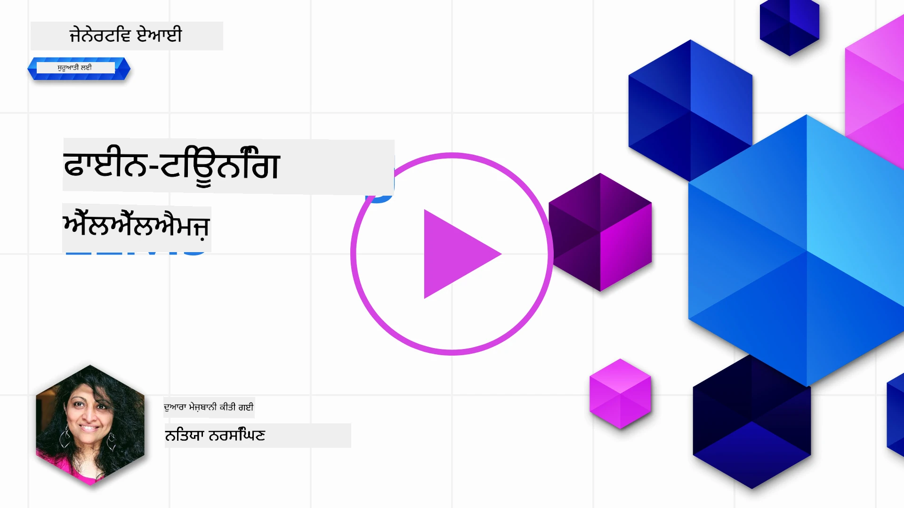
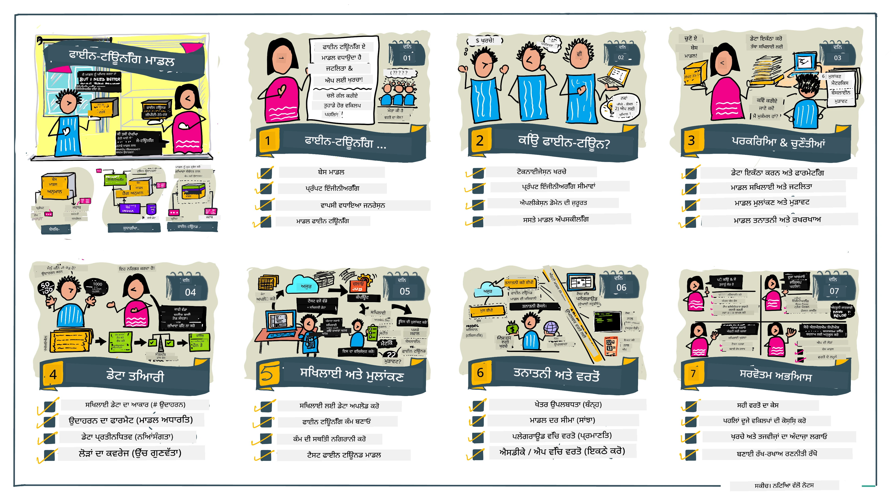

# ਆਪਣੀ LLM ਨੂੰ ਫਾਈਨ-ਟਿਊਨ ਕਰਨਾ

ਜਨਰੇਟਿਵ AI ਐਪਲੀਕੇਸ਼ਨਾਂ ਬਣਾਉਣ ਲਈ ਵੱਡੇ ਭਾਸ਼ਾ ਮਾਡਲਾਂ ਦਾ ਇਸਤੇਮਾਲ ਕਰਨ ਨਾਲ ਨਵੀਆਂ ਚੁਣੌਤੀਆਂ ਸਾਹਮਣੇ ਆਉਂਦੀਆਂ ਹਨ। ਇੱਕ ਮੁੱਖ ਮੁੱਦਾ ਇਹ ਯਕੀਨੀ ਬਣਾਉਣਾ ਹੈ ਕਿ ਮਾਡਲ ਦੁਆਰਾ ਦਿੱਤੇ ਗਏ ਜਵਾਬ ਦੀ ਗੁਣਵੱਤਾ (ਸਹੀ ਅਤੇ ਸਸੰਬੰਧਤ) ਯੂਜ਼ਰ ਦੀ ਖਾਸ ਬੇਨਤੀ ਦੇ ਲਈ ਉਚਿਤ ਹੋਵੇ। ਪਿਛਲੇ ਪਾਠਾਂ ਵਿੱਚ, ਅਸੀਂ ਪ੍ਰੋੰਪਟ ਇੰਜੀਨੀਅਰਿੰਗ ਅਤੇ ਰੀਟਰੀਵਲ-ਵਾਧੂ ਪੈਦਾਵਾਰ ਵਰਗੀਆਂ ਤਕਨੀਕਾਂ ਬਾਰੇ ਗੱਲ ਕੀਤੀ ਹੈ ਜੋ ਮੌਜੂਦਾ ਮਾਡਲ ਵਿਚ ਪ੍ਰੋੰਪਟ ਇੰਪੁੱਟ ਨੂੰ ਸੋਧ ਕੇ ਇਸ ਸਮੱਸਿਆ ਦਾ ਹੱਲ ਲੱਭਣ ਦੀ ਕੋਸ਼ਿਸ਼ ਕਰਦੀਆਂ ਹਨ।

ਅੱਜ ਦੇ ਪਾਠ ਵਿੱਚ, ਅਸੀਂ ਤੀਜੀ ਤਕਨੀਕ ਬਾਰੇ ਗੱਲ ਕਰਾਂਗੇ, **ਫਾਈਨ-ਟਿਊਨਿੰਗ**, ਜੋ ਇਸ ਚੁਣੌਤੀ ਨੂੰ ਆਤਮ ਮਾਡਲ ਨੂੰ ਵਾਧੂ ਡਾਟਾ ਨਾਲ ਦੁਬਾਰਾ ਸਿੱਖਾ ਕੇ ਹੱਲ ਕਰਨ ਦੀ ਕੋਸ਼ਿਸ਼ ਕਰਦੀ ਹੈ। ਆਓ ਵੇਰਵਿਆਂ ਵਿੱਚ ਜਾਈਏ।

## ਸਿੱਖਣ ਦੇ ਉਦੇਸ਼

ਇਹ ਪਾਠ ਪ੍ਰੀ-ਟ੍ਰੇਨ ਕੀਤੇ ਲੈਂਗਵੇਜ ਮਾਡਲਾਂ ਲਈ ਫਾਈਨ-ਟਿਊਨਿੰਗ ਦੇ ਸੰਕਲਪ ਨੂੰ ਪੇਸ਼ ਕਰਦਾ ਹੈ, ਇਸ ਪਹੁੰਚ ਦੇ ਲਾਭ ਅਤੇ ਚੁਣੌਤੀਆਂ ਦੀ ਖੋਜ ਕਰਦਾ ਹੈ, ਅਤੇ ਦਿਸ਼ਾ-ਨਿਰਦੇਸ਼ ਦਿੰਦਾ ਹੈ ਕਿ ਕਦੋਂ ਅਤੇ ਕਿਸ ਤਰ੍ਹਾਂ ਜਨਰੇਟਿਵ AI ਮਾਡਲਾਂ ਦੀ ਕਾਰਗੁਜ਼ਾਰੀ ਸੁਧਾਰਣ ਲਈ ਫਾਈਨ-ਟਿਊਨਿੰਗ ਵਰਤੀ ਜਾਵੇ।

ਇਸ ਪਾਠ ਦੇ ਅੰਤ 'ਤੇ, ਤੁਸੀਂ ਹੇਠ ਲਿਖੇ ਪ੍ਰਸ਼ਨਾਂ ਦੇ ਜਵਾਬ ਦੇ ਸਕੋਗੇ:

- ਭਾਸ਼ਾ ਮਾਡਲਾਂ ਲਈ ਫਾਈਨ-ਟਿਊਨਿੰਗ ਕੀ ਹੈ?
- ਕਦੋਂ ਅਤੇ ਕਿਉਂ ਫਾਈਨ-ਟਿਊਨਿੰਗ ਲਾਭਕਾਰੀ ਹੁੰਦੀ ਹੈ?
- ਮੈਂ ਪ੍ਰੀ-ਟ੍ਰੇਨ ਮਾਡਲ ਨੂੰ ਕਿਵੇਂ ਫਾਈਨ-ਟਿਊਨ ਕਰ ਸਕਦਾ ਹਾਂ?
- ਫਾਈਨ-ਟਿਊਨਿੰਗ ਦੀਆਂ ਸੀਮਾਵਾਂ ਕੀ ਹਨ?

ਤਿਆਰ? ਚੱਲੋ ਸ਼ੁਰੂ ਕਰੀਏ।

## ਪ੍ਰਦਰਸ਼ਿਤ ਗਾਈਡ

ਕੀ ਤੁਸੀਂ ਜਾਣਨਾ ਚਾਹੁੰਦੇ ਹੋ ਕਿ ਅਸੀਂ ਕੀ ਕਵਰ ਕਰਾਂਗੇ ਇਸ ਤੋਂ ਪਹਿਲਾਂ ਕਿ ਅਸੀਂ ਅੰਦਰ ਵੱਧੀਏ? ਇਸ ਪ੍ਰਦਰਸ਼ਿਤ ਗਾਈਡ ਨੂੰ ਵੇਖੋ ਜੋ ਫਾਈਨ-ਟਿਊਨਿੰਗ ਲਈ ਮੁੱਖ ਸੰਕਲਪਾਂ ਅਤੇ ਪ੍ਰੇਰਣਾ ਤੋਂ ਲੈ ਕੇ ਪ੍ਰਕ੍ਰਿਆ ਅਤੇ ਸਰਵੋਤਮ ਅਭਿਆਸਾਂ ਦੀ ਸਮਝ ਤੱਕ ਸਿੱਖਣ ਯਾਤਰਾ ਦਾ ਵਰਣਨ ਕਰਦਾ ਹੈ। ਇਹ ਖੋਜ ਲਈ ਇੱਕ ਦਿਲਚਸਪ ਵਿਸ਼ਾ ਹੈ, ਇਸ ਲਈ ਸਵੈ-ਅਧਿਆਨ ਯਾਤਰਾ ਨੂੰ ਸਮਰਥਨ ਦੇਣ ਲਈ ਵਾਧੂ ਲਿੰਕਾਂ ਲਈ [Resources](./RESOURCES.md?WT.mc_id=academic-105485-koreyst) ਪੰਨਾ ਨਾ ਭੁੱਲੋ!

## ਭਾਸ਼ਾ ਮਾਡਲਾਂ ਲਈ ਫਾਈਨ-ਟਿਊਨਿੰਗ ਕੀ ਹੈ?

ਪਰਿਭਾਸ਼ਾ ਅਨੁਸਾਰ, ਵੱਡੇ ਭਾਸ਼ਾ ਮਾਡਲ ਵੱਡੀ ਮਾਤਰਾ ਵਿਭਿੰਨ ਸਰੋਤਾਂ ਤੋਂ ਲਿਆ ਗਏ ਟੈਕਸਟ 'ਤੇ _ਪ੍ਰੀ-ਟ੍ਰੇਨ_ ਹੁੰਦੇ ਹਨ। ਜਿਵੇਂ ਕਿ ਅਸੀਂ ਪਿਛਲੇ ਪਾਠਾਂ ਵਿੱਚ ਸਿੱਖਿਆ, ਮਾਡਲ ਦੇ ਉੱਤਰਾਂ ਦੀ ਗੁਣਵੱਤਾ ਸੁਧਾਰਨ ਲਈ ਹੇਠ ਲਿਖੀਆਂ ਤਕਨੀਕਾਂ ਦੀ ਲੋੜ ਹੁੰਦੀ ਹੈ: _ਪ੍ਰੋੰਪਟ ਇੰਜੀਨੀਅਰਿੰਗ_ ਅਤੇ _ਰੀਟਰੀਵਲ-ਵਾਧੂ ਪੈਦਾਵਾਰ_।

ਇੱਕ ਪ੍ਰਸਿੱਧ ਪ੍ਰੋੰਪਟ-ਇੰਜੀਨੀਅਰਿੰਗ ਤਕਨੀਕ ਮਾਡਲ ਨੂੰ ਇਹ ਦੱਸਣ ਦੀ ਹੁੰਦ ਹੈ ਕਿ ਉੱਤਰ 'ਚ ਕੀ ਉਮੀਦ ਕੀਤੀ ਜਾਂਦੀ ਹੈ, ਜਿਵੇਂ ਕਿ _ਹدایਤਾਂ_ ਦੇ ਕੇ (ਸਪਸ਼ਟ ਨਿਰਦੇਸ਼) ਜਾਂ ਕੁਝ ਉਦਾਹਰਣਾਂ ਦੇ ਕੇ (ਅਪਸਪਸ਼ਟ ਨਿਰਦੇਸ਼)। ਇਸਨੂੰ _ਫਿਊ-ਸ਼ੌਟ ਲਰਨਿੰਗ_ ਕਿਹਾ ਜਾਂਦਾ ਹੈ ਪਰ ਇਸ ਦੇ ਦੋ ਸੀਮਿਤ ਪਹਿਲੂ ਹਨ:

- ਮਾਡਲ ਟੋਕਨ ਸੀਮਾਵਾਂ ਕਾਰਨ ਤੁਸੀਂ ਸਾਰੇ ਉਦਾਹਰਣ ਨਹੀਂ ਦੇ ਸਕਦੇ ਅਤੇ ਪ੍ਰਭਾਵ ਘਟ ਜਾਦਾ ਹੈ।
- ਮਾਡਲ ਟੋਕਨ ਲਾਗਤ ਕਾਰਨ ਹਰ ਪ੍ਰੋੰਪਟ ਵਿੱਚ ਉਦਾਹਰਣ जोड़ਣਾ ਮਹਿੰਗਾ ਹੋ ਸਕਦਾ ਹੈ ਅਤੇ ਲਚਕੀਲਾਪਣ ਘਟਦਾ ਹੈ।

ਫਾਈਨ-ਟਿਊਨਿੰਗ ਮਸ਼ੀਨ ਲਰਨਿੰਗ ਸਿਸਟਮਾਂ ਵਿੱਚ ਅਕਸਰ ਵਰਤੀ ਜਾਂਦੀ ਪ੍ਰਕਿਰਿਆ ਹੈ ਜਿੱਥੇ ਅਸੀਂ ਇੱਕ ਪ੍ਰੀ-ਟ੍ਰੇਨ ਮਾਡਲ ਲੈ ਕੇ ਉਸ ਨੂੰ ਨਵੇਂ ਡਾਟੇ ਨਾਲ ਦੁਬਾਰਾ ਸਿੱਖਾਊਂਦੇ ਹਾਂ ਤਾਂ ਜੋ ਇੱਕ ਖਾਸ ਕੰਮ ਲਈ ਇਸ ਦੀ ਕਾਰਗੁਜ਼ਾਰੀ ਸੁਧਾਰੇ। ਭਾਸ਼ਾ ਮਾਡਲਾਂ ਦੇ ਸੰਦਰਭ ਵਿੱਚ, ਅਸੀਂ ਪ੍ਰੀ-ਟ੍ਰੇਨ ਮਾਡਲ ਨੂੰ _ਖਾਸ ਕੰਮ ਜਾਂ ਐਪਲੀਕੇਸ਼ਨ ਡੋਮੇਨ ਲਈ ਚੁਣੀ ਹੋਈ ਉਦਾਹਰਣਾਂ ਦੇ ਨਾਲ ਫਾਈਨ-ਟਿਊਨ ਕਰ ਸਕਦੇ ਹਾਂ_ ਤਾਂ ਜੋ ਇੱਕ **ਕਸਟਮ ਮਾਡਲ** ਤਿਆਰ ਕੀਤਾ ਜਾਵੇ ਜੋ ਉਸ ਖਾਸ ਕੰਮ ਜਾਂ ਡੋਮੇਨ ਲਈ ਵਧੇਰੇ ਸਹੀ ਅਤੇ ਸਸੰਬੰਧਿਤ ਹੋ ਸਕੇ। ਫਾਈਨ-ਟਿਊਨਿੰਗ ਦਾ ਇਕ ਹੋਰ ਲਾਭ ਇਹ ਵੀ ਹੈ ਕਿ ਇਸ ਨਾਲ ਥੋੜ੍ਹੀਆਂ ਉਦਾਹਰਣਾਂ ਦੀ ਲੋੜ ਘਟ ਜਾਂਦੀ ਹੈ - ਜਿਸ ਨਾਲ ਟੋਕਨ ਦੀ ਖਪਤ ਅਤੇ ਲਾਗਤ ਘਟਦੀ ਹੈ।

## ਕਦੋਂ ਅਤੇ ਕਿਉਂ ਫਾਈਨ-ਟਿਊਨ ਮਾਡਲ ਕਰਨੇ ਚਾਹੀਦੇ ਹਨ?

ਇਸ ਤੇ ਇਸ ਸੰਦਰਭ 'ਚ, ਜਦ ਅਸੀਂ ਫਾਈਨ-ਟਿਊਨਿੰਗ ਦੀ ਗੱਲ ਕਰਦੇ ਹਾਂ, ਅਸੀਂ **ਸੁਪਰਵਾਈਜ਼ਡ** ਫਾਈਨ-ਟਿਊਨਿੰਗ ਦੀ ਗੱਲ ਕਰ ਰਹੇ ਹਾਂ ਜਿੱਥੇ ਦੁਬਾਰਾ ਸਿੱਖਿਆ ਨਵਾਂ ਡਾਟਾ ਜੋ ਮੂਲ ਸਿਖਲਾਈ ਡਾਟਾਸੈੱਟ ਦਾ ਹਿੱਸਾ ਨਹੀਂ ਸੀ, ਉਸਦੇ ਜੋੜਣ ਨਾਲ ਹੋਦੀ ਹੈ। ਇਹ ਉਸ ਅਣਸੁਪਰਵਾਈਜ਼ਡ ਫਾਈਨ-ਟਿਊਨਿੰਗ ਵਿਧੀ ਤੋਂ ਵੱਖਰਾ ਹੈ ਜਿੱਥੇ ਮਾਡਲ ਨੂੰ ਮੂਲ ਡਾਟਾ 'ਤੇ ਹੀ ਵੱਖ-ਵੱਖ ਹਾਈਪਰਪੈਰਾਮੀਟਰਾਂ ਨਾਲ ਦੁਬਾਰਾ ਟ੍ਰੇਨ ਕੀਤਾ ਜਾਂਦਾ ਹੈ।

ਮੁੱਖ ਗੱਲ ਇਹ ਯਾਦ ਰੱਖਣ ਦੀ ਹੈ ਕਿ ਫਾਈਨ-ਟਿਊਨਿੰਗ ਇੱਕ ਉੱਨਤ ਤਕਨੀਕ ਹੈ ਜਿਸਨੂੰ ਚਾਹੀਦਾ ਹੈ ਕੁਝ ਮਾਹਿਰਤ ਜੇਵੀਂ ਸਮਝ ਤਾਂ ਜੋ ਇੱਛਿਤ ਨਤੀਜੇ ਪ੍ਰਾਪਤ ਹੋ ਸਕਣ। ਜੇ ਇਹ ਠੀਕ ਤਰ੍ਹਾਂ ਨਹੀਂ ਕੀਤੀ ਜਾਂਦੀ, ਤਾਂ ਇਹ ਉਮੀਦ ਕੀਤੀਆਂ ਸੁਧਾਰਾਂ ਨਹੀਂ ਦੇ ਸਕਦੀ, ਅਤੇ ਮੇਲ ਖਾਂਦੇ ਡੋਮੇਨ ਵਿੱਚ ਮਾਡਲ ਦੀ ਕਾਰਗੁਜ਼ਾਰੀ ਨੂੰ ਵੀ ਬੁਰਾ ਕਰ ਸਕਦੀ ਹੈ।

ਇਸ ਲਈ, "ਕਿਵੇਂ" ਭਾਸ਼ਾ ਮਾਡਲਾਂ ਨੂੰ ਫਾਈਨ-ਟਿਊਨ ਕਰਨਾ ਸਿੱਖਣ ਤੋਂ ਪਹਿਲਾਂ, ਤੁਹਾਨੂੰ ਇਹ ਜਾਣਨਾ ਲਾਜ਼ਮੀ ਹੈ ਕਿ "ਕਿਉਂ" ਤੁਸੀਂ ਇਸ ਰਸਤੇ ਨੂੰ ਚੁਣਨਾ ਚਾਹੁੰਦੇ ਹੋ ਅਤੇ "ਕਦੋਂ" ਫਾਈਨ-ਟਿਊਨਿੰਗ ਦੀ ਪ੍ਰਕਿਰਿਆ ਸ਼ੁਰੂ ਕਰਨੀ ਚਾਹੀਦੀ ਹੈ। ਇਨ੍ਹਾਂ ਸਵਾਲਾਂ ਤੋਂ ਅੱਗੇ ਵਧੋ:

- **ਵਰਤੋਂ ਦਾ ਕੇਸ**: ਤੁਹਾਡਾ ਫਾਈਨ-ਟਿਊਨਿੰਗ ਲਈ _ਉਪਯੋਗ ਕੇਸ_ ਕੀ ਹੈ? ਮੌਜੂਦਾ ਪ੍ਰੀ-ਟ੍ਰੇਨ ਮਾਡਲ ਦੇ ਕਿਸ ਪੱਖ ਨੂੰ ਤੁਸੀਂ ਸੁਧਾਰਨਾ ਚਾਹੁੰਦੇ ਹੋ?
- **ਵਿਕਲਪ**: ਕੀ ਤੁਸੀਂ ਇੱਛਿਤ ਨਤੀਜੇ ਪ੍ਰਾਪਤ ਕਰਨ ਲਈ ਹੋਰ ਤਕਨੀਕਾਂ ਦੀ ਕੋਸ਼ਿਸ਼ ਕੀਤੀ ਹੈ? ਉਨ੍ਹਾਂ ਦੀ ਵਰਤੋਂ ਕਰਕੇ ਤੁਲਨਾ ਲਈ ਬੇਸਲਾਈਨ ਬਣਾਓ।
  - ਪ੍ਰੋੰਪਟ ਇੰਜੀਨੀਅਰਿੰਗ: ਮੇਲ ਖਾਂਦੇ ਪ੍ਰੋੰਪਟ ਜਵਾਬਾਂ ਦੇ ਕੁਝ ਉਦਾਹਰਣਾਂ ਨਾਲ ਫਿਊ-ਸ਼ੌਟ ਪ੍ਰੋੰਪਟਿੰਗ ਵਰਗੀਆਂ ਤਕਨੀਕਾਂ ਦੀ ਕੋਸ਼ਿਸ਼ ਕਰੋ। ਜਵਾਬਾਂ ਦੀ ਗੁਣਵੱਤਾ ਦਾ ਅੰਕਨ ਕਰੋ।
  - ਰੀਟਰੀਵਲ ਵਾਧੂ ਪੈਦਾਵਾਰ: ਆਪਣੇ ਡਾਟੇ ਦੀ ਖੋਜ ਕਰਕੇ ਪ੍ਰੋੰਪਟਾਂ ਨੂੰ ਪੁੱਛਾਂੜੀ ਦੇ ਨਤੀਜਿਆਂ ਨਾਲ ਵਧਾਓ। ਜਵਾਬਾਂ ਦੀ ਗੁਣਵੱਤਾ ਦਾ ਅੰਕਨ ਕਰੋ।
- **ਲਾਗਤਾਂ**: ਕੀ ਤੁਸੀਂ ਫਾਈਨ-ਟਿਊਨਿੰਗ ਦੀਆਂ ਲਾਗਤਾਂ ਪਛਾਣੀਆਂ ਹਨ?
  - ਟਿਊਨਬੀਲਟੀ - ਕੀ ਪ੍ਰੀ-ਟ੍ਰੇਨ ਮਾਡਲ ਫਾਈਨ-ਟਿਊਨ ਲਈ ਉਪਲਬਧ ਹੈ?
  - ਕੋਸ਼ਿਸ਼ - ਟ੍ਰੇਨਿੰਗ ਡਾਟਾ ਤਿਆਰ ਕਰਨ, ਮਾਡਲ ਦਾ ਮੁਲਾਂਕਣ ਅਤੇ ਸੁਧਾਰ ਕਰਨ ਲਈ।
  - ਕੰਪਿਊਟ - ਫਾਈਨ-ਟਿਊਨਿੰਗ ਕੰਮ ਚਲਾਉਣ ਅਤੇ ਫਾਈਨ-ਟਿਊਨ ਕੀਤਾ ਮਾਡਲ ਤਾਇਨਾਤ ਕਰਨ ਲਈ।
  - ਡਾਟਾ - ਫਾਈਨ-ਟਿਊਨਿੰਗ ਪ੍ਰਭਾਵ ਲਈ ਕਾਫੀ ਉਚਿਤ ਉਦਾਹਰਣਾਂ ਤੱਕ ਪਹੁੰਚ।
- **ਲਾਭ**: ਕੀ ਤੁਸੀਂ ਫਾਈਨ-ਟਿਊਨਿੰਗ ਦੇ ਲਾਭਕੀ ਨੂੰ ਪੱਕਾ ਕੀਤਾ ਹੈ?
  - ਗੁਣਵੱਤਾ - ਕੀ ਫਾਈਨ-ਟਿਊਨ ਕੀਤਾ ਮਾਡਲ ਬੇਸਲਾਈਨ ਨੂੰ ਪਿੱਛੇ ਛੱਡਦਾ ਹੈ?
  - ਲਾਗਤ - ਕੀ ਇਹ ਪ੍ਰੋੰਪਟ ਸਧਾਰਨ ਕਰਕੇ ਟੋਕਨ ਦੀ ਵਰਤੋਂ ਘਟਾਉਂਦਾ ਹੈ?
  - ਵਿਸਤਾਰਯੋਗਤਾ - ਕੀ ਤੁਸੀਂ ਮੂਲ ਮਾਡਲ ਨੂੰ ਨਵੀਆਂ ਡੋਮੇਨਾਂ ਲਈ ਦੁਬਾਰਾ ਵਰਤ ਸਕਦੇ ਹੋ?

ਇਨ ਸਵਾਲਾਂ ਦੇ ਜਵਾਬ ਦੇ ਕੇ, ਤੁਸੀਂ ਇਹ ਤੈਅ ਕਰ ਸਕੋਗੇ ਕਿ ਫਾਈਨ-ਟਿਊਨਿੰਗ ਤੁਹਾਡੇ ਉਪਯੋਗ ਕੇਸ ਲਈ ਠੀਕ ਪਹੁੰਚ ਹੈ ਕਿ ਨਹੀਂ। ਆਦਰਸ਼ ਰੂਪ ਵਿੱਚ, ਇਹ ਪਹੁੰਚ ਤਦ ਹੀ ਵਾਜਬ ਹੁੰਦੀ ਹੈ ਜਦ ਲਾਭ ਲਾਗਤ ਤੋਂ ਵੱਧ ਹੋਣ। ਜਦ ਤੁਸੀਂ ਅੱਗੇ ਵਧਣ ਦਾ ਫੈਸਲਾ ਕਰ ਲਓ, ਤਾਂ ਸੋਚੋ ਕਿ ਤੁਸੀਂ ਪ੍ਰੀ-ਟ੍ਰੇਨ ਮਾਡਲ ਨੂੰ _ਕਿਵੇਂ_ ਫਾਈਨ-ਟਿਊਨ ਕਰ ਸਕਦੇ ਹੋ।

ਫੈਸਲੇ ਕਰਨ ਦੀ ਪ੍ਰਕਿਰਿਆ ਬਾਰੇ ਹੋਰ ਜਾਣਵਾਰੀ ਲਈ [To fine-tune or not to fine-tune](https://www.youtube.com/watch?v=0Jo-z-MFxJs) ਵੇਖੋ।

## ਅਸੀਂ ਕਿਵੇਂ ਪ੍ਰੀ-ਟ੍ਰੇਨ ਮਾਡਲ ਨੂੰ ਫਾਈਨ-ਟਿਊਨ ਕਰ ਸਕਦੇ ਹਾਂ?

ਪ੍ਰੀ-ਟ੍ਰੇਨ ਮਾਡਲ ਨੂੰ ਫਾਈਨ-ਟਿਊਨ ਕਰਨ ਲਈ ਤੁਹਾਡੇ ਕੋਲ ਹੋਣਾ ਚਾਹੀਦਾ ਹੈ:

- ਫਾਈਨ-ਟਿਊਨ ਕਰਨ ਲਈ ਇੱਕ ਪ੍ਰੀ-ਟ੍ਰੇਨ ਮਾਡਲ
- ਫਾਈਨ-ਟਿਊਨਿੰਗ ਲਈ ਵਰਤਣ ਵਾਲਾ ਡਾਟਾਸੈੱਟ
- ਫਾਈਨ-ਟਿਊਨਿੰਗ ਕੰਮ ਚਲਾਉਣ ਲਈ ਟ੍ਰੇਨਿੰਗ ਵਾਤਾਵਰਣ
- ਫਾਈਨ-ਟਿਊਨ ਕੀਤਾ ਮਾਡਲ ਤਾਇਨਾਤ ਕਰਨ ਲਈ ਹੋਸਟਿੰਗ ਵਾਤਾਵਰਣ

## ਫਾਈਨ-ਟਿਊਨਿੰਗ ਪ੍ਰਦਰਸ਼ਿਤ

ਹੇਠਾਂ ਦਿੱਤੇ ਸਰੋਤ ਚੁਣੇ ਹੋਏ ਮਾਡਲ ਅਤੇ ਚੁਣੀ ਹੋਈ ਡਾਟਾਸੈੱਟ ਨਾਲ ਹਥਿਆਰਬੰਦ ਮਿਸਾਲ ਦੇ ਕੇ ਤੁਹਾਡੇ ਨਾਲ ਤਫਸੀਲੀ ਟਿਊਟੋਰਿਯਲ ਕਰਦੇ ਹਨ। ਇਨ੍ਹਾਂ ਟਿਊਟੋਰਿਯਲਾਂ ਨੂੰ ਕਰਨ ਲਈ, ਤੁਹਾਨੂੰ ਸਫ਼ਾਰਮੀ ਕੰਪਨੀ 'ਤੇ ਖਾਤਾ ਅਤੇ ਸਬੰਧਿਤ ਮਾਡਲ ਤੇ ਡਾਟਾ ਤੱਕ ਪਹੁੰਚ ਦੀ ਲੋੜ ਹੁੰਦੀ ਹੈ।

| ਪ੍ਰਦਾਤਾ     | ਟਿਊਟੋਰਿਯਲ                                                                                                                                                                     | ਵੇਰਵਾ                                                                                                                                                                                                                                                                                                                                                                                                                      |
| ------------ | ------------------------------------------------------------------------------------------------------------------------------------------------------------------------------ | -------------------------------------------------------------------------------------------------------------------------------------------------------------------------------------------------------------------------------------------------------------------------------------------------------------------------------------------------------------------------------------------------------------------------- |
| OpenAI       | [How to fine-tune chat models](https://github.com/openai/openai-cookbook/blob/main/examples/How_to_finetune_chat_models.ipynb?WT.mc_id=academic-105485-koreyst)                | ਖ਼ਾਸ ਡੋਮੇਨ ("ਵਿਅੰਜਨ ਸਹਾਇਕ") ਲਈ `gpt-35-turbo` ਮਾਡਲ ਨੂੰ ਫਾਈਨ-ਟਿਊਨ ਕਰਨਾ ਸਿੱਖੋ, ਟ੍ਰੇਨਿੰਗ ਡਾਟਾ ਤਿਆਰ ਕਰੋ, ਫਾਈਨ-ਟਿਊਨਿੰਗ ਕੰਮ ਚਲਾਓ ਅਤੇ ਫਾਈਨ-ਟਿਊਨ ਕੀਤਾ ਮਾਡਲ ਇੰਫਰੈਂਸ ਲਈ ਵਰਤੋਂ।                                                                                                                                                                                                                                      |
| Azure OpenAI | [GPT 3.5 Turbo fine-tuning tutorial](https://learn.microsoft.com/azure/ai-services/openai/tutorials/fine-tune?tabs=python-new%2Ccommand-line?WT.mc_id=academic-105485-koreyst) | `gpt-35-turbo-0613` ਮਾਡਲ ਨੂੰ **Azure 'ਤੇ** ਫਾਈਨ-ਟਿਊਨ ਕਰਨ ਲਈ ਟ੍ਰੇਨਿੰਗ ਡਾਟਾ ਬਣਾਉਣ ਅਤੇ ਅਪਲੋਡ ਕਰਨ, ਫਾਈਨ-ਟਿਊਨਿੰਗ ਕੰਮ ਚਲਾਉਣ ਅਤੇ ਨਵੇਂ ਮਾਡਲ ਨੂੰ ਤਾਇਨਾਤ ਕਰਨ ਦੇ ਕਦਮ ਸਿੱਖੋ।                                                                                                                                                                                                                                                    |
| Hugging Face | [Fine-tuning LLMs with Hugging Face](https://www.philschmid.de/fine-tune-llms-in-2024-with-trl?WT.mc_id=academic-105485-koreyst)                                               | ਇਹ ਬਲੌਗ ਪੋਸਟ ਤੁਹਾਨੂੰ ਇੱਕ _ਖੁੱਲ੍ਹਾ LLM_ (ਜਿਵੇਂ `CodeLlama 7B`) ਨੂੰ [transformers](https://huggingface.co/docs/transformers/index?WT.mc_id=academic-105485-koreyst) ਲਾਇਬਰੇਰੀ ਅਤੇ [Transformer Reinforcement Learning (TRL)](https://huggingface.co/docs/trl/index?WT.mc_id=academic-105485-koreyst) ਨਾਲ ਫਾਈਨ-ਟਿਊਨ ਕਰਨਾ ਸਿਖਾਉਂਦਾ ਹੈ, ਖੁੱਲ੍ਹੇ [ਡਾਟਾਸੈੱਟ](https://huggingface.co/docs/datasets/index?WT.mc_id=academic-105485-koreyst) ਤੇ।  |
|              |                                                                                                                                                                                |                                                                                                                                                                                                                                                                                                                                                                                                                            |
| 🤗 AutoTrain | [Fine-tuning LLMs with AutoTrain](https://github.com/huggingface/autotrain-advanced/?WT.mc_id=academic-105485-koreyst)                                                         | AutoTrain (ਜਾਂ AutoTrain Advanced) ਹਗਿੰਗ ਫੇਸ ਵੱਲੋਂ ਵਿਕਸਤ ਕੀਤੀ ਪਾਇਥਨ ਲਾਇਬਰੇਰੀ ਹੈ ਜੋ ਕਈ ਵੱਖਰੇ ਕੰਮਾਂ ਲਈ ਫਾਈਨ-ਟਿਊਨਿੰਗ ਦੀ ਸਹੂਲਤ ਦਿੰਦੀ ਹੈ। AutoTrain ਇੱਕ ਨੋ-ਕੋਡ ਹੱਲ ਹੈ ਅਤੇ ਫਾਈਨ-ਟਿਊਨਿੰਗ ਤੁਹਾਡੇ ਆਪਣੇ ਕਲਾਉਡ, Hugging Face Spaces ਜਾਂ ਲੋਕਲ ਵਰਤੋਂ ਵਿੱਚ ਕੀਤੀ ਜਾ ਸਕਦੀ ਹੈ। ਇਸਦੇ ਵਿੱਚ ਵੈੱਬ-ਅਧਾਰਤ GUI, CLI ਅਤੇ ਯਾਮੈਲ ਕਨਫਿਗ ਫਾਇਲਾਂ ਰਾਹੀਂ ਟ੍ਰੇਨਿੰਗ ਨੂੰ ਸਹਾਰਾ ਮਿਲਦਾ ਹੈ।                                              |
|              |                                                                                                                                                                                |                                                                                                                                                                                                                                                                                                                                                                                                                            |
| 🦥 Unsloth | [Fine-tuning LLMs with Unsloth](https://github.com/unslothai/unsloth)                                                         | Unsloth ਇੱਕ ਖੁੱਲ੍ਹਾ ਸਰੋਤ ਫਰੇਮਵਰਕ ਹੈ ਜੋ LLM ਫਾਈਨ-ਟਿਊਨਿੰਗ ਅਤੇ ਰੀਇਨਫੋਰਸਮੈਂਟ ਲਰਨਿੰਗ (RL) ਨੂੰ ਸਮਰਥਨ ਦਿੰਦਾ ਹੈ। Unsloth ਸਥਾਨਕ ਟ੍ਰੇਨਿੰਗ, ਮੁਲਾਂਕਣ ਅਤੇ ਤਾਇਨਾਤ ਨੂੰ ਆਸਾਨ ਬਣਾਉਂਦਾ ਹੈ ਅਤੇ ਤਿਆਰ [ਨੋਟਬੁੱਕਸ](https://github.com/unslothai/notebooks) ਨਾਲ ਕੰਮ ਕਰਦਾ ਹੈ। ਇਹ ਟੈਕਸਟ-ਟੂ-ਸਪੀਚ (TTS), BERT ਅਤੇ ਮਲਟੀਮੋਡਲ ਮਾਡਲਾਂ ਨੂੰ ਵੀ ਸਮਰਥਨ ਦਿੰਦਾ ਹੈ। ਸ਼ੁਰੂ ਕਰਨ ਲਈ, ਉਹਨਾਂ ਦੀ [Fine-tuning LLMs Guide](https://docs.unsloth.ai/get-started/fine-tuning-llms-guide) ਪੜ੍ਹੋ।                                    |
|              |                                                                                                                                                                                |                                                                                                                                                                                                                                                                                                                                                                                                                            |
## ਅਸਾਈਨਮੈਂਟ

ਉਪਰ ਦਿੱਤੇ ਟਿਊਟੋਰਿਯਲਾਂ ਵਿੱਚੋਂ ਇੱਕ ਚੁਣੋ ਅਤੇ ਉਸਦੇ ਵਿੱਚ ਅੱਗੇ ਵਧੋ। _ਅਸੀਂ ਇਹ ਟਿਊਟੋਰਿਯਲ Jupyter Notebooks ਵਿੱਚ ਇਸ ਰੇਪੋ ਵਿੱਚ ਸਿਰਫ ਸੰਦਰਭ ਲਈ ਦੁਹਰਾ ਸਕਦੇ ਹਾਂ। ਕਿਰਪਾ ਕਰਕੇ ਤਾਜ਼ਾ ਸੰਸਕਰਣ ਲਈ ਮੂਲ ਸਰੋਤ ਸੀਧਾ ਵਰਤੋਂ।_

## ਸ਼ਾਬਾਸ਼! ਆਪਣੀ ਸਿੱਖਿਆ ਜਾਰੀ ਰੱਖੋ।

ਇਸ ਪਾਠ ਨੂੰ ਪੂਰਾ ਕਰਨ ਤੋਂ ਬਾਦ, ਸਾਡੇ [Generative AI Learning collection](https://aka.ms/genai-collection?WT.mc_id=academic-105485-koreyst) ਨੂੰ ਵੇਖੋ ਅਤੇ ਆਪਣੀ Generative AI ਗਿਆਨ ਦੀ ਸਤਰ ਉੱਚੀ ਕਰੋ!

ਤੁਹਾਨੂੰ ਮੁਬਾਰਕਾਂ!! ਤੁਸੀਂ ਇਸ ਕੋਰਸ ਦੀ v2 ਸੀਰੀਜ਼ ਦਾ ਆਖਰੀ ਪਾਠ ਪੂਰਾ ਕਰ ਲਿਆ ਹੈ! ਸਿੱਖਦੇ ਅਤੇ ਬਣਾਉਂਦੇ ਰਹੋ। \*\*ਮਾਤਰ ਇਸ ਵਿਸ਼ੇ ਲਈ ਵਾਧੂ ਸੁਝਾਵਾਂ ਦੀ ਸੂਚੀ ਲਈ [RESOURCES](RESOURCES.md?WT.mc_id=academic-105485-koreyst) ਪੰਨਾ ਵੇਖੋ।

ਸਾਡੀ v1 ਸੀਰੀਜ਼ ਵੀ ਹੋਰ ਅਸਾਈਨਮੈਂਟਾਂ ਅਤੇ ਸੰਕਲਪਾਂ ਨਾਲ ਅਪਡੇਟ ਕੀਤੀ ਗਈ ਹੈ। ਇਸ ਲਈ ਆਪਣਾ ਗਿਆਨ ਤਾਜ਼ਾ ਕਰਨ ਲਈ ਇੱਕ ਮਿੰਟ ਕੱਢੋ - ਅਤੇ ਕਿਰਪਾ ਕਰਕੇ ਆਪਣੀਆਂ ਸਵਾਲਾਂ ਤੇ ਫੀਡਬੈਕ ਸਾਂਝਾ ਕਰੋ ([https://github.com/microsoft/generative-ai-for-beginners/issues?WT.mc_id=academic-105485-koreyst](https://github.com/microsoft/generative-ai-for-beginners/issues?WT.mc_id=academic-105485-koreyst)) ਤਾਂ ਜੋ ਸਾਡੇ ਇਹ ਪਾਠ ਕਮਿਊਨਿਟੀ ਲਈ ਹੋਰ ਵਧੀਆ ਬਣਾਈਏ।

---

<!-- CO-OP TRANSLATOR DISCLAIMER START -->
**ਸਪਸ਼ਟੀकरण**:  
ਇਹ ਦਸਤਾਵੇਜ਼ AI ਅਨੁਵਾਦ ਸੇਵਾ [Co-op Translator](https://github.com/Azure/co-op-translator) ਦੀ ਵਰਤੋਂ ਕਰਕੇ ਅਨੁਵਾਦਿਤ ਕੀਤਾ ਗਿਆ ਹੈ। ਜਦੋਂ ਕਿ ਅਸੀਂ ਸਹੀਅਤ ਲਈ ਕੋਸ਼ਿਸ਼ ਕਰਦੇ ਹਾਂ, ਕਿਰਪਾ ਕਰਕੇ ਧਿਆਨ ਰੱਖੋ ਕਿ ਆਟੋਮੈਟਿਕ ਅਨੁਵਾਦਾਂ ਵਿੱਚ ਗਲਤੀਆਂ ਜਾਂ ਅਸੁਚਿਤਤਾਵਾਂ ਹੋ ਸਕਦੀਆਂ ਹਨ। ਮੂਲ ਦਸਤਾਵੇਜ਼ ਉਸਦੀ ਮੂਲ ਭਾਸ਼ਾ ਵਿੱਚ ਹੀ ਪ੍ਰਮਾਣਿਕ ਸਰੋਤ ਮੰਨਿਆ ਜਾਣਾ ਚਾਹੀਦਾ ਹੈ। ਸੰਵੇਦਨਸ਼ੀਲ ਜਾਣਕਾਰੀ ਲਈ, ਪੇਸ਼ੇਵਰ ਮਨੁੱਖੀ ਅਨੁਵਾਦ ਦੀ ਸਿਫ਼ਾਰਸ਼ ਕੀਤੀ ਜਾਂਦੀ ਹੈ। ਇਸ ਅਨੁਵਾਦ ਦੀ ਵਰਤੋਂ ਨਾਲ ਹੋਣ ਵਾਲੀਆਂ ਕਿਸੇ ਵੀ ਗਲਤਫਹਿਮੀਆਂ ਜਾਂ ਗਲਤ ਵਿਵਖਿਆਵਾਂ ਲਈ ਅਸੀਂ ਜ਼ਿੰਮੇਵਾਰ ਨਹੀਂ ਹਾਂ।
<!-- CO-OP TRANSLATOR DISCLAIMER END -->