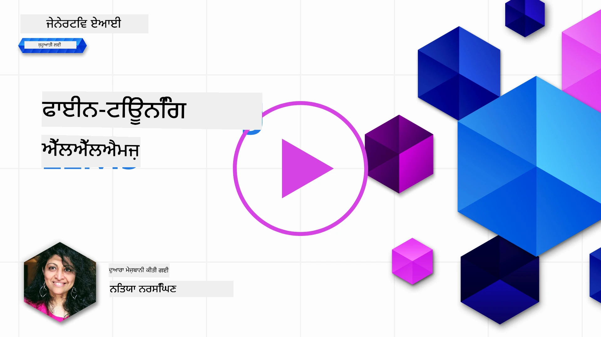
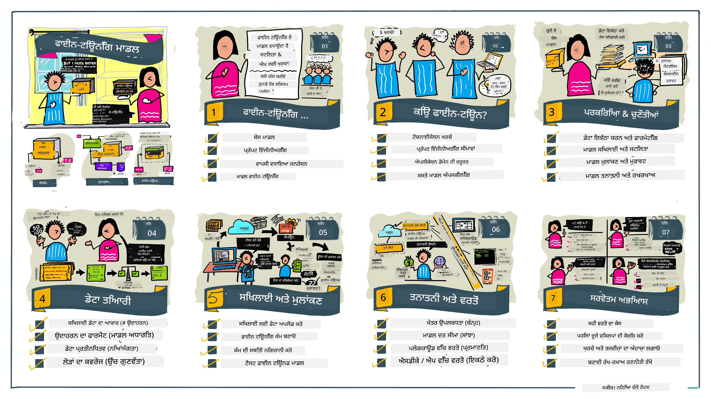

# ਤੁਹਾਡੇ LLM ਦੀ ਬਾਰਿਕੀ ਨਾਲ ਟ੍ਰੇਨਿੰਗ (Fine-Tuning)

ਵੱਡੇ ਭਾਸ਼ਾਈ ਮਾਡਲਾਂ ਦੀ ਵਰਤੋਂ ਕਰਕੇ ਜਨਰੇਟਿਵ AI ਐਪਲੀਕੇਸ਼ਨਾਂ ਬਣਾਉਣ ਨਾਲ ਨਵੇਂ ਚੈਲੇਂਜ ਆਉਂਦੇ ਹਨ। ਇੱਕ ਮੁੱਖ ਮੁੱਦਾ ਇਹ ਹੈ ਕਿ ਮਾਡਲ ਵੱਲੋਂ ਕਿਸੇ ਦਿੱਤੇ ਗਏ ਉਪਭੋਗਤਾ ਦੀ ਬੇਨਤੀ ਲਈ ਉਤਪੰਨ ਸਮੱਗਰੀ ਵਿੱਚ ਜਵਾਬ ਦੀ ਕੁਆਲਟੀ (ਸਹੀਤਾ ਅਤੇ ਸੰਬੰਧਤਾ) ਨੂੰ ਯਕੀਨੀ ਬਣਾਉਣਾ। ਪਿਛਲੇ ਪਾਠਾਂ ਵਿੱਚ, ਅਸੀਂ ਪ੍ਰੌਂਪਟ ਇੰਜੀਨੀਅਰਿੰਗ ਅਤੇ ਰੀਟ੍ਰੀਵਲ-ਆਗਮੈਂਟਿਡ ਜਨਰੇਸ਼ਨ ਵਰਗੀਆਂ ਤਕਨੀਕਾਂ ਬਾਰੇ ਗੱਲ ਕੀਤੀ ਹੈ ਜੋ ਮੌਜੂਦਾ ਮਾਡਲ ਦੇ ਪ੍ਰੌਂਪਟ ਇਨਪੁਟ ਨੂੰ ਸੋਧ ਕੇ ਇਸ ਸਮੱਸਿਆ ਨੂੰ ਹੱਲ ਕਰਨ ਦੀ ਕੋਸ਼ਿਸ਼ ਕਰਦੀਆਂ ਹਨ।

ਅੱਜ ਦੇ ਪਾਠ ਵਿੱਚ, ਅਸੀਂ ਇੱਕ ਤੀਜੀ ਤਕਨੀਕ, **ਫਾਈਨ-ਟਿਊਨਿੰਗ**, ਬਾਰੇ ਗੱਲ ਕਰਾਂਗੇ ਜੋ ਇਸ ਚੈਲੇਂਜ ਨੂੰ ਮਾਡਲ ਨੂੰ ਵਾਧੂ ਡਾਟਾ ਨਾਲ ਦੁਬਾਰਾ ਟ੍ਰੇਨ ਕਰਕੇ ਹੱਲ ਕਰਨ ਦੀ ਕੋਸ਼ਿਸ਼ ਕਰਦੀ ਹੈ। ਚਲੋ ਵੇਰਵਿਆਂ ਵਿੱਚ ਜਾਈਏ।

## ਸਿੱਖਣ ਦੇ ਉਦੇਸ਼

ਇਹ ਪਾਠ ਪਹਿਲਾਂ ਤੋਂ ਟ੍ਰੇਨ ਕੀਤੇ ਗਏ ਭਾਸ਼ਾਈ ਮਾਡਲਾਂ ਲਈ ਫਾਈਨ-ਟਿਊਨਿੰਗ ਦੇ ਸੰਕਲਪ ਨੂੰ ਜਾਣਾਉਂਦਾ ਹੈ, ਇਸ ਪਹੁੰਚ ਦੇ ਲਾਭ ਅਤੇ ਚੁਣੌਤੀਆਂ ਦੀ ਪੜਤਾਲ ਕਰਦਾ ਹੈ, ਅਤੇ ਤੁਹਾਡੇ ਜਨਰੇਟਿਵ AI ਮਾਡਲਾਂ ਦੀ ਕਾਰਗੁਜ਼ਾਰੀ ਵਿੱਚ ਸੁਧਾਰ ਲਈ ਕਿਵੇਂ ਅਤੇ ਕਦੋਂ ਫਾਈਨ-ਟਿਊਨਿੰਗ ਵਰਤਣ ਬਾਰੇ ਮਦਦ ਦੇਂਦਾ ਹੈ।

ਇਸ ਪਾਠ ਦੇ ਅੰਤ ਤੱਕ, ਤੁਸੀਂ ਹੇਠਾਂ ਦਿੱਤੇ ਸਵਾਲਾਂ ਦੇ ਜਵਾਬ ਦੇ ਸਕੋਂਗੇ:

- ਭਾਸ਼ਾਈ ਮਾਡਲਾਂ ਲਈ ਫਾਈਨ-ਟਿਊਨਿੰਗ ਕੀ ਹੈ?
- ਕਦੋਂ ਅਤੇ ਕਿਉਂ ਫਾਈਨ-ਟਿਊਨਿੰਗ ਲਾਭਦਾਇਕ ਹੈ?
- ਮੈਂ ਪਹਿਲਾਂ ਤੋਂ ਟ੍ਰੇਨ ਕੀਤੇ ਮਾਡਲ ਨੂੰ ਕਿਵੇਂ ਫਾਈਨ-ਟਿਊਨ ਕਰ ਸਕਦਾ ਹਾਂ?
- ਫਾਈਨ-ਟਿਊਨਿੰਗ ਦੀਆਂ ਸੀਮਾਵਾਂ ਕੀ ਹਨ?

ਤਿਆਰ? ਚਲੋ ਸ਼ੁਰੂ ਕਰੀਏ।

## ਚਿੱਤਰ ਸਮੇਤ ਮਾਰਗਦਰਸ਼ਨ

ਤੁਹਾਨੂੰ ਜੋ ਕੁਝ ਇਸ ਪਾਠ ਵਿੱਚ ਬਿਆਨ ਕਰਾਂਗੇ, ਉਸਦਾ ਵੱਡਾ ਚਿੱਤਰ ਜਾਣਨਾ ਹੈ? ਇਸ ਚਿੱਤਰ ਸਮੇਤ ਮਾਰਗਦਰਸ਼ਨ ਨੂੰ ਵੇਖੋ ਜੋ ਇਸ ਪਾਠ ਲਈ ਸਿਖਲਾਈ ਯਾਤਰਾ ਨੂੰ ਵਰਣਨ ਕਰਦਾ ਹੈ - ਫਾਈਨ-ਟਿਊਨਿੰਗ ਦੇ ਮੁੱਖ ਸੰਕਲਪਾਂ ਅਤੇ ਪ੍ਰੇਰਣਾ ਨੂੰ ਸਮਝਣ ਤੋਂ ਲੈ ਕੇ ਇਸ ਕਾਰਜ ਨੂੰ ਅਮਲ ਵਿੱਚ ਲਿਆਂਉਣ ਲਈ ਭੇਤਰ ਤਰੀਕਿਆਂ ਤੱਕ। ਇਹ ਖੋਜ ਲਈ ਇੱਕ ਦਿਲਚਸਪ ਵਿਸ਼ਾ ਹੈ, ਇਸਲਈ [Resources](./RESOURCES.md?WT.mc_id=academic-105485-koreyst) ਪੇਜ ਨੂੰ ਬਿਲਕੁਲ ਨਾ ਭੁੱਲੋ ਜਿੱਥੇ ਹੋਰ ਸਹਾਇਕ ਲਿੰਕ ਹਨ ਤੁਹਾਡੇ ਸਵੈ-ਮਾਰਗਦਰਸ਼ਿਤ ਸਿੱਖਣ ਲਈ!

## ਭਾਸ਼ਾਈ ਮਾਡਲਾਂ ਲਈ ਫਾਈਨ-ਟਿਊਨਿੰਗ ਕੀ ਹੈ?

ਅਰਥਾਤ, ਵੱਡੇ ਭਾਸ਼ਾਈ ਮਾਡਲਾਂ ਨੂੰ ਵੱਖ-ਵੱਖ ਸਰੋਤਾਂ ਤੋਂ ਇੰਟਰਨੈੱਟ ਸਮੇਤ ਵੱਡੀ ਮਾਤਰਾ ਵਿੱਚ ਟੈਕਸਟ ’ਤੇ ਪਹਿਲਾਂ ਤੋਂ ਟ੍ਰੇਨ ਕੀਤਾ ਜਾਂਦਾ ਹੈ। ਜਿਵੇਂ ਕਿ ਅਸੀਂ ਪਿਛਲੇ ਪਾਠਾਂ ਵਿੱਚ ਸਿੱਖਿਆ ਹੈ, ਸਾਨੂੰ ਮਾਡਲ ਦੇ ਉਪਭੋਗਤਾ ਦੇ ਪ੍ਰਸ਼ਨਾਂ (“ਪ੍ਰੌਂਪਟਾਂ”) ਦੇ ਜਵਾਬ ਦੀ ਕੁਆਲਟੀ ਤੁਰੰਤ ਵਧਾਉਣ ਲਈ ਪ੍ਰੌਂਪਟ ਇੰਜੀਨੀਅਰਿੰਗ ਅਤੇ ਰੀਟ੍ਰੀਵਲ-ਆਗਮੈਂਟਿਡ ਜਨਰੇਸ਼ਨ ਵਰਗੀਆਂ ਤਕਨੀਕਾਂ ਦੀ ਜ਼ਰੂਰਤ ਹੁੰਦੀ ਹੈ।

ਇਕ ਪ੍ਰਸਿੱਧ ਪ੍ਰੌਂਪਟ-ਇੰਜੀਨੀਅਰਿੰਗ ਤਕਨੀਕ ਮਾਡਲ ਨੂੰ ਜਵਾਬ ਵਿੱਚ ਕੀ ਉਮੀਦ ਕੀਤੀ ਜਾਂਦੀ ਹੈ, ਇਸ ਬਾਰੇ ਵਧੇਰੇ ਮਾਰਗਦਰਸ਼ਨ ਦੇਣ ਦਾ ਹੁੰਦਾ ਹੈ ਜਾਂ ਤਾਂ _ਦਿੱਗਦਰਸ਼ਨ_ (ਸਪਸ਼ਟ ਹਦਾਇਤਾਂ) ਦੇ ਕੇ ਜਾਂ _ਕੁਝ ਉਦਾਹਰਨਾਂ ਦੇ ਕੇ_ (ਆਪ੍ਰਤੱਖ ਮਾਰਗਦਰਸ਼ਨ)। ਇਸਨੂੰ _ਫਿਊ-ਸ਼ਾਟ ਲਰਨਿੰਗ_ ਕਿਹਾ ਜਾਂਦਾ ਹੈ ਪਰ ਇਸਨੂੰ ਦੋ ਸੀਮਾਵਾਂ ਹਨ:

- ਮਾਡਲ ਦੀ ਟੋਕਨ ਸੀਮਾ ਕਾਰਨ ਤੁਸੀਂ ਉਦਾਹਰਨਾਂ ਦੀ ਗਿਣਤੀ ਸੀਮਤ ਕਰਨੀ ਪੈਂਦੀ ਹੈ, ਜਿਸ ਨਾਲ ਪ੍ਰਭਾਵਸ਼ੀਲਤਾ ਘੱਟ ਹੁੰਦੀ ਹੈ।
- ਮਾਡਲ ਟੋਕਨ ਖਰਚ ਕਾਰਨ ਹਰ ਪ੍ਰੌਂਪਟ ਵਿੱਚ ਉਦਾਹਰਨਾਂ ਸ਼ਾਮਿਲ ਕਰਨਾ ਮਹਿੰਗਾ ਹੋ ਸਕਦਾ ਹੈ, ਜਿਸ ਨਾਲ ਲਚਕੀਲਾਪਣ ਘੱਟ ਹੁੰਦਾ ਹੈ।

ਫਾਈਨ-ਟਿਊਨਿੰਗ ਮਸ਼ੀਨ ਲਰਨਿੰਗ ਪ੍ਰਣਾਲੀਆਂ ਵਿੱਚ ਇੱਕ ਆਮ ਪ੍ਰਥਾ ਹੈ ਜਿਸ ਵਿੱਚ ਅਸੀਂ ਪਹਿਲਾਂ ਤੋਂ ਟ੍ਰੇਨ ਕੀਤੇ ਮਾਡਲ ਨੂੰ ਵਾਧੂ ਡਾਟਾ ਨਾਲ ਦੁਬਾਰਾ ਟ੍ਰੇਨ ਕਰਕੇ ਕਿਸੇ ਨਿਰਧਾਰਿਤ ਕਾਰਜ ‘ਤੇ ਦੱਖਲਦਾਰੀ ਵਿੱਚ ਸੁਧਾਰ ਲਿਆਉਂਦੇ ਹਾਂ। ਭਾਸ਼ਾਈ ਮਾਡਲਾਂ ਦੇ ਸੰਦਰਭ ਵਿੱਚ, ਅਸੀਂ ਪਹਿਲਾਂ ਤੋਂ ਟ੍ਰੇਨ ਕੀਤੇ ਮਾਡਲ ਨੂੰ ਕਿਸੇ ਨਿਰਧਾਰਿਤ ਕਾਰਜ ਜਾਂ ਐਪਲੀਕੇਸ਼ਨ ਖੇਤਰ ਲਈ ਚੁਣਿੰਦਾ ਉਦਾਹਰਨਾਂ ਦੇ ਸਮੂਹ ਨਾਲ ਫਾਈਨ-ਟਿਊਨ ਕਰ ਕੇ ਇੱਕ **ਕਸਟਮ ਮਾਡਲ** ਤਿਆਰ ਕਰ ਸਕਦੇ ਹਾਂ ਜੋ ਉਸ ਖੇਤਰ ਲਈ ਹੋਰ ਸਹੀ ਅਤੇ ਸੰਬੰਧਿਤ ਹੋ ਸਕਦਾ ਹੈ। ਫਾਈਨ-ਟਿਊਨਿੰਗ ਦਾ ਇੱਕ ਸਾਈਡ-ਲਾਭ ਇਹ ਵੀ ਹੈ ਕਿ ਇਹ ਫਿਊ-ਸ਼ਾਟ ਲਰਨਿੰਗ ਲਈ ਲੋੜੀਂਦੀਆਂ ਉਦਾਹਰਨਾਂ ਦੀ ਗਿਣਤੀ ਨੂੰ ਘਟਾ ਸਕਦਾ ਹੈ - ਟੋਕਨ ਵਰਤੋਂ ਅਤੇ ਸੰਬੰਧਤ ਖਰਚਿਆਂ ਨੂੰ ਘਟਾਉਂਦਾ ਹੈ।

## ਕਦੋਂ ਅਤੇ ਕਿਉਂ ਸਾਨੂੰ ਮਾਡਲਾਂ ਨੂੰ ਫਾਈਨ-ਟਿਊਨ ਕਰਨਾ ਚਾਹੀਦਾ ਹੈ?

ਇਸ ਸੰਦਰਭ ਵਿੱਚ, ਜਦੋਂ ਅਸੀਂ ਫਾਈਨ-ਟਿਊਨਿੰਗ ਬਾਰੇ ਗੱਲ ਕਰਦੇ ਹਾਂ, ਤਾਂ ਅਸੀਂ **ਸੁਪਰਵਾਈਜ਼ਡ** ਫਾਈਨ-ਟਿਊਨਿੰਗ ਦੀ ਗੱਲ ਕਰ ਰਹੇ ਹਾਂ ਜਿੱਥੇ ਟ੍ਰੇਨਿੰਗ ਵਿੱਚ ਉਹ ਨਵਾਂ ਡਾਟਾ ਸ਼ਾਮਿਲ ਕੀਤਾ ਜਾਂਦਾ ਹੈ ਜੋ ਮੂਲ ਟ੍ਰੇਨਿੰਗ ਡੇਟਾਸੈੱਟ ਦਾ ਹਿੱਸਾ ਨਹੀਂ ਸੀ। ਇਹ ਅਨਸੁਪਰਵਾਈਜ਼ਡ ਫਾਈਨ-ਟਿਊਨਿੰਗ ਪਹੁੰਚ ਤੋਂ ਵੱਖਰਾ ਹੈ ਜਿੱਥੇ ਮਾਡਲ ਨੂੰ ਮੂਲ ਡਾਟਾ ’ਤੇ ਹੀ ਵੱਖ-ਵੱਖ ਹਾਈਪਰਪਰੈਮੀਟਰਾਂ ਨਾਲ ਦੁਬਾਰਾ ਟ੍ਰੇਨ ਕੀਤਾ ਜਾਂਦਾ ਹੈ।

ਮੁੱਖ ਗੱਲ ਇਹ ਯਾਦ ਰੱਖਣਾ ਹੈ ਕਿ ਫਾਈਨ-ਟਿਊਨਿੰਗ ਇੱਕ ਉੱਨਤ ਤਕਨੀਕ ਹੈ ਜਿਸ ਲਈ ਵਿਸ਼ੇਸ਼ ਤਜਰਬਾ ਲੋੜੀਂਦਾ ਹੈ ਤਾਂ ਕਿ ਚਾਹੇ ਦੇ ਨਤੀਜੇ ਪ੍ਰਾਪਤ ਕੀਤੇ ਜਾ ਸਕਣ। ਜੇ ਗਲਤ ਤਰੀਕੇ ਨਾਲ ਕੀਤਾ ਗਿਆ ਤਾਂ ਉਮੀਦਵਾਰ ਸੁਧਾਰ ਨਹੀਂ ਮਿਲ ਸਕਦੇ ਅਤੇ ਇਸ ਨਾਲ ਤੁਹਾਡੇ ਨਿਸ਼ਚਿਤ ਖੇਤਰ ਲਈ ਮਾਡਲ ਦੀ ਕਾਰਗੁਜ਼ਾਰੀ ਵੀ ਘਟ ਸਕਦੀ ਹੈ।

ਇਸ ਲਈ, ਤੂੰ ਪਹਿਲਾਂ ਇਹ ਜਾਣ ਲੈ ਕਿ "ਕਿਉਂ" ਤੇ "ਕਦੋਂ" ਫਾਈਨ-ਟਿਊਨਿੰਗ ਕਰਨੀ ਚਾਹੀਦੀ ਹੈ, ਫਿਰ "ਕਿਵੇਂ" ਸਮਝਵੋ। ਆਪਣੇ ਆਪ ਨੂੰ ਇਹਨਾਂ ਸਵਾਲਾਂ ਨਾਲ ਸ਼ੁਰੂਆਤ ਕਰੋ:

- **ਉਪਯੋਗ ਕੇਸ**: ਫਾਈਨ-ਟਿਊਨਿੰਗ ਲਈ ਤੁਹਾਡਾ ਉਪਯੋਗ ਕੇਸ ਕੀ ਹੈ? ਤੁਸੀਂ ਮੌਜੂਦਾ ਪਹਿਲਾਂ ਤੋਂ ਟ੍ਰੇਨ ਮਾਡਲ ਦੇ ਕਿਸ ਪੱਖ ਨੂੰ ਸੁਧਾਰਨਾ ਚਾਹੁੰਦੇ ਹੋ?
- **ਵਿਕਲਪ**: ਕੀ ਤੁਸੀਂ ਕਿਸੇ ਹੋਰ ਤਕਨੀਕ ਦੀ ਕੋਸ਼ਿਸ਼ ਕੀਤੀ ਹੈ ਲੱਛਣ ਦਿਖਾਉਣ ਲਈ? ਉਹਨਾਂ ਨਾਲ ਤੁਲਨਾ ਕਰਨ ਲਈ ਇੱਕ ਬੇਸਲਾਈਨ ਬਣਾਓ।
  - ਪ੍ਰੌਂਪਟ ਇੰਜੀਨੀਅਰਿੰਗ: ਲਿਆਨੁਕੂਲ ਜਵਾਬਾਂ ਦੇ ਉਦਾਹਰਨਾਂ ਨਾਲ ਕੁਝ-shot ਪ੍ਰੌਂਪਟਿੰਗ ਵਰਗੀਆਂ ਤਕਨੀਕਾਂ ਨੂੰ ਅਜ਼ਮਾਓ। ਜਵਾਬਾਂ ਦੀ ਕੁਆਲਟੀ ਦਾ ਮੁਲਾਂਕਣ ਕਰੋ।
  - ਰੀਟ੍ਰੀਵਲ ਆਗਮੈਂਟਿਡ ਜਨਰੇਸ਼ਨ: ਆਪਣੇ ਡੇਟਾ ਦੀ ਖੋਜ ਕਰਕੇ ਪ੍ਰਾਪਤ ਕੀਤੇ ਕੁਏਰੀ ਨਤੀਜਿਆਂ ਨਾਲ ਪ੍ਰੌਂਪਟਾਂ ਨੂੰ ਵਧਾਓ। ਜਵਾਬਾਂ ਦੀ ਕੁਆਲਟੀ ਦਾ ਮੁਲਾਂਕਣ ਕਰੋ।
- **ਖ਼ਰਚ**: ਕੀ ਤੁਸੀਂ ਫਾਈਨ-ਟਿਊਨਿੰਗ ਲਈ ਖਰਚਾਂ ਦੀ ਪਹਿਚਾਣ ਕੀਤੀ ਹੈ?
  - ਐਡਜਸਟਮੈਂਟ ਦੀ ਯੋਗਤਾ - ਕੀ ਪਹਿਲਾਂ ਟ੍ਰੇਨ ਕਿਤਾ ਮਾਡਲ ਫਾਈਨ-ਟਿਊਨਿੰਗ ਲਈ ਉਪਲਬਧ ਹੈ?
  - ਕੋਸ਼ਿਸ਼ - ਟ੍ਰੇਨਿੰਗ ਡੇਟਾ ਤਿਆਰ ਕਰਨ, ਮਾਡਲ ਦਾ ਮੁਲਾਂਕਣ ਅਤੇ ਸੁਧਾਰ ਕਰਨ ਲਈ।
  - ਹਿਸਾਬ-ਕਿਤਾਬ - ਫਾਈਨ-ਟਿਊਨਿੰਗ ਨੂੰ ਚਲਾਉਣ ਅਤੇ ਕਾਰਜ ਵਿੱਚ ਲਿਆਂਉਣ ਲਈ
  - ਡਾਟਾ - ਫਾਈਨ-ਟਿਊਨਿੰਗ ਪ੍ਰਭਾਵ ਲਈ ਯੋਗ ਉਦਾਹਰਨਾਂ ਤੱਕ ਪਹੁੰਚ
- **ਲਾਭ**: ਕੀ ਤੁਸੀਂ ਫਾਈਨ-ਟਿਊਨਿੰਗ ਦੇ ਲਾਭਾਂ ਦੀ ਪੁਸ਼ਟੀ ਕੀਤੀ ਹੈ?
  - ਗੁਣਵੱਤਾ - ਕੀ ਫਾਈਨ-ਟਿਊਨ ਕੀਤਾ ਮਾਡਲ ਬੇਸਲਾਈਨ ਤੋਂ ਉੱਚਾ ਸੀ?
  - ਲਾਗਤ - ਕੀ ਇਸ ਨਾਲ ਪ੍ਰੌਂਪਟ ਸਾਧਾਰਣ ਕਰਕੇ ਟੋਕਨ ਦੀ ਵਰਤੋਂ ਘਟਦੀ ਹੈ?
  - ਵਿਸਤਾਰਯੋਗਤਾ - ਕੀ ਤੁਸੀਂ ਬੇਸ ਮਾਡਲ ਨੂੰ ਨਵੇਂ ਖੇਤਰਾਂ ਲਈ ਦੁਬਾਰਾ ਵਰਤ ਸਕਦੇ ਹੋ?

ਇਨ੍ਹਾਂ ਸਵਾਲਾਂ ਦੇ ਜਵਾਬ ਦੇ ਕੇ, ਤੁਸੀਂ ਫੈਸਲਾ ਕਰ ਸਕਦੇ ਹੋ ਕਿ ਫਾਈਨ-ਟਿਊਨਿੰਗ ਤੁਹਾਡੇ ਉਪਯੋਗ ਕੇਸ ਲਈ ਸਹੀ ਪਹੁੰਚ ਹੈ ਜਾਂ ਨਹੀਂ। ਆਦਰਸ਼ ਰੂਪ ਵਿੱਚ, ਇਹ ਪਹੁੰਚ ਸਿਰਫ ਉਸ ਵੇਲੇ ਮਾਨਯੋਗ ਹੈ ਜਦੋਂ ਲਾਭ ਖਰਚ ਤੋਂ ਵੱਧ ਹੋਣ। ਜਦੋਂ ਤੁਹਾਨੂੰ ਅੱਗੇ ਵਧਣਾ ਹੋਵੇ, ਤਾਂ ਸੋਚੋ ਕਿ ਤੁਸੀਂ ਪਹਿਲਾਂ ਤੋਂ ਟ੍ਰੇਨ ਕੀਤੇ ਮਾਡਲ ਨੂੰ ਕਿਵੇਂ ਫਾਈਨ-ਟਿਊਨ ਕਰ ਸਕਦੇ ਹੋ।

ਫੈਸਲਾ ਕਰਨ ਦੇ ਹੋਰ ਵਿਚਾਰ ਚਾਹੁੰਦੇ ਹੋ? ਦੇਖੋ [To fine-tune or not to fine-tune](https://www.youtube.com/watch?v=0Jo-z-MFxJs)

## ਅਸੀਂ ਪਹਿਲਾਂ ਤੋਂ ਟ੍ਰੇਨ ਕੀਤੇ ਮਾਡਲ ਨੂੰ ਕਿਵੇਂ ਫਾਈਨ-ਟਿਊਨ ਕਰ ਸਕਦੇ ਹਾਂ?

ਪਹਿਲਾਂ ਤੋਂ ਟ੍ਰੇਨ ਕੀਤੇ ਮਾਡਲ ਨੂੰ ਫਾਈਨ-ਟਿਊਨ ਕਰਨ ਲਈ ਤੁਹਾਨੂੰ ਜਰੂਰੀ ਚੀਜ਼ਾਂ ਚਾਹੀਦੀਆਂ ਹਨ:

- ਫਾਈਨ-ਟਿਊਨ ਕਰਨ ਲਈ ਪਹਿਲਾਂ ਤੋਂ ਟ੍ਰੇਨ ਕੀਤਾ ਮਾਡਲ
- ਫਾਈਨ-ਟਿਊਨਿੰਗ ਲਈ ਵਰਤਣ ਵਾਲਾ ਡੇਟਾਸੈੱਟ
- ਫਾਈਨ-ਟਿਊਨਿੰਗ ਜਾਬ ਚਲਾਉਣ ਲਈ ਟ੍ਰੇਨਿੰਗ ਵਾਤਾਵਰਨ
- ਫਾਈਨ-ਟਿਊਨ ਕੀਤਾ ਮਾਡਲ ਤੈਅ ਕਰਨ ਲਈ ਹੋਸਟਿੰਗ ਵਾਤਾਵਰਨ

## ਫਾਈਨ-ਟਿਊਨਿੰਗ ਕਾਰਜ ਵਿੱਚ

ਹੇਠਾਂ ਦਿੱਤੇ ਸਰੋਤ ਤੁਹਾਨੂੰ ਇੱਕ ਚੁਣੇ ਹੋਏ ਮਾਡਲ ਅਤੇ ਚੁਣਿੰਦੇ ਡੇਟਾਸੈੱਟ ਦੀ ਵਰਤੋਂ ਨਾਲ ਇੱਕ ਵਾਸਤਵਿਕ ਉਦਾਹਰਨ ਦੇ ਕਦਮ-ਦਰ-ਕਦਮ ਟਿਊਟੋਰਿਅਲ ਦੇਂਦੇ ਹਨ। ਇਹ ਟਿਊਟੋਰਿਅਲ ਕੰਮ ਕਰਨ ਲਈ, ਤੁਹਾਡੇ ਕੋਲ ਖਾਸ ਪ੍ਰਦਾਤਾ 'ਤੇ ਖਾਤਾ ਹੋਣਾ ਲਾਜ਼ਮੀ ਹੈ, ਨਾਲ ਹੀ ਸਬੰਧਤ ਮਾਡਲ ਅਤੇ ਡੇਟਾਸੈੱਟ ਤੱਕ ਪਹੁੰਚ।

| ਪ੍ਰਦਾਤਾ      | ਟਿਊਟੋਰਿਅਲ                                                                                                                                                                | ਵਰਣਨ                                                                                                                                                                                                                                                                                                                                                                                                                           |
| ------------ | ------------------------------------------------------------------------------------------------------------------------------------------------------------------------ | -------------------------------------------------------------------------------------------------------------------------------------------------------------------------------------------------------------------------------------------------------------------------------------------------------------------------------------------------------------------------------------------------------------------------------- |
| OpenAI       | [ਚੈਟ ਮਾਡਲਾਂ ਨੂੰ ਫਾਈਨ-ਟਿਊਨ ਕਿਵੇਂ ਕਰੀਏ](https://github.com/openai/openai-cookbook/blob/main/examples/How_to_finetune_chat_models.ipynb?WT.mc_id=academic-105485-koreyst)   | ਇੱਕ `gpt-35-turbo` ਨੂੰ ਕਿਸੇ ਨਿਰਧਾਰਿਤ ਖੇਤਰ ("ਰੇਸਪੀ ਸਹਾਇਕ") ਲਈ ਫਾਈਨ-ਟਿਊਨ ਕਰਨਾ ਸਿੱਖੋ ਜਿਵੇਂ ਕਿ ਟ੍ਰੇਨਿੰਗ ਡੇਟਾ ਤਿਆਰ ਕਰਨਾ, ਫਾਈਨ-ਟਿਊਨਿੰਗ ਜਾਬ ਚਲਾਉਣਾ ਅਤੇ ਇੰਫਰੈਂਸ ਲਈ ਫਾਈਨ-ਟਿਊਨ ਕੀਤਾ ਮਾਡਲ ਵਰਤਣਾ।                                                                                                                                                                                                                           |
| Azure OpenAI | [GPT 3.5 Turbo ਫਾਈਨ-ਟਿਊਨਿੰਗ ਟਿਊਟੋਰਿਅਲ](https://learn.microsoft.com/azure/ai-services/openai/tutorials/fine-tune?tabs=python-new%2Ccommand-line&WT.mc_id=academic-105485-koreyst) | ਇੱਕ `gpt-35-turbo-0613` ਮਾਡਲ ਨੂੰ **Azure 'ਤੇ** ਕਿਵੇਂ ਫਾਈਨ-ਟਿਊਨ ਕਰਨਾ ਸਿੱਖੋ ਜਿੱਥੇ ਟ੍ਰੇਨਿੰਗ ਡੇਟਾ ਬਣਾਉਣਾ ਅਤੇ ਅੱਪਲੋਡ ਕਰਨਾ, ਫਾਈਨ-ਟਿਊਨਿੰਗ ਜਾਬ ਚਲਾਉਣਾ, ਅਤੇ ਨਵੇਂ ਮਾਡਲ ਨੂੰ ਤੈਅ ਅਤੇ ਵਰਤਣਾ ਸ਼ਾਮਲ ਹੈ।                                                                                                                                                                                                                                         |
| Hugging Face | [Hugging Face ਨਾਲ LLM ਫਾਈਨ-ਟਿਊਨਿੰਗ](https://www.philschmid.de/fine-tune-llms-in-2024-with-trl?WT.mc_id=academic-105485-koreyst)                                         | ਇਸ ਬਲੌਗ ਪੋਸਟ ਵਿੱਚ ਤੁਸੀਂ _ਖੁਲੇ LLM_ (ਉਦਾਹਰਨ ਵਜੋਂ `CodeLlama 7B`) ਨੂੰ [transformers](https://huggingface.co/docs/transformers/index?WT.mc_id=academic-105485-koreyst) ਲਾਇਬ੍ਰੇਰੀ ਅਤੇ [Transformer Reinforcement Learning (TRL)](https://huggingface.co/docs/trl/index?WT.mc_id=academic-105485-koreyst) ਦੀ ਵਰਤੋਂ ਕਰਕੇ ਫਾਈਨ-ਟਿਊਨ ਕਰਨਾ ਸਿੱਖਦੇ ਹੋ। ਡੇਟਾ ਲਈ ਖੁਲੇ [datasets](https://huggingface.co/docs/datasets/index?WT.mc_id=academic-105485-koreyst) ਵੀ ਵਰਤੇ ਜਾਂਦੇ ਹਨ। |
|              |                                                                                                                                                                          |                                                                                                                                                                                                                                                                                                                                                                                                                                 |
| 🤗 AutoTrain | [AutoTrain ਨਾਲ LLM ਫਾਈਨ-ਟਿਊਨਿੰਗ](https://github.com/huggingface/autotrain-advanced/?WT.mc_id=academic-105485-koreyst)                                                  | AutoTrain (ਜਾਂ AutoTrain Advanced) ਇੱਕ Python ਲਾਇਬ੍ਰੇਰੀ ਹੈ ਜੋ Hugging Face ਵਲੋਂ ਵਿਕਸਿਤ ਕੀਤੀ ਗਈ ਹੈ ਜੋ ਬਹੁਤ ਸਾਰੇ ਕਾਰਜਾਂ ਲਈ ਜਿਵੇਂ ਕਿ LLM ਫਾਈਨ-ਟਿਊਨਿੰਗ ਲਈ ਵਰਤੀ ਜਾ ਸਕਦੀ ਹੈ। AutoTrain ਕੋਈ ਕੋਡ-ਨਹੀਂ-ਲੋੜ ਵਾਲਾ ਤਰੀਕਾ ਹੈ ਅਤੇ ਤੁਹਾਡੇ ਆਪਣੇ ਕਲਾਉਡ, Hugging Face Spaces ਜਾਂ ਲੋਕਲ ਤੌਰ ’ਤੇ ਫਾਈਨ-ਟਿਊਨਿੰਗ ਕਰਨਾ ਸਮਰਥਿਤ ਕਰਦਾ ਹੈ। ਇਹ ਵੈਬ-GUI, CLI ਅਤੇ YAML ਕਨਫਿਗ ਫਾਇਲਾਂ ਰਾਹੀਂ ਟ੍ਰੇਨਿੰਗ ਦਿੰਦਾ ਹੈ।                                                 |
|              |                                                                                                                                                                          |                                                                                                                                                                                                                                                                                                                                                                                                                                 |
| 🦥 Unsloth  | [Unsloth ਨਾਲ LLM ਫਾਈਨ-ਟਿਊਨਿੰਗ](https://github.com/unslothai/unsloth)                                                                                                | Unsloth ਇੱਕ ਓਪਨ-ਸੋਰਸ ਫਰੇਮਵਰਕ ਹੈ ਜੋ LLM ਫਾਈਨ-ਟਿਊਨਿੰਗ ਅਤੇ ਰੀਇਨਫੋਰਸਮੈਂਟ ਲਰਨਿੰਗ (RL) ਨੂੰ ਸਹਾਇਤ ਕਰਦਾ ਹੈ। Unsloth ਸਥਾਨਕ ਟ੍ਰੇਨਿੰਗ, ਮੁਲਾਂਕਣ ਅਤੇ ਤੈਅ ਕਰਨ ਨੂੰ ਸੌਖਾ ਬਣਾਉਂਦਾ ਹੈ ਜਿਹੜਾ ਤਿਆਰ-ਕਾਰਜ [ਨੋਟਬੁੱਕਸ](https://github.com/unslothai/notebooks) ਨਾਲ ਹੈ। ਇਹ ਟੈਕਸਟ-ਟੂ-ਸਪੀਚ (TTS), BERT ਅਤੇ ਮਲਟੀਮੋਡਲ ਮਾਡਲਾਂ ਨੂੰ ਵੀ ਸਹਾਇਤਾ ਦਿੰਦਾ ਹੈ। ਸ਼ੁਰੂ ਕਰਨ ਲਈ, ਉਨ੍ਹਾਂ ਦੀ ਧੀਰੇ-ਧੀਰੇ [ਫਾਈਨ-ਟਿਊਨਿੰਗ LLM ਮਾਰਗਦਰਸ਼ਨ](https://docs.unsloth.ai/get-started/fine-tuning-llms-guide) ਪੜ੍ਹੋ।                                    |
|              |                                                                                                                                                                          |                                                                                                                                                                                                                                                                                                                                                                                                                                 |
## ਅਸਾਈਨਮੈਂਟ

ਉਪਰ ਦਿੱਤੇ ਟਿਊਟੋਰਿਯਲਜ਼ ਵਿੱਚੋਂ ਇਕ ਚੁਣੋ ਅਤੇ ਉਹਨਾਂ 'ਤੇ ਕਦਮ-ਦਰ-ਕਦਮ ਕੰਮ ਕਰੋ। _ਅਸੀਂ ਇਹਨਾਂ ਟਿਊਟੋਰਿਯਲਜ਼ ਦੇ ਰੇਫਰੰਸ ਲਈ Jupyter Notebooks ਵਿੱਚ ਨਕਲ ਬਣਾ ਸਕਦੇ ਹਾਂ। ਕਿਰਪਾ ਕਰਕੇ ਨਵੀਨਤਮ ਵਰਜਨਾਂ ਲਈ ਸਿੱਧਾ ਮੂਲ ਸਰੋਤ ਵਰਤੋਂ।_

## ਸ਼ਾਬਾਸ਼! ਆਪਣੀ ਸਿੱਖਿਆ ਜਾਰੀ ਰੱਖੋ।

ਇਸ ਪਾਠ ਨੂੰ ਪੂਰਾ ਕਰਨ ਦੇ ਬਾਅਦ, ਸਾਡੀ [Generative AI ਸਿੱਖਣ ਸੰਗ੍ਰਹਿ](https://aka.ms/genai-collection?WT.mc_id=academic-105485-koreyst) ਨੂੰ ਵੇਖੋ ਤਾਂ ਜੋ ਤੁਸੀਂ ਆਪਣਾ ਜਨਰੇਟਿਵ AI ਗਿਆਨ ਹੋਰ ਅੱਗੇ ਵਧਾ ਸਕੋ!

ਵਧਾਈਆਂ! ਤੁਸੀਂ ਇਸ ਕੋਰਸ ਦੇ v2 ਸੀਰੀਜ਼ ਦਾ ਆਖਰੀ ਪਾਠ ਪੂਰਾ ਕਰ ਲਿਆ ਹੈ! ਸਿੱਖਣਾ ਅਤੇ ਬਣਾਉਣਾ ਨਾ ਰੁੱਕੋ। \*\*ਇਸ ਵਿਸ਼ੇ ਲਈ ਵਧੀਕ ਸੁਝਾਵਾਂ ਦੀ ਸੂਚੀ ਲਈ [RESOURCES](RESOURCES.md?WT.mc_id=academic-105485-koreyst) ਪੇਜ ਜਾਂਚੋ।

ਸਾਡੀ v1 ਸੀਰੀਜ਼ ਨੂੰ ਵੀ ਵਧੇਰੇ ਅਸਾਈਨਮੈਂਟ ਅਤੇ ਸੰਕਲਪਾਂ ਨਾਲ ਅੱਪਡੇਟ ਕੀਤਾ ਗਿਆ ਹੈ। ਇਸ ਲਈ ਇਕ ਮਿੰਟ ਲਵੋ ਤੇ ਆਪਣੀ ਜਾਣਕਾਰੀ ਤਾਜ਼ਾ ਕਰੋ - ਅਤੇ ਕਿਰਪਾ ਕਰਕੇ [ਆਪਣੇ ਸਵਾਲ ਅਤੇ ਫੀਡਬੈਕ ਸਾਂਝੇ ਕਰੋ](https://github.com/microsoft/generative-ai-for-beginners/issues?WT.mc_id=academic-105485-koreyst) ਤਾਂ ਜੋ ਅਸੀਂ ਕਮਿਊਨਿਟੀ ਲਈ ਇਹ ਪਾਠਾਂ ਹੋਰ ਬਿਹਤਰ ਬਣਾ ਸਕੀਏ।

---

<!-- CO-OP TRANSLATOR DISCLAIMER START -->
**ਇਸਤੇਮਾਲ ਦੀ ਜ਼ਿੰਮੇਵਾਰੀ ਤੋਂ ਮੁਕਤੀ**:
ਇਸ ਦਸਤਾਵੇਜ਼ ਦਾ ਅਨੁਵਾਦ AI ਅਨੁਵਾਦ ਸੇਵਾ [Co-op Translator](https://github.com/Azure/co-op-translator) ਦੀ ਵਰਤੋਂ ਕਰਕੇ ਕੀਤਾ ਗਿਆ ਹੈ। ਜਦੋਂ ਕਿ ਅਸੀਂ ਸਹੀਤਾ ਲਈ ਯਤਨਸ਼ੀਲ ਹਾਂ, ਕਿਰਪਾ ਕਰਕੇ ਧਿਆਨ ਵਿੱਚ ਰੱਖੋ ਕਿ ਆਟੋਮੈਟਿਕ ਅਨੁਵਾਦ ਵਿੱਚ ਗਲਤੀਆਂ ਜਾਂ ਅਣਸਹੀਤੀਆਂ ਹੋ ਸਕਦੀਆਂ ਹਨ। ਮੂਲ ਦਸਤਾਵੇਜ਼ ਆਪਣੀ ਮੂਲ ਭਾਸ਼ਾ ਵਿੱਚ ਹੀ ਪ੍ਰਮਾਣਿਕ ਸਰੋਤ ਮੰਨਿਆ ਜਾਣਾ ਚਾਹੀਦਾ ਹੈ। ਅਹਿਮ ਜਾਣਕਾਰੀ ਲਈ ਪੇਸ਼ੇਵਰ ਮਨੁੱਖੀ ਅਨੁਵਾਦ ਦੀ ਸਿਫਾਰਸ਼ ਕੀਤੀ ਜਾਂਦੀ ਹੈ। ਇਸ ਅਨੁਵਾਦ ਦੀ ਵਰਤੋਂ ਨਾਲ ਹੋਣ ਵਾਲੀ ਕਿਸੇ ਵੀ ਗਲਤਫਹਮੀ ਜਾਂ ਭ੍ਰਮ ਲਈ ਅਸੀਂ ਜਵਾਬਦੇਹ ਨਹੀਂ ਹਾਂ।
<!-- CO-OP TRANSLATOR DISCLAIMER END -->