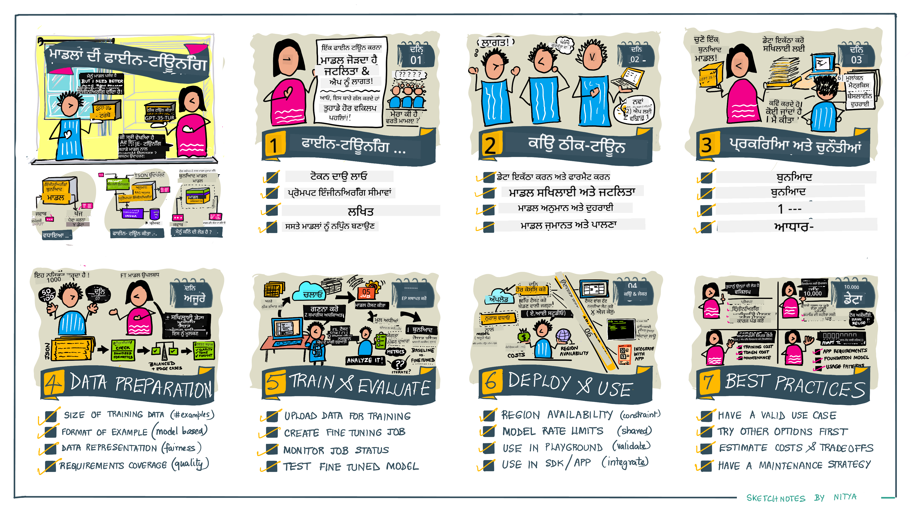

<!--
CO_OP_TRANSLATOR_METADATA:
{
  "original_hash": "68664f7e754a892ae1d8d5e2b7bd2081",
  "translation_date": "2025-06-26T00:38:43+00:00",
  "source_file": "18-fine-tuning/README.md",
  "language_code": "pa"
}
-->

# ਆਪਣੇ LLM ਨੂੰ ਠੀਕ ਕਰਨਾ

ਵੱਡੇ ਭਾਸ਼ਾ ਮਾਡਲਾਂ ਨੂੰ ਵਰਤ ਕੇ ਜਨਰੇਟਿਵ AI ਐਪਲੀਕੇਸ਼ਨਾਂ ਬਣਾਉਣ ਵਿੱਚ ਨਵੇਂ ਚੁਣੌਤੀ ਆਉਂਦੀਆਂ ਹਨ। ਇੱਕ ਮੁੱਖ ਮੁੱਦਾ ਇਸ ਗੱਲ ਨੂੰ ਯਕੀਨੀ ਬਣਾਉਣਾ ਹੈ ਕਿ ਮਾਡਲ ਦੁਆਰਾ ਦਿੱਤੇ ਗਏ ਵਰਤੋਂਕਾਰ ਦੇ ਬੇਨਤੀ ਲਈ ਤਿਆਰ ਕੀਤੇ ਗਏ ਸਮੱਗਰੀ ਵਿੱਚ ਜਵਾਬ ਦੀ ਗੁਣਵੱਤਾ (ਸਹੀਤਾ ਅਤੇ ਸਬੰਧਿਤਤਾ) ਸਹੀ ਹੈ। ਪਿਛਲੇ ਪਾਠਾਂ ਵਿੱਚ, ਅਸੀਂ ਪ੍ਰੋੰਪਟ ਇੰਜੀਨੀਅਰਿੰਗ ਅਤੇ ਰੀਟਰੀਵਲ-ਅਗਮੈਂਟਡ ਜਨਰੇਸ਼ਨ ਵਰਗੀਆਂ ਤਕਨੀਕਾਂ 'ਤੇ ਚਰਚਾ ਕੀਤੀ ਸੀ ਜੋ ਇਸ ਸਮੱਸਿਆ ਨੂੰ ਹੱਲ ਕਰਨ ਦੀ ਕੋਸ਼ਿਸ਼ ਕਰਦੀਆਂ ਹਨ ਮੌਜੂਦਾ ਮਾਡਲ ਦੇ ਪ੍ਰੋੰਪਟ ਇਨਪੁੱਟ ਨੂੰ _ਸੋਧ ਕੇ_।

ਅੱਜ ਦੇ ਪਾਠ ਵਿੱਚ, ਅਸੀਂ ਇੱਕ ਤੀਜੀ ਤਕਨੀਕ, **ਠੀਕ ਕਰਨਾ**, 'ਤੇ ਚਰਚਾ ਕਰਦੇ ਹਾਂ ਜੋ ਚੁਣੌਤੀ ਨੂੰ _ਮਾਡਲ ਨੂੰ ਆਪਣੇ ਆਪ ਨੂੰ ਪੁਰਸ਼ਕਾਰਤ ਕਰਨ_ ਨਾਲ ਹੱਲ ਕਰਨ ਦੀ ਕੋਸ਼ਿਸ਼ ਕਰਦਾ ਹੈ। ਚਲੋ ਵਿਸਥਾਰ ਵਿੱਚ ਗੋਤਾ ਲਗਾਈਏ।

## ਸਿੱਖਣ ਦੇ ਉਦੇਸ਼

ਇਹ ਪਾਠ ਪੂਰਵ-ਤਿਆਰ ਕੀਤੇ ਭਾਸ਼ਾ ਮਾਡਲਾਂ ਲਈ ਠੀਕ ਕਰਨ ਦੀ ਧਾਰਨਾ ਨੂੰ ਪੇਸ਼ ਕਰਦਾ ਹੈ, ਇਸ ਪਹੁੰਚ ਦੇ ਫਾਇਦੇ ਅਤੇ ਚੁਣੌਤੀਆਂ ਦੀ ਪੜਤਾਲ ਕਰਦਾ ਹੈ, ਅਤੇ ਤੁਹਾਡੇ ਜਨਰੇਟਿਵ AI ਮਾਡਲਾਂ ਦੀ ਕਾਰਗੁਜ਼ਾਰੀ ਨੂੰ ਸੁਧਾਰਨ ਲਈ ਕਦੋਂ ਅਤੇ ਕਿਵੇਂ ਠੀਕ ਕਰਨ ਦੀ ਸਲਾਹ ਦਿੰਦਾ ਹੈ।

ਇਸ ਪਾਠ ਦੇ ਅੰਤ ਤੱਕ, ਤੁਸੀਂ ਹੇਠਾਂ ਦਿੱਤੇ ਸਵਾਲਾਂ ਦੇ ਜਵਾਬ ਦੇਣ ਦੇ ਯੋਗ ਹੋਣਾ ਚਾਹੀਦਾ ਹੈ:

- ਭਾਸ਼ਾ ਮਾਡਲਾਂ ਲਈ ਠੀਕ ਕਰਨਾ ਕੀ ਹੈ?
- ਕਦੋਂ, ਅਤੇ ਕਿਉਂ, ਠੀਕ ਕਰਨਾ ਲਾਭਕਾਰੀ ਹੁੰਦਾ ਹੈ?
- ਮੈਂ ਪੂਰਵ-ਤਿਆਰ ਕੀਤੇ ਮਾਡਲ ਨੂੰ ਕਿਵੇਂ ਠੀਕ ਕਰ ਸਕਦਾ ਹਾਂ?
- ਠੀਕ ਕਰਨ ਦੀਆਂ ਸੀਮਾਵਾਂ ਕੀ ਹਨ?

ਤਿਆਰ? ਚਲੋ ਸ਼ੁਰੂ ਕਰੀਏ।

## ਚਿੱਤਰਤ ਗਾਈਡ

ਅਸੀਂ ਜੋ ਕਵਰ ਕਰਨ ਵਾਲੇ ਹਾਂ, ਉਸ ਦੀ ਵੱਡੀ ਤਸਵੀਰ ਪ੍ਰਾਪਤ ਕਰਨਾ ਚਾਹੁੰਦੇ ਹੋ, ਇਸ ਤੋਂ ਪਹਿਲਾਂ ਕਿ ਅਸੀਂ ਡੁਬਕੀ ਲਗਾਈਏ? ਇਸ ਚਿੱਤਰਤ ਗਾਈਡ ਦੀ ਜਾਂਚ ਕਰੋ ਜੋ ਇਸ ਪਾਠ ਲਈ ਸਿੱਖਣ ਦੀ ਯਾਤਰਾ ਦਾ ਵਰਣਨ ਕਰਦੀ ਹੈ - ਠੀਕ ਕਰਨ ਲਈ ਮੁੱਖ ਧਾਰਨਾਵਾਂ ਅਤੇ ਪ੍ਰੇਰਣਾ ਸਿੱਖਣ ਤੋਂ ਲੈ ਕੇ ਠੀਕ ਕਰਨ ਦੀ ਪ੍ਰਕਿਰਿਆ ਅਤੇ ਸਫਲਤਾ ਲਈ ਵਧੀਆ ਅਭਿਆਸਾਂ ਸਮਝਣ ਤੱਕ। ਇਹ ਖੋਜ ਲਈ ਇੱਕ ਦਿਲਚਸਪ ਵਿਸ਼ਾ ਹੈ, ਇਸ ਲਈ ਆਪਣੇ ਆਪ ਦੀ ਰਾਹ-ਦਿੱਖ ਸਿੱਖਣ ਯਾਤਰਾ ਨੂੰ ਸਮਰਥਨ ਦੇਣ ਲਈ ਅਤਿਰਿਕਤ ਲਿੰਕਾਂ ਲਈ [ਸਰੋਤ](./RESOURCES.md?WT.mc_id=academic-105485-koreyst) ਪੰਨਾ ਚੈੱਕ ਕਰਨਾ ਨਾ ਭੁੱਲੋ!

## ਭਾਸ਼ਾ ਮਾਡਲਾਂ ਲਈ ਠੀਕ ਕਰਨਾ ਕੀ ਹੈ?

ਪਰਿਭਾਸ਼ਾ ਅਨੁਸਾਰ, ਵੱਡੇ ਭਾਸ਼ਾ ਮਾਡਲ _ਪੂਰਵ-ਤਿਆਰ_ ਕੀਤੇ ਜਾਂਦੇ ਹਨ ਵੱਡੀ ਮਾਤਰਾ ਵਿੱਚ ਪਾਠ ਤੇ ਜੋ ਵੱਖ-ਵੱਖ ਸਰੋਤਾਂ ਸਹਿਤ ਇੰਟਰਨੈਟ ਤੋਂ ਪ੍ਰਾਪਤ ਕੀਤਾ ਜਾਂਦਾ ਹੈ। ਜਿਵੇਂ ਕਿ ਅਸੀਂ ਪਿਛਲੇ ਪਾਠਾਂ ਵਿੱਚ ਸਿੱਖਿਆ ਹੈ, ਸਾਨੂੰ ਵਰਤੋਂਕਾਰ ਦੇ ਸਵਾਲਾਂ ("ਪ੍ਰੋੰਪਟ") ਲਈ ਮਾਡਲ ਦੇ ਜਵਾਬਾਂ ਦੀ ਗੁਣਵੱਤਾ ਸੁਧਾਰਨ ਲਈ _ਪ੍ਰੋੰਪਟ ਇੰਜੀਨੀਅਰਿੰਗ_ ਅਤੇ _ਰੀਟਰੀਵਲ-ਅਗਮੈਂਟਡ ਜਨਰੇਸ਼ਨ_ ਵਰਗੀਆਂ ਤਕਨੀਕਾਂ ਦੀ ਲੋੜ ਹੈ।

ਪ੍ਰੋੰਪਟ ਇੰਜੀਨੀਅਰਿੰਗ ਦੀ ਇੱਕ ਪ੍ਰਸਿੱਧ ਤਕਨੀਕ ਮਾਡਲ ਨੂੰ ਇਸ ਗੱਲ ਤੇ ਵਧੇਰੇ ਮਾਰਗਦਰਸ਼ਨ ਦੇਣ ਵਿੱਚ ਸ਼ਾਮਲ ਹੁੰਦੀ ਹੈ ਕਿ ਜਵਾਬ ਵਿੱਚ ਕੀ ਉਮੀਦ ਕੀਤੀ ਜਾਂਦੀ ਹੈ ਜਾ ਤਾਂ _ਦਿਸ਼ਾ-ਨਿਰਦੇਸ਼_ (ਸਪਸ਼ਟ ਮਾਰਗਦਰਸ਼ਨ) ਦੇ ਕੇ ਜਾਂ _ਇਸ ਨੂੰ ਕੁਝ ਉਦਾਹਰਨ_ ਦੇ ਕੇ (ਅਸਪਸ਼ਟ ਮਾਰਗਦਰਸ਼ਨ) ਦੇ ਕੇ। ਇਹ _ਥੋੜਾ-ਸ਼ਾਟ ਸਿੱਖਣ_ ਵਜੋਂ ਜਾਣਿਆ ਜਾਂਦਾ ਹੈ ਪਰ ਇਸ ਵਿੱਚ ਦੋ ਸੀਮਾਵਾਂ ਹਨ:

- ਮਾਡਲ ਟੋਕਨ ਸੀਮਾਵਾਂ ਤੁਹਾਡੇ ਦੁਆਰਾ ਦਿੱਤੇ ਜਾ ਸਕਦੇ ਉਦਾਹਰਨਾਂ ਦੀ ਗਿਣਤੀ ਨੂੰ ਸੀਮਿਤ ਕਰ ਸਕਦੀਆਂ ਹਨ, ਅਤੇ ਪ੍ਰਭਾਵਸ਼ੀਲਤਾ ਨੂੰ ਸੀਮਿਤ ਕਰ ਸਕਦੀਆਂ ਹਨ।
- ਮਾਡਲ ਟੋਕਨ ਖਰਚੇ ਹਰ ਪ੍ਰੋੰਪਟ ਵਿੱਚ ਉਦਾਹਰਨਾਂ ਜੋੜਨ ਨੂੰ ਮਹਿੰਗਾ ਬਣਾ ਸਕਦੇ ਹਨ, ਅਤੇ ਲਚਕਤਾ ਨੂੰ ਸੀਮਿਤ ਕਰ ਸਕਦੇ ਹਨ।

ਠੀਕ ਕਰਨਾ ਮਸ਼ੀਨ ਲਰਨਿੰਗ ਪ੍ਰਣਾਲੀਆਂ ਵਿੱਚ ਇੱਕ ਆਮ ਅਭਿਆਸ ਹੈ ਜਿੱਥੇ ਅਸੀਂ ਪੂਰਵ-ਤਿਆਰ ਕੀਤੇ ਮਾਡਲ ਨੂੰ ਲੈਂਦੇ ਹਾਂ ਅਤੇ ਇਸ ਨੂੰ ਕਿਸੇ ਖਾਸ ਕੰਮ 'ਤੇ ਇਸਦੀ ਕਾਰਗੁਜ਼ਾਰੀ ਨੂੰ ਸੁਧਾਰਨ ਲਈ ਨਵੀਂ ਡਾਟਾ ਨਾਲ ਪੁਰਸ਼ਕਾਰਤ ਕਰਦੇ ਹਾਂ। ਭਾਸ਼ਾ ਮਾਡਲਾਂ ਦੇ ਸੰਦਰਭ ਵਿੱਚ, ਅਸੀਂ ਪੂਰਵ-ਤਿਆਰ ਕੀਤੇ ਮਾਡਲ ਨੂੰ _ਕਿਸੇ ਦਿੱਤੇ ਕੰਮ ਜਾਂ ਐਪਲੀਕੇਸ਼ਨ ਡੋਮੇਨ ਲਈ ਉਦਾਹਰਨਾਂ ਦੇ ਚੁਣੇ ਗਏ ਸੈਟ ਨਾਲ_ ਠੀਕ ਕਰ ਸਕਦੇ ਹਾਂ ਤਾਂ ਜੋ ਇੱਕ **ਕਸਟਮ ਮਾਡਲ** ਬਣਾਇਆ ਜਾ ਸਕੇ ਜੋ ਉਸ ਖਾਸ ਕੰਮ ਜਾਂ ਡੋਮੇਨ ਲਈ ਹੋ ਸਕਦਾ ਹੈ ਜ਼ਿਆਦਾ ਸਹੀ ਅਤੇ ਸਬੰਧਿਤ ਹੋਵੇ। ਠੀਕ ਕਰਨ ਦਾ ਇੱਕ ਪਾਸੇ-ਲਾਭ ਇਹ ਹੈ ਕਿ ਇਹ ਥੋੜਾ-ਸ਼ਾਟ ਸਿੱਖਣ ਲਈ ਲੋੜੀਂਦੇ ਉਦਾਹਰਨਾਂ ਦੀ ਗਿਣਤੀ ਨੂੰ ਵੀ ਘਟਾ ਸਕਦਾ ਹੈ - ਟੋਕਨ ਦੀ ਵਰਤੋਂ ਅਤੇ ਸੰਬੰਧਿਤ ਖਰਚਿਆਂ ਨੂੰ ਘਟਾ ਸਕਦਾ ਹੈ।

## ਕਦੋਂ ਅਤੇ ਕਿਉਂ ਮਾਡਲਾਂ ਨੂੰ ਠੀਕ ਕਰਨਾ ਚਾਹੀਦਾ ਹੈ?

ਇਸ ਸੰਦਰਭ ਵਿੱਚ, ਜਦੋਂ ਅਸੀਂ ਠੀਕ ਕਰਨ ਬਾਰੇ ਗੱਲ ਕਰਦੇ ਹਾਂ, ਅਸੀਂ **ਸੁਪਰਵਾਈਜ਼ਡ** ਠੀਕ ਕਰਨ ਬਾਰੇ ਗੱਲ ਕਰ ਰਹੇ ਹਾਂ ਜਿੱਥੇ ਪੁਰਸ਼ਕਾਰਤ ਕਰਨ ਨੂੰ **ਨਵੀਂ ਡਾਟਾ** ਜੋੜ ਕੇ ਕੀਤਾ ਜਾਂਦਾ ਹੈ ਜੋ ਮੂਲ ਤਿਆਰੀ ਡਾਟਾਸੈਟ ਦਾ ਹਿੱਸਾ ਨਹੀਂ ਸੀ। ਇਹ ਅਨਸੁਪਰਵਾਈਜ਼ਡ ਠੀਕ ਕਰਨ ਦੇ ਪਹੁੰਚ ਤੋਂ ਵੱਖ ਹੈ ਜਿੱਥੇ ਮਾਡਲ ਨੂੰ ਮੂਲ ਡਾਟਾ 'ਤੇ ਦੁਬਾਰਾ ਪੁਰਸ਼ਕਾਰਤ ਕੀਤਾ ਜਾਂਦਾ ਹੈ, ਪਰ ਵੱਖਰੇ ਹਾਇਪਰਪੈਰਾਮੀਟਰਾਂ ਨਾਲ।

ਕੁੰਜੀ ਗੱਲ ਯਾਦ ਰੱਖਣੀ ਹੈ ਕਿ ਠੀਕ ਕਰਨਾ ਇੱਕ ਉੱਚ ਤਕਨੀਕ ਹੈ ਜਿਸ ਲਈ ਮਨਚਾਹੇ ਨਤੀਜੇ ਪ੍ਰਾਪਤ ਕਰਨ ਲਈ ਇੱਕ ਨਿਰਧਾਰਿਤ ਪੱਧਰ ਦੀ ਕੁਸ਼ਲਤਾ ਦੀ ਲੋੜ ਹੁੰਦੀ ਹੈ। ਜੇਕਰ ਗਲਤ ਕੀਤਾ ਜਾਂਦਾ ਹੈ, ਇਹ ਉਮੀਦ ਕੀਤੇ ਸੁਧਾਰਾਂ ਨਹੀਂ ਦੇ ਸਕਦਾ, ਅਤੇ ਤੁਹਾਡੇ ਨਿਸ਼ਾਨੇ ਵਾਲੇ ਡੋਮੇਨ ਲਈ ਮਾਡਲ ਦੀ ਕਾਰਗੁਜ਼ਾਰੀ ਨੂੰ ਘਟਾ ਸਕਦਾ ਹੈ।

ਇਸ ਲਈ, "ਕਿਵੇਂ" ਭਾਸ਼ਾ ਮਾਡਲਾਂ ਨੂੰ ਠੀਕ ਕਰਨ ਲਈ ਸਿੱਖਣ ਤੋਂ ਪਹਿਲਾਂ, ਤੁਹਾਨੂੰ ਇਹ ਜਾਣਨਾ ਚਾਹੀਦਾ ਹੈ ਕਿ "ਕਿਉਂ" ਤੁਹਾਨੂੰ ਇਸ ਰਾਹ ਤੇ ਜਾਣਾ ਚਾਹੀਦਾ ਹੈ, ਅਤੇ "ਕਦੋਂ" ਠੀਕ ਕਰਨ ਦੀ ਪ੍ਰਕਿਰਿਆ ਸ਼ੁਰੂ ਕਰਨ ਲਈ। ਆਪਣੇ ਆਪ ਨੂੰ ਇਹ ਸਵਾਲ ਪੂਛ ਕੇ ਸ਼ੁਰੂ ਕਰੋ:

- **ਵਰਤੋਂ ਮਾਮਲਾ**: ਠੀਕ ਕਰਨ ਲਈ ਤੁਹਾਡਾ _ਵਰਤੋਂ ਮਾਮਲਾ_ ਕੀ ਹੈ? ਮੌਜੂਦਾ ਪੂਰਵ-ਤਿਆਰ ਕੀਤੇ ਮਾਡਲ ਦੇ ਕਿਸ ਪਹਲੂ ਨੂੰ ਤੁਸੀਂ ਸੁਧਾਰਨਾ ਚਾਹੁੰਦੇ ਹੋ?
- **ਵਿਕਲਪ**: ਕੀ ਤੁਸੀਂ _ਹੋਰ ਤਕਨੀਕਾਂ_ ਦੀ ਕੋਸ਼ਿਸ਼ ਕੀਤੀ ਹੈ ਜਿਹੜੀਆਂ ਮਨਚਾਹੇ ਨਤੀਜੇ ਪ੍ਰਾਪਤ ਕਰਨ ਲਈ? ਉਨ੍ਹਾਂ ਨੂੰ ਤੁਲਨਾ ਲਈ ਇੱਕ ਬੇਸਲਾਈਨ ਬਣਾਉਣ ਲਈ ਵਰਤੋ।
  - ਪ੍ਰੋੰਪਟ ਇੰਜੀਨੀਅਰਿੰਗ: ਸਬੰਧਿਤ ਪ੍ਰੋੰਪਟ ਜਵਾਬਾਂ ਦੇ ਉਦਾਹਰਨਾਂ ਨਾਲ ਥੋੜਾ-ਸ਼ਾਟ ਪ੍ਰੋੰਪਟਿੰਗ ਵਰਗੀਆਂ ਤਕਨੀਕਾਂ ਦੀ ਕੋਸ਼ਿਸ਼ ਕਰੋ। ਜਵਾਬਾਂ ਦੀ ਗੁਣਵੱਤਾ ਦਾ ਮੁਲਾਂਕਨ ਕਰੋ।
  - ਰੀਟਰੀਵਲ ਅਗਮੈਂਟਡ ਜਨਰੇਸ਼ਨ: ਆਪਣੇ ਡਾਟਾ ਦੀ ਖੋਜ ਕਰਕੇ ਪ੍ਰਾਪਤ ਕੀਤੇ ਪੁੱਛਗਿੱਛ ਨਤੀਜਿਆਂ ਨਾਲ ਪ੍ਰੋੰਪਟਾਂ ਨੂੰ ਵਧਾਉਣ ਦੀ ਕੋਸ਼ਿਸ਼ ਕਰੋ। ਜਵਾਬਾਂ ਦੀ ਗੁਣਵੱਤਾ ਦਾ ਮੁਲਾਂਕਨ ਕਰੋ।
- **ਖਰਚੇ**: ਕੀ ਤੁਸੀਂ ਠੀਕ ਕਰਨ ਲਈ ਖਰਚਿਆਂ ਦੀ ਪਛਾਣ ਕੀਤੀ ਹੈ?
  - ਟਿਊਨਬਿਲਟੀ - ਕੀ ਪੂਰਵ-ਤਿਆਰ ਕੀਤੇ ਮਾਡਲ ਨੂੰ ਠੀਕ ਕਰਨ ਲਈ ਉਪਲਬਧ ਹੈ?
  - ਯਤਨ - ਤਿਆਰੀ ਡਾਟਾ ਤਿਆਰ ਕਰਨ ਲਈ, ਮਾਡਲ ਦਾ ਮੁਲਾਂਕਨ ਅਤੇ ਸੁਧਾਰ ਕਰਨ ਲਈ।
  - ਕਮਪਿਊਟ - ਠੀਕ ਕਰਨ ਦੀਆਂ ਨੌਕਰੀਆਂ ਚਲਾਉਣ ਲਈ, ਅਤੇ ਠੀਕ ਕੀਤਾ ਮਾਡਲ ਤਿਆਰ ਕਰਨ ਲਈ
  - ਡਾਟਾ - ਠੀਕ ਕਰਨ ਦੇ ਪ੍ਰਭਾਵ ਲਈ ਵਧੀਆ ਮਿਆਰ ਦੇ ਕਾਫੀ ਉਦਾਹਰਨਾਂ ਦੀ ਪਹੁੰਚ
- **ਫਾਇਦੇ**: ਕੀ ਤੁਸੀਂ ਠੀਕ ਕਰਨ ਲਈ ਫਾਇਦੇ ਦੀ ਪੁਸ਼ਟੀ ਕੀਤੀ ਹੈ?
  - ਗੁਣਵੱਤਾ - ਕੀ ਠੀਕ ਕੀਤਾ ਮਾਡਲ ਬੇਸਲਾਈਨ ਤੋਂ ਬਿਹਤਰ ਸੀ?
  - ਖਰਚ - ਕੀ ਇਹ ਪ੍ਰੋੰਪਟਾਂ ਨੂੰ ਸਰਲ ਕਰਕੇ ਟੋਕਨ ਦੀ ਵਰਤੋਂ ਘਟਾਉਂਦਾ ਹੈ?
  - ਵਿਆਪਕਤਾ - ਕੀ ਤੁਸੀਂ ਨਵੇਂ ਡੋਮੇਨ ਲਈ ਮੂਲ ਮਾਡਲ ਨੂੰ ਦੁਬਾਰਾ ਵਰਤ ਸਕਦੇ ਹੋ?

ਇਹ ਸਵਾਲਾਂ ਦੇ ਜਵਾਬ ਦੇ ਕੇ, ਤੁਸੀਂ ਇਹ ਫੈਸਲਾ ਕਰਨ ਦੇ ਯੋਗ ਹੋਣਾ ਚਾਹੀਦਾ ਹੈ ਕਿ ਠੀਕ ਕਰਨਾ ਤੁਹਾਡੇ ਵਰਤੋਂ ਮਾਮਲੇ ਲਈ ਸਹੀ ਪਹੁੰਚ ਹੈ ਕਿ ਨਹੀਂ। ਆਦਰਸ਼ ਤੌਰ ਤੇ, ਪਹੁੰਚ ਸਿਰਫ ਤਦ ਹੀ ਵੈਧ ਹੈ ਜੇ ਫਾਇਦੇ ਖਰਚਿਆਂ ਤੋਂ ਵੱਧ ਹਨ। ਜਦੋਂ ਤੁਸੀਂ ਅੱਗੇ ਵਧਣ ਦਾ ਫੈਸਲਾ ਕਰਦੇ ਹੋ, ਤਾਂ ਸਮਾਂ ਹੈ ਕਿ ਤੁਸੀਂ _ਕਿਵੇਂ_ ਪੂਰਵ-ਤਿਆਰ ਕੀਤੇ ਮਾਡਲ ਨੂੰ ਠੀਕ ਕਰ ਸਕਦੇ ਹੋ।

ਫੈਸਲਾ ਕਰਨ ਦੀ ਪ੍ਰਕਿਰਿਆ 'ਤੇ ਹੋਰ ਜਾਣਕਾਰੀ ਪ੍ਰਾਪਤ ਕਰਨਾ ਚਾਹੁੰਦੇ ਹੋ? [ਠੀਕ ਕਰਨਾ ਜਾਂ ਨਾ ਕਰਨਾ](https://www.youtube.com/watch?v=0Jo-z-MFxJs) ਦੇਖੋ

## ਅਸੀਂ ਪੂਰਵ-ਤਿਆਰ ਕੀਤੇ ਮਾਡਲ ਨੂੰ ਕਿਵੇਂ ਠੀਕ ਕਰ ਸਕਦੇ ਹਾਂ?

ਪੂਰਵ-ਤਿਆਰ ਕੀਤੇ ਮਾਡਲ ਨੂੰ ਠੀਕ ਕਰਨ ਲਈ, ਤੁਹਾਨੂੰ ਇਹ ਹੋਣਾ ਚਾਹੀਦਾ ਹੈ:

- ਠੀਕ ਕਰਨ ਲਈ ਪੂਰਵ-ਤਿਆਰ ਕੀਤਾ ਮਾਡਲ
- ਠੀਕ ਕਰਨ ਲਈ ਵਰਤਣ ਲਈ ਡਾਟਾਸੈਟ
- ਠੀਕ ਕਰਨ ਦੀ ਨੌਕਰੀ ਚਲਾਉਣ ਲਈ ਤਿਆਰੀ ਵਾਤਾਵਰਨ
- ਠੀਕ ਕੀਤਾ ਮਾਡਲ ਤਿਆਰ ਕਰਨ ਲਈ ਹੋਸਟਿੰਗ ਵਾਤਾਵਰਨ

## ਠੀਕ ਕਰਨ ਦੀ ਕਾਰਵਾਈ ਵਿੱਚ

ਹੇਠਾਂ ਦਿੱਤੇ ਸਰੋਤ ਤੁਹਾਨੂੰ ਚੁਣੇ ਮਾਡਲ ਨਾਲ ਇੱਕ ਚੁਣੇ ਡਾਟਾਸੈਟ ਦੀ ਵਰਤੋਂ ਕਰਕੇ ਇੱਕ ਅਸਲ ਉਦਾਹਰਨ ਰਾਹੀਂ ਲੈ ਜਾਣ ਲਈ ਕਦਮ-ਦਰ-ਕਦਮ ਟਿਊਟੋਰਿਅਲ ਪ੍ਰਦਾਨ ਕਰਦੇ ਹਨ। ਇਹ ਟਿਊਟੋਰਿਅਲਾਂ ਦੇ ਰਾਹੀਂ ਕੰਮ ਕਰਨ ਲਈ, ਤੁਹਾਨੂੰ ਖਾਸ ਪ੍ਰਦਾਤਾ 'ਤੇ ਇੱਕ ਖਾਤੇ ਦੀ ਲੋੜ ਹੈ, ਨਾਲ ਹੀ ਸਬੰਧਿਤ ਮਾਡਲ ਅਤੇ ਡਾਟਾਸੈਟਾਂ ਦੀ ਪਹੁੰਚ ਦੀ ਲੋੜ ਹੈ।

| ਪ੍ਰਦਾਤਾ     | ਟਿਊਟੋਰਿਅਲ                                                                                                                                                                       | ਵਰਣਨ                                                                                                                                                                                                                                                                                                                                                                                                                        |
| ------------ | ------------------------------------------------------------------------------------------------------------------------------------------------------------------------------ | ---------------------------------------------------------------------------------------------------------------------------------------------------------------------------------------------------------------------------------------------------------------------------------------------------------------------------------------------------------------------------------------------------------------------------------- |
| ਓਪਨਏਆਈ       | [ਚੈਟ ਮਾਡਲਾਂ ਨੂੰ ਕਿਵੇਂ ਠੀਕ ਕਰਨਾ ਹੈ](https://github.com/openai/openai-cookbook/blob/main/examples/How_to_finetune_chat_models.ipynb?WT.mc_id=academic-105485-koreyst)                | ਤਿਆਰੀ ਡਾਟਾ ਤਿਆਰ ਕਰਨ, ਠੀਕ ਕਰਨ ਦੀ ਨੌਕਰੀ ਚਲਾਉਣ, ਅਤੇ ਨਤੀਜਾ ਲਈ ਠੀਕ ਕੀਤੇ ਮਾਡਲ ਦੀ ਵਰਤੋਂ ਕਰਕੇ ਕਿਸੇ ਖਾਸ ਡੋਮੇਨ ("ਰੈਸੀਪੀ ਸਹਾਇਕ") ਲਈ `gpt-35-turbo` ਨੂੰ ਠੀਕ ਕਰਨ ਸਿੱਖੋ।                                                                                                                                                                                                                                              |
| ਐਜ਼ਰ ਓਪਨਏਆਈ | [GPT 3.5 ਟਰਬੋ ਠੀਕ ਕਰਨ ਦਾ ਟਿਊਟੋਰਿਅਲ](https://learn.microsoft.com/azure/ai-services/openai/tutorials/fine-tune?tabs=python-new%2Ccommand-line?WT.mc_id=academic-105485-koreyst) | `gpt-35-turbo-0613` ਮਾਡਲ **ਐਜ਼ਰ 'ਤੇ** ਠੀਕ ਕਰਨ ਸਿੱਖੋ ਜਦੋਂ ਕਿ ਤਿਆਰੀ ਡਾਟਾ ਬਣਾਉਣ ਅਤੇ ਅਪਲੋਡ ਕਰਨ ਦੇ ਕਦਮ ਲੈਂਦੇ ਹੋ, ਠੀਕ ਕਰਨ ਦੀ ਨੌਕਰੀ ਚਲਾਉਣ। ਨਵੇਂ ਮਾਡਲ ਨੂੰ ਤਿਆਰ ਕਰੋ ਅਤੇ ਵਰਤੋ।                                                                                                                                                                                                                                                                 |
| ਹੱਗਿੰਗ ਫੇਸ | [ਹੱਗਿੰਗ ਫੇਸ ਨਾਲ LLMs ਨੂੰ ਠੀਕ ਕਰਨਾ](https://www.philschmid.de/fine-tune-llms-in-2024-with-trl?WT.mc_id=academic-105485-koreyst)                                               | ਇਹ ਬਲੌਗ ਪੋਸਟ ਤੁਹਾਨੂੰ ਇੱਕ _ਖੁੱਲ੍ਹਾ LLM_ (ਜਿਵੇਂ `CodeLlama 7B`) ਨੂੰ ਠੀਕ ਕਰਨ ਲਈ [ਟ੍ਰਾਂਸਫਾਰਮਰ](https://huggingface.co/docs/transformers/index?WT.mc_id=academic-105485-koreyst) ਲਾਇਬ੍ਰੇਰੀ ਅਤੇ [ਟ੍ਰਾਂਸਫਾਰਮਰ ਰੀਇਨਫੋਰਸਮੈਂਟ ਲਰਨਿੰਗ (TRL)](https://huggingface.co/docs/trl/index?WT.mc_id=academic-105485-koreyst]) ਨਾਲ ਹੱਗਿੰਗ ਫੇਸ 'ਤੇ ਖੁੱਲ੍ਹੇ [ਡਾਟਾਸੈਟ](https://huggingface.co/docs/datasets/index?WT.mc_id=academic-105485-koreyst) ਦੀ ਵਰਤੋਂ ਕਰਕੇ ਗੈਰ-ਪ੍ਰਵਾਹਿਤ ਕਰਦਾ ਹੈ। |
|              |                                                                                                                                                                                |                                                                                                                                                                                                                                                                                                                                                                                                                                    |
| 🤗 ਆਟੋਟ੍ਰੇਨ | [ਆਟੋਟ੍ਰੇਨ ਨਾਲ LLMs ਨੂੰ ਠੀਕ ਕਰਨਾ](https://github.com/huggingface/autotrain-advanced/?WT.mc_id=academic-105485-koreyst)                                                         | ਆਟੋਟ੍ਰੇਨ (ਜਾਂ ਆਟੋਟ੍ਰੇਨ ਐਡਵਾਂਸਡ) ਹੱਗਿੰਗ ਫੇਸ ਦੁਆਰਾ ਵਿਕਸਿਤ ਇੱਕ ਪਾਈਥਨ ਲਾਇਬ੍ਰੇਰੀ ਹੈ ਜੋ LLM ਠੀਕ ਕਰਨ ਸਮੇਤ ਕਈ ਵੱਖਰੇ ਕੰਮਾਂ ਲਈ ਠੀਕ ਕਰਨ ਦੀ ਆਗਿਆ ਦਿੰਦੀ ਹੈ। ਆਟੋਟ੍ਰੇਨ ਇੱਕ ਨੋ-ਕੋਡ ਹੱਲ ਹੈ ਅਤੇ ਠੀਕ ਕਰਨ ਨੂੰ ਤੁਹਾਡੇ ਆਪਣੇ ਕਲਾਊਡ ਵਿੱਚ, ਹੱਗਿੰਗ ਫੇਸ ਸਪੇਸ 'ਤੇ ਜਾਂ ਸਥਾਨਕ ਤੌਰ ਤੇ ਕੀਤਾ ਜਾ ਸਕਦਾ ਹੈ। ਇਹ ਇੱਕ ਵੈੱਬ-ਅਧਾਰਤ GUI, CLI ਅਤੇ yaml ਕਨਫਿਗ ਫਾਈਲਾਂ ਦੇ ਜ਼ਰੀਏ ਸਿਖਲਾਈ

**ਅਸ्वीਕਰਤੀ**:  
ਇਹ ਦਸਤਾਵੇਜ਼ AI ਅਨੁਵਾਦ ਸੇਵਾ [Co-op Translator](https://github.com/Azure/co-op-translator) ਦੀ ਵਰਤੋਂ ਕਰਕੇ ਅਨੁਵਾਦ ਕੀਤਾ ਗਿਆ ਹੈ। ਅਸੀਂ ਸਹੀਅਤ ਲਈ ਕੋਸ਼ਿਸ਼ ਕਰਦੇ ਹਾਂ, ਪਰ ਕਿਰਪਾ ਕਰਕੇ ਧਿਆਨ ਦਿਓ ਕਿ ਸਵੈਚਾਲਿਤ ਅਨੁਵਾਦਾਂ ਵਿੱਚ ਗਲਤੀਆਂ ਜਾਂ ਅਸੁੱਤੀਆਂ ਹੋ ਸਕਦੀਆਂ ਹਨ। ਇਸ ਦੀ ਮੂਲ ਭਾਸ਼ਾ ਵਿੱਚ ਮੌਜੂਦ ਮੂਲ ਦਸਤਾਵੇਜ਼ ਨੂੰ ਪ੍ਰਮਾਣਿਕ ਸਰੋਤ ਮੰਨਿਆ ਜਾਣਾ ਚਾਹੀਦਾ ਹੈ। ਮਹੱਤਵਪੂਰਨ ਜਾਣਕਾਰੀ ਲਈ, ਪੇਸ਼ੇਵਰ ਮਨੁੱਖੀ ਅਨੁਵਾਦ ਦੀ ਸਿਫਾਰਿਸ਼ ਕੀਤੀ ਜਾਂਦੀ ਹੈ। ਅਸੀਂ ਇਸ ਅਨੁਵਾਦ ਦੇ ਇਸਤੇਮਾਲ ਤੋਂ ਪੈਦਾ ਹੋਣ ਵਾਲੇ ਕਿਸੇ ਵੀ ਗਲਤ ਫਹਿਮੀ ਜਾਂ ਗਲਤ ਵਿਆਖਿਆ ਲਈ ਜ਼ਿੰਮੇਵਾਰ ਨਹੀਂ ਹਾਂ।