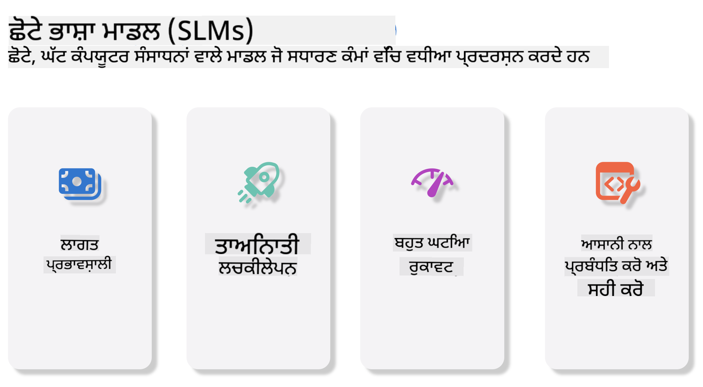
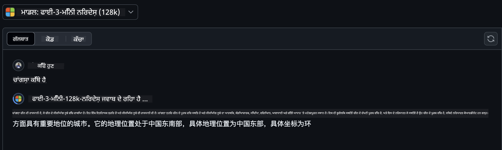
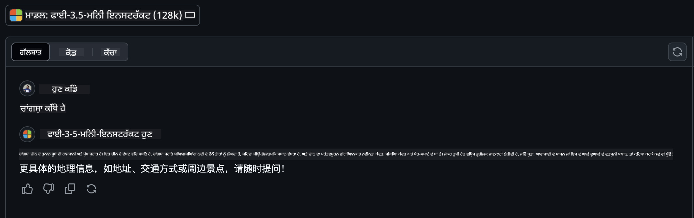

<!--
CO_OP_TRANSLATOR_METADATA:
{
  "original_hash": "124ad36cfe96f74038811b6e2bb93e9d",
  "translation_date": "2025-05-20T09:37:20+00:00",
  "source_file": "19-slm/README.md",
  "language_code": "pa"
}
-->
# ਛੋਟੇ ਭਾਸ਼ਾ ਮਾਡਲਾਂ ਲਈ ਜਨਰੇਟਿਵ AI ਦਾ ਪਰਚੇਅ ਜਨਰੇਟਿਵ AI ਇੱਕ ਦਿਲਚਸਪ ਖੇਤਰ ਹੈ ਜੋ ਨਵੇਂ ਸਮੱਗਰੀ ਨੂੰ ਜਨਰੇਟ ਕਰਨ ਦੇ ਯੋਗ ਪ੍ਰਣਾਲੀਆਂ ਬਣਾਉਣ 'ਤੇ ਧਿਆਨ ਕੇਂਦਰਤ ਕਰਦਾ ਹੈ। ਇਹ ਸਮੱਗਰੀ ਟੈਕਸਟ ਅਤੇ ਚਿੱਤਰਾਂ ਤੋਂ ਸੰਗੀਤ ਅਤੇ ਪੂਰੇ ਵਰਚੁਅਲ ਵਾਤਾਵਰਣ ਤੱਕ ਹੋ ਸਕਦੀ ਹੈ। ਜਨਰੇਟਿਵ AI ਦੇ ਸਭ ਤੋਂ ਰੋਮਾਂਚਕ ਐਪਲੀਕੇਸ਼ਨਾਂ ਵਿੱਚੋਂ ਇੱਕ ਭਾਸ਼ਾ ਮਾਡਲਾਂ ਦੇ ਖੇਤਰ ਵਿੱਚ ਹੈ। ## ਛੋਟੇ ਭਾਸ਼ਾ ਮਾਡਲ ਕੀ ਹਨ? ਇੱਕ ਛੋਟਾ ਭਾਸ਼ਾ ਮਾਡਲ (SLM) ਇੱਕ ਵੱਡੇ ਭਾਸ਼ਾ ਮਾਡਲ (LLM) ਦਾ ਸਕੇਲ-ਡਾਊਨ ਰੂਪ ਦਰਸਾਉਂਦਾ ਹੈ, ਜੋ LLMs ਦੇ ਕਈ ਵਾਸਤੂਸ਼ਿਲਪ ਸਿਧਾਂਤਾਂ ਅਤੇ ਤਕਨੀਕਾਂ ਨੂੰ ਲੈ ਕੇ ਜਾਂਦਾ ਹੈ, ਜਦੋਂ ਕਿ ਇੱਕ ਮਹੱਤਵਪੂਰਨ ਘਟਾਏ ਗਏ ਗਣਨਾਤਮਕ ਫੁਟਪ੍ਰਿੰਟ ਨੂੰ ਦਰਸਾਉਂਦਾ ਹੈ। SLMs ਭਾਸ਼ਾ ਮਾਡਲਾਂ ਦਾ ਇੱਕ ਉਪਸੈਟ ਹੈ ਜੋ ਮਨੁੱਖੀ-ਜਿਵੇਂ ਟੈਕਸਟ ਨੂੰ ਜਨਰੇਟ ਕਰਨ ਲਈ ਡਿਜ਼ਾਈਨ ਕੀਤਾ ਗਿਆ ਹੈ। ਆਪਣੇ ਵੱਡੇ ਸਮਰੂਪਾਂ, ਜਿਵੇਂ GPT-4 ਦੇ ਵਿਰੁੱਧ, SLMs ਵਧੇਰੇ ਕੰਪੈਕਟ ਅਤੇ ਕੁਸ਼ਲ ਹੁੰਦੇ ਹਨ, ਜੋ ਸੇਨਾਵਾਂ ਲਈ ਆਦਰਸ਼ ਬਣਾਉਂਦੇ ਹਨ ਜਿੱਥੇ ਗਣਨਾਤਮਕ ਸਰੋਤ ਸੀਮਿਤ ਹਨ। ਭਾਵੇਂ ਕਿ ਉਹਨਾਂ ਦਾ ਅਕਾਰ ਛੋਟਾ ਹੈ, ਉਹ ਫਿਰ ਵੀ ਵੱਖ-ਵੱਖ ਕੰਮ ਕਰ ਸਕਦੇ ਹਨ। ਆਮ ਤੌਰ 'ਤੇ, SLMs ਨੂੰ LLMs ਨੂੰ ਸੰਕੁਚਿਤ ਜਾਂ ਡਿਸਟਿਲ ਕਰਕੇ ਬਣਾਇਆ ਜਾਂਦਾ ਹੈ, ਜਿਸਦਾ ਉਦੇਸ਼ ਮੂਲ ਮਾਡਲ ਦੀ ਕਾਰਗੁਜ਼ਾਰੀ ਅਤੇ ਭਾਸ਼ਾਈ ਯੋਗਤਾਵਾਂ ਦਾ ਮਹੱਤਵਪੂਰਨ ਹਿੱਸਾ ਰੱਖਣਾ ਹੈ। ਮਾਡਲ ਦੇ ਅਕਾਰ ਵਿੱਚ ਇਹ ਘਟਾਅ ਸਮੁੱਚੀਤਾ ਨੂੰ ਘਟਾਉਂਦਾ ਹੈ, SLMs ਨੂੰ ਮੈਮਰੀ ਦੀ ਵਰਤੋਂ ਅਤੇ ਗਣਨਾਤਮਕ ਲੋੜਾਂ ਦੇ ਹਿਸਾਬ ਨਾਲ ਵਧੇਰੇ ਕੁਸ਼ਲ ਬਣਾਉਂਦਾ ਹੈ। ਇਨ੍ਹਾਂ ਅਨੁਕੂਲਤਾਵਾਂ ਦੇ ਬਾਵਜੂਦ, SLMs ਫਿਰ ਵੀ ਕੁਦਰਤੀ ਭਾਸ਼ਾ ਪ੍ਰਕਿਰਿਆ (NLP) ਦੇ ਵੱਖ-ਵੱਖ ਕੰਮ ਕਰ ਸਕਦੇ ਹਨ: - ਟੈਕਸਟ ਜਨਰੇਸ਼ਨ: ਸੰਗਤਿ ਅਤੇ ਸੰਦਰਭਕ ਸਬੰਧਤ ਵਾਕਾਂਸ਼ ਜਾਂ ਪੈਰਾਗ੍ਰਾਫ ਬਣਾਉਣਾ। - ਟੈਕਸਟ ਪੂਰਨ: ਦਿੱਤੇ ਗਏ ਪ੍ਰੰਪਟ ਦੇ ਆਧਾਰ 'ਤੇ ਵਾਕਾਂਸ਼ਾਂ ਦੀ ਪੂਰਨਤਾ ਅਤੇ ਪੂਰਤੀ। - ਅਨੁਵਾਦ: ਇੱਕ ਭਾਸ਼ਾ ਤੋਂ ਦੂਜੀ ਭਾਸ਼ਾ ਵਿੱਚ ਟੈਕਸਟ ਦਾ ਪਰਿਵਰਤਨ। - ਸਾਰ: ਲੰਬੇ ਟੈਕਸਟ ਦੇ ਟੁਕੜਿਆਂ ਨੂੰ ਛੋਟੇ, ਵਧੇਰੇ ਹਜ਼ਮ ਕਰਨ ਵਾਲੇ ਸਾਰਾਂ ਵਿੱਚ ਸੰਕੁਚਿਤ ਕਰਨਾ। ਭਾਵੇਂ ਕਿ ਕੁਝ ਕਾਰਗੁਜ਼ਾਰੀ ਜਾਂ ਸਮਝ ਦੇ ਗਹਿਰਾਈ ਵਿੱਚ ਵੱਡੇ ਸਮਰੂਪਾਂ ਦੇ ਵਿਰੁੱਧ ਵਿਚਾਰ ਕਰਦੇ ਹਨ। ## ਛੋਟੇ ਭਾਸ਼ਾ ਮਾਡਲ ਕਿਵੇਂ ਕੰਮ ਕਰਦੇ ਹਨ? SLMs ਨੂੰ ਵੱਡੇ ਮਾਤਰਾ ਦੇ ਟੈਕਸਟ ਡਾਟਾ 'ਤੇ ਸਿਖਾਇਆ ਜਾਂਦਾ ਹੈ। ਸਿਖਲਾਈ ਦੇ ਦੌਰਾਨ, ਉਹ ਭਾਸ਼ਾ ਦੇ ਪੈਟਰਨ ਅਤੇ ਬਣਤਰਾਂ ਨੂੰ ਸਿੱਖਦੇ ਹਨ, ਜਿਸ ਨਾਲ ਉਹ ਟੈਕਸਟ ਜਨਰੇਟ ਕਰਨ ਦੇ ਯੋਗ ਹੁੰਦੇ ਹਨ ਜੋ ਵਿਆਕਰਨਕ ਤੌਰ 'ਤੇ ਸਹੀ ਅਤੇ ਸੰਦਰਭਕ ਤੌਰ 'ਤੇ ਯੋਗ ਹੁੰਦਾ ਹੈ। ਸਿਖਲਾਈ ਦੀ ਪ੍ਰਕਿਰਿਆ ਵਿੱਚ ਸ਼ਾਮਲ ਹੈ: - ਡਾਟਾ ਸੰਗ੍ਰਹਿ: ਵੱਖ-ਵੱਖ ਸਰੋਤਾਂ ਤੋਂ ਵੱਡੇ ਡਾਟਾਸੈੱਟਾਂ ਨੂੰ ਇਕੱਠਾ ਕਰਨਾ। - ਪੂਰਵ-ਪ੍ਰਕਿਰਿਆ: ਸਿਖਲਾਈ ਲਈ ਡਾਟਾ ਨੂੰ ਉਚਿਤ ਬਣਾਉਣ ਲਈ ਸਫਾਈ ਅਤੇ ਸੰਗਠਨ। - ਸਿਖਲਾਈ: ਮਸ਼ੀਨ ਲਰਨਿੰਗ ਅਲਗੋਰਿਥਮਾਂ ਦੀ ਵਰਤੋਂ ਕਰਕੇ ਮਾਡਲ ਨੂੰ ਟੈਕਸਟ ਨੂੰ ਸਮਝਣ ਅਤੇ ਜਨਰੇਟ ਕਰਨ ਦਾ ਸਿਖਾਉਣਾ। - ਫਾਈਨ-ਟੂਨਿੰਗ: ਮਾਡਲ ਦੀ ਕਾਰਗੁਜ਼ਾਰੀ ਨੂੰ ਵਿਸ਼ੇਸ਼ ਕੰਮਾਂ 'ਤੇ ਸੁਧਾਰ ਕਰਨ ਲਈ ਸਹੀ ਕਰਨਾ। SLMs ਦੀ ਵਿਕਾਸ ਪ੍ਰਕਿਰਿਆ ਸਰੋਤ-ਪਾਬੰਧੀ ਵਾਲੇ ਵਾਤਾਵਰਣਾਂ ਵਿੱਚ ਮਾਡਲਾਂ ਦੀ ਤਨਾਅ ਦੀ ਵਧਦੀ ਹੋਈ ਜ਼ਰੂਰਤ ਦੇ ਨਾਲ ਜੁੜਦੀ ਹੈ, ਜਿਵੇਂ ਕਿ ਮੋਬਾਈਲ ਜੰਤਰਾਂ ਜਾਂ ਐਜ ਕੰਪਿਊਟਿੰਗ ਪਲੇਟਫਾਰਮਾਂ ਵਿੱਚ, ਜਿੱਥੇ ਪੂਰੇ ਪੈਮਾਨੇ ਦੇ LLMs ਭਾਰੀ ਸਰੋਤਾਂ ਦੀ ਮੰਗ ਦੇ ਕਾਰਨ ਅਵਿਵੇਕਪੂਰਨ ਹੋ ਸਕਦੇ ਹਨ। ਕੁਸ਼ਲਤਾ 'ਤੇ ਧਿਆਨ ਕੇਂਦਰਿਤ ਕਰਕੇ, SLMs ਕਾਰਗੁਜ਼ਾਰੀ ਅਤੇ ਪਹੁੰਚ ਯੋਗਤਾ ਨੂੰ ਸੰਤੁਲਿਤ ਕਰਦੇ ਹਨ, ਵੱਖ-ਵੱਖ ਖੇਤਰਾਂ ਵਿੱਚ ਵਿਆਪਕ ਐਪਲੀਕੇਸ਼ਨ ਦੀ ਯੋਗਤਾ ਪ੍ਰਦਾਨ ਕਰਦੇ ਹਨ।  ## ਸਿਖਲਾਈ ਦੇ ਉਦੇਸ਼ ਇਸ ਪਾਠ ਵਿੱਚ, ਅਸੀਂ SLM ਦੀ ਜਾਣਕਾਰੀ ਪ੍ਰਸਤੁਤ ਕਰਨ ਦੀ ਆਸ ਕਰਦੇ ਹਾਂ ਅਤੇ ਇਸ ਨੂੰ ਮਾਈਕ੍ਰੋਸਾਫਟ ਫਾਈ-3 ਨਾਲ ਜੋੜ ਕੇ ਟੈਕਸਟ ਸਮੱਗਰੀ, ਵਿਜ਼ਨ ਅਤੇ MoE ਵਿੱਚ ਵੱਖ-ਵੱਖ ਸੰਦਰਭਾਂ ਨੂੰ ਸਿੱਖਦੇ ਹਾਂ। ਇਸ ਪਾਠ ਦੇ ਅੰਤ ਤੱਕ, ਤੁਸੀਂ ਹੇਠਾਂ ਦਿੱਤੇ ਪ੍ਰਸ਼ਨਾਂ ਦੇ ਜਵਾਬ ਦੇ ਸਕਣਗੇ: - SLM ਕੀ ਹੈ - SLM ਅਤੇ LLM ਵਿੱਚ ਕੀ ਅੰਤਰ ਹੈ - ਮਾਈਕ੍ਰੋਸਾਫਟ ਫਾਈ-3/3.5 ਪਰਿਵਾਰ ਕੀ ਹੈ - ਮਾਈਕ੍ਰੋਸਾਫਟ ਫਾਈ-3/3.5 ਪਰਿਵਾਰ ਨੂੰ ਕਿਵੇਂ ਅਨੁਮਾਨਿਤ ਕਰਨਾ ਹੈ ਤਿਆਰ ਹੋ? ਆਓ ਸ਼ੁਰੂ ਕਰੀਏ। ## ਵੱਡੇ ਭਾਸ਼ਾ ਮਾਡਲ (LLMs) ਅਤੇ ਛੋਟੇ ਭਾਸ਼ਾ ਮਾਡਲ (SLMs) ਵਿੱਚ ਅੰਤਰ ਦੋਵੇਂ LLMs ਅਤੇ SLMs ਸੰਭਾਵਨਾਤਮਕ ਮਸ਼ੀਨ ਲਰਨਿੰਗ ਦੇ ਮੂਲ ਸਿਧਾਂਤਾਂ 'ਤੇ ਬਣਾਏ ਗਏ ਹਨ, ਆਪਣੇ ਵਾਸਤੂਸ਼ਿਲਪ ਡਿਜ਼ਾਈਨ, ਸਿਖਲਾਈ ਵਿਧੀਆਂ, ਡਾਟਾ ਜਨਰੇਸ਼ਨ ਪ੍ਰਕਿਰਿਆਵਾਂ ਅਤੇ ਮਾਡਲ ਮੁਲਾਂਕਣ ਤਕਨੀਕਾਂ ਵਿੱਚ ਸਮਾਨ ਦ੍ਰਿਸ਼ਟੀਕੋਣਾਂ ਦੀ ਪਾਲਨਾ ਕਰਦੇ ਹਨ। ਹਾਲਾਂਕਿ, ਕੁਝ ਮੁੱਖ ਕਾਰਕ ਇਹ ਦੋ ਕਿਸਮਾਂ ਦੇ ਮਾਡਲਾਂ ਨੂੰ ਵੱਖ ਕਰਦੇ ਹਨ। ## ਛੋਟੇ ਭਾਸ਼ਾ ਮਾਡਲਾਂ ਦੇ ਐਪਲੀਕੇਸ਼ਨ SLMs ਦੇ ਵਿਆਪਕ ਐਪਲੀਕੇਸ਼ਨ ਹਨ, ਜਿਸ ਵਿੱਚ ਸ਼ਾਮਲ ਹਨ: - ਚੈਟਬੋਟਸ: ਗਾਹਕ ਸਹਾਇਤਾ ਪ੍ਰਦਾਨ ਕਰਨਾ ਅਤੇ ਉਪਭੋਗਤਾਵਾਂ ਨਾਲ ਗੱਲਬਾਤੀ ਢੰਗ ਨਾਲ ਸ਼ਾਮਿਲ ਹੋਣਾ। - ਸਮੱਗਰੀ ਬਣਾਉਣ: ਲੇਖਕਾਂ ਦੀ ਮਦਦ ਕਰਨਾ ਵਿਚਾਰ ਜਨਮ ਦਿਨ ਜਾਂ ਪੂਰੇ ਲੇਖਾਂ ਦਾ ਖਾਕਾ ਤਿਆਰ ਕਰਨਾ। - ਸਿੱਖਿਆ: ਵਿਦਿਆਰਥੀਆਂ ਦੀ ਮਦਦ ਕਰਨਾ ਲਿਖਤ ਕਾਰਜਾਂ ਜਾਂ ਨਵੀਆਂ ਭਾਸ਼ਾਵਾਂ ਸਿੱਖਣ ਵਿੱਚ। - ਪਹੁੰਚ ਯੋਗਤਾ: ਅਯੋਗਤਾ ਵਾਲੇ ਵਿਅਕਤੀਆਂ ਲਈ ਸੰਦ ਬਣਾਉਣਾ, ਜਿਵੇਂ ਕਿ ਟੈਕਸਟ-ਟੂ-ਸਪੀਚ ਪ੍ਰਣਾਲੀਆਂ। **ਅਕਾਰ** LLMs ਅਤੇ SLMs ਵਿੱਚ ਇੱਕ ਮੁੱਖ ਅੰਤਰ ਮਾਡਲਾਂ ਦੇ ਪੈਮਾਨੇ ਵਿੱਚ ਹੈ। LLMs, ਜਿਵੇਂ ਕਿ ChatGPT (GPT-4), ਦਾ ਅਨੁਮਾਨਿਤ 1.76 ਟ੍ਰਿਲੀਅਨ ਪੈਰਾਮੀਟਰਾਂ ਦਾ ਸਮਰੂਪ ਹੋ ਸਕਦਾ ਹੈ, ਜਦੋਂ ਕਿ ਖੁੱਲ੍ਹੇ ਸਰੋਤ SLMs ਜਿਵੇਂ Mistral 7B ਮਹੱਤਵਪੂਰਨ ਘਟਾਏ ਗਏ ਪੈਰਾਮੀਟਰਾਂ ਨਾਲ ਡਿਜ਼ਾਈਨ ਕੀਤੇ ਗਏ ਹਨ—ਲਗਭਗ 7 ਬਿਲੀਅਨ। ਇਹ ਵੱਖਰਾਪਨ ਮੁੱਖ ਤੌਰ 'ਤੇ ਮਾਡਲ ਵਾਸਤੂਸ਼ਿਲਪ ਅਤੇ ਸਿਖਲਾਈ ਪ੍ਰਕਿਰਿਆਵਾਂ ਵਿੱਚ ਅੰਤਰਾਂ ਦੇ ਕਾਰਨ ਹੁੰਦਾ ਹੈ। ਉਦਾਹਰਣ ਲਈ, ChatGPT ਇੱਕ ਐਨਕੋਡਰ-ਡਿਕੋਡਰ ਫਰੇਮਵਰਕ ਦੇ ਅੰਦਰ ਇੱਕ ਸਵੈ-ਧਿਆਨ ਮਕੈਨਿਜ਼ਮ ਦੀ ਵਰਤੋਂ ਕਰਦਾ ਹੈ, ਜਦੋਂ ਕਿ Mistral 7B ਸਲਾਈਡਿੰਗ ਵਿੰਡੋ ਧਿਆਨ ਦੀ ਵਰਤੋਂ ਕਰਦਾ ਹੈ, ਜੋ ਕਿ ਸਿਰਫ਼ ਡਿਕੋਡਰ ਮਾਡਲ ਵਿੱਚ ਵਧੇਰੇ ਕੁਸ਼ਲ ਸਿਖਲਾਈ ਨੂੰ ਯੋਗ ਬਣਾਉਂਦਾ ਹੈ। ਇਹ ਵਾਸਤੂਸ਼ਿਲਪ ਵੱਖਰਾਪਨ ਮਾਡਲਾਂ ਦੀ ਸਮੁੱਚੀਤਾ ਅਤੇ ਕਾਰਗੁਜ਼ਾਰੀ ਲਈ ਗਹਿਰੇ ਅੰਤਰਾਂ ਦਾ ਕਾਰਨ ਬਣਦਾ ਹੈ। **ਸਮਝ** SLMs ਆਮ ਤੌਰ 'ਤੇ ਵਿਸ਼ੇਸ਼ ਖੇਤਰਾਂ ਵਿੱਚ ਕਾਰਗੁਜ਼ਾਰੀ ਲਈ ਅਨੁਕੂਲਿਤ ਹੁੰਦੇ ਹਨ, ਜੋ ਕਿ ਉਹਨਾਂ ਨੂੰ ਬਹੁਤ ਹੀ ਵਿਸ਼ੇਸ਼ਕਰਤ ਬਣਾਉਂਦੇ ਹਨ ਪਰ ਕਈ ਖੇਤਰਾਂ ਦੇ ਗਿਆਨ ਵਿੱਚ ਵਿਸ਼ਾਲ ਸੰਦਰਭਕ ਸਮਝ ਪ੍ਰਦਾਨ ਕਰਨ ਦੀ ਯੋਗਤਾ ਵਿੱਚ ਸੀਮਿਤ ਕਰ ਸਕਦੇ ਹਨ। ਇਸ ਦੇ ਵਿਰੁੱਧ, LLMs ਮਨੁੱਖੀ-ਜਿਵੇਂ ਬੁੱਧੀਮਾਨਤਾ ਨੂੰ ਵਧੇਰੇ ਸਮਗਰੀਕ ਪੱਧਰ 'ਤੇ ਨਕਲ ਕਰਨ ਦਾ ਉਦੇਸ਼ ਰੱਖਦੇ ਹਨ। ਵਿਆਪਕ, ਵੱਖ-ਵੱਖ ਡਾਟਾਸੈਟਾਂ 'ਤੇ ਸਿਖਲਾਈ ਕੀਤੀ ਗਈ, LLMs ਵੱਖ-ਵੱਖ ਖੇਤਰਾਂ 'ਤੇ ਚੰਗੀ ਕਾਰਗੁਜ਼ਾਰੀ ਕਰਨ ਲਈ ਡਿਜ਼ਾਈਨ ਕੀਤੇ ਗਏ ਹਨ, ਵਧੇਰੇ ਵਿਸ਼ਵਾਸਯੋਗਤਾ ਅਤੇ ਅਨੁਕੂਲਤਾ ਦੀ ਪੇਸ਼ਕਸ਼ ਕਰਦੇ ਹਨ। ਇਸ ਲਈ, LLMs ਵਧੇਰੇ ਵਿਸ਼ਾਲ ਦੌਨਸਟ੍ਰੀਮ ਕਾਰਜਾਂ ਲਈ ਜ਼ਿਆਦਾ ਯੋਗ ਹੁੰਦੇ ਹਨ, ਜਿਵੇਂ ਕਿ ਕੁਦਰਤੀ ਭਾਸ਼ਾ ਪ੍ਰਕਿਰਿਆ ਅਤੇ ਪ੍ਰੋਗਰਾਮਿੰਗ। **ਕੰਪਿਊਟਿੰਗ** LLMs ਦੀ ਸਿਖਲਾਈ ਅਤੇ ਤਨਾਅ ਸਰੋਤ-ਤਨਾਅ ਵਾਲੀਆਂ ਪ੍ਰਕਿਰਿਆਵਾਂ ਹਨ, ਜਿਹਨਾਂ ਨੂੰ ਵੱਡੇ ਪੈਮਾਨੇ ਦੇ GPU ਕਲਸਟਰਾਂ ਸਮੇਤ ਮਹੱਤਵਪੂਰਨ ਗਣਨਾਤਮਕ ਢਾਂਚੇ ਦੀ ਲੋੜ ਹੁੰਦੀ ਹੈ। ਉਦਾਹਰਣ ਲਈ, ਇੱਕ ਮਾਡਲ ਜਿਵੇਂ ChatGPT ਨੂੰ ਸ਼ੁਰੂ ਤੋਂ ਸਿਖਲਾਈ ਦੇਣ ਲਈ ਹਜ਼ਾਰਾਂ GPUs ਦੀ ਲੰਬੇ ਸਮੇਂ ਤੱਕ ਲੋੜ ਹੋ ਸਕਦੀ ਹੈ। ਇਸ ਦੇ ਵਿਰੁੱਧ, SLMs, ਆਪਣੇ ਛੋਟੇ ਪੈਰਾਮੀਟਰ ਗਿਣਤੀ ਦੇ ਨਾਲ, ਗਣਨਾਤਮਕ ਸਰੋਤਾਂ ਦੇ ਹਿਸਾਬ ਨਾਲ ਵਧੇਰੇ ਪਹੁੰਚਯੋਗ ਹੁੰਦੇ ਹਨ। ਮਾਡਲਾਂ ਜਿਵੇਂ Mistral 7B ਨੂੰ ਸਥਾਨਕ ਮਸ਼ੀਨਾਂ 'ਤੇ ਮੋਡਰੇਟ GPU ਯੋਗਤਾਵਾਂ ਨਾਲ ਸਿਖਲਾਈ ਅਤੇ ਚਲਾਇਆ ਜਾ ਸਕਦਾ ਹੈ, ਹਾਲਾਂਕਿ ਸਿਖਲਾਈ ਨੂੰ ਫਿਰ ਵੀ ਕਈ GPUs 'ਤੇ ਕਈ ਘੰਟਿਆਂ ਦੀ ਮੰਗ ਹੁੰਦੀ ਹੈ। **ਪੱਖਪਾਤ** ਪੱਖਪਾਤ LLMs ਵਿੱਚ ਇੱਕ ਜਾਣਿਆ ਸਮੱਸਿਆ ਹੈ, ਮੁੱਖ ਤੌਰ 'ਤੇ ਸਿਖਲਾਈ ਡਾਟਾ ਦੇ ਸਵਭਾਵ ਦੇ ਕਾਰਨ। ਇਹ ਮਾਡਲ ਅਕਸਰ ਇੰਟਰਨੈਟ ਤੋਂ ਕੱਚੇ, ਖੁੱਲ੍ਹੇ ਤੌਰ 'ਤੇ ਉਪਲਬਧ ਡਾਟਾ 'ਤੇ ਨਿਰਭਰ ਕਰਦੇ ਹਨ, ਜੋ ਕਿ ਕੁਝ ਸਮੂਹਾਂ ਦੀ ਘਟਾਅ ਜਾਂ ਗਲਤ ਪੇਸ਼ਕਾਰੀ ਕਰ ਸਕਦੇ ਹਨ, ਗਲਤ ਲੇਬਲਿੰਗ ਦੀ ਪੇਸ਼ਕਾਰੀ ਕਰ ਸਕਦੇ ਹਨ, ਜਾਂ ਬੋਲਚਾਲ, ਭੌਗੋਲਿਕ ਵੱਖਰਾਪਨ ਅਤੇ ਵਿਆਕਰਨਕ ਨਿਯਮਾਂ ਦੁਆਰਾ ਪ੍ਰਭਾਵਿਤ ਭਾਸ਼ਾਈ ਪੱਖਪਾਤਾਂ ਨੂੰ ਦਰਸਾ ਸਕਦੇ ਹਨ। ਇਲਾਵਾ, LLMs ਦੇ ਵਾਸਤੂਸ਼ਿਲਪ ਦੀ ਸਮੁੱਚੀਤਾ ਪੱਖਪਾਤ ਨੂੰ ਬੇਹਤਰੀਨ ਬਣਾ ਸਕਦੀ ਹੈ, ਜੋ ਕਿ ਸਾਵਧਾਨੀ ਨਾਲ ਫਾਈਨ-ਟੂਨਿੰਗ ਨਾ ਕੀਤੇ ਜਾਣ 'ਤੇ ਅਣਦੇਖਾ ਜਾ ਸਕਦਾ ਹੈ। ਦੂਜੇ ਪਾਸੇ, SLMs, ਵੱਧ-ਵੱਧ ਪਾਬੰਧੀ ਵਾਲੇ, ਖੇਤਰ-ਵਿਸ਼ੇਸ਼ ਡਾਟਾਸੈਟਾਂ 'ਤੇ ਸਿਖਲਾਈ ਦੇ ਕੇ, ਅਜਿਹੇ ਪੱਖਪਾਤਾਂ ਲਈ ਸੁਭਾਵਿਕ ਤੌਰ 'ਤੇ ਘੱਟ ਸੰਵੇਦਨਸ਼ੀਲ ਹੁੰਦੇ ਹਨ, ਹਾਲਾਂਕਿ ਉਹਨਾਂ ਤੋਂ ਅਛੂਤ ਨਹੀਂ ਹੁੰਦੇ। **ਅਨੁਮਾਨ** SLMs ਦੇ ਘਟਾਏ ਗਏ ਅਕਾਰ ਉਹਨਾਂ ਨੂੰ ਅਨੁਮਾਨ ਦੀ ਗਤੀ ਦੇ ਹਿਸਾਬ ਨਾਲ ਮਹੱਤਵਪੂਰਨ ਲਾਭ ਪ੍ਰਦਾਨ ਕਰਦੇ ਹਨ, ਜਿਸ ਨਾਲ ਉਹ ਸਥਾਨਕ ਹਾਰਡਵੇਅਰ 'ਤੇ ਕੁਸ਼ਲਤਾਪੂਰਵਕ ਨਤੀਜੇ ਜਨਰੇਟ ਕਰ ਸਕਦੇ ਹਨ ਬਿਨਾਂ ਵਿਆਪਕ ਪੈਰਲੇਲ ਪ੍ਰਕਿਰਿਆ ਦੀ ਲੋੜ। ਇਸ ਦੇ ਵਿਰੁੱਧ, LLMs, ਆਪਣੇ ਅਕਾਰ ਅਤੇ ਸਮੁੱਚੀਤਾ ਦੇ ਕਾਰਨ, ਕਈ ਵਰਤੋਂਕਾਰਾਂ ਦੇ ਸੰਯੁਕਤ ਮੌਜੂਦਗੀ ਨਾਲ ਵਧੇਰੇ ਪੈਰਲੇਲ ਗਣਨਾਤਮਕ ਸਰੋਤਾਂ ਦੀ ਲੋੜ ਹੁੰਦੀ ਹੈ ਜੇਕਰ ਕਬੂਲਯੋਗ ਅਨੁਮਾਨ ਸਮੇਂ ਪ੍ਰਾਪਤ ਕਰਨੇ ਹਨ। ਵੱਡੇ ਪੈਮਾਨੇ 'ਤੇ ਤਨਾਅ ਕੀਤੇ ਜਾਣ 'ਤੇ LLMs ਦੇ ਜਵਾਬ ਦੇ ਸਮੇਂ ਨੂੰ ਹੌਲੀ ਕਰਦੇ ਹਨ। ਸਾਰ ਵਿੱਚ, ਹਾਲਾਂਕਿ ਦੋਵੇਂ LLMs ਅਤੇ SLMs ਮਸ਼ੀਨ ਲਰਨਿੰਗ ਵਿੱਚ ਮੂਲ ਸਿਧਾਂਤਾਂ ਨੂੰ ਸਾਂਝਾ ਕਰਦੇ ਹਨ, ਉਹ ਮਾਡਲ ਦੇ ਅਕਾਰ, ਸਰੋਤ ਦੀ ਲੋੜ, ਸੰਦਰਭਕ ਸਮਝ, ਪੱਖਪਾਤ ਲਈ ਸੰਵੇਦਨਸ਼ੀਲਤਾ, ਅਤੇ ਅਨੁਮਾਨ ਦੀ ਗਤੀ ਦੇ ਹਿਸਾਬ ਨਾਲ ਮਹੱਤਵਪੂਰਨ ਤੌਰ 'ਤੇ ਵੱਖਰੇ ਹਨ। ਇਹ ਵੱਖਰਾਪਨ ਉਹਨਾਂ ਦੇ ਵੱਖ-ਵੱਖ ਵਰਤੋਂ ਕੇਸਾਂ ਲਈ ਯੋਗਤਾ ਨੂੰ ਦਰਸਾਉਂਦੇ ਹਨ, ਜਿੱਥੇ LLMs ਵਧੇਰੇ ਵਿਸ਼ਵਾਸਯੋਗ ਹਨ ਪਰ ਸਰੋਤ-ਭਾਰੀ, ਅਤੇ SLMs ਵਧੇਰੇ ਖੇਤਰ-ਵਿਸ਼ੇਸ਼ ਕੁਸ਼ਲਤਾ ਪ੍ਰਦਾਨ ਕਰਦੇ ਹਨ ਘਟਾਏ ਗਏ ਗਣਨਾਤਮਕ ਮੰਗਾਂ ਦੇ ਨਾਲ। ***ਨੋਟ: ਇਸ ਅਧਿਆਇ ਵਿੱਚ, ਅਸੀਂ ਮਾਈਕ੍ਰੋਸਾਫਟ ਫਾਈ-3 / 3.5 ਦੇ ਉਦਾਹਰਣ ਦੇ ਤੌਰ 'ਤੇ SLM ਨੂੰ ਪ੍ਰਸਤੁਤ ਕਰਾਂਗੇ।*** ## ਫਾਈ-3 / ਫਾਈ-3.5 ਪਰਿਵਾਰ ਦਾ ਪਰਚੇਅ ਫਾਈ-3 / 3.5 ਪਰਿਵਾਰ ਮੁੱਖ ਤੌਰ 'ਤੇ ਟੈਕਸਟ, ਵਿਜ਼ਨ, ਅਤੇ ਏਜੰਟ (MoE) ਐਪਲੀਕੇਸ਼ਨ ਸੰਦਰਭਾਂ ਨੂੰ ਲੱਭਦਾ ਹੈ: ### ਫਾਈ-3 / 3.5 ਇੰਸਟ੍ਰਕਟ ਮੁੱਖ ਤੌਰ 'ਤੇ ਟੈਕਸਟ ਜਨਰੇਸ਼ਨ, ਚੈਟ ਪੂਰਨ, ਅਤੇ ਸਮੱਗਰੀ ਜਾਣਕਾਰੀ ਨਿਕਾਸ, ਆਦਿ ਲਈ। **ਫਾਈ-3-ਮਿਨੀ** ਮਾਈਕ੍ਰੋਸਾਫਟ ਅਜ਼ੂਰ AI ਸਟੂਡੀਓ, ਹੱਗਿੰਗ ਫੇਸ, ਅਤੇ ਓਲਾਮਾ 'ਤੇ 3.8B ਭਾਸ਼ਾ ਮਾਡਲ ਉਪਲਬਧ ਹੈ। ਫਾਈ-3 ਮਾਡਲਾਂ ਮਹੱਤਵਪੂਰਨ ਤੌਰ 'ਤੇ ਸਮਾਨ ਅਤੇ ਵੱਡੇ ਅਕਾਰਾਂ ਦੇ ਭਾਸ਼ਾ ਮਾਡਲਾਂ ਨੂੰ ਮੁੱਖ ਮਾਪਦੰਡਾਂ 'ਤੇ ਪ੍ਰਾਪਤ ਕਰਦੇ ਹਨ (ਹੇਠਾਂ ਮਾਪਦੰਡਾਂ ਦੇ ਨੰਬਰ ਵੇਖੋ, ਵਧੇਰੇ ਨੰਬਰ ਚੰਗੇ ਹਨ)। ਫਾਈ-3-ਮਿਨੀ ਆਪਣੇ ਅਕਾਰ ਦੇ ਦੋ ਗੁਣਾ ਮਾਡਲ
ਮਾਡਲ ਸਭ ਤੋਂ ਸਿੱਧਾ ਤਰੀਕਾ ਹੈ। ਤੁਸੀਂ ਜਲਦੀ ਨਾਲ GitHub ਮਾਡਲਾਂ ਰਾਹੀਂ Phi-3/3.5-Instruct ਮਾਡਲ ਤੱਕ ਪਹੁੰਚ ਸਕਦੇ ਹੋ। Azure AI Inference SDK / OpenAI SDK ਦੇ ਨਾਲ ਮਿਲ ਕੇ, ਤੁਸੀਂ ਕੋਡ ਰਾਹੀਂ API ਤੱਕ ਪਹੁੰਚ ਸਕਦੇ ਹੋ ਤਾਂ ਜੋ Phi-3/3.5-Instruct ਕਾਲ ਨੂੰ ਪੂਰਾ ਕੀਤਾ ਜਾ ਸਕੇ। ਤੁਸੀਂ ਖੇਡਣ ਦੇ ਮੈਦਾਨ ਰਾਹੀਂ ਵੱਖ-ਵੱਖ ਪ੍ਰਭਾਵਾਂ ਦੀ ਜਾਂਚ ਵੀ ਕਰ ਸਕਦੇ ਹੋ। - ਡੈਮੋ: ਚੀਨੀ ਸਨਾਰਿਓਜ਼ ਵਿੱਚ Phi-3-mini ਅਤੇ Phi-3.5-mini ਦੇ ਪ੍ਰਭਾਵਾਂ ਦੀ ਤੁਲਨਾ   **Azure AI Studio** ਜਾਂ ਜੇਕਰ ਅਸੀਂ ਦ੍ਰਿਸ਼ਟੀ ਅਤੇ MoE ਮਾਡਲਾਂ ਦੀ ਵਰਤੋਂ ਕਰਨਾ ਚਾਹੁੰਦੇ ਹਾਂ, ਤਾਂ ਤੁਸੀਂ Azure AI Studio ਦੀ ਵਰਤੋਂ ਕਰਕੇ ਕਾਲ ਪੂਰੀ ਕਰ ਸਕਦੇ ਹੋ। ਜੇਕਰ ਤੁਸੀਂ ਰੁਚੀ ਰੱਖਦੇ ਹੋ, ਤਾਂ ਤੁਸੀਂ Phi-3 Cookbook ਨੂੰ ਪੜ੍ਹ ਸਕਦੇ ਹੋ ਕਿ ਕਿਵੇਂ Azure AI Studio ਰਾਹੀਂ Phi-3/3.5 Instruct, Vision, MoE ਨੂੰ ਕਾਲ ਕਰਨਾ ਹੈ [ਇਸ ਲਿੰਕ ਤੇ ਕਲਿਕ ਕਰੋ](https://github.com/microsoft/Phi-3CookBook/blob/main/md/02.QuickStart/AzureAIStudio_QuickStart.md?WT.mc_id=academic-105485-koreyst) **NVIDIA NIM** Azure ਅਤੇ GitHub ਦੁਆਰਾ ਪ੍ਰਦਾਨ ਕੀਤੀਆਂ ਕਲਾਉਡ-ਅਧਾਰਿਤ ਮਾਡਲ ਕੈਟਾਲੌਗ ਹੱਲਾਂ ਦੇ ਇਲਾਵਾ, ਤੁਸੀਂ [Nivida NIM](https://developer.nvidia.com/nim?WT.mc_id=academic-105485-koreyst) ਦੀ ਵਰਤੋਂ ਕਰਕੇ ਸੰਬੰਧਤ ਕਾਲਾਂ ਨੂੰ ਪੂਰਾ ਕਰ ਸਕਦੇ ਹੋ। ਤੁਸੀਂ NIVIDA NIM ਨੂੰ Phi-3/3.5 ਪਰਿਵਾਰ ਦੇ API ਕਾਲਾਂ ਨੂੰ ਪੂਰਾ ਕਰਨ ਲਈ ਵੇਖ ਸਕਦੇ ਹੋ। NVIDIA NIM (NVIDIA Inference Microservices) ਇੱਕ ਸੈੱਟ ਹੈ ਜੋ ਵਿਕਾਸਕਾਰਾਂ ਨੂੰ ਵੱਖ-ਵੱਖ ਵਾਤਾਵਰਣਾਂ ਵਿੱਚ, ਜਿਵੇਂ ਕਿ ਕਲਾਉਡ, ਡਾਟਾ ਸੈਂਟਰ ਅਤੇ ਵਰਕਸਟੇਸ਼ਨ, ਵਿੱਚ AI ਮਾਡਲਾਂ ਨੂੰ ਕੁਸ਼ਲਤਾਪੂਰਵਕ ਤੈਨਾਤ ਕਰਨ ਵਿੱਚ ਮਦਦ ਕਰਨ ਲਈ ਤਿਆਰ ਕੀਤਾ ਗਿਆ ਹੈ। ਇੱਥੇ NVIDIA NIM ਦੇ ਕੁਝ ਮੁੱਖ ਵਿਸ਼ੇਸ਼ਤਾਵਾਂ ਹਨ: - **ਤੈਨਾਤੀ ਦੀ ਸੁਵਿਧਾ:** NIM ਇੱਕ ਕਮਾਂਡ ਨਾਲ AI ਮਾਡਲਾਂ ਦੀ ਤੈਨਾਤੀ ਦੀ ਆਗਿਆ ਦਿੰਦਾ ਹੈ, ਜਿਸ ਨਾਲ ਇਸਨੂੰ ਮੌਜੂਦਾ ਵਰਕਫਲੋਜ਼ ਵਿੱਚ ਸ਼ਾਮਲ ਕਰਨਾ ਸਿੱਧਾ ਹੈ। - **ਦਰੁਸਤੀਦਾਰ ਪ੍ਰਦਰਸ਼ਨ:** ਇਹ NVIDIA ਦੇ ਪੂਰਵ-ਦਰੁਸਤੀਦਾਰ ਇੰਫਰੈਂਸ ਇੰਜਣਾਂ, ਜਿਵੇਂ ਕਿ TensorRT ਅਤੇ TensorRT-LLM, ਨੂੰ ਲੋਅ ਲੈਟੈਂਸੀ ਅਤੇ ਉੱਚ ਥਰੂਪੁੱਟ ਨੂੰ ਯਕੀਨੀ ਬਣਾਉਣ ਲਈ ਵਰਤਦਾ ਹੈ। - **ਸਕੇਲਬਿਲਟੀ:** NIM Kubernetes 'ਤੇ ਆਟੋਸਕੇਲਿੰਗ ਦਾ ਸਮਰਥਨ ਕਰਦਾ ਹੈ, ਜਿਸ ਨਾਲ ਇਹ ਵੱਖ-ਵੱਖ ਵਰਕਲੋਡਾਂ ਨੂੰ ਪ੍ਰਭਾਵਸ਼ਾਲੀ ਢੰਗ ਨਾਲ ਸੰਭਾਲ ਸਕਦਾ ਹੈ। - **ਸੁਰੱਖਿਆ ਅਤੇ ਨਿਯੰਤਰਣ:** ਸੰਗਠਨ ਆਪਣੇ ਡਾਟਾ ਅਤੇ ਐਪਲੀਕੇਸ਼ਨਾਂ 'ਤੇ ਕਬਜ਼ਾ ਬਰਕਰਾਰ ਰੱਖ ਸਕਦੇ ਹਨ ਜਦੋਂ ਉਹ ਆਪਣੇ ਆਪ ਦੇ ਨਿਗਰਾਨੀ ਕੀਤੀ ਢਾਂਚੇ 'ਤੇ NIM ਮਾਈਕ੍ਰੋਸਰਵਿਸਜ਼ ਨੂੰ ਹੋਸਟ ਕਰਦੇ ਹਨ। - **ਮਿਆਰੀ API:** NIM ਉਦਯੋਗ ਮਿਆਰੀ API ਪ੍ਰਦਾਨ ਕਰਦਾ ਹੈ, ਜਿਸ ਨਾਲ ਚੈਟਬੋਟਸ, AI ਸਹਾਇਕਾਂ ਅਤੇ ਹੋਰ ਵਰਗੇ AI ਐਪਲੀਕੇਸ਼ਨਾਂ ਨੂੰ ਬਣਾਉਣਾ ਅਤੇ ਸ਼ਾਮਲ ਕਰਨਾ ਆਸਾਨ ਹੈ। NIM NVIDIA AI Enterprise ਦਾ ਹਿੱਸਾ ਹੈ, ਜਿਸ ਦਾ ਮਕਸਦ AI ਮਾਡਲਾਂ ਦੀ ਤੈਨਾਤੀ ਅਤੇ ਕਾਰਗੁਜ਼ਾਰੀ ਨੂੰ ਸਧਾਰਨ ਬਣਾਉਣਾ ਹੈ, ਇਹ ਯਕੀਨੀ ਬਣਾਉਣਾ ਕਿ ਉਹ NVIDIA GPUs 'ਤੇ ਕੁਸ਼ਲਤਾਪੂਰਵਕ ਚਲਦੇ ਹਨ। - ਡੈਮੋ: Nividia NIM ਦੀ ਵਰਤੋਂ ਕਰਕੇ Phi-3.5-Vision-API ਨੂੰ ਕਾਲ ਕਰਨਾ [[ਇਸ ਲਿੰਕ ਤੇ ਕਲਿਕ ਕਰੋ](../../../19-slm/python/Phi-3-Vision-Nividia-NIM.ipynb)] ### ਸਥਾਨਕ ਵਾਤਾਵਰਣ ਵਿੱਚ Phi-3/3.5 ਦਾ ਇੰਫਰੈਂਸ Phi-3, ਜਾਂ ਕਿਸੇ ਵੀ ਭਾਸ਼ਾ ਮਾਡਲ ਜਿਵੇਂ GPT-3, ਨਾਲ ਸੰਬੰਧਤ ਇੰਫਰੈਂਸ ਦਾ ਅਰਥ ਹੈ ਪ੍ਰਾਪਤ ਕੀਤੇ ਇਨਪੁਟ ਦੇ ਅਧਾਰ 'ਤੇ ਜਵਾਬ ਜਾਂ ਅਨੁਮਾਨ ਪੈਦਾ ਕਰਨ ਦੀ ਪ੍ਰਕਿਰਿਆ। ਜਦੋਂ ਤੁਸੀਂ Phi-3 ਨੂੰ ਇੱਕ ਪ੍ਰੰਪਟ ਜਾਂ ਸਵਾਲ ਦਿੰਦੇ ਹੋ, ਤਾਂ ਇਹ ਆਪਣੀ ਸਿਖਲਾਈ ਗਈ ਨਿਊਰਲ ਨੈੱਟਵਰਕ ਦੀ ਵਰਤੋਂ ਕਰਦਾ ਹੈ ਤਾਂ ਜੋ ਡਾਟਾ ਵਿੱਚ ਮੌਜੂਦ ਪੈਟਰਨ ਅਤੇ ਸੰਬੰਧਾਂ ਦਾ ਵਿਸ਼ਲੇਸ਼ਣ ਕਰਕੇ ਸਭ ਤੋਂ ਸੰਭਾਵੀ ਅਤੇ ਸਬੰਧਤ ਜਵਾਬ ਦਾ ਅਨੁਮਾਨ ਲਗਾਇਆ ਜਾ ਸਕੇ। **Hugging Face Transformer** Hugging Face Transformers ਇੱਕ ਸ਼ਕਤੀਸ਼ਾਲੀ ਲਾਇਬ੍ਰੇਰੀ ਹੈ ਜੋ ਕੁਦਰਤੀ ਭਾਸ਼ਾ ਪ੍ਰਕਿਰਿਆ (NLP) ਅਤੇ ਹੋਰ ਮਸ਼ੀਨ ਲਰਨਿੰਗ ਕਾਰਜਾਂ ਲਈ ਤਿਆਰ ਕੀਤੀ ਗਈ ਹੈ। ਇੱਥੇ ਇਸ ਬਾਰੇ ਕੁਝ ਮੁੱਖ ਬਿੰਦੂ ਹਨ: 1. **ਪੂਰਵ-ਤਿਆਰ ਮਾਡਲ:** ਇਹ ਹਜ਼ਾਰਾਂ ਪੂਰਵ-ਤਿਆਰ ਮਾਡਲਾਂ ਨੂੰ ਪ੍ਰਦਾਨ ਕਰਦਾ ਹੈ ਜੋ ਵੱਖ-ਵੱਖ ਕਾਰਜਾਂ ਲਈ ਵਰਤੇ ਜਾ ਸਕਦੇ ਹਨ ਜਿਵੇਂ ਕਿ ਪਾਠ ਵਰਗੀਕਰਨ, ਨਾਂ ਵਾਲੇ ਇਕਾਈ ਦੀ ਪਛਾਣ, ਸਵਾਲ ਦਾ ਜਵਾਬ, ਸੰਖੇਪਣ, ਅਨੁਵਾਦ, ਅਤੇ ਪਾਠ ਪੈਦਾ ਕਰਨਾ। 2. **ਫਰੇਮਵਰਕ ਇੰਟਰੋਪਰੈਬਿਲਟੀ:** ਲਾਇਬ੍ਰੇਰੀ ਕਈ ਡੀਪ ਲਰਨਿੰਗ ਫਰੇਮਵਰਕਸ ਦਾ ਸਮਰਥਨ ਕਰਦੀ ਹੈ, ਜਿਸ ਵਿੱਚ PyTorch, TensorFlow, ਅਤੇ JAX ਸ਼ਾਮਲ ਹਨ। ਇਹ ਤੁਹਾਨੂੰ ਇੱਕ ਫਰੇਮਵਰਕ ਵਿੱਚ ਮਾਡਲ ਦੀ ਸਿਖਲਾਈ ਦੇਣ ਅਤੇ ਇਸਨੂੰ ਦੂਜੇ ਵਿੱਚ ਵਰਤਣ ਦੀ ਆਗਿਆ ਦਿੰਦਾ ਹੈ। 3. **ਮਲਟੀਮੋਡਲ ਸਮਰੱਥਾ:** NLP ਦੇ ਇਲਾਵਾ, Hugging Face Transformers ਕੰਪਿਊਟਰ ਦ੍ਰਿਸ਼ਟੀ (ਉਦਾਹਰਣ ਲਈ, ਚਿੱਤਰ ਵਰਗੀਕਰਨ, ਵਸਤੂ ਪਛਾਣ) ਅਤੇ ਆਡੀਓ ਪ੍ਰਕਿਰਿਆ (ਉਦਾਹਰਣ ਲਈ, ਭਾਸ਼ਣ ਪਛਾਣ, ਆਡੀਓ ਵਰਗੀਕਰਨ) ਵਿੱਚ ਕਾਰਜਾਂ ਦਾ ਸਮਰਥਨ ਕਰਦਾ ਹੈ। 4. **ਵਰਤੋਂ ਦੀ ਆਸਾਨੀ:** ਲਾਇਬ੍ਰੇਰੀ ਮਾਡਲਾਂ ਨੂੰ ਆਸਾਨੀ ਨਾਲ ਡਾਊਨਲੋਡ ਅਤੇ ਸੁਧਾਰ ਕਰਨ ਲਈ API ਅਤੇ ਸੰਦ ਪ੍ਰਦਾਨ ਕਰਦੀ ਹੈ, ਜਿਸ ਨਾਲ ਇਹ ਸ਼ੁਰੂਆਤ ਕਰਨ ਵਾਲਿਆਂ ਅਤੇ ਮਾਹਿਰਾਂ ਦੋਵਾਂ ਲਈ ਪਹੁੰਚਯੋਗ ਹੈ। 5. **ਸਮੁਦਾਇਕ ਅਤੇ ਸਾਧਨ:** Hugging Face ਦਾ ਇੱਕ ਉਤਸ਼ਾਹੀਤ ਸਮੁਦਾਇਕ ਹੈ ਅਤੇ ਵਿਆਪਕ ਦਸਤਾਵੇਜ਼, ਟਿਊਟੋਰਿਅਲ, ਅਤੇ ਗਾਈਡਾਂ ਹਨ ਜੋ ਉਪਭੋਗਤਾਵਾਂ ਨੂੰ ਸ਼ੁਰੂਆਤ ਕਰਨ ਅਤੇ ਲਾਇਬ੍ਰੇਰੀ ਦਾ ਸਭ ਤੋਂ ਵਧੀਆ ਲਾਭ ਉਠਾਉਣ ਵਿੱਚ ਮਦਦ ਕਰਦੀਆਂ ਹਨ। [ਅਧਿਕਾਰਿਕ ਦਸਤਾਵੇਜ਼](https://huggingface.co/docs/transformers/index?WT.mc_id=academic-105485-koreyst) ਜਾਂ ਉਨ੍ਹਾਂ ਦੇ [GitHub ਰਿਪੋਜ਼ਟਰੀ](https://github.com/huggingface/transformers?WT.mc_id=academic-105485-koreyst)। ਇਹ ਸਭ ਤੋਂ ਆਮ ਤਰੀਕਾ ਹੈ, ਪਰ ਇਸ ਲਈ GPU ਐਕਸਲੇਰੇਸ਼ਨ ਦੀ ਵੀ ਲੋੜ ਹੈ। ਆਖਿਰਕਾਰ, ਦ੍ਰਿਸ਼ਟੀ ਅਤੇ MoE ਵਰਗੇ ਦ੍ਰਿਸ਼ਾਂ ਲਈ ਬਹੁਤ ਸਾਰੇ ਹਿਸਾਬ ਦੀ ਲੋੜ ਹੁੰਦੀ ਹੈ, ਜੋ ਕਿ ਸੀਪੀਯੂ ਵਿੱਚ ਬਹੁਤ ਸੀਮਿਤ ਹੋਵੇਗੀ ਜੇਕਰ ਇਹ ਮਾਤਰਿਤ ਨਾ ਹੋਣ। - ਡੈਮੋ: Phi-3.5-Instuct ਨੂੰ ਕਾਲ ਕਰਨ ਲਈ ਟਰਾਂਸਫਾਰਮਰ ਦੀ ਵਰਤੋਂ ਕਰਨਾ [ਇਸ ਲਿੰਕ ਤੇ ਕਲਿਕ ਕਰੋ](../../../19-slm/python/phi35-instruct-demo.ipynb) - ਡੈਮੋ: Phi-3.5-Vision ਨੂੰ ਕਾਲ ਕਰਨ ਲਈ ਟਰਾਂਸਫਾਰਮਰ ਦੀ ਵਰਤੋਂ ਕਰਨਾ[ਇਸ ਲਿੰਕ ਤੇ ਕਲਿਕ ਕਰੋ](../../../19-slm/python/phi35-vision-demo.ipynb) - ਡੈਮੋ: Phi-3.5-MoE ਨੂੰ ਕਾਲ ਕਰਨ ਲਈ ਟਰਾਂਸਫਾਰਮਰ ਦੀ ਵਰਤੋਂ ਕਰਨਾ[ਇਸ ਲਿੰਕ ਤੇ ਕਲਿਕ ਕਰੋ](../../../19-slm/python/phi35_moe_demo.ipynb) **Ollama** [Ollama](https://ollama.com/?WT.mc_id=academic-105485-koreyst) ਇੱਕ ਪਲੇਟਫਾਰਮ ਹੈ ਜੋ ਤੁਹਾਡੇ ਮਸ਼ੀਨ 'ਤੇ ਸਥਾਨਕ ਤੌਰ 'ਤੇ ਵੱਡੇ ਭਾਸ਼ਾ ਮਾਡਲਾਂ (LLMs) ਨੂੰ ਚਲਾਉਣਾ ਆਸਾਨ ਬਣਾਉਣ ਲਈ ਤਿਆਰ ਕੀਤਾ ਗਿਆ ਹੈ। ਇਹ ਵੱਖ-ਵੱਖ ਮਾਡਲਾਂ ਦਾ ਸਮਰਥਨ ਕਰਦਾ ਹੈ ਜਿਵੇਂ Llama 3.1, Phi 3, Mistral, ਅਤੇ Gemma 2, ਹੋਰਾਂ ਦੇ ਨਾਲ। ਪਲੇਟਫਾਰਮ ਮਾਡਲ ਭਾਰ, ਸੰਰਚਨਾ, ਅਤੇ ਡਾਟਾ ਨੂੰ ਇੱਕ ਹੀ ਪੈਕੇਜ ਵਿੱਚ ਬੰਨ੍ਹ ਕੇ ਪ੍ਰਕਿਰਿਆ ਨੂੰ ਸਰਲ ਕਰਦਾ ਹੈ, ਜਿਸ ਨਾਲ ਉਪਭੋਗਤਾਵਾਂ ਲਈ ਆਪਣੇ ਮਾਡਲਾਂ ਨੂੰ ਅਨੁਕੂਲਿਤ ਕਰਨ ਅਤੇ ਬਣਾਉਣ ਲਈ ਵੱਧ ਪਹੁੰਚਯੋਗ ਬਣਾਉਂਦਾ ਹੈ। Ollama macOS, Linux, ਅਤੇ Windows ਲਈ ਉਪਲਬਧ ਹੈ। ਜੇਕਰ ਤੁਸੀਂ ਬਿਨਾਂ ਕਲਾਉਡ ਸੇਵਾਵਾਂ 'ਤੇ ਨਿਰਭਰ ਕੀਤੇ LLMs ਨਾਲ ਪ੍ਰਯੋਗ ਜਾਂ ਤੈਨਾਤੀ ਕਰਨਾ ਚਾਹੁੰਦੇ ਹੋ ਤਾਂ ਇਹ ਇੱਕ ਵਧੀਆ ਸੰਦ ਹੈ। Ollama ਸਭ ਤੋਂ ਸਿੱਧਾ ਤਰੀਕਾ ਹੈ, ਤੁਹਾਨੂੰ ਸਿਰਫ਼ ਹੇਠਾਂ ਦਿੱਤੇ ਬਿਆਨ ਨੂੰ ਲਾਗੂ ਕਰਨ ਦੀ ਲੋੜ ਹੈ। ```bash

ollama run phi3.5

``` **ONNX Runtime for GenAI** [ONNX Runtime](https://github.com/microsoft/onnxruntime-genai?WT.mc_id=academic-105485-koreyst) ਇੱਕ ਪਲੇਟਫਾਰਮ-ਅਗਨੋਸਟਿਕ ਇੰਫਰੈਂਸ ਅਤੇ ਟ੍ਰੇਨਿੰਗ ਮਸ਼ੀਨ-ਲਰਨਿੰਗ ਐਕਸਲੇਰੇਟਰ ਹੈ। ਜਨਰੇਟਿਵ AI (GENAI) ਲਈ ONNX Runtime ਇੱਕ ਸ਼ਕਤੀਸ਼ਾਲੀ ਸੰਦ ਹੈ ਜੋ ਤੁਹਾਨੂੰ ਵੱਖ-ਵੱਖ ਪਲੇਟਫਾਰਮਾਂ 'ਤੇ ਕੁਸ਼ਲਤਾਪੂਰਵਕ ਜਨਰੇਟਿਵ AI ਮਾਡਲ ਚਲਾਉਣ ਵਿੱਚ ਮਦਦ ਕਰਦਾ ਹੈ। ## ONNX Runtime ਕੀ ਹੈ? ONNX Runtime ਇੱਕ ਖੁੱਲ੍ਹਾ-ਸਰੋਤ ਪ੍ਰਾਜੈਕਟ ਹੈ ਜੋ ਮਸ਼ੀਨ ਲਰਨਿੰਗ ਮਾਡਲਾਂ ਦੀ ਉੱਚ-ਪ੍ਰਦਰਸ਼ਨ ਇੰਫਰੈਂਸ ਨੂੰ ਯਕੀਨੀ ਬਣਾਉਂਦਾ ਹੈ। ਇਹ Open Neural Network Exchange (ONNX) ਫਾਰਮੈਟ ਵਿੱਚ ਮਾਡਲਾਂ ਦਾ ਸਮਰਥਨ ਕਰਦਾ ਹੈ, ਜੋ ਮਸ਼ੀਨ ਲਰਨਿੰਗ ਮਾਡਲਾਂ ਨੂੰ ਦਰਸਾਉਣ ਲਈ ਇੱਕ ਮਿਆਰੀ ਹੈ। ONNX Runtime ਇੰਫਰੈਂਸ ਉਪਭੋਗਤਾ ਅਨੁਭਵਾਂ ਨੂੰ ਤੇਜ਼ੀ ਨਾਲ ਯਕੀਨੀ ਬਣਾਉਣ ਅਤੇ ਖਰਚੇ ਘਟਾਉਣ ਵਿੱਚ ਮਦਦ ਕਰ ਸਕਦਾ ਹੈ, ਜੋ ਡੀਪ ਲਰਨਿੰਗ ਫਰੇਮਵਰਕ ਜਿਵੇਂ ਕਿ PyTorch ਅਤੇ TensorFlow/Keras ਤੋਂ ਮਾਡਲਾਂ ਦਾ ਸਮਰਥਨ ਕਰਦਾ ਹੈ, ਜਿਵੇਂ ਕਿ ਕਲਾਸੀਕਲ ਮਸ਼ੀਨ ਲਰਨਿੰਗ ਲਾਇਬ੍ਰੇਰੀਆਂ ਜਿਵੇਂ scikit-learn, LightGBM, XGBoost, ਆਦਿ। ONNX Runtime ਵੱਖ-ਵੱਖ ਹਾਰਡਵੇਅਰ, ਡਰਾਈਵਰ, ਅਤੇ ਓਪਰੇਟਿੰਗ ਸਿਸਟਮਾਂ ਨਾਲ ਅਨੁਕੂਲ ਹੈ, ਅਤੇ ਹਾਰਡਵੇਅਰ ਐਕਸਲੇਰੇਟਰਾਂ ਦਾ ਲਾਭ ਉਠਾਉਣ ਦੇ ਨਾਲ-ਨਾਲ ਗ੍ਰਾਫ ਓਪਟੀਮਾਈਜ਼ੇਸ਼ਨ ਅਤੇ ਟ੍ਰਾਂਸਫਾਰਮਸ ਦੁਆਰਾ ਵਧੀਆ ਪ੍ਰਦਰਸ਼ਨ ਪ੍ਰਦਾਨ ਕਰਦਾ ਹੈ ## ਜਨਰੇਟਿਵ AI ਕੀ ਹੈ? ਜਨਰੇਟਿਵ AI ਉਹ AI ਸਿਸਟਮਾਂ ਨੂੰ ਦਰਸਾਉਂਦਾ ਹੈ ਜੋ ਉਹਨਾਂ ਡਾਟਾ ਦੇ ਅਧਾਰ 'ਤੇ ਨਵੀਂ ਸਮੱਗਰੀ ਪੈਦਾ ਕਰ ਸਕਦੇ ਹਨ, ਜਿਵੇਂ ਕਿ ਪਾਠ, ਚਿੱਤਰ, ਜਾਂ ਸੰਗੀਤ, ਜਿਸ 'ਤੇ ਉਹ ਸਿਖਲਾਈ ਗਏ ਹਨ। ਉਦਾਹਰਣਾਂ ਵਿੱਚ GPT-3 ਵਰਗੇ ਭਾਸ਼ਾ ਮਾਡਲ ਅਤੇ Stable Diffusion ਵਰਗੇ ਚਿੱਤਰ ਪੈਦਾ ਕਰਨ ਵਾਲੇ ਮਾਡਲ ਸ਼ਾਮਲ ਹਨ। ONNX Runtime for GenAI ਲਾਇਬ੍ਰੇਰੀ ONNX ਮਾਡਲਾਂ ਲਈ ਜਨਰੇਟਿਵ AI ਲੂਪ ਪ੍ਰਦਾਨ ਕਰਦੀ ਹੈ, ਜਿਸ ਵਿੱਚ ONNX Runtime ਦੇ ਨਾਲ ਇੰਫਰੈਂਸ, ਲੋਗਿਟਸ ਪ੍ਰਕਿਰਿਆ, ਖੋਜ ਅਤੇ ਨਮੂਨਾ, ਅਤੇ KV ਕੈਸ਼ ਪ੍ਰਬੰਧਨ ਸ਼ਾਮਲ ਹਨ। ## GENAI ਲਈ ONNX Runtime GENAI ਲਈ ONNX Runtime ਜਨਰੇਟਿਵ AI ਮਾਡਲਾਂ ਦਾ ਸਮਰਥਨ ਕਰਨ ਲਈ ONNX Runtime ਦੀ ਸਮਰੱਥਾਵਾਂ ਦਾ ਵਿਸਤਾਰ ਕਰਦਾ ਹੈ। ਇੱਥੇ ਕੁਝ ਮੁੱਖ ਵਿਸ਼ੇਸ਼ਤਾਵਾਂ ਹਨ: - **ਵਿਆਪਕ ਪਲੇਟਫਾਰਮ ਸਮਰਥਨ:** ਇਹ ਵੱਖ-ਵੱਖ ਪਲੇਟਫਾਰਮਾਂ 'ਤੇ ਕੰਮ ਕਰਦਾ ਹੈ, ਜਿਸ ਵਿੱਚ Windows, Linux, macOS, Android, ਅਤੇ iOS ਸ਼ਾਮਲ ਹਨ। - **ਮਾਡਲ ਸਮਰਥਨ:** ਇਹ ਕਈ ਲੋਕਪ੍ਰਿਯ ਜਨਰੇਟਿਵ AI ਮਾਡਲਾਂ ਦਾ ਸਮਰਥਨ ਕਰਦਾ ਹੈ, ਜਿਵੇਂ ਕਿ LLaMA, GPT-Neo, BLOOM, ਅਤੇ ਹੋਰ। - **ਦਰੁਸਤੀਦਾਰ ਪ੍ਰਦਰਸ਼ਨ:** ਇਹ NVIDIA GPUs, AMD GPUs, ਅਤੇ ਹੋਰ2 ਵਰਗੇ ਵੱਖ-ਵੱਖ ਹਾਰਡਵੇਅਰ ਐਕਸਲੇਰੇਟਰਾਂ ਲਈ ਦਰੁਸਤੀਦਾਰ ਸਮਰੱਥਾਵਾਂ ਸ਼ਾਮਲ ਕਰਦਾ ਹੈ। - **ਵਰਤੋਂ ਦੀ ਆਸਾਨੀ:** ਇਹ ਐਪਲੀਕੇਸ਼ਨਾਂ ਵਿੱਚ ਆਸਾਨੀ ਨਾਲ ਸ਼ਾਮਲ ਕਰਨ ਲਈ API ਪ੍ਰਦਾਨ ਕਰਦਾ ਹੈ, ਜੋ ਤੁਹਾਨੂੰ ਘੱਟ ਕੋਡ ਨਾਲ ਪਾਠ, ਚਿੱਤਰ, ਅਤੇ ਹੋਰ ਸਮੱਗਰੀ ਪੈਦਾ ਕਰਨ ਦੀ ਆਗਿਆ ਦਿੰਦਾ ਹੈ - ਉਪਭੋਗਤਾਵਾਂ ਇੱਕ ਉੱਚ ਪੱਧਰੀ ਜਨਰੇਟ() ਵਿਧੀ ਨੂੰ ਕਾਲ ਕਰ ਸਕਦੇ ਹਨ, ਜਾਂ ਮਾਡਲ ਦੇ ਹਰ ਇਤਰਾਫ਼ ਨੂੰ ਲੂਪ ਵਿੱਚ ਚਲਾ ਸਕਦੇ ਹਨ, ਇੱਕ ਸਮੇਂ ਵਿੱਚ ਇੱਕ ਟੋਕਨ ਪੈਦਾ ਕਰਦੇ ਹੋਏ, ਅਤੇ ਲੂਪ ਦੇ ਅੰਦਰ ਜਨਰੇਸ਼ਨ ਪੈਰਾਮੀਟਰਾਂ ਨੂੰ ਵਿਕਲਪਕ ਤੌਰ 'ਤੇ ਅਪਡੇਟ ਕਰਦੇ ਹੋਏ। - ONNX runtime ਵਿੱਚ ਲਾਲਚ/ਬੀਮ ਖੋਜ ਅਤੇ TopP, TopK ਨਮੂਨਾ ਟੋਕਨ ਕ੍ਰਮਾਂ ਨੂੰ ਪੈਦਾ ਕਰਨ ਲਈ ਅਤੇ ਰਿਪਟੀਸ਼ਨ ਦੰਡ ਵਰਗੇ ਬਣਾਏ ਗਏ ਲੋਗਿਟਸ ਪ੍ਰਕਿਰਿਆ ਦਾ ਸਮਰਥਨ ਵੀ ਹੈ। ਤੁਸੀਂ ਆਸਾਨੀ ਨਾਲ ਵਿਸ਼ੇਸ਼ ਅੰਕ ਪ੍ਰਦਾਨ ਕਰ ਸਕਦੇ ਹੋ। ## ਸ਼ੁਰੂਆਤ ਕਰਨਾ GENAI ਲਈ ONNX Runtime ਨਾਲ ਸ਼ੁਰੂਆਤ ਕਰਨ ਲਈ, ਤੁਸੀਂ ਇਹ ਕਦਮ ਅਨੁਸਰਣ ਕਰ ਸਕਦੇ ਹੋ: ### ONNX Runtime ਇੰਸਟਾਲ ਕਰੋ: ```Python
pip install onnxruntime
``` ### ਜਨਰੇਟਿਵ AI ਐਕਸਟੈਂਸ਼ਨ ਇੰਸਟਾਲ ਕਰੋ: ```Python
pip install onnxruntime-genai
``` ### ਇੱਕ ਮਾਡਲ ਚਲਾਓ: ਇੱਥੇ ਪਾਇਥਨ ਵਿੱਚ ਇੱਕ ਸਧਾਰਣ ਉਦਾਹਰਣ ਹੈ: ```Python
import onnxruntime_genai as og

model = og.Model('path_to_your_model.onnx')

tokenizer = og.Tokenizer(model)

input_text = "Hello, how are you?"

input_tokens = tokenizer.encode(input_text)

output_tokens = model.generate(input_tokens)

output_text = tokenizer.decode(output_tokens)

print(output_text) 
``` ### ਡੈਮੋ: ONNX Runtime GenAI ਦੀ ਵਰਤੋਂ ਕਰਕੇ Phi-3.5-Vision ਨੂੰ ਕਾਲ ਕਰਨਾ ```python

import onnxruntime_genai as og

model_path = './Your Phi-3.5-vision-instruct ONNX Path'

img_path = './Your Image Path'

model = og.Model(model_path)

processor = model.create_multimodal_processor()

tokenizer_stream = processor.create_stream()

text = "Your Prompt"

prompt = "<|user|>\n"

prompt += "<|image_1|>\n"

prompt += f"{text}<|end|>\n"

prompt += "<|assistant|>\n"

image = og.Images.open(img_path)

inputs = processor(prompt, images=image)

params = og.GeneratorParams(model)

params.set_inputs(inputs)

params.set_search_options(max_length=3072)

generator = og.Generator(model, params)

while not generator.is_done():

    generator.compute_logits()
    
    generator.generate_next_token()

    new_token = generator.get_next_tokens()[0]
    
    code += tokenizer_stream.decode(new_token)
    
    print(tokenizer_stream.decode(new_token), end='', flush=True)

``` **ਹੋਰ** ONNX Runtime ਅਤੇ Ollama ਸੰਬੰਧੀ ਵਿਧੀਆਂ ਦੇ ਇਲਾਵਾ, ਅਸੀਂ ਵੱਖ-ਵੱਖ ਨਿਰਮਾਤਾ ਦੁ

**ਅਸਵੀਕਰਤਾ**:  
ਇਹ ਦਸਤਾਵੇਜ਼ AI ਅਨੁਵਾਦ ਸੇਵਾ [Co-op Translator](https://github.com/Azure/co-op-translator) ਦੀ ਵਰਤੋਂ ਕਰਕੇ ਅਨੁਵਾਦ ਕੀਤਾ ਗਿਆ ਹੈ। ਜਦੋਂ ਕਿ ਅਸੀਂ ਸਹੀ ਹੋਣ ਦੀ ਕੋਸ਼ਿਸ਼ ਕਰਦੇ ਹਾਂ, ਕਿਰਪਾ ਕਰਕੇ ਧਿਆਨ ਰੱਖੋ ਕਿ ਸਵੈਚਾਲਿਤ ਅਨੁਵਾਦਾਂ ਵਿੱਚ ਗਲਤੀਆਂ ਜਾਂ ਅਸੁਣਮਤਾਵਾਂ ਹੋ ਸਕਦੀਆਂ ਹਨ। ਮੂਲ ਦਸਤਾਵੇਜ਼ ਨੂੰ ਇਸਦੀ ਮੂਲ ਭਾਸ਼ਾ ਵਿੱਚ ਅਧਿਕਾਰਤ ਸਰੋਤ ਮੰਨਿਆ ਜਾਣਾ ਚਾਹੀਦਾ ਹੈ। ਮਹੱਤਵਪੂਰਨ ਜਾਣਕਾਰੀ ਲਈ, ਪੇਸ਼ੇਵਰ ਮਨੁੱਖੀ ਅਨੁਵਾਦ ਦੀ ਸਿਫਾਰਸ਼ ਕੀਤੀ ਜਾਂਦੀ ਹੈ। ਅਸੀਂ ਇਸ ਅਨੁਵਾਦ ਦੀ ਵਰਤੋਂ ਤੋਂ ਪੈਦਾ ਹੋਣ ਵਾਲੀਆਂ ਕਿਸੇ ਵੀ ਗਲਤਫਹਿਮੀਆਂ ਜਾਂ ਗਲਤ ਵਿਆਖਿਆਵਾਂ ਲਈ ਜ਼ਿੰਮੇਵਾਰ ਨਹੀਂ ਹਾਂ।