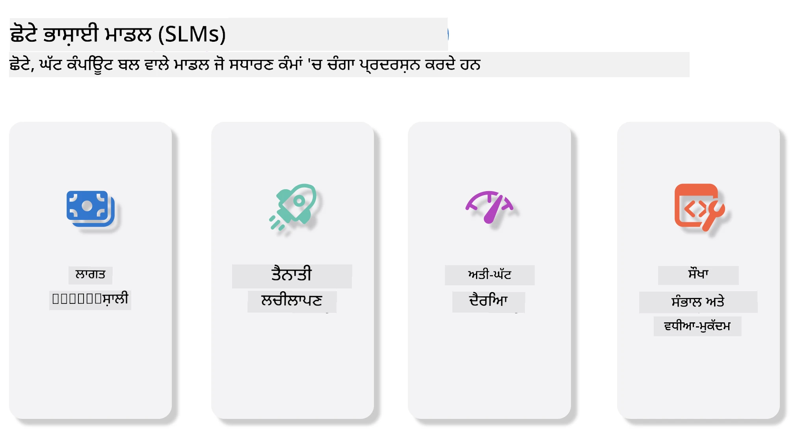
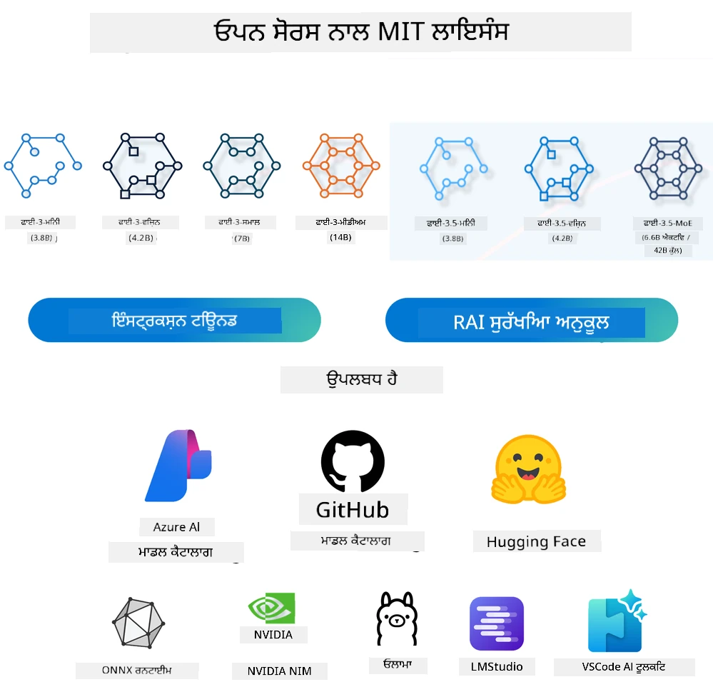
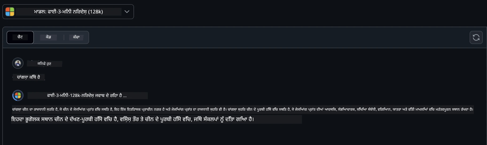
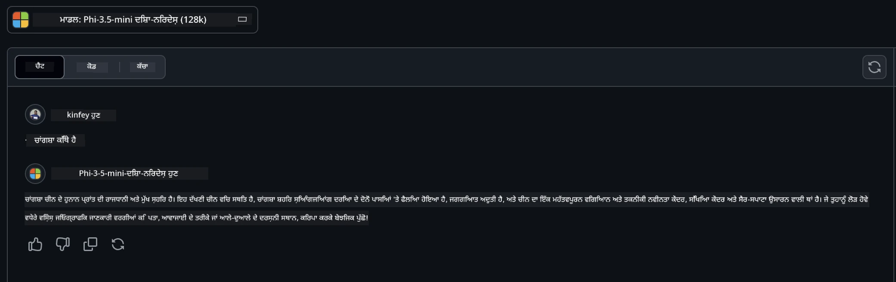

# ਸ਼ੁਰੂਆਤ ਛੋਟੇ ਭਾਸ਼ਾ ਮਾਡਲਾਂ ਲਈ ਜਨਰੇਟਿਵ AI ਵਿੱਚ ਸ਼ੁਰੂਆਤੀਆਂ ਲਈ  
ਜਨਰੇਟਿਵ AI ਕਿਰਤਰਿਮ ਬੁੱਧੀ ਦਾ ਇੱਕ ਮਨਮੋਹਕ ਖੇਤਰ ਹੈ ਜੋ ਉਹ ਸਿਸਟਮ ਬਣਾਉਣ 'ਤੇ ਧਿਆਨ ਕੇਂਦਰਿਤ ਕਰਦਾ ਹੈ ਜੋ ਨਵਾਂ ਸਮੱਗਰੀ ਤਿਆਰ ਕਰਨ ਵਿੱਚ ਸਮਰੱਥ ਹੋਣ। ਇਹ ਸਮੱਗਰੀ ਟੈਕਸਟ ਅਤੇ ਚਿੱਤਰਾਂ ਤੋਂ ਲੈ ਕੇ ਸੰਗੀਤ ਅਤੇ ਇੱਥੋਂ ਤੱਕ ਕਿ ਪੂਰੇ ਵਰਚੁਅਲ ਵਾਤਾਵਰਨ ਤੱਕ ਫੈਲ ਸਕਦੀ ਹੈ। ਜਨਰੇਟਿਵ AI ਦਾ ਇੱਕ ਸਭ ਤੋਂ ਰੋਮਾਂਚਕ ਉਦਯੋਗ ਭਾਸ਼ਾ ਮਾਡਲਾਂ ਦੇ ਖੇਤਰ ਵਿਚ ਹੈ।

## ਛੋਟੇ ਭਾਸ਼ਾ ਮਾਡਲ ਕੀ ਹਨ?

ਇੱਕ ਛੋਟਾ ਭਾਸ਼ਾ ਮਾਡਲ (SLM) ਇੱਕ ਵੱਡੇ ਭਾਸ਼ਾ ਮਾਡਲ (LLM) ਦਾ ਇੱਕ ਛੋਟਾ संस्करण ਹੁੰਦਾ ਹੈ, ਜੋ LLM ਦੇ ਕਈ ਆਰਕੀਟੈਕਚਰਲ ਸਿਧਾਂਤਾਂ ਅਤੇ ਤਕਨੀਕਾਂ ਦਾ ਲਾਭ ਉਠਾਉਂਦਾ ਹੈ, ਪਰ ਕਾਫੀ ਘਟਿਆ ਕੰਪਿਊਟੇਸ਼ਨਲ ਪੈਰਦਾ ਦਿਖਾਉਂਦਾ ਹੈ।

SLM ਭਾਸ਼ਾ ਮਾਡਲਾਂ ਦਾ ਇੱਕ ਉਪਸੈੱਟ ਹੈ ਜੋ ਮਨੁੱਖੀ ਵਰਗਾ ਲਿਖਤ ਤਿਆਰ ਕਰਨ ਲਈ ਬਣਾਏ ਜਾਂਦੇ ਹਨ। ਵੱਡੇ ਮਾਡਲਾਂ ਜਿਵੇਂ GPT-4 ਨਾਲੋਂ ਵੱਖਰੇ, SLM ਜ਼ਿਆਦਾ ਕੰਪੈਕਟ ਅਤੇ ਕੁਸ਼ਲ ਹੁੰਦੇ ਹਨ, ਜੋ ਉਨ੍ਹਾਂ ਨੂੰ ਉਦਯੋਗਾਂ ਲਈ ਜੋ ਕੰਪਿਊਟੇਸ਼ਨਲ ਸਰੋਤ ਸੀਮਤ ਹਨ, ਬਿਹਤਰ ਬਣਾਉਂਦਾ ਹੈ। ਛੋਟੇ ਹੇਠਾਂ ਵੀ ਇਹ ਕਈ ਕੰਮ ਕਰ ਸਕਦੇ ਹਨ। ਆਮ ਤੌਰ 'ਤੇ, SLM ਵੱਡੇ LLM ਨੂੰ ਕਮਪ੍ਰੈਸ يا ਡਿਸਟਿਲ ਕਰਕੇ ਬਣਾਏ ਜਾਂਦੇ ਹਨ, ਜਿਸ ਦਾ ਟੀਚਾ ਮੂਲ ਮਾਡਲ ਦੀ ਕਾਰਗੁਜ਼ਾਰੀ ਅਤੇ ਭਾਸ਼ਾਈ ਯੋਗਤਾਵਾਂ ਦਾ ਵੱਡਾ ਹਿੱਸਾ ਰੱਖਣਾ ਹੁੰਦਾ ਹੈ। ਮਾਡਲ ਦੇ ਆਕਾਰ ਵਿੱਚ ਇਹ ਵੱਡੀ ਘਟਾਓ ਬੁਝਾਰਤਰ ਨਾਲ ਸਮੱਗਰੀ ਅਤੇ ਵੇਲੇ ਦੀ ਖਪਤ ਨੂੰ ਘਟਾਉਂਦੀ ਹੈ। ਇਨ੍ਹਾਂ ਸੁਧਾਰਾਂ ਦੇ ਬਾਵਜੂਦ, SLM ਕਈ ਕੁਦਰਤੀ ਭਾਸ਼ਾ ਪ੍ਰਕਿਰਿਆ (NLP) ਦੇ ਕੰਮ ਕਰ ਸਕਦੇ ਹਨ:

- ਟੈਕਸਟ ਜਨਰੇਸ਼ਨ: ਸੰਦੇਸ਼ਪੂਰਕ ਅਤੇ প্ৰਸੰਗਿਕ ਵਾਕਾਂ ਜਾਂ ਪੈਰਾਗ੍ਰਾਫ ਬਣਾਉਣ।  
- ਟੈਕਸਟ ਪੂਰਾ ਕਰਨਾ: ਦਿੱਤੇ ਗਏ ਪ੍ਰੰਪਟ ਦੇ ਆਧਾਰ 'ਤੇ ਵਾਕ ਪੂਰੇ ਕਰਨ ਦੀ ਭਵਿੱਖਬਾਣੀ।  
- ਅਨੁਵਾਦ: ਇੱਕ ਭਾਸ਼ਾ ਤੋਂ ਦੂਜੀ ਭਾਸ਼ਾ ਵਿੱਚ ਲਿਖਤ ਬਦਲਣਾ।  
- ਸੰਖੇਪ： ਲੰਬੇ ਲਿਖਤ ਨੂੰ ਛੋਟੇ ਅਤੇ ਸਮਝਣਯੋਗ ਸੰਖੇਪਾਂ ਵਿੱਚ ਭੇਜਣਾ।

ਕੁਝ ਵੱਡੇ ਮਾਡਲਾਂ ਨਾਲੋਂ ਇਹਨਾਂ ਵਿੱਚ ਪ੍ਰਦਰਸ਼ਨ ਜਾਂ ਸਮਝ ਦਾ ਕੋਈ ਸਮਝੌਤਾ ਹੋ ਸਕਦਾ ਹੈ।

## ਛੋਟੇ ਭਾਸ਼ਾ ਮਾਡਲ ਕਿਵੇਂ ਕੰਮ ਕਰਦੇ ਹਨ?  
SLM ਵੱਡੇ ਮਾਤਰਾ ਵਿੱਚ ਲਿਖਤੀ ਡਾਟਾ 'ਤੇ ਸਿਖਾਏ ਜਾਂਦੇ ਹਨ। ਟ੍ਰੇਨਿੰਗ ਦੌਰਾਨ, ਇਹ ਭਾਸ਼ਾ ਦੇ ਪੈਟਰਨ ਅਤੇ ਢਾਂਚੇ ਸਿੱਖਦੇ ਹਨ, ਜਿਸ ਨਾਲ ਉਹ ਗ੍ਰੈਮਰ ਅਤੇ ਪ੍ਰਸੰਗਿਕਤਾ ਵਿੱਚ ਠੀਕ ਟੈਕਸਟਜਨਰੇਟ ਕਰ ਸਕਦੇ ਹਨ। ਟ੍ਰੇਨਿੰਗ ਪ੍ਰਕਿਰਿਆ ਵਿੱਚ ਸ਼ਾਮਿਲ ਹਨ:

- ਡਾਟਾ ਸੰਗ੍ਰਹਿ: ਵੱਖਵੱਖ ਸਰੋਤਾਂ ਤੋਂ ਵੱਡੇ ਡਾਟਾਸੈੱਟ ਇਕੱਠੇ ਕਰਨਾ।  
- ਪ੍ਰੀ-ਪ੍ਰੋਸੈਸਿੰਗ: ਡਾਟਾ ਨੂੰ ਸਾਫ਼ ਅਤੇ ਸੁਚੱਜਾ ਕਰ ਕੇ ਟ੍ਰੇਨਿੰਗ ਲਈ ਤਿਆਰ ਕਰਨਾ।  
- ਸਿਖਲਾਈ: ਮਸ਼ੀਨ ਲਰਨਿੰਗ ਅਲਗੋਰੀਦਮ ਦੀ ਵਰਤੋਂ ਕਰਕੇ ਮਾਡਲ ਨੂੰ ਸਮਝਣਾ ਅਤੇ ਟੈਕਸਟ ਬਣਾਉਣਾ ਸਿਖਾਉਣਾ।  
- ਫਾਇਨ-ਟਿਉਨਿੰਗ: ਮਾਡਲ ਨੂੰ ਖਾਸ ਕੰਮਾਂ ਲਈ ਬਿਹਤਰ ਬਣਾਉਣਾ।

SLM ਵਿਕਾਸ, ਐਸੇ ਮਾਡਲ ਬਣਾਉਣ ਦੀ ਵਧਦੀ ਲੋੜ ਨੂੰ ਧਿਆਨ ਵਿੱਚ ਰੱਖਦਾ ਹੈ ਜੋ ਸਰੋਤ ਸੀਮਤ ਵਾਤਾਵਰਨ ਵਿੱਚ ਜਿਵੇਂ ਮੋਬਾਈਲ ਡਿਵਾਈਸਾਂ ਜਾਂ ਐਜ ਕੰਪਿਊਟਿੰਗ ਪਲੇਟਫਾਰਮਾਂ 'ਤੇ ਵਰਤੇ ਜਾ ਸਕਦੇ ਹਨ, ਜਿੱਥੇ ਵੱਡੇ LLM ਦੀ ਭਾਰੀ ਸਰੋਤ ਲੋੜ ਕਾਰਨ ਪ੍ਰਭਾਵਿਤ ਹੋ ਸਕਦੇ ਹਨ। ਸਮਰੱਥਾ ਤੇ ਧਿਆਨ ਕੇਂਦਰਿਤ ਕਰਕੇ, SLM ਕਾਰਗੁਜ਼ਾਰੀ ਅਤੇ ਪਹੁੰਚ ਨੂੰ ਸੰਤੁਲਿਤ ਕਰਦੇ ਹਨ, ਵੱਖ-ਵੱਖ ਖੇਤਰਾਂ ਵਿੱਚ ਵਿਸ਼ਾਲ ਅਰਜ਼ੀਆਂ ਲਈ ਯੋਗ ਬਣਾਉਂਦੇ ਹਨ।



## ਸਿੱਖਣ ਦੇ ਉਦੇਸ਼  

ਇਸ ਪਾਠ ਵਿੱਚ, ਅਸੀਂ SLM ਦੀ ਜਾਣਕਾਰੀ ਦੇਣਾ ਚਾਹੁੰਦੇ ਹਾਂ ਅਤੇ ਇਸਨੂੰ Microsoft Phi-3 ਨਾਲ ਮਿਲਾ ਕੇ ਟੈਕਸਟ ਸਮੱਗਰੀ, ਵਿਜ਼ਨ ਅਤੇ MoE ਵਿੱਚ ਵੱਖਰੇ ਸਥਿਤੀਆਂ ਸਿੱਖਣੇ ਹਾਂ।

ਇਸ ਪਾਠ ਦੇ ਅੰਤ ਤੱਕ, ਤੁਹਾਨੂੰ ਹੇਠ ਲਿਖਿਆ ਸਵਾਲਾਂ ਦਾ ਜਵਾਬ ਦੇਣਾ ਆਉਣਾ ਚਾਹੀਦਾ ਹੈ:

- SLM ਕੀ ਹੈ?  
- SLM ਅਤੇ LLM ਵਿੱਚ ਕੀ ਫਰਕ ਹੈ?  
- Microsoft Phi-3/3.5 ਪਰਿਵਾਰ ਕੀ ਹੈ?  
- Microsoft Phi-3/3.5 ਪਰਿਵਾਰ ਨਾਲ ਕਿਵੇਂ ਅਨੁਮਾਨ ਲਗਾਉਣਾ ਹੈ?

ਤਿਆਰ ਹੋ? ਚਲੋ ਸ਼ੁਰੂ ਕਰੀਏ।

## ਵੱਡੇ ਭਾਸ਼ਾ ਮਾਡਲ (LLMs) ਅਤੇ ਛੋਟੇ ਭਾਸ਼ਾ ਮਾਡਲਾਂ (SLMs) ਦੇ ਫਰਕ

ਦੋਹਾਂ LLM ਅਤੇ SLM ਮੂਲ ਤੌਰ 'ਤੇ ਸੰਭਾਵਿਤ ਮਸ਼ੀਨ ਲਰਨਿੰਗ ਦੇ ਸਿਧਾਂਤਾਂ ਉੱਤੇ ਆਧਾਰਿਤ ਹਨ, ਉਹਨਾਂ ਦੀ ਆਰਕੀਟੈਕਚਰ ਦੇ ਡਿਜ਼ਾਇਨ, ਟ੍ਰੇਨਿੰਗ ਤਰੀਕਿਆਂ, ਡਾਟਾ ਜਨਰੇਸ਼ਨ ਪ੍ਰਕਿਰਿਆਵਾਂ ਅਤੇ ਮਾਡਲ ਮੁਲਾਂਕਣ ਤਕਨੀਕਾਂ ਵਿੱਚ ਸਮਾਨਤਾ ਪਾਈ ਜਾਂਦੀ ਹੈ। ਪਰ ਕਈ ਮੁੱਖ ਕਾਰਕ ਇਨ੍ਹਾਂ ਦੋ ਮਾਡਲਾਂ ਵਿੱਚ ਅੰਤਰ ਕਰਦੇ ਹਨ।

## ਛੋਟੇ ਭਾਸ਼ਾ ਮਾਡਲਾਂ ਦੀਆਂ ਅਰਜ਼ੀਆਂ

SLM ਦੀਆਂ ਵਿਸ਼ਾਲ ਅਰਜ਼ੀਆਂ ਹਨ, ਜਿਵੇਂ:

- ਚੈਟਬੋਟ: ਗਾਹਕ ਸਹਾਇਤਾ ਪ੍ਰਦਾਨ ਕਰਨਾ ਅਤੇ ਉਪਭੋਗਤਾਵਾਂ ਨਾਲ ਗੱਲਬਾਤ ਵਿੱਚ ਜੁੜਨਾ।  
- ਸਮੱਗਰੀ ਬਣਾਉਣਾ: ਲੇਖਕਾਂ ਦੀ ਸਹਾਇਤਾ ਕਰਨੀ ਵਿਚਾਰ ਜਨਰੇਟ ਕਰਕੇ ਜਾਂ ਪੂਰੇ ਲੇਖ ਤਿਆਰ ਕਰਕੇ।  
- ਸਿੱਖਿਆ: ਵਿਦਿਆਰਥੀਆਂ ਨੂੰ ਲਿਖਤ ਸੌਂਪਣ ਜਾਂ ਨਵੀਆਂ ਭਾਸ਼ਾਵਾਂ ਸਿੱਖਣ 'ਚ ਮਦਦ।  
- ਪਹੁੰਚਯੋਗਤਾ: ਵਿਦਿਆਹੀਣਾਂ ਲਈ ਟੈਕਸਟ-ਟੂ-ਸਪੀਚ ਔਜ਼ਾਰ ਬਣਾਉਣਾ।  

**ਆਕਾਰ**

ਵੱਡੇ ਭਾਸ਼ਾ ਮਾਡਲ ਅਤੇ ਛੋਟੇ ਭਾਸ਼ਾ ਮਾਡਲ ਵਿੱਚ ਮੁੱਖ ਅੰਤਰ ਮਾਡਲ ਦੇ ਆਕਾਰ ਵਿੱਚ ਹੁੰਦਾ ਹੈ। LLM ਜਿਵੇਂ ChatGPT (GPT-4) ਦਾ ਕਰੀਬ 1.76 ਟ੍ਰਿਲੀਅਨ ਪੈਰਾਮੀਟਰ ਹੋ ਸਕਦੇ ਹਨ, ਜਦਕਿ ਖੁੱਲ੍ਹੇ ਸਰੋਤ ਵਾਲੇ SLM ਜਿਵੇਂ Mistral 7B ਵਿੱਚ ਲਗਭਗ 7 ਬਿਲੀਅਨ ਪੈਰਾਮੀਟਰ ਹੁੰਦੇ ਹਨ। ਇਹ ਅੰਤਰ ਆਮ ਤੌਰ 'ਤੇ ਮਾਡਲ ਆਰਕੀਟੈਕਚਰ ਅਤੇ ਟ੍ਰੇਨਿੰਗ ਪ੍ਰਕਿਰਿਆਵਾਂ ਵਿੱਚ ਵੱਖ-ਵੱਖਤਾਵਾਂ ਕਾਰਨ ਹੁੰਦਾ ਹੈ। ਉਦਾਹਰਣ ਲਈ, ChatGPT ਵਿੱਚ ਐਨਕੋਡਰ-ਡਿਕੋਡਰ ਫਰੇਮਵਰਕ ਵਿੱਚ ਸਵੈ-ਧਿਆਨ ਮਿਕੈਨਿਜ਼ਮ ਵਰਤਿਆ ਜਾਂਦਾ ਹੈ, ਜਦਕਿ Mistral 7B ਸਲਾਇਡਿੰਗ ਵਿੰਡੋ ਧਿਆਨ ਪ੍ਰਣਾਲੀ ਨੂੰ ਸਿਰਫ਼ ਡਿਕੋਡਰ ਮਾਡਲ ਵਿੱਚ ਵਰਤਦਾ ਹੈ, ਜੋ ਟ੍ਰੇਨਿੰਗ ਲਈ ਜ਼ਿਆਦਾ ਕੁਸ਼ਲ ਹੁੰਦਾ ਹੈ। ਇਹ ਅੰਤਰ ਮਾਡਲ ਦੇ ਕਠਨਾਈ ਅਤੇ ਕਾਰਗੁਜ਼ਾਰੀ ’ਤੇ ਗਹਿਰਾ ਪ੍ਰਭਾਵ ਪਾਉਂਦਾ ਹੈ।

**ਸਮਝ**

SLM ਆਮ ਤੌਰ 'ਤੇ ਵਿਸ਼ੇਸ਼ ਖੇਤਰਾਂ ਵਿੱਚ ਬਿਹਤਰ ਪ੍ਰਦਰਸ਼ਨ ਲਈ ਵਧੀਆ ਬਣਾਏ ਜਾਂਦੇ ਹਨ, ਜਿਸ ਨਾਲ ਉਹ ਬਹੁਤ ਸਾਰੇ ਘੇਰੇ ਜਾਣਕਾਰੀ ਵਿੱਚ ਪਰਿਪਕਵ ਸਮਝ ਵਿੱਚ ਸੀਮਿਤ ਹੋ ਸਕਦੇ ਹਨ। ਇਸਦੇ ਬਰਕਸ, LLM ਮਨੁੱਖੀ ਬੁੱਧੀ ਦਾ ਨਕਲ ਕਰਨ ਦੇ ਉਦੇਸ਼ ਨਾਲ ਵਿਆਪਕ ਪੱਧਰ ’ਤੇ ਸਿਖਾਏ ਜਾਂਦੇ ਹਨ। ਵਿਸ਼ਾਲ ਅਤੇ ਵੱਖਰੇ ਡਾਟਾਸੈੱਟ ’ਤੇ ਟ੍ਰੇਨਿੰਗ ਨਾਲ, LLM ਵੱਖ-ਵੱਖ ਖੇਤਰਾਂ ਵਿੱਚ ਚੰਗਾ ਕਾਰਜ ਕਰਦੇ ਹਨ, ਵਧੀਆ ਰੂਪ-ਰੰਗ ਅਤੇ ਲਚੀਲਾਪਨ ਦੇਣ ਵਾਲੇ। ਇਸ ਲਈ, LLM ਕੁਦਰਤੀ ਭਾਸ਼ਾ ਪ੍ਰਕਿਰਿਆ ਅਤੇ ਪ੍ਰੋਗ੍ਰਾਮਿੰਗ ਵਰਗੇ ਵੱਖ-ਵੱਖ ਅੰਤਗਤ ਕੰਮਾਂ ਲਈ ਜ਼ਿਆਦਾ ਉਚਿਤ ਹਨ।

**ਕੰਪਿਊਟਿੰਗ**

LLM ਦੀ ਟ੍ਰੇਨਿੰਗ ਅਤੇ ਲਾਗੂ ਕਰਨ ਲਈ ਭਾਰੀ ਕੰਪਿਊਟੇਸ਼ਨਲ ਢਾਂਚਾ ਲੋੜੀਂਦਾ ਹੈ, ਜਿਸ ਵਿੱਚ ਵੱਡੇ ਪੈਮਾਨੇ 'ਤੇ GPU ਕਲੱਸਟਰ ਸ਼ਾਮਿਲ ਹਨ। ਉਦਾਹਰਣ ਵਜੋਂ, ChatGPT ਵਰਗੇ ਮਾਡਲ ਦੀ ਇੱਕ ਸਫ਼ ਤੋਂ ਟ੍ਰੇਨਿੰਗ ਕਰਨ ਲਈ ਹਜ਼ਾਰਾਂ GPU ਕਈ ਮਹੀਨੇ ਚਲਾਉਣੇ ਪੈਂਦੇ ਹਨ। ਇਸਦੇ ਉਲਟ, ਛੋਟੇ ਭਾਸ਼ਾ ਮਾਡਲਾਂ ਨਾਲ ਇਹ ਕੰਪਿਊਟੇਸ਼ਨਲ ਸਰੋਤਾਂ ਘੱਟ ਲੱਗਦੇ ਹਨ। ਉਦਾਹਰਨ ਵਜੋਂ, Mistral 7B ਵਰਗਾ ਮਾਡਲ ਸਧਾਰਨ ਯੰਤਰਾਂ 'ਤੇ ਤਿਆਰ ਕੀਤਾ ਅਤੇ ਚਲਾਇਆ ਜਾ ਸਕਦਾ ਹੈ, ਹਾਲਾਂਕਿ ਟ੍ਰੇਨਿੰਗ ਲਈ ਫਿਰ ਵੀ ਕਈ ਘੰਟਿਆਂ ਲਈ ਕਈ GPU ਦੀ ਲੋੜ ਹੁੰਦੀ ਹੈ।

**ਪੱਖਪਾਤ**

ਪੱਖਪਾਤ LLM ਵਿੱਚ ਇੱਕ ਜਾਣਿਆ-ਪਹਚਾਨਿਆ ਮੁੱਦਾ ਹੈ, ਜੋ ਅਕਸਰ ਟ੍ਰੇਨਿੰਗ ਡਾਟਾ ਦੀ ਕੁਦਰਤ ਕਾਰਨ ਹੁੰਦਾ ਹੈ। ਇਹ ਮਾਡਲ ਆਮ ਤੌਰ 'ਤੇ ਇੰਟਰਨੈੱਟ ਤੋਂ ਖੁੱਲ੍ਹੇ ਕੱਚੇ ਡਾਟਾ 'ਤੇ ਨਿਰਭਰ ਕਰਦੇ ਹਨ, ਜੋ ਕੁਝ ਸਮੂਹਾਂ ਨੂੰ ਘੱਟ ਦਰਸਾ ਸਕਦਾ ਹੈ, ਗਲਤ ਲੇਬਲਿੰਗ ਕਰ ਸਕਦਾ ਹੈ ਜਾਂ ਉੱਪਜਾਤੀ, ਭੂਗੋਲਿਕ ਅਤੇ ਵਿਆਕਰਣਕ ਤਿਅਹਾਂ ਨਾਲ ਪ੍ਰਭਾਵਿਤ ਭਾਸ਼ਾਈ ਪੱਖਪਾਤ ਨੂੰ ਦਰਸਾ ਸਕਦਾ ਹੈ। ਇਲਾਵਾ, LLM ਦੀਆਂ ਜਟਿਲ ਆਰਕੀਟੈਕਚਰਾਂ ਅਕਸਰ ਅਣਜਾਣੇ ਤਰੀਕੇ ਨਾਲ ਪੱਖਪਾਤ ਨੂੰ ਵਧਾ ਸਕਦੀਆਂ ਹਨ, ਜੋ ਧਿਆਨ ਨਾਲ ਫਾਇਨ-ਟਿਉਨਿੰਗ ਦੇ ਬਿਨਾਂ ਪਤਾ ਨਹੀਂ ਲੱਗਦੇ। ਦੂਜੇ ਪਾਸੇ, SLM ਵਧੇਰੇ ਨਿਯਤ, ਵਿਸ਼ੇਸ਼ ਖੇਤਰਾਂ ਵਿੱਚ ਡਾਟਾਸੈੱਟਾਂ 'ਤੇ ਸਿੱਖਾਏ ਜਾਂਦੇ ਹਨ, ਜੋ ਉਨ੍ਹਾਂ ਨੂੰ ਇਸ ਕਿਸਮ ਦੇ ਪੱਖਪਾਤ ਤੋਂ ਕੁਝ ਘੱਟ ਪ੍ਰਭਾਵਤ ਕਰਦਾ ਹੈ, ਪਰ ਪ੍ਰਤਿਰੋਧੀ ਨਹੀਂ ਬਣਾਉਂਦਾ।

**ਅਨੁਮਾਨ**

SLM ਦਾ ਛੋਟਾ ਆਕਾਰ ਉਨ੍ਹਾਂ ਨੂੰ ਸਥਾਨਕ ਹਾਰਡਵੇਅਰ 'ਤੇ ਤੇਜ਼ੀ ਨਾਲ ਨਤੀਜੇ ਜਨਰੇਟ ਕਰਨ ਵਿੱਚ ਵੱਡਾ ਫਾਇਦਾ ਦਿੰਦਾ ਹੈ ਬਿਨਾਂ ਵੱਡੀ ਪੈਮਾਨੇ ਦੀ ਪੈਰਲੇਲ ਕੰਪਿਊਟਿੰਗ ਦੀ ਲੋੜ ਦੇ। ਇਸਦੇ ਬਰਕਸ, LLM ਆਪਣੀ ਵੱਡੀ ਸਰਚਨਾ ਅਤੇ ਜਟਿਲਤਾ ਕਾਰਨ ਕਾਫ਼ੀ ਪੈਰਲੇਲ ਸਰੋਤਾਂ ਦੀ ਮੰਗ ਕਰਦੇ ਹਨ, ਜੋ ਅਨੁਮਾਨੀ ਸਮੇਂ ਵਿੱਚ ਕਮ ਵਧਤ ਦਾ ਕਾਰਨ ਬਣਦਾ ਹੈ। ਵੱਧ ਗਿਣਤੀ ਵਿੱਚ ਉਪਭੋਗਤਾਵਾਂ ਦੀ ਮੌਜੂਦਗੀ ਨਾਲ, LLM ਦੀ ਪ੍ਰਤੀਕਿਰਿਆ ਸਮਾਂ ਹੋਰ ਵੀ ਵਧ ਜਾਂਦਾ ਹੈ, ਖਾਸ ਕਰਕੇ ਜਦੋਂ ਇਹ ਵੱਡੇ ਪੈਮਾਨੇ 'ਤੇ ਨਿਯੁਕਤ ਕੀਤੇ ਜਾਂ।

ਸਾਰ ਵਿੱਚ, ਜਦ ਕਿ ਦੋਹਾਂ LLM ਅਤੇ SLM ਮਸ਼ੀਨ ਲਰਨਿੰਗ ਦੇ ਆਧਾਰ ਸ਼ੇਅਰ ਕਰਦੇ ਹਨ, ਇਹਨਾਂ ਵਿੱਚ ਮਾਡਲ ਆਕਾਰ, ਸਰੋਤਾਂ ਦੀ ਲੋੜ, ਪ੍ਰਸੰਗਿਕ ਸਮਝ, ਪੱਖਪਾਤ ਲਈ ਸੰਵੇਦਨਸ਼ੀਲਤਾ ਅਤੇ ਅਨੁਮਾਨ ਸਮੇਂ ਵਿੱਚ ਵੱਡਾ ਅੰਤਰ ਹੁੰਦਾ ਹੈ। ਇਹ ਅੰਤਰ ਵੱਖ-ਵੱਖ ਉਪਯੋਗਤਾਵਾਂ ਲਈ ਉਨ੍ਹਾਂ ਦੀ ਯੋਗਤਾ ਨੂੰ ਦਰਸਾਉਂਦੇ ਹਨ, ਜਿੱਥੇ LLM ਵੱਧ ਲਚੀਲੇ ਪਰ ਸਰੋਤ ਭਾਰੀ ਹਨ, ਅਤੇ SLM ਖੇਤਰ-ਖਾਸ ਕੁਸ਼ਲਤਾ ਜਾਂ ਛੋਟੇ ਕੰਪਿਊਟੇਸ਼ਨਲ ਲੋੜਾਂ ਨਾਲ ਵੱਧ ਪਹੁੰਚਯੋਗ ਹਨ।

***ਨੋਟ: ਇਸ ਪਾਠ ਵਿੱਚ ਅਸੀਂ Microsoft Phi-3 / 3.5 ਨੂੰ ਉਦਾਹਰਣ ਵਜੋਂ ਵਰਤਦੇ ਹੋਏ SLM ਨਾਲ ਪਰਚਿਤ ਕਰਵਾਵਾਂਗੇ।***

## Phi-3 / Phi-3.5 ਪਰਿਵਾਰ ਨਾਲ ਜਾਣੂ

Phi-3 / 3.5 ਪਰਿਵਾਰ ਮੁੱਖ ਤੌਰ 'ਤੇ ਟੈਕਸਟ, ਵਿਜ਼ਨ ਅਤੇ ਏਜੰਟ (MoE) ਐਪਲੀਕੇਸ਼ਨ ਸਥਿਤੀਆਂ ਨੂੰ ਟਾਰਗੇਟ ਕਰਦਾ ਹੈ:

### Phi-3 / 3.5 ਇਨਸਟ੍ਰਕਟ

ਮੁੱਖ ਤੌਰ 'ਤੇ ਟੈਕਸਟ ਜਨਰੇਸ਼ਨ, ਗੱਲਬਾਤ ਪੂਰਾ ਕਰਨ ਅਤੇ ਸਮੱਗਰੀ ਜਾਣਕਾਰੀ ਪ੍ਰਾਪਤ ਕਰਨ ਲਈ।

**Phi-3-mini**

3.8B ਭਾਸ਼ਾ ਮਾਡਲ Microsoft Azure AI Studio, Hugging Face ਅਤੇ Ollama 'ਤੇ ਉਪਲਬਧ ਹੈ। Phi-3 ਮਾਡਲ ਲਗਾਤਾਰ ਯੋਗਤਾ ਵਿੱਚ ਆਪਣੇ ਆਕਾਰ ਦੇ ਬਰਾਬਰ ਅਤੇ ਵੱਧ ਮਾਡਲਾਂ ਨਾਲੋਂ ਵਧੀਆ ਹਨ (ਹੇਠਾਂ ਦਿੱਤੇ ਬੈਂਚਮਾਰਕ ਨੰਬਰ ਵੇਖੋ, ਜਿੱਥੇ ਵੱਧ ਨੰਬਰ ਵਧੀਆ ਹਨ)। Phi-3-mini ਆਪਣੇ ਆਕਾਰ ਦੇ ਦੋ ਗੁਣਾ ਮਾਡਲਾਂ ਤੋਂ ਬਿਹਤਰ ਹੈ, ਜਦਕਿ Phi-3-small ਅਤੇ Phi-3-medium ਵੱਡੇ ਮਾਡਲਾਂ, ਜਿਸ ਵਿੱਚ GPT-3.5 ਵੀ ਸ਼ਾਮਿਲ ਹੈ, ਨਾਲੋਂ ਅੱਗੇ ਹਨ।

**Phi-3-small & medium**

ਸਿਰਫ 7B ਪੈਰਾਮੀਟਰਾਂ ਨਾਲ, Phi-3-small GPT-3.5T ਨੂੰ ਕਈ ਭਾਸ਼ਾਈ, ਤਰਕਸ਼ੀਲ, ਕੋਡਿੰਗ ਅਤੇ ਗਣਿਤ ਬੈਂਚਮਾਰਕਾਂ 'ਤੇ ਹਰਾ ਦਿੰਦਾ ਹੈ।

Phi-3-medium 14B ਪੈਰਾਮੀਟਰਾਂ ਨਾਲ ਇਸ ਰੁਝਾਨ ਨੂੰ ਜਾਰੀ ਰੱਖਦਾ ਹੈ ਅਤੇ Gemini 1.0 Pro ਨੂੰ ਪਿੱਛੇ ਛੱਡਦਾ ਹੈ।

**Phi-3.5-mini**

ਇਸਨੂੰ Phi-3-mini ਦਾ ਅੱਪਗਰੇਡ ਸਮਝਿਆ ਜਾ ਸਕਦਾ ਹੈ। ਜ਼ਰੀਏ ਪੈਰਾਮੀਟਰ ਜਿਵੇਂ ਦੇ ਰਹਿੰਦੇ ਹਨ, ਇਹ 20+ ਭਾਸ਼ਾਵਾਂ (ਅਰਬੀ, ਚੀਨੀ, ਚੈਕ, ਡੈਨੀਸ਼, ਡੱਚ, ਅੰਗਰੇਜ਼ੀ, ਫਿਨਿਸ਼, ਫ੍ਰੈਂਚ, ਜਰਮਨ, ਇਬਰਾਨੀ, ਹਾਂਗੇਰੀ, ਇਟਾਲੀਅਨ, ਜਪਾਨੀ, ਕੋਰੀਆਈ, ਨਾਰਵੇਜੀਆਈ, ਪੋਲਿਸ਼, ਪੋਰਚੂਗੀਜ਼, ਰੂਸੀ, ਸਪੇਨੀ, ਸਵੀਡੀਸ਼, ਥਾਈ, ਤੁਰਕੀ, ਯੂਕਰੇਨੀਅਨ) ਨੂੰ ਸਮਰਥਨ ਦਿੰਦਾ ਹੈ ਅਤੇ ਲੰਬੇ ਪ੍ਰਸੰਗ ਲਈ ਮਜ਼ਬੂਤ ਸਹਾਇਤਾ ਜੋੜਦਾ ਹੈ।

Phi-3.5-mini 3.8B ਪੈਰਾਮੀਟਰਾਂ ਨਾਲ ਸਮਾਣੇ ਆਕਾਰ ਦੇ ਭਾਸ਼ਾ ਮਾਡਲਾਂ ਤੋਂ ਬਿਹਤਰ ਹੈ ਅਤੇ ਆਪਣੇ ਆਕਾਰ ਦੇ ਦੋ ਗੁਣਾ ਮਾਡਲਾਂ ਦੇ ਸਮਾਨ ਹੈ।

### Phi-3 / 3.5 ਵਿਜ਼ਨ

ਅਸੀਂ Phi-3/3.5 ਦਾ ਇੰਸਟ੍ਰਕਟ ਮਾਡਲ Phi ਦੀ ਸਮਝਣ ਵਾਲੀ ਸਮਰੱਥਾ ਵਜੋਂ ਦੇਖ ਸਕਦੇ ਹਾਂ, ਅਤੇ ਵਿਜ਼ਨ Phi ਨੂੰ ਦੁਨੀਆ ਸਮਝਣ ਲਈ ਅੱਖਾਂ ਦਿੰਦਾ ਹੈ।

**Phi-3-Vision**

ਕੇਵਲ 4.2B ਪੈਰਾਮੀਟਰਾਂ ਨਾਲ Phi-3-vision ਇਸ ਰੁਝਾਨ ਨੂੰ ਜਾਰੀ ਰੱਖਦਾ ਹੈ ਅਤੇ ਬੜੇ ਮਾਡਲਾਂ ਜਿਵੇਂ Claude-3 Haiku ਅਤੇ Gemini 1.0 Pro V ਨੂੰ ਆਮ ਵਿਜ਼ੂਅਲ ਤਰਕ, OCR ਅਤੇ ਟੇਬਲ ਅਤੇ ਚਾਰਟ ਸਮਝਣ ਵਾਲੇ ਕੰਮਾਂ 'ਚ ਹਰਾ ਦਿੰਦਾ ਹੈ।

**Phi-3.5-Vision**

Phi-3.5-Vision Phi-3-Vision ਦਾ ਅੱਗੇਵਧਿਆ ਹੈ ਅਤੇ ਕਈ ਚਿੱਤਰਾਂ ਦੀ ਸਹਾਇਤਾ ਜੋੜਦਾ ਹੈ। ਤੁਸੀਂ ਇਸਨੂੰ ਇਕ ਤਰ੍ਹਾਂ ਦ੍ਰਿਸ਼ਟੀ ਵਿੱਚ ਸੁਧਾਰ ਸਮਝੋ, ਨਾ ਸਿਰਫ਼ ਤੁਹਾਨੂੰ ਫੋਟੋਆਂ ਦੇਖਣ ਦੀ ਸਮਰੱਥਾ ਹੈ, ਸਗੋਂ ਵੀਡੀਓ ਵੀ ਦੇਖ ਸਕਦੇ ਹੋ।

Phi-3.5-vision ਵੱਡੇ ਮਾਡਲਾਂ ਜਿਵੇਂ Claude-3.5 Sonnet ਅਤੇ Gemini 1.5 Flash ਨੂੰ OCR, ਟੇਬਲ ਅਤੇ ਚਾਰਟ ਸਮਝਣ ਵਾਲੇ ਕੰਮਾਂ ਵਿੱਚ ਹਰਾ ਦਿੰਦਾ ਹੈ ਅਤੇ ਆਮ ਵਿਜ਼ੂਅਲ ਜਾਣਕਾਰੀ ਤਰਕ ਵਿੱਚ ਬਰਾਬਰੀ ਦਾ ਦਰਜਾ ਰੱਖਦਾ ਹੈ। ਬਹੁ-ਫਰੇਮ ਇਨਪੁੱਟ ਦੇ ਸਮਰਥਨ ਨਾਲ, ਕਈ ਚਿੱਤਰਾਂ 'ਤੇ ਤਰਕਸ਼ੀਲਤਾ ਕਰਦਾ ਹੈ।

### Phi-3.5-MoE

***Mixture of Experts(MoE)*** ਮਾਡਲਾਂ ਨੂੰ ਘੱਟ ਕਮਪਿਊਟ ਤੋਂ ਪ੍ਰੀ-ਟ੍ਰੇਨ ਕਰਨ ਦੀ ਆਗਿਆ ਦਿੰਦਾ ਹੈ, ਜਿਸਦਾ ਮਤਲਬ ਇਹ ਹੈ ਕਿ ਤੁਸੀਂ ਮਾਡਲ ਜਾਂ ਡਾਟਾਸੈੱਟ ਨੂੰ ਵੱਡੇ ਪੈਮਾਨੇ ਤੇ ਵਰਤ ਸਕਦੇ ਹੋ ਬਿਨਾਂ ਵੱਧ ਕਮਿਊਟ ਬਜਟ ਦੇ। ਖਾਸ ਤੌਰ 'ਤੇ, ਇੱਕ MoE ਮਾਡਲ ਆਪਣੇ ਡੈਨਸ ਵਰਜਨ ਨਾਲੋਂ ਬਹੁਤ ਤੇਜ਼ ਪ੍ਰੀ-ਟ੍ਰੇਨਿੰਗ ਵਿੱਚ ਇੱਕੋ ਜਿਹੀ ਕੁਆਲਟੀ ਹਾਸਲ ਕਰ ਸਕਦਾ ਹੈ।

Phi-3.5-MoE ਵਿੱਚ 16x3.8B ਮਾਹਿਰ ਮੋਡੀਊਲ ਹਨ। ਸਿਰਫ 6.6B ਐਕਟਿਵ ਪੈਰਾਮੀਟਰਾਂ ਨਾਲ ਇਹ ਵੱਡੇ ਮਾਡਲਾਂ ਦੇ ਬਰਾਬਰ ਤਰਕਸ਼ੀਲਤਾ, ਭਾਸ਼ਾ ਸਮਝ ਅਤੇ ਗਣਿਤ ਕਰਦਾ ਹੈ।

ਅਸੀਂ ਵਿਭਿੰਨ ਸਥਿਤੀਆਂ ਅਧਾਰਿਤ Phi-3/3.5 ਪਰਿਵਾਰ ਦੇ ਮਾਡਲ ਵਰਤ ਸਕਦੇ ਹਾਂ। LLM ਦੇ ਵਿਰੁੱਧ, ਤੁਸੀਂ Phi-3/3.5-mini ਜਾਂ Phi-3/3.5-Vision ਨੂੰ ਐਜ ਡਿਵਾਈਸਾਂ 'ਤੇ ਤਾਇਨਾਤ ਕਰ ਸਕਦੇ ਹੋ।

## Phi-3/3.5 ਪਰਿਵਾਰ ਮਾਡਲਾਂ ਦੀ ਵਰਤੋਂ ਕਿਵੇਂ ਕਰੀਏ

ਅਸੀਂ ਉਮੀਦ ਕਰਦੇ ਹਾਂ ਕਿ ਫਰਕ ਸਥਿਤੀਆਂ ਵਿੱਚ Phi-3/3.5 ਵਰਤੋਂ। ਅੱਗੇ ਅਸੀਂ ਵੱਖਰੇ ਸਥਿਤੀਆਂ ਅਧਾਰਿਤ Phi-3/3.5 ਵਰਤੋਂਗੇ।



### ਕਲਾਊਡ ਏਪੀਆਈ ਰਾਹੀਂ ਅਨੁਮਾਨ

**GitHub ਮਾਡਲ**

GitHub ਮਾਡਲ ਸਭ ਤੋਂ ਸਿੱਧਾ ਤਰੀਕਾ ਹੈ। ਤੁਸੀਂ ਤੇਜ਼ੀ ਨਾਲ Phi-3/3.5-Instruct ਮਾਡਲ GitHub ਮਾਡਲ ਰਾਹੀਂ ਪ੍ਰਾਪਤ ਕਰ ਸਕਦੇ ਹੋ। Azure AI Inference SDK / OpenAI SDK ਨਾਲ ਮਿਲਾ ਕੇ, ਤੁਸੀਂ ਕੋਡ ਰਾਹੀਂ API ਕਾਲ ਕਰਕੇ Phi-3/3.5-Instruct ਕਾਲ ਕਰ ਸਕਦੇ ਹੋ। ਤੁਸੀਂ Playground ਰਾਹੀਂ ਵੀ ਵੱਖਰੇ ਨਤੀਜੇ ਪ੍ਰੀਖਿਆ ਕਰ ਸਕਦੇ ਹੋ।

- ਡੈਮੋ: ਚੀਨੀ ਸਥਿਤੀਆਂ ਵਿੱਚ Phi-3-mini ਅਤੇ Phi-3.5-mini ਦੇ ਪ੍ਰਭਾਵਾਂ ਦੀ ਤੁਲਨਾ





**Azure AI Studio**

ਜਾਂ ਜੇ ਤੁਸੀਂ ਵਿਜ਼ਨ ਅਤੇ MoE ਮਾਡਲ ਵਰਤਣਾ ਚਾਹੁੰਦੇ ਹੋ, ਤਾਂ ਤੁਸੀਂ Azure AI Studio ਦੀ ਵਰਤੋਂ ਕਰ API ਕਾਲ ਨੂੰ ਪੂਰਾ ਕਰ ਸਕਦੇ ਹੋ। ਜੇਕਰ ਤੁਸੀਂ ਰੁਚੀ ਰੱਖਦੇ ਹੋ, ਤਾਂ ਤੁਸੀਂ Phi-3 CookBook ਪੜ੍ਹਕੇ ਜਾਨ ਸਕਦੇ ਹੋ ਕਿ ਕਿਵੇਂ Phi-3/3.5 Instruct, Vision, MoE ਨੂੰ Azure AI Studio ਰਾਹੀਂ ਕਾਲ ਕਰਨਾ ਹੈ [ਇਸ ਲਿੰਕ 'ਤੇ ਕਲਿੱਕ ਕਰੋ](https://github.com/microsoft/Phi-3CookBook/blob/main/md/02.QuickStart/AzureAIStudio_QuickStart.md?WT.mc_id=academic-105485-koreyst)

**NVIDIA NIM**

Azure ਅਤੇ GitHub پاران ਦਿੱਤੇ ਗਏ ਕਲਾਊਡ ਆਧਾਰਤ ਮਾਡਲ ਕੈਟਲੌਗ ਦੇ ਹੱਲਾਂ ਦੇ ਇਲਾਵਾ, ਤੁਸੀਂ [NVIDIA NIM](https://developer.nvidia.com/nim?WT.mc_id=academic-105485-koreyst) ਦੀ ਵਰਤੋਂ ਕਰਕੇ ਸੰਬੰਧਿਤ ਕਾਲ ਦੀਆ ਕੰਮ ਪੂਰੇ ਕਰ ਸਕਦੇ ਹੋ। ਤੁਸੀਂ NVIDIA NIM 'ਤੇ ਜਾ ਕੇ Phi-3/3.5 ਪਰਿਵਾਰ ਦੇ API ਕਾਲ ਕਰ ਸਕਦੇ ਹੋ। NVIDIA NIM (NVIDIA ਇੰਫਰਨਸ ਮਾਈਕ੍ਰੋਸਰਵਿਸਿਜ਼) ਤੇਜ਼ ਇੰਫਰਨਸ ਮਾਈਕ੍ਰੋਸਰਵਿਸਿਜ਼ ਦਾ ਸੈੱਟ ਹੈ ਜੋ ਵਿਕਾਸਕਾਰਾਂ ਨੂੰ ਵੱਖ-ਵੱਖ ਮਾਹੌਲਾਂ ਵਿੱਚ ਬਿਆਈਬੱਧ ਫੈਸ਼ਨ ਵਿੱਚ AI ਮਾਡਲਾਂ ਨੂੰ ਪ੍ਰਭਾਵਸ਼ਾਲੀ ਤਰੀਕੇ ਨਾਲ ਤਾਇਨਾਤ ਕਰਨ ਵਿੱਚ ਮਦਦ ਕਰਦਾ ਹੈ, ਜਿਸ ਵਿੱਚ ਕਲਾਊਡ, ਡੇਟਾ ਸੈਂਟਰ ਅਤੇ ਵਰਕਸਟੇਸ਼ਨ ਸ਼ਾਮਿਲ ਹਨ।

ਇੱਥੇ NVIDIA NIM ਦੇ ਕੁਝ ਮੁੱਖ ਵਿਸ਼ੇਸ਼ਤਾਵਾਂ ਹਨ:
- **ਤਿਆਰ ਕਰਨ ਵਿੱਚ ਆਸਾਨੀ:** NIM ਇੱਕ ਹੀ ਕਮਾਂਡ ਨਾਲ AI ਮਾਡਲਾਂ ਨੂੰ ਤਿਆਰ ਕਰਨ ਦੀ ਆਗਿਆ ਦਿੰਦਾ ਹੈ, ਜੋ ਇਸਨੂੰ ਮੌਜੂਦਾ ਕੰਮਕਾਜ ਵਿੱਚ ਇਕੀਕ੍ਰਿਤ ਕਰਨਾ ਸਧਾਰਣ ਬਣਾਉਂਦਾ ਹੈ।
- **ਅਧਿਕਤਮ ਕਾਰਕਿਰਦਗੀ:** ਇਹ NVIDIA ਦੇ ਪਹਿਲਾਂ ਤੋਂ ਤਿਆਰ ਕੀਤੇ ਇਨਫਰੰਸ ਇੰਜਨਾਂ, ਜਿਵੇਂ TensorRT ਅਤੇ TensorRT-LLM ਦਾ ਲਾਭ ਉਠਾਉਂਦਾ ਹੈ, ਤਾਂ ਜੋ ਘੱਟ ਲੈਟੈਂਸੀ ਅਤੇ ਉੱਚ ਥਰੂਪੁੱਟ ਨਿਸ਼ਚਿਤ ਕੀਤਾ ਜਾ ਸਕੇ।
- **ਪੈਮਾਨਾ ਵਧਾਉਣ ਯੋਗਤਾ:** NIM ਕੁਬਰਨੇਟਸ ਤੇ ਆਟੋਸਕੇਲਿੰਗ ਦਾ ਸਮਰਥਨ ਕਰਦਾ ਹੈ, ਜੋ ਇਸਨੂੰ ਵੱਖ-ਵੱਖ ਕਾਰਜਭਾਰ ਨੂੰ ਪ੍ਰਭਾਵਸ਼ਾਲੀ ਢੰਗ ਨਾਲ ਸੰਭਾਲਣ ਯੋਗ ਬਣਾਉਂਦਾ ਹੈ।
- **ਸੁਰੱਖਿਆ ਅਤੇ ਨਿਯੰਤਰਣ:** ਸੰਸਥਾਵਾਂ ਆਪਣੇ ਡਾਟਾ ਅਤੇ ਐਪਲੀਕੇਸ਼ਨਾਂ 'ਤੇ ਨਿਯੰਤਰਣ ਬਣਾਈ ਰੱਖ ਸਕਦੀਆਂ ਹਨ, ਜਦੋਂ ਕਿ NIM ਮਾਈਕ੍ਰੋਸਰਵਿਸਜ਼ ਨੂੰ ਆਪਣੀ ਆਪਣੇ ਪ੍ਰਬੰਧਿਤ ਢਾਂਚੇ 'ਤੇ ਸਵੈ-ਹੋਸਟਿੰਗ ਕਰਦੀਆਂ ਹਨ।
- **ਮਿਆਰੀ API:** NIM ਉਦਯੋਗ-ਮਿਆਰੀ API ਪ੍ਰਦਾਨ ਕਰਦਾ ਹੈ, ਜਿਸ ਨਾਲ ਚੈਟਬੋਟਾਂ, AI ਸਹਾਇਕਾਂ ਅਤੇ ਹੋਰ AI ਐਪਲੀਕੇਸ਼ਨਾਂ ਨੂੰ ਬਣਾਉਣਾ ਅਤੇ ਇਕੀਕ੍ਰਿਤ ਕਰਨਾ ਆਸਾਨ ਹੁੰਦਾ ਹੈ।

NIM NVIDIA AI Enterprise ਦਾ ਹਿੱਸਾ ਹੈ, ਜੋ AI ਮਾਡਲਾਂ ਦੀ ਤਿਆਰੀ ਅਤੇ ਸਾਂਚਾਲਨ ਨੂੰ ਸਰਲ ਬਣਾਉਣ ਦਾ ਉਦੇਸ਼ ਰੱਖਦਾ ਹੈ, ਇਹ ਯਕੀਨੀ ਬਣਾਉਂਦਾ ਹੈ ਕਿ ਉਹ NVIDIA GPU ਉੱਤੇ ਪ੍ਰਭਾਵਸ਼ਾਲੀ ਢੰਗ ਨਾਲ ਚੱਲਦੇ ਹਨ।

- ਡੈਮੋ: NVIDIA NIM ਦੀ ਵਰਤੋਂ ਕਰਕੇ Phi-3.5-Vision-API ਨੂੰ ਕਾਲ ਕਰਨਾ  [[ਇਸ ਲਿੰਕ 'ਤੇ ਕਲਿੱਕ ਕਰੋ](./python/Phi-3-Vision-Nividia-NIM.ipynb?WT.mc_id=academic-105485-koreyst)]


### Phi-3/3.5 ਨੂੰ ਸਥਾਨਿਕ ਤੌਰ 'ਤੇ ਚਲਾਉਣਾ
Phi-3 ਜਾਂ ਕਿਸੇ ਵੀ ਭਾਸ਼ਾ ਮਾਡਲ ਜਿਵੇਂ GPT-3 ਨਾਲ ਸਬੰਧਤ ਇਨਫਰੰਸ, ਪ੍ਰਾਪਤ ਕੀਤੇ ਇਨਪੁੱਟ ਦੇ ਆਧਾਰ 'ਤੇ ਜਵਾਬ ਜਾਂ ਅਨੁਮਾਨ ਬਣਾਉਣ ਦੀ ਪ੍ਰਕਿਰਿਆ ਨੂੰ ਕਹਿੰਦਾ ਹੈ। ਜਦੋਂ ਤੁਸੀਂ Phi-3 ਨੂੰ ਪ੍ਰਾਂਪਟ ਜਾਂ ਸਵਾਲ ਦਿੰਦੇ ਹੋ, ਤਾਂ ਇਹ ਆਪਣੇ ਤਰਬੀਅਤ ਪ੍ਰਾਪਤ ਨਿਊਰਲ ਨੈੱਟਵਰਕ ਦੀ ਵਰਤੋਂ ਕਰਦਾ ਹੈ ਤਾਂ ਜੋ ਸਭ ਤੋਂ ਸੰਭਾਵਨਾ ਅਤੇ ਸੰਬੰਧਿਤ ਜਵਾਬ ਨੂੰ ਡਾਟਾ ਵਿੱਚ ਮੌਜੂਦ ਪੈਟਰਨਾਂ ਅਤੇ ਸੰਬੰਧਾਂ ਦਾ ਵਿਸ਼ਲੇਸ਼ਣ ਕਰਕੇ ਪ੍ਰਸਤੁਤ ਕੀਤਾ ਜਾ ਸਕੇ ਜਿਸ 'ਤੇ ਇਹ ਤਿਆਰ ਕੀਤਾ ਗਿਆ ਸੀ।

**Hugging Face Transformer**
Hugging Face Transformers ਇੱਕ ਸ਼ਕਤੀਸ਼ালী ਲਾਇਬ੍ਰੇਰੀ ਹੈ ਜੋ ਕੁਦਰਤੀ ਭਾਸ਼ਾ ਪ੍ਰੋਸੈਸਿੰਗ (NLP) ਅਤੇ ਹੋਰ ਮਸ਼ੀਨ ਲਰਨਿੰਗ ਟਾਸਕਾਂ ਲਈ ਡਿਜ਼ਾਈਨ ਕੀਤੀ ਗਈ ਹੈ। ਇਸ ਬਾਰੇ ਕੁਝ ਮੁੱਖ ਬਿੰਦੂ ਹਨ:

1. **ਪਹਿਲਾਂ ਤਿਆਰ ਕੀਤੇ ਮਾਡਲ:** ਇਹ ਹਜ਼ਾਰਾਂ ਪਹਿਲਾਂ ਤਿਆਰ ਕੀਤੇ ਮਾਡਲ ਪ੍ਰਦਾਨ ਕਰਦਾ ਹੈ ਜੋ ਵੱਖ-ਵੱਖ ਕਾਰਜਾਂ ਲਈ ਵਰਤੇ ਜਾ ਸਕਦੇ ਹਨ ਜਿਵੇਂ ਟੈਕਸਟ ਕਲਾਸੀਫਿਕੇਸ਼ਨ, ਸਲਾਹ-ਚਿੰਨ੍ਹਿਤੀ, ਪ੍ਰਸ਼ਨ ਜੁਆਬ, ਸਾਰੰਸ਼, ਅਨੁਵਾਦ, ਅਤੇ ਟੈਕਸਟ ਜਨਰੇਸ਼ਨ।

2. **ਫਰੇਮਵਰਕ ਅੰਤਰਚਾਲਕਤਾ:** ਲਾਇਬ੍ਰੇਰੀ ਕਈ ਡੀਪ ਲਰਨਿੰਗ ਫਰੇਮਵਰਕਾਂ ਦਾ ਸਮਰਥਨ ਕਰਦੀ ਹੈ, ਜਿਵੇਂ PyTorch, TensorFlow ਅਤੇ JAX। ਇਹ ਤੁਹਾਨੂੰ ਇੱਕ ਫਰੇਮਵਰਕ ਵਿੱਚ ਮਾਡਲ ਟਰੇਨ ਕਰਨ ਅਤੇ ਦੂਜੇ ਵਿੱਚ ਉਹਤੋਂ ਵਰਤਣ ਦੀ ਆਗਿਆ ਦਿੰਦਾ ਹੈ।

3. **ਮਲਟੀਮੋਡਲ ਯੋਗਤਾਵਾਂ:** NLP ਤੋਂ ਇਲਾਵਾ, Hugging Face Transformers ਕੰਪਿਊਟਰ ਵਿਜ਼ਨ (ਜਿਵੇਂ ਛਵੀ ਵਰਗੀਕਰਨ, ਵਸਤੂ ਪਛਾਣ) ਅਤੇ ਆਡੀਓ ਪਰੋਸੈਸਿੰਗ (ਜਿਵੇਂ ਬੋਲੜੀ ਪਛਾਣ, ਆਡੀਓ ਵਰਗੀਕਰਨ) ਕਾਰਜਾਂ ਦਾ ਵੀ ਸਮਰਥਨ ਕਰਦੀ ਹੈ।

4. **ਵਰਤੋਂ ਵਿੱਚ ਆਸਾਨੀ:** ਲਾਇਬ੍ਰੇਰੀ APIs ਅਤੇ ਟੂਲਜ਼ ਪ੍ਰਦਾਨ ਕਰਦੀ ਹੈ ਜੋ ਮਾਡਲਾਂ ਨੂੰ ਆਸਾਨੀ ਨਾਲ ਡਾਊਨਲੋਡ ਅਤੇ ਫਾਈਨ-ਟਿਊਨ ਕਰਨ ਵਿੱਚ ਸਹਾਇਕ ਹਨ, ਜੋ ਨਵੇਂ ਅਤੇ ਮਾਹਿਰ ਦੋਹਾਂ ਲਈ ਸੁਗਮ ਹੁੰਦਾ ਹੈ।

5. **ਕਮਿਊਨਿਟੀ ਅਤੇ ਸਰੋਤ:** Hugging Face ਕੋਲ ਇੱਕ ਜ਼ਿੰਦਾ ਕਮਿਊਨਿਟੀ ਹੈ ਅਤੇ ਵਿਸ਼ਤ੍ਰਿਤ ਡੌਕਯੂਮੈਂਟੇਸ਼ਨ, ਟਿਊਟੋਰਿਯਲ ਅਤੇ ਮਾਰਗਦਰਸ਼ਕ ਹਨ ਜੋ ਉਪਭੋਗਤਾਵਾਂ ਨੂੰ ਸ਼ੁਰੂਆਤ ਕਰਨ ਅਤੇ ਲਾਇਬ੍ਰੇਰੀ ਦੇ ਪੂਰੇ ਲਾਭ ਦਾ ਉਠਾਉਣ ਲਈ ਮਦਦ ਕਰਦੇ ਹਨ।
[ਅਧਿਕਾਰਿਕ ਦਸਤਾਵੇਜ਼](https://huggingface.co/docs/transformers/index?WT.mc_id=academic-105485-koreyst) ਜਾਂ ਉਨ੍ਹਾਂ ਦਾ [GitHub ਰਿਪੋਜ਼ਟਰੀ](https://github.com/huggingface/transformers?WT.mc_id=academic-105485-koreyst)।

ਇਹ ਸਭ ਤੋਂ ਆਮ ਤਰੀਕਾ ਹੈ, ਪਰ ਇਸ ਨੂੰ GPU ਤੀਬਰਤਾ ਦੀ ਲੋੜ ਵੀ ਹੁੰਦੀ ਹੈ। ਖਾਸ ਕਰਕੇ, ਵਿਜ਼ਨ ਅਤੇ MoE ਵਰਗੇ ਸਥਿਤੀਆਂ ਵਿੱਚ ਬਹੁਤ ਸਾਰੇ ਗਣਨା ਕਰਨੀ ਪੈਂਦੀ ਹੈ, ਜੋ CPU ਉੱਤੇ ਬਹੁਤ ਹੌਲੀ ਰਹੇਂਗੀ ਜੇਵੇਂਕਿ ਉਹ ਕੁਆਂਟੀਜ਼ਡ ਨਹੀਂ ਹਨ।


- ਡੈਮੋ: Transformer ਦੀ ਵਰਤੋਂ ਕਰਕੇ Phi-3.5-Instruct ਨੂੰ ਕਾਲ ਕਰਨਾ [ਇਸ ਲਿੰਕ 'ਤੇ ਕਲਿੱਕ ਕਰੋ](./python/phi35-instruct-demo.ipynb?WT.mc_id=academic-105485-koreyst)

- ਡੈਮੋ: Transformer ਦੀ ਵਰਤੋਂ ਕਰਕੇ Phi-3.5-Vision ਨੂੰ ਕਾਲ ਕਰਨਾ [ਇਸ ਲਿੰਕ 'ਤੇ ਕਲਿੱਕ ਕਰੋ](./python/phi35-vision-demo.ipynb?WT.mc_id=academic-105485-koreyst)

- ਡੈਮੋ: Transformer ਦੀ ਵਰਤੋਂ ਕਰਕੇ Phi-3.5-MoE ਨੂੰ ਕਾਲ ਕਰਨਾ [ਇਸ ਲਿੰਕ 'ਤੇ ਕਲਿੱਕ ਕਰੋ](./python/phi35_moe_demo.ipynb?WT.mc_id=academic-105485-koreyst)

**Ollama**
[Ollama](https://ollama.com/?WT.mc_id=academic-105485-koreyst) ਇੱਕ ਪਲੇਟਫਾਰਮ ਹੈ ਜੋ ਤੁਹਾਡੇ ਮਸ਼ੀਨ 'ਤੇ ਵੱਡੇ ਭਾਸ਼ਾ ਮਾਡਲਾਂ (LLMs) ਨੂੰ ਸਥਾਨਕ ਤੌਰ 'ਤੇ ਚਲਾਉਣਾ ਆਸਾਨ ਬਣਾਉਂਦਾ ਹੈ। ਇਹ ਵੱਖ-ਵੱਖ ਮਾਡਲਾਂ ਦਾ ਸਮਰਥਨ ਕਰਦਾ ਹੈ ਜਿਵੇਂ Llama 3.1, Phi 3, Mistral, ਅਤੇ Gemma 2 ਆਦਿ। ਇਹ ਪਲੇਟਫਾਰਮ ਮਾਡਲ ਦੇ ਵਜ਼ਨਾਂ, ਵਿਵਰਣ ਅਤੇ ਡਾਟਾ ਨੂੰ ਇੱਕ ਇਕੱਲੇ ਬUNDLE ਵਿੱਚ ਪੈਕ ਕਰਕੇ ਪ੍ਰਕਿਰਿਆ ਨੂੰ ਸਰਲ ਬਣਾਉਂਦਾ ਹੈ, ਜਿਸ ਨਾਲ ਉਪਭੋਗਤਾਵਾਂ ਲਈ ਆਪਣੇ ਮਾਡਲ ਸਵੈ-ਨਿਰਮਾਣ ਅਤੇ ਕਸਟਮਾਈਜ਼ ਕਰਨਾ ਆਸਾਨ ਹੁੰਦਾ ਹੈ। Ollama macOS, Linux ਅਤੇ Windows ਲਈ ਉਪਲੱਬਧ ਹੈ। ਜੇ ਤੁਸੀਂ LLMs ਨਾਲ ਪ੍ਰਯੋਗ ਕਰਨ ਜਾਂ ਡਿਪਲੌਇ ਕਰਨ ਲਈ ਕਲਾਉਡ ਸੇਵਾਵਾਂ 'ਤੇ ਨਿਰਭਰ ਨਾ ਕਰਨਾ ਚਾਹੁੰਦੇ ਹੋ, ਤਾਂ ਇਹ ਇੱਕ ਵਧੀਆ ਟੂਲ ਹੈ। Ollama ਸਭ ਤੋਂ ਸਿੱਧੀ ਰਾਹ ਹੈ, ਤੁਹਾਨੂੰ ਸਿਰਫ ਹੇਠ ਲਿਖੀ ਕਮਾਂਡ ਚਲਾਉਣੀ ਹੈ।


```bash

ollama run phi3.5

```


**GenAI ਲਈ ONNX ਰਨਟਾਈਮ**

[ONNX Runtime](https://github.com/microsoft/onnxruntime-genai?WT.mc_id=academic-105485-koreyst) ਇੱਕ ਕ੍ਰਾਸ-ਪਲੇਟਫਾਰਮ ਇਨਫਰੰਸ ਅਤੇ ਟਰੇਨਿੰਗ ਮਸ਼ੀਨ ਲਰਨਿੰਗ ਐਕਸਲੀਰੇਟਰ ਹੈ। ONNX Runtime for Generative AI (GENAI) ਇੱਕ ਸ਼ਕਤੀਸ਼ਾਲੀ ਟੂਲ ਹੈ ਜੋ ਤੁਹਾਨੂੰ ਵੱਖ-ਵੱਖ ਪਲੇਟਫਾਰਮਾਂ 'ਤੇ ਜਨਰੇਟਿਵ AI ਮਾਡਲਾਂ ਨੂੰ ਪ੍ਰਭਾਵਸ਼ਾਲੀ ਢੰਗ ਨਾਲ ਚਲਾਉਣ ਵਿੱਚ ਮਦਦ ਕਰਦਾ ਹੈ।

## ONNX Runtime ਕੀ ਹੈ?
ONNX Runtime ਇੱਕ ਖੁੱਲਾ ਸੋਰਸ ਪ੍ਰੋਜੈਕਟ ਹੈ ਜੋ ਮਸ਼ੀਨ ਲਰਨਿੰਗ ਮਾਡਲਾਂ ਦੀ ਉੱਚ ਪ੍ਰਦਰਸ਼ਨ ਵਾਲੀ ਇਨਫਰੰਸ ਨੂੰ ਯਕੀਨੀ ਬਣਾਉਂਦਾ ਹੈ। ਇਹ Open Neural Network Exchange (ONNX) ਫਾਰਮੈਟ ਵਿੱਚ ਮਾਡਲਾਂ ਦਾ ਸਮਰਥਨ ਕਰਦਾ ਹੈ, ਜੋ ਮਸ਼ੀਨ ਲਰਨਿੰਗ ਮਾਡਲਾਂ ਨੂੰ ਪ੍ਰਸਤੁਤ ਕਰਨ ਲਈ ਇੱਕ ਮਿਆਰੀ ਤਰੀਕਾ ਹੈ। ONNX Runtime ਇਨਫਰੇਂਸ ਗਾਹਕ ਦੇ ਤਜਰਬੇ ਨੂੰ ਤੇਜ਼ ਅਤੇ ਲਾਗਤ ਨੂੰ ਘੱਟ ਕਰ ਸਕਦਾ ਹੈ, ਅਤੇ ਇਹ PyTorch ਅਤੇ TensorFlow/Keras ਵਰਗੇ ਡੀਪ ਲਰਨਿੰਗ ਫਰੇਮਵਰਕਾਂ ਨਾਲ-ਨਾਲ ਹੋਰ ਕਲਾਸੀਕਲ ਮਸ਼ੀਨ ਲਰਨਿੰਗ ਲਾਇਬ੍ਰੇਰੀਆਂ ਜਿਵੇਂ scikit-learn, LightGBM, XGBoost ਆਦਿ ਦਾ ਵੀ ਸਮਰਥਨ ਕਰਦਾ ਹੈ। ONNX Runtime ਵੱਖ-ਵੱਖ ਹਾਰਡਵੇਅਰ, ਡ੍ਰਾਈਵਰ, ਅਤੇ ਓਪਰੇਟਿੰਗ ਸਿਸਟਮਾਂ ਨਾਲ ਮਿਲਦਾ ਜੁਲਦਾ ਹੈ ਅਤੇ ਜਿੱਥੇ ਉਚਿਤ ਹੋਵੇ ਉਥੇ ਹਾਰਡਵੇਅਰ ਐਕਸਲੀਰੇਟਰਾਂ ਦੇ ਲਾਭ ਲਈ ਗ੍ਰਾਫ਼ ਅਪਟੀਮਾਈਜੇਸ਼ਨ ਅਤੇ ਟ੍ਰਾਂਸਫਾਰਮਾਂ ਨਾਲ ਸਭ ਤੋਂ ਚੰਗੀ ਕਾਰਕਿਰਦਗੀ ਦਿੰਦਾ ਹੈ।

## ਜਨਰੇਟਿਵ AI ਕੀ ਹੈ?
ਜਨਰੇਟਿਵ AI ਉਹ AI ਪ੍ਰਣਾਲੀਆਂ ਹਨ ਜੋ ਨਵੀਂ ਸਮੱਗਰੀ ਤਿਆਰ ਕਰ ਸਕਦੀਆਂ ਹਨ, ਜਿਵੇਂ ਟੈਕਸਟ, ਚਿੱਤਰ ਜਾਂ ਸੰਗੀਤ, ਜਿਹੜੀ ਉਹਨਾਂ ਡਾਟਾ 'ਤੇ ਤਿਆਰ ਹੁੰਦੀਆਂ ਹਨ ਜਿਸ 'ਤੇ ਉਹਨਾਂ ਨੂੰ ਟਰੇਨ ਕੀਤਾ ਗਿਆ ਹੈ। ਉਦਾਹਰਣਾਂ ਵਿੱਚ GPT-3 ਜਿਹੇ ਭਾਸ਼ਾ ਮਾਡਲ ਅਤੇ Stable Diffusion ਜਿਹੇ ਇਮੇਜ ਜਨਰੇਸ਼ਨ ਮਾਡਲ ਸ਼ਾਮਲ ਹਨ। ONNX Runtime for GenAI ਲਾਇਬ੍ਰੇਰੀ ONNX ਮਾਡਲਾਂ ਲਈ ਜਨਰੇਟਿਵ AI ਲੂਪ ਪ੍ਰਦਾਨ ਕਰਦੀ ਹੈ, ਜਿਸ ਵਿੱਚ ONNX Runtime ਨਾਲ ਇਨਫਰੇਂਸ, ਲੋਗਿਟ ਪ੍ਰੋਸੈਸਿੰਗ, ਖੋਜ ਅਤੇ ਸੈਂਪਲਿੰਗ, ਅਤੇ KV ਕੈਸ਼ ਪ੍ਰਬੰਧਨ ਸ਼ਾਮਲ ਹਨ।

## GENAI ਲਈ ONNX Runtime
ONNX Runtime for GENAI ONNX Runtime ਦੀਆਂ ਯੋਗਤਾਵਾਂ ਨੂੰ ਜਨਰੇਟਿਵ AI ਮਾਡਲਾਂ ਲਈ ਵਧਾਉਂਦਾ ਹੈ। ਕੁਝ ਮੁੱਖ ਵਿਸ਼ੇਸ਼ਤਾਵਾਂ:

- **ਚੌੜਾ ਪਲੇਟਫਾਰਮ ਸਮਰਥਨ:** ਇਹ ਵਿੰਡੋਜ਼, ਲਿਨਕਸ, macOS, ਐਂਡਰਾਇਡ ਅਤੇ iOS ਸਮੇਤ ਵੱਖ-ਵੱਖ ਪਲੇਟਫਾਰਮਾਂ 'ਤੇ ਕੰਮ ਕਰਦਾ ਹੈ।
- **ਮਾਡਲ ਸਮਰਥਨ:** ਇਹ LLaMA, GPT-Neo, BLOOM ਅਤੇ ਹੋਰ ਕਈ ਲੋਕਪรีย ਜਨਰੇਟਿਵ AI ਮਾਡਲਾਂ ਦਾ ਸਮਰਥਨ ਕਰਦਾ ਹੈ।
- **ਕਾਰਕਿਰਦਗੀ ਅਪਟੀਮਾਈਜੇਸ਼ਨ:** NVIDIA GPUs, AMD GPUs ਆਦਿ ਵਰਗੇ ਵੱਖ-ਵੱਖ ਹਾਰਡਵੇਅਰ ਐਕਸਲੀਰੇਟਰਾਂ ਲਈ ਅਪਟੀਮਾਈਜੇਸ਼ਨਾਂ ਸ਼ਾਮਲ ਹਨ।
- **ਵਰਤੋਂ ਵਿੱਚ ਆਸਾਨੀ:** ਇਹ ਐਪਲੀਕੇਸ਼ਨਾਂ ਵਿੱਚ ਆਸਾਨ ਇਕੀਕ੍ਰਿਤ ਕਰਨ ਲਈ APIs ਪ੍ਰਦਾਨ ਕਰਦਾ ਹੈ, ਜਿਸ ਨਾਲ ਘੱਟ ਕੋਡ ਵਿੱਚ ਟੈਕਸਟ, ਚਿੱਤਰ ਅਤੇ ਹੋਰ ਸਮੱਗਰੀ ਜਨਰੇਟ ਕੀਤੀ ਜਾ ਸਕਦੀ ਹੈ।
- ਉਪਭੋਗਤਾ generate() ਹਾਈ-ਲੇਵਲ ਮੈਥਡ ਕਾਲ ਕਰ ਸਕਦੇ ਹਨ, ਜਾਂ ਮਾਡਲ ਦੀ ਹਰ ਇਟਰੇਸ਼ਨ ਨੂੰ ਲੂਪ ਵਿੱਚ ਚਲਾ ਕੇ ਇੱਕ ਸਮੇਂ ਇੱਕ ਟੋਕਨ ਜਨਰੇਟ ਕਰ ਸਕਦੇ ਹਨ ਅਤੇ ਵਿਕਲਪਿਕ ਤੌਰ 'ਤੇ ਲੂਪ ਵਿੱਚ ਜਨਰੇਸ਼ਨ ਪੈਰਾਮੀਟਰ ਅੱਪਡੇਟ ਕਰ ਸਕਦੇ ਹਨ।
- ONNX ਰਨਟਾਈਮ ਨੂੰ ਲਾਲਚੂਕੀਂ/ਬੀਮ ਖੋਜ ਅਤੇ TopP, TopK ਸੈਂਪਲਿੰਗ ਲਈ ਸਮਰਥਨ ਹੈ ਜੋ ਟੋਕਨ ਸੀਕਵੈਂਸ ਜਨਰੇਟ ਕਰਦਾ ਹੈ ਅਤੇ ਐਨ-ਬਿਲਟ ਲੋਗਿਟ ਪ੍ਰੋਸੈਸਿੰਗ ਜਿਵੇਂ ਕਿ ਦੋਹਰਾਵਟ ਪੈਨਾਲਟੀਜ਼ ਦਾ ਸਮਰਥਨ ਵੀ ਹੈ। ਤੁਸੀਂ ਅਸਾਨੀ ਨਾਲ ਕਸਟਮ ਸਕੋਰਿੰਗ ਵੀ ਸ਼ਾਮਲ ਕਰ ਸਕਦੇ ਹੋ।

## ਸ਼ੁਰੂਆਤ
GENAI ਲਈ ONNX Runtime ਨਾਲ ਸ਼ੁਰੂ ਕਰਨ ਲਈ, ਤੁਸੀਂ ਇਹ ਕਦਮ ਲੈ ਸਕਦੇ ਹੋ:

### ONNX Runtime ਇੰਸਟਾਲ ਕਰੋ:
```Python
pip install onnxruntime
```
### ਜਨਰੇਟਿਵ AI ਐਕਸਟੇਂਸ਼ਨਾਂ ਨੂੰ ਇੰਸਟਾਲ ਕਰੋ:
```Python
pip install onnxruntime-genai
```

### ਮਾਡਲ ਚਲਾਓ: ਇਹ ਇੱਕ ਸਧਾਰਣ Python ਉਦਾਹਰਣ ਹੈ:
```Python
import onnxruntime_genai as og

model = og.Model('path_to_your_model.onnx')

tokenizer = og.Tokenizer(model)

input_text = "Hello, how are you?"

input_tokens = tokenizer.encode(input_text)

output_tokens = model.generate(input_tokens)

output_text = tokenizer.decode(output_tokens)

print(output_text) 
```
### ਡੈਮੋ: ONNX Runtime GenAI ਦੀ ਵਰਤੋਂ ਕਰਕੇ Phi-3.5-Vision ਨੂੰ ਕਾਲ ਕਰਨਾ


```python

import onnxruntime_genai as og

model_path = './Your Phi-3.5-vision-instruct ONNX Path'

img_path = './Your Image Path'

model = og.Model(model_path)

processor = model.create_multimodal_processor()

tokenizer_stream = processor.create_stream()

text = "Your Prompt"

prompt = "<|user|>\n"

prompt += "<|image_1|>\n"

prompt += f"{text}<|end|>\n"

prompt += "<|assistant|>\n"

image = og.Images.open(img_path)

inputs = processor(prompt, images=image)

params = og.GeneratorParams(model)

params.set_inputs(inputs)

params.set_search_options(max_length=3072)

generator = og.Generator(model, params)

while not generator.is_done():

    generator.compute_logits()
    
    generator.generate_next_token()

    new_token = generator.get_next_tokens()[0]
    
    output = tokenizer_stream.decode(new_token)
    
    print(tokenizer_stream.decode(new_token), end='', flush=True)

```


**ਦੂਜੇ**

ONNX Runtime ਅਤੇ Ollama ਸੰਬੰਧੀ ਤਰੀਕਿਆਂ ਦੇ ਇਲਾਵਾ, ਅਸੀਂ ਵੱਖ-ਵੱਖ ਨਿਰਮਾਤਾ ਦੁਆਰਾ ਦਿੱਤੇ ਮਾਡਲ ਸੰਬੰਧੀ ਤਰੀਕਿਆਂ ਦੇ ਆਧਾਰ 'ਤੇ ਗੁਣਾਤਮਕ ਮਾਡਲਾਂ ਦਾ ਵੀ સંਪੂਰਨ ਸੰਬੰਧ ਪੂਰਾ ਕਰ ਸਕਦੇ ਹਾਂ। ਉਦਾਹਰਣ ਲਈ Apple MLX ਫਰੇਮਵਰਕ ਜੋ Apple Metal ਨਾਲ, Qualcomm QNN ਜੋ NPU ਨਾਲ, Intel OpenVINO ਜੋ CPU/GPU ਨਾਲ ਆਦਿ। ਤੁਸੀਂ ਵੱਧ ਸਮੱਗਰੀ ਲਈ [Phi-3 Cookbook](https://github.com/microsoft/phi-3cookbook?WT.mc_id=academic-105485-koreyst) 'ਤੇ ਵੀ ਜਾ ਸਕਦੇ ਹੋ।


## ਹੋਰ

ਅਸੀਂ Phi-3/3.5 ਪਰਿਵਾਰ ਦੀyaan ਮੂਲ ਭੂਮਿਕਾਵਾਂ ਸਿੱਖ ਲਈਆਂ ਹਨ, ਪਰ SLM ਬਾਰੇ ਹੋਰ ਸਿੱਖਣ ਲਈ ਸਾਨੂੰ ਹੋਰ ਗਿਆਨ ਦੀ ਲੋੜ ਹੈ। ਤੁਸੀਂ ਉੱਤਰ Phi-3 Cookbook ਵਿੱਚ ਲੱਭ ਸਕਦੇ ਹੋ। ਜੇ ਤੁਸੀਂ ਹੋਰ ਸਿੱਖਣਾ ਚਾਹੁੰਦੇ ਹੋ, ਕਿਰਪਾ ਕਰਕੇ [Phi-3 Cookbook](https://github.com/microsoft/phi-3cookbook?WT.mc_id=academic-105485-koreyst) 'ਤੇ ਜਾਓ।

---

<!-- CO-OP TRANSLATOR DISCLAIMER START -->
**ਇਜ਼ਹਾਰਬਾਖ਼ਸ਼ੀ**:  
ਇਹ ਦਸਤਾਵੇਜ਼ AI ਅਨੁਵਾਦ ਸੇਵਾ [Co-op Translator](https://github.com/Azure/co-op-translator) ਦੀ ਸਹਾਇਤਾ ਨਾਲ ਅਨੁਵਾਦ ਕੀਤਾ ਗਿਆ ਹੈ। ਜਦੋਂ ਕਿ ਅਸੀਂ ਸਹੀਅਤ ਦੀ ਕੋਸ਼ਿਸ਼ ਕਰਦੇ ਹਾਂ, ਕਿਰਪਾ ਕਰਕੇ ਧਿਆਨ ਦਿਓ ਕਿ ਆਟੋਮੈਟਿਕ ਅਨੁਵਾਦਾਂ ਵਿੱਚ ਗਲਤੀਆਂ ਜਾਂ ਅਸਥਿਰਤਾਵਾਂ ਹੋ ਸਕਦੀਆਂ ਹਨ। ਮੂਲ ਦਸਤਾਵੇਜ਼ ਜੋ ਇਸ ਦੀ ਮੂਲ ਭਾਸ਼ਾ ਵਿੱਚ ਹੈ, ਉਹ ਅਧਿਕਾਰਤ ਸਰੋਤ ਮੰਨਿਆ ਜਾਣਾ ਚਾਹੀਦਾ ਹੈ। ਜਰੂਰੀ ਜਾਣਕਾਰੀ ਲਈ, ਪ੍ਰੋਫੈਸ਼ਨਲ ਮਨੁੱਖੀ ਅਨੁਵਾਦ ਦੀ ਸਿਫਾਰਿਸ਼ ਕੀਤੀ ਜਾਂਦੀ ਹੈ। ਇਸ ਅਨੁਵਾਦ ਦੇ ਇਸਤੇਮਾਲ ਕਾਰਨ ਪੈਦਾ ਹੋਈ ਕਿਸੇ ਵੀ ਗਲਤਫਹਿਮੀ ਜਾਂ ਗਲਤ ਵਿਆਖਿਆ ਲਈ ਅਸੀਂ ਜ਼ਿੰਮੇਵਾਰ ਨਹੀਂ ਹਾਂ।
<!-- CO-OP TRANSLATOR DISCLAIMER END -->