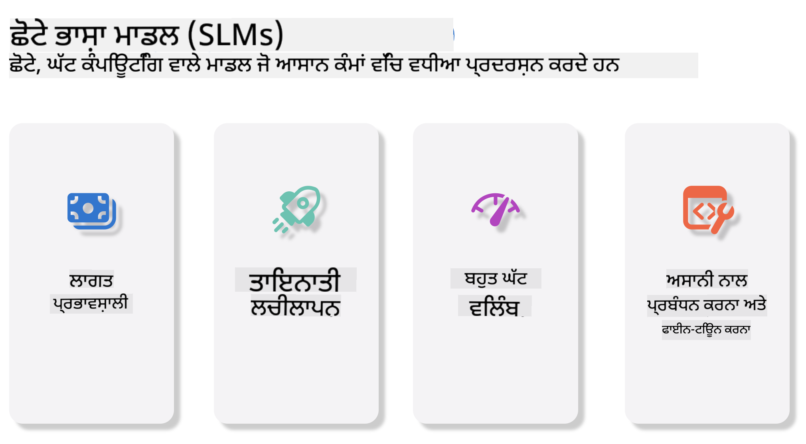

<!--
CO_OP_TRANSLATOR_METADATA:
{
  "original_hash": "124ad36cfe96f74038811b6e2bb93e9d",
  "translation_date": "2025-07-09T18:29:00+00:00",
  "source_file": "19-slm/README.md",
  "language_code": "pa"
}
-->
# ਜਨਰੇਟਿਵ ਏਆਈ ਲਈ ਛੋਟੇ ਭਾਸ਼ਾ ਮਾਡਲਾਂ ਦਾ ਪਰਿਚਯ ਸ਼ੁਰੂਆਤੀ ਲਈ  
ਜਨਰੇਟਿਵ ਏਆਈ ਕਲਪਨਾਤਮਕ ਕ੍ਰਿਤ੍ਰਿਮ ਬੁੱਧੀ ਦਾ ਇੱਕ ਰੋਚਕ ਖੇਤਰ ਹੈ ਜੋ ਨਵੇਂ ਸਮੱਗਰੀ ਬਣਾਉਣ ਵਾਲੇ ਸਿਸਟਮਾਂ ਨੂੰ ਵਿਕਸਤ ਕਰਨ 'ਤੇ ਧਿਆਨ ਕੇਂਦ੍ਰਿਤ ਕਰਦਾ ਹੈ। ਇਹ ਸਮੱਗਰੀ ਲਿਖਤ, ਚਿੱਤਰ, ਸੰਗੀਤ ਅਤੇ ਇੱਥੋਂ ਤੱਕ ਕਿ ਪੂਰੇ ਵਰਚੁਅਲ ਵਾਤਾਵਰਣ ਤੱਕ ਹੋ ਸਕਦੀ ਹੈ। ਜਨਰੇਟਿਵ ਏਆਈ ਦੇ ਸਭ ਤੋਂ ਰੋਮਾਂਚਕ ਉਪਯੋਗਾਂ ਵਿੱਚੋਂ ਇੱਕ ਭਾਸ਼ਾ ਮਾਡਲਾਂ ਦਾ ਖੇਤਰ ਹੈ।  

## ਛੋਟੇ ਭਾਸ਼ਾ ਮਾਡਲ ਕੀ ਹਨ?  
ਛੋਟਾ ਭਾਸ਼ਾ ਮਾਡਲ (SLM) ਵੱਡੇ ਭਾਸ਼ਾ ਮਾਡਲ (LLM) ਦਾ ਇੱਕ ਸੰਕੁਚਿਤ ਰੂਪ ਹੈ, ਜੋ LLM ਦੇ ਬਹੁਤ ਸਾਰੇ ਆਰਕੀਟੈਕਚਰਲ ਸਿਧਾਂਤਾਂ ਅਤੇ ਤਕਨੀਕਾਂ ਨੂੰ ਵਰਤਦਾ ਹੈ, ਪਰ ਕਾਫੀ ਘੱਟ ਗਣਨਾਤਮਕ ਭਾਰ ਨਾਲ।  

SLM ਭਾਸ਼ਾ ਮਾਡਲਾਂ ਦਾ ਇੱਕ ਉਪਸੈੱਟ ਹੈ ਜੋ ਮਨੁੱਖੀ ਵਰਗਾ ਲਿਖਤ ਬਣਾਉਂਦਾ ਹੈ। ਵੱਡੇ ਮਾਡਲਾਂ ਜਿਵੇਂ GPT-4 ਦੇ ਮੁਕਾਬਲੇ, SLM ਛੋਟੇ ਅਤੇ ਪ੍ਰਭਾਵਸ਼ਾਲੀ ਹੁੰਦੇ ਹਨ, ਜਿਸ ਕਰਕੇ ਇਹ ਉਨ੍ਹਾਂ ਐਪਲੀਕੇਸ਼ਨਾਂ ਲਈ ਬਿਹਤਰ ਹਨ ਜਿੱਥੇ ਗਣਨਾਤਮਕ ਸਰੋਤ ਸੀਮਿਤ ਹੁੰਦੇ ਹਨ। ਛੋਟੇ ਹੋਣ ਦੇ ਬਾਵਜੂਦ, ਇਹ ਕਈ ਕਿਸਮ ਦੇ ਕੰਮ ਕਰ ਸਕਦੇ ਹਨ। ਆਮ ਤੌਰ 'ਤੇ, SLM ਨੂੰ LLM ਨੂੰ ਕੰਪ੍ਰੈੱਸ ਜਾਂ ਡਿਸਟਿਲ ਕਰਕੇ ਬਣਾਇਆ ਜਾਂਦਾ ਹੈ, ਤਾਂ ਜੋ ਮੂਲ ਮਾਡਲ ਦੀ ਕਾਰਗੁਜ਼ਾਰੀ ਅਤੇ ਭਾਸ਼ਾਈ ਸਮਰੱਥਾ ਦਾ ਵੱਡਾ ਹਿੱਸਾ ਬਚਾਇਆ ਜਾ ਸਕੇ। ਇਸ ਮਾਡਲ ਦੇ ਆਕਾਰ ਵਿੱਚ ਕਮੀ ਕੁੱਲ ਜਟਿਲਤਾ ਨੂੰ ਘਟਾਉਂਦੀ ਹੈ, ਜਿਸ ਨਾਲ SLM ਯਾਦਦਾਸ਼ਤ ਅਤੇ ਗਣਨਾਤਮਕ ਲੋੜਾਂ ਦੋਹਾਂ ਵਿੱਚ ਜ਼ਿਆਦਾ ਪ੍ਰਭਾਵਸ਼ਾਲੀ ਬਣ ਜਾਂਦੇ ਹਨ। ਇਨ੍ਹਾਂ ਸੁਧਾਰਾਂ ਦੇ ਬਾਵਜੂਦ, SLM ਹੇਠ ਲਿਖੇ ਕੁਦਰਤੀ ਭਾਸ਼ਾ ਪ੍ਰਕਿਰਿਆ (NLP) ਦੇ ਕੰਮ ਕਰ ਸਕਦੇ ਹਨ:  

- ਲਿਖਤ ਬਣਾਉਣਾ: ਸੰਗਠਿਤ ਅਤੇ ਸੰਦਰਭ ਅਨੁਕੂਲ ਵਾਕ ਜਾਂ ਪੈਰਾਗ੍ਰਾਫ ਬਣਾਉਣਾ।  
- ਲਿਖਤ ਪੂਰਾ ਕਰਨਾ: ਦਿੱਤੇ ਗਏ ਪ੍ਰਾਂਪਟ ਦੇ ਆਧਾਰ 'ਤੇ ਵਾਕਾਂ ਦੀ ਭਵਿੱਖਬਾਣੀ ਅਤੇ ਪੂਰੀ ਕਰਨਾ।  
- ਅਨੁਵਾਦ: ਇੱਕ ਭਾਸ਼ਾ ਤੋਂ ਦੂਜੀ ਭਾਸ਼ਾ ਵਿੱਚ ਲਿਖਤ ਬਦਲਣਾ।  
- ਸੰਖੇਪ ਬਣਾਉਣਾ: ਲੰਬੇ ਲਿਖਤ ਨੂੰ ਛੋਟੇ ਅਤੇ ਸਮਝਣ ਯੋਗ ਸੰਖੇਪਾਂ ਵਿੱਚ ਤਬਦੀਲ ਕਰਨਾ।  

ਹਾਲਾਂਕਿ ਇਹ ਕੁਝ ਕਾਰਗੁਜ਼ਾਰੀ ਜਾਂ ਸਮਝ ਦੀ ਗਹਿਰਾਈ ਵਿੱਚ ਵੱਡੇ ਮਾਡਲਾਂ ਨਾਲ ਤੁਲਨਾ ਵਿੱਚ ਕੁਝ ਵਪਾਰ-ਬਦਲਾਵਾਂ ਦੇ ਨਾਲ ਹੁੰਦਾ ਹੈ।  

## ਛੋਟੇ ਭਾਸ਼ਾ ਮਾਡਲ ਕਿਵੇਂ ਕੰਮ ਕਰਦੇ ਹਨ?  
SLM ਵੱਡੇ ਪੱਧਰ 'ਤੇ ਲਿਖਤ ਡੇਟਾ 'ਤੇ ਟ੍ਰੇਨ ਕੀਤੇ ਜਾਂਦੇ ਹਨ। ਟ੍ਰੇਨਿੰਗ ਦੌਰਾਨ, ਇਹ ਭਾਸ਼ਾ ਦੇ ਪੈਟਰਨ ਅਤੇ ਢਾਂਚੇ ਸਿੱਖਦੇ ਹਨ, ਜਿਸ ਨਾਲ ਇਹ ਗ੍ਰੈਮਰ ਅਨੁਕੂਲ ਅਤੇ ਸੰਦਰਭ ਅਨੁਕੂਲ ਲਿਖਤ ਬਣਾਉਣ ਯੋਗ ਹੁੰਦੇ ਹਨ। ਟ੍ਰੇਨਿੰਗ ਪ੍ਰਕਿਰਿਆ ਵਿੱਚ ਸ਼ਾਮਲ ਹਨ:  

- ਡੇਟਾ ਇਕੱਠਾ ਕਰਨਾ: ਵੱਖ-ਵੱਖ ਸਰੋਤਾਂ ਤੋਂ ਵੱਡੇ ਲਿਖਤ ਡੇਟਾਸੈੱਟ ਇਕੱਠੇ ਕਰਨਾ।  
- ਪ੍ਰੀ-ਪ੍ਰੋਸੈਸਿੰਗ: ਡੇਟਾ ਨੂੰ ਸਾਫ਼ ਅਤੇ ਸੰਗਠਿਤ ਕਰਨਾ ਤਾਂ ਜੋ ਟ੍ਰੇਨਿੰਗ ਲਈ ਯੋਗ ਬਣੇ।  
- ਟ੍ਰੇਨਿੰਗ: ਮਸ਼ੀਨ ਲਰਨਿੰਗ ਅਲਗੋਰਿਦਮਾਂ ਦੀ ਵਰਤੋਂ ਕਰਕੇ ਮਾਡਲ ਨੂੰ ਲਿਖਤ ਸਮਝਣ ਅਤੇ ਬਣਾਉਣ ਸਿਖਾਉਣਾ।  
- ਫਾਈਨ-ਟਿਊਨਿੰਗ: ਖਾਸ ਕੰਮਾਂ 'ਤੇ ਮਾਡਲ ਦੀ ਕਾਰਗੁਜ਼ਾਰੀ ਸੁਧਾਰਨਾ।  

SLM ਦਾ ਵਿਕਾਸ ਇਸ ਵਧ ਰਹੀ ਲੋੜ ਨਾਲ ਮਿਲਦਾ ਹੈ ਕਿ ਐਸੇ ਮਾਡਲ ਬਣਾਏ ਜਾਣ ਜੋ ਸਰੋਤ ਸੀਮਿਤ ਵਾਤਾਵਰਣਾਂ ਜਿਵੇਂ ਮੋਬਾਈਲ ਡਿਵਾਈਸ ਜਾਂ ਏਜ ਕੰਪਿਊਟਿੰਗ ਪਲੇਟਫਾਰਮਾਂ 'ਤੇ ਚੱਲ ਸਕਣ, ਜਿੱਥੇ ਪੂਰੇ ਪੱਧਰ ਦੇ LLM ਭਾਰੀ ਸਰੋਤਾਂ ਕਾਰਨ ਅਮਲਯੋਗ ਹੋ ਸਕਦੇ ਹਨ। ਪ੍ਰਭਾਵਸ਼ੀਲਤਾ 'ਤੇ ਧਿਆਨ ਕੇਂਦਰਿਤ ਕਰਕੇ, SLM ਕਾਰਗੁਜ਼ਾਰੀ ਅਤੇ ਪਹੁੰਚਯੋਗਤਾ ਵਿੱਚ ਸੰਤੁਲਨ ਬਣਾਉਂਦੇ ਹਨ, ਜਿਸ ਨਾਲ ਵੱਖ-ਵੱਖ ਖੇਤਰਾਂ ਵਿੱਚ ਵਿਆਪਕ ਉਪਯੋਗਤਾ ਸੰਭਵ ਹੁੰਦੀ ਹੈ।  

  

## ਸਿੱਖਣ ਦੇ ਉਦੇਸ਼  

ਇਸ ਪਾਠ ਵਿੱਚ, ਅਸੀਂ SLM ਦੀ ਜਾਣਕਾਰੀ ਦਿੰਦੇ ਹੋਏ Microsoft Phi-3 ਨਾਲ ਇਸਨੂੰ ਜੋੜ ਕੇ ਲਿਖਤ ਸਮੱਗਰੀ, ਵਿਜ਼ਨ ਅਤੇ MoE ਵਿੱਚ ਵੱਖ-ਵੱਖ ਸਥਿਤੀਆਂ ਸਿੱਖਣ ਦੀ ਕੋਸ਼ਿਸ਼ ਕਰਾਂਗੇ।  

ਇਸ ਪਾਠ ਦੇ ਅੰਤ ਤੱਕ, ਤੁਸੀਂ ਹੇਠ ਲਿਖੇ ਸਵਾਲਾਂ ਦੇ ਜਵਾਬ ਦੇ ਸਕੋਗੇ:  

- SLM ਕੀ ਹੈ  
- SLM ਅਤੇ LLM ਵਿੱਚ ਕੀ ਫਰਕ ਹੈ  
- Microsoft Phi-3/3.5 ਪਰਿਵਾਰ ਕੀ ਹੈ  
- Microsoft Phi-3/3.5 ਪਰਿਵਾਰ ਦਾ ਇੰਫਰੈਂਸ ਕਿਵੇਂ ਕਰਨਾ ਹੈ  

ਤਿਆਰ ਹੋ? ਚਲੋ ਸ਼ੁਰੂ ਕਰੀਏ।  

## ਵੱਡੇ ਭਾਸ਼ਾ ਮਾਡਲ (LLMs) ਅਤੇ ਛੋਟੇ ਭਾਸ਼ਾ ਮਾਡਲ (SLMs) ਵਿੱਚ ਫਰਕ  

ਦੋਹਾਂ LLM ਅਤੇ SLM ਮੂਲ ਤੌਰ 'ਤੇ ਸੰਭਾਵਨਾਤਮਕ ਮਸ਼ੀਨ ਲਰਨਿੰਗ ਦੇ ਸਿਧਾਂਤਾਂ 'ਤੇ ਆਧਾਰਿਤ ਹਨ, ਅਤੇ ਆਪਣੀ ਆਰਕੀਟੈਕਚਰਲ ਡਿਜ਼ਾਈਨ, ਟ੍ਰੇਨਿੰਗ ਤਰੀਕਿਆਂ, ਡੇਟਾ ਬਣਾਉਣ ਪ੍ਰਕਿਰਿਆਵਾਂ ਅਤੇ ਮਾਡਲ ਮੁਲਾਂਕਣ ਤਕਨੀਕਾਂ ਵਿੱਚ ਸਮਾਨ ਪਹੁੰਚਾਂ ਦੀ ਪਾਲਣਾ ਕਰਦੇ ਹਨ। ਪਰ ਕੁਝ ਮੁੱਖ ਤੱਤ ਹਨ ਜੋ ਇਹ ਦੋ ਮਾਡਲ ਕਿਸਮਾਂ ਨੂੰ ਵੱਖ ਕਰਦੇ ਹਨ।  

## ਛੋਟੇ ਭਾਸ਼ਾ ਮਾਡਲਾਂ ਦੇ ਉਪਯੋਗ  

SLM ਦੇ ਕਈ ਉਪਯੋਗ ਹਨ, ਜਿਵੇਂ:  

- ਚੈਟਬੋਟ: ਗਾਹਕ ਸਹਾਇਤਾ ਪ੍ਰਦਾਨ ਕਰਨਾ ਅਤੇ ਉਪਭੋਗਤਾਵਾਂ ਨਾਲ ਗੱਲਬਾਤ ਕਰਨਾ।  
- ਸਮੱਗਰੀ ਬਣਾਉਣਾ: ਲੇਖਕਾਂ ਦੀ ਮਦਦ ਕਰਨਾ, ਵਿਚਾਰ ਜਨਰੇਟ ਕਰਨਾ ਜਾਂ ਪੂਰੇ ਲੇਖ ਤਿਆਰ ਕਰਨਾ।  
- ਸਿੱਖਿਆ: ਵਿਦਿਆਰਥੀਆਂ ਦੀ ਲਿਖਤ ਸਹਾਇਤਾ ਕਰਨਾ ਜਾਂ ਨਵੀਂ ਭਾਸ਼ਾ ਸਿੱਖਣ ਵਿੱਚ ਮਦਦ ਕਰਨਾ।  
- ਪਹੁੰਚਯੋਗਤਾ: ਵਿਸ਼ੇਸ਼ ਜ਼ਰੂਰਤ ਵਾਲੇ ਲੋਕਾਂ ਲਈ ਸੰਦ ਬਣਾਉਣਾ, ਜਿਵੇਂ ਟੈਕਸਟ-ਟੂ-ਸਪੀਚ ਸਿਸਟਮ।  

**ਆਕਾਰ**  

LLM ਅਤੇ SLM ਵਿੱਚ ਮੁੱਖ ਫਰਕ ਮਾਡਲ ਦੇ ਆਕਾਰ ਵਿੱਚ ਹੁੰਦਾ ਹੈ। LLM, ਜਿਵੇਂ ChatGPT (GPT-4), ਲਗਭਗ 1.76 ਟ੍ਰਿਲੀਅਨ ਪੈਰਾਮੀਟਰਾਂ ਵਾਲੇ ਹੋ ਸਕਦੇ ਹਨ, ਜਦਕਿ ਖੁੱਲ੍ਹੇ ਸਰੋਤ ਵਾਲੇ SLM ਜਿਵੇਂ Mistral 7B ਵਿੱਚ ਲਗਭਗ 7 ਬਿਲੀਅਨ ਪੈਰਾਮੀਟਰ ਹੁੰਦੇ ਹਨ। ਇਹ ਫਰਕ ਮੁੱਖ ਤੌਰ 'ਤੇ ਮਾਡਲ ਦੀ ਆਰਕੀਟੈਕਚਰ ਅਤੇ ਟ੍ਰੇਨਿੰਗ ਪ੍ਰਕਿਰਿਆਵਾਂ ਵਿੱਚ ਹੈ। ਉਦਾਹਰਨ ਵਜੋਂ, ChatGPT ਇੱਕ ਐਨਕੋਡਰ-ਡਿਕੋਡਰ ਫਰੇਮਵਰਕ ਵਿੱਚ ਸੈਲਫ-ਅਟੈਂਸ਼ਨ ਮਕੈਨਿਜ਼ਮ ਵਰਤਦਾ ਹੈ, ਜਦਕਿ Mistral 7B ਸਲਾਈਡਿੰਗ ਵਿੰਡੋ ਅਟੈਂਸ਼ਨ ਵਰਤਦਾ ਹੈ, ਜੋ ਡਿਕੋਡਰ-ਓਨਲੀ ਮਾਡਲ ਵਿੱਚ ਜ਼ਿਆਦਾ ਪ੍ਰਭਾਵਸ਼ਾਲੀ ਟ੍ਰੇਨਿੰਗ ਦੀ ਆਗਿਆ ਦਿੰਦਾ ਹੈ। ਇਹ ਆਰਕੀਟੈਕਚਰਲ ਫਰਕ ਮਾਡਲ ਦੀ ਜਟਿਲਤਾ ਅਤੇ ਕਾਰਗੁਜ਼ਾਰੀ 'ਤੇ ਗਹਿਰਾ ਪ੍ਰਭਾਵ ਪਾਂਦਾ ਹੈ।  

**ਸਮਝਦਾਰੀ**  

SLM ਆਮ ਤੌਰ 'ਤੇ ਖਾਸ ਖੇਤਰਾਂ ਵਿੱਚ ਕਾਰਗੁਜ਼ਾਰੀ ਲਈ ਅਨੁਕੂਲਿਤ ਹੁੰਦੇ ਹਨ, ਜਿਸ ਨਾਲ ਇਹ ਬਹੁਤ ਵਿਸ਼ਾਲ ਸੰਦਰਭ ਸਮਝ ਪ੍ਰਦਾਨ ਕਰਨ ਵਿੱਚ ਸੀਮਿਤ ਹੋ ਸਕਦੇ ਹਨ। ਇਸਦੇ ਉਲਟ, LLM ਮਨੁੱਖੀ ਵਰਗੇ ਬੁੱਧੀਮਾਨ ਵਿਹਾਰ ਦੀ ਨਕਲ ਕਰਨ ਲਈ ਵਿਆਪਕ ਡੇਟਾ 'ਤੇ ਟ੍ਰੇਨ ਕੀਤੇ ਜਾਂਦੇ ਹਨ, ਜੋ ਵੱਖ-ਵੱਖ ਖੇਤਰਾਂ ਵਿੱਚ ਬਿਹਤਰ ਕਾਰਗੁਜ਼ਾਰੀ ਦਿੰਦੇ ਹਨ। ਇਸ ਕਰਕੇ, LLM ਵੱਖ-ਵੱਖ NLP ਅਤੇ ਪ੍ਰੋਗ੍ਰਾਮਿੰਗ ਵਰਗੇ ਕੰਮਾਂ ਲਈ ਜ਼ਿਆਦਾ ਉਚਿਤ ਹਨ।  

**ਗਣਨਾ**  

LLM ਦੀ ਟ੍ਰੇਨਿੰਗ ਅਤੇ ਡਿਪਲੋਇਮੈਂਟ ਬਹੁਤ ਜ਼ਿਆਦਾ ਸਰੋਤ ਮੰਗਦੇ ਹਨ, ਜਿਵੇਂ ਵੱਡੇ ਪੱਧਰ ਦੇ GPU ਕਲੱਸਟਰ। ਉਦਾਹਰਨ ਵਜੋਂ, ChatGPT ਵਰਗਾ ਮਾਡਲ ਸਿਰੇ ਤੋਂ ਟ੍ਰੇਨ ਕਰਨ ਲਈ ਹਜ਼ਾਰਾਂ GPU ਲੰਮੇ ਸਮੇਂ ਲਈ ਲੋੜੀਂਦੇ ਹਨ। ਇਸਦੇ ਬਰਕਸ, SLM ਛੋਟੇ ਪੈਰਾਮੀਟਰਾਂ ਨਾਲ ਗਣਨਾਤਮਕ ਸਰੋਤਾਂ ਵਿੱਚ ਜ਼ਿਆਦਾ ਪਹੁੰਚਯੋਗ ਹੁੰਦੇ ਹਨ। ਜਿਵੇਂ Mistral 7B ਨੂੰ ਮੋਡਰੇਟ GPU ਸਮਰੱਥਾ ਵਾਲੀ ਲੋਕਲ ਮਸ਼ੀਨਾਂ 'ਤੇ ਟ੍ਰੇਨ ਅਤੇ ਚਲਾਇਆ ਜਾ ਸਕਦਾ ਹੈ, ਹਾਲਾਂਕਿ ਟ੍ਰੇਨਿੰਗ ਕਈ ਘੰਟਿਆਂ ਤੱਕ ਕਈ GPU ਤੇ ਲੱਗ ਸਕਦੀ ਹੈ।  

**ਪੱਖਪਾਤ**  

LLM ਵਿੱਚ ਪੱਖਪਾਤ ਇੱਕ ਜਾਣਿਆ-ਪਹਚਾਣਿਆ ਮੁੱਦਾ ਹੈ, ਜੋ ਮੁੱਖ ਤੌਰ 'ਤੇ ਟ੍ਰੇਨਿੰਗ ਡੇਟਾ ਦੀ ਕੁਦਰਤ ਕਾਰਨ ਹੁੰਦਾ ਹੈ। ਇਹ ਮਾਡਲ ਅਕਸਰ ਇੰਟਰਨੈੱਟ ਤੋਂ ਖੁੱਲ੍ਹੇ ਡੇਟਾ 'ਤੇ ਨਿਰਭਰ ਕਰਦੇ ਹਨ, ਜੋ ਕੁਝ ਸਮੂਹਾਂ ਦੀ ਘੱਟ ਪ੍ਰਤੀਨਿਧਤਾ ਜਾਂ ਗਲਤ ਪ੍ਰਤੀਨਿਧਤਾ ਕਰ ਸਕਦਾ ਹੈ, ਗਲਤ ਲੇਬਲਿੰਗ ਕਰ ਸਕਦਾ ਹੈ ਜਾਂ ਭਾਸ਼ਾਈ ਪੱਖਪਾਤ ਦਰਸਾ ਸਕਦਾ ਹੈ। ਇਸਦੇ ਨਾਲ-ਨਾਲ, LLM ਦੀ ਜਟਿਲ ਆਰਕੀਟੈਕਚਰ ਪੱਖਪਾਤ ਨੂੰ ਬਿਨਾਂ ਧਿਆਨ ਦਿੱਤੇ ਵਧਾ ਸਕਦੀ ਹੈ। ਦੂਜੇ ਪਾਸੇ, SLM ਜ਼ਿਆਦਾ ਸੀਮਿਤ ਅਤੇ ਖਾਸ ਖੇਤਰਾਂ ਦੇ ਡੇਟਾ 'ਤੇ ਟ੍ਰੇਨ ਹੁੰਦੇ ਹਨ, ਜਿਸ ਨਾਲ ਇਹਨਾਂ ਵਿੱਚ ਪੱਖਪਾਤ ਘੱਟ ਹੁੰਦਾ ਹੈ, ਪਰ ਇਹ ਪੂਰੀ ਤਰ੍ਹਾਂ ਮੁਕਤ ਨਹੀਂ ਹਨ।  

**ਇੰਫਰੈਂਸ**  

SLM ਦੇ ਛੋਟੇ ਆਕਾਰ ਕਾਰਨ ਇਹਨਾਂ ਨੂੰ ਇੰਫਰੈਂਸ ਵਿੱਚ ਤੇਜ਼ੀ ਮਿਲਦੀ ਹੈ, ਜੋ ਲੋਕਲ ਹਾਰਡਵੇਅਰ 'ਤੇ ਬਿਨਾਂ ਵੱਡੇ ਪੈਮਾਨੇ ਦੀ ਗਣਨਾ ਦੇ ਨਤੀਜੇ ਜਨਰੇਟ ਕਰਨ ਯੋਗ ਬਣਾਉਂਦਾ ਹੈ। ਇਸਦੇ ਉਲਟ, LLM ਆਪਣੇ ਆਕਾਰ ਅਤੇ ਜਟਿਲਤਾ ਕਾਰਨ ਵੱਡੇ ਪੈਮਾਨੇ ਦੀ ਗਣਨਾ ਸਰੋਤਾਂ ਦੀ ਲੋੜ ਰੱਖਦੇ ਹਨ। ਜਦੋਂ ਕਈ ਉਪਭੋਗਤਾ ਇੱਕ ਸਮੇਂ ਵਰਤਦੇ ਹਨ, ਤਾਂ LLM ਦੀ ਪ੍ਰਤੀਕਿਰਿਆ ਸਮਾਂ ਹੋਰ ਵਧ ਜਾਂਦਾ ਹੈ।  

ਸਾਰ ਵਿੱਚ, ਜਦੋਂ ਕਿ ਦੋਹਾਂ LLM ਅਤੇ SLM ਮਸ਼ੀਨ ਲਰਨਿੰਗ ਦੇ ਮੂਲ ਸਿਧਾਂਤਾਂ 'ਤੇ ਆਧਾਰਿਤ ਹਨ, ਇਹ ਮਾਡਲ ਆਕਾਰ, ਸਰੋਤ ਲੋੜਾਂ, ਸੰਦਰਭ ਸਮਝ, ਪੱਖਪਾਤ ਅਤੇ ਇੰਫਰੈਂਸ ਗਤੀ ਵਿੱਚ ਕਾਫੀ ਵੱਖਰੇ ਹਨ। ਇਹ ਫਰਕ ਉਨ੍ਹਾਂ ਦੀ ਵੱਖ-ਵੱਖ ਵਰਤੋਂ ਲਈ ਉਚਿਤਤਾ ਨੂੰ ਦਰਸਾਉਂਦਾ ਹੈ, ਜਿੱਥੇ LLM ਜ਼ਿਆਦਾ ਬਹੁਪੱਖੀ ਪਰ ਸਰੋਤ-ਭਾਰੀ ਹਨ, ਅਤੇ SLM ਖਾਸ ਖੇਤਰਾਂ ਵਿੱਚ ਪ੍ਰਭਾਵਸ਼ਾਲੀ ਅਤੇ ਘੱਟ ਗਣਨਾਤਮਕ ਲੋੜਾਂ ਵਾਲੇ ਹਨ।  

***Note：ਇਸ ਅਧਿਆਇ ਵਿੱਚ, ਅਸੀਂ Microsoft Phi-3 / 3.5 ਦੀ ਮਦਦ ਨਾਲ SLM ਦਾ ਪਰਿਚਯ ਕਰਵਾਂਗੇ।***  

## Phi-3 / Phi-3.5 ਪਰਿਵਾਰ ਦਾ ਪਰਿਚਯ  

Phi-3 / 3.5 ਪਰਿਵਾਰ ਮੁੱਖ ਤੌਰ 'ਤੇ ਲਿਖਤ, ਵਿਜ਼ਨ ਅਤੇ ਏਜੰਟ (MoE) ਐਪਲੀਕੇਸ਼ਨ ਸਥਿਤੀਆਂ ਲਈ ਹੈ:  

### Phi-3 / 3.5 ਇੰਸਟ੍ਰਕਟ  

ਮੁੱਖ ਤੌਰ 'ਤੇ ਲਿਖਤ ਬਣਾਉਣ, ਚੈਟ ਪੂਰਾ ਕਰਨ ਅਤੇ ਸਮੱਗਰੀ ਜਾਣਕਾਰੀ ਨਿਕਾਲਣ ਲਈ।  

**Phi-3-mini**  

3.8B ਭਾਸ਼ਾ ਮਾਡਲ Microsoft Azure AI Studio, Hugging Face ਅਤੇ Ollama 'ਤੇ ਉਪਲਬਧ ਹੈ। Phi-3 ਮਾਡਲ ਸਮਾਨ ਜਾਂ ਵੱਡੇ ਆਕਾਰ ਦੇ ਭਾਸ਼ਾ ਮਾਡਲਾਂ ਨਾਲ ਮੁੱਖ ਬੈਂਚਮਾਰਕਾਂ 'ਤੇ ਕਾਫੀ ਬਿਹਤਰ ਪ੍ਰਦਰਸ਼ਨ ਕਰਦੇ ਹਨ (ਹੇਠਾਂ ਦਿੱਤੇ ਬੈਂਚਮਾਰਕ ਨੰਬਰ ਵੇਖੋ, ਵੱਡੇ ਨੰਬਰ ਵਧੀਆ ਹਨ)। Phi-3-mini ਆਪਣੇ ਆਕਾਰ ਦੇ ਦੋ ਗੁਣਾ ਮਾਡਲਾਂ ਨਾਲੋਂ ਬਿਹਤਰ ਹੈ, ਜਦਕਿ Phi-3-small ਅਤੇ Phi-3-medium ਵੱਡੇ ਮਾਡਲਾਂ, ਜਿਵੇਂ GPT-3.5 ਨੂੰ ਪਿੱਛੇ ਛੱਡਦੇ ਹਨ।  

**Phi-3-small & medium**  

ਸਿਰਫ 7B ਪੈਰਾਮੀਟਰਾਂ ਨਾਲ, Phi-3-small ਵੱਖ-ਵੱਖ ਭਾਸ਼ਾ, ਤਰਕ, ਕੋਡਿੰਗ ਅਤੇ ਗਣਿਤ ਬੈਂਚਮਾਰਕਾਂ 'ਤੇ GPT-3.5T ਨੂੰ ਹਰਾਉਂਦਾ ਹੈ।  

Phi-3-medium 14B ਪੈਰਾਮੀਟਰਾਂ ਨਾਲ ਇਸ ਰੁਝਾਨ ਨੂੰ ਜਾਰੀ ਰੱਖਦਾ ਹੈ ਅਤੇ Gemini 1.0 Pro ਨੂੰ ਪਿੱਛੇ ਛੱਡਦਾ ਹੈ।  

**Phi-3.5-mini**  

ਇਸਨੂੰ Phi-3-mini ਦਾ ਅੱਪਗ੍ਰੇਡ ਸਮਝਿਆ ਜਾ ਸਕਦਾ ਹੈ। ਜਦਕਿ ਪੈਰਾਮੀਟਰ ਬਦਲੇ ਨਹੀਂ, ਇਹ ਕਈ ਭਾਸ਼ਾਵਾਂ ਦਾ ਸਮਰਥਨ ਵਧਾਉਂਦਾ ਹੈ (20+ ਭਾਸ਼ਾਵਾਂ: ਅਰਬੀ, ਚੀਨੀ, ਚੈਕ, ਡੈਨਿਸ਼, ਡੱਚ, ਅੰਗਰੇਜ਼ੀ, ਫਿਨਿਸ਼, ਫਰਾਂਸੀਸੀ, ਜਰਮਨ, ਹਿਬਰੂ, ਹੰਗੇਰੀ, ਇਟਾਲੀਅਨ, ਜਪਾਨੀ, ਕੋਰੀਆਈ, ਨਾਰਵੇਜੀਅਨ, ਪੋਲਿਸ਼, ਪੁਰਤਗਾਲੀ, ਰੂਸੀ, ਸਪੇਨੀ, ਸਵੀਡਿਸ਼, ਥਾਈ, ਟਰਕੀ, ਯੂਕਰੇਨੀਅਨ) ਅਤੇ ਲੰਬੇ ਸੰਦਰਭ ਲਈ ਮਜ਼ਬੂਤ ਸਹਾਇਤਾ ਸ਼ਾਮਲ ਕਰਦਾ ਹੈ।  

3.8B ਪੈਰਾਮੀਟਰਾਂ ਵਾਲਾ Phi-3.5-mini ਸਮਾਨ ਆਕਾਰ ਦੇ ਮਾਡਲਾਂ ਨਾਲੋਂ ਬਿਹਤਰ ਹੈ ਅਤੇ ਦੋ ਗੁਣਾ ਆਕਾਰ ਦੇ ਮਾਡਲਾਂ ਦੇ ਬਰਾਬਰ ਹੈ।  

### Phi-3 / 3.5 ਵਿਜ਼ਨ  

ਅਸੀਂ Phi-3/3.5 ਦੇ ਇੰਸਟ੍ਰਕਟ ਮਾਡਲ ਨੂੰ Phi ਦੀ ਸਮਝਣ ਦੀ ਸਮਰੱਥਾ ਵਜੋਂ ਦੇਖ ਸਕਦੇ ਹਾਂ, ਅਤੇ ਵਿਜ਼ਨ Phi ਨੂੰ ਦੁਨੀਆ ਨੂੰ ਸਮਝਣ ਲਈ ਅੱਖਾਂ ਦਿੰਦਾ ਹੈ।  

**Phi-3-Vision**  

ਸਿਰਫ 4.2B ਪੈਰਾਮੀਟਰਾਂ ਨਾਲ, Phi-3-vision ਇਸ ਰੁਝਾਨ ਨੂੰ ਜਾਰੀ ਰੱਖਦਾ ਹੈ ਅਤੇ ਵੱਡੇ ਮਾਡਲਾਂ ਜਿਵੇਂ Claude-3 Haiku ਅਤੇ Gemini 1.0 Pro V ਨੂੰ ਆਮ ਵਿਜ਼ੂਅਲ ਤ
- **ਸੁਰੱਖਿਆ ਅਤੇ ਨਿਯੰਤਰਣ:** ਸੰਗਠਨ ਆਪਣੇ ਡਾਟਾ ਅਤੇ ਐਪਲੀਕੇਸ਼ਨਾਂ 'ਤੇ ਨਿਯੰਤਰਣ ਬਣਾਈ ਰੱਖ ਸਕਦੇ ਹਨ ਜਦੋਂ ਉਹ NIM ਮਾਈਕ੍ਰੋਸਰਵਿਸز ਨੂੰ ਆਪਣੇ ਖੁਦ ਦੇ ਪ੍ਰਬੰਧਿਤ ਇੰਫਰਾਸਟਰੱਕਚਰ 'ਤੇ ਸਵੈ-ਹੋਸਟ ਕਰਦੇ ਹਨ।  
- **ਮਿਆਰੀ APIs:** NIM ਉਦਯੋਗ-ਮਿਆਰੀ APIs ਪ੍ਰਦਾਨ ਕਰਦਾ ਹੈ, ਜਿਸ ਨਾਲ ਚੈਟਬੋਟ, AI ਸਹਾਇਕ ਅਤੇ ਹੋਰ AI ਐਪਲੀਕੇਸ਼ਨਾਂ ਨੂੰ ਬਣਾਉਣਾ ਅਤੇ ਇੰਟੀਗ੍ਰੇਟ ਕਰਨਾ ਆਸਾਨ ਹੋ ਜਾਂਦਾ ਹੈ।  

NIM NVIDIA AI Enterprise ਦਾ ਹਿੱਸਾ ਹੈ, ਜੋ AI ਮਾਡਲਾਂ ਦੀ ਤਾਇਨਾਤੀ ਅਤੇ ਚਾਲੂ ਕਰਨ ਦੀ ਪ੍ਰਕਿਰਿਆ ਨੂੰ ਸਧਾਰਨ ਬਣਾਉਂਦਾ ਹੈ, ਇਹ ਯਕੀਨੀ ਬਣਾਉਂਦਾ ਹੈ ਕਿ ਇਹ NVIDIA GPUs 'ਤੇ ਪ੍ਰਭਾਵਸ਼ਾਲੀ ਤਰੀਕੇ ਨਾਲ ਚੱਲਣ।  

- ਡੈਮੋ: NVIDIA NIM ਦੀ ਵਰਤੋਂ ਕਰਕੇ Phi-3.5-Vision-API ਨੂੰ ਕਾਲ ਕਰਨਾ [[ਇਸ ਲਿੰਕ 'ਤੇ ਕਲਿੱਕ ਕਰੋ](../../../19-slm/python/Phi-3-Vision-Nividia-NIM.ipynb)]  


### ਸਥਾਨਕ ਵਾਤਾਵਰਣ ਵਿੱਚ Phi-3/3.5 ਦਾ ਇਨਫਰੈਂਸ  
Phi-3 ਜਾਂ ਕਿਸੇ ਵੀ ਭਾਸ਼ਾ ਮਾਡਲ ਜਿਵੇਂ GPT-3 ਨਾਲ ਸੰਬੰਧਿਤ ਇਨਫਰੈਂਸ ਦਾ ਮਤਲਬ ਹੈ ਪ੍ਰਾਪਤ ਕੀਤੇ ਇਨਪੁੱਟ ਦੇ ਆਧਾਰ 'ਤੇ ਜਵਾਬ ਜਾਂ ਅਨੁਮਾਨ ਤਿਆਰ ਕਰਨ ਦੀ ਪ੍ਰਕਿਰਿਆ। ਜਦੋਂ ਤੁਸੀਂ Phi-3 ਨੂੰ ਕੋਈ ਪ੍ਰਾਂਪਟ ਜਾਂ ਸਵਾਲ ਦਿੰਦੇ ਹੋ, ਤਾਂ ਇਹ ਆਪਣੇ ਪ੍ਰਸ਼ਿਖਤ ਨਿਊਰਲ ਨੈੱਟਵਰਕ ਦੀ ਵਰਤੋਂ ਕਰਕੇ ਸਭ ਤੋਂ ਸੰਭਾਵਿਤ ਅਤੇ ਸਬੰਧਤ ਜਵਾਬ ਦਾ ਅਨੁਮਾਨ ਲਗਾਉਂਦਾ ਹੈ, ਜੋ ਉਸ ਡਾਟਾ ਵਿੱਚ ਪੈਟਰਨ ਅਤੇ ਸੰਬੰਧਾਂ ਦਾ ਵਿਸ਼ਲੇਸ਼ਣ ਕਰਦਾ ਹੈ ਜਿਸ 'ਤੇ ਇਹ ਪ੍ਰਸ਼ਿਖਤ ਹੈ।  

**Hugging Face Transformer**  
Hugging Face Transformers ਇੱਕ ਸ਼ਕਤੀਸ਼ਾਲੀ ਲਾਇਬ੍ਰੇਰੀ ਹੈ ਜੋ ਕੁਦਰਤੀ ਭਾਸ਼ਾ ਪ੍ਰੋਸੈਸਿੰਗ (NLP) ਅਤੇ ਹੋਰ ਮਸ਼ੀਨ ਲਰਨਿੰਗ ਕਾਰਜਾਂ ਲਈ ਬਣਾਈ ਗਈ ਹੈ। ਇੱਥੇ ਇਸ ਬਾਰੇ ਕੁਝ ਮੁੱਖ ਗੱਲਾਂ ਹਨ:  

1. **ਪ੍ਰੀ-ਟ੍ਰੇਨਡ ਮਾਡਲ:** ਇਹ ਹਜ਼ਾਰਾਂ ਪ੍ਰੀ-ਟ੍ਰੇਨਡ ਮਾਡਲ ਪ੍ਰਦਾਨ ਕਰਦਾ ਹੈ ਜੋ ਵੱਖ-ਵੱਖ ਕਾਰਜਾਂ ਲਈ ਵਰਤੇ ਜਾ ਸਕਦੇ ਹਨ ਜਿਵੇਂ ਕਿ ਟੈਕਸਟ ਕਲਾਸੀਫਿਕੇਸ਼ਨ, ਨਾਮਿਤ ਇਕਾਈ ਪਛਾਣ, ਸਵਾਲ-ਜਵਾਬ, ਸੰਖੇਪ, ਅਨੁਵਾਦ ਅਤੇ ਟੈਕਸਟ ਜਨਰੇਸ਼ਨ।  

2. **ਫਰੇਮਵਰਕ ਇੰਟਰਓਪਰੇਬਿਲਿਟੀ:** ਇਹ ਲਾਇਬ੍ਰੇਰੀ ਕਈ ਡੀਪ ਲਰਨਿੰਗ ਫਰੇਮਵਰਕਾਂ ਨੂੰ ਸਹਿਯੋਗ ਦਿੰਦੀ ਹੈ, ਜਿਵੇਂ PyTorch, TensorFlow ਅਤੇ JAX। ਇਸ ਨਾਲ ਤੁਸੀਂ ਇੱਕ ਫਰੇਮਵਰਕ ਵਿੱਚ ਮਾਡਲ ਟ੍ਰੇਨ ਕਰਕੇ ਦੂਜੇ ਵਿੱਚ ਵਰਤ ਸਕਦੇ ਹੋ।  

3. **ਮਲਟੀਮੋਡਲ ਸਮਰੱਥਾ:** NLP ਦੇ ਇਲਾਵਾ, Hugging Face Transformers ਕੰਪਿਊਟਰ ਵਿਜ਼ਨ (ਜਿਵੇਂ ਚਿੱਤਰ ਕਲਾਸੀਫਿਕੇਸ਼ਨ, ਵਸਤੂ ਪਛਾਣ) ਅਤੇ ਆਡੀਓ ਪ੍ਰੋਸੈਸਿੰਗ (ਜਿਵੇਂ ਬੋਲ ਚਾਲ ਪਛਾਣ, ਆਡੀਓ ਕਲਾਸੀਫਿਕੇਸ਼ਨ) ਕਾਰਜਾਂ ਨੂੰ ਵੀ ਸਹਿਯੋਗ ਦਿੰਦਾ ਹੈ।  

4. **ਵਰਤੋਂ ਵਿੱਚ ਆਸਾਨੀ:** ਇਹ ਲਾਇਬ੍ਰੇਰੀ APIs ਅਤੇ ਟੂਲਜ਼ ਪ੍ਰਦਾਨ ਕਰਦੀ ਹੈ ਜੋ ਮਾਡਲ ਡਾਊਨਲੋਡ ਅਤੇ ਫਾਈਨ-ਟਿਊਨਿੰਗ ਨੂੰ ਆਸਾਨ ਬਣਾਉਂਦੇ ਹਨ, ਜਿਸ ਨਾਲ ਨਵੇਂ ਅਤੇ ਮਾਹਿਰ ਦੋਹਾਂ ਲਈ ਇਹ ਪਹੁੰਚਯੋਗ ਬਣ ਜਾਂਦੀ ਹੈ।  

5. **ਕਮਿਊਨਿਟੀ ਅਤੇ ਸਰੋਤ:** Hugging Face ਦੀ ਇੱਕ ਜ਼ਿੰਦਾ ਕਮਿਊਨਿਟੀ ਹੈ ਅਤੇ ਵਿਆਪਕ ਦਸਤਾਵੇਜ਼, ਟਿਊਟੋਰਿਯਲ ਅਤੇ ਗਾਈਡਜ਼ ਹਨ ਜੋ ਵਰਤੋਂਕਾਰਾਂ ਨੂੰ ਸ਼ੁਰੂਆਤ ਕਰਨ ਅਤੇ ਲਾਇਬ੍ਰੇਰੀ ਦਾ ਪੂਰਾ ਲਾਭ ਉਠਾਉਣ ਵਿੱਚ ਮਦਦ ਕਰਦੇ ਹਨ।  
[ਅਧਿਕਾਰਿਕ ਦਸਤਾਵੇਜ਼](https://huggingface.co/docs/transformers/index?WT.mc_id=academic-105485-koreyst) ਜਾਂ ਉਨ੍ਹਾਂ ਦਾ [GitHub ਰਿਪੋਜ਼ਿਟਰੀ](https://github.com/huggingface/transformers?WT.mc_id=academic-105485-koreyst)।  

ਇਹ ਸਭ ਤੋਂ ਆਮ ਤਰੀਕਾ ਹੈ, ਪਰ ਇਸ ਨੂੰ GPU ਤੇਜ਼ੀ ਦੀ ਲੋੜ ਹੁੰਦੀ ਹੈ। ਆਖਿਰਕਾਰ, ਵਿਜ਼ਨ ਅਤੇ MoE ਵਰਗੇ ਸਿਨੇਰੀਓਜ਼ ਵਿੱਚ ਬਹੁਤ ਸਾਰੇ ਗਣਨਾ ਦੀ ਲੋੜ ਹੁੰਦੀ ਹੈ, ਜੋ ਕਿ ਜੇਕਰ ਕਵਾਂਟਾਈਜ਼ ਨਾ ਕੀਤੇ ਜਾਣ ਤਾਂ CPU ਵਿੱਚ ਬਹੁਤ ਸੀਮਿਤ ਰਹੇਗੀ।  

- ਡੈਮੋ: Transformer ਦੀ ਵਰਤੋਂ ਕਰਕੇ Phi-3.5-Instuct ਨੂੰ ਕਾਲ ਕਰਨਾ [ਇਸ ਲਿੰਕ 'ਤੇ ਕਲਿੱਕ ਕਰੋ](../../../19-slm/python/phi35-instruct-demo.ipynb)  

- ਡੈਮੋ: Transformer ਦੀ ਵਰਤੋਂ ਕਰਕੇ Phi-3.5-Vision ਨੂੰ ਕਾਲ ਕਰਨਾ [ਇਸ ਲਿੰਕ 'ਤੇ ਕਲਿੱਕ ਕਰੋ](../../../19-slm/python/phi35-vision-demo.ipynb)  

- ਡੈਮੋ: Transformer ਦੀ ਵਰਤੋਂ ਕਰਕੇ Phi-3.5-MoE ਨੂੰ ਕਾਲ ਕਰਨਾ [ਇਸ ਲਿੰਕ 'ਤੇ ਕਲਿੱਕ ਕਰੋ](../../../19-slm/python/phi35_moe_demo.ipynb)  

**Ollama**  
[Ollama](https://ollama.com/?WT.mc_id=academic-105485-koreyst) ਇੱਕ ਪਲੇਟਫਾਰਮ ਹੈ ਜੋ ਤੁਹਾਡੇ ਮਸ਼ੀਨ 'ਤੇ ਵੱਡੇ ਭਾਸ਼ਾ ਮਾਡਲ (LLMs) ਨੂੰ ਸਥਾਨਕ ਤੌਰ 'ਤੇ ਚਲਾਉਣਾ ਆਸਾਨ ਬਣਾਉਂਦਾ ਹੈ। ਇਹ ਵੱਖ-ਵੱਖ ਮਾਡਲਾਂ ਨੂੰ ਸਹਿਯੋਗ ਦਿੰਦਾ ਹੈ ਜਿਵੇਂ Llama 3.1, Phi 3, Mistral, ਅਤੇ Gemma 2 ਆਦਿ। ਇਹ ਪਲੇਟਫਾਰਮ ਮਾਡਲ ਵਜ਼ਨ, ਸੰਰਚਨਾ ਅਤੇ ਡਾਟਾ ਨੂੰ ਇੱਕ ਪੈਕੇਜ ਵਿੱਚ ਬੰਨ੍ਹ ਕੇ ਪ੍ਰਕਿਰਿਆ ਨੂੰ ਸਧਾਰਨ ਬਣਾਉਂਦਾ ਹੈ, ਜਿਸ ਨਾਲ ਵਰਤੋਂਕਾਰ ਆਪਣੇ ਮਾਡਲ ਕਸਟਮਾਈਜ਼ ਅਤੇ ਬਣਾਉਣ ਵਿੱਚ ਆਸਾਨੀ ਮਹਿਸੂਸ ਕਰਦੇ ਹਨ। Ollama macOS, Linux ਅਤੇ Windows ਲਈ ਉਪਲਬਧ ਹੈ। ਜੇ ਤੁਸੀਂ ਬਿਨਾਂ ਕਲਾਉਡ ਸੇਵਾਵਾਂ 'ਤੇ ਨਿਰਭਰ ਹੋਏ LLMs ਨਾਲ ਪ੍ਰਯੋਗ ਜਾਂ ਤਾਇਨਾਤੀ ਕਰਨਾ ਚਾਹੁੰਦੇ ਹੋ ਤਾਂ ਇਹ ਇੱਕ ਵਧੀਆ ਟੂਲ ਹੈ। Ollama ਸਭ ਤੋਂ ਸਿੱਧਾ ਤਰੀਕਾ ਹੈ, ਤੁਹਾਨੂੰ ਸਿਰਫ ਹੇਠਾਂ ਦਿੱਤਾ ਕਮਾਂਡ ਚਲਾਉਣਾ ਹੈ।  

```bash

ollama run phi3.5

```  

**ONNX Runtime for GenAI**  

[ONNX Runtime](https://github.com/microsoft/onnxruntime-genai?WT.mc_id=academic-105485-koreyst) ਇੱਕ ਕ੍ਰਾਸ-ਪਲੇਟਫਾਰਮ ਇਨਫਰੈਂਸ ਅਤੇ ਟ੍ਰੇਨਿੰਗ ਮਸ਼ੀਨ ਲਰਨਿੰਗ ਐਕਸਲੇਰੇਟਰ ਹੈ। ONNX Runtime for Generative AI (GENAI) ਇੱਕ ਸ਼ਕਤੀਸ਼ਾਲੀ ਟੂਲ ਹੈ ਜੋ ਤੁਹਾਨੂੰ ਵੱਖ-ਵੱਖ ਪਲੇਟਫਾਰਮਾਂ 'ਤੇ ਜਨਰੇਟਿਵ AI ਮਾਡਲਾਂ ਨੂੰ ਪ੍ਰਭਾਵਸ਼ਾਲੀ ਤਰੀਕੇ ਨਾਲ ਚਲਾਉਣ ਵਿੱਚ ਮਦਦ ਕਰਦਾ ਹੈ।  

## ONNX Runtime ਕੀ ਹੈ?  
ONNX Runtime ਇੱਕ ਖੁੱਲ੍ਹਾ ਸਰੋਤ ਪ੍ਰੋਜੈਕਟ ਹੈ ਜੋ ਮਸ਼ੀਨ ਲਰਨਿੰਗ ਮਾਡਲਾਂ ਦੀ ਉੱਚ-ਕਾਰਗਰ ਇਨਫਰੈਂਸ ਨੂੰ ਯਕੀਨੀ ਬਣਾਉਂਦਾ ਹੈ। ਇਹ Open Neural Network Exchange (ONNX) ਫਾਰਮੈਟ ਵਿੱਚ ਮਾਡਲਾਂ ਨੂੰ ਸਹਿਯੋਗ ਦਿੰਦਾ ਹੈ, ਜੋ ਮਸ਼ੀਨ ਲਰਨਿੰਗ ਮਾਡਲਾਂ ਨੂੰ ਦਰਸਾਉਣ ਲਈ ਇੱਕ ਮਿਆਰੀ ਫਾਰਮੈਟ ਹੈ। ONNX Runtime ਇਨਫਰੈਂਸ ਤੇਜ਼ ਗਾਹਕ ਅਨੁਭਵ ਅਤੇ ਘੱਟ ਲਾਗਤਾਂ ਨੂੰ ਯਕੀਨੀ ਬਣਾਉਂਦਾ ਹੈ, ਅਤੇ PyTorch, TensorFlow/Keras ਵਰਗੇ ਡੀਪ ਲਰਨਿੰਗ ਫਰੇਮਵਰਕਾਂ ਦੇ ਨਾਲ-ਨਾਲ scikit-learn, LightGBM, XGBoost ਵਰਗੀਆਂ ਕਲਾਸਿਕ ਮਸ਼ੀਨ ਲਰਨਿੰਗ ਲਾਇਬ੍ਰੇਰੀਆਂ ਨੂੰ ਵੀ ਸਹਿਯੋਗ ਦਿੰਦਾ ਹੈ। ONNX Runtime ਵੱਖ-ਵੱਖ ਹਾਰਡਵੇਅਰ, ਡਰਾਈਵਰ ਅਤੇ ਓਪਰੇਟਿੰਗ ਸਿਸਟਮਾਂ ਨਾਲ ਅਨੁਕੂਲ ਹੈ ਅਤੇ ਜਿੱਥੇ ਲਾਗੂ ਹੋਵੇ ਉਥੇ ਹਾਰਡਵੇਅਰ ਐਕਸਲੇਰੇਟਰਾਂ ਦੀ ਵਰਤੋਂ ਕਰਕੇ ਅਤੇ ਗ੍ਰਾਫ ਅਪਟੀਮਾਈਜ਼ੇਸ਼ਨ ਅਤੇ ਟ੍ਰਾਂਸਫਾਰਮਾਂ ਨਾਲ ਵਧੀਆ ਪ੍ਰਦਰਸ਼ਨ ਪ੍ਰਦਾਨ ਕਰਦਾ ਹੈ।  

## ਜਨਰੇਟਿਵ AI ਕੀ ਹੈ?  
ਜਨਰੇਟਿਵ AI ਉਹ AI ਸਿਸਟਮ ਹਨ ਜੋ ਨਵਾਂ ਸਮੱਗਰੀ ਤਿਆਰ ਕਰ ਸਕਦੇ ਹਨ, ਜਿਵੇਂ ਕਿ ਟੈਕਸਟ, ਚਿੱਤਰ ਜਾਂ ਸੰਗੀਤ, ਉਹ ਡਾਟਾ ਜਿਸ 'ਤੇ ਇਹ ਪ੍ਰਸ਼ਿਖਤ ਹਨ, ਦੇ ਆਧਾਰ 'ਤੇ। ਉਦਾਹਰਨਾਂ ਵਿੱਚ GPT-3 ਵਰਗੇ ਭਾਸ਼ਾ ਮਾਡਲ ਅਤੇ Stable Diffusion ਵਰਗੇ ਚਿੱਤਰ ਜਨਰੇਸ਼ਨ ਮਾਡਲ ਸ਼ਾਮਲ ਹਨ। ONNX Runtime for GenAI ਲਾਇਬ੍ਰੇਰੀ ONNX ਮਾਡਲਾਂ ਲਈ ਜਨਰੇਟਿਵ AI ਲੂਪ ਪ੍ਰਦਾਨ ਕਰਦੀ ਹੈ, ਜਿਸ ਵਿੱਚ ONNX Runtime ਨਾਲ ਇਨਫਰੈਂਸ, ਲੋਗਿਟ ਪ੍ਰੋਸੈਸਿੰਗ, ਖੋਜ ਅਤੇ ਸੈਂਪਲਿੰਗ, ਅਤੇ KV ਕੈਸ਼ ਮੈਨੇਜਮੈਂਟ ਸ਼ਾਮਲ ਹਨ।  

## ONNX Runtime for GENAI  
ONNX Runtime for GENAI ONNX Runtime ਦੀ ਸਮਰੱਥਾ ਨੂੰ ਵਧਾਉਂਦਾ ਹੈ ਤਾਂ ਜੋ ਜਨਰੇਟਿਵ AI ਮਾਡਲਾਂ ਨੂੰ ਸਹਿਯੋਗ ਮਿਲੇ। ਕੁਝ ਮੁੱਖ ਵਿਸ਼ੇਸ਼ਤਾਵਾਂ:  

- **ਵਿਆਪਕ ਪਲੇਟਫਾਰਮ ਸਹਿਯੋਗ:** ਇਹ ਵਿੰਡੋਜ਼, ਲਿਨਕਸ, macOS, ਐਂਡਰਾਇਡ ਅਤੇ iOS ਸਮੇਤ ਕਈ ਪਲੇਟਫਾਰਮਾਂ 'ਤੇ ਕੰਮ ਕਰਦਾ ਹੈ।  
- **ਮਾਡਲ ਸਹਿਯੋਗ:** ਇਹ ਕਈ ਪ੍ਰਸਿੱਧ ਜਨਰੇਟਿਵ AI ਮਾਡਲਾਂ ਨੂੰ ਸਹਿਯੋਗ ਦਿੰਦਾ ਹੈ, ਜਿਵੇਂ LLaMA, GPT-Neo, BLOOM ਆਦਿ।  
- **ਪ੍ਰਦਰਸ਼ਨ ਅਪਟੀਮਾਈਜ਼ੇਸ਼ਨ:** ਇਹ NVIDIA GPUs, AMD GPUs ਅਤੇ ਹੋਰ ਹਾਰਡਵੇਅਰ ਐਕਸਲੇਰੇਟਰਾਂ ਲਈ ਅਪਟੀਮਾਈਜ਼ੇਸ਼ਨ ਸ਼ਾਮਲ ਕਰਦਾ ਹੈ।  
- **ਵਰਤੋਂ ਵਿੱਚ ਆਸਾਨੀ:** ਇਹ ਐਪਲੀਕੇਸ਼ਨਾਂ ਵਿੱਚ ਆਸਾਨ ਇੰਟੀਗ੍ਰੇਸ਼ਨ ਲਈ APIs ਪ੍ਰਦਾਨ ਕਰਦਾ ਹੈ, ਜਿਸ ਨਾਲ ਤੁਸੀਂ ਘੱਟ ਕੋਡ ਨਾਲ ਟੈਕਸਟ, ਚਿੱਤਰ ਅਤੇ ਹੋਰ ਸਮੱਗਰੀ ਜਨਰੇਟ ਕਰ ਸਕਦੇ ਹੋ।  
- ਵਰਤੋਂਕਾਰ ਇੱਕ ਉੱਚ-ਸਤਰ generate() ਮੈਥਡ ਕਾਲ ਕਰ ਸਕਦੇ ਹਨ, ਜਾਂ ਮਾਡਲ ਦੇ ਹਰ ਇਟਰੇਸ਼ਨ ਨੂੰ ਲੂਪ ਵਿੱਚ ਚਲਾ ਕੇ ਇੱਕ ਸਮੇਂ ਇੱਕ ਟੋਕਨ ਜਨਰੇਟ ਕਰ ਸਕਦੇ ਹਨ, ਅਤੇ ਲੂਪ ਦੇ ਅੰਦਰ ਜਨਰੇਸ਼ਨ ਪੈਰਾਮੀਟਰਾਂ ਨੂੰ ਵਿਕਲਪਿਕ ਤੌਰ 'ਤੇ ਅਪਡੇਟ ਕਰ ਸਕਦੇ ਹਨ।  
- ONNX Runtime ਗ੍ਰੀਡੀ/ਬੀਮ ਖੋਜ ਅਤੇ TopP, TopK ਸੈਂਪਲਿੰਗ ਨੂੰ ਸਹਿਯੋਗ ਦਿੰਦਾ ਹੈ ਟੋਕਨ ਸੀਕਵੈਂਸ ਬਣਾਉਣ ਲਈ ਅਤੇ ਦੁਹਰਾਵਾਂ 'ਤੇ ਪਾਬੰਦੀ ਵਰਗੇ ਲੋਗਿਟ ਪ੍ਰੋਸੈਸਿੰਗ ਵੀ ਸ਼ਾਮਲ ਹੈ। ਤੁਸੀਂ ਆਸਾਨੀ ਨਾਲ ਕਸਟਮ ਸਕੋਰਿੰਗ ਵੀ ਜੋੜ ਸਕਦੇ ਹੋ।  

## ਸ਼ੁਰੂਆਤ ਕਿਵੇਂ ਕਰੀਏ  
ONNX Runtime for GENAI ਨਾਲ ਸ਼ੁਰੂਆਤ ਕਰਨ ਲਈ, ਤੁਸੀਂ ਹੇਠਾਂ ਦਿੱਤੇ ਕਦਮਾਂ ਦੀ ਪਾਲਣਾ ਕਰ ਸਕਦੇ ਹੋ:  

### ONNX Runtime ਇੰਸਟਾਲ ਕਰੋ:  
```Python
pip install onnxruntime
```  
### ਜਨਰੇਟਿਵ AI ਐਕਸਟੈਂਸ਼ਨ ਇੰਸਟਾਲ ਕਰੋ:  
```Python
pip install onnxruntime-genai
```  

### ਮਾਡਲ ਚਲਾਓ: ਇੱਥੇ ਪਾਇਥਨ ਵਿੱਚ ਇੱਕ ਸਧਾਰਣ ਉਦਾਹਰਨ ਹੈ:  
```Python
import onnxruntime_genai as og

model = og.Model('path_to_your_model.onnx')

tokenizer = og.Tokenizer(model)

input_text = "Hello, how are you?"

input_tokens = tokenizer.encode(input_text)

output_tokens = model.generate(input_tokens)

output_text = tokenizer.decode(output_tokens)

print(output_text) 
```  
### ਡੈਮੋ: ONNX Runtime GenAI ਦੀ ਵਰਤੋਂ ਕਰਕੇ Phi-3.5-Vision ਨੂੰ ਕਾਲ ਕਰਨਾ  

```python

import onnxruntime_genai as og

model_path = './Your Phi-3.5-vision-instruct ONNX Path'

img_path = './Your Image Path'

model = og.Model(model_path)

processor = model.create_multimodal_processor()

tokenizer_stream = processor.create_stream()

text = "Your Prompt"

prompt = "<|user|>\n"

prompt += "<|image_1|>\n"

prompt += f"{text}<|end|>\n"

prompt += "<|assistant|>\n"

image = og.Images.open(img_path)

inputs = processor(prompt, images=image)

params = og.GeneratorParams(model)

params.set_inputs(inputs)

params.set_search_options(max_length=3072)

generator = og.Generator(model, params)

while not generator.is_done():

    generator.compute_logits()
    
    generator.generate_next_token()

    new_token = generator.get_next_tokens()[0]
    
    code += tokenizer_stream.decode(new_token)
    
    print(tokenizer_stream.decode(new_token), end='', flush=True)

```  

**ਹੋਰ**  

ONNX Runtime ਅਤੇ Ollama ਸੰਦਰਭ ਤਰੀਕਿਆਂ ਦੇ ਇਲਾਵਾ, ਅਸੀਂ ਵੱਖ-ਵੱਖ ਨਿਰਮਾਤਾ ਵੱਲੋਂ ਦਿੱਤੇ ਮਾਡਲ ਸੰਦਰਭ ਤਰੀਕਿਆਂ ਦੇ ਆਧਾਰ 'ਤੇ ਮਾਤਰਾਤਮਕ ਮਾਡਲਾਂ ਦਾ ਸੰਦਰਭ ਵੀ ਪੂਰਾ ਕਰ ਸਕਦੇ ਹਾਂ। ਜਿਵੇਂ Apple MLX ਫਰੇਮਵਰਕ ਨਾਲ Apple Metal, Qualcomm QNN ਨਾਲ NPU, Intel OpenVINO ਨਾਲ CPU/GPU ਆਦਿ। ਤੁਸੀਂ ਹੋਰ ਸਮੱਗਰੀ [Phi-3 Cookbook](https://github.com/microsoft/phi-3cookbook?WT.mc_id=academic-105485-koreyst) ਤੋਂ ਵੀ ਪ੍ਰਾਪਤ ਕਰ ਸਕਦੇ ਹੋ।  

## ਹੋਰ  

ਅਸੀਂ Phi-3/3.5 ਪਰਿਵਾਰ ਦੇ ਬੁਨਿਆਦੀ ਗੁਣ ਸਿੱਖ ਲਏ ਹਨ, ਪਰ SLM ਬਾਰੇ ਹੋਰ ਜਾਣਨ ਲਈ ਸਾਨੂੰ ਹੋਰ ਗਿਆਨ ਦੀ ਲੋੜ ਹੈ। ਤੁਸੀਂ ਜਵਾਬ Phi-3 Cookbook ਵਿੱਚ ਲੱਭ ਸਕਦੇ ਹੋ। ਜੇ ਤੁਸੀਂ ਹੋਰ ਸਿੱਖਣਾ ਚਾਹੁੰਦੇ ਹੋ, ਤਾਂ ਕਿਰਪਾ ਕਰਕੇ [Phi-3 Cookbook](https://github.com/microsoft/phi-3cookbook?WT.mc_id=academic-105485-koreyst) 'ਤੇ ਜਾਓ।

**ਅਸਵੀਕਾਰੋਪਣ**:  
ਇਹ ਦਸਤਾਵੇਜ਼ AI ਅਨੁਵਾਦ ਸੇਵਾ [Co-op Translator](https://github.com/Azure/co-op-translator) ਦੀ ਵਰਤੋਂ ਕਰਕੇ ਅਨੁਵਾਦ ਕੀਤਾ ਗਿਆ ਹੈ। ਜਦੋਂ ਕਿ ਅਸੀਂ ਸਹੀਤਾ ਲਈ ਕੋਸ਼ਿਸ਼ ਕਰਦੇ ਹਾਂ, ਕਿਰਪਾ ਕਰਕੇ ਧਿਆਨ ਰੱਖੋ ਕਿ ਸਵੈਚਾਲਿਤ ਅਨੁਵਾਦਾਂ ਵਿੱਚ ਗਲਤੀਆਂ ਜਾਂ ਅਸਮਰਥਤਾਵਾਂ ਹੋ ਸਕਦੀਆਂ ਹਨ। ਮੂਲ ਦਸਤਾਵੇਜ਼ ਆਪਣੀ ਮੂਲ ਭਾਸ਼ਾ ਵਿੱਚ ਪ੍ਰਮਾਣਿਕ ਸਰੋਤ ਮੰਨਿਆ ਜਾਣਾ ਚਾਹੀਦਾ ਹੈ। ਮਹੱਤਵਪੂਰਨ ਜਾਣਕਾਰੀ ਲਈ, ਪੇਸ਼ੇਵਰ ਮਨੁੱਖੀ ਅਨੁਵਾਦ ਦੀ ਸਿਫਾਰਸ਼ ਕੀਤੀ ਜਾਂਦੀ ਹੈ। ਅਸੀਂ ਇਸ ਅਨੁਵਾਦ ਦੀ ਵਰਤੋਂ ਤੋਂ ਉਤਪੰਨ ਕਿਸੇ ਵੀ ਗਲਤਫਹਿਮੀ ਜਾਂ ਗਲਤ ਵਿਆਖਿਆ ਲਈ ਜ਼ਿੰਮੇਵਾਰ ਨਹੀਂ ਹਾਂ।