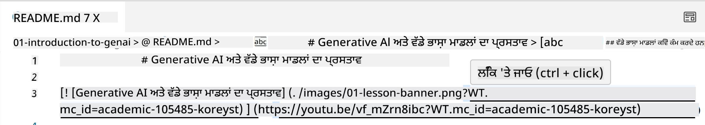
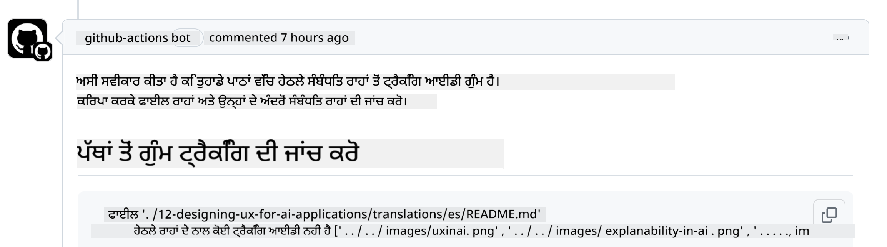
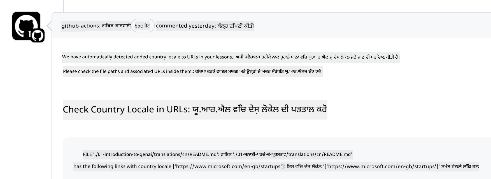

<!--
CO_OP_TRANSLATOR_METADATA:
{
  "original_hash": "57c41f2af71001a2cff9d8eb797cb843",
  "translation_date": "2025-05-19T11:13:53+00:00",
  "source_file": "CONTRIBUTING.md",
  "language_code": "pa"
}
-->
# ਯੋਗਦਾਨ

ਇਹ ਪ੍ਰੋਜੈਕਟ ਯੋਗਦਾਨ ਅਤੇ ਸੁਝਾਅਾਂ ਦਾ ਸਵਾਗਤ ਕਰਦਾ ਹੈ। ਜ਼ਿਆਦਾਤਰ ਯੋਗਦਾਨ ਲਈ ਤੁਹਾਨੂੰ ਯੋਗਦਾਨੀ ਲਾਇਸੈਂਸ ਸਮਝੌਤਾ (CLA) ਨਾਲ ਸਹਿਮਤ ਹੋਣਾ ਪਵੇਗਾ, ਜਿਸ ਵਿੱਚ ਐਲਾਨ ਕੀਤਾ ਗਿਆ ਹੈ ਕਿ ਤੁਹਾਡੇ ਕੋਲ ਯੋਗਦਾਨ ਦੇਣ ਦੇ ਅਧਿਕਾਰ ਹਨ ਅਤੇ ਅਸੀਂ ਤੁਹਾਡੇ ਯੋਗਦਾਨ ਨੂੰ ਵਰਤਣ ਦੇ ਅਧਿਕਾਰ ਪ੍ਰਾਪਤ ਕਰਦੇ ਹਾਂ। ਵਿਸਥਾਰ ਲਈ, <https://cla.microsoft.com> ਤੇ ਜਾਓ।

> ਮਹੱਤਵਪੂਰਨ: ਜਦੋਂ ਇਸ ਰਿਪੋ ਵਿੱਚ ਪਾਠ ਦਾ ਅਨੁਵਾਦ ਕਰਦੇ ਹੋ, ਕਿਰਪਾ ਕਰਕੇ ਯਕੀਨੀ ਬਣਾਓ ਕਿ ਤੁਸੀਂ ਮਸ਼ੀਨ ਅਨੁਵਾਦ ਦੀ ਵਰਤੋਂ ਨਹੀਂ ਕਰਦੇ। ਅਸੀਂ ਅਨੁਵਾਦਾਂ ਦੀ ਸਮੁਦਾਇ ਦੁਆਰਾ ਪੁਸ਼ਟੀ ਕਰਾਂਗੇ, ਇਸ ਲਈ ਕਿਰਪਾ ਕਰਕੇ ਸਿਰਫ਼ ਉਹਨਾਂ ਭਾਸ਼ਾਵਾਂ ਵਿੱਚ ਅਨੁਵਾਦ ਲਈ ਸੇਵਾ ਦਿਓ ਜਿਨ੍ਹਾਂ ਵਿੱਚ ਤੁਸੀਂ ਪ੍ਰਵੀਂ ਹਨ।

ਜਦੋਂ ਤੁਸੀਂ ਇੱਕ ਪੁਲ ਰਿਕਵੈਸਟ ਜਮ੍ਹਾ ਕਰਦੇ ਹੋ, ਤਾਂ ਇੱਕ CLA-ਬੋਟ ਆਪਣੇ ਆਪ ਹੀ ਇਹ ਨਿਰਧਾਰਤ ਕਰ ਲਵੇਗਾ ਕਿ ਕੀ ਤੁਹਾਨੂੰ CLA ਪ੍ਰਦਾਨ ਕਰਨ ਦੀ ਲੋੜ ਹੈ ਅਤੇ PR ਨੂੰ ਉਚਿਤ ਤੌਰ 'ਤੇ ਸਜਾਏਗਾ (ਜਿਵੇਂ ਕਿ ਲੇਬਲ, ਟਿੱਪਣੀ)। ਸਿਰਫ ਬੋਟ ਦੁਆਰਾ ਪ੍ਰਦਾਨ ਕੀਤੀਆਂ ਹਦਾਇਤਾਂ ਦੀ ਪਾਲਣਾ ਕਰੋ। ਤੁਹਾਨੂੰ ਸਿਰਫ ਇੱਕ ਵਾਰ ਸਾਰੇ ਰਿਪੋਜ਼ਟਰੀਜ਼ 'ਤੇ ਇਹ ਕਰਨਾ ਪਵੇਗਾ ਜੋ ਸਾਡੇ CLA ਦੀ ਵਰਤੋਂ ਕਰਦੇ ਹਨ।

## ਆਚਰਣ ਸੰਹਿਤਾ

ਇਸ ਪ੍ਰੋਜੈਕਟ ਨੇ [ਮਾਈਕਰੋਸਾਫਟ ਖੁੱਲ੍ਹੇ ਸਰੋਤ ਦੀ ਆਚਰਣ ਸੰਹਿਤਾ](https://opensource.microsoft.com/codeofconduct/?WT.mc_id=academic-105485-koreyst) ਅਪਣਾਈ ਹੈ। ਹੋਰ ਜਾਣਕਾਰੀ ਲਈ [ਆਚਰਣ ਸੰਹਿਤਾ FAQ](https://opensource.microsoft.com/codeofconduct/faq/?WT.mc_id=academic-105485-koreyst) ਪੜ੍ਹੋ ਜਾਂ ਕਿਸੇ ਵੀ ਵਾਧੂ ਸਵਾਲ ਜਾਂ ਟਿੱਪਣੀਆਂ ਲਈ [opencode@microsoft.com](mailto:opencode@microsoft.com) ਨਾਲ ਸੰਪਰਕ ਕਰੋ।

## ਸਵਾਲ ਜਾਂ ਸਮੱਸਿਆ?

ਕਿਰਪਾ ਕਰਕੇ ਆਮ ਸਹਾਇਤਾ ਸਵਾਲਾਂ ਲਈ GitHub ਮੁੱਦੇ ਨਾ ਖੋਲ੍ਹੋ ਕਿਉਂਕਿ GitHub ਸੂਚੀ ਦਾ ਉਪਯੋਗ ਵਿਸ਼ੇਸ਼ਤਾ ਬੇਨਤੀ ਅਤੇ ਬੱਗ ਰਿਪੋਰਟ ਲਈ ਕੀਤਾ ਜਾਣਾ ਚਾਹੀਦਾ ਹੈ। ਇਸ ਤਰੀਕੇ ਨਾਲ ਅਸੀਂ ਅਸਲ ਮੁੱਦਿਆਂ ਜਾਂ ਬੱਗਾਂ ਦੀ ਆਸਾਨੀ ਨਾਲ ਟ੍ਰੈਕਿੰਗ ਕਰ ਸਕਦੇ ਹਾਂ ਅਤੇ ਆਮ ਚਰਚਾ ਨੂੰ ਅਸਲ ਕੋਡ ਤੋਂ ਵੱਖ ਰੱਖ ਸਕਦੇ ਹਾਂ।

## ਟਾਈਪੋ, ਮੁੱਦੇ, ਬੱਗ ਅਤੇ ਯੋਗਦਾਨ

ਜਦੋਂ ਵੀ ਤੁਸੀਂ ਜਨਰੇਟਿਵ ਏਆਈ ਫਾਰ ਬਿਗਿਨਰਜ਼ ਰਿਪੋਜ਼ਟਰੀ ਵਿੱਚ ਕੋਈ ਵੀ ਬਦਲਾਅ ਜਮ੍ਹਾ ਕਰ ਰਹੇ ਹੋ, ਕਿਰਪਾ ਕਰਕੇ ਇਹ ਸਿਫਾਰਸ਼ਾਂ ਮੰਨੋ।

* ਹਮੇਸ਼ਾ ਆਪਣੇ ਖਾਤੇ ਵਿੱਚ ਰਿਪੋਜ਼ਟਰੀ ਨੂੰ ਫੋਰਕ ਕਰੋ ਅਤੇ ਫਿਰ ਆਪਣੇ ਸੋਧਾਂ ਕਰੋ
* ਇੱਕ ਪੁਲ ਰਿਕਵੈਸਟ ਵਿੱਚ ਕਈ ਬਦਲਾਅ ਨਾ ਕਰੋ। ਉਦਾਹਰਨ ਲਈ, ਕਿਸੇ ਵੀ ਬੱਗ ਫਿਕਸ ਅਤੇ ਦਸਤਾਵੇਜ਼ ਅੱਪਡੇਟ ਨੂੰ ਵੱਖ ਵੱਖ PRs ਦੀ ਵਰਤੋਂ ਕਰਕੇ ਜਮ੍ਹਾ ਕਰੋ
* ਜੇਕਰ ਤੁਹਾਡੇ ਪੁਲ ਰਿਕਵੈਸਟ ਵਿੱਚ ਮਰਜ ਸੰਘਰਸ਼ ਦਿਖਾਈ ਦਿੰਦੇ ਹਨ, ਤਾਂ ਯਕੀਨੀ ਬਣਾਓ ਕਿ ਆਪਣੇ ਸਥਾਨਕ ਮੈਨ ਨੂੰ ਅਪਡੇਟ ਕਰੋ ਜੋ ਕਿ ਮੁੱਖ ਰਿਪੋਜ਼ਟਰੀ ਵਿੱਚ ਹੈ ਉਸਦਾ ਮਿਰਰ ਬਣੇ
* ਜੇਕਰ ਤੁਸੀਂ ਇੱਕ ਅਨੁਵਾਦ ਜਮ੍ਹਾ ਕਰ ਰਹੇ ਹੋ, ਤਾਂ ਕਿਰਪਾ ਕਰਕੇ ਸਾਰੇ ਅਨੁਵਾਦ ਕੀਤੇ ਫਾਈਲਾਂ ਲਈ ਇੱਕ PR ਬਣਾਓ ਕਿਉਂਕਿ ਅਸੀਂ ਸਮੱਗਰੀ ਲਈ ਅਧੂਰੇ ਅਨੁਵਾਦਾਂ ਨੂੰ ਸਵੀਕਾਰ ਨਹੀਂ ਕਰਦੇ
* ਜੇਕਰ ਤੁਸੀਂ ਇੱਕ ਟਾਈਪੋ ਜਾਂ ਦਸਤਾਵੇਜ਼ ਫਿਕਸ ਜਮ੍ਹਾ ਕਰ ਰਹੇ ਹੋ, ਤਾਂ ਤੁਸੀਂ ਜਿੱਥੇ ਯੋਗ ਹੋ ਸਕੇ ਇੱਕ ਸਿੰਗਲ PR ਵਿੱਚ ਸੋਧਾਂ ਨੂੰ ਜੋੜ ਸਕਦੇ ਹੋ

## ਲਿਖਣ ਲਈ ਆਮ ਮਾਰਗਦਰਸ਼ਨ

- ਯਕੀਨੀ ਬਣਾਓ ਕਿ ਤੁਹਾਡੇ ਸਾਰੇ URLs ਚੌਰਸ ਕੋਠਿਆਂ ਵਿੱਚ ਲਪੇਟੇ ਗਏ ਹਨ, ਜਿਸ ਤੋਂ ਬਾਅਦ ਕਿਸੇ ਵੀ ਵਾਧੂ ਖਾਲੀ ਜਗ੍ਹਾ ਤੋਂ ਬਿਨਾਂ ਪਰੰਥੀਸਿਸ ਹੁੰਦੇ ਹਨ ``।
- ਯਕੀਨੀ ਬਣਾਓ ਕਿ ਕੋਈ ਵੀ ਰਿਸ਼ਤੇਦਾਰ ਲਿੰਕ (ਜਾਂ ਰਿਪੋਜ਼ਟਰੀ ਵਿੱਚ ਹੋਰ ਫਾਈਲਾਂ ਅਤੇ ਫੋਲਡਰਾਂ ਦੇ ਲਿੰਕ) ਇੱਕ `./` ਨਾਲ ਸ਼ੁਰੂ ਹੁੰਦਾ ਹੈ ਜੋ ਮੌਜੂਦਾ ਵਰਕਿੰਗ ਡਾਇਰੈਕਟਰੀ ਵਿੱਚ ਸਥਿਤ ਫਾਈਲ ਜਾਂ ਫੋਲਡਰ ਦਾ ਹਵਾਲਾ ਦਿੰਦਾ ਹੈ ਜਾਂ `../` ਜਿਹੜਾ ਪੈਰੈਂਟ ਵਰਕਿੰਗ ਡਾਇਰੈਕਟਰੀ ਵਿੱਚ ਸਥਿਤ ਫਾਈਲ ਜਾਂ ਫੋਲਡਰ ਦਾ ਹਵਾਲਾ ਦਿੰਦਾ ਹੈ।
- ਯਕੀਨੀ ਬਣਾਓ ਕਿ ਕੋਈ ਵੀ ਰਿਸ਼ਤੇਦਾਰ ਲਿੰਕ (ਜਾਂ ਰਿਪੋਜ਼ਟਰੀ ਵਿੱਚ ਹੋਰ ਫਾਈਲਾਂ ਅਤੇ ਫੋਲਡਰਾਂ ਦੇ ਲਿੰਕ) ਵਿੱਚ ਟਰੈਕਿੰਗ ID ਹੈ (ਜਾਂ `?` ਜਾਂ `&` ਫਿਰ `wt.mc_id=` ਜਾਂ `WT.mc_id=`) ਇਸਦੇ ਅੰਤ ਵਿੱਚ।
- ਯਕੀਨੀ ਬਣਾਓ ਕਿ ਹੇਠਾਂ ਦਿੱਤੇ ਡੋਮੇਨਾਂ _github.com, microsoft.com, visualstudio.com, aka.ms, ਅਤੇ azure.com_ ਤੋਂ ਕੋਈ ਵੀ URL ਵਿੱਚ ਟਰੈਕਿੰਗ ID ਹੈ (ਜਾਂ `?` ਜਾਂ `&` ਫਿਰ `wt.mc_id=` ਜਾਂ `WT.mc_id=`) ਇਸਦੇ ਅੰਤ ਵਿੱਚ।
- ਯਕੀਨੀ ਬਣਾਓ ਕਿ ਤੁਹਾਡੇ ਲਿੰਕਾਂ ਵਿੱਚ ਕੋਈ ਦੇਸ਼ ਵਿਸ਼ੇਸ਼ ਲੋਕੇਲ ਨਹੀਂ ਹੈ (ਜਾਂ `/en-us/` ਜਾਂ `/en/`)।
- ਯਕੀਨੀ ਬਣਾਓ ਕਿ ਸਾਰੇ ਚਿੱਤਰ `./images` ਫੋਲਡਰ ਵਿੱਚ ਸਟੋਰ ਕੀਤੇ ਗਏ ਹਨ।
- ਯਕੀਨੀ ਬਣਾਓ ਕਿ ਚਿੱਤਰਾਂ ਦੇ ਨਾਮ ਵਰਤੋਂਕਾਰੀ ਨਾਮਾਂ ਦੇ ਨਾਲ ਹਨ, ਜੋ ਕਿ ਅੰਗਰੇਜ਼ੀ ਅੱਖਰਾਂ, ਅੰਕਾਂ, ਅਤੇ ਡੈਸ਼ਾਂ ਦੇ ਨਾਲ ਹਨ।

## GitHub ਵਰਕਫਲੋਜ਼

ਜਦੋਂ ਤੁਸੀਂ ਇੱਕ ਪੁਲ ਰਿਕਵੈਸਟ ਜਮ੍ਹਾ ਕਰਦੇ ਹੋ, ਤਾਂ ਚਾਰ ਵੱਖ-ਵੱਖ ਵਰਕਫਲੋਜ਼ ਪਿਛਲੇ ਨਿਯਮਾਂ ਦੀ ਪੜਤਾਲ ਕਰਨ ਲਈ ਚਲਾਏ ਜਾਣਗੇ। ਸਿਰਫ ਇੱਥੇ ਦਿੱਤੀਆਂ ਹਦਾਇਤਾਂ ਦੀ ਪਾਲਣਾ ਕਰੋ ਤਾਂ ਜੋ ਵਰਕਫਲੋ ਚੈੱਕ ਪਾਸ ਕਰ ਸਕੋ।

- [ਟੁੱਟੇ ਰਿਸ਼ਤੇਦਾਰ ਪਾਥਾਂ ਦੀ ਜਾਂਚ ਕਰੋ](../..)
- [ਪਾਥਾਂ ਵਿੱਚ ਟਰੈਕਿੰਗ ਹੈ ਜਾਂ ਨਹੀਂ ਦੀ ਜਾਂਚ ਕਰੋ](../..)
- [URLs ਵਿੱਚ ਟਰੈਕਿੰਗ ਹੈ ਜਾਂ ਨਹੀਂ ਦੀ ਜਾਂਚ ਕਰੋ](../..)
- [URLs ਵਿੱਚ ਲੋਕੇਲ ਨਹੀਂ ਹੈ ਜਾਂ ਨਹੀਂ ਦੀ ਜਾਂਚ ਕਰੋ](../..)

### ਟੁੱਟੇ ਰਿਸ਼ਤੇਦਾਰ ਪਾਥਾਂ ਦੀ ਜਾਂਚ ਕਰੋ

ਇਹ ਵਰਕਫਲੋ ਇਹ ਯਕੀਨੀ ਬਣਾਉਂਦਾ ਹੈ ਕਿ ਤੁਹਾਡੇ ਫਾਈਲਾਂ ਵਿੱਚ ਕੋਈ ਵੀ ਰਿਸ਼ਤੇਦਾਰ ਪਾਥ ਕੰਮ ਕਰ ਰਿਹਾ ਹੈ। ਇਹ ਰਿਪੋਜ਼ਟਰੀ GitHub ਪੰਨਿਆਂ 'ਤੇ ਤਾਇਨਾਤ ਕੀਤਾ ਗਿਆ ਹੈ ਇਸ ਲਈ ਜਦੋਂ ਤੁਸੀਂ ਲਿੰਕਾਂ ਨੂੰ ਟਾਈਪ ਕਰਦੇ ਹੋ ਜੋ ਸਾਰੀਆਂ ਚੀਜ਼ਾਂ ਨੂੰ ਇਕੱਠੇ ਰੱਖਦੀਆਂ ਹਨ ਤਾਂ ਤੁਹਾਨੂੰ ਬਹੁਤ ਧਿਆਨ ਦੇਣਾ ਚਾਹੀਦਾ ਹੈ ਤਾਂ ਕਿ ਕਿਸੇ ਨੂੰ ਵੀ ਗਲਤ ਜਗ੍ਹਾ 'ਤੇ ਨਾ ਭੇਜਿਆ ਜਾਵੇ।

ਇਹ ਯਕੀਨੀ ਬਣਾਉਣ ਲਈ ਕਿ ਤੁਹਾਡੇ ਲਿੰਕ ਸਹੀ ਤੌਰ 'ਤੇ ਕੰਮ ਕਰ ਰਹੇ ਹਨ, ਸਿਰਫ VS ਕੋਡ ਦੀ ਵਰਤੋਂ ਕਰੋ ਅਤੇ ਇਹ ਜਾਂਚ ਕਰੋ।

ਉਦਾਹਰਨ ਲਈ, ਜਦੋਂ ਤੁਸੀਂ ਆਪਣੇ ਫਾਈਲਾਂ ਵਿੱਚ ਕਿਸੇ ਵੀ ਲਿੰਕ 'ਤੇ ਹਵਰ ਕਰਦੇ ਹੋ ਤਾਂ ਤੁਹਾਨੂੰ **ctrl + click** ਦਬਾ ਕੇ ਲਿੰਕ ਨੂੰ ਫਾਲੋ ਕਰਨ ਲਈ ਪ੍ਰੇਰਿਤ ਕੀਤਾ ਜਾਵੇਗਾ।

ਜੇਕਰ ਤੁਸੀਂ ਕਿਸੇ ਲਿੰਕ 'ਤੇ ਕਲਿੱਕ ਕਰਦੇ ਹੋ ਅਤੇ ਇਹ ਸਥਾਨਕ ਤੌਰ 'ਤੇ ਕੰਮ ਨਹੀਂ ਕਰ ਰਿਹਾ ਹੈ, ਤਾਂ ਇਹ ਨਿਸ਼ਚਤ ਤੌਰ 'ਤੇ ਵਰਕਫਲੋ ਨੂੰ ਚਾਲੂ ਕਰੇਗਾ ਅਤੇ GitHub 'ਤੇ ਕੰਮ ਨਹੀਂ ਕਰੇਗਾ।

ਇਸ ਸਮੱਸਿਆ ਨੂੰ ਠੀਕ ਕਰਨ ਲਈ, VS ਕੋਡ ਦੀ ਮਦਦ ਨਾਲ ਲਿੰਕ ਟਾਈਪ ਕਰਨ ਦੀ ਕੋਸ਼ਿਸ਼ ਕਰੋ।

ਜਦੋਂ ਤੁਸੀਂ `./` ਜਾਂ `../` ਟਾਈਪ ਕਰਦੇ ਹੋ, ਤਾਂ VS ਕੋਡ ਤੁਹਾਨੂੰ ਉਪਲਬਧ ਵਿਕਲਪਾਂ ਵਿੱਚੋਂ ਚੁਣਨ ਲਈ ਪ੍ਰੇਰਿਤ ਕਰੇਗਾ ਜੋ ਤੁਸੀਂ ਟਾਈਪ ਕੀਤਾ ਹੈ।

ਇੱਛਿਤ ਫਾਈਲ ਜਾਂ ਫੋਲਡਰ 'ਤੇ ਕਲਿੱਕ ਕਰਕੇ ਪਾਥ ਨੂੰ ਫਾਲੋ ਕਰੋ ਅਤੇ ਤੁਸੀਂ ਯਕੀਨੀ ਹੋਵੋਗੇ ਕਿ ਤੁਹਾਡਾ ਪਾਥ ਟੁੱਟਿਆ ਨਹੀਂ ਹੈ।

ਜਦੋਂ ਤੁਸੀਂ ਸਹੀ ਰਿਸ਼ਤੇਦਾਰ ਪਾਥ ਜੋੜ ਦਿੰਦੇ ਹੋ, ਬਚਾਓ, ਅਤੇ ਆਪਣੇ ਬਦਲਾਅ ਪੇਸ਼ ਕਰੋ, ਤਾਂ ਵਰਕਫਲੋ ਦੁਬਾਰਾ ਚਾਲੂ ਹੋ ਜਾਵੇਗਾ ਤਾਂ ਜੋ ਤੁਹਾਡੇ ਬਦਲਾਅਾਂ ਦੀ ਪੁਸ਼ਟੀ ਕੀਤੀ ਜਾ ਸਕੇ। ਜੇਕਰ ਤੁਸੀਂ ਚੈੱਕ ਪਾਸ ਕਰਦੇ ਹੋ ਤਾਂ ਤੁਸੀਂ ਅੱਗੇ ਵਧਣ ਲਈ ਤਿਆਰ ਹੋ।

### ਪਾਥਾਂ ਵਿੱਚ ਟਰੈਕਿੰਗ ਹੈ ਜਾਂ ਨਹੀਂ ਦੀ ਜਾਂਚ ਕਰੋ

ਇਹ ਵਰਕਫਲੋ ਇਹ ਯਕੀਨੀ ਬਣਾਉਂਦਾ ਹੈ ਕਿ ਕਿਸੇ ਵੀ ਰਿਸ਼ਤੇਦਾਰ ਪਾਥ ਵਿੱਚ ਟਰੈਕਿੰਗ ਹੈ। ਇਹ ਰਿਪੋਜ਼ਟਰੀ GitHub ਪੰਨਿਆਂ 'ਤੇ ਤਾਇਨਾਤ ਕੀਤਾ ਗਿਆ ਹੈ ਇਸ ਲਈ ਸਾਨੂੰ ਵੱਖ-ਵੱਖ ਫਾਈਲਾਂ ਅਤੇ ਫੋਲਡਰਾਂ ਦੇ ਵਿਚਕਾਰ ਚਲਣ ਦੀ ਟਰੈਕਿੰਗ ਕਰਨ ਦੀ ਲੋੜ ਹੈ।

ਇਹ ਯਕੀਨੀ ਬਣਾਉਣ ਲਈ ਕਿ ਤੁਹਾਡੇ ਰਿਸ਼ਤੇਦਾਰ ਪਾਥਾਂ ਵਿੱਚ ਟਰੈਕਿੰਗ ਹੈ ਸਿਰਫ ਹੇਠਾਂ ਦਿੱਤੇ ਪਾਠ `?wt.mc_id=` ਦੀ ਜਾਂਚ ਕਰੋ ਜੋ ਪਾਥ ਦੇ ਅੰਤ ਵਿੱਚ ਹੈ। ਜੇਕਰ ਇਹ ਤੁਹਾਡੇ ਰਿਸ਼ਤੇਦਾਰ ਪਾਥਾਂ ਵਿੱਚ ਸ਼ਾਮਲ ਕੀਤਾ ਗਿਆ ਹੈ ਤਾਂ ਤੁਸੀਂ ਇਹ ਚੈੱਕ ਪਾਸ ਕਰ ਲਵੋਗੇ।

ਜੇਕਰ ਨਹੀਂ, ਤਾਂ ਤੁਸੀਂ ਹੇਠਾਂ ਦਿੱਤੀ ਗਲਤੀ ਪ੍ਰਾਪਤ ਕਰ ਸਕਦੇ ਹੋ।

ਇਸ ਸਮੱਸਿਆ ਨੂੰ ਠੀਕ ਕਰਨ ਲਈ, ਉਸ ਫਾਈਲ ਪਾਥ ਨੂੰ ਖੋਲ੍ਹਣ ਦੀ ਕੋਸ਼ਿਸ਼ ਕਰੋ ਜਿਸ ਨੂੰ ਵਰਕਫਲੋ ਨੇ ਹਾਈਲਾਈਟ ਕੀਤਾ ਹੈ ਅਤੇ ਰਿਸ਼ਤੇਦਾਰ ਪਾਥਾਂ ਦੇ ਅੰਤ ਵਿੱਚ ਟਰੈਕਿੰਗ ID ਸ਼ਾਮਲ ਕਰੋ।

ਜਦੋਂ ਤੁਸੀਂ ਟਰੈਕਿੰਗ ID ਸ਼ਾਮਲ ਕਰਦੇ ਹੋ, ਬਚਾਓ, ਅਤੇ ਆਪਣੇ ਬਦਲਾਅ ਪੇਸ਼ ਕਰੋ, ਤਾਂ ਵਰਕਫਲੋ ਦੁਬਾਰਾ ਚਾਲੂ ਹੋ ਜਾਵੇਗਾ ਤਾਂ ਜੋ ਤੁਹਾਡੇ ਬਦਲਾਅਾਂ ਦੀ ਪੁਸ਼ਟੀ ਕੀਤੀ ਜਾ ਸਕੇ। ਜੇਕਰ ਤੁਸੀਂ ਚੈੱਕ ਪਾਸ ਕਰਦੇ ਹੋ ਤਾਂ ਤੁਸੀਂ ਅੱਗੇ ਵਧਣ ਲਈ ਤਿਆਰ ਹੋ।

### URLs ਵਿੱਚ ਟਰੈਕਿੰਗ ਹੈ ਜਾਂ ਨਹੀਂ ਦੀ ਜਾਂਚ ਕਰੋ

ਇਹ ਵਰਕਫਲੋ ਇਹ ਯਕੀਨੀ ਬਣਾਉਂਦਾ ਹੈ ਕਿ ਕਿਸੇ ਵੀ ਵੈੱਬ URL ਵਿੱਚ ਟਰੈਕਿੰਗ ਹੈ। ਇਹ ਰਿਪੋਜ਼ਟਰੀ ਹਰ ਕਿਸੇ ਲਈ ਉਪਲਬਧ ਹੈ ਇਸ ਲਈ ਤੁਹਾਨੂੰ ਇਹ ਯਕੀਨੀ ਬਣਾਉਣ ਦੀ ਲੋੜ ਹੈ ਕਿ ਪਹੁੰਚ ਨੂੰ ਟਰੈਕ ਕੀਤਾ ਜਾਵੇ ਤਾਂ ਜੋ ਪਤਾ ਲੱਗ ਸਕੇ ਕਿ ਟ੍ਰੈਫਿਕ ਕਿੱਥੋਂ ਆ ਰਿਹਾ ਹੈ।

ਇਹ ਯਕੀਨੀ ਬਣਾਉਣ ਲਈ ਕਿ ਤੁਹਾਡੇ URLs ਵਿੱਚ ਟਰੈਕਿੰਗ ਹੈ ਸਿਰਫ ਹੇਠਾਂ ਦਿੱਤੇ ਪਾਠ `?wt.mc_id=` ਦੀ ਜਾਂਚ ਕਰੋ ਜੋ URL ਦੇ ਅੰਤ ਵਿੱਚ ਹੈ। ਜੇਕਰ ਇਹ ਤੁਹਾਡੇ URLs ਵਿੱਚ ਸ਼ਾਮਲ ਕੀਤਾ ਗਿਆ ਹੈ ਤਾਂ ਤੁਸੀਂ ਇਹ ਚੈੱਕ ਪਾਸ ਕਰ ਲਵੋਗੇ।

ਜੇਕਰ ਨਹੀਂ, ਤਾਂ ਤੁਸੀਂ ਹੇਠਾਂ ਦਿੱਤੀ ਗਲਤੀ ਪ੍ਰਾਪਤ ਕਰ ਸਕਦੇ ਹੋ।

ਇਸ ਸਮੱਸਿਆ ਨੂੰ ਠੀਕ ਕਰਨ ਲਈ, ਉਸ ਫਾਈਲ ਪਾਥ ਨੂੰ ਖੋਲ੍ਹਣ ਦੀ ਕੋਸ਼ਿਸ਼ ਕਰੋ ਜਿਸ ਨੂੰ ਵਰਕਫਲੋ ਨੇ ਹਾਈਲਾਈਟ ਕੀਤਾ ਹੈ ਅਤੇ URLs ਦੇ ਅੰਤ ਵਿੱਚ ਟਰੈਕਿੰਗ ID ਸ਼ਾਮਲ ਕਰੋ।

ਜਦੋਂ ਤੁਸੀਂ ਟਰੈਕਿੰਗ ID ਸ਼ਾਮਲ ਕਰਦੇ ਹੋ, ਬਚਾਓ, ਅਤੇ ਆਪਣੇ ਬਦਲਾਅ ਪੇਸ਼ ਕਰੋ, ਤਾਂ ਵਰਕਫਲੋ ਦੁਬਾਰਾ ਚਾਲੂ ਹੋ ਜਾਵੇਗਾ ਤਾਂ ਜੋ ਤੁਹਾਡੇ ਬਦਲਾਅਾਂ ਦੀ ਪੁਸ਼ਟੀ ਕੀਤੀ ਜਾ ਸਕੇ। ਜੇਕਰ ਤੁਸੀਂ ਚੈੱਕ ਪਾਸ ਕਰਦੇ ਹੋ ਤਾਂ ਤੁਸੀਂ ਅੱਗੇ ਵਧਣ ਲਈ ਤਿਆਰ ਹੋ।

### URLs ਵਿੱਚ ਲੋਕੇਲ ਨਹੀਂ ਹੈ ਜਾਂ ਨਹੀਂ ਦੀ ਜਾਂਚ ਕਰੋ

ਇਹ ਵਰਕਫਲੋ ਇਹ ਯਕੀਨੀ ਬਣਾਉਂਦਾ ਹੈ ਕਿ ਕਿਸੇ ਵੀ ਵੈੱਬ URL ਵਿੱਚ ਦੇਸ਼ ਵਿਸ਼ੇਸ਼ ਲੋਕੇਲ ਨਹੀਂ ਹੈ। ਇਹ ਰਿਪੋਜ਼ਟਰੀ ਦੁਨੀਆ ਭਰ ਵਿੱਚ ਹਰ ਕਿਸੇ ਲਈ ਉਪਲਬਧ ਹੈ ਇਸ ਲਈ ਤੁਹਾਨੂੰ ਯਕੀਨੀ ਬਣਾਉਣ ਦੀ ਲੋੜ ਹੈ ਕਿ URLs ਵਿੱਚ ਤੁਹਾਡੇ ਦੇਸ਼ ਦਾ ਲੋਕੇਲ ਸ਼ਾਮਲ ਨਾ ਕੀਤਾ ਜਾਵੇ।

ਇਹ ਯਕੀਨੀ ਬਣਾਉਣ ਲਈ ਕਿ ਤੁਹਾਡੇ URLs ਵਿੱਚ ਦੇਸ਼ ਦਾ ਲੋਕੇਲ ਨਹੀਂ ਹੈ ਸਿਰਫ ਹੇਠਾਂ ਦਿੱਤੇ ਪਾਠ `/en-us/` ਜਾਂ `/en/` ਜਾਂ URL ਵਿੱਚ ਕਿਸੇ ਵੀ ਹੋਰ ਭਾਸ਼ਾ ਲੋਕੇਲ ਦੀ ਜਾਂਚ ਕਰੋ। ਜੇਕਰ ਇਹ ਤੁਹਾਡੇ URLs ਵਿੱਚ ਮੌਜੂਦ ਨਹੀਂ ਹੈ ਤਾਂ ਤੁਸੀਂ ਇਹ ਚੈੱਕ ਪਾਸ ਕਰ ਲਵੋਗੇ।

ਜੇਕਰ ਨਹੀਂ, ਤਾਂ ਤੁਸੀਂ ਹੇਠਾਂ ਦਿੱਤੀ ਗਲਤੀ ਪ੍ਰਾਪਤ ਕਰ ਸਕਦੇ ਹੋ।

ਇਸ ਸਮੱਸਿਆ ਨੂੰ ਠੀਕ ਕਰਨ ਲਈ, ਉਸ ਫਾਈਲ ਪਾਥ ਨੂੰ ਖੋਲ੍ਹਣ ਦੀ ਕੋਸ਼ਿਸ਼ ਕਰੋ ਜਿਸ ਨੂੰ ਵਰਕਫਲੋ ਨੇ ਹਾਈਲਾਈਟ ਕੀਤਾ ਹੈ ਅਤੇ URLs ਤੋਂ ਦੇਸ਼ ਲੋਕੇਲ ਨੂੰ ਹਟਾਓ।

ਜਦੋਂ ਤੁਸੀਂ ਦੇਸ਼ ਲੋਕੇਲ ਨੂੰ ਹਟਾਉਂਦੇ ਹੋ, ਬਚਾਓ, ਅਤੇ ਆਪਣੇ ਬਦਲਾਅ ਪੇਸ਼ ਕਰੋ, ਤਾਂ ਵਰਕਫਲੋ ਦੁਬਾਰਾ ਚਾਲੂ ਹੋ ਜਾਵੇਗਾ ਤਾਂ ਜੋ ਤੁਹਾਡੇ ਬਦਲਾਅਾਂ ਦੀ ਪੁਸ਼ਟੀ ਕੀਤੀ ਜਾ ਸਕੇ। ਜੇਕਰ ਤੁਸੀਂ ਚੈੱਕ ਪਾਸ ਕਰਦੇ ਹੋ ਤਾਂ ਤੁਸੀਂ ਅੱਗੇ ਵਧਣ ਲਈ ਤਿਆਰ ਹੋ।

ਵਧਾਈਆਂ! ਅਸੀਂ ਜਲਦੀ ਹੀ ਤੁਹਾਡੇ ਯੋਗਦਾਨ ਬਾਰੇ

**ਅਸਵੀਕਤੀ**:  
ਇਹ ਦਸਤਾਵੇਜ਼ AI ਅਨੁਵਾਦ ਸੇਵਾ [Co-op Translator](https://github.com/Azure/co-op-translator) ਦੀ ਵਰਤੋਂ ਕਰਕੇ ਅਨੁਵਾਦਿਤ ਕੀਤਾ ਗਿਆ ਹੈ। ਜਦੋਂ ਕਿ ਅਸੀਂ ਸਹੀ ਹੋਣ ਦੀ ਕੋਸ਼ਿਸ਼ ਕਰਦੇ ਹਾਂ, ਕਿਰਪਾ ਕਰਕੇ ਧਿਆਨ ਵਿੱਚ ਰੱਖੋ ਕਿ ਸਵੈਚਾਲਿਤ ਅਨੁਵਾਦਾਂ ਵਿੱਚ ਗਲਤੀਆਂ ਜਾਂ ਅਸੁੱਤੀਆਂ ਹੋ ਸਕਦੀਆਂ ਹਨ। ਇਸਦੀ ਮੂਲ ਭਾਸ਼ਾ ਵਿੱਚ ਮੌਜੂਦ ਮੂਲ ਦਸਤਾਵੇਜ਼ ਨੂੰ ਅਧਿਕਾਰਕ ਸਰੋਤ ਮੰਨਿਆ ਜਾਣਾ ਚਾਹੀਦਾ ਹੈ। ਮਹੱਤਵਪੂਰਨ ਜਾਣਕਾਰੀ ਲਈ, ਪੇਸ਼ੇਵਰ ਮਾਨਵ ਅਨੁਵਾਦ ਦੀ ਸਿਫਾਰਿਸ਼ ਕੀਤੀ ਜਾਂਦੀ ਹੈ। ਅਸੀਂ ਇਸ ਅਨੁਵਾਦ ਦੇ ਉਪਯੋਗ ਤੋਂ ਪੈਦਾ ਹੋਣ ਵਾਲੇ ਕਿਸੇ ਵੀ ਗਲਤਫਹਿਮੀ ਜਾਂ ਗਲਤ ਵਿਆਖਿਆ ਲਈ ਜ਼ਿੰਮੇਵਾਰ ਨਹੀਂ ਹਾਂ।