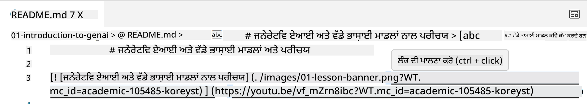
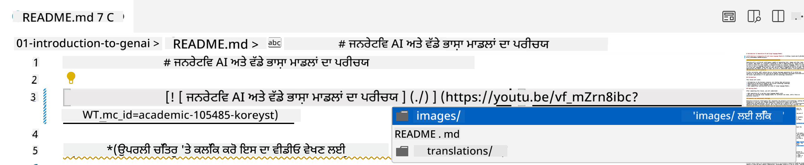
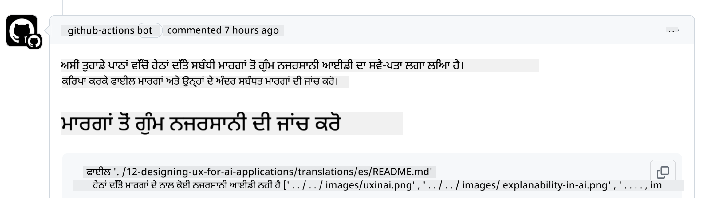
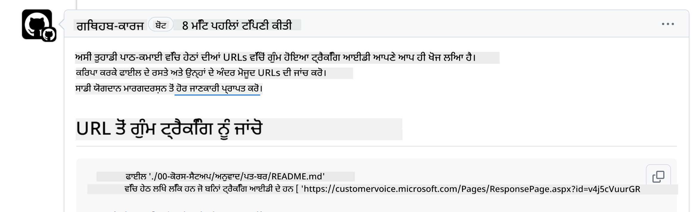
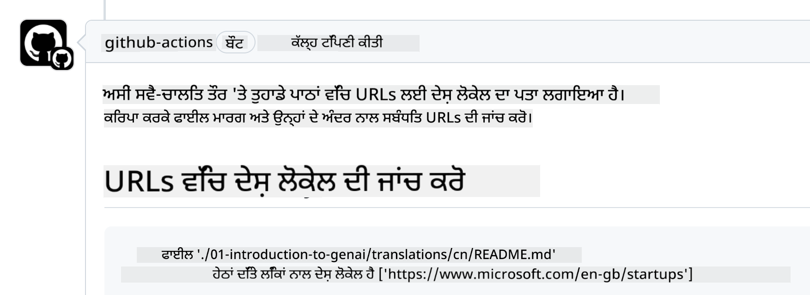

<!--
CO_OP_TRANSLATOR_METADATA:
{
  "original_hash": "57c41f2af71001a2cff9d8eb797cb843",
  "translation_date": "2025-06-25T07:07:23+00:00",
  "source_file": "CONTRIBUTING.md",
  "language_code": "pa"
}
-->
# ਯੋਗਦਾਨ

ਇਹ ਪ੍ਰੋਜੈਕਟ ਯੋਗਦਾਨ ਅਤੇ ਸੁਝਾਅਾਂ ਦਾ ਸਵਾਗਤ ਕਰਦਾ ਹੈ। ਜ਼ਿਆਦਾਤਰ ਯੋਗਦਾਨਾਂ ਲਈ ਤੁਹਾਨੂੰ ਯੋਗਦਾਨਕਾਰ ਲਾਇਸੈਂਸ ਐਗਰੀਮੈਂਟ (CLA) ਨਾਲ ਸਹਿਮਤ ਹੋਣਾ ਪਵੇਗਾ, ਜੋ ਇਹ ਦਾਅਵਾ ਕਰਦਾ ਹੈ ਕਿ ਤੁਹਾਡੇ ਕੋਲ ਇਸ ਯੋਗਦਾਨ ਦੇ ਹੱਕਾਂ ਦਾ ਪ੍ਰਦਾਨ ਕਰਨ ਦਾ ਅਧਿਕਾਰ ਹੈ। ਵੇਰਵੇ ਲਈ, <https://cla.microsoft.com> 'ਤੇ ਜਾਓ।

> ਮਹੱਤਵਪੂਰਨ: ਇਸ ਰਿਪੋ ਵਿੱਚ ਟੈਕਸਟ ਦਾ ਅਨੁਵਾਦ ਕਰਦੇ ਸਮੇਂ, ਕਿਰਪਾ ਕਰਕੇ ਯਕੀਨੀ ਬਣਾਓ ਕਿ ਤੁਸੀਂ ਮਸ਼ੀਨ ਅਨੁਵਾਦ ਦਾ ਉਪਯੋਗ ਨਹੀਂ ਕਰ ਰਹੇ ਹੋ। ਅਸੀਂ ਅਨੁਵਾਦਾਂ ਨੂੰ ਕਮਿਊਨਿਟੀ ਦੁਆਰਾ ਪ੍ਰਮਾਣਿਤ ਕਰਾਂਗੇ, ਇਸ ਲਈ ਕਿਰਪਾ ਕਰਕੇ ਸਿਰਫ਼ ਉਹੀ ਭਾਸ਼ਾਵਾਂ ਵਿੱਚ ਅਨੁਵਾਦਾਂ ਲਈ ਸਵੈਛਿਕ ਬਨੋ ਜਿੱਥੇ ਤੁਸੀਂ ਪ੍ਰਵੀਂ ਹੋ।

ਜਦੋਂ ਤੁਸੀਂ ਇੱਕ ਪੁਲ ਰਿਕਵੇਸਟ ਪੇਸ਼ ਕਰਦੇ ਹੋ, ਇੱਕ CLA-ਬੋਟ ਸਵੈਚਾਲਤ ਤੌਰ 'ਤੇ ਇਹ ਨਿਰਧਾਰਤ ਕਰੇਗਾ ਕਿ ਕੀ ਤੁਹਾਨੂੰ CLA ਪ੍ਰਦਾਨ ਕਰਨ ਦੀ ਲੋੜ ਹੈ ਅਤੇ PR ਨੂੰ ਢੰਗ ਨਾਲ ਸਜਾਵੇਗਾ (ਉਦਾਹਰਨ ਲਈ, ਲੇਬਲ, ਟਿੱਪਣੀ)। ਸਿਰਫ਼ ਬੋਟ ਦੁਆਰਾ ਪ੍ਰਦਾਨ ਕੀਤੇ ਨਿਰਦੇਸ਼ਾਂ ਦੀ ਪਾਲਣਾ ਕਰੋ। ਤੁਹਾਨੂੰ ਸਿਰਫ ਇੱਕ ਵਾਰ ਸਾਰੇ ਰਿਪੋਜ਼ਿਟਰੀਜ਼ ਵਿੱਚ ਇਹ ਕਰਨਾ ਪਵੇਗਾ ਜੋ ਸਾਡੇ CLA ਨੂੰ ਵਰਤਦੇ ਹਨ।

## ਆਚਰਣ ਸੰਹਿਤਾ

ਇਸ ਪ੍ਰੋਜੈਕਟ ਨੇ [ਮਾਈਕਰੋਸਾਫਟ ਖੁੱਲ੍ਹੇ ਸਰੋਤ ਦੀ ਆਚਰਣ ਸੰਹਿਤਾ](https://opensource.microsoft.com/codeofconduct/?WT.mc_id=academic-105485-koreyst) ਨੂੰ ਅਪਨਾਇਆ ਹੈ। ਹੋਰ ਜਾਣਕਾਰੀ ਲਈ [Code of Conduct FAQ](https://opensource.microsoft.com/codeofconduct/faq/?WT.mc_id=academic-105485-koreyst) ਪੜ੍ਹੋ ਜਾਂ [opencode@microsoft.com](mailto:opencode@microsoft.com) ਨਾਲ ਕਿਸੇ ਵੀ ਵਾਧੂ ਸਵਾਲ ਜਾਂ ਟਿੱਪਣੀਆਂ ਲਈ ਸੰਪਰਕ ਕਰੋ।

## ਸਵਾਲ ਜਾਂ ਸਮੱਸਿਆ?

ਕਿਰਪਾ ਕਰਕੇ ਆਮ ਸਹਾਇਤਾ ਸਵਾਲਾਂ ਲਈ GitHub ਇਸ਼ੂਜ਼ ਨਾ ਖੋਲ੍ਹੋ ਕਿਉਂਕਿ GitHub ਸੂਚੀ ਨੂੰ ਫੀਚਰ ਦੀਆਂ ਬੇਨਤੀਆਂ ਅਤੇ ਬੱਗ ਰਿਪੋਰਟਾਂ ਲਈ ਵਰਤਿਆ ਜਾਣਾ ਚਾਹੀਦਾ ਹੈ। ਇਸ ਤਰੀਕੇ ਨਾਲ ਅਸੀਂ ਕੋਡ ਤੋਂ ਅਸਲ ਸਮੱਸਿਆਵਾਂ ਜਾਂ ਬੱਗਾਂ ਨੂੰ ਅਸਾਨੀ ਨਾਲ ਟ੍ਰੈਕ ਕਰ ਸਕਦੇ ਹਾਂ ਅਤੇ ਆਮ ਚਰਚਾ ਨੂੰ ਅਸਲ ਕੋਡ ਤੋਂ ਵੱਖ ਰੱਖ ਸਕਦੇ ਹਾਂ।

## ਟਾਈਪੋ, ਸਮੱਸਿਆਵਾਂ, ਬੱਗ ਅਤੇ ਯੋਗਦਾਨ

ਜਦੋਂ ਵੀ ਤੁਸੀਂ ਬਿਗਿਨਰਜ਼ ਰਿਪੋਜ਼ਿਟਰੀ ਲਈ ਜਨਰੇਟਿਵ AI ਵਿੱਚ ਕੋਈ ਵੀ ਬਦਲਾਅ ਪੇਸ਼ ਕਰ ਰਹੇ ਹੋ, ਕਿਰਪਾ ਕਰਕੇ ਇਹ ਸਿਫਾਰਸ਼ਾਂ ਦੀ ਪਾਲਣਾ ਕਰੋ।

* ਹਮੇਸ਼ਾਂ ਆਪਣੀ ਖਾਤੇ ਵਿੱਚ ਰਿਪੋਜ਼ਿਟਰੀ ਨੂੰ ਫੋਰਕ ਕਰੋ ਪਹਿਲਾਂ ਆਪਣੇ ਸੋਧ ਕਰਨ ਤੋਂ ਪਹਿਲਾਂ
* ਇੱਕ ਪੁਲ ਰਿਕਵੇਸਟ ਵਿੱਚ ਕਈ ਬਦਲਾਅ ਨਾ ਜੋੜੋ। ਉਦਾਹਰਨ ਲਈ, ਕਿਸੇ ਵੀ ਬੱਗ ਫਿਕਸ ਅਤੇ ਦਸਤਾਵੇਜ਼ ਅਪਡੇਟ ਨੂੰ ਵੱਖਰੇ PRs ਦੀ ਵਰਤੋਂ ਕਰਕੇ ਪੇਸ਼ ਕਰੋ
* ਜੇਕਰ ਤੁਹਾਡਾ ਪੁਲ ਰਿਕਵੇਸਟ ਮਰਜ ਕਨਫਲਿਕਟ ਦਿਖਾਉਂਦਾ ਹੈ, ਤਾਂ ਯਕੀਨੀ ਬਣਾਓ ਕਿ ਆਪਣੇ ਸਥਾਨਕ ਮੈਨ ਨੂੰ ਅਪਡੇਟ ਕਰੋ ਜੋ ਕਿ ਮੁੱਖ ਰਿਪੋਜ਼ਿਟਰੀ ਵਿੱਚ ਹੈ
* ਜੇਕਰ ਤੁਸੀਂ ਅਨੁਵਾਦ ਪੇਸ਼ ਕਰ ਰਹੇ ਹੋ, ਤਾਂ ਕਿਰਪਾ ਕਰਕੇ ਸਾਰੇ ਅਨੁਵਾਦ ਕੀਤੇ ਫਾਈਲਾਂ ਲਈ ਇੱਕ PR ਬਣਾਓ ਕਿਉਂਕਿ ਅਸੀਂ ਸਮੱਗਰੀ ਲਈ ਅੰਸ਼ਿਕ ਅਨੁਵਾਦਾਂ ਨੂੰ ਸਵੀਕਾਰ ਨਹੀਂ ਕਰਦੇ
* ਜੇਕਰ ਤੁਸੀਂ ਕੋਈ ਟਾਈਪੋ ਜਾਂ ਦਸਤਾਵੇਜ਼ ਫਿਕਸ ਪੇਸ਼ ਕਰ ਰਹੇ ਹੋ, ਤਾਂ ਤੁਸੀਂ ਇੱਕੋ PR ਵਿੱਚ ਸੋਧਾਂ ਨੂੰ ਜੋੜ ਸਕਦੇ ਹੋ ਜਿੱਥੇ ਯੋਗ ਹੈ

## ਲਿਖਣ ਲਈ ਆਮ ਦਿਸ਼ਾ-ਨਿਰਦੇਸ਼

- ਯਕੀਨੀ ਬਣਾਓ ਕਿ ਤੁਹਾਡੇ ਸਾਰੇ URLs ਚੌਰਸ ਬ੍ਰੈਕਟਾਂ ਵਿੱਚ ਲਪੇਟੇ ਹੋਏ ਹਨ ਜਿਸ ਤੋਂ ਬਾਅਦ ਕੋਈ ਵਾਧੂ ਖਾਲੀ ਥਾਂ ਜਾਂ ਅੰਦਰ ਨਹੀਂ ਹਨ ``।
- ਯਕੀਨੀ ਬਣਾਓ ਕਿ ਕੋਈ ਵੀ ਸੰਬੰਧਤ ਲਿੰਕ (ਜਾਂ ਰਿਪੋਜ਼ਿਟਰੀ ਵਿੱਚ ਹੋਰ ਫਾਈਲਾਂ ਅਤੇ ਫੋਲਡਰਾਂ ਲਈ ਲਿੰਕ) `./` ਨਾਲ ਸ਼ੁਰੂ ਹੁੰਦਾ ਹੈ ਜੋ ਵਰਤਮਾਨ ਕਾਰਜਕਾਰੀ ਡਾਇਰੈਕਟਰੀ ਵਿੱਚ ਸਥਿਤ ਫਾਈਲ ਜਾਂ ਫੋਲਡਰ ਨੂੰ ਦਰਸਾਉਂਦਾ ਹੈ ਜਾਂ `../` ਨੂੰ ਦਰਸਾਉਂਦਾ ਹੈ।
- ਯਕੀਨੀ ਬਣਾਓ ਕਿ ਕੋਈ ਵੀ ਸੰਬੰਧਤ ਲਿੰਕ (ਜਾਂ ਰਿਪੋਜ਼ਿਟਰੀ ਵਿੱਚ ਹੋਰ ਫਾਈਲਾਂ ਅਤੇ ਫੋਲਡਰਾਂ ਲਈ ਲਿੰਕ) ਵਿੱਚ ਟ੍ਰੈਕਿੰਗ ID ਹੈ (ਉਦਾਹਰਨ ਲਈ `?` ਜਾਂ `&` ਫਿਰ `wt.mc_id=` ਜਾਂ `WT.mc_id=`) ਇਸਦੇ ਅੰਤ ਵਿੱਚ।
- ਯਕੀਨੀ ਬਣਾਓ ਕਿ ਹੇਠਾਂ ਦਿੱਤੇ ਡੋਮੇਨਾਂ _github.com, microsoft.com, visualstudio.com, aka.ms, ਅਤੇ azure.com_ ਤੋਂ ਕੋਈ ਵੀ URL ਵਿੱਚ ਟ੍ਰੈਕਿੰਗ ID ਹੈ (ਉਦਾਹਰਨ ਲਈ `?` ਜਾਂ `&` ਫਿਰ `wt.mc_id=` ਜਾਂ `WT.mc_id=`) ਇਸਦੇ ਅੰਤ ਵਿੱਚ।
- ਯਕੀਨੀ ਬਣਾਓ ਕਿ ਤੁਹਾਡੇ ਲਿੰਕਾਂ ਵਿੱਚ ਕੋਈ ਦੇਸ਼ ਵਿਸ਼ੇਸ਼ ਸਥਾਨਕ ਜਗ੍ਹਾ ਨਹੀਂ ਹੈ (ਉਦਾਹਰਨ ਲਈ `/en-us/` ਜਾਂ `/en/`)।
- ਯਕੀਨੀ ਬਣਾਓ ਕਿ ਸਾਰੇ ਚਿੱਤਰ `./images` ਫੋਲਡਰ ਵਿੱਚ ਸਟੋਰ ਕੀਤੇ ਗਏ ਹਨ।
- ਯਕੀਨੀ ਬਣਾਓ ਕਿ ਚਿੱਤਰਾਂ ਦੇ ਨਾਮ ਵਿੱਚ ਅੰਗਰੇਜ਼ੀ ਅੱਖਰਾਂ, ਨੰਬਰਾਂ, ਅਤੇ ਡੈਸ਼ਾਂ ਦੀ ਵਰਤੋਂ ਕਰਕੇ ਵਰਣਨਾਤਮਕ ਨਾਮ ਹਨ।

## GitHub ਵਰਕਫਲੋਜ਼

ਜਦੋਂ ਤੁਸੀਂ ਇੱਕ ਪੁਲ ਰਿਕਵੇਸਟ ਪੇਸ਼ ਕਰਦੇ ਹੋ, ਤਾਂ ਪਿਛਲੇ ਨਿਯਮਾਂ ਨੂੰ ਵੈਧ ਕਰਨ ਲਈ ਚਾਰ ਵੱਖ-ਵੱਖ ਵਰਕਫਲੋਜ਼ ਸੁਰਜਿਤ ਕੀਤੇ ਜਾਣਗੇ। ਸਿਰਫ਼ ਇੱਥੇ ਦਿੱਤੇ ਨਿਰਦੇਸ਼ਾਂ ਦੀ ਪਾਲਣਾ ਕਰੋ ਜਿੱਥੇ ਵਰਕਫਲੋ ਚੈੱਕ ਪਾਸ ਕਰਨੇ ਹਨ।

- [Check Broken Relative Paths](../..)
- [Check Paths Have Tracking](../..)
- [Check URLs Have Tracking](../..)
- [Check URLs Don't Have Locale](../..)

### Check Broken Relative Paths

ਇਹ ਵਰਕਫਲੋ ਯਕੀਨੀ ਬਣਾਉਂਦਾ ਹੈ ਕਿ ਤੁਹਾਡੇ ਫਾਈਲਾਂ ਵਿੱਚ ਕੋਈ ਵੀ ਸੰਬੰਧਤ ਪਥ ਕੰਮ ਕਰ ਰਿਹਾ ਹੈ। ਇਹ ਰਿਪੋਜ਼ਿਟਰੀ GitHub ਪੇਜਾਂ 'ਤੇ ਤਾਇਨਾਤ ਕੀਤਾ ਜਾਂਦਾ ਹੈ ਇਸ ਲਈ ਤੁਹਾਨੂੰ ਬਹੁਤ ਸਾਵਧਾਨ ਰਹਿਣ ਦੀ ਜ਼ਰੂਰਤ ਹੈ ਜਦੋਂ ਤੁਸੀਂ ਲਿੰਕਾਂ ਨੂੰ ਟਾਈਪ ਕਰਦੇ ਹੋ ਜੋ ਸਬ ਕੁਝ ਜੋੜਦੇ ਹਨ ਤਾਂ ਜੋ ਕਿਸੇ ਨੂੰ ਗਲਤ ਜਗ੍ਹਾ ਤੇ ਨਾ ਲੈ ਜਾਏ।

ਯਕੀਨੀ ਬਣਾਉਣ ਲਈ ਕਿ ਤੁਹਾਡੇ ਲਿੰਕ ਸਹੀ ਤਰੀਕੇ ਨਾਲ ਕੰਮ ਕਰ ਰਹੇ ਹਨ ਸਿਰਫ਼ VS ਕੋਡ ਦੀ ਵਰਤੋਂ ਕਰੋ ਇਹ ਜਾਂਚ ਕਰਨ ਲਈ।

ਉਦਾਹਰਨ ਲਈ, ਜਦੋਂ ਤੁਸੀਂ ਆਪਣੇ ਫਾਈਲਾਂ ਵਿੱਚ ਕਿਸੇ ਵੀ ਲਿੰਕ 'ਤੇ ਹਵਰ ਕਰਦੇ ਹੋ ਤਾਂ ਤੁਹਾਨੂੰ **ctrl + click** ਦਬਾ ਕੇ ਲਿੰਕ ਨੂੰ ਫਾਲੋ ਕਰਨ ਲਈ ਪ੍ਰੋਮਪਟ ਕੀਤਾ ਜਾਵੇਗਾ।

ਜੇਕਰ ਤੁਸੀਂ ਕਿਸੇ ਲਿੰਕ 'ਤੇ ਕਲਿਕ ਕਰਦੇ ਹੋ ਅਤੇ ਇਹ ਸਥਾਨਕ ਤੌਰ 'ਤੇ ਕੰਮ ਨਹੀਂ ਕਰ ਰਿਹਾ ਹੈ ਤਾਂ, ਇਹ ਨਿਸ਼ਚਿਤ ਤੌਰ 'ਤੇ ਵਰਕਫਲੋ ਨੂੰ ਸੁਰਜਿਤ ਕਰੇਗਾ ਅਤੇ GitHub 'ਤੇ ਕੰਮ ਨਹੀਂ ਕਰੇਗਾ।

ਇਸ ਸਮੱਸਿਆ ਨੂੰ ਠੀਕ ਕਰਨ ਲਈ, VS ਕੋਡ ਦੀ ਮਦਦ ਨਾਲ ਲਿੰਕ ਨੂੰ ਟਾਈਪ ਕਰਨ ਦੀ ਕੋਸ਼ਿਸ਼ ਕਰੋ।

ਜਦੋਂ ਤੁਸੀਂ `./` ਜਾਂ `../` ਟਾਈਪ ਕਰਦੇ ਹੋ ਤਾਂ VS ਕੋਡ ਤੁਹਾਨੂੰ ਉਪਲਬਧ ਵਿਕਲਪਾਂ ਵਿੱਚੋਂ ਚੁਣਨ ਲਈ ਪ੍ਰੋਮਪਟ ਕਰੇਗਾ।

ਇੱਛਤ ਫਾਈਲ ਜਾਂ ਫੋਲਡਰ 'ਤੇ ਕਲਿਕ ਕਰਕੇ ਪਥ ਨੂੰ ਫਾਲੋ ਕਰੋ ਅਤੇ ਤੁਹਾਨੂੰ ਯਕੀਨ ਹੋਵੇਗਾ ਕਿ ਤੁਹਾਡਾ ਪਥ ਟੁੱਟਿਆ ਨਹੀਂ ਹੈ।

ਜਦੋਂ ਤੁਸੀਂ ਸਹੀ ਸੰਬੰਧਤ ਪਥ ਜੋੜਦੇ ਹੋ, ਸੇਵ ਕਰੋ, ਅਤੇ ਆਪਣੀਆਂ ਸੋਧਾਂ ਨੂੰ ਧੱਕੋ ਤਾਂ ਵਰਕਫਲੋ ਫਿਰ ਸੁਰਜਿਤ ਕੀਤਾ ਜਾਵੇਗਾ ਤੁਹਾਡੀਆਂ ਸੋਧਾਂ ਦੀ ਪੁਸ਼ਟੀ ਕਰਨ ਲਈ। ਜੇਕਰ ਤੁਸੀਂ ਚੈੱਕ ਪਾਸ ਕਰਦੇ ਹੋ ਤਾਂ ਤੁਸੀਂ ਸਹੀ ਹੋ।

### Check Paths Have Tracking

ਇਹ ਵਰਕਫਲੋ ਯਕੀਨੀ ਬਣਾਉਂਦਾ ਹੈ ਕਿ ਕੋਈ ਵੀ ਸੰਬੰਧਤ ਪਥ ਵਿੱਚ ਟ੍ਰੈਕਿੰਗ ਹੈ। ਇਹ ਰਿਪੋਜ਼ਿਟਰੀ GitHub ਪੇਜਾਂ 'ਤੇ ਤਾਇਨਾਤ ਕੀਤਾ ਜਾਂਦਾ ਹੈ ਇਸ ਲਈ ਸਾਨੂੰ ਵੱਖ-ਵੱਖ ਫਾਈਲਾਂ ਅਤੇ ਫੋਲਡਰਾਂ ਦੇ ਵਿਚਾਲੇ ਗਤੀਵਿਧੀ ਨੂੰ ਟ੍ਰੈਕ ਕਰਨ ਦੀ ਜ਼ਰੂਰਤ ਹੈ।

ਯਕੀਨੀ ਬਣਾਉਣ ਲਈ ਕਿ ਤੁਹਾਡੇ ਸੰਬੰਧਤ ਪਥਾਂ ਵਿੱਚ ਟ੍ਰੈਕਿੰਗ ਹੈ ਸਿਰਫ਼ ਇਹ ਪਾਠ ਜਾਂਚੋ `?wt.mc_id=` ਪਥ ਦੇ ਅੰਤ ਵਿੱਚ। ਜੇਕਰ ਇਹ ਤੁਹਾਡੇ ਸੰਬੰਧਤ ਪਥਾਂ 'ਤੇ ਲਾਗੂ ਕੀਤਾ ਗਿਆ ਹੈ ਤਾਂ ਤੁਸੀਂ ਇਹ ਚੈੱਕ ਪਾਸ ਕਰ ਲਵੋਗੇ।

ਜੇਕਰ ਨਹੀਂ, ਤਾਂ ਤੁਹਾਨੂੰ ਹੇਠਾਂ ਦਿੱਤੀ ਗਲਤੀ ਮਿਲ ਸਕਦੀ ਹੈ।

ਇਸ ਸਮੱਸਿਆ ਨੂੰ ਠੀਕ ਕਰਨ ਲਈ, ਉਹ ਫਾਈਲ ਪਥ ਖੋਲ੍ਹਣ ਦੀ ਕੋਸ਼ਿਸ਼ ਕਰੋ ਜਿਸ ਨੂੰ ਵਰਕਫਲੋ ਨੇ ਹਾਈਲਾਈਟ ਕੀਤਾ ਹੈ ਅਤੇ ਸੰਬੰਧਤ ਪਥਾਂ ਦੇ ਅੰਤ ਵਿੱਚ ਟ੍ਰੈਕਿੰਗ ID ਜੋੜੋ।

ਜਦੋਂ ਤੁਸੀਂ ਟ੍ਰੈਕਿੰਗ ID ਜੋੜਦੇ ਹੋ, ਸੇਵ ਕਰੋ, ਅਤੇ ਆਪਣੀਆਂ ਸੋਧਾਂ ਨੂੰ ਧੱਕੋ ਤਾਂ ਵਰਕਫਲੋ ਫਿਰ ਸੁਰਜਿਤ ਕੀਤਾ ਜਾਵੇਗਾ ਤੁਹਾਡੀਆਂ ਸੋਧਾਂ ਦੀ ਪੁਸ਼ਟੀ ਕਰਨ ਲਈ। ਜੇਕਰ ਤੁਸੀਂ ਚੈੱਕ ਪਾਸ ਕਰਦੇ ਹੋ ਤਾਂ ਤੁਸੀਂ ਸਹੀ ਹੋ।

### Check URLs Have Tracking

ਇਹ ਵਰਕਫਲੋ ਯਕੀਨੀ ਬਣਾਉਂਦਾ ਹੈ ਕਿ ਕੋਈ ਵੀ ਵੈੱਬ URL ਵਿੱਚ ਟ੍ਰੈਕਿੰਗ ਹੈ। ਇਹ ਰਿਪੋਜ਼ਿਟਰੀ ਹਰ ਕਿਸੇ ਲਈ ਉਪਲਬਧ ਹੈ ਇਸ ਲਈ ਤੁਹਾਨੂੰ ਯਕੀਨੀ ਬਣਾਉਣ ਦੀ ਜ਼ਰੂਰਤ ਹੈ ਕਿ ਪਹੁੰਚ ਨੂੰ ਟ੍ਰੈਕ ਕਰਨ ਲਈ ਪਤਾ ਲਗਾਇਆ ਜਾਵੇ ਕਿ ਟ੍ਰੈਫਿਕ ਕਿੱਥੋਂ ਆ ਰਿਹਾ ਹੈ।

ਯਕੀਨੀ ਬਣਾਉਣ ਲਈ ਕਿ ਤੁਹਾਡੇ URLs ਵਿੱਚ ਟ੍ਰੈਕਿੰਗ ਹੈ ਸਿਰਫ਼ ਇਹ ਪਾਠ ਜਾਂਚੋ `?wt.mc_id=` URL ਦੇ ਅੰਤ ਵਿੱਚ। ਜੇਕਰ ਇਹ ਤੁਹਾਡੇ URLs 'ਤੇ ਲਾਗੂ ਕੀਤਾ ਗਿਆ ਹੈ ਤਾਂ ਤੁਸੀਂ ਇਹ ਚੈੱਕ ਪਾਸ ਕਰ ਲਵੋਗੇ।

ਜੇਕਰ ਨਹੀਂ, ਤਾਂ ਤੁਹਾਨੂੰ ਹੇਠਾਂ ਦਿੱਤੀ ਗਲਤੀ ਮਿਲ ਸਕਦੀ ਹੈ।

ਇਸ ਸਮੱਸਿਆ ਨੂੰ ਠੀਕ ਕਰਨ ਲਈ, ਉਹ ਫਾਈਲ ਪਥ ਖੋਲ੍ਹਣ ਦੀ ਕੋਸ਼ਿਸ਼ ਕਰੋ ਜਿਸ ਨੂੰ ਵਰਕਫਲੋ ਨੇ ਹਾਈਲਾਈਟ ਕੀਤਾ ਹੈ ਅਤੇ URLs ਦੇ ਅੰਤ ਵਿੱਚ ਟ੍ਰੈਕਿੰਗ ID ਜੋੜੋ।

ਜਦੋਂ ਤੁਸੀਂ ਟ੍ਰੈਕਿੰਗ ID ਜੋੜਦੇ ਹੋ, ਸੇਵ ਕਰੋ, ਅਤੇ ਆਪਣੀਆਂ ਸੋਧਾਂ ਨੂੰ ਧੱਕੋ ਤਾਂ ਵਰਕਫਲੋ ਫਿਰ ਸੁਰਜਿਤ ਕੀਤਾ ਜਾਵੇਗਾ ਤੁਹਾਡੀਆਂ ਸੋਧਾਂ ਦੀ ਪੁਸ਼ਟੀ ਕਰਨ ਲਈ। ਜੇਕਰ ਤੁਸੀਂ ਚੈੱਕ ਪਾਸ ਕਰਦੇ ਹੋ ਤਾਂ ਤੁਸੀਂ ਸਹੀ ਹੋ।

### Check URLs Don't Have Locale

ਇਹ ਵਰਕਫਲੋ ਯਕੀਨੀ ਬਣਾਉਂਦਾ ਹੈ ਕਿ ਕੋਈ ਵੀ ਵੈੱਬ URL ਵਿੱਚ ਦੇਸ਼ ਵਿਸ਼ੇਸ਼ ਸਥਾਨਕ ਜਗ੍ਹਾ ਨਹੀਂ ਹੈ। ਇਹ ਰਿਪੋਜ਼ਿਟਰੀ ਦੁਨੀਆ ਭਰ ਵਿੱਚ ਹਰ ਕਿਸੇ ਲਈ ਉਪਲਬਧ ਹੈ ਇਸ ਲਈ ਤੁਹਾਨੂੰ ਯਕੀਨੀ ਬਣਾਉਣ ਦੀ ਜ਼ਰੂਰਤ ਹੈ ਕਿ URLs ਵਿੱਚ ਆਪਣੇ ਦੇਸ਼ ਦੀ ਸਥਾਨਕ ਜਗ੍ਹਾ ਨੂੰ ਸ਼ਾਮਲ ਨਾ ਕੀਤਾ ਜਾਵੇ।

ਯਕੀਨੀ ਬਣਾਉਣ ਲਈ ਕਿ ਤੁਹਾਡੇ URLs ਵਿੱਚ ਦੇਸ਼ ਦੀ ਸਥਾਨਕ ਜਗ੍ਹਾ ਨਹੀਂ ਹੈ ਸਿਰਫ਼ ਇਹ ਪਾਠ ਜਾਂਚੋ `/en-us/` ਜਾਂ `/en/` ਜਾਂ URLs ਵਿੱਚ ਕਿਤੇ ਵੀ ਹੋਰ ਭਾਸ਼ਾ ਸਥਾਨਕ ਜਗ੍ਹਾ। ਜੇਕਰ ਇਹ ਤੁਹਾਡੇ URLs ਵਿੱਚ ਮੌਜੂਦ ਨਹੀਂ ਹੈ ਤਾਂ ਤੁਸੀਂ ਇਹ ਚੈੱਕ ਪਾਸ ਕਰ ਲਵੋਗੇ।

ਜੇਕਰ ਨਹੀਂ, ਤਾਂ ਤੁਹਾਨੂੰ ਹੇਠਾਂ ਦਿੱਤੀ ਗਲਤੀ ਮਿਲ ਸਕਦੀ ਹੈ।

ਇਸ ਸਮੱਸਿਆ ਨੂੰ ਠੀਕ ਕਰਨ ਲਈ, ਉਹ ਫਾਈਲ ਪਥ ਖੋਲ੍ਹਣ ਦੀ ਕੋਸ਼ਿਸ਼ ਕਰੋ ਜਿਸ ਨੂੰ ਵਰਕਫਲੋ ਨੇ ਹਾਈਲਾਈਟ ਕੀਤਾ ਹੈ ਅਤੇ URLs ਤੋਂ ਦੇਸ਼ ਦੀ ਸਥਾਨਕ ਜਗ੍ਹਾ ਹਟਾਓ।

ਜਦੋਂ ਤੁਸੀਂ ਦੇਸ਼ ਦੀ ਸਥਾਨਕ ਜਗ੍ਹਾ ਹਟਾਉਂਦੇ ਹੋ, ਸੇਵ ਕਰੋ, ਅਤੇ ਆਪਣੀਆਂ ਸੋਧਾਂ ਨੂੰ ਧੱਕੋ ਤਾਂ ਵਰਕਫਲੋ ਫਿਰ ਸੁਰਜਿਤ ਕੀਤਾ ਜਾਵੇਗਾ ਤੁਹਾਡੀਆਂ ਸੋਧਾਂ ਦੀ ਪੁਸ਼ਟੀ ਕਰਨ ਲਈ। ਜੇਕਰ ਤੁਸੀਂ ਚੈੱਕ ਪਾਸ ਕਰਦੇ ਹੋ ਤਾਂ ਤੁਸੀਂ ਸਹੀ ਹੋ।

ਵਧਾਈਆਂ! ਅਸੀਂ ਤੁਹਾਡੇ ਯੋਗਦਾਨ ਬਾਰੇ ਫੀਡਬੈਕ ਦੇਣ ਲਈ ਜਲਦੀ ਤੁਹਾਡੇ ਕੋਲ ਵਾਪਸ ਆਵਾਂਗੇ।

**ਅਸ्वीਕਰਨ**:  
ਇਹ ਦਸਤਾਵੇਜ਼ AI ਅਨੁਵਾਦ ਸੇਵਾ [Co-op Translator](https://github.com/Azure/co-op-translator) ਦੀ ਵਰਤੋਂ ਕਰਕੇ ਅਨੁਵਾਦ ਕੀਤਾ ਗਿਆ ਹੈ। ਜਦੋਂ ਕਿ ਅਸੀਂ ਸਹੀ ਹੋਣ ਦੀ ਕੋਸ਼ਿਸ਼ ਕਰਦੇ ਹਾਂ, ਕਿਰਪਾ ਕਰਕੇ ਧਿਆਨ ਦਿਓ ਕਿ ਸਵੈਚਾਲਿਤ ਅਨੁਵਾਦਾਂ ਵਿੱਚ ਗਲਤੀਆਂ ਜਾਂ ਅਸੁਧਤਾਵਾਂ ਹੋ ਸਕਦੀਆਂ ਹਨ। ਮੂਲ ਭਾਸ਼ਾ ਵਿੱਚ ਮੂਲ ਦਸਤਾਵੇਜ਼ ਨੂੰ ਅਧਿਕਾਰਤ ਸਰੋਤ ਮੰਨਿਆ ਜਾਣਾ ਚਾਹੀਦਾ ਹੈ। ਮਹੱਤਵਪੂਰਨ ਜਾਣਕਾਰੀ ਲਈ, ਪੇਸ਼ੇਵਰ ਮਨੁੱਖੀ ਅਨੁਵਾਦ ਦੀ ਸਿਫਾਰਿਸ਼ ਕੀਤੀ ਜਾਂਦੀ ਹੈ। ਇਸ ਅਨੁਵਾਦ ਦੀ ਵਰਤੋਂ ਤੋਂ ਪੈਦਾ ਹੋਣ ਵਾਲੇ ਕਿਸੇ ਵੀ ਗਲਤਫਹਿਮੀ ਜਾਂ ਗਲਤ ਵਿਆਖਿਆ ਲਈ ਅਸੀਂ ਜ਼ਿੰਮੇਵਾਰ ਨਹੀਂ ਹਾਂ।