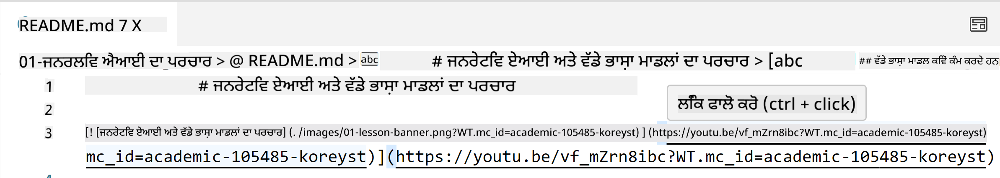
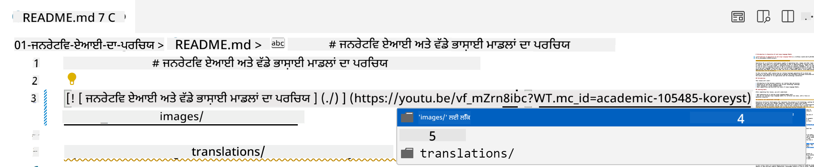
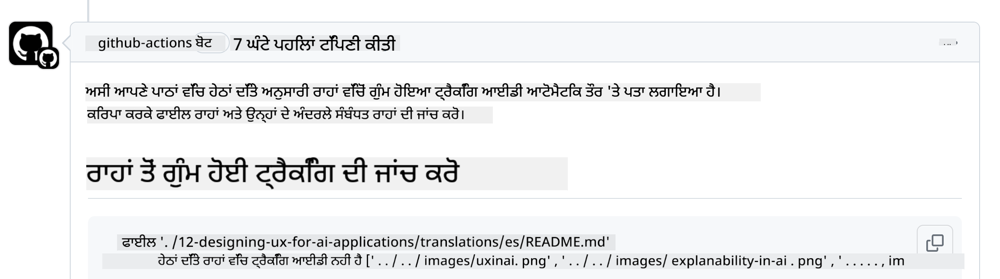
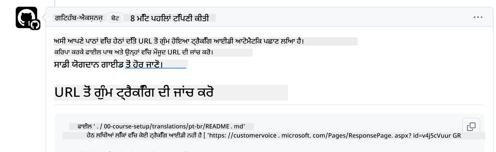
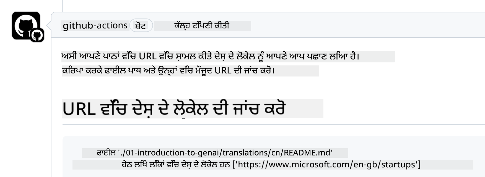

<!--
CO_OP_TRANSLATOR_METADATA:
{
  "original_hash": "57c41f2af71001a2cff9d8eb797cb843",
  "translation_date": "2025-07-09T05:53:14+00:00",
  "source_file": "CONTRIBUTING.md",
  "language_code": "pa"
}
-->
# Contributing

ਇਸ ਪ੍ਰੋਜੈਕਟ ਵਿੱਚ ਯੋਗਦਾਨ ਅਤੇ ਸੁਝਾਵਾਂ ਦਾ ਸਵਾਗਤ ਹੈ। ਜ਼ਿਆਦਾਤਰ ਯੋਗਦਾਨਾਂ ਲਈ ਤੁਹਾਨੂੰ Contributor License Agreement (CLA) ਨਾਲ ਸਹਿਮਤ ਹੋਣਾ ਪੈਂਦਾ ਹੈ, ਜਿਸ ਵਿੱਚ ਤੁਸੀਂ ਇਹ ਘੋਸ਼ਣਾ ਕਰਦੇ ਹੋ ਕਿ ਤੁਹਾਡੇ ਕੋਲ ਆਪਣੇ ਯੋਗਦਾਨ ਦੇ ਉਪਯੋਗ ਦੇ ਹੱਕ ਹਨ ਅਤੇ ਤੁਸੀਂ ਸਾਨੂੰ ਉਹ ਹੱਕ ਦੇ ਰਹੇ ਹੋ। ਵਿਸਥਾਰ ਲਈ, <https://cla.microsoft.com> ਵੇਖੋ।

> Important: ਇਸ ਰਿਪੋ ਵਿੱਚ ਟੈਕਸਟ ਦਾ ਅਨੁਵਾਦ ਕਰਦੇ ਸਮੇਂ, ਕਿਰਪਾ ਕਰਕੇ ਮਸ਼ੀਨ ਅਨੁਵਾਦ ਦੀ ਵਰਤੋਂ ਨਾ ਕਰੋ। ਅਸੀਂ ਅਨੁਵਾਦਾਂ ਦੀ ਸਮੁਦਾਇਕ ਜਾਂਚ ਕਰਾਂਗੇ, ਇਸ ਲਈ ਸਿਰਫ ਉਹਨਾਂ ਭਾਸ਼ਾਵਾਂ ਵਿੱਚ ਅਨੁਵਾਦ ਲਈ ਸਹਾਇਤਾ ਕਰੋ ਜਿਨ੍ਹਾਂ ਵਿੱਚ ਤੁਸੀਂ ਪ੍ਰਵੀਣ ਹੋ।

ਜਦੋਂ ਤੁਸੀਂ ਪુલ ਰਿਕਵੇਸਟ ਸਬਮਿਟ ਕਰਦੇ ਹੋ, ਤਾਂ CLA-bot ਆਪਣੇ ਆਪ ਇਹ ਨਿਰਧਾਰਤ ਕਰੇਗਾ ਕਿ ਤੁਹਾਨੂੰ CLA ਦੇਣੀ ਲੋੜੀਂਦੀ ਹੈ ਜਾਂ ਨਹੀਂ ਅਤੇ PR ਨੂੰ ਢੰਗ ਨਾਲ ਲੇਬਲ ਜਾਂ ਟਿੱਪਣੀ ਨਾਲ ਸਜਾਏਗਾ। ਸਿਰਫ ਬੋਟ ਵੱਲੋਂ ਦਿੱਤੇ ਨਿਰਦੇਸ਼ਾਂ ਦੀ ਪਾਲਣਾ ਕਰੋ। ਸਾਡੇ CLA ਵਾਲੇ ਸਾਰੇ ਰਿਪੋਜ਼ਟਰੀਜ਼ ਵਿੱਚ ਇਹ ਕੰਮ ਤੁਹਾਨੂੰ ਸਿਰਫ ਇੱਕ ਵਾਰੀ ਕਰਨਾ ਪਵੇਗਾ।

## Code of Conduct

ਇਸ ਪ੍ਰੋਜੈਕਟ ਨੇ [Microsoft Open Source Code of Conduct](https://opensource.microsoft.com/codeofconduct/?WT.mc_id=academic-105485-koreyst) ਨੂੰ ਅਪਣਾਇਆ ਹੈ। ਹੋਰ ਜਾਣਕਾਰੀ ਲਈ [Code of Conduct FAQ](https://opensource.microsoft.com/codeofconduct/faq/?WT.mc_id=academic-105485-koreyst) ਪੜ੍ਹੋ ਜਾਂ ਕਿਸੇ ਵੀ ਹੋਰ ਸਵਾਲ ਜਾਂ ਟਿੱਪਣੀ ਲਈ [opencode@microsoft.com](mailto:opencode@microsoft.com) ਨਾਲ ਸੰਪਰਕ ਕਰੋ।

## Question or Problem?

ਕਿਰਪਾ ਕਰਕੇ ਆਮ ਸਹਾਇਤਾ ਸਵਾਲਾਂ ਲਈ GitHub issues ਨਾ ਖੋਲ੍ਹੋ ਕਿਉਂਕਿ GitHub ਸੂਚੀ ਫੀਚਰ ਬੇਨਤੀਆਂ ਅਤੇ ਬੱਗ ਰਿਪੋਰਟਾਂ ਲਈ ਵਰਤੀ ਜਾਂਦੀ ਹੈ। ਇਸ ਤਰ੍ਹਾਂ ਅਸੀਂ ਅਸਲ ਸਮੱਸਿਆਵਾਂ ਜਾਂ ਬੱਗਜ਼ ਨੂੰ ਆਸਾਨੀ ਨਾਲ ਟਰੈਕ ਕਰ ਸਕਦੇ ਹਾਂ ਅਤੇ ਆਮ ਚਰਚਾ ਨੂੰ ਕੋਡ ਤੋਂ ਵੱਖਰਾ ਰੱਖ ਸਕਦੇ ਹਾਂ।

## Typos, Issues, Bugs and contributions

ਜਦੋਂ ਵੀ ਤੁਸੀਂ Generative AI for Beginners ਰਿਪੋਜ਼ਟਰੀ ਵਿੱਚ ਕੋਈ ਬਦਲਾਅ ਸਬਮਿਟ ਕਰਦੇ ਹੋ, ਕਿਰਪਾ ਕਰਕੇ ਇਹ ਸਿਫਾਰਸ਼ਾਂ ਮੰਨੋ:

* ਆਪਣੀ ਸੋਧ ਕਰਨ ਤੋਂ ਪਹਿਲਾਂ ਹਮੇਸ਼ਾ ਰਿਪੋਜ਼ਟਰੀ ਨੂੰ ਆਪਣੇ ਖਾਤੇ ਵਿੱਚ fork ਕਰੋ
* ਇੱਕ ਪુલ ਰਿਕਵੇਸਟ ਵਿੱਚ ਕਈ ਬਦਲਾਅ ਨਾ ਮਿਲਾਓ। ਉਦਾਹਰਨ ਵਜੋਂ, ਕਿਸੇ ਬੱਗ ਫਿਕਸ ਅਤੇ ਦਸਤਾਵੇਜ਼ੀ ਅੱਪਡੇਟ ਲਈ ਵੱਖ-ਵੱਖ PR ਸਬਮਿਟ ਕਰੋ
* ਜੇ ਤੁਹਾਡੇ ਪੂਲ ਰਿਕਵੇਸਟ ਵਿੱਚ ਮਰਜ ਕਾਨਫਲਿਕਟ ਆ ਰਹੇ ਹਨ, ਤਾਂ ਸੋਧ ਕਰਨ ਤੋਂ ਪਹਿਲਾਂ ਆਪਣੇ ਲੋਕਲ main ਨੂੰ ਮੁੱਖ ਰਿਪੋਜ਼ਟਰੀ ਦੇ main ਨਾਲ ਅਪਡੇਟ ਕਰੋ
* ਜੇ ਤੁਸੀਂ ਅਨੁਵਾਦ ਸਬਮਿਟ ਕਰ ਰਹੇ ਹੋ, ਤਾਂ ਸਾਰੇ ਅਨੁਵਾਦਿਤ ਫਾਈਲਾਂ ਲਈ ਇੱਕ ਹੀ PR ਬਣਾਓ ਕਿਉਂਕਿ ਅਸੀਂ ਸਮੱਗਰੀ ਲਈ ਅਧੂਰੇ ਅਨੁਵਾਦ ਸਵੀਕਾਰ ਨਹੀਂ ਕਰਦੇ
* ਜੇ ਤੁਸੀਂ ਟਾਈਪੋ ਜਾਂ ਦਸਤਾਵੇਜ਼ੀ ਫਿਕਸ ਕਰ ਰਹੇ ਹੋ, ਤਾਂ ਜਿੱਥੇ ਢੁਕਵਾਂ ਹੋਵੇ ਇੱਕ ਹੀ PR ਵਿੱਚ ਬਦਲਾਅ ਮਿਲਾ ਸਕਦੇ ਹੋ

## General Guidance for writing

- ਯਕੀਨੀ ਬਣਾਓ ਕਿ ਤੁਹਾਡੇ ਸਾਰੇ URLs ਵਰਗੇ ਲਿੰਕਾਂ ਨੂੰ ਵਰਗੇ ਕੋਠੜੀਆਂ ਵਿੱਚ ਬੰਦ ਕੀਤਾ ਗਿਆ ਹੈ ਅਤੇ ਫਿਰ ਬ੍ਰੈਕਟਸ ਨਾਲ ਬਿਨਾਂ ਵਾਧੂ ਖਾਲੀ ਜਗ੍ਹਾ ਦੇ `` ਵਿੱਚ ਹਨ।
- ਯਕੀਨੀ ਬਣਾਓ ਕਿ ਕੋਈ ਵੀ ਸਬੰਧਤ ਲਿੰਕ (ਜਿਵੇਂ ਕਿ ਰਿਪੋਜ਼ਟਰੀ ਵਿੱਚ ਹੋਰ ਫਾਈਲਾਂ ਅਤੇ ਫੋਲਡਰਾਂ ਦੇ ਲਿੰਕ) `./` ਨਾਲ ਸ਼ੁਰੂ ਹੁੰਦਾ ਹੈ ਜੋ ਮੌਜੂਦਾ ਵਰਕਿੰਗ ਡਾਇਰੈਕਟਰੀ ਵਿੱਚ ਫਾਈਲ ਜਾਂ ਫੋਲਡਰ ਨੂੰ ਦਰਸਾਉਂਦਾ ਹੈ ਜਾਂ `../` ਨਾਲ ਸ਼ੁਰੂ ਹੁੰਦਾ ਹੈ ਜੋ ਮਾਪੇ ਵਰਕਿੰਗ ਡਾਇਰੈਕਟਰੀ ਵਿੱਚ ਫਾਈਲ ਜਾਂ ਫੋਲਡਰ ਨੂੰ ਦਰਸਾਉਂਦਾ ਹੈ।
- ਯਕੀਨੀ ਬਣਾਓ ਕਿ ਕੋਈ ਵੀ ਸਬੰਧਤ ਲਿੰਕ ਦੇ ਅੰਤ ਵਿੱਚ ਟ੍ਰੈਕਿੰਗ ID (ਜਿਵੇਂ `?` ਜਾਂ `&` ਫਿਰ `wt.mc_id=` ਜਾਂ `WT.mc_id=`) ਹੋਵੇ।
- ਯਕੀਨੀ ਬਣਾਓ ਕਿ ਹੇਠਾਂ ਦਿੱਤੇ ਡੋਮੇਨਜ਼ _github.com, microsoft.com, visualstudio.com, aka.ms, ਅਤੇ azure.com_ ਦੇ URLs ਦੇ ਅੰਤ ਵਿੱਚ ਟ੍ਰੈਕਿੰਗ ID ਹੋਵੇ।
- ਯਕੀਨੀ ਬਣਾਓ ਕਿ ਤੁਹਾਡੇ ਲਿੰਕਾਂ ਵਿੱਚ ਦੇਸ਼-ਵਿਸ਼ੇਸ਼ ਭਾਸ਼ਾ ਸਥਾਨਕਤਾ (locale) ਨਾ ਹੋਵੇ (ਜਿਵੇਂ `/en-us/` ਜਾਂ `/en/`)।
- ਯਕੀਨੀ ਬਣਾਓ ਕਿ ਸਾਰੀਆਂ ਤਸਵੀਰਾਂ `./images` ਫੋਲਡਰ ਵਿੱਚ ਸਟੋਰ ਕੀਤੀਆਂ ਗਈਆਂ ਹਨ।
- ਯਕੀਨੀ ਬਣਾਓ ਕਿ ਤਸਵੀਰਾਂ ਦੇ ਨਾਮ ਅੰਗਰੇਜ਼ੀ ਅੱਖਰਾਂ, ਨੰਬਰਾਂ ਅਤੇ ਡੈਸ਼ਾਂ ਨਾਲ ਵਰਣਨਾਤਮਕ ਹਨ।

## GitHub Workflows

ਜਦੋਂ ਤੁਸੀਂ ਪੂਲ ਰਿਕਵੇਸਟ ਸਬਮਿਟ ਕਰਦੇ ਹੋ, ਤਾਂ ਪਿਛਲੇ ਨਿਯਮਾਂ ਦੀ ਪੁਸ਼ਟੀ ਕਰਨ ਲਈ ਚਾਰ ਵੱਖ-ਵੱਖ ਵਰਕਫਲੋਜ਼ ਚਾਲੂ ਹੋਣਗੇ। ਸਿਰਫ ਇੱਥੇ ਦਿੱਤੇ ਨਿਰਦੇਸ਼ਾਂ ਦੀ ਪਾਲਣਾ ਕਰੋ ਤਾਂ ਜੋ ਵਰਕਫਲੋ ਚੈੱਕ ਪਾਸ ਹੋ ਸਕਣ।

- [Check Broken Relative Paths](../..)
- [Check Paths Have Tracking](../..)
- [Check URLs Have Tracking](../..)
- [Check URLs Don't Have Locale](../..)

### Check Broken Relative Paths

ਇਹ ਵਰਕਫਲੋ ਇਹ ਯਕੀਨੀ ਬਣਾਉਂਦਾ ਹੈ ਕਿ ਤੁਹਾਡੇ ਫਾਈਲਾਂ ਵਿੱਚ ਕੋਈ ਵੀ ਸਬੰਧਤ ਪਾਥ ਸਹੀ ਤਰ੍ਹਾਂ ਕੰਮ ਕਰ ਰਿਹਾ ਹੈ।  
ਇਹ ਰਿਪੋਜ਼ਟਰੀ GitHub pages 'ਤੇ ਡਿਪਲੋਇ ਕੀਤੀ ਗਈ ਹੈ, ਇਸ ਲਈ ਤੁਹਾਨੂੰ ਲਿੰਕ ਟਾਈਪ ਕਰਦੇ ਸਮੇਂ ਬਹੁਤ ਧਿਆਨ ਦੇਣਾ ਪਵੇਗਾ ਤਾਂ ਜੋ ਕਿਸੇ ਨੂੰ ਗਲਤ ਜਗ੍ਹਾ ਨਾ ਭੇਜਿਆ ਜਾਵੇ।

ਆਪਣੇ ਲਿੰਕਾਂ ਦੀ ਸਹੀ ਕਾਰਗੁਜ਼ਾਰੀ ਦੀ ਜਾਂਚ ਕਰਨ ਲਈ ਸਿਰਫ VS ਕੋਡ ਦੀ ਵਰਤੋਂ ਕਰੋ।

ਉਦਾਹਰਨ ਵਜੋਂ, ਜਦੋਂ ਤੁਸੀਂ ਕਿਸੇ ਲਿੰਕ 'ਤੇ ਮਾਊਸ ਰੱਖਦੇ ਹੋ ਤਾਂ ਤੁਹਾਨੂੰ ਲਿੰਕ ਨੂੰ ਫੋਲੋ ਕਰਨ ਲਈ **ctrl + click** ਕਰਨ ਦਾ ਸੁਝਾਅ ਮਿਲੇਗਾ।

ਜੇ ਤੁਸੀਂ ਕਿਸੇ ਲਿੰਕ 'ਤੇ ਕਲਿੱਕ ਕਰਦੇ ਹੋ ਅਤੇ ਉਹ ਲੋਕਲ ਤੌਰ 'ਤੇ ਕੰਮ ਨਹੀਂ ਕਰ ਰਿਹਾ, ਤਾਂ ਇਹ ਵਰਕਫਲੋ ਨੂੰ ਟ੍ਰਿਗਰ ਕਰੇਗਾ ਅਤੇ GitHub 'ਤੇ ਵੀ ਕੰਮ ਨਹੀਂ ਕਰੇਗਾ।

ਇਸ ਸਮੱਸਿਆ ਨੂੰ ਠੀਕ ਕਰਨ ਲਈ, VS ਕੋਡ ਦੀ ਮਦਦ ਨਾਲ ਲਿੰਕ ਟਾਈਪ ਕਰਨ ਦੀ ਕੋਸ਼ਿਸ਼ ਕਰੋ।

ਜਦੋਂ ਤੁਸੀਂ `./` ਜਾਂ `../` ਟਾਈਪ ਕਰਦੇ ਹੋ, ਤਾਂ VS ਕੋਡ ਤੁਹਾਨੂੰ ਉਪਲਬਧ ਵਿਕਲਪਾਂ ਵਿੱਚੋਂ ਚੁਣਨ ਲਈ ਪ੍ਰੰਪਟ ਕਰੇਗਾ।

ਚਾਹੀਦਾ ਫਾਈਲ ਜਾਂ ਫੋਲਡਰ ਚੁਣ ਕੇ ਲਿੰਕ ਨੂੰ ਫੋਲੋ ਕਰੋ ਅਤੇ ਤੁਹਾਨੂੰ ਯਕੀਨ ਹੋ ਜਾਵੇਗਾ ਕਿ ਤੁਹਾਡਾ ਪਾਥ ਟੁੱਟਿਆ ਨਹੀਂ ਹੈ।

ਸਹੀ ਸਬੰਧਤ ਪਾਥ ਜੋੜਨ, ਸੇਵ ਕਰਨ ਅਤੇ ਬਦਲਾਅ ਪুশ ਕਰਨ ਤੋਂ ਬਾਅਦ ਵਰਕਫਲੋ ਫਿਰ ਤੋਂ ਚਾਲੂ ਹੋਵੇਗਾ ਤਾਂ ਜੋ ਤੁਹਾਡੇ ਬਦਲਾਅ ਦੀ ਜਾਂਚ ਕਰ ਸਕੇ।  
ਜੇ ਤੁਸੀਂ ਚੈੱਕ ਪਾਸ ਕਰ ਲੈਂਦੇ ਹੋ ਤਾਂ ਤੁਸੀਂ ਤਿਆਰ ਹੋ।

### Check Paths Have Tracking

ਇਹ ਵਰਕਫਲੋ ਇਹ ਯਕੀਨੀ ਬਣਾਉਂਦਾ ਹੈ ਕਿ ਕੋਈ ਵੀ ਸਬੰਧਤ ਪਾਥ ਵਿੱਚ ਟ੍ਰੈਕਿੰਗ ਹੋਵੇ।  
ਇਹ ਰਿਪੋਜ਼ਟਰੀ GitHub pages 'ਤੇ ਡਿਪਲੋਇ ਕੀਤੀ ਗਈ ਹੈ, ਇਸ ਲਈ ਸਾਨੂੰ ਵੱਖ-ਵੱਖ ਫਾਈਲਾਂ ਅਤੇ ਫੋਲਡਰਾਂ ਵਿੱਚ ਮੂਵਮੈਂਟ ਨੂੰ ਟਰੈਕ ਕਰਨਾ ਲਾਜ਼ਮੀ ਹੈ।

ਆਪਣੇ ਸਬੰਧਤ ਪਾਥਾਂ ਵਿੱਚ ਟ੍ਰੈਕਿੰਗ ਹੋਣ ਦੀ ਜਾਂਚ ਕਰਨ ਲਈ ਸਿਰਫ ਇਹ ਟੈਕਸਟ `?wt.mc_id=` ਪਾਥ ਦੇ ਅੰਤ ਵਿੱਚ ਹੈ ਜਾਂ ਨਹੀਂ, ਵੇਖੋ।  
ਜੇ ਇਹ ਤੁਹਾਡੇ ਸਬੰਧਤ ਪਾਥਾਂ ਨਾਲ ਜੁੜਿਆ ਹੋਇਆ ਹੈ ਤਾਂ ਤੁਸੀਂ ਇਹ ਚੈੱਕ ਪਾਸ ਕਰ ਲਵੋਗੇ।

ਨਹੀਂ ਤਾਂ, ਤੁਹਾਨੂੰ ਹੇਠਾਂ ਦਿੱਤੀ ਗਈ ਗਲਤੀ ਮਿਲ ਸਕਦੀ ਹੈ।

ਇਸ ਸਮੱਸਿਆ ਨੂੰ ਠੀਕ ਕਰਨ ਲਈ, ਵਰਕਫਲੋ ਵੱਲੋਂ ਹਾਈਲਾਈਟ ਕੀਤੇ ਗਏ ਫਾਈਲ ਪਾਥ ਨੂੰ ਖੋਲ੍ਹੋ ਅਤੇ ਸਬੰਧਤ ਪਾਥਾਂ ਦੇ ਅੰਤ ਵਿੱਚ ਟ੍ਰੈਕਿੰਗ ID ਜੋੜੋ।

ਟ੍ਰੈਕਿੰਗ ID ਜੋੜਨ, ਸੇਵ ਕਰਨ ਅਤੇ ਬਦਲਾਅ ਪুশ ਕਰਨ ਤੋਂ ਬਾਅਦ ਵਰਕਫਲੋ ਫਿਰ ਤੋਂ ਚਾਲੂ ਹੋਵੇਗਾ ਤਾਂ ਜੋ ਤੁਹਾਡੇ ਬਦਲਾਅ ਦੀ ਜਾਂਚ ਕਰ ਸਕੇ।  
ਜੇ ਤੁਸੀਂ ਚੈੱਕ ਪਾਸ ਕਰ ਲੈਂਦੇ ਹੋ ਤਾਂ ਤੁਸੀਂ ਤਿਆਰ ਹੋ।

### Check URLs Have Tracking

ਇਹ ਵਰਕਫਲੋ ਇਹ ਯਕੀਨੀ ਬਣਾਉਂਦਾ ਹੈ ਕਿ ਕੋਈ ਵੀ ਵੈੱਬ URL ਵਿੱਚ ਟ੍ਰੈਕਿੰਗ ਹੋਵੇ।  
ਇਹ ਰਿਪੋਜ਼ਟਰੀ ਹਰ ਕਿਸੇ ਲਈ ਉਪਲਬਧ ਹੈ, ਇਸ ਲਈ ਤੁਹਾਨੂੰ ਇਹ ਯਕੀਨੀ ਬਣਾਉਣਾ ਪਵੇਗਾ ਕਿ ਟ੍ਰੈਫਿਕ ਕਿੱਥੋਂ ਆ ਰਿਹਾ ਹੈ, ਇਸ ਦੀ ਟਰੈਕਿੰਗ ਹੋਵੇ।

ਆਪਣੇ URLs ਵਿੱਚ ਟ੍ਰੈਕਿੰਗ ਹੋਣ ਦੀ ਜਾਂਚ ਕਰਨ ਲਈ ਸਿਰਫ ਇਹ ਟੈਕਸਟ `?wt.mc_id=` URL ਦੇ ਅੰਤ ਵਿੱਚ ਹੈ ਜਾਂ ਨਹੀਂ, ਵੇਖੋ।  
ਜੇ ਇਹ ਤੁਹਾਡੇ URLs ਨਾਲ ਜੁੜਿਆ ਹੋਇਆ ਹੈ ਤਾਂ ਤੁਸੀਂ ਇਹ ਚੈੱਕ ਪਾਸ ਕਰ ਲਵੋਗੇ।

ਨਹੀਂ ਤਾਂ, ਤੁਹਾਨੂੰ ਹੇਠਾਂ ਦਿੱਤੀ ਗਈ ਗਲਤੀ ਮਿਲ ਸਕਦੀ ਹੈ।

ਇਸ ਸਮੱਸਿਆ ਨੂੰ ਠੀਕ ਕਰਨ ਲਈ, ਵਰਕਫਲੋ ਵੱਲੋਂ ਹਾਈਲਾਈਟ ਕੀਤੇ ਗਏ ਫਾਈਲ ਪਾਥ ਨੂੰ ਖੋਲ੍ਹੋ ਅਤੇ URLs ਦੇ ਅੰਤ ਵਿੱਚ ਟ੍ਰੈਕਿੰਗ ID ਜੋੜੋ।

ਟ੍ਰੈਕਿੰਗ ID ਜੋੜਨ, ਸੇਵ ਕਰਨ ਅਤੇ ਬਦਲਾਅ ਪুশ ਕਰਨ ਤੋਂ ਬਾਅਦ ਵਰਕਫਲੋ ਫਿਰ ਤੋਂ ਚਾਲੂ ਹੋਵੇਗਾ ਤਾਂ ਜੋ ਤੁਹਾਡੇ ਬਦਲਾਅ ਦੀ ਜਾਂਚ ਕਰ ਸਕੇ।  
ਜੇ ਤੁਸੀਂ ਚੈੱਕ ਪਾਸ ਕਰ ਲੈਂਦੇ ਹੋ ਤਾਂ ਤੁਸੀਂ ਤਿਆਰ ਹੋ।

### Check URLs Don't Have Locale

ਇਹ ਵਰਕਫਲੋ ਇਹ ਯਕੀਨੀ ਬਣਾਉਂਦਾ ਹੈ ਕਿ ਕੋਈ ਵੀ ਵੈੱਬ URL ਵਿੱਚ ਦੇਸ਼-ਵਿਸ਼ੇਸ਼ ਭਾਸ਼ਾ ਸਥਾਨਕਤਾ (locale) ਨਾ ਹੋਵੇ।  
ਇਹ ਰਿਪੋਜ਼ਟਰੀ ਦੁਨੀਆ ਭਰ ਦੇ ਹਰ ਕਿਸੇ ਲਈ ਉਪਲਬਧ ਹੈ, ਇਸ ਲਈ ਤੁਹਾਨੂੰ ਯਕੀਨੀ ਬਣਾਉਣਾ ਪਵੇਗਾ ਕਿ URLs ਵਿੱਚ ਤੁਹਾਡੇ ਦੇਸ਼ ਦੀ ਸਥਾਨਕਤਾ ਸ਼ਾਮਲ ਨਾ ਹੋਵੇ।

ਆਪਣੇ URLs ਵਿੱਚ ਦੇਸ਼-ਵਿਸ਼ੇਸ਼ ਸਥਾਨਕਤਾ ਨਾ ਹੋਣ ਦੀ ਜਾਂਚ ਕਰਨ ਲਈ ਸਿਰਫ ਇਹ ਟੈਕਸਟ `/en-us/` ਜਾਂ `/en/` ਜਾਂ ਹੋਰ ਕੋਈ ਭਾਸ਼ਾ ਸਥਾਨਕਤਾ URL ਵਿੱਚ ਹੈ ਜਾਂ ਨਹੀਂ, ਵੇਖੋ।  
ਜੇ ਇਹ ਤੁਹਾਡੇ URLs ਵਿੱਚ ਨਹੀਂ ਹੈ ਤਾਂ ਤੁਸੀਂ ਇਹ ਚੈੱਕ ਪਾਸ ਕਰ ਲਵੋਗੇ।

ਨਹੀਂ ਤਾਂ, ਤੁਹਾਨੂੰ ਹੇਠਾਂ ਦਿੱਤੀ ਗਈ ਗਲਤੀ ਮਿਲ ਸਕਦੀ ਹੈ।

ਇਸ ਸਮੱਸਿਆ ਨੂੰ ਠੀਕ ਕਰਨ ਲਈ, ਵਰਕਫਲੋ ਵੱਲੋਂ ਹਾਈਲਾਈਟ ਕੀਤੇ ਗਏ ਫਾਈਲ ਪਾਥ ਨੂੰ ਖੋਲ੍ਹੋ ਅਤੇ URLs ਵਿੱਚੋਂ ਦੇਸ਼ ਦੀ ਸਥਾਨਕਤਾ ਹਟਾਓ।

ਦੇਸ਼ ਦੀ ਸਥਾਨਕਤਾ ਹਟਾਉਣ, ਸੇਵ ਕਰਨ ਅਤੇ ਬਦਲਾਅ ਪুশ ਕਰਨ ਤੋਂ ਬਾਅਦ ਵਰਕਫਲੋ ਫਿਰ ਤੋਂ ਚਾਲੂ ਹੋਵੇਗਾ ਤਾਂ ਜੋ ਤੁਹਾਡੇ ਬਦਲਾਅ ਦੀ ਜਾਂਚ ਕਰ ਸਕੇ।  
ਜੇ ਤੁਸੀਂ ਚੈੱਕ ਪਾਸ ਕਰ ਲੈਂਦੇ ਹੋ ਤਾਂ ਤੁਸੀਂ ਤਿਆਰ ਹੋ।

ਮੁਬਾਰਕਾਂ! ਅਸੀਂ ਤੁਹਾਡੇ ਯੋਗਦਾਨ ਬਾਰੇ ਜਲਦੀ ਹੀ ਪ੍ਰਤੀਕਿਰਿਆ ਦੇਣਗੇ।

**ਅਸਵੀਕਾਰੋਪਣ**:  
ਇਹ ਦਸਤਾਵੇਜ਼ AI ਅਨੁਵਾਦ ਸੇਵਾ [Co-op Translator](https://github.com/Azure/co-op-translator) ਦੀ ਵਰਤੋਂ ਕਰਕੇ ਅਨੁਵਾਦਿਤ ਕੀਤਾ ਗਿਆ ਹੈ। ਜਦੋਂ ਕਿ ਅਸੀਂ ਸਹੀਤਾ ਲਈ ਕੋਸ਼ਿਸ਼ ਕਰਦੇ ਹਾਂ, ਕਿਰਪਾ ਕਰਕੇ ਧਿਆਨ ਰੱਖੋ ਕਿ ਸਵੈਚਾਲਿਤ ਅਨੁਵਾਦਾਂ ਵਿੱਚ ਗਲਤੀਆਂ ਜਾਂ ਅਸਮਰਥਤਾਵਾਂ ਹੋ ਸਕਦੀਆਂ ਹਨ। ਮੂਲ ਦਸਤਾਵੇਜ਼ ਆਪਣੀ ਮੂਲ ਭਾਸ਼ਾ ਵਿੱਚ ਪ੍ਰਮਾਣਿਕ ਸਰੋਤ ਮੰਨਿਆ ਜਾਣਾ ਚਾਹੀਦਾ ਹੈ। ਮਹੱਤਵਪੂਰਨ ਜਾਣਕਾਰੀ ਲਈ, ਪੇਸ਼ੇਵਰ ਮਨੁੱਖੀ ਅਨੁਵਾਦ ਦੀ ਸਿਫਾਰਸ਼ ਕੀਤੀ ਜਾਂਦੀ ਹੈ। ਇਸ ਅਨੁਵਾਦ ਦੀ ਵਰਤੋਂ ਨਾਲ ਹੋਣ ਵਾਲੀਆਂ ਕਿਸੇ ਵੀ ਗਲਤਫਹਿਮੀਆਂ ਜਾਂ ਗਲਤ ਵਿਆਖਿਆਵਾਂ ਲਈ ਅਸੀਂ ਜ਼ਿੰਮੇਵਾਰ ਨਹੀਂ ਹਾਂ।