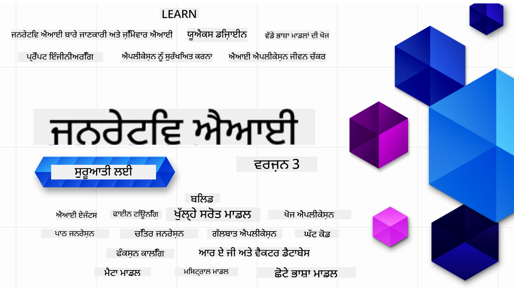

<!--
CO_OP_TRANSLATOR_METADATA:
{
  "original_hash": "ca2afa136ed9aca0634f39f51239746e",
  "translation_date": "2025-08-27T08:27:34+00:00",
  "source_file": "README.md",
  "language_code": "pa"
}
-->

### 21 ਪਾਠ ਜੋ ਤੁਹਾਨੂੰ ਜਨਰੇਟਿਵ AI ਐਪਲੀਕੇਸ਼ਨ ਬਣਾਉਣ ਦੀ ਸ਼ੁਰੂਆਤ ਕਰਨ ਲਈ ਸਭ ਕੁਝ ਸਿਖਾਉਣਗੇ

  
  
  
  
  

  
  
  

### 🌐 ਬਹੁ-ਭਾਸ਼ਾਈ ਸਹਾਇਤਾ

#### GitHub Action ਰਾਹੀਂ ਸਹਾਇਕ (ਆਟੋਮੈਟਿਕ ਅਤੇ ਹਮੇਸ਼ਾ ਅਪ-ਟੂ-ਡੇਟ)

[ਫਰੈਂਚ](../fr/README.md) | [ਸਪੈਨਿਸ਼](../es/README.md) | [ਜਰਮਨ](../de/README.md) | [ਰੂਸੀ](../ru/README.md) | [ਅਰਬੀ](../ar/README.md) | [ਫ਼ਾਰਸੀ](../fa/README.md) | [ਉਰਦੂ](../ur/README.md) | [ਚੀਨੀ (ਸਰਲ)](../zh/README.md) | [ਚੀਨੀ (ਰਵਾਇਤੀ, ਮਕਾਉ)](../mo/README.md) | [ਚੀਨੀ (ਰਵਾਇਤੀ, ਹਾਂਗਕਾਂਗ)](../hk/README.md) | [ਚੀਨੀ (ਰਵਾਇਤੀ, ਤਾਈਵਾਨ)](../tw/README.md) | [ਜਾਪਾਨੀ](../ja/README.md) | [ਕੋਰੀਅਨ](../ko/README.md) | [ਹਿੰਦੀ](../hi/README.md) | [ਬੰਗਾਲੀ](../bn/README.md) | [ਮਰਾਠੀ](../mr/README.md) | [ਨੇਪਾਲੀ](../ne/README.md) | [ਪੰਜਾਬੀ (ਗੁਰਮੁਖੀ)](./README.md) | [ਪੁਰਤਗਾਲੀ (ਪੁਰਤਗਾਲ)](../pt/README.md) | [ਪੁਰਤਗਾਲੀ (ਬ੍ਰਾਜ਼ੀਲ)](../br/README.md) | [ਇਟਾਲਵੀ](../it/README.md) | [ਲਿਥੂਆਨੀਅਨ](../lt/README.md) | [ਪੋਲਿਸ਼](../pl/README.md) | [ਤੁਰਕੀ](../tr/README.md) | [ਯੂਨਾਨੀ](../el/README.md) | [ਥਾਈ](../th/README.md) | [ਸਵੀਡਿਸ਼](../sv/README.md) | [ਡੈਨਿਸ਼](../da/README.md) | [ਨਾਰਵੇਜੀਅਨ](../no/README.md) | [ਫਿਨਿਸ਼](../fi/README.md) | [ਡੱਚ](../nl/README.md) | [ਹਿਬਰੂ](../he/README.md) | [ਵਿਯਤਨਾਮੀ](../vi/README.md) | [ਇੰਡੋਨੇਸ਼ੀਆਈ](../id/README.md) | [ਮਲੇ](../ms/README.md) | [ਟੈਗਾਲੋਗ (ਫਿਲੀਪੀਨੋ)](../tl/README.md) | [ਸਵਾਹਿਲੀ](../sw/README.md) | [ਹੰਗਰੀਅਨ](../hu/README.md) | [ਚੈਕ](../cs/README.md) | [ਸਲੋਵਾਕ](../sk/README.md) | [ਰੋਮਾਨੀਅਨ](../ro/README.md) | [ਬੁਲਗਾਰੀਆਈ](../bg/README.md) | [ਸਰਬੀਅਨ (ਸਿਰਿਲਿਕ)](../sr/README.md) | [ਕਰੋਏਸ਼ੀਆਈ](../hr/README.md) | [ਸਲੋਵੇਨੀਆਈ](../sl/README.md) | [ਯੂਕਰੇਨੀਅਨ](../uk/README.md) | [ਬਰਮੀ (ਮਿਆਂਮਾਰ)](../my/README.md)

# ਜਨਰੇਟਿਵ AI ਸ਼ੁਰੂਆਤੀਆਂ ਲਈ (ਸੰਸਕਰਣ 3) - ਇੱਕ ਕੋਰਸ

ਮਾਈਕਰੋਸਾਫਟ ਕਲਾਉਡ ਐਡਵੋਕੇਟਸ ਦੁਆਰਾ ਤਿਆਰ ਕੀਤੇ 21 ਪਾਠਾਂ ਦੇ ਇਸ ਵਿਸ਼ਤ੍ਰਿਤ ਕੋਰਸ ਨਾਲ ਜਨਰੇਟਿਵ AI ਐਪਲੀਕੇਸ਼ਨ ਬਣਾਉਣ ਦੇ ਮੂਲ ਸਿਧਾਂਤ ਸਿੱਖੋ।

## 🌱 ਸ਼ੁਰੂਆਤ ਕਰਨ ਲਈ

ਇਸ ਕੋਰਸ ਵਿੱਚ 21 ਪਾਠ ਹਨ। ਹਰ ਪਾਠ ਵਿੱਚ ਇੱਕ ਵਿਲੱਖਣ ਵਿਸ਼ਾ ਸ਼ਾਮਲ ਹੈ, ਇਸ ਲਈ ਤੁਸੀਂ ਕਿਤੇ ਵੀ ਸ਼ੁਰੂ ਕਰ ਸਕਦੇ ਹੋ!

ਪਾਠਾਂ ਨੂੰ "ਸਿੱਖੋ" ਪਾਠਾਂ ਵਜੋਂ ਲੇਬਲ ਕੀਤਾ ਗਿਆ ਹੈ ਜੋ ਜਨਰੇਟਿਵ AI ਸੰਕਲਪ ਦੀ ਵਿਆਖਿਆ ਕਰਦੇ ਹਨ ਜਾਂ "ਬਣਾਓ" ਪਾਠਾਂ ਵਜੋਂ ਜੋ ਸੰਕਲਪ ਅਤੇ ਕੋਡ ਉਦਾਹਰਣਾਂ ਨੂੰ **Python** ਅਤੇ **TypeScript** ਵਿੱਚ ਸਮਝਾਉਂਦੇ ਹਨ ਜਿੱਥੇ ਸੰਭਵ ਹੋਵੇ।

.NET ਡਿਵੈਲਪਰਾਂ ਲਈ [Generative AI for Beginners (.NET Edition)](https://github.com/microsoft/Generative-AI-for-beginners-dotnet?WT.mc_id=academic-105485-koreyst) ਵੇਖੋ!

ਹਰ ਪਾਠ ਵਿੱਚ "ਸਿੱਖਣਾ ਜਾਰੀ ਰੱਖੋ" ਸੈਕਸ਼ਨ ਵੀ ਸ਼ਾਮਲ ਹੈ ਜਿਸ ਵਿੱਚ ਵਾਧੂ ਸਿੱਖਣ ਦੇ ਸਾਧਨ ਹਨ।

## ਤੁਹਾਨੂੰ ਕੀ ਚਾਹੀਦਾ ਹੈ
### ਇਸ ਕੋਰਸ ਦੇ ਕੋਡ ਨੂੰ ਚਲਾਉਣ ਲਈ, ਤੁਸੀਂ ਹੇਠਾਂ ਦਿੱਤੇ ਵਿੱਚੋਂ ਕਿਸੇ ਇੱਕ ਦੀ ਵਰਤੋਂ ਕਰ ਸਕਦੇ ਹੋ: 
 - [Azure OpenAI Service](https://aka.ms/genai-beginners/azure-open-ai?WT.mc_id=academic-105485-koreyst) - **ਪਾਠ:** "aoai-assignment"  
 - [GitHub Marketplace Model Catalog](https://aka.ms/genai-beginners/gh-models?WT.mc_id=academic-105485-koreyst) - **ਪਾਠ:** "githubmodels"  
 - [OpenAI API](https://aka.ms/genai-beginners/open-ai?WT.mc_id=academic-105485-koreyst) - **ਪਾਠ:** "oai-assignment"  

- Python ਜਾਂ TypeScript ਦੀ ਬੁਨਿਆਦੀ ਜਾਣਕਾਰੀ ਮਦਦਗਾਰ ਹੈ - \*ਪੂਰੀ ਤਰ੍ਹਾਂ ਸ਼ੁਰੂਆਤੀਆਂ ਲਈ ਇਹ [Python](https://aka.ms/genai-beginners/python?WT.mc_id=academic-105485-koreyst) ਅਤੇ [TypeScript](https://aka.ms/genai-beginners/typescript?WT.mc_id=academic-105485-koreyst) ਕੋਰਸ ਵੇਖੋ  
- ਇੱਕ GitHub ਖਾਤਾ ਤਾਂ ਜੋ ਤੁਸੀਂ [ਇਸ ਪੂਰੇ ਰਿਪੋ ਨੂੰ ਫੋਰਕ ਕਰ ਸਕੋ](https://aka.ms/genai-beginners/github?WT.mc_id=academic-105485-koreyst) ਆਪਣੇ GitHub ਖਾਤੇ ਵਿੱਚ  

ਅਸੀਂ ਤੁਹਾਡੀ ਡਿਵੈਲਪਮੈਂਟ ਵਾਤਾਵਰਣ ਸੈਟਅੱਪ ਕਰਨ ਵਿੱਚ ਮਦਦ ਕਰਨ ਲਈ ਇੱਕ **[ਕੋਰਸ ਸੈਟਅੱਪ](./00-course-setup/README.md?WT.mc_id=academic-105485-koreyst)** ਪਾਠ ਬਣਾਇਆ ਹੈ।

ਇਸ ਰਿਪੋ ਨੂੰ [ਸਟਾਰ (🌟)](https://docs.github.com/en/get-started/exploring-projects-on-github/saving-repositories-with-stars?WT.mc_id=academic-105485-koreyst) ਕਰਨਾ ਨਾ ਭੁੱਲੋ ਤਾਂ ਜੋ ਬਾਅਦ ਵਿੱਚ ਇਸਨੂੰ ਆਸਾਨੀ ਨਾਲ ਲੱਭ ਸਕੋ।

## 🧠 ਤਿਆਰ ਹੋ ਤੈਨਾਤ ਕਰਨ ਲਈ?

ਜੇ ਤੁਸੀਂ ਹੋਰ ਉੱਚ-ਪੱਧਰੀ ਕੋਡ ਉਦਾਹਰਣਾਂ ਦੀ ਭਾਲ ਕਰ ਰਹੇ ਹੋ, ਤਾਂ ਸਾਡੇ [Generative AI ਕੋਡ ਉਦਾਹਰਣਾਂ ਦੇ ਸੰਗ੍ਰਹਿ](https://aka.ms/genai-beg-code?WT.mc_id=academic-105485-koreyst) ਨੂੰ ਵੇਖੋ ਜੋ **Python** ਅਤੇ **TypeScript** ਵਿੱਚ ਉਪਲਬਧ ਹਨ।

## 🗣️ ਹੋਰ ਸਿੱਖਣ ਵਾਲਿਆਂ ਨੂੰ ਮਿਲੋ, ਸਹਾਇਤਾ ਪ੍ਰਾਪਤ ਕਰੋ

ਸਾਡੇ [ਅਧਿਕਾਰਤ Azure AI Foundry Discord ਸਰਵਰ](https://aka.ms/genai-discord?WT.mc_id=academic-105485-koreyst) ਵਿੱਚ ਸ਼ਾਮਲ ਹੋਵੋ ਤਾਂ ਜੋ ਇਸ ਕੋਰਸ ਨੂੰ ਲੈਣ ਵਾਲੇ ਹੋਰ ਸਿੱਖਣ ਵਾਲਿਆਂ ਨਾਲ ਮਿਲ ਸਕੋ ਅਤੇ ਸਹਾਇਤਾ ਪ੍ਰਾਪਤ ਕਰ ਸਕੋ।

ਸਾਡੇ [Azure AI Foundry Developer Forum](https://aka.ms/azureaifoundry/forum) 'ਤੇ ਪ੍ਰਸ਼ਨ ਪੁੱਛੋ ਜਾਂ ਉਤਪਾਦ ਫੀਡਬੈਕ ਸਾਂਝਾ ਕਰੋ।

## 🚀 ਇੱਕ ਸਟਾਰਟਅੱਪ ਬਣਾਉਣ ਦੀ ਯੋਜਨਾ ਬਣਾ ਰਹੇ ਹੋ?

[Microsoft for Startups](https://www.microsoft.com/startups) 'ਤੇ ਜਾਓ ਅਤੇ ਪਤਾ ਕਰੋ ਕਿ ਅੱਜ ਹੀ Azure ਕ੍ਰੈਡਿਟਸ ਨਾਲ ਸ਼ੁਰੂਆਤ ਕਿਵੇਂ ਕਰਨੀ ਹੈ।

## 🙏 ਮਦਦ ਕਰਨਾ ਚਾਹੁੰਦੇ ਹੋ?

ਕੀ ਤੁਹਾਡੇ ਕੋਲ ਸੁਝਾਅ ਹਨ ਜਾਂ ਤੁਸੀਂ ਕੋਈ ਸ਼ਬਦ ਜਾਂ ਕੋਡ ਦੀ ਗਲਤੀ ਲੱਭੀ ਹੈ? [ਇੱਕ ਮੁੱਦਾ ਉਠਾਓ](https://github.com/microsoft/generative-ai-for-beginners/issues?WT.mc_id=academic-105485-koreyst) ਜਾਂ [ਇੱਕ ਪੁਲ ਰਿਕਵੇਸਟ ਬਣਾਓ](https://github.com/microsoft/generative-ai-for-beginners/pulls?WT.mc_id=academic-105485-koreyst)।

## 📂 ਹਰ ਪਾਠ ਵਿੱਚ ਸ਼ਾਮਲ ਹੈ:

- ਵਿਸ਼ੇ 'ਤੇ ਇੱਕ ਛੋਟੀ ਵੀਡੀਓ ਜਾਣ-ਪਛਾਣ  
- README ਵਿੱਚ ਸਥਿਤ ਇੱਕ ਲਿਖਤ ਪਾਠ  
- Azure OpenAI ਅਤੇ OpenAI API ਦਾ ਸਮਰਥਨ ਕਰਨ ਵਾਲੇ Python ਅਤੇ TypeScript ਕੋਡ ਉਦਾਹਰਣ  
- ਸਿੱਖਣ ਜਾਰੀ ਰੱਖਣ ਲਈ ਵਾਧੂ ਸਾਧਨਾਂ ਦੇ ਲਿੰਕ  

## 🗃️ ਪਾਠ

| #   | **ਪਾਠ ਲਿੰਕ**                                                                                                                              | **ਵੇਰਵਾ**                                                                                 | **ਵੀਡੀਓ**                                                                   | **ਵਾਧੂ ਸਿੱਖਣਾ**                                                             |
| --- | -------------------------------------------------------------------------------------------------------------------------------------------- | ----------------------------------------------------------------------------------------------- | --------------------------------------------------------------------------- | ------------------------------------------------------------------------------ |
| 00  | [ਕੋਰਸ ਸੈਟਅੱਪ](./00-course-setup/README.md?WT.mc_id=academic-105485-koreyst)                                                                 | **ਸਿੱਖੋ:** ਆਪਣਾ ਡਿਵੈਲਪਮੈਂਟ ਵਾਤਾਵਰਣ ਸੈਟਅੱਪ ਕਿਵੇਂ ਕਰਨਾ ਹੈ                                            | ਵੀਡੀਓ ਜਲਦੀ ਆ ਰਹੀ ਹੈ                                                                 | [ਹੋਰ ਸਿੱਖੋ](https://aka.ms/genai-collection?WT.mc_id=academic-105485-koreyst) |
| 01  | [ਜਨਰੇਟਿਵ AI ਅਤੇ LLMs ਦਾ ਪਰਿਚਯ](./01-introduction-to-genai/README.md?WT.mc_id=academic-105485-koreyst)                              | **ਸਿੱਖੋ:** ਜਨਰੇਟਿਵ AI ਕੀ ਹੈ ਅਤੇ ਵੱਡੇ ਭਾਸ਼ਾ ਮਾਡਲ (LLMs) ਕਿਵੇਂ ਕੰਮ ਕਰਦੇ ਹਨ।       | [ਵੀਡੀਓ](https://aka.ms/gen-ai-lesson-1-gh?WT.mc_id=academic-105485-koreyst) | [ਹੋਰ ਸਿੱਖੋ](https://aka.ms/genai-collection?WT.mc_id=academic-105485-koreyst) |
| 02  | [ਵੱਖ-ਵੱਖ LLMs ਦੀ ਖੋਜ ਅਤੇ ਤੁਲਨਾ](./02-exploring-and-comparing-different-llms/README.md?WT.mc_id=academic-105485-koreyst)             | **ਸਿੱਖੋ:** ਆਪਣੇ ਵਰਤੋਂ ਦੇ ਕੇਸ ਲਈ ਸਹੀ ਮਾਡਲ ਕਿਵੇਂ ਚੁਣਨਾ ਹੈ                                      | [ਵੀਡੀਓ](https://aka.ms/gen-ai-lesson2-gh?WT.mc_id=academic-105485-koreyst)  | [ਹੋਰ ਸਿੱਖੋ](https://aka.ms/genai-collection?WT.mc_id=academic-105485-koreyst) |
| 03  | [ਜਨਰੇਟਿਵ AI ਨੂੰ ਜ਼ਿੰਮੇਵਾਰੀ ਨਾਲ ਵਰਤਣਾ](./03-using-generative-ai-responsibly/README.md?WT.mc_id=academic-105485-koreyst)                           | **ਸਿੱਖੋ:** ਜਨਰੇਟਿਵ AI ਐਪਲੀਕੇਸ਼ਨ ਨੂੰ ਜ਼ਿੰਮੇਵਾਰੀ ਨਾਲ ਕਿਵੇਂ ਬਣਾਉਣਾ                                  | [ਵੀਡੀਓ](https://aka.ms/gen-ai-lesson3-gh?WT.mc_id=academic-105485-koreyst)  | [ਹੋਰ ਸਿੱਖੋ](https://aka.ms/genai-collection?WT.mc_id=academic-105485-koreyst) |
| 04  | [ਪ੍ਰਾਂਪਟ ਇੰਜੀਨੀਅਰਿੰਗ ਦੇ ਮੂਲ ਸਿਧਾਂਤ](./04-prompt-engineering-fundamentals/README.md?WT.mc_id=academic-105485-koreyst)             | **ਸਿੱਖੋ:** ਪ੍ਰਾਂਪਟ ਇੰਜੀਨੀਅਰਿੰਗ ਦੇ ਸਰਲ ਅਤੇ ਵਧੀਆ ਅਭਿਆਸ                                           | [ਵੀਡੀਓ](https://aka.ms/gen-ai-lesson4-gh?WT.mc_id=academic-105485-koreyst)  | [ਹੋਰ ਸਿੱਖੋ](https://aka.ms/genai-collection?WT.mc_id=academic-105485-koreyst) |
| 05  | [ਉੱਨਤ ਪ੍ਰਾਂਪਟ ਬਣਾਉਣਾ](./05-advanced-prompts/README.md?WT.mc_id=academic-105485-koreyst)                                                | **ਸਿੱਖੋ:** ਪ੍ਰਾਂਪਟ ਇੰਜੀਨੀਅਰਿੰਗ ਤਕਨੀਕਾਂ ਨੂੰ ਕਿਵੇਂ ਲਾਗੂ ਕਰਨਾ ਹੈ ਜੋ ਤੁਹਾਡੇ ਪ੍ਰਾਂਪਟ ਦੇ ਨਤੀਜੇ ਨੂੰ ਸੁਧਾਰਦੀਆਂ ਹਨ। | [ਵੀਡੀਓ](https://aka.ms/gen-ai-lesson5-gh?WT.mc_id=academic-105485-koreyst)  | [ਹੋਰ ਸਿੱਖੋ](https://aka.ms/genai-collection?WT.mc_id=academic-105485-koreyst) |
| 06  | [ਟੈਕਸਟ ਜਨਰੇਸ਼ਨ ਐਪਲੀਕੇਸ਼ਨ ਬਣਾਉਣਾ](./06-text-generation-apps/README.md?WT.mc_id=academic-105485-koreyst)                                | **ਬਣਾਓ:** Azure OpenAI / OpenAI API ਦੀ ਵਰਤੋਂ ਕਰਕੇ ਇੱਕ ਟੈਕਸਟ ਜਨਰੇਸ਼ਨ ਐਪਲੀਕੇਸ਼ਨ                                | [ਵੀਡੀਓ](https://aka.ms/gen-ai-lesson6-gh?WT.mc_id=academic-105485-koreyst)  | [ਹੋਰ ਜਾਣੋ](https://aka.ms/genai-collection?WT.mc_id=academic-105485-koreyst) |
| 07  | [ਚੈਟ ਐਪਲੀਕੇਸ਼ਨ ਬਣਾਉਣਾ](./07-building-chat-applications/README.md?WT.mc_id=academic-105485-koreyst)                                     | **ਬਣਾਓ:** ਚੈਟ ਐਪਲੀਕੇਸ਼ਨ ਨੂੰ ਪ੍ਰਭਾਵਸ਼ਾਲੀ ਢੰਗ ਨਾਲ ਬਣਾਉਣ ਅਤੇ ਇੰਟੀਗ੍ਰੇਟ ਕਰਨ ਦੇ ਤਰੀਕੇ               | [ਵੀਡੀਓ](https://aka.ms/gen-ai-lessons7-gh?WT.mc_id=academic-105485-koreyst) | [ਹੋਰ ਜਾਣੋ](https://aka.ms/genai-collection?WT.mc_id=academic-105485-koreyst) |
| 08  | [ਸਰਚ ਐਪਲੀਕੇਸ਼ਨ ਬਣਾਉਣਾ ਅਤੇ ਵੈਕਟਰ ਡੇਟਾਬੇਸ](./08-building-search-applications/README.md?WT.mc_id=academic-105485-koreyst)                        | **ਬਣਾਓ:** ਇੱਕ ਸਰਚ ਐਪਲੀਕੇਸ਼ਨ ਜੋ ਡੇਟਾ ਖੋਜਣ ਲਈ ਐਮਬੈਡਿੰਗ ਦੀ ਵਰਤੋਂ ਕਰਦਾ ਹੈ                        | [ਵੀਡੀਓ](https://aka.ms/gen-ai-lesson8-gh?WT.mc_id=academic-105485-koreyst)  | [ਹੋਰ ਜਾਣੋ](https://aka.ms/genai-collection?WT.mc_id=academic-105485-koreyst) |
| 09  | [ਚਿੱਤਰ ਜਨਰੇਸ਼ਨ ਐਪਲੀਕੇਸ਼ਨ ਬਣਾਉਣਾ](./09-building-image-applications/README.md?WT.mc_id=academic-105485-koreyst)                        | **ਬਣਾਓ:** ਇੱਕ ਚਿੱਤਰ ਜਨਰੇਸ਼ਨ ਐਪਲੀਕੇਸ਼ਨ                                                       | [ਵੀਡੀਓ](https://aka.ms/gen-ai-lesson9-gh?WT.mc_id=academic-105485-koreyst)  | [ਹੋਰ ਜਾਣੋ](https://aka.ms/genai-collection?WT.mc_id=academic-105485-koreyst) |
| 10  | [ਲੋ ਕੋਡ AI ਐਪਲੀਕੇਸ਼ਨ ਬਣਾਉਣਾ](./10-building-low-code-ai-applications/README.md?WT.mc_id=academic-105485-koreyst)                       | **ਬਣਾਓ:** ਲੋ ਕੋਡ ਟੂਲਜ਼ ਦੀ ਵਰਤੋਂ ਕਰਕੇ ਇੱਕ ਜਨਰੇਟਿਵ AI ਐਪਲੀਕੇਸ਼ਨ                                     | [ਵੀਡੀਓ](https://aka.ms/gen-ai-lesson10-gh?WT.mc_id=academic-105485-koreyst) | [ਹੋਰ ਜਾਣੋ](https://aka.ms/genai-collection?WT.mc_id=academic-105485-koreyst) |
| 11  | [ਫੰਕਸ਼ਨ ਕਾਲਿੰਗ ਨਾਲ ਬਾਹਰੀ ਐਪਲੀਕੇਸ਼ਨ ਨੂੰ ਇੰਟੀਗ੍ਰੇਟ ਕਰਨਾ](./11-integrating-with-function-calling/README.md?WT.mc_id=academic-105485-koreyst) | **ਬਣਾਓ:** ਫੰਕਸ਼ਨ ਕਾਲਿੰਗ ਕੀ ਹੈ ਅਤੇ ਇਸ ਦੇ ਐਪਲੀਕੇਸ਼ਨ ਲਈ ਉਪਯੋਗਤਾ                          | [ਵੀਡੀਓ](https://aka.ms/gen-ai-lesson11-gh?WT.mc_id=academic-105485-koreyst) | [ਹੋਰ ਜਾਣੋ](https://aka.ms/genai-collection?WT.mc_id=academic-105485-koreyst) |
| 12  | [AI ਐਪਲੀਕੇਸ਼ਨ ਲਈ UX ਡਿਜ਼ਾਈਨ ਕਰਨਾ](./12-designing-ux-for-ai-applications/README.md?WT.mc_id=academic-105485-koreyst)                         | **ਸਿੱਖੋ:** ਜਨਰੇਟਿਵ AI ਐਪਲੀਕੇਸ਼ਨ ਵਿਕਸਿਤ ਕਰਦੇ ਸਮੇਂ UX ਡਿਜ਼ਾਈਨ ਸਿਧਾਂਤਾਂ ਨੂੰ ਕਿਵੇਂ ਲਾਗੂ ਕਰਨਾ         | [ਵੀਡੀਓ](https://aka.ms/gen-ai-lesson12-gh?WT.mc_id=academic-105485-koreyst) | [ਹੋਰ ਜਾਣੋ](https://aka.ms/genai-collection?WT.mc_id=academic-105485-koreyst) |
| 13  | [ਆਪਣੇ ਜਨਰੇਟਿਵ AI ਐਪਲੀਕੇਸ਼ਨ ਨੂੰ ਸੁਰੱਖਿਅਤ ਕਰਨਾ](./13-securing-ai-applications/README.md?WT.mc_id=academic-105485-koreyst)                         | **ਸਿੱਖੋ:** AI ਸਿਸਟਮਾਂ ਲਈ ਖਤਰੇ ਅਤੇ ਜੋਖਮ ਅਤੇ ਇਨ੍ਹਾਂ ਸਿਸਟਮਾਂ ਨੂੰ ਸੁਰੱਖਿਅਤ ਕਰਨ ਦੇ ਤਰੀਕੇ             | [ਵੀਡੀਓ](https://aka.ms/gen-ai-lesson13-gh?WT.mc_id=academic-105485-koreyst) | [ਹੋਰ ਜਾਣੋ](https://aka.ms/genai-collection?WT.mc_id=academic-105485-koreyst) |
| 14  | [ਜਨਰੇਟਿਵ AI ਐਪਲੀਕੇਸ਼ਨ ਲਾਈਫਸਾਈਕਲ](./14-the-generative-ai-application-lifecycle/README.md?WT.mc_id=academic-105485-koreyst)           | **ਸਿੱਖੋ:** LLM ਲਾਈਫਸਾਈਕਲ ਅਤੇ LLMOps ਨੂੰ ਪ੍ਰਬੰਧਿਤ ਕਰਨ ਲਈ ਟੂਲਜ਼ ਅਤੇ ਮਾਪਦੰਡ                         | [ਵੀਡੀਓ](https://aka.ms/gen-ai-lesson14-gh?WT.mc_id=academic-105485-koreyst) | [ਹੋਰ ਜਾਣੋ](https://aka.ms/genai-collection?WT.mc_id=academic-105485-koreyst) |
| 15  | [ਰਿਟਰੀਵਲ ਆਗਮੈਂਟਡ ਜਨਰੇਸ਼ਨ (RAG) ਅਤੇ ਵੈਕਟਰ ਡੇਟਾਬੇਸ](./15-rag-and-vector-databases/README.md?WT.mc_id=academic-105485-koreyst)        | **ਬਣਾਓ:** ਇੱਕ ਐਪਲੀਕੇਸ਼ਨ ਜੋ RAG ਫਰੇਮਵਰਕ ਦੀ ਵਰਤੋਂ ਕਰਦਾ ਹੈ ਵੈਕਟਰ ਡੇਟਾਬੇਸ ਤੋਂ ਐਮਬੈਡਿੰਗ ਪ੍ਰਾਪਤ ਕਰਨ ਲਈ  | [ਵੀਡੀਓ](https://aka.ms/gen-ai-lesson15-gh?WT.mc_id=academic-105485-koreyst) | [ਹੋਰ ਜਾਣੋ](https://aka.ms/genai-collection?WT.mc_id=academic-105485-koreyst) |
| 16  | [ਓਪਨ ਸੋਰਸ ਮਾਡਲ ਅਤੇ ਹੱਗਿੰਗ ਫੇਸ](./16-open-source-models/README.md?WT.mc_id=academic-105485-koreyst)                                    | **ਬਣਾਓ:** ਹੱਗਿੰਗ ਫੇਸ ਉਪਲਬਧ ਓਪਨ ਸੋਰਸ ਮਾਡਲ ਦੀ ਵਰਤੋਂ ਕਰਕੇ ਇੱਕ ਐਪਲੀਕੇਸ਼ਨ                    | [ਵੀਡੀਓ](https://aka.ms/gen-ai-lesson16-gh?WT.mc_id=academic-105485-koreyst) | [ਹੋਰ ਜਾਣੋ](https://aka.ms/genai-collection?WT.mc_id=academic-105485-koreyst) |
| 17  | [AI ਏਜੰਟ](./17-ai-agents/README.md?WT.mc_id=academic-105485-koreyst)                                                                       | **ਬਣਾਓ:** ਇੱਕ ਐਪਲੀਕੇਸ਼ਨ ਜੋ AI ਏਜੰਟ ਫਰੇਮਵਰਕ ਦੀ ਵਰਤੋਂ ਕਰਦਾ ਹੈ                                           | [ਵੀਡੀਓ](https://aka.ms/gen-ai-lesson17-gh?WT.mc_id=academic-105485-koreyst) | [ਹੋਰ ਜਾਣੋ](https://aka.ms/genai-collection?WT.mc_id=academic-105485-koreyst) |
| 18  | [LLMs ਨੂੰ ਫਾਈਨ-ਟਿਊਨ ਕਰਨਾ](./18-fine-tuning/README.md?WT.mc_id=academic-105485-koreyst)                                                              | **ਸਿੱਖੋ:** LLMs ਨੂੰ ਫਾਈਨ-ਟਿਊਨ ਕਰਨ ਦਾ ਕੀ, ਕਿਉਂ ਅਤੇ ਕਿਵੇਂ                                            | [ਵੀਡੀਓ](https://aka.ms/gen-ai-lesson18-gh?WT.mc_id=academic-105485-koreyst) | [ਹੋਰ ਜਾਣੋ](https://aka.ms/genai-collection?WT.mc_id=academic-105485-koreyst) |
| 19  | [SLMs ਨਾਲ ਬਣਾਉਣਾ](./19-slm/README.md?WT.mc_id=academic-105485-koreyst)                                                              | **ਸਿੱਖੋ:** ਛੋਟੇ ਭਾਸ਼ਾ ਮਾਡਲਾਂ ਨਾਲ ਬਣਾਉਣ ਦੇ ਫਾਇਦੇ                                            | ਵੀਡੀਓ ਜਲਦੀ ਆ ਰਹੀ ਹੈ | [ਹੋਰ ਜਾਣੋ](https://aka.ms/genai-collection?WT.mc_id=academic-105485-koreyst) |
| 20  | [ਮਿਸਟਰਲ ਮਾਡਲਾਂ ਨਾਲ ਬਣਾਉਣਾ](./20-mistral/README.md?WT.mc_id=academic-105485-koreyst)                                                              | **ਸਿੱਖੋ:** ਮਿਸਟਰਲ ਪਰਿਵਾਰ ਦੇ ਮਾਡਲਾਂ ਦੀਆਂ ਵਿਸ਼ੇਸ਼ਤਾਵਾਂ ਅਤੇ ਫਰਕ                                           | ਵੀਡੀਓ ਜਲਦੀ ਆ ਰਹੀ ਹੈ | [ਹੋਰ ਜਾਣੋ](https://aka.ms/genai-collection?WT.mc_id=academic-105485-koreyst) |
| 21  | [ਮੇਟਾ ਮਾਡਲਾਂ ਨਾਲ ਬਣਾਉਣਾ](./21-meta/README.md?WT.mc_id=academic-105485-koreyst)                                                              | **ਸਿੱਖੋ:** ਮੇਟਾ ਪਰਿਵਾਰ ਦੇ ਮਾਡਲਾਂ ਦੀਆਂ ਵਿਸ਼ੇਸ਼ਤਾਵਾਂ ਅਤੇ ਫਰਕ                                           | ਵੀਡੀਓ ਜਲਦੀ ਆ ਰਹੀ ਹੈ | [ਹੋਰ ਜਾਣੋ](https://aka.ms/genai-collection?WT.mc_id=academic-105485-koreyst) |

### 🌟 ਖਾਸ ਧੰਨਵਾਦ

[**ਜੌਨ ਅਜ਼ੀਜ਼**](https://www.linkedin.com/in/john0isaac/) ਦਾ ਧੰਨਵਾਦ, ਜਿਨ੍ਹਾਂ ਨੇ ਸਾਰੇ GitHub ਐਕਸ਼ਨ ਅਤੇ ਵਰਕਫਲੋ ਬਣਾਏ। 

[**ਬਰਨਹਾਰਡ ਮਰਕਲ**](https://www.linkedin.com/in/bernhard-merkle-738b73/) ਦਾ ਧੰਨਵਾਦ, ਜਿਨ੍ਹਾਂ ਨੇ ਹਰ ਪਾਠ ਵਿੱਚ ਸਿੱਖਣ ਅਤੇ ਕੋਡ ਦੇ ਤਜਰਬੇ ਨੂੰ ਬਿਹਤਰ ਬਣਾਉਣ ਲਈ ਮਹੱਤਵਪੂਰਨ ਯੋਗਦਾਨ ਦਿੱਤਾ। 

## 🎒 ਹੋਰ ਕੋਰਸ

ਸਾਡੀ ਟੀਮ ਹੋਰ ਕੋਰਸ ਵੀ ਤਿਆਰ ਕਰਦੀ ਹੈ! ਵੇਖੋ:

- [**ਨਵਾਂ** ਮਾਡਲ ਕੌਂਟੈਕਸਟ ਪ੍ਰੋਟੋਕੋਲ ਸ਼ੁਰੂਆਤੀਆਂ ਲਈ](https://github.com/microsoft/mcp-for-beginners)
- [AI ਏਜੰਟ ਸ਼ੁਰੂਆਤੀਆਂ ਲਈ](https://github.com/microsoft/ai-agents-for-beginners)
- [Generative AI ਸ਼ੁਰੂਆਤੀਆਂ ਲਈ .NET ਦੀ ਵਰਤੋਂ ਕਰਕੇ](https://github.com/microsoft/Generative-AI-for-beginners-dotnet)
- [Generative AI ਸ਼ੁਰੂਆਤੀਆਂ ਲਈ ਜਾਵਾਸਕ੍ਰਿਪਟ ਦੀ ਵਰਤੋਂ ਕਰਕੇ](https://aka.ms/genai-js-course)
- [Generative AI ਸ਼ੁਰੂਆਤੀਆਂ ਲਈ ਜਾਵਾ ਦੀ ਵਰਤੋਂ ਕਰਕੇ](https://aka.ms/genaijava)
- [ML ਸ਼ੁਰੂਆਤੀਆਂ ਲਈ](https://aka.ms/ml-beginners)
- [ਡਾਟਾ ਸਾਇੰਸ ਸ਼ੁਰੂਆਤੀਆਂ ਲਈ](https://aka.ms/datascience-beginners)
- [AI ਸ਼ੁਰੂਆਤੀਆਂ ਲਈ](https://aka.ms/ai-beginners)
- [ਸਾਇਬਰਸੁਰੱਖਿਆ ਸ਼ੁਰੂਆਤੀਆਂ ਲਈ](https://github.com/microsoft/Security-101)
- [ਵੈੱਬ ਡਿਵ ਸ਼ੁਰੂਆਤੀਆਂ ਲਈ](https://aka.ms/webdev-beginners)
- [IoT ਸ਼ੁਰੂਆਤੀਆਂ ਲਈ](https://aka.ms/iot-beginners)
- [XR ਡਿਵੈਲਪਮੈਂਟ ਸ਼ੁਰੂਆਤੀਆਂ ਲਈ](https://github.com/microsoft/xr-development-for-beginners)
- [GitHub Copilot ਲਈ ਮਾਹਰ ਬਣੋ: AI ਪੇਅਰਡ ਪ੍ਰੋਗਰਾਮਿੰਗ](https://aka.ms/GitHubCopilotAI)
- [C#/.NET ਡਿਵੈਲਪਰਾਂ ਲਈ GitHub Copilot ਵਿੱਚ ਮਾਹਰ ਬਣੋ](https://github.com/microsoft/mastering-github-copilot-for-dotnet-csharp-developers)
- [ਆਪਣੀ Copilot ਐਡਵੈਂਚਰ ਚੁਣੋ](https://github.com/microsoft/CopilotAdventures)

---

**ਅਸਵੀਕਰਤੀ**:  
ਇਹ ਦਸਤਾਵੇਜ਼ AI ਅਨੁਵਾਦ ਸੇਵਾ [Co-op Translator](https://github.com/Azure/co-op-translator) ਦੀ ਵਰਤੋਂ ਕਰਕੇ ਅਨੁਵਾਦ ਕੀਤਾ ਗਿਆ ਹੈ। ਜਦੋਂ ਕਿ ਅਸੀਂ ਸਹੀ ਹੋਣ ਦਾ ਯਤਨ ਕਰਦੇ ਹਾਂ, ਕਿਰਪਾ ਕਰਕੇ ਧਿਆਨ ਦਿਓ ਕਿ ਸਵੈਚਾਲਿਤ ਅਨੁਵਾਦਾਂ ਵਿੱਚ ਗਲਤੀਆਂ ਜਾਂ ਅਸੁੱਚੀਤਤਾਵਾਂ ਹੋ ਸਕਦੀਆਂ ਹਨ। ਇਸ ਦੀ ਮੂਲ ਭਾਸ਼ਾ ਵਿੱਚ ਮੌਜੂਦ ਮੂਲ ਦਸਤਾਵੇਜ਼ ਨੂੰ ਪ੍ਰਮਾਣਿਕ ਸਰੋਤ ਮੰਨਿਆ ਜਾਣਾ ਚਾਹੀਦਾ ਹੈ। ਮਹੱਤਵਪੂਰਨ ਜਾਣਕਾਰੀ ਲਈ, ਪੇਸ਼ੇਵਰ ਮਨੁੱਖੀ ਅਨੁਵਾਦ ਦੀ ਸਿਫਾਰਸ਼ ਕੀਤੀ ਜਾਂਦੀ ਹੈ। ਇਸ ਅਨੁਵਾਦ ਦੀ ਵਰਤੋਂ ਤੋਂ ਪੈਦਾ ਹੋਣ ਵਾਲੇ ਕਿਸੇ ਵੀ ਗਲਤਫਹਿਮੀ ਜਾਂ ਗਲਤ ਵਿਆਖਿਆ ਲਈ ਅਸੀਂ ਜ਼ਿੰਮੇਵਾਰ ਨਹੀਂ ਹਾਂ।  