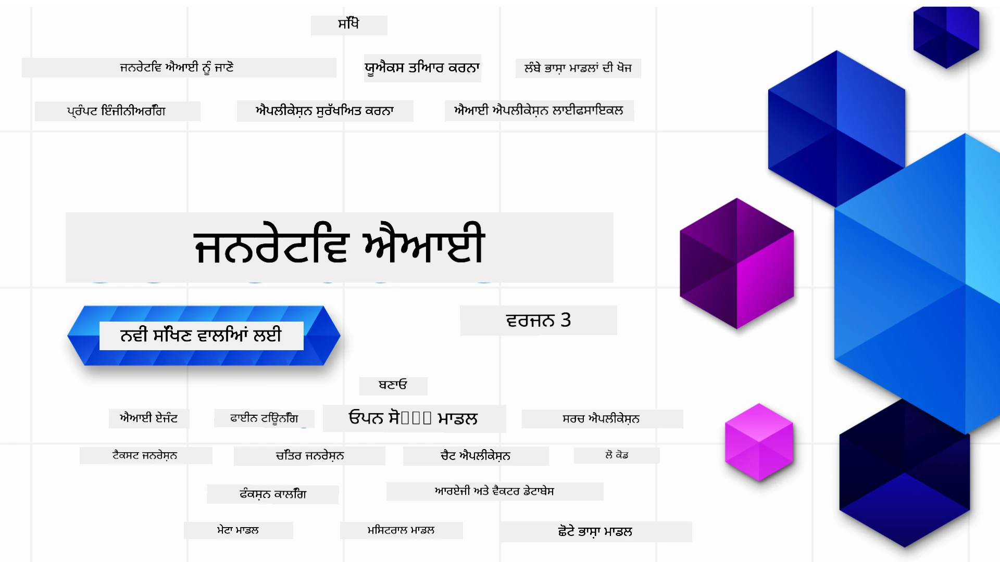

### 21 ਪਾਠ ਜੋ ਤੁਹਾਨੂੰ ਜੈਨਰੇਟਿਵ ਏਆਈ ਐਪਲੀਕੇਸ਼ਨ ਬਣਾਉਣ ਲਈ ਸਾਰੀਆਂ ਜ਼ਰੂਰੀ ਜਾਣਕਾਰੀਆਂ ਸਿਖਾਉਂਦੇ ਹਨ

[](https://github.com/microsoft/Generative-AI-For-Beginners/blob/master/LICENSE?WT.mc_id=academic-105485-koreyst)
[](https://GitHub.com/microsoft/Generative-AI-For-Beginners/graphs/contributors/?WT.mc_id=academic-105485-koreyst)
[](https://GitHub.com/microsoft/Generative-AI-For-Beginners/issues/?WT.mc_id=academic-105485-koreyst)
[](https://GitHub.com/microsoft/Generative-AI-For-Beginners/pulls/?WT.mc_id=academic-105485-koreyst)
[](http://makeapullrequest.com?WT.mc_id=academic-105485-koreyst)

[](https://GitHub.com/microsoft/Generative-AI-For-Beginners/watchers/?WT.mc_id=academic-105485-koreyst)
[](https://GitHub.com/microsoft/Generative-AI-For-Beginners/network/?WT.mc_id=academic-105485-koreyst)
[](https://GitHub.com/microsoft/Generative-AI-For-Beginners/stargazers/?WT.mc_id=academic-105485-koreyst)

[](https://discord.gg/nTYy5BXMWG)

### 🌐 ਬਹੁ-ਭਾਸ਼ਾਈ ਸਮਰਥਨ

#### GitHub ਐਕਸ਼ਨ ਰਾਹੀਂ ਸਮਰਥਿਤ (ਆਟੋਮੇਟਿਡ ਅਤੇ ਹਮੇਸ਼ਾ ਅੱਪ-ਟੂ-ਡੇਟ)

<!-- CO-OP TRANSLATOR LANGUAGES TABLE START -->
[Arabic](../ar/README.md) | [Bengali](../bn/README.md) | [Bulgarian](../bg/README.md) | [Burmese (Myanmar)](../my/README.md) | [Chinese (Simplified)](../zh-CN/README.md) | [Chinese (Traditional, Hong Kong)](../zh-HK/README.md) | [Chinese (Traditional, Macau)](../zh-MO/README.md) | [Chinese (Traditional, Taiwan)](../zh-TW/README.md) | [Croatian](../hr/README.md) | [Czech](../cs/README.md) | [Danish](../da/README.md) | [Dutch](../nl/README.md) | [Estonian](../et/README.md) | [Finnish](../fi/README.md) | [French](../fr/README.md) | [German](../de/README.md) | [Greek](../el/README.md) | [Hebrew](../he/README.md) | [Hindi](../hi/README.md) | [Hungarian](../hu/README.md) | [Indonesian](../id/README.md) | [Italian](../it/README.md) | [Japanese](../ja/README.md) | [Kannada](../kn/README.md) | [Korean](../ko/README.md) | [Lithuanian](../lt/README.md) | [Malay](../ms/README.md) | [Malayalam](../ml/README.md) | [Marathi](../mr/README.md) | [Nepali](../ne/README.md) | [Nigerian Pidgin](../pcm/README.md) | [Norwegian](../no/README.md) | [Persian (Farsi)](../fa/README.md) | [Polish](../pl/README.md) | [Portuguese (Brazil)](../pt-BR/README.md) | [Portuguese (Portugal)](../pt-PT/README.md) | [Punjabi (Gurmukhi)](./README.md) | [Romanian](../ro/README.md) | [Russian](../ru/README.md) | [Serbian (Cyrillic)](../sr/README.md) | [Slovak](../sk/README.md) | [Slovenian](../sl/README.md) | [Spanish](../es/README.md) | [Swahili](../sw/README.md) | [Swedish](../sv/README.md) | [Tagalog (Filipino)](../tl/README.md) | [Tamil](../ta/README.md) | [Telugu](../te/README.md) | [Thai](../th/README.md) | [Turkish](../tr/README.md) | [Ukrainian](../uk/README.md) | [Urdu](../ur/README.md) | [Vietnamese](../vi/README.md)

> **ਕੀ ਤੁਸੀਂ ਸਥਾਨਕ ਤੌਰ 'ਤੇ ਕਲੋਨ ਕਰਨਾ ਚਾਹੁੰਦੇ ਹੋ?**
>
> ਇਸ ਰਿਪੋਜ਼ਟਰੀ ਵਿੱਚ 50+ ਭਾਸ਼ਾਈ ਅਨੁਵਾਦ ਹਨ ਜੋ ਡਾਊਨਲੋਡ ਦਾ ਆਕਾਰ ਵਧਾਉਂਦੇ ਹਨ। ਅਨੁਵਾਦਾਂ ਨੂੰ ਬਿਨਾ ਕਲੋਨ ਕਰਨ ਲਈ ਸਪਰਸ ਚੈਕਆਓਟ ਵਰਤੋਂ:
>
> **Bash / macOS / Linux:**
> ```bash
> git clone --filter=blob:none --sparse https://github.com/microsoft/generative-ai-for-beginners.git
> cd generative-ai-for-beginners
> git sparse-checkout set --no-cone '/*' '!translations' '!translated_images'
> ```
>
> **CMD (Windows):**
> ```cmd
> git clone --filter=blob:none --sparse https://github.com/microsoft/generative-ai-for-beginners.git
> cd generative-ai-for-beginners
> git sparse-checkout set --no-cone "/*" "!translations" "!translated_images"
> ```
>
> ਇਹ ਤੁਹਾਨੂੰ ਕੋਰਸ ਪੂਰਾ ਕਰਨ ਲਈ ਸਭ ਕੁਝ ਤੇਜ਼ ਡਾਊਨਲੋਡ ਦੇ ਨਾਲ ਦਿੰਦਾ ਹੈ।
<!-- CO-OP TRANSLATOR LANGUAGES TABLE END -->

# Generative AI for Beginners (ਵਰਜ਼ਨ 3) - ਇੱਕ ਕੋਰਸ

Microsoft Cloud Advocates ਵੱਲੋਂ 21 ਪਾਠਾਂ ਵਾਲਾ ਵਿਸਤ੍ਰਤ ਕੋਰਸ ਜੋ ਤੁਹਾਨੂੰ ਜੈਨਰੇਟਿਵ ਏਆਈ ਐਪਲੀਕੇਸ਼ਨਾਂ ਬਨਾਉਣਾ ਸਿਖਾਉਂਦਾ ਹੈ।

## 🌱 ਸ਼ੁਰੂਆਤ ਕਿਵੇਂ ਕਰੀਏ

ਇਸ ਕੋਰਸ ਵਿੱਚ 21 ਪਾਠ ਹਨ। ਹਰ ਪਾਠ ਆਪਣੇ ਵਿਸ਼ੇ ਨੂੰ ਕਵਰ ਕਰਦਾ ਹੈ ਇਸ ਲਈ ਤੁਸੀਂ ਮਨਪਸੰਦ ਜਗ੍ਹਾ ਤੋਂ ਸ਼ੁਰੂ ਕਰ ਸਕਦੇ ਹੋ!

ਪਾਠਾਂ ਨੂੰ "ਸਿੱਖੋ" ਜਾਂ "ਬਨਾਓ" ਪਾਠਾਂ ਵਜੋਂ ਲੇਬਲ ਕੀਤਾ ਗਿਆ ਹੈ। "ਸਿੱਖੋ" ਪਾਠੇ ਜੈਨਰੇਟਿਵ ਏਆਈ ਦੇ ਸੰਕਲਪ ਸਮਝਾਊਂਦੇ ਹਨ ਅਤੇ "ਬਨਾਓ" ਪਾਠੇ ਸੰਕਲਪ ਅਤੇ ਕੋਡ ਉਦਾਹਰਣਾਂ ਦੋਵਾਂ—**Python** ਅਤੇ **TypeScript** ਵਿੱਚ—ਜਦੋਂ ਸੰਭਵ ਹੋਵੇ ਉਸ ਨੂੰ ਵਿਆਖਿਆ ਕਰਦੇ ਹਨ।

.NET ਡੈਵਲਪਰਾਂ ਲਈ ਵੇਖੋ [Generative AI for Beginners (.NET Edition)](https://github.com/microsoft/Generative-AI-for-beginners-dotnet?WT.mc_id=academic-105485-koreyst)!

ਹਰ ਪਾਠ ਵਿੱਚ "ਸਿੱਖਣਾ ਜਾਰੀ ਰੱਖੋ" ਭਾਗ ਵੀ ਹੁੰਦਾ ਹੈ ਜਿਸ ਵਿੱਚ ਹੋਰ ਸਿੱਖਣ ਵਾਲੇ ਸਾਧਨ ਸ਼ਾਮਿਲ ਹਨ।

## ਤੁਹਾਨੂੰ ਕੀ ਚਾਹੀਦਾ ਹੈ
### ਇਸ ਕੋਰਸ ਦਾ ਕੋਡ ਚਲਾਉਣ ਲਈ, ਤੁਸੀਂ ਇਨ੍ਹਾਂ ਵਿੱਚੋਂ ਕੋਈ ਇੱਕ ਵਰਤ ਸਕਦੇ ਹੋ: 
 - [Azure OpenAI Service](https://aka.ms/genai-beginners/azure-open-ai?WT.mc_id=academic-105485-koreyst) - **ਪਾਠ:** "aoai-assignment"
 - [GitHub Marketplace Model Catalog](https://aka.ms/genai-beginners/gh-models?WT.mc_id=academic-105485-koreyst) - **ਪਾਠ:** "githubmodels"
 - [OpenAI API](https://aka.ms/genai-beginners/open-ai?WT.mc_id=academic-105485-koreyst) - **ਪਾਠ:** "oai-assignment" 
   
- Python ਜਾਂ TypeScript ਦੀ ਬੁਨਿਆਦੀ ਜਾਣਕਾਰੀ ਮਦਦਗਾਰ ਹੈ - \*ਪੂਰਨ ਸ਼ੁਰੂਆਤੀ ਲਈ ਇਹਨਾਂ [Python](https://aka.ms/genai-beginners/python?WT.mc_id=academic-105485-koreyst) ਅਤੇ [TypeScript](https://aka.ms/genai-beginners/typescript?WT.mc_id=academic-105485-koreyst) ਕੋਰਸਾਂ ਨੂੰ ਦੇਖੋ
- ਇੱਕ GitHub ਖਾਤਾ ਜਿਸ ਨਾਲ ਤੁਸੀਂ [ਇਸ ਸਾਰੇ ਰਿਪੋ ਨੂੰ ਫੋਰਕ](https://aka.ms/genai-beginners/github?WT.mc_id=academic-105485-koreyst) ਕਰ ਸਕਦੇ ਹੋ

ਅਸੀਂ ਤੁਹਾਡੇ ਵਿਕਾਸੀ ਵਾਤਾਵਰਨ ਸੈੱਟਅਪ 'ਚ ਮਦਦ ਲਈ ਇੱਕ **[ਕੋਰਸ ਸੈਟਅਪ](./00-course-setup/README.md?WT.mc_id=academic-105485-koreyst)** ਪਾਠ ਬਣਾਇਆ ਹੈ।

ਇਸ ਰਿਪੋ ਨੂੰ ਆਸਾਨੀ ਨਾਲ ਭਵਿੱਖ ਵਿੱਚ ਲੱਭਣ ਲਈ [ਸਤਾਰ (🌟) ਕਰਨਾ ਨਾ ਭੁੱਲੋ](https://docs.github.com/en/get-started/exploring-projects-on-github/saving-repositories-with-stars?WT.mc_id=academic-105485-koreyst)।

## 🧠 ਤਿਆਰ ਹੋ ਜਾਓ ਡਿਪਲੋਇ ਕਰਨ ਲਈ?

ਜੇ ਤੁਸੀਂ ਹੋਰ ਅੱਗੇਦਰਜ਼ ਕੋਡ ਨਮੂਨੇ ਲੱਭ ਰਹੇ ਹੋ ਤਾਂ ਸਾਡੇ [ਜੈਨਰੇਟਿਵ ਏਆਈ ਕੋਡ ਨਮੂਨਿਆਂ ਦਾ ਸੰਗ੍ਰਹਿ](https://aka.ms/genai-beg-code?WT.mc_id=academic-105485-koreyst) ਨੂੰ ਵੇਖੋ ਜੋ ਦੋਵੇਂ **Python** ਅਤੇ **TypeScript** ਵਿੱਚ ਹੈ।

## 🗣️ ਹੋਰ ਸਿੱਖਣ ਵਾਲੇ ਜਾਂ ਸ਼ੁਰੂਆਤਕਾਰਾਂ ਨਾਲ ਮਿਲੋ, ਸਹਾਇਤਾ ਪ੍ਰਾਪਤ ਕਰੋ

ਇਸ ਕੋਰਸ ਵਿਚ ਸ਼ਾਮਿਲ ਹੋਣ ਵਾਲੇ ਹੋਰ ਸਿੱਖਣ ਵਾਲਿਆਂ ਨਾਲ ਮਿਲਣ ਅਤੇ ਸਮਰਥਨ ਲਈ ਸਾਡੇ [ਆਧਿਕਾਰਿਕ Azure AI Foundry Discord ਸਰਵਰ](https://aka.ms/genai-discord?WT.mc_id=academic-105485-koreyst) ਵਿੱਚ ਸ਼ਾਮਿਲ ਹੋਵੋ।

ਸਾਡੇ [Azure AI Foundry Developer Forum](https://aka.ms/azureaifoundry/forum) 'ਤੇ GitHub ਵਿੱਚ ਪ੍ਰਸ਼ਨ ਪੁੱਛੋ ਜਾਂ ਪ੍ਰੋਡਕਟ ਫੀਡਬੈਕ ਸਾਂਝਾ ਕਰੋ।

## 🚀 ਇੱਕ ਸਟਾਰਟਅਪ ਬਣਾ ਰਹੇ ਹੋ?

ਅੱਜ ਹੀ Azure ਕਰੈਡਿਟ ਨਾਲ ਸ਼ੁਰੂਆਤ ਕਰਨ ਲਈ [Microsoft for Startups](https://www.microsoft.com/startups) ਨੂੰ ਵੇਖੋ।

## 🙏 ਮਦਦ ਕਰਨੀ ਹੈ?

ਕੀ ਤੁਹਾਡੇ ਕੋਲ ਸੁਝਾਅ ਹਨ ਜਾਂ ਤੁਸੀਂ ਸ਼ਬਦਾਂ ਜਾਂ ਕੋਡ ਵਿੱਚ ਗਲਤੀਆਂ ਲੱਭੀਆਂ ਹਨ? [ਇਸ਼ੂ ਰਾਈਜ਼ ਕਰੋ](https://github.com/microsoft/generative-ai-for-beginners/issues?WT.mc_id=academic-105485-koreyst) ਜਾਂ [ਪੁਲ ਰਿਕਵੇਸਟ ਬਣਾਓ](https://github.com/microsoft/generative-ai-for-beginners/pulls?WT.mc_id=academic-105485-koreyst)

## 📂 ਹਰ ਪਾਠ ਵਿੱਚ ਸ਼ਾਮਿਲ ਹੈ:

- ਵਿਸ਼ੇ ਦਾ ਛੋਟਾ ਵੀਡੀਓ ਪਰਿਚਯ
- README ਵਿੱਚ ਲਿਖਿਆ ਗਿਆ ਪਾਠ
- Azure OpenAI ਅਤੇ OpenAI API ਦੋਹਾਂ ਦੇ ਸਮਰਥਨ ਵਾਲੇ Python ਅਤੇ TypeScript ਕੋਡ ਨਮੂਨੇ
- ਸਿੱਖਣਾ ਜਾਰੀ ਰੱਖਣ ਲਈ ਵਾਧੂ ਸਰੋਤਾਂ ਦੇ ਲਿੰਕ

## 🗃️ ਪਾਠ

| #   | **ਪਾਠ ਦਾ ਲਿੰਕ**                                                                                                                              | **ਵਰਣਨ**                                                                                       | **ਵੀਡੀਓ**                                                                   | **ਵਾਧੂ ਸਿੱਖਿਆ**                                                               |
| --- | -------------------------------------------------------------------------------------------------------------------------------------------- | ---------------------------------------------------------------------------------------------- | --------------------------------------------------------------------------- | ------------------------------------------------------------------------------ |
| 00  | [ਕੋਰਸ ਸੈਟਅਪ](./00-course-setup/README.md?WT.mc_id=academic-105485-koreyst)                                                                   | **ਸਿੱਖੋ:** ਆਪਣਾ ਵਿਕਾਸੀ ਵਾਤਾਵਰਨ ਕਿਵੇਂ ਸੈੱਟਅਪ ਕਰਨਾ ਹੈ                                         | ਵੀਡੀਓ ਜਲਦੀ ਆ ਰਿਹਾ ਹੈ                                                              | [ਹੋਰ ਸਿੱਖੋ](https://aka.ms/genai-collection?WT.mc_id=academic-105485-koreyst) |
| 01  | [ਜੈਨਰੇਟਿਵ ਏਆਈ ਅਤੇ LLMs ਦਾ ਪਰিচਯ](./01-introduction-to-genai/README.md?WT.mc_id=academic-105485-koreyst)                                  | **ਸਿੱਖੋ:** ਇਹ ਸਮਝਣਾ ਕਿ ਜੈਨਰੇਟਿਵ ਏਆਈ ਕੀ ਹੈ ਅਤੇ ਵੱਡੇ ਭਾਸ਼ਾਈ ਮਾਡਲ (LLMs) ਕਿਵੇਂ ਕੰਮ ਕਰਦੇ ਹਨ।    | [ਵੀਡੀਓ](https://aka.ms/gen-ai-lesson-1-gh?WT.mc_id=academic-105485-koreyst)    | [ਹੋਰ ਸਿੱਖੋ](https://aka.ms/genai-collection?WT.mc_id=academic-105485-koreyst) |
| 02  | [ਵੱਖ-ਵੱਖ LLMs ਦੀ ਖੋਜ ਅਤੇ ਤੁਲਨਾ](./02-exploring-and-comparing-different-llms/README.md?WT.mc_id=academic-105485-koreyst)                      | **ਸਿੱਖੋ:** ਆਪਣੇ ਵਰਤੋਂ ਮਾਮਲੇ ਲਈ ਸਹੀ ਮਾਡਲ ਕਿਵੇਂ ਚੁਣਨਾ ਹੈ                                        | [ਵੀਡੀਓ](https://aka.ms/gen-ai-lesson2-gh?WT.mc_id=academic-105485-koreyst)     | [ਹੋਰ ਸਿੱਖੋ](https://aka.ms/genai-collection?WT.mc_id=academic-105485-koreyst) |
| 03  | [ਜੈਨਰੇਟਿਵ ਏਆਈ ਨੂੰ ਜ਼ਿੰਮੇਵਾਰੀ ਨਾਲ ਵਰਤਣਾ](./03-using-generative-ai-responsibly/README.md?WT.mc_id=academic-105485-koreyst)                   | **ਸਿੱਖੋ:** ਜੈਨਰੇਟਿਵ ਏਆਈ ਐਪਲੀਕੇਸ਼ਨਾਂ ਨੂੰ ਜ਼ਿੰਮੇਵਾਰੀ ਨਾਲ ਕਿਵੇਂ ਬਣਾਉਣਾ                         | [ਵੀਡੀਓ](https://aka.ms/gen-ai-lesson3-gh?WT.mc_id=academic-105485-koreyst)     | [ਹੋਰ ਸਿੱਖੋ](https://aka.ms/genai-collection?WT.mc_id=academic-105485-koreyst) |
| 04  | [ਪ੍ਰਾਂਪਟ ਇੰਜੀਨੀਅਰਿੰਗ ਬੁਨਿਆਦੀਆਂ ਨੂੰ ਸਮਝਣਾ](./04-prompt-engineering-fundamentals/README.md?WT.mc_id=academic-105485-koreyst)             | **ਸਿੱਖੋ:** ਹੱਥੋਂ-ਹੱਥ ਪ੍ਰਾਂਪਟ ਇੰਜੀਨੀਅਰਿੰਗ ਦੀਆਂ ਸਭ ਤੋਂ ਵਧੀਆ ਪ੍ਰਥਾਵਾਂ                                           | [ਵੀਡੀਓ](https://aka.ms/gen-ai-lesson4-gh?WT.mc_id=academic-105485-koreyst)  | [ਵਧੇਰੇ ਜਾਣੋ](https://aka.ms/genai-collection?WT.mc_id=academic-105485-koreyst) |
| 05  | [ਉੱਨਤ ਪ੍ਰਾਂਪਟ ਬਣਾਉਣਾ](./05-advanced-prompts/README.md?WT.mc_id=academic-105485-koreyst)                                                | **ਸਿੱਖੋ:** ਉਹ ਕਿਵੇਂ ਪ੍ਰਾਂਪਟ ਇੰਜੀਨੀਅਰਿੰਗ ਤਕਨੀਕਾਂ ਨੂੰ ਲਾਗੂ ਕਰਨਾ ਜੋ ਤੁਹਾਡੇ ਪ੍ਰਾਂਪਟ ਦੇ ਨਤੀਜੇ ਨੂੰ ਸੁਧਾਰਦੀਆਂ ਹਨ। | [ਵੀਡੀਓ](https://aka.ms/gen-ai-lesson5-gh?WT.mc_id=academic-105485-koreyst)  | [ਵਧੇਰੇ ਜਾਣੋ](https://aka.ms/genai-collection?WT.mc_id=academic-105485-koreyst) |
| 06  | [ਪਾਠ ਸਿਰਜਣਾ ਐਪਲੀਕੇਸ਼ਨਾਂ ਬਣਾਉਣਾ](./06-text-generation-apps/README.md?WT.mc_id=academic-105485-koreyst)                                | **ਬਣਾਓ:** Azure OpenAI / OpenAI API ਦੀ ਵਰਤੋਂ ਕਰ ਕੇ ਇੱਕ ਪਾਠ ਸਿਰਜਣਾ ਐਪ                                  | [ਵੀਡੀਓ](https://aka.ms/gen-ai-lesson6-gh?WT.mc_id=academic-105485-koreyst)  | [ਵਧੇਰੇ ਜਾਣੋ](https://aka.ms/genai-collection?WT.mc_id=academic-105485-koreyst) |
| 07  | [ਚੈਟ ਐਪਲੀਕੇਸ਼ਨਾਂ ਬਣਾਉਣਾ](./07-building-chat-applications/README.md?WT.mc_id=academic-105485-koreyst)                                     | **ਬਣਾਓ:** ਚੈਟ ਐਪਲੀਕੇਸ਼ਨਾਂ ਨੂੰ ਪ੍ਰਭਾਵਸ਼ਾਲੀ ਢੰਗ ਨਾਲ ਬਣਾਉਣ ਅਤੇ ਜੋੜਨ ਲਈ ਤਕਨੀਕਾਂ।               | [ਵੀਡੀਓ](https://aka.ms/gen-ai-lessons7-gh?WT.mc_id=academic-105485-koreyst) | [ਵਧੇਰੇ ਜਾਣੋ](https://aka.ms/genai-collection?WT.mc_id=academic-105485-koreyst) |
| 08  | [ਖੋਜ ਐਪ ਵੈਕਟਰ ਡੇਟਾਬੇਸ ਬਣਾਉਣਾ](./08-building-search-applications/README.md?WT.mc_id=academic-105485-koreyst)                        | **ਬਣਾਓ:** ਇੱਕ ਖੋਜ ਐਪਲੀਕੇਸ਼ਨ ਜੋ ਡੇਟਾ ਲਈ ਖੋਜ ਕਰਨ ਲਈ ਐਮਬੈਡਿੰਗਜ਼ ਦੀ ਵਰਤੋਂ ਕਰਦਾ ਹੋਵੇ।                        | [ਵੀਡੀਓ](https://aka.ms/gen-ai-lesson8-gh?WT.mc_id=academic-105485-koreyst)  | [ਵਧੇਰੇ ਜਾਣੋ](https://aka.ms/genai-collection?WT.mc_id=academic-105485-koreyst) |
| 09  | [ਛবੀ ਸਿਰਜਣਾ ਐਪਲੀਕੇਸ਼ਨਾਂ ਬਣਾਉਣਾ](./09-building-image-applications/README.md?WT.mc_id=academic-105485-koreyst)                        | **ਬਣਾਓ:** ਇੱਕ ਛਬੀ ਸਿਰਜਣਾ ਐਪਲੀਕੇਸ਼ਨ                                                       | [ਵੀਡੀਓ](https://aka.ms/gen-ai-lesson9-gh?WT.mc_id=academic-105485-koreyst)  | [ਵਧੇਰੇ ਜਾਣੋ](https://aka.ms/genai-collection?WT.mc_id=academic-105485-koreyst) |
| 10  | [ਲੋ ਕੋਡ AI ਐਪਲੀਕੇਸ਼ਨਾਂ ਬਣਾਉਣਾ](./10-building-low-code-ai-applications/README.md?WT.mc_id=academic-105485-koreyst)                       | **ਬਣਾਓ:** ਲੋ ਕੋਡ ਸੰਦ ਦੀ ਵਰਤੋਂ ਕਰ ਕੇ ਇੱਕ ਜਨਰੇਟਿਵ AI ਐਪਲੀਕੇਸ਼ਨ                                     | [ਵੀਡੀਓ](https://aka.ms/gen-ai-lesson10-gh?WT.mc_id=academic-105485-koreyst) | [ਵਧੇਰੇ ਜਾਣੋ](https://aka.ms/genai-collection?WT.mc_id=academic-105485-koreyst) |
| 11  | [ਫੰਕਸ਼ਨ ਕਾਲਿੰਗ ਨਾਲ ਬਾਹਰੀ ਐਪਲੀਕੇਸ਼ਨਾਂ ਦੇ ਇੰਟਿਗ੍ਰੇਸ਼ਨ](./11-integrating-with-function-calling/README.md?WT.mc_id=academic-105485-koreyst) | **ਬਣਾਓ:** ਫੰਕਸ਼ਨ ਕਾਲਿੰਗ ਕੀ ਹੈ ਅਤੇ ਐਪਲੀਕੇਸ਼ਨਾਂ ਲਈ ਇਸਦੇ ਉਪਯੋਗ ਕੇਸ kihe han                          | [ਵੀਡੀਓ](https://aka.ms/gen-ai-lesson11-gh?WT.mc_id=academic-105485-koreyst) | [ਵਧੇਰੇ ਜਾਣੋ](https://aka.ms/genai-collection?WT.mc_id=academic-105485-koreyst) |
| 12  | [AI ਐਪਲੀਕੇਸ਼ਨਾਂ ਲਈ UX ਡਿਜ਼ਾਈਨ ਕਰਨਾ](./12-designing-ux-for-ai-applications/README.md?WT.mc_id=academic-105485-koreyst)                         | **ਸਿੱਖੋ:** ਜਨਰੇਟਿਵ AI ਐਪਲੀਕੇਸ਼ਨਾਂ ਨੂੰ ਵਿਕਸਤ ਕਰਦਿਆਂ UX ਡਿਜ਼ਾਈਨ ਸਿਧਾਂਤਾਂ ਨੂੰ ਕਿਵੇਂ ਲਾਗੂ ਕੀਤਾ ਜਾਵੇ         | [ਵੀਡੀਓ](https://aka.ms/gen-ai-lesson12-gh?WT.mc_id=academic-105485-koreyst) | [ਵਧੇਰੇ ਜਾਣੋ](https://aka.ms/genai-collection?WT.mc_id=academic-105485-koreyst) |
| 13  | [ਤੁਹਾਡੇ ਜਨਰੇਟਿਵ AI ਐਪਲੀਕੇਸ਼ਨਾਂ ਦੀ ਸੁਰੱਖਿਆ](./13-securing-ai-applications/README.md?WT.mc_id=academic-105485-koreyst)                         | **ਸਿੱਖੋ:** AI ਸਿਸਟਮਾਂ ਲਈ ਧਮਕੀਆਂ ਅਤੇ ਖਤਰੇ ਅਤੇ ਇਹਨਾਂ ਸਿਸਟਮਾਂ ਨੂੰ ਸੁਰੱਖਿਅਤ ਕਰਨ ਦੇ ਤਰੀਕੇ।             | [ਵੀਡੀਓ](https://aka.ms/gen-ai-lesson13-gh?WT.mc_id=academic-105485-koreyst) | [ਵਧੇਰੇ ਜਾਣੋ](https://aka.ms/genai-collection?WT.mc_id=academic-105485-koreyst) |
| 14  | [ਜਨਰੇਟਿਵ AI ਐਪਲੀਕੇਸ਼ਨ ਲਾਈਫਸਾਈਕਲ](./14-the-generative-ai-application-lifecycle/README.md?WT.mc_id=academic-105485-koreyst)           | **ਸਿੱਖੋ:** LLM ਲਾਈਫਸਾਈਕਲ ਅਤੇ LLMOps ਨੂੰ ਪ੍ਰਬੰਧਿਤ ਕਰਨ ਲਈ ਸੰਦ ਅਤੇ ਮੈਟਰਿਕਸ                         | [ਵੀਡੀਓ](https://aka.ms/gen-ai-lesson14-gh?WT.mc_id=academic-105485-koreyst) | [ਵਧੇਰੇ ਜਾਣੋ](https://aka.ms/genai-collection?WT.mc_id=academic-105485-koreyst) |
| 15  | [ਰਿਟਰੀਵਲ ਆਗਮੈਂਟਡ ਜਨਰੇਸ਼ਨ (RAG) ਅਤੇ ਵੈਕਟਰ ਡੇਟਾਬੇਸ](./15-rag-and-vector-databases/README.md?WT.mc_id=academic-105485-koreyst)        | **ਬਣਾਓ:** RAG ਫਰੇਮਵਰਕ ਦੀ ਵਰਤੋਂ ਕਰਦਿਆਂ ਵੈਕਟਰ ਡੇਟਾਬੇਸ ਤੋਂ ਐਮਬੈਡਿੰਗਜ਼ ਨੂੰ ਪ੍ਰਾਪਤ ਕਰਨ ਵਾਲੀ ਇੱਕ ਐਪਲੀਕੇਸ਼ਨ  | [ਵੀਡੀਓ](https://aka.ms/gen-ai-lesson15-gh?WT.mc_id=academic-105485-koreyst) | [ਵਧੇਰੇ ਜਾਣੋ](https://aka.ms/genai-collection?WT.mc_id=academic-105485-koreyst) |
| 16  | [ਖੁੱਲ੍ਹਾ ਸਰੋਤ ਮਾਡਲ ਅਤੇ Hugging Face](./16-open-source-models/README.md?WT.mc_id=academic-105485-koreyst)                                    | **ਬਣਾਓ:** Hugging Face 'ਤੇ ਉਪਲਬਧ ਖੁੱਲ੍ਹੇ ਸਰੋਤ ਮਾਡਲ ਦੀ ਵਰਤੋਂ ਕਰਦੀਆਂ ਐਪਲੀਕੇਸ਼ਨਾਂ                   | [ਵੀਡੀਓ](https://aka.ms/gen-ai-lesson16-gh?WT.mc_id=academic-105485-koreyst) | [ਵਧੇਰੇ ਜਾਣੋ](https://aka.ms/genai-collection?WT.mc_id=academic-105485-koreyst) |
| 17  | [AI ਏਜੰਟ](./17-ai-agents/README.md?WT.mc_id=academic-105485-koreyst)                                                                       | **ਬਣਾਓ:** AI ਏਜੰਟ ਫਰੇਮਵਰਕ ਦੀ ਵਰਤੋਂ ਕਰਦਿਆਂ ਇੱਕ ਐਪਲੀਕੇਸ਼ਨ                                           | [ਵੀਡੀਓ](https://aka.ms/gen-ai-lesson17-gh?WT.mc_id=academic-105485-koreyst) | [ਵਧੇਰੇ ਜਾਣੋ](https://aka.ms/genai-collection?WT.mc_id=academic-105485-koreyst) |
| 18  | [LLMਜ਼ ਦੀ ਫਾਈਨ-ਟਿਊਨਿੰਗ](./18-fine-tuning/README.md?WT.mc_id=academic-105485-koreyst)                                                              | **ਸਿੱਖੋ:** LLMਜ਼ ਦੀ ਫਾਈਨ-ਟਿਊਨਿੰਗ ਦਾ ਕੀ, ਕਿਉਂ ਅਤੇ ਕਿਵੇਂ                                           | [ਵੀਡੀਓ](https://aka.ms/gen-ai-lesson18-gh?WT.mc_id=academic-105485-koreyst) | [ਵਧੇਰੇ ਜਾਣੋ](https://aka.ms/genai-collection?WT.mc_id=academic-105485-koreyst) |
| 19  | [SLMਜ਼ ਨਾਲ ਬਣਾਉਣਾ](./19-slm/README.md?WT.mc_id=academic-105485-koreyst)                                                              | **ਸਿੱਖੋ:** ਛੋਟੇ ਭਾਸ਼ਾ ਮਾਡਲਾਂ ਨਾਲ ਬਣਾਉਣ ਦੇ ਫਾਇਦੇ                                            | ਵੀਡੀਓ ਜਲਦੀ ਆ ਰਿਹਾ ਹੈ | [ਵਧੇਰੇ ਜਾਣੋ](https://aka.ms/genai-collection?WT.mc_id=academic-105485-koreyst) |
| 20  | [Mistral ਮਾਡਲਾਂ ਨਾਲ ਬਣਾਉਣਾ](./20-mistral/README.md?WT.mc_id=academic-105485-koreyst)                                                              | **ਸਿੱਖੋ:** Mistral ਪਰਿਵਾਰ ਦੇ ਮਾਡਲਾਂ ਦੀ ਵਿਸ਼ੇਸ਼ਤਾਵਾਂ ਅਤੇ ਫਰਕ                                           | ਵੀਡੀਓ ਜਲਦੀ ਆ ਰਿਹਾ ਹੈ | [ਵਧੇਰੇ ਜਾਣੋ](https://aka.ms/genai-collection?WT.mc_id=academic-105485-koreyst) |
| 21  | [Meta ਮਾਡਲਾਂ ਨਾਲ ਬਣਾਉਣਾ](./21-meta/README.md?WT.mc_id=academic-105485-koreyst)                                                              | **ਸਿੱਖੋ:** Meta ਪਰਿਵਾਰ ਦੇ ਮਾਡਲਾਂ ਦੀ ਵਿਸ਼ੇਸ਼ਤਾਵਾਂ ਅਤੇ ਫਰਕ                                           | ਵੀਡੀਓ ਜਲਦੀ ਆ ਰਿਹਾ ਹੈ | [ਵਧੇਰੇ ਜਾਣੋ](https://aka.ms/genai-collection?WT.mc_id=academic-105485-koreyst) |

### 🌟 ਖ਼ਾਸ ਧੰਨਵਾਦ

ਸਾਰੇ GitHub ਕਾਰਵਾਈਆਂ ਅਤੇ ਵਰਕਫਲੋ ਬਣਾਉਣ ਲਈ [**ਜੌਨ ਅਜ਼ੀਜ਼**](https://www.linkedin.com/in/john0isaac/) ਦਾ ਖ਼ਾਸ ਧੰਨਵਾਦ।

[**ਬਰਨਹਾਰਡ ਮਰਕਲੇ**](https://www.linkedin.com/in/bernhard-merkle-738b73/) ਨੂੰ ਹਰ ਪਾਠ ਵਿੱਚ ਲਰਨਰ ਅਤੇ ਕੋਡ ਅਨੁਭਵ ਨੂੰ ਸੁਧਾਰਨ ਲਈ ਮਹੱਤਵਪੂਰਨ ਯੋਗਦਾਨ ਦੇਣ ਲਈ ਧੰਨਵਾਦ। 

## 🎒 ਹੋਰ ਕੋਰਸ

ਸਾਡੀ ਟੀਮ ਹੋਰ ਕੋਰਸ ਬਣਾਉਂਦੀ ਹੈ! ਦੇਖੋ:

<!-- CO-OP TRANSLATOR OTHER COURSES START -->
### LangChain
[](https://aka.ms/langchain4j-for-beginners)
[](https://aka.ms/langchainjs-for-beginners?WT.mc_id=m365-94501-dwahlin)
[](https://github.com/microsoft/langchain-for-beginners?WT.mc_id=m365-94501-dwahlin)
---

### Azure / Edge / MCP / Agents
[](https://github.com/microsoft/AZD-for-beginners?WT.mc_id=academic-105485-koreyst)
[](https://github.com/microsoft/edgeai-for-beginners?WT.mc_id=academic-105485-koreyst)
[](https://github.com/microsoft/mcp-for-beginners?WT.mc_id=academic-105485-koreyst)
[](https://github.com/microsoft/ai-agents-for-beginners?WT.mc_id=academic-105485-koreyst)

---
 
### ਜਨਰੇਟਿਵ AI ਸੀਰੀਜ਼
[](https://github.com/microsoft/generative-ai-for-beginners?WT.mc_id=academic-105485-koreyst)
[-9333EA?style=for-the-badge&labelColor=E5E7EB&color=9333EA)](https://github.com/microsoft/Generative-AI-for-beginners-dotnet?WT.mc_id=academic-105485-koreyst)
[-C084FC?style=for-the-badge&labelColor=E5E7EB&color=C084FC)](https://github.com/microsoft/generative-ai-for-beginners-java?WT.mc_id=academic-105485-koreyst)
[-E879F9?style=for-the-badge&labelColor=E5E7EB&color=E879F9)](https://github.com/microsoft/generative-ai-with-javascript?WT.mc_id=academic-105485-koreyst)

---
 
### ਮੁੱਖ ਸਿੱਖਿਆ
[](https://aka.ms/ml-beginners?WT.mc_id=academic-105485-koreyst)
[](https://aka.ms/datascience-beginners?WT.mc_id=academic-105485-koreyst)
[](https://aka.ms/ai-beginners?WT.mc_id=academic-105485-koreyst)
[](https://github.com/microsoft/Security-101?WT.mc_id=academic-96948-sayoung)
[](https://aka.ms/webdev-beginners?WT.mc_id=academic-105485-koreyst)
[](https://aka.ms/iot-beginners?WT.mc_id=academic-105485-koreyst)
[](https://github.com/microsoft/xr-development-for-beginners?WT.mc_id=academic-105485-koreyst)

---
 
### ਕੋ-ਪਾਇਲਟ ਸੀਰੀਜ਼
[](https://aka.ms/GitHubCopilotAI?WT.mc_id=academic-105485-koreyst)
[](https://github.com/microsoft/mastering-github-copilot-for-dotnet-csharp-developers?WT.mc_id=academic-105485-koreyst)
[](https://github.com/microsoft/CopilotAdventures?WT.mc_id=academic-105485-koreyst)
<!-- CO-OP TRANSLATOR OTHER COURSES END -->

## ਮਦਦ ਪ੍ਰਾਪਤ ਕਰੋ

ਜੇ ਤੁਸੀਂ ਫਸ ਜਾਂਦੇ ਹੋ ਜਾਂ AI ਐਪ ਬਣਾਉਣ ਬਾਰੇ ਕੋਈ ਸਵਾਲ ਹੈ, ਤਾਂ MCP ਬਾਰੇ ਵਿਚਾਰ-ਵਟਾਂਦਰੇ ਵਿੱਚ ਹੋਰ ਸਿੱਖਣ ਵਾਲਿਆਂ ਅਤੇ ਤਜਰਬੇਕਾਰ ਵਿਕਾਸਕਾਰਾਂ ਨਾਲ ਜੁੜੋ। ਇਹ ਇੱਕ ਸਹਿਯੋਗੀ ਸਮੁਦਾਇ ਹੈ ਜਿੱਥੇ ਸਵਾਲਾਂ ਦਾ ਸਵਾਗਤ ਹੈ ਅਤੇ ਗਿਆਨ ਆਜ਼ਾਦੀ ਨਾਲ ਸਾਂਝਾ ਕੀਤਾ ਜਾਂਦਾ ਹੈ।

[](https://discord.gg/nTYy5BXMWG)

ਜੇ ਤੁਹਾਡੇ ਕੋਲ ਉਤਪਾਦ ਫੀਡਬੈਕ ਜਾਂ ਗਲਤੀਆਂ ਹਨ ਤਾਂ ਬਨਾਉਂਦੇ ਸਮੇਂ ਵੇਖੋ:

[](https://aka.ms/foundry/forum)

---

<!-- CO-OP TRANSLATOR DISCLAIMER START -->
**ਅਸਵੀਕਾਰਤਾ**:  
ਇਹ ਦਸਤਾਵੇਜ਼ AI ਅਨੁਵਾਦ ਸੇਵਾ [Co-op Translator](https://github.com/Azure/co-op-translator) ਦੀ ਵਰਤੋਂ ਕਰਕੇ ਅਨੁਵਾਦ ਕੀਤਾ ਗਿਆ ਹੈ। ਜੇਕਰچہ ਅਸੀਂ ਸਹੀਤਾ ਲਈ ਯਤਨਸ਼ੀਲ ਹਾਂ, ਕਿਰਪਾ ਕਰਕੇ ਧਿਆਨ ਰੱਖੋ ਕਿ ਸਵਯੰਚਾਲਿਤ ਅਨੁਵਾਦਾਂ ਵਿੱਚ ਗਲਤੀਆਂ ਜਾਂ ਅਸਲ ਨੁਕਸਾਨ ਹੋ ਸਕਦੇ ਹਨ। ਮੂਲ ਦਸਤਾਵੇਜ਼ ਉਸਦੀ ਮੂਲ ਭਾਸ਼ਾ ਵਿੱਚ ਪ੍ਰਮਾਣਿਕ ਸਰੋਤ ਵਜੋਂ ਮੰਨਿਆ ਜਾਣਾ ਚਾਹੀਦਾ ਹੈ। ਸੰਵੇਦਨਸ਼ੀਲ ਜਾਣਕਾਰੀ ਲਈ ਪੇਸ਼ੇਵਰ ਮਨੁੱਖੀ ਅਨੁਵਾਦ ਦੀ ਸਿਫਾਰਿਸ਼ ਕੀਤੀ ਜਾਂਦੀ ਹੈ। ਇਸ ਅਨੁਵਾਦ ਦੀ ਵਰਤੋਂ ਦੇ ਕਾਰਨ ਹੋਣ ਵਾਲੀਆਂ ਕਿਸੇ ਵੀ ਗਲਤਫਹਮੀਆਂ ਜਾਂ ਭੁੱਲਾਂ ਲਈ ਅਸੀਂ ਜ਼ਿੰਮੇਵਾਰ ਨਹੀਂ ਹਾਂ।
<!-- CO-OP TRANSLATOR DISCLAIMER END -->