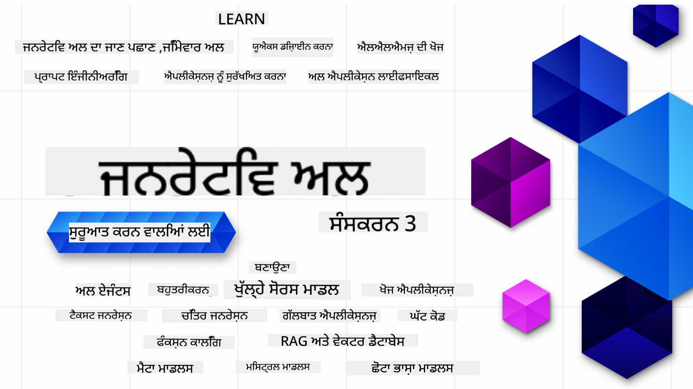

<!--
CO_OP_TRANSLATOR_METADATA:
{
  "original_hash": "c2ee25895ebbfa1a52868bb6eab686fc",
  "translation_date": "2025-05-19T11:39:13+00:00",
  "source_file": "README.md",
  "language_code": "pa"
}
-->

### 21 ਪਾਠ ਜੋ ਤੁਹਾਨੂੰ ਜਨਰੇਟਿਵ ਏਆਈ ਐਪਲੀਕੇਸ਼ਨ ਬਣਾਉਣ ਸ਼ੁਰੂ ਕਰਨ ਲਈ ਸਾਰਾ ਕੁਝ ਸਿਖਾਉਣਗੇ

### 🌐 ਬਹੁ-ਭਾਸ਼ਾ ਸਹਾਇਤਾ

#### GitHub ਕਾਰਵਾਈ ਰਾਹੀਂ ਸਹਾਇਕ (ਆਟੋਮੇਟਡ ਅਤੇ ਹਮੇਸ਼ਾ ਅਪ-ਟੂ-ਡੇਟ)
[ਫਰਾਂਸੀਸੀ](../fr/README.md) | [ਸਪੈਨਿਸ਼](../es/README.md) | [ਜਰਮਨ](../de/README.md) | [ਰੂਸੀ](../ru/README.md) | [ਅਰਬੀ](../ar/README.md) | [ਫ਼ਾਰਸੀ (ਪਾਰਸੀ)](../fa/README.md) | [ਉਰਦੂ](../ur/README.md) | [ਚੀਨੀ (ਸਰਲ)](../zh/README.md) | [ਚੀਨੀ (ਪ੍ਰੰਪਰਾਗਤ, ਮਕਾਉ)](../mo/README.md) | [ਚੀਨੀ (ਪ੍ਰੰਪਰਾਗਤ, ਹਾਂਗ ਕਾਂਗ)](../hk/README.md) | [ਚੀਨੀ (ਪ੍ਰੰਪਰਾਗਤ, ਤਾਇਵਾਨ)](../tw/README.md) | [ਜਾਪਾਨੀ](../ja/README.md) | [ਕੋਰੀਆਈ](../ko/README.md) | [ਹਿੰਦੀ](../hi/README.md) | [ਬੰਗਾਲੀ](../bn/README.md) | [ਮਰਾਠੀ](../mr/README.md) | [ਨੇਪਾਲੀ](../ne/README.md) | [ਪੰਜਾਬੀ (ਗੁਰਮੁਖੀ)](./README.md) | [ਪੁਰਤਗਾਲੀ (ਪੁਰਤਗਾਲ)](../pt/README.md) | [ਪੁਰਤਗਾਲੀ (ਬ੍ਰਾਜ਼ੀਲ)](../br/README.md) | [ਇਤਾਲਵੀ](../it/README.md) | [ਪੋਲੈਂਡ](../pl/README.md) | [ਤੁਰਕੀ](../tr/README.md) | [ਯੂਨਾਨੀ](../el/README.md) | [ਥਾਈ](../th/README.md) | [ਸਵੀਡਿਸ਼](../sv/README.md) | [ਡੈਨਿਸ਼](../da/README.md) | [ਨਾਰਵੇ](../no/README.md) | [ਫਿਨਲੈਂਡ](../fi/README.md) | [ਡੱਚ](../nl/README.md) | [ਹਿਬਰੂ](../he/README.md) | [ਵਿਆਤਨਾਮੀ](../vi/README.md) | [ਇੰਡੋਨੇਸ਼ੀਆਈ](../id/README.md) | [ਮਲੇ](../ms/README.md) | [ਟੈਗਾਲੋਗ (ਫਿਲੀਪੀਨੀ)](../tl/README.md) | [ਸਵਾਹਿਲੀ](../sw/README.md) | [ਹੰਗਰੀ](../hu/README.md) | [ਚੈਕ](../cs/README.md) | [ਸਲੋਵਾਕ](../sk/README.md) | [ਰੋਮਾਨੀ](../ro/README.md) | [ਬੁਲਗਾਰੀ](../bg/README.md) | [ਸਰਬੀਆਈ (ਸਿਰਿਲਿਕ)](../sr/README.md) | [ਕਰੋਏਸ਼ੀਆਈ](../hr/README.md) | [ਸਲੋਵੇਨੀਆਈ](../sl/README.md)
# ਸ਼ੁਰੂਆਤ ਕਰਨ ਵਾਲਿਆਂ ਲਈ ਜਨਰੇਟਿਵ AI (ਸੰਸਕਰਣ 3) - ਇੱਕ ਕੋਰਸ

ਮਾਈਕ੍ਰੋਸੌਫਟ ਕਲਾਉਡ ਐਡਵੋਕੇਟਸ ਦੁਆਰਾ ਦਿੱਤੇ ਗਏ 21 ਪਾਠਾਂ ਦੇ ਵਿਸਤ੍ਰਿਤ ਕੋਰਸ ਨਾਲ ਜਨਰੇਟਿਵ AI ਐਪਲੀਕੇਸ਼ਨ ਬਣਾਉਣ ਦੇ ਮੂਲ ਭਾਗ ਸਿੱਖੋ।

## 🌱 ਸ਼ੁਰੂਆਤ

ਇਸ ਕੋਰਸ ਵਿੱਚ 21 ਪਾਠ ਹਨ। ਹਰ ਪਾਠ ਆਪਣਾ ਵਿਸ਼ਾ ਕਵਰ ਕਰਦਾ ਹੈ, ਇਸ ਲਈ ਜਿੱਥੋਂ ਵੀ ਚਾਹੋ ਸ਼ੁਰੂ ਕਰੋ!

ਪਾਠਾਂ ਨੂੰ "ਸਿੱਖੋ" ਪਾਠਾਂ ਵਜੋਂ ਲੇਬਲ ਕੀਤਾ ਗਿਆ ਹੈ ਜੋ ਜਨਰੇਟਿਵ AI ਧਾਰਨਾ ਦੀ ਵਿਆਖਿਆ ਕਰਦੇ ਹਨ ਜਾਂ "ਬਿਲਡ" ਪਾਠਾਂ ਜੋ ਇੱਕ ਧਾਰਨਾ ਅਤੇ ਕੋਡ ਉਦਾਹਰਣਾਂ ਨੂੰ ਸਮਝਾਉਂਦੇ ਹਨ, ਜਦੋਂ ਸੰਭਵ ਹੋਵੇ **Python** ਅਤੇ **TypeScript** ਵਿੱਚ।

.NET ਡਿਵੈਲਪਰਾਂ ਲਈ [Generative AI for Beginners (.NET Edition)](https://github.com/microsoft/Generative-AI-for-beginners-dotnet?WT.mc_id=academic-105485-koreyst) ਵੇਖੋ!

ਹਰ ਪਾਠ ਵਿੱਚ ਵਾਧੂ ਸਿੱਖਣ ਦੇ ਸਾਧਨਾਂ ਨਾਲ "ਸਿੱਖਣ ਜਾਰੀ ਰੱਖੋ" ਸੈਕਸ਼ਨ ਵੀ ਸ਼ਾਮਲ ਹੈ।

## ਤੁਹਾਨੂੰ ਕੀ ਚਾਹੀਦਾ ਹੈ
### ਇਸ ਕੋਰਸ ਦੇ ਕੋਡ ਨੂੰ ਚਲਾਉਣ ਲਈ, ਤੁਸੀਂ ਹੇਠਾਂ ਦਿੱਤਿਆਂ ਵਿੱਚੋਂ ਕੋਈ ਵੀ ਵਰਤ ਸਕਦੇ ਹੋ:
- [Azure OpenAI Service](https://aka.ms/genai-beginners/azure-open-ai?WT.mc_id=academic-105485-koreyst) - **ਪਾਠ:** "aoai-assignment"
- [GitHub Marketplace Model Catalog](https://aka.ms/genai-beginners/gh-models?WT.mc_id=academic-105485-koreyst) - **ਪਾਠ:** "githubmodels"
- [OpenAI API](https://aka.ms/genai-beginners/open-ai?WT.mc_id=academic-105485-koreyst) - **ਪਾਠ:** "oai-assignment"

- Python ਜਾਂ TypeScript ਦੀ ਮੂਲ ਜਾਣਕਾਰੀ ਲਾਭਦਾਇਕ ਹੈ - \*ਬਿਲਕੁਲ ਸ਼ੁਰੂਆਤੀ ਵਿਅਕਤੀਆਂ ਲਈ ਇਹ [Python](https://aka.ms/genai-beginners/python?WT.mc_id=academic-105485-koreyst) ਅਤੇ [TypeScript](https://aka.ms/genai-beginners/typescript?WT.mc_id=academic-105485-koreyst) ਕੋਰਸ ਵੇਖੋ
- ਆਪਣੇ GitHub ਖਾਤੇ ਵਿੱਚ [ਇਸ ਪੂਰੇ ਰਿਪੋ ਨੂੰ ਫੋਰਕ](https://aka.ms/genai-beginners/github?WT.mc_id=academic-105485-koreyst) ਕਰਨ ਲਈ ਇੱਕ GitHub ਖਾਤਾ

ਅਸੀਂ ਤੁਹਾਡੇ ਵਿਕਾਸ ਦੇ ਵਾਤਾਵਰਣ ਨੂੰ ਸੈਟਅਪ ਕਰਨ ਵਿੱਚ ਸਹਾਇਤਾ ਕਰਨ ਲਈ **[ਕੋਰਸ ਸੈਟਅਪ](./00-course-setup/README.md?WT.mc_id=academic-105485-koreyst)** ਪਾਠ ਬਣਾਇਆ ਹੈ।

ਇਸ ਰਿਪੋ ਨੂੰ [ਸਟਾਰ (🌟) ਕਰੋ](https://docs.github.com/en/get-started/exploring-projects-on-github/saving-repositories-with-stars?WT.mc_id=academic-105485-koreyst) ਤਾਂ ਕਿ ਇਸਨੂੰ ਬਾਅਦ ਵਿੱਚ ਆਸਾਨੀ ਨਾਲ ਲੱਭ ਸਕੋ।

## 🧠 ਡਿਪਲੌਇ ਕਰਨ ਲਈ ਤਿਆਰ?

ਜੇ ਤੁਸੀਂ ਹੋਰ ਉੱਚ-ਸਤਰ ਦੇ ਕੋਡ ਉਦਾਹਰਣਾਂ ਦੀ ਖੋਜ ਕਰ ਰਹੇ ਹੋ, ਤਾਂ **Python** ਅਤੇ **TypeScript** ਵਿੱਚ [Generative AI Code Samples](https://aka.ms/genai-beg-code?WT.mc_id=academic-105485-koreyst) ਦਾ ਸੰਗ੍ਰਹਿ ਵੇਖੋ।

## 🗣️ ਹੋਰ ਸਿੱਖਣ ਵਾਲਿਆਂ ਨੂੰ ਮਿਲੋ, ਸਹਾਇਤਾ ਪ੍ਰਾਪਤ ਕਰੋ

ਇਸ ਕੋਰਸ ਨੂੰ ਲੈ ਰਹੇ ਹੋਰ ਸਿੱਖਣ ਵਾਲਿਆਂ ਨਾਲ ਮਿਲਣ ਅਤੇ ਨੈੱਟਵਰਕ ਕਰਨ ਲਈ ਸਾਡੇ [ਅਧਿਕਾਰਕ Azure AI Foundry Discord ਸਰਵਰ](https://aka.ms/genai-discord?WT.mc_id=academic-105485-koreyst) ਵਿੱਚ ਸ਼ਾਮਲ ਹੋਵੋ ਅਤੇ ਸਹਾਇਤਾ ਪ੍ਰਾਪਤ ਕਰੋ।

ਸਵਾਲ ਪੁੱਛੋ ਜਾਂ GitHub 'ਤੇ ਸਾਡੇ [Azure AI Foundry Developer Forum](https://aka.ms/azureaifoundry/forum) ਵਿੱਚ ਉਤਪਾਦ ਫੀਡਬੈਕ ਸਾਂਝਾ ਕਰੋ।

## 🚀 ਸਟਾਰਟਅਪ ਬਣਾਉਣ?

**ਮੁਫ਼ਤ OpenAI ਕ੍ਰੈਡਿਟਸ** ਪ੍ਰਾਪਤ ਕਰਨ ਅਤੇ **Azure OpenAI Services ਦੁਆਰਾ OpenAI ਮਾਡਲਾਂ ਤੱਕ ਪਹੁੰਚ ਲਈ Azure ਕ੍ਰੈਡਿਟਸ ਵੱਲ $150k ਤੱਕ** ਪ੍ਰਾਪਤ ਕਰਨ ਲਈ [Microsoft for Startups Founders Hub](https://aka.ms/genai-foundershub?WT.mc_id=academic-105485-koreyst) ਵਿੱਚ ਸਾਈਨ ਅੱਪ ਕਰੋ।

## 🙏 ਸਹਾਇਤਾ ਕਰਨਾ ਚਾਹੁੰਦੇ ਹੋ?

ਕੀ ਤੁਹਾਡੇ ਕੋਲ ਸੁਝਾਵ ਹਨ ਜਾਂ ਤੁਸੀਂ ਜਰੂਰੀ ਜਾਂ ਕੋਡ ਗਲਤੀਆਂ ਲੱਭੀਆਂ ਹਨ? [ਇੱਕ ਮਸਲਾ ਉਤਪਨ ਕਰੋ](https://github.com/microsoft/generative-ai-for-beginners/issues?WT.mc_id=academic-105485-koreyst) ਜਾਂ [ਇੱਕ ਪੂਲ ਰਿਕਵੇਸਟ ਬਣਾਓ](https://github.com/microsoft/generative-ai-for-beginners/pulls?WT.mc_id=academic-105485-koreyst)

## 📂 ਹਰ ਪਾਠ ਵਿੱਚ ਸ਼ਾਮਲ ਹੈ:

- ਵਿਸ਼ੇ ਦਾ ਇੱਕ ਛੋਟਾ ਵੀਡੀਓ ਪਰਚਾਰ
- README ਵਿੱਚ ਸਥਿਤ ਇੱਕ ਲਿਖਤ ਪਾਠ
- Azure OpenAI ਅਤੇ OpenAI API ਨੂੰ ਸਹਾਇਕ Python ਅਤੇ TypeScript ਕੋਡ ਉਦਾਹਰਣਾਂ
- ਤੁਹਾਡੀ ਸਿੱਖਣ ਜਾਰੀ ਰੱਖਣ ਲਈ ਵਾਧੂ ਸਰੋਤਾਂ ਦੇ ਲਿੰਕ

## 🗃️ ਪਾਠ

| #   | **ਪਾਠ ਲਿੰਕ**                                                                                                                              | **ਵੇਰਵਾ**                                                                                 | **ਵੀਡੀਓ**                                                                   | **ਵਾਧੂ ਸਿੱਖਣ**                                                             |
| --- | -------------------------------------------------------------------------------------------------------------------------------------------- | ----------------------------------------------------------------------------------------------- | --------------------------------------------------------------------------- | ------------------------------------------------------------------------------ |
| 00  | [ਕੋਰਸ ਸੈਟਅਪ](./00-course-setup/README.md?WT.mc_id=academic-105485-koreyst)                                                                 | **ਸਿੱਖੋ:** ਤੁਹਾਡਾ ਵਿਕਾਸ ਵਾਤਾਵਰਣ ਕਿਵੇਂ ਸੈਟਅਪ ਕਰਨਾ ਹੈ                                            | ਵੀਡੀਓ ਜਲਦੀ ਆ ਰਿਹਾ ਹੈ                                                                 | [ਹੋਰ ਸਿੱਖੋ](https://aka.ms/genai-collection?WT.mc_id=academic-105485-koreyst) |
| 01  | [ਜਨਰੇਟਿਵ AI ਅਤੇ LLMs ਵਿੱਚ ਪਰਚੇ](./01-introduction-to-genai/README.md?WT.mc_id=academic-105485-koreyst)                              | **ਸਿੱਖੋ:** ਜਨਰੇਟਿਵ AI ਕੀ ਹੈ ਅਤੇ ਵੱਡੇ ਭਾਸ਼ਾ ਮਾਡਲ (LLMs) ਕਿਵੇਂ ਕੰਮ ਕਰਦੇ ਹਨ।       | [ਵੀਡੀਓ](https://aka.ms/gen-ai-lesson-1-gh?WT.mc_id=academic-105485-koreyst) | [ਹੋਰ ਸਿੱਖੋ](https://aka.ms/genai-collection?WT.mc_id=academic-105485-koreyst) |
| 02  | [ਵੱਖ-ਵੱਖ LLMs ਦੀ ਪੜਤਾਲ ਅਤੇ ਤੁਲਨਾ](./02-exploring-and-comparing-different-llms/README.md?WT.mc_id=academic-105485-koreyst)             | **ਸਿੱਖੋ:** ਤੁਹਾਡੇ ਵਰਤੋਂ ਕੇਸ ਲਈ ਸਹੀ ਮਾਡਲ ਕਿਵੇਂ ਚੁਣਨਾ ਹੈ                                      | [ਵੀਡੀਓ](https://aka.ms/gen-ai-lesson2-gh?WT.mc_id=academic-105485-koreyst)  | [ਹੋਰ ਸਿੱਖੋ](https://aka.ms/genai-collection?WT.mc_id=academic-105485-koreyst) |
| 03  | [ਜਨਰੇਟਿਵ AI ਦੀ ਜਿੰਮੇਵਾਰੀ ਨਾਲ ਵਰਤੋਂ](./03-using-generative-ai-responsibly/README.md?WT.mc_id=academic-105485-koreyst)                           | **ਸਿੱਖੋ:** ਜਿੰਮੇਵਾਰੀ ਨਾਲ ਜਨਰੇਟਿਵ AI ਐਪਲੀਕੇਸ਼ਨ ਕਿਵੇਂ ਬਣਾਉਣਾ                                  | [ਵੀਡੀਓ](https://aka.ms/gen-ai-lesson3-gh?WT.mc_id=academic-105485-koreyst)  | [ਹੋਰ ਸਿੱਖੋ](https://aka.ms/genai-collection?WT.mc_id=academic-105485-koreyst) |
| 04  | [ਪ੍ਰਾਮਪਟ ਇੰਜੀਨੀਅਰਿੰਗ ਦੇ ਮੂਲ ਭਾਗ](./04-prompt-engineering-fundamentals/README.md?WT.mc_id=academic-105485-koreyst)             | **ਸਿੱਖੋ:** ਪ੍ਰੈਕਟਿਕਲ ਪ੍ਰਾਮਪਟ ਇੰਜੀਨੀਅਰਿੰਗ ਦੇ ਸਰਵੋਤਮ ਅਭਿਆਸ                                           | [ਵੀਡੀਓ](https://aka.ms/gen-ai-lesson4-gh?WT.mc_id=academic-105485-koreyst)  | [ਹੋਰ ਸਿੱਖੋ](https://aka.ms/genai-collection?WT.mc_id=academic-105485-koreyst) |
| 05  | [ਉੱਚ ਪੱਧਰੀ ਪ੍ਰੰਪਟ ਬਣਾਉਣਾ](./05-advanced-prompts/README.md?WT.mc_id=academic-105485-koreyst)                                                | **ਸਿੱਖੋ:** ਪ੍ਰੰਪਟ ਇੰਜੀਨੀਅਰਿੰਗ ਤਕਨੀਕਾਂ ਨੂੰ ਕਿਵੇਂ ਲਾਗੂ ਕਰਨਾ ਹੈ ਜੋ ਤੁਹਾਡੇ ਪ੍ਰੰਪਟ ਦੇ ਨਤੀਜੇ ਨੂੰ ਬਿਹਤਰ ਬਣਾਉਂਦੀਆਂ ਹਨ। | [ਵੀਡੀਓ](https://aka.ms/gen-ai-lesson5-gh?WT.mc_id=academic-105485-koreyst)  | [ਹੋਰ ਸਿੱਖੋ](https://aka.ms/genai-collection?WT.mc_id=academic-105485-koreyst) |
| 06  | [ਟੈਕਸਟ ਜਨਰੇਸ਼ਨ ਐਪਲੀਕੇਸ਼ਨ ਬਣਾਉਣਾ](./06-text-generation-apps/README.md?WT.mc_id=academic-105485-koreyst)                                | **ਬਣਾਓ:** Azure OpenAI / OpenAI API ਦੀ ਵਰਤੋਂ ਕਰਕੇ ਟੈਕਸਟ ਜਨਰੇਸ਼ਨ ਐਪ                                | [ਵੀਡੀਓ](https://aka.ms/gen-ai-lesson6-gh?WT.mc_id=academic-105485-koreyst)  | [ਹੋਰ ਸਿੱਖੋ](https://aka.ms/genai-collection?WT.mc_id=academic-105485-koreyst) |
| 07  | [ਚੈਟ ਐਪਲੀਕੇਸ਼ਨ ਬਣਾਉਣਾ](./07-building-chat-applications/README.md?WT.mc_id=academic-105485-koreyst)                                     | **ਬਣਾਓ:** ਚੈਟ ਐਪਲੀਕੇਸ਼ਨ ਨੂੰ ਕੁਸ਼ਲਤਾਪੂਰਵਕ ਬਣਾਉਣ ਅਤੇ ਇਕੱਠਾ ਕਰਨ ਦੀਆਂ ਤਕਨੀਕਾਂ।               | [ਵੀਡੀਓ](https://aka.ms/gen-ai-lessons7-gh?WT.mc_id=academic-105485-koreyst) | [ਹੋਰ ਸਿੱਖੋ](https://aka.ms/genai-collection?WT.mc_id=academic-105485-koreyst) |
| 08  | [ਸਰਚ ਐਪਸ ਵੇਕਟਰ ਡਾਟਾਬੇਸ ਬਣਾਉਣਾ](./08-building-search-applications/README.md?WT.mc_id=academic-105485-koreyst)                        | **ਬਣਾਓ:** ਇੱਕ ਖੋਜ ਐਪਲੀਕੇਸ਼ਨ ਜੋ ਡਾਟਾ ਦੀ ਖੋਜ ਲਈ ਐਮਬੈਡਿੰਗ ਦੀ ਵਰਤੋਂ ਕਰਦਾ ਹੈ।                        | [ਵੀਡੀਓ](https://aka.ms/gen-ai-lesson8-gh?WT.mc_id=academic-105485-koreyst)  | [ਹੋਰ ਸਿੱਖੋ](https://aka.ms/genai-collection?WT.mc_id=academic-105485-koreyst) |
| 09  | [ਚਿੱਤਰ ਜਨਰੇਸ਼ਨ ਐਪਲੀਕੇਸ਼ਨ ਬਣਾਉਣਾ](./09-building-image-applications/README.md?WT.mc_id=academic-105485-koreyst)                        | **ਬਣਾਓ:** ਇੱਕ ਚਿੱਤਰ ਜਨਰੇਸ਼ਨ ਐਪਲੀਕੇਸ਼ਨ                                                       | [ਵੀਡੀਓ](https://aka.ms/gen-ai-lesson9-gh?WT.mc_id=academic-105485-koreyst)  | [ਹੋਰ ਸਿੱਖੋ](https://aka.ms/genai-collection?WT.mc_id=academic-105485-koreyst) |
| 10  | [ਲੋ ਕੋਡ AI ਐਪਲੀਕੇਸ਼ਨ ਬਣਾਉਣਾ](./10-building-low-code-ai-applications/README.md?WT.mc_id=academic-105485-koreyst)                       | **ਬਣਾਓ:** ਲੋ ਕੋਡ ਟੂਲ ਦੀ ਵਰਤੋਂ ਕਰਕੇ ਜਨਰੇਟਿਵ AI ਐਪਲੀਕੇਸ਼ਨ                                     | [ਵੀਡੀਓ](https://aka.ms/gen-ai-lesson10-gh?WT.mc_id=academic-105485-koreyst) | [ਹੋਰ ਸਿੱਖੋ](https://aka.ms/genai-collection?WT.mc_id=academic-105485-koreyst) |
| 11  | [ਫੰਕਸ਼ਨ ਕਾਲਿੰਗ ਨਾਲ ਬਾਹਰੀ ਐਪਲੀਕੇਸ਼ਨ ਇਕੱਠਾ ਕਰਨਾ](./11-integrating-with-function-calling/README.md?WT.mc_id=academic-105485-koreyst) | **ਬਣਾਓ:** ਫੰਕਸ਼ਨ ਕਾਲਿੰਗ ਕੀ ਹੈ ਅਤੇ ਐਪਲੀਕੇਸ਼ਨ ਲਈ ਇਸ ਦੇ ਵਰਤੋਂ ਦੇ ਕੇਸ                          | [ਵੀਡੀਓ](https://aka.ms/gen-ai-lesson11-gh?WT.mc_id=academic-105485-koreyst) | [ਹੋਰ ਸਿੱਖੋ](https://aka.ms/genai-collection?WT.mc_id=academic-105485-koreyst) |
| 12  | [AI ਐਪਲੀਕੇਸ਼ਨ ਲਈ UX ਡਿਜ਼ਾਇਨ ਕਰਨਾ](./12-designing-ux-for-ai-applications/README.md?WT.mc_id=academic-105485-koreyst)                         | **ਸਿੱਖੋ:** ਜਨਰੇਟਿਵ AI ਐਪਲੀਕੇਸ਼ਨ ਵਿਕਸਿਤ ਕਰਦੇ ਸਮੇਂ UX ਡਿਜ਼ਾਇਨ ਸਿਧਾਂਤਾਂ ਨੂੰ ਕਿਵੇਂ ਲਾਗੂ ਕਰਨਾ ਹੈ         | [ਵੀਡੀਓ](https://aka.ms/gen-ai-lesson12-gh?WT.mc_id=academic-105485-koreyst) | [ਹੋਰ ਸਿੱਖੋ](https://aka.ms/genai-collection?WT.mc_id=academic-105485-koreyst) |
| 13  | [ਤੁਹਾਡੇ ਜਨਰੇਟਿਵ AI ਐਪਲੀਕੇਸ਼ਨ ਨੂੰ ਸੁਰੱਖਿਅਤ ਕਰਨਾ](./13-securing-ai-applications/README.md?WT.mc_id=academic-105485-koreyst)                         | **ਸਿੱਖੋ:** AI ਸਿਸਟਮ ਲਈ ਖਤਰੇ ਅਤੇ ਜੋਖਮ ਅਤੇ ਇਨ੍ਹਾਂ ਸਿਸਟਮਾਂ ਨੂੰ ਸੁਰੱਖਿਅਤ ਕਰਨ ਦੇ ਤਰੀਕੇ।             | [ਵੀਡੀਓ](https://aka.ms/gen-ai-lesson13-gh?WT.mc_id=academic-105485-koreyst) | [ਹੋਰ ਸਿੱਖੋ](https://aka.ms/genai-collection?WT.mc_id=academic-105485-koreyst) |
| 14  | [ਜਨਰੇਟਿਵ AI ਐਪਲੀਕੇਸ਼ਨ ਲਾਈਫਸਾਈਕਲ](./14-the-generative-ai-application-lifecycle/README.md?WT.mc_id=academic-105485-koreyst)           | **ਸਿੱਖੋ:** LLM ਲਾਈਫਸਾਈਕਲ ਅਤੇ LLMOps ਨੂੰ ਪ੍ਰਬੰਧਿਤ ਕਰਨ ਲਈ ਟੂਲ ਅਤੇ ਮੈਟ੍ਰਿਕਸ                         | [ਵੀਡੀਓ](https://aka.ms/gen-ai-lesson14-gh?WT.mc_id=academic-105485-koreyst) | [ਹੋਰ ਸਿੱਖੋ](https://aka.ms/genai-collection?WT.mc_id=academic-105485-koreyst) |
| 15  | [ਰਿਟ੍ਰੀਵਲ ਆਗਮੈਂਟਡ ਜਨਰੇਸ਼ਨ (RAG) ਅਤੇ ਵੈਕਟਰ ਡੇਟਾਬੇਸ](./15-rag-and-vector-databases/README.md?WT.mc_id=academic-105485-koreyst)        | **ਬਿਲਡ:** ਇੱਕ ਐਪਲੀਕੇਸ਼ਨ ਜੋ RAG ਫਰੇਮਵਰਕ ਦੀ ਵਰਤੋਂ ਕਰਕੇ ਵੈਕਟਰ ਡੇਟਾਬੇਸ ਤੋਂ ਐਮਬੈਡਿੰਗਸ ਨੂੰ ਰਿਟ੍ਰੀਵ ਕਰਦਾ ਹੈ  | [ਵੀਡੀਓ](https://aka.ms/gen-ai-lesson15-gh?WT.mc_id=academic-105485-koreyst) | [ਹੋਰ ਜਾਣੋ](https://aka.ms/genai-collection?WT.mc_id=academic-105485-koreyst) |
| 16  | [ਖੁੱਲ੍ਹੇ ਸਰੋਤ ਮਾਡਲ ਅਤੇ ਹੱਗਿੰਗ ਫੇਸ](./16-open-source-models/README.md?WT.mc_id=academic-105485-koreyst)                                    | **ਬਿਲਡ:** ਹੱਗਿੰਗ ਫੇਸ 'ਤੇ ਉਪਲਬਧ ਖੁੱਲ੍ਹੇ ਸਰੋਤ ਮਾਡਲਾਂ ਦੀ ਵਰਤੋਂ ਕਰਕੇ ਇੱਕ ਐਪਲੀਕੇਸ਼ਨ ਬਣਾਉ  | [ਵੀਡੀਓ](https://aka.ms/gen-ai-lesson16-gh?WT.mc_id=academic-105485-koreyst) | [ਹੋਰ ਜਾਣੋ](https://aka.ms/genai-collection?WT.mc_id=academic-105485-koreyst) |
| 17  | [AI ਏਜੰਟ](./17-ai-agents/README.md?WT.mc_id=academic-105485-koreyst)                                                                       | **ਬਿਲਡ:** ਇੱਕ ਐਪਲੀਕੇਸ਼ਨ ਜੋ AI ਏਜੰਟ ਫਰੇਮਵਰਕ ਦੀ ਵਰਤੋਂ ਕਰਦਾ ਹੈ                                           | [ਵੀਡੀਓ](https://aka.ms/gen-ai-lesson17-gh?WT.mc_id=academic-105485-koreyst) | [ਹੋਰ ਜਾਣੋ](https://aka.ms/genai-collection?WT.mc_id=academic-105485-koreyst) |
| 18  | [LLMs ਦਾ ਫਾਈਨ-ਟਿਊਨਿੰਗ](./18-fine-tuning/README.md?WT.mc_id=academic-105485-koreyst)                                                              | **ਸਿੱਖੋ:** LLMs ਦੇ ਫਾਈਨ-ਟਿਊਨਿੰਗ ਦਾ ਕੀ, ਕਿਉਂ ਅਤੇ ਕਿਵੇਂ                                            | [ਵੀਡੀਓ](https://aka.ms/gen-ai-lesson18-gh?WT.mc_id=academic-105485-koreyst) | [ਹੋਰ ਜਾਣੋ](https://aka.ms/genai-collection?WT.mc_id=academic-105485-koreyst) |
| 19  | [SLMs ਨਾਲ ਬਣਾਉਣ](./19-slm/README.md?WT.mc_id=academic-105485-koreyst)                                                              | **ਸਿੱਖੋ:** ਛੋਟੇ ਭਾਸ਼ਾ ਮਾਡਲਾਂ ਨਾਲ ਬਣਾਉਣ ਦੇ ਫਾਇਦੇ                                            | ਵੀਡੀਓ ਜਲਦੀ ਆ ਰਹੀ ਹੈ | [ਹੋਰ ਜਾਣੋ](https://aka.ms/genai-collection?WT.mc_id=academic-105485-koreyst) |
| 20  | [ਮਿਸਟਰਲ ਮਾਡਲਾਂ ਨਾਲ ਬਣਾਉਣ](./20-mistral/README.md?WT.mc_id=academic-105485-koreyst)                                                              | **ਸਿੱਖੋ:** ਮਿਸਟਰਲ ਪਰਿਵਾਰ ਦੇ ਮਾਡਲਾਂ ਦੀਆਂ ਵਿਸ਼ੇਸ਼ਤਾਵਾਂ ਅਤੇ ਅੰਤਰ                                           | ਵੀਡੀਓ ਜਲਦੀ ਆ ਰਹੀ ਹੈ | [ਹੋਰ ਜਾਣੋ](https://aka.ms/genai-collection?WT.mc_id=academic-105485-koreyst) |
| 21  | [ਮੈਟਾ ਮਾਡਲਾਂ ਨਾਲ ਬਣਾਉਣ](./21-meta/README.md?WT.mc_id=academic-105485-koreyst)                                                              | **ਸਿੱਖੋ:** ਮੈਟਾ ਪਰਿਵਾਰ ਦੇ ਮਾਡਲਾਂ ਦੀਆਂ ਵਿਸ਼ੇਸ਼ਤਾਵਾਂ ਅਤੇ ਅੰਤਰ                                           | ਵੀਡੀਓ ਜਲਦੀ ਆ ਰਹੀ ਹੈ | [ਹੋਰ ਜਾਣੋ](https://aka.ms/genai-collection?WT.mc_id=academic-105485-koreyst) |

### 🌟 ਵਿਸ਼ੇਸ਼ ਧੰਨਵਾਦ

[**ਜੌਨ ਅਜ਼ੀਜ਼**](https://www.linkedin.com/in/john0isaac/) ਨੂੰ ਸਾਰੇ GitHub ਕਾਰਵਾਈਆਂ ਅਤੇ ਵਰਕਫਲੋਜ਼ ਬਣਾਉਣ ਲਈ ਵਿਸ਼ੇਸ਼ ਧੰਨਵਾਦ

[**ਬਰਨਹਾਰਡ ਮਰਕਲ**](https://www.linkedin.com/in/bernhard-merkle-738b73/) ਨੂੰ ਪ੍ਰਤੀਕ ਲੈਸਨ ਵਿੱਚ ਸਿਖਿਆਰਥੀ ਅਤੇ ਕੋਡ ਅਨੁਭਵ ਨੂੰ ਸੁਧਾਰਣ ਲਈ ਮਹੱਤਵਪੂਰਨ ਯੋਗਦਾਨ ਪਾਉਣ ਲਈ ਧੰਨਵਾਦ।

## 🎒 ਹੋਰ ਕੋਰਸ

ਸਾਡੀ ਟੀਮ ਹੋਰ ਕੋਰਸ ਤਿਆਰ ਕਰਦੀ ਹੈ! ਜाँच ਕਰੋ:

- [**ਨਵਾਂ** ਬਿਗਿਨਰਜ਼ ਲਈ AI ਏਜੰਟ](https://github.com/microsoft/ai-agents-for-beginners?WT.mc_id=academic-105485-koreyst)
- [**ਨਵਾਂ** .NET ਦੀ ਵਰਤੋਂ ਕਰਕੇ ਬਿਗਿਨਰਜ਼ ਲਈ ਜਨਰੇਟਿਵ AI](https://github.com/microsoft/Generative-AI-for-beginners-dotnet?WT.mc_id=academic-105485-koreyst)
- [**ਨਵਾਂ** ਜਾਵਾਸਕ੍ਰਿਪਟ ਦੀ ਵਰਤੋਂ ਕਰਕੇ ਬਿਗਿਨਰਜ਼ ਲਈ ਜਨਰੇਟਿਵ AI](https://aka.ms/genai-js-course?WT.mc_id=academic-105485-koreyst)
- [ਬਿਗਿਨਰਜ਼ ਲਈ ML](https://aka.ms/ml-beginners?WT.mc_id=academic-105485-koreyst)
- [ਬਿਗਿਨਰਜ਼ ਲਈ ਡਾਟਾ ਸਾਇੰਸ](https://aka.ms/datascience-beginners?WT.mc_id=academic-105485-koreyst)
- [ਬਿਗਿਨਰਜ਼ ਲਈ AI](https://aka.ms/ai-beginners?WT.mc_id=academic-105485-koreyst)
- [ਬਿਗਿਨਰਜ਼ ਲਈ ਸਾਇਬਰਸੁਰੱਖਿਆ](https://github.com/microsoft/Security-101??WT.mc_id=academic-96948-sayoung)
- [ਬਿਗਿਨਰਜ਼ ਲਈ ਵੈੱਬ ਡਿਵੈਲਪਮੈਂਟ](https://aka.ms/webdev-beginners?WT.mc_id=academic-105485-koreyst)
- [ਬਿਗਿਨਰਜ਼ ਲਈ IoT](https://aka.ms/iot-beginners?WT.mc_id=academic-105485-koreyst)
- [ਬਿਗਿਨਰਜ਼ ਲਈ XR ਵਿਕਾਸ](https://github.com/microsoft/xr-development-for-beginners?WT.mc_id=academic-105485-koreyst)
- [ਗਿਟਹੱਬ ਕੋਪਾਇਲਟ ਲਈ AI ਜੋੜੇ ਪ੍ਰੋਗਰਾਮਿੰਗ ਵਿੱਚ ਮਹਾਰਤ ਹਾਸਲ ਕਰਨਾ](https://aka.ms/GitHubCopilotAI?WT.mc_id=academic-105485-koreyst)
- [C#/.NET ਵਿਕਾਸਕਰਤਾਵਾਂ ਲਈ ਗਿਟਹੱਬ ਕੋਪਾਇਲਟ ਵਿੱਚ ਮਹਾਰਤ ਹਾਸਲ ਕਰਨਾ](https://github.com/microsoft/mastering-github-copilot-for-dotnet-csharp-developers?WT.mc_id=academic-105485-koreyst)
- [ਆਪਣੀ ਆਪਣੀ ਕੋਪਾਇਲਟ ਮੁਹਿੰਮ ਚੁਣੋ](https://github.com/microsoft/CopilotAdventures?WT.mc_id=academic-105485-koreyst)

**ਅਸ्वीਕਰਤੀ**:  
ਇਹ ਦਸਤਾਵੇਜ਼ AI ਅਨੁਵਾਦ ਸੇਵਾ [Co-op Translator](https://github.com/Azure/co-op-translator) ਦੀ ਵਰਤੋਂ ਕਰਕੇ ਅਨੁਵਾਦ ਕੀਤਾ ਗਿਆ ਹੈ। ਜਦੋਂ ਕਿ ਅਸੀਂ ਸਹੀ ਹੋਣ ਦਾ ਯਤਨ ਕਰਦੇ ਹਾਂ, ਕਿਰਪਾ ਕਰਕੇ ਸਾਵਧਾਨ ਰਹੋ ਕਿ ਸਵੈਚਾਲਿਤ ਅਨੁਵਾਦਾਂ ਵਿੱਚ ਗਲਤੀਆਂ ਜਾਂ ਅਸੁੱਤਰ ਹੋ ਸਕਦੇ ਹਨ। ਇਸਦੀ ਮੂਲ ਭਾਸ਼ਾ ਵਿੱਚ ਮੂਲ ਦਸਤਾਵੇਜ਼ ਨੂੰ ਅਧਿਕਾਰਕ ਸਰੋਤ ਮੰਨਿਆ ਜਾਣਾ ਚਾਹੀਦਾ ਹੈ। ਮਹੱਤਵਪੂਰਨ ਜਾਣਕਾਰੀ ਲਈ, ਪੇਸ਼ੇਵਰ ਮਾਨਵ ਅਨੁਵਾਦ ਦੀ ਸਿਫਾਰਸ਼ ਕੀਤੀ ਜਾਂਦੀ ਹੈ। ਅਸੀਂ ਇਸ ਅਨੁਵਾਦ ਦੀ ਵਰਤੋਂ ਤੋਂ ਪੈਦਾ ਹੋਣ ਵਾਲੇ ਕਿਸੇ ਵੀ ਗਲਤਫਹਿਮੀ ਜਾਂ ਗਲਤ ਵਿਆਖਿਆ ਲਈ ਜ਼ਿੰਮੇਵਾਰ ਨਹੀਂ ਹਾਂ।