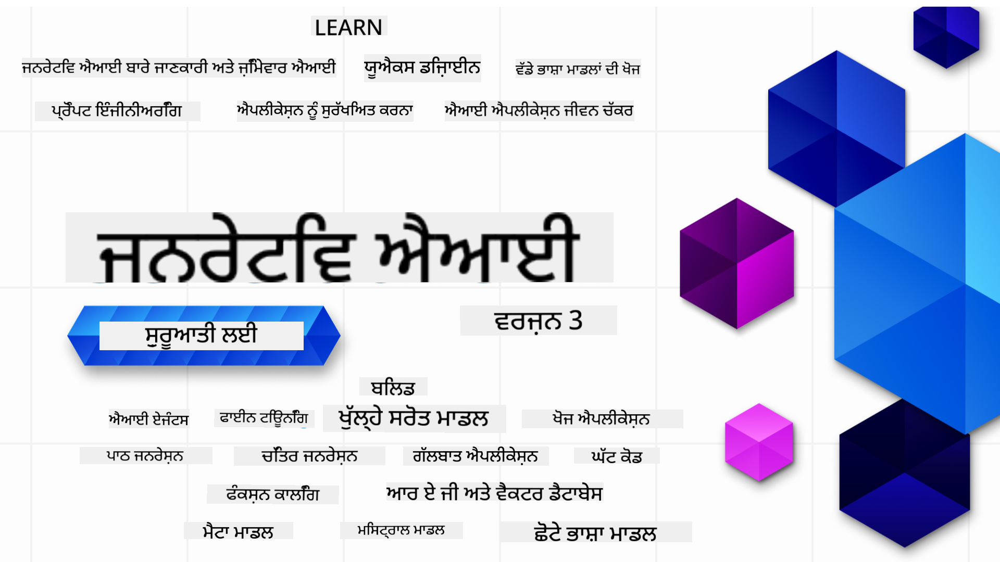

<!--
CO_OP_TRANSLATOR_METADATA:
{
  "original_hash": "6e3f4c8a4f323b8eab1cf11ded304b0f",
  "translation_date": "2025-06-25T07:50:19+00:00",
  "source_file": "README.md",
  "language_code": "pa"
}
-->

### 21 ਪਾਠ ਜੋ ਤੁਹਾਨੂੰ ਜਨਰੇਟਿਵ AI ਐਪਲੀਕੇਸ਼ਨ ਬਣਾਉਣ ਲਈ ਜਾਣਨ ਦੀ ਲੋੜ ਹੈ

  
  
  
  

  
  

### 🌐 ਬਹੁ-ਭਾਸ਼ਾ ਸਹਾਇਤਾ

#### GitHub ਐਕਸ਼ਨ ਰਾਹੀਂ ਸਹਾਇਕ (ਆਟੋਮੈਟਿਕ ਅਤੇ ਹਮੇਸ਼ਾ ਅਪ-ਟੂ-ਡੇਟ)

# ਜਨਰੇਟਿਵ AI ਬਰਾਇ ਬਿਗਿਨਰਜ਼ (ਸੰਸਕਰਣ 3) - ਇੱਕ ਕੋਰਸ

ਮਾਈਕ੍ਰੋਸਾਫਟ ਕਲਾਉਡ ਐਡਵੋਕੇਟਸ ਦੁਆਰਾ ਦਿੱਤੇ 21 ਪਾਠਾਂ ਦੇ ਵਿਸਤ੍ਰਿਤ ਕੋਰਸ ਨਾਲ ਜਨਰੇਟਿਵ AI ਐਪਲੀਕੇਸ਼ਨਾਂ ਨੂੰ ਬਣਾਉਣ ਦੇ ਮੁੱਢਲੀ ਸਿਧਾਂਤ ਸਿੱਖੋ।

## 🌱 ਸ਼ੁਰੂਆਤ ਕਰ ਰਹੇ ਹੋ

ਇਸ ਕੋਰਸ ਵਿੱਚ 21 ਪਾਠ ਹਨ। ਹਰ ਪਾਠ ਆਪਣੇ ਵਿਸ਼ੇ ਨੂੰ ਕਵਰ ਕਰਦਾ ਹੈ, ਇਸ ਲਈ ਜਿੱਥੋਂ ਚਾਹੋ ਸ਼ੁਰੂ ਕਰੋ!

ਪਾਠਾਂ ਨੂੰ "ਸਿੱਖੋ" ਪਾਠਾਂ ਦੇ ਤੌਰ 'ਤੇ ਲੇਬਲ ਕੀਤਾ ਗਿਆ ਹੈ ਜੋ ਜਨਰੇਟਿਵ AI ਸੰਕਲਪ ਦੀ ਵਿਆਖਿਆ ਕਰਦੇ ਹਨ ਜਾਂ "ਬਿਲਡ" ਪਾਠ ਜੋ ਸੰਕਲਪ ਅਤੇ ਕੋਡ ਉਦਾਹਰਨਾਂ ਨੂੰ ਦੋਵੇਂ **Python** ਅਤੇ **TypeScript** ਵਿੱਚ ਵਿਆਖਿਆ ਕਰਦੇ ਹਨ ਜਿੱਥੇ ਸੰਭਵ ਹੋਵੇ।

.NET ਡਿਵੈਲਪਰਾਂ ਲਈ [Generative AI for Beginners (.NET Edition)](https://github.com/microsoft/Generative-AI-for-beginners-dotnet?WT.mc_id=academic-105485-koreyst) ਵੇਖੋ!

ਹਰ ਪਾਠ ਵਿੱਚ ਵਾਧੂ ਸਿੱਖਣ ਦੇ ਸੰਦਾਂ ਨਾਲ "ਸਿੱਖਣ ਜਾਰੀ ਰੱਖੋ" ਭਾਗ ਵੀ ਸ਼ਾਮਲ ਹੈ।

## ਤੁਹਾਨੂੰ ਕੀ ਚਾਹੀਦਾ ਹੈ
### ਇਸ ਕੋਰਸ ਦਾ ਕੋਡ ਚਲਾਉਣ ਲਈ, ਤੁਸੀਂ ਇਹਨਾਂ ਵਿੱਚੋਂ ਕਿਸੇ ਇੱਕ ਨੂੰ ਵਰਤ ਸਕਦੇ ਹੋ: 
- [Azure OpenAI Service](https://aka.ms/genai-beginners/azure-open-ai?WT.mc_id=academic-105485-koreyst) - **ਪਾਠ:** "aoai-assignment"
- [GitHub Marketplace Model Catalog](https://aka.ms/genai-beginners/gh-models?WT.mc_id=academic-105485-koreyst) - **ਪਾਠ:** "githubmodels"
- [OpenAI API](https://aka.ms/genai-beginners/open-ai?WT.mc_id=academic-105485-koreyst) - **ਪਾਠ:** "oai-assignment" 

- Python ਜਾਂ TypeScript ਦੀ ਬੁਨਿਆਦੀ ਜਾਣਕਾਰੀ ਮਦਦਗਾਰ ਹੈ - \*ਬਿਲਕੁਲ ਨਵੇਂ ਬਿਗਿਨਰਾਂ ਲਈ ਇਹ [Python](https://aka.ms/genai-beginners/python?WT.mc_id=academic-105485-koreyst) ਅਤੇ [TypeScript](https://aka.ms/genai-beginners/typescript?WT.mc_id=academic-105485-koreyst) ਕੋਰਸ ਵੇਖੋ
- ਆਪਣੀ GitHub ਖਾਤੇ ਵਿੱਚ [ਇਸ ਸਾਰੇ ਰੇਪੋ ਨੂੰ ਫੋਰਕ ਕਰਨ ਲਈ](https://aka.ms/genai-beginners/github?WT.mc_id=academic-105485-koreyst) ਇੱਕ GitHub ਖਾਤਾ

ਅਸੀਂ ਤੁਹਾਡੀ ਵਿਕਾਸ ਵਾਤਾਵਰਣ ਸੈਟਅਪ ਵਿੱਚ ਮਦਦ ਕਰਨ ਲਈ **[ਕੋਰਸ ਸੈਟਅਪ](./00-course-setup/README.md?WT.mc_id=academic-105485-koreyst)** ਪਾਠ ਬਣਾਇਆ ਹੈ।

ਇਸ ਰੇਪੋ ਨੂੰ [ਤਾਰਾ (🌟) ਚਿੰਨ੍ਹਿਤ ਕਰਨਾ](https://docs.github.com/en/get-started/exploring-projects-on-github/saving-repositories-with-stars?WT.mc_id=academic-105485-koreyst) ਨਾ ਭੁੱਲੋ ਤਾਂ ਜੋ ਬਾਅਦ ਵਿੱਚ ਇਸਨੂੰ ਆਸਾਨੀ ਨਾਲ ਲੱਭ ਸਕੋ।

## 🧠 ਤਿਆਰ ਹੋ ਤੈਨਾਤ ਕਰਨ ਲਈ?

ਜੇ ਤੁਸੀਂ ਹੋਰ ਉੱਨਤ ਕੋਡ ਨਮੂਨੇ ਲੱਭ ਰਹੇ ਹੋ, ਤਾਂ ਸਾਡੇ **Python** ਅਤੇ **TypeScript** ਵਿੱਚ [ਜਨਰੇਟਿਵ AI ਕੋਡ ਨਮੂਨਿਆਂ ਦੀ ਸੰਗ੍ਰਹਿ](https://aka.ms/genai-beg-code?WT.mc_id=academic-105485-koreyst) ਵੇਖੋ।

## 🗣️ ਹੋਰ ਸਿੱਖਣ ਵਾਲਿਆਂ ਨੂੰ ਮਿਲੋ, ਸਹਾਇਤਾ ਪ੍ਰਾਪਤ ਕਰੋ

ਸਾਡੇ [ਅਧਿਕਾਰਕ Azure AI Foundry Discord ਸਰਵਰ](https://aka.ms/genai-discord?WT.mc_id=academic-105485-koreyst) ਨਾਲ ਜੁੜੋ ਤਾਂ ਜੋ ਇਸ ਕੋਰਸ ਨੂੰ ਲੈਣ ਵਾਲੇ ਹੋਰ ਸਿੱਖਣ ਵਾਲਿਆਂ ਨਾਲ ਮਿਲ ਸਕੋ ਅਤੇ ਨੈੱਟਵਰਕਿੰਗ ਕਰ ਸਕੋ ਅਤੇ ਸਹਾਇਤਾ ਪ੍ਰਾਪਤ ਕਰੋ।

ਸਾਡੇ [Azure AI Foundry Developer Forum](https://aka.ms/azureaifoundry/forum) 'ਤੇ ਸਵਾਲ ਪੁੱਛੋ ਜਾਂ ਉਤਪਾਦ ਪ੍ਰਤੀਕਰਮ ਸਾਂਝਾ ਕਰੋ।

## 🚀 ਇੱਕ ਸਟਾਰਟਅਪ ਬਣਾ ਰਹੇ ਹੋ?

[Microsoft for Startups Founders Hub](https://aka.ms/genai-foundershub?WT.mc_id=academic-105485-koreyst) ਲਈ ਸਾਈਨ ਅੱਪ ਕਰੋ ਤਾਂ ਜੋ **ਮੁਫ਼ਤ OpenAI ਕ੍ਰੈਡਿਟਸ** ਅਤੇ **Azure OpenAI ਸੇਵਾਵਾਂ ਦੁਆਰਾ OpenAI ਮਾਡਲਾਂ ਤੱਕ ਪਹੁੰਚ ਲਈ Azure ਕ੍ਰੈਡਿਟਸ ਵਿੱਚ $150k ਤੱਕ ਪ੍ਰਾਪਤ ਹੋ ਸਕੇ**।

## 🙏 ਮਦਦ ਕਰਨਾ ਚਾਹੁੰਦੇ ਹੋ?

ਕੀ ਤੁਹਾਡੇ ਕੋਲ ਸੁਝਾਅ ਹਨ ਜਾਂ ਤੁਸੀਂ ਕੋਈ ਸ਼ਬਦ ਜਾਂ ਕੋਡ ਗਲਤੀਆਂ ਲੱਭੀਆਂ ਹਨ? [ਇੱਕ ਮੁੱਦਾ ਖੜ੍ਹਾ ਕਰੋ](https://github.com/microsoft/generative-ai-for-beginners/issues?WT.mc_id=academic-105485-koreyst) ਜਾਂ [ਇੱਕ ਪੁਲ ਰੀਕੁਇਸਟ ਬਣਾਓ](https://github.com/microsoft/generative-ai-for-beginners/pulls?WT.mc_id=academic-105485-koreyst)

## 📂 ਹਰ ਪਾਠ ਵਿੱਚ ਸ਼ਾਮਲ ਹੈ:

- ਵਿਸ਼ੇ ਦੀ ਇੱਕ ਛੋਟੀ ਵੀਡੀਓ ਜਾਣ ਪਛਾਣ
- README ਵਿੱਚ ਸਥਿਤ ਲਿਖਤ ਪਾਠ
- Azure OpenAI ਅਤੇ OpenAI API ਨੂੰ ਸਮਰਥਨ ਦੇਣ ਵਾਲੇ Python ਅਤੇ TypeScript ਕੋਡ ਨਮੂਨੇ
- ਤੁਹਾਡੀ ਸਿੱਖਿਆ ਜਾਰੀ ਰੱਖਣ ਲਈ ਵਾਧੂ ਸ੍ਰੋਤਾਂ ਦੇ ਲਿੰਕ

## 🗃️ ਪਾਠ

| #   | **ਪਾਠ ਲਿੰਕ**                                                                                                                              | **ਵੇਰਵਾ**                                                                                 | **ਵੀਡੀਓ**                                                                   | **ਵਾਧੂ ਸਿੱਖਿਆ**                                                             |
| --- | -------------------------------------------------------------------------------------------------------------------------------------------- | ----------------------------------------------------------------------------------------------- | --------------------------------------------------------------------------- | ------------------------------------------------------------------------------ |
| 00  | [ਕੋਰਸ ਸੈਟਅਪ](./00-course-setup/README.md?WT.mc_id=academic-105485-koreyst)                                                                 | **ਸਿੱਖੋ:** ਆਪਣਾ ਵਿਕਾਸ ਵਾਤਾਵਰਣ ਕਿਵੇਂ ਸੈਟਅਪ ਕਰਨਾ ਹੈ                                            | ਵੀਡੀਓ ਜਲਦੀ ਆ ਰਹੀ ਹੈ                                                                 | [ਹੋਰ ਸਿੱਖੋ](https://aka.ms/genai-collection?WT.mc_id=academic-105485-koreyst) |
| 01  | [ਜਨਰੇਟਿਵ AI ਅਤੇ LLMs ਦਾ ਪਰਿਚਯ](./01-introduction-to-genai/README.md?WT.mc_id=academic-105485-koreyst)                              | **ਸਿੱਖੋ:** ਜਨਰੇਟਿਵ AI ਕੀ ਹੈ ਅਤੇ ਵੱਡੇ ਭਾਸ਼ਾ ਮਾਡਲ (LLMs) ਕਿਵੇਂ ਕੰਮ ਕਰਦੇ ਹਨ।       | [ਵੀਡੀਓ](https://aka.ms/gen-ai-lesson-1-gh?WT.mc_id=academic-105485-koreyst) | [ਹੋਰ ਸਿੱਖੋ](https://aka.ms/genai-collection?WT.mc_id=academic-105485-koreyst) |
| 02  | [ਵੱਖ-ਵੱਖ LLMs ਦੀ ਪੜਚੋਲ ਅਤੇ ਤੁਲਨਾ](./02-exploring-and-comparing-different-llms/README.md?WT.mc_id=academic-105485-koreyst)             | **ਸਿੱਖੋ:** ਆਪਣੇ ਉਪਯੋਗ ਮਾਮਲੇ ਲਈ ਸਹੀ ਮਾਡਲ ਕਿਵੇਂ ਚੁਣਨਾ ਹੈ                                      | [ਵੀਡੀਓ](https://aka.ms/gen-ai-lesson2-gh?WT.mc_id=academic-105485-koreyst)  | [ਹੋਰ ਸਿੱਖੋ](https://aka.ms/genai-collection?WT.mc_id=academic-105485-koreyst) |
| 03  | [ਜਨਰੇਟਿਵ AI ਨੂੰ ਜਿੰਮੇਵਾਰੀ ਨਾਲ ਵਰਤਣਾ](./03-using-generative-ai-responsibly/README.md?WT.mc_id=academic-105485-koreyst)                           | **ਸਿੱਖੋ:** ਜਿੰਮੇਵਾਰੀ ਨਾਲ ਜਨਰੇਟਿਵ AI ਐਪਲੀਕੇਸ਼ਨ ਕਿਵੇਂ ਬਣਾਉਣੀਆਂ ਹਨ                                  | [ਵੀਡੀਓ](https://aka.ms/gen-ai-lesson3-gh?WT.mc_id=academic-105485-koreyst)  | [ਹੋਰ ਸਿੱਖੋ](https://aka.ms/genai-collection?WT.mc_id=academic-105485-koreyst) |
| 04  | [ਪ੍ਰਾਪਤ ਇੰਜੀਨੀਅਰਿੰਗ ਦੇ ਮੂਲ ਸਿਧਾਂਤਾਂ ਨੂੰ ਸਮਝਣਾ](./04-prompt-engineering-fundamentals/README.md?WT.mc_id=academic-105485-koreyst)             | **ਸਿੱਖੋ:** ਹੱਥੋਂ-ਕੰਮ ਕਰਨ ਵਾਲੇ ਪ੍ਰਾਪਤ ਇੰਜੀਨੀਅਰਿੰਗ ਦੇ ਵਧੀਆ ਅਭਿਆਸ                                           | [ਵੀਡੀਓ](https://aka.ms/gen-ai-lesson4-gh?WT.mc_id=academic-105485-koreyst)  | [ਹੋਰ ਸਿੱਖੋ](https://aka.ms/genai-collection?WT.mc_id=academic-105485-koreyst) |
| 05  | [ਤਕਨੀਕੀ ਉਤਸ਼ਾਹਤ ਪੈਰਾਈਆਂ ਬਣਾਉਣਾ](./05-advanced-prompts/README.md?WT.mc_id=academic-105485-koreyst)                                                | **ਸਿੱਖੋ:** ਆਪਣੀਆਂ ਪੈਰਾਈਆਂ ਦੇ ਨਤੀਜੇ ਨੂੰ ਸੁਧਾਰਨ ਲਈ ਪੈਰਾਈ ਇੰਜੀਨੀਅਰਿੰਗ ਤਕਨੀਕਾਂ ਕਿਵੇਂ ਲਾਗੂ ਕਰਨੀ ਹੈ। | [ਵੀਡੀਓ](https://aka.ms/gen-ai-lesson5-gh?WT.mc_id=academic-105485-koreyst)  | [ਹੋਰ ਜਾਣੋ](https://aka.ms/genai-collection?WT.mc_id=academic-105485-koreyst) |
| 06  | [ਟੈਕਸਟ ਜਨਰੇਸ਼ਨ ਐਪਲੀਕੇਸ਼ਨ ਬਣਾਉਣਾ](./06-text-generation-apps/README.md?WT.mc_id=academic-105485-koreyst)                                | **ਬਣਾਓ:** Azure OpenAI / OpenAI API ਦੀ ਵਰਤੋਂ ਕਰਕੇ ਇੱਕ ਟੈਕਸਟ ਜਨਰੇਸ਼ਨ ਐਪ                                | [ਵੀਡੀਓ](https://aka.ms/gen-ai-lesson6-gh?WT.mc_id=academic-105485-koreyst)  | [ਹੋਰ ਜਾਣੋ](https://aka.ms/genai-collection?WT.mc_id=academic-105485-koreyst) |
| 07  | [ਚੈਟ ਐਪਲੀਕੇਸ਼ਨ ਬਣਾਉਣਾ](./07-building-chat-applications/README.md?WT.mc_id=academic-105485-koreyst)                                     | **ਬਣਾਓ:** ਚੈਟ ਐਪਲੀਕੇਸ਼ਨ ਨੂੰ ਕੁਸ਼ਲਤਾਪੂਰਵਕ ਬਣਾਉਣ ਅਤੇ ਇੱਕੀਕਰਣ ਲਈ ਤਕਨੀਕਾਂ।               | [ਵੀਡੀਓ](https://aka.ms/gen-ai-lessons7-gh?WT.mc_id=academic-105485-koreyst) | [ਹੋਰ ਜਾਣੋ](https://aka.ms/genai-collection?WT.mc_id=academic-105485-koreyst) |
| 08  | [ਖੋਜ ਐਪਸ ਵੇਕਟਰ ਡਾਟਾਬੇਸ ਬਣਾਉਣਾ](./08-building-search-applications/README.md?WT.mc_id=academic-105485-koreyst)                        | **ਬਣਾਓ:** ਇੱਕ ਖੋਜ ਐਪਲੀਕੇਸ਼ਨ ਜੋ ਡਾਟਾ ਦੀ ਖੋਜ ਲਈ ਐਮਬੈਡਿੰਗ ਦੀ ਵਰਤੋਂ ਕਰਦਾ ਹੈ।                        | [ਵੀਡੀਓ](https://aka.ms/gen-ai-lesson8-gh?WT.mc_id=academic-105485-koreyst)  | [ਹੋਰ ਜਾਣੋ](https://aka.ms/genai-collection?WT.mc_id=academic-105485-koreyst) |
| 09  | [ਚਿੱਤਰ ਜਨਰੇਸ਼ਨ ਐਪਲੀਕੇਸ਼ਨ ਬਣਾਉਣਾ](./09-building-image-applications/README.md?WT.mc_id=academic-105485-koreyst)                        | **ਬਣਾਓ:** ਇੱਕ ਚਿੱਤਰ ਜਨਰੇਸ਼ਨ ਐਪਲੀਕੇਸ਼ਨ                                                       | [ਵੀਡੀਓ](https://aka.ms/gen-ai-lesson9-gh?WT.mc_id=academic-105485-koreyst)  | [ਹੋਰ ਜਾਣੋ](https://aka.ms/genai-collection?WT.mc_id=academic-105485-koreyst) |
| 10  | [ਲੋ ਕੋਡ AI ਐਪਲੀਕੇਸ਼ਨ ਬਣਾਉਣਾ](./10-building-low-code-ai-applications/README.md?WT.mc_id=academic-105485-koreyst)                       | **ਬਣਾਓ:** ਲੋ ਕੋਡ ਟੂਲ ਦੀ ਵਰਤੋਂ ਕਰਕੇ ਇੱਕ ਜਨਰੇਟਿਵ AI ਐਪਲੀਕੇਸ਼ਨ                                     | [ਵੀਡੀਓ](https://aka.ms/gen-ai-lesson10-gh?WT.mc_id=academic-105485-koreyst) | [ਹੋਰ ਜਾਣੋ](https://aka.ms/genai-collection?WT.mc_id=academic-105485-koreyst) |
| 11  | [ਫੰਕਸ਼ਨ ਕਾਲਿੰਗ ਨਾਲ ਬਾਹਰੀ ਐਪਲੀਕੇਸ਼ਨ ਇੱਕੀਕਰਣ](./11-integrating-with-function-calling/README.md?WT.mc_id=academic-105485-koreyst) | **ਬਣਾਓ:** ਫੰਕਸ਼ਨ ਕਾਲਿੰਗ ਕੀ ਹੈ ਅਤੇ ਐਪਲੀਕੇਸ਼ਨ ਲਈ ਇਸਦੇ ਵਰਤੋਂ ਦੇ ਕੇਸ                          | [ਵੀਡੀਓ](https://aka.ms/gen-ai-lesson11-gh?WT.mc_id=academic-105485-koreyst) | [ਹੋਰ ਜਾਣੋ](https://aka.ms/genai-collection?WT.mc_id=academic-105485-koreyst) |
| 12  | [AI ਐਪਲੀਕੇਸ਼ਨ ਲਈ UX ਡਿਜ਼ਾਇਨ](./12-designing-ux-for-ai-applications/README.md?WT.mc_id=academic-105485-koreyst)                         | **ਸਿੱਖੋ:** ਜਨਰੇਟਿਵ AI ਐਪਲੀਕੇਸ਼ਨ ਵਿਕਸਿਤ ਕਰਦੇ ਸਮੇਂ UX ਡਿਜ਼ਾਇਨ ਸਿਧਾਂਤਾਂ ਨੂੰ ਕਿਵੇਂ ਲਾਗੂ ਕਰਨਾ ਹੈ         | [ਵੀਡੀਓ](https://aka.ms/gen-ai-lesson12-gh?WT.mc_id=academic-105485-koreyst) | [ਹੋਰ ਜਾਣੋ](https://aka.ms/genai-collection?WT.mc_id=academic-105485-koreyst) |
| 13  | [ਤੁਹਾਡੇ ਜਨਰੇਟਿਵ AI ਐਪਲੀਕੇਸ਼ਨ ਨੂੰ ਸੁਰੱਖਿਅਤ ਕਰਨਾ](./13-securing-ai-applications/README.md?WT.mc_id=academic-105485-koreyst)                         | **ਸਿੱਖੋ:** AI ਸਿਸਟਮਾਂ ਨੂੰ ਧਮਕੀਆਂ ਅਤੇ ਖਤਰੇ ਅਤੇ ਇਨ੍ਹਾਂ ਸਿਸਟਮਾਂ ਨੂੰ ਸੁਰੱਖਿਅਤ ਕਰਨ ਦੇ ਤਰੀਕੇ।             | [ਵੀਡੀਓ](https://aka.ms/gen-ai-lesson13-gh?WT.mc_id=academic-105485-koreyst) | [ਹੋਰ ਜਾਣੋ](https://aka.ms/genai-collection?WT.mc_id=academic-105485-koreyst) |
| 14  | [ਜਨਰੇਟਿਵ AI ਐਪਲੀਕੇਸ਼ਨ ਲਾਈਫਸਾਈਕਲ](./14-the-generative-ai-application-lifecycle/README.md?WT.mc_id=academic-105485-koreyst)           | **ਸਿੱਖੋ:** LLM ਲਾਈਫਸਾਈਕਲ ਅਤੇ LLMOps ਨੂੰ ਪ੍ਰਬੰਧਿਤ ਕਰਨ ਲਈ ਸਾਧਨ ਅਤੇ ਮਾਪਦੰਡ                         | [ਵੀਡੀਓ](https://aka.ms/gen-ai-lesson14-gh?WT.mc_id=academic-105485-koreyst) | [ਹੋਰ ਜਾਣੋ](https://aka.ms/genai-collection?WT.mc_id=academic-105485-koreyst) |
| 15  | [ਰੀਟ੍ਰੀਵਲ ਅਗਮੈਂਟੇਡ ਜੈਨਰੇਸ਼ਨ (RAG) ਅਤੇ ਵੇਕਟਰ ਡਾਟਾਬੇਸ](./15-rag-and-vector-databases/README.md?WT.mc_id=academic-105485-koreyst)        | **ਬਣਾਓ:** ਇੱਕ ਐਪਲੀਕੇਸ਼ਨ ਜੋ RAG ਫਰੇਮਵਰਕ ਦੀ ਵਰਤੋਂ ਕਰਦਾ ਹੈ ਤਾਂ ਜੋ ਵੇਕਟਰ ਡਾਟਾਬੇਸ ਤੋਂ ਐਮਬੈਡਿੰਗਜ਼ ਪ੍ਰਾਪਤ ਕਰ ਸਕੇ  | [ਵੀਡੀਓ](https://aka.ms/gen-ai-lesson15-gh?WT.mc_id=academic-105485-koreyst) | [ਹੋਰ ਜਾਣੋ](https://aka.ms/genai-collection?WT.mc_id=academic-105485-koreyst) |
| 16  | [ਓਪਨ ਸੋਰਸ ਮਾਡਲ ਅਤੇ ਹੱਗਿੰਗ ਫੇਸ](./16-open-source-models/README.md?WT.mc_id=academic-105485-koreyst)                                    | **ਬਣਾਓ:** ਹੱਗਿੰਗ ਫੇਸ ਉਪਲਬਧ ਓਪਨ ਸੋਰਸ ਮਾਡਲਾਂ ਦੀ ਵਰਤੋਂ ਕਰਦੇ ਹੋਏ ਇੱਕ ਐਪਲੀਕੇਸ਼ਨ                    | [ਵੀਡੀਓ](https://aka.ms/gen-ai-lesson16-gh?WT.mc_id=academic-105485-koreyst) | [ਹੋਰ ਜਾਣੋ](https://aka.ms/genai-collection?WT.mc_id=academic-105485-koreyst) |
| 17  | [AI ਏਜੰਟ](./17-ai-agents/README.md?WT.mc_id=academic-105485-koreyst)                                                                       | **ਬਣਾਓ:** AI ਏਜੰਟ ਫਰੇਮਵਰਕ ਦੀ ਵਰਤੋਂ ਕਰਦੇ ਹੋਏ ਇੱਕ ਐਪਲੀਕੇਸ਼ਨ                                           | [ਵੀਡੀਓ](https://aka.ms/gen-ai-lesson17-gh?WT.mc_id=academic-105485-koreyst) | [ਹੋਰ ਜਾਣੋ](https://aka.ms/genai-collection?WT.mc_id=academic-105485-koreyst) |
| 18  | [LLMs ਦਾ ਫਾਈਨ-ਟਿਊਨਿੰਗ](./18-fine-tuning/README.md?WT.mc_id=academic-105485-koreyst)                                                              | **ਸਿਖੋ:** LLMs ਦੇ ਫਾਈਨ-ਟਿਊਨਿੰਗ ਦਾ ਕੀ, ਕਿਉਂ ਅਤੇ ਕਿਵੇਂ                                            | [ਵੀਡੀਓ](https://aka.ms/gen-ai-lesson18-gh?WT.mc_id=academic-105485-koreyst) | [ਹੋਰ ਜਾਣੋ](https://aka.ms/genai-collection?WT.mc_id=academic-105485-koreyst) |
| 19  | [SLMs ਨਾਲ ਬਿਲਡਿੰਗ](./19-slm/README.md?WT.mc_id=academic-105485-koreyst)                                                              | **ਸਿਖੋ:** ਛੋਟੇ ਭਾਸ਼ਾ ਮਾਡਲਾਂ ਨਾਲ ਬਿਲਡਿੰਗ ਦੇ ਫਾਇਦੇ                                            | ਵੀਡੀਓ ਜਲਦੀ ਆ ਰਹੀ ਹੈ | [ਹੋਰ ਜਾਣੋ](https://aka.ms/genai-collection?WT.mc_id=academic-105485-koreyst) |
| 20  | [ਮਿਸਟਰਲ ਮਾਡਲਾਂ ਨਾਲ ਬਿਲਡਿੰਗ](./20-mistral/README.md?WT.mc_id=academic-105485-koreyst)                                                              | **ਸਿਖੋ:** ਮਿਸਟਰਲ ਪਰਿਵਾਰ ਮਾਡਲਾਂ ਦੀਆਂ ਵਿਸ਼ੇਸ਼ਤਾਵਾਂ ਅਤੇ ਫਰਕ                                           | ਵੀਡੀਓ ਜਲਦੀ ਆ ਰਹੀ ਹੈ | [ਹੋਰ ਜਾਣੋ](https://aka.ms/genai-collection?WT.mc_id=academic-105485-koreyst) |
| 21  | [ਮੈਟਾ ਮਾਡਲਾਂ ਨਾਲ ਬਿਲਡਿੰਗ](./21-meta/README.md?WT.mc_id=academic-105485-koreyst)                                                              | **ਸਿਖੋ:** ਮੈਟਾ ਪਰਿਵਾਰ ਮਾਡਲਾਂ ਦੀਆਂ ਵਿਸ਼ੇਸ਼ਤਾਵਾਂ ਅਤੇ ਫਰਕ                                           | ਵੀਡੀਓ ਜਲਦੀ ਆ ਰਹੀ ਹੈ | [ਹੋਰ ਜਾਣੋ](https://aka.ms/genai-collection?WT.mc_id=academic-105485-koreyst) |

### 🌟 ਖਾਸ ਧੰਨਵਾਦ

ਗਿੱਟਹਬ ਐਕਸ਼ਨਜ਼ ਅਤੇ ਵਰਕਫਲੋ ਬਣਾਉਣ ਲਈ [**ਜੌਨ ਅਜ਼ੀਜ਼**](https://www.linkedin.com/in/john0isaac/) ਨੂੰ ਖਾਸ ਧੰਨਵਾਦ

ਹਰੇਕ ਪਾਠ ਵਿੱਚ ਸਿੱਖਣ ਵਾਲਿਆਂ ਅਤੇ ਕੋਡ ਦੇ ਅਨੁਭਵ ਨੂੰ ਸੁਧਾਰਨ ਲਈ ਮਹੱਤਵਪੂਰਨ ਯੋਗਦਾਨ ਦੇਣ ਲਈ [**ਬਰਨਹਾਰਡ ਮਰਕਲੇ**](https://www.linkedin.com/in/bernhard-merkle-738b73/) ਨੂੰ ਧੰਨਵਾਦ। 

## 🎒 ਹੋਰ ਕੋਰਸ

ਸਾਡੀ ਟੀਮ ਹੋਰ ਕੋਰਸ ਵੀ ਤਿਆਰ ਕਰਦੀ ਹੈ! ਚੈੱਕ ਕਰੋ:

- [**ਨਵਾਂ** ਸ਼ੁਰੂਆਤੀਆਂ ਲਈ ਮਾਡਲ ਸੰਦਰਭ ਪ੍ਰੋਟੋਕੋਲ](https://github.com/microsoft/mcp-for-beginners?WT.mc_id=academic-105485-koreyst)
- [ਸ਼ੁਰੂਆਤੀਆਂ ਲਈ AI ਏਜੰਟ](https://github.com/microsoft/ai-agents-for-beginners?WT.mc_id=academic-105485-koreyst)
- [ਸ਼ੁਰੂਆਤੀਆਂ ਲਈ ਜਨਰੇਟਿਵ AI .NET ਦੀ ਵਰਤੋਂ ਕਰਕੇ](https://github.com/microsoft/Generative-AI-for-beginners-dotnet?WT.mc_id=academic-105485-koreyst)
- [ਸ਼ੁਰੂਆਤੀਆਂ ਲਈ ਜਨਰੇਟਿਵ AI ਜਾਵਾਸਕ੍ਰਿਪਟ ਦੀ ਵਰਤੋਂ ਕਰਕੇ](https://aka.ms/genai-js-course?WT.mc_id=academic-105485-koreyst)
- [ਸ਼ੁਰੂਆਤੀਆਂ ਲਈ ML](https://aka.ms/ml-beginners?WT.mc_id=academic-105485-koreyst)
- [ਸ਼ੁਰੂਆਤੀਆਂ ਲਈ ਡਾਟਾ ਸਾਇੰਸ](https://aka.ms/datascience-beginners?WT.mc_id=academic-105485-koreyst)
- [ਸ਼ੁਰੂਆਤੀਆਂ ਲਈ AI](https://aka.ms/ai-beginners?WT.mc_id=academic-105485-koreyst)
- [ਸ਼ੁਰੂਆਤੀਆਂ ਲਈ ਸਾਇਬਰਸੁਰੱਖਿਆ](https://github.com/microsoft/Security-101??WT.mc_id=academic-96948-sayoung)
- [ਸ਼ੁਰੂਆਤੀਆਂ ਲਈ ਵੈੱਬ ਡੈਵ](https://aka.ms/webdev-beginners?WT.mc_id=academic-105485-koreyst)
- [ਸ਼ੁਰੂਆਤੀਆਂ ਲਈ IoT](https://aka.ms/iot-beginners?WT.mc_id=academic-105485-koreyst)
- [ਬਹੁਤ ਜ਼ਰੂਰੀ: ਨਵੀਂ ਸ਼ੁਰੂਆਤ ਲਈ XR ਵਿਕਾਸ](https://github.com/microsoft/xr-development-for-beginners?WT.mc_id=academic-105485-koreyst)
- [GitHub Copilot ਲਈ AI ਜੋੜੇ ਪ੍ਰੋਗਰਾਮਿੰਗ ਵਿੱਚ ਮਾਹਰ ਬਣਨਾ](https://aka.ms/GitHubCopilotAI?WT.mc_id=academic-105485-koreyst)
- [C#/.NET ਡਿਵੈਲਪਰਾਂ ਲਈ GitHub Copilot ਵਿੱਚ ਮਾਹਰ ਬਣਨਾ](https://github.com/microsoft/mastering-github-copilot-for-dotnet-csharp-developers?WT.mc_id=academic-105485-koreyst)
- [ਆਪਣੀ ਆਪਣੀ Copilot ਸਫ਼ਰ ਚੁਣੋ](https://github.com/microsoft/CopilotAdventures?WT.mc_id=academic-105485-koreyst)

**ਅਸਵੀਕਰਤੀਕਰਨ**:  
ਇਹ ਦਸਤਾਵੇਜ਼ AI ਅਨੁਵਾਦ ਸੇਵਾ [Co-op Translator](https://github.com/Azure/co-op-translator) ਦੀ ਵਰਤੋਂ ਕਰਕੇ ਅਨੁਵਾਦ ਕੀਤਾ ਗਿਆ ਹੈ। ਜਦੋਂ ਕਿ ਅਸੀਂ ਸਹੀਅਤ ਲਈ ਕੋਸ਼ਿਸ਼ ਕਰਦੇ ਹਾਂ, ਕਿਰਪਾ ਕਰਕੇ ਧਿਆਨ ਦਿਓ ਕਿ ਸਵੈਚਾਲਿਤ ਅਨੁਵਾਦਾਂ ਵਿੱਚ ਗਲਤੀਆਂ ਜਾਂ ਅਸਹੀਤਾਵਾਂ ਹੋ ਸਕਦੀਆਂ ਹਨ। ਇਸ ਦੀ ਮੂਲ ਭਾਸ਼ਾ ਵਿੱਚ ਮੂਲ ਦਸਤਾਵੇਜ਼ ਨੂੰ ਅਧਿਕਾਰਤ ਸਰੋਤ ਮੰਨਿਆ ਜਾਣਾ ਚਾਹੀਦਾ ਹੈ। ਮਹੱਤਵਪੂਰਨ ਜਾਣਕਾਰੀ ਲਈ, ਪੇਸ਼ੇਵਰ ਮਾਨਵ ਅਨੁਵਾਦ ਦੀ ਸਿਫਾਰਿਸ਼ ਕੀਤੀ ਜਾਂਦੀ ਹੈ। ਅਸੀਂ ਇਸ ਅਨੁਵਾਦ ਦੇ ਪ੍ਰਯੋਗ ਤੋਂ ਉਤਪੰਨ ਹੋਣ ਵਾਲੀਆਂ ਕਿਸੇ ਵੀ ਗਲਤਫਹਿਮੀਆਂ ਜਾਂ ਗਲਤ ਵਿਆਖਿਆਵਾਂ ਲਈ ਜ਼ਿੰਮੇਵਾਰ ਨਹੀਂ ਹਾਂ।