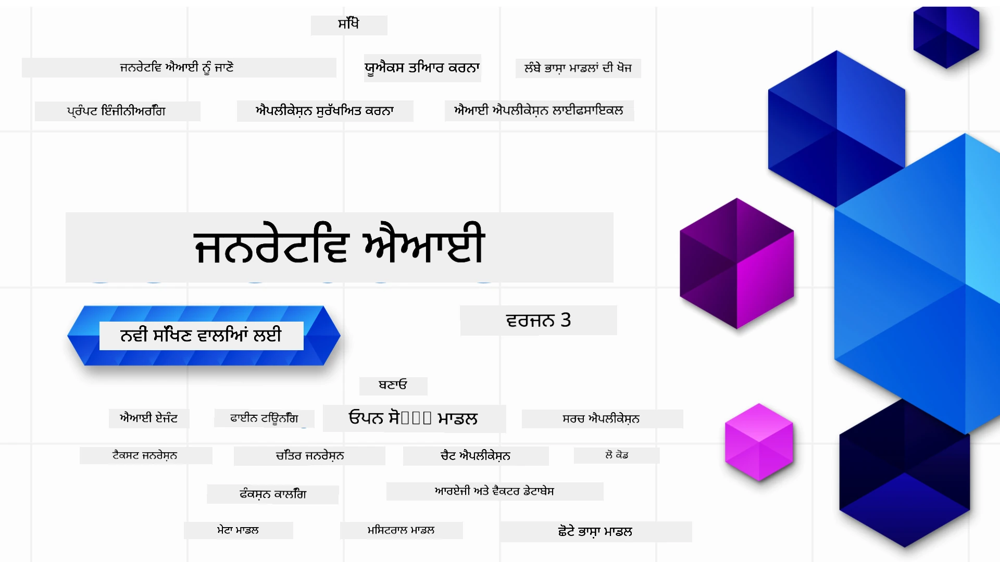

### 21 ਪਾਠ ਜੋ ਤੁਹਾਨੂੰ ਜਨਰੇਟਿਵ ਏਆਈ ਐਪਲੀਕੇਸ਼ਨਾਂ ਨੂੰ ਬਣਾਉਣਾ ਸ਼ੁਰੂ ਕਰਨ ਲਈ ਜ਼ਰੂਰੀ ਹਰ ਚੀਜ਼ ਸਿਖਾਉਂਦੇ ਹਨ

[](https://github.com/microsoft/Generative-AI-For-Beginners/blob/master/LICENSE?WT.mc_id=academic-105485-koreyst)
[](https://GitHub.com/microsoft/Generative-AI-For-Beginners/graphs/contributors/?WT.mc_id=academic-105485-koreyst)
[](https://GitHub.com/microsoft/Generative-AI-For-Beginners/issues/?WT.mc_id=academic-105485-koreyst)
[](https://GitHub.com/microsoft/Generative-AI-For-Beginners/pulls/?WT.mc_id=academic-105485-koreyst)
[](http://makeapullrequest.com?WT.mc_id=academic-105485-koreyst)

[](https://GitHub.com/microsoft/Generative-AI-For-Beginners/watchers/?WT.mc_id=academic-105485-koreyst)
[](https://GitHub.com/microsoft/Generative-AI-For-Beginners/network/?WT.mc_id=academic-105485-koreyst)
[](https://GitHub.com/microsoft/Generative-AI-For-Beginners/stargazers/?WT.mc_id=academic-105485-koreyst)

[](https://discord.gg/nTYy5BXMWG)

### 🌐 ਬਹੁ-ਭਾਸ਼ਾਵਾਂ ਸਹਿਯੋਗ

#### GitHub ਐਕਸ਼ਨ ਰਾਹੀਂ ਸਮਰਥਿਤ (ਆਟੋਮੈਟਿਕ ਅਤੇ ਹਮੇਸ਼ਾ ਅੱਪ-ਟੂ-ਡੇਟ)

<!-- CO-OP TRANSLATOR LANGUAGES TABLE START -->
[Arabic](../ar/README.md) | [Bengali](../bn/README.md) | [Bulgarian](../bg/README.md) | [Burmese (Myanmar)](../my/README.md) | [Chinese (Simplified)](../zh-CN/README.md) | [Chinese (Traditional, Hong Kong)](../zh-HK/README.md) | [Chinese (Traditional, Macau)](../zh-MO/README.md) | [Chinese (Traditional, Taiwan)](../zh-TW/README.md) | [Croatian](../hr/README.md) | [Czech](../cs/README.md) | [Danish](../da/README.md) | [Dutch](../nl/README.md) | [Estonian](../et/README.md) | [Finnish](../fi/README.md) | [French](../fr/README.md) | [German](../de/README.md) | [Greek](../el/README.md) | [Hebrew](../he/README.md) | [Hindi](../hi/README.md) | [Hungarian](../hu/README.md) | [Indonesian](../id/README.md) | [Italian](../it/README.md) | [Japanese](../ja/README.md) | [Kannada](../kn/README.md) | [Khmer](../km/README.md) | [Korean](../ko/README.md) | [Lithuanian](../lt/README.md) | [Malay](../ms/README.md) | [Malayalam](../ml/README.md) | [Marathi](../mr/README.md) | [Nepali](../ne/README.md) | [Nigerian Pidgin](../pcm/README.md) | [Norwegian](../no/README.md) | [Persian (Farsi)](../fa/README.md) | [Polish](../pl/README.md) | [Portuguese (Brazil)](../pt-BR/README.md) | [Portuguese (Portugal)](../pt-PT/README.md) | [Punjabi (Gurmukhi)](./README.md) | [Romanian](../ro/README.md) | [Russian](../ru/README.md) | [Serbian (Cyrillic)](../sr/README.md) | [Slovak](../sk/README.md) | [Slovenian](../sl/README.md) | [Spanish](../es/README.md) | [Swahili](../sw/README.md) | [Swedish](../sv/README.md) | [Tagalog (Filipino)](../tl/README.md) | [Tamil](../ta/README.md) | [Telugu](../te/README.md) | [Thai](../th/README.md) | [Turkish](../tr/README.md) | [Ukrainian](../uk/README.md) | [Urdu](../ur/README.md) | [Vietnamese](../vi/README.md)

> **ਸਥਾਨਕ ਤੌਰ 'ਤੇ ਕਲੋਨ ਕਰਨਾ ਪਸੰਦ ਕਰਦੇ ਹੋ?**
>
> ਇਸ ਰਿਪੋਜ਼ਿਟਰੀ ਵਿੱਚ 50+ ਭਾਸ਼ਾ ਅਨੁਵਾਦ ਸ਼ਾਮਲ ਹਨ ਜੋ ਡਾਊਨਲੋਡ ਸਾਈਜ਼ ਨੂੰ ਕਾਫੀ ਵਧਾ ਦਿੰਦੇ ਹਨ। ਅਨੁਵਾਦਾਂ ਦੇ ਬਿਨਾਂ ਕਲੋਨ ਕਰਨ ਲਈ sparse checkout ਦੀ ਵਰਤੋਂ ਕਰੋ:
>
> **Bash / macOS / Linux:**
> ```bash
> git clone --filter=blob:none --sparse https://github.com/microsoft/generative-ai-for-beginners.git
> cd generative-ai-for-beginners
> git sparse-checkout set --no-cone '/*' '!translations' '!translated_images'
> ```
>
> **CMD (Windows):**
> ```cmd
> git clone --filter=blob:none --sparse https://github.com/microsoft/generative-ai-for-beginners.git
> cd generative-ai-for-beginners
> git sparse-checkout set --no-cone "/*" "!translations" "!translated_images"
> ```
>
> ਇਸ ਨਾਲ ਤੁਹਾਨੂੰ ਇੱਕ ਵਧੀਆ ਤੇਜ਼ੀ ਨਾਲ ਡਾਊਨਲੋਡ ਕੀਤਾ ਗਿਆ ਕੋਰਸ ਸਮਾਪਤ ਕਰਨ ਲਈ ਸਾਰਾ ਸਮਗਰੀ ਮਿਲਦਾ ਹੈ।
<!-- CO-OP TRANSLATOR LANGUAGES TABLE END -->

# ਬਿਗਿਨਰਜ਼ ਲਈ ਜਨਰੇਟਿਵ ਏਆਈ (ਵਰਜ਼ਨ 3) - ਇੱਕ ਕੋਰਸ

ਮਾਇਕਰੋਸਾਫਟ ਕਲਾਉਡ ਐਡਵੋਕੇਟਸ ਵੱਲੋਂ ਸਾਡਾ 21 ਪਾਠਾਂ ਵਾਲਾ ਵਿਸ਼ਤ੍ਰਿਤ ਕੋਰਸ ਜਨਰੇਟਿਵ ਏਆਈ ਐਪਲੀਕੇਸ਼ਨਾਂ ਦੀ ਬੁਨਿਆਦ ਸਿੱਖੋ।

## 🌱 ਸ਼ੁਰੂਆਤ ਕਰਨਾ

ਇਸ ਕੋਰਸ ਵਿੱਚ 21 ਪਾਠ ਹਨ। ਹਰ ਪਾਠ ਆਪਣਾ ਖ਼ਾਸ ਵਿਸ਼ਾ ਢਕਦਾ ਹੈ ਤਾਂ ਤੁਸੀਂ ਇੱਥੇ ਕਿਤੇ ਵੀ ਸ਼ੁਰੂ ਕਰ ਸਕਦੇ ਹੋ!

ਪਾਠਾਂ ਨੂੰ "Learn" ਪਾਠਾਂ ਦੇ ਤੌਰ ਤੇ ਲੇਬਲ ਕੀਤਾ ਗਿਆ ਹੈ ਜੋ ਜਨਰੇਟਿਵ ਏਆਈ ਦੀ ਵਿਵਰਣਾ ਦਿੰਦੇ ਹਨ ਜਾਂ "Build" ਪਾਠ ਜੋ ਇੱਕ ਸੰਕਲਪ ਨਾਲ ਕੋਡ ਉਦਾਹਰਣਾਂ ਦੋਹਾਂ **Python** ਅਤੇ **TypeScript** ਵਿੱਚ ਸਮਝਾਉਂਦੇ ਹਨ ਜਦੋਂ ਸੰਭਵ ਹੋਵੇ।

.NET ਵਿਕਾਸਕਾਰਾਂ ਲਈ [Generative AI for Beginners (.NET Edition)](https://github.com/microsoft/Generative-AI-for-beginners-dotnet?WT.mc_id=academic-105485-koreyst) ਵੇਖੋ!

ਹਰ ਪਾਠ ਵਿਚ "Keep Learning" ਸੈਕਸ਼ਨ ਵੀ ਹੈ ਜਿਸ ਵਿੱਚ ਵਾਧੂ ਸਿੱਖਣ ਦੇ ਸੰਦ ਹਨ।

## ਤੁਹਾਨੂੰ ਕੀ ਚਾਹੀਦਾ ਹੈ
### ਇਸ ਕੋਰਸ ਦਾ ਕੋਡ ਚਲਾਉਣ ਲਈ, ਤੁਸੀਂ ਇਨ੍ਹਾਂ ਵਿੱਚੋਂ ਕਿਸੇ ਇੱਕ ਦੀ ਵਰਤੋਂ ਕਰ ਸਕਦੇ ਹੋ: 
 - [Azure OpenAI Service](https://aka.ms/genai-beginners/azure-open-ai?WT.mc_id=academic-105485-koreyst) - **ਪਾਠ:** "aoai-assignment"
 - [GitHub Marketplace Model Catalog](https://aka.ms/genai-beginners/gh-models?WT.mc_id=academic-105485-koreyst) - **ਪਾਠ:** "githubmodels"
 - [OpenAI API](https://aka.ms/genai-beginners/open-ai?WT.mc_id=academic-105485-koreyst) - **ਪਾਠ:** "oai-assignment" 
   
- Python ਜਾਂ TypeScript ਦਾ ਬੁਨਿਆਦੀ ਗਿਆਨ ਸਹਾਇਕ ਹੈ - \*ਪੂਰੀ ਤਰ੍ਹਾਂ ਬਿਗਿਨਰਜ਼ ਲਈ ਇਹਨਾਂ [Python](https://aka.ms/genai-beginners/python?WT.mc_id=academic-105485-koreyst) ਅਤੇ [TypeScript](https://aka.ms/genai-beginners/typescript?WT.mc_id=academic-105485-koreyst) ਕੋਰਸਾਂ ਨੂੰ ਦੇਖੋ
- ਇਸ ਪੂਰੇ ਰਿਪੋ ਨੂੰ ਆਪਣੇ GitHub ਖਾਤੇ ਵਿੱਚ [fork ਕਰਨ ਲਈ](https://aka.ms/genai-beginners/github?WT.mc_id=academic-105485-koreyst) GitHub ਖਾਤਾ 

ਅਸੀਂ ਤੁਹਾਡੇ ਵਿਕਾਸੀ ਪ੍ਰਦਰਸ਼ਨ ਲਈ ਸੈਟਅੱਪ ਵਿੱਚ ਮਦਦ ਕਰਨ ਲਈ ਇੱਕ **[ਕੋਰਸ ਸੈਟਅੱਪ](./00-course-setup/README.md?WT.mc_id=academic-105485-koreyst)** ਪਾਠ ਬਣਾਇਆ ਹੈ।

ਬਾਅਦ ਵਿੱਚ ਇਸਨੂੰ ਅਸਾਨੀ ਨਾਲ ਲੱਭਣ ਲਈ [ਇਸ ਰਿਪੋ ਨੂੰ ⭐(ਸਟਾਰ)](https://docs.github.com/en/get-started/exploring-projects-on-github/saving-repositories-with-stars?WT.mc_id=academic-105485-koreyst) ਕਰਨਾ ਨਾ ਭੁਲੋ।

## 🧠 ਤਿਆਰ ਹੋ ਜਾਓ ਡਿਪਲੌਇ ਕਰਨ ਲਈ?

ਜੇ ਤੁਸੀਂ ਹੋਰ ਅੱਝੇ ਕੋਡ ਸੈਂਪਲ ਖੋਜ ਰਹੇ ਹੋ ਤਾਂ ਸਾਡਾ [ਜਨਰੇਟਿਵ ਏਆਈ ਕੋਡ ਸੈਂਪਲ ਉੱਤਰਾਧਿਕਾਰ](https://aka.ms/genai-beg-code?WT.mc_id=academic-105485-koreyst) ਦੇਖੋ ਜੋ ਦੋਹਾਂ **Python** ਅਤੇ **TypeScript** ਵਿੱਚ ਹਨ।

## 🗣️ ਹੋਰ ਲਰਨਰਾਂ ਨਾਲ ਮਿਲੋ, ਸਹਾਇਤਾ ਪ੍ਰਾਪਤ ਕਰੋ

ਸਾਡਾ [ਅਧਿਕਾਰਕ Azure AI Foundry Discord ਸਰਵਰ](https://aka.ms/genai-discord?WT.mc_id=academic-105485-koreyst) ਜੁੜੋ ਤਾਂ ਜੋ ਤੁਸੀਂ ਹੋਰ ਸਿੱਖ ਰਹੇ ਵਿਅਕਤੀਆਂ ਨਾਲ ਮਿਲ ਸਕੋ ਅਤੇ ਸਹਾਇਤਾ ਪ੍ਰਾਪਤ ਕਰ ਸਕੋ।

GitHub 'ਤੇ ਸਾਡੇ [Azure AI Foundry ਡਿਵੈਲਪਰ ਫੋਰਮ](https://aka.ms/azureaifoundry/forum) ਵਿੱਚ ਸਵਾਲ ਪੁੱਛੋ ਜਾਂ ਪ੍ਰੋਡਕਟ ਫੀਡਬੈਕ ਸਾਂਝਾ ਕਰੋ।

## 🚀 ਸਟਾਰਟਅੱਪ ਬਣਾਉਣਾ ਚਾਹੁੰਦੇ ਹੋ?

ਅੱਜ ਹੀ Azure کریڈਿਟਸ ਨਾਲ ਬਣਾਉਣ ਸ਼ੁਰੂ ਕਰਨ ਲਈ [Microsoft for Startups](https://www.microsoft.com/startups) ਵੇਖੋ।

## 🙏 ਮਦਦ ਕਰਨੀ ਹੈ?

ਕੀ ਤੁਸੀਂ ਸੁਝਾਵ ਹਨ ਜਾਂ ਵਿਆਕਰਣ ਜਾਂ ਕੋਡ ਦੀਆਂ ਗਲਤੀਆਂ ਲੱਭੀਆਂ ਹਨ? [ਇਸ਼ੂ ਰਾਈਜ਼ ਕਰੋ](https://github.com/microsoft/generative-ai-for-beginners/issues?WT.mc_id=academic-105485-koreyst) ਜਾਂ [ਪੱਲ ਰਿਕਵੈਸਟ ਬਨਾਓ](https://github.com/microsoft/generative-ai-for-beginners/pulls?WT.mc_id=academic-105485-koreyst)

## 📂 ਹਰ ਪਾਠ ਵਿੱਚ ਸ਼ਾਮਲ ਹੈ:

- ਵਿਸ਼ੇ ਦੀ ਇੱਕ ਛੋਟੀ ਵੀਡੀਓ ਪਰਿਚਯ
- README ਵਿੱਚ ਲਿਖਤ ਪਾਠ
- Python ਅਤੇ TypeScript ਕੋਡ ਸੈਂਪਲ ਜੋ Azure OpenAI ਅਤੇ OpenAI API ਨੂੰ ਸਹਾਇਕ ਕਰਦੇ ਹਨ
- ਤੁਹਾਡੇ ਸਿੱਖਣ ਨੂੰ ਜਾਰੀ ਰੱਖਣ ਲਈ ਵਾਧੂ ਸਰੋਤਾਂ ਲਈ ਲਿੰਕ

## 🗃️ ਪਾਠ

| #   | **ਪਾਠ ਲਿੰਕ**                                                                                                                               | **ਵੇਰਵਾ**                                                                                     | **ਵੀਡੀਓ**                                                                   | **ਵਾਧੂ ਸਿੱਖਣਾ**                                                               |
| --- | ------------------------------------------------------------------------------------------------------------------------------------------- | -------------------------------------------------------------------------------------------- | --------------------------------------------------------------------------- | ------------------------------------------------------------------------------ |
| 00  | [ਕੋਰਸ ਸੈਟਅੱਪ](./00-course-setup/README.md?WT.mc_id=academic-105485-koreyst)                                                                | **ਸਿੱਖੋ:** ਆਪਣਾ ਵਿਕਾਸੀ ਵਾਤਾਵਰਨ ਕਿਵੇਂ ਸੈਟਅੱਪ ਕਰਨਾ                                        | ਵੀਡੀਓ ਜਲਦ ਆਵੇਗੀ                                                            | [ਹੋਰ ਸਿੱਖੋ](https://aka.ms/genai-collection?WT.mc_id=academic-105485-koreyst)  |
| 01  | [ਜਨਰੇਟਿਵ ਏਆਈ ਅਤੇ LLMs ਦਾ ਜਾਣ-ਪਛਾਣ](./01-introduction-to-genai/README.md?WT.mc_id=academic-105485-koreyst)                               | **ਸਿੱਖੋ:** ਸਮਝੋ ਕਿ ਜਨਰੇਟਿਵ ਏਆਈ ਕੀ ਹੈ ਅਤੇ ਵੱਡੇ ਭਾਸ਼ਾ ਮਾਡਲ (LLMs) ਕਿਵੇਂ ਕੰਮ ਕਰਦੇ ਹਨ।         | [ਵੀਡੀਓ](https://aka.ms/gen-ai-lesson-1-gh?WT.mc_id=academic-105485-koreyst) | [ਹੋਰ ਸਿੱਖੋ](https://aka.ms/genai-collection?WT.mc_id=academic-105485-koreyst)  |
| 02  | [ਅਲੱਗ-ਅਲੱਗ LLMs ਦੀ ਖੋਜ ਅਤੇ ਤੁਲਨਾ](./02-exploring-and-comparing-different-llms/README.md?WT.mc_id=academic-105485-koreyst)                 | **ਸਿੱਖੋ:** ਆਪਣੇ ਯੂਜ਼ ਕੇਸ ਲਈ ਸਹੀ ਮਾਡਲ ਕਿਵੇਂ ਚੁਣਨਾ ਹੈ                                       | [ਵੀਡੀਓ](https://aka.ms/gen-ai-lesson2-gh?WT.mc_id=academic-105485-koreyst)  | [ਹੋਰ ਸਿੱਖੋ](https://aka.ms/genai-collection?WT.mc_id=academic-105485-koreyst)  |
| 03  | [ਜਨਰੇਟਿਵ ਏਆਈ ਦੀ ਜਿੰਮੇਵਾਰੀ ਨਾਲ ਵਰਤੋਂ](./03-using-generative-ai-responsibly/README.md?WT.mc_id=academic-105485-koreyst)                   | **ਸਿੱਖੋ:** ਜਿੰਮੇਵਾਰੀ ਨਾਲ ਜਨਰੇਟਿਵ ਏਆਈ ਐਪਲੀਕੇਸ਼ਨਾਂ ਨੂੰ ਕਿਵੇਂ ਬਣਾਇਆ ਜਾਵੇ                    | [ਵੀਡੀਓ](https://aka.ms/gen-ai-lesson3-gh?WT.mc_id=academic-105485-koreyst)  | [ਹੋਰ ਸਿੱਖੋ](https://aka.ms/genai-collection?WT.mc_id=academic-105485-koreyst)  |
| 04  | [ਪ੍ਰੰਪਟ ਇੰਜੀਨੀਅਰਿੰਗ ਮੂਲ ਸਿਧਾਂਤਾਂ ਦੀ ਸਮਝ](./04-prompt-engineering-fundamentals/README.md?WT.mc_id=academic-105485-koreyst)             | **ਸਿਖੋ:** ਪ੍ਰਯੋਗਾਤਮਕ ਪ੍ਰੰਪਟ ਇੰਜੀਨੀਅਰਿੰਗ ਦੀਆਂ ਸਰਵੋਤਮ ਪ੍ਰਥਾਵਾਂ                                           | [ਵੀਡੀਓ](https://aka.ms/gen-ai-lesson4-gh?WT.mc_id=academic-105485-koreyst)  | [ਹੋਰ ਸਿੱਖੋ](https://aka.ms/genai-collection?WT.mc_id=academic-105485-koreyst) |
| 05  | [ਉੱਨਤ ਪ੍ਰੰਪਟ ਬਣਾਉਣਾ](./05-advanced-prompts/README.md?WT.mc_id=academic-105485-koreyst)                                                | **ਸਿੱਖੋ:** ਉਹਨਾਂ ਪ੍ਰੰਪਟ ਇੰਜੀਨੀਅਰਿੰਗ ਤਕਨੀਕਾਂ ਨੂੰ ਕਿਵੇਂ ਲਾਗੂ ਕਰਨਾ ਜੋ ਤੁਹਾਡੇ ਪ੍ਰੰਪਟਾਂ ਦੇ ਨਤੀਜੇ ਨੂੰ ਸੁਧਾਰਦੀਆਂ ਹਨ। | [ਵੀਡੀਓ](https://aka.ms/gen-ai-lesson5-gh?WT.mc_id=academic-105485-koreyst)  | [ਹੋਰ ਸਿੱਖੋ](https://aka.ms/genai-collection?WT.mc_id=academic-105485-koreyst) |
| 06  | [ਪਾਠ ਸਮੱਗਰੀ ਨਿਰਮਾਣ ਐਪਲੀਕੇਸ਼ਨਾਂ ਬਣਾਉਣਾ](./06-text-generation-apps/README.md?WT.mc_id=academic-105485-koreyst)                                | **ਬਣਾਓ:** Azure OpenAI / OpenAI API ਦੀ ਵਰਤੋਂ ਕਰਕੇ ਇਕ ਪਾਠ ਨਿਰਮਾਣ ਐਪ                                | [ਵੀਡੀਓ](https://aka.ms/gen-ai-lesson6-gh?WT.mc_id=academic-105485-koreyst)  | [ਹੋਰ ਸਿੱਖੋ](https://aka.ms/genai-collection?WT.mc_id=academic-105485-koreyst) |
| 07  | [ਚੈਟ ਐਪਲੀਕੇਸ਼ਨਾਂ ਬਣਾਉਣਾ](./07-building-chat-applications/README.md?WT.mc_id=academic-105485-koreyst)                                     | **ਬਣਾਓ:** ਚੈਟ ਐਪਲੀਕੇਸ਼ਨਾਂ ਨੂੰ ਪ੍ਰਭਾਵਸ਼ਾਲੀ ਤਰੀਕੇ ਨਾਲ ਬਣਾਉਣ ਅਤੇ ਇੱਕਤ੍ਰਿਤ ਕਰਨ ਲਈ ਤਕਨੀਕਾਂ।               | [ਵੀਡੀਓ](https://aka.ms/gen-ai-lessons7-gh?WT.mc_id=academic-105485-koreyst) | [ਹੋਰ ਸਿੱਖੋ](https://aka.ms/genai-collection?WT.mc_id=academic-105485-koreyst) |
| 08  | [ਖੋਜ ਐਪ ਅਤੇ ਵੇਕਟਰ ਡੇਟਾਬੇਸ ਬਣਾਉਣਾ](./08-building-search-applications/README.md?WT.mc_id=academic-105485-koreyst)                        | **ਬਣਾਓ:** ਇਕ ਖੋਜ ਐਪਲੀਕੇਸ਼ਨ ਜੋ ਡੇਟਾ ਲਈ ਖੋਜ ਕਰਣ ਲਈ ਐਮਬੈੱਡਿੰਗ ਦੀ ਵਰਤੋਂ ਕਰਦੀ ਹੈ।                        | [ਵੀਡੀਓ](https://aka.ms/gen-ai-lesson8-gh?WT.mc_id=academic-105485-koreyst)  | [ਹੋਰ ਸਿੱਖੋ](https://aka.ms/genai-collection?WT.mc_id=academic-105485-koreyst) |
| 09  | [ਚਿੱਤਰ ਨਿਰਮਾਣ ਐਪਲੀਕੇਸ਼ਨਾਂ ਬਣਾਉਣਾ](./09-building-image-applications/README.md?WT.mc_id=academic-105485-koreyst)                        | **ਬਣਾਓ:** ਇਕ ਚਿੱਤਰ ਨਿਰਮਾਣ ਐਪਲੀਕੇਸ਼ਨ                                                       | [ਵੀਡੀਓ](https://aka.ms/gen-ai-lesson9-gh?WT.mc_id=academic-105485-koreyst)  | [ਹੋਰ ਸਿੱਖੋ](https://aka.ms/genai-collection?WT.mc_id=academic-105485-koreyst) |
| 10  | [ਲੋ ਕੋਡ AI ਐਪਲੀਕੇਸ਼ਨਾਂ ਬਣਾਉਣਾ](./10-building-low-code-ai-applications/README.md?WT.mc_id=academic-105485-koreyst)                       | **ਬਣਾਓ:** ਲੋ ਕੋਡ ਸਾਧਨਾਂ ਦੀ ਵਰਤੋਂ ਕਰਕੇ ਇਕ ਜਨਰੇਟਿਵ AI ਐਪਲੀਕੇਸ਼ਨ                                     | [ਵੀਡੀਓ](https://aka.ms/gen-ai-lesson10-gh?WT.mc_id=academic-105485-koreyst) | [ਹੋਰ ਸਿੱਖੋ](https://aka.ms/genai-collection?WT.mc_id=academic-105485-koreyst) |
| 11  | [ਫੰਕਸ਼ਨ ਕਾਲਿੰਗ ਨਾਲ ਬਾਹਰੀ ਐਪਲੀਕੇਸ਼ਨਾਂ ਨੂੰ ਇੰਟੀਗ੍ਰੇਟ ਕਰਨਾ](./11-integrating-with-function-calling/README.md?WT.mc_id=academic-105485-koreyst) | **ਬਣਾਓ:** ਫੰਕਸ਼ਨ ਕਾਲਿੰਗ ਕੀ ਹੈ ਅਤੇ ਇਹ ਐਪਲੀਕੇਸ਼ਨਾਂ ਲਈ ਕਿਵੇਂ ਵਰਤੀ ਜਾਂਦੀ ਹੈ                          | [ਵੀਡੀਓ](https://aka.ms/gen-ai-lesson11-gh?WT.mc_id=academic-105485-koreyst) | [ਹੋਰ ਸਿੱਖੋ](https://aka.ms/genai-collection?WT.mc_id=academic-105485-koreyst) |
| 12  | [AI ਐਪਲੀਕੇਸ਼ਨਾਂ ਲਈ UX ਡਿਜ਼ਾਈਨ ਕਰਨਾ](./12-designing-ux-for-ai-applications/README.md?WT.mc_id=academic-105485-koreyst)                         | **ਸਿੱਖੋ:** ਜਨਰੇਟਿਵ AI ਐਪਲੀਕੇਸ਼ਨਾਂ ਦੀ ਵਿਕਾਸ ਕਰਦਿਆਂ UX ਡਿਜ਼ਾਈਨ ਦੇ ਸਿਧਾਂਤਾਂ ਨੂੰ ਕਿਵੇਂ ਲਾਗੂ ਕੀਤਾ ਜਾਵੇ         | [ਵੀਡੀਓ](https://aka.ms/gen-ai-lesson12-gh?WT.mc_id=academic-105485-koreyst) | [ਹੋਰ ਸਿੱਖੋ](https://aka.ms/genai-collection?WT.mc_id=academic-105485-koreyst) |
| 13  | [ਆਪਣੇ ਜਨਰੇਟਿਵ AI ਐਪਲੀਕੇਸ਼ਨਾਂ ਦੀ ਸੁਰੱਖਿਆ](./13-securing-ai-applications/README.md?WT.mc_id=academic-105485-koreyst)                         | **ਸਿੱਖੋ:** AI ਸਿਸਟਮਾਂ ਨੂੰ ਖ਼ਤਰੇ ਅਤੇ ਜੋਖਮਾਂ ਅਤੇ ਇਨ੍ਹਾਂ ਸਿਸਟਮਾਂ ਨੂੰ ਸੁਰੱਖਿਅਤ ਕਰਨ ਦੇ ਤਰੀਕਿਆਂ ਬਾਰੇ            | [ਵੀਡੀਓ](https://aka.ms/gen-ai-lesson13-gh?WT.mc_id=academic-105485-koreyst) | [ਹੋਰ ਸਿੱਖੋ](https://aka.ms/genai-collection?WT.mc_id=academic-105485-koreyst) |
| 14  | [ਜਨਰੇਟਿਵ AI ਐਪਲੀਕੇਸ਼ਨ ਦਾ ਜੀਵਨ ਚੱਕਰ](./14-the-generative-ai-application-lifecycle/README.md?WT.mc_id=academic-105485-koreyst)           | **ਸਿੱਖੋ:** LLM ਜੀਵਨ ਚੱਕਰ ਅਤੇ LLMOps ਨੂੰ ਪ੍ਰਬੰਧਤ ਕਰਨ ਵਾਲੇ ਸੰਦ ਅਤੇ ਮੈਟਰਿਕਸ                             | [ਵੀਡੀਓ](https://aka.ms/gen-ai-lesson14-gh?WT.mc_id=academic-105485-koreyst) | [ਹੋਰ ਸਿੱਖੋ](https://aka.ms/genai-collection?WT.mc_id=academic-105485-koreyst) |
| 15  | [ਰੀਟ੍ਰੀਵਲ ਅੱਗਮੈਂਟਜਡ ਜਨਰੇਸ਼ਨ (RAG) ਅਤੇ ਵੇਕਟਰ ਡੇਟਾਬੇਸ](./15-rag-and-vector-databases/README.md?WT.mc_id=academic-105485-koreyst)        | **ਬਣਾਓ:** ਇੱਕ ਐਪਲੀਕੇਸ਼ਨ ਜੋ RAG ਫਰੇਮਵਰਕ ਦੀ ਵਰਤੋਂ ਕਰਕੇ ਵੇਕਟਰ ਡੇਟਾਬੇਸ ਤੋਂ ਐਮਬੈੱਡਿੰਗਸ ਨੂੰ ਰੀਟ੍ਰੀਵ ਕਰਦਾ ਹੈ  | [ਵੀਡੀਓ](https://aka.ms/gen-ai-lesson15-gh?WT.mc_id=academic-105485-koreyst) | [ਹੋਰ ਸਿੱਖੋ](https://aka.ms/genai-collection?WT.mc_id=academic-105485-koreyst) |
| 16  | [ਓਪਨ ਸੋਰਸ ਮਾਡਲ ਅਤੇ ਹੱਗਿੰਗ ਫੇਸ](./16-open-source-models/README.md?WT.mc_id=academic-105485-koreyst)                                    | **ਬਣਾਓ:** ਹੱਗਿੰਗ ਫੇਸ 'ਤੇ ਉਪਲਬਧ ਓਪਨ ਸੋਰਸ ਮਾਡਲ ਦੀ ਵਰਤੋਂ ਕਰਦੇ ਹੋਏ ਇੱਕ ਐਪਲੀਕੇਸ਼ਨ                    | [ਵੀਡੀਓ](https://aka.ms/gen-ai-lesson16-gh?WT.mc_id=academic-105485-koreyst) | [ਹੋਰ ਸਿੱਖੋ](https://aka.ms/genai-collection?WT.mc_id=academic-105485-koreyst) |
| 17  | [AI ਏਜੰਟ](./17-ai-agents/README.md?WT.mc_id=academic-105485-koreyst)                                                                       | **ਬਣਾਓ:** ਏਕ AI ਏਜੰਟ ਫਰੇਮਵਰਕ ਦੀ ਵਰਤੋਂ ਕਰਦੇ ਹੋਏ ਇਕ ਐਪਲੀਕੇਸ਼ਨ                                           | [ਵੀਡੀਓ](https://aka.ms/gen-ai-lesson17-gh?WT.mc_id=academic-105485-koreyst) | [ਹੋਰ ਸਿੱਖੋ](https://aka.ms/genai-collection?WT.mc_id=academic-105485-koreyst) |
| 18  | [LLMਜ਼ ਨੂੰ ਫਾਈਨ-ਟਿਊਨ ਕਰਨਾ](./18-fine-tuning/README.md?WT.mc_id=academic-105485-koreyst)                                                              | **ਸਿੱਖੋ:** LLMਜ਼ ਦੇ ਫਾਈਨ-ਟਿਊਨਿੰਗ ਦਾ ਕੀ, ਕਿਉਂ ਅਤੇ ਕਿਵੇਂ                                  | [ਵੀਡੀਓ](https://aka.ms/gen-ai-lesson18-gh?WT.mc_id=academic-105485-koreyst) | [ਹੋਰ ਸਿੱਖੋ](https://aka.ms/genai-collection?WT.mc_id=academic-105485-koreyst) |
| 19  | [SLM'ਜ਼ ਨਾਲ ਬਣਾਉਣਾ](./19-slm/README.md?WT.mc_id=academic-105485-koreyst)                                                              | **ਸਿੱਖੋ:** ਛੋਟੇ ਭਾਸ਼ਾਈ ਮਾਡਲਾਂ ਨਾਲ ਬਣਾਉਣ ਦੇ ਫਾਇਦੇ                                            | ਵੀਡੀਓ ਜਲਦ ਆ ਰਿਹਾ ਹੈ | [ਹੋਰ ਸਿੱਖੋ](https://aka.ms/genai-collection?WT.mc_id=academic-105485-koreyst) |
| 20  | [ਮਿਸਟ੍ਰਲ ਮਾਡਲਾਂ ਨਾਲ ਬਣਾਉਣਾ](./20-mistral/README.md?WT.mc_id=academic-105485-koreyst)                                                              | **ਸਿੱਖੋ:** ਮਿਸਟ੍ਰਲ ਪਰਿਵਾਰ ਦੇ ਮਾਡਲਾਂ ਦੀਆਂ ਵਿਸ਼ੇਸ਼ਤਾਵਾਂ ਅਤੇ ਅੰਤਰ                                           | ਵੀਡੀਓ ਜਲਦ ਆ ਰਿਹਾ ਹੈ | [ਹੋਰ ਸਿੱਖੋ](https://aka.ms/genai-collection?WT.mc_id=academic-105485-koreyst) |
| 21  | [ਮੇਟਾ ਮਾਡਲਾਂ ਨਾਲ ਬਣਾਉਣਾ](./21-meta/README.md?WT.mc_id=academic-105485-koreyst)                                                              | **ਸਿੱਖੋ:** ਮੇਟਾ ਪਰਿਵਾਰ ਦੇ ਮਾਡਲਾਂ ਦੀਆਂ ਵਿਸ਼ੇਸ਼ਤਾਵਾਂ ਅਤੇ ਅੰਤਰ                                           | ਵੀਡੀਓ ਜਲਦ ਆ ਰਿਹਾ ਹੈ | [ਹੋਰ ਸਿੱਖੋ](https://aka.ms/genai-collection?WT.mc_id=academic-105485-koreyst) |

### 🌟 ਖ਼ਾਸ ਧੰਨਵਾਦ

ਸਾਰੇ GitHub ਐਕਸ਼ਨਾਂ ਅਤੇ ਵਰਕਫ਼ਲੋਜ਼ ਬਣਾਉਣ ਲਈ [**ਜੌਨ ਅਜ਼ੀਜ਼**](https://www.linkedin.com/in/john0isaac/) ਨੂੰ ਖ਼ਾਸ ਧੰਨਵਾਦ

[**ਬਰਿਨਹਾਰਡ ਮਰਕਲ**](https://www.linkedin.com/in/bernhard-merkle-738b73/) ਨੂੰ ਹਰ ਪਾਠ ਵਿੱਚ ਸਿੱਖਿਅਕ ਅਤੇ ਕੋਡ ਅਨੁਭਵ ਨੂੰ ਸੁਧਾਰਨ ਵਿੱਚ ਮਹੱਤਵਪੂਰਨ ਯੋਗਦਾਨ ਦੇਣ ਲਈ। 

## 🎒 ਹੋਰ ਕੋਰਸ

ਸਾਡੀ ਟੀਮ ਹੋਰ ਕੋਰਸ ਵੀ ਤਿਆਰ ਕਰਦੀ ਹੈ! ਵੇਖੋ:

<!-- CO-OP TRANSLATOR OTHER COURSES START -->
### ਲੈਂਗਚੇਨ
[](https://aka.ms/langchain4j-for-beginners)
[](https://aka.ms/langchainjs-for-beginners?WT.mc_id=m365-94501-dwahlin)
[](https://github.com/microsoft/langchain-for-beginners?WT.mc_id=m365-94501-dwahlin)
---

### ਐਜ਼ੂਰ / ਐਜ / MCP / ਏਜੰਟਸ
[](https://github.com/microsoft/AZD-for-beginners?WT.mc_id=academic-105485-koreyst)
[](https://github.com/microsoft/edgeai-for-beginners?WT.mc_id=academic-105485-koreyst)
[](https://github.com/microsoft/mcp-for-beginners?WT.mc_id=academic-105485-koreyst)
[](https://github.com/microsoft/ai-agents-for-beginners?WT.mc_id=academic-105485-koreyst)

---
 
### ਜਨਰੇਟਿਵ AI ਸੀਰੀਜ਼
[](https://github.com/microsoft/generative-ai-for-beginners?WT.mc_id=academic-105485-koreyst)
[-9333EA?style=for-the-badge&labelColor=E5E7EB&color=9333EA)](https://github.com/microsoft/Generative-AI-for-beginners-dotnet?WT.mc_id=academic-105485-koreyst)
[-C084FC?style=for-the-badge&labelColor=E5E7EB&color=C084FC)](https://github.com/microsoft/generative-ai-for-beginners-java?WT.mc_id=academic-105485-koreyst)
[-E879F9?style=for-the-badge&labelColor=E5E7EB&color=E879F9)](https://github.com/microsoft/generative-ai-with-javascript?WT.mc_id=academic-105485-koreyst)

---
 
### ਮੁੱਖ ਸਿੱਖਿਆ
[](https://aka.ms/ml-beginners?WT.mc_id=academic-105485-koreyst)
[](https://aka.ms/datascience-beginners?WT.mc_id=academic-105485-koreyst)
[](https://aka.ms/ai-beginners?WT.mc_id=academic-105485-koreyst)
[](https://github.com/microsoft/Security-101?WT.mc_id=academic-96948-sayoung)
[](https://aka.ms/webdev-beginners?WT.mc_id=academic-105485-koreyst)
[](https://aka.ms/iot-beginners?WT.mc_id=academic-105485-koreyst)
[](https://github.com/microsoft/xr-development-for-beginners?WT.mc_id=academic-105485-koreyst)

---
 
### ਕੋਪਿਲਟ ਸੀਰੀਜ਼
[](https://aka.ms/GitHubCopilotAI?WT.mc_id=academic-105485-koreyst)
[](https://github.com/microsoft/mastering-github-copilot-for-dotnet-csharp-developers?WT.mc_id=academic-105485-koreyst)
[](https://github.com/microsoft/CopilotAdventures?WT.mc_id=academic-105485-koreyst)
<!-- CO-OP TRANSLATOR OTHER COURSES END -->

## ਸਹਾਇਤਾ ਪ੍ਰਾਪਤ ਕਰੋ

ਜੇ ਤੁਸੀਂ ਫਸ ਜਾਂਦੇ ਹੋ ਜਾਂ AI ਐਪ ਬਣਾਉਣ ਬਾਰੇ ਕੋਈ ਵੀ ਪ੍ਰਸ਼ਨ ਹੈ, ਤਾਂ MCP ਬਾਰੇ ਚਰਚਾਵਾਂ ਵਿੱਚ ਸਾਥੀ ਸਿੱਖਣਹਾਰਾਂ ਅਤੇ ਤਜਰਬੇਕਾਰ ਵਿਕਾਸਕਾਰਾਂ ਨਾਲ ਜੁੜੋ। ਇਹ ਇੱਕ ਸਮਰਥਕ ਕਮਿਊਨਿਟੀ ਹੈ ਜਿੱਥੇ ਸਵਾਲਾਂ ਦਾ ਸਵਾਗਤ ਹੈ ਅਤੇ ਗਿਆਨ ਖੁੱਲ੍ਹੇ ਤੌਰ 'ਤੇ ਸਾਂਝਾ ਕੀਤਾ ਜਾਂਦਾ ਹੈ।

[](https://discord.gg/nTYy5BXMWG)

ਜੇ ਤੁਹਾਡੇ ਕੋਲ ਉਤਪਾਦ ਫੀਡਬੈਕ ਜਾਂ ਗਲਤੀਆਂ ਹਨ ਤਾਂ ਜ਼ਰੂਰ ਦੇਖੋ:

[](https://aka.ms/foundry/forum)

---

<!-- CO-OP TRANSLATOR DISCLAIMER START -->
**ਅਸ્વੀਕਾਰ ਕਬੂਲ**:  
ਇਹ ਦਸਤਾਵੇਜ਼ ਏਆਈ ਅਨੁਵਾਦ ਸੇਵਾ [Co-op Translator](https://github.com/Azure/co-op-translator) ਦੀ ਵਰਤੋਂ ਕਰਕੇ ਅਨੁਵਾਦਿਤ ਕੀਤਾ ਗਿਆ ਹੈ। ਜਦੋਂ ਕਿ ਅਸੀਂ ਸਹੀਗੀਤਾ ਲਈ ਕੋਸ਼ਿਸ਼ ਕਰਦੇ ਹਾਂ, ਕਿਰਪਾ ਕਰਕੇ ਧਿਆਨ ਵਿੱਚ ਰੱਖੋ ਕਿ ਸਵਚਾਲਿਤ ਅਨੁਵਾਦ ਵਿੱਚ ਗਲਤੀਆਂ ਜਾਂ ਅਸਮਥਿਤੀਆਂ ਹੋ ਸਕਦੀਆਂ ਹਨ। ਮੂਲ ਦਸਤਾਵੇਜ਼ ਆਪਣੀ ਮੂਲ ਭਾਸ਼ਾ ਵਿੱਚ ਹੀ ਅਥਾਰਟੀਟੇਟਿਵ ਸਰੋਤ ਮੰਨਿਆ ਜਾਣਾ ਚਾਹੀਦਾ ਹੈ। ਜ਼ਰੂਰੀ ਜਾਣਕਾਰੀ ਲਈ, ਪ੍ਰੋਫੈਸ਼ਨਲ ਮਨੁੱਖੀ ਅਨੁਵਾਦ ਦੀ ਸਿਫਾਰਸ਼ ਕੀਤੀ ਜਾਂਦੀ ਹੈ। ਅਸੀਂ ਇਸ ਅਨੁਵਾਦ ਦੀ ਵਰਤੋਂ ਕਰਕੇ ਪੈਦੇ ਹੋਏ ਕਿਸੇ ਵੀ ਗਲਤਫਹਮੀ ਜਾਂ ਗਲਤ ਵਿਆਖਿਆ ਲਈ ਜ਼ਿੰਮੇਵਾਰ ਨਹੀਂ ਹਾਂ।
<!-- CO-OP TRANSLATOR DISCLAIMER END -->