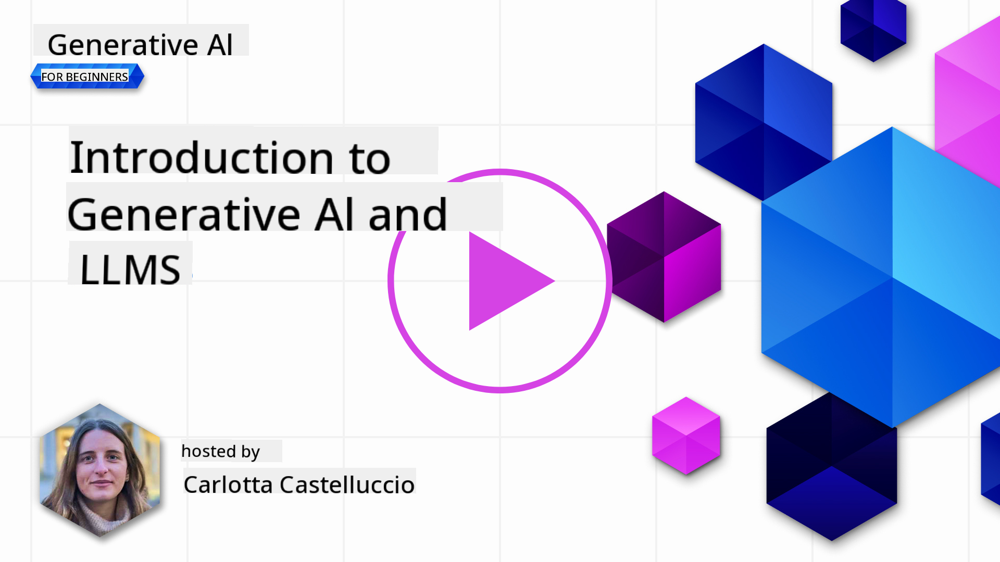
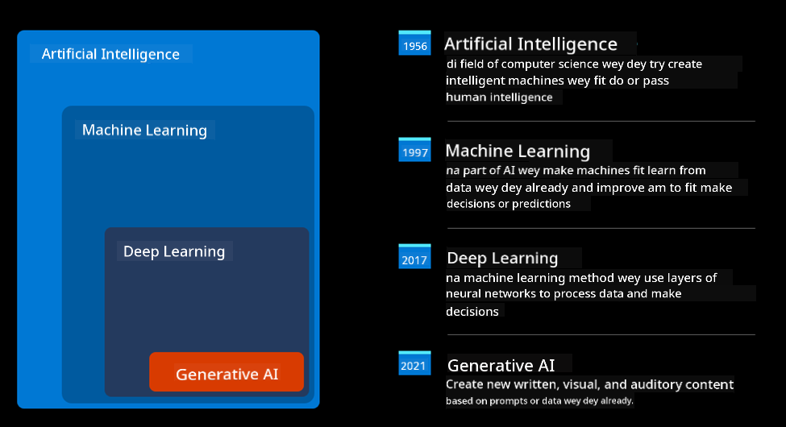
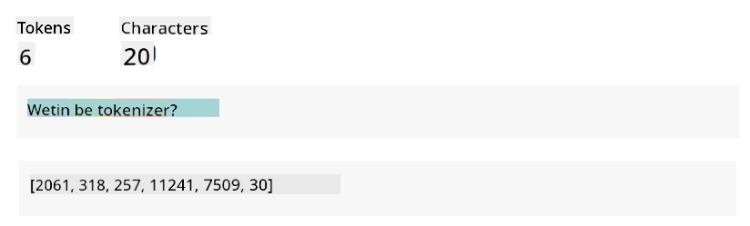
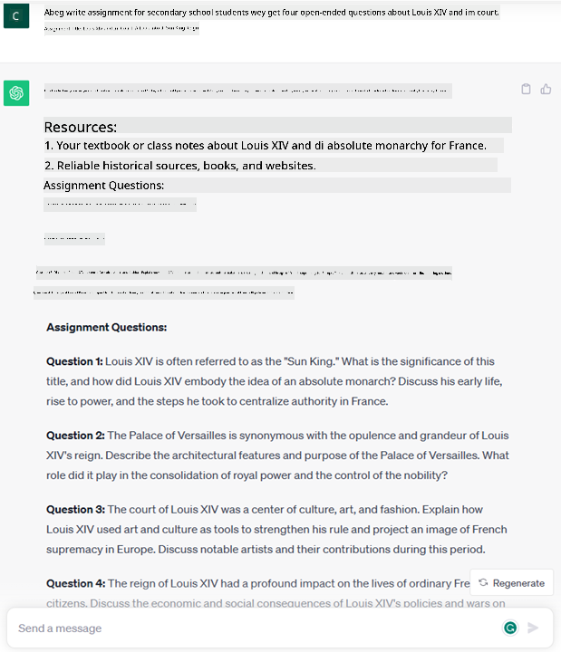
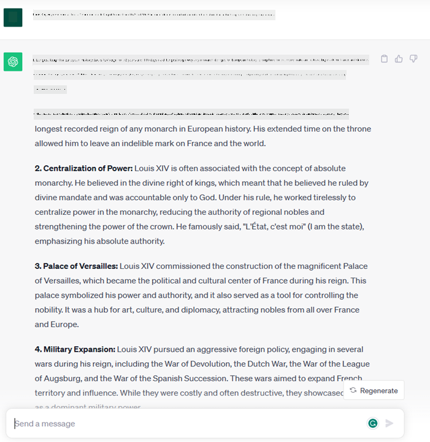
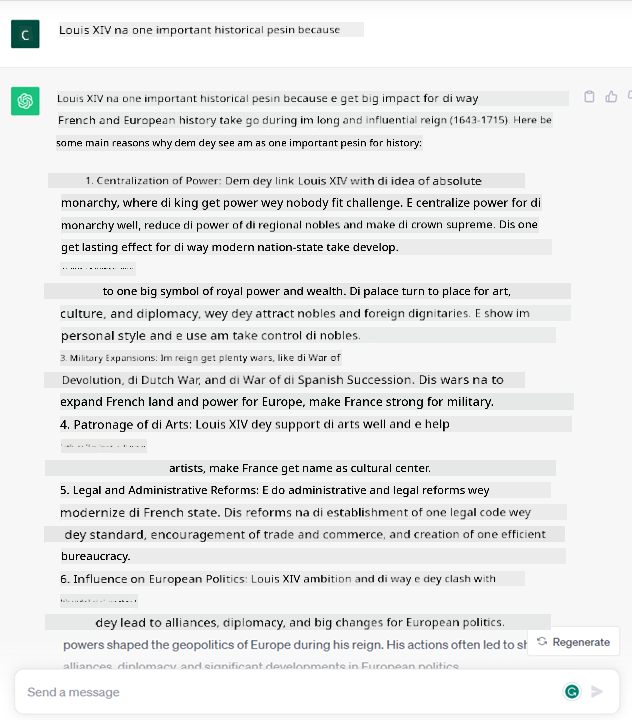
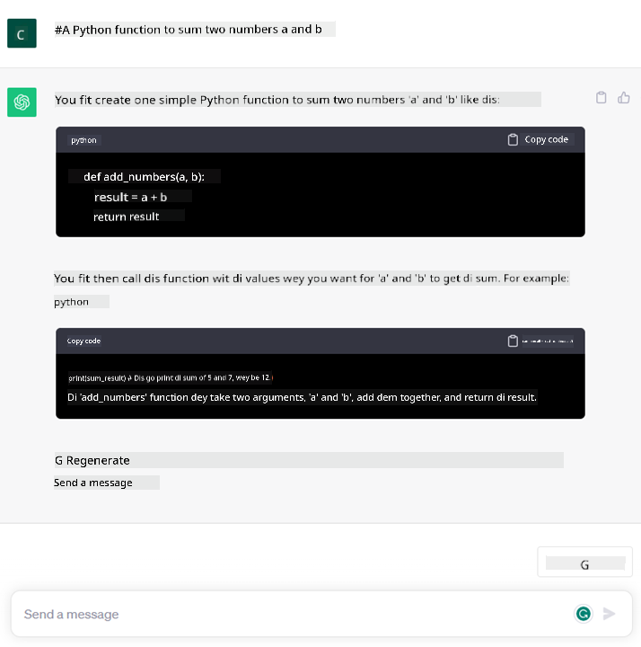

<!--
CO_OP_TRANSLATOR_METADATA:
{
  "original_hash": "bfb7901bdbece1ba3e9f35c400ca33e8",
  "translation_date": "2025-11-12T08:51:54+00:00",
  "source_file": "01-introduction-to-genai/README.md",
  "language_code": "pcm"
}
-->
# Introduction to Generative AI and Large Language Models

_(Click di image wey dey up to watch di video for dis lesson)_

Generative AI na artificial intelligence wey fit create text, images and oda kain content. Wetin make am beta technology be say e dey make AI easy for everybody, anybody fit use am just by typing text prompt, one sentence wey dey for natural language. You no need sabi language like Java or SQL to do something wey make sense, all you need na to use your own language, talk wetin you want and AI model go give you suggestion. Di kain tins wey you fit use am do plenty, like write or understand reports, write applications and plenty oda tins, all for seconds.

For dis curriculum, we go look how our startup dey use generative AI to open new ways for education and how we dey handle di challenges wey dey come with di social impact of di technology and di limitations wey e get.

## Introduction

Dis lesson go cover:

- Introduction to di business idea: our startup idea and mission.
- Generative AI and how we reach di technology wey dey now.
- How large language model dey work inside.
- Di main tins wey Large Language Models fit do and how person fit use am.

## Learning Goals

After you finish dis lesson, you go sabi:

- Wetin generative AI be and how Large Language Models dey work.
- How you fit use large language models for different tins, especially for education.

## Scenario: our educational startup

Generative Artificial Intelligence (AI) na di top level for AI technology, e dey push di limit of wetin people think say no fit happen before. Generative AI models get plenty tins wey dem fit do, but for dis curriculum we go look how e dey change education through one startup wey we go call _our startup_. Our startup dey work for education area and di mission wey we get na:

> _to make learning easy for everybody, anywhere for di world, make sure say everybody fit get education and give each person di kain learning wey dem need._

Our startup team sabi say we no fit reach dis goal if we no use one of di strongest tools wey dey now – Large Language Models (LLMs).

Generative AI dey change di way we dey learn and teach today, students fit get virtual teachers wey dey available 24 hours wey dey give plenty information and examples, and teachers fit use new tools to check how students dey do and give feedback.

To start, make we define some basic tins and words wey we go dey use for dis curriculum.

## How we take get Generative AI?

Even though di _hype_ wey dey around generative AI models plenty, dis technology don dey since di 60s. Now AI don reach di level wey e get human cognitive ability, like conversation, as we see for example [OpenAI ChatGPT](https://openai.com/chatgpt) or [Bing Chat](https://www.microsoft.com/edge/features/bing-chat?WT.mc_id=academic-105485-koreyst), wey dey use GPT model for web search Bing conversations.

If we go back small, di first AI prototypes na typewritten chatbots wey dey use knowledge wey dem collect from experts and put for computer. Di answers for di knowledge base dey triggered by keywords wey dey di input text. But e no take long before people see say dis method no dey work well.

### Di statistical way for AI: Machine Learning

Di big change happen for di 90s, when dem start to use statistical method for text analysis. Dis one bring new algorithms – wey dem dey call machine learning – wey fit learn pattern from data without person programming am directly. Dis method make machines fit understand human language: di statistical model go train with text-label pairings, so e fit classify unknown input text with di label wey dey represent di meaning of di message.

### Neural networks and di modern virtual assistants

For recent years, di way hardware don improve, wey fit handle plenty data and complex calculations, e help AI research, wey lead to di creation of advanced machine learning algorithms wey dem dey call neural networks or deep learning algorithms.

Neural networks (especially Recurrent Neural Networks – RNNs) make natural language processing better, e fit represent di meaning of text well, and e dey value di context of word for sentence.

Dis na di technology wey dey power di virtual assistants wey start for di first ten years of di new century, wey sabi interpret human language well, know wetin person need, and do action to meet di need – like answer with pre-defined script or use 3rd party service.

### Di present day, Generative AI

Na so we take reach Generative AI today, wey be one part of deep learning.

After many years of research for AI, new model architecture – wey dem dey call _Transformer_ – don pass di limit of RNNs, e fit take longer text as input. Transformers dey use attention mechanism, wey make di model dey give different weight to di inputs e receive, ‘pay attention’ to di important information, no matter di order for di text.

Most of di generative AI models wey dey now – wey dem dey call Large Language Models (LLMs), because dem dey work with text input and output – na dis architecture dem dey use. Wetin dey interesting about dis models – wey dem train with plenty unlabeled data from books, articles and websites – be say dem fit adapt to many tasks and fit generate text wey dey correct grammatically and even dey creative. So, e no just make machine sabi ‘understand’ input text well, e also make dem fit generate original response for human language.

## How large language models dey work?

For di next chapter we go look different types of Generative AI models, but for now make we see how large language models dey work, especially OpenAI GPT (Generative Pre-trained Transformer) models.

- **Tokenizer, text to numbers**: Large Language Models dey take text as input and dey generate text as output. But because dem be statistical models, dem dey work better with numbers than text. Na why every input to di model dey pass through tokenizer before e reach di main model. Token na small piece of text – wey fit get different number of characters, so di tokenizer dey split di input into array of tokens. Then, each token go get token index, wey be di number wey represent di original text.

- **Predicting output tokens**: If di model get n tokens as input (di max n dey different for each model), e fit predict one token as output. Dis token go join di input for di next round, like expanding window, wey dey make di user experience better as e dey give one or more sentences as answer. Na why, if you don use ChatGPT before, you go notice say sometimes e dey stop for middle of sentence.

- **Selection process, probability distribution**: Di model dey choose di output token based on di chance wey e go happen after di current text. Dis na because di model dey predict probability distribution for all di possible ‘next tokens’, based on di training wey e get. But e no dey always choose di token wey get di highest chance. Dem dey add small randomness to di choice, so di model go act like e dey think creatively – we no go get di same output for di same input. Dis randomness fit dey adjusted with one model parameter wey dem dey call temperature.

## How our startup fit use Large Language Models?

Now we don understand how large language model dey work, make we see some examples of di common tasks wey dem fit do well, especially for our business idea. We don talk say di main thing wey Large Language Model fit do na _create text from scratch, starting from text wey person write for natural language_.

But wetin be di kind text wey dem fit take as input and wetin dem fit give as output?
Di input for large language model na wetin dem dey call prompt, while di output na completion, wey mean di model dey generate di next token to complete di current input. We go talk more about wetin prompt be and how to design am well to get di best from di model. But for now, make we talk say prompt fit get:

- One **instruction** wey dey explain di kind output wey we dey expect from di model. Sometimes dis instruction fit get examples or extra data.

  1. Summary of article, book, product reviews and more, plus extraction of information from unstructured data.
    
    
  
  2. Creative ideas and writing of article, essay, assignment or more.
      
     

- One **question**, wey person go ask like conversation with di agent.
  
  

- One piece of **text to complete**, wey dey indirectly ask for writing help.
  
  

- One piece of **code** with di ask to explain and document am, or comment wey dey ask to generate code wey go do one specific task.
  
  

Di examples wey dey up dey simple and no dey show all di things wey Large Language Models fit do. Dem dey show di potential of generative AI, especially for education.

But di output wey generative AI dey give no dey perfect and sometimes di creativity of di model fit make am give output wey no make sense, or even offensive. Generative AI no be intelligent – at least for di full meaning of intelligence, wey include critical and creative thinking or emotional intelligence; e no dey predictable, and e no dey trustworthy, because e fit mix wrong information with correct one and present am confidently. For di next lessons, we go talk about all dis limitations and how we fit reduce dem.

## Assignment

Your assignment na to read more about [generative AI](https://en.wikipedia.org/wiki/Generative_artificial_intelligence?WT.mc_id=academic-105485-koreyst) and try to find one area wey you go add generative AI today wey no get am. How di impact go different from di "old way", you fit do something wey you no fit do before, or you go dey faster? Write 300 words summary about wetin your dream AI startup go look like and include headers like "Problem", "How I go use AI", "Impact" and if you like, business plan.

If you do dis task, you fit even apply for Microsoft's incubator, [Microsoft for Startups Founders Hub](https://www.microsoft.com/startups?WT.mc_id=academic-105485-koreyst) wey dey give credits for Azure, OpenAI, mentoring and plenty more, check am out!

## Knowledge check

Wetin true about large language models?

1. You go get di same response every time.
1. E dey do things perfect, e sabi add numbers, produce working code etc.
1. Di response fit change even if you use di same prompt. E dey good for giving first draft of something, whether na text or code. But you go need improve di result.

A: 3, LLM no dey predictable, di response dey change, but you fit control di change with temperature setting. You no suppose expect am to dey perfect, e dey to help you do di hard work wey go give you good first try wey you go improve.

## Great Work! Continue di Journey

After you finish dis lesson, check out our [Generative AI Learning collection](https://aka.ms/genai-collection?WT.mc_id=academic-105485-koreyst) to continue to sabi more about Generative AI!
Make you waka go Lesson 2 wey we go check how to [explore and compare different LLM types](../02-exploring-and-comparing-different-llms/README.md?WT.mc_id=academic-105485-koreyst)!

---

<!-- CO-OP TRANSLATOR DISCLAIMER START -->
**Disclaimer**:  
Dis dokyument don use AI translation service [Co-op Translator](https://github.com/Azure/co-op-translator) do di translation. Even as we dey try make am correct, abeg sabi say machine translation fit get mistake or no dey accurate well. Di original dokyument wey dey for im native language na di main source wey you go trust. For important information, e better make professional human translator check am. We no go fit take blame for any misunderstanding or wrong interpretation wey fit happen because you use dis translation.
<!-- CO-OP TRANSLATOR DISCLAIMER END -->