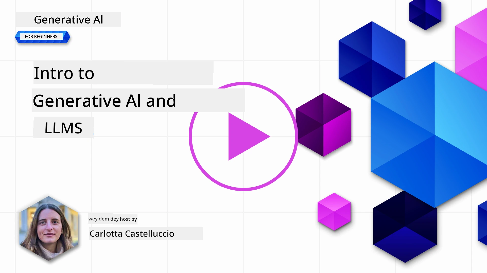
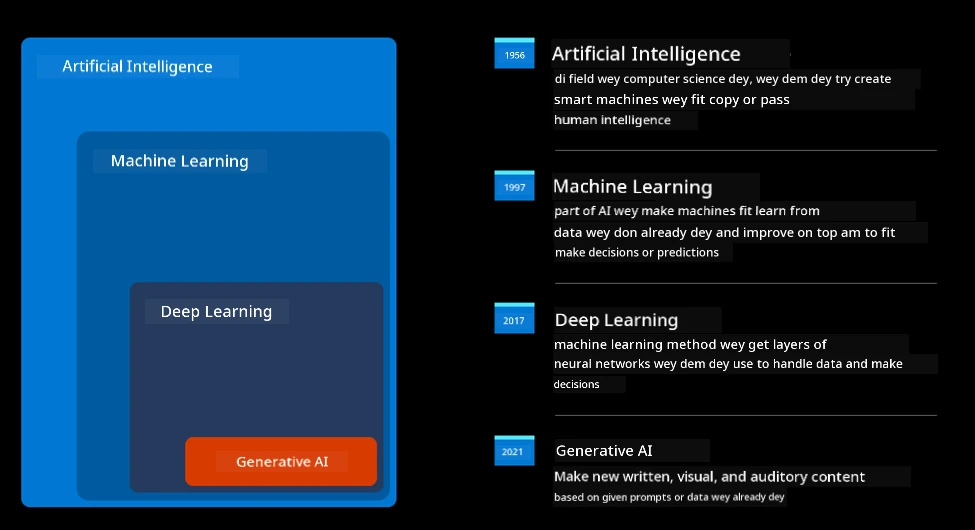
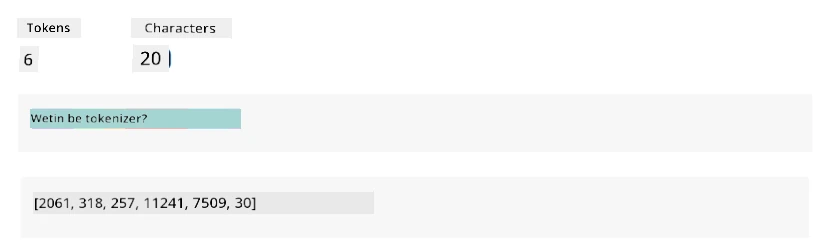
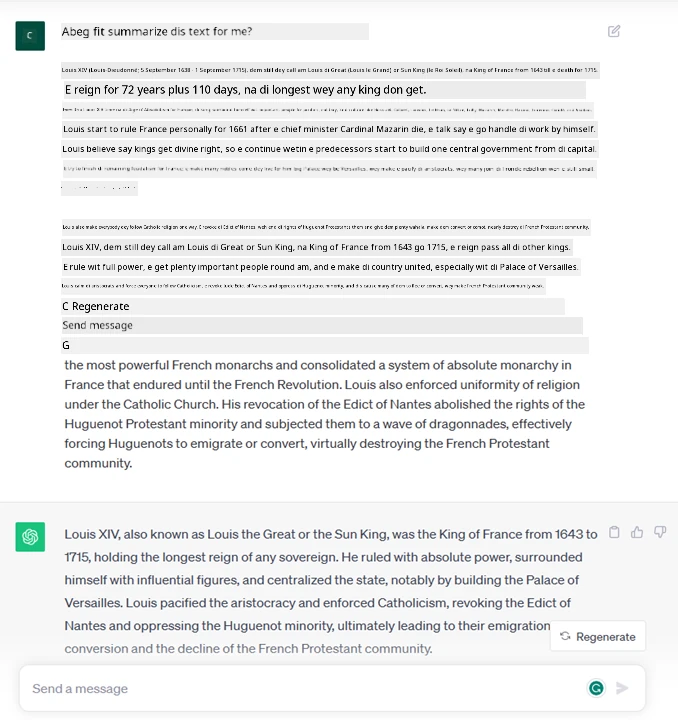
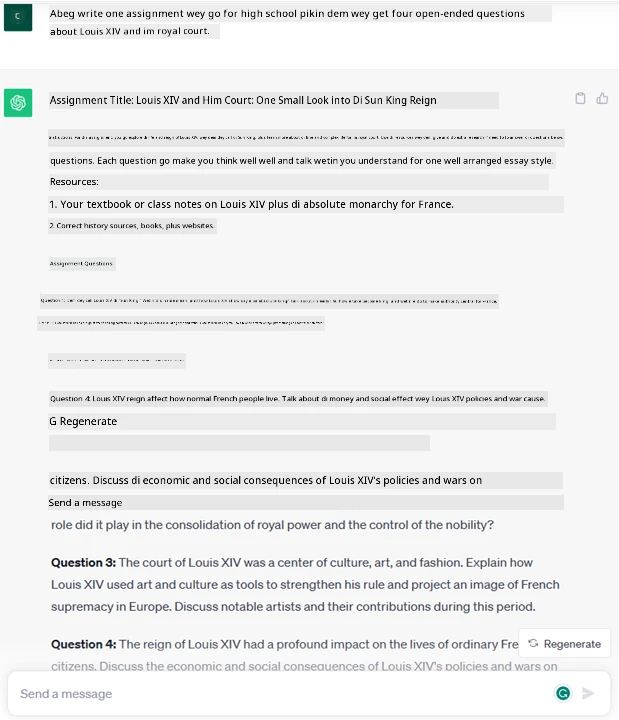
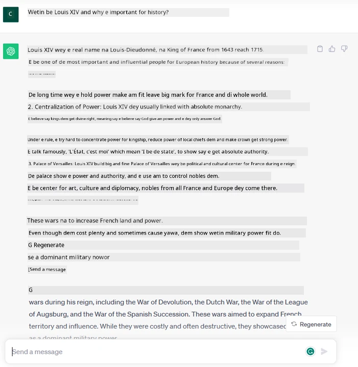
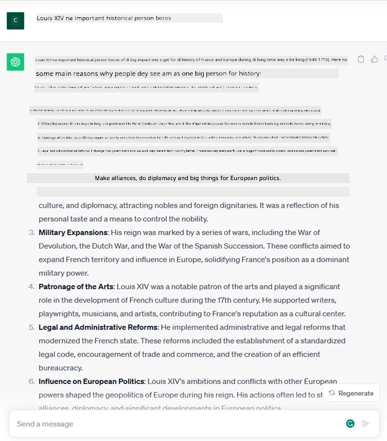
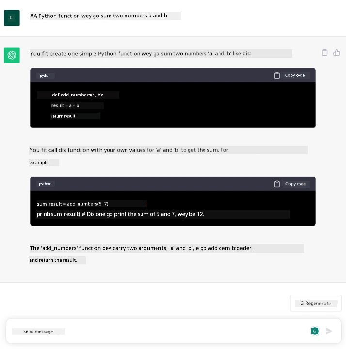

# Introduction to Generative AI and Large Language Models

_(Click the image above to view video of this lesson)_

Generative AI na artificial intelligence wey fit create text, pictures and oda kain content. Wetin make am beta technology na say e dey open AI for everybody, anybodi fit use am just by giving small text prompt, one sentence wey na normal language. You no need learn language like Java or SQL to fit do beta tin, all wey you need na to use your language, talk wetin you want and AI model go show you suggestion. Di tins wey fit use am for get plenti impact, you fit write or understand report dem, write application dem and plenti oda tins, all na quick quick.

For dis curriculum, we go explore how our startup dey use generative AI to open beta new tins for education world and how we dey solve di wahala wey go follow how e go affect society and di limits wey the technology get.

## Introduction

Dis lesson go cover:

- Introduction to di business tin: our startup idea and mission.
- Generative AI and how we take reach di technology we dey now.
- How large language model dey work inside.
- Main powers and beta ways to use Large Language Models.

## Learning Goals

After you finish dis lesson, you go sabi:

- Wetin generative AI be and how Large Language Models dey work.
- How you fit use large language models for different tins, especially for education matter dem.

## Scenario: our educational startup

Generative Artificial Intelligence (AI) na di highest level for AI technology, e dey push wetin people ever think say e possible. Generative AI models get plenti powers and areas wey dem fit use am, but for dis course we go see how e dey change education through one story startup. We go call dis startup _our startup_. Our startup dey education space with one big mission wey be

> _beta access to learning anywhere for di world, make education reach everybody equally and give each learner learning wey dey fit am well well, according to wetin dem need_.

Our startup people sabi say we no fit reach dis goal if we no use one of di strongest tin for today – Large Language Models (LLMs).

Generative AI dey expected to change how we learn and teach today, with students fit get virtual teachers anytime, 24 hours, wey go give plenti info and examples, and teachers fit use new tools to check their students and give dem feedback.

To start, mek we define some basic tins and words we go dey use for di whole course.

## How did we get Generative AI?

Even though dis generative AI models don dey make plenty noise recently, dis technology don dey develop since di 60s. Now, AI get human-like mind power, like conversation, as you fit see for example [OpenAI ChatGPT](https://openai.com/chatgpt) or [Microsoft Copilot](https://copilot.microsoft.com/?WT.mc_id=academic-105485-koreyst), wey also use GPT model for talk and search for web.

Before this, di first AI prototypes use typewritten chatbots, wey dey use knowledge wey dem collect from expert pipo and put for computer. Di answers wey dem get na from keywords wey dey inside di text wey dem input.
But e quick clear say dis style of chatbot no fit grow well.

### A statistical approach to AI: Machine Learning

Di 90s bring one big change: people start use statistical approach for text analysis. Dis lead to new algorithm – wey dem call machine learning – wey fit learn patterns from data without you tell am how exactly. Dis approach let machines sabi human language better: statistical model dey train on text-label pairings, so e fit fit classify unknown text with label wey show wetin message mean.

### Neural networks and modern virtual assistants

Recently hardware don beta, fit manage big data and heavy calculations, dis push research for AI and lead to better machine learning algorithms wey dem call neural networks or deep learning.

Neural networks (especially Recurrent Neural Networks – RNNs) don help plenti for natural language processing, dem fit show text meaning well and dey value word context inside sentence.

Dis technology na wetin power virtual assistants wey show for first ten years of this century, wey sabi human language well, fit understand wetin person want, then do action to help – like answer with script or use third party service.

### Present day, Generative AI

Na so generative AI come dey today, we fit see am as a part of deep learning.

After plenty years of AI research, new model style – wey dem call _Transformer_ – pass RNN limits, e fit take longer text as input. Transformers dey use attention mechanism, wey make model fit put more weight for important info, no matter position for text sequence.

Most new generative AI models – still dey call Large Language Models (LLMs) since dem dey deal with text input and output – na based on dis architecture. Wetin dey interesting be say dem train dem on huge amount of unlabeled data from books, articles and websites – so e fit adapt to many tasks and generate correct text wey dey creative small. Dem no just make machine sabi text well, but dem fit make am generate original answer like human.

## How do large language models work?

For di next chapter we go explore different kinds of Generative AI models, but now make we look how large language models dey work well, especially OpenAI GPT (Generative Pre-trained Transformer) models.

- **Tokenizer, text to numbers**: Large Language Models dey receive text as input and generate text as output. But as dem be statistical models, dem dey work beta with numbers than text. Na why every input to model na tokenizer first dey process am before core model use am. Token na small part of text – e get different number of characters, so tokenizer main work na to split input into tokens. Then each token get token index, na number code of original text.

- **Predicting output tokens**: If model get n tokens as input (max n dey different for one model to oda), e fit predict one token as output. Dis token go enter input for next round, like say e dey expand window, so user sabi get one (or more) sentence as answer. Na why if you try ChatGPT, you fit notice say sometimes e stop for middle of sentence.

- **Selection process, probability distribution**: Model go choose output token based on how likely e dey to appear after current text sequence. Model dey predict probability for all the ‘next tokens’, based on training. But e no always choose token wey get highest probability. Small randomness dey put inside selection, make model no dey always give same answer for same input. This randomness dey simulate creative thinking and you fit control am with parameter wey dem call temperature.

## How can our startup leverage Large Language Models?

Now say we sabi better how large language model dey work inside, make we see some beta examples of tins wey dem fit do well, especially for our business scenario.
We talk say main power of Large Language Model na _to generate text from scratch, starting from one textual input wey na normal language_.

But which kain textual input and output?
Input wey Large Language Model dey take na prompt, output na completion, dis one na how model dey generate next token to finish input. We go discuss deep on wetin prompt be and how to design am to get best from model. But for now, make we just talk say prompt fit get:

- One **instruction** wey tell type output we want. Sometimes instruction fit get examples or extra data.

  1. Summary of article, book, product reviews and more, plus insight collection from unstructured data.
    
    
  
  2. Creative ideation and design of article, essay, assignment or more.
      
     

- One **question**, wey dem ask like conversation with agent.
  
  

- One part of **text to complete**, wey mean say you dey ask for writing help.
  
  

- One part of **code** plus request to explain and document am, or comment to generate code for one task.
  
  

Di examples we show na simple ones, no be all Large Language Models fit do. Dem suppose show how generative AI fit help, especially but no only for education.

Also, output from generative AI no perfect and sometimes di creativity fit make output confuse, or fit be offensive. Generative AI no be intelligent for full meaning, no get full critical or creative reasoning, or emotional intelligence; e no dey deterministic and no dey always trustable, because e fit combine false things, like wrong facts, content and statements with correct ones, and talk am like say e sure. For next lessons, we go talk about all these wahalas and how to reduce dem.

## Assignment

Your assignment na to read more about [generative AI](https://en.wikipedia.org/wiki/Generative_artificial_intelligence?WT.mc_id=academic-105485-koreyst) and try find one area wey you go put generative AI now wey no get am. How e go different from di old way, you fit do something before wey you no fit before, or you go fast pass before? Write 300-word summary on how your dream AI startup go be and put headers like "Problem", "How I would use AI", "Impact" and if you like, business plan.

If you do dis task, you fit ready to apply for Microsoft incubator, [Microsoft for Startups Founders Hub](https://www.microsoft.com/startups?WT.mc_id=academic-105485-koreyst) wey dey give credits for Azure, OpenAI, mentoring and more, check am out!

## Knowledge check

Wetin true about large language models?

1. You go get exact same answer every time.
1. E dey do all tins perfectly, beta at adding numbers, produce working code and so on.
1. Di answer fit change even if you use same prompt. E beta at giving first draft of any tin, text or code. But you need improve the output.

A: 3, LLM no dey deterministic, answer dey change, but you fit control am with temperature setting. You no gats expect perfect thing, e dey here to help you carry heavy work, often meaning say you go get beta first try for tin wey you gats improve slowly.

## Great Work! Continue the Journey

After you finish dis lesson, check our [Generative AI Learning collection](https://aka.ms/genai-collection?WT.mc_id=academic-105485-koreyst) to continue sabi more about Generative AI!

Go Lesson 2 weh we go check how to [explore and compare different LLM types](../02-exploring-and-comparing-different-llms/README.md?WT.mc_id=academic-105485-koreyst)!

---

<!-- CO-OP TRANSLATOR DISCLAIMER START -->
**Disclaimer**:
Dis document don translate wit AI translation service [Co-op Translator](https://github.com/Azure/co-op-translator). Even tho we dey try make am correct, abeg make you know say automated translation fit get errors or mistakes. Di original document for dia own language na im be di correct source. For important info, make person wey sabi human translation do am. We no go responsible for any misunderstanding or wrong understanding wey fit happen because of dis translation.
<!-- CO-OP TRANSLATOR DISCLAIMER END -->