# Exploring and comparing different LLMs

[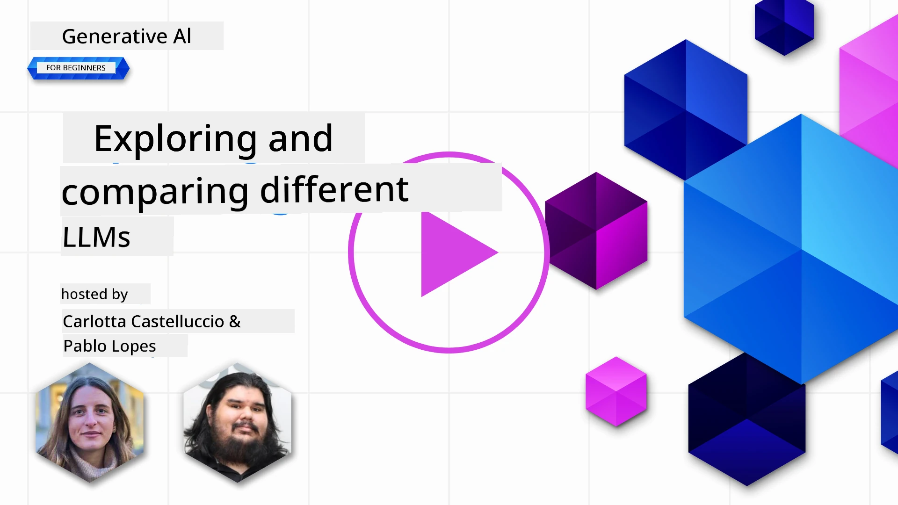](https://youtu.be/KIRUeDKscfI?si=8BHX1zvwzQBn-PlK)

> _Click di image wey dey up to watch di video for dis lesson_

For di last lesson, we don see how Generative AI dey change di technology world, how Large Language Models (LLMs) dey work, and how business - like our startup - fit use am for dia own case and grow! For dis chapter, we go compare and check di different types of large language models (LLMs) to sabi dia good and bad sides.

Di next step for our startup journey na to check di LLMs wey dey now and sabi which one go fit our own case.

## Introduction

Dis lesson go cover:

- Di different types of LLMs wey dey now.
- How to test, try, and compare different models for your own case for Azure.
- How to deploy LLM.

## Learning Goals

After you finish dis lesson, you go fit:

- Choose di correct model for your own case.
- Sabi how to test, try, and make di model perform better.
- Sabi how businesses dey deploy models.

## Sabi di different types of LLMs

LLMs get different categories based on dia architecture, training data, and di case wey dem dey use am for. To sabi dis difference go help our startup choose di correct model for di situation, and sabi how to test, try, and make di performance better.

Plenty types of LLM models dey, di one wey you go choose depend on wetin you wan use am do, di data wey you get, how much you fit pay, and other things.

If you wan use di models for text, audio, video, image generation, and so on, you fit choose different type of model.

- **Audio and speech recognition**. For dis one, Whisper-type models dey good as dem dey general-purpose and dem dey for speech recognition. E dey train on different audio and fit do multilingual speech recognition. Learn more about [Whisper type models here](https://platform.openai.com/docs/models/whisper?WT.mc_id=academic-105485-koreyst).

- **Image generation**. For image generation, DALL-E and Midjourney na two popular choices. DALL-E dey available for Azure OpenAI. [Read more about DALL-E here](https://platform.openai.com/docs/models/dall-e?WT.mc_id=academic-105485-koreyst) and also for Chapter 9 of dis curriculum.

- **Text generation**. Most models dey train for text generation and you get plenty choices from GPT-3.5 to GPT-4. Dem get different costs, GPT-4 na di most expensive. E good to check di [Azure OpenAI playground](https://oai.azure.com/portal/playground?WT.mc_id=academic-105485-koreyst) to see which model go fit your needs for capability and cost.

- **Multi-modality**. If you wan handle different types of data for input and output, you fit check models like [gpt-4 turbo with vision or gpt-4o](https://learn.microsoft.com/azure/ai-services/openai/concepts/models#gpt-4-and-gpt-4-turbo-models?WT.mc_id=academic-105485-koreyst) - di latest OpenAI models - wey fit combine natural language processing with visual understanding, so you fit interact through multi-modal interfaces.

To choose model mean say you go get some basic capabilities, but e fit no dey enough. Many times, you get company-specific data wey you go need to show di LLM. Different ways dey to do dis, we go talk more about am for di next sections.

### Foundation Models versus LLMs

Di term Foundation Model na [Stanford researchers coin am](https://arxiv.org/abs/2108.07258?WT.mc_id=academic-105485-koreyst) and dem define am as AI model wey get some criteria, like:

- **Dem dey train using unsupervised learning or self-supervised learning**, meaning dem dey train on data wey no get label, and dem no need human annotation or labeling of data for dia training process.
- **Dem be very big models**, wey dey based on very deep neural networks wey dem train on billions of parameters.
- **Dem dey meant to serve as ‘foundation’ for other models**, meaning dem fit dey use as starting point for other models wey dem go build on top, wey dem fit do by fine-tuning.

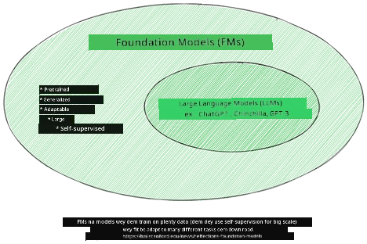

Image source: [Essential Guide to Foundation Models and Large Language Models | by Babar M Bhatti | Medium
](https://thebabar.medium.com/essential-guide-to-foundation-models-and-large-language-models-27dab58f7404)

To explain dis difference more, make we use ChatGPT as example. To build di first version of ChatGPT, dem use one model wey dem call GPT-3.5 as di foundation model. Dis mean say OpenAI use some chat-specific data to create one tuned version of GPT-3.5 wey dem specialize to perform well for chat situations, like chatbots.

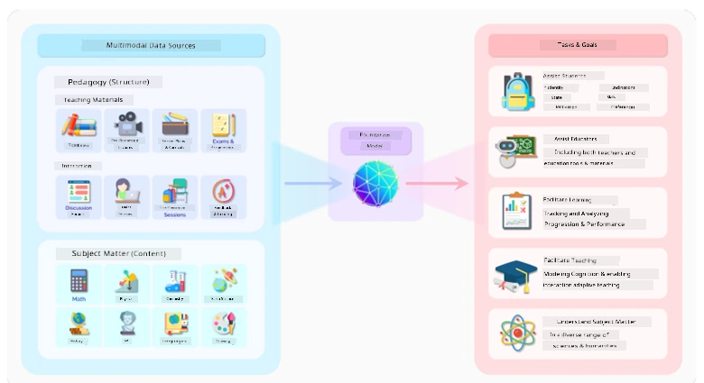

Image source: [2108.07258.pdf (arxiv.org)](https://arxiv.org/pdf/2108.07258.pdf?WT.mc_id=academic-105485-koreyst)

### Open Source versus Proprietary Models

Another way to categorize LLMs na whether dem be open source or proprietary.

Open-source models na models wey dem make available to di public and anybody fit use am. Di company wey create am or di research community fit make am available. People fit check, change, and customize di models for different LLM cases. But dem no dey always optimized for production use, and dem fit no perform reach proprietary models. Plus, di money wey dem dey use for open-source models fit dey small, and dem fit no dey maintain am for long or update am with di latest research. Examples of popular open-source models na [Alpaca](https://crfm.stanford.edu/2023/03/13/alpaca.html?WT.mc_id=academic-105485-koreyst), [Bloom](https://huggingface.co/bigscience/bloom) and [LLaMA](https://llama.meta.com).

Proprietary models na models wey company dey own and dem no dey make am available to di public. Dis models dey optimized for production use. But people no fit check, change, or customize di models for different cases. Plus, dem no dey always free, and you fit need subscription or payment to use am. Also, di users no get control over di data wey dem use train di model, so dem go need trust di model owner to make sure dem dey committed to data privacy and responsible AI use. Examples of popular proprietary models na [OpenAI models](https://platform.openai.com/docs/models/overview?WT.mc_id=academic-105485-koreyst), [Google Bard](https://sapling.ai/llm/bard?WT.mc_id=academic-105485-koreyst) or [Claude 2](https://www.anthropic.com/index/claude-2?WT.mc_id=academic-105485-koreyst).

### Embedding versus Image generation versus Text and Code generation

LLMs fit dey categorize by di output wey dem dey generate.

Embeddings na models wey fit change text into numbers, wey dem dey call embedding, wey be numerical representation of di input text. Embeddings dey make am easy for machines to sabi di relationship between words or sentences and fit dey use as input for other models, like classification models, or clustering models wey dey perform better on numerical data. Embedding models dey often use for transfer learning, where dem dey build model for one task wey get plenty data, and then dem dey reuse di model weights (embeddings) for other tasks. Example of dis category na [OpenAI embeddings](https://platform.openai.com/docs/models/embeddings?WT.mc_id=academic-105485-koreyst).

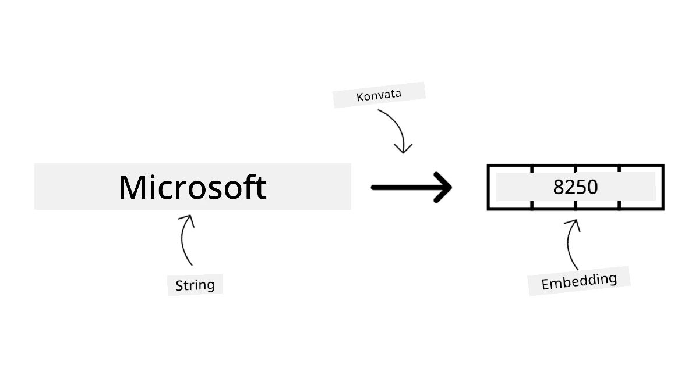

Image generation models na models wey dey generate images. Dem dey often use for image editing, image synthesis, and image translation. Image generation models dey train on big datasets of images, like [LAION-5B](https://laion.ai/blog/laion-5b/?WT.mc_id=academic-105485-koreyst), and dem fit use am to create new images or edit old ones with inpainting, super-resolution, and colorization techniques. Examples na [DALL-E-3](https://openai.com/dall-e-3?WT.mc_id=academic-105485-koreyst) and [Stable Diffusion models](https://github.com/Stability-AI/StableDiffusion?WT.mc_id=academic-105485-koreyst).

Text and code generation models na models wey dey generate text or code. Dem dey often use for text summarization, translation, and question answering. Text generation models dey train on big datasets of text, like [BookCorpus](https://www.cv-foundation.org/openaccess/content_iccv_2015/html/Zhu_Aligning_Books_and_ICCV_2015_paper.html?WT.mc_id=academic-105485-koreyst), and dem fit use am to create new text, or answer questions. Code generation models, like [CodeParrot](https://huggingface.co/codeparrot?WT.mc_id=academic-105485-koreyst), dey train on big datasets of code, like GitHub, and dem fit use am to create new code, or fix bugs for old code.

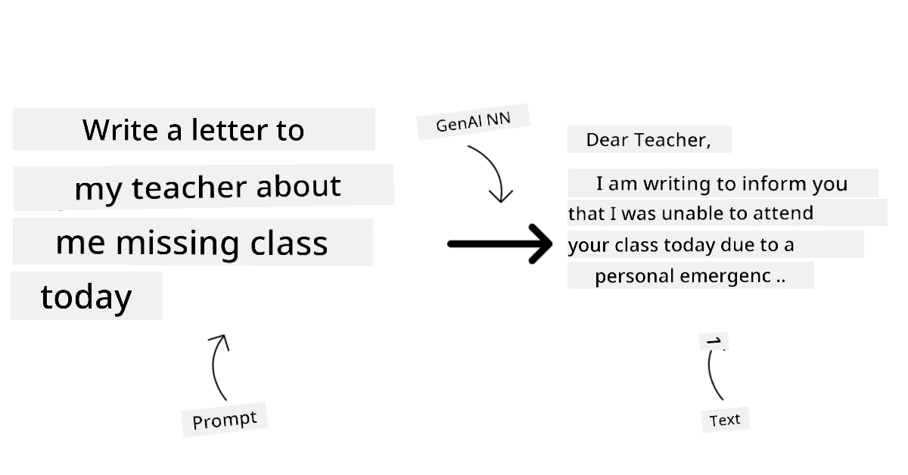

### Encoder-Decoder versus Decoder-only

To talk about di different types of architectures of LLMs, make we use one example.

Imagine say your manager give you task to write quiz for students. You get two colleagues; one dey create di content and di other dey review am.

Di person wey dey create di content na like Decoder-only model, dem fit look di topic and wetin you don write already, then dem fit write course based on dat. Dem dey very good for writing engaging and informative content, but dem no dey too good for understanding di topic and di learning objectives. Examples of Decoder models na GPT family models, like GPT-3.

Di person wey dey review na like Encoder-only model, dem dey look di course wey dem don write and di answers, dem dey notice di relationship between dem and sabi di context, but dem no dey good for generating content. Example of Encoder-only model na BERT.

Imagine say we fit get person wey fit create and review di quiz, dis one na Encoder-Decoder model. Examples na BART and T5.

### Service versus Model

Now, make we talk about di difference between service and model. Service na product wey Cloud Service Provider dey offer, and e dey often combine models, data, and other components. Model na di main part of service, and e dey often be foundation model, like LLM.

Services dey often optimized for production use and e dey easy to use pass models, through graphical user interface. But services no dey always free, and you fit need subscription or payment to use am, to take advantage of di service owner’s equipment and resources, reduce expenses, and scale easily. Example of service na [Azure OpenAI Service](https://learn.microsoft.com/azure/ai-services/openai/overview?WT.mc_id=academic-105485-koreyst), wey dey offer pay-as-you-go plan, meaning users go pay based on how much dem use di service. Also, Azure OpenAI Service dey offer enterprise-grade security and responsible AI framework on top of di model capabilities.

Models na just di Neural Network, with di parameters, weights, and others. E dey allow companies to run locally, but dem go need buy equipment, build structure to scale, and buy license or use open-source model. Model like LLaMA dey available to use, but e go need computational power to run di model.

## How to test and iterate with different models to understand performance on Azure

Once our team don check di LLMs wey dey now and find some wey fit dia case, di next step na to test dem with dia data and workload. Dis na process wey dem go do step by step, through experiments and measures.
Most of di models wey we mention for di previous paragraphs (OpenAI models, open source models like Llama2, and Hugging Face transformers) dey available for [Model Catalog](https://learn.microsoft.com/azure/ai-studio/how-to/model-catalog-overview?WT.mc_id=academic-105485-koreyst) inside [Azure AI Studio](https://ai.azure.com/?WT.mc_id=academic-105485-koreyst).

[Azure AI Studio](https://learn.microsoft.com/azure/ai-studio/what-is-ai-studio?WT.mc_id=academic-105485-koreyst) na Cloud Platform wey dem design for developers to take build generative AI applications and manage di whole development process - from experimentation to evaluation - by combining all Azure AI services inside one hub wey get better GUI. Di Model Catalog for Azure AI Studio dey allow user to:

- Find di Foundation Model wey dem need for di catalog - whether e be proprietary or open source, dem fit filter am by task, license, or name. To make search easy, di models dey arranged inside collections, like Azure OpenAI collection, Hugging Face collection, and others.

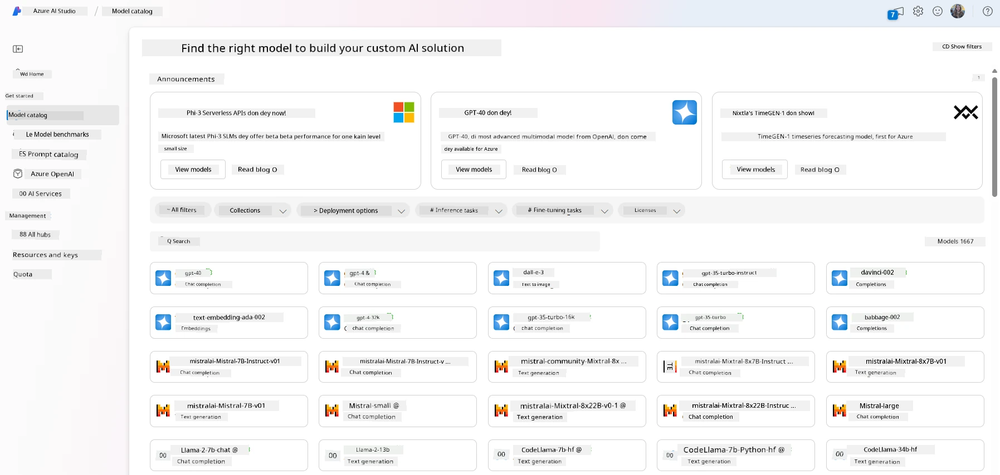

- Check di model card, wey go include detailed description of how dem suppose use am and di training data, code samples, and evaluation results from di internal evaluations library.

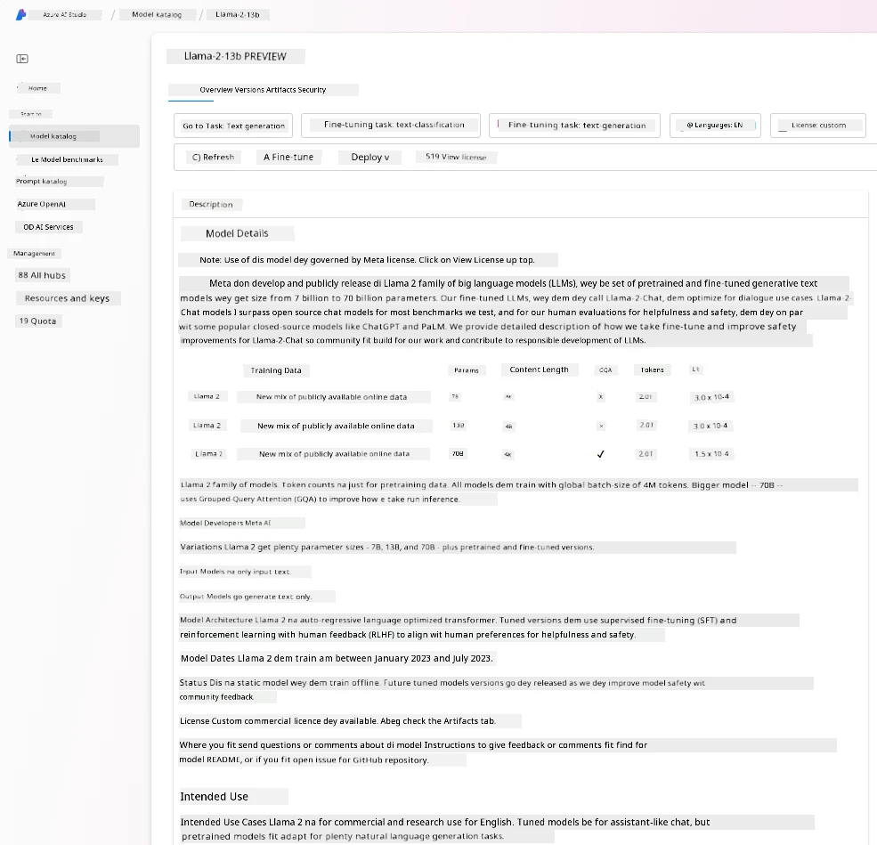

- Compare benchmarks across models and datasets wey dey available for di industry to know which one go fit di business scenario, through di [Model Benchmarks](https://learn.microsoft.com/azure/ai-studio/how-to/model-benchmarks?WT.mc_id=academic-105485-koreyst) pane.

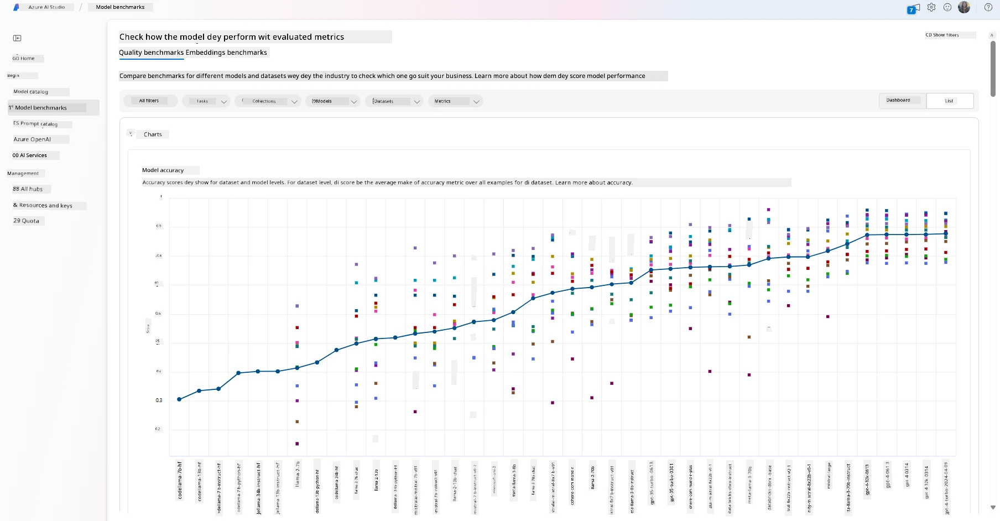

- Fine-tune di model on custom training data to make di model perform better for one specific workload, using di experimentation and tracking features wey dey Azure AI Studio.

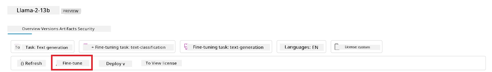

- Deploy di original pre-trained model or di fine-tuned version to remote real-time inference - managed compute - or serverless api endpoint - [pay-as-you-go](https://learn.microsoft.com/azure/ai-studio/how-to/model-catalog-overview#model-deployment-managed-compute-and-serverless-api-pay-as-you-go?WT.mc_id=academic-105485-koreyst) - so dat applications fit dey use am.

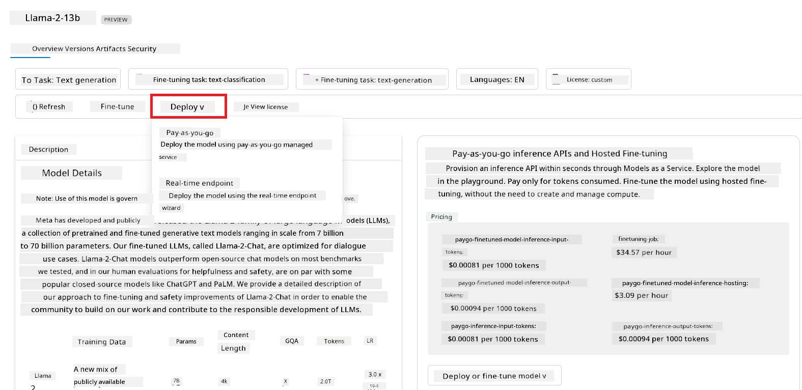

> [!NOTE]
> No be all di models wey dey di catalog fit dey fine-tuned and/or pay-as-you-go deployment. Make you check di model card for di details about di model capabilities and limitations.

## How to make LLM results better

We don discuss with our startup team different types of LLMs and one Cloud Platform (Azure Machine Learning) wey dey allow us compare different models, test dem with data, improve performance, and deploy dem for inference endpoints.

But when dem suppose consider fine-tuning model instead of using pre-trained one? E get other ways to make model perform better for specific workloads?

E get different ways wey business fit use to get di results wey dem need from LLM. You fit choose different types of models wey get different levels of training when you dey deploy LLM for production, with different levels of complexity, cost, and quality. Here be some of di ways:

- **Prompt engineering with context**. Di idea na to provide enough context when you dey prompt so you go get di response wey you need.

- **Retrieval Augmented Generation, RAG**. Your data fit dey inside database or web endpoint for example, to make sure say dis data, or part of am, dey included when you dey prompt, you fit fetch di correct data and add am to di user prompt.

- **Fine-tuned model**. Dis one na when you train di model more with your own data so di model go dey more accurate and go fit meet your needs well, but e fit cost.

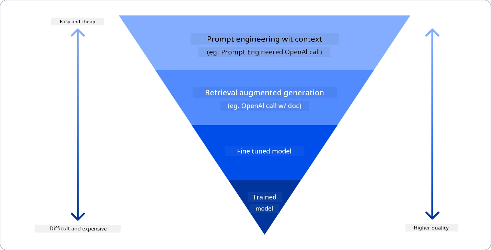

Img source: [Four Ways that Enterprises Deploy LLMs | Fiddler AI Blog](https://www.fiddler.ai/blog/four-ways-that-enterprises-deploy-llms?WT.mc_id=academic-105485-koreyst)

### Prompt Engineering with Context

Pre-trained LLMs dey work well for general natural language tasks, even if you just give dem short prompt, like sentence to complete or question – di so-called “zero-shot” learning.

But di more user fit frame di question well, with detailed request and examples – di Context – di more accurate and close to wetin di user dey expect di answer go be. For dis case, we dey talk about “one-shot” learning if di prompt get only one example and “few-shot learning” if e get multiple examples. Prompt engineering with context na di cheapest way to start.

### Retrieval Augmented Generation (RAG)

LLMs get limitation say dem fit only use di data wey dem take train di model to generate answer. Dis mean say dem no sabi anything about wetin happen after di training process, and dem no fit access private information (like company data). 

RAG fit help solve dis problem, na technique wey dey add external data to di prompt in di form of document chunks, considering prompt length limits. Dis one dey supported by Vector database tools (like [Azure Vector Search](https://learn.microsoft.com/azure/search/vector-search-overview?WT.mc_id=academic-105485-koreyst)) wey dey retrieve di correct chunks from different pre-defined data sources and add dem to di prompt Context.

Dis technique dey very useful if business no get enough data, time, or resources to fine-tune LLM, but dem still wan make di model perform better for one specific workload and reduce di risk of fabrications, like false information or harmful content.

### Fine-tuned model

Fine-tuning na process wey dey use transfer learning to ‘adapt’ di model to one downstream task or to solve one specific problem. E different from few-shot learning and RAG because e dey create new model, wey get updated weights and biases. E need set of training examples wey get one input (di prompt) and di output wey dey follow am (di completion). 

Dis approach dey good if:

- **Using fine-tuned models**. Business wan use fine-tuned models wey no too strong (like embedding models) instead of high performance models, so e go cheap and fast.

- **Considering latency**. If latency dey important for di use-case, so e no go possible to use very long prompts or di number of examples wey di model suppose learn no go fit di prompt length limit.

- **Staying up to date**. Business get plenty high-quality data and correct labels and dem get di resources wey dem need to keep di data up to date.

### Trained model

To train LLM from scratch na di hardest and most complex way to follow, e need plenty data, skilled people, and correct computational power. Dis option na only for business wey get domain-specific use case and plenty domain-centric data.

## Knowledge check

Which approach fit dey good to make LLM completion results better?

1. Prompt engineering with context
1. RAG
1. Fine-tuned model

A:3, if you get di time, resources, and high-quality data, fine-tuning na di better option to stay up to date. But if you wan improve things and you no get time, e go make sense to consider RAG first.

## 🚀 Challenge

Read more about how you fit [use RAG](https://learn.microsoft.com/azure/search/retrieval-augmented-generation-overview?WT.mc_id=academic-105485-koreyst) for your business.

## Great Work, Continue Your Learning

After you finish dis lesson, check out our [Generative AI Learning collection](https://aka.ms/genai-collection?WT.mc_id=academic-105485-koreyst) to continue to learn more about Generative AI!

Go Lesson 3 where we go talk about how to [build with Generative AI Responsibly](../03-using-generative-ai-responsibly/README.md?WT.mc_id=academic-105485-koreyst)!

---

<!-- CO-OP TRANSLATOR DISCLAIMER START -->
**Disclaimer**:  
Dis dokyument don use AI transleto service [Co-op Translator](https://github.com/Azure/co-op-translator) do di translation. Even as we dey try make am correct, abeg sabi say machine translation fit get mistake or no dey accurate well. Di original dokyument wey dey for im native language na di main source wey you go trust. For important mata, e good make professional human transleto check am. We no go fit take blame for any misunderstanding or wrong interpretation wey fit happen because you use dis translation.
<!-- CO-OP TRANSLATOR DISCLAIMER END -->