# Explorim an kompare diffrent LLMs

[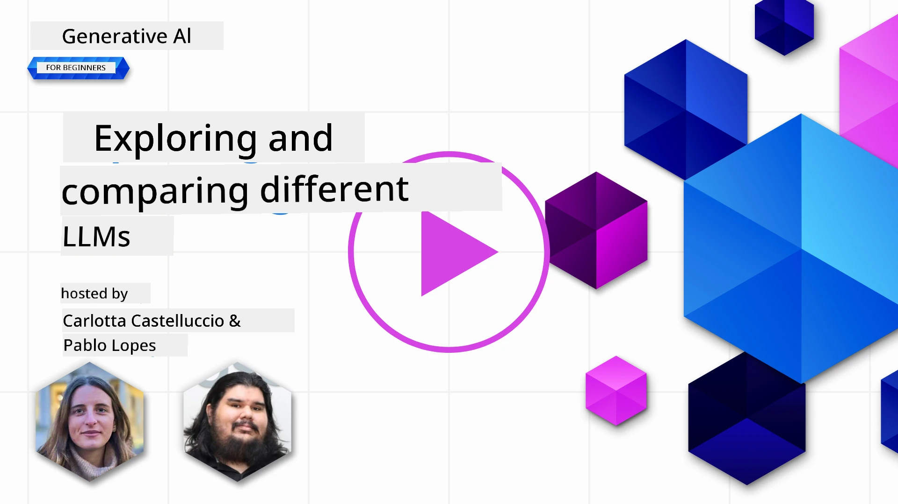](https://youtu.be/KIRUeDKscfI?si=8BHX1zvwzQBn-PlK)

> _Klik di pikshua up na to watch video of dis leson_

Wit di leson we bin do bifo, we don see how Generative AI dey change di teknologi land, how Large Language Models (LLMs) dey wok an how bizniz - like our startup - fit use dem for dia use case an grow! For dis chapter, we dey try kompare an see diffren kain large language models (LLMs) to sabi wetin dem good at an where dem no too beta.

Di next step for our startup waka na to explore di LLMs wey dey ground now an sabi which one go fit our use case.

## Introduction

Dis leson go cover:

- Diffren kain LLMs wey dey ground now.
- How to test, try again, an kompare diffren models for your use case for Azure.
- How to set up LLM.

## Learning Goals

After you finish dis leson, you go fit:

- Choose di correct model for your use case.
- Understand how to test, try aplenty, an make your model wok beta.
- Know how bizniz dem take deploy models.

## Understand diffren kain LLMs

LLMs fit get plenty kind dem based on how dem build am, data wey dem train am with, an wetin you wan take am do. If we sabi these difference, our startup go fit choose di correct model for di kain ting we wan do, an sabi how to test, try aplenty, an improve how e dey perform.

Plenty diffren kain LLM models dey, di one wey you go choose depend on wetin you wan use am do, your data, how much you fit pay an beta tins.

If na text, audio, video, image generation an di kain tins you wan use di models for, you fit choose diffren kain model.

- **Audio an speech recognition**. Whisper-style models still dey useful as general speech recognition models, but for production now, fine new speech-to-text models dey like `gpt-4o-transcribe`, `gpt-4o-mini-transcribe`, an diarization variants. You suppose check language wey e cover, diarization, real-time support, how e fast, an how much e go cost for your palava. Learn more for [OpenAI speech-to-text documentation](https://platform.openai.com/docs/guides/speech-to-text?WT.mc_id=academic-105485-koreyst).

- **Image generation**. DALL-E an Midjourney na well known image generation options, but current OpenAI image APIs dey focus on GPT Image models like `gpt-image-2`, while Stable Diffusion, Imagen, Flux, an oda model families also popular. Check how dem dey follow prompt well, editing support, style control, safety rules, an licenses. Learn more for [OpenAI image generation guide](https://platform.openai.com/docs/guides/images?WT.mc_id=academic-105485-koreyst) an Chapter 9 for dis curriculum.

- **Text generation**. Text models now dey include frontier models, reasoning models, small fast models, an open-weight models. Current ones na OpenAI GPT-5.x models, Anthropic Claude 4.x models, Google Gemini 3.x models, Meta Llama 4 models, an Mistral models. No just pick based on e release date or price; consider task quality, latency, context window, tool use, safety, which region e fit, an total cost. [Microsoft Foundry model catalog](https://ai.azure.com/catalog?WT.mc_id=academic-105485-koreyst) good place to check models wey dey for Azure.

- **Multi-modality**. Plenty models fit handle more than text. Some fit accept image, audio, or video inputs; some fit call tools; an specialized models fit generate images, audio, or video. For example, current OpenAI models fit text and image input, Gemini models fit text, code, image, audio, and video inputs depending on variant, an Llama 4 Scout and Maverick na open-weight natively multimodal models. Always check model card for supported input and output modalities before you build your workflow.

When you select model, you dey get some basic ability, but sometimes e no too enough. Many times you get company-specific data wey you need tell di LLM about. Dere some different ways to do am, we go talk more for next sections.

### Foundation Models versus LLMs

Di term Foundation Model na [Stanford researchers](https://arxiv.org/abs/2108.07258?WT.mc_id=academic-105485-koreyst) coin am, an e mean AI model wey get some criteria like:

- **Dem train am with unsupervised learning or self-supervised learning**, meaning dem no need human make dem label data, e dey train on unlabeled multi-modal data.
- **Dem models big well well**, them base am on deep neural networks wey dem train on billion parameters.
- **Dem normally for serve as foundation for oda models**, so you fit use dem start to build beta models by fine-tuning.

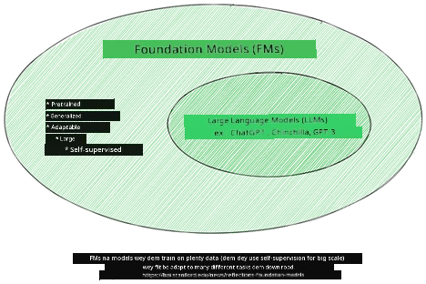

Pikshua source: [Essential Guide to Foundation Models and Large Language Models | by Babar M Bhatti | Medium
](https://thebabar.medium.com/essential-guide-to-foundation-models-and-large-language-models-27dab58f7404)

To clear dis story well, mek we use ChatGPT as example. Early ChatGPT versions use GPT-3.5 as foundation model. OpenAI then use chat-specific data and alignment methods create tuned version wey perform beta for chatbots and conversational use. Modern AI services fit use many model variants, so service name and model name no always be di same.

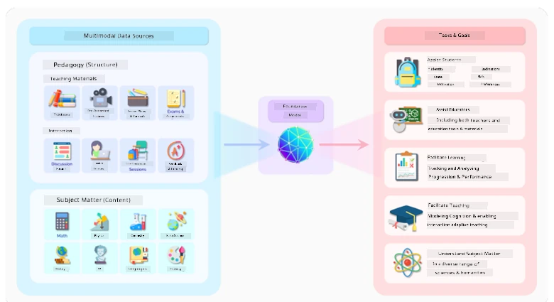

Pikshua source: [2108.07258.pdf (arxiv.org)](https://arxiv.org/pdf/2108.07258.pdf?WT.mc_id=academic-105485-koreyst)

### Open-Weight/Open-Source versus Proprietary Models

Another way to group LLMs na whether dem open-weight, open-source, or proprietary.

Open-source an open-weight models dey allow make pipo check, download, or customize di model artifacts, but dia license dem different. Some full open-source, some open-weight but get usage restriction. Dem dey useful if bizniz want more control on deployment, data place, cost, or customization. But team still need check license, serving cost, maintenance, security update, an evaluation quality before use for production. Examples na [Meta Llama 4](https://ai.meta.com/blog/llama-4-multimodal-intelligence/?WT.mc_id=academic-105485-koreyst), some [Mistral models](https://docs.mistral.ai/models/overview?WT.mc_id=academic-105485-koreyst), an many models for [Hugging Face](https://huggingface.co/models?WT.mc_id=academic-105485-koreyst).

Proprietary models dey owned an hosted by provider. Dem dey optimized for production use and fit offer strong support, safety systems, tool integration an scale. But customers no fit check or change di model weights; dem go need check provider terms for privacy, data retention, compliance, and acceptable use. Examples na [OpenAI models](https://platform.openai.com/docs/models?WT.mc_id=academic-105485-koreyst), [Google Gemini](https://deepmind.google/models/gemini/pro/?WT.mc_id=academic-105485-koreyst), and [Anthropic Claude](https://platform.claude.com/docs/en/about-claude/models/overview?WT.mc_id=academic-105485-koreyst).

### Embedding versus Image generation versus Text and Code generation

LLMs fit also dey categorized by di output dem generate.

Embeddings na models wey fit change text go numerical form, wey dem dey call embedding, na number wey represent di input text. Embeddings dey help machine understand word or sentence relation well well, and oda models fit use di embedding as input, like classification models or clustering models wey beta for number data. Embedding models dey use for transfer learning, where dem build model for task wey get plenty data, then reuse model weights (embeddings) for oda tasks. Example na [OpenAI embeddings](https://platform.openai.com/docs/models/embeddings?WT.mc_id=academic-105485-koreyst).

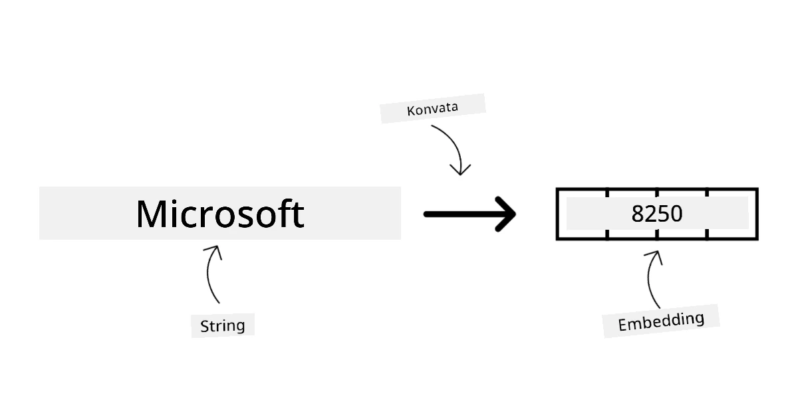

Image generation models na models wey dey generate pictures. Dem dey used for image editing, image synthesis an image translation. Dem dey train dem well with large image datasets, like [LAION-5B](https://laion.ai/blog/laion-5b/?WT.mc_id=academic-105485-koreyst), an fit generate new pictures or edit old pictures wit inpainting, super-resolution, and colorization. Examples na [GPT Image models](https://platform.openai.com/docs/guides/images?WT.mc_id=academic-105485-koreyst), [Stable Diffusion models](https://github.com/Stability-AI/StableDiffusion?WT.mc_id=academic-105485-koreyst), and Imagen models.

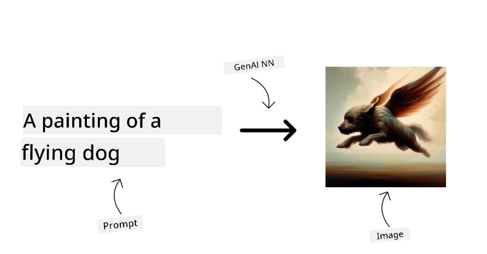

Text an code generation models na models wey generate text or code. Dem dey used for text summarization, translation, an question answering. Dem train di text generation models wit big text datasets, like [BookCorpus](https://www.cv-foundation.org/openaccess/content_iccv_2015/html/Zhu_Aligning_Books_and_ICCV_2015_paper.html?WT.mc_id=academic-105485-koreyst), an dem fit generate new text or answer questions. Code generation models, like [CodeParrot](https://huggingface.co/codeparrot?WT.mc_id=academic-105485-koreyst), dey train with big code data like GitHub, an fit generate new code or fix bugs for code wey dey.

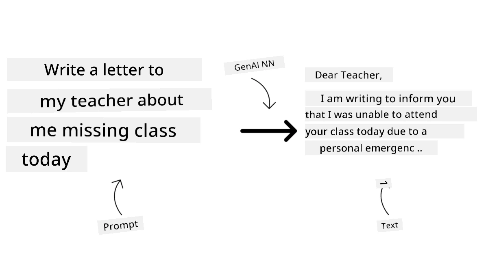

### Encoder-Decoder versus Decoder-only

To yarn about di diffren architecture types for LLMs, mek us use analogy.

Imagine your boss give you task to write quiz for students. You get two colleagues; one dey create content, di oda dey review am.

Di content creator be like decoder-only model: dem dey look topic, see wetin you don write before, an continue to generate content based on dat context. Dem sabi well for write beta an interesting content, but dem no be best for just classify, find, or encode info. Examples be decoder-only models like GPT an Llama.

Di reviewer be like Encoder-only model; dem go review di course an answer, dey see the relation, an sabi di context, but dem no dey generate content. Example be Encoder only model like BERT.

Imagine say we fit get person wey fit create and review quiz, na Encoder-Decoder model dat be. Examples na BART an T5.

### Service versus Model

Now, mek we talk wetin different between service an model. Service na product wey Cloud Service Provider dey offer, an e dey usually combination of models, data an oda tins. Model na core part of service, usually foundation model, like LLM.

Services dey optimized for production use an e easy to use pass models, using GUI. But services no always free, dem fit need subscription or payment, so you fit leverage service owner equipment an resources, optimize cost and scale easy. Example na [Azure OpenAI Service](https://learn.microsoft.com/azure/ai-foundry/openai/overview?WT.mc_id=academic-105485-koreyst) wey get pay-as-you-go plan; people dey pay as dem use am. Azure OpenAI Service dey offer enterprise-grade security an responsible AI framework on top models.

Models na di neural network artifacts: parameters, weights, architecture, tokenizer, an config. To run model locally or private need correct hardware, serving system, monitoring, an correct license (open-source/open-weight or commercial). Open-weight models like Llama 4 or Mistral fit self-host, but still need compute power an operational skill.

## How to test an try wit diffren models to sabi how dem perform for Azure

Once our team don explore di current LLMs landscape and find some beta candidates for dia scenarios, di next step na to test dem on dia data and on dia workload. Dis na iterative process, wey dem dey do by experiments and measures.
Most of di models we mention for previous paragraphs (OpenAI models, open-weight models like Llama 4 and Mistral, and Hugging Face models) dey available for [Microsoft Foundry Models](https://learn.microsoft.com/azure/foundry/concepts/foundry-models-overview?WT.mc_id=academic-105485-koreyst).

[Microsoft Foundry](https://learn.microsoft.com/azure/foundry/what-is-foundry?WT.mc_id=academic-105485-koreyst), wey dem been call Azure AI Studio/Azure AI Foundry before, na one unified Azure platform for building AI apps and agents. E dey help developers manage di lifecycle from experimentation and evaluation reach deployment, monitoring, and governance. Di model catalog for Microsoft Foundry dey allow di user to:

- Find di foundation model wey dem dey interested for inside di catalog, including models wey Azure dey sell and models from partners and community providers. Users fit filter by task, provider, license, deployment option, or name.

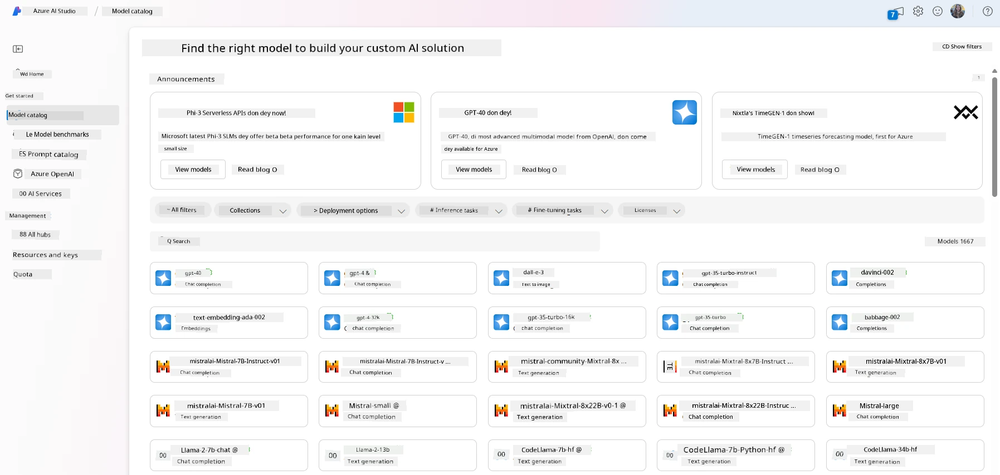

- Review di model card, including detailed description of how dem suppose use am and di training data, code samples and evaluation results for inside evaluations library.

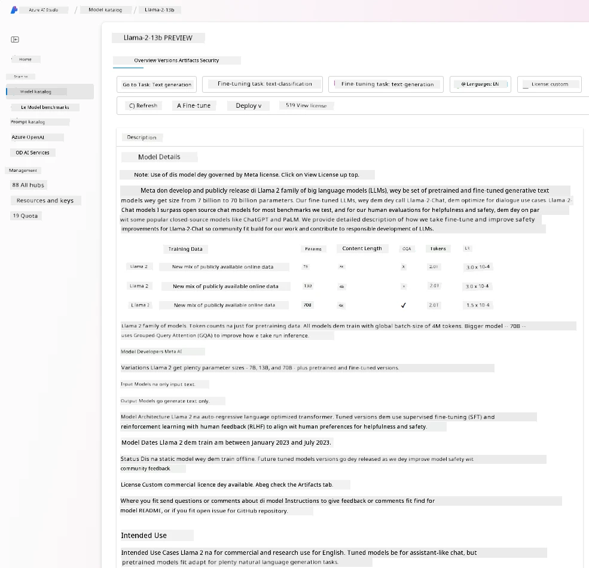

- Compare benchmarks across models and datasets wey dey for industry to check which one go match di business scenario, through di [Model Benchmarks](https://learn.microsoft.com/azure/ai-foundry/concepts/model-benchmarks?WT.mc_id=academic-105485-koreyst) pane.

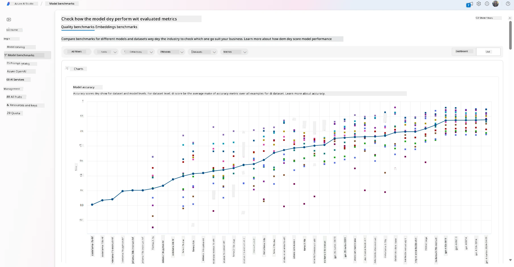

- Fine-tune models wey dem support on custom training data to make di model performance beta for specific workload, using di experimentation and tracking capabilities of Microsoft Foundry.

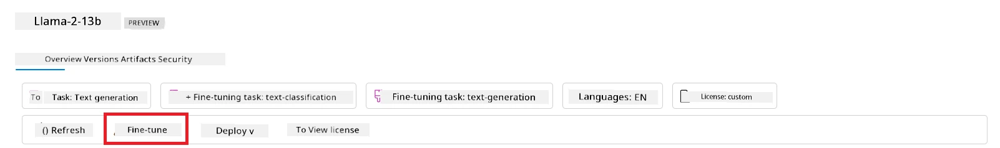

- Deploy di original pre-trained model or di fine-tuned version to remote real-time inference endpoint, using managed compute or serverless deployment options, so applications fit use am.

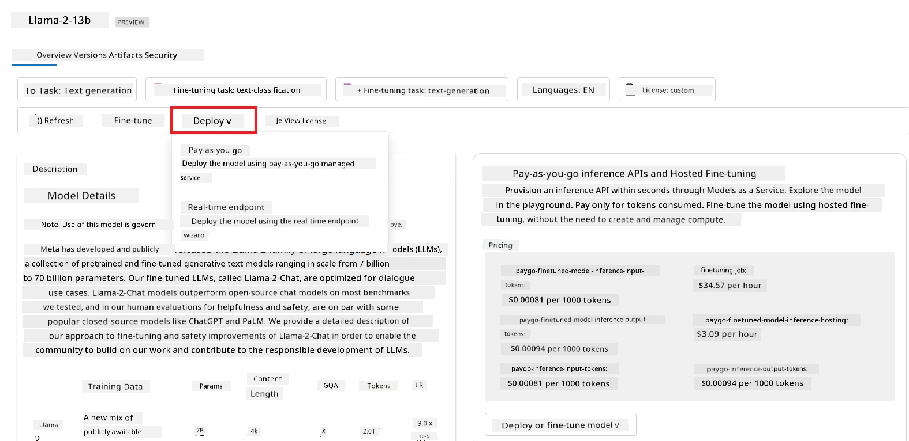

> [!NOTE]
> No be all models for di catalog dey available for fine-tuning and/or pay-as-you-go deployment now. Make you check di model card for more details about di model capabilities and limits.

## How to improve LLM results

We don explore with our startup team different kinds of LLMs and one cloud platform (Microsoft Foundry) wey fit help us compare different models, evaluate dem on test data, improve performance, and deploy dem on inference endpoints.

But when dem suppose consider to fine-tune model instead of to use pre-trained one? E get other ways to improve model performance for specific workloads?

E get many ways a business fit use take get di results wey dem need from LLM. You fit select different types of models with different degrees of training when you dey deploy LLM for production, with different levels of complexity, cost, and quality. Here some different approaches be:

- **Prompt engineering with context**. Di idea na to give enough context wen you dey prompt to make sure say you go get di responses wey you need.

- **Retrieval Augmented Generation, RAG**. Your data fit dey for database or web endpoint for example, to make sure say this data, or part of am, dey included wen you dey prompt, you fit fetch di relevant data and add am as part of di user's prompt.

- **Fine-tuned model**. Here, you go train di model more on your own data wey make di model dey more exact and responsive to your needs but e fit dey costly.

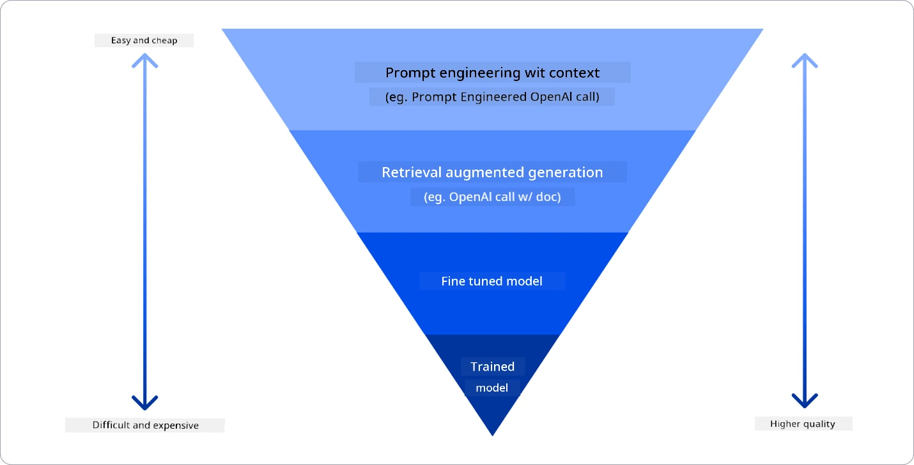

Img source: [Four Ways that Enterprises Deploy LLMs | Fiddler AI Blog](https://www.fiddler.ai/blog/four-ways-that-enterprises-deploy-llms?WT.mc_id=academic-105485-koreyst)

### Prompt Engineering with Context

Pre-trained LLMs dey work well for generalized natural language tasks, even if na short prompt you use, like sentence to complete or question – na so dem dey call “zero-shot” learning.

But di more wey user fit frame dem query, with detailed request and examples – di Context – di more accurate and closest to user expectations di answer go be. For this case, we dey talk about “one-shot” learning if di prompt get only one example and “few shot learning” if e get many examples.
Prompt engineering with context na di most cost-effective way to start with.

### Retrieval Augmented Generation (RAG)

LLMs get limitation say dem fit use only di data wey dem use for dia training to generate answer. Dis mean say dem no sabi anything about facts wey happen after dia training process, and dem no fit access non-public information (like company data).
Dis one fit overcome with RAG, na technique wey dey add prompt with external data as chunks of documents, considering prompt length limits. Dis one na beta pass Vector database tools (like [Azure Vector Search](https://learn.microsoft.com/azure/search/vector-search-overview?WT.mc_id=academic-105485-koreyst)) wey fit find di useful chunks from different pre-defined data sources and add dem to di prompt Context.

Dis technique dey very handy when business no get enough data, enough time, or resources to fine-tune LLM, but still want to make performance beta for specific workload and reduce risk of hallucinated, outdated, or unsupported answers.

### Fine-tuned model

Fine-tuning na process wey dey use transfer learning to ‘adapt’ di model to downstream task or to solve specific problem. E different from few-shot learning and RAG, because e go produce new model with updated weights and biases. E need set of training examples wey get single input (di prompt) and associated output (di completion).
Dis one go beta if:

- **Using smaller task-specific models**. Business go like fine-tune smaller model for narrow task instead of to always prompt bigger frontier model, so e go cheaper and faster.

- **Considering latency**. Latency dey important for specific use-case, so you no fit use very long prompts or number of examples wey suppose learn no fit with prompt length limit.

- **Adapting stable behavior**. Business get many high-quality examples and want model to always follow task pattern, output format, tone, or domain-specific style. If main problem na fresh facts or private knowledge wey dey change often, make you use RAG instead of just relying on fine-tuning.

### Trained model

Training LLM from scratch na di hardest and most complex approach, e need plenty data, skilled resources, and proper computing power. You suppose consider dis option only if business get domain-specific use case and large amount of domain-centric data.

## Knowledge check

Wetin fit be beta approach to improve LLM completion results?

1. Prompt engineering with context
1. RAG
1. Fine-tuned model

A: All three fit help. Start with prompt engineering and context to improve quick quick, and use RAG when model need current facts or private business data. Choose fine-tuning if you get enough high-quality examples and you want model to always follow task, format, tone, or domain pattern.

## 🚀 Challenge

Read more on how you fit [use RAG](https://learn.microsoft.com/azure/search/retrieval-augmented-generation-overview?WT.mc_id=academic-105485-koreyst) for your business.

## Great Work, Continue Your Learning

After you finish this lesson, check our [Generative AI Learning collection](https://aka.ms/genai-collection?WT.mc_id=academic-105485-koreyst) to continue to improve your Generative AI knowledge!

Head go Lesson 3 wey we go see how to [build with Generative AI Responsibly](../03-using-generative-ai-responsibly/README.md?WT.mc_id=academic-105485-koreyst)!

---

<!-- CO-OP TRANSLATOR DISCLAIMER START -->
**Disclaimer**:
Dis document don translate wit AI translation service [Co-op Translator](https://github.com/Azure/co-op-translator). Even tho we dey try make am correct, abeg make you know say automated translation fit get errors or mistakes. Di original document for dia own language na im be di correct source. For important info, make person wey sabi human translation do am. We no go responsible for any misunderstanding or wrong understanding wey fit happen because of dis translation.
<!-- CO-OP TRANSLATOR DISCLAIMER END -->