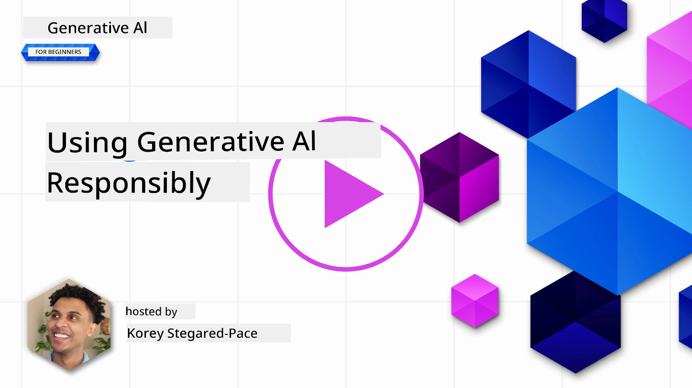
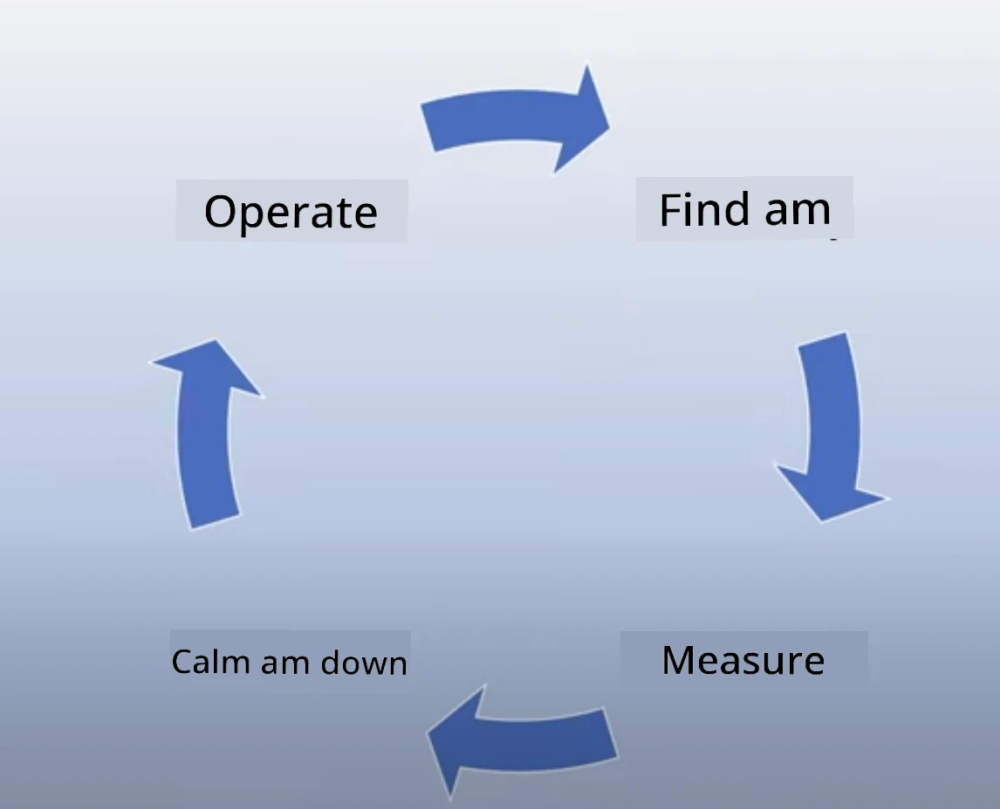

# How to Use Generative AI Well

> _Click di image wey dey up to watch di video for dis lesson_

E easy to dey fascinated with AI, especially generative AI, but you gatz think how you go use am well. You gatz think about how you go make sure say di result dey fair, e no dey harmful, and other things. Dis chapter wan help you understand wetin you gatz consider and how you fit take steps to use AI well.

## Introduction

Dis lesson go cover:

- Why e dey important to put Responsible AI first when you dey build Generative AI apps.
- Di main principles of Responsible AI and how e connect with Generative AI.
- How you fit use di Responsible AI principles well with strategy and tools.

## Learning Goals

After you finish dis lesson, you go sabi:

- Why Responsible AI dey important when you dey build Generative AI apps.
- When you go think and use di main principles of Responsible AI when you dey build Generative AI apps.
- Wetin tools and strategies dey available to help you use Responsible AI well.

## Responsible AI Principles

Di excitement wey dey for Generative AI don high well well. Dis excitement don bring plenty new developers, attention, and money enter dis space. Even though e good for people wey wan build products and companies with Generative AI, e still dey important make we do am well.

For dis course, we dey focus on how we go build our startup and our AI education product. We go use di principles of Responsible AI: Fairness, Inclusiveness, Reliability/Safety, Security & Privacy, Transparency, and Accountability. With dis principles, we go check how e connect with how we dey use Generative AI for our products.

## Why You Gatz Put Responsible AI First

When you dey build product, if you dey think about di people wey go use am and wetin go benefit dem, e go give you better result.

Di special thing about Generative AI na di power wey e get to create helpful answers, information, guidance, and content for people. E fit do dis without plenty manual work, and e fit give impressive results. But if you no plan well, e fit cause harmful results for di people wey dey use am, your product, and society.

Make we check some (but no be all) of di harmful results wey fit happen:

### Hallucinations

Hallucinations na di word wey people dey use when LLM dey produce content wey no make sense or wey dey wrong based on wetin we sabi from other sources.

For example, if we build one feature for our startup wey go allow students ask historical questions to di model. One student fit ask, `Who was the sole survivor of Titanic?`

Di model fit give answer like dis one:

> _(Source: [Flying bisons](https://flyingbisons.com?WT.mc_id=academic-105485-koreyst))_

Dis answer dey confident and e dey detailed. But e dey wrong. Even small research go show say no be only one person survive di Titanic disaster. For one student wey just dey start to research dis topic, dis answer fit dey convincing enough to make dem no question am and dem go believe say na fact. Di result fit make di AI system no dey reliable and e fit spoil di reputation of our startup.

With every new version of LLM, we don see improvement for how dem dey reduce hallucinations. But even with dis improvement, we wey dey build apps and dey use am gatz still dey aware of di limitations.

### Harmful Content

We don talk before about how LLM fit produce wrong or nonsense answers. Another risk wey we gatz dey careful about na when di model dey give harmful content.

Harmful content fit be:

- Giving instructions or encouraging self-harm or harm to certain groups.
- Hateful or demeaning content.
- Guiding how to plan attack or violent acts.
- Giving instructions on how to find illegal content or do illegal things.
- Showing sexually explicit content.

For our startup, we gatz make sure say we get di right tools and strategies to stop dis kind content from reaching students.

### Lack of Fairness

Fairness mean say “make sure say AI system no get bias or discrimination and e dey treat everybody equally.” For Generative AI, we gatz make sure say di model output no dey reinforce exclusionary worldviews of marginalized groups.

Dis kind output no just dey bad for di product experience wey we dey build for our users, e dey cause more harm for society. As people wey dey build apps, we gatz always think about di wide and diverse people wey go use di solution we dey build with Generative AI.

## How to Use Generative AI Well

Now we don talk about why Responsible Generative AI dey important, make we look 4 steps we fit take to build our AI solutions well:

### Measure Potential Harms

For software testing, we dey test wetin we expect users go do for di app. Di same way, testing different prompts wey users fit likely use na good way to measure potential harm.

Since our startup dey build education product, e go good make we prepare list of education-related prompts. Dis fit cover certain subjects, historical facts, and prompts about student life.

### Mitigate Potential Harms

Now na time to find ways wey we fit stop or reduce di potential harm wey di model and di responses fit cause. We fit look dis one for 4 different layers:

- **Model**. Choose di right model for di right use case. Big and complex models like GPT-4 fit cause more risk of harmful content if you use am for small and specific use cases. Use your training data to fine-tune di model to reduce di risk of harmful content.

- **Safety System**. Safety system na tools and configurations wey dey di platform wey dey serve di model to help stop harm. Example na di content filtering system wey dey Azure OpenAI service. Systems gatz also detect jailbreak attacks and unwanted activity like requests from bots.

- **Metaprompt**. Metaprompts and grounding na ways we fit direct or limit di model based on certain behaviors and information. Dis fit be using system inputs to define certain limits for di model. E fit also be using techniques like Retrieval Augmented Generation (RAG) to make di model only dey pull information from trusted sources. We get one lesson later for dis course for [building search applications](../08-building-search-applications/README.md?WT.mc_id=academic-105485-koreyst)

- **User Experience**. Di last layer na where di user dey interact directly with di model through di app interface. For dis way, we fit design di UI/UX to limit di user for di kind inputs dem fit send to di model and di text or images wey dem fit see. When we dey deploy di AI app, we gatz also dey transparent about wetin our Generative AI app fit do and wetin e no fit do.

We get one full lesson for [Designing UX for AI Applications](../12-designing-ux-for-ai-applications/README.md?WT.mc_id=academic-105485-koreyst)

- **Evaluate model**. Working with LLMs fit hard because we no always get control over di data wey dem train di model with. But we gatz always check di model performance and di output. E still dey important to measure di model accuracy, similarity, groundedness, and relevance of di output. Dis go help provide transparency and trust to stakeholders and users.

### Operate a Responsible Generative AI solution

Building operational practice around your AI apps na di final stage. Dis one include working with other parts of our startup like Legal and Security to make sure say we dey follow all regulatory policies. Before we launch, we gatz also build plans for delivery, handling incidents, and rollback to stop any harm wey fit happen to our users.

## Tools

Even though di work to develop Responsible AI solutions fit look plenty, e worth di effort. As Generative AI dey grow, more tools go dey to help developers add responsibility into their workflows. For example, di [Azure AI Content Safety](https://learn.microsoft.com/azure/ai-services/content-safety/overview?WT.mc_id=academic-105485-koreyst) fit help detect harmful content and images through API request.

## Knowledge check

Wetin you gatz care about to make sure say AI dey used well?

1. Make sure say di answer dey correct.
1. Harmful usage, make sure AI no dey used for criminal things.
1. Make sure AI no get bias or discrimination.

A: 2 and 3 dey correct. Responsible AI dey help you think how to stop harmful effects and bias and more.

## 🚀 Challenge

Read about [Azure AI Content Safety](https://learn.microsoft.com/azure/ai-services/content-safety/overview?WT.mc_id=academic-105485-koreyst) and see wetin you fit use for your work.

## Great Work, Continue Your Learning

After you finish dis lesson, check our [Generative AI Learning collection](https://aka.ms/genai-collection?WT.mc_id=academic-105485-koreyst) to continue to learn more about Generative AI!

Go Lesson 4 where we go talk about [Prompt Engineering Fundamentals](../04-prompt-engineering-fundamentals/README.md?WT.mc_id=academic-105485-koreyst)!

---

<!-- CO-OP TRANSLATOR DISCLAIMER START -->
**Disclaimer**:  
Dis dokyument don use AI translation service [Co-op Translator](https://github.com/Azure/co-op-translator) do di translation. Even as we dey try make am accurate, abeg sabi say automated translations fit get mistake or no dey correct well. Di original dokyument for im native language na di main source wey you go trust. For important information, e better make professional human translation dey use. We no go fit take blame for any misunderstanding or wrong interpretation wey fit happen because you use dis translation.
<!-- CO-OP TRANSLATOR DISCLAIMER END -->