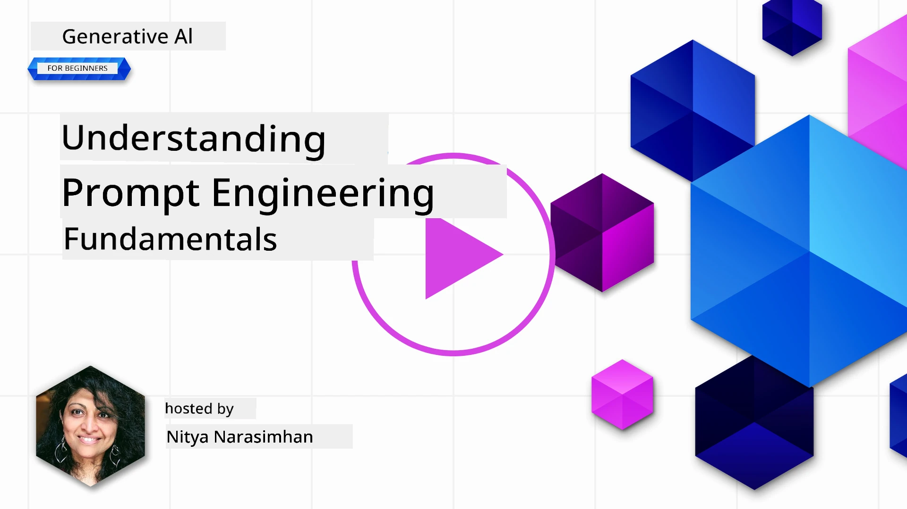
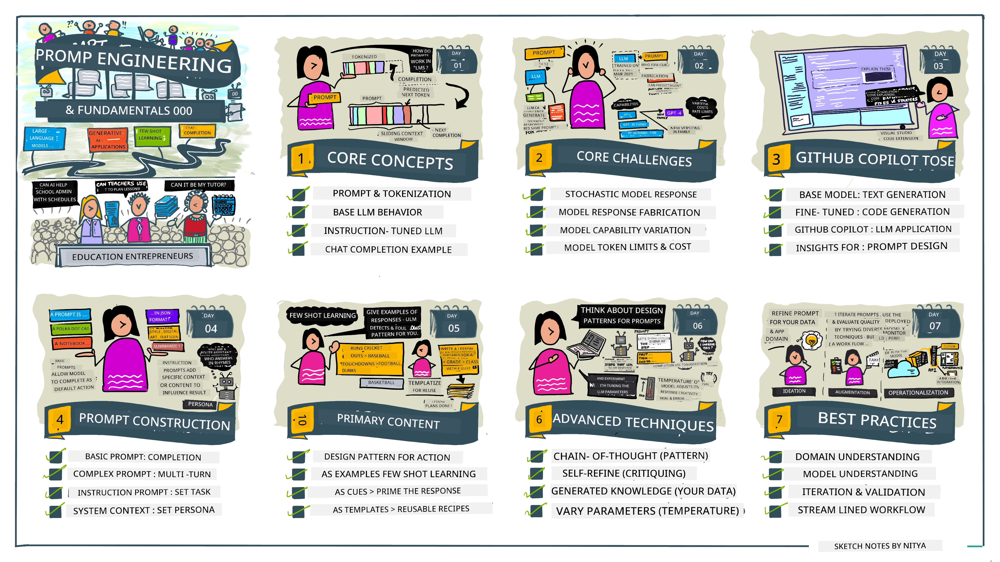
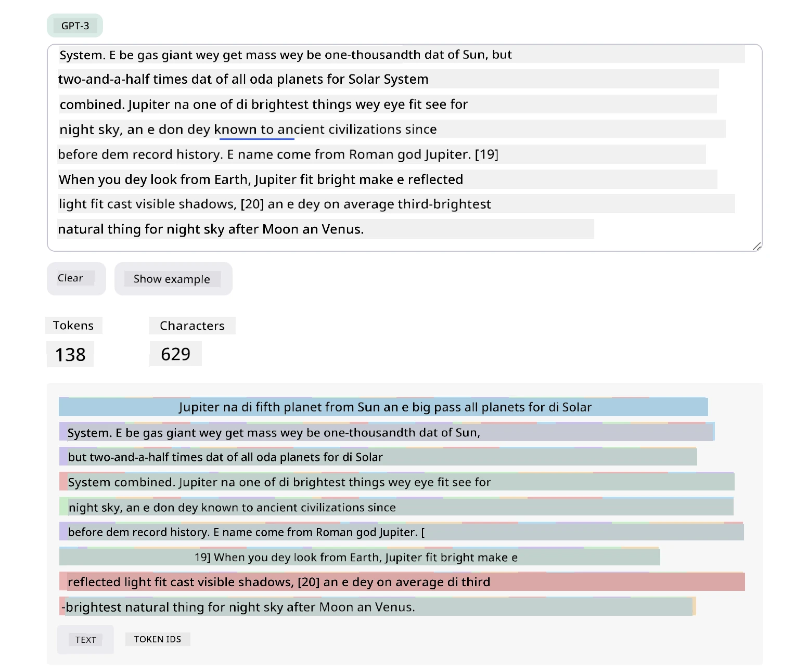
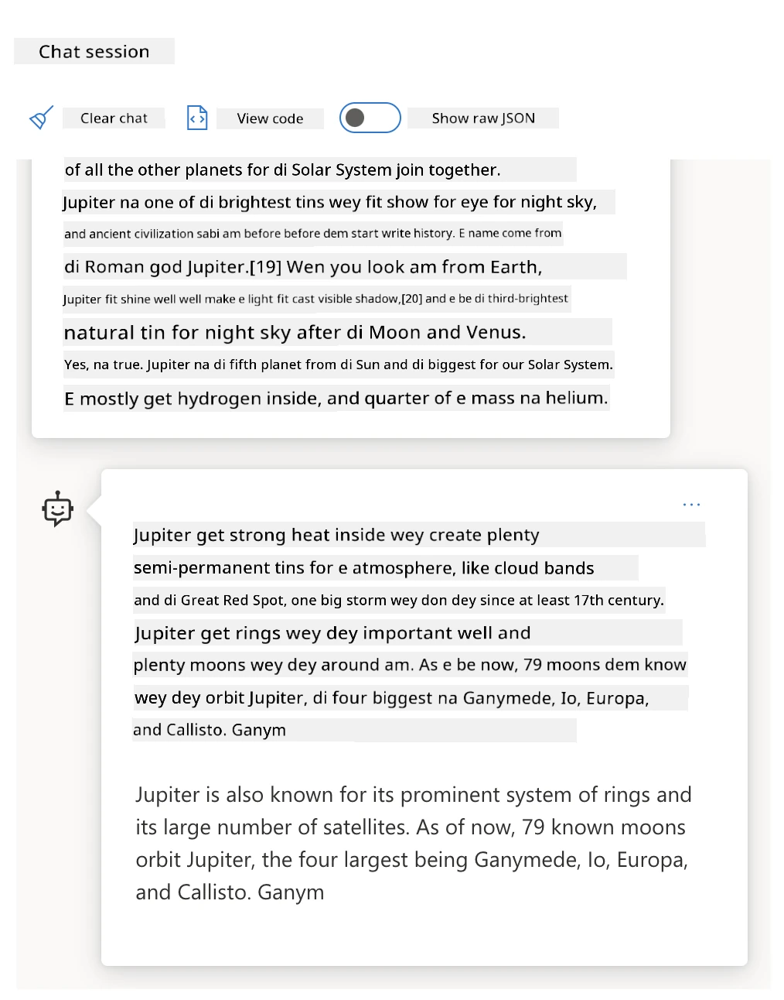
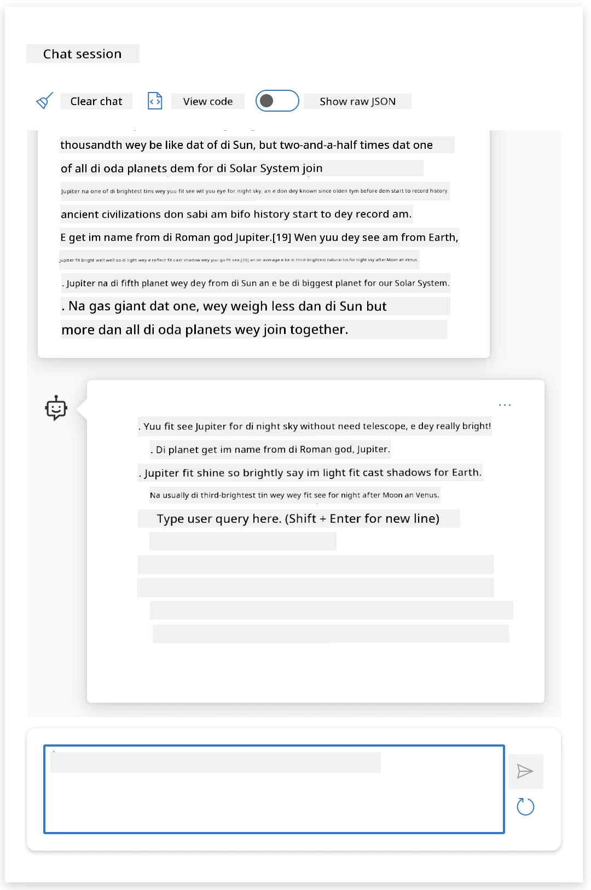
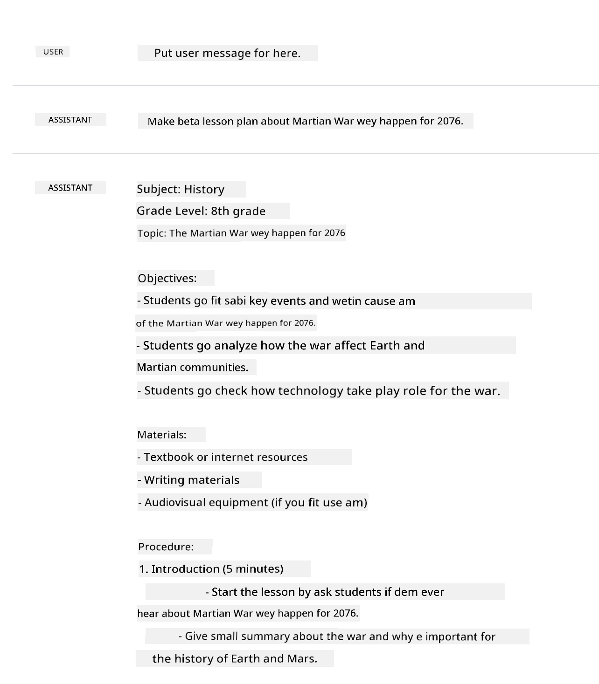
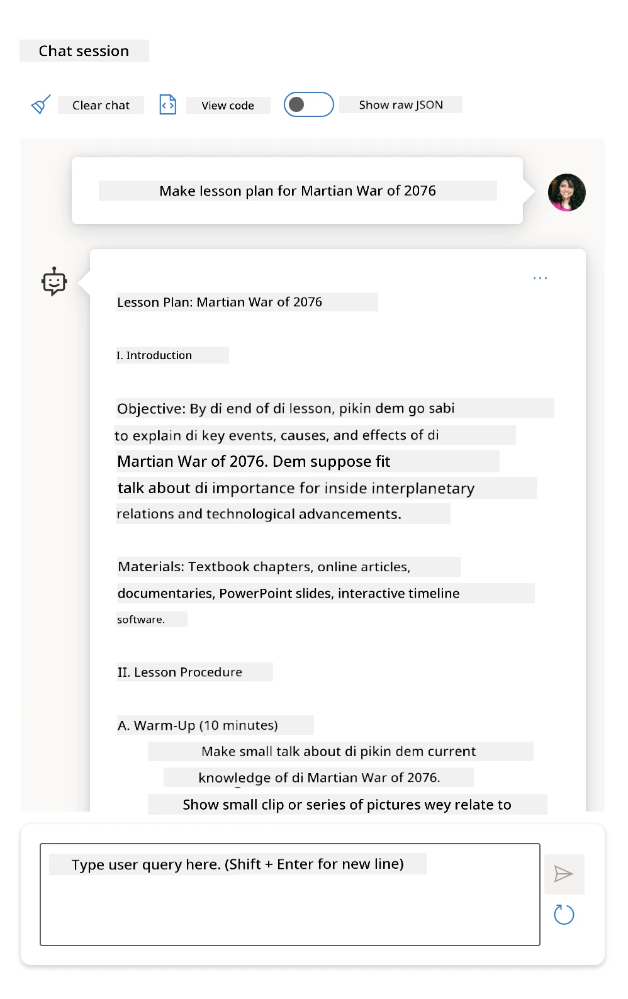
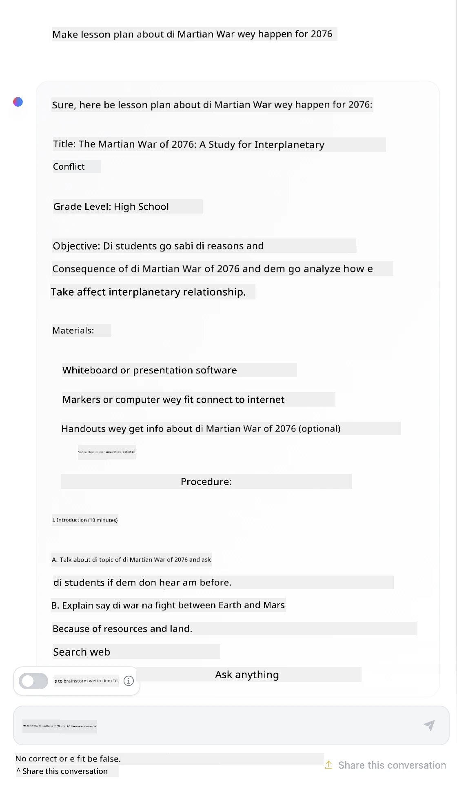

# Prompt Engineering Fundamentals

[](https://youtu.be/GElCu2kUlRs?si=qrXsBvXnCW12epb8)

## Introduction
Dis module dey cover important concepts and techniques wey dem dey use create better prompts for generative AI models. How you write your prompt give LLM also matter. If you craft your prompt well, e fit bring better response. But wetin _prompt_ and _prompt engineering_ really mean? And how I fit improve the prompt _input_ wey I dey send go the LLM? Dis na questions we go try answer for dis chapter and the next one.

_Generative AI_ fit create new content (like text, pictures, audio, code, etc.) based on wetin user request. E dey do dis using _Large Language Models_ like OpenAI GPT ("Generative Pre-trained Transformer") series wey dem train for use natural language and code.

Users fit now take familiar way like chat talk to these models without need any technical skill or training. The models dey _prompt-based_ - users send text input (prompt) and dem go return AI response (completion). Dem fit still "chat with the AI", go back and forth many times, dey fix their prompt until the response match wetin dem want.

"Prompts" now be the main _programming interface_ for generative AI apps, wey dey tell the models wetin to do and dey influence the quality of their answers. "Prompt Engineering" na fast-growing field wey focus on _design and optimization_ of prompts to deliver steady and good response for many people.

## Learning Goals

For dis lesson, we go learn wetin Prompt Engineering be, why e important, and how to craft better prompts for one model and application goal. We go understand core ideas and best ways for prompt engineering - plus learn about interactive Jupyter Notebooks "sandbox" place where we fit see these ideas for real examples.

By the end of this lesson we go fit:

1. Explain wetin prompt engineering be and why e matter.
2. Talk about the parts of a prompt and how dem dey use am.
3. Learn best ways and techniques for prompt engineering.
4. Use wetin we learn for real examples, using OpenAI endpoint.

## Key Terms

Prompt Engineering: Na the work of designing and making better the inputs wey go guide AI models to produce the kind output we want.

Tokenization: Na the way text dey break down into small small parts called tokens, wey model fit understand and work on.

Instruction-Tuned LLMs: Na Large Language Models (LLMs) wey dem don specially train with specific instructions to make their answers more correct and relevant.

## Learning Sandbox

Prompt engineering still dey more like art than science. The best way to sabi am better na to _practice more_ and try different things anyhow, join your knowledge about your work area with recommended methods and model special adjustments.

The Jupyter Notebook wey come with dis lesson get _sandbox_ area wey you fit try wetin you learn - as you dey learn or as part of the code challenge at end. To run the exercises, you go need:

1. **Azure OpenAI API key** - the service endpoint for one LLM wey dey deployed.
2. **Python Runtime** - where the Notebook go fit run.
3. **Local Env Variables** - _complete the [SETUP](./../00-course-setup/02-setup-local.md?WT.mc_id=academic-105485-koreyst) steps now to get ready_.

The notebook get _starter_ exercises - but we dey encourage you make you add your own _Markdown_ (description) and _Code_ (prompt requests) parts to try more examples or ideas - and build your sense for prompt design.

## Illustrated Guide

You want see the big picture of wetin dis lesson go cover before you enter? Check this illustrated guide, e go give you idea of the main topics and key points to think about for each one. The lesson roadmap go lead you from core ideas and problems to solving dem with prompt engineering methods and best ways. Note say the "Advanced Techniques" section for this guide na content wey go come for _next_ chapter of this curriculum.



## Our Startup

Now, make we talk how _this topic_ connect to our startup mission to [bring AI innovation to education](https://educationblog.microsoft.com/2023/06/collaborating-to-bring-ai-innovation-to-education?WT.mc_id=academic-105485-koreyst). We want build AI-powered applications wey dey do _personalized learning_ - so make we think how different users for our app fit "design" prompts:

- **Administrators** fit ask AI to _analyze curriculum data to identify gaps in coverage_. AI fit summarize results or show am with code.
- **Educators** fit ask AI to _generate a lesson plan for a target audience and topic_. AI fit build personalized plan for one format.
- **Students** fit ask AI to _tutor dem for one hard subject_. AI fit guide students with lessons, tips & examples wey match their level.

Na just small small part we don talk. Check [Prompts For Education](https://github.com/microsoft/prompts-for-edu/tree/main?WT.mc_id=academic-105485-koreyst) - open source prompts library wey education experts arrange - to sabi more about wetin fit do! _Try run some of those prompts for the sandbox or use OpenAI Playground to see wetin go happen!_

<!--
LESSON TEMPLATE:
This unit should cover core concept #1.
Reinforce the concept with examples and references.

CONCEPT #1:
Prompt Engineering.
Define it and explain why it is needed.
-->

## Wetin be Prompt Engineering?

We start dis lesson by defining **Prompt Engineering** as the work of _designing and making better_ text inputs (prompts) to deliver steady and good responses (completions) for one application goal and model. We fit think am as 2-step process:

- _designing_ the first prompt for given model and goal
- _refining_ the prompt small small to improve the response quality

This na trial-and-error process wey need user sabi and effort to get best results. So why e important? To answer dat, we first need to understand three things:

- _Tokenization_ = how the model "see" the prompt
- _Base LLMs_ = how the base model "process" the prompt
- _Instruction-Tuned LLMs_ = how the model fit now see "tasks"

### Tokenization

One LLM see prompts as _sequence of tokens_ where different models (or different versions) fit tokenize the same prompt different way. Since LLMs dey train on tokens (no raw text), how prompts tokenize get direct effect on how good the generated response go be.

To get idea of how tokenization work, try tools like the [OpenAI Tokenizer](https://platform.openai.com/tokenizer?WT.mc_id=academic-105485-koreyst) wey show below. Copy your prompt enter - see how e turn to tokens, check how whitespace and punctuation dey handled. Note say dis example na old LLM (GPT-3) - so if you try am with newer model, result fit different.



### Concept: Foundation Models

Once prompt don tokenize, main thing wey the ["Base LLM"](https://blog.gopenai.com/an-introduction-to-base-and-instruction-tuned-large-language-models-8de102c785a6?WT.mc_id=academic-105485-koreyst) (or Foundation model) dey do na to predict the next token in the sequence. Since LLMs train on big text data, dem sabi the statistical relationship between tokens and fit predict with confidence. Dem no really understand _meaning_ of words for prompt or token; dem just see pattern wey dem fit "complete" with next prediction. Dem fit continue predict sequence until user stop am or condition reach.

You want see how prompt-based completion dey work? Put di prompt above enter Azure OpenAI Studio [_Chat Playground_](https://oai.azure.com/playground?WT.mc_id=academic-105485-koreyst) with default settings. The system dey set to treat prompts as info requests - so you suppose see completion wey satisfy that context.

But if user want see something wey meet special task or goal? Na there _instruction-tuned_ LLMs come enter.



### Concept: Instruction Tuned LLMs

[Instruction Tuned LLM](https://blog.gopenai.com/an-introduction-to-base-and-instruction-tuned-large-language-models-8de102c785a6?WT.mc_id=academic-105485-koreyst) start from foundation model, then dem fine-tune am with examples or input/output pairs (like multi-turn "messages") wey get clear instructions - and AI try follow that instruction for response.

Dem dey use methods like Reinforcement Learning with Human Feedback (RLHF) to train model to _follow instructions_ and _learn from feedback_ so e fit produce answers wey better for practical use and relevant to user goals.

Make we try am - go back to prompt above, but now change _system message_ to give this instruction as context:

> _Summarize content you are provided with for a second-grade student. Keep the result to one paragraph with 3-5 bullet points._

See how the result now fit the goal and format we want? One educator fit use this response direct for their class slides.



## Why we need Prompt Engineering?

Now we sabi how LLMs process prompts, make we talk why prompt engineering dey important. The truth be say current LLMs get some problems wey fit make _reliable and steady completions_ hard to get without putting effort for how prompt dey build and improve. For example:

1. **Model responses no dey always the same.** The _same prompt_ fit give different response with different models or versions. E fit even give different answer with _same model_ for different times. _Prompt engineering techniques fit help make these variations small by adding better control_.

1. **Models fit create fake answers.** Models train on _big but limited_ data, so dem no get knowledge about things outside their training. So dem fit make completions wey no correct, imaginary, or even opposite to facts. _Prompt engineering ways fit help user see and reduce these fake things e.g., by asking AI for source or reason_.

1. **Models get different wahala.** Newer models or model generations get better skills but also get their own quirks and cost & complexity wahala. _Prompt engineering fit help make best ways and workflow wey dey hide these differences and fit model-specific needs easily and at scale_.

Make we try see how e be for OpenAI or Azure OpenAI Playground:

- Use same prompt with different LLM deployments (like OpenAI, Azure OpenAI, Hugging Face) - you see the differences?
- Use same prompt again and again on _same_ LLM deployment (like Azure OpenAI playground) - how e different each time?

### Fabrications Example

For this course, we dey use the term **"fabrication"** to talk about when LLMs sometimes create info wey no correct because of their training limits or other reasons. You fit don hear this called _"hallucinations"_ for popular articles or research papers. But we recommend say make use _"fabrication"_ so that we no go dey act like human them, or give am human traits for machine outcome. Dis still follow [Responsible AI guidelines](https://www.microsoft.com/ai/responsible-ai?WT.mc_id=academic-105485-koreyst) for terminology, avoid words wey fit offend or no inclusive for some people.

You want see how fabrications dey work? Think of prompt wey tell AI make e create content about non-existent topic (to make sure e no dey training data). For example - I try this prompt:

> **Prompt:** generate a lesson plan on the Martian War of 2076.
Wéb sarch show me say dem get fictional accounts (like telebishon series or book) about Martian wars – but none for 2076. Common sense tell us say 2076 dey _for future_ so e no fit dey connect to real mata.

So wetin go happen if we run dis prompt wit different LLM providers?

> **Response 1**: OpenAI Playground (GPT-35)



> **Response 2**: Azure OpenAI Playground (GPT-35)



> **Response 3**: : Hugging Face Chat Playground (LLama-2)



Like we expect, each model (or model version) dey produce small kain different responses because of stochastic behavior and how model fit take wahala waka. For example, one model dey target 8th grade pipo while another dey assume say na high-school student. But all di tree models come output response wey fit make pipo wey no sabi believe say di matter real.

Prompt engineering techniques like _metaprompting_ and _temperature configuration_ fit reduce model fabrications small. New prompt engineering _architectures_ also dey add new tools and techniques inside prompt flow, so dem fit reduce or mitigate some of these wahala.

## Case Study: GitHub Copilot

Make we end this section wit how prompt engineering dey work for real world solutions by checking one Case Study: [GitHub Copilot](https://github.com/features/copilot?WT.mc_id=academic-105485-koreyst).

GitHub Copilot na your "AI Pair Programmer" – e dey turn text prompts to code completions and e join with your development environment (like Visual Studio Code) to give you smooth user experience. As dem talk am for di blogs below, di earliest version base on OpenAI Codex model – but engineers quickly know say dem need fine-tune di model and make better prompt engineering techniques to improve code quality. For July, dem [show new better AI model wey no stop for Codex](https://github.blog/2023-07-28-smarter-more-efficient-coding-github-copilot-goes-beyond-codex-with-improved-ai-model/?WT.mc_id=academic-105485-koreyst) wey dey give faster suggestions.

Read dem posts one-by-one, to follow how dem learn.

- **May 2023** | [GitHub Copilot dey better at understanding your Code](https://github.blog/2023-05-17-how-github-copilot-is-getting-better-at-understanding-your-code/?WT.mc_id=academic-105485-koreyst)
- **May 2023** | [Inside GitHub: How dem dey work wit di LLMs behind GitHub Copilot](https://github.blog/2023-05-17-inside-github-working-with-the-llms-behind-github-copilot/?WT.mc_id=academic-105485-koreyst).
- **Jun 2023** | [How to write better prompts for GitHub Copilot](https://github.blog/2023-06-20-how-to-write-better-prompts-for-github-copilot/?WT.mc_id=academic-105485-koreyst).
- **Jul 2023** | [GitHub Copilot don pass Codex wit improved AI model](https://github.blog/2023-07-28-smarter-more-efficient-coding-github-copilot-goes-beyond-codex-with-improved-ai-model/?WT.mc_id=academic-105485-koreyst)
- **Jul 2023** | [Developer Guide to Prompt Engineering and LLMs](https://github.blog/2023-07-17-prompt-engineering-guide-generative-ai-llms/?WT.mc_id=academic-105485-koreyst)
- **Sep 2023** | [How to build enterprise LLM app: Lesson from GitHub Copilot](https://github.blog/2023-09-06-how-to-build-an-enterprise-llm-application-lessons-from-github-copilot/?WT.mc_id=academic-105485-koreyst)

You fit also waka through their [Engineering blog](https://github.blog/category/engineering/?WT.mc_id=academic-105485-koreyst) for more posts like [this one](https://github.blog/2023-09-27-how-i-used-github-copilot-chat-to-build-a-reactjs-gallery-prototype/?WT.mc_id=academic-105485-koreyst) wey show how dem dey _apply_ these models and techniques for real-world apps.

---

<!--
LESSON TEMPLATE:
This unit should cover core concept #2.
Reinforce the concept with examples and references.

CONCEPT #2:
Prompt Design.
Illustrated with examples.
-->

## Prompt Construction

We don see why prompt engineering important – now make we understand how prompts dey _constructed_ so we fit judge different techniques to make better prompt design.

### Basic Prompt

Make we start wit basic prompt: na text input wey we send to model without extra context. Example be this – when we send first few words of US national anthem to OpenAI [Completion API](https://platform.openai.com/docs/api-reference/completions?WT.mc_id=academic-105485-koreyst) e quick _complete_ di response wit next few lines, to show how basic prediction dey work.

| Prompt (Input)     | Completion (Output)                                                                                                                        |
| :----------------- | :----------------------------------------------------------------------------------------------------------------------------------------- |
| Oh say can you see | E sound like you dey start di lyrics to "The Star-Spangled Banner," wey be national anthem of United States. Full lyrics na ...           |

### Complex Prompt

Now make we add context and instructions to dat basic prompt. Di [Chat Completion API](https://learn.microsoft.com/azure/ai-services/openai/how-to/chatgpt?WT.mc_id=academic-105485-koreyst) allow us build complex prompt as group of _messages_ wit:

- Input/output pairs wey reflect _user_ input and _assistant_ reply.
- System message wey set di context for assistant behavior or personality.

Request now go like dis one, where _tokenization_ fit catch relevant info from context and conversation. If we change di system context, e fit affect how good completion go be, just like di user inputs wey dem give.

```python
response = openai.chat.completions.create(
    model="gpt-3.5-turbo",
    messages=[
        {"role": "system", "content": "You are a helpful assistant."},
        {"role": "user", "content": "Who won the world series in 2020?"},
        {"role": "assistant", "content": "The Los Angeles Dodgers won the World Series in 2020."},
        {"role": "user", "content": "Where was it played?"}
    ]
)
```

### Instruction Prompt

For di examples wey dey top, di user prompt na simple text query wey fit mean say na request for info. Wit _instruction_ prompts, we fit use dat text to explain wetin we want make e do well well, to give better guide to AI. Example be dis:

| Prompt (Input)                                                                                                                                                                                                                         | Completion (Output)                                                                                                        | Instruction Type    |
| :------------------------------------------------------------------------------------------------------------------------------------------------------------------------------------------------------------------------------------- | :------------------------------------------------------------------------------------------------------------------------- | :------------------ |
| Write a description of the Civil War                                                                                                                                                                                                   | _e return simple paragraph_                                                                                              | Simple              |
| Write a description of the Civil War. Provide key dates and events and describe their significance                                                                                                                                     | _e return paragraph plus list of important event dates wit descriptions_                                             | Complex             |
| Write a description of the Civil War in 1 paragraph. Provide 3 bullet points with key dates and their significance. Provide 3 more bullet points with key historical figures and their contributions. Return the output as a JSON file | _e return more detailed output for text box, formatted as JSON wey you fit copy-paste to file and check if e correct_ | Complex. Formatted. |

## Primary Content

For di examples wey dey top, di prompt still open-ended, wey allow LLM to decide which part of in pre-trained data e go use. Wit _primary content_ design pattern, input text split into two parts:

- instruction (action)
- relevant content (wey dey influence action)

Example be dis where instruction na "summarize dis in 2 sentences".

| Prompt (Input)                                                                                                                                                                                                                                                                                                                                                                                                                                                                                                                                                                                                                                                                                      | Completion (Output)                                                                                                                                                                                                                                                                             |
| :-------------------------------------------------------------------------------------------------------------------------------------------------------------------------------------------------------------------------------------------------------------------------------------------------------------------------------------------------------------------------------------------------------------------------------------------------------------------------------------------------------------------------------------------------------------------------------------------------------------------------------------------------------------------------------------------------- | :---------------------------------------------------------------------------------------------------------------------------------------------------------------------------------------------------------------------------------------------------------------------------------------------- |
| Jupiter na di fifth planet from Sun and di largest inside Solar System. E be gas giant wey mass na one-thousandth of Sun, but e heavy pass two and half times all other planets for Solar System combined. Jupiter one of di brightest tins wey naked eye fit see for night sky, and ancient people don sabi am before e enter recorded history. E name from Roman god Jupiter.[19] When we look from Earth, Jupiter fit shine well to cast shadow, [20] and normally e dey third-brightest natural tin for night sky after Moon and Venus. <br/> **Summarize this in 2 short sentences** | Jupiter, wey be di fifth planet from Sun, na di biggest for Solar System, and e dey one of di brightest objects for night sky. E name dey Roman god Jupiter, e be gas giant wey mass na two and half times all di other planets inside Solar System join. |

Primary content part fit use different ways to give better instructions:

- **Examples** – instead of tell the model wetin to do with straight instruction, give am samples of wetin you want and make am infer wetin you want.
- **Cues** – follow di instruction wit "cue" wey prime di completion, to guide model make e give beta response.
- **Templates** – na repeatable 'recipes' for prompts wit placeholders (variables) wey you fit customize wit data for particular case.

Make we see how e dey work.

### Using Examples

Dis na approach wey you use primary content to "feed di model" samples of wetin you want for instruction, then make am infer wetin to do. Based on number of samples, we fit get zero-shot prompting, one-shot prompting, few-shot prompting etc.

Prompt now get three parts:

- Task description
- Small samples of wetin you want as output
- Beginning of new example (wey become task description for itself)

| Learning Type | Prompt (Input)                                                                                                                                        | Completion (Output)         |
| :------------ | :---------------------------------------------------------------------------------------------------------------------------------------------------- | :-------------------------- |
| Zero-shot     | "The Sun is Shining". Translate to Spanish                                                                                                            | "El Sol está brillando".    |
| One-shot      | "The Sun is Shining" => ""El Sol está brillando". <br> "It's a Cold and Windy Day" =>                                                                 | "Es un día frío y ventoso". |
| Few-shot      | Player run bases => Baseball <br/> Player hit ace => Tennis <br/> Player hit six => Cricket <br/> Player slam-dunk =>                                | Basketball                  |
|               |                                                                                                                                                       |                             |

Notice say for zero-shot prompting, we give explicit instruction ("Translate to Spanish"), but for one-shot prompting example, e dey inferred. For few-shot, adding more examples help model to infer more correct without extra instruction.

### Prompt Cues

Another way to use primary content na give _cues_ instead of examples. For here, we dey give model small hint plus start of output to guide am. Model go "take di cue" make e continue like dat.

| Number of Cues | Prompt (Input)                                                                                                                                                                                                                                                                                                                                                                                                                                               | Completion (Output)                                                                                                                                                                                                                                                                                       |
| :------------- | :----------------------------------------------------------------------------------------------------------------------------------------------------------------------------------------------------------------------------------------------------------------------------------------------------------------------------------------------------------------------------------------------------------------------------------------------------------- | :-------------------------------------------------------------------------------------------------------------------------------------------------------------------------------------------------------------------------------------------------------------------------------------------------------- |
| 0              | Jupiter na di fifth planet from Sun and di largest inside Solar System. E be gas giant wey mass one-thousandth of Sun, but e heavy pass two and half times all other planets for Solar System combined. Jupiter dey one of di brightest things wey naked eye fit see for night sky, and ancient people don sabi am before recorded history. <br/>**Summarize This**                                       | Jupiter na di largest planet for our Solar System and na di fifth from Sun. E be gas giant wey mass na 1/1000 of Sun, but e heavy pass all other planets together. Ancient people don sabi Jupiter well, and e dey easy to see for night sky.. |
| 1              | Jupiter na di fifth planet from di Sun and di biggest for di Solar System. Na gas giant wey get mass wey be one-thousandth dat of di Sun, but e big pass all di oda planets dem for di Solar System put together by two-and-a-half times. Jupiter na one of di brightest tins wey person fit see wit naked eye for night sky, and ancient people don sabi am since before dem begin write history. <br/>**Summarize This** <br/> Wetin we learn be say Jupiter | na di fifth planet from di Sun and di biggest for di Solar System. Na gas giant wey get mass wey be one-thousandth dat of di Sun, but e big pass all di oda planets put together two-and-a-half times. E easy to see wit naked eye and ancient people don sabi am from long time.                        |
| 2              | Jupiter na di fifth planet from di Sun and di biggest for di Solar System. Na gas giant wey get mass wey be one-thousandth dat of di Sun, but e big pass all di oda planets dem for di Solar System put together by two-and-a-half times. Jupiter na one of di brightest tins wey person fit see wit naked eye for night sky, and ancient people don sabi am since before dem begin write history. <br/>**Summarize This** <br/> Top 3 Facts We Learn:         | 1. Jupiter na di fifth planet from di Sun and di biggest for di Solar System. <br/> 2. Na gas giant wey get mass wey be one-thousandth dat of di Sun...<br/> 3. Jupiter don dey visible for naked eye since ancient times ...                                                                       |
|                |                                                                                                                                                                                                                                                                                                                                                                                                                                                              |                                                                                                                                                                                                                                                                                                           |

### Prompt Templates

A prompt template na _pre-defined recipe for a prompt_ wey fit store and use again anytime, to give consistent user experience for plenty people. For di simplest way, na just one collection of prompt examples like [dis one from OpenAI](https://platform.openai.com/examples?WT.mc_id=academic-105485-koreyst) wey show both di interactive prompt parts (user and system messages) and di API request format - so e fit use again.

For di more complex one like [dis example from LangChain](https://python.langchain.com/docs/concepts/prompt_templates/?WT.mc_id=academic-105485-koreyst) e get _placeholders_ wey fit replace wit data from different sources (user input, system context, outside data) to make prompt dynamically. Dis one make we fit create library of prompts wey we fit reusable to give consistent user experience **programmatically** for plenty people.

Finally, templates get real value because we fit create and publish _prompt libraries_ for special application areas - where di prompt template dey _optimized_ to reflect context or examples wey make di answers relevant and correct for di target users. Di [Prompts For Edu](https://github.com/microsoft/prompts-for-edu?WT.mc_id=academic-105485-koreyst) repo be fine example, e get library of prompts for education with focus on key things like lesson planning, curriculum design, student tutoring, etc.

## Supporting Content

If we see prompt construction as get instruction (task) and target (main content), then _secondary content_ na extra context we add to **influence how output go be**. E fit be tuning parameters, formatting instructions, topic taxonomies etc. wey go help di model _adjust_ di answer to fit wetin user want or expect.

Example: If you get one course catalog with plenti metadata (name, description, level, metadata tags, instructor etc.) for all di courses dem inside di curriculum:

- we fit set instruction to "summarize di course catalog for Fall 2023"
- we fit put main content for give few examples of di answer we want
- we fit use secondary content to show top 5 "tags" wey interest us.

Now, di model fit give summary as e show for di examples - but if di answer get plenty tags, e fit put priority for di 5 tags wey secondary content show.

---

<!--
LESSON TEMPLATE:
Dis unit suppose cover core concept #1.
Make dem reinforce di concept wit examples and references.

CONCEPT #3:
Prompt Engineering Techniques.
Wetin be some basic ways for prompt engineering?
Show am wit exercises.
-->

## Prompting Best Practices

Now we sabi how prompts fit _build_, we fit start to think how to _design_ dem to show best practices. We fit divide am to two—get di right _mindset_ and apply di right _techniques_.

### Prompt Engineering Mindset

Prompt Engineering na trial and error process so keep three important tins for head:

1. **Domain Understanding Na Important.** Response correctness and relevance depend on _domain_ wey application or user dey. Use your common sense and domain knowledge to **customize di ways**. For example, create _domain-specific personalities_ for your system prompts, or use _domain-specific templates_ for your user prompts. Add secondary content wey reflect domain-specific context, or use _domain-specific clues and examples_ to guide di model to more familiar response style.

2. **Model Understanding Na Important.** We sabi say models dey stochastic by nature, but implementation fit different base on training data, di features wey e get (e.g., API or SDK), and di type of content wey e focus on (code, images, text). Know di strong and weak point of di model we dey use, make you use dis knowledge to _prioritize tasks_ or build _custom templates_ wey fit the model better.

3. **Iteration & Validation Na Important.** Models dey improve fast, so di techniques for prompt engineering dey improve too. As domain expert, you fit get your own context or criteria for _your_ application, wey no fit be same for di broad community. Use prompt engineering tools & ways to start prompt construction, then test and check di results wit your own logic and domain knowledge. Make note of your insights and create **knowledge base** (like prompt libraries) wey other people fit use to start for next times.

## Best Practices

Make we look di common best practices wey [OpenAI](https://help.openai.com/en/articles/6654000-best-practices-for-prompt-engineering-with-openai-api?WT.mc_id=academic-105485-koreyst) and [Azure OpenAI](https://learn.microsoft.com/azure/ai-services/openai/concepts/prompt-engineering#best-practices?WT.mc_id=academic-105485-koreyst) people recommend.

| Wetin                              | Why                                                                                                                                                                                                                                               |
| :-------------------------------- | :------------------------------------------------------------------------------------------------------------------------------------------------------------------------------------------------------------------------------------------------ |
| Check di latest models.            | Newer model generations fit get betta features and quality - but e fit also cost more. Make sure say you evaluate dem well and decide if you go switch or no.                                                                                   |
| Separate instructions & context   | Check if your model/provider get _delimiters_ to separate instructions, main and secondary content well. Dis fit help di model put correct weight for tokens.                                                                                   |
| Make am specific and clear        | Give plenty details about di context, outcome, length, format, style etc. Dis go improve how di answer go dey and e go consistent. Make recipes you fit use again with templates.                                                               |
| Be descriptive, use examples      | Models sometimes respond better if you show dem example. Start wit one `zero-shot` (instruction only, no example), then try `few-shot` (instruction plus some examples). Use analogies.                                                           |
| Use cues to start di answer       | Give am some beginning words or phrases to nudge am for correct answer start.                                                                                                                             |
| Double Down                       | Sometimes you need to repeat yourself for model. Put instructions before and after main content, use instruction and cue, etc. Test and confirm wetin work.                                                                                       |
| Order Matters                     | How you arrange di info you give di model fit affect di output, even for examples because of recency bias. Try different options to see wetin better.                                                                                              |
| Give di model "out"               | Give di model fallback answer if e no fit do di task. Dis fit reduce chance make e generate false or made up story.                                                                                                                               |
|                                   |                                                                                                                                                                                                                                                   |

As any best practice, remember say _your experience fit different_ depending on di model, di task, and domain. Use dis as starting point and try different ways to find wetin best for you. Always check your prompt engineering process as new models and tools show, focus on making process easy to scale and answer quality high.

<!--
LESSON TEMPLATE:
Dis unit fit get code challenge if e fit.

CHALLENGE:
Link to Jupyter Notebook wit code comments only for instruction (code sections empty).

SOLUTION:
Link to copy of dat Notebook wit prompts done and run, show one sample output for reference.
-->

## Assignment

Congrats! You don reach end of di lesson! Na time to test some of those concepts and ways wit real examples!

For di assignment, we go use Jupyter Notebook wit exercises wey you fit do interactively. You fit also add your own Markdown and Code cells to explore ideas and techniques by yourself.

### To start, fork di repo, then

- (Recommended) Launch GitHub Codespaces
- (Alternatively) Clone di repo to your local machine and use Docker Desktop
- (Alternatively) Open di Notebook wit di runtime environment wey you like.

### Next, set your environment variables

- Copy di `.env.copy` file for repo root to `.env` and fill `AZURE_OPENAI_API_KEY`, `AZURE_OPENAI_ENDPOINT`, and `AZURE_OPENAI_DEPLOYMENT`. After dat, come back to [Learning Sandbox section](../../../04-prompt-engineering-fundamentals) to see how.

### Next, open di Jupyter Notebook

- Choose di runtime kernel. If you dey use option 1 or 2, just select default Python 3.10.x kernel inside di dev container.

You ready to run exercises now. Note say no _right or wrong_ answers here - na exploration by trial-and-error and building your intuition for how model and application domain work.

_For dis reason no Code Solution segments dey inside dis lesson. Instead, Notebook get Markdown cells titled "My Solution:" wey get one sample output for reference._

 <!--
LESSON TEMPLATE:
Wrap di section with summary and resources for self-guided learning.
-->

## Knowledge check

Which one of these na good prompt wey follow some solid best practices?

1. Show me an image of red car
2. Show me an image of red car of make Volvo and model XC90 parked by a cliff with the sun setting
3. Show me an image of red car of make Volvo and model XC90

A: 2, na best prompt because e give detail on "wetin" and e specifics (no be any car, but specific make and model) and e describe di whole setting. 3 na second best because e also get plenty detail.

## 🚀 Challenge

Try use di "cue" technique with dis prompt: Complete the sentence "Show me an image of red car of make Volvo and ". Wetin e go respond? How you fit make am better?

## Great Work! Continue Your Learning

You wan learn more about different Prompt Engineering ideas? Go [continued learning page](https://aka.ms/genai-collection?WT.mc_id=academic-105485-koreyst) to find more fine resources on dis topic.

Go Lesson 5 wey we go check out [advanced prompting techniques](../05-advanced-prompts/README.md?WT.mc_id=academic-105485-koreyst)!

---

<!-- CO-OP TRANSLATOR DISCLAIMER START -->
**Disclaimer**:
Dis dokument don translate wit AI translation service [Co-op Translator](https://github.com/Azure/co-op-translator). Even if we dey try make e correct, abeg make you sabi say automated translations fit get mistakes or no too correct. The original dokument wey e be for im own language na di correct one. If na important information, e better make human expert translate am. We no go take any blame if person no understand well or if dem gerrt wrong meaning because of dis translation.
<!-- CO-OP TRANSLATOR DISCLAIMER END -->