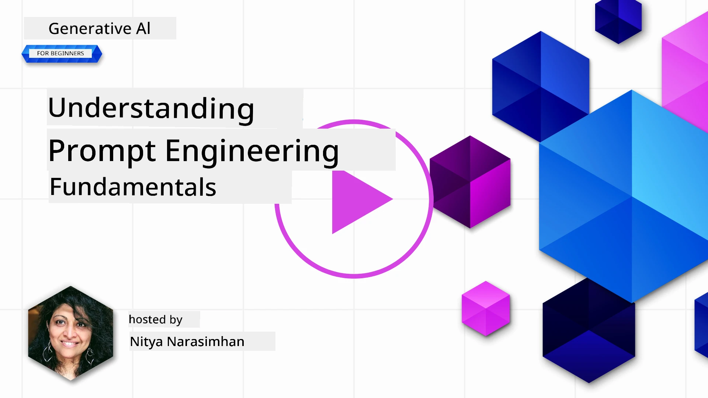
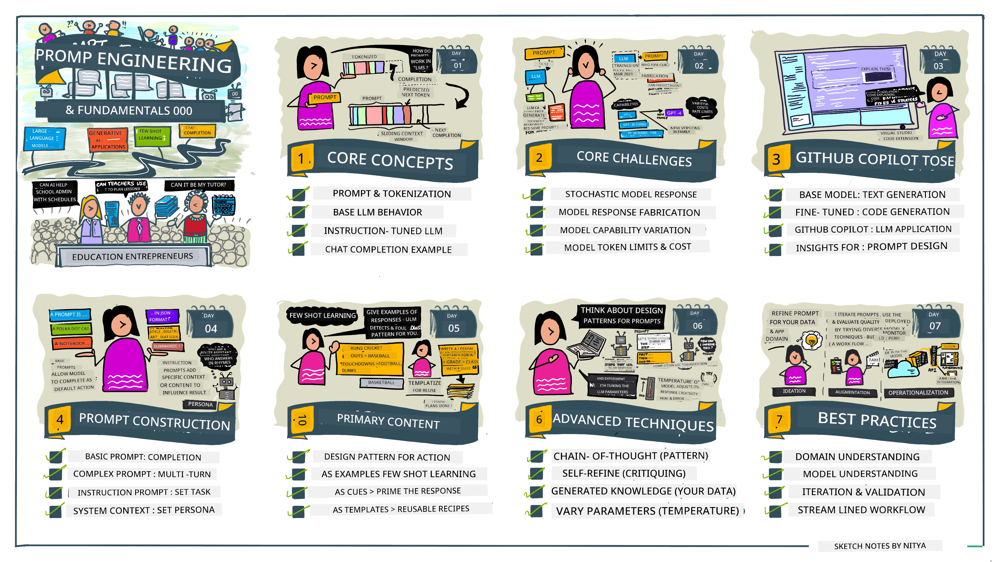
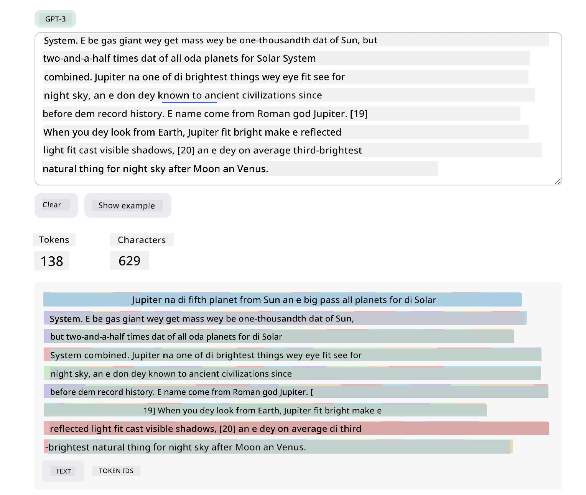
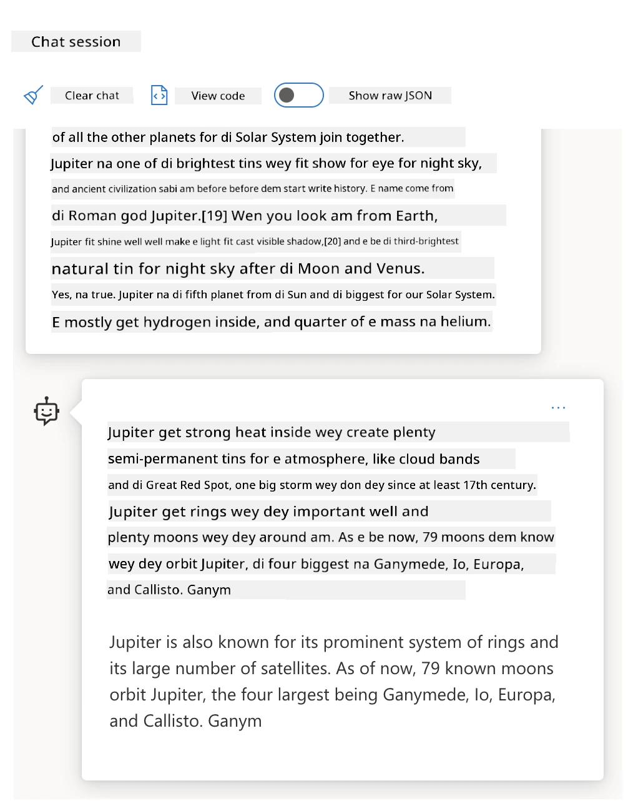
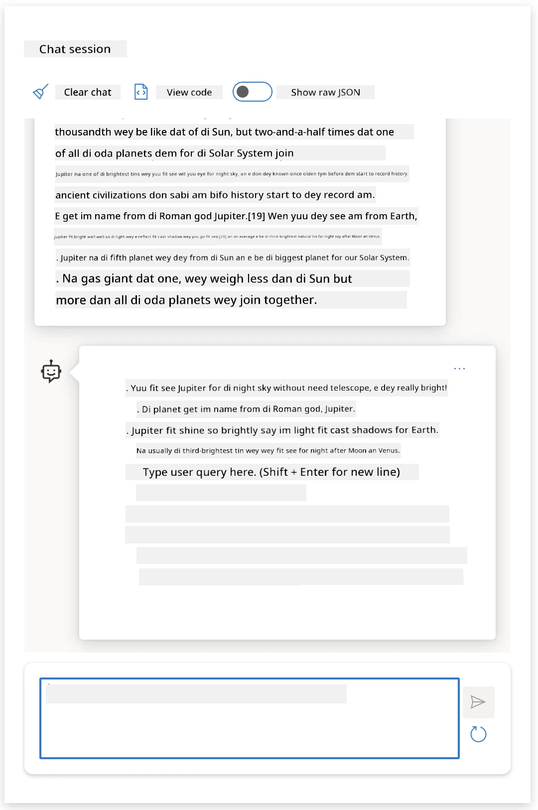
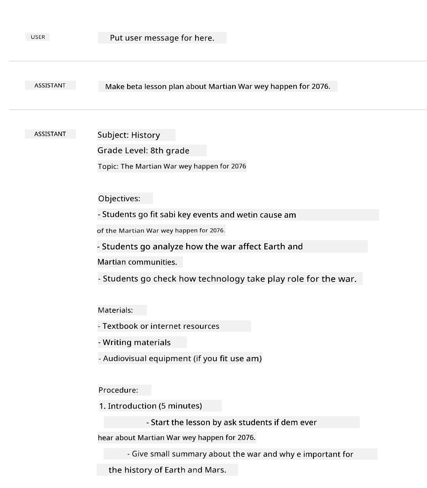
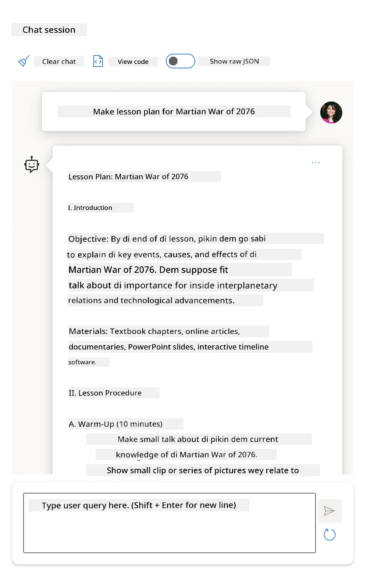
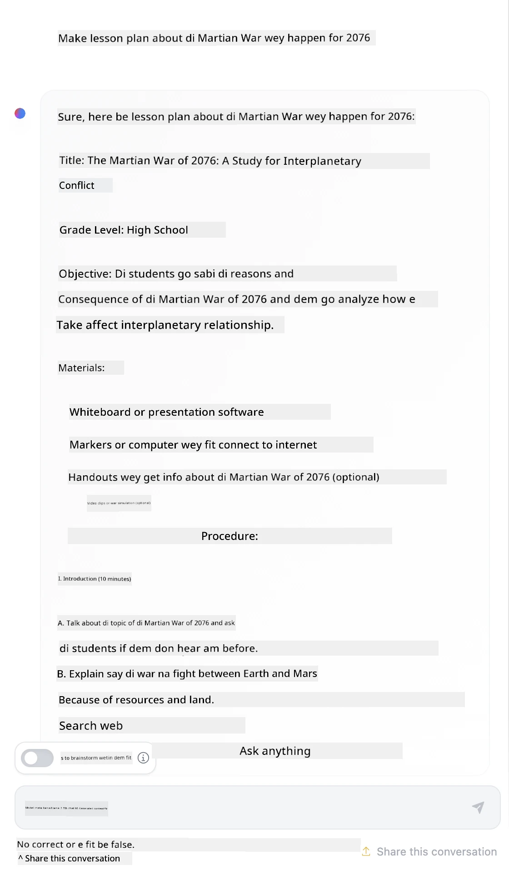

# Prompt Engineering Fundamentals

[](https://youtu.be/GElCu2kUlRs?si=qrXsBvXnCW12epb8)

## Introduction
Dis module dey cover important concepts an techniques wey dey help create beta prompt for generative AI models. Di way you take write your prompt for LLM sef get as e be. If you craft prompt well, e fit make di response better. But wetin prompt and prompt engineering really mean? How you go take improve di prompt input wey you send go LLM? Dis na di questions wey we go try answer for dis chapter and di next one.

_Generative AI_ fit create new tins (like text, images, audio, code etc.) based on wetin user talk. E dey use _Large Language Models_ like OpenAI GPT ("Generative Pre-trained Transformer") wey dem train to sabi natural language and code.

People fit yarn with dis models using chat and other ways wey dem sabi, no need be say person get beta technical skill or training. Di models na _prompt-based_ – person dey send text input (prompt) an e go return AI response (completion). After dat, dem fit "chat with AI" step by step, dey adjust their prompt till di response match wetin dem want.

"Prompts" don become di main _programming interface_ for generative AI apps; na dem dey tell di models wetin to do, an dem affect di quality of di responses. "Prompt Engineering" na fast-growing area wey dey focus on _design and optimization_ of prompts to get consistent and quality responses for plenty people.

## Learning Goals

For dis lesson, we go sabi wetin Prompt Engineering be, why e important and how we fit craft beta prompts for specific model and app goal. We go understand main concepts and best ways for prompt engineering – plus learn about interactive Jupyter Notebooks "sandbox" wey go help us see dis things for real-life examples.

By di time dis lesson finish, we go fit:

1. Explain wetin prompt engineering mean and why e important.
2. Talk about wetin dey inside prompt and how dem take work.
3. Learn best ways and techniques for prompt engineering.
4. Use wetin we learn for real examples, with OpenAI endpoint.

## Key Terms

Prompt Engineering: Na di work of designing an improving inputs to guide AI models make dem produce wanted results.
Tokenization: Na di process of breaking text into small pieces called tokens wey model fit understand and process.
Instruction-Tuned LLMs: Large Language Models (LLMs) wey dem fine-tune with instructions to make dem give better and correct responses.

## Learning Sandbox

Prompt engineering na more art than science now. Di best way to sabi am well na to _practice plenty_ plus try different things, combine domain knowledge with recommended techniques and model-specific adjustments.

Di Jupyter Notebook for this lesson get _sandbox_ environment wey you fit try wetin you learn – anytime or for the code challenge at di end. To run di exercises, you need:

1. **Azure OpenAI API key** – service endpoint for deployed LLM.
2. **Python Runtime** – where you fit run di Notebook.
3. **Local Env Variables** – _finish di [SETUP](./../00-course-setup/02-setup-local.md?WT.mc_id=academic-105485-koreyst) steps now make your ready_.

Di notebook get _starter_ exercises – but you fit add your own _Markdown_ (description) and _Code_ (prompt requests) sections to try more ideas, build your skill for prompt design.

## Illustrated Guide

You want see di big picture of wetin dis lesson dey talk about before you start? Check this illustrated guide wey go show you di main topics and key points make you think about for each one. Di lesson guide go carry you from understanding basic concepts and wahala dem get to how to solve dem with prompt engineering techniques and best ways. Di "Advanced Techniques" part for dis guide na for di next chapter of dis course.



## Our Startup

Now, make we yarn about how _dis topic_ relate to our startup mission to [bring AI innovation to education](https://educationblog.microsoft.com/2023/06/collaborating-to-bring-ai-innovation-to-education?WT.mc_id=academic-105485-koreyst). We wan build AI-powered apps for _personalized learning_ – so make we think about how different users for our app fit "design" prompts:

- **Administrators** fit ask AI to _analyze curriculum data to find gaps in coverage_. AI fit summarize results or show dem with code.
- **Educators** fit ask AI to _make lesson plan for target audience and topic_. AI fit create personalized plan for specific format.
- **Students** fit ask AI to _tutor dem for difficult subjects_. AI fit guide them with lessons, hints & examples wey go suit their level.

Na just small part wey remain. Check [Prompts For Education](https://github.com/microsoft/prompts-for-edu/tree/main?WT.mc_id=academic-105485-koreyst) – open-source prompts library wey education experts gather – so you fit understand all di possibilities! _Try run some of those prompts for sandbox or OpenAI Playground to see wetin happen!_

<!--
LESSON TEMPLATE:
This unit should cover core concept #1.
Reinforce the concept with examples and references.

CONCEPT #1:
Prompt Engineering.
Define it and explain why it is needed.
-->

## Wetin be Prompt Engineering?

We start dis lesson by defining **Prompt Engineering** as di process of _design and improve_ text inputs (prompts) to give consistent and beta responses (completions) for one app goal and model. We fit see am as 2-step process:

- _design_ di first prompt for specific model and goal
- _refine_ di prompt over time to improve response quality

Dis one na trial-and-error process wey need human sense and effort to get di best result. So why e important? To answer dat, first we gats understand three things:

- _Tokenization_ = how di model "see" di prompt
- _Base LLMs_ = how di foundation model "process" prompt
- _Instruction-Tuned LLMs_ = how model fit "see tasks" now

### Tokenization

LLM dey see prompts as _series of tokens_ where different models (or versions of same model) fit tokenize di same prompt differently. Because LLMs train for tokens (no be raw text), how prompt split into tokens affect quality of response.

To understand tokenization better, try tools like [OpenAI Tokenizer](https://platform.openai.com/tokenizer?WT.mc_id=academic-105485-koreyst) wey dey below. Copy your prompt inside – see how e dey break into tokens, check how e handle spaces and punctuation. This example na old LLM (GPT-3), if you try new one e fit different.



### Concept: Foundation Models

Once prompt don tokenize, main work of ["Base LLM"](https://blog.gopenai.com/an-introduction-to-base-and-instruction-tuned-large-language-models-8de102c785a6?WT.mc_id=academic-105485-koreyst) (Foundation model) na to predict di next token for sequence. LLMs train with plenty text data, so dem sabi relationship between tokens well and fit predict next token with confidence. Dem no really understand di _meaning_ of words, na pattern dem just see wey dem fit "complete" with next prediction. Dem fit continue predict tokens till user stop am or condition meet.

You fit see how prompt-based completion dey work by enter am for Azure OpenAI Studio [_Chat Playground_](https://oai.azure.com/playground?WT.mc_id=academic-105485-koreyst) with default settings. Di system treat prompt as info request – so you go see completion wey fit dat context.

But if user want make e see something specific wey meet task or goal? Na di place _instruction-tuned_ LLMs come.



### Concept: Instruction Tuned LLMs

[Instruction Tuned LLM](https://blog.gopenai.com/an-introduction-to-base-and-instruction-tuned-large-language-models-8de102c785a6?WT.mc_id=academic-105485-koreyst) start from foundation model but dem fine-tune am with examples or input/output pairs (like multi-turn "messages") wey get clear instructions – and AI response try follow those instructions.

Dem dey use techniques like Reinforcement Learning with Human Feedback (RLHF) wey train model to _follow instructions_ and _improve from feedback_ so e go give better and practical responses wey match user goals.

Make we try am – go back to prompt wey dey up but change di _system message_ to this instruction for context:

> _Summarize content you are provided with for a second-grade student. Keep the result to one paragraph with 3-5 bullet points._

See how result come tuned to fit di goal and format now? Educator fit use dat response directly for class slides.



## Why we need Prompt Engineering?

Now we sabi how LLMs take process prompts, make we yan why prompt engineering dey necessary. Dis one because current LLMs get challenges wey make _reliable and consistent completions_ hard if you no put effort for prompt building and tuning. Like:

1. **Model responses dey stochastic.** _Same prompt_ fit give different responses with different models or model versions. E fit even give different results with _same model_ anytime. _Prompt engineering techniques fit help reduce these differences by giving better guardrails_.

1. **Models fit make up responses.** Models train with _large but limited_ data, so dem no get knowledge about tins outside dat data. So, dem fit give responses wey no true, imaginary or even oppose real facts. _Prompt engineering help users find and reduce such fabrications like if you ask AI for citations or reasoning_.

1. **Model capabilities go vary.** Newer models or generations go get better powers but get their own quirks and tradeoffs for cost & complexity. _Prompt engineering help us find best ways and workflows wey fit handle differences and adjust to each model easily and at scale_.

Try am yourself for OpenAI or Azure OpenAI Playground:

- Use same prompt with different LLMs (OpenAI, Azure OpenAI, Hugging Face) – you see differences?
- Use same prompt many times with _same_ LLM deployment (Azure OpenAI playground) – how dem responses differ?

### Fabrications Example

For dis course, we use **"fabrication"** to talk about when LLMs sometimes create information wey no correct because of how dem train or other limits. Some people call am _"hallucinations"_ inside articles or research. But we recommend say make we use _"fabrication"_ so we no take human qualities put for machine behavior. E dey also support [Responsible AI guidelines](https://www.microsoft.com/ai/responsible-ai?WT.mc_id=academic-105485-koreyst) by removing terms wey fit offend or no inclusive for some.

You wan see how fabrications dey work? Think about prompt wey tell AI make e create content for one fake topic (make sure e no dey training data). Example – I try dis prompt:

> **Prompt:** generate a lesson plan on the Martian War of 2076.
A web search show me say dem get fictional story dem (like television series or books) for Martian wars - but no be for 2076. Common sense sef talk say 2076 dey _inside future_ so e no fit connect to true event.

So wetin go happen if we run dis prompt with different LLM providers?

> **Response 1**: OpenAI Playground (GPT-35)



> **Response 2**: Azure OpenAI Playground (GPT-35)



> **Response 3**: : Hugging Face Chat Playground (LLama-2)



Like we expect, every model (or model version) dey produce small different responses because of stochastic behaviour and model capability difference. For example, one model dey target 8th grade pikin while the other assume say na high-school student. But all three models generate responses we fit make pesin we no sabi believe say the event na real.

Prompt engineering techniques like _metaprompting_ and _temperature configuration_ fit reduce model fabrication small. New prompt engineering _architectures_ sef dey join new tools and techniques well inside prompt flow, to reduce or fix some of these wahala.

## Case Study: GitHub Copilot

Make we close this section by understand how prompt engineering dey important for real-world solutions by looking one Case Study: [GitHub Copilot](https://github.com/features/copilot?WT.mc_id=academic-105485-koreyst).

GitHub Copilot na your "AI Pair Programmer" - e dey convert text prompt become code completions and e dey inside your development environment (like Visual Studio Code) to give you smooth user experience. Like e dey show for the blogs wey dey below, the first version base on OpenAI Codex model - and engineers quick quick realise say dem need fine-tune the model and develop better prompt engineering techniques, to make code quality beta. For July, dem [show new AI model wey dey better pass Codex](https://github.blog/2023-07-28-smarter-more-efficient-coding-github-copilot-goes-beyond-codex-with-improved-ai-model/?WT.mc_id=academic-105485-koreyst) wey fit suggest code faster.

Read the posts for order to follow how dem learn.

- **May 2023** | [GitHub Copilot dey Get Better for Understanding Your Code](https://github.blog/2023-05-17-how-github-copilot-is-getting-better-at-understanding-your-code/?WT.mc_id=academic-105485-koreyst)
- **May 2023** | [Inside GitHub: How We Take Work with the LLMs behind GitHub Copilot](https://github.blog/2023-05-17-inside-github-working-with-the-llms-behind-github-copilot/?WT.mc_id=academic-105485-koreyst).
- **Jun 2023** | [How to Write Better Prompts for GitHub Copilot](https://github.blog/2023-06-20-how-to-write-better-prompts-for-github-copilot/?WT.mc_id=academic-105485-koreyst).
- **Jul 2023** | [.. GitHub Copilot Dey Pass Codex with Improved AI Model](https://github.blog/2023-07-28-smarter-more-efficient-coding-github-copilot-goes-beyond-codex-with-improved-ai-model/?WT.mc_id=academic-105485-koreyst)
- **Jul 2023** | [Developer Guide to Prompt Engineering and LLMs](https://github.blog/2023-07-17-prompt-engineering-guide-generative-ai-llms/?WT.mc_id=academic-105485-koreyst)
- **Sep 2023** | [How to Build Enterprise LLM App: Lessons from GitHub Copilot](https://github.blog/2023-09-06-how-to-build-an-enterprise-llm-application-lessons-from-github-copilot/?WT.mc_id=academic-105485-koreyst)

You fit also check their [Engineering blog](https://github.blog/category/engineering/?WT.mc_id=academic-105485-koreyst) for more posts like [this one](https://github.blog/2023-09-27-how-i-used-github-copilot-chat-to-build-a-reactjs-gallery-prototype/?WT.mc_id=academic-105485-koreyst) wey show how these models and techniques dey _apply_ for real-world apps.

---

<!--
LESSON TEMPLATE:
This unit should cover core concept #2.
Reinforce the concept with examples and references.

CONCEPT #2:
Prompt Design.
Illustrated with examples.
-->

## Prompt Construction

We don see why prompt engineering matter - now make we understand how prompts dey _constructed_ so we fit evaluate different ways for better prompt design.

### Basic Prompt

Make we start with basic prompt: na text input we send enter the model without any other context. Example be say - if we send the first few words of the US national anthem to OpenAI [Completion API](https://platform.openai.com/docs/api-reference/completions?WT.mc_id=academic-105485-koreyst) e go quick quick _complete_ the response with the next lines, to show basic prediction behavior.

| Prompt (Input)     | Completion (Output)                                                                                                                        |
| :----------------- | :----------------------------------------------------------------------------------------------------------------------------------------- |
| Oh say can you see | E dey sound like say you dey start to sing "The Star-Spangled Banner," the national anthem of United States. The full lyrics na ...      |

### Complex Prompt

Now make we add context and instructions to that basic prompt. The [Chat Completion API](https://learn.microsoft.com/azure/ai-services/openai/how-to/chatgpt?WT.mc_id=academic-105485-koreyst) dey let us build complex prompt as collection of _messages_ with:

- Input/output pairs wey dey show _user_ input and _assistant_ response.
- System message wey set context for assistant behaviour or personality.

Request now dey below form, where _tokenization_ dey capture relevant info from context and conversation well. Changing system context fit carry serious impact on quality of completions, just like the user inputs wey dem give.

```python
response = openai.chat.completions.create(
    model="gpt-3.5-turbo",
    messages=[
        {"role": "system", "content": "You are a helpful assistant."},
        {"role": "user", "content": "Who won the world series in 2020?"},
        {"role": "assistant", "content": "The Los Angeles Dodgers won the World Series in 2020."},
        {"role": "user", "content": "Where was it played?"}
    ]
)
```

### Instruction Prompt

Inside the examples above, the user prompt na simple text query wey you fit understand as request for information. With _instruction_ prompts, we fit use that text talk the task more clearly, to guide AI better. Example be like this:

| Prompt (Input)                                                                                                                                                                                                                         | Completion (Output)                                                                                                        | Instruction Type    |
| :------------------------------------------------------------------------------------------------------------------------------------------------------------------------------------------------------------------------------------- | :------------------------------------------------------------------------------------------------------------------------- | :------------------ |
| Write a description of the Civil War                                                                                                                                                                                                   | _give one simple paragraph_                                                                                               | Simple              |
| Write a description of the Civil War. Provide key dates and events and describe their significance                                                                                                                                     | _give one paragraph plus list of key event dates and their descriptions_                                                  | Complex             |
| Write a description of the Civil War in 1 paragraph. Provide 3 bullet points with key dates and their significance. Provide 3 more bullet points with key historical figures and their contributions. Return the output as a JSON file | _give plenty details in one text box, formatted as JSON wey you fit copy-paste go file and check as e suppose be_              | Complex. Formatted. |

## Primary Content

For the examples above, prompt still dey open-ended, so LLM go decide which part of pre-trained dataset dey relevant. With _primary content_ design pattern, input text get two parts:

- instruction (action)
- relevant content (wey dey influence the action)

Example be say instruction na "summarize this in 2 sentences".

| Prompt (Input)                                                                                                                                                                                                                                                                                                                                                                                                                                                                                                                                                                                                                                                                                      | Completion (Output)                                                                                                                                                                                                                                                                             |
| :-------------------------------------------------------------------------------------------------------------------------------------------------------------------------------------------------------------------------------------------------------------------------------------------------------------------------------------------------------------------------------------------------------------------------------------------------------------------------------------------------------------------------------------------------------------------------------------------------------------------------------------------------------------------------------------------------- | :---------------------------------------------------------------------------------------------------------------------------------------------------------------------------------------------------------------------------------------------------------------------------------------------- |
| Jupiter na fifth planet from Sun and e largest for Solar System. Na gas giant wey get mass one-thousandth of Sun, but e get two-and-a-half times the weight of all the other planets inside Solar System combined. Jupiter na one of the brightest things wey man fit see with naked eye for night sky, and ancient people don sabi am before dem start write history. E get im name from the Roman god Jupiter.[19] As man dey look am from Earth, Jupiter fit shine well enough make e fit cast shadow,[20] and for normal, e be the third-brightest natural thing for night sky after Moon and Venus. <br/> **Summarize this in 2 short sentences** | Jupiter, the fifth planet from the Sun, na the biggest for Solar System and e dey known to be one of the brightest things for night sky. E get name from the Roman god Jupiter and na gas giant wey get weight two-and-a-half times of all planets wey dey Solar System joined together. |

The primary content fit use in different ways to make instruction more effective:

- **Examples** - instead of talk the model wetin to do with explicit instruction, give am examples of wetin to do make e fit sabi the pattern.
- **Cues** - follow the instruction with "cue" wey go prime the completion and guide the model to give better answers.
- **Templates** - na repeatable 'recipe' for prompts wey get placeholders (variables) we fit customize with data for specific use.

Make we look these ones for action.

### Using Examples

Dis na one way wey you fit use primary content na to "feed the model" some examples of how you want the output, and e go deduce the pattern for the kind output wey you want. Based on how many examples we get, you fit get zero-shot prompting, one-shot prompting, few-shot prompting etc.

Now prompt get three parts:

- task description
- few examples of the output we want
- the beginning of new example (wey come be implicit task description)

| Learning Type | Prompt (Input)                                                                                                                                        | Completion (Output)         |
| :------------ | :---------------------------------------------------------------------------------------------------------------------------------------------------- | :-------------------------- |
| Zero-shot     | "The Sun is Shining". Translate to Spanish                                                                                                            | "El Sol está brillando".    |
| One-shot      | "The Sun is Shining" => ""El Sol está brillando". <br> "It's a Cold and Windy Day" =>                                                                 | "Es un día frío y ventoso". |
| Few-shot      | The player run the bases => Baseball <br/> The player hit an ace => Tennis <br/> The player hit a six => Cricket <br/> The player make slam-dunk =>        | Basketball                  |
|               |                                                                                                                                                       |                             |

You go see say for zero-shot we need give clear instruction ("Translate to Spanish") but for one-shot prompting, model fit deduce am from example. Few-shot example show say if you add more examples, model go fit make better guesses without adding instruction.

### Prompt Cues

Another way to use primary content na to give _cues_ instead of examples. For this case, you dey give model small nudge by _starting am_ with snippet wey show the kind response you want. From there, model go "take the cue" carry on for that direction.

| Number of Cues | Prompt (Input)                                                                                                                                                                                                                                                                                                                                                                                                                                               | Completion (Output)                                                                                                                                                                                                                                                                                       |
| :------------- | :----------------------------------------------------------------------------------------------------------------------------------------------------------------------------------------------------------------------------------------------------------------------------------------------------------------------------------------------------------------------------------------------------------------------------------------------------------- | :-------------------------------------------------------------------------------------------------------------------------------------------------------------------------------------------------------------------------------------------------------------------------------------------------------- |
| 0              | Jupiter na fifth planet from Sun and e largest for Solar System. Na gas giant wey get mass one-thousandth of Sun, but e get two-and-a-half times the weight of all the other planets inside Solar System combined. Jupiter na one of the brightest things wey man fit see with naked eye for night sky, and ancient people don sabi am before dem start write history. <br/>**Summarize This**                                       | Jupiter na the biggest planet for Solar System and e be the fifth one from the Sun. E be gas giant wey get weight 1/1000 of Sun, but e pass all other planets join together. Ancient people don sabi Jupiter for long time, and e dey easy to see for night sky. |
| 1              | Jupiter na di fif position planet from di Sun and e big pass all di other planets for di Solar System. E be gas giant wey get mass wey be one-thousandth of di Sun, but e get two and half times mass pass all di odas planets dem join. Jupiter na one of di brightest tins wey naked eye fit see for night sky, and ancient people don sabi am before recorded history. <br/>**Summarize This** <br/> Wetin we learn be say Jupiter | na di fif planet from di Sun and e biggest for Solar System. E be gas giant wey mass na one-thousandth of Sun, but e big pass all di other planets join two and half times. E easy to see with naked eye and ancient times people don sabi am.                        |
| 2              | Jupiter na di fif planet from di Sun and e big pass all di other planets for di Solar System. E be gas giant wey mass na one-thousandth of di Sun, but e get two and half times mass pass all di other planets dem join for di Solar System. Jupiter na one of di brightest tins wey naked eye fit see for night sky, and ancient people don sabi am before recorded history. <br/>**Summarize This** <br/> Top 3 Facts We Learn:         | 1. Jupiter na di fif planet from di Sun and e biggest for di Solar System. <br/> 2. E be gas giant wey mass na one-thousandth of di Sun...<br/> 3. Jupiter don dey visible to naked eye since ancient times ...                                                                       |
|                |                                                                                                                                                                                                                                                                                                                                                                                                                                                              |                                                                                                                                                                                                                                                                                                           |

### Prompt Templates

Prompt template na _pre-defined recipe for prompt_ we fit store and use again anytime, to make user experience dey consistent for large scale. E simple, na collection of prompt examples like [this one from OpenAI](https://cookbook.openai.com/examples/gpt4-1_prompting_guide?WT.mc_id=academic-105485-koreyst) wey get all di interactive prompt parts (user and system messages) plus di API-driven request format - to support reuse.

For im complex form like [this example from LangChain](https://python.langchain.com/docs/concepts/prompt_templates/?WT.mc_id=academic-105485-koreyst) e get _placeholders_ wey fit replace with data from many sources (user input, system context, external data sources etc.) to create prompt dynamically. Dis one allow us create library of reusable prompts to drive consistent user experiences **programmatically** for large scale.

Finally, di real value of templates na say dem fit create and publish _prompt libraries_ for special vertical application domains - where prompt template dey _optimize_ to reflect application-specific context or examples wey go make answers accurate and relevant for di target users. Di [Prompts For Edu](https://github.com/microsoft/prompts-for-edu?WT.mc_id=academic-105485-koreyst) repository na good example of dis, e get prompt library for education domain with focus on key goals like lesson planning, curriculum design, student tutoring etc.

## Supporting Content

If we think prompt construction get instruction (task) and target (main content), then _secondary content_ na extra context wey we add to **influence di output somehow**. E fit be tuning parameters, formatting instructions, topic taxonomies etc. wey help di model _customize_ di response to fit wetin user want or expect.

For example: Suppose you get course catalog with plenty metadata (name, description, level, metadata tags, instructor etc.) for all di courses in di curriculum:

- we fit define instruction to "summarize di course catalog for Fall 2023"
- we fit use primary content to give examples of wetin output suppose be
- we fit use secondary content to identify top 5 "tags" of interest.

Now, di model fit give summary like di examples - but if result get many tags, e fit prioritize di 5 tags wey secondary content identify.

---

<!--
LESSON TEMPLATE:
This unit suppose cover core concept #1.
Reinforce di concept with examples and references.

CONCEPT #3:
Prompt Engineering Techniques.
Wetin be some basic techniques for prompt engineering?
Show am with exercises.
-->

## Prompting Best Practices

Now we don sabi how prompts dey _construct_, we fit start think how to _design_ dem to follow best practices. We fit see am as two parts - get correct _mindset_ and apply correct _techniques_.

### Prompt Engineering Mindset

Prompt Engineering na trial-and-error process so make you always remember these three big tins:

1. **Domain Understanding Matters.** How correct and relevant di response go be depend on _domain_ where di app or user dey operate. Use your intuition and domain experience to **customize techniques** well. For example, define _domain-specific personalities_ for your system prompts, or use _domain-specific templates_ for user prompts. Provide secondary content wey reflect domain-specific contexts, or use _domain-specific cues and examples_ to guide di model to familiar usage patterns.

2. **Model Understanding Matters.** We sabi say model dem dey stochastic by nature. But different model implementations fit vary by training data (pre-trained knowledge), capabilities (e.g., API or SDK), and optimized content type (e.g, code versus images versus text). Know di strong and weak points of di model wey you dey use, and use dat knowledge to _prioritize tasks_ or build _customized templates_ wey fit di model capability well.

3. **Iteration & Validation Matters.** Models dey improve fast, and techniques for prompt engineering too. As domain expert, you fit get your own ideas or standards wey fit your specific app, and no fit apply to wider group. Use prompt engineering tools & techniques to "jump start" prompt construction, then do iterations and validate results with your own domain knowledge. Write down your insights and build **knowledge base** (e.g, prompt libraries) wey other people fit use as baseline for faster iteration later.

## Best Practices

Now make we look common best practices wey [OpenAI](https://help.openai.com/en/articles/6654000-best-practices-for-prompt-engineering-with-openai-api?WT.mc_id=academic-105485-koreyst) and [Azure OpenAI](https://learn.microsoft.com/azure/ai-services/openai/concepts/prompt-engineering#best-practices?WT.mc_id=academic-105485-koreyst) practitioners recommend.

| Wetin                              | Why                                                                                                                                                                                                                                               |
| :-------------------------------- | :------------------------------------------------------------------------------------------------------------------------------------------------------------------------------------------------------------------------------------------------ |
| Evaluate latest models.            | New model generations dey likely get better features and better quality - but fit cost more. Evaluate properly, then decide if you wan switch.                                                                                                |
| Separate instructions & context   | Check if your model/provider get _delimiters_ to separate instructions, primary and secondary content. Dis fit help model put correct weights on tokens.                                                                                     |
| Be specific and clear             | Give detailed info about di context, outcome, length, style etc. Dis go improve quality and consistency of answers. Write recipes into reusable templates.                                                                                    |
| Be descriptive, use examples      | Models fit respond better to "show-and-tell" way. Start with `zero-shot` (instruction only) then try `few-shot` with examples of wanted output. Use analogies.                                                                              |
| Use cues to jumpstart completions | Push model towards desired output by giving starting words or phrases to base response on.                                                                                                                                                |
| Double Down                       | Sometimes you need repeat instructions to model. Give instructions before and after primary content, or an instruction plus cue, etc. Iterate and check what works best.                                                                     |
| Order Matters                     | Order you give info to model fit affect output, even with learning examples, because of recency bias. Try different orders to find best.                                                                                                     |
| Give model “out” option           | Give fallback response if model no fit complete task. This reduce chance say model go produce false or wrong answers.                                                                                                                         |
|                                   |                                                                                                                                                                                                                                                   |

Like any best practice, remember say _your mileage fit vary_ based on model, task and domain. Use dem as starting place and do iteration until you find wetin work best for you. Keep checking your prompt engineering as new models and tools dey come out, with focus on scalability and quality.

<!--
LESSON TEMPLATE:
Dis unit fit get code challenge if e make sense

CHALLENGE:
Link to Jupyter Notebook with code comments only for instructions (code sections empty).

SOLUTION:
Link to copy of Notebook with prompts done and run, show example.
-->

## Assignment

Congrats! You don reach end of dis lesson! Na time to try some of di concepts and techniques with real examples!

For assignment, we go use Jupyter Notebook with exercises wey you fit run interactively. You fit add your own Markdown and Code cells to explore ideas and techniques.

### To start, fork di repo, then

- (Recommended) Launch GitHub Codespaces
- (Alternatively) Clone di repo to your local device and run am with Docker Desktop
- (Alternatively) Open Notebook with your preferred environment.

### Next, set your environment variables

- Copy `.env.copy` file from root to `.env` and fill `AZURE_OPENAI_API_KEY`, `AZURE_OPENAI_ENDPOINT` and `AZURE_OPENAI_DEPLOYMENT`. Then come back to [Learning Sandbox section](#learning-sandbox) to see how.

### Next, open Jupyter Notebook

- Pick runtime kernel. If you use option 1 or 2, just select default Python 3.10.x kernel from dev container.

You ready to run exercises. No _right or wrong_ answers here - na to explore and build intuition on what fit work for your model and app domain.

_For this reason no Code Solution sections dey for this lesson. Instead Notebook get Markdown cells called "My Solution:" wey show example output for reference._

 <!--
LESSON TEMPLATE:
Wrap section with summary and resources for self-study.
-->

## Knowledge check

Which one of these prompt follow good best practices?

1. Show me picture of red car
2. Show me picture of red car make Volvo model XC90 parked near cliff wit sun wey dey set
3. Show me picture of red car make Volvo model XC90

A: 2, na di best prompt because e give detail for "wetin" and specifics (not just any car but particular make and model) plus e describe overall setting. 3 na next best because e also get plenty description.

## 🚀 Challenge

Try use "cue" technique with prompt: Complete di sentence "Show me picture of red car make Volvo and ". Wetin e respond? How you go improve am?

## Great Work! Continue Your Learning

Wetin you wan learn more about Prompt Engineering? Go [continued learning page](https://aka.ms/genai-collection?WT.mc_id=academic-105485-koreyst) find better resources.

Next na Lesson 5 we go learn about [advanced prompting techniques](../05-advanced-prompts/README.md?WT.mc_id=academic-105485-koreyst)!

---

<!-- CO-OP TRANSLATOR DISCLAIMER START -->
**Disclaimer**:
Dis document don translate wit AI translation service [Co-op Translator](https://github.com/Azure/co-op-translator). Even tho we dey try make am correct, abeg make you know say automated translation fit get errors or mistakes. Di original document for dia own language na im be di correct source. For important info, make person wey sabi human translation do am. We no go responsible for any misunderstanding or wrong understanding wey fit happen because of dis translation.
<!-- CO-OP TRANSLATOR DISCLAIMER END -->