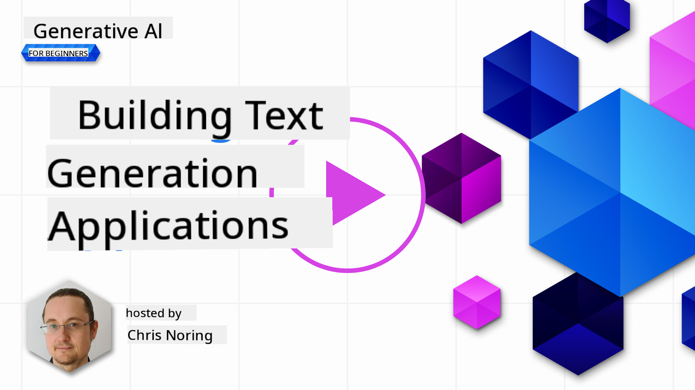

<!--
CO_OP_TRANSLATOR_METADATA:
{
  "original_hash": "df027997f1448323d6159b78a1b669bf",
  "translation_date": "2025-11-12T08:57:43+00:00",
  "source_file": "06-text-generation-apps/README.md",
  "language_code": "pcm"
}
-->
# How to Build Text Generation Apps

[](https://youtu.be/0Y5Luf5sRQA?si=t_xVg0clnAI4oUFZ)

> _(Click di image wey dey up to watch di video for dis lesson)_

For dis curriculum wey you don dey see so far, e get core concepts like prompts and even one whole discipline wey dem dey call "prompt engineering". Plenty tools wey you fit use like ChatGPT, Office 365, Microsoft Power Platform and others, dey support you to use prompts do something.

If you wan add dis kain experience for app, you go need sabi concepts like prompts, completions and choose one library wey you go use. Na wetin you go learn for dis chapter be dat.

## Introduction

For dis chapter, you go:

- Learn about di openai library and di main concepts wey dey inside.
- Build one text generation app wey dey use openai.
- Understand how to use concepts like prompt, temperature, and tokens to build one text generation app.

## Learning goals

By di time we finish dis lesson, you go fit:

- Explain wetin text generation app be.
- Build one text generation app wey dey use openai.
- Configure your app to use more or less tokens and also change di temperature, to get different kain output.

## Wetin be text generation app?

Normally, when you dey build app, e go get one kain interface like di ones wey dey below:

- Command-based. Console apps na di kind app wey you go type command and e go do di work. Example na `git` wey be command-based app.
- User interface (UI). Some apps get graphical user interfaces (GUIs) wey you go fit click buttons, type text, choose options and more.

### Console and UI apps get limit

Compare am to command-based app wey you go type command:

- **E get limit**. You no fit just type any command, na only di ones wey di app support you fit type.
- **Language specific**. Some apps dey support plenty languages, but di app dey built for one specific language by default, even if you fit add more language support.

### Benefits of text generation apps

So, how text generation app dey different?

For text generation app, you get more freedom, you no dey limited to set of commands or one specific input language. Instead, you fit use natural language interact with di app. Another benefit be say you dey interact with one data source wey dem don train with plenty information, unlike traditional app wey fit dey limited to wetin dey inside database.

### Wetin I fit build with text generation app?

Plenty things dey wey you fit build. Example:

- **Chatbot**. Chatbot wey dey answer questions about topics, like your company and di products fit make sense.
- **Helper**. LLMs dey good for things like summarizing text, getting insights from text, producing text like CVs and more.
- **Code assistant**. Depending on di language model wey you dey use, you fit build code assistant wey go help you write code. Example na GitHub Copilot or ChatGPT wey fit help you write code.

## How I go take start?

You go need find way to connect with LLM wey usually dey involve di two approaches wey dey below:

- Use API. For here, you go dey construct web requests with your prompt and get generated text back.
- Use library. Libraries dey help make di API calls easier to use.

## Libraries/SDKs

E get some popular libraries wey dey work with LLMs like:

- **openai**, dis library dey make am easy to connect to your model and send prompts.

Then e get libraries wey dey operate for higher level like:

- **Langchain**. Langchain dey popular and e dey support Python.
- **Semantic Kernel**. Semantic Kernel na library wey Microsoft create wey dey support C#, Python, and Java.

## First app wey dey use openai

Make we see how we fit build our first app, wetin we need, how much work e go take and so on.

### Install openai

Plenty libraries dey wey you fit use to interact with OpenAI or Azure OpenAI. You fit use plenty programming languages like C#, Python, JavaScript, Java and more. We don choose to use `openai` Python library, so we go use `pip` install am.

```bash
pip install openai
```

### Create resource

You go need do di steps wey dey below:

- Create account for Azure [https://azure.microsoft.com/free/](https://azure.microsoft.com/free/?WT.mc_id=academic-105485-koreyst).
- Get access to Azure OpenAI. Go [https://learn.microsoft.com/azure/ai-services/openai/overview#how-do-i-get-access-to-azure-openai](https://learn.microsoft.com/azure/ai-services/openai/overview#how-do-i-get-access-to-azure-openai?WT.mc_id=academic-105485-koreyst) and request access.

  > [!NOTE]
  > As at di time wey dem write dis, you go need apply for access to Azure OpenAI.

- Install Python <https://www.python.org/>
- Don create Azure OpenAI Service resource. See dis guide for how to [create resource](https://learn.microsoft.com/azure/ai-services/openai/how-to/create-resource?pivots=web-portal?WT.mc_id=academic-105485-koreyst).

### Locate API key and endpoint

For dis stage, you go need tell your `openai` library di API key wey e go use. To find your API key, go "Keys and Endpoint" section for your Azure OpenAI resource and copy di "Key 1" value.


Now wey you don copy dis information, make we tell di libraries how to use am.

> [!NOTE]
> E good make you separate your API key from your code. You fit do am by using environment variables.
>
> - Set di environment variable `OPENAI_API_KEY` to your API key.
>   `export OPENAI_API_KEY='sk-...'`

### Setup configuration Azure

If you dey use Azure OpenAI, na so you go setup configuration:

```python
openai.api_type = 'azure'
openai.api_key = os.environ["OPENAI_API_KEY"]
openai.api_version = '2023-05-15'
openai.api_base = os.getenv("API_BASE")
```

For di code wey dey above, we dey set di following:

- `api_type` to `azure`. Dis one dey tell di library make e use Azure OpenAI and no be OpenAI.
- `api_key`, na your API key wey dey Azure Portal.
- `api_version`, na di version of di API wey you wan use. As at di time wey dem write dis, di latest version na `2023-05-15`.
- `api_base`, na di endpoint of di API. You fit find am for Azure Portal near your API key.

> [!NOTE] > `os.getenv` na function wey dey read environment variables. You fit use am read environment variables like `OPENAI_API_KEY` and `API_BASE`. Set dis environment variables for your terminal or use library like `dotenv`.

## Generate text

Di way to generate text na to use di `Completion` class. Example dey here:

```python
prompt = "Complete the following: Once upon a time there was a"

completion = openai.Completion.create(model="davinci-002", prompt=prompt)
print(completion.choices[0].text)
```

For di code wey dey above, we dey create one completion object and we dey pass di model wey we wan use and di prompt. Then we dey print di generated text.

### Chat completions

So far, you don see how we dey use `Completion` to generate text. But e get another class wey dem dey call `ChatCompletion` wey dey more suitable for chatbots. Example of how to use am dey here:

```python
import openai

openai.api_key = "sk-..."

completion = openai.ChatCompletion.create(model="gpt-3.5-turbo", messages=[{"role": "user", "content": "Hello world"}])
print(completion.choices[0].message.content)
```

We go talk more about dis functionality for di next chapter.

## Exercise - your first text generation app

Now wey we don learn how to setup and configure openai, e don reach time to build your first text generation app. To build your app, follow di steps wey dey below:

1. Create virtual environment and install openai:

   ```bash
   python -m venv venv
   source venv/bin/activate
   pip install openai
   ```

   > [!NOTE]
   > If you dey use Windows, type `venv\Scripts\activate` instead of `source venv/bin/activate`.

   > [!NOTE]
   > Find your Azure OpenAI key by going to [https://portal.azure.com/](https://portal.azure.com/?WT.mc_id=academic-105485-koreyst) and search for `Open AI` then select `Open AI resource` and then select `Keys and Endpoint` and copy di `Key 1` value.

1. Create _app.py_ file and put di code wey dey below inside:

   ```python
   import openai

   openai.api_key = "<replace this value with your open ai key or Azure OpenAI key>"

   openai.api_type = 'azure'
   openai.api_version = '2023-05-15'
   openai.api_base = "<endpoint found in Azure Portal where your API key is>"
   deployment_name = "<deployment name>"

   # add your completion code
   prompt = "Complete the following: Once upon a time there was a"
   messages = [{"role": "user", "content": prompt}]

   # make completion
   completion = openai.chat.completions.create(model=deployment_name, messages=messages)

   # print response
   print(completion.choices[0].message.content)
   ```

   > [!NOTE]
   > If you dey use Azure OpenAI, you go need set di `api_type` to `azure` and set di `api_key` to your Azure OpenAI key.

   You go see output like di one wey dey below:

   ```output
    very unhappy _____.

   Once upon a time there was a very unhappy mermaid.
   ```

## Different types of prompts, for different things

Now you don see how to generate text using prompt. You even get program wey dey run wey you fit modify and change to generate different kain text.

Prompts fit dey used for plenty tasks. Example:

- **Generate one type of text**. Example, you fit generate poem, questions for quiz etc.
- **Find information**. You fit use prompts find information like dis example 'Wetin CORS mean for web development?'.
- **Generate code**. You fit use prompts generate code, example na to develop regular expression wey dey validate emails or even generate one whole program, like web app.

## One practical use case: recipe generator

Imagine say you get ingredients for house and you wan cook something. For dat, you go need recipe. One way to find recipes na to use search engine or you fit use LLM.

You fit write prompt like dis:

> "Show me 5 recipes for a dish with the following ingredients: chicken, potatoes, and carrots. Per recipe, list all the ingredients used"

Based on di prompt wey dey above, you fit get response like dis:

```output
1. Roasted Chicken and Vegetables:
Ingredients:
- 4 chicken thighs
- 2 potatoes, cut into cubes
- 2 carrots, cut into cubes
- 2 tablespoons olive oil
- 2 cloves garlic, minced
- 1 teaspoon dried thyme
- 1 teaspoon dried oregano
- Salt and pepper, to taste

2. Chicken and Potato Stew:
Ingredients:
- 2 tablespoons olive oil
- 1 onion, diced
- 2 cloves garlic, minced
- 2 chicken breasts, cut into cubes
- 2 potatoes, cut into cubes
- 2 carrots, cut into cubes
- 1 teaspoon dried oregano
- 1 teaspoon dried thyme
- 1 cup chicken broth
- Salt and pepper, to taste

3. Chicken and Potato Bake:
Ingredients:
- 2 tablespoons olive oil
- 2 chicken breasts, cut into cubes
- 2 potatoes, cut into cubes
- 2 carrots, cut into cubes
- 1 onion, diced
- 2 cloves garlic, minced
- 1 teaspoon dried oregano
- 1 teaspoon dried thyme
- 1 cup chicken broth
- Salt and pepper, to taste

4. Chicken and Potato Soup:
Ingredients:
- 2 tablespoons olive oil
- 1 onion, diced
- 2 cloves garlic, minced
- 2 chicken breasts, cut into cubes
- 2 potatoes, cut into cubes
- 2 carrots, cut into cubes
- 1 teaspoon dried oregano
- 1 teaspoon dried thyme
- 4 cups chicken broth
- Salt and pepper, to taste

5. Chicken and Potato Hash:
Ingredients:
- 2 tablespoons olive oil
- 2 chicken breasts, cut into cubes
- 2 potatoes, cut into cubes
- 2 carrots, cut into cubes
- 1 onion, diced
- 2 cloves garlic, minced
- 1 teaspoon dried oregano
```

Dis result dey good, I don sabi wetin to cook. For dis stage, wetin fit make sense na:

- Remove ingredients wey I no like or wey I dey allergic to.
- Create shopping list, in case I no get all di ingredients for house.

For di cases wey dey above, make we add another prompt:

> "Please remove recipes with garlic as I'm allergic and replace it with something else. Also, please produce a shopping list for the recipes, considering I already have chicken, potatoes and carrots at home."

Now you go get new result, wey be:

```output
1. Roasted Chicken and Vegetables:
Ingredients:
- 4 chicken thighs
- 2 potatoes, cut into cubes
- 2 carrots, cut into cubes
- 2 tablespoons olive oil
- 1 teaspoon dried thyme
- 1 teaspoon dried oregano
- Salt and pepper, to taste

2. Chicken and Potato Stew:
Ingredients:
- 2 tablespoons olive oil
- 1 onion, diced
- 2 chicken breasts, cut into cubes
- 2 potatoes, cut into cubes
- 2 carrots, cut into cubes
- 1 teaspoon dried oregano
- 1 teaspoon dried thyme
- 1 cup chicken broth
- Salt and pepper, to taste

3. Chicken and Potato Bake:
Ingredients:
- 2 tablespoons olive oil
- 2 chicken breasts, cut into cubes
- 2 potatoes, cut into cubes
- 2 carrots, cut into cubes
- 1 onion, diced
- 1 teaspoon dried oregano
- 1 teaspoon dried thyme
- 1 cup chicken broth
- Salt and pepper, to taste

4. Chicken and Potato Soup:
Ingredients:
- 2 tablespoons olive oil
- 1 onion, diced
- 2 chicken breasts, cut into cubes
- 2 potatoes, cut into cubes
- 2 carrots, cut into cubes
- 1 teaspoon dried oregano
- 1 teaspoon dried thyme
- 4 cups chicken broth
- Salt and pepper, to taste

5. Chicken and Potato Hash:
Ingredients:
- 2 tablespoons olive oil
- 2 chicken breasts, cut into cubes
- 2 potatoes, cut into cubes
- 2 carrots, cut into cubes
- 1 onion, diced
- 1 teaspoon dried oregano

Shopping List:
- Olive oil
- Onion
- Thyme
- Oregano
- Salt
- Pepper
```

Na your five recipes be dat, garlic no dey inside and you don get shopping list wey consider wetin you already get for house.

## Exercise - build recipe generator

Now wey we don play out one scenario, make we write code wey go match di scenario wey we don show. To do am, follow di steps wey dey below:

1. Use di existing _app.py_ file as starting point
1. Find di `prompt` variable and change di code to di one wey dey below:

   ```python
   prompt = "Show me 5 recipes for a dish with the following ingredients: chicken, potatoes, and carrots. Per recipe, list all the ingredients used"
   ```

   If you run di code now, you go see output wey go look like:

   ```output
   -Chicken Stew with Potatoes and Carrots: 3 tablespoons oil, 1 onion, chopped, 2 cloves garlic, minced, 1 carrot, peeled and chopped, 1 potato, peeled and chopped, 1 bay leaf, 1 thyme sprig, 1/2 teaspoon salt, 1/4 teaspoon black pepper, 1 1/2 cups chicken broth, 1/2 cup dry white wine, 2 tablespoons chopped fresh parsley, 2 tablespoons unsalted butter, 1 1/2 pounds boneless, skinless chicken thighs, cut into 1-inch pieces
   -Oven-Roasted Chicken with Potatoes and Carrots: 3 tablespoons extra-virgin olive oil, 1 tablespoon Dijon mustard, 1 tablespoon chopped fresh rosemary, 1 tablespoon chopped fresh thyme, 4 cloves garlic, minced, 1 1/2 pounds small red potatoes, quartered, 1 1/2 pounds carrots, quartered lengthwise, 1/2 teaspoon salt, 1/4 teaspoon black pepper, 1 (4-pound) whole chicken
   -Chicken, Potato, and Carrot Casserole: cooking spray, 1 large onion, chopped, 2 cloves garlic, minced, 1 carrot, peeled and shredded, 1 potato, peeled and shredded, 1/2 teaspoon dried thyme leaves, 1/4 teaspoon salt, 1/4 teaspoon black pepper, 2 cups fat-free, low-sodium chicken broth, 1 cup frozen peas, 1/4 cup all-purpose flour, 1 cup 2% reduced-fat milk, 1/4 cup grated Parmesan cheese

   -One Pot Chicken and Potato Dinner: 2 tablespoons olive oil, 1 pound boneless, skinless chicken thighs, cut into 1-inch pieces, 1 large onion, chopped, 3 cloves garlic, minced, 1 carrot, peeled and chopped, 1 potato, peeled and chopped, 1 bay leaf, 1 thyme sprig, 1/2 teaspoon salt, 1/4 teaspoon black pepper, 2 cups chicken broth, 1/2 cup dry white wine

   -Chicken, Potato, and Carrot Curry: 1 tablespoon vegetable oil, 1 large onion, chopped, 2 cloves garlic, minced, 1 carrot, peeled and chopped, 1 potato, peeled and chopped, 1 teaspoon ground coriander, 1 teaspoon ground cumin, 1/2 teaspoon ground turmeric, 1/2 teaspoon ground ginger, 1/4 teaspoon cayenne pepper, 2 cups chicken broth, 1/2 cup dry white wine, 1 (15-ounce) can chickpeas, drained and rinsed, 1/2 cup raisins, 1/2 cup chopped fresh cilantro
   ```

   > NOTE, your LLM no dey predictable, so you fit dey get different results anytime you run di program.

   E good, make we see how we fit improve di code. To improve am, we wan make sure say di code dey flexible, so ingredients and number of recipes fit dey improved and changed.

1. Make we change di code like dis:

   ```python
   no_recipes = input("No of recipes (for example, 5): ")

   ingredients = input("List of ingredients (for example, chicken, potatoes, and carrots): ")

   # interpolate the number of recipes into the prompt an ingredients
   prompt = f"Show me {no_recipes} recipes for a dish with the following ingredients: {ingredients}. Per recipe, list all the ingredients used"
   ```

   If you test di code, e fit look like dis:

   ```output
   No of recipes (for example, 5): 3
   List of ingredients (for example, chicken, potatoes, and carrots): milk,strawberries

   -Strawberry milk shake: milk, strawberries, sugar, vanilla extract, ice cubes
   -Strawberry shortcake: milk, flour, baking powder, sugar, salt, unsalted butter, strawberries, whipped cream
   -Strawberry milk: milk, strawberries, sugar, vanilla extract
   ```

### Improve by adding filter and shopping list

We don get working app wey fit produce recipes and e dey flexible as e dey depend on user inputs, both for di number of recipes and di ingredients wey dem wan use.

To improve am, we wan add di following:

- **Remove ingredients**. We wan fit remove ingredients wey we no like or wey we dey allergic to. To do dis change, we fit edit di existing prompt and add filter condition for di end like dis:

  ```python
  filter = input("Filter (for example, vegetarian, vegan, or gluten-free): ")

  prompt = f"Show me {no_recipes} recipes for a dish with the following ingredients: {ingredients}. Per recipe, list all the ingredients used, no {filter}"
  ```

  For di code wey dey above, we dey add `{filter}` for di end of di prompt and we dey also collect di filter value from di user.

  Example input wey go run di program fit look like dis:

  ```output
  No of recipes (for example, 5): 3
  List of ingredients (for example, chicken, potatoes, and carrots): onion,milk
  Filter (for example, vegetarian, vegan, or gluten-free): no milk

  1. French Onion Soup

  Ingredients:

  -1 large onion, sliced
  -3 cups beef broth
  -1 cup milk
  -6 slices french bread
  -1/4 cup shredded Parmesan cheese
  -1 tablespoon butter
  -1 teaspoon dried thyme
  -1/4 teaspoon salt
  -1/4 teaspoon black pepper

  Instructions:

  1. In a large pot, sauté onions in butter until golden brown.
  2. Add beef broth, milk, thyme, salt, and pepper. Bring to a boil.
  3. Reduce heat and simmer for 10 minutes.
  4. Place french bread slices on soup bowls.
  5. Ladle soup over bread.
  6. Sprinkle with Parmesan cheese.

  2. Onion and Potato Soup

  Ingredients:

  -1 large onion, chopped
  -2 cups potatoes, diced
  -3 cups vegetable broth
  -1 cup milk
  -1/4 teaspoon black pepper

  Instructions:

  1. In a large pot, sauté onions in butter until golden brown.
  2. Add potatoes, vegetable broth, milk, and pepper. Bring to a boil.
  3. Reduce heat and simmer for 10 minutes.
  4. Serve hot.

  3. Creamy Onion Soup

  Ingredients:

  -1 large onion, chopped
  -3 cups vegetable broth
  -1 cup milk
  -1/4 teaspoon black pepper
  -1/4 cup all-purpose flour
  -1/2 cup shredded Parmesan cheese

  Instructions:

  1. In a large pot, sauté onions in butter until golden brown.
  2. Add vegetable broth, milk, and pepper. Bring to a boil.
  3. Reduce heat and simmer for 10 minutes.
  4. In a small bowl, whisk together flour and Parmesan cheese until smooth.
  5. Add to soup and simmer for an additional 5 minutes, or until soup has thickened.
  ```

  As you fit see, any recipes wey get milk don comot. But, if you no dey fit chop milk, you fit wan remove recipes wey get cheese too, so e dey important to dey clear.

- **Create shopping list**. We wan create shopping list wey go consider wetin we already get for house.

  For dis functionality, we fit try solve everything for one prompt or we fit divide am into two prompts. Make we try di second option. For here, we dey suggest make we add another prompt, but for dat to work, we go need add di result of di first prompt as context to di second prompt.

  Find di part for di code wey dey print di result from di first prompt and add di code wey dey below:
  ```python
  old_prompt_result = completion.choices[0].message.content
  prompt = "Produce a shopping list for the generated recipes and please don't include ingredients that I already have."

  new_prompt = f"{old_prompt_result} {prompt}"
  messages = [{"role": "user", "content": new_prompt}]
  completion = openai.Completion.create(engine=deployment_name, messages=messages, max_tokens=1200)

  # print response
  print("Shopping list:")
  print(completion.choices[0].message.content)
  ```

  Make sure say you sabi dis:

  1. We dey build new prompt by adding di result wey we get from di first prompt to di new prompt:

     ```python
     new_prompt = f"{old_prompt_result} {prompt}"
     ```

  1. We go make new request, but we go also think about di number of tokens we ask for inside di first prompt, so dis time we go set `max_tokens` to 1200.

     ```python
     completion = openai.Completion.create(engine=deployment_name, prompt=new_prompt, max_tokens=1200)
     ```

     As we dey test dis code, we don reach di following output:

     ```output
     No of recipes (for example, 5): 2
     List of ingredients (for example, chicken, potatoes, and carrots): apple,flour
     Filter (for example, vegetarian, vegan, or gluten-free): sugar


     -Apple and flour pancakes: 1 cup flour, 1/2 tsp baking powder, 1/2 tsp baking soda, 1/4 tsp salt, 1 tbsp sugar, 1 egg, 1 cup buttermilk or sour milk, 1/4 cup melted butter, 1 Granny Smith apple, peeled and grated
     -Apple fritters: 1-1/2 cups flour, 1 tsp baking powder, 1/4 tsp salt, 1/4 tsp baking soda, 1/4 tsp nutmeg, 1/4 tsp cinnamon, 1/4 tsp allspice, 1/4 cup sugar, 1/4 cup vegetable shortening, 1/4 cup milk, 1 egg, 2 cups shredded, peeled apples
     Shopping list:
     -Flour, baking powder, baking soda, salt, sugar, egg, buttermilk, butter, apple, nutmeg, cinnamon, allspice
     ```

## Make your setup beta

Di code wey we don get so far dey work, but e get some small changes wey we fit do to make am beta. Some of di things wey we suppose do na:

- **Keep secrets separate from code**, like di API key. Secrets no suppose dey inside code, dem suppose dey for safe place. To keep secrets separate from code, we fit use environment variables and libraries like `python-dotenv` to load dem from file. Dis na how e go look for code:

  1. Create `.env` file wey get dis content:

     ```bash
     OPENAI_API_KEY=sk-...
     ```

     > Make sure say for Azure, you go set di following environment variables:

     ```bash
     OPENAI_API_TYPE=azure
     OPENAI_API_VERSION=2023-05-15
     OPENAI_API_BASE=<replace>
     ```

     For code, you go load di environment variables like dis:

     ```python
     from dotenv import load_dotenv

     load_dotenv()

     openai.api_key = os.environ["OPENAI_API_KEY"]
     ```

- **Talk about token length**. We suppose think about how many tokens we need to generate di text wey we want. Tokens dey cost money, so if e possible, we suppose try reduce di number of tokens we dey use. For example, we fit arrange di prompt so we go use less tokens.

  To change di tokens wey we dey use, you fit use di `max_tokens` parameter. For example, if you want use 100 tokens, you go do am like dis:

  ```python
  completion = client.chat.completions.create(model=deployment, messages=messages, max_tokens=100)
  ```

- **Try temperature settings**. Temperature na something we never talk about before but e dey important for how our program go perform. Di higher di temperature value, di more random di output go be. Di lower di temperature value, di more predictable di output go be. Think about whether you want variation for your output or not.

  To change di temperature, you fit use di `temperature` parameter. For example, if you want use temperature of 0.5, you go do am like dis:

  ```python
  completion = client.chat.completions.create(model=deployment, messages=messages, temperature=0.5)
  ```

  > Make sure say you sabi, di closer to 1.0, di more varied di output go be.

## Assignment

For dis assignment, you fit choose wetin you wan build.

Here na some ideas:

- Adjust di recipe generator app to make am beta. Play with di temperature values, and di prompts to see wetin you fit get.
- Build "study buddy". Dis app suppose fit answer questions about one topic like Python. You fit get prompts like "Wetin be dis topic for Python?", or you fit get prompt wey talk say, show me code for dis topic etc.
- History bot, make history dey alive, tell di bot to act like one historical character and ask am questions about di person life and time.

## Solution

### Study buddy

Below na one starter prompt, see how you fit use am and adjust am to your style.

```text
- "You're an expert on the Python language

    Suggest a beginner lesson for Python in the following format:

    Format:
    - concepts:
    - brief explanation of the lesson:
    - exercise in code with solutions"
```

### History bot

Here na some prompts wey you fit dey use:

```text
- "You are Abe Lincoln, tell me about yourself in 3 sentences, and respond using grammar and words like Abe would have used"
- "You are Abe Lincoln, respond using grammar and words like Abe would have used:

   Tell me about your greatest accomplishments, in 300 words"
```

## Knowledge check

Wetin di concept temperature dey do?

1. E dey control how random di output go be.
1. E dey control how big di response go be.
1. E dey control how many tokens we go use.

## 🚀 Challenge

As you dey work on di assignment, try to change di temperature, try set am to 0, 0.5, and 1. Remember say 0 na di least varied and 1 na di most. Which value go work well for your app?

## Good Job! Continue to Learn

After you finish dis lesson, check out our [Generative AI Learning collection](https://aka.ms/genai-collection?WT.mc_id=academic-105485-koreyst) to continue to sabi more about Generative AI!

Go Lesson 7 where we go look how to [build chat applications](../07-building-chat-applications/README.md?WT.mc_id=academic-105485-koreyst)!

---

<!-- CO-OP TRANSLATOR DISCLAIMER START -->
**Disclaimer**:  
Dis dokyument don use AI transle-shon service [Co-op Translator](https://github.com/Azure/co-op-translator) do di transle-shon. Even as we dey try make am accurate, abeg make you sabi say AI transle-shon fit get mistake or no dey correct well. Di original dokyument for im native language na di one wey you go take as di correct source. For important mata, e good make professional human transle-shon dey use. We no go fit take blame for any misunderstanding or wrong interpretation wey fit happen because you use dis transle-shon.
<!-- CO-OP TRANSLATOR DISCLAIMER END -->