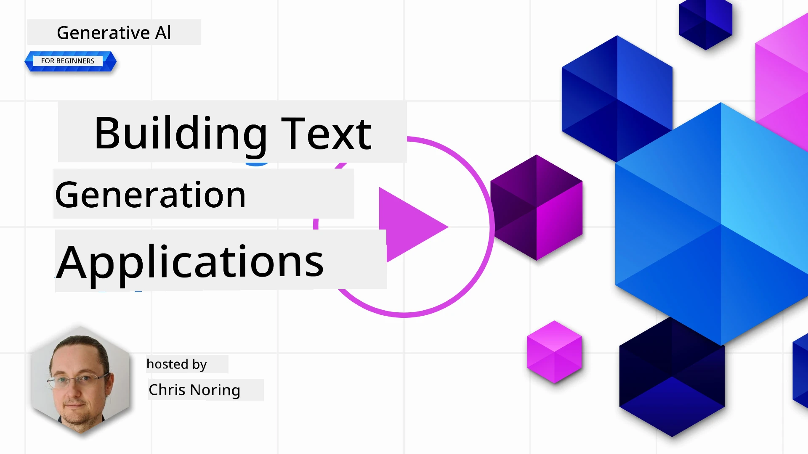

# Di way wey you fit build Text Generation Applications

[](https://youtu.be/0Y5Luf5sRQA?si=t_xVg0clnAI4oUFZ)

> _(Click di picture wey dey for top make you see dis lesson video)_

You don already see from dis curriculum say e get main main tins like prompts and even one koko area called "prompt engineering". Plenti tool wey you dey interact wit like ChatGPT, Office 365, Microsoft Power Platform and others, dem dey use prompts to help you do tins.

If you wan add dis kain experience put for one app, you gats sabi tins like prompts, completions and choose one library to work wit. Na wetin you go learn na for dis chapter.

## Introduction

For dis chapter, you go:

- Learn about openai library and how e take work.
- Build text generation app using openai.
- Understand how to take use tins like prompt, temperature, and tokens build text generation app.

## Wetin you go fit do after lesson

By di time you finish dis lesson, you go fit:

- Explain wetin text generation app be.
- Build text generation app using openai.
- Set your app to use more or less tokens, also fit change temperature to get different kind result.

## Wetin be text generation app?

Normally, wen you dey build app e get one kain interface like dis one:

- Command-based. Console apps na apps wey you go type command and e go do something. Example na `git`.
- User interface (UI). Some apps get graphical user interface (GUI) wey you go click buttons, type text, choose options and more.

### Console and UI apps get limitation

Make you compare command-based app wey you dey type command:

- **E get limitation**. You no fit just type any command, na only di command wey di app support na you fit use.
- **E get language wey e dey support**. Some apps dey support plenti languages, but default na one language e build for, even if you fit add other languages.

### Benefits of text generation apps

So how text generation app different?

For text generation app, you get more flexiblity, you no just dey restricted to set commands or specific input language. You fit use natural language talk to di app. Another beta thing be say, you dey already dey interact wit data wey dem don train for plenty information, unlike normal app wey fit dey limited to wetin dey database.

### Wetin I fit build wit text generation app?

Plenti tins you fit build. For example:

- **Chatbot**. One chatbot wey dey answer questions about your company and your products fit good.
- **Helper**. LLMs good to summarize text, get insight from text, make tins like resumes and more.
- **Code assistant**. Depending on di language model you use, you fit build code assistant wey go help you write code. Example na GitHub Copilot or ChatGPT fit do am.

## How I fit start?

Well, you gots find way to join LLM, normally get two ways:

- Use API. Here, you dey do web requests with your prompt and you dey get generated text back.
- Use library. Libraries dey help wrap API calls make e easy to use.

## Libraries/SDKs

Some libraries wey popular for LLM work be like:

- **openai**, dis library make am easy to join your model and send prompts.

Then e still get libraries wey dey work for higher level like:

- **Langchain**. Langchain popular wella and e support Python.
- **Semantic Kernel**. Semantic Kernel be Microsoft library wey dey support C#, Python, and Java.

## First app using openai

Make we see how we fit build our first app, wetin libraries we need, how much e go cost and so on.

### Install openai

Plenty libraries dey for OpenAI or Azure OpenAI. You fit also use different programming languages like C#, Python, JavaScript, Java and more. We choose to use `openai` Python library, so we go use `pip` to install am.

```bash
pip install openai
```

### Create resource

You gats do dis steps:

- Make account for Azure [https://azure.microsoft.com/free/](https://azure.microsoft.com/free/?WT.mc_id=academic-105485-koreyst).
- Get access to Azure OpenAI. Go [https://learn.microsoft.com/azure/ai-foundry/openai/overview#how-do-i-get-access-to-azure-openai](https://learn.microsoft.com/azure/ai-foundry/openai/overview#how-do-i-get-access-to-azure-openai?WT.mc_id=academic-105485-koreyst) make you request access.

  > [!NOTE]
  > As we dey write dis, you need to apply for access to Azure OpenAI.

- Install Python <https://www.python.org/>
- Make Azure OpenAI Service resource. See guide on how to [create resource](https://learn.microsoft.com/azure/ai-foundry/openai/how-to/create-resource?pivots=web-portal?WT.mc_id=academic-105485-koreyst).

### Find API key and endpoint

Now, you gats tell your `openai` library your API key. To find am, go "Keys and Endpoint" section for your Azure OpenAI resource and copy "Key 1".


Now you don copy am, make we tell libraries to use am.

> [!NOTE]
> E good make you separate your API key from your code. You fit use environment variables do am.
>
> - Set environment variable `OPENAI_API_KEY` to your API key.
>   `export OPENAI_API_KEY='sk-...'`

### Setup Azure config

If you dey use Azure OpenAI (now part of Microsoft Foundry), dis na how to setup. We go use normal `OpenAI` client wey point to Azure OpenAI `/openai/v1/` endpoint, wey dey work wit Responses API and no need `api_version`:

```python
import os
from openai import OpenAI

client = OpenAI(
    api_key=os.environ["AZURE_OPENAI_API_KEY"],
    base_url=f"{os.environ['AZURE_OPENAI_ENDPOINT'].rstrip('/')}/openai/v1/",
)
```

For top we dey set:

- `api_key`, na your API key wey you fit find for Azure Portal or Microsoft Foundry portal.
- `base_url`, na your Foundry resource endpoint plus `/openai/v1/` join. Stable v1 endpoint work cross OpenAI and Azure OpenAI, no need manage `api_version`.

> [!NOTE] > `os.environ` dey read environment variables. You fit use am read environment variables like `AZURE_OPENAI_API_KEY` and `AZURE_OPENAI_ENDPOINT`. Set these environment variables for your terminal or use library like `dotenv`.

## Generate text

Di way to generate text na to use Responses API by `responses.create` method. See example:

```python
prompt = "Complete the following: Once upon a time there was a"

response = client.responses.create(
    model="gpt-5-mini",  # na your model deployment name dis be
    input=prompt,
    store=False,
)
print(response.output_text)
```

For code wey dey top, we create response and pass model we wan use with prompt. Then we print generated text via `response.output_text`.

### Multi-turn conversations

Responses API good for single-turn text generation and multi-turn chatbots - you put list of messages for `input` build conversation:

```python
from openai import OpenAI

client = OpenAI(api_key="sk-...")

response = client.responses.create(model="gpt-5-mini", input="Hello world", store=False)
print(response.output_text)
```

More about dis one go dey for next chapter.

## Exercise - your first text generation app

Now we don sabi how to set up and configure openai, time don reach to build your first text generation app. To build am, follow these steps:

1. Create virtual environment and install openai:

   ```bash
   python -m venv venv
   source venv/bin/activate
   pip install openai
   ```

   > [!NOTE]
   > If you dey use Windows type `venv\Scripts\activate` no be `source venv/bin/activate`.

   > [!NOTE]
   > Find your Azure OpenAI key by going to [https://portal.azure.com/](https://portal.azure.com/?WT.mc_id=academic-105485-koreyst) and search for `Open AI` and pick `Open AI resource` then pick `Keys and Endpoint` and copy `Key 1`.

1. Create _app.py_ file and put this code:

   ```python
   import os
   from openai import OpenAI

   client = OpenAI(
       api_key="<replace this value with your Azure OpenAI key>",
       base_url="<endpoint found in Azure Portal>/openai/v1/",
   )
   deployment_name = "<deployment name>"

   # add your code wey go finish am
   prompt = "Complete the following: Once upon a time there was a"

   # make request using Responses API
   response = client.responses.create(model=deployment_name, input=prompt, store=False)

   # print the answer
   print(response.output_text)
   ```

   > [!NOTE]
   > If you dey use plain OpenAI (no Azure), use `client = OpenAI(api_key="<replace this value with your OpenAI key>")` (no `base_url`) then pass model name like `gpt-5-mini` no be deployment name.

   You suppose see output like dis one:

   ```output
    very unhappy _____.

   Once upon a time there was a very unhappy mermaid.
   ```

## Different types prompts, for different tins

Now you don see how to generate text using prompt. You get code wey dey run wey you fit change to produce different text types.

Prompts fit be for plenti tasks. Example be:

- **Generate type of text**. Like poem, quiz questions and so on.
- **Lookup info**. You fit use prompt to find info like 'Wetin CORS mean for web development?'.
- **Generate code**. Use prompt to generate code, for example make regex to check emails or build whole program like web app?

## Practical example: recipe generator

Imagine say you get ingredients for house and you wan cook. You need recipe. You fit find recipe by search engine or LLM.

You fit write prompt like this:

> "Show me 5 recipes for dish wey get dis ingredients: chicken, potatoes, and carrots. Per recipe, list all ingredients wey dem use"

If you give prompt like dis, you fit get reply like:

```output
1. Roasted Chicken and Vegetables:
Ingredients:
- 4 chicken thighs
- 2 potatoes, cut into cubes
- 2 carrots, cut into cubes
- 2 tablespoons olive oil
- 2 cloves garlic, minced
- 1 teaspoon dried thyme
- 1 teaspoon dried oregano
- Salt and pepper, to taste

2. Chicken and Potato Stew:
Ingredients:
- 2 tablespoons olive oil
- 1 onion, diced
- 2 cloves garlic, minced
- 2 chicken breasts, cut into cubes
- 2 potatoes, cut into cubes
- 2 carrots, cut into cubes
- 1 teaspoon dried oregano
- 1 teaspoon dried thyme
- 1 cup chicken broth
- Salt and pepper, to taste

3. Chicken and Potato Bake:
Ingredients:
- 2 tablespoons olive oil
- 2 chicken breasts, cut into cubes
- 2 potatoes, cut into cubes
- 2 carrots, cut into cubes
- 1 onion, diced
- 2 cloves garlic, minced
- 1 teaspoon dried oregano
- 1 teaspoon dried thyme
- 1 cup chicken broth
- Salt and pepper, to taste

4. Chicken and Potato Soup:
Ingredients:
- 2 tablespoons olive oil
- 1 onion, diced
- 2 cloves garlic, minced
- 2 chicken breasts, cut into cubes
- 2 potatoes, cut into cubes
- 2 carrots, cut into cubes
- 1 teaspoon dried oregano
- 1 teaspoon dried thyme
- 4 cups chicken broth
- Salt and pepper, to taste

5. Chicken and Potato Hash:
Ingredients:
- 2 tablespoons olive oil
- 2 chicken breasts, cut into cubes
- 2 potatoes, cut into cubes
- 2 carrots, cut into cubes
- 1 onion, diced
- 2 cloves garlic, minced
- 1 teaspoon dried oregano
```

Dis result beta, I sabi wetin to cook. Now beta tins we fit do na:

- Filter ingredients wey I no like or I dey allergic to.
- Make shopping list, in case I no get all ingredients for house.

For dis tins, make we add one more prompt:

> "Please remove recipes wey get garlic because I dey allergic and replace am with something else. Also make shopping list for recipes, considering say I get chicken, potatoes and carrots already for house."

Now you get new result:

```output
1. Roasted Chicken and Vegetables:
Ingredients:
- 4 chicken thighs
- 2 potatoes, cut into cubes
- 2 carrots, cut into cubes
- 2 tablespoons olive oil
- 1 teaspoon dried thyme
- 1 teaspoon dried oregano
- Salt and pepper, to taste

2. Chicken and Potato Stew:
Ingredients:
- 2 tablespoons olive oil
- 1 onion, diced
- 2 chicken breasts, cut into cubes
- 2 potatoes, cut into cubes
- 2 carrots, cut into cubes
- 1 teaspoon dried oregano
- 1 teaspoon dried thyme
- 1 cup chicken broth
- Salt and pepper, to taste

3. Chicken and Potato Bake:
Ingredients:
- 2 tablespoons olive oil
- 2 chicken breasts, cut into cubes
- 2 potatoes, cut into cubes
- 2 carrots, cut into cubes
- 1 onion, diced
- 1 teaspoon dried oregano
- 1 teaspoon dried thyme
- 1 cup chicken broth
- Salt and pepper, to taste

4. Chicken and Potato Soup:
Ingredients:
- 2 tablespoons olive oil
- 1 onion, diced
- 2 chicken breasts, cut into cubes
- 2 potatoes, cut into cubes
- 2 carrots, cut into cubes
- 1 teaspoon dried oregano
- 1 teaspoon dried thyme
- 4 cups chicken broth
- Salt and pepper, to taste

5. Chicken and Potato Hash:
Ingredients:
- 2 tablespoons olive oil
- 2 chicken breasts, cut into cubes
- 2 potatoes, cut into cubes
- 2 carrots, cut into cubes
- 1 onion, diced
- 1 teaspoon dried oregano

Shopping List:
- Olive oil
- Onion
- Thyme
- Oregano
- Salt
- Pepper
```

Na your five recipes, no mention garlic and you get shopping list based on wetin you get for house.

## Exercise - build recipe generator

Now we don do scenario, make we write code match am. To do dat, follow steps:

1. Use existing _app.py_ file as start point
1. Find `prompt` variable and change code to dis:

   ```python
   prompt = "Show me 5 recipes for a dish with the following ingredients: chicken, potatoes, and carrots. Per recipe, list all the ingredients used"
   ```

   If you run code now, you suppose see output like:

   ```output
   -Chicken Stew with Potatoes and Carrots: 3 tablespoons oil, 1 onion, chopped, 2 cloves garlic, minced, 1 carrot, peeled and chopped, 1 potato, peeled and chopped, 1 bay leaf, 1 thyme sprig, 1/2 teaspoon salt, 1/4 teaspoon black pepper, 1 1/2 cups chicken broth, 1/2 cup dry white wine, 2 tablespoons chopped fresh parsley, 2 tablespoons unsalted butter, 1 1/2 pounds boneless, skinless chicken thighs, cut into 1-inch pieces
   -Oven-Roasted Chicken with Potatoes and Carrots: 3 tablespoons extra-virgin olive oil, 1 tablespoon Dijon mustard, 1 tablespoon chopped fresh rosemary, 1 tablespoon chopped fresh thyme, 4 cloves garlic, minced, 1 1/2 pounds small red potatoes, quartered, 1 1/2 pounds carrots, quartered lengthwise, 1/2 teaspoon salt, 1/4 teaspoon black pepper, 1 (4-pound) whole chicken
   -Chicken, Potato, and Carrot Casserole: cooking spray, 1 large onion, chopped, 2 cloves garlic, minced, 1 carrot, peeled and shredded, 1 potato, peeled and shredded, 1/2 teaspoon dried thyme leaves, 1/4 teaspoon salt, 1/4 teaspoon black pepper, 2 cups fat-free, low-sodium chicken broth, 1 cup frozen peas, 1/4 cup all-purpose flour, 1 cup 2% reduced-fat milk, 1/4 cup grated Parmesan cheese

   -One Pot Chicken and Potato Dinner: 2 tablespoons olive oil, 1 pound boneless, skinless chicken thighs, cut into 1-inch pieces, 1 large onion, chopped, 3 cloves garlic, minced, 1 carrot, peeled and chopped, 1 potato, peeled and chopped, 1 bay leaf, 1 thyme sprig, 1/2 teaspoon salt, 1/4 teaspoon black pepper, 2 cups chicken broth, 1/2 cup dry white wine

   -Chicken, Potato, and Carrot Curry: 1 tablespoon vegetable oil, 1 large onion, chopped, 2 cloves garlic, minced, 1 carrot, peeled and chopped, 1 potato, peeled and chopped, 1 teaspoon ground coriander, 1 teaspoon ground cumin, 1/2 teaspoon ground turmeric, 1/2 teaspoon ground ginger, 1/4 teaspoon cayenne pepper, 2 cups chicken broth, 1/2 cup dry white wine, 1 (15-ounce) can chickpeas, drained and rinsed, 1/2 cup raisins, 1/2 cup chopped fresh cilantro
   ```

   > NOTE, your LLM no dey always give same answer, so different result fit appear any time you run program.

   Good, make we see how fit improve tins. For better, we want make code flexible, so number of recipes and ingredients fit change.

1. Make we change code like dis:

   ```python
   no_recipes = input("No of recipes (for example, 5): ")

   ingredients = input("List of ingredients (for example, chicken, potatoes, and carrots): ")

   # make e show how many recipes dey for inside the prompt an the ingredients
   prompt = f"Show me {no_recipes} recipes for a dish with the following ingredients: {ingredients}. Per recipe, list all the ingredients used"
   ```

   Sample test run fit look like dis:

   ```output
   No of recipes (for example, 5): 3
   List of ingredients (for example, chicken, potatoes, and carrots): milk,strawberries

   -Strawberry milk shake: milk, strawberries, sugar, vanilla extract, ice cubes
   -Strawberry shortcake: milk, flour, baking powder, sugar, salt, unsalted butter, strawberries, whipped cream
   -Strawberry milk: milk, strawberries, sugar, vanilla extract
   ```

### Make am beta wit filter and shopping list

Now we get app wey fit produce recipes and e flexible because e use user input, both number of recipes and ingredients.

To make am beta, we want add dis tins:

- **Filter ingredients**. Make we dey fit remove ingredients wey we no like or we allergic to. To do dis, we fit edit prompt and add filter condition for end like dis:

  ```python
  filter = input("Filter (for example, vegetarian, vegan, or gluten-free): ")

  prompt = f"Show me {no_recipes} recipes for a dish with the following ingredients: {ingredients}. Per recipe, list all the ingredients used, no {filter}"
  ```

  For top, we add `{filter}` for end of prompt and we dey capture filter value from user.

  Example input for running program fit be like dis:

  ```output
  No of recipes (for example, 5): 3
  List of ingredients (for example, chicken, potatoes, and carrots): onion,milk
  Filter (for example, vegetarian, vegan, or gluten-free): no milk

  1. French Onion Soup

  Ingredients:

  -1 large onion, sliced
  -3 cups beef broth
  -1 cup milk
  -6 slices french bread
  -1/4 cup shredded Parmesan cheese
  -1 tablespoon butter
  -1 teaspoon dried thyme
  -1/4 teaspoon salt
  -1/4 teaspoon black pepper

  Instructions:

  1. In a large pot, sauté onions in butter until golden brown.
  2. Add beef broth, milk, thyme, salt, and pepper. Bring to a boil.
  3. Reduce heat and simmer for 10 minutes.
  4. Place french bread slices on soup bowls.
  5. Ladle soup over bread.
  6. Sprinkle with Parmesan cheese.

  2. Onion and Potato Soup

  Ingredients:

  -1 large onion, chopped
  -2 cups potatoes, diced
  -3 cups vegetable broth
  -1 cup milk
  -1/4 teaspoon black pepper

  Instructions:

  1. In a large pot, sauté onions in butter until golden brown.
  2. Add potatoes, vegetable broth, milk, and pepper. Bring to a boil.
  3. Reduce heat and simmer for 10 minutes.
  4. Serve hot.

  3. Creamy Onion Soup

  Ingredients:

  -1 large onion, chopped
  -3 cups vegetable broth
  -1 cup milk
  -1/4 teaspoon black pepper
  -1/4 cup all-purpose flour
  -1/2 cup shredded Parmesan cheese

  Instructions:

  1. In a large pot, sauté onions in butter until golden brown.
  2. Add vegetable broth, milk, and pepper. Bring to a boil.
  3. Reduce heat and simmer for 10 minutes.
  4. In a small bowl, whisk together flour and Parmesan cheese until smooth.
  5. Add to soup and simmer for an additional 5 minutes, or until soup has thickened.
  ```

  As you see, any recipe with milk don comot. But if you no fit take lactose, you fit also want filter recipes wey get cheese, so that one you gats clear well.


- **Make shopping list**. We wan make shopping list, dey consider wetin we get for house already.

  For dis kain functionality, we fit try solve everything for one prompt or we fit split am into two prompts. Make we try the second way. For here, we dey suggest to add extra prompt, but to make am work, we go need add wetin first prompt result be as context to second prompt.

  Find the part for code wey dey print out the result from first prompt and add this code under am:

  ```python
  old_prompt_result = response.output_text
  prompt = "Produce a shopping list for the generated recipes and please don't include ingredients that I already have."

  new_prompt = f"{old_prompt_result} {prompt}"
  response = client.responses.create(model=deployment_name, input=new_prompt, max_output_tokens=1200, store=False)

  # print di response
  print("Shopping list:")
  print(response.output_text)
  ```

  Note these ones:

  1. We dey make new prompt by adding the result from first prompt join the new prompt:

     ```python
     new_prompt = f"{old_prompt_result} {prompt}"
     ```

  1. We make new request, but we still dey consider number of tokens we ask for for first prompt, so this time we talk say `max_output_tokens` na 1200.

     ```python
     response = client.responses.create(model=deployment_name, input=new_prompt, max_output_tokens=1200, store=False)
     ```

     If you run this code, this na the output we fit see:

     ```output
     No of recipes (for example, 5): 2
     List of ingredients (for example, chicken, potatoes, and carrots): apple,flour
     Filter (for example, vegetarian, vegan, or gluten-free): sugar


     -Apple and flour pancakes: 1 cup flour, 1/2 tsp baking powder, 1/2 tsp baking soda, 1/4 tsp salt, 1 tbsp sugar, 1 egg, 1 cup buttermilk or sour milk, 1/4 cup melted butter, 1 Granny Smith apple, peeled and grated
     -Apple fritters: 1-1/2 cups flour, 1 tsp baking powder, 1/4 tsp salt, 1/4 tsp baking soda, 1/4 tsp nutmeg, 1/4 tsp cinnamon, 1/4 tsp allspice, 1/4 cup sugar, 1/4 cup vegetable shortening, 1/4 cup milk, 1 egg, 2 cups shredded, peeled apples
     Shopping list:
     -Flour, baking powder, baking soda, salt, sugar, egg, buttermilk, butter, apple, nutmeg, cinnamon, allspice
     ```

## Improve how you set am

Wetin we get so far na code wey dey work, but some tin dem dey we fit do to make am beta. Some things we suppose do na:

- **Separate secrets from code**, like the API key. Secrets no suppose dey inside code, dem suppose dey for safe place. To separate secrets from code, we fit use environment variables and libraries like `python-dotenv` to load dem from file. Dis na how e go be for code:

  1. Make `.env` file wey get dis content:

     ```bash
     OPENAI_API_KEY=sk-...
     ```

     > Note, for Azure OpenAI for Microsoft Foundry, you go need set these environment variables instead:

     ```bash
     AZURE_OPENAI_API_KEY=<replace>
     AZURE_OPENAI_ENDPOINT=<replace>
     AZURE_OPENAI_API_VERSION=2024-10-21
     ```

     For code, na so you go load environment variables:

     ```python
     import os
     from dotenv import load_dotenv
     from openai import OpenAI

     load_dotenv()

     client = OpenAI(api_key=os.environ["OPENAI_API_KEY"])
     ```

- **One talk about token length**. We suppose think about how many tokens we need to generate the text we want. Tokens cost money, so if we fit, make we try use less tokens. For example, fit we arrange prompt so we use less tokens?

  To change tokens wey you dey use, you fit use `max_output_tokens` parameter. For example, if you wan use 100 tokens, you go do:

  ```python
  response = client.responses.create(model=deployment, input=prompt, max_output_tokens=100, store=False)
  ```

- **Try playing with temperature**. Temperature na something we never talk about but e important for how our program dey work. If temperature value high, output go dey more random. If temperature value low, output go dey more predictable. Think if you want your output to dey different or no.

  To change temperature, you fit use `temperature` parameter. For example, if you want make temperature be 0.5, you go do:

  ```python
  response = client.responses.create(model=deployment, input=prompt, temperature=0.5, store=False)
  ```

  > Note, the closer to 1.0, the more different the output go be.

- **Reasoning models no dey use `temperature`**. This one na big change for 2026. The current, non-deprecated models for Microsoft Foundry na **reasoning models** (the GPT-5 family, o-series) - and dem **no support `temperature` or `top_p`** (nor `max_tokens`; use `max_output_tokens`). If you send `temperature` to `gpt-5-mini` you go get "parameter no support" error. So to try temperature example wey I talk before, use model wey still support sampling controls - like open **Llama** model `Llama-3.3-70B-Instruct` from [Microsoft Foundry model catalog](https://ai.azure.com/catalog/models?WT.mc_id=academic-105485-koreyst), wey you fit call through Foundry Models / Azure AI Inference endpoint (same way like `githubmodels-*` samples). For reasoning models like GPT-5, you dey control output differently:
  - **Prompt engineering** - clear instructions, examples, and structured output (check lesson [04 - Prompt Engineering](../04-prompt-engineering-fundamentals/README.md?WT.mc_id=academic-105485-koreyst)) fit do wetin sampling knobs dey do before.
  - **Reasoning controls** - parameters like reasoning effort/verbosity balance depth of reasoning against latency and cost.

  In short: `temperature`/`top_p` still dey valid for many models (Llama, Mistral, Phi, and the GPT-4.x family - even though GPT-4.x dey go deprecate), but the korrect path na prompt engineering + reasoning controls on reasoning models like GPT-5.

## Assignment

For dis assignment, you fit choose wetin you want build.

Here be some suggestions:

- Tweak the recipe generator app to make am better. Play around with temperature values and the prompts to see wetin you fit come up with.
- Build "study buddy". Dis app suppose fit answer questions about topic like Python. You fit get prompts like "Wetin be certain topic for Python?", or prompt wey talk say show me code for certain topic etc.
- History bot, make history come alive, tell bot to play certain historical character and ask am questions about e life and time.

## Solution

### Study buddy

Below na starter prompt, see how you fit use am and tweak am to suit you.

```text
- "You're an expert on the Python language

    Suggest a beginner lesson for Python in the following format:

    Format:
    - concepts:
    - brief explanation of the lesson:
    - exercise in code with solutions"
```

### History bot

Here be some prompts you fit use:

```text
- "You are Abe Lincoln, tell me about yourself in 3 sentences, and respond using grammar and words like Abe would have used"
- "You are Abe Lincoln, respond using grammar and words like Abe would have used:

   Tell me about your greatest accomplishments, in 300 words"
```

## Knowledge check

Wetin temperature concept dey do?

1. E dey control how random output be.
1. E dey control how big response be.
1. E dey control how many tokens dem use.

## 🚀 Challenge

When you dey work on assignment, try change temperature, try set am to 0, 0.5, and 1. Remember say 0 mean no too much difference and 1 mean plenty difference. Which value work best for your app?

## Great Work! Continue Your Learning

After you finish dis lesson, check our [Generative AI Learning collection](https://aka.ms/genai-collection?WT.mc_id=academic-105485-koreyst) to continue to upgrade your Generative AI knowledge!

Go Lesson 7 where we go see how to [build chat applications](../07-building-chat-applications/README.md?WT.mc_id=academic-105485-koreyst)!

---

<!-- CO-OP TRANSLATOR DISCLAIMER START -->
**Disclaimer**:
Dis document don translate wit AI translation service [Co-op Translator](https://github.com/Azure/co-op-translator). Even tho we dey try make am correct, abeg make you know say automated translation fit get errors or mistakes. Di original document for dia own language na im be di correct source. For important info, make person wey sabi human translation do am. We no go responsible for any misunderstanding or wrong understanding wey fit happen because of dis translation.
<!-- CO-OP TRANSLATOR DISCLAIMER END -->