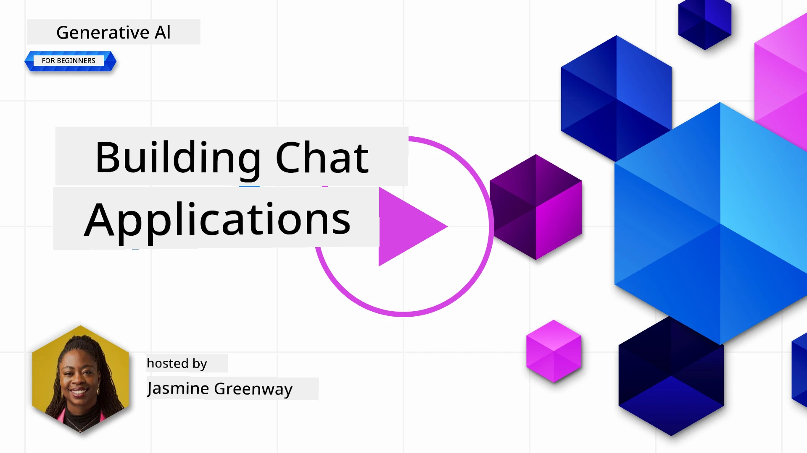
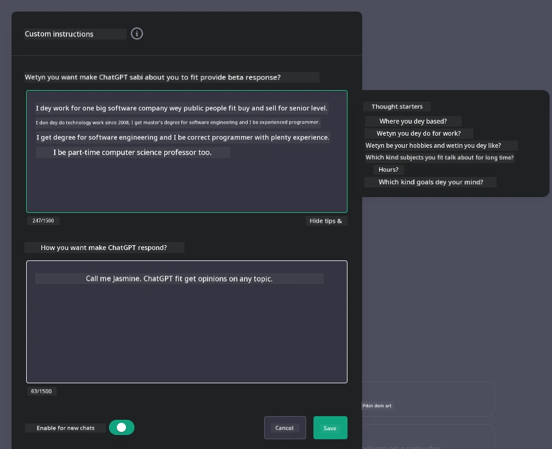
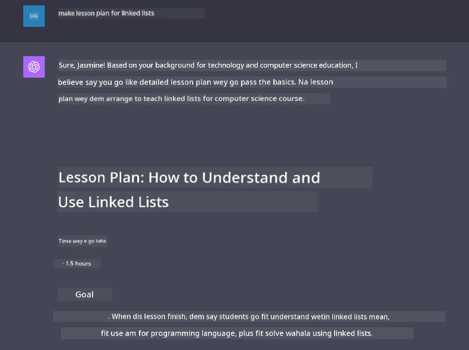

# Building Generative AI-Powered Chat Applications

[](https://youtu.be/R9V0ZY1BEQo?si=IHuU-fS9YWT8s4sA)

> _(Click di piksha wey dey top to watch dis lesson video)_

Now we don see how we fit build text-generation apps, mek we look chat applications.

Chat applications don join inside our everyday life, e no be only for small talk. Dem dey important for customer service, technical support, and even big advisory systems. You fit don use chat application help before now. As we dey join generative AI join dis kain platforms, e dey get more complex and the wahala too dey increase.

Some questions we gats answer be:

- **How to build di app**. How we fit build and connect dis AI-powered applications well for specific things wey we wan do?
- **Monitoring**. After we don deploy am, how we fit dey check and make sure say di apps dey work proper, and dem dey follow di [six principles of responsible AI](https://www.microsoft.com/ai/responsible-ai?WT.mc_id=academic-105485-koreyst)?

As automation and smooth human-machine waya dey increase, to sabi how generative AI dey change the level, depth, and how chat applications fit adapt dey important. Dis lesson go check di architecture wey dey support these complex systems, how to fine-tune dem for specific tasks, and how to measure and make sure say AI dey used well.

## Introduction

Dis lesson go cover:

- Techniques to build and connect chat applications quick and good.
- How to customize and fine-tune applications.
- Ways to monitor chat applications well.

## Learning Goals

By di time you finish dis lesson, you go fit:

- Talk about how to build and connect chat applications for systems wey already dey.
- Customize chat applications for correct use cases.
- Know di important metrics and how to dey monitor and maintain quality for AI-powered chat apps.
- Make sure say chat applications dey use AI responsibly.

## Integrating Generative AI into Chat Applications

To improve chat applications with generative AI no just be to make dem smart, na also to optimize how dem build am, how dem perform, and di user interface to give beta user experience. Dis one involve to check di architecture, how to join APIs, and user interface plans. Dis section go give you full map to waka dis complex journey, whether you dey join am inside existing systems or build standalone platforms.

By di time you finish dis section, you go get di skill to quickly build and add chat apps.

### Chatbot or Chat application?

Before we start to build chat applications, make we compare 'chatbots' and 'AI-powered chat applications,' dem get different work and way dem dey do. Chatbot na to automate some conversational work, like answer popular questions or track package. E dey mostly use rule-based logic or complex AI algorithms. But AI-powered chat application na beta and wide environment for different digital communication like text, voice, and video chat with people. E get generative AI model wey fit do human-like conversation, generate response based on many input and context. This kind AI chat app fit yan open discussion, change as conversation dey go, and even do creative or complex talk.

Table wey dey below talk di main difference and similarity to help us understand wetin each one dey do for digital talk.

| Chatbot                               | Generative AI-Powered Chat Application |
| ------------------------------------- | -------------------------------------- |
| Task-Focused and rule based           | Context-aware                          |
| Often integrated into larger systems  | Fit host one or multiple chatbots      |
| Limited to programmed functions       | Get generative AI models inside         |
| Specialized & structured interactions | Fit do open-domain discussions          |

### Leveraging pre-built functionalities with SDKs and APIs

When you dey build chat application, e good to first sabi wetin don dey so. To use SDKs and APIs build chat apps na good move for many reasons. If you join well-documented SDKs and APIs, you dey set your app well for long term success, e go fit scale and e go easy to maintain.

- **E quicken di development and reduce work**: When you use pre-built features instead of build by yourself, you fit focus on other things like your business logic.
- **Better performance**: If you build from scratch, you go ask yourself "How e go scale? This app fit handle plenty users when e come?" Well maintained SDKs and APIs get solution for these.
- **Easy maintenance**: Updates and beta features dey easier to manage because API and SDKs generally just need library update when new version show.
- **Get beta technology**: To use models wey don fine-tune and train well with big data fit give your app better language ability.

To use SDK or API usually you go need permission like key or token. We go use OpenAI Python Library to show how e be. You fit try for yourself for this [notebook for OpenAI](./python/oai-assignment.ipynb?WT.mc_id=academic-105485-koreyst) or [notebook for Azure OpenAI Services](./python/aoai-assignment.ipynb?WT.mc_id=academic-105485-koreys) for this lesson.

```python
import os
from openai import OpenAI

API_KEY = os.getenv("OPENAI_API_KEY","")

client = OpenAI(
    api_key=API_KEY
    )

response = client.responses.create(model="gpt-4o-mini", input="Suggest two titles for an instructional lesson on chat applications for generative AI.", store=False)
print(response.output_text)
```

Di example wey dey top use di GPT-4o mini model with Responses API to finish prompt, but notice say API key don set before. If you no set key, you go get error.

## User Experience (UX)

General UX principles dey work for chat applications too, but here e get some extra things wey important because of machine learning inside.

- **Way to handle ambiguity**: Generative AI models fit sometimes give unclear answer. If you fit add feature wey allow users ask for more explanation, e go help well.
- **Remember context**: Beta generative AI models fit remember conversation context, and e dey important for user experience. If you give users control to manage context, e good, but e fit risk sensitive info. You fit think about how long you go keep info, like retention policy, to balance context need and privacy.
- **Personalization**: AI models fit learn and adapt, e fit give user personal experience. To fit design UX for personal user profile go make user feel say dem understand am, and e help dem find correct answers quick.

Example of personalization na "Custom instructions" setting for OpenAI ChatGPT. E allow you give info about yourself wey fit help prompt better. See example custom instruction.



Dis "profile" make ChatGPT arrange lesson plan about linked lists. Notice say ChatGPT take user experience into account to give deeper lesson plan.



### Microsoft's System Message Framework for Large Language Models

[Microsoft don provide guidance](https://learn.microsoft.com/azure/ai-services/openai/concepts/system-message#define-the-models-output-format?WT.mc_id=academic-105485-koreyst) on how to write good system messages when you dey generate response from LLMs divide into 4 parts:

1. Define who di model be for, and wetin e fit and no fit do.
2. Define how di model output go be.
3. Provide example wey show how model suppose behave.
4. Add extra behavioral guardrails.

### Accessibility

Whether user get visual, auditory, motor, or cognitive problems, beta chat app suppose fit work for all. Below list give special features to improve accessibility for different impairments.

- **For Visual Impairment**: High contrast themes, text wey fit resize, screen reader support.
- **For Auditory Impairment**: Text-to-speech and speech-to-text, visual signs for sound notifications.
- **For Motor Impairment**: Keyboard navigation, voice commands.
- **For Cognitive Impairment**: Simple language options.

## Customization and Fine-tuning for Domain-Specific Language Models

Imagine one chat app wey sabi your company palava well and fit guess common questions wey users get. Two main ways:

- **Use DSL models**. DSL mean domain specific language. You fit use one DSL model wey train for specific domain to sabi wetin e mean.
- **Apply fine-tuning**. Fine-tuning na to train your model more with special data.

## Customization: Using a DSL

To use domain-specific language models (DSL Models) fit improve user engagement by giving special and context correct interaction. Dis kain model train or tune to sabi and generate text for specific field or topic. You fit train one from ground up, or use pre-made ones via SDKs and APIs. Another way na fine-tune, to use one pre-trained model and adjust am for one domain.

## Customization: Apply fine-tuning

Fine-tuning dey important when pre-trained model no too work well for special domain or task.

Example, medical questions dey complex and need plenty context. For medical diagnosis, doc dey use many things like lifestyle and existing conditions, plus recent medical journals. Normal AI chat app no fit deliver for these complex things.

### Scenario: medical application

Think about chat app wey go help medical workers by quickly showing treatment guidelines, drug interactions, recent research.

Normal model fit enough for simple medical questions and general advice, but e fit no sabi deal with:

- **Highly specific or complex cases**. Example, neurologist fit ask, "How we fit manage drug-resistant epilepsy for small pikin well?"
- **No dey up-to-date**. Normal model fit no sabi recent change for neurology and pharmacology.

For cases like dis, fine-tuning model with special medical data fit make am handle complex medical questions better and more correct. But e require big, relevant data wey fit show domain challenges and questions.

## Things to mind for High Quality AI-Driven Chat Experience

Dis section talk important things for "high-quality" chat apps, including how to measure things and follow framework to use AI well.

### Key Metrics

To keep app high quality, you need dey track key metrics and things to think about. Dis things no just make app work well, e dey check AI model and user experience quality. Below na list of basic, AI, and user experience metrics.

| Metric                        | Definition                                                                                                             | Considerations for Chat Developer                                         |
| ----------------------------- | ---------------------------------------------------------------------------------------------------------------------- | ------------------------------------------------------------------------- |
| **Uptime**                    | Measures how long app dey work and people fit use am.                                                                   | How you go reduce downtime?                                              |
| **Response Time**             | How long app dey take to reply user question.                                                                           | How you go fit make query processing faster?                             |
| **Precision**                 | Ratio of correct positive predictions to total positive predictions                                                    | How you go check model precision?                                        |
| **Recall (Sensitivity)**      | Ratio of correct positive predictions to actual positives                                                             | How you go measure and improve recall?                                   |
| **F1 Score**                  | Balance point between precision and recall.                                                                            | Wetin be your target F1 Score? How you go balance precision and recall? |
| **Perplexity**                | How well model guess probability distribution match real data                                                         | How you go reduce perplexity?                                            |
| **User Satisfaction Metrics** | How users feel about app, mostly from surveys                                                                           | How often you go collect user feedback? How you go adjust from am?      |
| **Error Rate**                | How often model make mistake for understanding or output                                                                | Wetin strategies you get to reduce error rate?                           |
| **Retraining Cycles**         | How often model dey update with new data and insight                                                                    | How often you go retrain model? Wetin go trigger retraining?            |

| **Anomaly Detection**         | Tools and techniques for identifying unusual patterns that no dey follow wetin dem expect.                        | How you go take respond to anomalies?                                        |

### Implementing Responsible AI Practices in Chat Applications

Microsoft's approach to Responsible AI don find six principles wey suppose guide AI development and use. Below na the principles, their meaning, and things wey chat developer suppose consider plus why dem suppose serious about am.

| Principles             | Microsoft's Definition                                | Considerations for Chat Developer                                      | Why E Important                                                                     |
| ---------------------- | ----------------------------------------------------- | ---------------------------------------------------------------------- | -------------------------------------------------------------------------------------- |
| Fairness               | AI systems suppose treat everybody fair.            | Make sure say the chat app no dey discriminate based on user data.  | To build trust and make everybody feel welcome; to avoid wahala with law.                |
| Reliability and Safety | AI systems suppose dey work well and dey safe.        | Test am well and put fail-safes to reduce errors and risk dem.         | Make sure say users dey happy and e no go cause wahala.                                 |
| Privacy and Security   | AI systems suppose dey secure and respect privacy.      | Put strong encryption plus ways to protect data.              | To protect user sensitive data and follow privacy laws.                         |
| Inclusiveness          | AI systems suppose make everybody feel involved and engaged. | Design UI/UX wey everybody fit use easy. | To make sure say many people fit use the app well.                   |
| Transparency           | AI systems suppose clear to understand.                  | Give clear documents and explain why AI dey respond that way.            | Users go trust system more if dem understand how decisions dey take. |
| Accountability         | People suppose dey responsible for AI systems.          | Set clear process to audit and improve AI decisions.     | Make sure say dem fit dey improve and correct mistake dem.               |

## Assignment

See [assignment](../../../07-building-chat-applications/python). E go guide you through exercises from how you go run your first chat prompts, classify and summarize text plus more. Note say the assignments dey available for different programming languages!

## Great Work! Continue the Journey

After you don finish this lesson, check our [Generative AI Learning collection](https://aka.ms/genai-collection?WT.mc_id=academic-105485-koreyst) to continue improve your Generative AI skills!

Head go Lesson 8 to see how you fit start [building search applications](../08-building-search-applications/README.md?WT.mc_id=academic-105485-koreyst)!

---

<!-- CO-OP TRANSLATOR DISCLAIMER START -->
**Disclaimer**:
Dis document don translate wit AI translation service [Co-op Translator](https://github.com/Azure/co-op-translator). Even tho we dey try make am correct, abeg make you know say automated translation fit get errors or mistakes. Di original document for dia own language na im be di correct source. For important info, make person wey sabi human translation do am. We no go responsible for any misunderstanding or wrong understanding wey fit happen because of dis translation.
<!-- CO-OP TRANSLATOR DISCLAIMER END -->