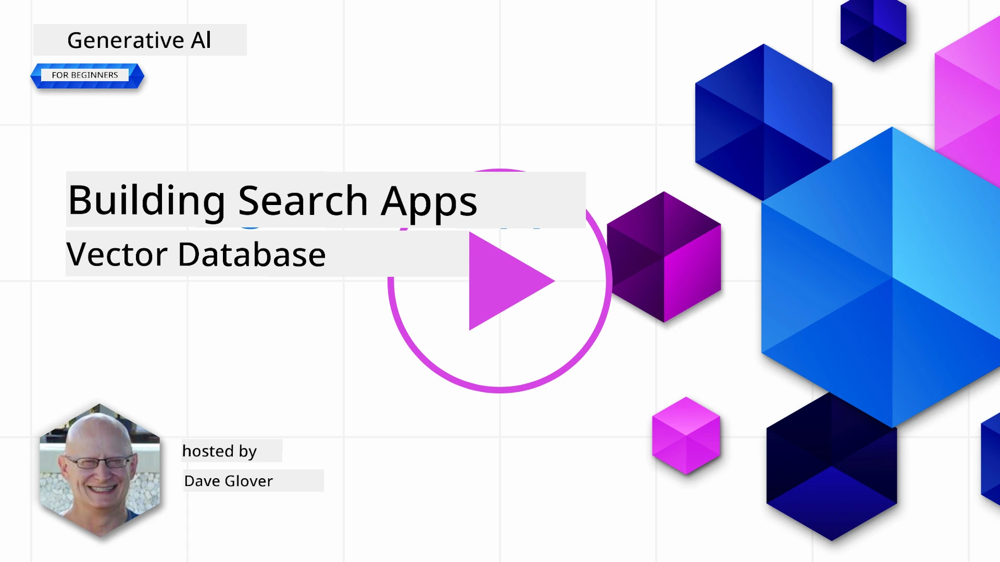
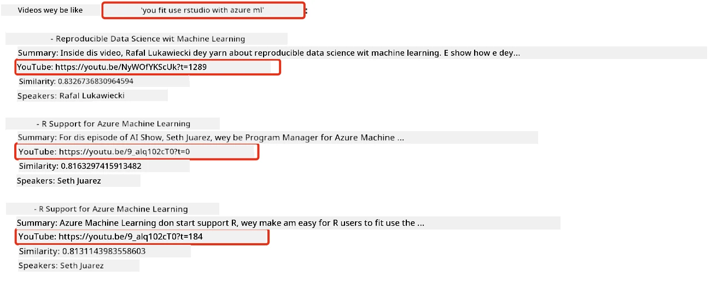
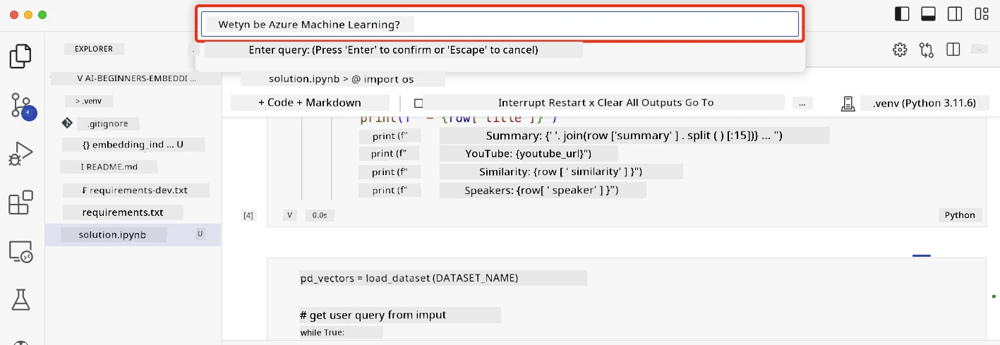

<!--
CO_OP_TRANSLATOR_METADATA:
{
  "original_hash": "58953c08b8ba7073b836d4270ea0fe86",
  "translation_date": "2025-11-12T08:55:18+00:00",
  "source_file": "08-building-search-applications/README.md",
  "language_code": "pcm"
}
-->
# How to Build Search Application

[](https://youtu.be/W0-nzXjOjr0?si=GcsqiTTvd7RKbo7V)

> > _Click di image wey dey up to watch di video for dis lesson_

LLMs no be only for chatbots and text generation. You fit use am build search application wey dey use Embeddings. Embeddings na numbers wey represent data, dem dey call am vectors too, and e fit help for semantic search for data.

For dis lesson, you go build search application for our education startup. Di startup na non-profit organization wey dey give free education to students for developing countries. Di startup get plenty YouTube videos wey students fit use learn about AI. Di startup wan make search application wey go allow students search for YouTube video by typing question.

For example, student fit type 'Wetin be Jupyter Notebooks?' or 'Wetin be Azure ML' and di search application go show list of YouTube videos wey dey relevant to di question. E go even better, di search application go show link to di part of di video wey answer di question.

## Introduction

For dis lesson, we go talk about:

- Di difference between Semantic search and Keyword search.
- Wetin be Text Embeddings.
- How to create Text Embeddings Index.
- How to search Text Embeddings Index.

## Learning Goals

After you finish dis lesson, you go sabi:

- Di difference between semantic search and keyword search.
- Explain wetin Text Embeddings be.
- Create application wey dey use Embeddings to search data.

## Why we dey build search application?

To build search application go help you understand how to use Embeddings to search data. You go also learn how to build search application wey students fit use find information quick.

Dis lesson get Embedding Index of di YouTube transcripts for Microsoft [AI Show](https://www.youtube.com/playlist?list=PLlrxD0HtieHi0mwteKBOfEeOYf0LJU4O1) YouTube channel. Di AI Show na YouTube channel wey dey teach about AI and machine learning. Di Embedding Index get Embeddings for each YouTube transcript up till Oct 2023. You go use di Embedding Index build search application for our startup. Di search application go show link to di part of di video wey answer di question. Dis na good way for students to find di information wey dem need quick.

Dis na example of semantic query for di question 'fit person use rstudio with azure ml?'. Check di YouTube url, you go see say di url get timestamp wey go carry you go di part of di video wey answer di question.



## Wetin be semantic search?

You fit dey wonder, wetin be semantic search? Semantic search na search technique wey dey use di meaning of di words for query to show better results.

Example of semantic search be say, if you wan buy car, you fit search 'my dream car', semantic search go understand say you no dey `dream` about car, but you dey find your `ideal` car. Semantic search go understand wetin you mean and show better results. Di other one na `keyword search` wey go just search for dreams about cars and e go show results wey no make sense.

## Wetin be Text Embeddings?

[Text embeddings](https://en.wikipedia.org/wiki/Word_embedding?WT.mc_id=academic-105485-koreyst) na way to represent text for [natural language processing](https://en.wikipedia.org/wiki/Natural_language_processing?WT.mc_id=academic-105485-koreyst). Text embeddings na semantic numbers wey represent text. Embeddings dey represent data in way wey machine fit understand. Plenty models dey for text embeddings, but for dis lesson, we go focus on OpenAI Embedding Model.

Example, imagine say dis text dey transcript from one episode for AI Show YouTube channel:

```text
Today we are going to learn about Azure Machine Learning.
```

We go pass di text to OpenAI Embedding API and e go return di embedding wey get 1536 numbers aka vector. Each number for di vector dey represent different part of di text. For short, na di first 10 numbers for di vector be dis.

```python
[-0.006655829958617687, 0.0026128944009542465, 0.008792596869170666, -0.02446001023054123, -0.008540431968867779, 0.022071078419685364, -0.010703742504119873, 0.003311325330287218, -0.011632772162556648, -0.02187200076878071, ...]
```

## How dem take create di Embedding index?

Di Embedding index for dis lesson na Python scripts dem use create am. You go find di scripts and instructions for [README](./scripts/README.md?WT.mc_id=academic-105485-koreyst) inside 'scripts' folder for dis lesson. You no need run di scripts to finish dis lesson because di Embedding Index dey already.

Di scripts dey do dis things:

1. Dem download di transcript for each YouTube video for [AI Show](https://www.youtube.com/playlist?list=PLlrxD0HtieHi0mwteKBOfEeOYf0LJU4O1) playlist.
2. Using [OpenAI Functions](https://learn.microsoft.com/azure/ai-services/openai/how-to/function-calling?WT.mc_id=academic-105485-koreyst), dem go try extract di speaker name from di first 3 minutes of di YouTube transcript. Di speaker name for each video dey store for Embedding Index wey dem call `embedding_index_3m.json`.
3. Dem go divide di transcript text into **3 minute text segments**. Di segment go get about 20 words wey dey overlap from di next segment to make sure say di Embedding for di segment no cut off and e go give better search context.
4. Each text segment go pass through OpenAI Chat API to summarize di text into 60 words. Di summary go dey store for Embedding Index `embedding_index_3m.json`.
5. Finally, di segment text go pass through OpenAI Embedding API. Di Embedding API go return vector of 1536 numbers wey represent di meaning of di segment. Di segment and di OpenAI Embedding vector go dey store for Embedding Index `embedding_index_3m.json`.

### Vector Databases

For dis lesson, di Embedding Index dey store for JSON file wey dem call `embedding_index_3m.json` and e dey load into Pandas DataFrame. But for production, di Embedding Index go dey store for vector database like [Azure Cognitive Search](https://learn.microsoft.com/training/modules/improve-search-results-vector-search?WT.mc_id=academic-105485-koreyst), [Redis](https://cookbook.openai.com/examples/vector_databases/redis/readme?WT.mc_id=academic-105485-koreyst), [Pinecone](https://cookbook.openai.com/examples/vector_databases/pinecone/readme?WT.mc_id=academic-105485-koreyst), [Weaviate](https://cookbook.openai.com/examples/vector_databases/weaviate/readme?WT.mc_id=academic-105485-koreyst), and others.

## Understanding cosine similarity

We don learn about text embeddings, di next step na to learn how to use text embeddings search data and find di most similar embeddings to query using cosine similarity.

### Wetin be cosine similarity?

Cosine similarity na way to measure similarity between two vectors, dem dey call am `nearest neighbor search` too. To do cosine similarity search, you go first _vectorize_ di _query_ text using OpenAI Embedding API. Then calculate di _cosine similarity_ between di query vector and each vector for di Embedding Index. Remember, di Embedding Index get vector for each YouTube transcript text segment. Finally, sort di results by cosine similarity and di text segments wey get di highest cosine similarity na di most similar to di query.

For maths, cosine similarity dey measure di cosine of di angle between two vectors for multidimensional space. Dis measurement dey useful because if two documents far apart by Euclidean distance because of size, dem fit still get smaller angle between dem and higher cosine similarity. For more info about cosine similarity equations, check [Cosine similarity](https://en.wikipedia.org/wiki/Cosine_similarity?WT.mc_id=academic-105485-koreyst).

## How to build your first search application

Next, we go learn how to build search application using Embeddings. Di search application go allow students search video by typing question. Di search application go show list of videos wey dey relevant to di question. Di search application go also show link to di part of di video wey answer di question.

Dis solution dey work for Windows 11, macOS, and Ubuntu 22.04 using Python 3.10 or later. You fit download Python from [python.org](https://www.python.org/downloads/?WT.mc_id=academic-105485-koreyst).

## Assignment - build search application, make e help students

We don talk about our startup for di beginning of dis lesson. Now na time to help di students build search application for their assessments.

For dis assignment, you go create di Azure OpenAI Services wey dem go use build di search application. You go create di following Azure OpenAI Services. You go need Azure subscription to finish dis assignment.

### Start di Azure Cloud Shell

1. Sign in to di [Azure portal](https://portal.azure.com/?WT.mc_id=academic-105485-koreyst).
2. Click di Cloud Shell icon for di top-right corner of di Azure portal.
3. Select **Bash** for di environment type.

#### Create resource group

> For dis instructions, we dey use resource group wey dem call "semantic-video-search" for East US.
> You fit change di name of di resource group, but if you wan change di location for di resources,
> check di [model availability table](https://aka.ms/oai/models?WT.mc_id=academic-105485-koreyst).

```shell
az group create --name semantic-video-search --location eastus
```

#### Create Azure OpenAI Service resource

From di Azure Cloud Shell, run dis command to create Azure OpenAI Service resource.

```shell
az cognitiveservices account create --name semantic-video-openai --resource-group semantic-video-search \
    --location eastus --kind OpenAI --sku s0
```

#### Get di endpoint and keys for dis application

From di Azure Cloud Shell, run dis commands to get di endpoint and keys for di Azure OpenAI Service resource.

```shell
az cognitiveservices account show --name semantic-video-openai \
   --resource-group  semantic-video-search | jq -r .properties.endpoint
az cognitiveservices account keys list --name semantic-video-openai \
   --resource-group semantic-video-search | jq -r .key1
```

#### Deploy OpenAI Embedding model

From di Azure Cloud Shell, run dis command to deploy OpenAI Embedding model.

```shell
az cognitiveservices account deployment create \
    --name semantic-video-openai \
    --resource-group  semantic-video-search \
    --deployment-name text-embedding-ada-002 \
    --model-name text-embedding-ada-002 \
    --model-version "2"  \
    --model-format OpenAI \
    --sku-capacity 100 --sku-name "Standard"
```

## Solution

Open di [solution notebook](./python/aoai-solution.ipynb?WT.mc_id=academic-105485-koreyst) for GitHub Codespaces and follow di instructions for di Jupyter Notebook.

When you run di notebook, e go ask you to enter query. Di input box go look like dis:



## Good Job! Continue Your Learning

After you finish dis lesson, check our [Generative AI Learning collection](https://aka.ms/genai-collection?WT.mc_id=academic-105485-koreyst) to continue to learn more about Generative AI!

Go Lesson 9 where we go talk about how to [build image generation applications](../09-building-image-applications/README.md?WT.mc_id=academic-105485-koreyst)!

---

<!-- CO-OP TRANSLATOR DISCLAIMER START -->
**Disclaimer**:  
Dis dokyument don translate am wit AI translation service [Co-op Translator](https://github.com/Azure/co-op-translator). Even as we dey try make am correct, abeg sabi say translation wey machine do fit get mistake or no dey accurate well. Di original dokyument for im native language na di main source wey you go trust. For important information, e good make professional human translator check am. We no go fit take blame for any misunderstanding or wrong interpretation wey fit happen because you use dis translation.
<!-- CO-OP TRANSLATOR DISCLAIMER END -->