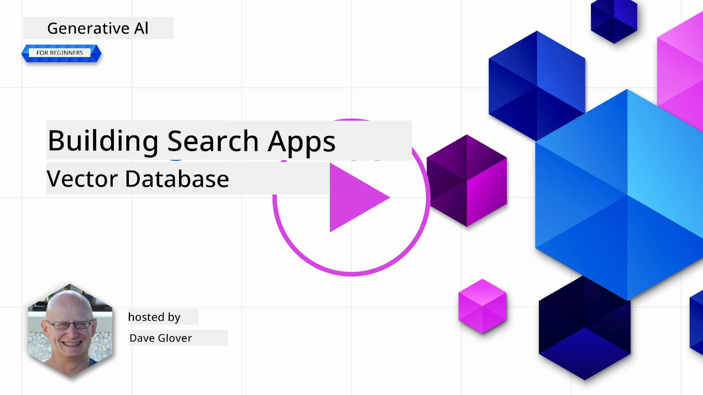
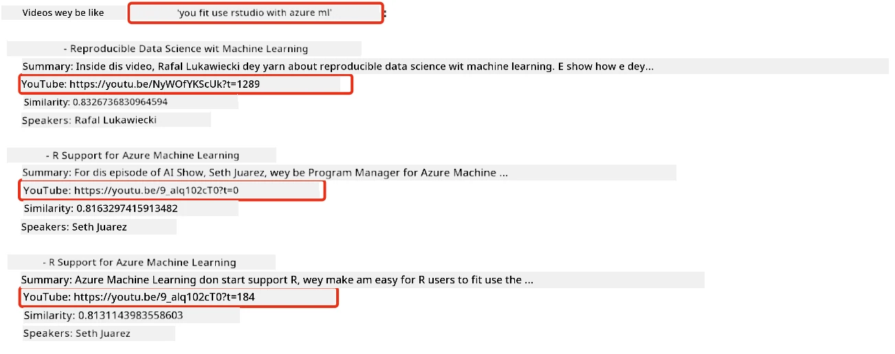
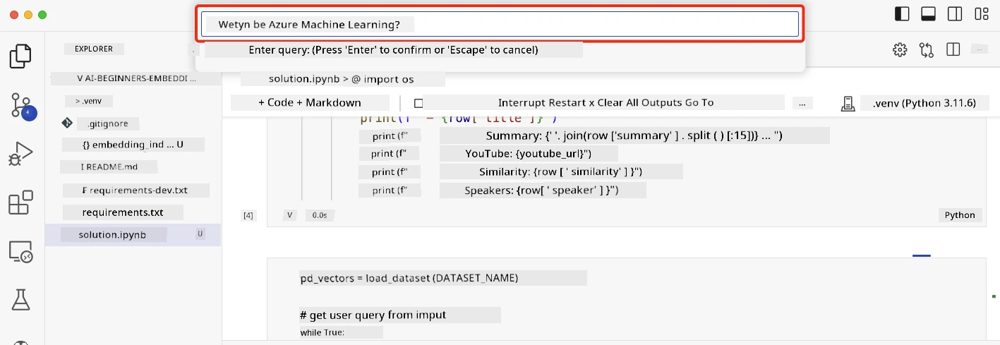

# Di Buid Search Applications

[](https://youtu.be/W0-nzXjOjr0?si=GcsqiTTvd7RKbo7V)

> > _Klik di piksha wey dey up fo watch video for dis lesson_

LLMs no na only for chatbots and text generation. E possible too fo buid search applications wit Embeddings. Embeddings na numerical repsentation of data wey dem sabi as vectors, and pipo fit use am fo semantic search for data.

For dis lesson, you go buid search application for our education startup. Our startup no dey make profit but e dey help students for developing countries wit free education. Our startup get plenty YouTube videos wey students go fit use learn about AI. Our startup wan buid search application weh go make students find YouTube video by just type question.

For example, one student fit type 'Wetin be Jupyter Notebooks?' or 'Wetin be Azure ML' and di search app go give list of YouTube videos wey relate to di question, plus di search app go still give link wey go show di part for di video wey answer dey.

## Introduction

For dis lesson, we go talk about:

- Semantic vs Keyword search.
- Wetin be Text Embeddings.
- How to Create Text Embeddings Index.
- How to Search Text Embeddings Index.

## Wetin you go learn

After you finish dis lesson, you go fit:

- Know di difference between semantic and keyword search.
- Fit explain wetin Text Embeddings be.
- Fit create app wey go use Embeddings search data.

## Why buid search application?

If you buid search app, e go help you sabi how to use Embeddings search for data. You go learn how to create search application wey students go fit use find info quick-quick.

Dis lesson get Embedding Index wey get YouTube transcripts for Microsoft [AI Show](https://www.youtube.com/playlist?list=PLlrxD0HtieHi0mwteKBOfEeOYf0LJU4O1) YouTube channel. AI Show na YouTube channel wey dey teach AI and machine learning. Di Embedding Index get Embeddings for all di YouTube transcripts till Oct 2023. You go use di Embedding Index fo buid search app wey go give link for di spot for video wey di answer dey. E good way for students fo find di info dem need sharp-sharp.

Di example wey follow na semantic question for 'you fit use rstudio wit azure ml?' Check di YouTube url, you go see say url get timestamp wey go show you di exact part for di video wey di answer dey.



## Wetin be semantic search?

You fit dey wonder, wetin be semantic search? Semantic search na one kind search technique wey use the meaning of words inside question to give relevant answer.

Example be dis, if you dey find car buy and you search 'my dream car', semantic search sabi say you no dey `dream` about car but say you dey find your `ideal` car. Semantic search go understand wetin you mean and give relevant results. But keyword search go just find word dreams and cars literal, e fit give irrelevant results often.

## Wetin be Text Embeddings?

[Text embeddings](https://en.wikipedia.org/wiki/Word_embedding?WT.mc_id=academic-105485-koreyst) na text representation method wey dem dey use for [natural language processing](https://en.wikipedia.org/wiki/Natural_language_processing?WT.mc_id=academic-105485-koreyst). Text embeddings na semantic number wey represent text. Dem dey use Embeddings fo represent data in way wey machine go fit understand easily. Plenti model dey fo buid text embeddings, but for dis lesson, we go focus on how to generate embeddings wit OpenAI Embedding Model.

Example be dis, imagine say dis text dey transcript from one episode for AI Show YouTube channel:

```text
Today we are going to learn about Azure Machine Learning.
```

We go send di text to OpenAI Embedding API and e go return embedding wey get 1536 numbers also na vector. Each number for vector dey represent different part of di text. For short, here na first 10 numbers for di vector.

```python
[-0.006655829958617687, 0.0026128944009542465, 0.008792596869170666, -0.02446001023054123, -0.008540431968867779, 0.022071078419685364, -0.010703742504119873, 0.003311325330287218, -0.011632772162556648, -0.02187200076878071, ...]
```

## How di Embedding index dey created?

Dem create di Embedding index for dis lesson wit plenty Python scripts. You fit find di scripts plus instructions inside [README](./scripts/README.md?WT.mc_id=academic-105485-koreyst) for di 'scripts' folder for dis lesson. You no need run these scripts to finish dis lesson because Embedding Index don give you already.

Di scripts dey do dis kine things:

1. Dem download transcript for each video inside [AI Show](https://www.youtube.com/playlist?list=PLlrxD0HtieHi0mwteKBOfEeOYf0LJU4O1) playlist.
2. Using [OpenAI Functions](https://learn.microsoft.com/azure/ai-foundry/openai/how-to/function-calling?WT.mc_id=academic-105485-koreyst), dem try find who be speaker for first 3 minutes of YouTube transcript. Di speaker name for each video na for Embedding Index called `embedding_index_3m.json`.
3. Di transcript text go cut into **3 minute text segments**. Segment get 20 words for di next segment to make sure Embedding no break and e help get better search context.
4. Each text segment go enter OpenAI Chat API to summarize text into 60 words. Di summary go store too inside Embedding Index `embedding_index_3m.json`.
5. Last-last, dem go pass di segment text to OpenAI Embedding API. Di Embedding API go return vector wit 1536 numbers wey represent semantic meaning of di segment. Di segment plus OpenAI Embedding vector go store inside Embedding Index `embedding_index_3m.json`.

### Vector Databases

For simple case, di Embedding Index dey stored inside JSON file wey dem name `embedding_index_3m.json` and dem load am into Pandas DataFrame. But for real work, Embedding Index fit dey for one vector database like [Azure Cognitive Search](https://learn.microsoft.com/training/modules/improve-search-results-vector-search?WT.mc_id=academic-105485-koreyst), [Redis](https://cookbook.openai.com/examples/vector_databases/redis/readme?WT.mc_id=academic-105485-koreyst), [Pinecone](https://cookbook.openai.com/examples/vector_databases/pinecone/readme?WT.mc_id=academic-105485-koreyst), [Weaviate](https://cookbook.openai.com/examples/vector_databases/weaviate/readme?WT.mc_id=academic-105485-koreyst), plus others.

## How to Understand cosine similarity

We don learn about text embeddings, next step na how to use text embeddings search for data and especially find di most similar Embeddings to any question using cosine similarity.

### Wetin be cosine similarity?

Cosine similarity na how to measure similarity between two vectors, e also dey call `nearest neighbor search`. To do cosine similarity search, you go _vectorize_ your _query_ text using OpenAI Embedding API. Then you calculate _cosine similarity_ between di query vector and each vector for Embedding Index. Remember say Embedding Index get vector for each YouTube transcript text segment. Finally, you sort di results by cosine similarity and di text segments wey get di highest cosine similarity na di most similar to di query.

From math side, cosine similarity dey measure di cosine of di angle between two vectors for one space wey get many dimensions. Dis measurement good because sometimes two documents fit dey far for Euclidean distance because of their size, but dem fit get small angle between them and dat mean higher cosine similarity. If you want know more about how cosine similarity equation dey work, see [Cosine similarity](https://en.wikipedia.org/wiki/Cosine_similarity?WT.mc_id=academic-105485-koreyst).

## How to build your first search application

Next, we go learn how to build search app using Embeddings. Dis app go allow students search video by typing question. Di search app go return list of videos wey relate to di question. Di app also go give link to di part for di video wey di answer dey.

Dis solution dem build and test for Windows 11, macOS, and Ubuntu 22.04 wit Python 3.10 or later. You fit download Python from [python.org](https://www.python.org/downloads/?WT.mc_id=academic-105485-koreyst).

## Assignment - buid search application fo help students

We don talk our startup for beginning of dis lesson. Now time don reach make students buid dis search app fo their assessments.

For dis assignment, you go create Azure OpenAI Services wey go help buid di search application. You go create these Azure OpenAI Services. You need Azure subscription to finish dis assignment.

### Start Azure Cloud Shell

1. Sign in to [Azure portal](https://portal.azure.com/?WT.mc_id=academic-105485-koreyst).
2. Click Cloud Shell icon wey dey for top-right corner of Azure portal.
3. Choose **Bash** as environment type.

#### Create resource group

> For dis instruction, we dey use resource group named "semantic-video-search" for East US.
> You fit change di resource group name, but if you dey change location for di resources,
> make sure you check [model availability table](https://aka.ms/oai/models?WT.mc_id=academic-105485-koreyst).

```shell
az group create --name semantic-video-search --location eastus
```

#### Create Azure OpenAI Service resource

For Azure Cloud Shell, run dis command to create Azure OpenAI Service resource.

```shell
az cognitiveservices account create --name semantic-video-openai --resource-group semantic-video-search \
    --location eastus --kind OpenAI --sku s0
```

#### Get endpoint and keys to use for this app

For Azure Cloud Shell, run dis commands to get endpoint and keys for Azure OpenAI Service resource.

```shell
az cognitiveservices account show --name semantic-video-openai \
   --resource-group  semantic-video-search | jq -r .properties.endpoint
az cognitiveservices account keys list --name semantic-video-openai \
   --resource-group semantic-video-search | jq -r .key1
```

#### Deploy OpenAI Embedding model

For Azure Cloud Shell, run dis command to deploy OpenAI Embedding model.

```shell
az cognitiveservices account deployment create \
    --name semantic-video-openai \
    --resource-group  semantic-video-search \
    --deployment-name text-embedding-ada-002 \
    --model-name text-embedding-ada-002 \
    --model-version "2"  \
    --model-format OpenAI \
    --sku-capacity 100 --sku-name "Standard"
```

## Solution

Open di [solution notebook](./python/aoai-solution.ipynb?WT.mc_id=academic-105485-koreyst) inside GitHub Codespaces and follow di instructions for Jupyter Notebook.

When you run di notebook, e go ask you to enter query. Di input box go look like dis:



## Good Work! Continue Learning

After you finish dis lesson, check our [Generative AI Learning collection](https://aka.ms/genai-collection?WT.mc_id=academic-105485-koreyst) to continue improve your Generative AI skills!

Go learn Lesson 9 where we go check how to [buid image generation applications](../09-building-image-applications/README.md?WT.mc_id=academic-105485-koreyst)!

---

<!-- CO-OP TRANSLATOR DISCLAIMER START -->
**Disclaimer**:
Dis document don translate wit AI translation service [Co-op Translator](https://github.com/Azure/co-op-translator). Even tho we dey try make am correct, abeg make you know say automated translation fit get errors or mistakes. Di original document for dia own language na im be di correct source. For important info, make person wey sabi human translation do am. We no go responsible for any misunderstanding or wrong understanding wey fit happen because of dis translation.
<!-- CO-OP TRANSLATOR DISCLAIMER END -->