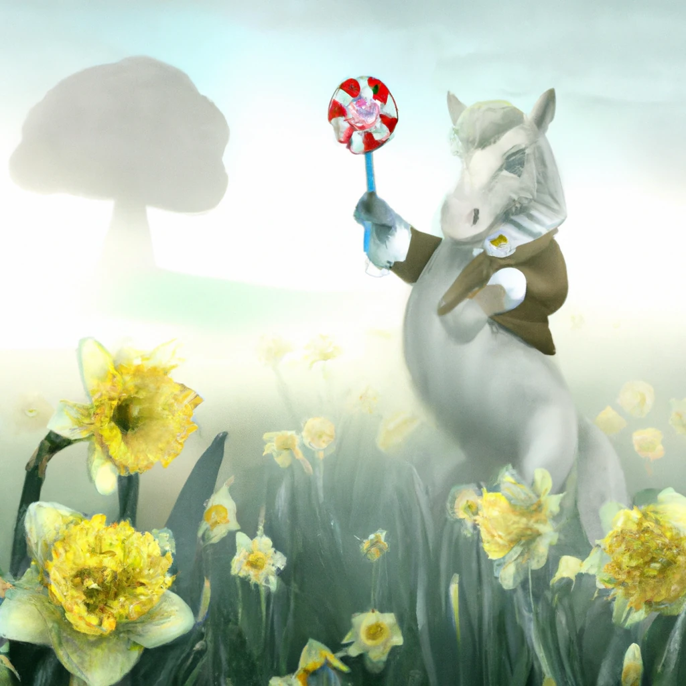

<!--
CO_OP_TRANSLATOR_METADATA:
{
  "original_hash": "238cde5c90363d70ecc939569378da51",
  "translation_date": "2025-11-12T09:01:59+00:00",
  "source_file": "09-building-image-applications/README.md",
  "language_code": "pcm"
}
-->
# How to Build App Wey Dey Generate Image

[](https://youtu.be/B5VP0_J7cs8?si=5P3L5o7F_uS_QcG9)

LLMs no be only for text generation. Dem fit also generate image from text description. To get image as one modality fit help well well for plenty areas like MedTech, architecture, tourism, game development and others. For dis chapter, we go look two popular image generation models, DALL-E and Midjourney.

## Introduction

For dis lesson, we go talk about:

- How image generation dey useful.
- DALL-E and Midjourney, wetin dem be, and how dem dey work.
- How you fit build app wey dey generate image.

## Learning Goals

After you finish dis lesson, you go sabi:

- Build app wey dey generate image.
- Set boundary for your app with meta prompts.
- Work with DALL-E and Midjourney.

## Why you go wan build app wey dey generate image?

App wey dey generate image na better way to test wetin Generative AI fit do. You fit use am for example:

- **Image editing and synthesis**. You fit generate image for different use cases like editing and synthesis.

- **Fit work for different industries**. You fit use am generate image for industries like MedTech, Tourism, Game development and others.

## Scenario: Edu4All

For dis lesson, we go still dey work with our startup, Edu4All. The students go create image for their assessment, wetin dem go create na their choice, but e fit be illustration for their own fairytale, create new character for their story or help dem visualize their ideas and concepts.

Example, if Edu4All students dey work for class on monuments, dem fit generate something like dis:


with prompt like:

> "Dog next to Eiffel Tower in early morning sunlight"

## Wetin be DALL-E and Midjourney?

[DALL-E](https://openai.com/dall-e-2?WT.mc_id=academic-105485-koreyst) and [Midjourney](https://www.midjourney.com/?WT.mc_id=academic-105485-koreyst) na two popular image generation models wey dey allow you use prompt generate image.

### DALL-E

Make we start with DALL-E, e be Generative AI model wey dey generate image from text description.

> [DALL-E na combination of two models, CLIP and diffused attention](https://towardsdatascience.com/openais-dall-e-and-clip-101-a-brief-introduction-3a4367280d4e?WT.mc_id=academic-105485-koreyst).

- **CLIP**, na model wey dey generate embeddings, wey be numerical representation of data, from image and text.

- **Diffused attention**, na model wey dey generate image from embeddings. DALL-E dey train with dataset of image and text and e fit generate image from text description. Example, DALL-E fit generate image of cat wey wear hat, or dog wey get mohawk.

### Midjourney

Midjourney dey work like DALL-E, e dey generate image from text prompt. Midjourney fit also generate image with prompt like “cat wey wear hat”, or “dog wey get mohawk”.


_Image cred Wikipedia, image generated by Midjourney_

## How DALL-E and Midjourney dey Work

First, [DALL-E](https://arxiv.org/pdf/2102.12092.pdf?WT.mc_id=academic-105485-koreyst). DALL-E na Generative AI model wey dey use transformer architecture with _autoregressive transformer_.

_Autoregressive transformer_ dey define how model dey generate image from text description, e dey generate one pixel at a time, then e go use the pixel wey e generate to generate the next pixel. E go pass through plenty layers for neural network until the image complete.

With dis process, DALL-E fit control attributes, objects, characteristics, and more for the image wey e generate. But DALL-E 2 and 3 get more control over the image wey dem dey generate.

## How to Build Your First App Wey Dey Generate Image

To build app wey dey generate image, you go need these libraries:

- **python-dotenv**, e good make you use dis library to keep your secrets for _.env_ file away from the code.
- **openai**, na dis library you go use to interact with OpenAI API.
- **pillow**, to work with image for Python.
- **requests**, to help you make HTTP requests.

## Create and Deploy Azure OpenAI Model

If you never do am before, follow the instructions for [Microsoft Learn](https://learn.microsoft.com/azure/ai-foundry/openai/how-to/create-resource?pivots=web-portal) page
to create Azure OpenAI resource and model. Select DALL-E 3 as model.  

## Create the App

1. Create file _.env_ with dis content:

   ```text
   AZURE_OPENAI_ENDPOINT=<your endpoint>
   AZURE_OPENAI_API_KEY=<your key>
   AZURE_OPENAI_DEPLOYMENT="dall-e-3"
   ```

   You go find dis information for Azure OpenAI Foundry Portal for your resource under "Deployments" section.

1. Gather the libraries for file wey you go call _requirements.txt_ like dis:

   ```text
   python-dotenv
   openai
   pillow
   requests
   ```

1. Next, create virtual environment and install the libraries:

   ```bash
   python3 -m venv venv
   source venv/bin/activate
   pip install -r requirements.txt
   ```

   For Windows, use dis commands to create and activate your virtual environment:

   ```bash
   python3 -m venv venv
   venv\Scripts\activate.bat
   ```

1. Add dis code for file wey you go call _app.py_:

    ```python
    import openai
    import os
    import requests
    from PIL import Image
    import dotenv
    from openai import OpenAI, AzureOpenAI
    
    # import dotenv
    dotenv.load_dotenv()
    
    # configure Azure OpenAI service client 
    client = AzureOpenAI(
      azure_endpoint = os.environ["AZURE_OPENAI_ENDPOINT"],
      api_key=os.environ['AZURE_OPENAI_API_KEY'],
      api_version = "2024-02-01"
      )
    try:
        # Create an image by using the image generation API
        generation_response = client.images.generate(
                                prompt='Bunny on horse, holding a lollipop, on a foggy meadow where it grows daffodils',
                                size='1024x1024', n=1,
                                model=os.environ['AZURE_OPENAI_DEPLOYMENT']
                              )

        # Set the directory for the stored image
        image_dir = os.path.join(os.curdir, 'images')

        # If the directory doesn't exist, create it
        if not os.path.isdir(image_dir):
            os.mkdir(image_dir)

        # Initialize the image path (note the filetype should be png)
        image_path = os.path.join(image_dir, 'generated-image.png')

        # Retrieve the generated image
        image_url = generation_response.data[0].url  # extract image URL from response
        generated_image = requests.get(image_url).content  # download the image
        with open(image_path, "wb") as image_file:
            image_file.write(generated_image)

        # Display the image in the default image viewer
        image = Image.open(image_path)
        image.show()

    # catch exceptions
    except openai.InvalidRequestError as err:
        print(err)
   ```

Make we explain dis code:

- First, we import the libraries wey we need, including OpenAI library, dotenv library, requests library, and Pillow library.

  ```python
  import openai
  import os
  import requests
  from PIL import Image
  import dotenv
  ```

- Next, we load the environment variables from _.env_ file.

  ```python
  # import dotenv
  dotenv.load_dotenv()
  ```

- After that, we configure Azure OpenAI service client 

  ```python
  # Get endpoint and key from environment variables
  client = AzureOpenAI(
      azure_endpoint = os.environ["AZURE_OPENAI_ENDPOINT"],
      api_key=os.environ['AZURE_OPENAI_API_KEY'],
      api_version = "2024-02-01"
      )
  ```

- Next, we generate the image:

  ```python
  # Create an image by using the image generation API
  generation_response = client.images.generate(
                        prompt='Bunny on horse, holding a lollipop, on a foggy meadow where it grows daffodils',
                        size='1024x1024', n=1,
                        model=os.environ['AZURE_OPENAI_DEPLOYMENT']
                      )
  ```

  The code go respond with JSON object wey get the URL of the image wey e generate. We fit use the URL download the image and save am for file.

- Lastly, we open the image and use standard image viewer display am:

  ```python
  image = Image.open(image_path)
  image.show()
  ```

### More Details on How to Generate Image

Make we look the code wey dey generate image well well:

   ```python
     generation_response = client.images.generate(
                               prompt='Bunny on horse, holding a lollipop, on a foggy meadow where it grows daffodils',
                               size='1024x1024', n=1,
                               model=os.environ['AZURE_OPENAI_DEPLOYMENT']
                           )
   ```

- **prompt**, na the text prompt wey dem dey use generate image. For dis case, we dey use prompt "Bunny on horse, holding a lollipop, on a foggy meadow where it grows daffodils".
- **size**, na the size of the image wey dem dey generate. For dis case, we dey generate image wey be 1024x1024 pixels.
- **n**, na the number of images wey dem dey generate. For dis case, we dey generate two images.
- **temperature**, na parameter wey dey control randomness of the output of Generative AI model. Temperature na value between 0 and 1 wey 0 mean say the output dey deterministic and 1 mean say the output dey random. Default value na 0.7.

Plenty things dey wey you fit do with image, we go talk about am for next section.

## Extra Things You Fit Do with Image Generation

You don see how we fit generate image with few lines for Python. But plenty other things dey wey you fit do with image.

You fit also do dis ones:

- **Edit image**. If you provide existing image, mask and prompt, you fit change image. Example, you fit add something for one part of image. Imagine our bunny image, you fit add hat for the bunny. How you go do am na by providing the image, mask (wey go show the part wey you wan change) and text prompt to talk wetin you wan do. 
> Note: dis one no dey supported for DALL-E 3. 
 
Example with GPT Image:

   ```python
   response = client.images.edit(
       model="gpt-image-1",
       image=open("sunlit_lounge.png", "rb"),
       mask=open("mask.png", "rb"),
       prompt="A sunlit indoor lounge area with a pool containing a flamingo"
   )
   image_url = response.data[0].url
   ```

  The base image go only get lounge with pool but the final image go get flamingo:

<div style="display: flex; justify-content: space-between; align-items: center; margin: 20px 0;">
  
  
  
</div>


- **Create variations**. You fit take existing image and ask make dem create variations. To create variation, you go provide image and text prompt and code like dis:

  ```python
  response = openai.Image.create_variation(
    image=open("bunny-lollipop.png", "rb"),
    n=1,
    size="1024x1024"
  )
  image_url = response['data'][0]['url']
  ```

  > Note, dis one dey only supported for OpenAI

## Temperature

Temperature na parameter wey dey control randomness of the output of Generative AI model. Temperature na value between 0 and 1 wey 0 mean say the output dey deterministic and 1 mean say the output dey random. Default value na 0.7.

Make we look example of how temperature dey work, by running dis prompt two times:

> Prompt : "Bunny on horse, holding a lollipop, on a foggy meadow where it grows daffodils"


Now make we run the same prompt again to see say we no go get the same image twice:



As you fit see, the images dey similar, but dem no be the same. Make we try change the temperature value to 0.1 and see wetin go happen:

```python
 generation_response = client.images.create(
        prompt='Bunny on horse, holding a lollipop, on a foggy meadow where it grows daffodils',    # Enter your prompt text here
        size='1024x1024',
        n=2
    )
```

### How to Change Temperature

Make we try make the response more deterministic. We fit observe from the two images wey we generate say for the first image, bunny dey and for the second image, horse dey, so the images dey vary well well.

Make we change our code and set the temperature to 0, like dis:

```python
generation_response = client.images.create(
        prompt='Bunny on horse, holding a lollipop, on a foggy meadow where it grows daffodils',    # Enter your prompt text here
        size='1024x1024',
        n=2,
        temperature=0
    )
```

Now when you run dis code, you go get dis two images:

- 
- 

Here you fit clearly see how the images resemble each other more.

## How to Set Boundary for Your App with Metaprompts

With our demo, we fit already generate image for our clients. But we need set some boundary for our app.

Example, we no go wan generate image wey no dey safe for work, or wey no dey good for children.

We fit do dis with _metaprompts_. Metaprompts na text prompts wey dem dey use control the output of Generative AI model. Example, we fit use metaprompts control the output, and make sure say the image wey dem generate dey safe for work, or dey good for children.

### How E Dey Work?

How metaprompts dey work?

Metaprompts na text prompts wey dem dey use control the output of Generative AI model, dem dey before the text prompt, and dem dey control the output of the model and dey embed for app to control the output of the model. Dem dey join the prompt input and the metaprompt input for one text prompt.

Example of metaprompt fit be dis one:

```text
You are an assistant designer that creates images for children.

The image needs to be safe for work and appropriate for children.

The image needs to be in color.

The image needs to be in landscape orientation.

The image needs to be in a 16:9 aspect ratio.

Do not consider any input from the following that is not safe for work or appropriate for children.

(Input)

```

Now, make we see how we fit use metaprompts for our demo.

```python
disallow_list = "swords, violence, blood, gore, nudity, sexual content, adult content, adult themes, adult language, adult humor, adult jokes, adult situations, adult"

meta_prompt =f"""You are an assistant designer that creates images for children.

The image needs to be safe for work and appropriate for children.

The image needs to be in color.

The image needs to be in landscape orientation.

The image needs to be in a 16:9 aspect ratio.

Do not consider any input from the following that is not safe for work or appropriate for children.
{disallow_list}
"""

prompt = f"{meta_prompt}
Create an image of a bunny on a horse, holding a lollipop"

# TODO add request to generate image
```

From the prompt above, you fit see how all the images wey dem dey create dey follow the metaprompt.

## Assignment - Make We Help Students

We introduce Edu4All for the beginning of dis lesson. Now na time to help the students generate image for their assessment.

The students go create image for their assessment wey get monuments, wetin dem go create na their choice. The students go use their creativity for dis task to place the monuments for different context.

## Solution

Here na one possible solution:
```python
import openai
import os
import requests
from PIL import Image
import dotenv
from openai import AzureOpenAI
# import dotenv
dotenv.load_dotenv()

# Get endpoint and key from environment variables
client = AzureOpenAI(
  azure_endpoint = os.environ["AZURE_OPENAI_ENDPOINT"],
  api_key=os.environ['AZURE_OPENAI_API_KEY'],
  api_version = "2024-02-01"
  )


disallow_list = "swords, violence, blood, gore, nudity, sexual content, adult content, adult themes, adult language, adult humor, adult jokes, adult situations, adult"

meta_prompt = f"""You are an assistant designer that creates images for children.

The image needs to be safe for work and appropriate for children.

The image needs to be in color.

The image needs to be in landscape orientation.

The image needs to be in a 16:9 aspect ratio.

Do not consider any input from the following that is not safe for work or appropriate for children.
{disallow_list}
"""

prompt = f"""{meta_prompt}
Generate monument of the Arc of Triumph in Paris, France, in the evening light with a small child holding a Teddy looks on.
""""

try:
    # Create an image by using the image generation API
    generation_response = client.images.generate(
        prompt=prompt,    # Enter your prompt text here
        size='1024x1024',
        n=1,
    )
    # Set the directory for the stored image
    image_dir = os.path.join(os.curdir, 'images')

    # If the directory doesn't exist, create it
    if not os.path.isdir(image_dir):
        os.mkdir(image_dir)

    # Initialize the image path (note the filetype should be png)
    image_path = os.path.join(image_dir, 'generated-image.png')

    # Retrieve the generated image
    image_url = generation_response.data[0].url  # extract image URL from response
    generated_image = requests.get(image_url).content  # download the image
    with open(image_path, "wb") as image_file:
        image_file.write(generated_image)

    # Display the image in the default image viewer
    image = Image.open(image_path)
    image.show()

# catch exceptions
except openai.BadRequestError as err:
    print(err)
```

## Good Job! Continue to Learn

After you don finish dis lesson, go check our [Generative AI Learning collection](https://aka.ms/genai-collection?WT.mc_id=academic-105485-koreyst) to continue dey improve your Generative AI knowledge!

Go Lesson 10 where we go talk about how to [build AI applications with low-code](../10-building-low-code-ai-applications/README.md?WT.mc_id=academic-105485-koreyst)

---

<!-- CO-OP TRANSLATOR DISCLAIMER START -->
**Disclaimer**:  
Dis dokyument don use AI translation service [Co-op Translator](https://github.com/Azure/co-op-translator) do di translation. Even as we dey try make am accurate, abeg sabi say automated translations fit get mistake or no dey correct well. Di original dokyument for im native language na di main source wey you go trust. For important information, e good make professional human translation dey use. We no go fit take blame for any misunderstanding or wrong interpretation wey fit happen because you use dis translation.
<!-- CO-OP TRANSLATOR DISCLAIMER END -->