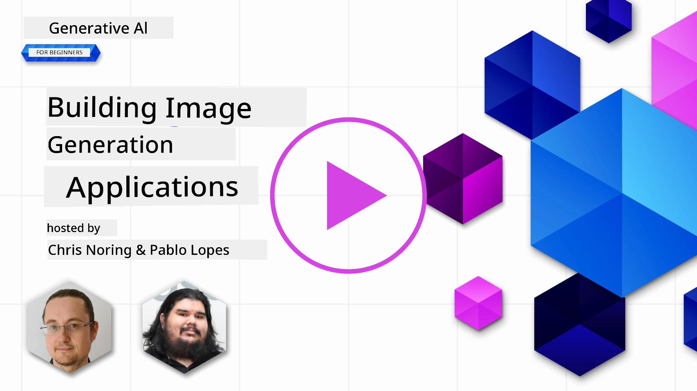

# How To Build Image Generation Applications

[](https://aka.ms/gen-ai-lesson9-gh?WT.mc_id=academic-105485-koreyst)

LLMs no dey do only text generation. You fit also generate picture from text description. Picture as one kain format dey useful for MedTech, architecture, tourism, game development, marketing, plus more. For this lesson we go look today **GPT Image** models and how to build image generation app.

## Introduction

Image generation na how you fit take transform natural-language prompt turn am to picture. For this lesson we dey work with **`gpt-image`** family of models from OpenAI - dis na the current generation models we get for **[Microsoft Foundry](https://ai.azure.com?WT.mc_id=academic-105485-koreyst)** and OpenAI platform. These models don replace the old DALL·E models (DALL·E 2/3 na old ones).

For the whole lesson we go use one pretend startup, **Edu4All**, wey dey build tools to help people learn. Di team wan generate illustrations for their assignments and study materials.

## Wetin you go learn

By the time you finish this lesson, you go fit:

- Talk wetin image generation mean and where e good to use am.
- Understand the `gpt-image` model family plus how e different from old DALL·E models.
- Build image generation app for Python (plus TypeScript / .NET).
- Edit images and put safety guardrails with metaprompts.

## Wetin be image generation?

Image generation models dey create picture from text prompt. Modern models like `gpt-image` dey use transformer + diffusion method: the model dey learn how text and picture relate during training, then when you give am prompt, e go dey "denoise" random noise step by step into picture wey match the description.

Two well-known types of image models be:

- **`gpt-image` (OpenAI)** - na the current generation model, we dey use for this lesson. E fit do text-to-image generation and fit edit image (inpainting with mask).
- **Midjourney** - na popular model wey people outside build, e get im own service and Discord workflow.

> Old OpenAI image models - **DALL·E 2** plus **DALL·E 3** - na old ones. DALL·E 3 no dey for new deployment again, and things like `create_variation` only dey DALL·E 2. Make you use `gpt-image` models for your new apps.

### Which `gpt-image` model make I use?

For Microsoft Foundry, the ones wey dem don launch for everybody na:

| Model | Notes |
| --- | --- |
| **`gpt-image-2`** | Na the latest and strongest image model - this one good for general use. |
| `gpt-image-1.5` | Dey available; better quality and cheaper. |
| `gpt-image-1-mini` | Dey available; fastest and cheapest. |
| `gpt-image-1` | For preview only. |

Always check the current [Foundry image models list](https://learn.microsoft.com/azure/ai-foundry/openai/concepts/models?WT.mc_id=academic-105485-koreyst) make sure the model dey, and for which regions.

> **Important:** `gpt-image` models dey return generated image as **base64** (`b64_json`), no be URL. Your code go decode base64 string to bytes then save am - no URL to download image.

## Setup

You fit run the samples for **Azure OpenAI Microsoft Foundry** (the `aoai-*` samples) or **OpenAI platform** (the `oai-*` samples).

### 1. Create and deploy model

Follow the [create a resource](https://learn.microsoft.com/azure/ai-foundry/openai/how-to/create-resource?pivots=web-portal&WT.mc_id=academic-105485-koreyst) guide make you create Microsoft Foundry resource, then deploy one image model - **`gpt-image-2`** na the one dem recommend.

### 2. Setup your `.env`

```text
AZURE_OPENAI_ENDPOINT=<your endpoint>
AZURE_OPENAI_API_KEY=<your key>
AZURE_OPENAI_DEPLOYMENT="gpt-image-2"
```

Find those values for **Deployments** page for your resource for the [Foundry portal](https://ai.azure.com?WT.mc_id=academic-105485-koreyst).

### 3. Install libraries

Make one `requirements.txt`:

```text
python-dotenv
openai
pillow
```

Then you create and activate virtual environment then install am:

```bash
python3 -m venv venv
source venv/bin/activate        # Windows: venv\Scripts\activate
pip install -r requirements.txt
```

## Build the app

Create `app.py` with this code. The code go generate one image and save am as PNG.

```python
import os
import base64
from openai import AzureOpenAI
from PIL import Image
import dotenv

dotenv.load_dotenv()

# Make di client sabi your Azure OpenAI (Microsoft Foundry) resource.
# Image models need di recent API version - check di Foundry docs for di one wey your model need.
client = AzureOpenAI(
    api_key=os.environ["AZURE_OPENAI_API_KEY"],
    api_version="2025-04-01-preview",
    azure_endpoint=os.environ["AZURE_OPENAI_ENDPOINT"],
)

deployment = os.environ["AZURE_OPENAI_DEPLOYMENT"]  # e.g. "gpt-image-2"

result = client.images.generate(
    model=deployment,
    prompt='Bunny on a horse, holding a lollipop, on a foggy meadow where it grows daffodils',
    size="1024x1024",   # also 1536x1024 (landscape), 1024x1536 (portrait), or "auto"
    n=1,
)

# gpt-image models dey return base64 (b64_json), no be URL - you go decode am to bytes.
image_bytes = base64.b64decode(result.data[0].b64_json)

os.makedirs("images", exist_ok=True)
image_path = os.path.join("images", "generated-image.png")
with open(image_path, "wb") as f:
    f.write(image_bytes)

Image.open(image_path).show()
```

Run am with `python app.py`. You go see PNG don save for `images/`.

> Every time you call `images.generate` e fit generate different image even if the prompt na the same - image models no get `temperature` parameter (dat one na text-generation control). To get difference, just call API again; if you want less difference, make your prompt more specific.

## Edit images

`gpt-image` models fit **edit** existing image: you go give image, optional **mask** (to mark which part you want change), plus prompt wey talk wetin you want change. Like generation, edits still dey return as base64.

```python
result = client.images.edit(
    model=deployment,
    image=open("sunlit_lounge.png", "rb"),
    mask=open("mask.png", "rb"),
    prompt="A sunlit indoor lounge area with a pool containing a flamingo",
)
image_bytes = base64.b64decode(result.data[0].b64_json)
with open("images/edited-image.png", "wb") as f:
    f.write(image_bytes)
```

<div style="display: flex; justify-content: space-between; align-items: center; margin: 20px 0;">
  
  
  
</div>

## Set boundaries wit metaprompts

After you fit generate images, you need guardrails to make sure your app no go produce unsafe or off-brand content. Metaprompt na text you add front for user's prompt make the model's output dey controlled.

```python
disallow_list = "swords, violence, blood, gore, nudity, sexual content, adult content, adult themes, adult language"

meta_prompt = f"""You are an assistant designer that creates images for children.

The image needs to be safe for work and appropriate for children.
The image needs to be in color, in landscape orientation, and in a 16:9 aspect ratio.

Do not consider any input that is not safe for work or appropriate for children, including:
{disallow_list}
"""

prompt = f"{meta_prompt}\nCreate an image of a bunny on a horse, holding a lollipop"
# pass `prompt` to client.images.generate(...)
```

Now every image go generate inside the boundaries wey metaprompt set. Combine dis with content filters wey Microsoft Foundry put for defense in depth.

## Assignment - make we help students

Edu4All students need images for their assessments. Build app wey go generate images of **monuments** (which monuments na your choice) inside different, creative context - example be like famous landmark for sunset with pikin wey dey watch.

Try am yourself, then check the reference solutions:

- Python (Azure): [aoai-solution.py](../../../09-building-image-applications/python/aoai-solution.py)
- Python (Azure) full generation app: [aoai-app.py](../../../09-building-image-applications/python/aoai-app.py)
- Python (OpenAI): [oai-app.py](../../../09-building-image-applications/python/oai-app.py)
- TypeScript (Azure): [typescript/image-generation-app](../../../09-building-image-applications/typescript/image-generation-app)
- .NET (Azure): [dotnet/notebook-azure-openai.dib](../../../09-building-image-applications/dotnet/notebook-azure-openai.dib)

Also work through the notebooks inside [python/](../../../09-building-image-applications/python) (`aoai-assignment.ipynb` for Azure, `oai-assignment.ipynb` for OpenAI).

## Well done! Continue to learn

After you finish this lesson, check our [Generative AI Learning collection](https://aka.ms/genai-collection?WT.mc_id=academic-105485-koreyst) to keep improving your Generative AI knowledge!

Go to lesson 10 make you continue learning.

---

<!-- CO-OP TRANSLATOR DISCLAIMER START -->
**Disclaimer**:
Dis document don translate wit AI translation service [Co-op Translator](https://github.com/Azure/co-op-translator). Even tho we dey try make am correct, abeg make you know say automated translation fit get errors or mistakes. Di original document for dia own language na im be di correct source. For important info, make person wey sabi human translation do am. We no go responsible for any misunderstanding or wrong understanding wey fit happen because of dis translation.
<!-- CO-OP TRANSLATOR DISCLAIMER END -->