# How to Build Low Code AI Apps

[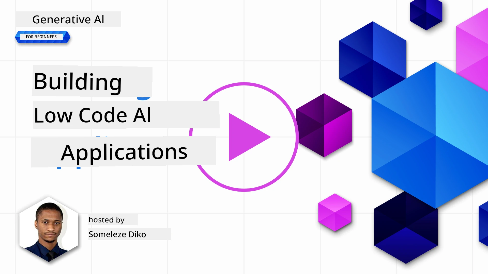](https://youtu.be/1vzq3Nd8GBA?si=h6LHWJXdmqf6mhDg)

> _(Click di image wey dey up to watch di video for dis lesson)_

## Introduction

Now wey we don learn how to build apps wey dey generate image, make we talk about low code. Generative AI fit dey use for plenty different areas including low code, but wetin be low code and how we fit add AI join am?

To build apps and solutions don dey easy for developers and people wey no sabi code well well because of Low Code Development Platforms. Dis Low Code Development Platforms dey help you build apps and solutions with small or no code at all. Di way dem dey do am na by giving you visual development environment wey go allow you drag and drop components to build apps and solutions. Dis one go make you fit build apps and solutions fast and with small resources. For dis lesson, we go talk well well about how to use Low Code and how to make low code development better with AI using Power Platform.

Di Power Platform dey give companies di chance to empower dia teams to build dia own solutions through one easy-to-use low-code or no-code environment. Dis environment dey make di process of building solutions simple. With Power Platform, you fit build solutions for days or weeks instead of months or years. Power Platform get five main products: Power Apps, Power Automate, Power BI, Power Pages and Copilot Studio.

Dis lesson go cover:

- Introduction to Generative AI for Power Platform
- Introduction to Copilot and how to use am
- How to use Generative AI to build apps and flows for Power Platform
- How di AI Models for Power Platform dey work with AI Builder

## Learning Goals

By di time you finish dis lesson, you go sabi:

- How Copilot dey work for Power Platform.

- How to build Student Assignment Tracker App for our education startup.

- How to build Invoice Processing Flow wey go use AI to extract information from invoices.

- How to use best practices when you dey use di Create Text with GPT AI Model.

Di tools and technologies wey you go use for dis lesson na:

- **Power Apps**, for di Student Assignment Tracker app, wey go give you low-code development environment to build apps wey go help track, manage and interact with data.

- **Dataverse**, for storing di data for di Student Assignment Tracker app, wey go give you low-code data platform to store di app data.

- **Power Automate**, for di Invoice Processing flow wey go give you low-code development environment to build workflows wey go automate di Invoice Processing process.

- **AI Builder**, for di Invoice Processing AI Model wey go use prebuilt AI Models to process di invoices for our startup.

## Generative AI for Power Platform

To make low-code development and application better with generative AI na one of di main focus for Power Platform. Di goal na to make everybody fit build AI-powered apps, sites, dashboards and automate processes with AI, _without needing any data science knowledge_. Dem dey achieve dis goal by putting generative AI inside di low-code development experience for Power Platform as Copilot and AI Builder.

### How e dey work?

Copilot na AI assistant wey go help you build Power Platform solutions by describing wetin you need through some conversational steps using natural language. For example, you fit tell di AI assistant wetin fields you want make your app use and e go create di app and di data model wey dey under am or you fit talk how you want setup flow for Power Automate.

You fit use Copilot features for your app screens to help users find insights through conversational interactions.

AI Builder na low-code AI feature wey dey Power Platform wey go help you use AI Models to automate processes and predict results. With AI Builder, you fit add AI to your apps and flows wey dey connect to your data for Dataverse or other cloud data sources like SharePoint, OneDrive or Azure.

Copilot dey available for all di Power Platform products: Power Apps, Power Automate, Power BI, Power Pages and Power Virtual Agents. AI Builder dey available for Power Apps and Power Automate. For dis lesson, we go focus on how to use Copilot and AI Builder for Power Apps and Power Automate to build solution for our education startup.

### Copilot for Power Apps

As part of Power Platform, Power Apps dey give low-code development environment to build apps wey go help track, manage and interact with data. E be suite of app development services wey get scalable data platform and e fit connect to cloud services and on-premises data. Power Apps dey allow you build apps wey fit run for browsers, tablets, and phones, and you fit share am with your co-workers. Power Apps dey make app development easy with simple interface, so say anybody wey dey business or pro developer fit build custom apps. Di app development experience dey better with Generative AI through Copilot.

Di Copilot AI assistant feature for Power Apps dey allow you describe di kind app wey you need and di information wey you want make your app dey track, collect, or show. Copilot go then generate one responsive Canvas app based on wetin you describe. You fit then customize di app to meet your needs. Di AI Copilot go also generate and suggest one Dataverse Table with di fields wey you need to store di data wey you want track and some sample data. We go talk about wetin Dataverse be and how you fit use am for Power Apps later for dis lesson. You fit then customize di table to meet your needs using di AI Copilot assistant feature through conversational steps. Dis feature dey available from di Power Apps home screen.

### Copilot for Power Automate

As part of Power Platform, Power Automate dey allow users create automated workflows between applications and services. E dey help automate repetitive business processes like communication, data collection, and decision approvals. Di simple interface dey allow users wey get different technical levels (from beginners to experienced developers) automate work tasks. Di workflow development experience dey better with Generative AI through Copilot.

Di Copilot AI assistant feature for Power Automate dey allow you describe di kind flow wey you need and di actions wey you want make your flow perform. Copilot go then generate flow based on wetin you describe. You fit then customize di flow to meet your needs. Di AI Copilot go also generate and suggest di actions wey you need to perform di task wey you want automate. We go talk about wetin flows be and how you fit use dem for Power Automate later for dis lesson. You fit then customize di actions to meet your needs using di AI Copilot assistant feature through conversational steps. Dis feature dey available from di Power Automate home screen.

## Assignment: Manage student assignments and invoices for our startup, using Copilot

Our startup dey provide online courses to students. Di startup don grow fast and now e dey struggle to meet up with di demand for di courses. Di startup don hire you as Power Platform developer to help dem build one low code solution wey go help dem manage dia student assignments and invoices. Di solution suppose fit help dem track and manage student assignments through one app and automate di invoice processing process through one workflow. Dem don ask you to use Generative AI to develop di solution.

When you dey start to use Copilot, you fit use di [Power Platform Copilot Prompt Library](https://github.com/pnp/powerplatform-prompts?WT.mc_id=academic-109639-somelezediko) to start with di prompts. Dis library get list of prompts wey you fit use to build apps and flows with Copilot. You fit also use di prompts for di library to get idea of how to describe wetin you need to Copilot.

### Build Student Assignment Tracker App for Our Startup

Di educators for our startup don dey struggle to keep track of student assignments. Dem don dey use spreadsheet to track di assignments but e don dey hard to manage as di number of students don increase. Dem don ask you to build one app wey go help dem track and manage student assignments. Di app suppose fit allow dem add new assignments, view assignments, update assignments and delete assignments. Di app suppose also allow educators and students view di assignments wey dem don grade and di ones wey dem never grade.

You go build di app using Copilot for Power Apps following di steps wey dey below:

1. Go di [Power Apps](https://make.powerapps.com?WT.mc_id=academic-105485-koreyst) home screen.

1. Use di text area for di home screen to describe di app wey you want build. For example, **_I want to build an app to track and manage student assignments_**. Click di **Send** button to send di prompt to di AI Copilot.

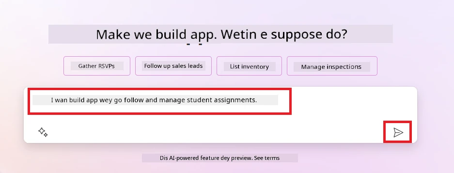

1. Di AI Copilot go suggest one Dataverse Table with di fields wey you need to store di data wey you want track and some sample data. You fit then customize di table to meet your needs using di AI Copilot assistant feature through conversational steps.

   > **Important**: Dataverse na di data platform wey dey under Power Platform. E be low-code data platform wey dey store di app data. E be fully managed service wey dey store data for Microsoft Cloud and e dey provision for your Power Platform environment. E get built-in data governance features like data classification, data lineage, fine-grained access control, and more. You fit learn more about Dataverse [here](https://docs.microsoft.com/powerapps/maker/data-platform/data-platform-intro?WT.mc_id=academic-109639-somelezediko).

   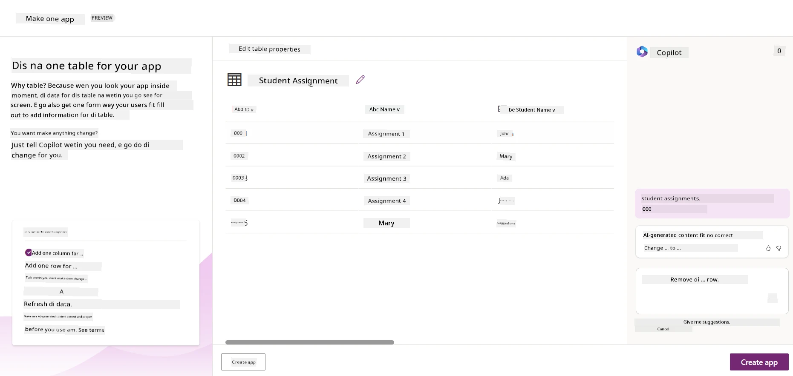

1. Educators want dey send emails to di students wey don submit dia assignments to keep dem updated about di progress of dia assignments. You fit use Copilot to add new field to di table to store di student email. For example, you fit use dis prompt to add new field to di table: **_I want to add a column to store student email_**. Click di **Send** button to send di prompt to di AI Copilot.

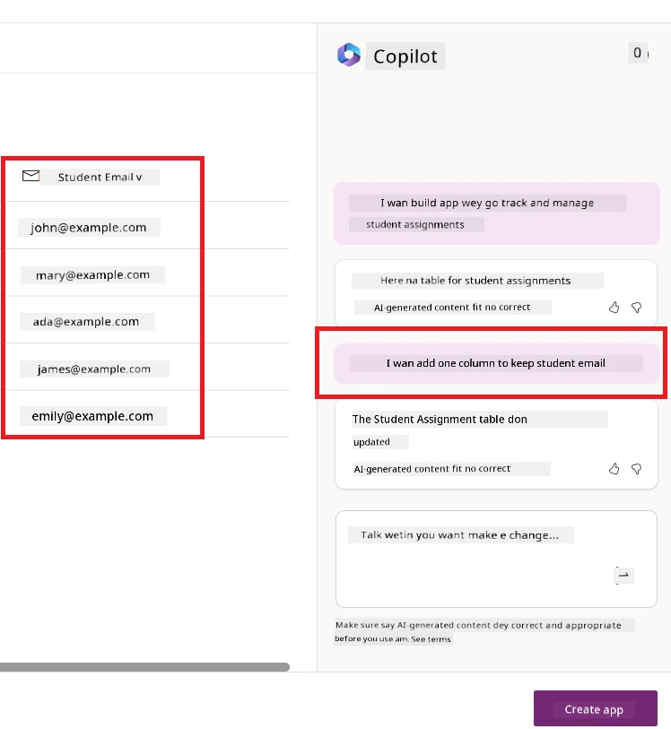

1. Di AI Copilot go generate new field and you fit then customize di field to meet your needs.

1. When you don finish di table, click di **Create app** button to create di app.

1. Di AI Copilot go generate one responsive Canvas app based on wetin you describe. You fit then customize di app to meet your needs.

1. For educators to send emails to students, you fit use Copilot to add new screen to di app. For example, you fit use dis prompt to add new screen to di app: **_I want to add a screen to send emails to students_**. Click di **Send** button to send di prompt to di AI Copilot.

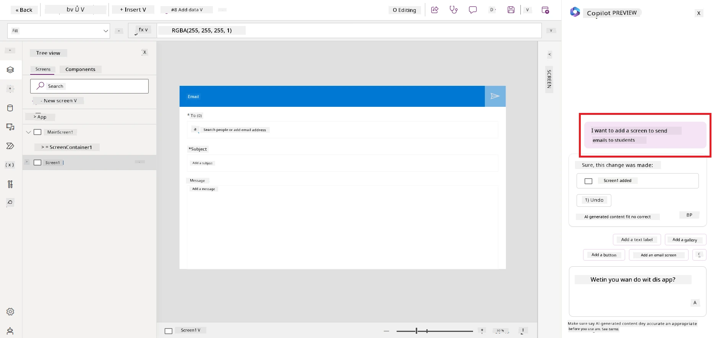

1. Di AI Copilot go generate new screen and you fit then customize di screen to meet your needs.

1. When you don finish di app, click di **Save** button to save di app.

1. To share di app with di educators, click di **Share** button and then click di **Share** button again. You fit then share di app with di educators by entering dia email addresses.

> **Your homework**: Di app wey you just build na good start but e fit dey better. With di email feature, educators fit only send emails to students manually by typing dia emails. You fit use Copilot to build automation wey go allow educators send emails to students automatically when dem submit dia assignments? Your hint na with di correct prompt you fit use Copilot for Power Automate to build dis.

### Build Invoices Information Table for Our Startup

Di finance team for our startup don dey struggle to keep track of invoices. Dem don dey use spreadsheet to track di invoices but e don dey hard to manage as di number of invoices don increase. Dem don ask you to build one table wey go help dem store, track and manage di information of di invoices wey dem receive. Di table suppose dey use to build automation wey go extract all di invoice information and store am for di table. Di table suppose also allow di finance team view di invoices wey dem don pay and di ones wey dem never pay.

Di Power Platform get one data platform wey dey under am wey dem dey call Dataverse wey dey allow you store di data for your apps and solutions. Dataverse dey provide low-code data platform to store di app data. E be fully managed service wey dey store data for Microsoft Cloud and e dey provision for your Power Platform environment. E get built-in data governance features like data classification, data lineage, fine-grained access control, and more. You fit learn more [about Dataverse here](https://docs.microsoft.com/powerapps/maker/data-platform/data-platform-intro?WT.mc_id=academic-109639-somelezediko).
Why e good make we use Dataverse for our startup? Di standard and custom tables wey dey inside Dataverse dey give secure and cloud-based storage for your data. Tables go allow you keep different kain data, just like how you fit use plenty worksheets for one Excel workbook. You fit use tables to keep data wey dey specific to your organization or business needs. Some of di benefits wey our startup go get from using Dataverse include but no dey limited to:

- **Easy to manage**: Di metadata and data dey store for cloud, so you no go need worry about di details of how dem dey store or manage am. You fit focus on how you go take build your apps and solutions.

- **Secure**: Dataverse dey provide secure and cloud-based storage for your data. You fit control who go fit access di data for your tables and how dem go fit access am using role-based security.

- **Rich metadata**: Data types and relationships dey work directly inside Power Apps.

- **Logic and validation**: You fit use business rules, calculated fields, and validation rules to enforce business logic and make sure say your data dey accurate.

Now wey you don sabi wetin Dataverse be and why e good make you use am, make we look how you fit use Copilot to create table for Dataverse wey go meet di requirements of our finance team.

> **Note**: You go use dis table for di next section to build automation wey go extract all di invoice information and store am for di table.

To create table for Dataverse using Copilot, follow di steps wey dey below:

1. Go di [Power Apps](https://make.powerapps.com?WT.mc_id=academic-105485-koreyst) home screen.

2. For di left navigation bar, select **Tables** then click **Describe the new Table**.

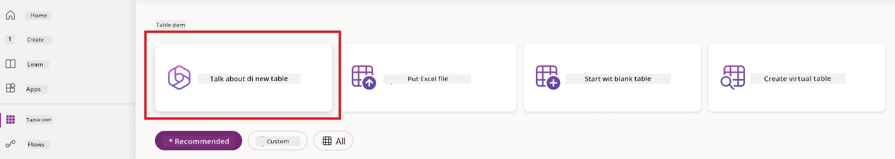

3. For di **Describe the new Table** screen, use di text area to describe di table wey you wan create. For example, **_I want to create a table to store invoice information_**. Click di **Send** button to send di prompt to di AI Copilot.

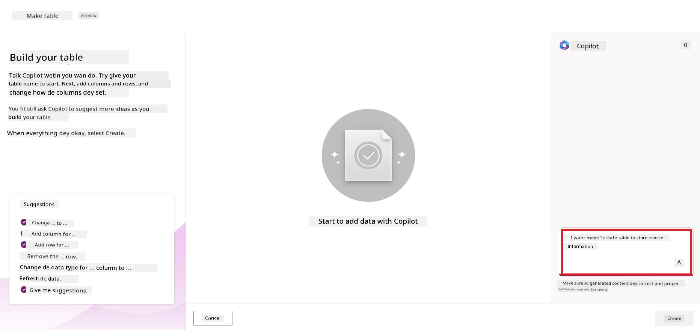

4. Di AI Copilot go suggest Dataverse Table wey get di fields wey you need to store di data wey you wan track and some sample data. You fit customize di table to meet your needs using di AI Copilot assistant feature through conversational steps.

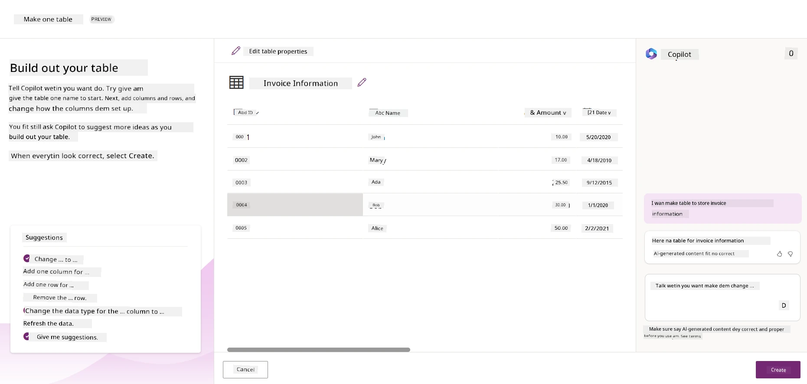

5. Di finance team wan send email to di supplier to update dem with di current status of their invoice. You fit use Copilot to add new field to di table to store di supplier email. For example, you fit use dis prompt: **_I want to add a column to store supplier email_**. Click di **Send** button to send di prompt to di AI Copilot.

6. Di AI Copilot go generate new field and you fit customize di field to meet your needs.

7. Once you don finish di table, click di **Create** button to create di table.

## AI Models for Power Platform with AI Builder

AI Builder na low-code AI capability wey dey available for Power Platform wey go allow you use AI Models to help you automate processes and predict outcomes. With AI Builder, you fit bring AI enter your apps and flows wey dey connect to your data for Dataverse or other cloud data sources like SharePoint, OneDrive or Azure.

## Prebuilt AI Models vs Custom AI Models

AI Builder dey provide two types of AI Models: Prebuilt AI Models and Custom AI Models. Prebuilt AI Models na ready-to-use AI Models wey Microsoft don train and dey available for Power Platform. Dem dey help you add intelligence to your apps and flows without you needing to gather data, build, train, and publish your own models. You fit use dis models to automate processes and predict outcomes.

Some of di Prebuilt AI Models wey dey available for Power Platform include:

- **Key Phrase Extraction**: Dis model dey extract key phrases from text.
- **Language Detection**: Dis model dey detect di language of text.
- **Sentiment Analysis**: Dis model dey detect positive, negative, neutral, or mixed sentiment for text.
- **Business Card Reader**: Dis model dey extract information from business cards.
- **Text Recognition**: Dis model dey extract text from images.
- **Object Detection**: Dis model dey detect and extract objects from images.
- **Document processing**: Dis model dey extract information from forms.
- **Invoice Processing**: Dis model dey extract information from invoices.

With Custom AI Models, you fit bring your own model enter AI Builder so e go function like any AI Builder custom model, allowing you to train di model using your own data. You fit use dis models to automate processes and predict outcomes for both Power Apps and Power Automate. When you dey use your own model, some limitations dey apply. Read more about di [limitations](https://learn.microsoft.com/ai-builder/byo-model#limitations?WT.mc_id=academic-105485-koreyst).

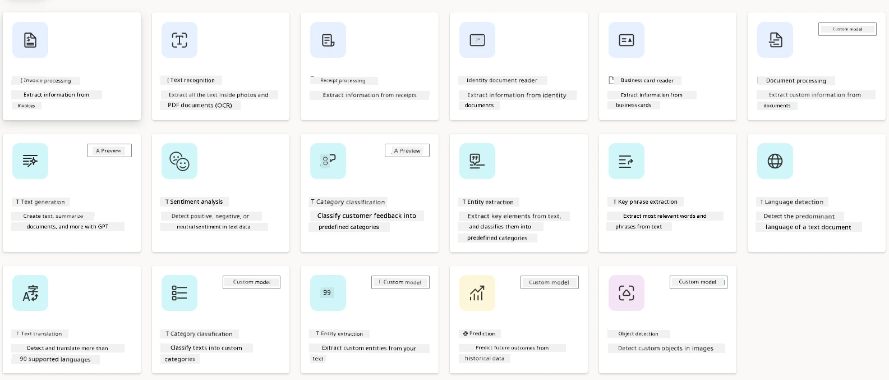

## Assignment #2 - Build Invoice Processing Flow for Our Startup

Di finance team dey struggle to process invoices. Dem dey use spreadsheet to track di invoices but e don dey hard to manage as di number of invoices don increase. Dem don ask you to build workflow wey go help dem process invoices using AI. Di workflow suppose allow dem extract information from invoices and store di information for Dataverse table. Di workflow suppose also allow dem send email to di finance team with di extracted information.

Now wey you don sabi wetin AI Builder be and why e good make you use am, make we look how you fit use di Invoice Processing AI Model for AI Builder, wey we don talk about before, to build workflow wey go help di finance team process invoices.

To build workflow wey go help di finance team process invoices using di Invoice Processing AI Model for AI Builder, follow di steps wey dey below:

1. Go di [Power Automate](https://make.powerautomate.com?WT.mc_id=academic-105485-koreyst) home screen.

2. Use di text area for di home screen to describe di workflow wey you wan build. For example, **_Process an invoice when it arrives in my mailbox_**. Click di **Send** button to send di prompt to di AI Copilot.

   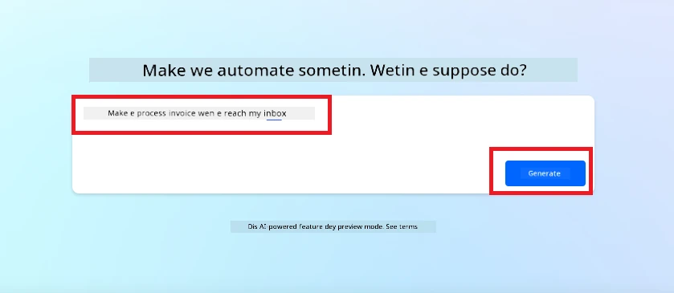

3. Di AI Copilot go suggest di actions wey you need to perform di task wey you wan automate. You fit click di **Next** button to go through di next steps.

4. For di next step, Power Automate go prompt you to set up di connections wey di flow need. Once you don finish, click di **Create flow** button to create di flow.

5. Di AI Copilot go generate flow and you fit customize di flow to meet your needs.

6. Update di trigger of di flow and set di **Folder** to di folder wey di invoices go dey. For example, you fit set di folder to **Inbox**. Click **Show advanced options** and set di **Only with Attachments** to **Yes**. Dis go make sure say di flow go only run when email wey get attachment enter di folder.

7. Remove di following actions from di flow: **HTML to text**, **Compose**, **Compose 2**, **Compose 3** and **Compose 4** because you no go use dem.

8. Remove di **Condition** action from di flow because you no go use am. E suppose look like dis screenshot:

   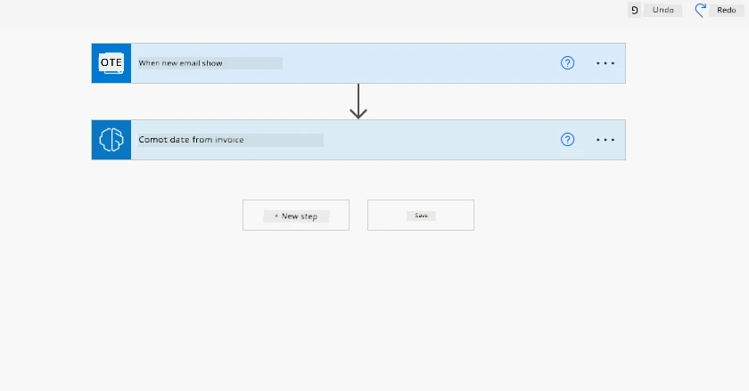

9. Click di **Add an action** button and search for **Dataverse**. Select di **Add a new row** action.

10. For di **Extract Information from invoices** action, update di **Invoice File** to point to di **Attachment Content** from di email. Dis go make sure say di flow dey extract information from di invoice attachment.

11. Select di **Table** wey you don create before. For example, you fit select di **Invoice Information** table. Choose di dynamic content from di previous action to fill di following fields:

    - ID
    - Amount
    - Date
    - Name
    - Status - Set di **Status** to **Pending**.
    - Supplier Email - Use di **From** dynamic content from di **When a new email arrives** trigger.

    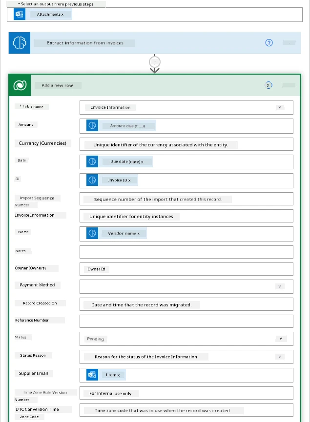

12. Once you don finish di flow, click di **Save** button to save di flow. You fit test di flow by sending email wey get invoice to di folder wey you don specify for di trigger.

> **Your homework**: Di flow wey you don build na good start, now you need think how you fit build automation wey go allow our finance team send email to di supplier to update dem with di current status of their invoice. Your hint: di flow suppose run when di status of di invoice change.

## Use Text Generation AI Model for Power Automate

Di Create Text with GPT AI Model for AI Builder dey allow you generate text based on prompt and e dey powered by Microsoft Azure OpenAI Service. With dis capability, you fit use GPT (Generative Pre-Trained Transformer) technology for your apps and flows to build plenty automated flows and insightful applications.

GPT models dey train well well on plenty data, wey dey allow dem produce text wey resemble human language when you give dem prompt. When you combine am with workflow automation, AI models like GPT fit help you streamline and automate plenty tasks.

For example, you fit build flows to automatically generate text for different use cases, like drafts of emails, product descriptions, and more. You fit also use di model to generate text for different apps, like chatbots and customer service apps wey go allow customer service agents respond well and fast to customer inquiries.

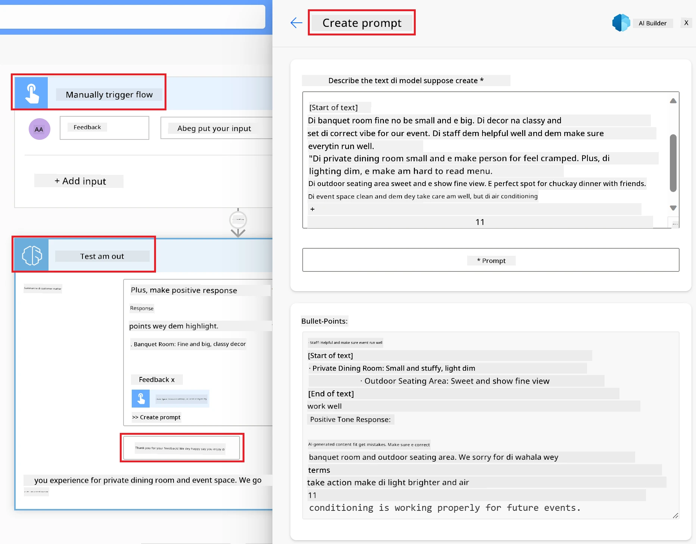

To learn how to use dis AI Model for Power Automate, go through di [Add intelligence with AI Builder and GPT](https://learn.microsoft.com/training/modules/ai-builder-text-generation/?WT.mc_id=academic-109639-somelezediko) module.

## Great Work! Continue Your Learning

After you don finish dis lesson, check out our [Generative AI Learning collection](https://aka.ms/genai-collection?WT.mc_id=academic-105485-koreyst) to continue to sabi more about Generative AI!

Go Lesson 11 where we go look how to [integrate Generative AI with Function Calling](../11-integrating-with-function-calling/README.md?WT.mc_id=academic-105485-koreyst)!

---

<!-- CO-OP TRANSLATOR DISCLAIMER START -->
**Disclaimer**:  
Dis dokyument don use AI translation service [Co-op Translator](https://github.com/Azure/co-op-translator) do di translation. Even as we dey try make am correct, abeg sabi say machine translation fit get mistake or no dey accurate well. Di original dokyument wey dey for im native language na di main source wey you go fit trust. For important mata, e good make professional human translator check am. We no go fit take blame for any misunderstanding or wrong interpretation wey fit happen because you use dis translation.
<!-- CO-OP TRANSLATOR DISCLAIMER END -->