# Biltin Low Code AI Aplications

[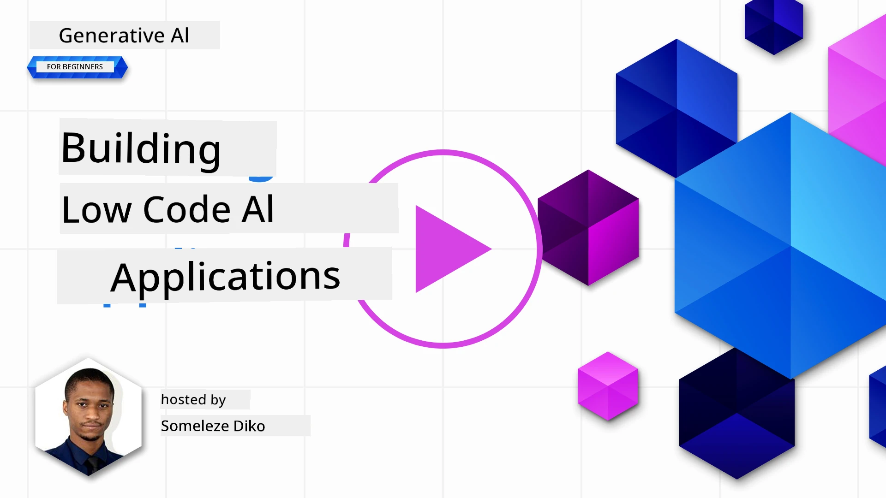](https://youtu.be/1vzq3Nd8GBA?si=h6LHWJXdmqf6mhDg)

> _(Click di pikcha we dey up to watch video for dis leson)_

## Intro

Now we don learn how to build aplikeshon wey fit generate pikcha, make we tori about low code. Generative AI fit use for plenty different tin dem like low code, but wetin be low code and how we fit add AI for am?

Buildin apps and solushon don beta for beta for di pesin dem wey dem sabi traditional development and those wey dem no be developers because of Low Code Development Platforms. Low Code Development Platforms make e possible to build apps and solushon with little or no code. Dis one na because e get visual development environment wey dey make you drag and drop components to build apps and solushon. E dey make you build apps and solushon quick quick and e no go use many resources. For dis leson, we go waka deep on how to use Low Code and how to add AI to low code development with Power Platform.

Power Platform dey give organizations opportunity to make their pipo build their own solushon inside low-code or no-code environment wey e easy to understand. Dis environment dey simplify how to build solushon. With Power Platform, you fit build solushon for days or weeks instead of months or years. Power Platform get five main products: Power Apps, Power Automate, Power BI, Power Pages and Copilot Studio.

Dis leson go talk about:

- Intro to Generative AI inside Power Platform
- Intro to Copilot and how to use am
- How to use Generative AI to build apps and flows inside Power Platform
- How to understand AI Models inside Power Platform with AI Builder
- How to build intelligent agents with Microsoft Copilot Studio

## Wetin You Go Learn

By di end of dis leson, you go fit:

- Understand how Copilot dey work inside Power Platform.

- Build Student Assignment Tracker App for we education startup.

- Build Invoice Processing Flow wey dey use AI to take info from invoices.

- Use best practice when you dey use Create Text with GPT AI Model.

- Understand wetin Microsoft Copilot Studio be and how to build intelligent agents with am.

Tools and technology wey you go use for dis leson na:

- **Power Apps**, for Student Assignment Tracker app, wey provide low-code development environment to build apps to track, manage and interact with data.

- **Dataverse**, to store data for Student Assignment Tracker app where Dataverse go be low-code data platform to store app data.

- **Power Automate**, for Invoice Processing flow where you go use low-code environment to build workflow to automate Invoice Processing process.

- **AI Builder**, for Invoice Processing AI Model where you go use prebuild AI Models to process invoices for our startup.

## Generative AI inside Power Platform

To make low-code development and aplikeshon beta with generative AI na main thing for Power Platform. Di aim na to make everybody fit build AI-powered apps, websites, dashboards and also make dem automate processes with AI _without need any data science skill_. Dis one na because dem put generative AI inside low-code development for Power Platform inside thing wey dem call Copilot and AI Builder.

### How e dey wok?

Copilot na AI assistant wey dey make you fit build Power Platform solushon by explaining wetin you want inside plenty talk wey you dey yarn using natural language. You fit tell your AI assistant wetin fields your app go get and e go build di app and data model or you fit talk how flow for Power Automate suppose be.

You fit use Copilot for your app screens as feature to help users find insights through talk and question.

AI Builder na low-code AI tool wey dey Power Platform wey go help automate processes and predict wetin go happen. With AI Builder, you fit add AI to your apps and flows wey connct to your data for Dataverse or cloud data sources like SharePoint, OneDrive or Azure.

Copilot dey all Power Platform products: Power Apps, Power Automate, Power BI, Power Pages and Copilot Studio (wey before e be Power Virtual Agents). AI Builder dey Power Apps and Power Automate. For dis leson, we go concentrate on how to use Copilot and AI Builder inside Power Apps and Power Automate to build solushon for our education startup.

### Copilot inside Power Apps

As part of Power Platform, Power Apps dey provide low-code environment to build apps to track, manage and interact with data. E be like suite of app dev tools with beta data platform and ability to connect to cloud services and on-premises data. Power Apps fit make apps wey fit run for browser, tablet and phone, and you fit share am with co-workers. Power Apps dey easy for users to start app dev with simple interface, so every business user or pro developer fit build custom apps. Dis app dev experience also beta with Generative AI through Copilot.

Copilot AI assistant feature for Power Apps dey make you fit explain wetin kind app you want and wetin you want your app to track, collect or show. Copilot go generate responsive Canvas app based on your words. You fit customize app ghen ghen to fit your needs. AI Copilot go also generate and suggest Dataverse Table with fields you need to store data make e dey track plus some sample data. Later for dis leson we go talk about wetin Dataverse be and how you fit use am inside Power Apps. You fit also customize di table using AI Copilot assistant feature through talk talk steps. Dis feature dey for Power Apps home screen easy access.

### Copilot inside Power Automate

As part of Power Platform, Power Automate make users fit create automated workflow between apps and services. E dey help automate repetitive business work like communication, data collection and decision approval. E get simple interface make everybody from beginner to pro developers fit automate work tasks. Workflow dev experience also beta with Generative AI through Copilot.

Copilot AI assistant feature for Power Automate dey make you fit explain wetin kind flow you want and wetin you want your flow to do. Copilot go generate flow based on wetin you talk. You fit customize flow to fit your needs. AI Copilot go also generate and recommend the actions you go need to do the work you want automate. Later for dis leson we go talk about wetin flows be and how to use them for Power Automate. You fit also customize actions to fit your needs using AI Copilot assistant feature through talk steps. Dis one dey available for Power Automate home screen.

## Build Intelligent Agents with Microsoft Copilot Studio

[Microsoft Copilot Studio](https://learn.microsoft.com/microsoft-copilot-studio/fundamentals-what-is-copilot-studio?WT.mc_id=academic-105485-koreyst) (wey before e be Power Virtual Agents) na low-code part of Power Platform to build **AI agents** — conversational copilots wey fit answer questions, do actions, and automate things for your users. Like all Power Platform, you build this agents for visual, natural language way: you talk wetin you want di agent to do, Copilot Studio go help make up instructions, knowledge and actions.

For our education startup, you fit build agent wey go answer student questions about courses, check assignment deadlines, even fit send email to teacher — all dis one you no need write code at all.

This na some powerfull features wey make Copilot Studio strong:

- **Generative answers from your knowledge**. Instead of you write conversation by hand, you fit connect **knowledge sources** — public websites, SharePoint, OneDrive, Dataverse, uploaded files, or enterprise data through connectors — so agent go generate grounded answers from them.

- **Generative orchestration**. No need use fixed trigger phrases, agent use AI to sabi request plus decide dynamicaly which knowledge, topics and actions to join to touch ground, including to chain many steps together.

- **Actions and connectors**. Agents fit *do* tins, no na only chat. You fit give agent actions backed by more than 1,500 prebuilt Power Platform connectors, Power Automate flows, custom REST APIs, prompts, or **Model Context Protocol (MCP)** servers.

- **Autonomous agents**. Agents no just dey respond for chat window. You fit build **autonomous agents** wey fit start work by events — like new email, new record for Dataverse, or file upload — then dem go act for background complete task.

- **Multi-agent orchestration**. Agents fit call other agents. Copilot Studio agent fit handoff or extend to other agents, including agents wey dem publish for Microsoft 365 Copilot and agents wey dem build for Microsoft Foundry.

- **Model choice**. Aside built-in models, you fit bring models from Microsoft Foundry model catalog to customize how your agent reason and answer.

- **Publish anywhere**. Once agent finish wey, you fit publish am for many channels — Microsoft Teams, Microsoft 365 Copilot, website or custom app, and more — with security, authentication, and analytics controlled by Power Platform admin.

You fit start to build your first agent for [copilotstudio.microsoft.com](https://copilotstudio.microsoft.com?WT.mc_id=academic-105485-koreyst) and learn more for [Microsoft Copilot Studio documentation](https://learn.microsoft.com/microsoft-copilot-studio/?WT.mc_id=academic-105485-koreyst).

## Assignment: Manage student assignments and invoices for our startup, using Copilot

Our startup dey provide online course for students. Our startup don grow fast and now e dey hard to keep up with demand for courses. Dem hire you as Power Platform developer make you help build low code solushon to help manage student assignments and invoices. Di solushon go fit track and manage student assignments through app and automate invoice processing workflow. Dem ask you make you use Generative AI build dis solushon.

When you dey start to use Copilot, you fit use [Power Platform Copilot Prompt Library](https://github.com/pnp/powerplatform-prompts?WT.mc_id=academic-109639-somelezediko) make you start with prompt. Dis library get list of prompts wey fit help you build apps and flows with Copilot. You fit also use di prompts to sabi how to talk your requirements to Copilot.

### Build Student Assignment Tracker App for Our Startup

We educators for our startup dey struggle to track student assignments. Dem dey use spreadsheet to track but e don hard to manage as student numbers grow. Dem ask you make you build app wey go help track and manage student assignments. App suppose fit add new assignment, see assignments, update assignments and delete assignments. App suppose also let educators and students see assignments wey dem don grade and those wey dem never grade.

You go build app using Copilot for Power Apps following dis steps below:

1. Go to [Power Apps](https://make.powerapps.com?WT.mc_id=academic-105485-koreyst) home screen.

1. Use text area for home screen make you describe app wey you want build. Like, **_I want build app to track and manage student assignments_**. Click **Send** button make prompt reach AI Copilot.

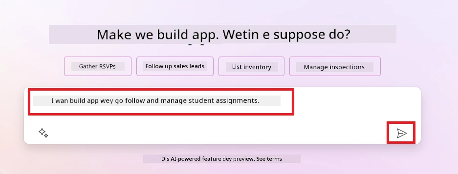

1. AI Copilot go suggest Dataverse Table with fields you need to store data wey you wan track plus sample data. You fit customize the table to fit your needs using AI Copilot assistant with talk talk steps.

   > **Important**: Dataverse na di low-code data platform wey Power Platform dey use to store app data. Na fully managed service wey dey store data for Microsoft Cloud and e dey inside your Power Platform environment. E come with built-in data governance like data classification, data lineage, fine-grained access controls and more. You fit learn more about Dataverse [here](https://learn.microsoft.com/power-apps/maker/data-platform/data-platform-intro?WT.mc_id=academic-109639-somelezediko).

   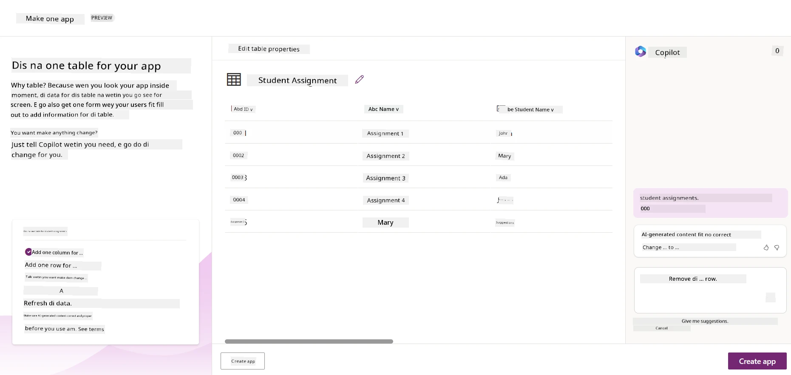

1. Educators want to send email to students wey submit their assignments to dey update dem on progress. You fit use Copilot add new field to table for student email. Like, you fit use prompt: **_I want to add column to store student email_**. Click **Send** to send prompt to AI Copilot.

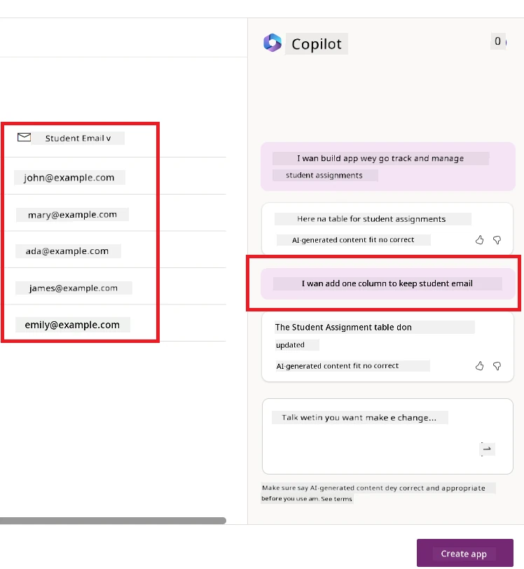

1. AI Copilot go create new field and you fit customize am make e fit your need.

1. Once you don don finish wit di table, click di **Create app** button to create di app.

1. Di AI Copilot go generate one responsive Canvas app based on wetin you talk. You fit customize di app make e meet your need.

1. For educators wey wan send emails go students, you fit use Copilot add new screen for di app. For example, you fit use dis prompt add new screen for di app: **_I want to add a screen to send emails to students_**. Click di **Send** button to send di prompt go AI Copilot.

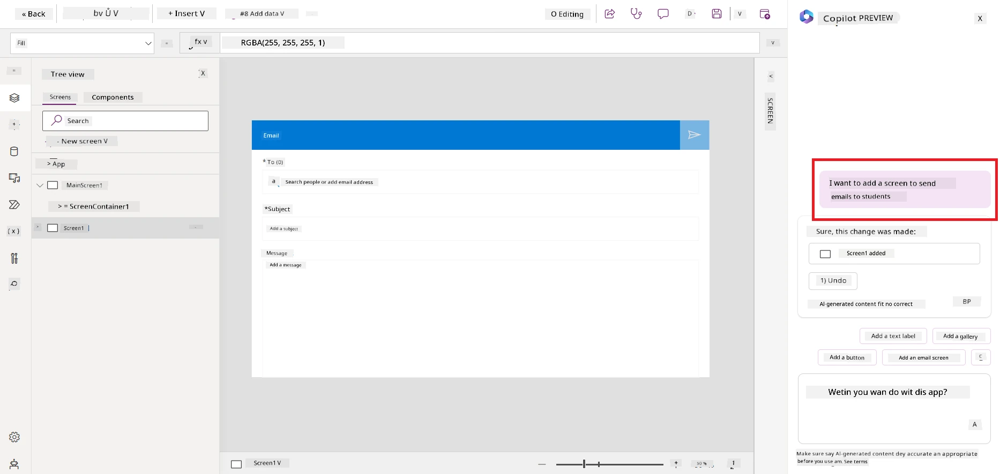

1. Di AI Copilot go generate new screen and you fit customize di screen make e meet your need.

1. Once you don finish wit di app, click di **Save** button to save di app.

1. To share di app wit di educators, click di **Share** button then click di **Share** button again. You fit share di app wit di educators by entering their email addresses.

> **Your homework**: Di app we you just build na good start but e fit beta. Wit di email feature, educators go dey send email to students by hand by typing their emails. You fit use Copilot build automation wey go make educators fit send emails to students automatically when them submit their assignments? Your hint be say wit correct prompt you fit use Copilot for Power Automate do dis.

### Build Invoices Information Table for Our Startup

Di finance team for our startup dey struggle to keep track of invoices. Dem dey use spreadsheet to track di invoices but e don hard to manage as number invoices don increase. Dem ask you to build table wey go help dem store, track and manage information of invoices wey dem dey receive. Di table go dey used to build automation wey go extract all invoice information and save am for di table. Di table go also allow di finance team see invoices wey dem don pay and those wey dem never pay.

Power Platform get one data platform wey dem dey call Dataverse wey dey under am wey go allow you store data for your apps and solutions. Dataverse na low-code data platform for storing app data. E be fully managed service wey go securely store data for Microsoft Cloud and e dey inside your Power Platform environment. E get built-in data governance features like data classification, data lineage, fine-grained access control and plenty more. You fit learn more about Dataverse [here](https://learn.microsoft.com/power-apps/maker/data-platform/data-platform-intro?WT.mc_id=academic-109639-somelezediko).

Why we suppose use Dataverse for our startup? Di standard and custom tables for Dataverse go provide secure and cloud-based storage for your data. Tables dey let you store different types data, like how person fit use many worksheets for one Excel workbook. You fit use tables store data wey be particular to your organization or business needs. Some benefits wey our startup go get from using Dataverse include but no finish for here:

- **Easy to manage**: Both metadata and data dey stored for cloud, so you no need to worry about how dem dey store or manage am. You fit focus on building your apps and solutions.

- **Secure**: Dataverse go provide secure cloud-based storage for your data. You fit control who get access to data for your tables and how dem fit access am using role based security.

- **Rich metadata**: Data types and relationships dey used directly inside Power Apps

- **Logic and validation**: You fit use business rules, calculated fields, and validation rules to enforce business logic and keep data correct.

Now wey you sabi wetin Dataverse be and why you suppose use am, make we look how you fit use Copilot create a table for Dataverse wey go satisfy our finance team requirements.

> **Note** : You go use dis table for di next section to build automation wey go extract all di invoice information and store am inside di table.

To create table for Dataverse using Copilot, follow dem steps below:

1. Go to [Power Apps](https://make.powerapps.com?WT.mc_id=academic-105485-koreyst) home screen.

2. For left navigation bar, select **Tables** then click **Describe the new Table**.

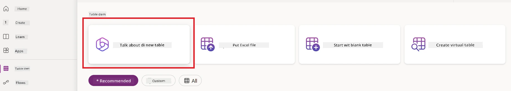

1. For **Describe the new Table** screen, use text area to describe di table we you want make. For example, **_I want to create a table to store invoice information_**. Click di **Send** button to send prompt go AI Copilot.

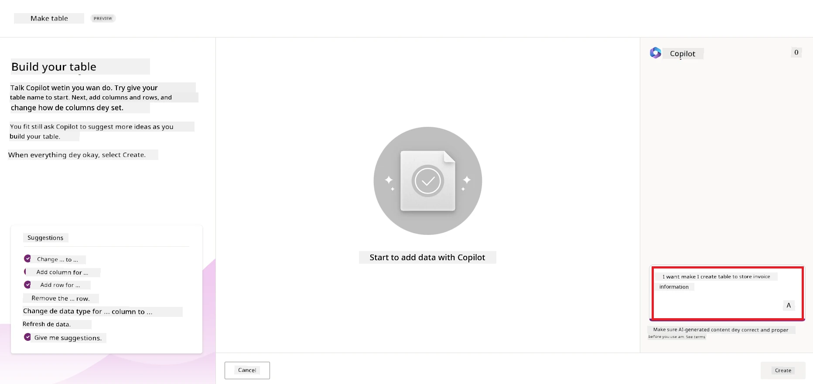

1. AI Copilot go suggest one Dataverse Table wit fields wey you need to store data wey you want track plus some sample data. You fit customize di table make e fit your needs using AI Copilot assistant through conversational steps.

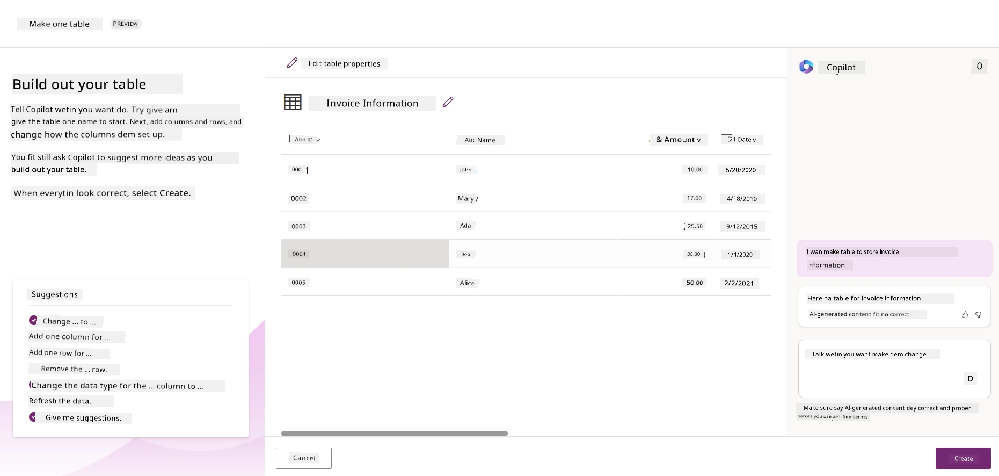

1. Di finance team want send email to di supplier to update dem about di current status of their invoice. You fit use Copilot add new field to di table to store supplier email. For example, you fit use dis prompt add new field: **_I want to add a column to store supplier email_**. Click di **Send** button to send prompt go AI Copilot.

1. AI Copilot go generate new field and you fit customize di field make e meet your needs.

1. Once you finish with di table, click di **Create** button to create di table.

## AI Models for Power Platform wit AI Builder

AI Builder na low-code AI feature wey dey Power Platform wey go allow you use AI Models to help automate processes and predict outcomes. Wit AI Builder you fit bring AI to your apps and flows wey connect to your data for Dataverse or for different cloud data sources like SharePoint, OneDrive or Azure.

## Prebuilt AI Models vs Custom AI Models

AI Builder get two kinds AI Models: Prebuilt AI Models and Custom AI Models. Prebuilt AI Models be ready-to-use AI Models wey Microsoft don train and dem dey Power Platform. Dem go help you add intelligence to your apps and flows without need to gather data and build, train and publish your own models. You fit use dem to automate processes and predict outcomes.

Some Prebuilt AI Models wey dey Power Platform include:

- **Key Phrase Extraction**: Dis model go extract key phrases from text.
- **Language Detection**: Dis model dey detect language of text.
- **Sentiment Analysis**: Dis model dey detect whether text get positive, negative, neutral, or mixed sentiment.
- **Business Card Reader**: Dis model go extract info from business cards.
- **Text Recognition**: Dis model go extract text from images.
- **Object Detection**: Dis model go detect and extract objects from images.
- **Document processing**: Dis model go extract info from forms.
- **Invoice Processing**: Dis model go extract info from invoices.

Wit Custom AI Models, you fit bring your own model enter AI Builder so e fit work like any AI Builder custom model, allow you train di model wit your own data. You fit use these models automate processes and predict outcomes for both Power Apps and Power Automate. When you dey use your own model, some limitations go apply. Read more about dis [limitations](https://learn.microsoft.com/ai-builder/byo-model#limitations?WT.mc_id=academic-105485-koreyst).

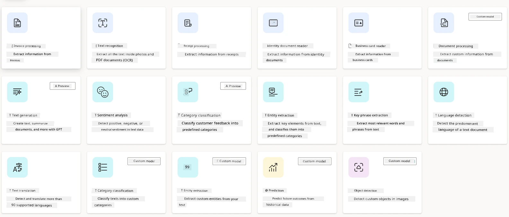

## Assignment #2 - Build Invoice Processing Flow for Our Startup

Di finance team dey struggle to process invoices. Dem dey use spreadsheet to track invoices but e don hard to manage as number of invoices don increase. Dem ask you build workflow wey fit help dem process invoices using AI. Di workflow go allow dem extract info from invoices and store di info inside Dataverse table. Di workflow go also allow dem send email to finance team with di extracted info.

Now wey you sabi wetin AI Builder be and why you suppose use am, make we look how you fit use Invoice Processing AI Model in AI Builder, wey we don tok about before, to build workflow wey go help finance team process invoices.

To build workflow wey go help finance team process invoices using Invoice Processing AI Model in AI Builder, follow di steps below:

1. Go to [Power Automate](https://make.powerautomate.com?WT.mc_id=academic-105485-koreyst) home screen.

2. Use di text area on home screen to describe di workflow wey you wan build. For example, **_Process an invoice when it arrives in my mailbox_**. Click di **Send** button to send prompt go AI Copilot.

   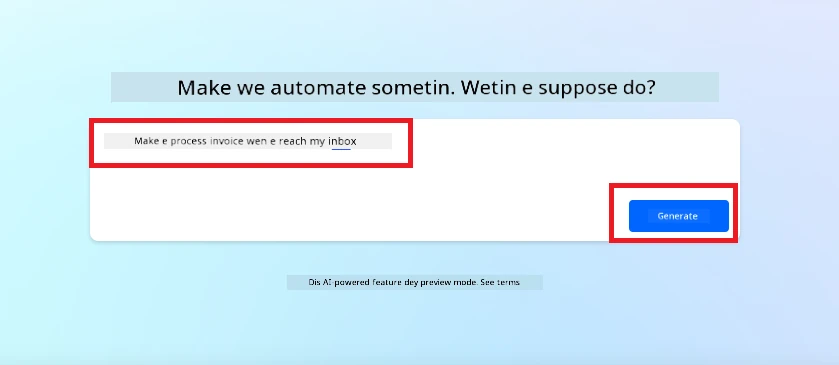

3. AI Copilot go suggest actions wey you need to do di task wey you want automate. You fit click di **Next** button to go next steps.

4. For next step, Power Automate go make you set up connections wey flow need. Once you finish, click di **Create flow** button to create di flow.

5. AI Copilot go generate flow and you fit customize di flow make e meet your needs.

6. Update di trigger of di flow and set di **Folder** to folder wey invoices go dey stored. For example, set folder to **Inbox**. Click **Show advanced options** and set **Only with Attachments** to **Yes**. Dis one go make sure flow go run only when email get attachment enter di folder.

7. Remove these actions from di flow: **HTML to text**, **Compose**, **Compose 2**, **Compose 3** and **Compose 4** because you no go use dem.

8. Remove di **Condition** action from di flow because you no go use am. E suppose look like dis screenshot:

   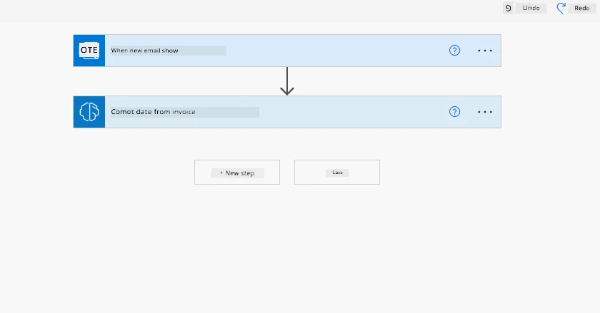

9. Click di **Add an action** button and search **Dataverse**. Select **Add a new row** action.

10. For **Extract Information from invoices** action, update **Invoice File** to point to **Attachment Content** from di email. Dis one go make sure say di flow extract info from di invoice attachment.

11. Select di **Table** wey you create earlier. For example, select **Invoice Information** table. Choose dynamic content from previous action to fill these fields:

    - ID
    - Amount
    - Date
    - Name
    - Status - Set **Status** to **Pending**.
    - Supplier Email - Use **From** dynamic content from **When a new email arrives** trigger.

    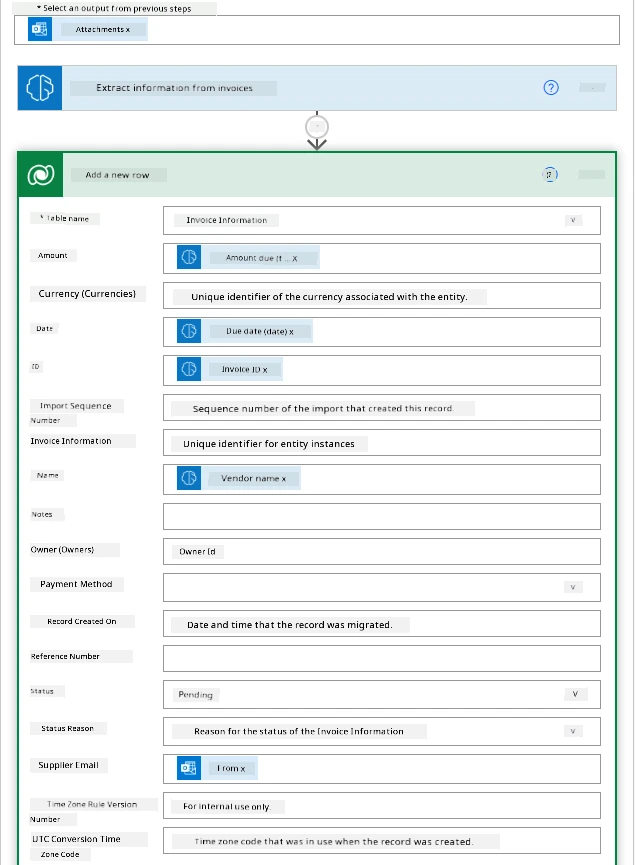

12. Once you don finish wit di flow, click **Save** button to save di flow. You fit test di flow by sending email wit invoice to di folder wey you select for trigger.

> **Your homework**: Di flow wey you just build na good start, now you suppose reason how you fit build automation wey go make our finance team fit send email to supplier to update dem about current status of their invoice. Your hint: di flow must run when status of invoice change.

## Use Text Generation AI Model in Power Automate

Di Create Text wit GPT AI Model for AI Builder go allow you generate text based on prompt and e powered by Microsoft Azure OpenAI Service. Wit dis feature, you fit put GPT (Generative Pre-Trained Transformer) technology inside your apps and flows to build different automated flows and smart applications.

GPT models dey trained well well on plenty data, so dem fit create text wey resemble human language well when dem get prompt. When you join di AI models like GPT with workflow automation, you fit use am to streamline and automate plenty different tasks.

For example, you fit build flows to automatically generate text for plenty use cases like drafts of emails, product descriptions, and more. You fit also use di model generate text for plenty apps like chatbots and customer service apps wey make customer service agents fit respond well and fast to customer questions.

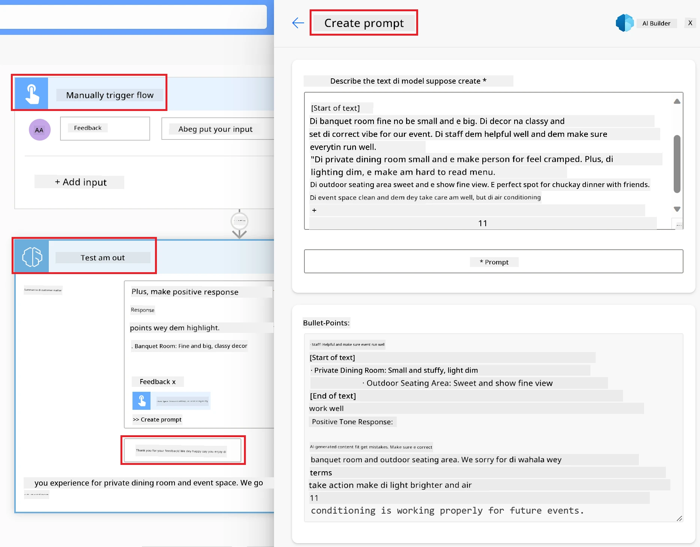

To sabi how to use dis AI Model for Power Automate, waka through di [Add intelligence with AI Builder and GPT](https://learn.microsoft.com/training/modules/ai-builder-text-generation/?WT.mc_id=academic-109639-somelezediko) module.

## Beta Work! Continue Your Learning

After you don finish dis lesson, check out our [Generative AI Learning collection](https://aka.ms/genai-collection?WT.mc_id=academic-105485-koreyst) make you continue to level up your Generative AI knowledge!

You wan customize and get more from Copilot? Check [Awesome Copilot](https://github.com/github/awesome-copilot?WT.mc_id=academic-105485-koreyst) — na community-contributed collection of instructions, agents, skills, and configurations wey go help you make the most of GitHub Copilot.

Go Lesson 11 where we go see how to [integrate Generative AI with Function Calling](../11-integrating-with-function-calling/README.md?WT.mc_id=academic-105485-koreyst)!

---

<!-- CO-OP TRANSLATOR DISCLAIMER START -->
**Disclaimer**:
Dis document don translate wit AI translation service [Co-op Translator](https://github.com/Azure/co-op-translator). Even tho we dey try make am correct, abeg make you know say automated translation fit get errors or mistakes. Di original document for dia own language na im be di correct source. For important info, make person wey sabi human translation do am. We no go responsible for any misunderstanding or wrong understanding wey fit happen because of dis translation.
<!-- CO-OP TRANSLATOR DISCLAIMER END -->