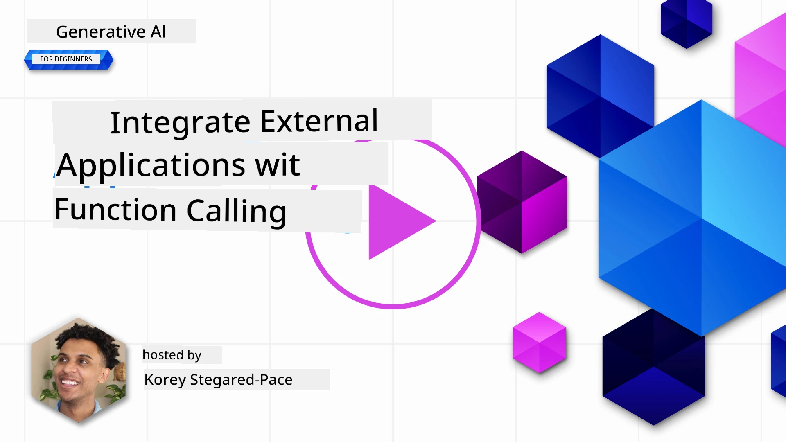
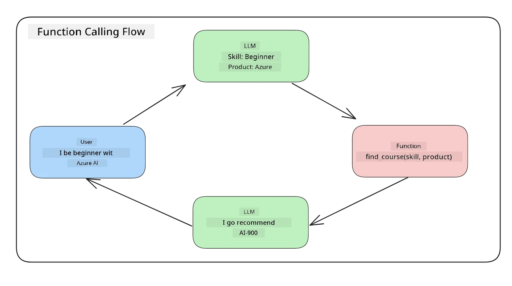
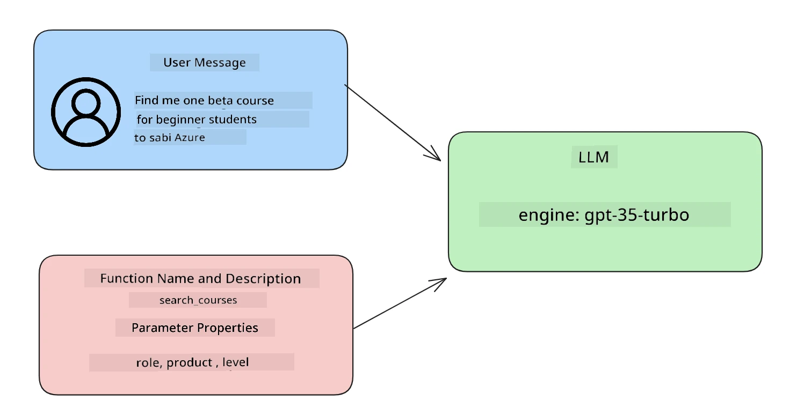

# Integrating wit function calling

[](https://youtu.be/DgUdCLX8qYQ?si=f1ouQU5HQx6F8Gl2)

You don learn beta tins so far inside di previous lessons. But, we fit improve more. Some tins we fit try solve na how we fit get one consistent response format wey go make am easy to work wit di response after. Also, we fit want add data from oda sources to make our application better.

Di problems we mention up dere na wetin dis chapter dey try solve.

## Introduction

Dis lesson go cover:

- Explain wetin function calling be and how e fit dey use.
- How to create function call wit Azure OpenAI.
- How to join function call inside application.

## Learning Goals

By di time we finish dis lesson, you go fit:

- Explain the reason why we dey use function calling.
- Setup Function Call wit Azure OpenAI Service.
- Design better function calls for your app use case.

## Scenario: Better our chatbot wit functions

For dis lesson, we wan build beta feature for our education startup weh go make users take use chatbot find technical courses. We go recommend courses wey fit dia skill level, current role and technology wey dem like.

To do dis scenario, we go use mix of:

- `Azure OpenAI` to create chat way for user.
- `Microsoft Learn Catalog API` to help users find courses based on wetin user request.
- `Function Calling` to carry user question come give function make e do API request.

Make we start, mek we look why we fit use function calling for first place:

## Why Function Calling

Before function calling, answers wey LLM give no get arrangement or consistency. Developers gats write tori validation code to fit handle each type of answer variation. Users no fit ask question like "Wetin be current weather for Stockholm?" get answer. Na becos model limits to di time data train on.

Function Calling na feature for Azure OpenAI Service to fix dis problems:

- **Consistent response format**. If we fit control response format well, e go easy to join response with oda systems later.
- **External data**. Fit use data from oda application sources inside chat.

## Show di problem wit scenario

> We advise make you use di [included notebook](./python/aoai-assignment.ipynb?WT.mc_id=academic-105485-koreyst) if you want run di below scenario. You fit just read along as we dey try show problem weh functions fit help solve.

Make we see example weh show the response format wahala:

Make we say we wan create database of student data to help give correct course suggestion. Below we get two student description wey nearly be the same for the data inside.

1. Connect to our Azure OpenAI resource:

   ```python
   import os
   import json
   from openai import OpenAI
   from dotenv import load_dotenv
   load_dotenv()

   # Di Responses API dey served from di Azure OpenAI (Microsoft Foundry) v1
   # endpoint, so we dey point di OpenAI client for <your-endpoint>/openai/v1/.
   endpoint = os.environ['AZURE_OPENAI_ENDPOINT']
   client = OpenAI(
   api_key=os.environ['AZURE_OPENAI_API_KEY'],
   base_url=f"{endpoint.rstrip('/')}/openai/v1/",
   )

   deployment=os.environ['AZURE_OPENAI_DEPLOYMENT']
   ```

   Below be some Python code to setup our connection to Azure OpenAI. Because we dey use v1 endpoint, we just need set `api_key` and `base_url` (no `api_version` needed).

1. Create two student description wen we put for variables `student_1_description` and `student_2_description`.

   ```python
   student_1_description="Emily Johnson is a sophomore majoring in computer science at Duke University. She has a 3.7 GPA. Emily is an active member of the university's Chess Club and Debate Team. She hopes to pursue a career in software engineering after graduating."

   student_2_description = "Michael Lee is a sophomore majoring in computer science at Stanford University. He has a 3.8 GPA. Michael is known for his programming skills and is an active member of the university's Robotics Club. He hopes to pursue a career in artificial intelligence after finishing his studies."
   ```

   We wan send dis student description to LLM to parse di data. Dis data fit later use inside our app or send go API or store for database.

1. Make we create two same prompts wey we hear LLM wetin info we dey look for:

   ```python
   prompt1 = f'''
   Please extract the following information from the given text and return it as a JSON object:

   name
   major
   school
   grades
   club

   This is the body of text to extract the information from:
   {student_1_description}
   '''

   prompt2 = f'''
   Please extract the following information from the given text and return it as a JSON object:

   name
   major
   school
   grades
   club

   This is the body of text to extract the information from:
   {student_2_description}
   '''
   ```

   Di prompts above tell LLM to extract info and return response inside JSON format.

1. After set prompts and connection to Azure OpenAI, we go send prompts to LLM wit `client.responses.create`. We put prompt for `input` and set role to `user`. Dis na to imitate message wey user write give chatbot.

   ```python
   # response wey come from prompt one
   openai_response1 = client.responses.create(
   model=deployment,
   input = [{'role': 'user', 'content': prompt1}],
   store=False,
   )
   openai_response1.output_text

   # response wey come from prompt two
   openai_response2 = client.responses.create(
   model=deployment,
   input = [{'role': 'user', 'content': prompt2}],
   store=False,
   )
   openai_response2.output_text
   ```

Now we fit send both requests to LLM and check the response we receive by finding am like `openai_response1.output_text`.

1. Lastly, we fit convert response go JSON format by calling `json.loads`:

   ```python
   # Dey load di response as JSON object
   json_response1 = json.loads(openai_response1.output_text)
   json_response1
   ```

   Response 1:

   ```json
   {
     "name": "Emily Johnson",
     "major": "computer science",
     "school": "Duke University",
     "grades": "3.7",
     "club": "Chess Club"
   }
   ```

   Response 2:

   ```json
   {
     "name": "Michael Lee",
     "major": "computer science",
     "school": "Stanford University",
     "grades": "3.8 GPA",
     "club": "Robotics Club"
   }
   ```

   Even tho prompts na di same and descriptions almost same, we see the `Grades` property values no format the same way, sometimes e be `3.7` or `3.7 GPA`.

   Dis result na becos LLM just dey take unstructured data form prompt and return unstructured data too. We need structured format so we know wetin dey come when we dey store or use data.

So how we go solve di formatting wahala? By using function calling, we fit make sure say we go get structured data back. When you dey use function calling, LLM no dey call nor run functions. But we go create structure for LLM to follow for e response. Then we fit use structured response know wetin function to run for app.



We fit take wetin come from function and send am back to LLM. LLM go respond wit natural language answer to user question.

## Where you fit use function calls

Plenty different ways function calls fit improve your app like:

- **Calling External Tools**. Chatbots dey good for giving answers to user questions. By using function calling, chatbots fit use user message run some tasks. For example, student fit ask chatbot to "Send email to my instructor say I need more help for this subject". E fit call function `send_email(to: string, body: string)`

- **Create API or Database Queries**. Users fit find info using natural language wey go turn to formatted query or API request. Example na teacher wey talk "Who be the students wey complete last assignment?" e fit call function `get_completed(student_name: string, assignment: int, current_status: string)`

- **Creating Structured Data**. Users fit carry text or CSV and use LLM to extract important info. Example na student fit convert Wikipedia article about peace agreements to make AI flashcards. E fit do dis with function `get_important_facts(agreement_name: string, date_signed: string, parties_involved: list)`

## How to Create Your First Function Call

Di way to create function call get 3 main steps:

1. **Call** Responses API wit list of your functions (tools) and user message.
2. **Read** model response to know to perform action like run function or API Call.
3. **Make** another call to Responses API wit response from your function to use that info create response to user.



### Step 1 - create messages

Di first step na create user message. You fit assign am dynamically by taking text input or assign am here. If dis your first time to work wit Responses API, we gats define `role` and `content` of message.

Di `role` fit be `system` (create rules), `assistant` (the model) or `user` (end-user). For function calling, we go assign am `user` wit example question.

```python
messages= [ {"role": "user", "content": "Find me a good course for a beginner student to learn Azure."} ]
```

By assigning different roles, e clear for LLM whether na system dey talk or user, e dey help build conversation history wey LLM fit build upon.

### Step 2 - create functions

Next, we go define function and e parameters. We go use one function called `search_courses` but you fit create many functions.

> **Important** : Functions dey inside system message for LLM and dem go use tokens from your available tokens.

Below, we create functions as array with items. Each item na tool for flat Responses API format, with properties `type`, `name`, `description` and `parameters`:

```python
functions = [
   {
      "type":"function",
      "name":"search_courses",
      "description":"Retrieves courses from the search index based on the parameters provided",
      "parameters":{
         "type":"object",
         "properties":{
            "role":{
               "type":"string",
               "description":"The role of the learner (i.e. developer, data scientist, student, etc.)"
            },
            "product":{
               "type":"string",
               "description":"The product that the lesson is covering (i.e. Azure, Power BI, etc.)"
            },
            "level":{
               "type":"string",
               "description":"The level of experience the learner has prior to taking the course (i.e. beginner, intermediate, advanced)"
            }
         },
         "required":[
            "role"
         ]
      }
   }
]
```

Make we explain each function instance better below:

- `name` - Di name of function we want make e call.
- `description` - Description of how function dey work. E good to clear and specific here.
- `parameters` - List of values and format wey you want model make e produce for response. Parameters get items with:
  1.  `type` - Data type where property go store inside.
  1.  `properties` - List of specific values model go use for response
      1. `name` - Key na name of property wey model go use for formatted response for example, `product`.
      1. `type` - Data type of dis property, example, `string`.
      1. `description` - Description of di specific property.

E get optional property `required` - property wey user must provide for function call complete.

### Step 3 - Make function call

After define function, now we gats put am for call to Responses API. We do am by add `tools` to request. For here na `tools=functions`.

You fit also set `tool_choice` to `auto`. Mean say we go let LLM decide which function to call base on user message no be we go assign am ourselves.

Code dey below weh we call `client.responses.create`, notice we set `tools=functions` and `tool_choice="auto"` to give LLM chance to choose when to call functions we give am:

```python
response = client.responses.create(model=deployment,
                                        input=messages,
                                        tools=functions,
                                        tool_choice="auto",
                                        store=False)

print(response.output)
```

The response we get now get `function_call` item inside `response.output` like dis:

```json
{
  "type": "function_call",
  "name": "search_courses",
  "call_id": "call_abc123",
  "arguments": "{\n  \"role\": \"student\",\n  \"product\": \"Azure\",\n  \"level\": \"beginner\"\n}"
}
```

Here we fit see how function `search_courses` call and wetin e arguments be as e show inside `arguments` property for JSON response.

The conclusion be say LLM fit find data to fit function arguments as e dey extract am from value wey we put for `input` parameter of Responses API call. Below na reminder for `messages` value:

```python
messages= [ {"role": "user", "content": "Find me a good course for a beginner student to learn Azure."} ]
```

As you fit see, `student`, `Azure` and `beginner` comot from `messages` and dem use as input for function. To use functions dis way na beta way to extract info from prompt and also provide structure for LLM to make reusable function.

Next, we go see how we fit use dis for our app.

## Join Function Calls into Application

After we don test formatted response from LLM, now we fit join am inside application.

### Manage di flow

To join am for our application, make we take dis steps:

1. First, make call to OpenAI services and extract function call items from `response.output`.

   ```python
   response_items = response.output
   tool_calls = [item for item in response_items if item.type == "function_call"]
   ```

1. Now we go define function wey go call Microsoft Learn API to get list of courses:

   ```python
   import requests

   def search_courses(role, product, level):
     url = "https://learn.microsoft.com/api/catalog/"
     params = {
        "role": role,
        "product": product,
        "level": level
     }
     response = requests.get(url, params=params)
     modules = response.json()["modules"]
     results = []
     for module in modules[:5]:
        title = module["title"]
        url = module["url"]
        results.append({"title": title, "url": url})
     return str(results)
   ```

   Notice how we create real Python function wey correspond to function names for `functions` variable. We also dey make real external API calls to fetch data. For here, we dey use Microsoft Learn API to search training modules.

Ok, so we create `functions` variable and Python function, how we talk to LLM to map dem together so Python function call go happen?

1. To know if we gats call Python function, we gats check LLM response if `function_call` dey inside and run function wey e point out. See how to do dis check below:

   ```python
   # Check if di model wan call function
   if tool_calls:
    for tool_call in tool_calls:
     print("Recommended Function call:")
     print(tool_call.name)
     print()

     # Call di function.
     function_name = tool_call.name

     available_functions = {
             "search_courses": search_courses,
     }
     function_to_call = available_functions[function_name]

     function_args = json.loads(tool_call.arguments)
     function_response = function_to_call(**function_args)

     print("Output of function call:")
     print(function_response)
     print(type(function_response))

     # Add di function call plus im result back to di conversation.
     # Di model function_call item suppose dey put before e output.
     messages.append(tool_call)  # di assistant function_call item
     messages.append( # di function result
         {
             "type": "function_call_output",
             "call_id": tool_call.call_id,
             "output": function_response,
         }
     )
   ```

   These three lines dey make sure we extract function name, arguments and run function:

   ```python
   function_to_call = available_functions[function_name]

   function_args = json.loads(tool_call.arguments)
   function_response = function_to_call(**function_args)
   ```

   Below be output from our code run:

   **Output**

   ```Recommended Function call:
   {
     "name": "search_courses",
     "arguments": "{\n  \"role\": \"student\",\n  \"product\": \"Azure\",\n  \"level\": \"beginner\"\n}"
   }

   Output of function call:
   [{'title': 'Describe concepts of cryptography', 'url': 'https://learn.microsoft.com/training/modules/describe-concepts-of-cryptography/?
   WT.mc_id=api_CatalogApi'}, {'title': 'Introduction to audio classification with TensorFlow', 'url': 'https://learn.microsoft.com/en-
   us/training/modules/intro-audio-classification-tensorflow/?WT.mc_id=api_CatalogApi'}, {'title': 'Design a Performant Data Model in Azure SQL
   Database with Azure Data Studio', 'url': 'https://learn.microsoft.com/training/modules/design-a-data-model-with-ads/?
   WT.mc_id=api_CatalogApi'}, {'title': 'Getting started with the Microsoft Cloud Adoption Framework for Azure', 'url':
   'https://learn.microsoft.com/training/modules/cloud-adoption-framework-getting-started/?WT.mc_id=api_CatalogApi'}, {'title': 'Set up the
   Rust development environment', 'url': 'https://learn.microsoft.com/training/modules/rust-set-up-environment/?WT.mc_id=api_CatalogApi'}]
   <class 'str'>
   ```

1. Now we go send updated message, `messages` go LLM so we fit get natural language response no be API JSON formatted response.

   ```python
   print("Messages in next request:")
   print(messages)
   print()

   second_response = client.responses.create(
      input=messages,
      model=deployment,
      tool_choice="auto",
      tools=functions,
      temperature=0,
      store=False,
         )  # get new response from di model wey e fit see di function response


   print(second_response.output_text)
   ```

   **Output**

   ```text
   I found some good courses for beginner students to learn Azure:

   1. [Describe concepts of cryptography](https://learn.microsoft.com/training/modules/describe-concepts-of-cryptography/?WT.mc_id=api_CatalogApi)
   2. [Introduction to audio classification with TensorFlow](https://learn.microsoft.com/training/modules/intro-audio-classification-tensorflow/?WT.mc_id=api_CatalogApi)
   3. [Design a Performant Data Model in Azure SQL Database with Azure Data Studio](https://learn.microsoft.com/training/modules/design-a-data-model-with-ads/?WT.mc_id=api_CatalogApi)
   4. [Getting started with the Microsoft Cloud Adoption Framework for Azure](https://learn.microsoft.com/training/modules/cloud-adoption-framework-getting-started/?WT.mc_id=api_CatalogApi)
   5. [Set up the Rust development environment](https://learn.microsoft.com/training/modules/rust-set-up-environment/?WT.mc_id=api_CatalogApi)

   You can click on the links to access the courses.
   ```

## Assignment

To continue your learning about Azure OpenAI Function Calling you fit build:

- More parameters for function wey fit help learners find more courses.

- Create another function call wey go take more information from the learner like their native language
- Create error handling wen the function call and/or API call no return any suitable courses

Hint: Follow the [Learn API reference documentation](https://learn.microsoft.com/training/support/catalog-api-developer-reference?WT.mc_id=academic-105485-koreyst) page to see how and where dis data dey available.

## Great Work! Continue the Journey

After you finish dis lesson, check out our [Generative AI Learning collection](https://aka.ms/genai-collection?WT.mc_id=academic-105485-koreyst) to continue to level up your Generative AI knowledge!

Head go Lesson 12, wey we go look how to [design UX for AI applications](../12-designing-ux-for-ai-applications/README.md?WT.mc_id=academic-105485-koreyst)!

---

<!-- CO-OP TRANSLATOR DISCLAIMER START -->
**Disclaimer**:
Dis document don translate wit AI translation service [Co-op Translator](https://github.com/Azure/co-op-translator). Even tho we dey try make am correct, abeg make you know say automated translation fit get errors or mistakes. Di original document for dia own language na im be di correct source. For important info, make person wey sabi human translation do am. We no go responsible for any misunderstanding or wrong understanding wey fit happen because of dis translation.
<!-- CO-OP TRANSLATOR DISCLAIMER END -->