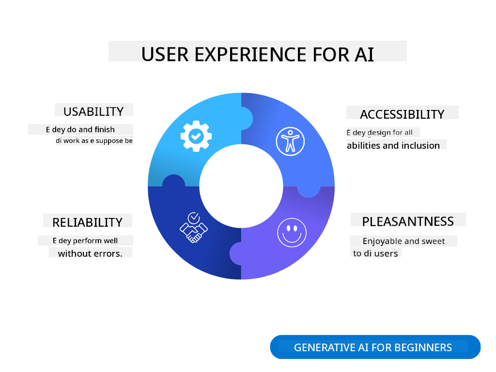

<!--
CO_OP_TRANSLATOR_METADATA:
{
  "original_hash": "78bbeed50fd4dc9fdee931f5daf98cb3",
  "translation_date": "2025-11-12T09:09:04+00:00",
  "source_file": "12-designing-ux-for-ai-applications/README.md",
  "language_code": "pcm"
}
-->
# Designing UX for AI Applications

> _(Click di image wey dey up to watch di video for dis lesson)_

Di way wey user go take use app na very important part of how you go build am. Users suppose fit use di app well well to do wetin dem wan do. E no just dey about efficiency, you go also design di app make e dey easy for everybody to use, make e _accessible_. Dis chapter go focus on dis area so you fit design app wey people go wan use and fit use.

## Introduction

User experience na di way person dey interact with and use one product or service, whether na system, tool, or design. When you dey develop AI applications, developers no dey only focus on how di user experience go dey effective, dem dey also think about ethics. For dis lesson, we go talk about how to build Artificial Intelligence (AI) applications wey go meet user needs.

Dis lesson go cover di following:

- Introduction to User Experience and Understanding User Needs
- Designing AI Applications for Trust and Transparency
- Designing AI Applications for Collaboration and Feedback

## Learning goals

After you don finish dis lesson, you go sabi:

- How to build AI applications wey go meet di user needs.
- How to design AI applications wey go promote trust and collaboration.

### Prerequisite

Take small time read more about [user experience and design thinking.](https://learn.microsoft.com/training/modules/ux-design?WT.mc_id=academic-105485-koreyst)

## Introduction to User Experience and Understanding User Needs

For our fictitious education startup, we get two main users, teachers and students. Each of dem get di kind needs wey dem want. User-centered design dey prioritize di user to make sure say di product go dey relevant and useful for di people wey e dey meant for.

Di application suppose **useful, reliable, accessible and pleasant** to give better user experience.

### Usability

To dey useful mean say di application get di kind functionality wey match wetin e suppose do, like automating grading process or generating flashcards for revision. For example, app wey dey automate grading suppose fit assign scores to students' work well well based on di criteria wey dem don set. Di same thing go for app wey dey generate flashcards; e suppose fit create relevant and diverse questions based on di data wey e get.

### Reliability

To dey reliable mean say di application go dey do wetin e suppose do well well without wahala. But AI, just like humans, no dey perfect and e fit make mistake. Di applications fit get errors or situations wey go need human intervention or correction. How you go handle errors? For di last part of dis lesson, we go talk about how AI systems and applications dey designed for collaboration and feedback.

### Accessibility

To dey accessible mean say di user experience go reach people wey get different abilities, including people wey get disabilities, so nobody go dey left out. If you follow accessibility guidelines and principles, AI solutions go dey more inclusive, usable, and useful for everybody.

### Pleasant

To dey pleasant mean say di application go dey enjoyable to use. If di user experience sweet, e go make di user wan come back to use di app again and e fit even increase business revenue.

No be every problem AI fit solve. AI dey help improve di user experience, whether na to automate manual tasks or personalize user experiences.

## Designing AI Applications for Trust and Transparency

To build trust na very important thing when you dey design AI applications. Trust dey make user sure say di application go do di work well, deliver results consistently, and di results go be wetin di user need. Di risk for dis area na mistrust and overtrust. Mistrust dey happen when user no get trust for di AI system, e go make di user reject di application. Overtrust dey happen when user dey overestimate wetin di AI system fit do, e go make di user trust di AI system too much. For example, automated grading system fit make teacher no check di papers again to confirm say di grading system dey work well. Dis fit lead to unfair or wrong grades for di students or missed opportunities for feedback and improvement.

Two ways wey you fit make sure say trust dey di center of di design na explainability and control.

### Explainability

When AI dey help make decisions like teaching future generations, e dey very important make teachers and parents understand how AI dey make di decisions. Dis na explainability - to understand how AI applications dey make decisions. To design for explainability, you go add details wey go show how AI take reach di output. People suppose sabi say na AI generate di output, no be human. For example, instead of saying "Start chatting with your tutor now," you fit say "Use AI tutor wey dey adapt to your needs and go help you learn at your pace."

Another example na how AI dey use user and personal data. For example, user wey be student fit get limitations based on di persona. Di AI fit no fit reveal answers to questions but e fit help guide di user to think how dem go solve di problem.

One last important part of explainability na to simplify di explanations. Students and teachers no be AI experts, so di explanation of wetin di application fit do or no fit do suppose dey simple and easy to understand.

### Control

Generative AI dey create collaboration between AI and di user, where user fit modify prompts to get different results. Plus, after output don generate, users suppose fit modify di results to give dem sense of control. For example, when you dey use Bing, you fit adjust your prompt based on format, tone, and length. Plus, you fit add changes to di output and modify am as e dey show below:

Another feature for Bing wey dey give user control na di ability to opt in and opt out of di data wey AI dey use. For school application, student fit wan use dia notes plus di teachers' resources as revision material.

> When you dey design AI applications, you go need intentionality to make sure say users no go overtrust di system or get unrealistic expectations of wetin e fit do. One way to do dis na to create small friction between di prompts and di results. Remind di user say na AI dey work, no be human.

## Designing AI Applications for Collaboration and Feedback

As we don talk before, generative AI dey create collaboration between di user and AI. Most times, di user go input prompt and AI go generate output. But wetin go happen if di output no correct? How di application go handle errors if dem happen? Di AI go blame di user or e go take time explain di error?

AI applications suppose dey built to receive and give feedback. Dis no just dey help di AI system improve, e dey also build trust with di users. Feedback loop suppose dey di design, example fit be simple thumbs up or down for di output.

Another way to handle dis na to clearly talk di capabilities and limitations of di system. If user make mistake request something wey dey beyond wetin di AI fit do, di application suppose get way to handle am, like di example wey dey below.

System errors dey common for applications where user fit need help with information wey dey outside di scope of di AI or di application fit get limit on how many questions/subjects user fit generate summaries. For example, AI application wey dem train with data for limited subjects like History and Math fit no fit handle questions about Geography. To solve dis, di AI system fit give response like: "Sorry, our product don train with data for di following subjects....., I no fit respond to di question wey you ask."

AI applications no dey perfect, so dem fit make mistakes. When you dey design your applications, you go need create room for feedback from users and error handling in way wey dey simple and easy to understand.

## Assignment

Take any AI apps wey you don build before, think about how you fit implement di steps wey dey below for your app:

- **Pleasant:** Think about how you fit make your app more pleasant. You dey add explanations everywhere? You dey encourage di user to explore? How you dey write your error messages?

- **Usability:** If you dey build web app, make sure say di app fit work with both mouse and keyboard.

- **Trust and transparency:** No trust di AI completely and di output wey e dey give, think about how you fit add human to di process to verify di output. Also, think and implement other ways to achieve trust and transparency.

- **Control:** Give di user control of di data wey dem dey provide to di application. Implement way wey user fit opt-in and opt-out of data collection for di AI application.

## Continue Your Learning!

After you don finish dis lesson, check out our [Generative AI Learning collection](https://aka.ms/genai-collection?WT.mc_id=academic-105485-koreyst) to continue to sabi more about Generative AI!

Go Lesson 13, where we go talk about how to [secure AI applications](../13-securing-ai-applications/README.md?WT.mc_id=academic-105485-koreyst)!

---

<!-- CO-OP TRANSLATOR DISCLAIMER START -->
**Disclaimer**:  
Dis dokyument don translate wit AI translation service [Co-op Translator](https://github.com/Azure/co-op-translator). Even as we dey try make am accurate, abeg make you sabi say machine translation fit get mistake or no dey correct well. Di original dokyument for im native language na di main source wey you go trust. For important mata, na beta make you use professional human translation. We no go fit take blame for any misunderstanding or wrong interpretation wey fit happen because you use dis translation.
<!-- CO-OP TRANSLATOR DISCLAIMER END -->