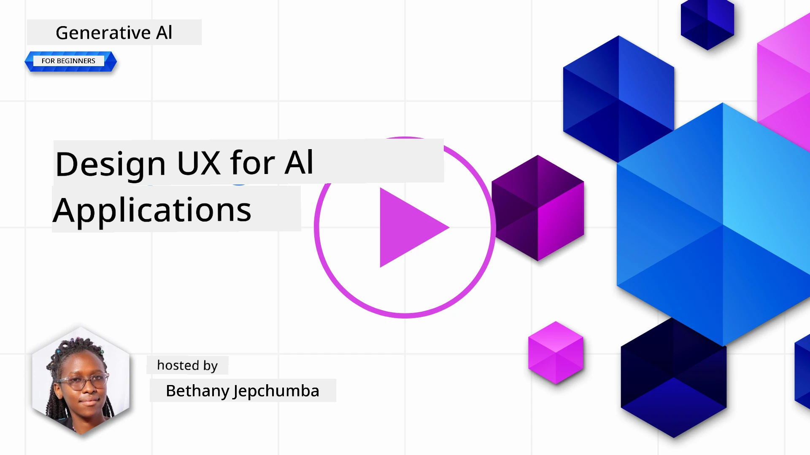
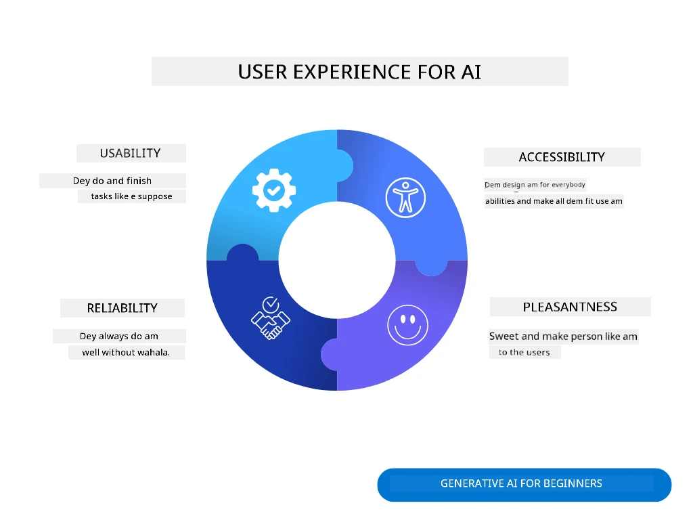
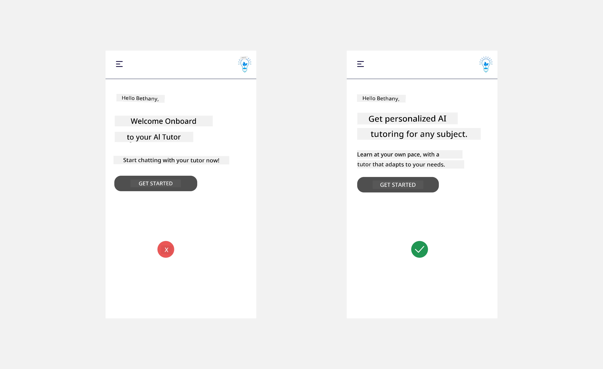
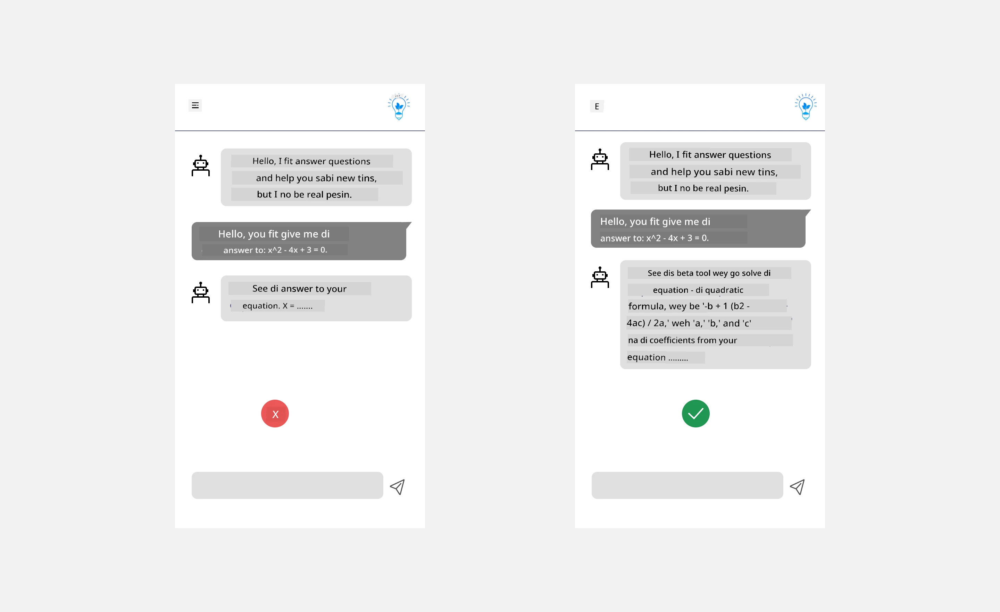
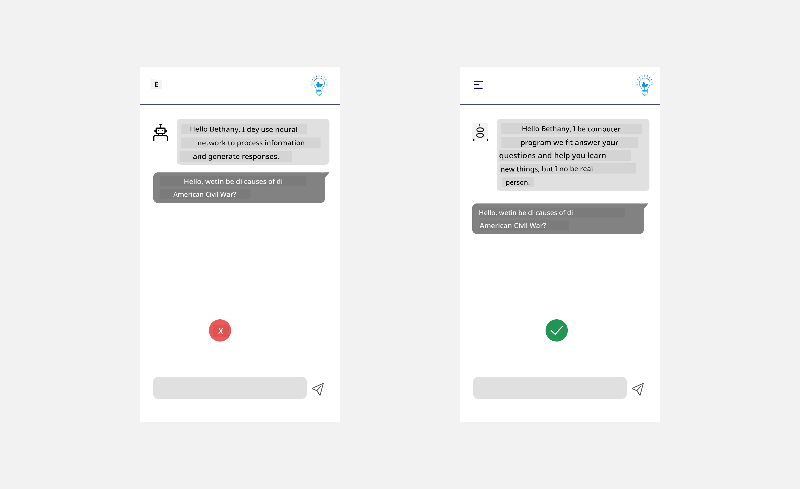
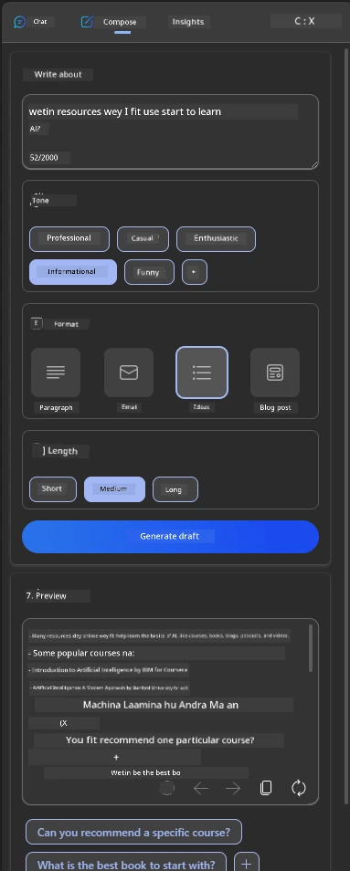
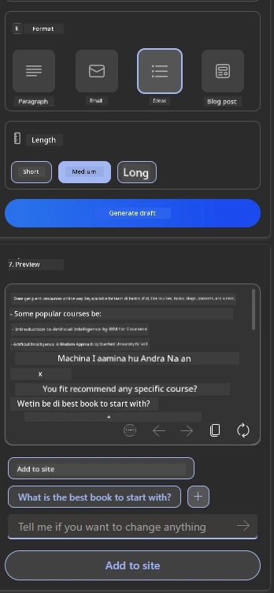
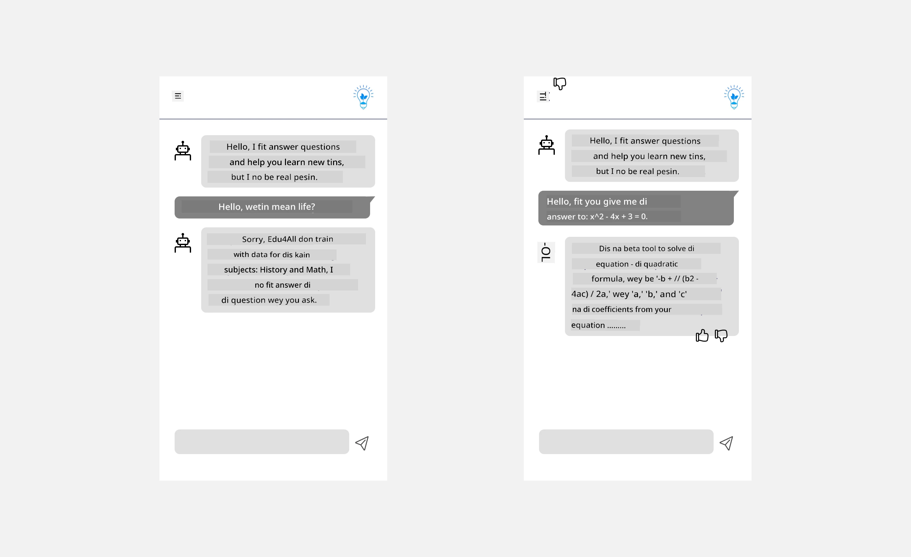

# Designing UX for AI Applications

> _(Click di bild we dey above to watch video for dis lesson)_

User experience na one very important tin for building apps. Users need make dem fit use your app well to do things. To dey efficient na one mata but you sef need design apps so dat everybody fit use am, make e dey _accessible_. Dis chapter go focus on dis area so you go fit design app wey people fit and wan use.

## Introduction

User experience na how person take interact wit and use one particular product or service like system, tool, or design. When people dey make AI applications, dem no go just focus to make user experience effective but make e sef be ethical. For dis lesson, we go talk how to build Artificial Intelligence (AI) applications wey dey meet user needs.

Dis lesson go cover dis kain tins:

- Introduction to User Experience and Understanding User Needs
- Designing AI Applications for Trust and Transparency
- Designing AI Applications for Collaboration and Feedback

## Learning goals

After you don take dis lesson, you go fit:

- Understand how to build AI applications wey go meet user needs.
- Design AI applications wey go promote trust and collaboration.

### Prerequisite

Take some time read more about [user experience and design thinking.](https://learn.microsoft.com/training/modules/ux-design?WT.mc_id=academic-105485-koreyst)

## Introduction to User Experience and Understanding User Needs

For our fake education startup, we get two main users, teachers and students. Each user get their own special needs. User-centered design na to put user first make sure say products dey relevant and good for the people wey dem make am for.

The application suppose be **useful, reliable, accessible and pleasant** to give good user experience.

### Usability

To be useful mean say the app get work wey match di purpose, like to automate grading process or to generate flashcards for revision. One app wey dey automate grading suppose fit assign correct scores to students work based on criteria wey dem set before. Like-wise, one app wey dey generate revision flashcards suppose fit create correct and different questions from the data.

### Reliability

To be reliable mean say the app fit do e work steady steady without wahala. But, AI be like humans -- e no perfect and fit make mistake. The apps fit get error or come face wahala wey need human hand to fix am. How you go take handle errors? For last part of dis lesson, we go tok how AI systems and applications dey designed for collaboration and feedback.

### Accessibility

To be accessible mean say you go extend the user experience to users wey get different abilities, including people wey get disabilities, make sure say no pesin go left out. If you follow accessibility rules and principles, AI go dey more inclusive, easy to use, and good for everybody.

### Pleasant

To be pleasant mean say the app go sweet to use. One better user experience fit make user want come back again and e fit increase business money.

No be all problem dem fit solve with AI. AI dey come to support your user experience, whether na to automate manual work, or to personalize user experiences.

## Designing AI Applications for Trust and Transparency

To build trust na very important tin when you dey design AI applications. Trust mean say user get confidence say the app go do the work, go dey consistent with results and na di kind result wey user need. One risk for dis area na mistrust and overtrust. Mistrust na wen user no trust AI system at all, e fit make user reject your app. Overtrust na wen user overrate wetin AI system fit do, e fit make user trust AI system too much. Like automated grading system if user overtrust, teacher fit no want check some papers to see if grading system work well. Dis fit cause wrong or unfair grades for students or lose chance for feedback and improvement.

Two ways to make sure say trust dey important for design be explainability and control.

### Explainability

When AI dey help decision making like to teach children, e important make teachers and parents understand how AI make decisions. Dis na explainability - to understand how AI applications make decision. Designing for explainability mean to add details wey show how AI land for the answer. Audience go sabi say na AI generate the output no be human. Example, instead of say "Start chatting with your tutor now" you fit talk "Use AI tutor wey dey adjust to your needs and help you learn at your own pace."

Another example na how AI dey use user and personal data. For example, one user wey get persona student fit get limitation based on the persona. AI no fit just give answer to every question but fit guide the user how to reason the problem.

One last penting part for explainability na to make explanation simple. Students and teachers no be AI experts, so explanation of wetin app fit do or no fit do suppose dey simple and easy to understand.

### Control

Generative AI dey create collaboration between AI and user, where user fit change prompts to get different results. After output don come, users suppose fit change am to get control. Like when you dey use Microsoft Copilot (wey dem bin dey call Bing Chat), you fit adjust your prompt based on format, tone and length. You fit also add changes to output and modify am like dis:

Another feature for Microsoft Copilot wey give user control na to fit opt in or opt out of the data wey AI dey use. For school app, student fit want use their notes plus teachers resources as revision materials.

> When you dey design AI applications, make sure say you dey intentional to stop users from overtrust, no to set unrealistic hopes for wetin e fit do. One way to do this na to create some small wahala between prompts and results. Remind user say dis na AI no be person.

## Designing AI Applications for Collaboration and Feedback

Like we talk before, generative AI dey create collaboration between user and AI. Most times, user go put prompt and AI go give output. If output no correct, how app go handle errors? AI go blame user or e go try explain error?

AI applications suppose dey built to receive and give feedback. Dis no only help AI system improve but go build trust with users. Feedback loop suppose dey for design, fit be simple thumbs up or down for output.

Another way to handle dis na to tok clearly about capabilities and limits of system. If user ask for something wey pass AI capability, suppose get way to handle am like dis below.

System errors dey happen for apps where user fit need info wey no dey for AI or app get limit on how many questions or subjects user fit generate summaries from. Like for example, AI app wey training data only get History and Math no fit answer Geography questions. To solve dis, AI system fit talk say: "Sorry, our product don train on these subjects....., I no fit answer your question."

AI apps no perfect, so dem go make mistakes. When you dey design your apps, make sure say you create space for user feedback and easy way to handle errors wey easy to explain.

## Assignment

Take any AI apps wey you don build so far, think about how you fit do below steps for your app:

- **Pleasant:** Think how you fit make your app more pleasant. You dey add explanations everywhere? You dey encourage user to explore? How you dey talk your error messages?

- **Usability:** If you dey build web app. Make sure say both mouse and keyboard fit navigate your app.

- **Trust and transparency:** No just trust AI and output fully, think how you go fit add human to check output. Also think about other ways to get trust and transparency.

- **Control:** Make user get control of data wey dem give app. Make way for user to opt-in or opt-out of data collection in AI app.

<!-- ## [Post-lecture quiz](../../../12-designing-ux-for-ai-applications/quiz-url) -->

## Continue Your Learning!

After you finish dis lesson, check our [Generative AI Learning collection](https://aka.ms/genai-collection?WT.mc_id=academic-105485-koreyst) to continue to sabi more about Generative AI!

Go Lesson 13 next, where we go see how to [secure AI applications](../13-securing-ai-applications/README.md?WT.mc_id=academic-105485-koreyst)!

---

<!-- CO-OP TRANSLATOR DISCLAIMER START -->
**Disclaimer**:
Dis document don translate wit AI translation service [Co-op Translator](https://github.com/Azure/co-op-translator). Even tho we dey try make am correct, abeg make you know say automated translation fit get errors or mistakes. Di original document for dia own language na im be di correct source. For important info, make person wey sabi human translation do am. We no go responsible for any misunderstanding or wrong understanding wey fit happen because of dis translation.
<!-- CO-OP TRANSLATOR DISCLAIMER END -->