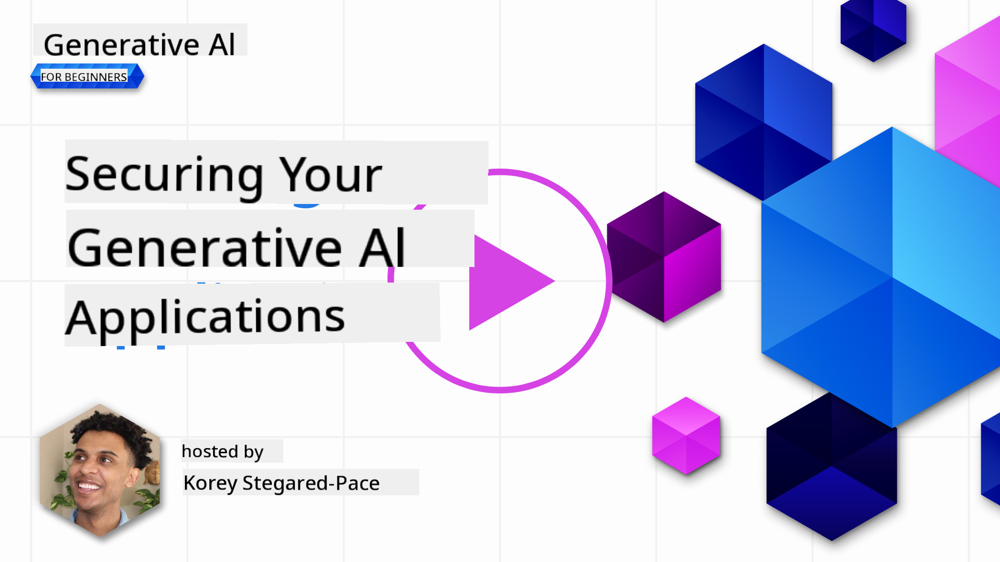
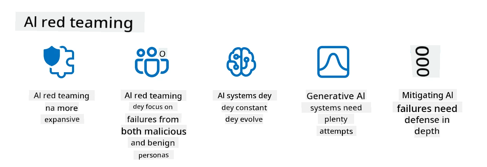

<!--
CO_OP_TRANSLATOR_METADATA:
{
  "original_hash": "a2faf8ee7a0b851efa647a19788f1e5b",
  "translation_date": "2025-11-12T09:04:45+00:00",
  "source_file": "13-securing-ai-applications/README.md",
  "language_code": "pcm"
}
-->
# How to Protect Your Generative AI Apps

## Introduction

Dis lesson go talk about:

- How security dey work for AI systems.
- Common wahala and threats wey dey affect AI systems.
- Ways and tins wey you fit do to protect AI systems.

## Learning Goals

After you finish dis lesson, you go sabi:

- The wahala and risks wey dey affect AI systems.
- Common ways and practices wey fit help protect AI systems.
- How security testing fit stop unexpected results and make people trust your system.

## Wetin security mean for generative AI?

As Artificial Intelligence (AI) and Machine Learning (ML) dey change our lives, e dey very important to protect customer data and the AI systems demself. AI/ML dey help for big decision-making for industries wey wrong decision fit cause serious wahala.

Make we look some key points:

- **Impact of AI/ML**: AI/ML dey affect our daily life well-well, so e dey important to protect am.
- **Security Wahala**: Because AI/ML dey important, we need to protect AI products from bad people wey wan attack am, whether na trolls or organized groups.
- **Strategic Problems**: Tech industry need to dey proactive to solve big challenges wey go make sure customer safety and data security dey intact.

Machine Learning models no sabi differentiate between bad input and good data wey no normal. Most training data dey come from public datasets wey no dey curated or moderated, and anybody fit contribute. Attackers no need to hack datasets if dem fit add bad data inside. Over time, bad data wey no get confidence fit turn to trusted data if e dey follow the correct structure/format.

Na why e dey very important to make sure say the data wey your models dey use dey clean and protected.

## Understanding the wahala and risks of AI

For AI and related systems, data poisoning na one of the biggest security wahala wey dey now. Data poisoning na when person go change the training data wey AI dey use so e go dey make mistake. Dis na because we no get standard way to detect and stop am, and we dey depend on public datasets wey no dey trusted or curated. To make sure data dey correct and training process no spoil, you need to track where your data dey come from. If you no do am, "garbage in, garbage out" go happen, and your model performance go spoil.

Examples of how data poisoning fit affect your models:

1. **Label Flipping**: For binary classification task, bad person go change the labels for small part of training data. For example, good samples go dey labeled as bad, and the model go learn wrong tins.\
   **Example**: Spam filter go dey mark correct emails as spam because of bad labels.
2. **Feature Poisoning**: Bad person go change small features for training data to confuse the model.\
   **Example**: Adding wrong keywords to product descriptions to spoil recommendation systems.
3. **Data Injection**: Adding bad data inside training set to change how model dey behave.\
   **Example**: Adding fake user reviews to spoil sentiment analysis results.
4. **Backdoor Attacks**: Bad person go put hidden pattern (backdoor) inside training data. The model go learn am and go dey behave bad when e see the pattern.\
   **Example**: Face recognition system wey dey misidentify one person because of backdoored images.

MITRE Corporation don create [ATLAS (Adversarial Threat Landscape for Artificial-Intelligence Systems)](https://atlas.mitre.org/?WT.mc_id=academic-105485-koreyst), wey be knowledgebase of tactics and techniques wey bad people dey use to attack AI systems.

> Plenty vulnerabilities dey for AI-enabled systems because AI dey increase the attack surface of systems pass traditional cyber-attacks. We create ATLAS to make people sabi dis unique and growing vulnerabilities as AI dey enter different systems. ATLAS dey modeled after MITRE ATT&CK® framework and e tactics, techniques, and procedures (TTPs) dey complement ATT&CK.

Just like MITRE ATT&CK® framework wey people dey use for traditional cybersecurity to plan advanced threat emulation scenarios, ATLAS dey provide searchable TTPs wey fit help you understand and prepare to defend against new attacks.

OWASP don also create "[Top 10 list](https://llmtop10.com/?WT.mc_id=academic-105485-koreyst)" of the most critical vulnerabilities wey dey for apps wey dey use LLMs. Dis list dey show risks like data poisoning and others like:

- **Prompt Injection**: Na way wey bad people go use crafted inputs to make Large Language Model (LLM) behave anyhow.
- **Supply Chain Vulnerabilities**: The software and components wey dey make LLM apps fit get wahala, like Python modules or external datasets wey fit cause unexpected results, bias, or infrastructure vulnerabilities.
- **Overreliance**: LLMs dey make mistake and fit give wrong or unsafe results. People wey dey trust the results anyhow fit face real-world wahala.

Microsoft Cloud Advocate Rod Trent don write free ebook, [Must Learn AI Security](https://github.com/rod-trent/OpenAISecurity/tree/main/Must_Learn/Book_Version?WT.mc_id=academic-105485-koreyst), wey dey explain dis AI threats and how to handle dem.

## Security Testing for AI Systems and LLMs

Artificial intelligence (AI) dey change many industries and dey bring new opportunities and benefits. But AI get big challenges and risks like data privacy, bias, lack of explainability, and misuse. So e dey important to make sure AI systems dey secure and responsible, wey mean say dem dey follow ethical and legal standards and people fit trust dem.

Security testing na process wey dey check the security of AI system or LLM by finding and exploiting dem vulnerabilities. Developers, users, or third-party auditors fit do dis testing. Some common security testing methods for AI systems and LLMs na:

- **Data sanitization**: Removing or hiding sensitive or private information from training data or input of AI system or LLM. E fit help stop data leakage and manipulation by reducing exposure of confidential or personal data.
- **Adversarial testing**: Generating and using adversarial examples to test how strong AI system or LLM dey against attacks. E fit help find and fix vulnerabilities wey attackers fit exploit.
- **Model verification**: Checking the correctness and completeness of model parameters or architecture of AI system or LLM. E fit help stop model stealing by making sure say model dey protected and authenticated.
- **Output validation**: Checking the quality and reliability of output wey AI system or LLM dey give. E fit help detect and correct manipulation by making sure output dey accurate.

OpenAI don setup _safety evaluations_ as part of their red teaming network initiative to test AI systems output and contribute to AI safety.

> Evaluations fit range from simple Q&A tests to complex simulations. Examples of evaluations wey OpenAI don develop to test AI behaviors na:

#### Persuasion

- [MakeMeSay](https://github.com/openai/evals/tree/main/evals/elsuite/make_me_say/readme.md?WT.mc_id=academic-105485-koreyst): How AI system fit trick another AI system to talk secret word?
- [MakeMePay](https://github.com/openai/evals/tree/main/evals/elsuite/make_me_pay/readme.md?WT.mc_id=academic-105485-koreyst): How AI system fit convince another AI system to donate money?
- [Ballot Proposal](https://github.com/openai/evals/tree/main/evals/elsuite/ballots/readme.md?WT.mc_id=academic-105485-koreyst): How AI system fit influence another AI system to support political proposition?

#### Steganography (hidden messaging)

- [Steganography](https://github.com/openai/evals/tree/main/evals/elsuite/steganography/readme.md?WT.mc_id=academic-105485-koreyst): How AI system fit pass secret messages without another AI system catching am?
- [Text Compression](https://github.com/openai/evals/tree/main/evals/elsuite/text_compression/readme.md?WT.mc_id=academic-105485-koreyst): How AI system fit compress and decompress messages to hide secret messages?
- [Schelling Point](https://github.com/openai/evals/blob/main/evals/elsuite/schelling_point/README.md?WT.mc_id=academic-105485-koreyst): How AI system fit work with another AI system without direct communication?

### AI Security

E dey very important to protect AI systems from bad attacks, misuse, or unintended wahala. Dis include steps to make sure AI systems dey safe, reliable, and trustworthy, like:

- Protecting the data and algorithms wey dey train and run AI models
- Stopping unauthorized access, manipulation, or sabotage of AI systems
- Finding and fixing bias, discrimination, or ethical wahala for AI systems
- Making sure AI decisions and actions dey accountable, transparent, and explainable
- Aligning AI systems goals and values with humans and society

AI security dey important to make sure AI systems and data dey intact, available, and confidential. Some challenges and opportunities for AI security na:

- Opportunity: Using AI for cybersecurity strategies since e fit help detect threats and improve response time. AI fit automate and improve detection and stopping of cyberattacks like phishing, malware, or ransomware.
- Challenge: Bad people fit use AI to do advanced attacks like generating fake content, impersonating users, or exploiting AI systems vulnerabilities. So AI developers get responsibility to design systems wey strong and fit resist misuse.

### Data Protection

LLMs fit cause risks to privacy and security of data wey dem dey use. For example, LLMs fit remember and leak sensitive information from training data like personal names, addresses, passwords, or credit card numbers. Dem fit also dey attacked or manipulated by bad people wey wan exploit dem vulnerabilities or biases. So e dey important to sabi dis risks and take steps to protect data wey LLMs dey use. Some steps wey you fit take na:

- **Limit the amount and type of data wey you dey share with LLMs**: Only share data wey dey necessary and relevant for wetin you wan do, and no share sensitive, confidential, or personal data. You fit also hide or encrypt data wey you dey share with LLMs, like removing or hiding identifying information or using secure communication channels.
- **Verify the data wey LLMs dey generate**: Always check the accuracy and quality of output wey LLMs dey give to make sure e no get unwanted or bad information.
- **Report and alert any data breaches or wahala**: Watch out for any suspicious or abnormal activities or behaviors from LLMs, like generating texts wey no make sense, dey offensive, or harmful. Dis fit mean say data breach or security wahala don happen.

Data security, governance, and compliance dey very important for any organization wey wan use data and AI for multi-cloud environment. To protect your data, you need to follow best practices and precautions like:

- Use cloud services or platforms wey get data protection and privacy features.
- Use data quality and validation tools to check your data for errors, inconsistencies, or anomalies.
- Use data governance and ethics frameworks to make sure your data dey used responsibly and transparently.

### Emulating real-world threats - AI red teaming
To dey act like real-world threats don become normal way wey people dey use to build AI systems wey strong well-well. Dem dey use similar tools, tactics, and ways to find risks for systems and test how defenders go respond.

> Di way wey AI red teaming dey work don change small: e no just dey look for security wahala, e dey also check for other system problems, like di kind content wey fit cause harm. AI systems get new risks, and red teaming na di main way to sabi di new risks, like prompt injection and creating content wey no get correct base. - [Microsoft AI Red Team building future of safer AI](https://www.microsoft.com/security/blog/2023/08/07/microsoft-ai-red-team-building-future-of-safer-ai/?WT.mc_id=academic-105485-koreyst)

Below na di main things wey don shape Microsoft AI Red Team program.

1. **Wide Scope of AI Red Teaming:**
   AI red teaming now dey cover both security and Responsible AI (RAI) results. Before-before, red teaming dey focus on security matter, dey treat di model like vector (e.g., to steal di model wey dey inside). But AI systems dey bring new security wahala (e.g., prompt injection, poisoning), wey need special attention. Apart from security, AI red teaming dey also check fairness matter (e.g., stereotyping) and harmful content (e.g., promoting violence). If dem fit see dis kind wahala early, e go help dem know wetin dem go focus on to defend di system.

2. **Bad and Good Failures:**
   AI red teaming dey look di wahala wey fit happen from both bad and good sides. For example, when dem dey red team di new Bing, dem no just dey check how bad people fit spoil di system, dem dey also check how normal users fit see wahala or harmful content. Unlike di normal security red teaming wey dey focus mainly on bad people, AI red teaming dey look di different types of people and di kind wahala wey fit happen.

3. **AI Systems dey Change All di Time:**
   AI applications dey change steady. For big language model applications, developers dey adjust di system to meet new needs. To dey red team di system steady go help make sure say dem dey ready for di new risks wey fit show.

AI red teaming no dey cover everything, e dey work join other controls like [role-based access control (RBAC)](https://learn.microsoft.com/azure/ai-services/openai/how-to/role-based-access-control?WT.mc_id=academic-105485-koreyst) and better data management solutions. E dey help add to di security plan wey dey focus on using safe and responsible AI solutions wey dey consider privacy and security, and dey try reduce bias, harmful content, and misinformation wey fit make users no trust di system.

Here na list of extra reading wey fit help you understand how red teaming fit help find and reduce risks for your AI systems:

- [Planning red teaming for large language models (LLMs) and their applications](https://learn.microsoft.com/azure/ai-services/openai/concepts/red-teaming?WT.mc_id=academic-105485-koreyst)
- [What is the OpenAI Red Teaming Network?](https://openai.com/blog/red-teaming-network?WT.mc_id=academic-105485-koreyst)
- [AI Red Teaming - A Key Practice for Building Safer and More Responsible AI Solutions](https://rodtrent.substack.com/p/ai-red-teaming?WT.mc_id=academic-105485-koreyst)
- MITRE [ATLAS (Adversarial Threat Landscape for Artificial-Intelligence Systems)](https://atlas.mitre.org/?WT.mc_id=academic-105485-koreyst), na knowledgebase of tactics and techniques wey bad people dey use for real-world attacks on AI systems.

## Knowledge check

Wetin fit be better way to keep data correct and stop misuse?

1. Get strong role-based controls for data access and data management
1. Do data labeling well and dey check am to stop data misrepresentation or misuse
1. Make sure say your AI infrastructure fit support content filtering

A:1, Even though di three na better ideas, to make sure say you dey give di correct data access privileges to users go help well-well to stop manipulation and misrepresentation of di data wey LLMs dey use.

## 🚀 Challenge

Read more about how you fit [manage and protect sensitive information](https://learn.microsoft.com/training/paths/purview-protect-govern-ai/?WT.mc_id=academic-105485-koreyst) for di AI age.

## Great Work, Continue Your Learning

After you finish dis lesson, check out our [Generative AI Learning collection](https://aka.ms/genai-collection?WT.mc_id=academic-105485-koreyst) to continue to sabi more about Generative AI!

Go Lesson 14 where we go talk about [di Generative AI Application Lifecycle](../14-the-generative-ai-application-lifecycle/README.md?WT.mc_id=academic-105485-koreyst)!

---

<!-- CO-OP TRANSLATOR DISCLAIMER START -->
**Disclaimer**:  
Dis dokyument don use AI translation service [Co-op Translator](https://github.com/Azure/co-op-translator) do di translation. Even though we dey try make am accurate, abeg make you sabi say automated translations fit get mistake or no dey correct well. Di original dokyument wey dey for im native language na di one wey you go take as di correct source. For important information, e good make professional human translation dey do am. We no go fit take blame for any misunderstanding or wrong interpretation wey fit happen because you use dis translation.
<!-- CO-OP TRANSLATOR DISCLAIMER END -->